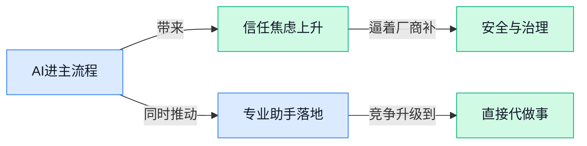

## AI资讯日报 2026/4/14

> AI 早报 · 每日早读 · 全网深度聚合

## **今日摘要**

```
Anthropic 连出三拳，Project Glasswing死盯软件安全、收购Vercept强化Claude电脑操作、Claude打通三大Office应用
OpenAI 双线突袭，备忘录曝光新模型Spud将拉升全线产品，又收购Hiro杀入“个人AI CFO”赛道
Google 一边给Ultra用户免费放开Veo 3.1 Lite不扣点数，一边在华盛顿组局AI for the Economy Forum拉齐政商学界
```

### 🔵 产品与功能更新

1. **Anthropic 推出 Project Glasswing，瞄准 AI 时代关键软件安全。**
Anthropic 公布了 **Project Glasswing**，核心方向是加强**关键软件**在 AI 时代的安全保障，明显是在为更高风险、更核心的系统使用场景提前打底 🛡️。从标题信息看，这不是单纯聊模型能力，而是把重点放在**软件安全**和**基础设施可信性**上，对企业和政府类用户尤其关键。对不懂技术的同事来说，可以把它理解成：AI 越深入业务主系统，安全就越不能“事后补救”，必须一开始就纳入设计。可查看 [Anthropic 项目说明(briefing)](https://news.google.com/rss/articles/CBMiS0FVX3lxTFBfQUdtMDZYaEtZV0JMSk1ZSzdqTl9mV3dQTnZYcVEzaHo4cV8yUEl2a25QMWRXenFTYUQ3NF9WakR5WXVwaDRTZC1ZYw?oc=5)

2. **OpenAI 泄露备忘录称新模型“Spud”将显著提升全线产品。**
据报道，OpenAI 一份**泄露备忘录**提到，一个代号为 **Spud** 的新模型有望让其“所有产品都变得明显更好” 🚀。这类表述通常意味着它不只是某个单点功能升级，而可能是面向多个产品线的底层能力增强。对业务团队来说，值得关注的不只是新名字，而是它可能带来的**统一体验提升**：例如更稳定、更聪明或更好用的整体表现。更多内容见 [泄露备忘录报道(briefing)](https://the-decoder.com/openais-leaked-memo-says-new-spud-model-will-make-all-its-products-significantly-better/)

3. **Claude 现已打通三大 Office 办公应用。**
Anthropic 宣布，**Claude** 现在可以跨三大 **Office 办公应用**协同工作，这意味着它离“真正能帮人处理日常办公”的助手又近了一步 💼。对普通公司同事来说，这种更新的价值非常直接：不再只是聊天问答，而是更深入地进入文档、表格、演示等真实办公流程。它的意义在于把 AI 从“旁边给建议”推进到“直接参与工作流”，对写材料、整理数据、做汇报的人尤其友好。详情可看 [Claude 办公集成报道(briefing)](https://the-decoder.com/claude-now-works-across-all-three-major-office-apps/)

4. **新模型可用一张照片生成 45 分钟口型同步视频，还能实时运行。**
一款新 **AI 视频模型**据称只需**一张照片**，就能生成最长 **45 分钟**、且**口型同步**的视频，甚至支持**实时运行**，听起来很适合数字人和虚拟主播场景 😮。相比以往很多“能动但不自然”的方案，这类能力的重点在于持续时长和同步效果，意味着可用性正在上一个台阶。对市场、客服、教育培训等团队来说，这类技术一旦成熟，可能会显著降低视频内容制作门槛。相关信息见 [视频模型完整报道(briefing)](https://the-decoder.com/new-ai-model-generates-45-minute-lip-synced-video-from-one-photo-and-runs-in-real-time/)

5. **Google 向 Ultra 订阅用户开放 Veo 3.1 Lite 视频生成，且不额外扣点数。**
Google 正在向 **Ultra 订阅**用户提供 **Veo 3.1 Lite** 的视频生成功能，而且**不额外消耗积分**，这相当于直接降低了试用和日常使用门槛 🎬。对普通用户和内容团队来说，最实际的变化不是参数有多强，而是“更容易随手用起来”——成本心理门槛一下就低了。Google 这一步也反映出一个趋势：AI 视频能力正在从“稀缺高价体验”走向更普及的产品化服务。详情见 [Google 视频功能更新(briefing)](https://the-decoder.com/google-now-offers-ultra-subscribers-video-generation-with-veo-3-1-lite-at-no-extra-credit-cost/)

### 🟢 前沿研究

1. **SPEED-Bench 想给推测解码做一套统一评测尺子。**
这篇工作聚焦 **Speculative Decoding（推测解码，一种先用小模型“打草稿”再由大模型验证、用来加速生成的方法）**，提出了名为 **SPEED-Bench** 的统一基准，用来更系统地比较不同方案的表现 📏。对业务同学来说，这类研究的意义在于：未来大家讨论模型“快不快、稳不稳”时，可能会有更可比的标准，而不是各说各话。当前公开信息主要是论文条目本身，适合先把它记作一项面向**生成加速评测**的基础研究。[论文条目页(briefing)](https://huggingface.co/papers/2604.09557)

2. **手机 GUI Agent 开始研究“按你的隐私偏好办事”。**
这篇论文关注 **Mobile GUI Agent（手机图形界面 Agent，能直接操作 App 按钮、页面和流程的智能体）** 的**隐私个性化**问题，方法名叫 **Trajectory Induced Preference Optimization（基于操作轨迹诱导偏好优化）** 🔐。说白了，就是希望 Agent 不只是会完成任务，还能学会更贴近不同用户对隐私的容忍度与选择习惯。对于面向 C 端产品的团队，这类方向很值得关注，因为手机端 Agent 真正落地时，**个性化**和**隐私边界**很可能会比“会不会点按钮”更关键。[论文条目页(briefing)](https://huggingface.co/papers/2604.11259)

3. **Introspective Diffusion Language Models 试图补上扩散语言模型的“自我一致性”短板。**
这项研究讨论 **Diffusion Language Models（扩散语言模型，一类通过逐步去噪来生成内容的模型）** 为什么在质量上仍落后于传统逐词生成模型，并把原因指向 **introspective consistency（内省一致性，可理解为模型对自己中间判断是否前后一致）** 🤔。论文摘要提到，**自回归模型**在这方面表现更自然，而扩散式方法存在明显差距，因此作者试图围绕这一问题提出改进思路。对非技术同学来说，可以把它理解为：研究者不只想让模型“并行生成得更快”，也想让它“想得更一致、更靠谱”。[arxiv 论文摘要(briefing)](https://arxiv.org/abs/2604.11035) [论文条目页(briefing)](https://huggingface.co/papers/2604.11035)

4. **Tracing the Roots 用多 Agent 追查后训练大模型的数据“来路”。**
这篇工作提出一个 **Multi-Agent Framework（多智能体框架，让多个 Agent 分工协作）**，目标是分析 **Post-Training LLMs（完成基础训练后又经过额外优化的大模型）** 的 **Data Lineage（数据谱系，可理解为能力或输出可能源自哪些训练数据与后续数据）** 🧭。这类研究很重要，因为企业越来越关心模型能力究竟从哪里来、后训练阶段是否改变了模型知识来源，以及由此带来的合规和版权问题。虽然当前可见信息有限，但从标题就能看出，它直指大模型时代非常现实的**可追溯性**议题。[论文条目页(briefing)](https://huggingface.co/papers/2604.10480)

5. **并不是每一步去噪都同样重要，扩散语言模型还能再提速。**
这项研究关注 **Masked Diffusion Language Models（掩码扩散语言模型，一类通过反复补全被遮住内容来生成文本的模型）** 的速度问题，核心观点很直接：**去噪步骤**并非每一步价值都一样，因此可以通过 **Model Scheduling（模型调度，按阶段分配不同计算策略）** 来实现更快生成 ⏩。如果这条路线成立，意味着扩散语言模型不一定只能靠“堆算力”提速，也可以靠更聪明的流程安排来省时间。对于关心推理成本和产品响应速度的团队，这是一类很有现实意义的底层优化研究。[论文条目页(briefing)](https://huggingface.co/papers/2604.02340)

6. **General365 想更全面地测大模型的通用推理能力。**
这篇论文提出 **General365**，从标题看是一个覆盖更多样、也更有挑战性的任务集合，用来评测大模型的**通用推理**表现 🧠。这类 benchmark（评测基准）研究看似“不炫技”，但其实很关键：只有题目设计得更全面，大家才更容易看出模型到底是会“真推理”，还是只是在某些固定题型上表现好。对公司管理层来说，这种工作会影响未来行业里“谁家模型更聪明”的比较方式和话语权。[论文条目页(briefing)](https://huggingface.co/papers/2604.11778)

7. **半监督强化学习被用来激发医疗推理能力。**
这项研究把 **knowledge-enhanced data synthesis（知识增强数据合成，用已有医学知识生成更有指导性的训练数据）**、**semi-supervised reinforcement learning（半监督强化学习，部分有标注、部分无标注地优化模型）** 结合起来，目标是提升模型的**医疗推理**能力 🏥。从方向上看，它并不是单纯喂更多医学数据，而是希望用更高质量的数据构造与训练方式，把模型的推理过程“带出来”。这类研究对医疗 AI 很重要，因为医疗场景不只要求答案，还更看重**推理过程**是否可靠、是否贴近专业知识。[论文条目页(briefing)](https://huggingface.co/papers/2604.11547)

### 🟡 行业展望与社会影响

1. **Google 在华盛顿举办“AI for the Economy Forum”，把政商学界拉到一张桌上。**
Google 宣布在华盛顿特区发起 **AI for the Economy Forum**，核心就是让不同背景的人一起讨论 **AI 与经济机会** 这件大事 🤝。从这个动作看，Google 想把 AI 讨论从“技术圈自嗨”拉向更广泛的公共议题，包括就业、产业和政策协作。对企业管理者来说，这类论坛释放的信号很明确：**AI 的影响已经不只是工具升级，而是经济层面的系统性变化**。可查看 [Google 官方介绍(briefing)](https://blog.google/company-news/outreach-and-initiatives/creating-opportunity/ai-economy-forum/) 💡

2. **AI 行业正面临算力紧张：宕机、限额和 GPU 涨价同时出现。**
The Decoder 报道称，AI 行业正在遭遇 **compute（算力，也就是运行和训练 AI 所需的计算资源）** 供给吃紧的问题 ⚠️。具体表现包括服务 **outage（宕机）**、资源配额收紧，以及 **GPU（图形处理器，AI 训练和推理常用芯片）** 价格持续上升，这说明需求增长可能已经超过基础设施扩张速度。对业务团队来说，这不仅是技术部门的烦恼，也会直接影响 AI 产品的成本、稳定性和上线节奏。详情可看 [完整报道(briefing)](https://the-decoder.com/the-ai-industry-is-running-out-of-compute-with-outages-rationing-and-rising-gpu-prices/) 🚀

3. **斯坦福 AI Index 2026：AI 飞速进步，但安全担忧上升、公众信任下滑。**
斯坦福最新 **AI Index 2026** 展示了一个很典型的双面局面：一边是 **AI 能力快速提升**，另一边是 **安全担忧增加**、公众信任下降 📉。这意味着行业虽然跑得更快了，但社会对“它会不会带来风险”的问题也越来越敏感。对公司来说，这份报告提醒大家，未来竞争不只是模型效果，还包括 **安全治理、透明沟通和公众接受度**。可参考 [报道解读(briefing)](https://the-decoder.com/stanfords-ai-index-2026-shows-rapid-progress-growing-safety-concerns-and-declining-public-trust/) 💡

4. **Anthropic 联手 Mozilla，想提升 Firefox 的安全能力。**
Anthropic 宣布与 Mozilla 合作，推进 **Firefox 浏览器** 的安全改进 🛡️。从官方表述看，这次合作聚焦的是 **安全**，也说明 AI 公司开始更深入参与到基础互联网产品的安全建设中，而不只是做聊天机器人。对普通用户和企业来说，这类合作的意义在于：AI 正逐步进入更底层、更日常的软件环境。具体可见 [Anthropic 官方公告(briefing)](https://www.anthropic.com/news/mozilla-firefox-security) 🚀

5. **OpenAI 收购 Hiro，盯上“个人 AI CFO”这条线。**
据报道，OpenAI 收购了 AI 金融初创公司 **Hiro**，而这家公司主打的是“**personal AI CFO**”——也就是像私人首席财务官一样帮助用户处理财务相关事务 💼。这一动作显示出 OpenAI 不只关注通用助手，也在继续向更垂直、更高价值的专业场景深入。对企业读者来说，这类并购释放了一个信号：**AI 正在从通用问答走向专业决策支持**。可查看 [并购报道(briefing)](https://the-decoder.com/openai-acquires-ai-finance-startup-hiro-which-built-a-personal-ai-cfo/) 💡

6. **斯坦福报告指出：AI 圈内人和普通公众之间的认知鸿沟正在扩大。**
TechCrunch 援引斯坦福最新 AI Index 指出，**AI 从业者与普通公众** 对这项技术的理解和感受正在明显分化 😶。公众对 **就业、医疗和经济** 的焦虑上升，而行业内部的乐观情绪并没有同步传导出去。对管理层而言，这提醒我们：推进 AI 不仅要看效率提升，也要重视员工、客户和社会层面的情绪与信任。更多内容见 [TechCrunch 报道(briefing)](https://techcrunch.com/2026/04/13/stanford-report-highlights-growing-disconnect-between-ai-insiders-and-everyone-else/) 🚀

7. **Anthropic 收购 Vercept，继续强化 Claude 的电脑操作能力。**
Anthropic 宣布收购 **Vercept**，目标是推进 Claude 的 **computer use capabilities（电脑操作能力，即让 AI 像人一样直接使用电脑完成任务）** 🤖。这说明 AI 助手的竞争，正从“会聊天、会写字”升级到“能不能真正替你动手做事”。对业务团队来说，这类能力一旦成熟，未来在客服、运营、行政等流程自动化上的想象空间会更大。详情可见 [Anthropic 官方公告(briefing)](https://www.anthropic.com/news/acquires-vercept) 💡

### 🟣 开源TOP项目

1. **VoxCPM2 开源：免 tokenizer 的多语种语音生成模型。**
OpenBMB 放出的 **VoxCPM2**，主打 **Tokenizer-Free TTS**（不依赖传统文本切分器的语音合成）路线，支持**多语种语音生成**、**创意声音设计**和**高拟真语音克隆** 🎙️。这类项目的意义在于，声音不只是“读出来”，而是更接近真实人声的风格与表现力。对于关注数字人、配音、客服语音的团队来说，这类开源能力很有参考价值。[GitHub 项目页(briefing)](https://github.com/OpenBMB/VoxCPM)

2. **Anthropic 开源 Claude 实战手册，教你把模型真正用起来。**
**claude-cookbooks** 是 Anthropic 提供的一组 **notebooks**（可运行的示例文档）和实战“菜谱”，集中展示 Claude 的各种高效用法 💡。它不是单一模型项目，而更像一套上手指南，帮助团队快速理解 Claude 在不同任务里的应用方式。对业务同学来说，这类仓库的价值在于把“能做什么”变成“怎么落地”。[官方示例仓库(briefing)](https://github.com/anthropics/claude-cookbooks)

3. **OpenAI 放出 Codex 插件，让 Claude Code 也能调用 Codex。**
这个开源项目的核心用途很直接：可以在 **Claude Code** 中调用 **Codex**，用来做**代码审查**或把任务**委派**出去 🤝。换句话说，它体现的是不同模型工具之间的协作，而不是各干各的。对开发团队来说，这类插件会让工作流更灵活，也说明多模型协同正在变成现实。[GitHub 插件仓库(briefing)](https://github.com/openai/codex-plugin-cc)

4. **Google Magika：用 AI 快速识别文件真实类型。**
**Magika** 是 Google 开源的一个工具，主打用 AI 做**文件内容类型检测**，强调**速度快**、**准确率高** ⚡。这件事听起来偏技术，但其实很实用：很多文件后缀名并不可靠，真正识别内容类型对安全、归档、自动化处理都很关键。简单说，它是在帮系统更聪明地判断“这到底是什么文件”。[GitHub 项目仓库(briefing)](https://github.com/google/magika)

5. **CLI-Anything 想把所有软件都变成 Agent-Native。**
HKUDS 的 **CLI-Anything** 提出一个很有野心的方向：让“所有软件”都更适合被 **Agent** 直接调用和操作 🚀。这里的 **CLI**（命令行界面，是程序员常用的文本操作方式）被做成一个统一入口，项目同时给出了 **CLI-Hub** 作为配套资源。对企业来说，这类方向如果成熟，意味着未来 AI 可能更自然地接管软件操作链路。[GitHub 项目说明(briefing)](https://github.com/HKUDS/CLI-Anything) [CLI-Hub 入口页(briefing)](https://clianything.cc/)

6. **微软开源 VibeVoice，瞄准前沿语音 AI。**
**VibeVoice** 是微软开源的一个 **Frontier Voice AI**（前沿语音 AI）项目，定位直接指向高水平语音能力 🔊。从项目描述看，它聚焦的是更先进的语音交互与生成方向，属于当前开源语音赛道里值得关注的新选手。对想做语音助手、智能客服或内容生产的团队来说，这类基础能力项目很有观察价值。[GitHub 开源仓库(briefing)](https://github.com/microsoft/VibeVoice)

### 🔴 社媒分享

---



### 📊 行业洞察（今日 4 条）

1. Claude 打通 Word、Excel、PowerPoint，Anthropic 又收购 Vercept 强化电脑操作能力
  【洞察】AI 助手竞争已从“会回答”转向“能不能直接进工作流替你做事”，因为厂商明显都在补“最后一公里执行力”

2. 斯坦福 AI Index 说模型进步很快，但安全担忧上升、公众信任下滑；Google 还专门办 AI 经济论坛
  【洞察】行业主战场已不只是能力比拼，而是“社会能不能接受”，因为速度越快，外部的不安和监管讨论就越强

3. Anthropic 推 Project Glasswing 做关键软件安全，还和 Mozilla 一起提升 Firefox 安全
  【洞察】头部公司开始把安全前置到基础软件层，说明 AI 正在进入高风险、核心系统，出事代价已高到不能只靠事后补锅

4. OpenAI 被曝新模型 Spud 会显著提升全线产品，同时又收购 Hiro 押注“个人 AI CFO”
  【洞察】大厂路线越来越清楚：底层模型统一变强，上层再切进高价值垂直场景，因为通用能力已开始服务专业决策需求

### 💭 对我们的启发（今日 3 条）

1. Claude 打通三大 Office 和 Anthropic 收购 Vercept，说明用户要的不是“聊天入口”，而是“能跨软件把事办完”。我们平台设计上要把跨工具编排放在很前面。

2. 斯坦福报告里“信任下滑”加上 Anthropic 连续押注安全，验证了一个判断：我们不能只展示 Agent 很强，更要让用户看得见过程、边界和可接管点。

3. OpenAI 一边做底层模型升级，一边收购 Hiro 做专业助手，这提醒我们：平台不能只做通用 Agent 市场，还要尽早考虑金融、办公等高信任场景的评价体系。

