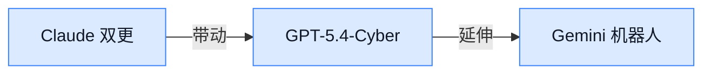

## AI资讯日报 2026/4/15

> AI 早报 · 每日早读 · 全网深度聚合

## **今日摘要**

```
Anthropic 连发 Claude Code routines 和电脑控制，Claude 会修 bug 会点屏，Agent 从写代码杀入真实操作
OpenAI 扩展 Trusted Access 并推出 GPT-5.4-Cyber，8520 亿美元估值遭追问，企业市场正面硬刚 Anthropic
Google Gemini Robotics-ER 1.6 强化机器人空间理解与动手能力，Chrome AI Skills 上线，浏览器也要变 Agent 入口
```

### 🔵 产品与功能更新


1. **Gemini Robotics-ER 1.6 提升机器人“看懂空间并动手”的能力。**
Google DeepMind 发布了 **Gemini Robotics-ER 1.6**，重点强化了**空间推理**和**多视角理解**能力，让机器人在真实世界任务中更能“看明白、想清楚、做出来” 🤖。这类能力说白了，就是让机器人更好判断物体位置、角度和环境关系，不再只会机械执行单一步骤。对企业来说，这意味着 AI 正从“会聊天”继续走向“会操作现实世界”。可查看 [官方发布说明(briefing)](https://deepmind.google/blog/gemini-robotics-er-1-6/)。


2. **Cloudflare Agent Cloud 接入 OpenAI，企业级 Agent 部署更快更稳。**
OpenAI 介绍称，Cloudflare 已将 **GPT-5.4** 和 **Codex** 接入 **Agent Cloud**，帮助企业更快构建、部署并扩展能处理真实任务的 **Agent 工作流** ☁️。重点不只是模型更强，而是把**速度**、**安全性**和规模化部署能力一起打包，方便公司把 AI 真正落到业务流程中。对于想把多个步骤自动串起来的团队，这类平台会比单独调用模型更接近“能上生产环境”的状态。详情可见 [OpenAI 官方介绍(briefing)](https://openai.com/index/cloudflare-openai-agent-cloud)。


3. **Claude Code routines 让 AI 自动修 bug、做代码审查。**
根据报道，Anthropic 的 **Claude Code routines** 正在把开发流程往“自动驾驶”方向推进：AI 可以按预设流程自动**修复 bug**、执行**代码审查**等任务 🛠️。这里的 routines 可以理解为一组固定工作套路，让 AI 不只是回答问题，而是持续按步骤把事情做完。虽然这是偏开发者场景的更新，但对非技术团队也有启发：AI 正越来越像“可安排具体工作的数字同事”。更多信息见 [完整报道解读(briefing)](https://the-decoder.com/claude-code-routines-let-ai-fix-bugs-and-review-code-on-autopilot/)。


4. **Claude 获得“电脑控制”能力，开始会点、会输、会操作屏幕。**
多家报道提到，**Claude** 新增了对电脑界面的操作能力，可以像人一样在屏幕上**点击**、**输入**并执行任务 🖥️。这意味着 AI 不再只停留在聊天窗口，而是开始直接接手部分电脑操作流程，例如按照界面一步步完成任务。对企业来说，这类能力很适合重复性较高、规则较明确的办公流程，但也会把权限与安全问题推到更核心的位置。相关报道可参考 [功能报道汇总(briefing)](https://news.google.com/rss/articles/CBMisAFBVV95cUxNNGVEdldJTWRSYWxHbWM4YzNWdGozbkhpd2hjQnBtNnI4SVhGN3V6Rk55d2VoRUk2TW9INlRJX0dQOU5NRElfSk5NcnhOVzVWaVdKMXR1U0lyai1fTjQyeXpEUUlBNzlWaVJabENCNXZsYkR1YVB5bDVvVVZiaUxoSUg2MFlxeUtZS1NkRFk2RjRoTW9MbjdsdTRRQWJqdWs5M0d6a1d0djd1djduSnNZRg?oc=5)。

![Claude 获得“电脑控制”能力，开始会点、会输、会操作屏幕](https://image.pollinations.ai/prompt/Claude%20%E8%8E%B7%E5%BE%97%E2%80%9C%E7%94%B5%E8%84%91%E6%8E%A7%E5%88%B6%E2%80%9D%E8%83%BD%E5%8A%9B%EF%BC%8C%E5%BC%80%E5%A7%8B%E4%BC%9A%E7%82%B9%E3%80%81%E4%BC%9A%E8%BE%93%E3%80%81%E4%BC%9A%E6%93%8D%E4%BD%9C%E5%B1%8F%E5%B9%95.%20Claude%20%E8%8E%B7%E5%BE%97%E2%80%9C%E7%94%B5%E8%84%91%E6%8E%A7%E5%88%B6%E2%80%9D%E8%83%BD%E5%8A%9B%EF%BC%8C%E5%BC%80%E5%A7%8B%E4%BC%9A%E7%82%B9%E3%80%81%E4%BC%9A%E8%BE%93%E3%80%81%E4%BC%9A%E6%93%8D%E4%BD%9C%E5%B1%8F%E5%B9%95%E3%80%82%20%E5%A4%9A%E5%AE%B6%E6%8A%A5%E9%81%93%E6%8F%90%E5%88%B0%EF%BC%8CClaude%20%E6%96%B0%E5%A2%9E%E4%BA%86%E5%AF%B9%E7%94%B5%E8%84%91%E7%95%8C%E9%9D%A2%E7%9A%84%E6%93%8D%E4%BD%9C%E8%83%BD%E5%8A%9B%EF%BC%8C%E5%8F%AF%E4%BB%A5%E5%83%8F%E4%BA%BA%E4%B8%80%E6%A0%B7%E5%9C%A8%E5%B1%8F%E5%B9%95%E4%B8%8A%E7%82%B9%E5%87%BB%E3%80%81%E8%BE%93%E5%85%A5%E5%B9%B6%E6%89%A7%E8%A1%8C%E4%BB%BB%2C%20technical%20infographic%20diagram%2C%20architecture%20flowchart%2C%20clean%20vector%20illustration%2C%20educational%20style%2C%20no%20text%20overlay%2C%20modern%20minimal%2C%20wide%20aspect?width=1200&height=675&nologo=true&seed=11482)

5. **Google 给 Chrome 加上 AI Skills，常用提示词和流程可保存复用。**
Google 正为 **Chrome** 加入名为 **AI Skills** 的新功能，允许用户把常用的 AI 提示词和操作流程保存下来，并在不同网站重复使用 ✨。它建立在 Gemini 与浏览器整合的基础上，核心价值不是“又多了一个 AI 入口”，而是让用户把高频操作沉淀成可复用模板。对运营、销售、客服等岗位来说，这能减少反复写 prompt 的麻烦，提高跨网页工作的连续性。具体可见 [TechCrunch 报道(briefing)](https://techcrunch.com/2026/04/14/google-adds-ai-skills-to-chrome-to-help-you-save-favorite-workflows/)。


6. **OpenAI 扩展网络安全 Trusted Access 计划，并推出 GPT-5.4-Cyber。**
OpenAI 宣布扩大面向网络安全防御方的 **Trusted Access for Cyber** 计划，并向经过审核的防御机构提供 **GPT-5.4-Cyber** 🔐。这说明随着 AI 在网络安全领域能力增强，OpenAI 一边开放更专业的工具，一边同步加强使用门槛和安全护栏。简单理解，就是让“该用的人更好用”，同时尽量降低被滥用的风险。更多可查看 [官方项目说明(briefing)](https://openai.com/index/scaling-trusted-access-for-cyber-defense)。


### 🟢 前沿研究

1. **研究团队开始攻关“超长流程自主做科研工程”。**
这篇工作把目标瞄准 **Autonomous Long-Horizon Engineering**，也就是让 AI 不只回答问题，而是能连续完成机器学习研究里的长链路工程任务 🤖。对业务同学来说，它关注的是：AI 能不能像研究助理一样，持续推进实验、迭代方案，而不是只给一段建议。标题本身就很直接地点出方向——让 AI 更接近“能独立干活的研究工程助手” 🚀。[论文概览页(briefing)](https://huggingface.co/papers/2604.13018)


2. **英伟达提出 Nemotron 3 Super，主打开源高效的 Agent 推理模型。**
这篇论文介绍了 **Nemotron 3 Super**，核心卖点是 **开源**、**高效**，并采用 **MoE（混合专家模型，多个小模型分工协作）** 与 **Mamba-Transformer 混合架构**（一种结合不同序列建模方式的模型设计）来服务 **Agent 推理** 🧠。简单说，它想解决的是：让模型在更复杂、多步骤任务里，既聪明又别太耗资源。对企业关注点来说，这类研究通常意味着未来更有机会把高能力模型以更可控的成本落地 💡。[论文介绍页(briefing)](https://huggingface.co/papers/2604.12374)


3. **ClawGUI 想把 GUI Agent 的训练、评测、部署一套打通。**
**GUI Agent** 指的是能直接操作图形界面的软件助手，比如点按钮、填表单、切换页面这类“像人用电脑”的任务 🖱️。这篇 ClawGUI 的重点在于提供一个 **统一框架**，把训练、评估、上线部署放到同一套体系里，减少过去各做各的割裂感。对非技术团队也很好理解：如果这类能力成熟，未来 AI 自动操作后台、办公软件和业务系统会更标准化、更容易比较效果 📊。[论文详情页(briefing)](https://huggingface.co/papers/2604.11784)


4. **大模型蒸馏方法被重新审视：如何把“老师模型”更稳地教给“学生模型”。**
这篇研究聚焦 **On-Policy Distillation**（一种让学生模型在自身生成结果基础上持续学习的蒸馏方法），并从现象、机制到实践配方做了系统梳理 🔬。所谓 **蒸馏**，可以理解为把大模型的能力尽量压缩迁移给更小、更便宜的模型，是降本增效的重要方向。论文标题里的 “Phenomenology, Mechanism, and Recipe” 也说明它不只讲原理，还试图给出更可执行的方法论 📘。[论文阅读页(briefing)](https://huggingface.co/papers/2604.13016)

![大模型蒸馏方法被重新审视：如何把“老师模型”更稳地教给“学生模型”](https://image.pollinations.ai/prompt/%E5%A4%A7%E6%A8%A1%E5%9E%8B%E8%92%B8%E9%A6%8F%E6%96%B9%E6%B3%95%E8%A2%AB%E9%87%8D%E6%96%B0%E5%AE%A1%E8%A7%86%EF%BC%9A%E5%A6%82%E4%BD%95%E6%8A%8A%E2%80%9C%E8%80%81%E5%B8%88%E6%A8%A1%E5%9E%8B%E2%80%9D%E6%9B%B4%E7%A8%B3%E5%9C%B0%E6%95%99%E7%BB%99%E2%80%9C%E5%AD%A6%E7%94%9F%E6%A8%A1%E5%9E%8B%E2%80%9D.%20%E5%A4%A7%E6%A8%A1%E5%9E%8B%E8%92%B8%E9%A6%8F%E6%96%B9%E6%B3%95%E8%A2%AB%E9%87%8D%E6%96%B0%E5%AE%A1%E8%A7%86%EF%BC%9A%E5%A6%82%E4%BD%95%E6%8A%8A%E2%80%9C%E8%80%81%E5%B8%88%E6%A8%A1%E5%9E%8B%E2%80%9D%E6%9B%B4%E7%A8%B3%E5%9C%B0%E6%95%99%E7%BB%99%E2%80%9C%E5%AD%A6%E7%94%9F%E6%A8%A1%E5%9E%8B%E2%80%9D%E3%80%82%20%E8%BF%99%E7%AF%87%E7%A0%94%E7%A9%B6%E8%81%9A%E7%84%A6%20On-Policy%20Distillation%EF%BC%88%E4%B8%80%E7%A7%8D%E8%AE%A9%E5%AD%A6%E7%94%9F%E6%A8%A1%E5%9E%8B%E5%9C%A8%E8%87%AA%E8%BA%AB%E7%94%9F%E6%88%90%E7%BB%93%E6%9E%9C%E5%9F%BA%2C%20technical%20infographic%20diagram%2C%20architecture%20flowchart%2C%20clean%20vector%20illustration%2C%20educational%20style%2C%20no%20text%20overlay%2C%20modern%20minimal%2C%20wide%20aspect?width=1200&height=675&nologo=true&seed=10900)

5. **SPPO 用“序列级 PPO”瞄准长链路推理任务。**
这项工作提出 **SPPO**，全称是 **Sequence-Level PPO**，其中 **PPO（近端策略优化，一种常见强化学习算法）** 被改造成更关注“整段输出序列”的优化方式，而不只是盯某一步表现 🎯。它面向的是 **Long-Horizon Reasoning**，也就是需要很多步连续推理才能完成的任务。对普通读者来说，可以把它理解成：研究者在想办法让 AI 不只是某一步答得像样，而是整条思考链都更稳定、更靠谱 🧩。[论文概览页(briefing)](https://huggingface.co/papers/2604.08865)


6. **KnowRL 试图用“最少但足够的知识”提升大模型推理。**
这篇论文的关键词是 **强化学习** 和 **知识引导**：它提出 **KnowRL**，希望通过“**minimal-sufficient knowledge**（最少但足够的知识）”来帮助大模型在推理时少走弯路 💡。直白说，不是给模型一大堆资料，而是尽量喂给它刚刚好的关键信息，再配合训练让它学会更好推理。这个方向很有现实意义，因为企业场景里真正需要的，往往也不是信息越多越好，而是信息够准、够关键即可 📎。[论文介绍页(briefing)](https://huggingface.co/papers/2604.12627)


7. **多模态搜索正在迈向“长流程 Agent 化”。**
这篇研究讨论 **Long-horizon Agentic Multimodal Search**，也就是让 AI 在搜索时不仅能处理文字，还能结合多种信息形态，并持续执行多步骤搜索任务 🔍。关键词里的 **multimodal** 指 **多模态**，即文字、图片等不同类型信息；而 **agentic** 则强调 AI 会主动规划和执行，而不是被动等提问。对于实际业务，这意味着未来搜索系统可能不只是“给你几个链接”，而是能自己一路找、一路筛、一路整合结果，朝更像“研究助理”的方向演进 🚀。[论文详情页(briefing)](https://huggingface.co/papers/2604.12890)


### 🟡 行业展望与社会影响


1. **OpenAI 收购 Hiro，ChatGPT 可能补上“个人财务规划”能力。**
OpenAI 已收购 AI 个人理财初创公司 **Hiro**，这家公司主打“**个人 AI CFO**”（可理解为帮个人做财务统筹的 AI 助手）💰。从现有报道看，这笔收购释放出一个明确信号：OpenAI 正在为 ChatGPT 构建更完整的**财务规划**能力，而不只是做通用问答。对普通用户和企业管理者来说，这意味着未来 AI 可能更深地参与预算、支出分析和财务建议这类高价值场景，但也会把**金融决策责任**与**可信度**问题推到台前。[TechCrunch 收购报道(briefing)](https://techcrunch.com/2026/04/13/openai-has-bought-ai-personal-finance-startup-hiro/) [The Decoder 解读(briefing)](https://the-decoder.com/openai-acquires-ai-finance-startup-hiro-which-built-a-personal-ai-cfo/)


2. **斯坦福 AI Index 2026：AI 进步飞快，但安全担忧上升、公众信任下滑。**
斯坦福发布的 **AI Index 2026** 展示出一个很有代表性的行业信号：AI 能力还在快速提升，但社会层面的**安全焦虑**和**信任危机**也在同步加剧 📊。这份报告特别指出，技术进展并没有自动换来更高的公众认可，反而让“AI 是否可靠、是否可控”变成更尖锐的问题。对企业来说，这不只是舆论层面的风向变化，更会影响产品落地、用户接受度以及未来监管环境。换句话说，AI 竞争已经不只是比谁更强，还要比谁更能证明自己**安全、透明、值得信任** 🤔。[AI Index 2026 报道(briefing)](https://the-decoder.com/stanfords-ai-index-2026-shows-rapid-progress-growing-safety-concerns-and-declining-public-trust/)


### 🟣 开源TOP项目


1. **Addy Osmani 开源 agent-skills，给 AI 编程助手补上“工程化技能包”。**
这是一个面向**AI 编程 Agent** 的开源技能仓库，重点不在聊天，而在把代码助手拉到更接近**生产可用**的工程水平 💡。从仓库描述看，它主打 **production-grade engineering skills**，也就是更适合真实开发流程的能力封装，适合关注 AI 写代码落地效果的团队看看。对于业务同学来说，可以把它理解成“给 AI 程序员配一套更靠谱的工作方法论” 🚀。[GitHub 技能仓库(briefing)](https://github.com/addyosmani/agent-skills)


2. **微软开源 VibeVoice，瞄准前沿语音 AI。**
**VibeVoice** 是微软放出的一个开源**语音 AI**项目，仓库直接将其定位为 **Open-Source Frontier Voice AI** 🎙️。这类项目的价值在于，语音交互不再只是大厂闭源能力，团队也能基于开源方案去探索客服、助手、陪练等场景。对于不写代码的同事来说，可以把它理解为“微软公开了一套更前沿的 AI 语音能力底座” 🚀。[微软开源项目页(briefing)](https://github.com/microsoft/VibeVoice)


3. **OpenAI 开源 codex-plugin-cc，让 Claude Code 也能调用 Codex。**
这个项目的核心用途很直接：可以在 **Claude Code** 里使用 **Codex**，去做**代码审查**或**任务委派** 🛠️。换句话说，它像是给不同 AI 编程工具之间搭了一座桥，让一个助手去调用另一个助手的能力，适合多 Agent 协作的开发流程。对企业团队来说，这类插件的意义在于降低工具割裂感，让 AI 编程工作流更顺手一些。[OpenAI 插件仓库(briefing)](https://github.com/openai/codex-plugin-cc)


4. **Google Research 开源 TimesFM，把时间序列预测做成基础模型。**
**TimesFM** 是 Google Research 推出的一个预训练**时间序列基础模型**，主要用于**时间序列预测** 📈。时间序列可以简单理解为按时间顺序记录的数据，比如销量、库存、流量、气温这类会随时间变化的数字。对业务侧来说，这类模型很值得关注，因为它天然贴近预测类场景，比如经营分析、需求预估和资源规划。[Google Research 仓库(briefing)](https://github.com/google-research/timesfm)


5. **Chrome DevTools 推出 MCP 项目，让编码 Agent 更会“看浏览器”。**
这个项目把 **Chrome DevTools** 能力带给**编码 Agent**，仓库名里的 **MCP** 指模型上下文协议（让 AI 更规范地连接外部工具）🔎。直白说，就是让 AI 在处理前端、网页或浏览器相关任务时，能更好地借助 Chrome 开发者工具来观察和操作页面。对产品、运营同学来说，这意味着未来 AI 处理网页调试、页面分析这类任务时，可能会更像一个真正会用浏览器工具的人。[官方 GitHub 仓库(briefing)](https://github.com/ChromeDevTools/chrome-devtools-mcp)


6. **Anthropic 公开 skills 仓库，集中放出 Agent Skills。**
这是 Anthropic 提供的一个公开仓库，定位非常明确：**Public repository for Agent Skills** 📦。你可以把它理解成一套面向 Agent 的“技能模块集合”，方便把常见能力沉淀成可复用组件，而不是每次都从零写 prompt。对公司内部想系统化使用 AI 的团队来说，这类仓库很有参考价值，因为它展示了 Agent 能力如何被整理成更标准化、可复用的资产。[Anthropic 技能仓库(briefing)](https://github.com/anthropics/skills)


### 🔴 社媒分享

1. **Introspective Diffusion Language Models 提出一种“边生成边自检”的新语言模型思路。**  
这个项目聚焦 **Diffusion Language Models**（扩散式语言模型，一种不用传统“下一个词预测”方式来生成文本的模型）如何在生成过程中做**自我检查与修正** 💡。从项目页看，作者把重点放在 **introspective**（内省式）能力上，也就是模型不是一口气写完，而是能在中途回看、调整输出逻辑，听起来很适合提升复杂生成任务的稳定性。对业务同学来说，可以把它理解成：让 AI 不只是“会写”，还更像“会边写边审稿” 🧠。[项目主页介绍(briefing)](https://introspective-diffusion.github.io/)


2. **OpenAI 推出面向网络防御的 Trusted Access。**  
这项计划主打让经过审核的安全研究人员，以更可控的方式使用更强的 AI 能力，重点服务 **cyber defense**（网络安全防御）场景 🔐。结合解读文章可看出，OpenAI 这是在回应外界对前沿模型既能防守、也可能被滥用的担忧：不是简单全面开放，而是强调 **受信任访问** 和使用边界。对企业管理者来说，这释放了一个很明确的信号——AI 在高敏感行业的落地，未来越来越依赖“谁能用、怎么用、在什么条件下用”的治理框架。[解读文章(briefing)](https://simonwillison.net/2026/Apr/14/trusted-access-openai/#atom-everything) [OpenAI 原始发布(briefing)](https://openai.com/index/scaling-trusted-access-for-cyber-defense/)


3. **OpenAI 8520 亿美元估值遭投资人追问，战略摇摆成焦点。**  
路透援引英国《金融时报》报道称，部分投资人开始重新审视 OpenAI 的 **8520 亿美元估值**，核心原因是公司近期的 **strategy shift**（战略调整）引发不确定性 🤔。这类质疑不只是看营收增速，更是在看：OpenAI 接下来到底会更像一家研究机构、平台公司，还是全面商业化的产品巨头。对外部市场来说，AI 龙头的估值已经不只是“技术强不强”的问题，而是越来越和 **商业路径是否清晰** 直接绑定。[路透完整报道(briefing)](https://www.reuters.com/legal/transactional/openai-investors-question-852-billion-valuation-strategy-shifts-ft-reports-2026-04-14/)


4. **Import AI 453 讨论“如何攻破 AI Agent”、MirrorCode 与“渐进式失权”。**  
Anthropic 联合创始人 Jack Clark 这一期通讯把几个方向串到了一起：既看 **AI Agent** 的脆弱点，也谈 **MirrorCode**，还汇总了对 **gradual disempowerment**（渐进式失权，指人类不是突然被 AI 取代，而是在一连串小变化中慢慢失去决策主导权）的十种视角 🧩。这类内容虽然偏研究讨论，但对非技术读者也很有价值，因为它提醒大家：AI 风险未必总是“灾难片式”的，很多时候反而会以“效率工具越来越强，人越来越难说了算”的方式出现。想把握行业温度，这篇很适合作为高密度观察样本来看。[Import AI 原文(briefing)](https://jack-clark.net/2026/04/13/import-ai-453-breaking-ai-agents-mirrorcode-and-ten-views-on-gradual-disempowerment/)


5. **Stratechery 拆解 OpenAI 内部备忘录：企业市场正面硬刚 Anthropic。**  
这篇分析围绕 OpenAI 的内部 memo（备忘录）展开，重点讨论它如何在 **enterprise**（企业级市场）与 Anthropic 正面竞争，同时也把 **Frontier**、Amazon 和 Anthropic 的关系放进同一张产业地图里看 👀。对业务和管理层来说，最值得关注的不是八卦，而是背后的市场信号：AI 竞争已经从“谁模型更强”逐步转向“谁更懂企业采购、交付和长期合作”。简单说，下一阶段比拼的不只是技术天花板，更是 **商业落地能力**。[Stratechery 分析原文(briefing)](https://stratechery.com/2026/openais-memos-frontier-amazon-and-anthropic/)


---



### 📊 行业洞察（今日 4 条）

1. Google DeepMind 发布 Gemini Robotics-ER 1.6，强化空间推理与多视角理解。  
  【洞察】这表明 Agent 正从语言助手走向具身执行（能感知并操作现实），因价值链更靠近真实任务，但落地仍受硬件与安全约束。

2. Cloudflare Agent Cloud 接入 OpenAI 的 GPT-5.4 与 Codex，面向企业扩展 Agent 工作流。  
  【洞察】判断是平台层竞争升温，因企业采购更看重安全、规模与集成，而非单一模型强弱；机会大，替代风险也更高。

3. Anthropic 推出 Claude Code routines，可自动修 bug、做代码审查；并公开 skills 仓库。  
  【洞察】这说明 Agent 产品在转向技能资产化（把能力沉淀为可复用模块），因为企业要的是稳定复用，不只是一次性聪明表现。

4. OpenAI 扩展 Trusted Access for Cyber，并推出 GPT-5.4-Cyber 面向审核后的防御机构。  
  【洞察】判断是高敏感场景将先走分层准入（按资格开放能力），因为能力越强责任越重；这能打开行业机会，也抬高合规门槛。

### 💭 对我们的启发（今日 3 条）

1. 参考 Cloudflare Agent Cloud 与 Anthropic skills，我们应把平台做成“模型无关+技能可插拔”。机会是承接企业异构需求，风险是同质化后被大厂套件挤压。

2. 参考 Claude 电脑控制与 Chrome AI Skills，我们可强化跨界面任务编排与复用模板。机会是切入办公场景，风险是权限边界不清会拖慢成交。

3. 参考 Trusted Access for Cyber 与 AI Index 2026，A2A 平台需内建分级治理与可解释记录。机会是提升大客户信任，风险是前期组织与产品成本上升。

