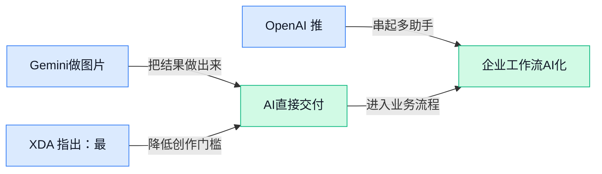

## AI资讯日报 2026/4/25

> AI 早报 · 每日早读 · 全网深度聚合

## **今日摘要**

```
Google 豪掷最高400亿美元押注 Anthropic，OpenAI 自认 AI 进展意外变慢，巨头路线分化加剧
OpenAI 上线 GPT-5.5 与 GPT-5.5 Pro，基准登顶却仍压不住幻觉和 API 成本这两大痛点
DeepSeek V4 现身官方文档冲上百万级上下文，推理逼近前沿模型，价格却被指低出一截
```

### 🔵 产品与功能更新


1. **Google 把 Nano Banana（Gemini 的一项个人智能功能）带进“Personal Intelligence（个人智能助手体验）”。**
这次更新的重点，是让 Gemini 在**个人化理解**和**日常使用入口**上更进一步，不只是会聊天，还更像会“读懂你需求”的助手 🍌。标题里提到的 Nano Banana 属于 Google 在 **Personal Intelligence（个人智能体验，强调让助手结合个人信息提供更贴身帮助）** 方向的一部分，核心看点是“怎么用”而不只是“发了什么”。对普通用户来说，这类功能如果铺开，意味着你未来和 AI 互动时，可能更少手动解释背景，AI 能更快进入状态 💡。相关报道可看[功能使用报道(briefing)](https://news.google.com/rss/articles/CBMigwNBVV95cUxQQW16aHBIRWNWa1gweVZqU1NHVTFac2xVWGJnQTdXZTJ4S2NBTkVyZmc0LVlvUGtKOGtVY3BvQXdXX2htOVE1RVFnZlNHTl9ldWd5azdsQ3Q4ZFc0ZXdkNlRkbE5pcDRjLUZqTGQyS1FmdnR6T01WQ1g1MDdVTjJnRHdTSnF0SGpZaEktcXUwaThULXE1N0FEcmtOeUVUMF9ZT25VODdtR0gxVGp4ZU1NSTBvcjdFNXhZbERNZ0JIUGxqM3NsSU1fampwLTVsd0xYX3JzdWVBZTRWUFd0T05rS0lqMkdVUjlfWVoxX0RkWE9sTmprR3dBeWRDTTB3YkdUVlh0dHR2THhfUUpxMy1ycVMwWXMwZXNpRnlIZnRHcS1CLVhtU3EybnlsZWpJTjhxQ3htVVpnck9COWRBd3hZeUYyZFhXTmk2QVlsRkxJOG9vQzVDWXpsazJPamxSUWJIXzUxQ3VoM2lPYmdHODl3TllvU1EwLVVuQ2RkOHd6UmZaZzg?oc=5)。


2. **XDA 指出：最值得关注的新 AI 模型，未必都来自 Claude、ChatGPT 和 Gemini。**
这篇内容的意思很直接：市场热度常常集中在几家头部产品，但真正有意思的**模型创新**，可能正在别处发生 👀。这里的 model（模型，指训练好的 AI“大脑”）不等于大家每天直接用的聊天界面，它背后决定了 AI 的能力边界；而 hype（市场热度，指被集中讨论和追捧）也不一定等于真正实用。对公司里做业务、运营或产品同事来说，这提醒我们别只盯着大厂名字，很多差异化能力可能先出现在不那么“出圈”的团队里。原文可见[趋势观察报道(briefing)](https://news.google.com/rss/articles/CBMijgFBVV95cUxOYmd4N2xvdmdvcXNFTFF3QVZ3ZnAydVBYTTYzR0llVHBhbkYycEthUF9adUNBZWhmcXU4djg0RzN0VXJKbm8zQUxmeDIxbVlHT09TRmRnazBQVjhuODRuaXRyZ0JlSzZZQVFhMUhINDZ2cy1SaS1SRkV6cjkwSDBKaEpQS2tzZWpObm1IUkJn?oc=5)。


3. **OpenAI 推出 ChatGPT for Clinicians（面向临床医生的 ChatGPT 版本）。**
OpenAI 这次瞄准的是**医疗临床场景**，把 ChatGPT 包装成更贴近医生工作流的工具 🩺。Clinicians（临床医生，指直接参与诊断、治疗和病人管理的医生群体）并不是普通消费者市场，这说明 AI 产品正在继续往**专业行业版本**细分，而不只是做一个“所有人都能聊”的通用助手。对企业用户来说，这类动作很关键：未来 AI 的竞争，可能不只是模型谁更强，还包括谁更懂某个具体岗位、具体流程。详情可看[医疗版发布报道(briefing)](https://news.google.com/rss/articles/CBMiekFVX3lxTE5IbDUwSkRSOFNtalJlcVRqaUpoemx0MnFxU2gyZWFyeWtIWWowdUI4X2NSRDhDeWhqRXRuWUxvc1VrcDJBbXJaSGk4NlU2N0hVS2Nkc2JyNUtNQzBOYXltN0lLOXJfVDgyZGs5bmJlU1d1a0llbEROUm1R?oc=5)。


### 🟢 前沿研究


1. **WorldMark（用于评测交互式视频世界模型的统一基准套件）想给“会看会动脑”的 AI 建一把统一尺子。**
这篇论文聚焦 **Interactive Video World Models（交互式视频世界模型，能根据视频理解环境并预测接下来会发生什么的模型）**，提出了一个名为 **Benchmark Suite（基准测试套件，用来系统比较不同模型表现的一组标准题库）** 的统一评测框架 📏。对非技术同事来说，它的重要性在于：以后不同团队做“视频理解 + 预测 + 交互”的 AI，不再只是各说各话，而是能放到同一套标准里比较。这样的研究会直接影响未来机器人、自动驾驶、虚拟仿真等方向到底谁更靠谱、谁更实用。[论文页面(briefing)](https://huggingface.co/papers/2604.21686)

![WorldMark（用于评测交互式视频世界模型的统一基准套件）想给“会看会动脑”的 AI 建一把统一尺子](https://image.pollinations.ai/prompt/WorldMark%EF%BC%88%E7%94%A8%E4%BA%8E%E8%AF%84%E6%B5%8B%E4%BA%A4%E4%BA%92%E5%BC%8F%E8%A7%86%E9%A2%91%E4%B8%96%E7%95%8C%E6%A8%A1%E5%9E%8B%E7%9A%84%E7%BB%9F%E4%B8%80%E5%9F%BA%E5%87%86%E5%A5%97%E4%BB%B6%EF%BC%89%E6%83%B3%E7%BB%99%E2%80%9C%E4%BC%9A%E7%9C%8B%E4%BC%9A%E5%8A%A8%E8%84%91%E2%80%9D%E7%9A%84%20AI%20%E5%BB%BA%E4%B8%80%E6%8A%8A%E7%BB%9F%E4%B8%80%E5%B0%BA%E5%AD%90.%20WorldMark%EF%BC%88%E7%94%A8%E4%BA%8E%E8%AF%84%E6%B5%8B%E4%BA%A4%E4%BA%92%E5%BC%8F%E8%A7%86%E9%A2%91%E4%B8%96%E7%95%8C%E6%A8%A1%E5%9E%8B%E7%9A%84%E7%BB%9F%E4%B8%80%E5%9F%BA%E5%87%86%E5%A5%97%E4%BB%B6%EF%BC%89%E6%83%B3%E7%BB%99%E2%80%9C%E4%BC%9A%E7%9C%8B%E4%BC%9A%E5%8A%A8%E8%84%91%E2%80%9D%E7%9A%84%20AI%20%E5%BB%BA%E4%B8%80%E6%8A%8A%E7%BB%9F%E4%B8%80%E5%B0%BA%E5%AD%90%E3%80%82%20%E8%BF%99%E7%AF%87%E8%AE%BA%E6%96%87%E8%81%9A%E7%84%A6%20Interactive%20Video%20W%2C%20technical%20infographic%20diagram%2C%20architecture%20flowchart%2C%20clean%20vector%20illustration%2C%20educational%20style%2C%20no%20text%20overlay%2C%20modern%20minimal%2C%20wide%20aspect?width=1200&height=675&nologo=true&seed=10807)


2. **TingIS（面向企业海量客户事件的实时风险发现系统）瞄准“嘈杂数据里找真风险”这个硬骨头。**
这项研究关注企业每天都会遇到的 **Noisy Customer Incidents（噪声客户事件，指信息不完整、描述混乱、真假夹杂的客户问题记录）**，目标是在海量工单、投诉和反馈里做 **Real-time Risk Event Discovery（实时风险事件发现，尽快识别真正需要升级处理的问题）** 🚨。它的现实意义很强：很多公司并不缺数据，缺的是从混乱文本里及时看见风险的能力，比如合规、服务事故或潜在舆情。若这类方法成熟，客服、运营、法务和风控的协同效率都可能被明显拉高。[论文页面(briefing)](https://huggingface.co/papers/2604.21889)

![TingIS（面向企业海量客户事件的实时风险发现系统）瞄准“嘈杂数据里找真风险”这个硬骨头](https://image.pollinations.ai/prompt/TingIS%EF%BC%88%E9%9D%A2%E5%90%91%E4%BC%81%E4%B8%9A%E6%B5%B7%E9%87%8F%E5%AE%A2%E6%88%B7%E4%BA%8B%E4%BB%B6%E7%9A%84%E5%AE%9E%E6%97%B6%E9%A3%8E%E9%99%A9%E5%8F%91%E7%8E%B0%E7%B3%BB%E7%BB%9F%EF%BC%89%E7%9E%84%E5%87%86%E2%80%9C%E5%98%88%E6%9D%82%E6%95%B0%E6%8D%AE%E9%87%8C%E6%89%BE%E7%9C%9F%E9%A3%8E%E9%99%A9%E2%80%9D%E8%BF%99%E4%B8%AA%E7%A1%AC%E9%AA%A8%E5%A4%B4.%20TingIS%EF%BC%88%E9%9D%A2%E5%90%91%E4%BC%81%E4%B8%9A%E6%B5%B7%E9%87%8F%E5%AE%A2%E6%88%B7%E4%BA%8B%E4%BB%B6%E7%9A%84%E5%AE%9E%E6%97%B6%E9%A3%8E%E9%99%A9%E5%8F%91%E7%8E%B0%E7%B3%BB%E7%BB%9F%EF%BC%89%E7%9E%84%E5%87%86%E2%80%9C%E5%98%88%E6%9D%82%E6%95%B0%E6%8D%AE%E9%87%8C%E6%89%BE%E7%9C%9F%E9%A3%8E%E9%99%A9%E2%80%9D%E8%BF%99%E4%B8%AA%E7%A1%AC%E9%AA%A8%E5%A4%B4%E3%80%82%20%E8%BF%99%E9%A1%B9%E7%A0%94%E7%A9%B6%E5%85%B3%E6%B3%A8%E4%BC%81%E4%B8%9A%E6%AF%8F%E5%A4%A9%E9%83%BD%E4%BC%9A%E9%81%87%E5%88%B0%E7%9A%84%20Noisy%20Customer%20In%2C%20technical%20infographic%20diagram%2C%20architecture%20flowchart%2C%20clean%20vector%20illustration%2C%20educational%20style%2C%20no%20text%20overlay%2C%20modern%20minimal%2C%20wide%20aspect?width=1200&height=675&nologo=true&seed=10838)


3. **《There Will Be a Scientific Theory of Deep Learning》（《深度学习将形成科学理论》）认为，深度学习不再只是“调参玄学”。**
作者在文中提出，一个关于 **Deep Learning（深度学习，让模型从大量数据中自动学规律的主流 AI 训练方式）** 的科学理论正在形成中，不只是经验总结，而是开始能解释 **training process（训练过程，模型反复学习数据并更新参数的过程）**、隐藏表示和统计规律 🧠。这类工作虽然不直接变成产品，但它决定了未来模型为什么能学会、什么时候会失效、如何更稳定地训练。对行业来说，这意味着大模型研发可能逐步从“靠堆资源试出来”走向“更可解释、可预测、可工程化”。[arXiv 论文(briefing)](https://arxiv.org/abs/2604.21691)


4. **Hybrid Policy Distillation（混合策略蒸馏，一种把大模型能力压缩给更小模型的训练方法）瞄准更省成本的大模型落地。**
这里的 **Distillation（蒸馏，把强模型的能力迁移给更小更便宜模型的办法）**，可以理解成让“老师模型”把做题思路教给“学生模型”；而 **Policy（策略）** 则强调模型在决策和生成过程中的行为方式 🎯。论文提出的是一种“混合式”方案，意味着它可能不是只模仿答案，而是同时学习更细的行为信号。对企业最直接的价值，是有机会在保住效果的同时降低 **inference（模型推理，让训练好的模型真正回答问题的过程）** 成本，让 AI 更容易从实验室走进真实业务。[论文页面(briefing)](https://huggingface.co/papers/2604.20244)

![Hybrid Policy Distillation（混合策略蒸馏，一种把大模型能力压缩给更小模型的训练方法）瞄准更省成本的大模型落地](https://image.pollinations.ai/prompt/Hybrid%20Policy%20Distillation%EF%BC%88%E6%B7%B7%E5%90%88%E7%AD%96%E7%95%A5%E8%92%B8%E9%A6%8F%EF%BC%8C%E4%B8%80%E7%A7%8D%E6%8A%8A%E5%A4%A7%E6%A8%A1%E5%9E%8B%E8%83%BD%E5%8A%9B%E5%8E%8B%E7%BC%A9%E7%BB%99%E6%9B%B4%E5%B0%8F%E6%A8%A1%E5%9E%8B%E7%9A%84%E8%AE%AD%E7%BB%83%E6%96%B9%E6%B3%95%EF%BC%89%E7%9E%84%E5%87%86%E6%9B%B4%E7%9C%81%E6%88%90%E6%9C%AC%E7%9A%84%E5%A4%A7%E6%A8%A1%E5%9E%8B%E8%90%BD%E5%9C%B0.%20Hybrid%20Policy%20Distillation%EF%BC%88%E6%B7%B7%E5%90%88%E7%AD%96%E7%95%A5%E8%92%B8%E9%A6%8F%EF%BC%8C%E4%B8%80%E7%A7%8D%E6%8A%8A%E5%A4%A7%E6%A8%A1%E5%9E%8B%E8%83%BD%E5%8A%9B%E5%8E%8B%E7%BC%A9%E7%BB%99%E6%9B%B4%E5%B0%8F%E6%A8%A1%E5%9E%8B%E7%9A%84%E8%AE%AD%E7%BB%83%E6%96%B9%E6%B3%95%EF%BC%89%E7%9E%84%E5%87%86%E6%9B%B4%E7%9C%81%E6%88%90%E6%9C%AC%E7%9A%84%E5%A4%A7%E6%A8%A1%E5%9E%8B%E8%90%BD%E5%9C%B0%E3%80%82%20%E8%BF%99%E9%87%8C%E7%9A%84%20Distill%2C%20technical%20infographic%20diagram%2C%20architecture%20flowchart%2C%20clean%20vector%20illustration%2C%20educational%20style%2C%20no%20text%20overlay%2C%20modern%20minimal%2C%20wide%20aspect?width=1200&height=675&nologo=true&seed=10900)


5. **Explainable Disentangled Representation Learning（可解释的解耦表征学习）想在生成式 AI 时代更稳地判断“文章是谁写的”。**
这篇研究聚焦 **Authorship Attribution（作者归因，判断一段文本更可能出自谁）**，并强调 **Explainable（可解释，能说明模型为什么这么判断）** 与 **Disentangled Representation（解耦表征，把不同特征拆开表示，避免风格、主题、长度混在一起）** 两件事 ✍️。在生成式 AI 普及后，文本风格更容易被模仿，传统“看文风猜作者”的方法会变得更脆弱，因此这类研究尤其关键。它对内容平台、教育场景、合规审查和版权争议都有潜在参考价值。[论文页面(briefing)](https://huggingface.co/papers/2604.21300)


6. **UniT（面向人类到人形机器人的统一物理语言）试图把“人怎么动”和“机器人怎么学”放进同一套表达体系。**
论文目标是构建 **Unified Physical Language（统一物理语言，用同一种表示方式描述动作、环境和交互规则）**，服务于 **Humanoid Policy Learning（人形机器人策略学习，让机器人学会在现实中如何行动）** 和 **World Modeling（世界建模，让模型理解环境并预测变化）** 🤖。这件事难点在于，人类动作、机器人控制和环境反馈本来像三种“不同语言”，如果能统一表达，训练和迁移都会更顺。对产业来说，这意味着未来机器人可能更容易从人类示范中学习，而不必为每种机器、每个任务都从零开始教。[论文页面(briefing)](https://huggingface.co/papers/2604.19734)

![UniT（面向人类到人形机器人的统一物理语言）试图把“人怎么动”和“机器人怎么学”放进同一套表达体系](https://image.pollinations.ai/prompt/UniT%EF%BC%88%E9%9D%A2%E5%90%91%E4%BA%BA%E7%B1%BB%E5%88%B0%E4%BA%BA%E5%BD%A2%E6%9C%BA%E5%99%A8%E4%BA%BA%E7%9A%84%E7%BB%9F%E4%B8%80%E7%89%A9%E7%90%86%E8%AF%AD%E8%A8%80%EF%BC%89%E8%AF%95%E5%9B%BE%E6%8A%8A%E2%80%9C%E4%BA%BA%E6%80%8E%E4%B9%88%E5%8A%A8%E2%80%9D%E5%92%8C%E2%80%9C%E6%9C%BA%E5%99%A8%E4%BA%BA%E6%80%8E%E4%B9%88%E5%AD%A6%E2%80%9D%E6%94%BE%E8%BF%9B%E5%90%8C%E4%B8%80%E5%A5%97%E8%A1%A8%E8%BE%BE%E4%BD%93%E7%B3%BB.%20UniT%EF%BC%88%E9%9D%A2%E5%90%91%E4%BA%BA%E7%B1%BB%E5%88%B0%E4%BA%BA%E5%BD%A2%E6%9C%BA%E5%99%A8%E4%BA%BA%E7%9A%84%E7%BB%9F%E4%B8%80%E7%89%A9%E7%90%86%E8%AF%AD%E8%A8%80%EF%BC%89%E8%AF%95%E5%9B%BE%E6%8A%8A%E2%80%9C%E4%BA%BA%E6%80%8E%E4%B9%88%E5%8A%A8%E2%80%9D%E5%92%8C%E2%80%9C%E6%9C%BA%E5%99%A8%E4%BA%BA%E6%80%8E%E4%B9%88%E5%AD%A6%E2%80%9D%E6%94%BE%E8%BF%9B%E5%90%8C%E4%B8%80%E5%A5%97%E8%A1%A8%E8%BE%BE%E4%BD%93%E7%B3%BB%E3%80%82%20%E8%AE%BA%E6%96%87%E7%9B%AE%E6%A0%87%E6%98%AF%E6%9E%84%E5%BB%BA%20Unified%20Physical%20Lan%2C%20technical%20infographic%20diagram%2C%20architecture%20flowchart%2C%20clean%20vector%20illustration%2C%20educational%20style%2C%20no%20text%20overlay%2C%20modern%20minimal%2C%20wide%20aspect?width=1200&height=675&nologo=true&seed=10962)


7. **GPT-5.5 基准测试登顶，但幻觉（模型一本正经说错话）问题和 API 成本仍没解决。**
报道指出，OpenAI 的 **GPT-5.5** 在多项 **benchmarks（基准测试，用统一题目衡量模型能力的评测）** 上拿到领先成绩，但依然经常出现 **hallucination（幻觉，模型把不准确甚至错误内容说得很像真的）** 😅。同时，它通过 **API（应用接口，企业把模型接入自家产品的方式）** 调用时成本还比之前高出 20%，这会直接影响企业是否愿意大规模上线。也就是说，模型“考试成绩”更高了，但离真正稳定、便宜、可信地服务业务，仍有一段距离。[完整报道(briefing)](https://the-decoder.com/gpt-5-5-tops-benchmarks-but-still-hallucinates-frequently-and-costs-20-percent-more-over-the-api/)


8. **DeepSeek 预览新模型，称在推理基准上已进一步逼近前沿模型。**
TechCrunch 报道称，DeepSeek 预览了两款新 AI 模型，并表示由于 **architecture（模型架构，决定模型内部如何组织和计算的设计）** 改进，它们在效率和性能上都优于 DeepSeek V3.2 ⚙️。文中提到，这些模型在 **reasoning benchmarks（推理基准，用来测试模型分析、判断和多步思考能力的标准测试）** 上，已几乎“缩小与当前领先模型的差距”。这类进展的意义很直接：开源与闭源头部模型之间的距离如果继续缩小，企业在选型时就会有更强的议价空间和更多自主性。[完整报道(briefing)](https://techcrunch.com/2026/04/24/deepseek-previews-new-ai-model-that-closes-the-gap-with-frontier-models/)


### 🟡 行业展望与社会影响


1. **Anthropic 承认 Claude Code 出现质量下滑，承诺收紧发布把关。**
Anthropic 公开确认，**Claude Code** 最近一段时间的表现下滑，背后是工程层面的失误，而不是用户“用错了” 😮。这件事对行业很有代表性：哪怕是头部 AI 公司，**模型能力** 和 **产品稳定性** 也不是一回事，尤其是面向程序员的工具一旦波动，用户反弹会非常直接。Anthropic 现在强调更严格的**质量控制**，其实也在提醒整个行业：AI 产品不能只拼更新速度，还得补上测试、回归验证（新版本上线前反复检查老功能有没有被带坏，像软件“体检”）和发布流程管理。[完整报道(briefing)](https://the-decoder.com/anthropic-confirms-claude-code-problems-and-promises-stricter-quality-controls/)


2. **Google 计划向 Anthropic 投入最高 400 亿美元，AI 下注进入“现金+算力”时代。**
多家媒体提到，Google 准备向 Anthropic 追加最高 **400 亿美元**投资，而且不只是现金，还包括**compute（算力资源，也就是训练和运行 AI 所需的服务器与显卡能力）** 💰⚙️。这说明大厂竞争已经不只是比谁模型更聪明，而是比谁能长期提供足够的**算力**、资本和生态支持；对普通企业来说，未来能用到什么 AI，很大程度上也会被这种上游资源分配影响。换句话说，AI 行业正越来越像“基础设施战争”——领先公司不只是在做产品，也在抢占电力、芯片和训练容量这些更底层的门票。[TechCrunch 报道(briefing)](https://techcrunch.com/2026/04/24/google-to-invest-up-to-40b-in-anthropic-in-cash-and-compute/) [路透相关报道(briefing)](https://news.google.com/rss/articles/CBMisAFBVV95cUxOelhLSVpIR0hNMkd6LWcwM1BCeVk4SE9GOGk1MF9TajBfc1AzRWU4RFh2UzlBTkhLLWdsZEdlR3o5N19JMFk3TjMwbHpQWXBvdGVaNUpqdlRucFBJd1F6Mk9xY3lRRS10NVB1OFZTdWFwWnIyWC1oYmo1allMQ0lVQjV5b0FNREVqcUtWdGdzWXJQY3RXU1k2WHlpM19WdWtEUEpKUFJzbV83Y21vZGRObw?oc=5)


3. **OpenAI 首席科学家称 AI 进展“意外地慢”，但仍预告将迎来大跨越。**
OpenAI 的首席科学家表示，AI 近阶段的发展其实比外界想象得更慢，这种表态有点“降温”，但也很真实 🤔。它传递出的信号是：即便行业天天有新模型、新功能，真正能稳定落地的能力提升并没有想象中那么线性；很多看似惊艳的演示，离大规模可靠应用还隔着产品化、评测和安全等关卡。与此同时，他又提到未来会有更大的跃迁，说明头部公司仍然相信下一轮突破正在酝酿，只是市场需要对 **AI 发展节奏** 抱有更成熟的预期。[原文解读(briefing)](https://the-decoder.com/openais-chief-scientist-says-ai-progress-has-been-surprisingly-slow-and-promises-big-leaps-ahead/)

![OpenAI 首席科学家称 AI 进展“意外地慢”，但仍预告将迎来大跨越](https://image.pollinations.ai/prompt/OpenAI%20%E9%A6%96%E5%B8%AD%E7%A7%91%E5%AD%A6%E5%AE%B6%E7%A7%B0%20AI%20%E8%BF%9B%E5%B1%95%E2%80%9C%E6%84%8F%E5%A4%96%E5%9C%B0%E6%85%A2%E2%80%9D%EF%BC%8C%E4%BD%86%E4%BB%8D%E9%A2%84%E5%91%8A%E5%B0%86%E8%BF%8E%E6%9D%A5%E5%A4%A7%E8%B7%A8%E8%B6%8A.%20OpenAI%20%E9%A6%96%E5%B8%AD%E7%A7%91%E5%AD%A6%E5%AE%B6%E7%A7%B0%20AI%20%E8%BF%9B%E5%B1%95%E2%80%9C%E6%84%8F%E5%A4%96%E5%9C%B0%E6%85%A2%E2%80%9D%EF%BC%8C%E4%BD%86%E4%BB%8D%E9%A2%84%E5%91%8A%E5%B0%86%E8%BF%8E%E6%9D%A5%E5%A4%A7%E8%B7%A8%E8%B6%8A%E3%80%82%20OpenAI%20%E7%9A%84%E9%A6%96%E5%B8%AD%E7%A7%91%E5%AD%A6%E5%AE%B6%E8%A1%A8%E7%A4%BA%EF%BC%8CAI%20%E8%BF%91%E9%98%B6%E6%AE%B5%E7%9A%84%E5%8F%91%E5%B1%95%E5%85%B6%E5%AE%9E%E6%AF%94%E5%A4%96%E7%95%8C%E6%83%B3%E8%B1%A1%E5%BE%97%E6%9B%B4%E6%85%A2%EF%BC%8C%E8%BF%99%E7%A7%8D%E8%A1%A8%E6%80%81%E6%9C%89%E7%82%B9%2C%20technical%20infographic%20diagram%2C%20architecture%20flowchart%2C%20clean%20vector%20illustration%2C%20educational%20style%2C%20no%20text%20overlay%2C%20modern%20minimal%2C%20wide%20aspect?width=1200&height=675&nologo=true&seed=10869)

### 🟣 开源TOP项目

1. **agency-agents-zh（中文 AI 专家角色库）把 211 个现成智能体打包好了。**
这个项目主打**即插即用**，一次性提供 211 个 AI 专家角色，覆盖**工程、设计、营销、金融**等 18 个部门，比较像把不同岗位的“数字同事”预设好，拿来就能分工协作 🚀。它还支持 Hermes Agent（一个 Agent 运行框架，方便把角色接入不同工作流）、Claude Code、Cursor、Copilot 等 16 种工具，说明它不是单点玩法，而是能接到你现有的 AI 办公环境里。更特别的是，项目里包含 46 个面向中国市场的原创智能体，直接覆盖**小红书、抖音、微信、飞书、钉钉**等常见业务场景，对国内团队会更接地气 💡。[GitHub 项目页(briefing)](https://github.com/jnMetaCode/agency-agents-zh)


2. **impeccable（帮助 AI 做出更好设计稿的设计语言）想先规范“AI 的审美”。**
这个项目的核心不是再造一个生成器，而是提供一套**设计语言**，帮助你的 AI 工具在做设计相关任务时更稳定地遵循一致风格 🎨。这里的 design language（设计语言，指一套统一的视觉规则和表达规范）可以理解成先给 AI 一份“品牌与版式说明书”，避免每次都从头猜。对经常要做海报、页面草图、产品视觉探索的团队来说，这类项目的价值在于让 AI 输出更像“可用初稿”，而不只是灵感碎片。[GitHub 仓库说明(briefing)](https://github.com/pbakaus/impeccable)


3. **new-api（统一管理多家大模型的中转平台）把模型接入这件事做成了“总闸门”。**
这个开源项目定位很明确：做一个**统一 AI 模型枢纽**，负责模型的聚合、分发和集中管理 🔧。它支持把不同 LLM（大语言模型，能理解和生成文字的 AI 模型）跨格式转换成 OpenAI 兼容、Claude 兼容或 Gemini 兼容接口，意味着团队不必为每家模型分别重写一套接入逻辑。对个人开发者和企业来说，这种 centralized gateway（集中网关，相当于统一出入口）能降低多模型切换和权限管理的复杂度，也更方便做成本与调用策略控制。[GitHub 项目主页(briefing)](https://github.com/QuantumNous/new-api)


4. **daily_stock_analysis（用大模型做股票日常分析的系统）把行情、新闻和结论面板串起来了。**
这是一个由 LLM（大语言模型，能汇总信息并生成分析结论）驱动的**A 股 / 港股 / 美股智能分析器**，把多数据源行情、实时新闻和 AI 决策仪表盘整合到一起 📈。它还支持多渠道推送和定时运行，强调“零成本”自动化，适合想每天固定收到市场摘要的人。对非技术同事来说，这类项目的意义不在于替你做投资决定，而是让原本分散在多个页面的信息，被 AI 先整理成一份更容易读的分析视图。[GitHub 项目页(briefing)](https://github.com/ZhuLinsen/daily_stock_analysis)

![daily_stock_analysis（用大模型做股票日常分析的系统）把行情、新闻和结论面板串起来了](https://image.pollinations.ai/prompt/daily_stock_analysis%EF%BC%88%E7%94%A8%E5%A4%A7%E6%A8%A1%E5%9E%8B%E5%81%9A%E8%82%A1%E7%A5%A8%E6%97%A5%E5%B8%B8%E5%88%86%E6%9E%90%E7%9A%84%E7%B3%BB%E7%BB%9F%EF%BC%89%E6%8A%8A%E8%A1%8C%E6%83%85%E3%80%81%E6%96%B0%E9%97%BB%E5%92%8C%E7%BB%93%E8%AE%BA%E9%9D%A2%E6%9D%BF%E4%B8%B2%E8%B5%B7%E6%9D%A5%E4%BA%86.%20dailystockanalysis%EF%BC%88%E7%94%A8%E5%A4%A7%E6%A8%A1%E5%9E%8B%E5%81%9A%E8%82%A1%E7%A5%A8%E6%97%A5%E5%B8%B8%E5%88%86%E6%9E%90%E7%9A%84%E7%B3%BB%E7%BB%9F%EF%BC%89%E6%8A%8A%E8%A1%8C%E6%83%85%E3%80%81%E6%96%B0%E9%97%BB%E5%92%8C%E7%BB%93%E8%AE%BA%E9%9D%A2%E6%9D%BF%E4%B8%B2%E8%B5%B7%E6%9D%A5%E4%BA%86%E3%80%82%20%E8%BF%99%E6%98%AF%E4%B8%80%E4%B8%AA%E7%94%B1%20LLM%EF%BC%88%E5%A4%A7%E8%AF%AD%E8%A8%80%E6%A8%A1%E5%9E%8B%EF%BC%8C%E8%83%BD%E6%B1%87%E6%80%BB%E4%BF%A1%E6%81%AF%E5%B9%B6%E7%94%9F%E6%88%90%E5%88%86%E6%9E%90%E7%BB%93%E8%AE%BA%EF%BC%89%2C%20technical%20infographic%20diagram%2C%20architecture%20flowchart%2C%20clean%20vector%20illustration%2C%20educational%20style%2C%20no%20text%20overlay%2C%20modern%20minimal%2C%20wide%20aspect?width=1200&height=675&nologo=true&seed=11094)

5. **Shannon Lite（自动化白盒安全测试工具）让 AI 直接去证明漏洞是不是真的存在。**
这个项目是一个 autonomous（可自主执行任务的）white-box AI pentester（白盒 AI 渗透测试工具，会读取源码来找安全问题），主要面向 Web applications（网页应用）和 APIs（程序之间传递数据的接口）🛡️。它不只是“猜哪里有风险”，而是会分析源代码、识别攻击路径，再实际执行 exploit（漏洞利用操作，用来验证问题能否被真实攻击）来证明漏洞是否会在上线前造成麻烦。对企业来说，这种工具的价值很直接：比起只给一份抽象风险清单，它更像是提前做一次“带证据的安全彩排”。[GitHub 官方仓库(briefing)](https://github.com/KeygraphHQ/shannon)


6. **antigravity-awesome-skills（Agent 技能大合集）把 1400 多个可安装技能做成了 GitHub 库。**
这个项目收录了 1400+ agentic skills（Agent 可调用的任务技能包，像给 AI 安装一个个专用插件），可用于 Claude Code、Cursor、Codex CLI（命令行编码助手，在终端里调用 AI 写代码）、Gemini CLI（Gemini 的命令行工具）等多种环境 ⚙️。除了技能本体，它还提供 installer CLI（命令行安装器，方便批量装技能）、bundles（打包好的技能组合）和 workflows（预设工作流程），适合想快速搭建 AI 工作流的人。简单说，它不是单个“神 prompt”，而是一整套能复用、能安装、能组合的技能仓库，对高频用 AI 干活的团队会很有吸引力 💡。[GitHub 技能库(briefing)](https://github.com/sickn33/antigravity-awesome-skills)


### 🔴 社媒分享

1. **OpenAI 在 API 中上线 GPT-5.5 与 GPT-5.5 Pro（更强版本）。**
OpenAI 已把 **GPT-5.5** 和 **GPT-5.5 Pro（面向更高性能需求的版本）** 加入 **API（应用程序接口，企业和开发者把模型接入自己系统的通道）** 更新日志，这意味着产品团队和开发者可以直接在业务系统里调用新模型能力 🚀。从信息来源看，这次内容首先体现在官方变更记录里，适合关注模型可用性、版本切换和接入节奏的同事快速确认。对于公司内部来说，这类更新通常会直接影响客服机器人、内容生成、数据分析助手等现有 AI 应用的底层能力。可查看 [OpenAI 更新日志(briefing)](https://developers.openai.com/api/docs/changelog) 了解原始发布信息。


2. **有人尝试用 Claude Code routine（自动执行的一套固定流程）帮自己盯财务。**
这篇分享讨论的不是“让 AI 直接管钱”，而是能否让 **Claude Code routine（Claude Code 里的自动化例行流程，像给 AI 设好每天要跑的清单）** 持续帮用户关注个人财务情况 💡。它代表的趋势很值得职能岗位关注：未来 AI 不只是“问一句答一句”，而是可能按预设规则定时检查、汇总、提醒，把重复性信息工作自动化。对财务、行政、运营同事来说，这类思路很像“给自己配一个会按时巡检的数字助理”。原文可见 [作者完整博文(briefing)](https://driggsby.com/blog/claude-code-routine-watch-my-finances)。


3. **DeepSeek-V4（DeepSeek 新一代大模型）主打百万级上下文，而且 Agent 真能用起来。**
HuggingFace（全球最大 AI 模型共享社区）这篇文章点出的重点，是 **DeepSeek-V4** 拥有 **百万级上下文（一次能读入超长文本、长聊天记录或大量资料）**，而且不是“纸面参数好看”，而是更贴近 **Agent（能自己分步骤执行任务的 AI 助手）** 的实际使用场景 ⚙️。这对企业应用很关键，因为很多真实工作不是一句话问答，而是要 AI 同时参考长文档、历史记录和多轮任务状态。换句话说，长上下文如果真的稳定可用，就更适合做知识助手、流程处理和复杂分析。可参考 [HuggingFace 解读文章(briefing)](https://huggingface.co/blog/deepseekv4)。


4. **Google 计划向 Anthropic 投资最高 400 亿美元。**
彭博披露，Google 计划对 **Anthropic** 追加最高 **400 亿美元**投资，这再次说明头部大模型公司的竞争已经不只是拼产品，也在拼资本、算力和长期生态布局 💰。对普通职能同事来说，可以把这理解为：AI 赛道正进入“巨头持续加码、强者更强”的阶段，未来企业采购、合作和平台依赖关系都可能随之变化。类似动作往往也会影响模型供应格局、云服务绑定和行业话语权。更多可见 [彭博完整报道(briefing)](https://www.bloomberg.com/news/articles/2026-04-24/google-plans-to-invest-up-to-40-billion-in-anthropic)。


5. **DeepSeek V4（DeepSeek 最新模型系列）已出现在官方文档中。**
从官方文档入口来看，**DeepSeek V4** 已经进入可查询状态，说明这代模型不只是“传闻”或社区讨论，而是开始进入正式对外信息体系 📘。这类官方文档更新通常是企业用户最该关注的信号，因为它比二手解读更接近真实可用能力、调用方式和版本边界。对正在评估国产大模型的团队来说，文档上线意味着后续测试、接入和成本比较会更容易推进。原始信息可查 [DeepSeek 官方文档(briefing)](https://api-docs.deepseek.com/)。


6. **DeepSeek V4（DeepSeek 新模型）被评价为“接近前沿，但价格低很多”。**
知名技术作者 Simon Willison 在解读中提到，DeepSeek 刚放出的 **V4** 预览版被认为已经“接近前沿水平”，但价格只有一小部分，这让 **性价比** 成为它最突出的看点之一 🔍。对企业而言，这种变化的意义很现实：如果模型效果逼近头部产品，但调用成本更低，就可能改写预算分配、供应商选择和 AI 项目落地速度。尤其对要大规模部署客服、文档处理、内部知识助手的团队，价格差距往往不只是“便宜一点”，而是决定项目能否铺开的关键。可阅读 [Simon 解读文章(briefing)](https://simonwillison.net/2026/Apr/24/deepseek-v4/#atom-everything)。


---



### 📊 行业洞察（今日 4 条）

1. Google将Nano Banana并入Gemini的Personal Intelligence（个人智能助手体验）。
  【洞察】判断是入口竞争正转向“个人上下文”深耕；因为卖点已从通用问答变成更少解释背景的贴身协作，机会在留存，风险在隐私顾虑。

2. OpenAI推出ChatGPT for Clinicians（面向临床医生版本），切入医疗临床场景。
  【洞察】判断是大模型商业化正加速垂直化；因为通用能力开始按岗位流程封装，机会在高客单价，风险在专业责任与结果可信度要求更高。

3. Anthropic承认Claude Code近期质量下滑，称因工程失误并将收紧质量控制。
  【洞察】判断是头部厂商也未跨过产品稳定性门槛；因为模型强不等于体验稳，机会在差异化治理能力，风险在用户信任受损后迁移成本骤降。

4. Google计划向Anthropic投资最高400亿美元，并附带compute（算力资源）支持。
  【洞察】判断是行业竞争进入基础设施主导阶段；因为领先优势越来越取决于资本、算力与生态绑定，机会在借势合作，风险在上游集中度继续升高。

### 💭 对我们的启发（今日 3 条）

1. Google做Personal Intelligence、OpenAI做Clinicians，说明A2A平台应先做“角色化Agent模板”。机会是更快贴近岗位价值，风险是过早铺太多行业导致产品分散。

2. Claude Code质量下滑提醒我们，平台核心不只是多Agent协作，还要有评测基线（统一测评标准）与回退机制。机会是建立信任，风险是研发成本上升。

3. Google加码Anthropic、DeepSeek逼近前沿，说明底层模型将长期多元并存。我们应坚持模型无关编排与能力抽象，机会是议价权增强，风险是适配复杂度抬高。

