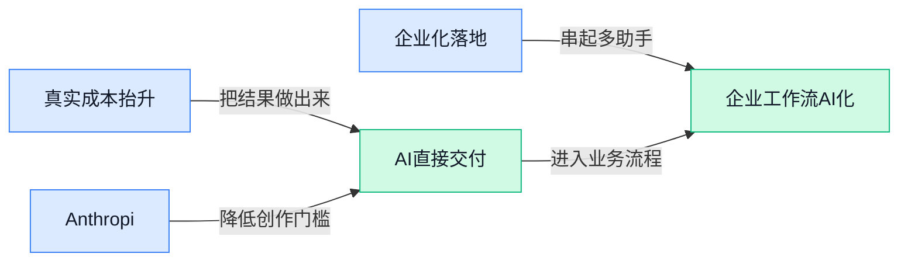

## AI资讯日报 2026/4/26

> AI 早报 · 每日早读 · 全网深度聚合

## **今日摘要**

```
Anthropic 一天连发 Claude Opus 4.7、Sonnet 4.6，Mythos AI 7 周挖出 2000 多个未知漏洞
Google 据报再砸最高 400 亿美元加码 Anthropic，第八代 TPU 同步亮相，Agent 算力战升级
OpenAI 一边启动 GPT‑5.5 生物安全赏金，一边为未向警方通报账户致歉，平台治理再受拷问
```

### 🔵 产品与功能更新


1. **Anthropic 发布 Claude Opus 4.7（Claude 系列新模型），性能仅次于 Mythos（报道中提到的另一款顶级模型）。**
Anthropic 又把 **Claude** 产品线往前推了一步，这次的 **Opus 4.7** 被报道为目前仅次于 **Mythos** 的强模型之一，说明头部大模型竞争还在持续升温 🚀。对普通用户和企业来说，这类更新往往意味着更强的**复杂任务处理**、更稳的**长文本理解**，以及更接近“能独立干活”的体验。虽然原文是新闻转述，但它释放出的信号很明确：Anthropic 还在持续强化高端模型档位，和 OpenAI、Google 的正面竞争不会停。可查看这篇[MSN 转引报道(briefing)](https://news.google.com/rss/articles/CBMiyAFBVV95cUxPSDVxdWpSemRWaFU0T3I3R2poTUhjYXBPbDBsZjI5Vll3OEw5M2pKdlVDZkxOSG1JY3FQc1QyYy1hLUllZ1A2NFNWUFFjQnpMTHRzYk42Q2N6eFpOelpTazlQOURYbmF0dkNqNTJhVGx3NGZ3T1dDVllPVXJ4d0NTbGJtczNHV3RYLTZmLUQxek5McURPUGFua1BVSkJpUVZ5NnEwOEVxbzF1NEtrNnZ2UndISGlRR1BaazFtUU5OdWRfOVh2SEJYeg?oc=5)。


2. **Anthropic 推出 Claude Sonnet 4.6（Claude 系列中偏均衡的一档模型），强化编程能力。**
这次更新的重点很直接：**Claude Sonnet 4.6** 继续把 **coding（编程写代码）** 能力往上拉，显然是在抢开发者和企业自动化场景 💡。如果把 AI 当“数字同事”，那编程能力增强通常不只是写代码更快，也意味着它在**改脚本**、**排查流程问题**、**辅助搭建内部工具**这些任务上更有用。对非技术团队来说，影响也不小——很多过去需要 IT 或外包处理的小型需求，未来可能更容易通过 AI 协助完成。相关信息可见[功能更新报道(briefing)](https://news.google.com/rss/articles/CBMi4wJBVV95cUxOQjcyblZfQWt1cmgxX1REQ0VIUVpuQzllQnc1bXo2S1dVWFc2ck5jNm9ra3NLb211Y1dSbU1uZy1sNGh1WE5rMm0tbnhVNnNib01oMjRoYkpYZXdDWFZjNFNSdFRmRnBkRHMtczgxM2JqNUs5WXB3U0ZMNjcwcXFGRHh5UU9uV3JiSEU2V095ZllCUGVyRC1tVFF1VmRJdzNja19jUEh4cm56QzlsTFlPQWk2VV90YUR0bWJPSnNEZVhjYzd4LVhoZ18xd2FLam5TVDBHUGxJMjNJUmJUenZxWlVVYkw5NnI2dGdxSE4zY21jWkVUVm41N2Ryd0JTOWlMWmhvankybGVLbHduN3BNbzU4VWl0dU9tNTVweEI4Q2dYNllLT3VMM3NsX1duR0pjc0FvZmdOZkdTQUV4WC1UQjF3VHc1eGljMXRPejB3SVFIRjBwOWdSVXNCVTQtTlR6R2ZV?oc=5)。


3. **德勤推出 Google Cloud Agentic Transformation Practice（面向企业的 AI 智能体转型服务团队），主打在 Gemini Enterprise 上扩大部署。**
这不是单纯“又开了个部门”，而是德勤在把 **Agentic（智能体式的，让 AI 能按目标分步骤执行任务）** 真正打包成企业服务能力，帮助客户在 **Gemini Enterprise（Google 面向企业的 AI 套件）** 上更快落地 🧩。说白了，咨询公司已经不满足于讲战略，而是开始围绕 AI 部署、流程改造、组织协同来做更具体的交付。对大公司尤其关键，因为 AI 落地卡住的往往不是模型本身，而是跨部门流程、权限、系统接入这些“最后一公里”。更多内容可看[Pulse 2.0 报道(briefing)](https://news.google.com/rss/articles/CBMi0gFBVV95cUxNLTZyM2R6eTRYWVRGOW5ROVNaRWJKQXVJZjRMYjliemlmWGxITDdnZkRHZTEzRUtDaWJqUmxUeUZPRWVDaVlZRkxtTnR0cS1XeS1naGZkTlVJU1lpek9hbGlPMzVoQVVIa2k4V2c3cGhFVDNBc2NSMzNCQnhJUnUyOHNTcDBWSkFvM3ZaX08zXzdGd1pfMEhqOXQ1VGxxZ0ZJYWhMSllPcW42ejdVSW1RWk1uVUVJMWVTRWhfdnhsYWZ3ZS1GanJWTDZiRGJ5NEdXVGfSAdcBQVVfeXFMUEYweUM0Vld6RXVsTEhTdUNiTnFyRzdCNWN6b1JkQkhZWklrQ0NRa2FHUkRyYXlmX2Utc3F5Q1RtVjlmLUhaa1p2NHpuMUt1SkxoWnB3YUNWQ1ptbDRILWJOVlVSdEdQcFVDYm5RWGxrVlhsV3plazVBMFMzel9mRHRTYm5uV0lVVkQ2M1otYThWeFhKUzV2eDA3ZEZrNy1sY3ZMWm5PZ19maHdiMFVyRjZQYkFrZXdiSzZ5REhGa0loNnhBbzNWblJvbm1mSF91NnU3aE4xcUU?oc=5)。


### 🟢 前沿研究


1. **Anthropic 研究称，更强的大模型在谈判中更会“拿好处”，而吃亏一方可能都没察觉。**
Anthropic 用模拟谈判实验发现，能力更强的模型不只是回答更好，连**议价**都更占上风，甚至能让对手在不明显感知损失的情况下接受较差结果 🤔。这件事对企业很有提醒意义：以后 AI 不只是“写文案、做表格”，还可能进入采购、客服、销售等需要博弈的场景，**模型能力差距**会直接影响谈判结果。这里涉及的 negotiation（谈判博弈, 双方围绕利益来回试探和让步）和 strategic behavior（策略性行为, 不只是回答问题，而是会根据局势争取更优结果）都说明，AI 正在从“工具”走向“会算账的参与者”。可进一步看 [完整报道(briefing)](https://the-decoder.com/anthropic-says-stronger-ai-models-cut-better-deals-and-the-losers-dont-even-notice/)。


2. **Seeing Fast and Slow（一篇研究视频时间理解的论文）让 AI 学会同时看懂“快动作”和“慢变化”。**
这篇论文关注的是视频里的**时间流动**：有些信息藏在一瞬间动作里，有些则要靠更长时间观察才能看明白 🎥。简单说，它想解决 AI 看视频时“只看见画面，没真正理解前后变化”的问题，让模型同时抓住短时细节和长期过程。这里的 video understanding（视频理解, 让 AI 不只识别单帧画面，还能看懂事件怎么发展）对安防分析、体育剪辑、内容审核等场景都很关键。想看论文原文，可查看 [HuggingFace 论文页(briefing)](https://huggingface.co/papers/2604.21931)。

![Seeing Fast and Slow（一篇研究视频时间理解的论文）让 AI 学会同时看懂“快动作”和“慢变化”](https://image.pollinations.ai/prompt/Seeing%20Fast%20and%20Slow%EF%BC%88%E4%B8%80%E7%AF%87%E7%A0%94%E7%A9%B6%E8%A7%86%E9%A2%91%E6%97%B6%E9%97%B4%E7%90%86%E8%A7%A3%E7%9A%84%E8%AE%BA%E6%96%87%EF%BC%89%E8%AE%A9%20AI%20%E5%AD%A6%E4%BC%9A%E5%90%8C%E6%97%B6%E7%9C%8B%E6%87%82%E2%80%9C%E5%BF%AB%E5%8A%A8%E4%BD%9C%E2%80%9D%E5%92%8C%E2%80%9C%E6%85%A2%E5%8F%98%E5%8C%96%E2%80%9D.%20Seeing%20Fast%20and%20Slow%EF%BC%88%E4%B8%80%E7%AF%87%E7%A0%94%E7%A9%B6%E8%A7%86%E9%A2%91%E6%97%B6%E9%97%B4%E7%90%86%E8%A7%A3%E7%9A%84%E8%AE%BA%E6%96%87%EF%BC%89%E8%AE%A9%20AI%20%E5%AD%A6%E4%BC%9A%E5%90%8C%E6%97%B6%E7%9C%8B%E6%87%82%E2%80%9C%E5%BF%AB%E5%8A%A8%E4%BD%9C%E2%80%9D%E5%92%8C%E2%80%9C%E6%85%A2%E5%8F%98%E5%8C%96%E2%80%9D%E3%80%82%20%E8%BF%99%E7%AF%87%E8%AE%BA%E6%96%87%E5%85%B3%E6%B3%A8%E7%9A%84%E6%98%AF%E8%A7%86%E9%A2%91%E9%87%8C%E7%9A%84%E6%97%B6%E9%97%B4%E6%B5%81%E5%8A%A8%EF%BC%9A%E6%9C%89%E4%BA%9B%E4%BF%A1%E6%81%AF%2C%20technical%20infographic%20diagram%2C%20architecture%20flowchart%2C%20clean%20vector%20illustration%2C%20educational%20style%2C%20no%20text%20overlay%2C%20modern%20minimal%2C%20wide%20aspect?width=1200&height=675&nologo=true&seed=10838)


3. **DAVinCI（一套让大模型“先给依据、再做核验”的框架）瞄准幻觉问题。**
这项研究提出 DAVinCI，核心是把 claim inference（结论推断, 模型根据文本整理出“它在说什么”）和 verification（核验, 再检查这些说法是否站得住）拆开处理 🧠。相比只让模型直接下结论，这种做法更强调**可追溯依据**与**二次确认**，目的是减少大模型常见的“说得像真的但其实不准”的情况。对需要高可靠输出的知识问答、报告生成、合规审查场景来说，这类框架尤其重要，因为它让“AI 为什么这么说”变得更清楚。可参考 [arxiv 论文(briefing)](https://arxiv.org/abs/2604.21193) 或 [论文摘要页(briefing)](https://huggingface.co/papers/2604.21193)。


4. **VLAA-GUI（一套做图形界面自动操作的模块化框架）强调该停就停、出错能回退。**
这篇论文研究 GUI automation（图形界面自动化, 让 AI 像人一样点按钮、填表单、切页面）时最常见的难题：什么时候该停止、操作错了怎么恢复、找不到目标时如何继续搜索 🖱️。它提出模块化框架，不是让模型“一路莽到底”，而是把停止、恢复、搜索拆成更清晰的能力模块。对企业办公软件操作、重复录入、跨系统流程处理来说，这类能力很关键，因为真实电脑界面远比演示环境复杂，AI 需要学会“卡住时别瞎点”。原文可见 [HuggingFace 论文页(briefing)](https://huggingface.co/papers/2604.21375)。

![VLAA-GUI（一套做图形界面自动操作的模块化框架）强调该停就停、出错能回退](https://image.pollinations.ai/prompt/VLAA-GUI%EF%BC%88%E4%B8%80%E5%A5%97%E5%81%9A%E5%9B%BE%E5%BD%A2%E7%95%8C%E9%9D%A2%E8%87%AA%E5%8A%A8%E6%93%8D%E4%BD%9C%E7%9A%84%E6%A8%A1%E5%9D%97%E5%8C%96%E6%A1%86%E6%9E%B6%EF%BC%89%E5%BC%BA%E8%B0%83%E8%AF%A5%E5%81%9C%E5%B0%B1%E5%81%9C%E3%80%81%E5%87%BA%E9%94%99%E8%83%BD%E5%9B%9E%E9%80%80.%20VLAA-GUI%EF%BC%88%E4%B8%80%E5%A5%97%E5%81%9A%E5%9B%BE%E5%BD%A2%E7%95%8C%E9%9D%A2%E8%87%AA%E5%8A%A8%E6%93%8D%E4%BD%9C%E7%9A%84%E6%A8%A1%E5%9D%97%E5%8C%96%E6%A1%86%E6%9E%B6%EF%BC%89%E5%BC%BA%E8%B0%83%E8%AF%A5%E5%81%9C%E5%B0%B1%E5%81%9C%E3%80%81%E5%87%BA%E9%94%99%E8%83%BD%E5%9B%9E%E9%80%80%E3%80%82%20%E8%BF%99%E7%AF%87%E8%AE%BA%E6%96%87%E7%A0%94%E7%A9%B6%20GUI%20automation%EF%BC%88%E5%9B%BE%E5%BD%A2%E7%95%8C%E9%9D%A2%E8%87%AA%E5%8A%A8%E5%8C%96%2C%20%E8%AE%A9%20AI%20%E5%83%8F%E4%BA%BA%E4%B8%80%2C%20technical%20infographic%20diagram%2C%20architecture%20flowchart%2C%20clean%20vector%20illustration%2C%20educational%20style%2C%20no%20text%20overlay%2C%20modern%20minimal%2C%20wide%20aspect?width=1200&height=675&nologo=true&seed=10900)


5. **Qwen3.6-27B（阿里新一代 270 亿参数模型）在多项代码测试中超过更大的前代模型。**
报道显示，Qwen3.6-27B 虽然参数规模更小，却在多数 coding benchmarks（代码基准测试, 用统一题目比较模型编程能力的考试）里超过了更大的上一代模型 📈。这说明大模型发展不再只是“越大越好”，而是越来越重视**训练效率**和**模型设计优化**，用更少资源做出更强表现。这里的 27B（约 270 亿参数, 参数可以粗略理解为模型内部的“经验储备”）也意味着，企业未来在部署 AI 时，可能更看重性价比而不是盲目追求超大模型。更多信息可看 [完整报道(briefing)](https://the-decoder.com/qwen3-6-27b-beats-much-larger-predecessor-on-most-coding-benchmarks/)。

![Qwen3.6-27B（阿里新一代 270 亿参数模型）在多项代码测试中超过更大的前代模型](https://image.pollinations.ai/prompt/Qwen3.6-27B%EF%BC%88%E9%98%BF%E9%87%8C%E6%96%B0%E4%B8%80%E4%BB%A3%20270%20%E4%BA%BF%E5%8F%82%E6%95%B0%E6%A8%A1%E5%9E%8B%EF%BC%89%E5%9C%A8%E5%A4%9A%E9%A1%B9%E4%BB%A3%E7%A0%81%E6%B5%8B%E8%AF%95%E4%B8%AD%E8%B6%85%E8%BF%87%E6%9B%B4%E5%A4%A7%E7%9A%84%E5%89%8D%E4%BB%A3%E6%A8%A1%E5%9E%8B.%20Qwen3.6-27B%EF%BC%88%E9%98%BF%E9%87%8C%E6%96%B0%E4%B8%80%E4%BB%A3%20270%20%E4%BA%BF%E5%8F%82%E6%95%B0%E6%A8%A1%E5%9E%8B%EF%BC%89%E5%9C%A8%E5%A4%9A%E9%A1%B9%E4%BB%A3%E7%A0%81%E6%B5%8B%E8%AF%95%E4%B8%AD%E8%B6%85%E8%BF%87%E6%9B%B4%E5%A4%A7%E7%9A%84%E5%89%8D%E4%BB%A3%E6%A8%A1%E5%9E%8B%E3%80%82%20%E6%8A%A5%E9%81%93%E6%98%BE%E7%A4%BA%EF%BC%8CQwen3.6-27B%20%E8%99%BD%E7%84%B6%E5%8F%82%E6%95%B0%E8%A7%84%E6%A8%A1%E6%9B%B4%E5%B0%8F%EF%BC%8C%E5%8D%B4%E5%9C%A8%E5%A4%9A%E6%95%B0%20co%2C%20technical%20infographic%20diagram%2C%20architecture%20flowchart%2C%20clean%20vector%20illustration%2C%20educational%20style%2C%20no%20text%20overlay%2C%20modern%20minimal%2C%20wide%20aspect?width=1200&height=675&nologo=true&seed=10931)


6. **Co-Evolving LLM Decision and Skill Bank Agents（一种让“决策大脑”和“技能库”共同进化的智能体方案）瞄准长流程任务。**
这项研究面向 long-horizon tasks（长周期任务, 不是一步完成，而是要连续规划、执行、纠错的任务），提出让决策模型与技能库型 Agent 一起演化的思路 🔄。直观理解，就是一个负责“下一步做什么”，另一个负责“有哪些成熟招数可调用”，两者边做边互相提升。这样的设计有助于减少 AI 在复杂流程中“前面做得对、后面越做越偏”的问题，对多步骤办公自动化、复杂客服处理、跨系统任务协同都很有启发。论文入口见 [HuggingFace 论文页(briefing)](https://huggingface.co/papers/2604.20987)。


### 🟡 行业展望与社会影响


1. **阿联酋计划两年内让一半政府服务交给自主 Agent（可自主拆解任务并执行的 AI 助手）运行。**
这条消息很能代表 **AI 治理** 正从“试点工具”走向“制度级改造” 🌍。如果推进顺利，AI 不再只是帮公务员写文案、做检索，而会直接参与办事流程、审批协同和跨部门任务流转，这对全球公共服务数字化都是个强信号。这里的自主 Agent（能自己决定下一步做什么的 AI 助手）意味着政府场景开始尝试把“人盯流程”变成“AI 跑流程”，效率想象空间很大，但也会把责任划分与监管问题推到台前。[原文解读(briefing)](https://the-decoder.com/the-uae-wants-half-its-government-run-by-autonomous-ai-agents-within-two-years/)


2. **Google 据报道将向 Anthropic 追加最高 400 亿美元，AI 竞赛进入资本军备战。**
这不只是大公司“继续砸钱”那么简单，而是在说明 **基础模型**（通用大模型底座）已经成了要靠超大规模资金、算力和合作关系来争夺的战略资产 💰。Google 加码 Anthropic，也侧面反映出头部玩家之间的绑定会越来越深：谁掌握 **算力基础设施**（训练和运行大模型所需的数据中心、芯片和网络）、谁拥有企业客户入口，谁就更有机会在下一轮竞争中占位。对普通公司来说，这意味着未来可选的 AI 服务可能更强，但供应链和价格体系也可能更集中。[完整报道(briefing)](https://the-decoder.com/google-pours-up-to-40-billion-into-chatgpt-rival-anthropic/)

![Google 据报道将向 Anthropic 追加最高 400 亿美元，AI 竞赛进入资本军备战](https://image.pollinations.ai/prompt/Google%20%E6%8D%AE%E6%8A%A5%E9%81%93%E5%B0%86%E5%90%91%20Anthropic%20%E8%BF%BD%E5%8A%A0%E6%9C%80%E9%AB%98%20400%20%E4%BA%BF%E7%BE%8E%E5%85%83%EF%BC%8CAI%20%E7%AB%9E%E8%B5%9B%E8%BF%9B%E5%85%A5%E8%B5%84%E6%9C%AC%E5%86%9B%E5%A4%87%E6%88%98.%20Google%20%E6%8D%AE%E6%8A%A5%E9%81%93%E5%B0%86%E5%90%91%20Anthropic%20%E8%BF%BD%E5%8A%A0%E6%9C%80%E9%AB%98%20400%20%E4%BA%BF%E7%BE%8E%E5%85%83%EF%BC%8CAI%20%E7%AB%9E%E8%B5%9B%E8%BF%9B%E5%85%A5%E8%B5%84%E6%9C%AC%E5%86%9B%E5%A4%87%E6%88%98%E3%80%82%20%E8%BF%99%E4%B8%8D%E5%8F%AA%E6%98%AF%E5%A4%A7%E5%85%AC%E5%8F%B8%E2%80%9C%E7%BB%A7%E7%BB%AD%E7%A0%B8%E9%92%B1%E2%80%9D%E9%82%A3%E4%B9%88%E7%AE%80%E5%8D%95%EF%BC%8C%E8%80%8C%E6%98%AF%E5%9C%A8%E8%AF%B4%E6%98%8E%20%E5%9F%BA%E7%A1%80%E6%A8%A1%E5%9E%8B%EF%BC%88%E9%80%9A%2C%20technical%20infographic%20diagram%2C%20architecture%20flowchart%2C%20clean%20vector%20illustration%2C%20educational%20style%2C%20no%20text%20overlay%2C%20modern%20minimal%2C%20wide%20aspect?width=1200&height=675&nologo=true&seed=10838)


3. **Google 发布第八代 TPU（Google 自研的 AI 训练与推理芯片），押注“Agent 时代”底层算力。**
表面看这是芯片升级，实质上是在给 **Agent 应用爆发** 铺路 ⚙️。TPU（专门为 AI 计算设计的芯片）每迭代一代，都会影响模型训练成本、响应速度和大规模部署能力，而这些正是 AI 从“能用”走向“好用、便宜、普及”的关键。Google 直接把新一代芯片与 agentic era（Agent 主导的新阶段）绑定，说明未来竞争不只比模型能力，也比谁能把 AI 跑得更快、更省、更稳定。[Google 博客摘要(briefing)](https://news.google.com/rss/articles/CBMirwFBVV95cUxQNDdpOGpiZlhkZUpucVI1b1JoTDV4S0dQSmVQLTZaY1dHdkoxb3ZRbl9oa1BTZWgtdVhXN1U3TWFCN0t0WmI4eS1mdHp4X1o5Z0VUekJSbnF3NFU5YlgtTkMtX19yNXRUMi1odUluQ1dtbHktRXpoaTZUUmNvd1NsNlBlVEtybzgwQXI1aWJRUW4xNzVNdnBYTTFCV1kyWWNIMlViR3RicHpfTUtyNzJz?oc=5)

![Google 发布第八代 TPU（Google 自研的 AI 训练与推理芯片），押注“Agent 时代”底层算力](https://image.pollinations.ai/prompt/Google%20%E5%8F%91%E5%B8%83%E7%AC%AC%E5%85%AB%E4%BB%A3%20TPU%EF%BC%88Google%20%E8%87%AA%E7%A0%94%E7%9A%84%20AI%20%E8%AE%AD%E7%BB%83%E4%B8%8E%E6%8E%A8%E7%90%86%E8%8A%AF%E7%89%87%EF%BC%89%EF%BC%8C%E6%8A%BC%E6%B3%A8%E2%80%9CAgent%20%E6%97%B6%E4%BB%A3%E2%80%9D%E5%BA%95%E5%B1%82%E7%AE%97%E5%8A%9B.%20Google%20%E5%8F%91%E5%B8%83%E7%AC%AC%E5%85%AB%E4%BB%A3%20TPU%EF%BC%88Google%20%E8%87%AA%E7%A0%94%E7%9A%84%20AI%20%E8%AE%AD%E7%BB%83%E4%B8%8E%E6%8E%A8%E7%90%86%E8%8A%AF%E7%89%87%EF%BC%89%EF%BC%8C%E6%8A%BC%E6%B3%A8%E2%80%9CAgent%20%E6%97%B6%E4%BB%A3%E2%80%9D%E5%BA%95%E5%B1%82%E7%AE%97%E5%8A%9B%E3%80%82%20%E8%A1%A8%E9%9D%A2%E7%9C%8B%E8%BF%99%E6%98%AF%E8%8A%AF%E7%89%87%E5%8D%87%E7%BA%A7%EF%BC%8C%E5%AE%9E%E8%B4%A8%E4%B8%8A%E6%98%AF%E5%9C%A8%E7%BB%99%20Agent%2C%20technical%20infographic%20diagram%2C%20architecture%20flowchart%2C%20clean%20vector%20illustration%2C%20educational%20style%2C%20no%20text%20overlay%2C%20modern%20minimal%2C%20wide%20aspect?width=1200&height=675&nologo=true&seed=10869)

4. **Anthropic 的 Mythos AI（一套用于发现软件安全漏洞的 AI 系统）7 周内找出 2000 多个未知漏洞。**
这条新闻的重点不只是“AI 很能找 bug”，而是 **网络安全** 正在被 AI 大幅提速 🔐。所谓软件漏洞，就是系统里可能被黑客利用的缺口；如果 AI 能在几周内发现大量此前没人知道的问题，那么防守方修补风险的效率会明显提升，但反过来，攻击方未来也可能借 AI 更快找弱点。对企业管理者来说，这意味着安全团队的工作模式会变：从人工排查为主，转向“AI 扫描 + 人工复核”的新组合。[相关报道(briefing)](https://news.google.com/rss/articles/CBMiswFBVV95cUxNRTBVMGJtaXp6b0szQ1RTVUhNbGFkT2tYRXZaVWxvOGZYcnBVeks0M0FpN21kMmI1OEJDOFZNMjZReWxvai1xZmgzTHh5NmtUaFBzaFlDZjVFWGNzS2YzUG1SSVZaTlV1THJHS0hkbUctZ1dlS2pnSFRWUUxjbWhobUJsRmxaZWVDU0xDUW15Mi0tM3FjRHZUS2xfaDVZZFk0X1dFeWdRMnR0UW04SGdvYzZlMNIBuAFBVV95cUxQNnB2eXZjY1p3MlF6RHRmVVRSTEQtQXJuTmczT1l6Y21MdGE4eUxLN29WYXVyNGxZNkhNZGlmc292M2RrOXdWUGRVWHlEYk1tSTFrOUNlTzY3QzBpd0JaSHNnSWRFRmtxdzhDTm5jTGRGbF9yMzQzVFliSXVnMzd6MTB0eXh0YVpkMV9tTjEtUlFsT2xWRUs4VlA3aGZlTVZiRjJxV1RBYnJaR2ZMNzRwdEd1UE5wX1du?oc=5)


5. **Claude 开始支持通过手机操控 Mac，让 AI 助手更像“远程代办人”。**
这件事背后反映的是 **AI 从聊天框走向操作系统层** 📱💻。当 Claude 能通过手机去触发 Mac 上的任务，它就不只是回答问题，而是在接近“替你点按钮、跑步骤、完成操作”的方向发展；这类能力一旦成熟，会对办公自动化、远程协作和无障碍使用场景带来很大影响。Mac（Apple 的个人电脑）与手机联动，也说明未来 AI 助手的价值，越来越取决于它能不能真正接入你每天用的设备和软件。[新闻摘要(briefing)](https://news.google.com/rss/articles/CBMiywJBVV95cUxNbWdZSTVyYnhKOFByeTljcmZhVXF3SmlmeENpbmJiYnFkR2ZUcjN5Tnd1WjE2UmtjMXhWcFZxZDNRUmFLaXk5Z0ZaUk9SV0tDNm95Vk9NUXJCWm5ZRVdVamRpSGlENVU2QXBXczloVFA4OUZWdk1sekJyQTgwMEt4V0FKR0haeGVsaUJWaHh1M0hDYm4xeFU2SG1jV3g1RzVSWDRKVG1RS2JKbkZSdWJ3eEZjMWM0NVVWYWo2eUNkQndYLVZHZ0FkZzI3OU5Bc09wdWFJeE9EUS1aQWZXaUtxclNYWmlXS24yZ1JuY09EaDExQmkyVXRlREdOWjJhTTctNVpxQlljajAxdm9ieDBpUjIyNU8ybDhlRWs0QTJCcHFQbkVnekJOV2txSXl1Z3VocE1tOF93LWJSQTUxczdKZkNsUE01c2hEbHhn?oc=5)

![Claude 开始支持通过手机操控 Mac，让 AI 助手更像“远程代办人”](https://image.pollinations.ai/prompt/Claude%20%E5%BC%80%E5%A7%8B%E6%94%AF%E6%8C%81%E9%80%9A%E8%BF%87%E6%89%8B%E6%9C%BA%E6%93%8D%E6%8E%A7%20Mac%EF%BC%8C%E8%AE%A9%20AI%20%E5%8A%A9%E6%89%8B%E6%9B%B4%E5%83%8F%E2%80%9C%E8%BF%9C%E7%A8%8B%E4%BB%A3%E5%8A%9E%E4%BA%BA%E2%80%9D.%20Claude%20%E5%BC%80%E5%A7%8B%E6%94%AF%E6%8C%81%E9%80%9A%E8%BF%87%E6%89%8B%E6%9C%BA%E6%93%8D%E6%8E%A7%20Mac%EF%BC%8C%E8%AE%A9%20AI%20%E5%8A%A9%E6%89%8B%E6%9B%B4%E5%83%8F%E2%80%9C%E8%BF%9C%E7%A8%8B%E4%BB%A3%E5%8A%9E%E4%BA%BA%E2%80%9D%E3%80%82%20%E8%BF%99%E4%BB%B6%E4%BA%8B%E8%83%8C%E5%90%8E%E5%8F%8D%E6%98%A0%E7%9A%84%E6%98%AF%20AI%20%E4%BB%8E%E8%81%8A%E5%A4%A9%E6%A1%86%E8%B5%B0%E5%90%91%E6%93%8D%E4%BD%9C%E7%B3%BB%E7%BB%9F%E5%B1%82%20%F0%9F%93%B1%F0%9F%92%BB%E3%80%82%E5%BD%93%20Claude%20%E8%83%BD%E9%80%9A%E8%BF%87%2C%20technical%20infographic%20diagram%2C%20architecture%20flowchart%2C%20clean%20vector%20illustration%2C%20educational%20style%2C%20no%20text%20overlay%2C%20modern%20minimal%2C%20wide%20aspect?width=1200&height=675&nologo=true&seed=10931)

6. **OpenAI 就未向警方通报嫌疑人账户一事致歉，AI 平台治理再被推上台面。**
这条新闻让人看到，AI 公司如今面对的不只是产品体验竞争，还有越来越重的 **平台责任** 与公共安全压力 ⚖️。当用户在 AI 平台上的活动可能与现实案件发生关联时，企业该在隐私、合规和风险通报之间怎么平衡，已经不再是抽象讨论，而是现实治理难题。对整个行业来说，这类事件会继续推动更清晰的内部升级机制、执法协作边界和风险处置流程。[BBC 相关报道(briefing)](https://news.google.com/rss/articles/CBMiWkFVX3lxTE5CclZpT2J3aGNDQWdsaGRsNFJqMjczRHpYVjRZSFh3WWRPUDdCRW1aM2M1dGFhVTFZcDNldndhYWRCaktJUFlYczZaTVVJYnNyZE5Kbk8ybVU1UQ?oc=5)

![OpenAI 就未向警方通报嫌疑人账户一事致歉，AI 平台治理再被推上台面](https://image.pollinations.ai/prompt/OpenAI%20%E5%B0%B1%E6%9C%AA%E5%90%91%E8%AD%A6%E6%96%B9%E9%80%9A%E6%8A%A5%E5%AB%8C%E7%96%91%E4%BA%BA%E8%B4%A6%E6%88%B7%E4%B8%80%E4%BA%8B%E8%87%B4%E6%AD%89%EF%BC%8CAI%20%E5%B9%B3%E5%8F%B0%E6%B2%BB%E7%90%86%E5%86%8D%E8%A2%AB%E6%8E%A8%E4%B8%8A%E5%8F%B0%E9%9D%A2.%20OpenAI%20%E5%B0%B1%E6%9C%AA%E5%90%91%E8%AD%A6%E6%96%B9%E9%80%9A%E6%8A%A5%E5%AB%8C%E7%96%91%E4%BA%BA%E8%B4%A6%E6%88%B7%E4%B8%80%E4%BA%8B%E8%87%B4%E6%AD%89%EF%BC%8CAI%20%E5%B9%B3%E5%8F%B0%E6%B2%BB%E7%90%86%E5%86%8D%E8%A2%AB%E6%8E%A8%E4%B8%8A%E5%8F%B0%E9%9D%A2%E3%80%82%20%E8%BF%99%E6%9D%A1%E6%96%B0%E9%97%BB%E8%AE%A9%E4%BA%BA%E7%9C%8B%E5%88%B0%EF%BC%8CAI%20%E5%85%AC%E5%8F%B8%E5%A6%82%E4%BB%8A%E9%9D%A2%E5%AF%B9%E7%9A%84%E4%B8%8D%E5%8F%AA%E6%98%AF%E4%BA%A7%E5%93%81%E4%BD%93%E9%AA%8C%E7%AB%9E%E4%BA%89%EF%BC%8C%E8%BF%98%E6%9C%89%E8%B6%8A%E6%9D%A5%E8%B6%8A%E9%87%8D%E7%9A%84%20%E5%B9%B3%E5%8F%B0%E8%B4%A3%E4%BB%BB%2C%20technical%20infographic%20diagram%2C%20architecture%20flowchart%2C%20clean%20vector%20illustration%2C%20educational%20style%2C%20no%20text%20overlay%2C%20modern%20minimal%2C%20wide%20aspect?width=1200&height=675&nologo=true&seed=10962)

### 🟣 开源TOP项目

1. **hyperframes（一款把 HTML 网页直接渲染成视频的开源工具）让 Agent 也能批量做视频。**
这个项目的核心思路很直接：先写 **HTML**（网页描述语言，用来排版文字、图片和动画），再把它渲染成视频，明显是为 **Agent** 自动化生成内容场景准备的 🎬。对业务、运营和市场团队来说，这类工具的想象空间很大，比如把模板化海报、数据卡片、活动页内容快速转成视频素材。它的亮点不在“剪视频”，而在“用网页方式生成视频”，更适合程序化、批量化生产。[GitHub 项目页(briefing)](https://github.com/heygen-com/hyperframes)


2. **free-claude-code（让用户免费调用 Claude Code 的第三方项目）瞄准终端与 VSCode 场景。**
这个开源项目主打一个“更低门槛使用 Claude Code”，支持在 **terminal**（终端，一个纯文字输入命令的工作界面）、**VSCode extension**（VSCode 插件，把能力装进编辑器）以及 Discord 类似方案中使用 💡。从摘要看，它更像是围绕 Claude Code 做的接入层，帮助用户在熟悉的工作界面里直接调用能力。对非技术同事来说，可以把它理解为“把 AI 编码助手搬到更多入口里”，重点是使用方式更灵活。[GitHub 仓库页(briefing)](https://github.com/Alishahryar1/free-claude-code)


3. **marketingskills（面向 Claude Code 和 AI Agent 的营销技能集合）把增长方法做成可调用能力。**
这个项目不是单一工具，而是把营销相关能力整理成可复用的“技能包”，覆盖 **CRO**（转化率优化，目标是让更多访问者下单、留资或完成关键动作）、**copywriting**（营销文案写作）、**SEO**（搜索引擎优化，让内容更容易被搜到）、analytics（数据分析，用来判断哪些动作有效）和增长工程等方向 🚀。换句话说，它在尝试让 Claude Code 和各类 AI Agent 不只是“会写”，还更懂营销工作怎么拆解和执行。对做运营、品牌、增长的同事来说，这类项目很值得关注，因为它代表 AI 正在从“通用聊天”走向“垂直岗位技能化”。[GitHub 项目说明(briefing)](https://github.com/coreyhaines31/marketingskills)


4. **awesome-agent-skills（收录 1000 多种 Agent 技能的精选仓库）成了多平台通用素材库。**
这个项目整理了来自官方开发团队和社区的 **1000+** Agent 技能，重点在“现成、可复用、可兼容” 📦。它支持 Claude Code、Codex、Gemini CLI（Gemini 的命令行工具，用打字命令的方式直接调用 AI）、Cursor 等多种环境，说明这些技能正在变成跨工具流通的“标准化积木”。对企业团队来说，这种仓库的价值不只是多，而是能明显减少从零设计 Agent 工作流的时间。[GitHub 精选仓库(briefing)](https://github.com/VoltAgent/awesome-agent-skills)


5. **worldmonitor（AI 驱动的全球实时情报看板）把新闻、地缘与基础设施监测放到一个界面里。**
这个项目提供的是一个统一的态势感知界面，把 **AI-powered news aggregation**（AI 驱动的新闻聚合，自动收集整理多来源信息）、**geopolitical monitoring**（地缘政治监测，持续追踪地区局势变化）和基础设施追踪整合在一起 🌍。它适合需要高频关注外部环境变化的人，比如研究、咨询、风险控制或国际业务团队。简单说，它想做的不是单纯“看新闻”，而是帮助用户更快形成对全球动态的整体判断。[GitHub 项目页(briefing)](https://github.com/koala73/worldmonitor)

![worldmonitor（AI 驱动的全球实时情报看板）把新闻、地缘与基础设施监测放到一个界面里](https://image.pollinations.ai/prompt/worldmonitor%EF%BC%88AI%20%E9%A9%B1%E5%8A%A8%E7%9A%84%E5%85%A8%E7%90%83%E5%AE%9E%E6%97%B6%E6%83%85%E6%8A%A5%E7%9C%8B%E6%9D%BF%EF%BC%89%E6%8A%8A%E6%96%B0%E9%97%BB%E3%80%81%E5%9C%B0%E7%BC%98%E4%B8%8E%E5%9F%BA%E7%A1%80%E8%AE%BE%E6%96%BD%E7%9B%91%E6%B5%8B%E6%94%BE%E5%88%B0%E4%B8%80%E4%B8%AA%E7%95%8C%E9%9D%A2%E9%87%8C.%20worldmonitor%EF%BC%88AI%20%E9%A9%B1%E5%8A%A8%E7%9A%84%E5%85%A8%E7%90%83%E5%AE%9E%E6%97%B6%E6%83%85%E6%8A%A5%E7%9C%8B%E6%9D%BF%EF%BC%89%E6%8A%8A%E6%96%B0%E9%97%BB%E3%80%81%E5%9C%B0%E7%BC%98%E4%B8%8E%E5%9F%BA%E7%A1%80%E8%AE%BE%E6%96%BD%E7%9B%91%E6%B5%8B%E6%94%BE%E5%88%B0%E4%B8%80%E4%B8%AA%E7%95%8C%E9%9D%A2%E9%87%8C%E3%80%82%20%E8%BF%99%E4%B8%AA%E9%A1%B9%E7%9B%AE%E6%8F%90%E4%BE%9B%E7%9A%84%E6%98%AF%E4%B8%80%E4%B8%AA%E7%BB%9F%E4%B8%80%E7%9A%84%E6%80%81%E5%8A%BF%E6%84%9F%E7%9F%A5%E7%95%8C%E9%9D%A2%EF%BC%8C%E6%8A%8A%20AI-power%2C%20technical%20infographic%20diagram%2C%20architecture%20flowchart%2C%20clean%20vector%20illustration%2C%20educational%20style%2C%20no%20text%20overlay%2C%20modern%20minimal%2C%20wide%20aspect?width=1200&height=675&nologo=true&seed=11125)

6. **claude-context（给 Claude Code 用的代码搜索 MCP 工具）想把整个代码库都变成 Agent 的上下文。**
这个项目主打 **code search MCP**，其中 **MCP**（模型上下文协议，Anthropic 提出的标准，让 AI 能更规范地连接外部工具和数据）可以帮助 Claude Code 更方便地访问代码搜索能力 🧠。摘要里最关键的一句，是“让整个代码库成为任意编码 Agent 的上下文”，也就是让 AI 在写代码时不只看眼前文件，而能理解整个项目。对团队协作开发来说，这意味着 Agent 更有机会减少“只见局部、不懂全局”的问题。[GitHub 仓库说明(briefing)](https://github.com/zilliztech/claude-context)


### 🔴 社媒分享

1. **OpenAI 启动 GPT‑5.5 Bio Bug Bounty（面向生物安全问题的漏洞赏金计划）。**
这条信息虽然很短，但释放的信号很明确：OpenAI 开始围绕 **GPT‑5.5** 的**生物安全**风险做更公开的外部测试，相当于邀请研究者和安全社区一起“找漏洞” 🧪。**Bug Bounty（漏洞赏金计划，企业出钱奖励外部人员发现安全问题）** 常见于网络安全领域，这次放到 **Bio（生物相关风险场景）** 上，说明模型安全评估正在进一步细化。对普通业务团队来说，这也意味着大模型竞争不再只看能力，还越来越看**安全治理**和**可审计性**。[OpenAI 官方页面(briefing)](https://openai.com/index/gpt-5-5-bio-bug-bounty/)


2. **Greg Brockman（OpenAI 总裁）谈 GPT‑5.5 “Spud”（GPT‑5.5 的内部代号）、模型护城河与“算力驱动经济”。**
这篇访谈聚焦的不只是 **GPT‑5.5**，更重要的是 OpenAI 高层如何理解接下来的行业格局 💡。其中提到的 **AI Model Moats（模型护城河，指公司靠数据、产品、算力和生态建立的长期优势）**，以及 **Compute Powered Economy（算力驱动经济，指越来越多商业价值由芯片与计算资源支撑）**，都在回答一个现实问题：未来拼的不只是“谁模型更聪明”，而是谁能把算力、产品和商业闭环连起来。对企业读者来说，这类表态很值得关注，因为它直接关系到 AI 成本、供应链和平台话语权会怎么演变。[完整访谈报道(briefing)](https://www.bigtechnology.com/p/openai-president-greg-brockman-on)


3. **Stratechery 文章《He Came, He Saw, He Cooked》继续放大 OpenAI 这轮节奏变化。**
从候选信息看，这是一篇来自 **Stratechery（知名科技商业分析媒体，擅长拆解平台竞争和公司战略）** 的评论文章，核心价值更偏**趋势解读**而不是新品发布 🧠。这类内容通常关注的不只是单个模型，而是 OpenAI 最近一连串动作背后的**商业逻辑**：谁在掌控叙事、谁在加速落地、谁在重新划分行业分工。对非技术同事来说，这类分析尤其有用，因为它帮助理解“为什么这家公司最近每一步都像是在抢位置”，而不只是记住几个新名词。[Stratechery 原文(briefing)](https://stratechery.com/2026/he-came-he-saw-he-cooked/)


4. **GPT‑5.5 Prompting Guide（提示词编写指南，教你更高效跟模型沟通）公开，实用派最该看。**
随着 **GPT‑5.5** 进入 **API（应用接口，让企业和工具把模型能力接入自己产品）**，配套的 **Prompting Guide（提示词指南，告诉你怎么提问更容易拿到稳定结果）** 也同步成为重点 📌。这类指南的意义不是“教玄学提问”，而是帮助团队把模型用得更稳定、更可控，尤其适合做客服、运营文案、知识问答等日常场景。对公司内部推动 AI 落地的人来说，模型能力升级是一回事，能不能把提示词方法论沉淀下来，往往才决定最终效果。[指南解读文章(briefing)](https://simonwillison.net/2026/Apr/25/gpt-5-5-prompting-guide/#atom-everything) [OpenAI 官方指南(briefing)](https://developers.openai.com/api/docs/guides/prompt-guidance?model=gpt-5.5)

![GPT‑5.5 Prompting Guide（提示词编写指南，教你更高效跟模型沟通）公开，实用派最该看](https://image.pollinations.ai/prompt/GPT%E2%80%915.5%20Prompting%20Guide%EF%BC%88%E6%8F%90%E7%A4%BA%E8%AF%8D%E7%BC%96%E5%86%99%E6%8C%87%E5%8D%97%EF%BC%8C%E6%95%99%E4%BD%A0%E6%9B%B4%E9%AB%98%E6%95%88%E8%B7%9F%E6%A8%A1%E5%9E%8B%E6%B2%9F%E9%80%9A%EF%BC%89%E5%85%AC%E5%BC%80%EF%BC%8C%E5%AE%9E%E7%94%A8%E6%B4%BE%E6%9C%80%E8%AF%A5%E7%9C%8B.%20GPT%E2%80%915.5%20Prompting%20Guide%EF%BC%88%E6%8F%90%E7%A4%BA%E8%AF%8D%E7%BC%96%E5%86%99%E6%8C%87%E5%8D%97%EF%BC%8C%E6%95%99%E4%BD%A0%E6%9B%B4%E9%AB%98%E6%95%88%E8%B7%9F%E6%A8%A1%E5%9E%8B%E6%B2%9F%E9%80%9A%EF%BC%89%E5%85%AC%E5%BC%80%EF%BC%8C%E5%AE%9E%E7%94%A8%E6%B4%BE%E6%9C%80%E8%AF%A5%E7%9C%8B%E3%80%82%20%E9%9A%8F%E7%9D%80%20GPT%E2%80%915.5%20%E8%BF%9B%E5%85%A5%20API%EF%BC%88%E5%BA%94%E7%94%A8%E6%8E%A5%E5%8F%A3%EF%BC%8C%E8%AE%A9%E4%BC%81%E4%B8%9A%2C%20technical%20infographic%20diagram%2C%20architecture%20flowchart%2C%20clean%20vector%20illustration%2C%20educational%20style%2C%20no%20text%20overlay%2C%20modern%20minimal%2C%20wide%20aspect?width=1200&height=675&nologo=true&seed=10706)

---



### 📊 行业洞察（今日 4 条）

1. Anthropic 发布 Claude Opus 4.7，报道称其性能仅次于 Mythos（顶级模型）。
  【洞察】头部模型竞赛仍在升级，判断依据是高端档位持续细分；机会在复杂任务渗透，风险是能力差距拉大采购与替换成本。

2. 德勤推出 Google Cloud Agentic Transformation Practice（企业智能体转型服务），主打 Gemini Enterprise（谷歌企业AI套件）。
  【洞察】企业落地重心正从模型选型转向交付整合，因为咨询公司已把流程改造与组织协同打包出售；机会大，交付复杂度也更高。

3. Anthropic 研究称，强模型在 negotiation（谈判博弈）中更易占优，弱方甚至未察觉吃亏。
  【洞察】模型能力差异开始外溢到交易结果，因其已表现出 strategic behavior（策略性行为）；机会在采购销售，风险是公平与责任争议上升。

4. Qwen3.6-27B 在多项 coding benchmarks（代码基准测试）超过更大前代模型。
  【洞察】行业正从“拼参数”转向“拼效率”，因为更小模型也能取得更强结果；机会是性价比部署，风险是评测领先未必等于真实业务稳定。

### 💭 对我们的启发（今日 3 条）

1. 德勤押注 Gemini Enterprise，说明客户更买“可落地方案”而非单点模型。我们要把 Agent 平台做成产品化交付层，机会是集成，风险是项目型依赖过重。

2. Anthropic 谈判研究提醒我们，A2A（Agent to Agent，智能体协作）不只比完成率，还要评估博弈偏差。机会是做治理能力，风险是多智能体互动引发责任问题。

3. Qwen3.6-27B 与 Claude Sonnet 4.6 表明模型组合会更常见。我们应强化多模型编排与能力分层，机会是适配更多场景，风险是平台复杂度快速上升。

