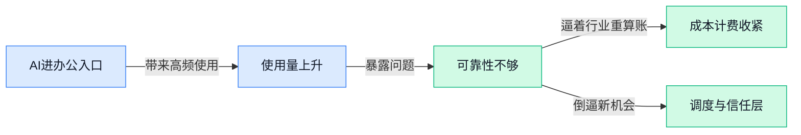

## AI资讯日报 2026/4/27

> AI 早报 · 每日早读 · 全网深度聚合

## **今日摘要**

```
GPT-5.5 基准测试领先却更贵且幻觉仍明显，OpenAI 还宣布 SWE-bench Verified 已不够评前沿编码
Anthropic 把 Claude 塞进 Word，亚马逊同步扩大战略合作，Claude 从写作助手一路压向企业入口
500 名投行人员实测指向 AI 仍达不到直接交付客户，Atlassian（协作软件巨头）HubSpot 转向按量收费
```

### 🔵 产品与功能更新


1. **Anthropic 推出 Claude for Word（把 Claude 放进 Word 里的写作助手）。**  
这次更新的核心，是让 **Claude** 直接进入 **Word（微软的文档编辑软件）** 使用场景，用户可以在写文档时就调用 AI 帮忙处理内容，而不用来回切换窗口 ✍️。对经常写汇报、方案、通知的人来说，这类内嵌式助手最大的意义是把“先写再改”变成“边写边协助”，工作流会更顺。原始信息聚焦在它的**功能、用途和使用方式**，说明 Anthropic 正继续把 AI 往日常办公软件里塞，离普通白领真正高频使用又近了一步 💡。[功能与用法报道(briefing)](https://news.google.com/rss/articles/CBMiugNBVV95cUxObHl4djJBLUMwd0lXS041aWpnTVBzdlZTZFBpM19vamhFMlo1SktGbXJvTi0tU200ZU5wazU0NkRscFVKUnRseGRrWmZuLUwxZURvOURzOWpON0tNazdBejkyRkNBa3U4bXUtNGU1dk5nZkhGRFBNQXBQSUk2NC1VYU8zZHZXcVZzUXRRQUpqM25PazU5RzRyTXpzVUJPZk9UN0wzdmtKWEdNVmQxSUFGeDU5MDRmMFJaRWllWFFCY255ZGE4X1ZNbVhlNWloblVSbE1yeW1WRDc5OTJpcHZDX0Vmb3lOR3JWMDh6dHZiR0dMNTh1bFBsaTVHRm9lSGQyLTNBTGRoTnJoYjMyMnZYV0R1ZjlMckFVbGhxR1Uyam8tV3FMSWQ1XzJiNEJoQjF0R2R6Ty10S1VVWVk1ekVMWEdHOWlJeDV4elhLQWp4czhxMEVhb2VoTmJycWpac0RMRFJrdGVsTFY4RWxuSkhCUkJQT3NsQjMyQURXeHFOb2ZScElKN2NMYXhMWVBjeG1kalRjT3RRNzNKd2prWk9qQVVZZEhPNmtLTDdKV2hoaFdRZ3lUNWU1WGt3?oc=5)


2. **Google 据报测试 Gemini 的 Mac 应用。**  
如果消息属实，**Gemini** 将不只是网页入口，还会变成 **Mac（苹果电脑操作系统）** 上的独立应用，这通常意味着更贴近桌面办公场景 🖥️。对用户来说，独立应用往往比浏览器标签页更方便常驻，也更容易接入本机文件、快捷键等日常操作。虽然报道用词是“**testing（测试中，说明还没正式大规模发布）**”，但这依然释放出一个信号：AI 助手正在从“一个网页”走向“电脑上的常驻生产力工具” 🚀。[测试消息报道(briefing)](https://news.google.com/rss/articles/CBMi5AJBVV95cUxQOHBHX3M1WEZ3eVM5SktUQmhuRm90ZGRpNjFSaEtTejlQN1o1MWxjOXY5OGJVak9GUV8zdFJ4NmJDTmc3UHVBOTMxR25aemhqc2RRcW1fTUk2T19ZR0RUdjZRNUFaQmE5T2w3S2lIMnBEbHREVGV3cmh3Wk1FRVpicERzRjM0YklMOFFSa0VFYjVzbTlSVjN3VXgzQ1BLR1NsMDVGaEY0QlY1X3BXY19zNE9KZ2twSmNPM2tiZUg1R2ZOS0RIUi1zS2dINEZxc1pMVHBNRnNBaTlLQ19YaWhiWUlleE16ckFTdy12Tktjd244dkNvSU5iTjljOWNCSjJFNF9JWXNWRzRXV3dwY2ljNFBNMzMzRTNwSWFVazJGS2JuX1hJTDhCam5EMXNwOEZOcVA0TnpmTl82dlBPU190LTVBeHowSEFBVEhZR0hkVnBJYTBIVFFEVkZrNkRQblJ5SGp5aQ?oc=5)


3. **“3 月最佳 AI 模型”预测榜单引发关注。**  
这条内容本质上是一份围绕**最佳 AI 模型**的赔率与预测盘点，更像行业热度观察，而不是某家公司的正式产品更新 📊。它反映出一件事：不同模型的竞争已经不只在技术圈内部讨论，连外部观察者都开始用“谁更可能胜出”的方式追踪格局变化。对普通职场人来说，这类榜单不一定告诉你“今天该用哪个”，但能帮助理解当前市场注意力正集中在哪些模型、哪些玩家身上 👀。[榜单与预测原文(briefing)](https://news.google.com/rss/articles/CBMia0FVX3lxTFB0QUZZOXFuQkF1Qi1peEd2cUgwN21xUC10WGZsczlCaUtBb3hJakhtbE54bVFiT2x4bzgtMVptR2pCNnpaOXZCeENEa2dwZFBqemR2UXAzbUR1TlBhcktsTHU1ZU9zeGUzYW5n?oc=5)

![“3 月最佳 AI 模型”预测榜单引发关注](https://image.pollinations.ai/prompt/%E2%80%9C3%20%E6%9C%88%E6%9C%80%E4%BD%B3%20AI%20%E6%A8%A1%E5%9E%8B%E2%80%9D%E9%A2%84%E6%B5%8B%E6%A6%9C%E5%8D%95%E5%BC%95%E5%8F%91%E5%85%B3%E6%B3%A8.%20%E2%80%9C3%20%E6%9C%88%E6%9C%80%E4%BD%B3%20AI%20%E6%A8%A1%E5%9E%8B%E2%80%9D%E9%A2%84%E6%B5%8B%E6%A6%9C%E5%8D%95%E5%BC%95%E5%8F%91%E5%85%B3%E6%B3%A8%E3%80%82%20%E8%BF%99%E6%9D%A1%E5%86%85%E5%AE%B9%E6%9C%AC%E8%B4%A8%E4%B8%8A%E6%98%AF%E4%B8%80%E4%BB%BD%E5%9B%B4%E7%BB%95%E6%9C%80%E4%BD%B3%20AI%20%E6%A8%A1%E5%9E%8B%E7%9A%84%E8%B5%94%E7%8E%87%E4%B8%8E%E9%A2%84%E6%B5%8B%E7%9B%98%E7%82%B9%EF%BC%8C%E6%9B%B4%E5%83%8F%E8%A1%8C%E4%B8%9A%E7%83%AD%E5%BA%A6%E8%A7%82%E5%AF%9F%EF%BC%8C%E8%80%8C%E4%B8%8D%E6%98%AF%E6%9F%90%E5%AE%B6%E5%85%AC%E5%8F%B8%E7%9A%84%E6%AD%A3%E5%BC%8F%E4%BA%A7%E5%93%81%E6%9B%B4%E6%96%B0%20%F0%9F%93%8A%E3%80%82%E5%AE%83%E5%8F%8D%2C%20technical%20infographic%20diagram%2C%20architecture%20flowchart%2C%20clean%20vector%20illustration%2C%20educational%20style%2C%20no%20text%20overlay%2C%20modern%20minimal%2C%20wide%20aspect?width=1200&height=675&nologo=true&seed=11451)

### 🟢 前沿研究


1. **EditCrafter（一种无需额外微调的高分辨率图片编辑方法）尝试让老模型直接完成精细修图。**
这篇研究聚焦 **高分辨率图像编辑**，核心卖点是 **tuning-free（无需额外微调，不用再拿新数据把模型重新训练一遍）**，直接基于 **pretrained diffusion model（预训练扩散模型，一类擅长从噪声生成图片的主流 AI 作图模型）** 来做修改 ✂️。对业务和设计同事来说，这类方向的意义在于：未来 AI 修图不一定要为每个新场景单独训练一版模型，而是更像“拿来即用”的通用编辑器。虽然这里还是论文阶段，但它瞄准的正是大家最关心的两点——**清晰度** 和 **改图成本**。[论文条目页(briefing)](https://huggingface.co/papers/2604.10268)


2. **500 名投行人员实测后发现：AI 产出仍没达到可直接交付客户的标准。**
这项报道提到，研究让 **500 名投资银行从业者** 审看 AI 生成内容，结论是目前还没有一份结果能直接用于 **client delivery（交付给客户的正式版本）** 💼。这很能提醒非技术团队：AI 在高风险、高专业度场景里，依然更适合当“初稿助手”，而不是最后拍板的人。尤其在金融这类对措辞、数字和合规都极敏感的行业，**人工复核** 仍是不可省的关键环节。[完整报道(briefing)](https://the-decoder.com/500-investment-bankers-review-ai-outputs-and-find-none-ready-for-client-delivery/)


3. **GPT-5.5 基准测试领先，但成本更高且幻觉问题仍然明显。**
报道指出，**GPT-5.5** 在多项 **benchmark（基准测试，用统一题目比较模型能力的测试集）** 上拿到领先成绩，但 **hallucination（模型幻觉，指 AI 一本正经地编错事实）** 依然频繁出现 📊。同时，它的 **API cost（接口调用成本，企业把模型接入产品时按量付费的价格）** 还比前代高出 20%，这对预算敏感的团队是很现实的考量。换句话说，模型“更强”不自动等于“更适合落地”，企业还得同时权衡 **准确率、稳定性和成本**。[完整评测报道(briefing)](https://the-decoder.com/gpt-5-5-tops-benchmarks-but-still-hallucinates-frequently-at-a-20-percent-higher-api-cost/)


4. **LLaTiSA（一套分难度处理时间序列推理的研究）想让 AI 更会读“会随时间变化的数据”。**
这篇论文讨论 **time series reasoning（时间序列推理，理解股价、销量、心率这类按时间连续变化的数据）**，并提出 **difficulty-stratified（按难度分层）** 的思路，从 **visual perception（视觉感知，先看懂图表或图像表面信息）** 一路走向 **semantics（语义理解，进一步明白背后的含义）** ⏱️。这类研究对金融分析、运营报表、医疗监测都很关键，因为现实工作里很多判断并不是看一个点，而是看“趋势怎么变”。如果 AI 真能分层理解简单波动和复杂模式，后续在报表解读、预警提示上的价值会更大。[论文条目页(briefing)](https://huggingface.co/papers/2604.17295)

![LLaTiSA（一套分难度处理时间序列推理的研究）想让 AI 更会读“会随时间变化的数据”](https://image.pollinations.ai/prompt/LLaTiSA%EF%BC%88%E4%B8%80%E5%A5%97%E5%88%86%E9%9A%BE%E5%BA%A6%E5%A4%84%E7%90%86%E6%97%B6%E9%97%B4%E5%BA%8F%E5%88%97%E6%8E%A8%E7%90%86%E7%9A%84%E7%A0%94%E7%A9%B6%EF%BC%89%E6%83%B3%E8%AE%A9%20AI%20%E6%9B%B4%E4%BC%9A%E8%AF%BB%E2%80%9C%E4%BC%9A%E9%9A%8F%E6%97%B6%E9%97%B4%E5%8F%98%E5%8C%96%E7%9A%84%E6%95%B0%E6%8D%AE%E2%80%9D.%20LLaTiSA%EF%BC%88%E4%B8%80%E5%A5%97%E5%88%86%E9%9A%BE%E5%BA%A6%E5%A4%84%E7%90%86%E6%97%B6%E9%97%B4%E5%BA%8F%E5%88%97%E6%8E%A8%E7%90%86%E7%9A%84%E7%A0%94%E7%A9%B6%EF%BC%89%E6%83%B3%E8%AE%A9%20AI%20%E6%9B%B4%E4%BC%9A%E8%AF%BB%E2%80%9C%E4%BC%9A%E9%9A%8F%E6%97%B6%E9%97%B4%E5%8F%98%E5%8C%96%E7%9A%84%E6%95%B0%E6%8D%AE%E2%80%9D%E3%80%82%20%E8%BF%99%E7%AF%87%E8%AE%BA%E6%96%87%E8%AE%A8%E8%AE%BA%20time%20series%20reasoning%EF%BC%88%E6%97%B6%E9%97%B4%E5%BA%8F%E5%88%97%2C%20technical%20infographic%20diagram%2C%20architecture%20flowchart%2C%20clean%20vector%20illustration%2C%20educational%20style%2C%20no%20text%20overlay%2C%20modern%20minimal%2C%20wide%20aspect?width=1200&height=675&nologo=true&seed=10900)


5. **WebGen-R1（一种用强化学习训练的网页生成模型）瞄准“既能用又好看”的网站自动生成。**
这项研究试图激励大模型生成兼顾 **functional（功能完整、可正常使用）** 和 **aesthetic（视觉美观）** 的网站，而不是只拼一个静态页面 🌐。它用到 **reinforcement learning（强化学习，让模型根据奖励不断调整行为，像做对题就加分）**，目标是让 AI 在“能不能运行”和“看起来顺不顺眼”之间找到平衡。对产品、运营和设计团队来说，这说明网页生成正从“演示图”走向更接近可交付作品的阶段。[论文条目页(briefing)](https://huggingface.co/papers/2604.20398)

![WebGen-R1（一种用强化学习训练的网页生成模型）瞄准“既能用又好看”的网站自动生成](https://image.pollinations.ai/prompt/WebGen-R1%EF%BC%88%E4%B8%80%E7%A7%8D%E7%94%A8%E5%BC%BA%E5%8C%96%E5%AD%A6%E4%B9%A0%E8%AE%AD%E7%BB%83%E7%9A%84%E7%BD%91%E9%A1%B5%E7%94%9F%E6%88%90%E6%A8%A1%E5%9E%8B%EF%BC%89%E7%9E%84%E5%87%86%E2%80%9C%E6%97%A2%E8%83%BD%E7%94%A8%E5%8F%88%E5%A5%BD%E7%9C%8B%E2%80%9D%E7%9A%84%E7%BD%91%E7%AB%99%E8%87%AA%E5%8A%A8%E7%94%9F%E6%88%90.%20WebGen-R1%EF%BC%88%E4%B8%80%E7%A7%8D%E7%94%A8%E5%BC%BA%E5%8C%96%E5%AD%A6%E4%B9%A0%E8%AE%AD%E7%BB%83%E7%9A%84%E7%BD%91%E9%A1%B5%E7%94%9F%E6%88%90%E6%A8%A1%E5%9E%8B%EF%BC%89%E7%9E%84%E5%87%86%E2%80%9C%E6%97%A2%E8%83%BD%E7%94%A8%E5%8F%88%E5%A5%BD%E7%9C%8B%E2%80%9D%E7%9A%84%E7%BD%91%E7%AB%99%E8%87%AA%E5%8A%A8%E7%94%9F%E6%88%90%E3%80%82%20%E8%BF%99%E9%A1%B9%E7%A0%94%E7%A9%B6%E8%AF%95%E5%9B%BE%E6%BF%80%E5%8A%B1%E5%A4%A7%E6%A8%A1%E5%9E%8B%E7%94%9F%E6%88%90%E5%85%BC%E9%A1%BE%20functional%EF%BC%88%E5%8A%9F%E8%83%BD%E5%AE%8C%E6%95%B4%E3%80%81%E5%8F%AF%E6%AD%A3%2C%20technical%20infographic%20diagram%2C%20architecture%20flowchart%2C%20clean%20vector%20illustration%2C%20educational%20style%2C%20no%20text%20overlay%2C%20modern%20minimal%2C%20wide%20aspect?width=1200&height=675&nologo=true&seed=10931)


6. **UniGenDet（一体化生成与识别框架）试图让 AI 画图和识别假图同步进化。**
这篇论文把 **generative-discriminative framework（生成-判别一体化框架，即一边生成内容、一边识别真假）** 放到同一个体系里，让图像生成和 **generated image detection（AI 生成图片检测，判断一张图是不是机器造的）** 共同演化 🕵️‍♀️。它的价值不只在“画得更像”，也在“查得更准”——因为生成模型越强，鉴别工具就越需要同步升级。对品牌、公关、内容审核团队来说，这类研究和未来的 **内容可信度** 建设关系很大。[论文条目页(briefing)](https://huggingface.co/papers/2604.21904)


7. **研究者称 AI Agent 正在扩展软件工程边界，而不只是替代写代码。**
这篇报道的核心观点是，**AI Agent** 对软件工程的影响，不应只理解为“帮程序员自动写几段代码”，而是把工作范围往需求理解、协调执行、验证反馈等环节继续外扩 🔄。这里的 **software engineering（软件工程，不只是写代码，还包括需求、测试、协作、维护等完整流程）** 被重新定义为更大的系统性工作。对非技术部门来说，这意味着未来和研发协作时，AI 可能参与的不只是开发，还会深入流程管理和任务分工。[完整研究解读(briefing)](https://the-decoder.com/ai-agents-arent-replacing-software-engineering-but-expanding-it-far-beyond-code-researchers-argue/)

![研究者称 AI Agent 正在扩展软件工程边界，而不只是替代写代码](https://image.pollinations.ai/prompt/%E7%A0%94%E7%A9%B6%E8%80%85%E7%A7%B0%20AI%20Agent%20%E6%AD%A3%E5%9C%A8%E6%89%A9%E5%B1%95%E8%BD%AF%E4%BB%B6%E5%B7%A5%E7%A8%8B%E8%BE%B9%E7%95%8C%EF%BC%8C%E8%80%8C%E4%B8%8D%E5%8F%AA%E6%98%AF%E6%9B%BF%E4%BB%A3%E5%86%99%E4%BB%A3%E7%A0%81.%20%E7%A0%94%E7%A9%B6%E8%80%85%E7%A7%B0%20AI%20Agent%20%E6%AD%A3%E5%9C%A8%E6%89%A9%E5%B1%95%E8%BD%AF%E4%BB%B6%E5%B7%A5%E7%A8%8B%E8%BE%B9%E7%95%8C%EF%BC%8C%E8%80%8C%E4%B8%8D%E5%8F%AA%E6%98%AF%E6%9B%BF%E4%BB%A3%E5%86%99%E4%BB%A3%E7%A0%81%E3%80%82%20%E8%BF%99%E7%AF%87%E6%8A%A5%E9%81%93%E7%9A%84%E6%A0%B8%E5%BF%83%E8%A7%82%E7%82%B9%E6%98%AF%EF%BC%8CAI%20Agent%20%E5%AF%B9%E8%BD%AF%E4%BB%B6%E5%B7%A5%E7%A8%8B%E7%9A%84%E5%BD%B1%E5%93%8D%EF%BC%8C%E4%B8%8D%E5%BA%94%E5%8F%AA%E7%90%86%E8%A7%A3%E4%B8%BA%E2%80%9C%E5%B8%AE%E7%A8%8B%E5%BA%8F%E5%91%98%E8%87%AA%E5%8A%A8%E5%86%99%E5%87%A0%2C%20technical%20infographic%20diagram%2C%20architecture%20flowchart%2C%20clean%20vector%20illustration%2C%20educational%20style%2C%20no%20text%20overlay%2C%20modern%20minimal%2C%20wide%20aspect?width=1200&height=675&nologo=true&seed=10993)


8. **Vista4D（一种基于 4D 点云的视频重拍方法）探索“拍完再换机位”的视频编辑。**
这项研究聚焦 **video reshooting（视频重拍，指素材拍完后再从新视角重新生成画面）**，底层依赖 **4D point clouds（四维点云，把三维空间中的点再加上时间变化，便于还原动态场景）** 🎥。简单说，它想做的是：不是只给视频加滤镜，而是让 AI 更像把场景“重新搭起来”，从而支持后期改视角、改镜头运动。对内容制作和广告团队而言，这代表视频编辑未来可能从“修画面”走向“重构拍摄现场”。[论文条目页(briefing)](https://huggingface.co/papers/2604.21915)

![Vista4D（一种基于 4D 点云的视频重拍方法）探索“拍完再换机位”的视频编辑](https://image.pollinations.ai/prompt/Vista4D%EF%BC%88%E4%B8%80%E7%A7%8D%E5%9F%BA%E4%BA%8E%204D%20%E7%82%B9%E4%BA%91%E7%9A%84%E8%A7%86%E9%A2%91%E9%87%8D%E6%8B%8D%E6%96%B9%E6%B3%95%EF%BC%89%E6%8E%A2%E7%B4%A2%E2%80%9C%E6%8B%8D%E5%AE%8C%E5%86%8D%E6%8D%A2%E6%9C%BA%E4%BD%8D%E2%80%9D%E7%9A%84%E8%A7%86%E9%A2%91%E7%BC%96%E8%BE%91.%20Vista4D%EF%BC%88%E4%B8%80%E7%A7%8D%E5%9F%BA%E4%BA%8E%204D%20%E7%82%B9%E4%BA%91%E7%9A%84%E8%A7%86%E9%A2%91%E9%87%8D%E6%8B%8D%E6%96%B9%E6%B3%95%EF%BC%89%E6%8E%A2%E7%B4%A2%E2%80%9C%E6%8B%8D%E5%AE%8C%E5%86%8D%E6%8D%A2%E6%9C%BA%E4%BD%8D%E2%80%9D%E7%9A%84%E8%A7%86%E9%A2%91%E7%BC%96%E8%BE%91%E3%80%82%20%E8%BF%99%E9%A1%B9%E7%A0%94%E7%A9%B6%E8%81%9A%E7%84%A6%20video%20reshooting%EF%BC%88%E8%A7%86%E9%A2%91%E9%87%8D%E6%8B%8D%EF%BC%8C%E6%8C%87%E7%B4%A0%E6%9D%90%E6%8B%8D%E5%AE%8C%E5%90%8E%E5%86%8D%E4%BB%8E%2C%20technical%20infographic%20diagram%2C%20architecture%20flowchart%2C%20clean%20vector%20illustration%2C%20educational%20style%2C%20no%20text%20overlay%2C%20modern%20minimal%2C%20wide%20aspect?width=1200&height=675&nologo=true&seed=11024)

### 🟡 行业展望与社会影响


1. **亚马逊与 Anthropic 扩大战略合作，AI 基础设施绑定进一步加深。**
亚马逊宣布与 Anthropic 继续扩大**战略合作**，这说明大模型竞争已经不只是拼产品，也在拼背后的**云基础设施**和长期资源协同 🤝。对普通公司来说，这类合作会影响未来买到什么样的 AI 服务、价格是否稳定，以及企业更容易接入哪一家的工具链。简单说，AI 行业正在从“谁模型更聪明”走向“谁能把模型、云平台和企业服务一起打包交付” 🚀。可参考[亚马逊官方说明(briefing)](https://news.google.com/rss/articles/CBMimgFBVV95cUxOM1FlbU1kTVBFR2RLTlJrc0l5cVBoS3QydUJTSlNOSWk4ZUNSSUhySGV2RnJYRnRkajJQY1FVTUdET3QybFFpazcySWx1bm9ja25ielpISWhRenZ1Rk1Fbm5wN0JsbXd5ZUo5ZjcyNU5mNmRWblJLbXpPQk50UGdQbTk4WXZ5UXRVckhtOU10cElhcEZDQXZPeFpR?oc=5)


2. **调查称 Claude 在美国的周活用户明显更富，这揭示 AI 助手用户分层。**
一项调查发现，Claude 在美国的**周活跃用户**（每周至少使用一次的人）相比其他 AI 助手更偏向**高收入人群**，这不只是用户画像问题，也意味着不同 AI 产品正在形成不同的市场定位 💡。对业务、运营和市场团队来说，这类数据很关键：它会直接影响品牌投放、定价策略和企业客户切入方式。换句话说，AI 助手不再只是“谁都能用的通用工具”，而是在逐渐长出更清晰的**人群分层**与消费能力差异。详情见[调查解读报道(briefing)](https://the-decoder.com/survey-finds-claudes-weekly-active-users-in-the-us-skew-far-wealthier-than-any-rival-ai-assistant/)

![调查称 Claude 在美国的周活用户明显更富，这揭示 AI 助手用户分层](https://image.pollinations.ai/prompt/%E8%B0%83%E6%9F%A5%E7%A7%B0%20Claude%20%E5%9C%A8%E7%BE%8E%E5%9B%BD%E7%9A%84%E5%91%A8%E6%B4%BB%E7%94%A8%E6%88%B7%E6%98%8E%E6%98%BE%E6%9B%B4%E5%AF%8C%EF%BC%8C%E8%BF%99%E6%8F%AD%E7%A4%BA%20AI%20%E5%8A%A9%E6%89%8B%E7%94%A8%E6%88%B7%E5%88%86%E5%B1%82.%20%E8%B0%83%E6%9F%A5%E7%A7%B0%20Claude%20%E5%9C%A8%E7%BE%8E%E5%9B%BD%E7%9A%84%E5%91%A8%E6%B4%BB%E7%94%A8%E6%88%B7%E6%98%8E%E6%98%BE%E6%9B%B4%E5%AF%8C%EF%BC%8C%E8%BF%99%E6%8F%AD%E7%A4%BA%20AI%20%E5%8A%A9%E6%89%8B%E7%94%A8%E6%88%B7%E5%88%86%E5%B1%82%E3%80%82%20%E4%B8%80%E9%A1%B9%E8%B0%83%E6%9F%A5%E5%8F%91%E7%8E%B0%EF%BC%8CClaude%20%E5%9C%A8%E7%BE%8E%E5%9B%BD%E7%9A%84%E5%91%A8%E6%B4%BB%E8%B7%83%E7%94%A8%E6%88%B7%EF%BC%88%E6%AF%8F%E5%91%A8%E8%87%B3%E5%B0%91%E4%BD%BF%E7%94%A8%E4%B8%80%E6%AC%A1%E7%9A%84%E4%BA%BA%EF%BC%89%E7%9B%B8%E6%AF%94%E5%85%B6%E4%BB%96%20A%2C%20technical%20infographic%20diagram%2C%20architecture%20flowchart%2C%20clean%20vector%20illustration%2C%20educational%20style%2C%20no%20text%20overlay%2C%20modern%20minimal%2C%20wide%20aspect?width=1200&height=675&nologo=true&seed=10838)

3. **“AI 比人还贵”正在出现，自动化不一定天然省钱。**
Axios 报道指出，如今某些场景下 **AI 成本**已经可能高于人工，这提醒企业别再把“上 AI”简单理解成“立刻降本” ⚠️。因为除了模型调用费用，还可能叠加部署、维护、流程改造和人工复核等隐性支出；尤其是高频调用的 **API**（应用程序接口，让不同软件自动互相传数据）场景，账单可能涨得很快。对管理层来说，更现实的问题是：哪些岗位适合 AI 辅助，哪些流程如果强行自动化，反而会先增加成本。可参考[Axios 报道原文(briefing)](https://news.google.com/rss/articles/CBMiZEFVX3lxTFAxYm1PQlRhSUtmUzltalE0OTY2Y0V1OGZSek1SaGhpWHM3Y2FoSGpTSEF5S29MUWRrLVJvX29XMkZ0VG1nZUJ0bm9oclBLVWhYS2dVNHVVdElwb0NHT2JJaDlTTEY?oc=5)

![“AI 比人还贵”正在出现，自动化不一定天然省钱](https://image.pollinations.ai/prompt/%E2%80%9CAI%20%E6%AF%94%E4%BA%BA%E8%BF%98%E8%B4%B5%E2%80%9D%E6%AD%A3%E5%9C%A8%E5%87%BA%E7%8E%B0%EF%BC%8C%E8%87%AA%E5%8A%A8%E5%8C%96%E4%B8%8D%E4%B8%80%E5%AE%9A%E5%A4%A9%E7%84%B6%E7%9C%81%E9%92%B1.%20%E2%80%9CAI%20%E6%AF%94%E4%BA%BA%E8%BF%98%E8%B4%B5%E2%80%9D%E6%AD%A3%E5%9C%A8%E5%87%BA%E7%8E%B0%EF%BC%8C%E8%87%AA%E5%8A%A8%E5%8C%96%E4%B8%8D%E4%B8%80%E5%AE%9A%E5%A4%A9%E7%84%B6%E7%9C%81%E9%92%B1%E3%80%82%20Axios%20%E6%8A%A5%E9%81%93%E6%8C%87%E5%87%BA%EF%BC%8C%E5%A6%82%E4%BB%8A%E6%9F%90%E4%BA%9B%E5%9C%BA%E6%99%AF%E4%B8%8B%20AI%20%E6%88%90%E6%9C%AC%E5%B7%B2%E7%BB%8F%E5%8F%AF%E8%83%BD%E9%AB%98%E4%BA%8E%E4%BA%BA%E5%B7%A5%EF%BC%8C%E8%BF%99%E6%8F%90%E9%86%92%E4%BC%81%E4%B8%9A%E5%88%AB%E5%86%8D%E6%8A%8A%E2%80%9C%E4%B8%8A%20AI%E2%80%9D%E7%AE%80%E5%8D%95%E7%90%86%E8%A7%A3%E6%88%90%E2%80%9C%E7%AB%8B%2C%20technical%20infographic%20diagram%2C%20architecture%20flowchart%2C%20clean%20vector%20illustration%2C%20educational%20style%2C%20no%20text%20overlay%2C%20modern%20minimal%2C%20wide%20aspect?width=1200&height=675&nologo=true&seed=10869)

4. **Atlassian（企业协作与项目管理软件公司）和 HubSpot（营销与销售管理平台）加入 AI“按量收费”转向。**
报道指出，Atlassian 和 HubSpot 正加入从 AI **统一平价套餐**转向更灵活收费模式的变化，这背后反映的是企业软件公司开始认真核算 AI 的真实使用成本 📊。过去很多厂商把 AI 当“免费加分项”塞进套餐里，但随着用户调用量上升，这种模式越来越难长期维持。对采购、财务和管理者来说，未来买 AI 软件可能更像交水电费：基础功能一个价，真正高频、重度使用再单独计费。详情可看[The Information 报道(briefing)](https://news.google.com/rss/articles/CBMiiAFBVV95cUxPbk9DVXdBc0Jja0F3VUZhUTNBU2RqMDNZYnF2Wm11bVFidXJwT05zVWtjOWVmMHdQeG9zX05IU0JpOWhURWxFdjFib2w5eUJDRnBsN3lrRVdRRG9vaEFlOExKZjZIM3YzOGg5bUFOendhSk4yTi1NWTNVTjcxUVB3ZWw0aWh4QjEw?oc=5)

![Atlassian（企业协作与项目管理软件公司）和 HubSpot（营销与销售管理平台）加入 AI“按量收费”转向](https://image.pollinations.ai/prompt/Atlassian%EF%BC%88%E4%BC%81%E4%B8%9A%E5%8D%8F%E4%BD%9C%E4%B8%8E%E9%A1%B9%E7%9B%AE%E7%AE%A1%E7%90%86%E8%BD%AF%E4%BB%B6%E5%85%AC%E5%8F%B8%EF%BC%89%E5%92%8C%20HubSpot%EF%BC%88%E8%90%A5%E9%94%80%E4%B8%8E%E9%94%80%E5%94%AE%E7%AE%A1%E7%90%86%E5%B9%B3%E5%8F%B0%EF%BC%89%E5%8A%A0%E5%85%A5%20AI%E2%80%9C%E6%8C%89%E9%87%8F%E6%94%B6%E8%B4%B9%E2%80%9D%E8%BD%AC%E5%90%91.%20Atlassian%EF%BC%88%E4%BC%81%E4%B8%9A%E5%8D%8F%E4%BD%9C%E4%B8%8E%E9%A1%B9%E7%9B%AE%E7%AE%A1%E7%90%86%E8%BD%AF%E4%BB%B6%E5%85%AC%E5%8F%B8%EF%BC%89%E5%92%8C%20HubSpot%EF%BC%88%E8%90%A5%E9%94%80%E4%B8%8E%E9%94%80%E5%94%AE%E7%AE%A1%E7%90%86%E5%B9%B3%E5%8F%B0%EF%BC%89%E5%8A%A0%E5%85%A5%20AI%E2%80%9C%E6%8C%89%E9%87%8F%E6%94%B6%E8%B4%B9%E2%80%9D%E8%BD%AC%E5%90%91%E3%80%82%20%E6%8A%A5%E9%81%93%E6%8C%87%E5%87%BA%EF%BC%8CAtlassian%20%E5%92%8C%20HubS%2C%20technical%20infographic%20diagram%2C%20architecture%20flowchart%2C%20clean%20vector%20illustration%2C%20educational%20style%2C%20no%20text%20overlay%2C%20modern%20minimal%2C%20wide%20aspect?width=1200&height=675&nologo=true&seed=10900)

5. **OpenAI 提醒：旧 prompt（给 AI 的指令写法）正在拖累 GPT-5.5 表现。**
OpenAI 表示，很多开发者沿用旧时代的 prompt 写法，反而限制了 GPT-5.5 的能力发挥，这说明模型升级后，人的使用习惯也得跟着升级 🧠。所谓 baseline（基线，可理解为“重新建立一套新的默认使用标准”），意思是不应继续拿旧模型时代的提示词模板来要求新模型。对企业内部来说，这件事很有现实意义：如果员工觉得“新模型没变强”，问题可能不在模型，而在仍用老方法提问、老流程评估。更多可看[OpenAI 提示词变化解读(briefing)](https://the-decoder.com/openai-says-old-prompts-are-holding-gpt-5-5-back-and-developers-need-a-fresh-baseline/)


6. **OpenAI 将 Codex 并入 GPT-5.5，专用编码模型路线继续收缩。**
报道提到，OpenAI 再次取消独立的 Codex，并把它并入 GPT-5.5，这反映出行业正在从“一个任务一个模型”走向“更通用的大模型统一处理更多工作” 🔄。从用户角度看，好处是产品线可能更简单；但对开发团队和企业采购来说，也意味着要重新适应新的能力边界和工作流。这里的 coding model（编码模型，专门用于写代码和理解程序的 AI）被合并，释放出的信号很明确：未来主流竞争点，也许不是细分模型数量，而是一个大模型能否覆盖更多真实工作场景。详情见[模型调整报道(briefing)](https://the-decoder.com/openai-kills-its-dedicated-coding-model-codex-again-folding-it-into-gpt-5-5/)


### 🟣 开源TOP项目

1. **ai-engineering-from-scratch（从零开始学 AI 工程的实战仓库）帮你把“会用模型”变成“能做产品”。**
这个项目主打 **Learn it / Build it / Ship it**，意思很直接：不只教你理解概念，还要真的做出来并交付给别人用，特别适合想系统补上 **AI 工程** 能力的人 🚀。对非技术同事来说，它的价值在于你能更清楚一款 AI 产品从想法到上线，中间到底要经过哪些环节，而不只是停留在“写个 prompt”层面。这里的 AI 工程指把模型、数据、流程和产品体验真正串起来的落地工作，比单纯聊天问答更接近企业实际使用场景。[GitHub 项目主页(briefing)](https://github.com/rohitg00/ai-engineering-from-scratch)


2. **baoyu-skills（面向 AI 助手的技能集合项目）展示了“给模型装能力包”的思路。**
这个仓库虽然摘要信息不多，但从项目命名看，核心是在整理一组可复用的 **skills（技能包，让 AI 在特定任务里更稳定地完成工作）** 💡。你可以把它理解成给 AI 助手准备“岗位 SOP（标准作业流程）+工具箱”，让它在不同场景下少走弯路。对企业内部来说，这类项目的启发是：未来很多重复性知识工作，可能不是靠一个万能模型解决，而是靠一套拆分清楚、可组合的技能体系来完成。[GitHub 仓库页(briefing)](https://github.com/JimLiu/baoyu-skills)


3. **Recordly（一款开源屏幕录制工具）想做 Screen Studio（知名录屏美化工具）的免费替代。**
它主打把普通录屏做得更 **polished（更精致、更适合直接展示或发布）**，而且是 **开源** 免费路线，明显瞄准内容创作者、产品演示和远程协作场景 ✨。这类工具对业务、运营、培训同事都很实用，因为很多时候大家需要快速做操作讲解、产品演示或问题复现视频，不一定非要依赖付费软件。简单说，Recordly 想解决的就是“录出来能看”和“团队能低成本使用”这两件事。[项目开源地址(briefing)](https://github.com/webadderallorg/Recordly)


4. **ruflo（面向 Claude 的 Agent 编排平台）瞄准多智能体协作与企业级自动化。**
这个项目把重点放在 **agent orchestration（智能体编排，让多个 AI 角色按分工协同完成任务）** 上，可以部署 **multi-agent swarms（多智能体集群，像一支由不同助手组成的小团队）**，去协调自动化工作流 🤖。摘要里还提到它支持 **RAG（检索增强生成，让 AI 回答前先查资料）**，这意味着它不只是“会聊天”，而是更适合接入企业知识库、流程和业务规则。对公司场景来说，这类平台代表的方向很明确：未来 AI 不只是一个对话框，而可能是多个专职助手一起完成客服、运营、知识查询、流程处理等任务。[GitHub 项目说明(briefing)](https://github.com/ruvnet/ruflo)


5. **awesome-ai-research-writing（AI 研究写作资源清单）想帮你摆脱反复润色的低效循环。**
项目定位很明确：提升 **AI research writing（AI 研究写作，包含论文、技术总结、实验说明等内容表达）** 质量，减少“写完再一遍遍抠字眼”的重复劳动 ✍️。哪怕你不是研究员，这类资源也有现实意义，因为现在很多团队都在写方案、报告、复盘和方法文档，AI 写作能力已经不只属于学术圈。它更像是一份整理好的参考地图，帮助大家把“能写”进一步提升到“写得更清楚、更专业”。[资源仓库入口(briefing)](https://github.com/Leey21/awesome-ai-research-writing)


6. **YourMemory（模拟生物遗忘机制的 AI 记忆方案）试图解决 RAG 越存越乱的问题。**
这个项目的核心观点很有意思：很多 **RAG（检索增强生成，让 AI 回答前先查资料）** 方案把记忆当成“永不清理的档案柜”，结果临时 bug 修复、已经废弃的规则也一直塞在里面，最后让 **context window（上下文窗口，模型一次能读进去的信息容量）** 被噪音挤爆，既涨 **token（模型处理文本时计算用的小单位）** 成本，又影响推理质量 🧠。它提出的是 **biological decay（生物式衰减，像人脑一样让不重要的信息逐渐淡出）** 的思路，并给出了 52% recall（召回率，系统从记忆里找回相关信息的能力）的结果。对做 AI 产品的人来说，这很重要，因为“记得更多”未必等于“答得更好”，真正有用的是让 AI 保留重要记忆、忘掉无效噪音。[GitHub 项目页(briefing)](https://github.com/sachitrafa/YourMemory)

![YourMemory（模拟生物遗忘机制的 AI 记忆方案）试图解决 RAG 越存越乱的问题](https://image.pollinations.ai/prompt/YourMemory%EF%BC%88%E6%A8%A1%E6%8B%9F%E7%94%9F%E7%89%A9%E9%81%97%E5%BF%98%E6%9C%BA%E5%88%B6%E7%9A%84%20AI%20%E8%AE%B0%E5%BF%86%E6%96%B9%E6%A1%88%EF%BC%89%E8%AF%95%E5%9B%BE%E8%A7%A3%E5%86%B3%20RAG%20%E8%B6%8A%E5%AD%98%E8%B6%8A%E4%B9%B1%E7%9A%84%E9%97%AE%E9%A2%98.%20YourMemory%EF%BC%88%E6%A8%A1%E6%8B%9F%E7%94%9F%E7%89%A9%E9%81%97%E5%BF%98%E6%9C%BA%E5%88%B6%E7%9A%84%20AI%20%E8%AE%B0%E5%BF%86%E6%96%B9%E6%A1%88%EF%BC%89%E8%AF%95%E5%9B%BE%E8%A7%A3%E5%86%B3%20RAG%20%E8%B6%8A%E5%AD%98%E8%B6%8A%E4%B9%B1%E7%9A%84%E9%97%AE%E9%A2%98%E3%80%82%20%E8%BF%99%E4%B8%AA%E9%A1%B9%E7%9B%AE%E7%9A%84%E6%A0%B8%E5%BF%83%E8%A7%82%E7%82%B9%E5%BE%88%E6%9C%89%E6%84%8F%E6%80%9D%EF%BC%9A%E5%BE%88%E5%A4%9A%20RAG%EF%BC%88%E6%A3%80%E7%B4%A2%E5%A2%9E%E5%BC%BA%E7%94%9F%E6%88%90%EF%BC%8C%E8%AE%A9%20AI%2C%20technical%20infographic%20diagram%2C%20architecture%20flowchart%2C%20clean%20vector%20illustration%2C%20educational%20style%2C%20no%20text%20overlay%2C%20modern%20minimal%2C%20wide%20aspect?width=1200&height=675&nologo=true&seed=11156)

### 🔴 社媒分享

1. **业余爱好者借助 ChatGPT 攻克 Erdős problem（数学家埃尔德什提出的公开难题）。**
这条社媒热议点不只是“ChatGPT 又赢了”，而是它被用在了**数学探索**这类高门槛场景里 😮。报道提到，一位业余研究者借助 ChatGPT 参与攻克一个已有 **60 年历史**的 Erdős problem（匈牙利数学家提出并长期悬而未决的问题），也让更多人开始讨论 AI 到底是在“给答案”，还是在“陪人一起推理”。对普通职场人来说，这件事最直观的启发是：AI 不一定替你成为专家，但它可能显著降低进入复杂领域的门槛，像一个会陪你反复推敲的助手。可先看 [完整报道(briefing)](https://www.scientificamerican.com/article/amateur-armed-with-chatgpt-vibe-maths-a-60-year-old-problem/) 和题目背景的 [埃尔德什问题页(briefing)](https://www.erdosproblems.com/1196) 💡


2. **OpenAI 新模型瞄准 PII（个人身份信息，可识别具体个人的数据）检测与打码。**
这条讨论聚焦的是一个很“接地气”的 AI 能力：自动识别并遮盖 **PII**，也就是姓名、电话、邮箱、住址这类敏感信息 🔒。如果这类模型成熟，企业在整理客服记录、表单、合同或内部文档时，就更容易先做**隐私脱敏**（把敏感内容隐藏后再使用），再交给 AI 分析，能减少数据泄露风险。对业务、行政、财务同事来说，这类工具的意义很直接——未来很多“先手动删隐私再处理”的繁琐动作，可能交给模型自动完成。[社区讨论帖(briefing)](https://www.reddit.com/r/LocalLLaMA/comments/1sw000s/new_model_for_detecting_and_masking_pii_from/) 🚀

![OpenAI 新模型瞄准 PII（个人身份信息，可识别具体个人的数据）检测与打码](https://image.pollinations.ai/prompt/OpenAI%20%E6%96%B0%E6%A8%A1%E5%9E%8B%E7%9E%84%E5%87%86%20PII%EF%BC%88%E4%B8%AA%E4%BA%BA%E8%BA%AB%E4%BB%BD%E4%BF%A1%E6%81%AF%EF%BC%8C%E5%8F%AF%E8%AF%86%E5%88%AB%E5%85%B7%E4%BD%93%E4%B8%AA%E4%BA%BA%E7%9A%84%E6%95%B0%E6%8D%AE%EF%BC%89%E6%A3%80%E6%B5%8B%E4%B8%8E%E6%89%93%E7%A0%81.%20OpenAI%20%E6%96%B0%E6%A8%A1%E5%9E%8B%E7%9E%84%E5%87%86%20PII%EF%BC%88%E4%B8%AA%E4%BA%BA%E8%BA%AB%E4%BB%BD%E4%BF%A1%E6%81%AF%EF%BC%8C%E5%8F%AF%E8%AF%86%E5%88%AB%E5%85%B7%E4%BD%93%E4%B8%AA%E4%BA%BA%E7%9A%84%E6%95%B0%E6%8D%AE%EF%BC%89%E6%A3%80%E6%B5%8B%E4%B8%8E%E6%89%93%E7%A0%81%E3%80%82%20%E8%BF%99%E6%9D%A1%E8%AE%A8%E8%AE%BA%E8%81%9A%E7%84%A6%E7%9A%84%E6%98%AF%E4%B8%80%E4%B8%AA%E5%BE%88%E2%80%9C%E6%8E%A5%E5%9C%B0%E6%B0%94%E2%80%9D%E7%9A%84%20AI%20%E8%83%BD%E5%8A%9B%EF%BC%9A%E8%87%AA%E5%8A%A8%E8%AF%86%E5%88%AB%E5%B9%B6%E9%81%AE%E7%9B%96%20PII%EF%BC%8C%E4%B9%9F%E5%B0%B1%2C%20technical%20infographic%20diagram%2C%20architecture%20flowchart%2C%20clean%20vector%20illustration%2C%20educational%20style%2C%20no%20text%20overlay%2C%20modern%20minimal%2C%20wide%20aspect?width=1200&height=675&nologo=true&seed=10644)

3. **OpenAI：SWE-bench Verified（评估 AI 编程能力的基准测试）已不再适合衡量前沿编码水平。**
OpenAI 这次公开表态的核心是：**SWE-bench Verified** 这个常被拿来比较模型写代码能力的测试，已经不太能反映最前沿模型的真实水平了。所谓 benchmark（基准测试，就是用一套固定题目来给模型“统一考试”），一旦被模型做得越来越熟，分数就可能继续涨，但不代表真实工作场景里也同样进步 📈。这对行业是个提醒：以后看 AI 编程产品时，不能只盯排行榜，还得关注它在真实项目、复杂协作和长流程任务里的表现。OpenAI 的详细解释可看 [官方说明页(briefing)](https://openai.com/index/why-we-no-longer-evaluate-swe-bench-verified/) 💡


---



### 📊 行业洞察（今日 4 条）

1. Anthropic把 Claude 塞进 Word，Google 又在测试 Gemini 的 Mac（苹果电脑操作系统）应用
  【洞察】AI 正从“打开网页问一下”变成“常驻在办公现场”；入口越贴近日常动作，谁就更容易吃掉高频使用时长

2. GPT-5.5 基准测试（统一题目考试）领先却更贵、幻觉仍多；500 名投行人员也认定 AI 结果还不能直交客户
  【洞察】模型分数再高，也没跨过“可放心交付”这道坎；行业真正缺的不是更会答题，而是更可靠的过程与复核

3. “AI 比人还贵”、Atlassian（企业协作与项目管理软件公司）和 HubSpot（营销与销售管理平台）转向按量收费
  【洞察】AI 商业化开始回归算账阶段；过去靠“免费送 AI”拉新结束了，接下来拼的是谁能把效果和成本一起讲清楚

4. OpenAI 说旧 prompt（给 AI 的指令写法）拖累 GPT-5.5，又把 Codex 并入 GPT-5.5；SWE-bench Verified（评估 AI 编程能力的测试）也被判过时
  【洞察】行业在抛弃“一个榜单、一个专用模型、一个固定用法”老思路，转向更通用模型加更动态的人机协作

### 💭 对我们的启发（今日 3 条）

1. GPT-5.5 更强却更贵、还会编错，说明我们不能把平台价值押在“接入最强模型”上，得做结果分级、人工接管和多模型兜底。

2. Atlassian（企业协作与项目管理软件公司）和 HubSpot（营销与销售管理平台）改按量收费，提醒我们早期就要设计“任务级成本看板”，否则调度平台很难建立信任。

3. Claude 进 Word、Gemini 进 Mac（苹果电脑操作系统）说明用户会被原生入口截走；我们不能只做总控台，还得想办法嵌进真实任务流里。

