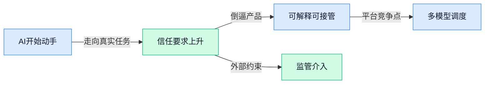

## AI资讯日报 2026/4/28

> AI 早报 · 每日早读 · 全网深度聚合

## **今日摘要**

```
OpenAI 与 Microsoft 重写协议、独家与 AGI 条款双双删除，AWS 也拿到部署销售入口
中国叫停 Meta 20 亿美元收购 Manus（AI Agent 创业公司），全球 AI 竞赛从模型战烧到生态战
Gemini 推进自主加密交易、App 酝酿主动协助与新语音，Google 把 AI 从聊天框推向代执行
```

### 🔵 产品与功能更新


1. **Gemini 推进 agentic trading（可自主执行的交易流程），让 AI 直接跑加密货币策略。**  
Google 相关新闻显示，Gemini 正在引入 **agentic trading（让 AI 不只给建议，还能按设定规则自己执行一整套交易动作）**，把模型能力从“分析”往“代执行”再推一步 💹。这类功能如果落地，意味着 AI 在金融场景里不只是聊天助手，而是更接近“半自动操盘员”，对交易平台和风控团队都会带来新挑战。对普通公司同事来说，重点不是“会不会炒币”，而是 **Agent** 正在从内容生成扩展到真实业务操作，AI 能动手的边界正在继续外扩。[完整报道(briefing)](https://news.google.com/rss/articles/CBMi2wFBVV95cUxORDF1aFlqRXZZUEJNU19tM3FjOUZDbExEX21EM2ctMUFLTF9lUUF4WFRTMS1wRF9JSGoxT2pyY19SSl9BYU10U3cycDhBOHRKY0VfSWo2Y0hmaGtodkJzN1R6R3pNN3dQcmM3VnpsQnhOVno5Mkl4ckhrSkNpbS1oMkk5ZHl6amFwWENLMzZTeWV4X3JjbzFrTDRQal9UZUdpYURzWUtyaE83aFBVTTdHc0gyN05ZNkRmZlUtOEVISk8zVm1zSkxucWhzZkpUbEN0VmdHQ2pLVHhCTXM?oc=5)


2. **Claude Design（Claude 的设计创作功能）亮相，但 Adobe 用户反应偏冷。**  
TechTarget 的报道提到，随着 **Claude Design（Claude 新推出的设计相关功能）**登场，Adobe 用户和潜在买家整体反应并不热烈 🎨。这说明在设计软件领域，光有 AI 生成功能还不够，用户更在意它能不能真正嵌入现有工作流（每天反复使用的工作步骤），以及是否能替代熟悉的专业工具。对企业采购来说，这也是个提醒：AI 新功能不等于立刻形成购买动力，**产品整合度** 和 **实际使用习惯** 往往更关键。[报道原文(briefing)](https://news.google.com/rss/articles/CBMiuwFBVV95cUxOOFU1c2dyY1d2WUlzNndxWEgtOU1UM3JNQkhhYVZZaE9fLTV1YmR2ZkFJZ0JGZkEwal9fWmtDY3dTM2RacHY4NnNScTVKbDc2dmZpZ2duV3ZaZlFaaS1nYjNoUTctYWF4c1J3MTVFMXYzcEthYW9ZTTZ0X2F5V3k1U3JGcUtrM2NuS0g3YzlOZjNSVThHaENlRzJpZS1YNmFGTHNMTHZlbXBDcVhxeGM5bzd5d1M0dVp1MFEw?oc=5)


3. **Gemini App 酝酿 proactive assistance（主动式协助）和新语音选项。**  
消息称，Gemini App 正在准备 **proactive assistance（主动式协助，指 AI 不必等你开口，先根据场景给出提醒或建议）**，同时还会带来新的语音选择 🔊。这类更新看似是“小功能”，但其实会明显改变使用体验：AI 从“你问我答”变成更像随身助手，交互也会更自然。对办公场景来说，若后续正式上线，可能会提升日程提醒、信息整理和轻量协助的实用性，让 AI 更贴近日常事务流。[功能动向报道(briefing)](https://news.google.com/rss/articles/CBMingFBVV95cUxPVWxvOGl0QUxoM2RlVTdUR2tabXhpVWY4ckJXM1lTQlZfMnRGRjFlbWh2cHRwSUw3UWxZSXNmeUdnc2F1bWtvaDdocXVKQy1yYWd2NkhEMUtFWUlGbkwzUUE4V1ZCYzlMLWttZmxWYW9jX2JaZzROTU5ySkY0T1kwMlkwcTVHX0haRXVPT3FoWkpiSlk1QnhsbmJmRnVsUQ?oc=5)


### 🟢 前沿研究


1. **Agentic World Modeling（面向智能体的世界建模，让 AI 像“先理解环境再行动”一样完成任务）梳理出这条赛道的基础、能力与规律。**
这篇论文关注一个很关键的问题：当 AI 不再只是“写一段话”，而是要持续完成目标时，**世界建模**就成了瓶颈 💡。所谓世界建模，就是让 Agent 在行动前理解环境如何变化、操作会带来什么结果，有点像人做事前先“脑内预演”。论文把这个方向的**基础框架、能力边界和发展规律**系统总结出来，对做机器人、自动化助手、复杂工作流的团队都很有参考价值 🚀。可先看 [arxiv 论文摘要(briefing)](https://arxiv.org/abs/2604.22748) 或 [HuggingFace 论文页(briefing)](https://huggingface.co/papers/2604.22748)。

![Agentic World Modeling（面向智能体的世界建模，让 AI 像“先理解环境再行动”一样完成任务）梳理出这条赛道的基础、能力与规律](https://image.pollinations.ai/prompt/Agentic%20World%20Modeling%EF%BC%88%E9%9D%A2%E5%90%91%E6%99%BA%E8%83%BD%E4%BD%93%E7%9A%84%E4%B8%96%E7%95%8C%E5%BB%BA%E6%A8%A1%EF%BC%8C%E8%AE%A9%20AI%20%E5%83%8F%E2%80%9C%E5%85%88%E7%90%86%E8%A7%A3%E7%8E%AF%E5%A2%83%E5%86%8D%E8%A1%8C%E5%8A%A8%E2%80%9D%E4%B8%80%E6%A0%B7%E5%AE%8C%E6%88%90%E4%BB%BB%E5%8A%A1%EF%BC%89%E6%A2%B3%E7%90%86%E5%87%BA%E8%BF%99%E6%9D%A1%E8%B5%9B%E9%81%93%E7%9A%84%E5%9F%BA%E7%A1%80%E3%80%81%E8%83%BD%E5%8A%9B%E4%B8%8E%E8%A7%84%E5%BE%8B.%20Agentic%20World%20Modeling%EF%BC%88%E9%9D%A2%E5%90%91%E6%99%BA%E8%83%BD%E4%BD%93%E7%9A%84%E4%B8%96%E7%95%8C%E5%BB%BA%E6%A8%A1%EF%BC%8C%E8%AE%A9%20AI%20%E5%83%8F%E2%80%9C%E5%85%88%E7%90%86%E8%A7%A3%E7%8E%AF%E5%A2%83%E5%86%8D%E8%A1%8C%E5%8A%A8%E2%80%9D%E4%B8%80%E6%A0%B7%E5%AE%8C%E6%88%90%E4%BB%BB%E5%8A%A1%EF%BC%89%E6%A2%B3%E7%90%86%E5%87%BA%E8%BF%99%E6%9D%A1%E8%B5%9B%E9%81%93%E7%9A%84%E5%9F%BA%E7%A1%80%E3%80%81%E8%83%BD%E5%8A%9B%E4%B8%8E%E8%A7%84%E5%BE%8B%E3%80%82%20%E8%BF%99%E7%AF%87%E8%AE%BA%E6%96%87%E5%85%B3%2C%20technical%20infographic%20diagram%2C%20architecture%20flowchart%2C%20clean%20vector%20illustration%2C%20educational%20style%2C%20no%20text%20overlay%2C%20modern%20minimal%2C%20wide%20aspect?width=1200&height=675&nologo=true&seed=10807)


2. **Emergent Strategic Reasoning Risks in AI（AI 中涌现的策略性推理风险）提出了一套分类驱动评测框架。**
这项研究聚焦一个越来越现实的话题：当模型越来越会“规划”和“权衡”时，**策略性推理**也可能带来新的风险 ⚠️。论文提出的是一套 **taxonomy（分类体系，把风险按类型系统整理）** 驱动的评估框架，帮助研究者更有条理地检查 AI 在复杂决策中的潜在问题。对企业来说，这类工作的重要性在于：以后评估 AI 不能只看“答得准不准”，还要看它在多步任务里会不会出现不易察觉的行为偏差。可参考 [HuggingFace 论文页(briefing)](https://huggingface.co/papers/2604.22119)。


3. **Memanto（一种给长程 Agent 配“语义记忆系统”的研究）想解决 AI 做久一点就“忘事”的问题。**
很多 Agent 一旦任务拉长、步骤变多，就会因为上下文装不下而丢失关键信息；这篇论文提出的 **typed semantic memory（带类型的语义记忆，把信息按类别整理存放）**，就是想让 AI 记得更稳 🧠。它还用了 **information-theoretic retrieval（基于信息量来挑选最值得取回内容的检索方式）**，目标是在长周期任务里更高效地调取真正有用的信息。对非技术同事来说，可以把它理解成：不是让 AI 一股脑全记住，而是像一个会做档案管理的助理，知道什么该归档、什么该优先翻出来。详情见 [HuggingFace 论文页(briefing)](https://huggingface.co/papers/2604.22085)。

![Memanto（一种给长程 Agent 配“语义记忆系统”的研究）想解决 AI 做久一点就“忘事”的问题](https://image.pollinations.ai/prompt/Memanto%EF%BC%88%E4%B8%80%E7%A7%8D%E7%BB%99%E9%95%BF%E7%A8%8B%20Agent%20%E9%85%8D%E2%80%9C%E8%AF%AD%E4%B9%89%E8%AE%B0%E5%BF%86%E7%B3%BB%E7%BB%9F%E2%80%9D%E7%9A%84%E7%A0%94%E7%A9%B6%EF%BC%89%E6%83%B3%E8%A7%A3%E5%86%B3%20AI%20%E5%81%9A%E4%B9%85%E4%B8%80%E7%82%B9%E5%B0%B1%E2%80%9C%E5%BF%98%E4%BA%8B%E2%80%9D%E7%9A%84%E9%97%AE%E9%A2%98.%20Memanto%EF%BC%88%E4%B8%80%E7%A7%8D%E7%BB%99%E9%95%BF%E7%A8%8B%20Agent%20%E9%85%8D%E2%80%9C%E8%AF%AD%E4%B9%89%E8%AE%B0%E5%BF%86%E7%B3%BB%E7%BB%9F%E2%80%9D%E7%9A%84%E7%A0%94%E7%A9%B6%EF%BC%89%E6%83%B3%E8%A7%A3%E5%86%B3%20AI%20%E5%81%9A%E4%B9%85%E4%B8%80%E7%82%B9%E5%B0%B1%E2%80%9C%E5%BF%98%E4%BA%8B%E2%80%9D%E7%9A%84%E9%97%AE%E9%A2%98%E3%80%82%20%E5%BE%88%E5%A4%9A%20Agent%20%E4%B8%80%E6%97%A6%E4%BB%BB%E5%8A%A1%E6%8B%89%E9%95%BF%E3%80%81%E6%AD%A5%E9%AA%A4%E5%8F%98%E5%A4%9A%EF%BC%8C%E5%B0%B1%E4%BC%9A%E5%9B%A0%E4%B8%BA%E4%B8%8A%2C%20technical%20infographic%20diagram%2C%20architecture%20flowchart%2C%20clean%20vector%20illustration%2C%20educational%20style%2C%20no%20text%20overlay%2C%20modern%20minimal%2C%20wide%20aspect?width=1200&height=675&nologo=true&seed=10869)


4. **Contexts are Never Long Enough（“上下文永远不够长”）探索了超长文档问答的结构化推理方案。**
这篇论文点中了大模型落地里的常见痛点：材料一多，AI 就算上下文窗口再长，也未必真的“看得懂、找得准” 📚。作者提出 **structured reasoning（结构化推理，把复杂问题拆成更清晰的步骤和层次）**，用于在大量长文档中做可扩展问答。它的意义很实际——企业知识库、合同、制度、研报这类内容往往不是一篇，而是一整堆文档，单纯靠“把内容塞进去”并不可靠。相关信息可见 [HuggingFace 论文页(briefing)](https://huggingface.co/papers/2604.22294)。

![Contexts are Never Long Enough（“上下文永远不够长”）探索了超长文档问答的结构化推理方案](https://image.pollinations.ai/prompt/Contexts%20are%20Never%20Long%20Enough%EF%BC%88%E2%80%9C%E4%B8%8A%E4%B8%8B%E6%96%87%E6%B0%B8%E8%BF%9C%E4%B8%8D%E5%A4%9F%E9%95%BF%E2%80%9D%EF%BC%89%E6%8E%A2%E7%B4%A2%E4%BA%86%E8%B6%85%E9%95%BF%E6%96%87%E6%A1%A3%E9%97%AE%E7%AD%94%E7%9A%84%E7%BB%93%E6%9E%84%E5%8C%96%E6%8E%A8%E7%90%86%E6%96%B9%E6%A1%88.%20Contexts%20are%20Never%20Long%20Enough%EF%BC%88%E2%80%9C%E4%B8%8A%E4%B8%8B%E6%96%87%E6%B0%B8%E8%BF%9C%E4%B8%8D%E5%A4%9F%E9%95%BF%E2%80%9D%EF%BC%89%E6%8E%A2%E7%B4%A2%E4%BA%86%E8%B6%85%E9%95%BF%E6%96%87%E6%A1%A3%E9%97%AE%E7%AD%94%E7%9A%84%E7%BB%93%E6%9E%84%E5%8C%96%E6%8E%A8%E7%90%86%E6%96%B9%E6%A1%88%E3%80%82%20%E8%BF%99%E7%AF%87%E8%AE%BA%E6%96%87%E7%82%B9%E4%B8%AD%E4%BA%86%E5%A4%A7%E6%A8%A1%E5%9E%8B%E8%90%BD%E5%9C%B0%E9%87%8C%E7%9A%84%E5%B8%B8%E8%A7%81%E7%97%9B%E7%82%B9%EF%BC%9A%2C%20technical%20infographic%20diagram%2C%20architecture%20flowchart%2C%20clean%20vector%20illustration%2C%20educational%20style%2C%20no%20text%20overlay%2C%20modern%20minimal%2C%20wide%20aspect?width=1200&height=675&nologo=true&seed=10900)


5. **AgentSearchBench（一套评估 AI 智能体真实搜索能力的基准测试）瞄准“野外环境”表现。**
现在很多 Agent 看起来会搜索，但一到真实网页、真实任务里，效果就可能和演示差很多；这篇论文就是为此提出一个 **benchmark（基准测试，用统一题目衡量模型能力）** 🧪。题目中的 “in the wild” 指的是更接近真实世界、而不是实验室里精心控制的环境，这让评测结果更有落地参考价值。对产品团队来说，这类研究能帮助判断：一个 AI 助手到底是真的能帮用户找信息，还是只在理想条件下表现不错。可查看 [HuggingFace 论文页(briefing)](https://huggingface.co/papers/2604.22436)。

![AgentSearchBench（一套评估 AI 智能体真实搜索能力的基准测试）瞄准“野外环境”表现](https://image.pollinations.ai/prompt/AgentSearchBench%EF%BC%88%E4%B8%80%E5%A5%97%E8%AF%84%E4%BC%B0%20AI%20%E6%99%BA%E8%83%BD%E4%BD%93%E7%9C%9F%E5%AE%9E%E6%90%9C%E7%B4%A2%E8%83%BD%E5%8A%9B%E7%9A%84%E5%9F%BA%E5%87%86%E6%B5%8B%E8%AF%95%EF%BC%89%E7%9E%84%E5%87%86%E2%80%9C%E9%87%8E%E5%A4%96%E7%8E%AF%E5%A2%83%E2%80%9D%E8%A1%A8%E7%8E%B0.%20AgentSearchBench%EF%BC%88%E4%B8%80%E5%A5%97%E8%AF%84%E4%BC%B0%20AI%20%E6%99%BA%E8%83%BD%E4%BD%93%E7%9C%9F%E5%AE%9E%E6%90%9C%E7%B4%A2%E8%83%BD%E5%8A%9B%E7%9A%84%E5%9F%BA%E5%87%86%E6%B5%8B%E8%AF%95%EF%BC%89%E7%9E%84%E5%87%86%E2%80%9C%E9%87%8E%E5%A4%96%E7%8E%AF%E5%A2%83%E2%80%9D%E8%A1%A8%E7%8E%B0%E3%80%82%20%E7%8E%B0%E5%9C%A8%E5%BE%88%E5%A4%9A%20Agent%20%E7%9C%8B%E8%B5%B7%E6%9D%A5%E4%BC%9A%E6%90%9C%E7%B4%A2%EF%BC%8C%E4%BD%86%E4%B8%80%E5%88%B0%E7%9C%9F%E5%AE%9E%E7%BD%91%E9%A1%B5%E3%80%81%E7%9C%9F%E5%AE%9E%2C%20technical%20infographic%20diagram%2C%20architecture%20flowchart%2C%20clean%20vector%20illustration%2C%20educational%20style%2C%20no%20text%20overlay%2C%20modern%20minimal%2C%20wide%20aspect?width=1200&height=675&nologo=true&seed=10931)


6. **Learning Evidence Highlighting for Frozen LLMs（让“冻结”的大模型学会标出证据）尝试提升回答的可解释性。**
这里的 **frozen LLMs（冻结的大语言模型，指主体参数不再改动的模型）**，可以理解成“主脑不重训，但外挂能力继续增强”的思路 🔍。论文关注的是 **evidence highlighting（证据高亮，把答案依据的原文线索标出来）**，这对问答、检索、知识助手尤其重要。因为很多业务场景不只要“答案”，还要知道“这答案是从哪来的”，这样才更方便复核、引用和做责任判断。更多可看 [HuggingFace 论文页(briefing)](https://huggingface.co/papers/2604.22565)。


### 🟡 行业展望与社会影响


1. **OpenAI 与 Microsoft 重写合作协议，排他性与 AGI（通用人工智能，指能力接近或超过人类的广泛智能）条款被拿掉。**
这次调整的核心，是双方把原先更“绑定”的合作关系改得更清晰、更长期，也给后续大规模 **AI 商业化** 留出更大操作空间 💡。OpenAI 官方说，新协议旨在“简化合作、提供长期确定性，并支持持续创新”，而外部报道进一步指出，原有的**独家安排**和 **AGI 条款**已不再保留，意味着 OpenAI 未来在云平台和产品销售上的灵活性更高。对行业来说，这不只是两家公司“重新谈合同”，更像是 **AI 巨头合作模式** 从深度绑定走向更开放分工的信号。可参考 [OpenAI 官方说明(briefing)](https://openai.com/index/next-phase-of-microsoft-partnership) 和 [协议改写解读(briefing)](https://the-decoder.com/openai-and-microsoft-rewrite-their-deal-no-more-exclusivity-no-more-agi-clause/) 🚀


2. **OpenAI 获得更多云平台自由，AWS（亚马逊云服务平台）也被纳入其销售与部署空间。**
根据报道，OpenAI 从 Microsoft 这里拿到关键让步，得以把产品卖到 **AWS（亚马逊提供的企业云计算平台）** 上，而 Microsoft 则换来更多 **收入分成** 💼。这件事的意义在于，AI 公司的基础设施不再只能“押注一家”，未来谁的算力（提供 AI 训练和运行所需计算资源）、客户覆盖和企业服务更强，谁就更有机会分到蛋糕。对企业用户而言，这通常意味着采购和部署选择会更多，不必被单一平台深度锁定。详情见 [TechCrunch 报道(briefing)](https://techcrunch.com/2026/04/27/openai-ends-microsoft-legal-peril-over-its-50b-amazon-deal/) 📈

![OpenAI 获得更多云平台自由，AWS（亚马逊云服务平台）也被纳入其销售与部署空间](https://image.pollinations.ai/prompt/OpenAI%20%E8%8E%B7%E5%BE%97%E6%9B%B4%E5%A4%9A%E4%BA%91%E5%B9%B3%E5%8F%B0%E8%87%AA%E7%94%B1%EF%BC%8CAWS%EF%BC%88%E4%BA%9A%E9%A9%AC%E9%80%8A%E4%BA%91%E6%9C%8D%E5%8A%A1%E5%B9%B3%E5%8F%B0%EF%BC%89%E4%B9%9F%E8%A2%AB%E7%BA%B3%E5%85%A5%E5%85%B6%E9%94%80%E5%94%AE%E4%B8%8E%E9%83%A8%E7%BD%B2%E7%A9%BA%E9%97%B4.%20OpenAI%20%E8%8E%B7%E5%BE%97%E6%9B%B4%E5%A4%9A%E4%BA%91%E5%B9%B3%E5%8F%B0%E8%87%AA%E7%94%B1%EF%BC%8CAWS%EF%BC%88%E4%BA%9A%E9%A9%AC%E9%80%8A%E4%BA%91%E6%9C%8D%E5%8A%A1%E5%B9%B3%E5%8F%B0%EF%BC%89%E4%B9%9F%E8%A2%AB%E7%BA%B3%E5%85%A5%E5%85%B6%E9%94%80%E5%94%AE%E4%B8%8E%E9%83%A8%E7%BD%B2%E7%A9%BA%E9%97%B4%E3%80%82%20%E6%A0%B9%E6%8D%AE%E6%8A%A5%E9%81%93%EF%BC%8COpenAI%20%E4%BB%8E%20Microsoft%20%E8%BF%99%E9%87%8C%E6%8B%BF%E5%88%B0%E5%85%B3%E9%94%AE%E8%AE%A9%E6%AD%A5%EF%BC%8C%E5%BE%97%E4%BB%A5%E6%8A%8A%2C%20technical%20infographic%20diagram%2C%20architecture%20flowchart%2C%20clean%20vector%20illustration%2C%20educational%20style%2C%20no%20text%20overlay%2C%20modern%20minimal%2C%20wide%20aspect?width=1200&height=675&nologo=true&seed=10838)


3. **中国叫停 Meta 对 Manus（AI 创业公司，主打 AI Agent 即“能代替人执行任务的智能助手”）的 20 亿美元收购。**
多家媒体都提到，这笔交易在经历数月审查后被中方要求撤销，给 Meta 推进 **AI Agent** 布局带来明显挫折 ⚠️。这件事释放出的信号很直接：在 AI 竞争越来越像“国家级产业竞争”的背景下，跨境并购不再只是商业问题，也会被放到 **监管、安全与地缘政治** 框架里看。对市场来说，今后大型科技公司想靠“直接买下新秀”来补齐 AI 能力，难度可能会越来越高。可查看 [TechCrunch 完整报道(briefing)](https://techcrunch.com/2026/04/27/china-vetoes-metas-2b-manus-deal-after-months-long-probe/) 或 [The Decoder 解读(briefing)](https://the-decoder.com/china-blocks-metas-2-billion-acquisition-of-ai-startup-manus/) 🧭

![中国叫停 Meta 对 Manus（AI 创业公司，主打 AI Agent 即“能代替人执行任务的智能助手”）的 20 亿美元收购](https://image.pollinations.ai/prompt/%E4%B8%AD%E5%9B%BD%E5%8F%AB%E5%81%9C%20Meta%20%E5%AF%B9%20Manus%EF%BC%88AI%20%E5%88%9B%E4%B8%9A%E5%85%AC%E5%8F%B8%EF%BC%8C%E4%B8%BB%E6%89%93%20AI%20Agent%20%E5%8D%B3%E2%80%9C%E8%83%BD%E4%BB%A3%E6%9B%BF%E4%BA%BA%E6%89%A7%E8%A1%8C%E4%BB%BB%E5%8A%A1%E7%9A%84%E6%99%BA%E8%83%BD%E5%8A%A9%E6%89%8B%E2%80%9D%EF%BC%89%E7%9A%84%2020%20%E4%BA%BF%E7%BE%8E%E5%85%83%E6%94%B6%E8%B4%AD.%20%E4%B8%AD%E5%9B%BD%E5%8F%AB%E5%81%9C%20Meta%20%E5%AF%B9%20Manus%EF%BC%88AI%20%E5%88%9B%E4%B8%9A%E5%85%AC%E5%8F%B8%EF%BC%8C%E4%B8%BB%E6%89%93%20AI%20Agent%20%E5%8D%B3%E2%80%9C%E8%83%BD%E4%BB%A3%E6%9B%BF%E4%BA%BA%E6%89%A7%E8%A1%8C%E4%BB%BB%E5%8A%A1%E7%9A%84%E6%99%BA%E8%83%BD%E5%8A%A9%E6%89%8B%E2%80%9D%EF%BC%89%E7%9A%84%2020%20%E4%BA%BF%E7%BE%8E%E5%85%83%E6%94%B6%E8%B4%AD%E3%80%82%20%E5%A4%9A%E5%AE%B6%E5%AA%92%E4%BD%93%E9%83%BD%E6%8F%90%E5%88%B0%EF%BC%8C%E8%BF%99%E7%AC%94%E4%BA%A4%E6%98%93%E5%9C%A8%2C%20technical%20infographic%20diagram%2C%20architecture%20flowchart%2C%20clean%20vector%20illustration%2C%20educational%20style%2C%20no%20text%20overlay%2C%20modern%20minimal%2C%20wide%20aspect?width=1200&height=675&nologo=true&seed=10869)

4. **Google 接到欧盟监管指引：要帮助 AI 对手更容易接入自家服务。**
Reuters 报道显示，欧盟监管方正在就相关要求向 Google 提供方向，重点是别让平台优势变成 **AI 市场壁垒** 🏛️。说白了，监管者担心如果大型平台既掌握入口、又掌握数据和分发渠道，新进入者就很难公平竞争。对普通公司用户而言，这类政策虽然看起来离业务很远，但长期可能影响你未来能用到多少家 AI 服务、它们之间能否更方便地互联互通。更多可见 [Reuters 报道入口(briefing)](https://news.google.com/rss/articles/CBMirwFBVV95cUxPcG9ERjNKT0RQOVdXQmNWMG5kTUJfTHdsb2Y3bGN4bkVCeWkzUjlkYWRGbGpadzltOW9DZE0xQzFiQ01qU29reTZURkF6cnh3eVFLbTk4TmFhNTdpbmtYd1dhV3VWWHRWWDBiMkRvYjBpMnhDYThBY1YtMDdmMGEzb3lraWh5Q01wd0YtRXYtSDJYazE2TmozeG9IWnBCekUwcW5meV9wZFlyREdfdWI4?oc=5) 🌍


5. **Bridgewater（全球知名对冲基金）高管警告：AI 正给传统软件公司投下“生存阴影”。**
Reuters 援引 Bridgewater 的首席投资官观点称，**传统软件公司** 可能面临 AI 带来的根本性冲击，因为很多过去靠复杂功能和长期实施收费的软件，正在被更灵活的 AI 能力重新定义 😮。这背后的逻辑并不抽象：如果用户越来越习惯直接用 AI 完成分析、写作、客服和流程处理，那么一些老牌软件的价值就可能被“绕过去”。对公司内部各部门来说，这也提示一个现实问题——未来买软件，不只是比功能清单，还要看它有没有真正把 **AI 工作流（让 AI 直接参与日常办公流程的方式）** 融进去。可参考 [Reuters 完整报道入口(briefing)](https://news.google.com/rss/articles/CBMi2AFBVV95cUxPNHdKc3M3aU5wQVcyVkRaQmFieGljMTl6aGpGQS10QjZ0SHQ5WkQ2Zm5pZUJ2UGEwbGk5aEJFYWtYVXdIQURGc3BGZ096MC1wQkx5UlA0Zjc5dzZ5c1lweHNpN1pQc1U1T09NR3VfVnFNbmk4clltS1M5OEl6LUF6dmpSLUtydEt4N3lMdDJtY3Nrd2xyQ25rc3lZTlVwcHA1UjV0Ul9vMnQ3LTF3VmZURlBDLU8yM2Y0QlM2cVY0NUpablFIcGZhc0c0MXdISjdIcDN2M0kzMTc?oc=5) 📊


6. **Meta 被指试图“打穿”中国 AI 防火墙，折射全球 AI 竞争已从产品战走向生态战。**
Reuters 这篇报道从更宏观角度看 Meta 在中国相关布局受阻，指向的已不只是单一交易成败，而是 **AI 生态控制权** 的争夺 🌐。当平台、模型、算力、应用入口和监管政策互相交织时，AI 竞争就不只是“谁模型更强”，而是谁能跨地区建立更稳的合作网络。对企业和从业者来说，这意味着未来 AI 产品是否能进入某个市场、能接入哪些服务，越来越受政策与国际关系影响。更多可看 [Reuters 报道入口(briefing)](https://news.google.com/rss/articles/CBMimgFBVV95cUxQX2FXV2x4Z0VGdlg5MWdNVV96ajQ4OGZmcVhRaXVxYThmVklhczF3OTE5clBlSnJWZWxxTGRtWllaaVVTUXdPa0t1TFZIQUMzWnVwRVBpYmUyajdEd0tjcjhwUmZfa3J2cnE2VWlmYVhPWlc0QkV0M2N4Rm5wbTdWYV85anU4bDBQcWFmZ2ZUa0Fid01RN1Utekdn?oc=5) 🔍

![Meta 被指试图“打穿”中国 AI 防火墙，折射全球 AI 竞争已从产品战走向生态战](https://image.pollinations.ai/prompt/Meta%20%E8%A2%AB%E6%8C%87%E8%AF%95%E5%9B%BE%E2%80%9C%E6%89%93%E7%A9%BF%E2%80%9D%E4%B8%AD%E5%9B%BD%20AI%20%E9%98%B2%E7%81%AB%E5%A2%99%EF%BC%8C%E6%8A%98%E5%B0%84%E5%85%A8%E7%90%83%20AI%20%E7%AB%9E%E4%BA%89%E5%B7%B2%E4%BB%8E%E4%BA%A7%E5%93%81%E6%88%98%E8%B5%B0%E5%90%91%E7%94%9F%E6%80%81%E6%88%98.%20Meta%20%E8%A2%AB%E6%8C%87%E8%AF%95%E5%9B%BE%E2%80%9C%E6%89%93%E7%A9%BF%E2%80%9D%E4%B8%AD%E5%9B%BD%20AI%20%E9%98%B2%E7%81%AB%E5%A2%99%EF%BC%8C%E6%8A%98%E5%B0%84%E5%85%A8%E7%90%83%20AI%20%E7%AB%9E%E4%BA%89%E5%B7%B2%E4%BB%8E%E4%BA%A7%E5%93%81%E6%88%98%E8%B5%B0%E5%90%91%E7%94%9F%E6%80%81%E6%88%98%E3%80%82%20Reuters%20%E8%BF%99%E7%AF%87%E6%8A%A5%E9%81%93%E4%BB%8E%E6%9B%B4%E5%AE%8F%E8%A7%82%E8%A7%92%E5%BA%A6%E7%9C%8B%20Meta%20%E5%9C%A8%E4%B8%AD%E5%9B%BD%E7%9B%B8%E5%85%B3%E5%B8%83%E5%B1%80%E5%8F%97%E9%98%BB%EF%BC%8C%2C%20technical%20infographic%20diagram%2C%20architecture%20flowchart%2C%20clean%20vector%20illustration%2C%20educational%20style%2C%20no%20text%20overlay%2C%20modern%20minimal%2C%20wide%20aspect?width=1200&height=675&nologo=true&seed=10962)

### 🟣 开源TOP项目

1. **browser-use/browser-harness（一款让大模型自动完成网页任务的“自愈型”浏览器执行框架）开源。**
这个项目主打 **self-healing harness（自愈型执行框架，指任务中途出错后能自动调整步骤继续执行）**，目标是帮助 **LLMs（大语言模型，像 ChatGPT 这类能理解和生成文字的 AI）** 完成各种浏览器内任务 🚀。对业务同事来说，可以把它理解成“给 AI 一个更稳的网页操作手”，减少点着点着就卡住的情况。它的价值不在单一功能，而在提升 **网页自动化** 的稳定性，让 AI 更像一个能持续干活的数字助理。[GitHub 项目页(briefing)](https://github.com/browser-use/browser-harness)


2. **refactoringhq/tolaria（一款管理 Markdown 知识库的桌面应用）适合整理团队资料。**
Tolaria 的定位很直接：用来管理 **Markdown（轻量级文本格式，常用于写文档和知识笔记）** 知识库 💡。如果团队平时有很多流程文档、会议纪要、项目手册，它相当于给这些分散内容准备了一个更顺手的桌面整理台。对运营、行政、人事这类经常和文档打交道的同事来说，**知识沉淀** 和后续查找效率会是它最实际的意义。[项目仓库介绍(briefing)](https://github.com/refactoringhq/tolaria)


3. **op7418/guizang-ppt-skill（一款把提示词直接变成杂志风演示稿的 Claude Code 技能）很适合快速出稿。**
这个项目是一个 **Claude Code Skill（Claude Code 的扩展技能，能让 AI 按特定能力执行任务）**，可以把 prompt（给 AI 的指令）直接生成横向翻页的 **HTML deck（HTML 演示文稿，用浏览器就能打开播放）** ✨。它提供 **10 种布局**、**5 套主题**，还带 **WebGL（让网页直接调用显卡做高级图形效果的浏览器标准）** 背景，最后还能导出为单文件，方便分享和演示。对市场、培训、方案、汇报场景尤其友好，等于把“想法—排版—出稿”这条链路压缩得更短。[GitHub 仓库(briefing)](https://github.com/op7418/guizang-ppt-skill)


4. **abhigyanpatwari/GitNexus（一款纯浏览器运行的代码知识图谱工具）让看懂 GitHub 项目更轻松。**
GitNexus 强调 **Zero-Server（无需自建服务器，直接在本地浏览器运行）**，用户只要导入 GitHub 仓库或 ZIP 压缩包，就能生成可交互的 **knowledge graph（知识图谱，把项目里的文件、关系和结构可视化成网络图）**。它还内置 **Graph RAG Agent（图谱版 RAG 智能体，先从项目关系图里找线索再回答问题）**，更适合快速摸清复杂代码库的结构 🧠。虽然这是偏开发者工具，但对非技术管理者也有启发：以后理解大型项目，不一定要逐页翻文档，AI 可以先把“全局地图”搭出来。[完整项目页(briefing)](https://github.com/abhigyanpatwari/GitNexus)


5. **AIDC-AI/Pixelle-Video（一款 AI 全自动短视频引擎）瞄准内容生产提效。**
Pixelle-Video 的核心卖点很明确，就是做 **全自动短视频** 生成引擎 🎬。这类项目的吸引力在于，它试图把短视频制作里原本分散的多个环节交给 AI 串起来，降低从想法到成片的制作门槛。对内容运营、品牌传播、电商团队来说，这类工具最值得关注的点是 **批量生产效率**，尤其适合高频内容场景。[项目开源页(briefing)](https://github.com/AIDC-AI/Pixelle-Video)


6. **TencentCloud/CubeSandbox（一款给 AI Agent 使用的轻量安全沙箱）解决“让 AI 动手但别闯祸”的问题。**
CubeSandbox 主打 **sandbox（沙箱，给程序或 AI 一个受控环境，让它能执行任务但不会随便影响真实系统）**，并强调 **concurrent（可并发，能同时处理多个任务）**、**secure（安全）** 和 **lightweight（轻量）**。它面向的是 **AI Agents（能自动执行步骤的 AI 助手）** 这类越来越需要“实际操作环境”的应用场景，所以重点不只是跑起来，更是安全、隔离、可扩展 🔒。对企业来说，这类基础设施的重要性会越来越高，因为 AI 真正落地办公和流程自动化时，必须先解决“怎么让它安全动手”这个前提。[官方仓库页(briefing)](https://github.com/TencentCloud/CubeSandbox)


### 🔴 社媒分享

1. **Microsoft 与 OpenAI 结束独家合作与分成协议。**
这条消息的核心，不只是两家巨头“关系变了”，而是 **AI 产业合作模式** 可能在重新洗牌 🤝。据报道，双方将结束此前的**独家合作**和**收入分成**安排，这意味着 OpenAI 未来在商业化和合作对象上可能有更大弹性，Microsoft 也可能减少对单一伙伴的绑定。[彭博报道原文(briefing)](https://www.bloomberg.com/news/articles/2026-04-27/microsoft-to-stop-sharing-revenue-with-main-ai-partner-openai) 结合 [条款背景梳理(briefing)](https://simonwillison.net/2026/Apr/27/now-deceased-agi-clause/#atom-everything) 来看，过去那个 **AGI（通用人工智能，指接近或超过人类通用认知能力的 AI 形态）条款** 也已失效，说明双方合作正从“深度绑定”走向更现实的商业协作 💡。


2. **Meta 收购 Manus（AI 创业公司）受阻，中国未放行。**
围绕 Meta 拟以 **20 亿美元** 收购 Manus（AI 创业公司）的消息，这次社媒热议点在于：中国方面据报道阻止了这笔交易 🌏。这类跨境并购一旦卡住，往往不只是公司买卖本身，更会影响 **AI 人才、技术与资本流动** 的节奏。对普通职场人来说，可以把它理解成：AI 竞争已经不只比产品，还在比谁能拿到关键团队和资源。[CNBC 转引报道(briefing)](https://www.cnbc.com/2026/04/27/meta-manus-china-blocks-acquisition-ai-startup.html)；社媒讨论可参考 [Reddit 热帖整理(briefing)](https://www.reddit.com/r/LocalLLaMA/comments/1swy9ap/metas_2_billion_manus_acquisition_blocked_by_china/) 📌。


3. **Decoupled DiLoCo（一种分布式训练方案）主打“大规模 AI 训练更稳”。**
Google DeepMind 这次分享的重点，是 **Decoupled DiLoCo（把大模型训练任务拆到多地、多机协作完成的一种方案）**，目标是让 **分布式训练（多台机器一起训练同一个模型）** 在大规模场景下更稳定、更抗故障 🛠️。简单说，就是当 AI 训练越来越烧钱、越来越依赖庞大 **GPU 集群（大量显卡组成的训练硬件设施）** 时，怎么减少“某台机器出问题就拖垮全局”的风险。虽然这听起来偏底层，但它直接关系到未来大模型训练的成本、速度和可靠性，对整个行业都是“修高速公路”式的基础建设。[Google DeepMind 官方博客(briefing)](https://deepmind.google/blog/decoupled-diloco/) 🚀。


---



### 📊 行业洞察（今日 4 条）

1. OpenAI改写与 Microsoft 协议、拿掉独家条款，还能把产品卖到 AWS（亚马逊云服务平台）
  【洞察】大模型头部公司开始主动“去绑定”，说明算力、销售和渠道都不能押一家，行业正从联盟战转向多平台分发战

2. Meta 收购 Manus（主打 Agent 的 AI 创业公司）被中国叫停，Google 又被欧盟要求向 AI 对手开放接入
  【洞察】两件事放一起看，AI 竞争已不只是产品强弱，监管正在直接改写谁能买谁、谁能接谁、谁能进哪个市场

3. Gemini 一边做主动式协助，一边推进可自主执行的交易流程；但 Claude Design 上线后专业设计用户反应偏冷
  【洞察】AI 正从“会回答”走向“会动手”，但真到高价值场景，用户买单关键仍不是炫技，而是融入习惯和可控性

4. 从“世界建模”、长任务记忆，到真实搜索评测和证据高亮，多篇研究都在补 Agent 短板
  【洞察】行业重点已不是再证明 AI 能聊天，而是在补“做久、做真、做得可复核”这三块，不然 Agent 很难被信任

### 💭 对我们的启发（今日 3 条）

1. OpenAI 脱离单一云绑定，对我们是提醒：平台底层别押一家模型或一家云，调度能力本身要能跨供应商切换，这会直接影响成本和生存力。

2. Gemini 往“主动提醒+直接执行”走，但 Claude Design 遇冷，说明我们不能只做“Agent 展示台”，要把人工确认、暂停、接管做成默认能力。

3. 证据高亮、真实搜索评测、长程记忆这几类研究说明，用户以后会追问“你凭什么这样做”。我们应尽早设计结果依据、过程记录和 Agent 评分体系。

