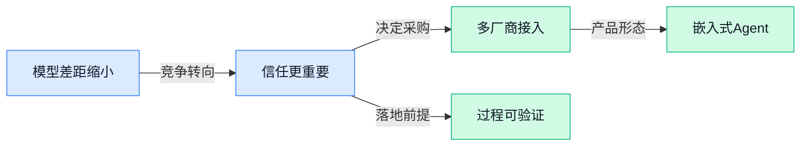

## AI资讯日报 2026/5/2

> AI 早报 · 每日早读 · 全网深度聚合

## **今日摘要**

```
科技巨头今年AI支出飙到7250亿美元，五角大楼联手Nvidia、Microsoft、AWS把AI塞进机密网络
Anthropic上线Claude Security补强防守，GPT-5.5网络攻击测试追平Claude Mythos，安全竞赛骤然升温
Spotify给真人音乐人加Verified标识区分AI创作，Microsoft把AI法务Agent直接塞进Word抢企业入口
```

### 🔵 产品与功能更新


1. **Anthropic 推出 Claude Security（面向网络安全团队的 AI 防御助手），想把进攻方已有的 AI 能力补给防守方。**  
这次更新的核心很直白：**网络安全**攻防里，攻击者已经在用 AI 提速，Anthropic 现在想让防守团队也拿到同级别工具 🛡️。Claude Security 主要面向企业里的安全分析师和应急响应团队，帮助他们更快理解威胁、处理告警和组织调查流程；这里的“defenders”指的就是企业安全防守人员，不是普通消费者。对公司来说，这类产品意味着**安全运营**会越来越像“人 + AI 协作”，很多原本靠人工翻日志、串线索的工作都有机会被加速。可查看[完整报道(briefing)](https://the-decoder.com/anthropic-launches-claude-security-to-give-defenders-the-same-ai-edge-attackers-already-have/)了解背景 💡


2. **GPT-5.5 在网络攻击测试中追平 Claude Mythos（Claude 的网络安全专用版本），英国 AI 安全研究机构给出新观察。**  
这条消息的重点不是新功能上线，而是**能力评测**：英国 AI Security Institute（英国 AI 安全研究机构，专门测试前沿模型的风险与能力）发现，GPT-5.5 在相关**网络攻击测试**里已经能匹敌 Claude Mythos。这里的 cyber attack tests（网络攻击测试）可以理解为：用标准化任务去检验模型在安全攻防场景里的实际表现，而不是只看聊天回答是否流畅。对行业来说，这说明头部模型在**网络安全能力**上的差距正在缩小，也意味着企业未来选型时，可能会更看重合规、接入方式和价格，而不只是“谁最强”。更多细节见[测试结果报道(briefing)](https://the-decoder.com/gpt-5-5-matches-claude-mythos-in-cyber-attack-tests-uk-ai-security-institute-finds/) 🚨


3. **百度升级通用型 AI Agent（可自动拆解任务并执行的智能助手），继续加码多步骤任务能力。**  
从标题信息看，百度这次发布的是**升级版通用 Agent**，也就是不只会回答问题，还更强调把任务分步骤完成的能力 🤖。通用 Agent 的价值在于，它更像“会做事的助手”而不只是“会聊天的模型”，理论上更适合办公、搜索、信息整理等连续流程。对普通公司同事来说，这类产品如果成熟，最直接的变化会体现在**跨步骤工作流**：比如查资料、汇总、生成初稿、再继续补充，而不是每一步都手动切换。原始线索可见[Yahoo Finance 转引信息(briefing)](https://news.google.com/rss/articles/CBMiowFBVV95cUxOTk1QYl81ZWx2bzNwYllDa01ocXkxSjhTNEZzVFpJanVieU04RmI5NjRnamxMcHJKWThlY2wzMVh5R1N6RG9kVWhwdUhTM1VJVUZpWFNUaHdVWDE2RVVUMlNIVGVRMlJMamctdG1ScTR5UkQ2NnhyalljQndfblk5ZG5tOVBZTzZxVWZ4UmRHMEFBWVo2aHhnNWY1V2dobFBER29j?oc=5)；不过由于候选材料里未给出更多细节，当前能确认的信息主要就是“**升级发布**”这一层。

![百度升级通用型 AI Agent（可自动拆解任务并执行的智能助手），继续加码多步骤任务能力](https://image.pollinations.ai/prompt/%E7%99%BE%E5%BA%A6%E5%8D%87%E7%BA%A7%E9%80%9A%E7%94%A8%E5%9E%8B%20AI%20Agent%EF%BC%88%E5%8F%AF%E8%87%AA%E5%8A%A8%E6%8B%86%E8%A7%A3%E4%BB%BB%E5%8A%A1%E5%B9%B6%E6%89%A7%E8%A1%8C%E7%9A%84%E6%99%BA%E8%83%BD%E5%8A%A9%E6%89%8B%EF%BC%89%EF%BC%8C%E7%BB%A7%E7%BB%AD%E5%8A%A0%E7%A0%81%E5%A4%9A%E6%AD%A5%E9%AA%A4%E4%BB%BB%E5%8A%A1%E8%83%BD%E5%8A%9B.%20%E7%99%BE%E5%BA%A6%E5%8D%87%E7%BA%A7%E9%80%9A%E7%94%A8%E5%9E%8B%20AI%20Agent%EF%BC%88%E5%8F%AF%E8%87%AA%E5%8A%A8%E6%8B%86%E8%A7%A3%E4%BB%BB%E5%8A%A1%E5%B9%B6%E6%89%A7%E8%A1%8C%E7%9A%84%E6%99%BA%E8%83%BD%E5%8A%A9%E6%89%8B%EF%BC%89%EF%BC%8C%E7%BB%A7%E7%BB%AD%E5%8A%A0%E7%A0%81%E5%A4%9A%E6%AD%A5%E9%AA%A4%E4%BB%BB%E5%8A%A1%E8%83%BD%E5%8A%9B%E3%80%82%20%E4%BB%8E%E6%A0%87%E9%A2%98%E4%BF%A1%E6%81%AF%E7%9C%8B%EF%BC%8C%E7%99%BE%E5%BA%A6%E8%BF%99%E6%AC%A1%E5%8F%91%E5%B8%83%E7%9A%84%E6%98%AF%E5%8D%87%E7%BA%A7%E7%89%88%E9%80%9A%E7%94%A8%20Agent%EF%BC%8C%E4%B9%9F%E5%B0%B1%E6%98%AF%E4%B8%8D%E5%8F%AA%E4%BC%9A%2C%20technical%20infographic%20diagram%2C%20architecture%20flowchart%2C%20clean%20vector%20illustration%2C%20educational%20style%2C%20no%20text%20overlay%2C%20modern%20minimal%2C%20wide%20aspect?width=1200&height=675&nologo=true&seed=11451)

### 🟢 前沿研究


1. **RoundPipe（一种让多张消费级显卡协同训练模型的方法）瞄准低成本多卡训练。**
这篇研究关注一个很现实的问题：不是每家公司都有昂贵的 **GPU cluster（显卡集群，很多张显卡连在一起的大型训练设施）**，那能不能用普通消费级显卡把模型训练跑起来？RoundPipe 试图给出更高效的答案，核心看点是提升多卡协同训练时的资源利用率，让“便宜设备也能干大活”这件事更可行 💡。对预算敏感的团队来说，这类工作很重要，因为它直接关系到 **训练成本** 和实验门槛。可查看这篇 [论文页面(briefing)](https://huggingface.co/papers/2604.27085) 了解原始内容。


2. **Claw-Eval-Live（一套面向真实工作流变化场景的 Agent 测试基准）想把 Agent 评测拉回现实。**
很多 Agent 评测都停留在静态题库，但现实工作流会不断变化，今天能做的事，明天流程可能就变了 😅。这篇论文提出 **benchmark（测试基准，用统一任务衡量模型能力的“标准考卷”）**，专门考察 Agent 在持续演化的真实任务里还能不能稳定完成工作。对企业用户来说，这比单次答题分数更有参考价值，因为它更接近客服、运营、行政流程等日常场景。原文见 [论文介绍页(briefing)](https://huggingface.co/papers/2604.28139)。


3. **Step-level Optimization（按步骤优化的训练思路）想让电脑操作型 Agent 更省更稳。**
这项研究聚焦 **computer-use agents（电脑操作型 Agent，能像人一样点按钮、填表单、切换窗口完成任务的 AI）**，并提出从“单步”层面做优化，而不是只看最终结果。这样做的意义在于，模型每一步都能更高效地决策，减少无效操作和重复试错 🚀。如果未来 AI 要在办公软件、后台系统、网页工具之间自动跑流程，这类逐步优化的方法会直接影响 **执行效率** 和可用性。更多信息可看 [论文原文页(briefing)](https://huggingface.co/papers/2604.27151)。


4. **Synthetic Computers at Scale（大规模“合成电脑环境”模拟框架）探索长流程生产力任务训练。**
这篇工作研究如何批量构建 **synthetic computers（合成电脑环境，用程序模拟出来的电脑与操作界面，方便大规模训练 AI）**，用来测试和训练 AI 处理长链路办公任务。所谓 **long-horizon（长时程，指任务步骤很多、持续时间长，不是点一下就结束）**，比如跨多个页面整理信息、连续操作多个工具完成一项工作。它的价值在于，为 Agent 提供更接近真实办公的训练“沙盘”，而不必完全依赖昂贵又难复制的人类演示。原始材料可见 [论文页面(briefing)](https://huggingface.co/papers/2604.28181)。


5. **InteractWeb-Bench（交互式网站生成评测集）追问多模态 Agent 会不会“闭眼干活”。**
这项研究把焦点放在 **multimodal agent（多模态 Agent，既能看图也能读文字、理解界面的智能体）** 做交互式网站生成时，是否真的理解页面反馈，还是只是机械执行预设步骤。论文提出的 **InteractWeb-Bench（一个专门测试这类能力的评测基准）**，本质上是在检查 Agent 能不能根据网页实际变化及时调整，而不是“看不见后果地一路点下去” 👀。这对任何希望用 AI 自动搭建网页、表单或后台界面的团队都很关键，因为真正可用的系统必须会观察、会修正。详情可见 [评测论文页(briefing)](https://huggingface.co/papers/2604.27419)。


6. **Heterogeneous Scientific Foundation Model Collaboration（异构科学基础模型协作）瞄准“多模型分工搞科研”。**
这篇研究讨论的不是单个模型更强，而是不同类型的 **foundation model（基础模型，可迁移到多种任务的大模型底座）** 怎么协同完成科学问题。这里的 **heterogeneous（异构，指模型能力和模态不同，比如有的擅长文字，有的擅长图像或专业数据）** 是关键：不是让一个模型包打天下，而是让多个模型像团队一样分工合作。对科研和产业都很有启发，因为未来复杂任务可能更依赖“模型协作组织能力”，而不只是参数规模越大越好。原文入口在 [论文介绍(briefing)](https://huggingface.co/papers/2604.27351)。


7. **Compliance versus Sensibility（“服从”与“合理性”的权衡研究）关注大模型推理可控性。**
这篇论文讨论一个很微妙但很重要的问题：当我们要求大模型严格按指令思考时，它到底是在认真“听话”，还是可能牺牲了 **sensibility（合理性，指回答是否符合常识与情境）**？作者把重点放在 **reasoning controllability（推理可控性，指我们能多大程度引导模型按预期方式思考）** 上，试图分析“越服从”是否总是“越好”。这对企业使用 AI 很有现实意义，因为在制度、合规、客服话术等场景里，单纯照做和真正说得通，往往不是一回事 🤔。可查看 [论文页面(briefing)](https://huggingface.co/papers/2604.27251)。

![Compliance versus Sensibility（“服从”与“合理性”的权衡研究）关注大模型推理可控性](https://image.pollinations.ai/prompt/Compliance%20versus%20Sensibility%EF%BC%88%E2%80%9C%E6%9C%8D%E4%BB%8E%E2%80%9D%E4%B8%8E%E2%80%9C%E5%90%88%E7%90%86%E6%80%A7%E2%80%9D%E7%9A%84%E6%9D%83%E8%A1%A1%E7%A0%94%E7%A9%B6%EF%BC%89%E5%85%B3%E6%B3%A8%E5%A4%A7%E6%A8%A1%E5%9E%8B%E6%8E%A8%E7%90%86%E5%8F%AF%E6%8E%A7%E6%80%A7.%20Compliance%20versus%20Sensibility%EF%BC%88%E2%80%9C%E6%9C%8D%E4%BB%8E%E2%80%9D%E4%B8%8E%E2%80%9C%E5%90%88%E7%90%86%E6%80%A7%E2%80%9D%E7%9A%84%E6%9D%83%E8%A1%A1%E7%A0%94%E7%A9%B6%EF%BC%89%E5%85%B3%E6%B3%A8%E5%A4%A7%E6%A8%A1%E5%9E%8B%E6%8E%A8%E7%90%86%E5%8F%AF%E6%8E%A7%E6%80%A7%E3%80%82%20%E8%BF%99%E7%AF%87%E8%AE%BA%E6%96%87%E8%AE%A8%E8%AE%BA%E4%B8%80%E4%B8%AA%E5%BE%88%E5%BE%AE%E5%A6%99%E4%BD%86%E5%BE%88%E9%87%8D%E8%A6%81%E7%9A%84%E9%97%AE%E9%A2%98%EF%BC%9A%E5%BD%93%E6%88%91%E4%BB%AC%2C%20technical%20infographic%20diagram%2C%20architecture%20flowchart%2C%20clean%20vector%20illustration%2C%20educational%20style%2C%20no%20text%20overlay%2C%20modern%20minimal%2C%20wide%20aspect?width=1200&height=675&nologo=true&seed=10993)


8. **Nemotron 3 Nano Omni（一款轻量级开源多模态模型）主打高效与开放。**
从标题就能看出，这项工作强调 **efficient（高效，指用更少算力和资源完成任务）** 与 **open（开放，通常指更容易被研究者和开发者使用、复现或扩展）** 两个方向。它属于 **multimodal intelligence（多模态智能，能同时处理文字、图像等不同信息）** 路线，但特别突出 **Nano（轻量化，小体积、低资源占用）**，这对边缘设备、本地部署和成本控制都很有吸引力 ⚙️。如果你关心“不是只有超大模型才有未来”，这篇研究值得关注。更多内容见 [论文原页(briefing)](https://huggingface.co/papers/2604.24954)。


### 🟡 行业展望与社会影响


1. **科技巨头今年 AI 支出膨胀至 7250 亿美元。**
这一数字直观说明，**AI 投资竞赛**已经从“试水新技术”变成了关乎云服务、芯片和企业软件的长期军备赛 💰。原文聚焦大型科技公司持续加码**资本开支**（企业在数据中心、服务器、网络设备上的大额投入），背后核心是为模型训练和**inference（模型推理，让训练好的模型真正回答问题的过程）**准备更强基础设施。对普通职场人来说，这意味着未来几年 AI 功能会越来越多地嵌进日常办公软件与业务系统，但行业也会更关注投入产出比。可查看[完整报道(briefing)](https://the-decoder.com/big-techs-ai-spending-balloons-to-725-billion-this-year/)了解细节 🚀


2. **中国部分 AI 创业公司开始放弃离岸架构，转向直接在国内注册。**
报道提到，在政策环境变化后，已有中国 AI 创业公司不再沿用**离岸架构**（把公司注册在境外、便于融资和上市的公司安排），而是选择直接在中国落地注册 🧭。这不只是法律形式变化，更反映出**融资路径**、监管预期和本地资源整合方式正在调整；对创业公司来说，未来“在哪注册”本身也会影响发展策略。对业务和投资观察者而言，这类变化往往预示着行业规则正在重写。更多可见[原文分析(briefing)](https://the-decoder.com/first-chinese-ai-startups-are-reportedly-ditching-offshore-structures-to-register-directly-in-china/) 💡


3. **五角大楼与 Nvidia、Microsoft、AWS 签约，把 AI 部署到机密网络。**
这笔合作说明，**AI 落地**正在从公开办公场景走向更敏感的政府与国防系统 ⚠️。报道指出，美国国防部希望把 AI 部署到**classified networks（机密网络，和普通互联网隔离、专门处理敏感信息的内部系统）**中，同时也在分散对不同 AI 供应商的依赖，以避免被单一厂商“卡脖子”。这件事的行业意义很大：一旦政府级采购加速，安全、合规和可控性会比“模型谁更聪明”更重要。详情可看[TechCrunch 报道(briefing)](https://techcrunch.com/2026/05/01/pentagon-inks-deals-with-nvidia-microsoft-and-aws-to-deploy-ai-on-classified-networks/) 📌


4. **八家科技巨头拿下五角大楼合同，推进“AI 优先”作战体系。**
相比单一签约消息，这条更突出一个趋势：美国国防系统正试图建立跨多家厂商的**AI-first fighting force（以 AI 为核心驱动的作战体系）**，而不是只押注某一家平台 🛰️。原文强调这些合作覆盖**classified networks（机密网络，专门承载涉密信息的封闭系统）**，意味着 AI 不再只是分析工具，而是可能深入指挥、协作和后勤等更核心流程。对企业界也是个提醒：未来大客户采购 AI，看重的不只是模型能力，还包括部署方式、供应链稳定性和政治风险。可参考[详细解读(briefing)](https://the-decoder.com/eight-tech-giants-sign-pentagon-deals-to-build-an-ai-first-fighting-force-across-classified-networks/) 🚀

![八家科技巨头拿下五角大楼合同，推进“AI 优先”作战体系](https://image.pollinations.ai/prompt/%E5%85%AB%E5%AE%B6%E7%A7%91%E6%8A%80%E5%B7%A8%E5%A4%B4%E6%8B%BF%E4%B8%8B%E4%BA%94%E8%A7%92%E5%A4%A7%E6%A5%BC%E5%90%88%E5%90%8C%EF%BC%8C%E6%8E%A8%E8%BF%9B%E2%80%9CAI%20%E4%BC%98%E5%85%88%E2%80%9D%E4%BD%9C%E6%88%98%E4%BD%93%E7%B3%BB.%20%E5%85%AB%E5%AE%B6%E7%A7%91%E6%8A%80%E5%B7%A8%E5%A4%B4%E6%8B%BF%E4%B8%8B%E4%BA%94%E8%A7%92%E5%A4%A7%E6%A5%BC%E5%90%88%E5%90%8C%EF%BC%8C%E6%8E%A8%E8%BF%9B%E2%80%9CAI%20%E4%BC%98%E5%85%88%E2%80%9D%E4%BD%9C%E6%88%98%E4%BD%93%E7%B3%BB%E3%80%82%20%E7%9B%B8%E6%AF%94%E5%8D%95%E4%B8%80%E7%AD%BE%E7%BA%A6%E6%B6%88%E6%81%AF%EF%BC%8C%E8%BF%99%E6%9D%A1%E6%9B%B4%E7%AA%81%E5%87%BA%E4%B8%80%E4%B8%AA%E8%B6%8B%E5%8A%BF%EF%BC%9A%E7%BE%8E%E5%9B%BD%E5%9B%BD%E9%98%B2%E7%B3%BB%E7%BB%9F%E6%AD%A3%E8%AF%95%E5%9B%BE%E5%BB%BA%E7%AB%8B%E8%B7%A8%E5%A4%9A%E5%AE%B6%E5%8E%82%E5%95%86%E7%9A%84AI-first%20fight%2C%20technical%20infographic%20diagram%2C%20architecture%20flowchart%2C%20clean%20vector%20illustration%2C%20educational%20style%2C%20no%20text%20overlay%2C%20modern%20minimal%2C%20wide%20aspect?width=1200&height=675&nologo=true&seed=10900)

5. **Spotify 给真人音乐人加上“已验证”标识，区分 AI 生成内容。**
这是 AI 进入内容产业后的一个典型治理动作：平台开始通过**Verified badge（已验证标识，用来确认账号或创作者身份真实）**帮助用户分辨真人创作者与 AI 生成作品 🎵。它释放的信号很明确——随着生成式 AI 作品增多，平台不能只追求内容供给，还得处理**身份可信度**和创作者权益问题。对市场运营、品牌和内容团队来说，今后“内容是真的吗、是谁做的”可能会像“内容好不好”一样重要。更多见[BBC 转引报道(briefing)](https://news.google.com/rss/articles/CBMiWkFVX3lxTE5nM0xwS2ZoOG52aTZtRFNma1lTb2VHU19aTThWY1ZTSndUNExGangzbFJsQnJmRG02YXVwWXZpdGJzTm5UbnVUVTNDanpnWTY2U0pXN1pYYUc4QQ?oc=5) 💡


6. **Microsoft 把 AI 法务 Agent（能自动审阅合同的智能助手）塞进 Word。**
这类产品特别值得非技术同事关注，因为它不是给程序员用的，而是直接面向**合同审查**这类高频办公场景 ✍️。原文提到，这个 AI 法务助手被放进 Word 里，说明 **Agent** 正在从聊天窗口走向具体流程工具；而合同审阅本身又是法务、采购、销售都离不开的工作。对企业来说，这意味着未来很多“先看一遍合同、挑出风险条款”的基础工作，可能会先交给 AI 打底，再由人工复核。详情可见[官方报道整理(briefing)](https://the-decoder.com/microsoft-puts-an-ai-legal-agent-inside-word-for-contract-review/) 🚀


### 🟣 开源TOP项目

1. **easy-vibe（一套给新手准备的现代编程入门课程）想把“vibe coding（用自然语言指挥 AI 协助写程序的新方式）”讲明白。**
这个项目主打**循序渐进**，目标很明确：帮助零基础用户一步步上手现代编程，而不是一开始就被复杂环境劝退 💡。对公司里想学点自动化、数据处理或 AI 工具搭建的同事来说，这类面向初学者的课程型开源项目很友好，能降低“会用 ChatGPT 但不会落地”的门槛。它围绕 **vibe coding** 这个近年很火的方向展开，本质上就是让人更多用自然语言描述需求、由 AI 辅助完成代码工作。感兴趣可以直接看它的 [GitHub 课程主页(briefing)](https://github.com/datawhalechina/easy-vibe) 🚀


2. **TradingAgents（一个多 Agent 协作的金融交易框架）把大模型带进量化交易流程。**
这个项目的关键词是 **Multi-Agents（多智能体协作，让多个 AI 分工配合）** 和 **LLM（大语言模型，能理解和生成文字的 AI 模型）**，瞄准的是金融交易场景。简单理解，它想让不同“角色”的 AI 一起参与分析、判断和执行，更像一个数字化投研小团队，而不是单个聊天机器人。对非技术同事来说，这类项目的价值在于展示了 AI 正从“回答问题”走向“协同完成复杂业务流程” 📈。项目详情可见 [GitHub 项目页(briefing)](https://github.com/TauricResearch/TradingAgents)


3. **ds2api（把 DeepSeek 客户端能力转成 API 的开源工具）主打高性能和多接口兼容。**
它的核心作用，是把客户端侧的能力整理成 **API（程序之间互相调用的接口，像标准化“服务窗口”）** 形式，方便接入业务系统或自动化流程。项目摘要里提到支持**多账号轮询**、兼容多种接口格式，还能部署在 **Vercel（一个常见的网页应用托管平台）** 和 **Docker（把应用连同运行环境一起打包的容器工具）** 上，说明它很强调实用落地 ⚙️。如果团队正在折腾 AI 接入、但又不想每次都从零搭接口，这类工具会明显省事。可查看 [GitHub 仓库说明(briefing)](https://github.com/CJackHwang/ds2api)


4. **Vibe-Trading（一个“个人交易 Agent”开源项目）想把 AI 交易助手做成可直接上手的形态。**
从项目描述看，它强调的是 **Personal Trading Agent（个人交易助手，让 AI 帮你分析和辅助决策）** 这个定位，方向比通用聊天机器人更垂直。与偏框架型项目相比，这类产品化表达更容易让普通用户理解：不是研究模型本身，而是把 AI 包装成一个面向具体任务的助手 🤖。对行业观察来说，这也说明开源社区正在把 **Agent** 从“概念”推向更明确的使用场景。项目入口见 [GitHub 项目主页(briefing)](https://github.com/HKUDS/Vibe-Trading)


5. **open-codesign（Claude Design 的开源替代方案）把“提示词到原型/幻灯片/PDF”做成一站式设计工作流。**
这个项目很适合设计、运营、产品同事关注：你输入 **Prompt（给 AI 的文字指令）**，它就能产出原型、幻灯片甚至 PDF，明显瞄准内容与方案制作场景 🎨。摘要里还提到支持多模型、**BYOK（自带密钥，用户自己填入所用模型的 API 密钥）**、**local-first（优先本地运行，尽量把数据留在自己设备上）**，说明它兼顾灵活性和数据掌控感。对企业来说，这类开源工具的吸引力在于：既能借助主流模型能力，又不一定要被单一平台绑定。更多信息可查看 [GitHub 开源仓库(briefing)](https://github.com/OpenCoworkAI/open-codesign)

![open-codesign（Claude Design 的开源替代方案）把“提示词到原型/幻灯片/PDF”做成一站式设计工作流](https://image.pollinations.ai/prompt/open-codesign%EF%BC%88Claude%20Design%20%E7%9A%84%E5%BC%80%E6%BA%90%E6%9B%BF%E4%BB%A3%E6%96%B9%E6%A1%88%EF%BC%89%E6%8A%8A%E2%80%9C%E6%8F%90%E7%A4%BA%E8%AF%8D%E5%88%B0%E5%8E%9F%E5%9E%8B%2F%E5%B9%BB%E7%81%AF%E7%89%87%2FPDF%E2%80%9D%E5%81%9A%E6%88%90%E4%B8%80%E7%AB%99%E5%BC%8F%E8%AE%BE%E8%AE%A1%E5%B7%A5%E4%BD%9C%E6%B5%81.%20open-codesign%EF%BC%88Claude%20Design%20%E7%9A%84%E5%BC%80%E6%BA%90%E6%9B%BF%E4%BB%A3%E6%96%B9%E6%A1%88%EF%BC%89%E6%8A%8A%E2%80%9C%E6%8F%90%E7%A4%BA%E8%AF%8D%E5%88%B0%E5%8E%9F%E5%9E%8B%2F%E5%B9%BB%E7%81%AF%E7%89%87%2FPDF%E2%80%9D%E5%81%9A%E6%88%90%E4%B8%80%E7%AB%99%E5%BC%8F%E8%AE%BE%E8%AE%A1%E5%B7%A5%E4%BD%9C%E6%B5%81%E3%80%82%20%E8%BF%99%E4%B8%AA%E9%A1%B9%E7%9B%AE%E5%BE%88%E9%80%82%E5%90%88%E8%AE%BE%E8%AE%A1%E3%80%81%E8%BF%90%E8%90%A5%E3%80%81%E4%BA%A7%E5%93%81%2C%20technical%20infographic%20diagram%2C%20architecture%20flowchart%2C%20clean%20vector%20illustration%2C%20educational%20style%2C%20no%20text%20overlay%2C%20modern%20minimal%2C%20wide%20aspect?width=1200&height=675&nologo=true&seed=11125)

### 🔴 社媒分享

1. **Spotify 给真人音乐人加上 Verified（已认证身份）标识，开始区分人类与 AI 创作者。**
Spotify 正在用更直观的方式回应 **AI 音乐** 混入平台的争议：给经过确认的真人艺术家加上 **Verified（已认证身份）** 徽章 🎵。这件事看似只是一个小图标，背后其实是在帮用户判断“谁是真人、谁可能是机器生成”，也让平台在 **内容可信度** 上更进一步。对音乐行业来说，这会影响歌手曝光、听众信任，甚至未来平台怎么处理 **AI 生成内容** 的规则。[BBC 报道原文(briefing)](https://www.bbc.com/news/articles/c5yerr4m1yno)


2. **Gemma-4-31B-it-DFlash（基于 Google Gemma 的 310 亿参数指令模型变体）发布，社区正等兼容支持落地。**
这条消息主要来自 Reddit 社区讨论：**gemma-4-31B-it-DFlash** 已经放出模型，但不少人还得等 **PR（代码合并申请，开发者把新功能提交进主项目的流程）** 合并后才能真正上手测试 💡。其中提到的 **llama.cpp（让大模型能在本地电脑高效运行的开源工具）** 兼容进展，是这类模型能否被更广泛试玩的关键。对普通用户来说，这意味着“模型发布”不等于“马上能用”，中间还要看本地运行工具链是否跟上。[Reddit 讨论帖(briefing)](https://www.reddit.com/r/LocalLLaMA/comments/1t0s4qv/gemma431bitdflash_has_been_released/) [HuggingFace 模型页(briefing)](https://huggingface.co/z-lab/gemma-4-31B-it-DFlash)


3. **《Platformer》判断这轮 AI 泡沫更像铁路热，而不是加密货币狂潮。**
这篇分析提出了一个很形象的类比：当前 **AI 投资热** 与其说像 **Crypto（加密货币）** 那种快速起落的投机浪潮，不如说更像早期铁路建设——先大量烧钱铺基础设施，长期才可能兑现价值 🚄。这个判断的重点不在“有没有泡沫”，而在“泡沫会不会沉淀成真正有用的底层能力”，比如算力、数据中心和企业级 AI 工具。对公司管理者和业务团队来说，这种视角提醒我们：短期别被热度带偏，长期要盯住谁在建设真正可复用的 **基础设施**。[完整分析文章(briefing)](https://www.platformer.news/ai-bubble-railroad-mythos-openai-trial/)


4. **《Long-term, Peripheral & Myopic Visions》（一篇讨论科技公司长期与短期视角的分析文章）关注 AI 竞争中的“远见”与“近视”。**
这篇 Stratechery 文章把视角放在科技公司如何看待未来：有的人盯着眼前产品，有的人押注更长线的平台机会 👀。标题里的 **Peripheral（外围视角）** 与 **Myopic（短视）**，本质上是在讨论企业面对 AI 变化时，究竟是做局部优化，还是重构更大的战略布局。对非技术岗位同事也很有启发：很多 AI 新闻看似在讲模型，实际上拼的是管理层对业务、入口和组织资源的判断。[Stratechery 原文(briefing)](https://stratechery.com/2026/long-term-peripheral-myopic-visions/)

![《Long-term, Peripheral & Myopic Visions》（一篇讨论科技公司长期与短期视角的分析文章）关注 AI 竞争中的“远见”与“近视”](https://image.pollinations.ai/prompt/%E3%80%8ALong-term%2C%20Peripheral%20&%20Myopic%20Visions%E3%80%8B%EF%BC%88%E4%B8%80%E7%AF%87%E8%AE%A8%E8%AE%BA%E7%A7%91%E6%8A%80%E5%85%AC%E5%8F%B8%E9%95%BF%E6%9C%9F%E4%B8%8E%E7%9F%AD%E6%9C%9F%E8%A7%86%E8%A7%92%E7%9A%84%E5%88%86%E6%9E%90%E6%96%87%E7%AB%A0%EF%BC%89%E5%85%B3%E6%B3%A8%20AI%20%E7%AB%9E%E4%BA%89%E4%B8%AD%E7%9A%84%E2%80%9C%E8%BF%9C%E8%A7%81%E2%80%9D%E4%B8%8E%E2%80%9C%E8%BF%91%E8%A7%86%E2%80%9D.%20%E3%80%8ALong-term%2C%20Peripheral%20&%20Myopic%20Visions%E3%80%8B%EF%BC%88%E4%B8%80%E7%AF%87%E8%AE%A8%E8%AE%BA%E7%A7%91%E6%8A%80%E5%85%AC%E5%8F%B8%E9%95%BF%E6%9C%9F%E4%B8%8E%E7%9F%AD%E6%9C%9F%E8%A7%86%E8%A7%92%E7%9A%84%E5%88%86%E6%9E%90%E6%96%87%E7%AB%A0%EF%BC%89%E5%85%B3%E6%B3%A8%20AI%20%E7%AB%9E%E4%BA%89%E4%B8%AD%E7%9A%84%E2%80%9C%E8%BF%9C%E8%A7%81%E2%80%9D%E4%B8%8E%E2%80%9C%E8%BF%91%E8%A7%86%2C%20technical%20infographic%20diagram%2C%20architecture%20flowchart%2C%20clean%20vector%20illustration%2C%20educational%20style%2C%20no%20text%20overlay%2C%20modern%20minimal%2C%20wide%20aspect?width=1200&height=675&nologo=true&seed=10706)

5. **《Are AI’s Consumer Applications Hitting a Wall?》（“AI 面向消费者的应用是否撞墙了？”）追问 C 端增长是否开始放缓。**
这篇文章把焦点放在 **Consumer Applications（面向普通消费者的应用）**：AI 产品虽然话题度很高，但真正能持续留住用户的场景，可能没想象中那么多 📱。它关注的不是模型参数，而是更现实的问题——用户会不会每天都用、愿不愿意付费、产品是否形成稳定习惯。对做运营、市场、产品的人来说，这提醒我们：AI 不等于天然爆款，真正重要的是把能力嵌进用户已经熟悉的工作流，而不是只靠新鲜感。[Big Technology 文章(briefing)](https://www.bigtechnology.com/p/are-ais-consumer-applications-hitting)


---



### 📊 行业洞察（今日 4 条）

1. Anthropic推 Claude Security，GPT-5.5 又在英国 AI 安全研究机构（专门测前沿模型风险与能力的机构）测试里追平 Claude Mythos
  【洞察】安全场景正从“谁家模型最强”走向“谁更能被企业放心接入”，能力差距在缩小，信任与交付方式在变重要

2. Microsoft把法务 Agent 塞进 Word，百度升级通用 Agent 做多步骤任务
  【洞察】Agent 正从独立聊天工具变成具体软件里的“做事入口”，用户未必要找最强 AI，只会选最顺手、最省事的那个

3. Claw-Eval-Live、InteractWeb-Bench、Step-level Optimization 都在盯真实流程中的变化、反馈和每一步表现
  【洞察】行业开始承认 Agent 最大问题不是不会说，而是干活不稳；今后比拼重点会从演示效果转向过程可靠性

4. 科技巨头一年砸 7250 亿美元建 AI 基础设施，RoundPipe 和 Nemotron 3 Nano Omni 又在想办法压低训练与部署门槛
  【洞察】行业一边军备竞赛、一边拼低成本普及，最后会逼创业公司别卷“更大”，而要卷“更省、更快落地”

### 💭 对我们的启发（今日 3 条）

1. GPT-5.5 追平 Claude Mythos，加上五角大楼分散采购多家厂商，说明我们不能把平台价值押在单一模型绑定上，调度层必须天然支持多模型切换与比价。

2. Spotify 给真人创作者加“已验证”标识，Claw-Eval-Live 又强调真实流程评测，这提醒我们平台要尽早做“过程可见、结果可核、操作者可认证”的信任机制。

3. Microsoft 把法务 Agent 塞进 Word，说明用户更爱“嵌在现有工作里”的 Agent；我们做 to C（面向消费者）时别只做总入口，还要考虑任务模板和场景化入口，否则容易被现成工具吃掉。

