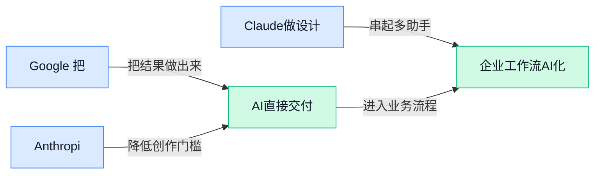

## AI资讯日报 2026/5/3

> AI 早报 · 每日早读 · 全网深度聚合

## **今日摘要**

```
Google把Gemini塞进400万辆通用汽车，还把购物接入AI Mode与Circle to Search，AI搜索直冲交易闭环
Anthropic连发Claude Security测试版、Claude Design被指可替代Figma和Canva，又被曝洽购英国AI芯片公司
Qwen3.6-27B配合agentic search本地跑出高分，Mistral上线Vibe远程执行任务，Agent从会说走向会做
```

### 🔵 产品与功能更新


1. **Google 把购物功能带进 Gemini、AI Mode（AI 搜索模式）和 Circle to Search（圈选即搜功能）。**
Google 正在把**购物体验**更深地嵌进自家 AI 产品线里，不只是聊天问答，还延伸到搜索和手机上的“圈一下就搜”场景 🛍️。这意味着用户未来可能在 **Gemini** 里直接获得更贴近购买决策的建议，也能通过 **AI Mode（AI 搜索模式，用生成式回答整理搜索结果）** 和 **Circle to Search（在手机屏幕上圈出内容就能立刻搜索的功能）** 更快完成“看见—比较—下单”的流程。对电商、品牌运营和广告团队来说，这类更新值得关注，因为 AI 正在从“找信息”进一步变成“促成消费”的入口。[Google 相关报道(briefing)](https://news.google.com/rss/articles/CBMi0gFBVV95cUxORGMtNFJSUWt3NnBXQ0dtWUVNdGctYVU3VXR3MHJPcmpxU3hWeGRmWFIyZWYzbmx0bjB2bjZRWEJKRUQwWXV4T3lSWV94TUVkMEZybGdES0stSW5oTGc0eTJOZGNfRlgwZWx0U1NoYk1rRzk1RzlpdTJKc0tuMGpTangybE8tMHhDTjYya0w5aC11VEJtZ2Zia2JsQnJreVFUSXBieDFyeURJUjQzbW1BRnY2Z01uanNnNktjV2lHNEtHV0xTS3dxZHpTWGRFT0NIdEE?oc=5)


2. **Anthropic 发布 Claude Security（Claude 安全工具套件）测试版。**
Anthropic 推出了 **Claude Security（面向安全场景的 AI 工具套件）** 测试版，重点显然是让 Claude 更深入进入企业的**安全运营**工作流 🔐。这里的“安全”不是日常杀毒，而更偏向企业信息安全团队用于识别风险、分析告警和辅助处理安全事件的场景。对大公司 IT、风控和合规团队来说，这类产品更新说明 AI 正在从通用助手走向更垂直的专业岗位工具，离真正进企业核心流程又近了一步。[工具发布报道(briefing)](https://news.google.com/rss/articles/CBMilwFBVV95cUxORW9NUVR2d2h1S3VuVlpQZWkwZUR0dk8xVmFFaW9lR1BqN29tMGU1ZFZfaGhRX1Q1bnBfYnJGSVAzMm9sejBjSWtGWE1MR2xZdTh6NUFDVzJ5ZEJfeTZ1UktCcGZibERwWjBfYW95eWRXYTd3SVVGaXc2bGd6QlB4YjVreDFXb2VkaFk4cGlyUlhFdkZwWmlV?oc=5)


3. **Claude Design（Claude 的设计生成功能）被评价可替代 Canva、Adobe Express、Figma 和 NotebookLM。**
有媒体作者分享，**Claude Design（Claude 的设计生成功能）** 已经在自己的日常使用中，悄悄替代了多款不同类型的工具 🎨。被点名替代的包括 Canva（在线设计工具）、Adobe Express（Adobe 的轻量设计与内容制作工具）、Figma（产品与界面设计协作工具）和 NotebookLM（Google 的 AI 笔记与资料整理工具），说明 Claude 正在把“写内容、做视觉、整理资料”这些原本分散的工作往一个入口里收拢。对运营、市场、设计和行政同事来说，这类变化最直接的意义是：以后做一份活动物料或内部汇报，可能不再需要在多个软件之间来回切换了 💡。[体验评测报道(briefing)](https://news.google.com/rss/articles/CBMirwFBVV95cUxQc3ZFckMwMGg2eXBxcDRHbEhKOFljcDk2enRDMFBHanZXd2h0VzQtZGVRX1ZiMzlTaWlTa3pvZ3pkM1UteVluZ3FabXo1ejRqTGRXUlBBdnV5ck9nZndRVnpkQ1NBMFhkeUh2Y0FJSjBOeFc0RHlrd2YwbkN3WC1sSVI2R1lEcUR5ZFduNGgzaU4wMEhwTExTY3k3dVBnTjFlcjZ3aU5rbzdUSFBXczIw?oc=5)


### 🟢 前沿研究


1. **PhyCo（一种给动作生成模型加入可控物理约束的方法）想让 AI 生成动作更“像现实世界”。**
这篇论文聚焦**生成动作**里的老问题：画面能动起来，不代表动作真的符合物理规律 💡。PhyCo 的核心思路，是先学出可控制的**物理先验**（模型提前掌握的“常识规则”，比如重心、惯性、接触关系），再把这些规则注入动作生成过程，让结果不只好看，还更自然、更可信。对做**动画、虚拟人、游戏角色**的人来说，这类研究的意义很直接：以后 AI 生成的动作有望更少“飘”“滑”“穿模”。可查看 [论文页面(briefing)](https://huggingface.co/papers/2604.28169) 了解原始信息 🚀

![PhyCo（一种给动作生成模型加入可控物理约束的方法）想让 AI 生成动作更“像现实世界”](https://image.pollinations.ai/prompt/PhyCo%EF%BC%88%E4%B8%80%E7%A7%8D%E7%BB%99%E5%8A%A8%E4%BD%9C%E7%94%9F%E6%88%90%E6%A8%A1%E5%9E%8B%E5%8A%A0%E5%85%A5%E5%8F%AF%E6%8E%A7%E7%89%A9%E7%90%86%E7%BA%A6%E6%9D%9F%E7%9A%84%E6%96%B9%E6%B3%95%EF%BC%89%E6%83%B3%E8%AE%A9%20AI%20%E7%94%9F%E6%88%90%E5%8A%A8%E4%BD%9C%E6%9B%B4%E2%80%9C%E5%83%8F%E7%8E%B0%E5%AE%9E%E4%B8%96%E7%95%8C%E2%80%9D.%20PhyCo%EF%BC%88%E4%B8%80%E7%A7%8D%E7%BB%99%E5%8A%A8%E4%BD%9C%E7%94%9F%E6%88%90%E6%A8%A1%E5%9E%8B%E5%8A%A0%E5%85%A5%E5%8F%AF%E6%8E%A7%E7%89%A9%E7%90%86%E7%BA%A6%E6%9D%9F%E7%9A%84%E6%96%B9%E6%B3%95%EF%BC%89%E6%83%B3%E8%AE%A9%20AI%20%E7%94%9F%E6%88%90%E5%8A%A8%E4%BD%9C%E6%9B%B4%E2%80%9C%E5%83%8F%E7%8E%B0%E5%AE%9E%E4%B8%96%E7%95%8C%E2%80%9D%E3%80%82%20%E8%BF%99%E7%AF%87%E8%AE%BA%E6%96%87%E8%81%9A%E7%84%A6%E7%94%9F%E6%88%90%E5%8A%A8%E4%BD%9C%E9%87%8C%E7%9A%84%E8%80%81%E9%97%AE%E9%A2%98%EF%BC%9A%E7%94%BB%E9%9D%A2%E8%83%BD%E5%8A%A8%E8%B5%B7%E6%9D%A5%EF%BC%8C%E4%B8%8D%E4%BB%A3%E8%A1%A8%E5%8A%A8%E4%BD%9C%E7%9C%9F%E7%9A%84%E7%AC%A6%E5%90%88%E7%89%A9%2C%20technical%20infographic%20diagram%2C%20architecture%20flowchart%2C%20clean%20vector%20illustration%2C%20educational%20style%2C%20no%20text%20overlay%2C%20modern%20minimal%2C%20wide%20aspect?width=1200&height=675&nologo=true&seed=10807)


2. **Intern-Atlas（一套给 AI 科研助手梳理方法演化路径的研究基础设施）试图帮“AI 科学家”少走弯路。**
这项工作提出一个**方法演化图谱**，可以理解为把不同研究方法之间“怎么来的、解决什么问题、和谁相关”系统串起来的知识地图 🧭。论文把它定位成面向 **AI Scientists**（AI 科研助手，即能辅助找文献、提想法、做实验的智能体）的**研究基础设施**，重点不在单次回答问题，而在支持持续研究。对普通同事来说，这有点像给 AI 配一张“行业知识关系图”，让它不是零散搜资料，而是按学术脉络理解问题。更多可见 [论文介绍页(briefing)](https://huggingface.co/papers/2604.28158)

![Intern-Atlas（一套给 AI 科研助手梳理方法演化路径的研究基础设施）试图帮“AI 科学家”少走弯路](https://image.pollinations.ai/prompt/Intern-Atlas%EF%BC%88%E4%B8%80%E5%A5%97%E7%BB%99%20AI%20%E7%A7%91%E7%A0%94%E5%8A%A9%E6%89%8B%E6%A2%B3%E7%90%86%E6%96%B9%E6%B3%95%E6%BC%94%E5%8C%96%E8%B7%AF%E5%BE%84%E7%9A%84%E7%A0%94%E7%A9%B6%E5%9F%BA%E7%A1%80%E8%AE%BE%E6%96%BD%EF%BC%89%E8%AF%95%E5%9B%BE%E5%B8%AE%E2%80%9CAI%20%E7%A7%91%E5%AD%A6%E5%AE%B6%E2%80%9D%E5%B0%91%E8%B5%B0%E5%BC%AF%E8%B7%AF.%20Intern-Atlas%EF%BC%88%E4%B8%80%E5%A5%97%E7%BB%99%20AI%20%E7%A7%91%E7%A0%94%E5%8A%A9%E6%89%8B%E6%A2%B3%E7%90%86%E6%96%B9%E6%B3%95%E6%BC%94%E5%8C%96%E8%B7%AF%E5%BE%84%E7%9A%84%E7%A0%94%E7%A9%B6%E5%9F%BA%E7%A1%80%E8%AE%BE%E6%96%BD%EF%BC%89%E8%AF%95%E5%9B%BE%E5%B8%AE%E2%80%9CAI%20%E7%A7%91%E5%AD%A6%E5%AE%B6%E2%80%9D%E5%B0%91%E8%B5%B0%E5%BC%AF%E8%B7%AF%E3%80%82%20%E8%BF%99%E9%A1%B9%E5%B7%A5%E4%BD%9C%E6%8F%90%E5%87%BA%E4%B8%80%E4%B8%AA%E6%96%B9%E6%B3%95%E6%BC%94%E5%8C%96%E5%9B%BE%E8%B0%B1%EF%BC%8C%E5%8F%AF%E4%BB%A5%E7%90%86%E8%A7%A3%E4%B8%BA%E6%8A%8A%E4%B8%8D%E5%90%8C%2C%20technical%20infographic%20diagram%2C%20architecture%20flowchart%2C%20clean%20vector%20illustration%2C%20educational%20style%2C%20no%20text%20overlay%2C%20modern%20minimal%2C%20wide%20aspect?width=1200&height=675&nologo=true&seed=10838)


3. **The Last Human-Written Paper（《最后一篇人类撰写的论文》）讨论 Agent-Native Research Artifacts（原生面向智能体的科研成果形态）。**
这篇论文抛出一个很有话题性的判断：未来科研产出，可能不再只是一篇给人读的论文，而会变成更适合 **Agent-Native**（原生为智能体协作设计）的研究材料 🤖。所谓 **Research Artifacts**（科研成果载体），可以理解为论文之外一整套能被 AI 直接调用、复现、验证和延展的内容。它讨论的重点，其实是科研表达方式会不会被 AI 改写——从“人类写给人类看”，走向“人类和智能体一起生产、也让智能体能直接使用”。原文入口见 [论文原始页面(briefing)](https://huggingface.co/papers/2604.24658)


4. **MoCapAnything V2（一套支持任意骨架的动作捕捉系统）瞄准更通用的人体动作还原。**
**MoCap**（motion capture，动作捕捉，就是把人或角色的动作转换成数字模型）一直广泛用于影视、游戏和虚拟角色制作，这篇工作强调的是**端到端**（输入到输出一体完成，减少中间人工拼接）和**任意骨架**支持 🕺。简单说，它不只想适配少数固定角色结构，而是希望面对不同骨骼配置的对象时也能直接工作。对行业应用来说，这意味着动作数据的复用空间可能更大，角色换一套骨架不一定就得重做整条流程。详情可看 [论文页面(briefing)](https://huggingface.co/papers/2604.28130)


5. **ViPO（一种大规模视觉偏好优化方法）想让 AI 更懂“人眼觉得好不好”。**
这项研究关注 **Visual Preference Optimization**（视觉偏好优化，即根据人类对图片“更喜欢哪张”的选择来训练模型）📷。和只追求像不像、清不清晰不同，它更在意输出是否符合人的审美和主观偏好，这对图片生成、编辑和排序都很关键。标题里的 **at Scale**（大规模化）也说明，作者想解决的不只是实验室里的小样本问题，而是让这种偏好学习能在更大数据量和更广任务上落地。感兴趣可查看 [论文介绍页(briefing)](https://huggingface.co/papers/2604.24953)


6. **Visual Generation in the New Era（视觉生成新时代综述）梳理了从“像素映射”到“世界建模”的路线变化。**
这篇内容更像一份研究视角总结，讨论**视觉生成**正在从 **Atomic Mapping**（原子级映射，可理解为把输入直接映射到输出的局部生成方式）走向 **Agentic World Modeling**（智能体式世界建模，让系统不仅会生成画面，还能理解环境、目标和行动）🌍。这意味着 AI 做图、做视频，未来可能不只是“出一张结果”，而是像在内部先构建一个可推演的世界。对非技术同事来说，可以把它理解成：AI 正从“会画”升级到“会想场景、会规划过程”。原始内容见 [论文页面(briefing)](https://huggingface.co/papers/2604.28185)

![Visual Generation in the New Era（视觉生成新时代综述）梳理了从“像素映射”到“世界建模”的路线变化](https://image.pollinations.ai/prompt/Visual%20Generation%20in%20the%20New%20Era%EF%BC%88%E8%A7%86%E8%A7%89%E7%94%9F%E6%88%90%E6%96%B0%E6%97%B6%E4%BB%A3%E7%BB%BC%E8%BF%B0%EF%BC%89%E6%A2%B3%E7%90%86%E4%BA%86%E4%BB%8E%E2%80%9C%E5%83%8F%E7%B4%A0%E6%98%A0%E5%B0%84%E2%80%9D%E5%88%B0%E2%80%9C%E4%B8%96%E7%95%8C%E5%BB%BA%E6%A8%A1%E2%80%9D%E7%9A%84%E8%B7%AF%E7%BA%BF%E5%8F%98%E5%8C%96.%20Visual%20Generation%20in%20the%20New%20Era%EF%BC%88%E8%A7%86%E8%A7%89%E7%94%9F%E6%88%90%E6%96%B0%E6%97%B6%E4%BB%A3%E7%BB%BC%E8%BF%B0%EF%BC%89%E6%A2%B3%E7%90%86%E4%BA%86%E4%BB%8E%E2%80%9C%E5%83%8F%E7%B4%A0%E6%98%A0%E5%B0%84%E2%80%9D%E5%88%B0%E2%80%9C%E4%B8%96%E7%95%8C%E5%BB%BA%E6%A8%A1%E2%80%9D%E7%9A%84%E8%B7%AF%E7%BA%BF%E5%8F%98%E5%8C%96%E3%80%82%20%E8%BF%99%E7%AF%87%E5%86%85%E5%AE%B9%E6%9B%B4%E5%83%8F%E4%B8%80%E4%BB%BD%E7%A0%94%E7%A9%B6%E8%A7%86%E8%A7%92%E6%80%BB%2C%20technical%20infographic%20diagram%2C%20architecture%20flowchart%2C%20clean%20vector%20illustration%2C%20educational%20style%2C%20no%20text%20overlay%2C%20modern%20minimal%2C%20wide%20aspect?width=1200&height=675&nologo=true&seed=10962)


7. **Verifier-Based Reinforcement Learning（基于校验器的强化学习）被用于图像编辑，想让 AI 改图更稳。**
这篇研究把 **Reinforcement Learning**（强化学习，让模型通过反馈不断调整策略）用于**图像编辑**，并特别强调 **Verifier-Based**（基于校验器，也就是由一个“裁判模块”判断结果是否达标）这一思路 🖼️。直白说，就是不只让模型会改图，还要有人盯着它改得对不对、有没有偏离要求。这样的方向对商业设计、广告素材修改、商品图处理都很有想象空间，因为“能改”很容易，“按要求稳定地改好”才是真门槛。更多信息可看 [论文原始页(briefing)](https://huggingface.co/papers/2604.27505)


8. **AI 在肿瘤形成前发现胰腺癌迹象，医疗早筛再往前一步。**
据报道，研究人员正在利用**AI 早筛**能力，尝试在肿瘤真正形成前识别**胰腺癌**相关迹象，这类方向最吸引人的地方就是“更早发现” 🩺。胰腺癌一向因发现晚、进展快而棘手，所以哪怕只是把识别时间窗提前一点，都可能有很大临床价值。对普通工作场景的启发也很明显：AI 不只是提升效率工具，正逐步进入**医学风险识别**这类高价值、高门槛场景。相关报道可见 [完整报道(briefing)](https://news.google.com/rss/articles/CBMipgFBVV95cUxNeldZMWh3b0pBdjFlMGM5RUlienhqRzhJbnp3dzUtSHR4ZXBmX0Q3OG1HWDkwTW1pWUktN1ZUU3g0T3Z5YXRKdVZGLU1OcEZmQTBkTUxpUFFXRzF6MjJ0RFRTeW5DWW92QVNFbW8wejdNRGpJb21vaFNIRUVJQW9XUGJ6VE1sX0RXOVhDaGF3dnY5X3pTMWZFUnRBT3NNMnFUZlozUGt3?oc=5)

![AI 在肿瘤形成前发现胰腺癌迹象，医疗早筛再往前一步](https://image.pollinations.ai/prompt/AI%20%E5%9C%A8%E8%82%BF%E7%98%A4%E5%BD%A2%E6%88%90%E5%89%8D%E5%8F%91%E7%8E%B0%E8%83%B0%E8%85%BA%E7%99%8C%E8%BF%B9%E8%B1%A1%EF%BC%8C%E5%8C%BB%E7%96%97%E6%97%A9%E7%AD%9B%E5%86%8D%E5%BE%80%E5%89%8D%E4%B8%80%E6%AD%A5.%20AI%20%E5%9C%A8%E8%82%BF%E7%98%A4%E5%BD%A2%E6%88%90%E5%89%8D%E5%8F%91%E7%8E%B0%E8%83%B0%E8%85%BA%E7%99%8C%E8%BF%B9%E8%B1%A1%EF%BC%8C%E5%8C%BB%E7%96%97%E6%97%A9%E7%AD%9B%E5%86%8D%E5%BE%80%E5%89%8D%E4%B8%80%E6%AD%A5%E3%80%82%20%E6%8D%AE%E6%8A%A5%E9%81%93%EF%BC%8C%E7%A0%94%E7%A9%B6%E4%BA%BA%E5%91%98%E6%AD%A3%E5%9C%A8%E5%88%A9%E7%94%A8AI%20%E6%97%A9%E7%AD%9B%E8%83%BD%E5%8A%9B%EF%BC%8C%E5%B0%9D%E8%AF%95%E5%9C%A8%E8%82%BF%E7%98%A4%E7%9C%9F%E6%AD%A3%E5%BD%A2%E6%88%90%E5%89%8D%E8%AF%86%E5%88%AB%E8%83%B0%E8%85%BA%E7%99%8C%E7%9B%B8%E5%85%B3%E8%BF%B9%E8%B1%A1%EF%BC%8C%E8%BF%99%E7%B1%BB%E6%96%B9%E5%90%91%E6%9C%80%E5%90%B8%E5%BC%95%E4%BA%BA%E7%9A%84%E5%9C%B0%E6%96%B9%E5%B0%B1%2C%20technical%20infographic%20diagram%2C%20architecture%20flowchart%2C%20clean%20vector%20illustration%2C%20educational%20style%2C%20no%20text%20overlay%2C%20modern%20minimal%2C%20wide%20aspect?width=1200&height=675&nologo=true&seed=11024)

### 🟡 行业展望与社会影响


1. **奥斯卡明确排除纯 AI 生成演员与剧本参评资格。**
美国电影艺术与科学学院把边界画得更清楚了：如果**演员**或**剧本**是由 AI 直接生成，将没有资格角逐奥斯卡 🎬。这件事释放出的信号很直接——AI 可以辅助创作，但在最高级别影视奖项里，**人类原创性**依然被放在核心位置。对内容行业、广告制作和短视频团队来说，这也像一次“风向标”提醒：未来围绕 AI 创作的**署名、版权、评奖规则**只会越来越细。[TechCrunch 报道(briefing)](https://techcrunch.com/2026/05/02/ai-generated-actors-and-scripts-are-now-ineligible-for-oscars/)

![奥斯卡明确排除纯 AI 生成演员与剧本参评资格](https://image.pollinations.ai/prompt/%E5%A5%A5%E6%96%AF%E5%8D%A1%E6%98%8E%E7%A1%AE%E6%8E%92%E9%99%A4%E7%BA%AF%20AI%20%E7%94%9F%E6%88%90%E6%BC%94%E5%91%98%E4%B8%8E%E5%89%A7%E6%9C%AC%E5%8F%82%E8%AF%84%E8%B5%84%E6%A0%BC.%20%E5%A5%A5%E6%96%AF%E5%8D%A1%E6%98%8E%E7%A1%AE%E6%8E%92%E9%99%A4%E7%BA%AF%20AI%20%E7%94%9F%E6%88%90%E6%BC%94%E5%91%98%E4%B8%8E%E5%89%A7%E6%9C%AC%E5%8F%82%E8%AF%84%E8%B5%84%E6%A0%BC%E3%80%82%20%E7%BE%8E%E5%9B%BD%E7%94%B5%E5%BD%B1%E8%89%BA%E6%9C%AF%E4%B8%8E%E7%A7%91%E5%AD%A6%E5%AD%A6%E9%99%A2%E6%8A%8A%E8%BE%B9%E7%95%8C%E7%94%BB%E5%BE%97%E6%9B%B4%E6%B8%85%E6%A5%9A%E4%BA%86%EF%BC%9A%E5%A6%82%E6%9E%9C%E6%BC%94%E5%91%98%E6%88%96%E5%89%A7%E6%9C%AC%E6%98%AF%E7%94%B1%20AI%20%E7%9B%B4%E6%8E%A5%E7%94%9F%E6%88%90%EF%BC%8C%E5%B0%86%E6%B2%A1%E6%9C%89%E8%B5%84%E6%A0%BC%E8%A7%92%E9%80%90%E5%A5%A5%E6%96%AF%E5%8D%A1%20%F0%9F%8E%AC%E3%80%82%E8%BF%99%E4%BB%B6%E4%BA%8B%2C%20technical%20infographic%20diagram%2C%20architecture%20flowchart%2C%20clean%20vector%20illustration%2C%20educational%20style%2C%20no%20text%20overlay%2C%20modern%20minimal%2C%20wide%20aspect?width=1200&height=675&nologo=true&seed=10807)

2. **《哈佛商业评论》提醒：采用 AI 的心理代价，可能比工具成本更早显现。**
这篇文章把焦点从“AI 能省多少时间”转向“员工是否会因此承受额外心理压力” 🧠。对企业来说，真正的挑战不只是上不上 AI，而是怎么处理**焦虑、被替代感、持续学习压力**这些更隐性的组织问题。尤其在日常办公里，当 AI 被要求融入每个岗位流程时，管理层如果只盯效率，不看员工感受，反而可能影响协作氛围与执行效果。[哈佛商业评论文章(briefing)](https://news.google.com/rss/articles/CBMib0FVX3lxTE9IY3N6QmZ1VmJ4UllxNDc1ZmtFVXF5RjkyNDlNQXFRYlNIcmFaU0FzUEpxY0xHVTZWYWh1Q3pBUm5VYnFJOEsyaE1GNkZpeEgtWVpBMEozeGdneXlHM1IwblU0bVFpeHBPWVQxQkNVQQ?oc=5)

![《哈佛商业评论》提醒：采用 AI 的心理代价，可能比工具成本更早显现](https://image.pollinations.ai/prompt/%E3%80%8A%E5%93%88%E4%BD%9B%E5%95%86%E4%B8%9A%E8%AF%84%E8%AE%BA%E3%80%8B%E6%8F%90%E9%86%92%EF%BC%9A%E9%87%87%E7%94%A8%20AI%20%E7%9A%84%E5%BF%83%E7%90%86%E4%BB%A3%E4%BB%B7%EF%BC%8C%E5%8F%AF%E8%83%BD%E6%AF%94%E5%B7%A5%E5%85%B7%E6%88%90%E6%9C%AC%E6%9B%B4%E6%97%A9%E6%98%BE%E7%8E%B0.%20%E3%80%8A%E5%93%88%E4%BD%9B%E5%95%86%E4%B8%9A%E8%AF%84%E8%AE%BA%E3%80%8B%E6%8F%90%E9%86%92%EF%BC%9A%E9%87%87%E7%94%A8%20AI%20%E7%9A%84%E5%BF%83%E7%90%86%E4%BB%A3%E4%BB%B7%EF%BC%8C%E5%8F%AF%E8%83%BD%E6%AF%94%E5%B7%A5%E5%85%B7%E6%88%90%E6%9C%AC%E6%9B%B4%E6%97%A9%E6%98%BE%E7%8E%B0%E3%80%82%20%E8%BF%99%E7%AF%87%E6%96%87%E7%AB%A0%E6%8A%8A%E7%84%A6%E7%82%B9%E4%BB%8E%E2%80%9CAI%20%E8%83%BD%E7%9C%81%E5%A4%9A%E5%B0%91%E6%97%B6%E9%97%B4%E2%80%9D%E8%BD%AC%E5%90%91%E2%80%9C%E5%91%98%E5%B7%A5%E6%98%AF%E5%90%A6%E4%BC%9A%E5%9B%A0%E6%AD%A4%E6%89%BF%E5%8F%97%E9%A2%9D%E5%A4%96%E5%BF%83%E7%90%86%E5%8E%8B%E5%8A%9B%E2%80%9D%20%F0%9F%A7%A0%E3%80%82%E5%AF%B9%E4%BC%81%E4%B8%9A%2C%20technical%20infographic%20diagram%2C%20architecture%20flowchart%2C%20clean%20vector%20illustration%2C%20educational%20style%2C%20no%20text%20overlay%2C%20modern%20minimal%2C%20wide%20aspect?width=1200&height=675&nologo=true&seed=10838)

3. **Anthropic 被曝洽谈采购英国创业公司 AI 芯片，算力自主成新战场。**
这则消息的看点不只是“买芯片”，而是大模型公司正在更认真地考虑**摆脱单一路线依赖** ⚙️。这里的 AI 芯片，指的是专门用于 **inference（模型推理，让训练好的模型回答问题的过程）** 和训练的计算硬件；谁能拿到更合适、更稳定的芯片供应，谁就更有机会控制成本和产品节奏。对行业而言，这说明 AI 竞争已经从模型能力，进一步延伸到**底层算力供应链**。[相关报道(briefing)](https://news.google.com/rss/articles/CBMihwFBVV95cUxPbk9GTG50U29sdjAtbWhpTHhySVVHTnBjSmUwNG01R0RvZFhhUWNteVZFVUVIUTA1YlBGazV4NVRVNzZlaUZSNjgza2JOUEl5a3p2Y0xGN1FuQVVYemRQRDloOUxab2oyYXFQbVNVbVdoYlcyM0FKSnRrOEVZN2swdGVrS3pETjQ?oc=5)

![Anthropic 被曝洽谈采购英国创业公司 AI 芯片，算力自主成新战场](https://image.pollinations.ai/prompt/Anthropic%20%E8%A2%AB%E6%9B%9D%E6%B4%BD%E8%B0%88%E9%87%87%E8%B4%AD%E8%8B%B1%E5%9B%BD%E5%88%9B%E4%B8%9A%E5%85%AC%E5%8F%B8%20AI%20%E8%8A%AF%E7%89%87%EF%BC%8C%E7%AE%97%E5%8A%9B%E8%87%AA%E4%B8%BB%E6%88%90%E6%96%B0%E6%88%98%E5%9C%BA.%20Anthropic%20%E8%A2%AB%E6%9B%9D%E6%B4%BD%E8%B0%88%E9%87%87%E8%B4%AD%E8%8B%B1%E5%9B%BD%E5%88%9B%E4%B8%9A%E5%85%AC%E5%8F%B8%20AI%20%E8%8A%AF%E7%89%87%EF%BC%8C%E7%AE%97%E5%8A%9B%E8%87%AA%E4%B8%BB%E6%88%90%E6%96%B0%E6%88%98%E5%9C%BA%E3%80%82%20%E8%BF%99%E5%88%99%E6%B6%88%E6%81%AF%E7%9A%84%E7%9C%8B%E7%82%B9%E4%B8%8D%E5%8F%AA%E6%98%AF%E2%80%9C%E4%B9%B0%E8%8A%AF%E7%89%87%E2%80%9D%EF%BC%8C%E8%80%8C%E6%98%AF%E5%A4%A7%E6%A8%A1%E5%9E%8B%E5%85%AC%E5%8F%B8%E6%AD%A3%E5%9C%A8%E6%9B%B4%E8%AE%A4%E7%9C%9F%E5%9C%B0%E8%80%83%E8%99%91%E6%91%86%E8%84%B1%E5%8D%95%E4%B8%80%E8%B7%AF%E7%BA%BF%E4%BE%9D%E8%B5%96%20%E2%9A%99%2C%20technical%20infographic%20diagram%2C%20architecture%20flowchart%2C%20clean%20vector%20illustration%2C%20educational%20style%2C%20no%20text%20overlay%2C%20modern%20minimal%2C%20wide%20aspect?width=1200&height=675&nologo=true&seed=10869)

4. **五角大楼联手七家 AI 公司，AI 正更深地进入国防体系。**
美国国防部这次与七家 AI 公司合作，说明 AI 已不再只是聊天工具，而是在国家安全与军事体系中被加速部署 🚨。这里的重点不是某个单一产品，而是政府正在把 AI 纳入更正式的采购与合作框架，意味着**公共部门需求**会持续推高行业影响力。对普通企业也有启发：当国防级场景开始采用 AI，围绕**安全、审计、可靠性**的要求，往往也会反向影响商业市场标准。[France 24 报道(briefing)](https://news.google.com/rss/articles/CBMic0FVX3lxTE96TElvQnJvOEVla2QzUDRHbmNfdmVMLVpoQVg1VnhNR1hMQVJEN0c3MmY4RF9ySmhGWUVvcFNIOGxmU1FobnFVT0l1cW5lOWxDSVEyMnVSaHlvdXAyRl85eHhKVXlJaVdHVEd5WEFDZmtRMDA?oc=5)

![五角大楼联手七家 AI 公司，AI 正更深地进入国防体系](https://image.pollinations.ai/prompt/%E4%BA%94%E8%A7%92%E5%A4%A7%E6%A5%BC%E8%81%94%E6%89%8B%E4%B8%83%E5%AE%B6%20AI%20%E5%85%AC%E5%8F%B8%EF%BC%8CAI%20%E6%AD%A3%E6%9B%B4%E6%B7%B1%E5%9C%B0%E8%BF%9B%E5%85%A5%E5%9B%BD%E9%98%B2%E4%BD%93%E7%B3%BB.%20%E4%BA%94%E8%A7%92%E5%A4%A7%E6%A5%BC%E8%81%94%E6%89%8B%E4%B8%83%E5%AE%B6%20AI%20%E5%85%AC%E5%8F%B8%EF%BC%8CAI%20%E6%AD%A3%E6%9B%B4%E6%B7%B1%E5%9C%B0%E8%BF%9B%E5%85%A5%E5%9B%BD%E9%98%B2%E4%BD%93%E7%B3%BB%E3%80%82%20%E7%BE%8E%E5%9B%BD%E5%9B%BD%E9%98%B2%E9%83%A8%E8%BF%99%E6%AC%A1%E4%B8%8E%E4%B8%83%E5%AE%B6%20AI%20%E5%85%AC%E5%8F%B8%E5%90%88%E4%BD%9C%EF%BC%8C%E8%AF%B4%E6%98%8E%20AI%20%E5%B7%B2%E4%B8%8D%E5%86%8D%E5%8F%AA%E6%98%AF%E8%81%8A%E5%A4%A9%E5%B7%A5%E5%85%B7%EF%BC%8C%E8%80%8C%E6%98%AF%E5%9C%A8%E5%9B%BD%E5%AE%B6%E5%AE%89%E5%85%A8%E4%B8%8E%E5%86%9B%E4%BA%8B%E4%BD%93%E7%B3%BB%E4%B8%AD%E8%A2%AB%E5%8A%A0%2C%20technical%20infographic%20diagram%2C%20architecture%20flowchart%2C%20clean%20vector%20illustration%2C%20educational%20style%2C%20no%20text%20overlay%2C%20modern%20minimal%2C%20wide%20aspect?width=1200&height=675&nologo=true&seed=10900)

5. **通用汽车将在 400 万辆车接入 Gemini，AI 座舱走向大规模落地。**
通用汽车一边宣布其**免手扶驾驶**累计里程达到 10 亿英里，一边计划把 Gemini 装进约 400 万辆汽车里 🚗。这意味着 AI 不再只是手机和电脑里的助手，而是开始进入更高频、更强调实时反应的人车交互场景。车载 AI 背后往往依赖 **hands-free（免手扶驾驶，系统在特定条件下辅助完成转向和速度控制）** 与语音助手协同，未来对导航、车内问答和服务推荐都会带来更直接影响。[完整报道(briefing)](https://news.google.com/rss/articles/CBMijAFBVV95cUxPU3V6MEVJXzRIeTVJVGtReHktUU82T1ljVFV0dFFPWlVqZno0MTRjd2RlYi0xRFlTZ0ItWDhuSUFIaEdlV2xqeVlXUjBxNUh2WTNMX2tSd25IZ1ZTa29JUi04cEFtUTlaU0pfRVBoWFgtVGZpYThrVUF5VV9SSmN0UlhtR1BNdzE2UDFGTQ?oc=5)


6. **Mistral 推出 Vibe（可远程执行任务的 AI 助手）功能，远程 Agent 开始从“会说”走向“会做”。**
Mistral 宣布在 Vibe 中加入远程 **Agent（能自主分步骤完成任务的 AI 助手）**，并由 Mistral Medium 3.5 驱动，重点是让 AI 不只回答问题，而是能替用户去执行任务 🤖。这里的变化很关键：过去很多 AI 停留在“给建议”，现在则更像“代办员”，能把任务延伸到真实操作层。对办公场景来说，这类能力一旦成熟，最先受影响的会是资料整理、流程跟进和跨系统操作等重复性工作。[官方更新说明(briefing)](https://news.google.com/rss/articles/CBMibkFVX3lxTE9hempOVFBrVDA2ejdUb3EyX18xQUFuVjZuTzZiUmMwa3ltQ2JpdXQ1eG9wTDFVX3NQQUVFNVZnWmtubDAtckgwbXdMTm85Y2pZX1ExcU1iZ1BhY1pTaHVyLXRjeERGREd3WjFZcVpR?oc=5)

![Mistral 推出 Vibe（可远程执行任务的 AI 助手）功能，远程 Agent 开始从“会说”走向“会做”](https://image.pollinations.ai/prompt/Mistral%20%E6%8E%A8%E5%87%BA%20Vibe%EF%BC%88%E5%8F%AF%E8%BF%9C%E7%A8%8B%E6%89%A7%E8%A1%8C%E4%BB%BB%E5%8A%A1%E7%9A%84%20AI%20%E5%8A%A9%E6%89%8B%EF%BC%89%E5%8A%9F%E8%83%BD%EF%BC%8C%E8%BF%9C%E7%A8%8B%20Agent%20%E5%BC%80%E5%A7%8B%E4%BB%8E%E2%80%9C%E4%BC%9A%E8%AF%B4%E2%80%9D%E8%B5%B0%E5%90%91%E2%80%9C%E4%BC%9A%E5%81%9A%E2%80%9D.%20Mistral%20%E6%8E%A8%E5%87%BA%20Vibe%EF%BC%88%E5%8F%AF%E8%BF%9C%E7%A8%8B%E6%89%A7%E8%A1%8C%E4%BB%BB%E5%8A%A1%E7%9A%84%20AI%20%E5%8A%A9%E6%89%8B%EF%BC%89%E5%8A%9F%E8%83%BD%EF%BC%8C%E8%BF%9C%E7%A8%8B%20Agent%20%E5%BC%80%E5%A7%8B%E4%BB%8E%E2%80%9C%E4%BC%9A%E8%AF%B4%E2%80%9D%E8%B5%B0%E5%90%91%E2%80%9C%E4%BC%9A%E5%81%9A%E2%80%9D%E3%80%82%20Mistral%20%E5%AE%A3%E5%B8%83%E5%9C%A8%20Vibe%20%E4%B8%AD%E5%8A%A0%E5%85%A5%E8%BF%9C%E7%A8%8B%2C%20technical%20infographic%20diagram%2C%20architecture%20flowchart%2C%20clean%20vector%20illustration%2C%20educational%20style%2C%20no%20text%20overlay%2C%20modern%20minimal%2C%20wide%20aspect?width=1200&height=675&nologo=true&seed=10962)

### 🟣 开源TOP项目

1. **prompt-master（一款帮 Claude 自动写高质量提示词的技能）走红。**
这个项目主打一个“少走弯路” 💡：它会根据任务自动整理出更准确的 **prompt**，尽量减少无效来回和多余消耗。项目介绍里还强调了 **上下文保留** 和 **记忆延续**，也就是让 AI 在连续对话里不容易“忘词”或偏题，对经常写方案、改文案、做信息整理的同事尤其友好。对非技术用户来说，它更像一个“提示词秘书”——你先说目标，它帮你把话组织成 AI 更容易听懂的版本。[GitHub 项目页(briefing)](https://github.com/nidhinjs/prompt-master)


2. **OpenCLI（把网站和工具统一变成命令行入口的开源项目）想做 AI 的工具总线。**
OpenCLI 的核心思路，是把网站、**Electron app（用网页技术做成的桌面应用，比如很多跨平台办公软件）**，甚至本地程序，都转成标准化的 **CLI（命令行界面，用文字指令操作工具的方式）**。这样一来，AI Agent 就更容易“发现—学习—调用”各种工具，不用每次都为不同软件单独适配 🚀。对企业来说，这类项目的意义在于：未来如果想让 AI 自动串联多个业务工具，底层接口越统一，落地成本通常越低。[GitHub 仓库(briefing)](https://github.com/jackwener/OpenCLI)


3. **maigret（按用户名跨 3000 多个网站搜集公开线索的工具）热度很高。**
这个项目可以根据一个用户名，在 3000 多个站点上整理出公开可见的信息线索，生成一份“人物档案”式结果。它本质上属于 **OSINT（开源情报，指只利用互联网公开信息做检索和关联分析）** 工具，适合安全研究、品牌风险排查和账号归属调查等场景。也要提醒一句 ⚠️：这类工具虽然检索的是公开信息，但实际使用仍然要注意 **隐私边界** 和合规要求，别把“能搜到”误当成“可以随便用”。[项目主页(briefing)](https://github.com/soxoj/maigret)


4. **humanizer（一款弱化 AI 文风痕迹的 Claude Code 技能）切中文本润色需求。**
这个项目的目标很直接：帮助用户去掉文本里明显的“AI 味”，让成稿读起来更自然、更像人写的。这里的 **Claude Code** 虽然名字里有 Code，但它本质上是 Claude 的一个工作流/能力入口；而所谓“AI 生成痕迹”，通常指过度工整、表达重复、语气机械这些让人一眼看出“像机器写的”特征 ✍️。对运营、市场、招聘沟通等经常要快速出稿的同事来说，这类工具的价值不在“替你写”，而在“替你把机器腔磨掉”。[GitHub 项目页(briefing)](https://github.com/blader/humanizer)


5. **craft-agents-oss（开源版 AI Agent 构建项目）进入关注名单。**
从仓库名称看，这是一个面向 **Agent** 搭建的 **OSS（开源软件，代码公开可自行使用和修改）** 项目，重点在于把 Agent 能力开放给开发者自行组合。虽然候选材料里没有给出更多摘要细节，但“开源版”这个定位已经很关键：它通常意味着团队可以自己部署、自己改造，而不是完全依赖封闭平台。对希望把 AI 深度接入内部流程的公司来说，这类项目往往比单纯的聊天机器人更有想象空间。[GitHub 仓库(briefing)](https://github.com/lukilabs/craft-agents-oss)


6. **opensre（开源 AI SRE 智能体工具包）瞄准运维自动化。**
这个项目想解决的是 **SRE（站点可靠性工程，简单说就是保障系统稳定运行、少出故障的一套工程方法）** 场景里的 AI 自动化问题，帮助团队搭建自己的 AI SRE Agent。它强调自己是一个面向 AI 时代的开源工具包，重点不只是聊天问答，而是让 Agent 参与排障、监控和执行流程这类更贴近生产环境的工作 🔧。对非技术同事可以简单理解为：如果客服、运营有流程自动化需求，那么技术团队也在追求“系统维护自动化”，而 opensre 就是朝这个方向走的一套底层积木。[GitHub 仓库(briefing)](https://github.com/Tracer-Cloud/opensre)

![opensre（开源 AI SRE 智能体工具包）瞄准运维自动化](https://image.pollinations.ai/prompt/opensre%EF%BC%88%E5%BC%80%E6%BA%90%20AI%20SRE%20%E6%99%BA%E8%83%BD%E4%BD%93%E5%B7%A5%E5%85%B7%E5%8C%85%EF%BC%89%E7%9E%84%E5%87%86%E8%BF%90%E7%BB%B4%E8%87%AA%E5%8A%A8%E5%8C%96.%20opensre%EF%BC%88%E5%BC%80%E6%BA%90%20AI%20SRE%20%E6%99%BA%E8%83%BD%E4%BD%93%E5%B7%A5%E5%85%B7%E5%8C%85%EF%BC%89%E7%9E%84%E5%87%86%E8%BF%90%E7%BB%B4%E8%87%AA%E5%8A%A8%E5%8C%96%E3%80%82%20%E8%BF%99%E4%B8%AA%E9%A1%B9%E7%9B%AE%E6%83%B3%E8%A7%A3%E5%86%B3%E7%9A%84%E6%98%AF%20SRE%EF%BC%88%E7%AB%99%E7%82%B9%E5%8F%AF%E9%9D%A0%E6%80%A7%E5%B7%A5%E7%A8%8B%EF%BC%8C%E7%AE%80%E5%8D%95%E8%AF%B4%E5%B0%B1%E6%98%AF%E4%BF%9D%E9%9A%9C%E7%B3%BB%E7%BB%9F%E7%A8%B3%E5%AE%9A%E8%BF%90%E8%A1%8C%E3%80%81%E5%B0%91%E5%87%BA%E6%95%85%E9%9A%9C%E7%9A%84%E4%B8%80%E5%A5%97%E5%B7%A5%E7%A8%8B%E6%96%B9%2C%20technical%20infographic%20diagram%2C%20architecture%20flowchart%2C%20clean%20vector%20illustration%2C%20educational%20style%2C%20no%20text%20overlay%2C%20modern%20minimal%2C%20wide%20aspect?width=1200&height=675&nologo=true&seed=11156)

### 🔴 社媒分享

1. **加州开始对违规的无人驾驶汽车开罚单。**
这条消息说明，**无人驾驶汽车**不再只是“先上路再观察”，而是正式进入更明确的**交通执法**阶段了 🚗。对普通人来说，这意味着自动驾驶公司之后不仅要比拼技术体验，还得更认真面对“出了问题谁负责”的现实考题；对政府来说，也是把新技术纳入现有规则体系的一步。[BBC 完整报道(briefing)](https://www.bbc.com/news/articles/clypjx3rg2go) 值得关注的是，监管一旦落地，后续围绕**责任认定**、事故处理和商业化扩张的讨论大概率会更密集。对企业内部做风控、法务、品牌的同事来说，这类信号很重要：技术创新开始进入“能不能规模化合规运营”的下半场了 💡


2. **Hacker News（海外知名程序员社区）网友整理出当下最强编程模型观察清单。**
这不是官方榜单，而是基于 Hacker News（海外知名程序员社区）讨论做的“民间共识版”汇总，核心价值在于帮人快速了解**编程模型**和相关工具的最新口碑变化 🧭。文中提到的 coding assistants（编程助手，帮程序员写代码、改代码、解释报错的 AI 工具）与 harnesses（测试框架，像给模型搭一个统一考场来比较表现）之所以受关注，是因为大家现在更在意“真实工作里到底哪个最好用”，而不只是实验室分数。[项目整理页(briefing)](https://hnup.date/hn-sota) 对非技术同事来说，这类清单的意义在于：AI 编程赛道变化非常快，团队做采购、招聘或产品判断时，不能只看大厂发布会，还要看一线使用者的实际反馈。它更像一张“行业体感温度计” 🌡️


3. **Agent harness（智能体运行控制层，负责调度模型与工具）应该放在 sandbox（沙盒隔离环境，用来限制程序权限）之外。**
这篇文章讨论的是一个看似技术、其实很影响产品落地的问题：当 **Agent** 真正开始替人操作工具、读写文件、调用服务时，控制它行动流程的 harness（运行控制层，像“任务总控台”）到底该放在哪里更合适 🤖。作者的观点是，别把整个系统都塞进 sandbox（沙盒隔离环境，用来把程序关在“安全房间”里），因为真正需要隔离的是高风险执行部分，而不是把调度、观察、管理能力一起锁死。[原文解读(briefing)](https://www.mendral.com/blog/agent-harness-belongs-outside-sandbox) 这件事对非技术团队也有现实意义：未来企业买 Agent 产品时，不仅要问“能做什么”，还要问“出了错怎么控、怎么审计、怎么限制权限”。安全边界怎么画，往往直接决定一个 AI 工具能不能进公司流程 🚀

![Agent harness（智能体运行控制层，负责调度模型与工具）应该放在 sandbox（沙盒隔离环境，用来限制程序权限）之外](https://image.pollinations.ai/prompt/Agent%20harness%EF%BC%88%E6%99%BA%E8%83%BD%E4%BD%93%E8%BF%90%E8%A1%8C%E6%8E%A7%E5%88%B6%E5%B1%82%EF%BC%8C%E8%B4%9F%E8%B4%A3%E8%B0%83%E5%BA%A6%E6%A8%A1%E5%9E%8B%E4%B8%8E%E5%B7%A5%E5%85%B7%EF%BC%89%E5%BA%94%E8%AF%A5%E6%94%BE%E5%9C%A8%20sandbox%EF%BC%88%E6%B2%99%E7%9B%92%E9%9A%94%E7%A6%BB%E7%8E%AF%E5%A2%83%EF%BC%8C%E7%94%A8%E6%9D%A5%E9%99%90%E5%88%B6%E7%A8%8B%E5%BA%8F%E6%9D%83%E9%99%90%EF%BC%89%E4%B9%8B%E5%A4%96.%20Agent%20harness%EF%BC%88%E6%99%BA%E8%83%BD%E4%BD%93%E8%BF%90%E8%A1%8C%E6%8E%A7%E5%88%B6%E5%B1%82%EF%BC%8C%E8%B4%9F%E8%B4%A3%E8%B0%83%E5%BA%A6%E6%A8%A1%E5%9E%8B%E4%B8%8E%E5%B7%A5%E5%85%B7%EF%BC%89%E5%BA%94%E8%AF%A5%E6%94%BE%E5%9C%A8%20sandbox%EF%BC%88%E6%B2%99%E7%9B%92%E9%9A%94%E7%A6%BB%E7%8E%AF%E5%A2%83%EF%BC%8C%E7%94%A8%E6%9D%A5%E9%99%90%E5%88%B6%E7%A8%8B%E5%BA%8F%E6%9D%83%E9%99%90%EF%BC%89%E4%B9%8B%E5%A4%96%E3%80%82%20%E8%BF%99%E7%AF%87%E6%96%87%E7%AB%A0%E8%AE%A8%E8%AE%BA%E7%9A%84%E6%98%AF%E4%B8%80%E4%B8%AA%E7%9C%8B%E4%BC%BC%E6%8A%80%E6%9C%AF%2C%20technical%20infographic%20diagram%2C%20architecture%20flowchart%2C%20clean%20vector%20illustration%2C%20educational%20style%2C%20no%20text%20overlay%2C%20modern%20minimal%2C%20wide%20aspect?width=1200&height=675&nologo=true&seed=10675)

4. **Qwen3.6-27B（阿里通义千问的一款 270 亿参数模型）配合 agentic search（智能体式搜索，让模型边查资料边作答）在本地跑出高分。**
这条社区分享最吸引人的点，是作者称只用一张 3090（英伟达较高性能消费级显卡）就把 **Qwen3.6-27B** 跑到了很高的 SimpleQA（一个偏事实问答能力的测试集）成绩，而且还是 **fully local**（完全本地运行，数据不用上传云端）🏠。这里的 agentic search（智能体式搜索）可以理解为：模型不是闷头回答，而是会先主动查资料再组织答案，这种方式特别适合对准确率要求高的场景。[Reddit 社区原帖(briefing)](https://www.reddit.com/r/LocalLLaMA/comments/1t1n6o8/we_are_finally_there_qwen3627b_agentic_search_957/) 对企业用户来说，这类尝试的意义很直接：如果本地部署的效果越来越接近云端大模型，就会让**隐私敏感**、**预算有限**、**希望内部可控**的团队看到更多落地可能性。简单说，AI 不一定非得“烧大钱上云”，也可能开始走向“公司自己就能跑起来”的路线 💡

![Qwen3.6-27B（阿里通义千问的一款 270 亿参数模型）配合 agentic search（智能体式搜索，让模型边查资料边作答）在本地跑出高分](https://image.pollinations.ai/prompt/Qwen3.6-27B%EF%BC%88%E9%98%BF%E9%87%8C%E9%80%9A%E4%B9%89%E5%8D%83%E9%97%AE%E7%9A%84%E4%B8%80%E6%AC%BE%20270%20%E4%BA%BF%E5%8F%82%E6%95%B0%E6%A8%A1%E5%9E%8B%EF%BC%89%E9%85%8D%E5%90%88%20agentic%20search%EF%BC%88%E6%99%BA%E8%83%BD%E4%BD%93%E5%BC%8F%E6%90%9C%E7%B4%A2%EF%BC%8C%E8%AE%A9%E6%A8%A1%E5%9E%8B%E8%BE%B9%E6%9F%A5%E8%B5%84%E6%96%99%E8%BE%B9%E4%BD%9C%E7%AD%94%EF%BC%89%E5%9C%A8%E6%9C%AC%E5%9C%B0%E8%B7%91%E5%87%BA%E9%AB%98%E5%88%86.%20Qwen3.6-27B%EF%BC%88%E9%98%BF%E9%87%8C%E9%80%9A%E4%B9%89%E5%8D%83%E9%97%AE%E7%9A%84%E4%B8%80%E6%AC%BE%20270%20%E4%BA%BF%E5%8F%82%E6%95%B0%E6%A8%A1%E5%9E%8B%EF%BC%89%E9%85%8D%E5%90%88%20agentic%20search%EF%BC%88%E6%99%BA%E8%83%BD%E4%BD%93%E5%BC%8F%E6%90%9C%E7%B4%A2%EF%BC%8C%E8%AE%A9%E6%A8%A1%E5%9E%8B%E8%BE%B9%E6%9F%A5%E8%B5%84%E6%96%99%E8%BE%B9%E4%BD%9C%E7%AD%94%EF%BC%89%E5%9C%A8%E6%9C%AC%E5%9C%B0%E8%B7%91%E5%87%BA%E9%AB%98%E5%88%86%E3%80%82%20%E8%BF%99%E6%9D%A1%E7%A4%BE%2C%20technical%20infographic%20diagram%2C%20architecture%20flowchart%2C%20clean%20vector%20illustration%2C%20educational%20style%2C%20no%20text%20overlay%2C%20modern%20minimal%2C%20wide%20aspect?width=1200&height=675&nologo=true&seed=10706)

---



### 📊 行业洞察（今日 4 条）

1. Google把购物接入Gemini、AI Mode（AI搜索模式）与Circle to Search（圈选即搜）。
  【洞察】AI入口正从信息获取转向交易转化；因为同一能力贯穿搜索、问答与手机场景，缩短了“看见—比较—购买”路径，但平台集中度也会提高。

2. Anthropic发布Claude Security（面向安全场景的AI工具套件）测试版。
  【洞察】通用模型正加速切入高门槛垂直岗位；因为企业更愿为风险识别与合规分析付费，但专业责任重、误判成本高，落地周期未必短。

3. Mistral为Vibe加入远程Agent（可自主分步骤完成任务的AI助手）能力。
  【洞察】Agent竞争焦点已从“会答”转向“会执行”；因为用户真正买单的是结果交付，不是对话体验，但跨系统操作失误会放大信任风险。

4. Intern-Atlas提出方法演化图谱，面向AI Scientists（AI科研助手）做研究基础设施。
  【洞察】下一阶段壁垒会从模型本身转向结构化知识底座；因为持续研究依赖方法关系与脉络，不是单次回答，优势是复用强，难点是建设重。

### 💭 对我们的启发（今日 3 条）

1. 参考Mistral Vibe事件，我们的平台应突出多Agent协作与结果闭环能力。机会是承接更高价值任务，风险是执行失误后，客户会直接质疑平台可信度。

2. 参考Intern-Atlas事件，可把“能力图谱”做成A2A（Agent到Agent协作）底座。机会是提升组合效率，风险是前期知识整理投入大，短期不易转化营收。

3. 参考Claude Security事件，市场切入宜先选强合规行业做样板。机会是客单价更高、替换率更低，风险是销售周期长，产品与法务协同要求更高。

