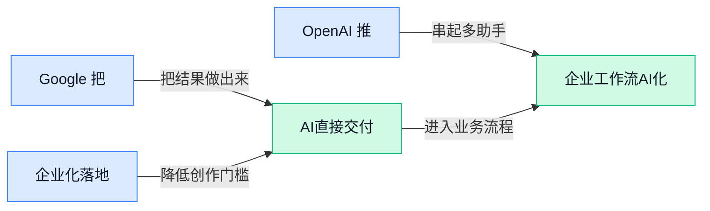

## AI资讯日报 2026/5/4

> AI 早报 · 每日早读 · 全网深度聚合

## **今日摘要**

```
ChatGPT 默认开启广告追踪惹争议，OpenAI 一边强化用户保护一边为新收入铺路
Google 把购物塞进 Gemini、AI 搜索模式和圈选即搜，搜索电商入口被 AI 全线改写
Claude Security（Claude 安全功能测试版）上线补企业防护，Anthropic 正面加码大模型安全战
```

### 🔵 产品与功能更新


1. **Google 把更多购物体验带进 Gemini、AI mode（AI 搜索模式）和 Circle to Search（圈选即搜功能）。**
Google 正在把**购物场景**更深地接入自家 AI 产品线，让用户不只是“问答案”，还能更自然地**找商品、比选择、做决策** 🛍️。这次覆盖到 Gemini、AI mode（Google 搜索里的 AI 对话模式）和 Circle to Search（在手机屏幕上圈一下就能直接搜的功能），说明 Google 想把“搜索”进一步改造成“边看边买”的入口。对普通用户来说，这类更新会让从种草到下单之间的步骤更短；对做电商、运营和品牌的同事来说，也意味着 **AI 导购** 正在成为新的流量分发界面。[Google 相关报道(briefing)](https://news.google.com/rss/articles/CBMi6AJBVV95cUxNOWZWakFfTHptVGlEaWhOLTV3MExLdGxVaUVXR1JvX3NfYnAwSndMYUdOOFFyY0xsZjB5c0x3TnI4LTJ5aFdmS09IWHltaEVrSUZzWU82dUdOakRtOGVCdEpOMlZ6bFRrU2MxMHJKem9qWGhHVndyNTlmdmZtVks5b1IxdW9sX29wYnZnOUtjQnV4MWRaN1h0di1fem9OUXBOT190VmJBTWRyc2tYZUlyazBraEVkVDRrV1ZKSVp1TnJnZWJ0aW9NdFg2TWM4QkljM255OE53RVlmMmJLcjRQQ3dVOWpJNHYwMXI1RXkydFpac1JNcS1YX2h5SnoyRjR1U1VsSVlNcGVjSGttNjhTUU1YVGJEQ2YtaTVKT1hiNnVfMkh2Q0J2M2tmWlRiM3hMV1ZQRjdZX2hqMmx0NVJ4VDhpX0xKTndIYlpTNWNWaHV5T29QRDJpVUZHcDVxR3hnRklMOWlaYUY?oc=5)


2. **Claude Security（Claude 安全功能测试版）上线，Anthropic 开始补强企业级防护。**
Anthropic 为 Claude 推出了 **Security beta（安全测试版）**，重点很明确：增强用户在使用 AI 时的**保护能力** 🔐。这类更新通常不是最吸睛的功能，却很关键，因为企业在把 AI 用进客服、文档、内部协作前，最担心的往往就是**安全、权限和风险控制**。对管理层和职能团队来说，这说明 AI 厂商正在从“能不能用”走向“敢不敢大规模用”，产品竞争也开始从模型能力扩展到 **企业信任体系**。[Claude 安全版报道(briefing)](https://news.google.com/rss/articles/CBMidkFVX3lxTE9HRU81a2RZZGpxNzFMbEhOTERRX21iOTJhU2p1UTM1VTZsZ2xzWVdTbTFoVzlUN3lTbVhGbS13dHBKRGthaENRUmw0REJJMUR3LS1uR0Qzb0pOSjRKSFV3cDlxX2N0TVVoaGFyOGptcFhfSHNzV0E?oc=5)


3. **OpenAI 推出新功能，强化 ChatGPT 用户保护。**
OpenAI 上线了一项新的**用户保护功能**，方向同样聚焦在让 ChatGPT 用起来更安全、更可控 🛡️。虽然候选信息没有展开具体机制，但从产品动作看，**用户安全** 已经成为主流 AI 平台持续加码的重点，而不只是附属选项。对公司内部推广 AI 工具的人来说，这类更新很重要，因为它直接关系到员工是否能更放心地把 ChatGPT 用到日常写作、检索和沟通辅助里。[OpenAI 保护功能报道(briefing)](https://news.google.com/rss/articles/CBMibEFVX3lxTE1PR0ZLUl9WNDBzQjVXNlVSLUpTb1FTdHlfZEZKSmNoa3lMWUNuQjNULU1LV01jLWU0cjJfN3BlV3ktNmRiZlViUy1ONTJ3cWFzVjk2UzI2TTRSNlk3VUwyQzFSUVhOQ01NUGlibg?oc=5)


### 🟢 前沿研究


1. **哈佛研究发现：AI 在急诊诊断中比两位人类医生更准确。**  
一项来自**哈佛**的新研究，把大模型放进真实**急诊**病例场景里做测试，结果显示至少有一个模型的诊断准确率高于两位人类医生 🏥。这类研究的意义不只是“AI 会不会看病”，更在于它可能成为医生的**辅助判断工具**，帮助减少漏诊和误判。这里说的大模型（能理解复杂文本并生成回答的 AI 系统）并不是独立执业医生，而更像一个能快速汇总病情线索的“第二意见”助手 💡。想看原始报道可读 [TechCrunch 完整报道(briefing)](https://techcrunch.com/2026/05/03/in-harvard-study-ai-offered-more-accurate-diagnoses-than-emergency-room-doctors/)。

![哈佛研究发现：AI 在急诊诊断中比两位人类医生更准确](https://image.pollinations.ai/prompt/%E5%93%88%E4%BD%9B%E7%A0%94%E7%A9%B6%E5%8F%91%E7%8E%B0%EF%BC%9AAI%20%E5%9C%A8%E6%80%A5%E8%AF%8A%E8%AF%8A%E6%96%AD%E4%B8%AD%E6%AF%94%E4%B8%A4%E4%BD%8D%E4%BA%BA%E7%B1%BB%E5%8C%BB%E7%94%9F%E6%9B%B4%E5%87%86%E7%A1%AE.%20%E5%93%88%E4%BD%9B%E7%A0%94%E7%A9%B6%E5%8F%91%E7%8E%B0%EF%BC%9AAI%20%E5%9C%A8%E6%80%A5%E8%AF%8A%E8%AF%8A%E6%96%AD%E4%B8%AD%E6%AF%94%E4%B8%A4%E4%BD%8D%E4%BA%BA%E7%B1%BB%E5%8C%BB%E7%94%9F%E6%9B%B4%E5%87%86%E7%A1%AE%E3%80%82%20%E4%B8%80%E9%A1%B9%E6%9D%A5%E8%87%AA%E5%93%88%E4%BD%9B%E7%9A%84%E6%96%B0%E7%A0%94%E7%A9%B6%EF%BC%8C%E6%8A%8A%E5%A4%A7%E6%A8%A1%E5%9E%8B%E6%94%BE%E8%BF%9B%E7%9C%9F%E5%AE%9E%E6%80%A5%E8%AF%8A%E7%97%85%E4%BE%8B%E5%9C%BA%E6%99%AF%E9%87%8C%E5%81%9A%E6%B5%8B%E8%AF%95%EF%BC%8C%E7%BB%93%E6%9E%9C%E6%98%BE%E7%A4%BA%E8%87%B3%E5%B0%91%E6%9C%89%E4%B8%80%E4%B8%AA%E6%A8%A1%E5%9E%8B%E7%9A%84%E8%AF%8A%E6%96%AD%E5%87%86%E7%A1%AE%E7%8E%87%E9%AB%98%E4%BA%8E%E4%B8%A4%E4%BD%8D%E4%BA%BA%2C%20technical%20infographic%20diagram%2C%20architecture%20flowchart%2C%20clean%20vector%20illustration%2C%20educational%20style%2C%20no%20text%20overlay%2C%20modern%20minimal%2C%20wide%20aspect?width=1200&height=675&nologo=true&seed=10807)


2. **伦理难题测试显示：前沿 AI 模型面对同一提示词会给出不同“道德选择”。**  
一篇报道指出，即便面对完全相同的**prompt**（给 AI 的输入指令），不同前沿模型在**伦理困境**里的回答也会明显分化 🤔。这说明模型不仅在“会不会答”上有差异，也在“怎么判断对错”上体现出不同取向，而这背后往往涉及**alignment（对齐，让模型行为更符合人类意图和规则的训练过程）**。对企业来说，这意味着 AI 用在客服、招聘、审核等敏感场景时，不能只看能力榜单，还得关注它的价值判断是否稳定。更多细节可看 [研究报道摘要(briefing)](https://news.google.com/rss/articles/CBMipwFBVV95cUxNZHVFcEQ3YUwxZl9oeERMbGhHd2FvRnpMaW9KTjBZNFVSTG5QSDlHdnZMaHJMV3ZGMGhVM2NnREdFcUFkUDFMY0RNWmVWVWpxV2pMSVhBY2dJUjR2ZmluWkNlRmJQRDlvMkY1bmdlZzZ6LW5nOHhVWHRZVHZGbTVoSEpkNWtrUlVyb0g5TGctejhoOEdsREZIZ0xlU2g0aVhwSHdqd3JNUQ?oc=5)。

![伦理难题测试显示：前沿 AI 模型面对同一提示词会给出不同“道德选择”](https://image.pollinations.ai/prompt/%E4%BC%A6%E7%90%86%E9%9A%BE%E9%A2%98%E6%B5%8B%E8%AF%95%E6%98%BE%E7%A4%BA%EF%BC%9A%E5%89%8D%E6%B2%BF%20AI%20%E6%A8%A1%E5%9E%8B%E9%9D%A2%E5%AF%B9%E5%90%8C%E4%B8%80%E6%8F%90%E7%A4%BA%E8%AF%8D%E4%BC%9A%E7%BB%99%E5%87%BA%E4%B8%8D%E5%90%8C%E2%80%9C%E9%81%93%E5%BE%B7%E9%80%89%E6%8B%A9%E2%80%9D.%20%E4%BC%A6%E7%90%86%E9%9A%BE%E9%A2%98%E6%B5%8B%E8%AF%95%E6%98%BE%E7%A4%BA%EF%BC%9A%E5%89%8D%E6%B2%BF%20AI%20%E6%A8%A1%E5%9E%8B%E9%9D%A2%E5%AF%B9%E5%90%8C%E4%B8%80%E6%8F%90%E7%A4%BA%E8%AF%8D%E4%BC%9A%E7%BB%99%E5%87%BA%E4%B8%8D%E5%90%8C%E2%80%9C%E9%81%93%E5%BE%B7%E9%80%89%E6%8B%A9%E2%80%9D%E3%80%82%20%E4%B8%80%E7%AF%87%E6%8A%A5%E9%81%93%E6%8C%87%E5%87%BA%EF%BC%8C%E5%8D%B3%E4%BE%BF%E9%9D%A2%E5%AF%B9%E5%AE%8C%E5%85%A8%E7%9B%B8%E5%90%8C%E7%9A%84prompt%EF%BC%88%E7%BB%99%20AI%20%E7%9A%84%E8%BE%93%E5%85%A5%E6%8C%87%E4%BB%A4%EF%BC%89%EF%BC%8C%E4%B8%8D%E5%90%8C%E5%89%8D%E6%B2%BF%E6%A8%A1%E5%9E%8B%E5%9C%A8%E4%BC%A6%2C%20technical%20infographic%20diagram%2C%20architecture%20flowchart%2C%20clean%20vector%20illustration%2C%20educational%20style%2C%20no%20text%20overlay%2C%20modern%20minimal%2C%20wide%20aspect?width=1200&height=675&nologo=true&seed=10838)


3. **《Learning from Noisy Preferences》（从含噪偏好中学习的训练方法）尝试改进 DPO（直接偏好优化，一种让模型更贴近人类喜好的训练方式）。**  
这篇论文关注一个很实际的问题：人类给 AI 的“偏好标注”并不总是准确，里面常常混有噪声，也就是错标、含糊或前后不一致的数据 🧪。作者提出把**semi-supervised learning（半监督学习，少量高质量标注搭配大量普通数据一起训练）**引入 **DPO**，希望让模型在面对不完美偏好数据时也能学得更稳。对做 AI 产品的团队来说，这类研究很重要，因为真实业务中的反馈数据往往远没实验室里那么干净。论文入口见 [HuggingFace 论文页(briefing)](https://huggingface.co/papers/2604.24952)。

![《Learning from Noisy Preferences》（从含噪偏好中学习的训练方法）尝试改进 DPO（直接偏好优化，一种让模型更贴近人类喜好的训练方式）](https://image.pollinations.ai/prompt/%E3%80%8ALearning%20from%20Noisy%20Preferences%E3%80%8B%EF%BC%88%E4%BB%8E%E5%90%AB%E5%99%AA%E5%81%8F%E5%A5%BD%E4%B8%AD%E5%AD%A6%E4%B9%A0%E7%9A%84%E8%AE%AD%E7%BB%83%E6%96%B9%E6%B3%95%EF%BC%89%E5%B0%9D%E8%AF%95%E6%94%B9%E8%BF%9B%20DPO%EF%BC%88%E7%9B%B4%E6%8E%A5%E5%81%8F%E5%A5%BD%E4%BC%98%E5%8C%96%EF%BC%8C%E4%B8%80%E7%A7%8D%E8%AE%A9%E6%A8%A1%E5%9E%8B%E6%9B%B4%E8%B4%B4%E8%BF%91%E4%BA%BA%E7%B1%BB%E5%96%9C%E5%A5%BD%E7%9A%84%E8%AE%AD%E7%BB%83%E6%96%B9%E5%BC%8F%EF%BC%89.%20%E3%80%8ALearning%20from%20Noisy%20Preferences%E3%80%8B%EF%BC%88%E4%BB%8E%E5%90%AB%E5%99%AA%E5%81%8F%E5%A5%BD%E4%B8%AD%E5%AD%A6%E4%B9%A0%E7%9A%84%E8%AE%AD%E7%BB%83%E6%96%B9%E6%B3%95%EF%BC%89%E5%B0%9D%E8%AF%95%E6%94%B9%E8%BF%9B%20DPO%EF%BC%88%E7%9B%B4%E6%8E%A5%E5%81%8F%E5%A5%BD%E4%BC%98%E5%8C%96%EF%BC%8C%E4%B8%80%E7%A7%8D%E8%AE%A9%E6%A8%A1%E5%9E%8B%E6%9B%B4%E8%B4%B4%E8%BF%91%E4%BA%BA%E7%B1%BB%E5%96%9C%E5%A5%BD%E7%9A%84%E8%AE%AD%E7%BB%83%E6%96%B9%2C%20technical%20infographic%20diagram%2C%20architecture%20flowchart%2C%20clean%20vector%20illustration%2C%20educational%20style%2C%20no%20text%20overlay%2C%20modern%20minimal%2C%20wide%20aspect?width=1200&height=675&nologo=true&seed=10869)


4. **ExoActor（把第三人称视频生成用于机器人控制的研究）探索让人形机器人更会“看别人学动作”。**  
这篇论文把**exocentric video（第三人称视角视频，也就是从外部观察一个人或机器人动作的视频）**和**humanoid control（人形机器人动作控制）**联系起来，目标是让机器人从外部演示中学会更通用的互动行为 🤖。简单说，它不是只教机器人背固定动作，而是希望它能从视频中理解“人在怎么动、为什么这么动”，再迁移到自己的控制系统里。对机器人行业来说，这意味着未来训练方式可能不必完全依赖昂贵的人工示教或传感器采集。更多信息可看 [论文页面(briefing)](https://huggingface.co/papers/2604.27711)。

![ExoActor（把第三人称视频生成用于机器人控制的研究）探索让人形机器人更会“看别人学动作”](https://image.pollinations.ai/prompt/ExoActor%EF%BC%88%E6%8A%8A%E7%AC%AC%E4%B8%89%E4%BA%BA%E7%A7%B0%E8%A7%86%E9%A2%91%E7%94%9F%E6%88%90%E7%94%A8%E4%BA%8E%E6%9C%BA%E5%99%A8%E4%BA%BA%E6%8E%A7%E5%88%B6%E7%9A%84%E7%A0%94%E7%A9%B6%EF%BC%89%E6%8E%A2%E7%B4%A2%E8%AE%A9%E4%BA%BA%E5%BD%A2%E6%9C%BA%E5%99%A8%E4%BA%BA%E6%9B%B4%E4%BC%9A%E2%80%9C%E7%9C%8B%E5%88%AB%E4%BA%BA%E5%AD%A6%E5%8A%A8%E4%BD%9C%E2%80%9D.%20ExoActor%EF%BC%88%E6%8A%8A%E7%AC%AC%E4%B8%89%E4%BA%BA%E7%A7%B0%E8%A7%86%E9%A2%91%E7%94%9F%E6%88%90%E7%94%A8%E4%BA%8E%E6%9C%BA%E5%99%A8%E4%BA%BA%E6%8E%A7%E5%88%B6%E7%9A%84%E7%A0%94%E7%A9%B6%EF%BC%89%E6%8E%A2%E7%B4%A2%E8%AE%A9%E4%BA%BA%E5%BD%A2%E6%9C%BA%E5%99%A8%E4%BA%BA%E6%9B%B4%E4%BC%9A%E2%80%9C%E7%9C%8B%E5%88%AB%E4%BA%BA%E5%AD%A6%E5%8A%A8%E4%BD%9C%E2%80%9D%E3%80%82%20%E8%BF%99%E7%AF%87%E8%AE%BA%E6%96%87%E6%8A%8Aexocentric%20video%EF%BC%88%E7%AC%AC%E4%B8%89%E4%BA%BA%E7%A7%B0%E8%A7%86%E8%A7%92%E8%A7%86%E9%A2%91%EF%BC%8C%2C%20technical%20infographic%20diagram%2C%20architecture%20flowchart%2C%20clean%20vector%20illustration%2C%20educational%20style%2C%20no%20text%20overlay%2C%20modern%20minimal%2C%20wide%20aspect?width=1200&height=675&nologo=true&seed=10900)


5. **Length Value Model（面向输出长度控制的价值模型）研究 AI 如何更稳地控制回答长短。**  
这项工作聚焦 **token-level（词元级，也就是把一句话拆成一个个小文本单元逐步处理） length modeling（长度建模，提前学习“该说多长”）**，想解决模型时长时短、不好控的问题 📏。论文提出一种可扩展的**value pretraining（价值预训练，先让模型学会评估每一步输出是否更接近期望目标）**思路，让模型在生成过程中更细粒度地把握篇幅。对日常产品体验来说，这很实用：比如客服回复不想太啰嗦，报告总结又不能太短，长度控制其实直接影响可用性。论文可见 [HuggingFace 论文页(briefing)](https://huggingface.co/papers/2604.27039)。


6. **Representation Fréchet Loss（基于特征分布差异的新损失函数）瞄准提升视觉生成质量。**  
这篇论文提出一种新的 **loss（损失函数，训练 AI 时用来衡量“生成结果离目标还有多远”的打分规则）**，用于改进图像等**视觉生成**任务 🎨。其中 **Fréchet** 相关思路可以理解为：不只看单张图像像不像，还比较生成结果和真实数据在整体“特征分布”上是否接近，也就是更关注“整体气质”而不只是局部细节。对于 AI 绘图和视频生成来说，这类底层训练改进往往会体现在画面更自然、风格更稳定。论文入口在 [论文详情页(briefing)](https://huggingface.co/papers/2604.28190)。


7. **《Instruction-Guided Poetry Generation in Arabic and Its Dialects》（面向阿拉伯语及方言的指令式诗歌生成）把生成式 AI 推向更细分语言场景。**  
这项研究聚焦**阿拉伯语**及其不同**方言**的诗歌生成，重点是让模型按照明确指令去创作，而不只是随机“写得像诗” ✍️。这里的 **instruction-guided（指令引导，用户先说明题材、风格或要求，再让模型按要求生成）** 很关键，因为方言和文学表达都高度依赖语境，难度比普通问答高不少。它提醒我们，AI 研究正从“英语通用能力”走向更细的文化与语言适配，这对教育、内容创作和本地化产品都很有启发。原文可看 [HuggingFace 论文页(briefing)](https://huggingface.co/papers/2604.27766)。


### 🟡 行业展望与社会影响


1. **ChatGPT 默认开启广告追踪，OpenAI 开始为新收入铺路。**
OpenAI 被曝已默认让 ChatGPT 追踪用户，用于**广告相关的数据处理**，这说明它不只是在卖订阅，也在探索更传统的互联网变现路子 💰。对普通用户来说，最直接的影响不是“马上看到广告”，而是**隐私边界**可能变得更值得关注；对企业来说，则意味着生成式 AI 产品也正在走向和搜索、社交平台类似的商业模式。[完整报道(briefing)](https://the-decoder.com/chatgpt-now-tracks-users-for-ads-by-default-as-openai-looks-for-new-revenue/) 这件事也提醒大家，未来用 AI 工具时，除了看功能和价格，也要更留意**默认设置**和数据授权选项 🔍。


2. **Microsoft 被指在 VS Code（微软的代码编辑器）提交记录里悄悄加入“Co-Authored-by Copilot（由 Copilot 协作署名）”，即使关闭 AI 也会出现。**
这起争议的核心，不只是一个署名字段，而是用户对**知情权**和**工具控制权**的敏感反应 😮。所谓 commit（代码提交记录，可以理解为“每次保存并上报的修改痕迹”）本来就关系到责任归属，而“Co-Authored-by”（共同作者标记，用来说明这段内容是谁参与完成的）如果在未明确同意下自动出现，很容易引发对真实性和合规性的担忧。[事件报道(briefing)](https://the-decoder.com/co-pilot-becomes-a-co-author-in-vs-code-without-being-asked/) 这也说明，AI 正在深入办公和开发流程后，大家在意的已经不只是“能不能用”，而是**系统有没有替你做决定** ⚠️。

![Microsoft 被指在 VS Code（微软的代码编辑器）提交记录里悄悄加入“Co-Authored-by Copilot（由 Copilot 协作署名）”，即使关闭 AI 也会出现](https://image.pollinations.ai/prompt/Microsoft%20%E8%A2%AB%E6%8C%87%E5%9C%A8%20VS%20Code%EF%BC%88%E5%BE%AE%E8%BD%AF%E7%9A%84%E4%BB%A3%E7%A0%81%E7%BC%96%E8%BE%91%E5%99%A8%EF%BC%89%E6%8F%90%E4%BA%A4%E8%AE%B0%E5%BD%95%E9%87%8C%E6%82%84%E6%82%84%E5%8A%A0%E5%85%A5%E2%80%9CCo-Authored-by%20Copilot%EF%BC%88%E7%94%B1%20Copilot%20%E5%8D%8F%E4%BD%9C%E7%BD%B2%E5%90%8D%EF%BC%89%E2%80%9D%EF%BC%8C%E5%8D%B3%E4%BD%BF%E5%85%B3%E9%97%AD%20AI%20%E4%B9%9F%E4%BC%9A%E5%87%BA%E7%8E%B0.%20Microsoft%20%E8%A2%AB%E6%8C%87%E5%9C%A8%20VS%20Code%EF%BC%88%E5%BE%AE%E8%BD%AF%E7%9A%84%E4%BB%A3%E7%A0%81%E7%BC%96%E8%BE%91%E5%99%A8%EF%BC%89%E6%8F%90%E4%BA%A4%E8%AE%B0%E5%BD%95%E9%87%8C%E6%82%84%E6%82%84%E5%8A%A0%E5%85%A5%E2%80%9CCo-Authored-by%20Copilot%EF%BC%88%E7%94%B1%20Copilot%20%E5%8D%8F%E4%BD%9C%E7%BD%B2%E5%90%8D%EF%BC%89%E2%80%9D%2C%20technical%20infographic%20diagram%2C%20architecture%20flowchart%2C%20clean%20vector%20illustration%2C%20educational%20style%2C%20no%20text%20overlay%2C%20modern%20minimal%2C%20wide%20aspect?width=1200&height=675&nologo=true&seed=10838)

3. **MiMo-V2.5-Pro（小米开放权重的大模型）瞄准 Claude Opus，主打长时间自主编程。**
这条消息的看点在于，小米把重点放在了**open-weight（开放权重，指模型参数可供外部获取，更方便企业和开发者自行部署）**和长时自主执行能力上，而不是只比拼聊天效果 🚀。所谓 autonomous coding（自主编程，指 AI 可以连续较长时间自己拆解任务、写代码、修 bug）如果真能稳定落地，会让 AI 从“回答问题”进一步走向“持续干活”。[相关报道(briefing)](https://news.google.com/rss/articles/CBMiuAFBVV95cUxNdmdnck5aRk9UQnRKcWJ3Tk95OUhmX2E2dTlIclcwZk9McnlzZmNTbDl5aWpQQnlKME04Y000dG5iQVNCMWljVTlTYmVqblI2Y0RfcFNHcndlbzJrQW9JUE1hNkFScENXYVd0RkN4allXZUZBazF0bWpXOXQ5MHdOUktJZVFBOVdMcmdEZW9FWklhR0dDUTNZTkZsZU9zcUNrYTNYakVXbFBwQ2Y3R0hsbFBsWjl2T2hD?oc=5) 从行业角度看，这也说明国产厂商正在把竞争点推向**可部署性**和**复杂任务执行**，而不只是参数规模或跑分表现。


### 🟣 开源TOP项目

1. **Understand-Anything（把代码和知识库变成可交互知识图谱的开源工具）让“看懂复杂信息”更直观。**  
这个项目主打把**代码**或**知识库**直接转换成可探索的**知识图谱**（把概念、文件、关系连成图，像“可点击的思维导图”）📚。你不仅能在图里浏览，还能**搜索**、**提问**，适合拿来理解复杂代码库，或者像 Karpathy LLM wiki（Karpathy 整理的大模型知识资料库）这类内容密集型资料。它还提到可配合 Claude Code、Codex、Cursor、Copilot、Gemini CLI（命令行界面的 Gemini 工具）等使用，说明它更像一个给多种 AI 助手配套的“理解层” 🧠。[GitHub 项目页(briefing)](https://github.com/Lum1104/Understand-Anything)


2. **sandcastle（用 TypeScript 编排沙箱编码 Agent 的开源工具）瞄准更可控的自动写代码流程。**  
这个项目的核心是用 **TypeScript**（一种在 JavaScript 基础上增加类型检查、方便团队协作的开发语言）来编排**沙箱**（隔离运行环境，像给程序放进“安全试验箱”）里的编码 Agent 🔒。摘要里明确提到可通过 `sandcastle.run()` 来统一调度，重点不是“让 AI 会写代码”，而是“让 AI 在受控环境里写代码并执行”。对团队来说，这类工具的意义在于降低自动化编程时的失控风险，也更方便做流程化接入。[GitHub 仓库页(briefing)](https://github.com/mattpocock/sandcastle)


3. **jcode（用于管理 Coding Agent 的开源运行框架）主打给 AI 编码流程搭“操作台”。**  
项目摘要非常简短，定位是 **Coding Agent Harness**，这里的 Harness（运行与调度框架，像给 Agent 配的“控制架”和“测试台”）意味着它更偏底层支撑，而不是面向普通用户的现成应用 🛠️。简单说，它关注的是怎么把编码 Agent 跑起来、管起来，而不只是生成一段代码。对于关注 AI 开发工具链的人，这类项目通常代表“从单次对话写代码”走向“可重复、可测试的工作流”。[项目主页(briefing)](https://github.com/1jehuang/jcode)


4. **flue（面向沙箱 Agent 的开源框架）继续加码安全隔离式 Agent 运行。**  
摘要直接把它定义为 **sandbox agent framework**，也就是“沙箱 Agent 框架”——让 Agent 在隔离环境中执行任务，减少直接碰真实系统带来的风险 ⚙️。这里的 framework（框架，指一套可复用的基础结构）说明它不是单一功能工具，而是给开发者搭建 Agent 系统用的底座。最近这类项目变多，说明开源社区越来越重视 Agent 的**可控性**与**安全边界**。[GitHub 仓库(briefing)](https://github.com/withastro/flue)


5. **Scrapling（自适应网页抓取框架）想把从单页采集到大规模爬取一把梭。**  
这个项目是一套 **Web Scraping**（网页抓取，自动从网站提取信息）框架，而且强调 **adaptive**（自适应，能根据不同网页情况灵活处理）🕸️。摘要提到它既能处理“一次请求”的轻量任务，也能覆盖“全量爬取”的大规模场景，说明目标是把小需求和复杂采集统一到一套工具里。对做数据收集、竞品监测、信息整理的人来说，这类基础设施很重要，因为很多 AI 应用前提就是先把外部信息稳定拿到手。[GitHub 项目页(briefing)](https://github.com/D4Vinci/Scrapling)

![Scrapling（自适应网页抓取框架）想把从单页采集到大规模爬取一把梭](https://image.pollinations.ai/prompt/Scrapling%EF%BC%88%E8%87%AA%E9%80%82%E5%BA%94%E7%BD%91%E9%A1%B5%E6%8A%93%E5%8F%96%E6%A1%86%E6%9E%B6%EF%BC%89%E6%83%B3%E6%8A%8A%E4%BB%8E%E5%8D%95%E9%A1%B5%E9%87%87%E9%9B%86%E5%88%B0%E5%A4%A7%E8%A7%84%E6%A8%A1%E7%88%AC%E5%8F%96%E4%B8%80%E6%8A%8A%E6%A2%AD.%20Scrapling%EF%BC%88%E8%87%AA%E9%80%82%E5%BA%94%E7%BD%91%E9%A1%B5%E6%8A%93%E5%8F%96%E6%A1%86%E6%9E%B6%EF%BC%89%E6%83%B3%E6%8A%8A%E4%BB%8E%E5%8D%95%E9%A1%B5%E9%87%87%E9%9B%86%E5%88%B0%E5%A4%A7%E8%A7%84%E6%A8%A1%E7%88%AC%E5%8F%96%E4%B8%80%E6%8A%8A%E6%A2%AD%E3%80%82%20%E8%BF%99%E4%B8%AA%E9%A1%B9%E7%9B%AE%E6%98%AF%E4%B8%80%E5%A5%97%20Web%20Scraping%EF%BC%88%E7%BD%91%E9%A1%B5%E6%8A%93%E5%8F%96%EF%BC%8C%E8%87%AA%E5%8A%A8%E4%BB%8E%E7%BD%91%E7%AB%99%E6%8F%90%E5%8F%96%E4%BF%A1%E6%81%AF%EF%BC%89%E6%A1%86%E6%9E%B6%EF%BC%8C%E8%80%8C%E4%B8%94%E5%BC%BA%2C%20technical%20infographic%20diagram%2C%20architecture%20flowchart%2C%20clean%20vector%20illustration%2C%20educational%20style%2C%20no%20text%20overlay%2C%20modern%20minimal%2C%20wide%20aspect?width=1200&height=675&nologo=true&seed=11125)

6. **dexter（面向金融深度研究的自主 Agent）把 AI Agent 用到了投研场景。**  
这个项目把自己定义为 **autonomous agent**（自主 Agent，能相对独立地持续执行任务的 AI 助手），专门用于 **deep financial research**（深度金融研究）📈。从摘要看，它不是泛用聊天工具，而是明确瞄准金融分析这一垂直领域，意味着重点会放在连续研究、信息整合和输出洞察上。对行业观察来说，这也反映出开源 Agent 正在从“通用演示”往“专业场景”下沉。[GitHub 仓库页(briefing)](https://github.com/virattt/dexter)


### 🔴 社媒分享

1. **Qwen3.6-27B 与 Coder-Next（两个主打编程能力的开源模型）实测对比：没有绝对赢家。**
有用户在两张 **RTX PRO 6000 Blackwell（英伟达面向高性能计算的新一代专业显卡）** 上连续跑了约 20 小时，对 **Qwen3.6-27B** 和 **Coder-Next** 做并排测试，最后得出的结论很朴素：**“看场景”** 🤔。这类对比很有参考价值，因为它提醒大家，模型表现不只看排行榜，还和具体任务、**token（模型处理文字时切分的小单位）** 消耗、算力成本密切相关。对公司里要选本地模型（部署在自己电脑或服务器上的模型）的同事来说，这意味着别急着追“最强”，先看自己到底更需要写代码、通用问答，还是成本可控。[Reddit 实测讨论(briefing)](https://www.reddit.com/r/LocalLLaMA/comments/1t2ab5y/qwen3627b_vs_codernext/)


2. **Hummingbird+（一种用低成本 FPGA 跑大模型的新方案）论文引发关注：24GB 内存下可跑 Qwen3-30B-A3B。**
这篇讨论聚焦 **Hummingbird+**，它基于 **FPGA（可编程芯片，像“能按需求改功能”的硬件）** 做 **LLM inference（大模型推理，让训练好的模型真正开始回答问题）**，主打比传统高端显卡更便宜的路线 💡。帖子提到，在 **Q4（4 比特量化，把模型压缩得更小、更省资源）** 设置下，**Qwen3-30B-A3B** 可达到每秒 18 个 **token（模型输出文字时的基本单位）**，并把硬件需求压到 24GB，量产成本预期约 150 美元。对想做低成本本地部署的团队来说，这类方案如果成熟，可能会让“跑得起大模型”不再只是大公司的专利。[Reddit 论文讨论(briefing)](https://www.reddit.com/r/LocalLLaMA/comments/1t2kpzn/paper_on_hummingbird_lowcost_fpgas_for_llm/)


3. **Open Weights Models Hall of Fame（开放权重大模型“名人堂”）致敬开源社区。**
这则帖子不是在比参数，而是在给 **open weights（开放模型权重，也就是把训练好的模型文件公开，方便别人下载和部署）** 社区“立传” 🙌。作者提到，大家平时总在问什么时候有新的 **GGUF（一种方便本地运行大模型的文件格式）** 版本，但也值得停下来感谢那些真正把模型放出来、让普通人能获得生产力提升的团队和公司。对非技术同事来说，这背后的意义很直接：今天很多能在本地电脑运行、可控性更强的 AI 工具，其实都建立在这种开放分享文化上。[Reddit 原帖致谢(briefing)](https://www.reddit.com/r/LocalLLaMA/comments/1t2lwn0/open_weights_models_hall_of_fame/)


4. **Talking to Transformers（与 Transformer〈主流大模型核心架构〉“对话”）用更直观方式解释模型如何理解语言。**
这篇文章试图把 **Transformer（当前大多数大模型的底层结构，可以理解为 AI 处理文字信息的“发动机”）** 讲得更像人与人交流，而不是一堆抽象公式 📚。这类内容的价值在于，它能帮助非技术读者理解：我们平时和 ChatGPT 对话时，看似自然的回答，其实来自模型对上下文的连续处理，而不是“真的懂你”。如果你经常需要把 AI 用在写作、客服、运营或内部知识问答，读懂这类基础原理，会更容易明白为什么 **prompt（给 AI 的提示语）** 写法会直接影响结果。[原文博客(briefing)](https://miraos.org/blog/2026/05/02/talking-to-transformers)

![Talking to Transformers（与 Transformer〈主流大模型核心架构〉“对话”）用更直观方式解释模型如何理解语言](https://image.pollinations.ai/prompt/Talking%20to%20Transformers%EF%BC%88%E4%B8%8E%20Transformer%E3%80%88%E4%B8%BB%E6%B5%81%E5%A4%A7%E6%A8%A1%E5%9E%8B%E6%A0%B8%E5%BF%83%E6%9E%B6%E6%9E%84%E3%80%89%E2%80%9C%E5%AF%B9%E8%AF%9D%E2%80%9D%EF%BC%89%E7%94%A8%E6%9B%B4%E7%9B%B4%E8%A7%82%E6%96%B9%E5%BC%8F%E8%A7%A3%E9%87%8A%E6%A8%A1%E5%9E%8B%E5%A6%82%E4%BD%95%E7%90%86%E8%A7%A3%E8%AF%AD%E8%A8%80.%20Talking%20to%20Transformers%EF%BC%88%E4%B8%8E%20Transformer%E3%80%88%E4%B8%BB%E6%B5%81%E5%A4%A7%E6%A8%A1%E5%9E%8B%E6%A0%B8%E5%BF%83%E6%9E%B6%E6%9E%84%E3%80%89%E2%80%9C%E5%AF%B9%E8%AF%9D%E2%80%9D%EF%BC%89%E7%94%A8%E6%9B%B4%E7%9B%B4%E8%A7%82%E6%96%B9%E5%BC%8F%E8%A7%A3%E9%87%8A%E6%A8%A1%E5%9E%8B%E5%A6%82%E4%BD%95%E7%90%86%E8%A7%A3%E8%AF%AD%E8%A8%80%E3%80%82%20%E8%BF%99%E7%AF%87%E6%96%87%E7%AB%A0%E8%AF%95%E5%9B%BE%E6%8A%8A%20T%2C%20technical%20infographic%20diagram%2C%20architecture%20flowchart%2C%20clean%20vector%20illustration%2C%20educational%20style%2C%20no%20text%20overlay%2C%20modern%20minimal%2C%20wide%20aspect?width=1200&height=675&nologo=true&seed=10706)

---



### 📊 行业洞察（今日 4 条）

1. Google将购物接入Gemini、AI mode（AI搜索模式）与Circle to Search（圈选即搜）。
  【洞察】AI入口正从问答转向交易决策，判断依据是同一购物能力横跨搜索与助手，机会在转化，风险是平台分发权更集中。

2. Anthropic上线Claude Security测试版，OpenAI同步强化ChatGPT用户保护功能。
  【洞察】企业级竞争已从模型能力转向信任体系，因两家同时补安全短板；机会是扩大采购，风险是合规要求抬高中小厂进入门槛。

3. 哈佛研究显示，至少一个大模型在真实急诊病例中诊断准确率高于两位人类医生。
  【洞察】高风险行业将更愿接受AI作第二意见，因其在真实场景显出效果；但责任归属与误判后果仍重，落地会先辅后主。

4. 小米发布MiMo-V2.5-Pro（开放权重模型），主打长时自主编程并强调更省词元（文本处理单位）。
  【洞察】行业竞争点正转向持续执行与成本效率，因其对标Claude Opus而不只讲跑分；机会在私有化，风险是稳定性待验证。

### 💭 对我们的启发（今日 3 条）

1. 结合MiMo-V2.5-Pro事件，我们的平台应把长任务拆解、评测与回放做成核心能力；机会是承接私有化需求，风险是结果漂移影响签约。

2. 参考Claude Security与ChatGPT保护升级，A2A平台要把权限边界、操作留痕、人工复核前置；机会是更易进企业，风险是产品复杂度上升。

3. Google把购物带入Gemini说明Agent正贴近交易场景；我们可先做跨工具协作层，机会是靠近业务价值，风险是易受上游入口挤压。

