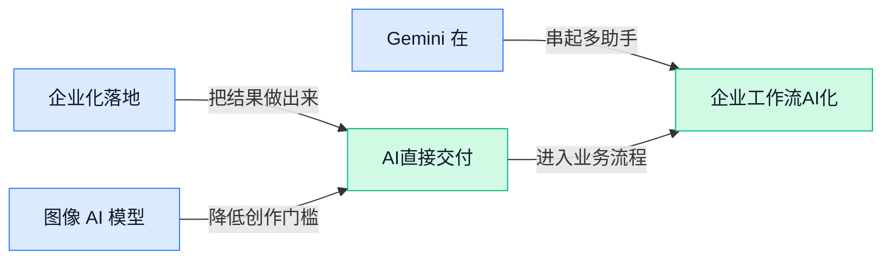

## AI资讯日报 2026/5/5

> AI 早报 · 每日早读 · 全网深度聚合

## **今日摘要**

```
OpenAI 为企业部署募资超40亿美元，Anthropic联手黑石集团和高盛，卖AI从模型战杀入交付战
Sierra融资9.5亿美元估值冲上150亿，Cerebras冲击高估值IPO，AI资本狂潮从应用烧到芯片
白宫酝酿AI模型发布前审查，OpenAI公开低延迟语音大规模落地方案，监管与商用正面对撞
```

### 🔵 产品与功能更新


1. **Anthropic 联手 Blackstone（黑石集团，全球大型投资公司）和 Goldman Sachs（高盛，国际投行）推出企业 AI 服务。**
Anthropic 正把 **AI 产品** 往更明确的企业场景推进，这次合作对象直接瞄准大型金融与投资机构 💼。从现有信息看，这是一项面向企业客户的联合布局，重点不是普通用户聊天体验，而是把 **Claude** 能力嵌进更正式、更高价值的业务流程里。对公司职能岗同事来说，这类动作说明 AI 正在从“个人提效工具”走向“机构级生产工具”，未来在投研、文档处理、内部知识问答等场景会更常见。[Yahoo Finance 报道(briefing)](https://news.google.com/rss/articles/CBMiqgFBVV95cUxPUDNwbjRZdUtteDVKNFhFczBrSHhpcWdfaDk3QUM1V2ZrenE1bHpVSDhNVFBhSzN6NnFfT0lzenpXUC1LU0l4Zl81dWpoVjhJbzZENkU0X09Vd0JKN3ZHY0s5al9rUnVQQ3FldEVWNndoYkJQMlp3TmtkZmxvQkJSUE5MY2otY0RwQmZOZ2RtMm52VlJPYjN2alNjRHRFZ0NjWFBzNXBaeXpiQQ?oc=5)


2. **图像 AI 模型正在成为 App 增长新引擎，带动下载效果超过聊天机器人升级。**
TechCrunch 援引 Appfigures（移动应用市场数据分析平台）的数据称，发布 **图像生成模型** 的应用，带来的下载增长可达到聊天功能升级的 **6.5 倍** 📈。但热度不等于赚钱，很多产品虽然借视觉功能冲高了安装量，却没能顺利转成收入，这也提醒团队别只盯“流量暴涨”，还得设计好付费路径。对做运营、产品和市场的同事来说，这条趋势很实用：用户现在更容易被“看得见的 AI 效果”打动，**视觉能力** 正在成为拉新利器。[TechCrunch 完整报道(briefing)](https://techcrunch.com/2026/05/04/image-ai-models-now-drive-app-growth-beating-chatbot-upgrades/)

![图像 AI 模型正在成为 App 增长新引擎，带动下载效果超过聊天机器人升级](https://image.pollinations.ai/prompt/%E5%9B%BE%E5%83%8F%20AI%20%E6%A8%A1%E5%9E%8B%E6%AD%A3%E5%9C%A8%E6%88%90%E4%B8%BA%20App%20%E5%A2%9E%E9%95%BF%E6%96%B0%E5%BC%95%E6%93%8E%EF%BC%8C%E5%B8%A6%E5%8A%A8%E4%B8%8B%E8%BD%BD%E6%95%88%E6%9E%9C%E8%B6%85%E8%BF%87%E8%81%8A%E5%A4%A9%E6%9C%BA%E5%99%A8%E4%BA%BA%E5%8D%87%E7%BA%A7.%20%E5%9B%BE%E5%83%8F%20AI%20%E6%A8%A1%E5%9E%8B%E6%AD%A3%E5%9C%A8%E6%88%90%E4%B8%BA%20App%20%E5%A2%9E%E9%95%BF%E6%96%B0%E5%BC%95%E6%93%8E%EF%BC%8C%E5%B8%A6%E5%8A%A8%E4%B8%8B%E8%BD%BD%E6%95%88%E6%9E%9C%E8%B6%85%E8%BF%87%E8%81%8A%E5%A4%A9%E6%9C%BA%E5%99%A8%E4%BA%BA%E5%8D%87%E7%BA%A7%E3%80%82%20TechCrunch%20%E6%8F%B4%E5%BC%95%20Appfigures%EF%BC%88%E7%A7%BB%E5%8A%A8%E5%BA%94%E7%94%A8%E5%B8%82%E5%9C%BA%E6%95%B0%E6%8D%AE%E5%88%86%E6%9E%90%E5%B9%B3%E5%8F%B0%EF%BC%89%E7%9A%84%E6%95%B0%2C%20technical%20infographic%20diagram%2C%20architecture%20flowchart%2C%20clean%20vector%20illustration%2C%20educational%20style%2C%20no%20text%20overlay%2C%20modern%20minimal%2C%20wide%20aspect?width=1200&height=675&nologo=true&seed=11420)


3. **Gemini 在 iOS 上的 App 界面迎来明显美化。**
这次更新的重点不是模型能力大跃进，而是 **界面体验** 变得更顺眼、更贴近 iPhone 用户的使用习惯 🍎。对普通用户来说，这类改动看似“小修小补”，但往往直接影响打开频率、停留时长和对产品“高级感”的判断。对做设计、运营和行政采购数字工具的同事来说也很有参考价值：AI 产品竞争已经不只拼回答质量，**交互体验** 和平台适配同样在决定用户会不会长期留下来。[更新报道原文(briefing)](https://news.google.com/rss/articles/CBMibEFVX3lxTFBpQ2VLS0wtemZEVUNoSlpTQ25TVUo2VXZEeDJNZDNubXI0NWxXNlh6TEJPYW0yWkgyM3BaZm4yaHZXelJjQmNTeEJMNHpNMUFMZDhvZWJfakJXUG1rWVNOWktuYmRlV1E2TklZag?oc=5)


### 🟢 前沿研究


1. **Themis（一套多语言代码评分模型训练方案）让 AI 更灵活地按多标准打分。**  
这篇论文聚焦**代码奖励模型**（专门给 AI 生成的代码“打分”的模型）怎么做得更稳、更通用，尤其强调**多语言**和**多维度评分**能力 💡。简单说，它想解决的不只是“代码能不能跑”，而是把**正确性**、**风格**、**效率**等不同标准拆开评估，方便后续训练更靠谱的编程 AI。对企业来说，这类研究会影响未来代码助手的“判卷能力”——判得准，模型才更容易学会写出真正可用的代码。[论文摘要页(briefing)](https://huggingface.co/papers/2605.00754)


2. **Online Self-Calibration（在线自我校准，让模型边回答边修正信心）瞄准视觉模型“看图乱说”问题。**  
这项研究针对**Vision-Language Models**（视觉语言模型，既能看图又能读文字的 AI）常见的**hallucination**（幻觉，指 AI 编造不存在的信息）提出在线校准思路 🚀。它的核心方向不是单纯提升“会不会答”，而是让模型在输出过程中更好判断“自己到底有没有看准”，从而减少一本正经说错话的情况。对客服、内容审核、图像搜索这类场景很关键，因为一旦 AI 需要“看图做判断”，**可靠性**往往比“会说”更重要。[论文摘要页(briefing)](https://huggingface.co/papers/2605.00323)


3. **Odysseus（一种面向长回合游戏决策的视觉语言模型训练方法）把 VLM 推到 100 多轮决策。**  
这篇工作研究如何让**VLMs**（视觉语言模型，能同时处理图像与文本的模型）在游戏里完成**100+ turn**（100 多轮连续回合）的长期决策，而不是只会做几步短反应 🎮。作者用**reinforcement learning**（强化学习，让 AI 通过奖励和惩罚不断试错学习）来提升模型的连续规划能力，这类能力和现实中的复杂任务执行很像。虽然实验场景是游戏，但对未来更稳定的 Agent 很有启发：如果模型能在长流程里少犯糊涂，离“真正可交付任务”就更近一步了。[论文摘要页(briefing)](https://huggingface.co/papers/2605.00347)

![Odysseus（一种面向长回合游戏决策的视觉语言模型训练方法）把 VLM 推到 100 多轮决策](https://image.pollinations.ai/prompt/Odysseus%EF%BC%88%E4%B8%80%E7%A7%8D%E9%9D%A2%E5%90%91%E9%95%BF%E5%9B%9E%E5%90%88%E6%B8%B8%E6%88%8F%E5%86%B3%E7%AD%96%E7%9A%84%E8%A7%86%E8%A7%89%E8%AF%AD%E8%A8%80%E6%A8%A1%E5%9E%8B%E8%AE%AD%E7%BB%83%E6%96%B9%E6%B3%95%EF%BC%89%E6%8A%8A%20VLM%20%E6%8E%A8%E5%88%B0%20100%20%E5%A4%9A%E8%BD%AE%E5%86%B3%E7%AD%96.%20Odysseus%EF%BC%88%E4%B8%80%E7%A7%8D%E9%9D%A2%E5%90%91%E9%95%BF%E5%9B%9E%E5%90%88%E6%B8%B8%E6%88%8F%E5%86%B3%E7%AD%96%E7%9A%84%E8%A7%86%E8%A7%89%E8%AF%AD%E8%A8%80%E6%A8%A1%E5%9E%8B%E8%AE%AD%E7%BB%83%E6%96%B9%E6%B3%95%EF%BC%89%E6%8A%8A%20VLM%20%E6%8E%A8%E5%88%B0%20100%20%E5%A4%9A%E8%BD%AE%E5%86%B3%E7%AD%96%E3%80%82%20%E8%BF%99%E7%AF%87%E5%B7%A5%E4%BD%9C%E7%A0%94%E7%A9%B6%E5%A6%82%E4%BD%95%E8%AE%A9VLMs%EF%BC%88%E8%A7%86%E8%A7%89%E8%AF%AD%E8%A8%80%E6%A8%A1%E5%9E%8B%EF%BC%8C%E8%83%BD%E5%90%8C%E6%97%B6%E5%A4%84%E7%90%86%E5%9B%BE%E5%83%8F%E4%B8%8E%2C%20technical%20infographic%20diagram%2C%20architecture%20flowchart%2C%20clean%20vector%20illustration%2C%20educational%20style%2C%20no%20text%20overlay%2C%20modern%20minimal%2C%20wide%20aspect?width=1200&height=675&nologo=true&seed=10869)


4. **Stable-GFlowNet（一种用于 AI 安全测试的生成式搜索方法）想把大模型“红队测试”做得更广更稳。**  
这里的**LLM red-teaming**（大模型红队测试，指专门设计刁钻问题来找模型漏洞的安全测试）是重点，论文希望用 Stable-GFlowNet 生成更**多样**、更**稳定**的攻击样本 🔍。其中 **GFlowNet**（生成流网络，一种用概率方式搜索多种高价值结果的模型）适合拿来找“不同类型但都很有效”的风险输入，而不是只盯着少数套路。对企业用 AI 来说，这类研究的价值很直接：上线前如果能更全面测出模型的失控边界，合规和品牌风险都会更可控。[论文摘要页(briefing)](https://huggingface.co/papers/2605.00553)

![Stable-GFlowNet（一种用于 AI 安全测试的生成式搜索方法）想把大模型“红队测试”做得更广更稳](https://image.pollinations.ai/prompt/Stable-GFlowNet%EF%BC%88%E4%B8%80%E7%A7%8D%E7%94%A8%E4%BA%8E%20AI%20%E5%AE%89%E5%85%A8%E6%B5%8B%E8%AF%95%E7%9A%84%E7%94%9F%E6%88%90%E5%BC%8F%E6%90%9C%E7%B4%A2%E6%96%B9%E6%B3%95%EF%BC%89%E6%83%B3%E6%8A%8A%E5%A4%A7%E6%A8%A1%E5%9E%8B%E2%80%9C%E7%BA%A2%E9%98%9F%E6%B5%8B%E8%AF%95%E2%80%9D%E5%81%9A%E5%BE%97%E6%9B%B4%E5%B9%BF%E6%9B%B4%E7%A8%B3.%20Stable-GFlowNet%EF%BC%88%E4%B8%80%E7%A7%8D%E7%94%A8%E4%BA%8E%20AI%20%E5%AE%89%E5%85%A8%E6%B5%8B%E8%AF%95%E7%9A%84%E7%94%9F%E6%88%90%E5%BC%8F%E6%90%9C%E7%B4%A2%E6%96%B9%E6%B3%95%EF%BC%89%E6%83%B3%E6%8A%8A%E5%A4%A7%E6%A8%A1%E5%9E%8B%E2%80%9C%E7%BA%A2%E9%98%9F%E6%B5%8B%E8%AF%95%E2%80%9D%E5%81%9A%E5%BE%97%E6%9B%B4%E5%B9%BF%E6%9B%B4%E7%A8%B3%E3%80%82%20%E8%BF%99%E9%87%8C%E7%9A%84LLM%20red-teaming%EF%BC%88%E5%A4%A7%E6%A8%A1%E5%9E%8B%E7%BA%A2%E9%98%9F%2C%20technical%20infographic%20diagram%2C%20architecture%20flowchart%2C%20clean%20vector%20illustration%2C%20educational%20style%2C%20no%20text%20overlay%2C%20modern%20minimal%2C%20wide%20aspect?width=1200&height=675&nologo=true&seed=10900)


5. **Import AI 455（Jack Clark 的 AI 观察专栏）关注“自动化 AI 研究”正在走多快。**  
这篇内容不是单篇论文，而是围绕**automating AI research**（让 AI 参与甚至自动完成部分科研流程）展开的行业观察 🧠。它值得关注的点在于：AI 不再只是帮人写摘要、查资料，而是越来越接近参与实验设计、结果分析等更核心的研究环节。对非技术同事也有现实意义——如果连“做研究”这种高门槛脑力工作都在被流程化和自动化，未来很多知识工作都会重新定义分工方式。[完整文章(briefing)](https://jack-clark.net/2026/05/04/import-ai-455-automating-ai-research/)


6. **Transformers（如今主流大模型的基础架构）天生更“简洁”或许解释了它为什么这么能打。**  
这篇 arxiv 论文讨论 **Transformers**（当前大多数大模型采用的核心架构）为何在表达信息时具有 **succinct**（简洁、压缩得更高效）的内在特性 📘。直白说，它研究的不是某个新产品，而是“为什么这套结构这么适合做大模型”这个更底层的问题。这样的理论研究短期不一定直接变成新功能，但它会影响大家今后怎么设计模型、怎么理解大模型为什么能在这么多任务上表现突出。[arxiv 论文(briefing)](https://arxiv.org/abs/2510.19315)

![Transformers（如今主流大模型的基础架构）天生更“简洁”或许解释了它为什么这么能打](https://image.pollinations.ai/prompt/Transformers%EF%BC%88%E5%A6%82%E4%BB%8A%E4%B8%BB%E6%B5%81%E5%A4%A7%E6%A8%A1%E5%9E%8B%E7%9A%84%E5%9F%BA%E7%A1%80%E6%9E%B6%E6%9E%84%EF%BC%89%E5%A4%A9%E7%94%9F%E6%9B%B4%E2%80%9C%E7%AE%80%E6%B4%81%E2%80%9D%E6%88%96%E8%AE%B8%E8%A7%A3%E9%87%8A%E4%BA%86%E5%AE%83%E4%B8%BA%E4%BB%80%E4%B9%88%E8%BF%99%E4%B9%88%E8%83%BD%E6%89%93.%20Transformers%EF%BC%88%E5%A6%82%E4%BB%8A%E4%B8%BB%E6%B5%81%E5%A4%A7%E6%A8%A1%E5%9E%8B%E7%9A%84%E5%9F%BA%E7%A1%80%E6%9E%B6%E6%9E%84%EF%BC%89%E5%A4%A9%E7%94%9F%E6%9B%B4%E2%80%9C%E7%AE%80%E6%B4%81%E2%80%9D%E6%88%96%E8%AE%B8%E8%A7%A3%E9%87%8A%E4%BA%86%E5%AE%83%E4%B8%BA%E4%BB%80%E4%B9%88%E8%BF%99%E4%B9%88%E8%83%BD%E6%89%93%E3%80%82%20%E8%BF%99%E7%AF%87%20arxiv%20%E8%AE%BA%E6%96%87%E8%AE%A8%E8%AE%BA%20Transformers%EF%BC%88%E5%BD%93%E5%89%8D%E5%A4%A7%E5%A4%9A%E6%95%B0%2C%20technical%20infographic%20diagram%2C%20architecture%20flowchart%2C%20clean%20vector%20illustration%2C%20educational%20style%2C%20no%20text%20overlay%2C%20modern%20minimal%2C%20wide%20aspect?width=1200&height=675&nologo=true&seed=10962)


7. **When Do Diffusion Models（一类主流 AI 生图模型）才能真正学会一次生成多个物体？**  
这篇论文盯住了一个很实际但长期存在的问题：**diffusion models**（扩散模型，一类通过逐步“去噪”生成图片的主流 AI 生图方法）虽然单个主体画得越来越好，但一到“多个物体同时出现”的场景就容易翻车 🖼️。研究重点是追问：模型到底在什么条件下，才会真正学会稳定处理多物体生成，而不是靠运气蒙对。对做电商设计、广告创意、商品图批量生产的团队来说，这类问题很关键，因为业务里常见需求恰恰不是“画一个东西”，而是“多个元素一起出现且关系正确”。[论文摘要页(briefing)](https://huggingface.co/papers/2605.00273)


### 🟡 行业展望与社会影响


1. **Anthropic 与 OpenAI 都开始联手资本方，卖企业 AI 不再只是卖模型。**
从多家报道看，**Anthropic** 和 **OpenAI** 都在和大型资管机构合作，推动**企业级 AI 服务**更深入落地 💼。这背后的信号很明确：企业买的已经不只是一个会聊天的模型，而是一整套部署、交付和长期服务能力。对公司管理层来说，这意味着未来采购 AI 更像采购“数字化转型项目”，而不是单买一个软件账号。[TechCrunch 报道(briefing)](https://techcrunch.com/2026/05/04/anthropic-and-openai-are-both-launching-joint-ventures-for-enterprise-ai-services/) [The Decoder 分析(briefing)](https://the-decoder.com/anthropic-and-openai-now-agree-on-one-thing-selling-ai-requires-a-lot-more-than-just-the-ai/)


2. **Anthropic 联合 Blackstone（黑石集团，全球大型资产管理公司）等成立企业 AI 服务公司。**
Anthropic 官宣将与 **Blackstone（黑石集团，全球大型资产管理公司）**、**Hellman & Friedman（美国大型私募股权投资机构）** 和 **Goldman Sachs（高盛，全球投资银行）** 一起打造新的**企业 AI 服务公司** 🚀。这说明头部模型公司正在把重心从“模型能力展示”转向“帮企业真正用起来”，尤其是面向大客户的实施与交付。对非技术团队也有现实意义：以后企业上 AI 项目，往往会配套咨询、流程改造和系统接入，不再只是 IT 部门单独推进。[Anthropic 官方公告(briefing)](https://www.anthropic.com/news/enterprise-ai-services-company)


3. **OpenAI 为新的企业部署业务募资超 40 亿美元，企业落地成了主战场。**
报道提到，OpenAI 为新的**企业部署**项目筹集了超过 **40 亿美元**，进一步加码面向企业的服务能力 📈。这里的“部署”不是简单开通账号，而是把 AI 真正接入企业工作流、数据和业务系统的过程，也就是让工具从“能演示”走向“能上班”。这也反映出行业竞争进入新阶段：谁能帮企业低风险、可持续地把 AI 用起来，谁就更有机会吃下下一轮增长。[OpenAI 融资报道(briefing)](https://the-decoder.com/openai-raises-over-4-billion-for-new-enterprise-deployment-venture/)


4. **Cerebras（美国 AI 芯片公司）冲击高估值上市，AI 基础设施热度继续外溢。**
Cerebras 正在推进第二次 **IPO（首次公开募股，企业上市向公众卖股票融资）** 尝试，目标估值据报道高达 **400 亿美元** 💡。作为做 **AI 芯片** 的公司，它被资本市场看好，说明大家押注的不只是聊天机器人本身，还包括支撑模型运行的底层算力基础设施。对行业来说，这类公司受追捧也意味着：未来 AI 的竞争，仍然离不开芯片、服务器和大规模计算资源。[估值目标报道(briefing)](https://the-decoder.com/cerebras-targets-40-billion-valuation-in-second-ipo-attempt/) [TechCrunch 上市进展(briefing)](https://techcrunch.com/2026/05/04/openais-cozy-partner-cerebras-is-on-track-for-a-blockbuster-ipo/)

![Cerebras（美国 AI 芯片公司）冲击高估值上市，AI 基础设施热度继续外溢](https://image.pollinations.ai/prompt/Cerebras%EF%BC%88%E7%BE%8E%E5%9B%BD%20AI%20%E8%8A%AF%E7%89%87%E5%85%AC%E5%8F%B8%EF%BC%89%E5%86%B2%E5%87%BB%E9%AB%98%E4%BC%B0%E5%80%BC%E4%B8%8A%E5%B8%82%EF%BC%8CAI%20%E5%9F%BA%E7%A1%80%E8%AE%BE%E6%96%BD%E7%83%AD%E5%BA%A6%E7%BB%A7%E7%BB%AD%E5%A4%96%E6%BA%A2.%20Cerebras%EF%BC%88%E7%BE%8E%E5%9B%BD%20AI%20%E8%8A%AF%E7%89%87%E5%85%AC%E5%8F%B8%EF%BC%89%E5%86%B2%E5%87%BB%E9%AB%98%E4%BC%B0%E5%80%BC%E4%B8%8A%E5%B8%82%EF%BC%8CAI%20%E5%9F%BA%E7%A1%80%E8%AE%BE%E6%96%BD%E7%83%AD%E5%BA%A6%E7%BB%A7%E7%BB%AD%E5%A4%96%E6%BA%A2%E3%80%82%20Cerebras%20%E6%AD%A3%E5%9C%A8%E6%8E%A8%E8%BF%9B%E7%AC%AC%E4%BA%8C%E6%AC%A1%20IPO%EF%BC%88%E9%A6%96%E6%AC%A1%E5%85%AC%E5%BC%80%E5%8B%9F%E8%82%A1%EF%BC%8C%E4%BC%81%E4%B8%9A%E4%B8%8A%E5%B8%82%E5%90%91%E5%85%AC%E4%BC%97%E5%8D%96%E8%82%A1%2C%20technical%20infographic%20diagram%2C%20architecture%20flowchart%2C%20clean%20vector%20illustration%2C%20educational%20style%2C%20no%20text%20overlay%2C%20modern%20minimal%2C%20wide%20aspect?width=1200&height=675&nologo=true&seed=10900)

### 🟣 开源TOP项目

1. **browserbase/skills（一个给 Claude Agent SDK 配网页浏览能力的开源工具库）受到关注。**  
这个项目的核心卖点很直接：它把**网页浏览工具**接进 Claude Agent SDK（Claude 的智能体开发工具包，方便开发者给 AI 配“会做事”的能力）里，让 Agent 能更自然地在网页上找信息、执行步骤 🚀。对业务同事来说，这类能力意味着未来很多“查资料—点页面—填表单”的流程，更容易被 AI 接手，而不只是停留在聊天问答。它本质上是在补齐 Agent 的“动手能力”，让 AI 不只会说，还能真的去网页里操作。项目详情可看 [GitHub 项目页(briefing)](https://github.com/browserbase/skills) 💡


2. **vercel-labs/agent-browser（面向 AI Agent 的浏览器自动化命令行工具）走红。**  
这个项目提供的是 Browser automation CLI（浏览器自动化命令行工具，用文字指令驱动浏览器执行操作），目标用户是需要让 AI Agent 自动跑网页任务的开发者。你可以把它理解成：给 Agent 一双能“点网页、走流程”的手，而不是只会输出文字的嘴巴 🧠。其中 CLI（命令行界面，用输入文字命令代替点按钮）虽然偏开发者使用，但背后趋势很清晰——AI 正在从“回答问题”走向“代你做事”。想看原始项目可点 [仓库主页说明(briefing)](https://github.com/vercel-labs/agent-browser)


3. **earthtojake/text-to-cad（把文字描述变成 CAD 模型的开源生成工具）很有想象空间。**  
这个项目主打 text-to-cad（根据文字描述生成 CAD 模型，也就是工业设计和工程制图里常用的三维结构图），属于把生成式 AI 往设计和制造场景推进的一步 ✨。摘要里提到它是一个 harness（用于把生成流程串起来的工具框架，像一个“总控台”），帮助用户生成 CAD 模型。对非技术岗位来说，这类工具的意义在于：未来产品草图、结构原型、定制化设计需求，可能会更快从文字进入可视化建模阶段。更多信息见 [开源仓库页面(briefing)](https://github.com/earthtojake/text-to-cad)


4. **holaOS（一个主打“你和 Agent 共用”的 AI 电脑系统）进入开源视野。**  
holaOS 的一句话定位很抓人：The computer for you and your agent，也就是“给你和 AI Agent 一起使用的电脑” 🤖。从摘要看，它强调的不是单点功能，而是把 Agent 直接放进电脑使用环境里，让人和 AI 在同一个操作空间协作。这里的 OS（操作系统，负责管理电脑软件和硬件的底层系统）概念值得注意，因为这意味着 AI 可能不再只是一个应用，而是更深地嵌进日常工作流。项目入口可参考 [GitHub 仓库页(briefing)](https://github.com/holaboss-ai/holaOS)


### 🔴 社媒分享

1. **Sierra 完成 9.5 亿美元融资，估值升至 150 亿美元。**
Sierra 这家 AI 公司宣布完成新一轮大额融资，市场显然很看好它在**客户体验**方向的增长潜力 💰。对业务团队来说，这类公司被高估值追捧，往往意味着企业级 AI 客服、销售支持等场景还会继续加速落地。原始信息目前主要来自其官方博客，披露重点就是**融资规模**与**估值水平**本身。[Sierra 官方博客(briefing)](https://sierra.ai/blog/better-customer-experiences-built-on-sierra)


2. **Stratechery（知名科技商业分析专栏）拆解 Google 与 Meta 财报分化。**
这篇分析指出，华尔街对 Google 财报更买账，却对 Meta 更挑剔，但作者认为 Meta 的**核心业务表现**其实更亮眼 📊。差别在于，Google 已经开始把 AI 投入更直接地变成收入，而文中还特别提到这背后“可能很大程度与 Anthropic 有关”。对不做技术的同事来说，这反映出资本市场现在更看重的不是“谁更会讲 AI 故事”，而是谁能更快把 AI 变成真金白银。[完整分析文章(briefing)](https://stratechery.com/2026/google-earnings-meta-earnings/)


3. **白宫考虑在 AI 模型发布前先做审查把关。**
这则社媒讨论聚焦一个很关键的政策信号：美国白宫正在考虑，是否要在 AI 模型正式发布前增加**预先审核**环节 🏛️。所谓模型发布前审查，简单说就是先看看一个模型是否可能带来安全、滥用或社会影响风险，再决定能不能上线。对企业而言，这类监管风向会直接影响新产品发布时间、合规流程，甚至开源模型（把模型参数公开给外界使用）后续的发布门槛。[社媒讨论帖(briefing)](https://www.reddit.com/r/LocalLLaMA/comments/1t3ro1w/white_house_considers_vetting_ai_models_before/)

![白宫考虑在 AI 模型发布前先做审查把关](https://image.pollinations.ai/prompt/%E7%99%BD%E5%AE%AB%E8%80%83%E8%99%91%E5%9C%A8%20AI%20%E6%A8%A1%E5%9E%8B%E5%8F%91%E5%B8%83%E5%89%8D%E5%85%88%E5%81%9A%E5%AE%A1%E6%9F%A5%E6%8A%8A%E5%85%B3.%20%E7%99%BD%E5%AE%AB%E8%80%83%E8%99%91%E5%9C%A8%20AI%20%E6%A8%A1%E5%9E%8B%E5%8F%91%E5%B8%83%E5%89%8D%E5%85%88%E5%81%9A%E5%AE%A1%E6%9F%A5%E6%8A%8A%E5%85%B3%E3%80%82%20%E8%BF%99%E5%88%99%E7%A4%BE%E5%AA%92%E8%AE%A8%E8%AE%BA%E8%81%9A%E7%84%A6%E4%B8%80%E4%B8%AA%E5%BE%88%E5%85%B3%E9%94%AE%E7%9A%84%E6%94%BF%E7%AD%96%E4%BF%A1%E5%8F%B7%EF%BC%9A%E7%BE%8E%E5%9B%BD%E7%99%BD%E5%AE%AB%E6%AD%A3%E5%9C%A8%E8%80%83%E8%99%91%EF%BC%8C%E6%98%AF%E5%90%A6%E8%A6%81%E5%9C%A8%20AI%20%E6%A8%A1%E5%9E%8B%E6%AD%A3%E5%BC%8F%E5%8F%91%E5%B8%83%E5%89%8D%E5%A2%9E%E5%8A%A0%E9%A2%84%E5%85%88%E5%AE%A1%E6%A0%B8%E7%8E%AF%E8%8A%82%20%F0%9F%8F%9B%EF%B8%8F%E3%80%82%E6%89%80%E8%B0%93%E6%A8%A1%2C%20technical%20infographic%20diagram%2C%20architecture%20flowchart%2C%20clean%20vector%20illustration%2C%20educational%20style%2C%20no%20text%20overlay%2C%20modern%20minimal%2C%20wide%20aspect?width=1200&height=675&nologo=true&seed=10675)

4. **OpenAI 公开低延迟语音 AI 大规模落地方案。**
OpenAI 分享了自己如何把**低延迟**语音 AI 做到大规模可用，也就是让人和 AI 对话时尽量减少“卡顿感” 🎙️。这里的低延迟，通俗讲就是你刚说完，AI 能更快接话；而大规模部署则意味着它不只是实验室演示，而是要支撑大量真实用户同时使用。对客服、销售、教育、语音助手等场景来说，这类能力成熟后，实时语音交互会比传统文字聊天更自然、更像“真在对话”。[OpenAI 官方说明(briefing)](https://openai.com/index/delivering-low-latency-voice-ai-at-scale/)


---



### 📊 行业洞察（今日 4 条）

1. Anthropic 联合 Blackstone（黑石集团，资管公司）、Goldman Sachs（高盛，投行）成立企业 AI 服务公司。  
  【洞察】头部厂商正从卖模型转向卖交付能力，因为金融大客户更看重落地、合规与流程改造，机会更大但销售周期也更长。

2. OpenAI 为新的企业部署业务募资超40亿美元，继续加码企业服务能力建设。  
  【洞察】企业市场已成主战场，因为资金明确流向接入业务系统与长期服务；机会在大单扩张，风险在成本上升与项目复杂度走高。

3. TechCrunch 援引 Appfigures（应用市场数据分析平台）称，图像生成模型带来的下载增长达聊天升级的6.5倍。  
  【洞察】可视化效果仍是更强拉新入口，因为用户更容易感知结果；但下载不等于收入，若缺少付费闭环，增长可能很快回落。

4. Odysseus 用强化学习（通过奖惩试错学习）推动视觉语言模型完成100多轮连续决策。  
  【洞察】长流程 Agent 能力正接近实用拐点，因为研究已从单步回答转向持续规划；机会明显，但稳定性与错误累积仍是主要风险。

### 💭 对我们的启发（今日 2 条）

1. Anthropic 与 OpenAI 都在押注企业落地，我们的 Agent 平台应先做“接业务流程”的产品层，而非只比模型效果；机会是大客户需求清晰，风险是实施门槛高。

2. Odysseus 证明长回合执行有进展，我们可把 A2A（Agent to Agent，智能体协作）重点放在多 Agent 分工与复盘；机会是复杂任务价值高，风险是链路变长后失误放大。

