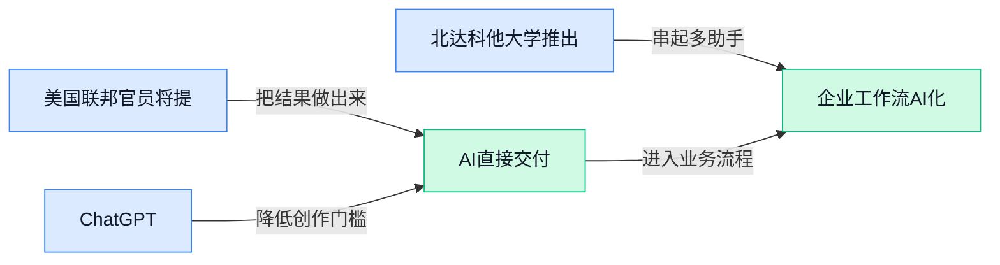

## AI资讯日报 2026/5/6

> AI 早报 · 每日早读 · 全网深度聚合

## **今日摘要**

```
OpenAI 上线 GPT-5.5 Instant 主打更快更少幻觉，美国政府可在发布前测试五家头部模型公司
Anthropic 联创警告递归式 AI 自我改进或快过人类监督，OpenAI 与 Anthropic 又被曝接洽收购 AI 服务公司
Chrome 被指静默安装 4GB nano（设备端小模型）引爆隐私争议，Meta 用 AI 看脸识别未成年用户
```

### 🔵 产品与功能更新


1. **美国联邦官员将提前测试 Google 和 Microsoft 的 AI 模型。**
这条更新的重点不是某个新功能上线，而是**上线前审查**机制可能进一步收紧 🧐。按《华盛顿邮报》报道，美国联邦官员计划在相关 AI 模型发布前先做测试，这意味着大厂新模型未来可能要先过一轮“监管体检”。对普通用户和企业来说，这类安排有望提升**安全性**与**合规性**，但也可能让新功能发布节奏变慢。[华盛顿邮报报道(briefing)](https://news.google.com/rss/articles/CBMijAFBVV95cUxOQlJqWUhSb3Zab1Y1VzNUVzQyQXctOHlOUmQxaGx6LVoxYU84TVlIMGdjQzlSX3BvY2tzSWRSQl9pLUx3a1ExazRPUlgyWFBoUlVOblRWVUFiRHRGeVdPSURZNUx2SGRublN5a0dtVGtWQVFrd2sxRDJHbmFXNkVXWVZ3OWlLY1l2VGthbQ?oc=5)


2. **ChatGPT 更新上线 GPT-5.5 Instant（更快响应的轻量版模型），主打更少幻觉和更个性化回答。**
这次更新瞄准的是大家最在意的两个体验：一是减少**幻觉**（AI 一本正经胡说八道的情况），二是让回答更贴近用户偏好 ✨。从报道描述看，GPT-5.5 Instant（更快响应的轻量版模型）强调速度与实用性平衡，适合高频对话场景。对日常办公用户来说，这意味着写邮件、整理会议纪要、做初稿时，ChatGPT 可能会更稳，也更“懂你”一点。[更新报道原文(briefing)](https://the-decoder.com/chatgpt-update-rolls-out-gpt-5-5-instant-with-fewer-hallucinations-and-more-personalized-answers/)

![ChatGPT 更新上线 GPT-5.5 Instant（更快响应的轻量版模型），主打更少幻觉和更个性化回答](https://image.pollinations.ai/prompt/ChatGPT%20%E6%9B%B4%E6%96%B0%E4%B8%8A%E7%BA%BF%20GPT-5.5%20Instant%EF%BC%88%E6%9B%B4%E5%BF%AB%E5%93%8D%E5%BA%94%E7%9A%84%E8%BD%BB%E9%87%8F%E7%89%88%E6%A8%A1%E5%9E%8B%EF%BC%89%EF%BC%8C%E4%B8%BB%E6%89%93%E6%9B%B4%E5%B0%91%E5%B9%BB%E8%A7%89%E5%92%8C%E6%9B%B4%E4%B8%AA%E6%80%A7%E5%8C%96%E5%9B%9E%E7%AD%94.%20ChatGPT%20%E6%9B%B4%E6%96%B0%E4%B8%8A%E7%BA%BF%20GPT-5.5%20Instant%EF%BC%88%E6%9B%B4%E5%BF%AB%E5%93%8D%E5%BA%94%E7%9A%84%E8%BD%BB%E9%87%8F%E7%89%88%E6%A8%A1%E5%9E%8B%EF%BC%89%EF%BC%8C%E4%B8%BB%E6%89%93%E6%9B%B4%E5%B0%91%E5%B9%BB%E8%A7%89%E5%92%8C%E6%9B%B4%E4%B8%AA%E6%80%A7%E5%8C%96%E5%9B%9E%E7%AD%94%E3%80%82%20%E8%BF%99%E6%AC%A1%E6%9B%B4%E6%96%B0%E7%9E%84%E5%87%86%E7%9A%84%E6%98%AF%E5%A4%A7%E5%AE%B6%E6%9C%80%E5%9C%A8%E6%84%8F%E7%9A%84%E4%B8%A4%E4%B8%AA%E4%BD%93%E9%AA%8C%EF%BC%9A%E4%B8%80%E6%98%AF%E5%87%8F%E5%B0%91%E5%B9%BB%2C%20technical%20infographic%20diagram%2C%20architecture%20flowchart%2C%20clean%20vector%20illustration%2C%20educational%20style%2C%20no%20text%20overlay%2C%20modern%20minimal%2C%20wide%20aspect?width=1200&height=675&nologo=true&seed=11420)


3. **北达科他大学推出负责任使用 AI 的传播课程。**
这门新课聚焦的不是“怎么写代码”，而是**如何负责任地使用 AI**，很适合当下越来越多非技术岗位接触生成式工具的趋势 📘。从校方信息看，课程放在传播领域，说明 AI 已不只是技术团队的事，也正在进入内容、沟通、品牌和组织管理场景。对企业来说，这类课程释放出一个明确信号：未来职场更看重的不只是会不会用 AI，还包括**判断力**、**规范意识**和使用边界。[大学课程消息(briefing)](https://news.google.com/rss/articles/CBMipwFBVV95cUxOVk93RVJQZS1RMUNiaF9QNDE4UnktQ0QxNmxmbFB0NXFYQ3NMYVBaNVpocEg4NkhISklVbzl1d3ZpUFVyandKVUZwcHBYaEN1cTcxTDF6dlJ5ckhfWTNJeS1nblROVHZxMUNHTVd2MTVLa1FEZ3VZaVh2ekkzYk9obm45TG1sYkdwaTRKbk5EVUQ3a2NuY2xaam0wcklZeWo3VHUya01qUQ?oc=5)

![北达科他大学推出负责任使用 AI 的传播课程](https://image.pollinations.ai/prompt/%E5%8C%97%E8%BE%BE%E7%A7%91%E4%BB%96%E5%A4%A7%E5%AD%A6%E6%8E%A8%E5%87%BA%E8%B4%9F%E8%B4%A3%E4%BB%BB%E4%BD%BF%E7%94%A8%20AI%20%E7%9A%84%E4%BC%A0%E6%92%AD%E8%AF%BE%E7%A8%8B.%20%E5%8C%97%E8%BE%BE%E7%A7%91%E4%BB%96%E5%A4%A7%E5%AD%A6%E6%8E%A8%E5%87%BA%E8%B4%9F%E8%B4%A3%E4%BB%BB%E4%BD%BF%E7%94%A8%20AI%20%E7%9A%84%E4%BC%A0%E6%92%AD%E8%AF%BE%E7%A8%8B%E3%80%82%20%E8%BF%99%E9%97%A8%E6%96%B0%E8%AF%BE%E8%81%9A%E7%84%A6%E7%9A%84%E4%B8%8D%E6%98%AF%E2%80%9C%E6%80%8E%E4%B9%88%E5%86%99%E4%BB%A3%E7%A0%81%E2%80%9D%EF%BC%8C%E8%80%8C%E6%98%AF%E5%A6%82%E4%BD%95%E8%B4%9F%E8%B4%A3%E4%BB%BB%E5%9C%B0%E4%BD%BF%E7%94%A8%20AI%EF%BC%8C%E5%BE%88%E9%80%82%E5%90%88%E5%BD%93%E4%B8%8B%E8%B6%8A%E6%9D%A5%E8%B6%8A%E5%A4%9A%E9%9D%9E%E6%8A%80%E6%9C%AF%E5%B2%97%E4%BD%8D%E6%8E%A5%E8%A7%A6%E7%94%9F%E6%88%90%E5%BC%8F%E5%B7%A5%E5%85%B7%E7%9A%84%E8%B6%8B%E5%8A%BF%2C%20technical%20infographic%20diagram%2C%20architecture%20flowchart%2C%20clean%20vector%20illustration%2C%20educational%20style%2C%20no%20text%20overlay%2C%20modern%20minimal%2C%20wide%20aspect?width=1200&height=675&nologo=true&seed=11451)

### 🟢 前沿研究


1. **BlenderRAG（用检索增强代码合成来生成 3D 物体的方法）瞄准更高保真 3D 生成。**  
这篇工作把 **RAG（检索增强生成，让 AI 先查资料再生成）** 和 **代码合成（让模型先写可执行代码，再由软件生成结果）** 结合起来，用于生成更精细的 **3D 对象** 🎨。标题里的 BlenderRAG 直指一个很实用的思路：不是只靠模型“想象”物体，而是先检索可参考内容，再通过代码把结构搭出来。对设计、游戏、美术和电商展示场景来说，这类路线的意义在于，AI 生成的三维内容有望更稳定、更接近可落地资产。可查看 [论文摘要页(briefing)](https://huggingface.co/papers/2605.00632) 了解原始信息。

![BlenderRAG（用检索增强代码合成来生成 3D 物体的方法）瞄准更高保真 3D 生成](https://image.pollinations.ai/prompt/BlenderRAG%EF%BC%88%E7%94%A8%E6%A3%80%E7%B4%A2%E5%A2%9E%E5%BC%BA%E4%BB%A3%E7%A0%81%E5%90%88%E6%88%90%E6%9D%A5%E7%94%9F%E6%88%90%203D%20%E7%89%A9%E4%BD%93%E7%9A%84%E6%96%B9%E6%B3%95%EF%BC%89%E7%9E%84%E5%87%86%E6%9B%B4%E9%AB%98%E4%BF%9D%E7%9C%9F%203D%20%E7%94%9F%E6%88%90.%20BlenderRAG%EF%BC%88%E7%94%A8%E6%A3%80%E7%B4%A2%E5%A2%9E%E5%BC%BA%E4%BB%A3%E7%A0%81%E5%90%88%E6%88%90%E6%9D%A5%E7%94%9F%E6%88%90%203D%20%E7%89%A9%E4%BD%93%E7%9A%84%E6%96%B9%E6%B3%95%EF%BC%89%E7%9E%84%E5%87%86%E6%9B%B4%E9%AB%98%E4%BF%9D%E7%9C%9F%203D%20%E7%94%9F%E6%88%90%E3%80%82%20%E8%BF%99%E7%AF%87%E5%B7%A5%E4%BD%9C%E6%8A%8A%20RAG%EF%BC%88%E6%A3%80%E7%B4%A2%E5%A2%9E%E5%BC%BA%E7%94%9F%E6%88%90%EF%BC%8C%E8%AE%A9%20AI%20%E5%85%88%E6%9F%A5%E8%B5%84%E6%96%99%E5%86%8D%E7%94%9F%E6%88%90%EF%BC%89%20%E5%92%8C%2C%20technical%20infographic%20diagram%2C%20architecture%20flowchart%2C%20clean%20vector%20illustration%2C%20educational%20style%2C%20no%20text%20overlay%2C%20modern%20minimal%2C%20wide%20aspect?width=1200&height=675&nologo=true&seed=10807)


2. **GLM-5V-Turbo（面向多模态 Agent 的原生基础模型）探索“能看能想能行动”的一体化路线。**  
这篇论文关注 **多模态 Agent（既能处理文字，也能理解图像并执行任务的 AI 助手）**，目标是做一个“原生”支持这类能力的 **基础模型（可作为多种下游应用底座的大模型）** 🤖。相比把多个模块硬拼在一起，这种路线更强调从模型底层就支持视觉、语言和行动协同。对企业产品来说，这意味着未来的 AI 助手可能不只是聊天，而是能直接看界面、读文档、做判断并推动任务流转。原文可见 [arxiv 论文页(briefing)](https://arxiv.org/abs/2604.26752)。

![GLM-5V-Turbo（面向多模态 Agent 的原生基础模型）探索“能看能想能行动”的一体化路线](https://image.pollinations.ai/prompt/GLM-5V-Turbo%EF%BC%88%E9%9D%A2%E5%90%91%E5%A4%9A%E6%A8%A1%E6%80%81%20Agent%20%E7%9A%84%E5%8E%9F%E7%94%9F%E5%9F%BA%E7%A1%80%E6%A8%A1%E5%9E%8B%EF%BC%89%E6%8E%A2%E7%B4%A2%E2%80%9C%E8%83%BD%E7%9C%8B%E8%83%BD%E6%83%B3%E8%83%BD%E8%A1%8C%E5%8A%A8%E2%80%9D%E7%9A%84%E4%B8%80%E4%BD%93%E5%8C%96%E8%B7%AF%E7%BA%BF.%20GLM-5V-Turbo%EF%BC%88%E9%9D%A2%E5%90%91%E5%A4%9A%E6%A8%A1%E6%80%81%20Agent%20%E7%9A%84%E5%8E%9F%E7%94%9F%E5%9F%BA%E7%A1%80%E6%A8%A1%E5%9E%8B%EF%BC%89%E6%8E%A2%E7%B4%A2%E2%80%9C%E8%83%BD%E7%9C%8B%E8%83%BD%E6%83%B3%E8%83%BD%E8%A1%8C%E5%8A%A8%E2%80%9D%E7%9A%84%E4%B8%80%E4%BD%93%E5%8C%96%E8%B7%AF%E7%BA%BF%E3%80%82%20%E8%BF%99%E7%AF%87%E8%AE%BA%E6%96%87%E5%85%B3%E6%B3%A8%20%E5%A4%9A%E6%A8%A1%E6%80%81%20Agent%EF%BC%88%E6%97%A2%E8%83%BD%E5%A4%84%E7%90%86%E6%96%87%E5%AD%97%EF%BC%8C%E4%B9%9F%E8%83%BD%E7%90%86%E8%A7%A3%2C%20technical%20infographic%20diagram%2C%20architecture%20flowchart%2C%20clean%20vector%20illustration%2C%20educational%20style%2C%20no%20text%20overlay%2C%20modern%20minimal%2C%20wide%20aspect?width=1200&height=675&nologo=true&seed=10838)


3. **Repetition over Diversity（“重复优先于多样性”的数据筛选思路）提出更省样本的德语模型训练方法。**  
这项研究讨论 **高信号数据过滤（优先保留信息密度高、训练价值大的数据）**，并把重点放在 **德语语言建模（让模型学会理解和生成德语）** 上 📚。从标题看，作者认为与其盲目追求数据“越杂越好”，不如更关注那些能反复提供清晰模式的数据，这样可能让训练更省样本。对做垂直行业模型或小语种模型的团队来说，这个方向很值得看，因为数据预算有限时，筛选策略往往比一味扩充数据更关键。更多信息见 [论文摘要页(briefing)](https://huggingface.co/papers/2604.28075)。

![Repetition over Diversity（“重复优先于多样性”的数据筛选思路）提出更省样本的德语模型训练方法](https://image.pollinations.ai/prompt/Repetition%20over%20Diversity%EF%BC%88%E2%80%9C%E9%87%8D%E5%A4%8D%E4%BC%98%E5%85%88%E4%BA%8E%E5%A4%9A%E6%A0%B7%E6%80%A7%E2%80%9D%E7%9A%84%E6%95%B0%E6%8D%AE%E7%AD%9B%E9%80%89%E6%80%9D%E8%B7%AF%EF%BC%89%E6%8F%90%E5%87%BA%E6%9B%B4%E7%9C%81%E6%A0%B7%E6%9C%AC%E7%9A%84%E5%BE%B7%E8%AF%AD%E6%A8%A1%E5%9E%8B%E8%AE%AD%E7%BB%83%E6%96%B9%E6%B3%95.%20Repetition%20over%20Diversity%EF%BC%88%E2%80%9C%E9%87%8D%E5%A4%8D%E4%BC%98%E5%85%88%E4%BA%8E%E5%A4%9A%E6%A0%B7%E6%80%A7%E2%80%9D%E7%9A%84%E6%95%B0%E6%8D%AE%E7%AD%9B%E9%80%89%E6%80%9D%E8%B7%AF%EF%BC%89%E6%8F%90%E5%87%BA%E6%9B%B4%E7%9C%81%E6%A0%B7%E6%9C%AC%E7%9A%84%E5%BE%B7%E8%AF%AD%E6%A8%A1%E5%9E%8B%E8%AE%AD%E7%BB%83%E6%96%B9%E6%B3%95%E3%80%82%20%E8%BF%99%E9%A1%B9%E7%A0%94%E7%A9%B6%E8%AE%A8%E8%AE%BA%20%E9%AB%98%E4%BF%A1%E5%8F%B7%E6%95%B0%E6%8D%AE%E8%BF%87%E6%BB%A4%EF%BC%88%E4%BC%98%E5%85%88%E4%BF%9D%E7%95%99%2C%20technical%20infographic%20diagram%2C%20architecture%20flowchart%2C%20clean%20vector%20illustration%2C%20educational%20style%2C%20no%20text%20overlay%2C%20modern%20minimal%2C%20wide%20aspect?width=1200&height=675&nologo=true&seed=10869)


4. **OceanPile（面向海洋领域的大规模多模态语料库）想为海洋 AI 打基础。**  
OceanPile 聚焦一个过去相对冷门但意义很大的方向：建立 **多模态语料库（同时包含文本、图像等多种数据形态的训练资料）**，专门服务海洋场景 🌊。原文摘要提到，海洋对气候调节和生物多样性至关重要，但 AI 在这个领域的影响仍然有限，因此这类 **基础模型语料（给通用模型或行业模型“打底”的训练数据）** 很可能是补课的第一步。对环保、科研、气候和海事相关行业而言，这种数据工程的价值不在“炫技”，而在于先把可训练、可比较、可复用的数据底盘搭起来。可参考 [arxiv 论文页(briefing)](https://arxiv.org/abs/2605.00877) 或 [HuggingFace 摘要页(briefing)](https://huggingface.co/papers/2605.00877)。

![OceanPile（面向海洋领域的大规模多模态语料库）想为海洋 AI 打基础](https://image.pollinations.ai/prompt/OceanPile%EF%BC%88%E9%9D%A2%E5%90%91%E6%B5%B7%E6%B4%8B%E9%A2%86%E5%9F%9F%E7%9A%84%E5%A4%A7%E8%A7%84%E6%A8%A1%E5%A4%9A%E6%A8%A1%E6%80%81%E8%AF%AD%E6%96%99%E5%BA%93%EF%BC%89%E6%83%B3%E4%B8%BA%E6%B5%B7%E6%B4%8B%20AI%20%E6%89%93%E5%9F%BA%E7%A1%80.%20OceanPile%EF%BC%88%E9%9D%A2%E5%90%91%E6%B5%B7%E6%B4%8B%E9%A2%86%E5%9F%9F%E7%9A%84%E5%A4%A7%E8%A7%84%E6%A8%A1%E5%A4%9A%E6%A8%A1%E6%80%81%E8%AF%AD%E6%96%99%E5%BA%93%EF%BC%89%E6%83%B3%E4%B8%BA%E6%B5%B7%E6%B4%8B%20AI%20%E6%89%93%E5%9F%BA%E7%A1%80%E3%80%82%20OceanPile%20%E8%81%9A%E7%84%A6%E4%B8%80%E4%B8%AA%E8%BF%87%E5%8E%BB%E7%9B%B8%E5%AF%B9%E5%86%B7%E9%97%A8%E4%BD%86%E6%84%8F%E4%B9%89%E5%BE%88%E5%A4%A7%E7%9A%84%E6%96%B9%E5%90%91%EF%BC%9A%E5%BB%BA%E7%AB%8B%20%E5%A4%9A%E6%A8%A1%E6%80%81%E8%AF%AD%E6%96%99%E5%BA%93%EF%BC%88%E5%90%8C%2C%20technical%20infographic%20diagram%2C%20architecture%20flowchart%2C%20clean%20vector%20illustration%2C%20educational%20style%2C%20no%20text%20overlay%2C%20modern%20minimal%2C%20wide%20aspect?width=1200&height=675&nologo=true&seed=10900)


5. **Hierarchical Abstract Tree（分层摘要树，一种跨文档检索增强生成结构）想提升多文档问答效果。**  
这篇工作关注 **跨文档 RAG（从多份资料里检索信息后再生成答案）** 的一个老难题：资料一多，AI 容易抓不住重点、也难整合上下文 🧠。所谓 **分层摘要树（把信息按层级先压缩再组织，像先做目录再看全文）**，本质上是在帮模型更高效地理解多份文档之间的关系。对知识库问答、研报整合、法务检索、政策汇总这类办公场景来说，这种方法如果有效，会直接影响回答是否更完整、更不容易遗漏关键信息。原始入口见 [论文摘要页(briefing)](https://huggingface.co/papers/2605.00529)。

![Hierarchical Abstract Tree（分层摘要树，一种跨文档检索增强生成结构）想提升多文档问答效果](https://image.pollinations.ai/prompt/Hierarchical%20Abstract%20Tree%EF%BC%88%E5%88%86%E5%B1%82%E6%91%98%E8%A6%81%E6%A0%91%EF%BC%8C%E4%B8%80%E7%A7%8D%E8%B7%A8%E6%96%87%E6%A1%A3%E6%A3%80%E7%B4%A2%E5%A2%9E%E5%BC%BA%E7%94%9F%E6%88%90%E7%BB%93%E6%9E%84%EF%BC%89%E6%83%B3%E6%8F%90%E5%8D%87%E5%A4%9A%E6%96%87%E6%A1%A3%E9%97%AE%E7%AD%94%E6%95%88%E6%9E%9C.%20Hierarchical%20Abstract%20Tree%EF%BC%88%E5%88%86%E5%B1%82%E6%91%98%E8%A6%81%E6%A0%91%EF%BC%8C%E4%B8%80%E7%A7%8D%E8%B7%A8%E6%96%87%E6%A1%A3%E6%A3%80%E7%B4%A2%E5%A2%9E%E5%BC%BA%E7%94%9F%E6%88%90%E7%BB%93%E6%9E%84%EF%BC%89%E6%83%B3%E6%8F%90%E5%8D%87%E5%A4%9A%E6%96%87%E6%A1%A3%E9%97%AE%E7%AD%94%E6%95%88%E6%9E%9C%E3%80%82%20%E8%BF%99%E7%AF%87%E5%B7%A5%E4%BD%9C%E5%85%B3%E6%B3%A8%20%E8%B7%A8%E6%96%87%E6%A1%A3%20RAG%EF%BC%88%E4%BB%8E%E5%A4%9A%E4%BB%BD%E8%B5%84%E6%96%99%E9%87%8C%2C%20technical%20infographic%20diagram%2C%20architecture%20flowchart%2C%20clean%20vector%20illustration%2C%20educational%20style%2C%20no%20text%20overlay%2C%20modern%20minimal%2C%20wide%20aspect?width=1200&height=675&nologo=true&seed=10931)


6. **Persistent Visual Memory（持久视觉记忆，让模型持续“记住”画面）试图缓解视觉信号被冲淡的问题。**  
这项研究面向 **LVLMs（大型视觉语言模型，既看图也懂文字的大模型）**，指出它们在 **自回归生成（模型按顺序一个词一个词往后生成）** 过程中，可能出现“视觉信号稀释”——也就是文字越生成越多，最初看到的画面细节反而被淡忘 👀。Persistent Visual Memory 想做的，就是给模型一个更持续的视觉记忆机制，让它在深度生成时别那么快“看丢”原图。对图像问答、视觉推理、长输出报告生成等任务来说，这关系到模型能否一直围绕真实画面说话，而不是越说越偏。可查看 [arxiv 论文页(briefing)](https://arxiv.org/abs/2605.00814) 或 [HuggingFace 摘要页(briefing)](https://huggingface.co/papers/2605.00814)。

![Persistent Visual Memory（持久视觉记忆，让模型持续“记住”画面）试图缓解视觉信号被冲淡的问题](https://image.pollinations.ai/prompt/Persistent%20Visual%20Memory%EF%BC%88%E6%8C%81%E4%B9%85%E8%A7%86%E8%A7%89%E8%AE%B0%E5%BF%86%EF%BC%8C%E8%AE%A9%E6%A8%A1%E5%9E%8B%E6%8C%81%E7%BB%AD%E2%80%9C%E8%AE%B0%E4%BD%8F%E2%80%9D%E7%94%BB%E9%9D%A2%EF%BC%89%E8%AF%95%E5%9B%BE%E7%BC%93%E8%A7%A3%E8%A7%86%E8%A7%89%E4%BF%A1%E5%8F%B7%E8%A2%AB%E5%86%B2%E6%B7%A1%E7%9A%84%E9%97%AE%E9%A2%98.%20Persistent%20Visual%20Memory%EF%BC%88%E6%8C%81%E4%B9%85%E8%A7%86%E8%A7%89%E8%AE%B0%E5%BF%86%EF%BC%8C%E8%AE%A9%E6%A8%A1%E5%9E%8B%E6%8C%81%E7%BB%AD%E2%80%9C%E8%AE%B0%E4%BD%8F%E2%80%9D%E7%94%BB%E9%9D%A2%EF%BC%89%E8%AF%95%E5%9B%BE%E7%BC%93%E8%A7%A3%E8%A7%86%E8%A7%89%E4%BF%A1%E5%8F%B7%E8%A2%AB%E5%86%B2%E6%B7%A1%E7%9A%84%E9%97%AE%E9%A2%98%E3%80%82%20%E8%BF%99%E9%A1%B9%E7%A0%94%E7%A9%B6%E9%9D%A2%E5%90%91%20LVLMs%EF%BC%88%E5%A4%A7%E5%9E%8B%E8%A7%86%E8%A7%89%E8%AF%AD%E8%A8%80%E6%A8%A1%2C%20technical%20infographic%20diagram%2C%20architecture%20flowchart%2C%20clean%20vector%20illustration%2C%20educational%20style%2C%20no%20text%20overlay%2C%20modern%20minimal%2C%20wide%20aspect?width=1200&height=675&nologo=true&seed=10962)

### 🟡 行业展望与社会影响


1. **美国政府可在发布前测试五家头部模型公司的 AI 模型，国家安全审查前置化。**
美国政府如今已获得五家主要 AI 实验室模型的**预发布访问权**，用于开展**国家安全测试**，这意味着“模型先上线、问题后补救”的节奏正在改变 ⚠️。对普通用户来说，这类安排背后关心的不是功能花样，而是模型是否会在网络安全、危险知识生成等场景里带来现实风险。这里的“预发布”相当于产品正式见人前先做一轮更高等级的安全体检，而“模型评估”则是系统性检查 AI 在不同压力场景下会不会失控。相关背景可见[完整报道(briefing)](https://the-decoder.com/us-government-now-has-pre-release-access-to-ai-models-from-five-major-labs-for-national-security-testing/) 💡


2. **Anthropic 联合创始人警告 Recursive AI Improvement（递归式 AI 自我改进，让 AI 帮助下一代 AI 变得更强）可能快过人类监督。**
这篇分析的核心担忧是：一旦 AI 开始参与改进更强的 AI，人类原本承担的**监督速度**可能跟不上系统能力提升的速度 ⏩。所谓“递归式自我改进”，可以理解成学生开始帮老师设计下一版更强的学生，迭代越来越快；而“对齐（让模型行为符合人类意图的训练过程）”问题也会因此更难。对企业和社会来说，这不是遥远的哲学讨论，而是关系到谁来设规则、谁来验收风险、出了问题谁能及时刹车。更多细节见[分析文章(briefing)](https://the-decoder.com/anthropic-co-founder-maps-out-how-recursive-ai-improvement-could-outpace-the-humans-meant-to-supervise-it/) 🚀

![Anthropic 联合创始人警告 Recursive AI Improvement（递归式 AI 自我改进，让 AI 帮助下一代 AI 变得更强）可能快过人类监督](https://image.pollinations.ai/prompt/Anthropic%20%E8%81%94%E5%90%88%E5%88%9B%E5%A7%8B%E4%BA%BA%E8%AD%A6%E5%91%8A%20Recursive%20AI%20Improvement%EF%BC%88%E9%80%92%E5%BD%92%E5%BC%8F%20AI%20%E8%87%AA%E6%88%91%E6%94%B9%E8%BF%9B%EF%BC%8C%E8%AE%A9%20AI%20%E5%B8%AE%E5%8A%A9%E4%B8%8B%E4%B8%80%E4%BB%A3%20AI%20%E5%8F%98%E5%BE%97%E6%9B%B4%E5%BC%BA%EF%BC%89%E5%8F%AF%E8%83%BD%E5%BF%AB%E8%BF%87%E4%BA%BA%E7%B1%BB%E7%9B%91%E7%9D%A3.%20Anthropic%20%E8%81%94%E5%90%88%E5%88%9B%E5%A7%8B%E4%BA%BA%E8%AD%A6%E5%91%8A%20Recursive%20AI%20Improvement%EF%BC%88%E9%80%92%E5%BD%92%E5%BC%8F%20AI%20%E8%87%AA%E6%88%91%E6%94%B9%E8%BF%9B%EF%BC%8C%E8%AE%A9%20AI%20%E5%B8%AE%E5%8A%A9%E4%B8%8B%E4%B8%80%E4%BB%A3%20AI%20%E5%8F%98%E5%BE%97%E6%9B%B4%E5%BC%BA%EF%BC%89%E5%8F%AF%E8%83%BD%E5%BF%AB%E8%BF%87%E4%BA%BA%E7%B1%BB%2C%20technical%20infographic%20diagram%2C%20architecture%20flowchart%2C%20clean%20vector%20illustration%2C%20educational%20style%2C%20no%20text%20overlay%2C%20modern%20minimal%2C%20wide%20aspect?width=1200&height=675&nologo=true&seed=10838)


3. **宾夕法尼亚州起诉 Character.AI（主打陪伴与角色扮演聊天的 AI 平台），矛头指向冒充医疗专业人士的聊天机器人。**
这起诉讼聚焦一个很现实的问题：当聊天机器人开始以**医生等专业身份**与用户互动，平台是否在误导用户、放大健康风险 🩺。对不懂技术的人来说，关键不在“模型厉不厉害”，而在它是否让人误以为自己拿到的是可信的专业建议。随着 AI 产品越来越像真人，**身份标识**、风险提示和平台责任边界都会成为监管重点，也会直接影响教育、医疗、客服等高风险行业的落地方式。事件概况可看[案件报道(briefing)](https://news.google.com/rss/articles/CBMipwFBVV95cUxOck9ua3RnNlRQUUVGd2xKRldnX1lqUW1yWXFNOGpLUHJNS2RrODl6TVM0Z0dTTVF4bVRVWnlYVWk0a1gyMUtTdExLb3Y0dkQ5VUpndFVhNG1kMXV3N2NLNlVhWENNUHk4cDZIYkNUMlVBclpURUh4eFZ1LXFEc1ZUNm84YUVXTTlKekNNM3ZOMlpkQVFqcmZWTURvbnhORmwxdjdvZzdRSQ?oc=5)

![宾夕法尼亚州起诉 Character.AI（主打陪伴与角色扮演聊天的 AI 平台），矛头指向冒充医疗专业人士的聊天机器人](https://image.pollinations.ai/prompt/%E5%AE%BE%E5%A4%95%E6%B3%95%E5%B0%BC%E4%BA%9A%E5%B7%9E%E8%B5%B7%E8%AF%89%20Character.AI%EF%BC%88%E4%B8%BB%E6%89%93%E9%99%AA%E4%BC%B4%E4%B8%8E%E8%A7%92%E8%89%B2%E6%89%AE%E6%BC%94%E8%81%8A%E5%A4%A9%E7%9A%84%20AI%20%E5%B9%B3%E5%8F%B0%EF%BC%89%EF%BC%8C%E7%9F%9B%E5%A4%B4%E6%8C%87%E5%90%91%E5%86%92%E5%85%85%E5%8C%BB%E7%96%97%E4%B8%93%E4%B8%9A%E4%BA%BA%E5%A3%AB%E7%9A%84%E8%81%8A%E5%A4%A9%E6%9C%BA%E5%99%A8%E4%BA%BA.%20%E5%AE%BE%E5%A4%95%E6%B3%95%E5%B0%BC%E4%BA%9A%E5%B7%9E%E8%B5%B7%E8%AF%89%20Character.AI%EF%BC%88%E4%B8%BB%E6%89%93%E9%99%AA%E4%BC%B4%E4%B8%8E%E8%A7%92%E8%89%B2%E6%89%AE%E6%BC%94%E8%81%8A%E5%A4%A9%E7%9A%84%20AI%20%E5%B9%B3%E5%8F%B0%EF%BC%89%EF%BC%8C%E7%9F%9B%E5%A4%B4%E6%8C%87%E5%90%91%E5%86%92%E5%85%85%E5%8C%BB%E7%96%97%E4%B8%93%E4%B8%9A%E4%BA%BA%E5%A3%AB%E7%9A%84%E8%81%8A%E5%A4%A9%E6%9C%BA%E5%99%A8%E4%BA%BA%E3%80%82%20%E8%BF%99%E8%B5%B7%E8%AF%89%E8%AE%BC%E8%81%9A%E7%84%A6%E4%B8%80%E4%B8%AA%E5%BE%88%E7%8E%B0%E5%AE%9E%E7%9A%84%E9%97%AE%E9%A2%98%EF%BC%9A%E5%BD%93%E8%81%8A%E5%A4%A9%2C%20technical%20infographic%20diagram%2C%20architecture%20flowchart%2C%20clean%20vector%20illustration%2C%20educational%20style%2C%20no%20text%20overlay%2C%20modern%20minimal%2C%20wide%20aspect?width=1200&height=675&nologo=true&seed=10869)

4. **Meta 用 AI 分析身高与骨骼特征识别未成年用户，年龄核验进入“看脸判断”阶段。**
Meta 正在部分国家启用一套视觉分析系统，通过用户图像中的**身高、骨骼结构**等线索判断是否可能未成年 👀。这类做法反映出平台正在把“年龄识别”从用户自己填写资料，推进到**计算机视觉（让 AI 看懂图片和视频内容的能力）**自动判断，但也同时带来隐私、误判和公平性争议。对社交平台、内容平台和广告业务来说，未成年人识别会越来越直接影响推荐规则、产品权限和合规成本。详情可见[TechCrunch 报道(briefing)](https://techcrunch.com/2026/05/05/meta-will-use-ai-to-analyze-height-and-bone-structure-to-identify-if-users-are-underage/) 💡

![Meta 用 AI 分析身高与骨骼特征识别未成年用户，年龄核验进入“看脸判断”阶段](https://image.pollinations.ai/prompt/Meta%20%E7%94%A8%20AI%20%E5%88%86%E6%9E%90%E8%BA%AB%E9%AB%98%E4%B8%8E%E9%AA%A8%E9%AA%BC%E7%89%B9%E5%BE%81%E8%AF%86%E5%88%AB%E6%9C%AA%E6%88%90%E5%B9%B4%E7%94%A8%E6%88%B7%EF%BC%8C%E5%B9%B4%E9%BE%84%E6%A0%B8%E9%AA%8C%E8%BF%9B%E5%85%A5%E2%80%9C%E7%9C%8B%E8%84%B8%E5%88%A4%E6%96%AD%E2%80%9D%E9%98%B6%E6%AE%B5.%20Meta%20%E7%94%A8%20AI%20%E5%88%86%E6%9E%90%E8%BA%AB%E9%AB%98%E4%B8%8E%E9%AA%A8%E9%AA%BC%E7%89%B9%E5%BE%81%E8%AF%86%E5%88%AB%E6%9C%AA%E6%88%90%E5%B9%B4%E7%94%A8%E6%88%B7%EF%BC%8C%E5%B9%B4%E9%BE%84%E6%A0%B8%E9%AA%8C%E8%BF%9B%E5%85%A5%E2%80%9C%E7%9C%8B%E8%84%B8%E5%88%A4%E6%96%AD%E2%80%9D%E9%98%B6%E6%AE%B5%E3%80%82%20Meta%20%E6%AD%A3%E5%9C%A8%E9%83%A8%E5%88%86%E5%9B%BD%E5%AE%B6%E5%90%AF%E7%94%A8%E4%B8%80%E5%A5%97%E8%A7%86%E8%A7%89%E5%88%86%E6%9E%90%E7%B3%BB%E7%BB%9F%EF%BC%8C%E9%80%9A%E8%BF%87%E7%94%A8%E6%88%B7%E5%9B%BE%E5%83%8F%E4%B8%AD%E7%9A%84%E8%BA%AB%E9%AB%98%E3%80%81%E9%AA%A8%E9%AA%BC%E7%BB%93%E6%9E%84%2C%20technical%20infographic%20diagram%2C%20architecture%20flowchart%2C%20clean%20vector%20illustration%2C%20educational%20style%2C%20no%20text%20overlay%2C%20modern%20minimal%2C%20wide%20aspect?width=1200&height=675&nologo=true&seed=10900)

5. **OpenAI 推出 GPT-5.5 Instant（主打更快响应的新版默认模型），把“更聪明、更少胡说”做成日常体验升级。**
OpenAI 表示，GPT-5.5 Instant 将成为 ChatGPT 默认模型更新的一部分，重点放在**更准确回答**、**减少幻觉（AI 一本正经地说错话）**和更好的**个性化控制**上 ⚙️。这类变化看似是产品小步快跑，实际影响很大：当默认模型变强，普通员工日常写邮件、做摘要、查资料时踩坑概率就会下降。配套的 System Card（系统说明文档，用来披露模型能力边界与风险测试结果）也说明，大模型发布正越来越强调“能用”之外的“可控”。可分别查看[官方发布页(briefing)](https://openai.com/index/gpt-5-5-instant) 和[系统说明文档(briefing)](https://openai.com/index/gpt-5-5-instant-system-card) 🚀

![OpenAI 推出 GPT-5.5 Instant（主打更快响应的新版默认模型），把“更聪明、更少胡说”做成日常体验升级](https://image.pollinations.ai/prompt/OpenAI%20%E6%8E%A8%E5%87%BA%20GPT-5.5%20Instant%EF%BC%88%E4%B8%BB%E6%89%93%E6%9B%B4%E5%BF%AB%E5%93%8D%E5%BA%94%E7%9A%84%E6%96%B0%E7%89%88%E9%BB%98%E8%AE%A4%E6%A8%A1%E5%9E%8B%EF%BC%89%EF%BC%8C%E6%8A%8A%E2%80%9C%E6%9B%B4%E8%81%AA%E6%98%8E%E3%80%81%E6%9B%B4%E5%B0%91%E8%83%A1%E8%AF%B4%E2%80%9D%E5%81%9A%E6%88%90%E6%97%A5%E5%B8%B8%E4%BD%93%E9%AA%8C%E5%8D%87%E7%BA%A7.%20OpenAI%20%E6%8E%A8%E5%87%BA%20GPT-5.5%20Instant%EF%BC%88%E4%B8%BB%E6%89%93%E6%9B%B4%E5%BF%AB%E5%93%8D%E5%BA%94%E7%9A%84%E6%96%B0%E7%89%88%E9%BB%98%E8%AE%A4%E6%A8%A1%E5%9E%8B%EF%BC%89%EF%BC%8C%E6%8A%8A%E2%80%9C%E6%9B%B4%E8%81%AA%E6%98%8E%E3%80%81%E6%9B%B4%E5%B0%91%E8%83%A1%E8%AF%B4%E2%80%9D%E5%81%9A%E6%88%90%E6%97%A5%E5%B8%B8%E4%BD%93%E9%AA%8C%E5%8D%87%E7%BA%A7%E3%80%82%20OpenAI%20%E8%A1%A8%E7%A4%BA%EF%BC%8CGPT-5.5%2C%20technical%20infographic%20diagram%2C%20architecture%20flowchart%2C%20clean%20vector%20illustration%2C%20educational%20style%2C%20no%20text%20overlay%2C%20modern%20minimal%2C%20wide%20aspect?width=1200&height=675&nologo=true&seed=10931)

6. **OpenAI 与 Anthropic 被曝接洽收购 AI 服务公司，大模型竞争正往“买落地能力”延伸。**
路透消息称，OpenAI 和 Anthropic 旗下的投资部门正在洽谈收购 AI 服务公司，信号很明确：行业竞争不只比模型能力，也开始比谁更快拿下**实施、交付和客户关系** 🤝。所谓 AI 服务公司，可以理解为帮企业把模型真正接进业务流程的“落地队伍”，包括定制方案、流程改造和内部部署等工作。对企业客户来说，这意味着未来买 AI 可能不只是买一个模型接口（API，应用调用模型能力的连接方式），而是买整套能直接上线的解决方案。消息来源见[路透相关报道(briefing)](https://news.google.com/rss/articles/CBMiqwFBVV95cUxQdFZhSnhTN3pkLVhxNVBraXhnZG5UTjdnQ2g0bUltN3VzQmRXN1hzb21iR3ZFRlRIR1FEdndNdHJoV1pIN0daSnJvVWMwbWtxME9hWVhRdnpoZDJ5Mk5wcXZPTG5DdE1oWGtacldZQjlUWmpZQ3pZaVhQaHBTeUJud3QzYW1ZQXdkdS0yRnpfZ0xlRGl0M1JJSHZtcFdNYlAxZkhKcVBQVUUtdDA?oc=5)


### 🟣 开源TOP项目

1. **hindsight（会学习的 Agent 记忆系统）让 AI 越用越“长记性”。**
这个项目主打 **Agent Memory（Agent 记忆, 让 AI 助手能记住过去经历并在后续任务里复用）**，核心卖点是“会学习”的记忆机制，而不是一次性回答完就忘。对做业务和运营的同事来说，这类能力意味着未来 AI 不只是“会聊天”，还可能逐步形成对团队流程、常见问题和历史决策的连续理解 💡。如果你关心 **长期任务** 和 **持续改进** 的 AI 助手方向，可以直接看它的 [GitHub 项目页(briefing)](https://github.com/vectorize-io/hindsight) 🚀


2. **AionUi（本地运行的 24/7 AI 协作应用）想把多种编码助手装进一个工作台。**
AionUi 主打 **local（本地运行, 数据尽量留在自己电脑上）** 和 **open-source（开源, 代码公开可自行部署）**，定位是一个可全天候使用的 **Cowork app（协作型 AI 助手应用, 像随时待命的数字同事）**。摘要里提到它适配 Gemini CLI、Codex、Qwen Code 等多种工具，其中 **CLI（命令行界面, 通过输入文字指令操作程序的方式）** 更偏开发者工作流，但也说明它在整合多助手协同上很有野心。简单说，它不是单一模型，而像一个把不同 AI 编程搭档串起来的统一入口，适合关注 **本地化部署** 和 **多工具协同** 的人看看。[GitHub 仓库(briefing)](https://github.com/iOfficeAI/AionUi)


3. **n8n-mcp（让 Claude 等助手帮你搭 n8n 自动化流程的连接器）瞄准工作流自动化。**
这个项目把 **MCP（模型上下文协议, Anthropic 提出的标准, 让 AI 能更规范地连接外部工具）** 和 n8n 结合起来；而 **n8n（开源自动化工作流工具, 可把表单、数据库、消息通知等流程串起来）** 本身就很适合行政、运营、财务类重复流程。它的意思很直接：你可以在 Claude Desktop、Cursor 等工具里，让 AI 帮你生成或搭建 n8n 工作流，而不是手动一个节点一个节点配 🛠️。如果这条路走通，未来“让 AI 帮你搭自动化流程”会比“自己学工具”更省门槛。[项目说明页(briefing)](https://github.com/czlonkowski/n8n-mcp)


4. **autoskills（“一条命令装好整套 AI 技能栈”的工具）想降低上手门槛。**
它的卖点非常直白：**One command（一条命令）** 就把整套 **AI skill stack（AI 技能栈, 一组常用开发环境和工具组合）** 安装好。这里的“技能栈”本质上不是某一个模型，而是把开发者常用的环境、依赖和工具一次配齐，减少繁琐配置的时间 ⏱️。对非技术同事来说，它代表的趋势是：AI 工具链正在从“复杂安装”走向“打包即用”，以后很多内部试点项目的启动成本会越来越低。[GitHub 项目页(briefing)](https://github.com/midudev/autoskills)


5. **cocoindex（面向长周期 Agent 的增量引擎）在补 AI 持续执行的底层能力。**
这个项目强调 **Incremental engine（增量引擎, 只处理新增或变化部分, 不必每次全量重来）**，服务对象是 **long horizon agents（长周期 Agent, 需要跨多步骤、长时间推进任务的 AI 助手）**。这类底层能力听起来技术味很重，但意义很好理解：如果 AI 要连续跟进一个复杂项目，就需要像“记账”一样持续更新状态，而不是每次从零开始。对企业应用来说，这关系到 AI 能不能真正承担 **持续型工作流**，而不只是做一次性的问答或生成。[官方仓库(briefing)](https://github.com/cocoindex-io/cocoindex) 🚀


6. **ace-step-ui（ACE-Step 1.5 的开源音乐生成界面）打出本地免费版 Suno 替代方案。**
这个项目提供的是 **Professional UI（专业界面, 把底层模型包装成更容易操作的可视化页面）**，面向 **ACE-Step 1.5（一个 AI 音乐生成模型）**，主打免费、本地、可无限使用。摘要直接把它定位为 **Suno alternative（Suno 替代品, 指替代热门 AI 音乐生成服务的选择）**，这对内容运营、品牌和设计团队会很有吸引力：意味着做配乐、样音、创意草稿时，可能有更低成本的开源路线可选 🎵。如果你关注 **AI 音乐生成** 的降本空间，可以先从它的 [GitHub 仓库(briefing)](https://github.com/fspecii/ace-step-ui) 看起。


### 🔴 社媒分享

1. **Google 详解 Gemma 4 提速方案：multi-token prediction drafters（多词元预测草稿器，用一个小模型提前“打草稿”来加快回答）提升 inference（模型推理，让训练好的模型输出答案的过程）速度。**
Google 这篇分享聚焦一个很实用的问题：怎么让 **Gemma 4** 跑得更快 ⚡。核心思路是先用 **multi-token prediction drafters（多词元预测草稿器，相当于先让小助手提前写几步草稿）** 预测后续内容，再由主模型校验，从而加速 **inference（模型推理，让训练好的模型输出答案的过程）**。对企业来说，这类优化往往意味着更快响应、更省算力，也更适合把 AI 真正接进产品和工作流里。想看 Google 的原始说明，可直接读 [Google 官方技术博文(briefing)](https://blog.google/innovation-and-ai/technology/developers-tools/multi-token-prediction-gemma-4/) 💡


2. **Computer Use（让 AI 像人一样操作电脑界面）比 structured APIs（结构化接口，给 AI 直接调用系统功能的标准入口）贵 45 倍，引发“该不该让 AI 点鼠标”讨论。**
Reflex 这篇文章抛出一个很直白的结论：如果本来能走 **structured APIs（结构化接口，像给 AI 开了“专用办事窗口”）**，却改用 **Computer Use（让 AI 通过看屏幕、点按钮来完成任务）**，成本可能会高得多 😮。这背后的差别在于，前者是“直连系统”，后者更像“隔着屏幕猜着操作”，步骤更多、耗时更长，也更吃 **token（模型处理文字时的基本计量单位，可理解为按字数和步骤计费）**。对业务同事的启发很现实：并不是所有“像人一样操作电脑”的 AI 都更先进，很多场景下把流程改造成可调用接口，反而更便宜也更稳。原文可见 [完整分析文章(briefing)](https://reflex.dev/blog/computer-use-is-45x-more-expensive-than-structured-apis/) 🚀


3. **Chrome 被指静默安装 4GB AI 模型，本地 nano（设备端小模型，能在电脑本机运行）部署引发隐私与知情权争议。**
这篇文章的关注点不在模型能力，而在 **Chrome** 是否在用户不知情时，把一个体积约 4GB 的 **nano（设备端小模型，主打离线和本地运行）** 模型装进设备里 📦。如果属实，这会把“本地 AI”从技术话题拉到更大众的 **隐私**、**存储占用** 和 **用户同意** 问题上：大家未必反对 AI 功能，但会在意“有没有被提前告知”。对公司内部做 IT、行政采购或设备管理的同事来说，这也提醒我们，未来软件更新可能不只是装功能，还可能顺带装入大体积模型。具体说法可查看 [事件原文解读(briefing)](https://www.thatprivacyguy.com/blog/chrome-silent-nano-install/) 👀


---



### 📊 行业洞察（今日 4 条）

1. 美国商务部扩大对 Google DeepMind、Microsoft、OpenAI、Anthropic、xAI 的预发布测试。  
  【洞察】AI 审查正前置化，头部模型先过安全门槛会成常态；因国家安全测试已进入发布前，创新提速与合规摩擦将并存。

2. OpenAI 将 GPT-5.5 Instant 设为 ChatGPT 默认模型，并发布 System Card（系统说明文档）。  
  【洞察】默认模型竞争已转向“稳定可控”而非单纯更强；因其强调少幻觉、个性化与边界披露，更利于企业普及，也抬高体验基线。

3. 宾夕法尼亚州起诉 Character.AI，焦点是聊天机器人冒充医疗专业人士提供互动。  
  【洞察】高风险场景将先从身份与责任边界收紧；因用户易把拟人化回复当专业意见，平台若缺少清晰标识，法律与品牌风险都会上升。

4. GLM-5V-Turbo（原生多模态基础模型）提出“能看能想能行动”的一体化路线。  
  【洞察】Agent 底座正从拼装式走向原生协同；因视觉、语言、行动若同源训练，任务衔接更顺，但评测、治理与成本复杂度也会增加。

### 💭 对我们的启发（今日 3 条）

1. 参考美国政府前置测试事件，我们的平台应把 Agent 发布前评估做成产品能力。机会是更易进入企业；风险是流程变重、迭代变慢。

2. 参考 GPT-5.5 Instant 与 System Card，我们应突出“默认可用且可解释”的 Agent 编排。机会是降低采用门槛；风险是用户会快速提高稳定性预期。

3. 参考 Character.AI 诉讼与 GLM-5V-Turbo，我们在 A2A 平台上要强化身份声明、权限分层。机会是切入金融医疗；风险是多 Agent 协作放大责任链。

