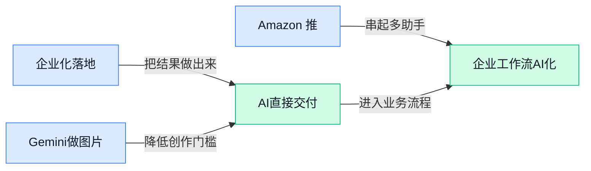

## AI资讯日报 2026/5/14

> AI 早报 · 每日早读 · 全网深度聚合

## **今日摘要**

```
Anthropic 推出 Claude for Small Business，企业付费客户占比首次反超 OpenAI，AI 办公争夺战变天
Amazon 把 Alexa+ AI 购物助手塞进搜索栏，Notion 升级 AI Agent 枢纽，办公与电商入口同时开打
Meta AI 私密模式上线，WhatsApp 聊天关闭即消失，字节 UI-TARS-desktop（桌面Agent工具）开源补执行链
```

### 🔵 产品与功能更新


1. **Anthropic 推出 Claude for Small Business（面向小企业的 Claude 助手方案），要把 AI 塞进你“买了却常忘记用”的办公工具里。**
Anthropic 这次瞄准的是**小企业场景**，核心思路不是再单卖一个聊天窗口，而是把 Claude 更深地嵌进企业已经在付费的各种软件里，让日常工作少切页面、少重复搬运信息 💼。对业务、运营、行政同事来说，这类更新的意义在于：AI 不再只是“问答工具”，而是更像能直接接住工作流的**办公搭子**。如果你关心它具体怎么定位“小企业”需求、想解决哪些工具闲置问题，可以看 [完整报道(briefing)](https://the-decoder.com/anthropic-launches-claude-for-small-business-to-embed-ai-into-the-tools-you-forgot-you-pay-for/)；这里的工作流（指一项工作从信息输入到执行完成的整套流程）和集成（让不同软件直接连起来协作，减少手工复制粘贴）会是理解这次发布的关键 💡


2. **Luma 开放 Uni-1.1（Luma 的 AI 图片生成模型）API（让别家软件也能调用其能力的接口），价格和效果对标 OpenAI 与 Google。**
Luma 把自家的 **Uni-1.1** 图片模型正式以 API 形式开放，重点卖点很直接：**价格**和**质量**都要跟 OpenAI、Google 同台竞争 🎨。对做产品、设计和营销的同事来说，这意味着以后公司内部工具、设计流程甚至活动物料系统，更容易接入新的图片生成能力，而不必只盯着几家头部平台。API（应用程序接口，相当于“软件之间对接的插座”）一旦开放，真正的变化往往不只是“多一个模型”，而是会让更多第三方产品把它接进去，变成可落地的生产力。具体定价和定位可以参考 [完整报道(briefing)](https://the-decoder.com/luma-opens-uni-1-1-image-model-api-at-prices-and-quality-matching-openai-and-google/) 🚀


3. **Amazon 推出 Alexa+ 驱动的 AI 购物助手，直接进驻搜索栏。**
Amazon 发布了一个由 **Alexa+** 驱动的 AI 购物助手，入口就放在搜索栏里，支持**语音**和**触控**两种交互方式，还会覆盖手机、桌面端和 Echo Show（亚马逊带屏智能音箱，可语音看内容和操作）等设备 🛒。它主打更**个性化推荐**，并尝试把购物流程自动化，不只是在 Amazon 里找商品，还会延伸到其他购物相关场景。对普通用户来说，这代表“搜商品”正在变成“让 AI 帮你逛、帮你筛、帮你推进下单”的新体验；对电商运营团队来说，也意味着搜索入口正在从关键词匹配，升级为对话式导购。更多细节可看 [TechCrunch 报道(briefing)](https://techcrunch.com/2026/05/13/amazon-launches-an-ai-shopping-assistant-for-the-search-bar-powered-by-alexa/)；这里的个性化推荐（根据你的历史偏好自动调整展示内容）会是后续观察重点 👀


### 🟢 前沿研究


1. **Variational Posterior Guidance（一种用“后验引导”减少无效思考的推理方法）让大模型推理更省时。**
这篇论文直指大模型在复杂任务里常见的**overthinking（过度思考，明明能很快答完却绕很多步）**问题，核心是在推理阶段加入**efficiency awareness（效率感知，让模型边想边考虑算力和时间成本）**，尽量减少冗长推理链条。相比单纯靠强化学习去“压缩思考”，作者更关注如何在**inference（模型推理，让训练好的模型真正回答问题的过程）**时动态引导模型少走弯路 💡。如果这类方法有效，未来企业用 AI 做分析、问答、客服时，可能会更快拿到答案、也更省服务器成本。[arxiv 论文原文(briefing)](https://arxiv.org/abs/2605.11019)

![Variational Posterior Guidance（一种用“后验引导”减少无效思考的推理方法）让大模型推理更省时](https://image.pollinations.ai/prompt/Variational%20Posterior%20Guidance%EF%BC%88%E4%B8%80%E7%A7%8D%E7%94%A8%E2%80%9C%E5%90%8E%E9%AA%8C%E5%BC%95%E5%AF%BC%E2%80%9D%E5%87%8F%E5%B0%91%E6%97%A0%E6%95%88%E6%80%9D%E8%80%83%E7%9A%84%E6%8E%A8%E7%90%86%E6%96%B9%E6%B3%95%EF%BC%89%E8%AE%A9%E5%A4%A7%E6%A8%A1%E5%9E%8B%E6%8E%A8%E7%90%86%E6%9B%B4%E7%9C%81%E6%97%B6.%20Variational%20Posterior%20Guidance%EF%BC%88%E4%B8%80%E7%A7%8D%E7%94%A8%E2%80%9C%E5%90%8E%E9%AA%8C%E5%BC%95%E5%AF%BC%E2%80%9D%E5%87%8F%E5%B0%91%E6%97%A0%E6%95%88%E6%80%9D%E8%80%83%E7%9A%84%E6%8E%A8%E7%90%86%E6%96%B9%E6%B3%95%EF%BC%89%E8%AE%A9%E5%A4%A7%E6%A8%A1%E5%9E%8B%E6%8E%A8%E7%90%86%E6%9B%B4%E7%9C%81%E6%97%B6%E3%80%82%20%E8%BF%99%E7%AF%87%E8%AE%BA%E6%96%87%E7%9B%B4%E6%8C%87%E5%A4%A7%E6%A8%A1%E5%9E%8B%E5%9C%A8%E5%A4%8D%E6%9D%82%E4%BB%BB%E5%8A%A1%E9%87%8C%E5%B8%B8%E8%A7%81%2C%20technical%20infographic%20diagram%2C%20architecture%20flowchart%2C%20clean%20vector%20illustration%2C%20educational%20style%2C%20no%20text%20overlay%2C%20modern%20minimal%2C%20wide%20aspect?width=1200&height=675&nologo=true&seed=10807)


2. **Test-Time Personalization（测试时个性化，让模型在回答当下边用边适配用户）提出诊断框架和概率修复方案。**
这篇研究认为，当前很多个性化方法只顾着提前训练更“懂你”的模型，却把一次回答当成**single-shot（一锤子买卖式的单次生成）**，忽略了推理过程中也能继续适配用户。作者提出一个**diagnostic framework（诊断框架，用来定位模型个性化为什么失效）**，并配套一个**probabilistic fix（概率式修复方案，按不确定性动态调整输出）**来处理规模变大后容易失灵的问题 🚀。对普通办公场景来说，这意味着未来 AI 助手可能不只是“记住你的资料”，而是能在对话进行中更稳地贴合你的表达习惯和偏好。[arxiv 论文摘要页(briefing)](https://arxiv.org/abs/2605.10991)

![Test-Time Personalization（测试时个性化，让模型在回答当下边用边适配用户）提出诊断框架和概率修复方案](https://image.pollinations.ai/prompt/Test-Time%20Personalization%EF%BC%88%E6%B5%8B%E8%AF%95%E6%97%B6%E4%B8%AA%E6%80%A7%E5%8C%96%EF%BC%8C%E8%AE%A9%E6%A8%A1%E5%9E%8B%E5%9C%A8%E5%9B%9E%E7%AD%94%E5%BD%93%E4%B8%8B%E8%BE%B9%E7%94%A8%E8%BE%B9%E9%80%82%E9%85%8D%E7%94%A8%E6%88%B7%EF%BC%89%E6%8F%90%E5%87%BA%E8%AF%8A%E6%96%AD%E6%A1%86%E6%9E%B6%E5%92%8C%E6%A6%82%E7%8E%87%E4%BF%AE%E5%A4%8D%E6%96%B9%E6%A1%88.%20Test-Time%20Personalization%EF%BC%88%E6%B5%8B%E8%AF%95%E6%97%B6%E4%B8%AA%E6%80%A7%E5%8C%96%EF%BC%8C%E8%AE%A9%E6%A8%A1%E5%9E%8B%E5%9C%A8%E5%9B%9E%E7%AD%94%E5%BD%93%E4%B8%8B%E8%BE%B9%E7%94%A8%E8%BE%B9%E9%80%82%E9%85%8D%E7%94%A8%E6%88%B7%EF%BC%89%E6%8F%90%E5%87%BA%E8%AF%8A%E6%96%AD%E6%A1%86%E6%9E%B6%E5%92%8C%E6%A6%82%E7%8E%87%E4%BF%AE%E5%A4%8D%E6%96%B9%E6%A1%88%E3%80%82%20%E8%BF%99%E7%AF%87%E7%A0%94%E7%A9%B6%E8%AE%A4%E4%B8%BA%EF%BC%8C%E5%BD%93%E5%89%8D%E5%BE%88%E5%A4%9A%E4%B8%AA%E6%80%A7%E5%8C%96%E6%96%B9%E6%B3%95%2C%20technical%20infographic%20diagram%2C%20architecture%20flowchart%2C%20clean%20vector%20illustration%2C%20educational%20style%2C%20no%20text%20overlay%2C%20modern%20minimal%2C%20wide%20aspect?width=1200&height=675&nologo=true&seed=10838)


3. **DisagMoE（一种改进 MoE 训练效率的并行方案）尝试给超大模型训练“疏堵保畅”。**
论文聚焦 **MoE（混合专家模型，多个小模型分工协作，只激活部分模块来省算力）** 训练里最头疼的通信瓶颈：机器之间频繁交换数据，容易把训练速度拖慢。作者提出 **Disaggregated AF-Pipe Parallelism（解耦式流水并行方案，把计算和通信更紧密错开执行）**，目标是让计算和通信尽量重叠，减少彼此等待时间。对行业来说，这类底层优化虽然离普通用户较远，但它直接关系到超大模型能否更便宜、更快地训练出来，最终会影响模型能力和企业采购成本 📉。[arxiv 论文原文(briefing)](https://arxiv.org/abs/2605.11005)

![DisagMoE（一种改进 MoE 训练效率的并行方案）尝试给超大模型训练“疏堵保畅”](https://image.pollinations.ai/prompt/DisagMoE%EF%BC%88%E4%B8%80%E7%A7%8D%E6%94%B9%E8%BF%9B%20MoE%20%E8%AE%AD%E7%BB%83%E6%95%88%E7%8E%87%E7%9A%84%E5%B9%B6%E8%A1%8C%E6%96%B9%E6%A1%88%EF%BC%89%E5%B0%9D%E8%AF%95%E7%BB%99%E8%B6%85%E5%A4%A7%E6%A8%A1%E5%9E%8B%E8%AE%AD%E7%BB%83%E2%80%9C%E7%96%8F%E5%A0%B5%E4%BF%9D%E7%95%85%E2%80%9D.%20DisagMoE%EF%BC%88%E4%B8%80%E7%A7%8D%E6%94%B9%E8%BF%9B%20MoE%20%E8%AE%AD%E7%BB%83%E6%95%88%E7%8E%87%E7%9A%84%E5%B9%B6%E8%A1%8C%E6%96%B9%E6%A1%88%EF%BC%89%E5%B0%9D%E8%AF%95%E7%BB%99%E8%B6%85%E5%A4%A7%E6%A8%A1%E5%9E%8B%E8%AE%AD%E7%BB%83%E2%80%9C%E7%96%8F%E5%A0%B5%E4%BF%9D%E7%95%85%E2%80%9D%E3%80%82%20%E8%AE%BA%E6%96%87%E8%81%9A%E7%84%A6%20MoE%EF%BC%88%E6%B7%B7%E5%90%88%E4%B8%93%E5%AE%B6%E6%A8%A1%E5%9E%8B%EF%BC%8C%E5%A4%9A%E4%B8%AA%E5%B0%8F%E6%A8%A1%E5%9E%8B%E5%88%86%E5%B7%A5%E5%8D%8F%E4%BD%9C%EF%BC%8C%E5%8F%AA%E6%BF%80%E6%B4%BB%E9%83%A8%E5%88%86%E6%A8%A1%E5%9D%97%E6%9D%A5%E7%9C%81%2C%20technical%20infographic%20diagram%2C%20architecture%20flowchart%2C%20clean%20vector%20illustration%2C%20educational%20style%2C%20no%20text%20overlay%2C%20modern%20minimal%2C%20wide%20aspect?width=1200&height=675&nologo=true&seed=10869)


4. **DMI-Lib（深度模型内部观测工具库）想让大模型推理过程变得“可看见”。**
这篇论文讨论的是 **model-internal observability（模型内部可观测性，让人能查看模型中间状态而不只是看最终答案）**：如今很多推理场景越来越依赖及时读取模型内部信号，来做调试、监控或功能增强。作者提出 **DMI-Lib（高速深度模型检查器，用来观察模型内部状态）**，把这种能力当成推理系统的一等公民，而不是事后补丁 🛠️。对企业团队来说，这类工具未来可能帮助开发者更快定位模型为什么答错、卡住，甚至让产品做出更细致的“过程级”控制。[arxiv 论文详情(briefing)](https://arxiv.org/abs/2605.11093)


5. **DeepMind 想把鼠标指针升级成 AI 时代的“智能光标”。**
这篇报道介绍了 DeepMind 从 **prompt（给 AI 的文字指令）** 进一步走向 **pointer engineering（指针工程，把鼠标光标本身变成 AI 交互入口）** 的思路，不再只靠输入文字命令，而是让用户通过光标直接表达意图。简单说，就是把“你说给 AI 听”扩展成“你指给 AI 看” 👀，让 AI 更懂你此刻关注屏幕上的哪一块内容。对办公软件、设计工具、网页操作来说，这可能会改变人机交互方式：未来很多任务也许不必长篇打字，圈一圈、指一指就能让 AI 接手。[完整报道(briefing)](https://the-decoder.com/from-prompt-to-pointer-engineering-deepmind-tries-to-reinvent-the-mouse-cursor-for-the-ai-era/)


6. **GridSFM（面向电网的小型基础模型）瞄准电力系统这一垂直场景。**
微软研究院发布的 GridSFM，是一个专门面向 **electric grid（电网，负责发电、输电、配电的基础设施系统）** 的 **foundation model（基础模型，可作为多种任务底座的通用模型）**，而且强调是“小模型”路线。它的意义在于，不是所有行业都需要越大越贵的通用模型；像电网这种专业领域，更需要懂行业结构、成本可控、部署灵活的模型方案 ⚙️。这也提醒很多企业：AI 落地未必总靠“最大模型”，更可能是结合自身业务数据做出足够好、足够稳的行业专用模型。[微软研究博客(briefing)](https://www.microsoft.com/en-us/research/blog/gridsfm-a-new-small-foundation-model-for-the-electric-grid/)


7. **SkillGen（一种可验证的 Agent 技能合成方法）让 AI 临场生成“可复用技能”。**
这篇论文关注的是 **Agent skill synthesis（Agent 技能合成，让 AI 把解决步骤沉淀成可重复调用的小能力）**：相比每次都临场发挥，把高质量技能沉淀下来更容易复用和控制。问题在于，过去这些技能大多还得靠人工写；而 SkillGen 想在 **inference-time（推理时，也就是模型实际执行任务的当下）** 自动生成技能，并且加入 **verified（可验证，能检查技能是否满足要求）** 机制 ✅。如果做成了，未来企业里的 AI 助手处理报表、整理资料、跨系统操作时，就有机会像“学会了一个套路后反复用”，而不是每次都从头摸索。[arxiv 论文原文(briefing)](https://arxiv.org/abs/2605.10999)


8. **LEAP（一种让扩散语言模型更好并行生成的方案）试图释放 dLLM 的速度优势。**
论文针对 **dLLM（Diffusion Language Model，扩散语言模型，一类不按传统逐字生成、而是尝试并行生成文本的新路线）** 展开，核心是通过 **Lookahead Early-Convergence Token Detection（前瞻式早收敛词元检测，提前判断哪些文字其实已经稳定）** 来提升并行效率。直白说，就是模型在还没完全“生成完”时，先识别出哪些部分已经八九不离十，从而更早推进后续计算 🚀。如果这条路线成熟，未来某些文本生成任务可能不再只能一个字一个字慢慢吐，而会更接近并行出结果，对实时交互体验很有想象空间。[arxiv 论文摘要页(briefing)](https://arxiv.org/abs/2605.10980)


### 🟡 行业展望与社会影响


1. **Anthropic 首次在企业付费客户占比上超过 OpenAI。**
从 **Ramp（企业支出管理金融平台）** 汇总的客户报销与订阅数据来看，**34.4%** 的参与企业正在为 Anthropic 付费，而 OpenAI 为 **32.3%**，这是一个很有行业风向标意味的变化 📊。它不代表所有企业市场已经彻底改写，但至少说明企业采购 AI 时，正在从“默认选 ChatGPT”走向“更看重不同模型的实际适配度”。对公司里做采购、运营和管理的人来说，这意味着未来选 AI 工具时，品牌不再是唯一标准，**企业可用性** 和 **落地效果** 会越来越重要。[Ramp 数据解读(briefing)](https://techcrunch.com/2026/05/13/anthropic-now-has-more-business-customers-than-openai-according-to-ramp-data/) 💡


2. **Meta AI 推出私密模式，聊天内容不再存到服务器。**
Meta AI 新增了一个更强调隐私的 **private mode（私密模式，聊天内容不保存在云端服务器）**，核心卖点就是让用户和 AI 对话时少一点“被记录”的顾虑 🔒。这类变化看似是功能更新，背后其实是在回应越来越敏感的 **数据隐私** 问题：大家想用 AI，但也担心对话内容被留存、分析甚至误用。对企业来说，这会进一步推高市场对 **本地处理**、**最小化留存** 这类能力的关注，也会影响员工愿不愿意把真实工作内容交给 AI。[功能报道原文(briefing)](https://the-decoder.com/meta-ai-gets-a-private-mode-where-no-conversation-data-is-stored-on-servers/) 🚀


3. **Codex 在 Windows 上用沙盒机制补上安全短板。**
OpenAI 介绍了如何为 Codex 在 Windows 上搭建 **sandbox（沙盒，一个把程序关进“安全隔离房间”里运行的机制）**，以便让编码 Agent 更安全地工作 🛡️。它会配合 **受控文件访问** 和 **网络限制**，尽量避免 AI 代理在执行任务时误碰本机敏感文件，或者随意联网带来风险。对不懂技术的同事来说，可以把它理解成：公司想让 AI 帮忙干活，就得先给它划好活动范围；这也是 **AI 进入正式办公环境** 前必须补上的基础设施。[OpenAI 官方说明(briefing)](https://openai.com/index/building-codex-windows-sandbox) 💻


4. **Notion（团队协作办公工具）把工作区升级成 AI Agent 枢纽。**
Notion 推出新的开发者平台，允许团队把 **AI agents（能自己调用工具、分步骤完成任务的 AI 助手）**、外部数据源和自定义代码直接接进工作区 🧩。这意味着它不再只是记笔记或做文档，而是想成为一个把信息、流程和 AI 动作串起来的“总控台”。对业务、运营、行政等岗位来说，这类平台化趋势很关键：以后你可能不是在不同工具之间来回切换，而是在一个工作区里直接调动多个 AI 处理文档、查资料、推流程。[TechCrunch 完整报道(briefing)](https://techcrunch.com/2026/05/13/notion-just-turned-its-workspace-into-a-hub-for-ai-agents/) 🚀


5. **WhatsApp 给 Meta AI 聊天加上隐身模式，关掉对话就自动消失。**
WhatsApp 现在为 Meta AI 聊天加入了 **incognito mode（隐身模式，不保存聊天记录且默认关闭窗口后消失）**，主打的是更轻量、更放心的使用体验 🙈。这和传统“聊天记录永久保存”的逻辑不一样，更像把 AI 对话变成一次性咨询：聊完就走，不留痕迹。它释放出的信号很明确——随着 AI 进入日常沟通工具，用户对 **隐私可控** 的要求会越来越高，未来谁能把“好用”和“安心”同时做好，谁就更容易赢得大众市场。[功能更新报道(briefing)](https://techcrunch.com/2026/05/13/whatsapp-adds-an-incognito-mode-in-meta-ai-chats/) 💬


### 🟣 开源TOP项目

1. **anthropics/financial-services-plugins（Anthropic 开源的金融服务插件集合）上架 GitHub。**
这个项目面向**金融服务场景**，从名字就能看出，它主打把 Claude 这类大模型接入银行、投研、理财等业务常见的插件能力里 💼。对业务团队来说，**插件**可以理解成“让 AI 连上外部工具和数据源的接口”，这样模型不只是聊天，还能更像一个会调系统的助手。它的意义在于把金融行业里常见的合规、数据调用、流程连接做成可复用积木，方便团队更快搭建业务助手。[GitHub 项目页(briefing)](https://github.com/anthropics/financial-services-plugins)


2. **playcanvas/supersplat（用于编辑 3D Gaussian Splat 的三维场景工具）让 3D 内容制作更直观。**
Supersplat 是一个 **3D Gaussian Splat（把现实场景压缩成很多“高斯点团”来重建 3D 画面的方法，特点是看起来真实、渲染又快）编辑器**，适合处理新一代 3D 场景资产 🎨。如果你不熟 3D，可以把它理解成：把真实世界扫描结果变成能修改、能发布的数字模型。对设计、内容和交互团队来说，这类工具的价值在于降低 3D 资产编辑门槛，让虚拟展示、产品演示、空间内容更容易落地。[项目仓库介绍(briefing)](https://github.com/playcanvas/supersplat)


3. **decolua/9router（把多个 AI 编码助手接到多家模型服务的路由工具）主打“不断线”的免费编程体验。**
这个项目想解决的是：大家在用 Claude Code、Cursor、Copilot 等工具时，经常会碰到**额度限制**、服务不稳或切换麻烦的问题 😅。它提供一个 **router（路由器, 像总调度台一样帮你自动选择后端模型服务）**，把多家模型提供方接起来，并支持 **auto-fallback（自动切换备用服务, 某一路不可用时自动换下一路）**。摘要里还提到 **RTK（减少 token 消耗的机制, token 就是模型处理文字时切分的小单位）** 可降低用量；对开发团队来说，这类工具核心价值就是省钱、省切换成本、尽量不停工。[GitHub 仓库页(briefing)](https://github.com/decolua/9router)

![decolua/9router（把多个 AI 编码助手接到多家模型服务的路由工具）主打“不断线”的免费编程体验](https://image.pollinations.ai/prompt/decolua%2F9router%EF%BC%88%E6%8A%8A%E5%A4%9A%E4%B8%AA%20AI%20%E7%BC%96%E7%A0%81%E5%8A%A9%E6%89%8B%E6%8E%A5%E5%88%B0%E5%A4%9A%E5%AE%B6%E6%A8%A1%E5%9E%8B%E6%9C%8D%E5%8A%A1%E7%9A%84%E8%B7%AF%E7%94%B1%E5%B7%A5%E5%85%B7%EF%BC%89%E4%B8%BB%E6%89%93%E2%80%9C%E4%B8%8D%E6%96%AD%E7%BA%BF%E2%80%9D%E7%9A%84%E5%85%8D%E8%B4%B9%E7%BC%96%E7%A8%8B%E4%BD%93%E9%AA%8C.%20decolua%2F9router%EF%BC%88%E6%8A%8A%E5%A4%9A%E4%B8%AA%20AI%20%E7%BC%96%E7%A0%81%E5%8A%A9%E6%89%8B%E6%8E%A5%E5%88%B0%E5%A4%9A%E5%AE%B6%E6%A8%A1%E5%9E%8B%E6%9C%8D%E5%8A%A1%E7%9A%84%E8%B7%AF%E7%94%B1%E5%B7%A5%E5%85%B7%EF%BC%89%E4%B8%BB%E6%89%93%E2%80%9C%E4%B8%8D%E6%96%AD%E7%BA%BF%E2%80%9D%E7%9A%84%E5%85%8D%E8%B4%B9%E7%BC%96%E7%A8%8B%E4%BD%93%E9%AA%8C%E3%80%82%20%E8%BF%99%E4%B8%AA%E9%A1%B9%E7%9B%AE%E6%83%B3%E8%A7%A3%E5%86%B3%E7%9A%84%E6%98%AF%EF%BC%9A%E5%A4%A7%E5%AE%B6%E5%9C%A8%E7%94%A8%20Claude%20C%2C%20technical%20infographic%20diagram%2C%20architecture%20flowchart%2C%20clean%20vector%20illustration%2C%20educational%20style%2C%20no%20text%20overlay%2C%20modern%20minimal%2C%20wide%20aspect?width=1200&height=675&nologo=true&seed=11063)

4. **CloakHQ/CloakBrowser（可绕过机器人检测的 Chromium 浏览器分支）瞄准自动化测试与网页操作。**
这是一个基于 **Chromium（Chrome 背后的开源浏览器内核）** 的“隐身浏览器”，主打通过各种**机器人检测**测试 🕵️。项目摘要提到它可作为 **Playwright（常用网页自动化测试工具）替代品** 使用，并做了 **fingerprint patches（浏览器指纹补丁, 用来修改网站识别你设备和环境的特征）**。对企业来说，这类项目的看点在于网页自动化、批量操作和测试稳定性，但也说明浏览器对抗检测这条赛道还在快速进化。[项目主页说明(briefing)](https://github.com/CloakHQ/CloakBrowser)


5. **bytedance/UI-TARS-desktop（字节跳动开源的桌面端多模态 Agent 工具栈）把模型与执行系统连起来。**
这个项目强调 **multimodal（多模态, 指 AI 不只看文字，还能处理图像、界面等多种信息）** 与 **Agent stack（Agent 工具栈, 让 AI 从“会说”变成“会做”的整套执行组件）** 的结合 🚀。简单说，它想做的是把前沿模型和底层 **infra（基础设施, 包括任务调度、工具调用、运行环境等支撑能力）** 接起来，让桌面端 AI 助手更容易落地。对产品、运营甚至行政流程自动化来说，这类开源项目的价值在于提供一个更完整的“AI 代操作”底座。[官方仓库页(briefing)](https://github.com/bytedance/UI-TARS-desktop)


6. **millionco/react-doctor（让 AI 帮你诊断和修复 React 代码的工具）瞄准代码“自动看病”。**
React Doctor 的定位很直接：让**编码 Agent**先发现问题，再尝试修复 React 代码 🩺。这里的 **React（最流行的前端界面开发框架, 很多网页和后台系统都靠它搭界面）**，可以理解为企业软件前台页面的“搭建骨架”；而“诊断 + 修复”则像给代码做体检并自动开药方。对研发管理者来说，这类工具的意义不只是提速，还可能减少重复排查时间，让工程师把精力放到更重要的业务功能上。[GitHub 项目页(briefing)](https://github.com/millionco/react-doctor)


### 🔴 社媒分享

1. **“AI 不会立刻抢走你工作”最有说服力的理由：真正稀缺的是组织落地能力。**
这篇文章的核心观点不是否认 **AI** 会改变岗位，而是强调企业真正卡住的地方，往往不是“有没有模型”，而是能不能把新工具嵌进日常流程里 💼。文中借 Box 首席执行官 Aaron Levie 的判断指出，很多工作短期内更像是被 **重构** 而不是被直接替代，因为公司还要处理流程改造、权限管理、跨团队协作这些“最后一公里”问题。对普通职能岗位同事来说，这意味着会用 AI 当然重要，但更值钱的是把 AI 变成实际产出的能力，比如把它接进审批、客服、销售支持等场景。想看完整论证可读 [Platformer 文章原文(briefing)](https://www.platformer.news/ai-job-loss-box-ceo-aaron-levie/) 🔍


2. **The Deployment Company（“部署型公司”，指靠大规模落地新技术获胜的公司）重新成为主角。**
这篇分析把今天的 AI 热潮，与上世纪 70 年代之后的技术产业演进放在一起对照，认为下一波赢家未必只是“发明技术的人”，更可能是最会把技术 **部署** 到真实市场的人 🚀。文中还串联 Apple 和 Intel 的历史，讨论产业价值如何从单点创新转向系统整合、渠道、产品化和规模化执行，这对理解 AI 商业竞争很有启发。这里的 **commercialization（商业化，把技术真正变成可卖产品和收入）** 与 deployment（部署，把技术铺到大量用户和业务场景）是关键概念，尤其适合做业务、运营和管理的同事理解“为什么会用 AI 的公司差距会越来越大”。原文可见 [Stratechery 深度分析(briefing)](https://stratechery.com/2026/the-deployment-company-back-to-the-70s-apple-and-intel/) 📈


3. **美国在 AI 竞赛中领先的关键，不只是模型能力，而是 commercialization（商业化，把技术快速变成产品和收入）。**
这篇文章的判断很直接：AI 竞赛真正决定胜负的，不只是论文、参数规模或榜单分数，而是谁能更快把能力做成可用产品、卖给客户并形成规模收入 💡。作者强调，美国的优势体现在创业公司生态、云基础设施（支撑在线软件和 AI 服务的大型计算资源网络）、企业采购能力以及资本市场的联动，这些因素让技术更容易从实验室走向市场。对职能岗位来说，这个视角很重要，因为 AI 行业的胜负，很多时候并不发生在“谁更聪明”，而发生在“谁更快进入流程、预算和组织体系”。如果想看完整观点，可读 [原文博客全文(briefing)](https://avkcode.github.io/blog/us-winning-ai-race.html) 🌍

![美国在 AI 竞赛中领先的关键，不只是模型能力，而是 commercialization（商业化，把技术快速变成产品和收入）](https://image.pollinations.ai/prompt/%E7%BE%8E%E5%9B%BD%E5%9C%A8%20AI%20%E7%AB%9E%E8%B5%9B%E4%B8%AD%E9%A2%86%E5%85%88%E7%9A%84%E5%85%B3%E9%94%AE%EF%BC%8C%E4%B8%8D%E5%8F%AA%E6%98%AF%E6%A8%A1%E5%9E%8B%E8%83%BD%E5%8A%9B%EF%BC%8C%E8%80%8C%E6%98%AF%20commercialization%EF%BC%88%E5%95%86%E4%B8%9A%E5%8C%96%EF%BC%8C%E6%8A%8A%E6%8A%80%E6%9C%AF%E5%BF%AB%E9%80%9F%E5%8F%98%E6%88%90%E4%BA%A7%E5%93%81%E5%92%8C%E6%94%B6%E5%85%A5%EF%BC%89.%20%E7%BE%8E%E5%9B%BD%E5%9C%A8%20AI%20%E7%AB%9E%E8%B5%9B%E4%B8%AD%E9%A2%86%E5%85%88%E7%9A%84%E5%85%B3%E9%94%AE%EF%BC%8C%E4%B8%8D%E5%8F%AA%E6%98%AF%E6%A8%A1%E5%9E%8B%E8%83%BD%E5%8A%9B%EF%BC%8C%E8%80%8C%E6%98%AF%20commercialization%EF%BC%88%E5%95%86%E4%B8%9A%E5%8C%96%EF%BC%8C%E6%8A%8A%E6%8A%80%E6%9C%AF%E5%BF%AB%E9%80%9F%E5%8F%98%E6%88%90%E4%BA%A7%E5%93%81%E5%92%8C%E6%94%B6%E5%85%A5%EF%BC%89%E3%80%82%20%E8%BF%99%E7%AF%87%E6%96%87%E7%AB%A0%E7%9A%84%E5%88%A4%E6%96%AD%E5%BE%88%E7%9B%B4%E6%8E%A5%EF%BC%9AAI%20%E7%AB%9E%E8%B5%9B%2C%20technical%20infographic%20diagram%2C%20architecture%20flowchart%2C%20clean%20vector%20illustration%2C%20educational%20style%2C%20no%20text%20overlay%2C%20modern%20minimal%2C%20wide%20aspect?width=1200&height=675&nologo=true&seed=10675)

---



### 📊 行业洞察（今日 4 条）

1. Anthropic 发布 Claude for Small Business，把助手嵌入企业已采购软件，面向小企业办公协作。
  【洞察】判断是竞争重心正从独立对话框转向深度集成，因为中小企业更看重直接产出，但接入越深，迁移与治理成本也越高。

2. Ramp 数据显示，34.4% 参与企业为 Anthropic 付费，首次高于 OpenAI 的 32.3%。
  【洞察】判断是企业采购开始弱化品牌先发，转向可用性与适配度，因为付费行为比讨论热度更接近真实需求，但样本仍有局限。

3. Notion 推出开发者平台，把 AI agents（可调用工具完成任务的助手）和外部数据源接入工作区。
  【洞察】判断是办公软件正争夺 Agent 枢纽地位，因为入口、数据与协作关系一旦集中，平台黏性会增强，但生态控制权也更集中。

4. OpenAI 为 Codex 在 Windows 引入 sandbox（沙盒，即隔离运行环境）及受控文件访问、网络限制。
  【洞察】判断是企业级 Agent 商业化将先受安全边界约束，因为能否限定行为范围决定落地速度，但限制过严也会削弱可用性。

### 💭 对我们的启发（今日 2 条）

1. 参考 Notion 的 Agent 枢纽化和 Anthropic 的深度集成，我们应先做跨工具编排层。机会是占住入口，风险是被上层办公平台内建能力挤压。

2. 参考 Codex 的沙盒设计与 Ramp 的企业付费变化，A2A 平台需把权限、审计（留痕核查）做成产品核心。机会是进入企业采购，风险是交付周期变长。

