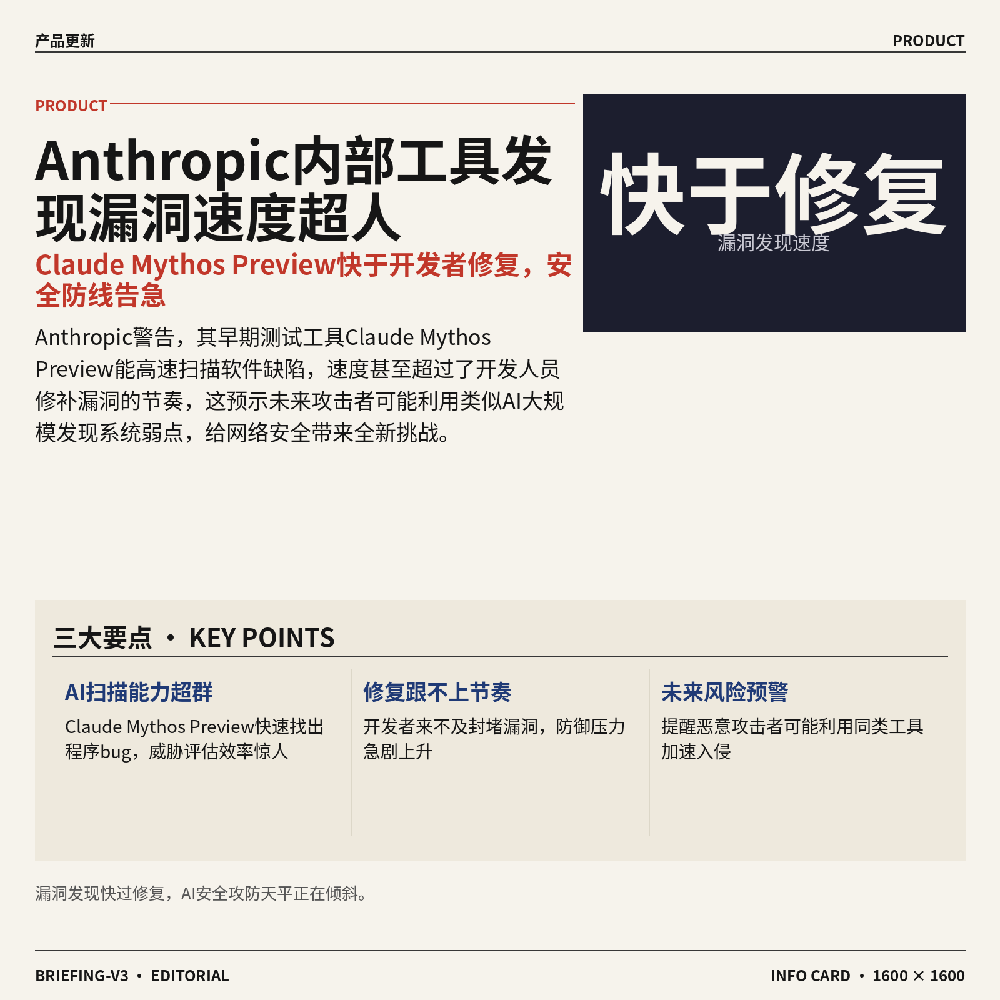
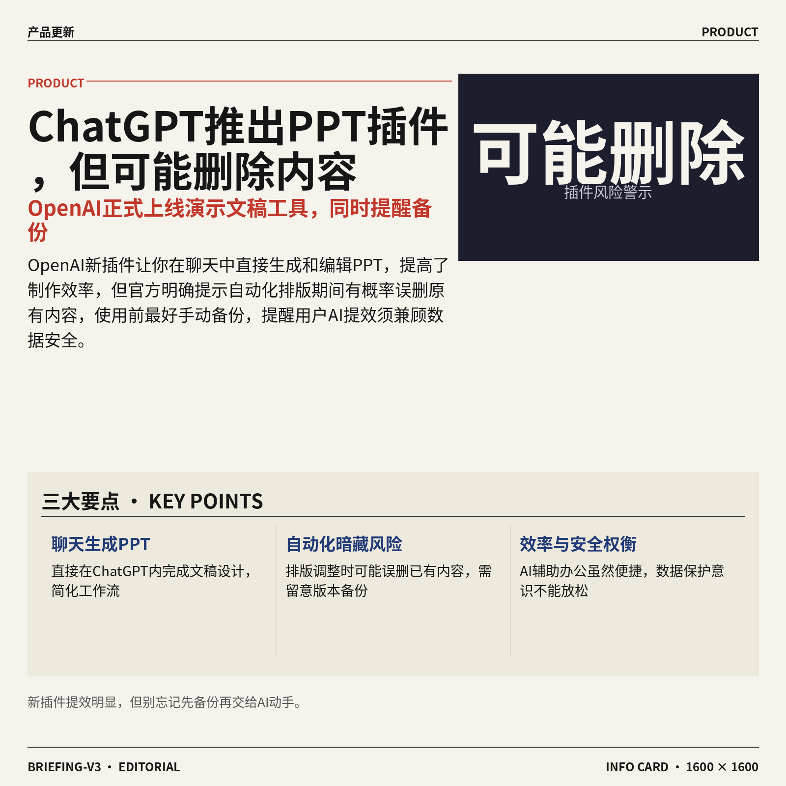
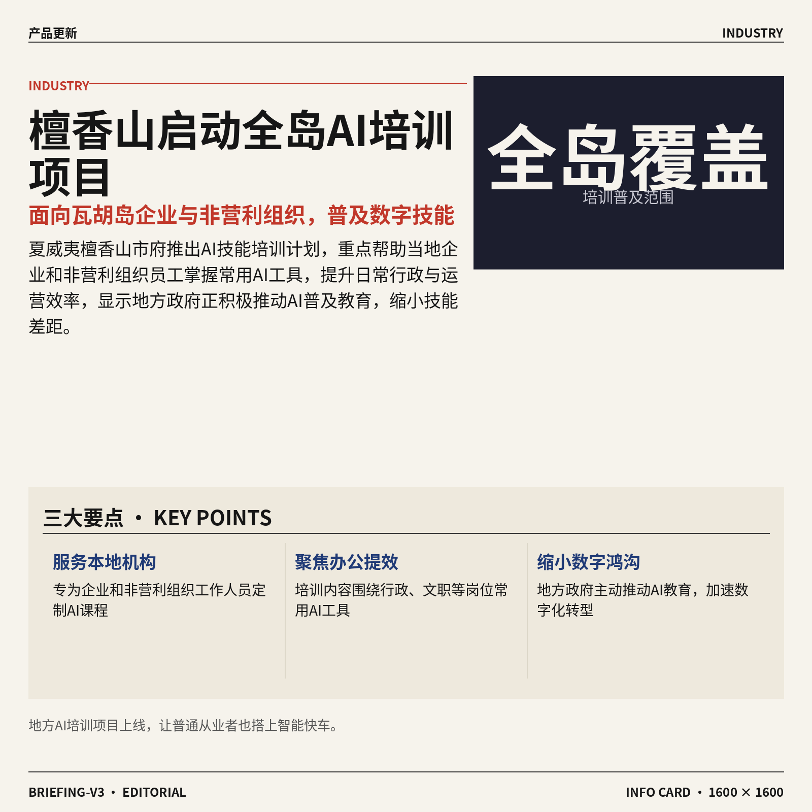
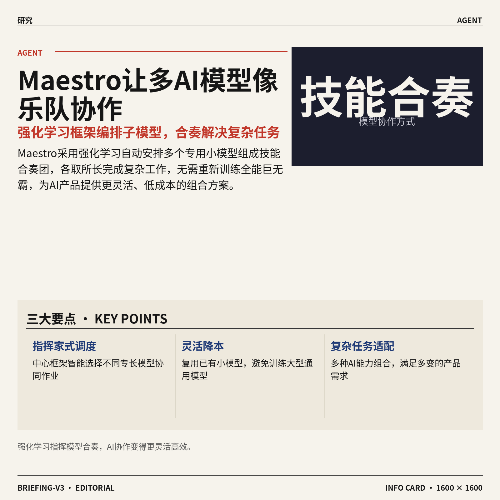
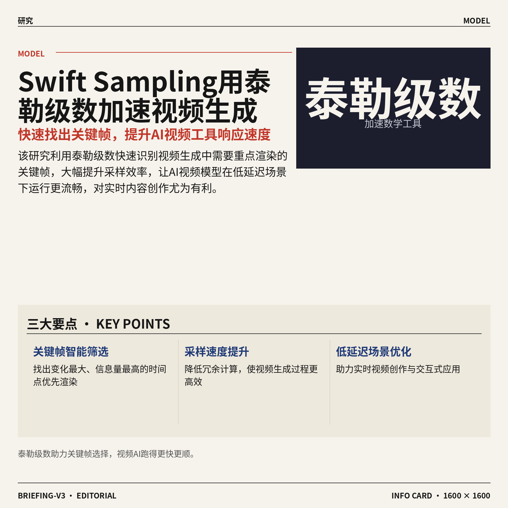
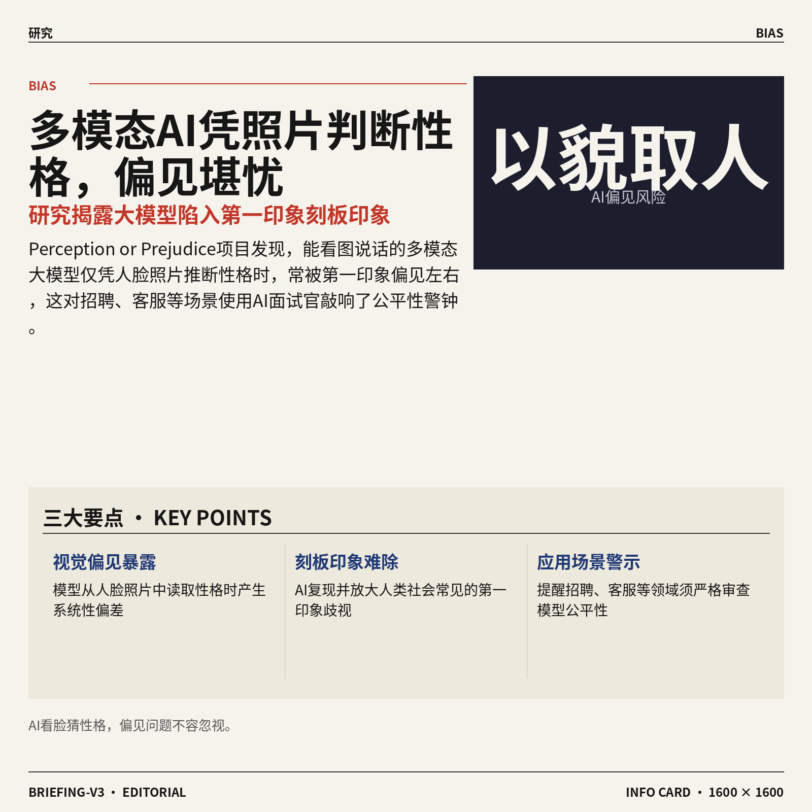
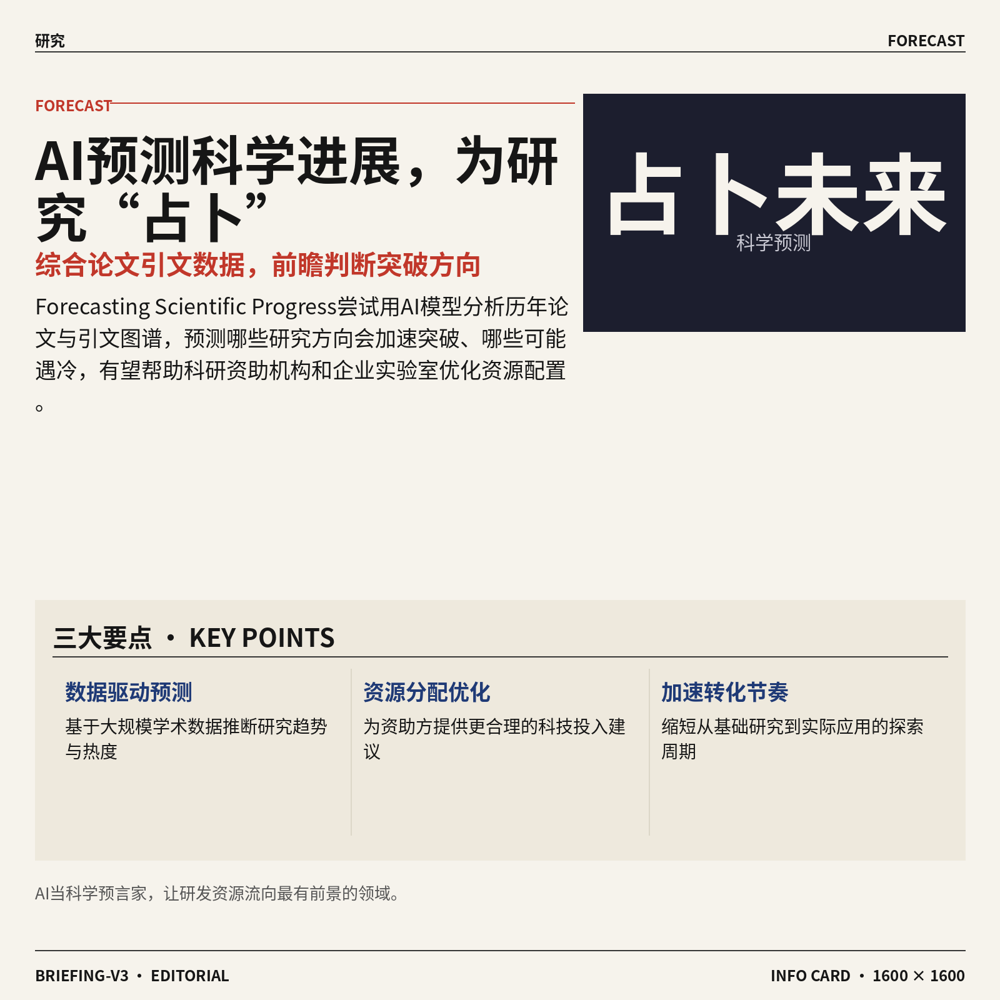
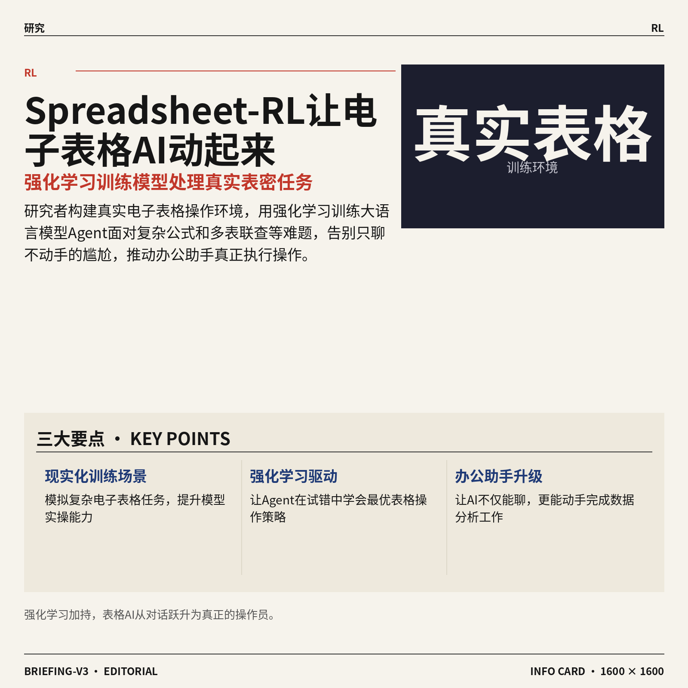
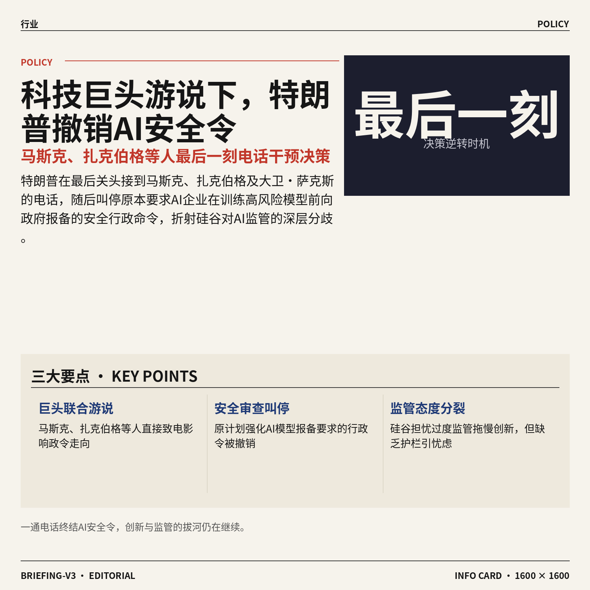

## AI资讯日报 2026/5/23

> AI 早报 · 每日早读 · 全网深度聚合

## **今日摘要**

```
```

### 🔵 产品与功能更新



1. **Anthropic 警告 Claude Mythos Preview（内部早期测试版本）发现漏洞速度快于开发者修复。**
   Anthropic 近日发出安全警示，其内部工具 **Claude Mythos Preview**（一款用于检验 AI 系统安全性与可靠性的早期测试版本）能快速找出软件中的 **bug（程序缺陷）**，速度甚至超过了开发人员修复漏洞的节奏 🐛。这一发现令人不安，因为它意味着恶意攻击者将来可能利用类似 AI 工具高速扫描系统弱点，给网络安全防御带来新挑战。[Anthropic 安全警告详情(briefing)](https://the-decoder.com/anthropic-warns-claude-mythos-preview-finds-bugs-faster-than-developers-can-patch-them/)




2. **OpenAI 推出 ChatGPT PowerPoint 插件，但提醒可能意外删除你的内容。**
   OpenAI 正式上线了一款 **ChatGPT PowerPoint 插件**，能让你在聊天中直接生成和编辑演示文稿，大幅简化了做 PPT 的流程 📊。不过官方同时明确警告，该插件在自动化排版和调整的过程中，有概率导致用户原有内容被误删，使用前最好先手动备份 💾。这记“预防针”也提醒我们，AI 提效虽好，但数据安全意识仍不能松。[ChatGPT 新功能详情(briefing)](https://the-decoder.com/openai-launches-a-chatgpt-powerpoint-plugin-and-warns-it-might-accidentally-delete-your-content/)




3. **檀香山推出面向 O‘ahu（瓦胡岛，夏威夷州主岛）企业和非营利组织的 AI 培训项目。**
   夏威夷檀香山市府宣布启动一项 **AI 技能培训计划**，专门服务于当地企业员工和 **非营利组织** 的工作人员 🏝️。项目旨在帮助行政、文职、运营等岗位的从业者掌握常用 AI 工具，提升日常工作效率，让更多普通人也能搭上数字化快车。这表明地方政府正主动推动 AI 普及教育，努力缩小技能鸿沟。[当地新闻详情(briefing)](https://news.google.com/rss/articles/CBMirAFBVV95cUxPbHNxdlZ0REZmS0hVbVZDUjhwNl9uMkZNNm1vWTNveVFpSUdUck5ZbmNfZEJDbzlhSGRTZlp4UjNMUzBxVVBjaGF1Si1QZC1JVUNTMU5NNkdlQ3lNLWRYdDNoOFVsaDdmRVNzX194MFRRU3ZfVzJ3azlYNUlMWV9wWE5uY3JVZTk4eXlkSzJaZlhYTHRGWm5mZnpUNGFHdjhuRjNkOEcweFphZjdi?oc=5)

![檀香山推出面向 O‘ahu（瓦胡岛，夏威夷州主岛）企业和非营利组织的 AI 培训项目](https://image.pollinations.ai/prompt/%E6%AA%80%E9%A6%99%E5%B1%B1%E6%8E%A8%E5%87%BA%E9%9D%A2%E5%90%91%20O%E2%80%98ahu%EF%BC%88%E7%93%A6%E8%83%A1%E5%B2%9B%EF%BC%8C%E5%A4%8F%E5%A8%81%E5%A4%B7%E5%B7%9E%E4%B8%BB%E5%B2%9B%EF%BC%89%E4%BC%81%E4%B8%9A%E5%92%8C%E9%9D%9E%E8%90%A5%E5%88%A9%E7%BB%84%E7%BB%87%E7%9A%84%20AI%20%E5%9F%B9%E8%AE%AD%E9%A1%B9%E7%9B%AE.%20%E6%AA%80%E9%A6%99%E5%B1%B1%E6%8E%A8%E5%87%BA%E9%9D%A2%E5%90%91%20O%E2%80%98ahu%EF%BC%88%E7%93%A6%E8%83%A1%E5%B2%9B%EF%BC%8C%E5%A4%8F%E5%A8%81%E5%A4%B7%E5%B7%9E%E4%B8%BB%E5%B2%9B%EF%BC%89%E4%BC%81%E4%B8%9A%E5%92%8C%E9%9D%9E%E8%90%A5%E5%88%A9%E7%BB%84%E7%BB%87%E7%9A%84%20AI%20%E5%9F%B9%E8%AE%AD%E9%A1%B9%E7%9B%AE%E3%80%82%20%E5%A4%8F%E5%A8%81%E5%A4%B7%E6%AA%80%E9%A6%99%E5%B1%B1%E5%B8%82%E5%BA%9C%E5%AE%A3%E5%B8%83%E5%90%AF%E5%8A%A8%E4%B8%80%E9%A1%B9%20AI%20%E6%8A%80%E8%83%BD%E5%9F%B9%E8%AE%AD%E8%AE%A1%E5%88%92%EF%BC%8C%E4%B8%93%E9%97%A8%E6%9C%8D%E5%8A%A1%E4%BA%8E%E5%BD%93%E5%9C%B0%E4%BC%81%E4%B8%9A%E5%91%98%E5%B7%A5%2C%20technical%20infographic%20diagram%2C%20architecture%20flowchart%2C%20clean%20vector%20illustration%2C%20educational%20style%2C%20no%20text%20overlay%2C%20modern%20minimal%2C%20wide%20aspect?width=1200&height=675&nologo=true&seed=11451)

### 🟢 前沿研究



1. **Maestro（一种让多个 AI 模型像乐队一样协作的强化学习框架）提出新思路。**
   就像指挥家调度不同乐手，**Maestro** 用强化学习（让 AI 通过试错学会做决策的方法）自动安排多个擅长不同任务的子模型，组成“技能合奏团”来完成复杂工作 🎶。这种方式能让各种专用小模型互相取长补短，而不用重新训练一个全能巨无霸，对需要多种 AI 能力配合的产品来说，组合更灵活、成本也可能更低。[Maestro 论文页面(briefing)](https://huggingface.co/papers/2605.22177)


2. **TransitLM（一个无需电子地图也能生成公交出行方案的大规模数据集）开源登场。**
   这个项目专门研究在没有高精度地图的地区，AI 能不能规划出合理的公共交通路线 🚌。它公开了专门为此设计的大数据集和评测基准（benchmark，一套衡量模型好坏的标准测试），让模型“凭空”推算出换乘点、途经站，这对手图覆盖不全的出行服务或物流规划很有现实意义。[TransitLM 论文页面(briefing)](https://huggingface.co/papers/2605.22355)

![TransitLM（一个无需电子地图也能生成公交出行方案的大规模数据集）开源登场](https://image.pollinations.ai/prompt/TransitLM%EF%BC%88%E4%B8%80%E4%B8%AA%E6%97%A0%E9%9C%80%E7%94%B5%E5%AD%90%E5%9C%B0%E5%9B%BE%E4%B9%9F%E8%83%BD%E7%94%9F%E6%88%90%E5%85%AC%E4%BA%A4%E5%87%BA%E8%A1%8C%E6%96%B9%E6%A1%88%E7%9A%84%E5%A4%A7%E8%A7%84%E6%A8%A1%E6%95%B0%E6%8D%AE%E9%9B%86%EF%BC%89%E5%BC%80%E6%BA%90%E7%99%BB%E5%9C%BA.%20TransitLM%EF%BC%88%E4%B8%80%E4%B8%AA%E6%97%A0%E9%9C%80%E7%94%B5%E5%AD%90%E5%9C%B0%E5%9B%BE%E4%B9%9F%E8%83%BD%E7%94%9F%E6%88%90%E5%85%AC%E4%BA%A4%E5%87%BA%E8%A1%8C%E6%96%B9%E6%A1%88%E7%9A%84%E5%A4%A7%E8%A7%84%E6%A8%A1%E6%95%B0%E6%8D%AE%E9%9B%86%EF%BC%89%E5%BC%80%E6%BA%90%E7%99%BB%E5%9C%BA%E3%80%82%20%E8%BF%99%E4%B8%AA%E9%A1%B9%E7%9B%AE%E4%B8%93%E9%97%A8%E7%A0%94%E7%A9%B6%E5%9C%A8%E6%B2%A1%E6%9C%89%E9%AB%98%E7%B2%BE%E5%BA%A6%E5%9C%B0%E5%9B%BE%E7%9A%84%E5%9C%B0%E5%8C%BA%EF%BC%8CAI%20%E8%83%BD%E4%B8%8D%E8%83%BD%E8%A7%84%E5%88%92%E5%87%BA%E5%90%88%E7%90%86%E7%9A%84%E5%85%AC%E5%85%B1%E4%BA%A4%E9%80%9A%E8%B7%AF%E7%BA%BF%2C%20technical%20infographic%20diagram%2C%20architecture%20flowchart%2C%20clean%20vector%20illustration%2C%20educational%20style%2C%20no%20text%20overlay%2C%20modern%20minimal%2C%20wide%20aspect?width=1200&height=675&nologo=true&seed=10838)


3. **Gated DeltaNet-2（一种改进线性注意力机制记忆更新方式的架构）让 AI 的“删除”与“写入”分开处理。**
   线性注意力（一种让模型处理长文本时计算量可控的技术）里，更新记忆时常常一次完成擦除和写入，容易丢掉重要旧信息 🧠。**Gated DeltaNet-2** 把这两个动作解耦（decouple），并加上门控（gate）机制精细控制何时遗忘、何时记忆，既能保住关键上下文，又能避免模型随着对话变长越来越“迷糊”。[Gated DeltaNet-2 论文页面(briefing)](https://huggingface.co/papers/2605.22791)

![Gated DeltaNet-2（一种改进线性注意力机制记忆更新方式的架构）让 AI 的“删除”与“写入”分开处理](https://image.pollinations.ai/prompt/Gated%20DeltaNet-2%EF%BC%88%E4%B8%80%E7%A7%8D%E6%94%B9%E8%BF%9B%E7%BA%BF%E6%80%A7%E6%B3%A8%E6%84%8F%E5%8A%9B%E6%9C%BA%E5%88%B6%E8%AE%B0%E5%BF%86%E6%9B%B4%E6%96%B0%E6%96%B9%E5%BC%8F%E7%9A%84%E6%9E%B6%E6%9E%84%EF%BC%89%E8%AE%A9%20AI%20%E7%9A%84%E2%80%9C%E5%88%A0%E9%99%A4%E2%80%9D%E4%B8%8E%E2%80%9C%E5%86%99%E5%85%A5%E2%80%9D%E5%88%86%E5%BC%80%E5%A4%84%E7%90%86.%20Gated%20DeltaNet-2%EF%BC%88%E4%B8%80%E7%A7%8D%E6%94%B9%E8%BF%9B%E7%BA%BF%E6%80%A7%E6%B3%A8%E6%84%8F%E5%8A%9B%E6%9C%BA%E5%88%B6%E8%AE%B0%E5%BF%86%E6%9B%B4%E6%96%B0%E6%96%B9%E5%BC%8F%E7%9A%84%E6%9E%B6%E6%9E%84%EF%BC%89%E8%AE%A9%20AI%20%E7%9A%84%E2%80%9C%E5%88%A0%E9%99%A4%E2%80%9D%E4%B8%8E%E2%80%9C%E5%86%99%E5%85%A5%E2%80%9D%E5%88%86%E5%BC%80%E5%A4%84%E7%90%86%E3%80%82%20%E7%BA%BF%E6%80%A7%E6%B3%A8%E6%84%8F%E5%8A%9B%EF%BC%88%E4%B8%80%E7%A7%8D%E8%AE%A9%E6%A8%A1%E5%9E%8B%E5%A4%84%E7%90%86%E9%95%BF%E6%96%87%E6%9C%AC%E6%97%B6%E8%AE%A1%E7%AE%97%E9%87%8F%E5%8F%AF%2C%20technical%20infographic%20diagram%2C%20architecture%20flowchart%2C%20clean%20vector%20illustration%2C%20educational%20style%2C%20no%20text%20overlay%2C%20modern%20minimal%2C%20wide%20aspect?width=1200&height=675&nologo=true&seed=10869)



4. **Swift Sampling（一种基于泰勒级数加速视频生成中关键帧选择的方法）为快速内容创作提效。**
   视频模型在生成连续画面时，需要选出哪些帧是“意外之喜”才重点渲染 🎬。这项工作利用**泰勒级数**（一个能把复杂变化近似成简单多项式的数学工具）来快速找出这些含金量高的时间点，大幅提升采样速度，让 AI 视频工具在低延迟场景下也能跑得更顺。[Swift Sampling 论文页面(briefing)](https://huggingface.co/papers/2605.22678)

![Swift Sampling（一种基于泰勒级数加速视频生成中关键帧选择的方法）为快速内容创作提效](https://image.pollinations.ai/prompt/Swift%20Sampling%EF%BC%88%E4%B8%80%E7%A7%8D%E5%9F%BA%E4%BA%8E%E6%B3%B0%E5%8B%92%E7%BA%A7%E6%95%B0%E5%8A%A0%E9%80%9F%E8%A7%86%E9%A2%91%E7%94%9F%E6%88%90%E4%B8%AD%E5%85%B3%E9%94%AE%E5%B8%A7%E9%80%89%E6%8B%A9%E7%9A%84%E6%96%B9%E6%B3%95%EF%BC%89%E4%B8%BA%E5%BF%AB%E9%80%9F%E5%86%85%E5%AE%B9%E5%88%9B%E4%BD%9C%E6%8F%90%E6%95%88.%20Swift%20Sampling%EF%BC%88%E4%B8%80%E7%A7%8D%E5%9F%BA%E4%BA%8E%E6%B3%B0%E5%8B%92%E7%BA%A7%E6%95%B0%E5%8A%A0%E9%80%9F%E8%A7%86%E9%A2%91%E7%94%9F%E6%88%90%E4%B8%AD%E5%85%B3%E9%94%AE%E5%B8%A7%E9%80%89%E6%8B%A9%E7%9A%84%E6%96%B9%E6%B3%95%EF%BC%89%E4%B8%BA%E5%BF%AB%E9%80%9F%E5%86%85%E5%AE%B9%E5%88%9B%E4%BD%9C%E6%8F%90%E6%95%88%E3%80%82%20%E8%A7%86%E9%A2%91%E6%A8%A1%E5%9E%8B%E5%9C%A8%E7%94%9F%E6%88%90%E8%BF%9E%E7%BB%AD%E7%94%BB%E9%9D%A2%E6%97%B6%EF%BC%8C%E9%9C%80%E8%A6%81%E9%80%89%E5%87%BA%E5%93%AA%E4%BA%9B%E5%B8%A7%E6%98%AF%E2%80%9C%E6%84%8F%E5%A4%96%E4%B9%8B%E5%96%9C%E2%80%9D%E6%89%8D%E9%87%8D%E7%82%B9%2C%20technical%20infographic%20diagram%2C%20architecture%20flowchart%2C%20clean%20vector%20illustration%2C%20educational%20style%2C%20no%20text%20overlay%2C%20modern%20minimal%2C%20wide%20aspect?width=1200&height=675&nologo=true&seed=10900)



5. **Perception or Prejudice（一项检验多模态大模型是否会“以貌取人”的研究）反思 AI 偏见。**
   研究者让能同时看懂图片和文字的多模态大模型（MLLM，例如能看图说话的 ChatGPT 类模型）👀 仅凭人脸照片来判断性格，结果发现模型经常陷入**第一印象偏见**，难以摆脱刻板印象。[Perception or Prejudice 论文页面(briefing)](https://huggingface.co/papers/2605.22109) 这对招聘、客服等场景使用 AI 面试官敲响了警钟，提醒我们模型公平性仍需严加把关。

![Perception or Prejudice（一项检验多模态大模型是否会“以貌取人”的研究）反思 AI 偏见](https://image.pollinations.ai/prompt/Perception%20or%20Prejudice%EF%BC%88%E4%B8%80%E9%A1%B9%E6%A3%80%E9%AA%8C%E5%A4%9A%E6%A8%A1%E6%80%81%E5%A4%A7%E6%A8%A1%E5%9E%8B%E6%98%AF%E5%90%A6%E4%BC%9A%E2%80%9C%E4%BB%A5%E8%B2%8C%E5%8F%96%E4%BA%BA%E2%80%9D%E7%9A%84%E7%A0%94%E7%A9%B6%EF%BC%89%E5%8F%8D%E6%80%9D%20AI%20%E5%81%8F%E8%A7%81.%20Perception%20or%20Prejudice%EF%BC%88%E4%B8%80%E9%A1%B9%E6%A3%80%E9%AA%8C%E5%A4%9A%E6%A8%A1%E6%80%81%E5%A4%A7%E6%A8%A1%E5%9E%8B%E6%98%AF%E5%90%A6%E4%BC%9A%E2%80%9C%E4%BB%A5%E8%B2%8C%E5%8F%96%E4%BA%BA%E2%80%9D%E7%9A%84%E7%A0%94%E7%A9%B6%EF%BC%89%E5%8F%8D%E6%80%9D%20AI%20%E5%81%8F%E8%A7%81%E3%80%82%20%E7%A0%94%E7%A9%B6%E8%80%85%E8%AE%A9%E8%83%BD%E5%90%8C%E6%97%B6%E7%9C%8B%E6%87%82%E5%9B%BE%E7%89%87%E5%92%8C%E6%96%87%E5%AD%97%E7%9A%84%E5%A4%9A%E6%A8%A1%E6%80%81%E5%A4%A7%E6%A8%A1%E5%9E%8B%EF%BC%88M%2C%20technical%20infographic%20diagram%2C%20architecture%20flowchart%2C%20clean%20vector%20illustration%2C%20educational%20style%2C%20no%20text%20overlay%2C%20modern%20minimal%2C%20wide%20aspect?width=1200&height=675&nologo=true&seed=10931)



6. **Forecasting Scientific Progress（用 AI 预测科学进展）尝试给研究“占卜”。**
   这篇论文探索用 AI 模型综合历年论文、引文图谱等数据，去前瞻性判断哪些研究方向会加速突破、哪些课题可能遇冷 🔮。如果预测准确，可以帮助科研资助机构、企业实验室更合理地分配资源，加快从基础研究到应用落地的节奏。[Forecasting Scientific Progress 论文页面(briefing)](https://huggingface.co/papers/2605.22681)


7. **ACC（一种编译 Agent 行动轨迹用于长上下文训练的方法）为智能体“写日记”。**
   想让 AI 智能体（Agent）处理超长任务，得喂给它以往的操作记录作为训练素材。**ACC** 通过编译（compile）这些行动轨迹，把大量历史步骤压缩成更紧凑的表示，让模型在训练时能塞下更长的上下文 📜。这相当于帮 Agent 整理了结构化日记，下次遇到类似任务时更容易回忆成功的经验。[ACC 论文页面(briefing)](https://huggingface.co/papers/2605.21850)

![ACC（一种编译 Agent 行动轨迹用于长上下文训练的方法）为智能体“写日记”](https://image.pollinations.ai/prompt/ACC%EF%BC%88%E4%B8%80%E7%A7%8D%E7%BC%96%E8%AF%91%20Agent%20%E8%A1%8C%E5%8A%A8%E8%BD%A8%E8%BF%B9%E7%94%A8%E4%BA%8E%E9%95%BF%E4%B8%8A%E4%B8%8B%E6%96%87%E8%AE%AD%E7%BB%83%E7%9A%84%E6%96%B9%E6%B3%95%EF%BC%89%E4%B8%BA%E6%99%BA%E8%83%BD%E4%BD%93%E2%80%9C%E5%86%99%E6%97%A5%E8%AE%B0%E2%80%9D.%20ACC%EF%BC%88%E4%B8%80%E7%A7%8D%E7%BC%96%E8%AF%91%20Agent%20%E8%A1%8C%E5%8A%A8%E8%BD%A8%E8%BF%B9%E7%94%A8%E4%BA%8E%E9%95%BF%E4%B8%8A%E4%B8%8B%E6%96%87%E8%AE%AD%E7%BB%83%E7%9A%84%E6%96%B9%E6%B3%95%EF%BC%89%E4%B8%BA%E6%99%BA%E8%83%BD%E4%BD%93%E2%80%9C%E5%86%99%E6%97%A5%E8%AE%B0%E2%80%9D%E3%80%82%20%E6%83%B3%E8%AE%A9%20AI%20%E6%99%BA%E8%83%BD%E4%BD%93%EF%BC%88Agent%EF%BC%89%E5%A4%84%E7%90%86%E8%B6%85%E9%95%BF%E4%BB%BB%E5%8A%A1%EF%BC%8C%E5%BE%97%E5%96%82%E7%BB%99%E5%AE%83%E4%BB%A5%E5%BE%80%E7%9A%84%E6%93%8D%E4%BD%9C%E8%AE%B0%E5%BD%95%E4%BD%9C%E4%B8%BA%E8%AE%AD%E7%BB%83%2C%20technical%20infographic%20diagram%2C%20architecture%20flowchart%2C%20clean%20vector%20illustration%2C%20educational%20style%2C%20no%20text%20overlay%2C%20modern%20minimal%2C%20wide%20aspect?width=1200&height=675&nologo=true&seed=10993)



8. **Spreadsheet-RL（用强化学习让 AI 智能体在真实电子表格任务中升级）提升办公神器。**
   研究者打造了一个贴近现实的**电子表格操作环境**，并采用强化学习（让模型在反复练习中自己摸索最佳操作策略）来训练大语言模型 Agent 📊。不像以往的静态数据集，这种训练方式让 AI 面对复杂的公式、多表联查等真实难题时更灵活，有望让未来的办公助手彻底告别“只聊不动手”的尴尬。[Spreadsheet-RL 论文页面(briefing)](https://huggingface.co/papers/2605.22642)

![Spreadsheet-RL（用强化学习让 AI 智能体在真实电子表格任务中升级）提升办公神器](https://image.pollinations.ai/prompt/Spreadsheet-RL%EF%BC%88%E7%94%A8%E5%BC%BA%E5%8C%96%E5%AD%A6%E4%B9%A0%E8%AE%A9%20AI%20%E6%99%BA%E8%83%BD%E4%BD%93%E5%9C%A8%E7%9C%9F%E5%AE%9E%E7%94%B5%E5%AD%90%E8%A1%A8%E6%A0%BC%E4%BB%BB%E5%8A%A1%E4%B8%AD%E5%8D%87%E7%BA%A7%EF%BC%89%E6%8F%90%E5%8D%87%E5%8A%9E%E5%85%AC%E7%A5%9E%E5%99%A8.%20Spreadsheet-RL%EF%BC%88%E7%94%A8%E5%BC%BA%E5%8C%96%E5%AD%A6%E4%B9%A0%E8%AE%A9%20AI%20%E6%99%BA%E8%83%BD%E4%BD%93%E5%9C%A8%E7%9C%9F%E5%AE%9E%E7%94%B5%E5%AD%90%E8%A1%A8%E6%A0%BC%E4%BB%BB%E5%8A%A1%E4%B8%AD%E5%8D%87%E7%BA%A7%EF%BC%89%E6%8F%90%E5%8D%87%E5%8A%9E%E5%85%AC%E7%A5%9E%E5%99%A8%E3%80%82%20%E7%A0%94%E7%A9%B6%E8%80%85%E6%89%93%E9%80%A0%E4%BA%86%E4%B8%80%E4%B8%AA%E8%B4%B4%E8%BF%91%E7%8E%B0%E5%AE%9E%E7%9A%84%E7%94%B5%E5%AD%90%E8%A1%A8%E6%A0%BC%E6%93%8D%E4%BD%9C%E7%8E%AF%E5%A2%83%EF%BC%8C%E5%B9%B6%E9%87%87%E7%94%A8%E5%BC%BA%E5%8C%96%E5%AD%A6%E4%B9%A0%EF%BC%88%E8%AE%A9%2C%20technical%20infographic%20diagram%2C%20architecture%20flowchart%2C%20clean%20vector%20illustration%2C%20educational%20style%2C%20no%20text%20overlay%2C%20modern%20minimal%2C%20wide%20aspect?width=1200&height=675&nologo=true&seed=11024)

### 🟡 行业展望与社会影响



1. **特朗普在马斯克、扎克伯格等人游说下撤销 AI 安全行政令。**
就在最后时刻，马斯克、扎克伯格与科技投资人大卫·萨克斯（David Sacks）的一通电话，让特朗普政府决定叫停一项原本旨在加强 AI 安全审查的行政命令 📉。该命令原计划要求大型 AI 公司在训练高风险模型前向政府报备，相当于给 AI 研发加了一道“安全检查门”，但科技巨头们显然希望跑得更快。这背后也反映出硅谷在监管态度上的分裂：有人担心过度监管会拖慢创新，也有人忧虑完全没有护栏会让 AI 失控。[决策详情(briefing)](https://the-decoder.com/trump-pulls-ai-safety-order-after-last-minute-calls-from-musk-zuckerberg-and-sacks/) [华尔街日报报道(briefing)](https://news.google.com/rss/articles/CBMiiAFBVV95cUxQdzBVSGVITkFyR09UVEZrRnh2YXQxdW1PcEdhMFoxSzdFUUgtLWdmTU1jdU5LOV92N2dIZmpRTzZyMy1OdUU5czlDcUlVMTM4cmNURF9wcUI3ZndZb1UyOHcyaFFGX0tjTmt2ZE5FRExrdDREcWNnRHUwbDk2M0ZfUGNFTDVWMm1C?oc=5)


2. **DeepSeek 获数十亿融资仍押注 AGI 研究，不以快速盈利为目标。**
尽管手握巨额资金，DeepSeek 内部仍将 **AGI（通用人工智能，即能像人类一样解决各种问题的终极 AI）** 作为核心使命，而非急于变现 💰。这种“研究优先”的策略在烧钱如流水的 AI 圈子里并不多见，也让人看到中国团队在长线探索上的决心。对行业来说，这意味着 AGI 这场马拉松里又多了一个不差钱且有耐心的选手，未来的技术迭代可能会比预想的更加激进。[深度阅读(briefing)](https://the-decoder.com/deepseek-reportedly-prioritizes-agi-research-over-quick-profits-despite-billions-in-funding/)


3. **Google I/O 2026 对话舞台：AI、量子计算与机器人如何重塑创造力。**
在今年的 Google I/O 开发者大会上，专门设置了“对话”环节，邀请各领域领军人物一起畅想 AI、量子计算和机器人技术的未来 🤖。讨论不再只停留在写代码、聊天，而是把触角伸向艺术创作、科学发现和人类思维的边界。其中量子计算与 AI 的结合被反复提及——如果把 AI 比作大脑，量子计算就是给它配上了一台能瞬间解完所有方程组的神奇算盘，一旦成熟，原本需要数千块 GPU（图形处理器）计算的问题可能几分钟就能搞定。[对话回顾(briefing)](https://blog.google/innovation-and-ai/technology/ai/io-2026-dialogues-recap/)


4. **美国国防部欲砸近 300 亿美元升级 AI 超算武器库。**
五角大楼在 2027 财年预算申请中为 AI 超级计算基础设施准备了约 300 亿美元，意图大幅增强军队在情报分析、自主系统和网络防御上的算力优势 🔐。这笔钱不仅要建更多 **GPU 集群（成百上千块显卡连在一起训练大模型的机房）**，还将用于开发能实时处理战场数据的专用 AI。对普通行业从业者来说，这释放了一个强烈信号：AI 基础设施的国家级竞赛已经白热化，安全、国防等“重”领域会成为高端算力和技术的第一批规模化应用场景。[国防预算详情(briefing)](https://news.google.com/rss/articles/CBMivwFBVV95cUxPRkpiNE15WVN3THpJZHBrVzBaZ2JhRkpDSUd3azQ1YzZwVlRjWkFiZ29nZkVHRFJOQmI3cUdlSVB4MUJXcFFuNnZIaXVoUS1IaF9YSWdmVHl5Vkd2WmxTdVdWQTdDa1U0NXVvWl91YmpBSDktcEo3WlEwaFJXcHBJOWJnbkNfY19tT283VUpGSkVuQ2tTWE9zcTBrSXNHUHJIbVBrVkJVelczd3hiWjljNXU1X3hfdFNXUFE3YkNjRQ?oc=5)


5. **Cloudflare CEO 预测：建造者与销售者安全，“测量者”将被 AI 取代。**
Cloudflare 首席执行官马修·普林斯（Matthew Prince）在最近的一次分享中抛出了一个让许多白领心头一紧的观点：AI 暂时不会抢走那些“动手建造”和“对外销售”的人的饭碗，但专门负责评估、计算、比较方案的那一类“测量者”（measurers）可能会最先出局 🏃。他用这个词描述那些在组织内部主要进行方案分析、指标核算、合规审核等偏“度量与研判”的脑力岗位，而这些工作恰恰是当前大语言模型（LLM）配合自动化流程最擅长接管的。这种划分给公司的人力规划提了个醒：如果一份工作的核心是“量清楚再告诉别人”，那就要赶紧往“动手做”或“卖出去”的方向靠一靠了。[CEO 观点(briefing)](https://the-decoder.com/cloudflare-ceo-prince-says-builders-and-sellers-are-safe-but-ai-is-coming-for-the-measurers/)


6. **OpenAI 被 Gartner 评为企业级编码智能体领导者。**
在权威研究机构 Gartner 发布的 2026 年**企业 AI 编码智能体（AI Coding Agent，能自主理解需求并生成代码的 AI 工具）**魔力象限报告中，OpenAI 凭借 Codex 一举登上领导者象限 🏆。报告肯定了其创新能力与企业级部署能力，意味着在代码生成这个细分领域，OpenAI 已经不只是 Cursor 等工具背后的模型供应商，而是一个有完整产品能力的生态玩家。对于非技术岗位的同事来说，这就像某个云服务商不仅提供原材料，还直接造出了最好用的施工机械，软件开发的门槛正在被一点点铲平。[Gartner 报告原文(briefing)](https://openai.com/index/gartner-2026-agentic-coding-leader)


### 🟣 开源TOP项目

1. **Andrej Karpathy 的编码避坑指南开源，让 Claude Code（Anthropic 推出的 AI 编程助手）写代码更靠谱。**
AI 界大神 Andrej Karpathy 把自己踩过的坑整理成一份配置文件，专治 Claude Code 在编程时常见的 **LLM 编程缺陷**（大模型生成代码时容易犯的低级错误，像一位懂王偶尔会犯糊涂）💡。这份精简的指南直接提炼了他的实操观察，任何开发者下载后就能立刻提升 AI 编码质量 🚀。项目已在 [GitHub 开源(briefing)](https://github.com/forrestchang/andrej-karpathy-skills)，相当于给 AI 配一本“避坑手册”。


2. **mattpocock 公开 Claude Code 技能包，面向“真正的工程师”。**
知名前端技术专家 mattpocock 大方秀出了自己 .claude 目录下的**技能配置文件**（一组教 AI 如何理解专业工程任务的指令集），专为追求效率的开发者打磨 🛠️。直接拿来用，能让 Claude Code（Anthropic 推出的 AI 编程助手）在处理复杂项目时更懂行，减少反复沟通的成本 😄。感兴趣的朋友可以到 [GitHub 仓库(briefing)](https://github.com/mattpocock/skills) 给自己的 AI 助手抄一份作业。


3. **OpenHuman（支持本地运行的私人 AI 超级智能）开源登场。**
想要一个既不联网、又能像 ChatGPT 一样聪明的个人 AI？OpenHuman 做到了 🤖！它主打**本地运行**，所有对话和数据都保留在你自己的设备上，隐私安全感拉满 🔒。项目承诺“极其强大”且操作简单，特别适合对数据安全敏感，却又想拥有私人智能助理的文职小伙伴。[GitHub 仓库(briefing)](https://github.com/tinyhumansai/openhuman) 已经可以体验。


4. **学术研究技能包：让 Claude Code 自动化论文写作全流程。**
学术党终于可以喘口气了 ✍️！这套技能包把写论文拆成“研究 → 写作 → 审阅 → 修改 → 定稿”五个标准步骤，让 Claude Code（Anthropic 推出的 AI 编程助手）按流程自动推进 🔁。它会帮你检索资料、生成初稿、甚至自我校对润色，像一位不知疲倦的科研助手。完整工作流已在 [GitHub 开放(briefing)](https://github.com/Imbad0202/academic-research-skills)，让 AI 包办论文初稿不再是梦。

![学术研究技能包：让 Claude Code 自动化论文写作全流程](https://image.pollinations.ai/prompt/%E5%AD%A6%E6%9C%AF%E7%A0%94%E7%A9%B6%E6%8A%80%E8%83%BD%E5%8C%85%EF%BC%9A%E8%AE%A9%20Claude%20Code%20%E8%87%AA%E5%8A%A8%E5%8C%96%E8%AE%BA%E6%96%87%E5%86%99%E4%BD%9C%E5%85%A8%E6%B5%81%E7%A8%8B.%20%E5%AD%A6%E6%9C%AF%E7%A0%94%E7%A9%B6%E6%8A%80%E8%83%BD%E5%8C%85%EF%BC%9A%E8%AE%A9%20Claude%20Code%20%E8%87%AA%E5%8A%A8%E5%8C%96%E8%AE%BA%E6%96%87%E5%86%99%E4%BD%9C%E5%85%A8%E6%B5%81%E7%A8%8B%E3%80%82%20%E5%AD%A6%E6%9C%AF%E5%85%9A%E7%BB%88%E4%BA%8E%E5%8F%AF%E4%BB%A5%E5%96%98%E5%8F%A3%E6%B0%94%E4%BA%86%20%E2%9C%8D%EF%B8%8F%EF%BC%81%E8%BF%99%E5%A5%97%E6%8A%80%E8%83%BD%E5%8C%85%E6%8A%8A%E5%86%99%E8%AE%BA%E6%96%87%E6%8B%86%E6%88%90%E2%80%9C%E7%A0%94%E7%A9%B6%20%E2%86%92%20%E5%86%99%E4%BD%9C%20%E2%86%92%20%E5%AE%A1%E9%98%85%20%E2%86%92%20%E4%BF%AE%E6%94%B9%20%E2%86%92%2C%20technical%20infographic%20diagram%2C%20architecture%20flowchart%2C%20clean%20vector%20illustration%2C%20educational%20style%2C%20no%20text%20overlay%2C%20modern%20minimal%2C%20wide%20aspect?width=1200&height=675&nologo=true&seed=11094)

5. **Anthropic 官方发布 Claude Code 插件目录，生态正式起步。**
Anthropic 亲自出手，推出了官方精选的 **Claude Code 插件目录**（好比手机上的应用商店，只不过卖的都是增强 AI 编程能力的扩展程序）📦。所有插件都由官方把关质量，安全可信，开发者一点就能安装，省去在海量野插件里淘金的精力 🌱。这标志着 Claude Code 的**生态建设**正式启航，未来功能会越来越强。[官方目录(briefing)](https://github.com/anthropics/claude-plugins-official) 已上线。


6. **CodeGraph（预索引代码图谱）让 Claude Code 更省“脑力”且高效。**
CodeGraph 好比给 Claude Code 配上一份详细的“项目施工图”，它是一种**代码知识图谱**（提前把代码之间的调用关系整理成数据库，方便 AI 查阅）🧠。用上它，AI 在理解大型项目时能少消耗大量 **Token**（AI 处理文本的计费单位，省 Token 就是省钱、省响应时间），并且 **100% 本地运行**，断网照样用 💰。项目 [GitHub 仓库(briefing)](https://github.com/colbymchenry/codegraph) 已开放，给 AI 加装一个导航雷达。


### 🔴 社媒分享

1. **英伟达 Nemotron 实验室推出扩散语言模型（一种通过去噪生成文本的新架构），让文本生成迈向光速。**
   🚀 英伟达旗下 **Nemotron 实验室**（英伟达专注于前沿生成式 AI 的研究团队）在 HuggingFace（全球最大 AI 模型共享社区）发布了一篇深度博文，介绍他们最新研发的 **扩散语言模型（Diffusion Language Model）**，这种模型不再像传统大模型那样逐字“蹦”出回答，而是从一个满是噪声的文本草稿开始，像画素描一样反复修正，几笔就能“画”出一整段通顺的文字 💡。这样一来，一次推理（inference，模型接受请求后生成回复的过程）可以并行产出大片文本，速度直奔“光速”，对需要实时响应的对话类产品简直是降维打击。想了解架构细节和原理，可以查阅 **[英伟达 HuggingFace 博文(briefing)](https://huggingface.co/blog/nvidia/nemotron-labs-diffusion)**。


2. **Stratechery 2026 年第 21 期：数据中心否决权正在成为新瓶颈。**
   🏗️ 著名科技分析博客 Stratechery 最新一期聚焦一股暗流：各地社区开始动用司法和环保手段 **否决新数据中心（大规模服务器集群的物理设施）** 的建设项目。文章指出，随着 AI 算力需求猛增，数据中心就像当年的工厂一样被邻避效应（居民不愿自家附近建可能带来环境影响的设施）盯上，甚至一些原本支持的州也开始收紧审批 😤。这样一来，云厂商、AI 公司的算力扩张计划可能被卡脖子，最终影响到我们平时使用的 AI 服务的响应速度和覆盖范围。想追踪这一趋势的请读 **[Stratechery 原文分析(briefing)](https://stratechery.com/2026/the-data-center-veto/)**。


3. **内存短缺直接导致千元机、路由器等消费电子产品集体重新定价。**
   💰 Simon Willison 在其博客上推荐了 David Oks 的一篇文章，用非常直白的逻辑解释了为什么你最近买的平价手机、智能音箱甚至路由器的价格悄悄上涨了——根本原因是从 **DRAM（动态随机存取内存，俗称运行内存）** 到 **NAND 闪存（断电也能保存数据的存储芯片）**，全被 AI 服务器疯狂抢购。文章把这场「AI 挤兑」比作 2020 年的显卡荒，只不过这次是整条内存产线都被数据中心包圆，留给消费者市场的份额少得可怜，厂商只能通过涨价来分配产能 📈。感兴趣的可以看 **[Simon Willison 的要点总结(briefing)](https://simonwillison.net/2026/May/22/memory-shortage/#atom-everything)**，也可以直接啃 **[David Oks 的深度分析(briefing)](https://davidoks.blog/p/ai-is-killing-the-cheap-smartphone)**。

![内存短缺直接导致千元机、路由器等消费电子产品集体重新定价](https://image.pollinations.ai/prompt/%E5%86%85%E5%AD%98%E7%9F%AD%E7%BC%BA%E7%9B%B4%E6%8E%A5%E5%AF%BC%E8%87%B4%E5%8D%83%E5%85%83%E6%9C%BA%E3%80%81%E8%B7%AF%E7%94%B1%E5%99%A8%E7%AD%89%E6%B6%88%E8%B4%B9%E7%94%B5%E5%AD%90%E4%BA%A7%E5%93%81%E9%9B%86%E4%BD%93%E9%87%8D%E6%96%B0%E5%AE%9A%E4%BB%B7.%20%E5%86%85%E5%AD%98%E7%9F%AD%E7%BC%BA%E7%9B%B4%E6%8E%A5%E5%AF%BC%E8%87%B4%E5%8D%83%E5%85%83%E6%9C%BA%E3%80%81%E8%B7%AF%E7%94%B1%E5%99%A8%E7%AD%89%E6%B6%88%E8%B4%B9%E7%94%B5%E5%AD%90%E4%BA%A7%E5%93%81%E9%9B%86%E4%BD%93%E9%87%8D%E6%96%B0%E5%AE%9A%E4%BB%B7%E3%80%82%20%F0%9F%92%B0%20Simon%20Willison%20%E5%9C%A8%E5%85%B6%E5%8D%9A%E5%AE%A2%E4%B8%8A%E6%8E%A8%E8%8D%90%E4%BA%86%20David%20Oks%20%E7%9A%84%E4%B8%80%E7%AF%87%E6%96%87%E7%AB%A0%EF%BC%8C%E7%94%A8%E9%9D%9E%E5%B8%B8%E7%9B%B4%E7%99%BD%E7%9A%84%E9%80%BB%E8%BE%91%2C%20technical%20infographic%20diagram%2C%20architecture%20flowchart%2C%20clean%20vector%20illustration%2C%20educational%20style%2C%20no%20text%20overlay%2C%20modern%20minimal%2C%20wide%20aspect?width=1200&height=675&nologo=true&seed=10675)

4. **Anthropic 公开 Glasswing 项目（让 AI 内部运作可被观察的研究计划）初步进展。**
   🔍 Anthropic 官网低调更新了 **Glasswing 项目**的文章，这个项目致力于把 AI 模型打包成一个透明盒子，让外部的研究者和监管者能看到模型在做出决策时到底「想」了什么、权重是如何激活的，而不再是一个黑箱 🧠。初步更新中透露他们已经实现了对 Claude 内部 **特征（feature，模型中一个可解释的概念单元，例如「猫」「道歉的语气」）** 的更细颗粒度追踪，并且这套方法有望成为未来 AI 审计和合规测试的基础工具。对于关心 AI 安全和行业规范的朋友，这无疑是一颗定心丸。更多细节见 **[Anthropic 官方更新页(briefing)](https://www.anthropic.com/research/glasswing-initial-update)**。


---


### 📊 行业洞察（今日 4 条）

1. Anthropic 的安全工具找漏洞比人修得快，特朗普同一天被曝撤销 AI 安全行政令
  【洞察】两件事放一起看，AI 安全的矛盾已经从“能不能防”变成了“防了也没用”——监管在退、漏洞在涨，行业正进入一个高风险裸奔期

2. Cloudflare CEO 说“测量者”先被 AI 淘汰，OpenAI 同一天被 Gartner 评为编码智能体领头羊
  【洞察】编码、分析、评估这类“脑力中产”工作正从被辅助变成被接管，AI 淘汰的不是蓝领而是坐在办公室里算指标的人

3. 英伟达发布扩散语言模型让文本生成提速，DeepSeek 获数十亿融资却不急着赚钱
  【洞察】一边是技术架构在底层推高速度天花板，一边是头部玩家在拉长研发周期，说明这场竞赛已经从“谁先出货”变成“谁能熬到下一次架构翻牌”

4. 内存短缺导致千元机涨价，美国国防部同一天要砸 300 亿美元抢 AI 算力
  【洞察】AI 产业正在吸干硬件供应链，连你家的路由器都要跟着涨——算力已经从技术问题升级为资源分配问题

### 💭 对我们的启发（今日 3 条）

1. Swift Sampling 用数学方法加速视频关键帧选择，直接降低 AI 视频生成的等待时间——我们的剪辑软件如果能把这个加速能力包装成“一键快出片”，就能跟市场上一卡一卡的生成体验拉开距离

2. OpenAI 的 PPT 插件提醒会误删内容，这件事对视频创作工具的警示是：用户对 AI 自动处理素材的信任极其脆弱，我们的产品必须在每次自动操作前留“后悔药”，否则一次删错素材就会毁掉整个客户关系

3. 多模态模型会被“以貌取人”的研究提醒我们：如果用 AI 帮品牌商自动判断哪个视频画面更有吸引力，不能只看人物出镜的脸——可能长得好看的演员镜头被高估，但带货效果不一定更好，得用真实转化数据做校验

