## AI资讯日报 2026/5/25

> AI 早报 · 每日早读 · 全网深度聚合

## **今日摘要**

```
```

### 🔵 产品与功能更新

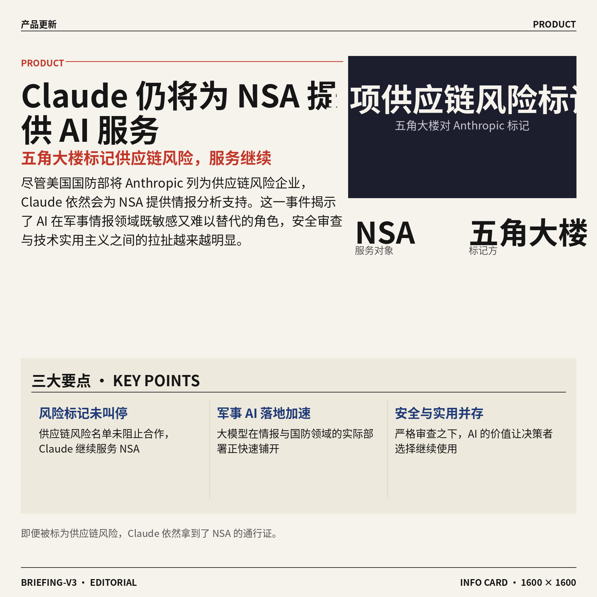

1. **五角大楼标记供应链风险，Anthropic 或仍将向美国国家安全局（NSA）提供 Claude 服务。**  
据外媒报道，尽管 **五角大楼**（美国国防部）已将 Anthropic 列为一项 **供应链风险**，该公司仍可能继续向 **NSA（美国国家安全局，负责全球信号情报与信息保障）** 提供 Claude 大模型服务 🚀。这一事件凸显出 AI 技术在军事与情报领域的部署正面临越来越严苛的安全审查，也让人看到大模型在敏感场景中的实际落地。 [完整报道(briefing)](https://the-decoder.com/anthropic-may-keep-supplying-claude-to-the-nsa-despite-being-flagged-as-a-supply-chain-risk-by-the-pentagon/)


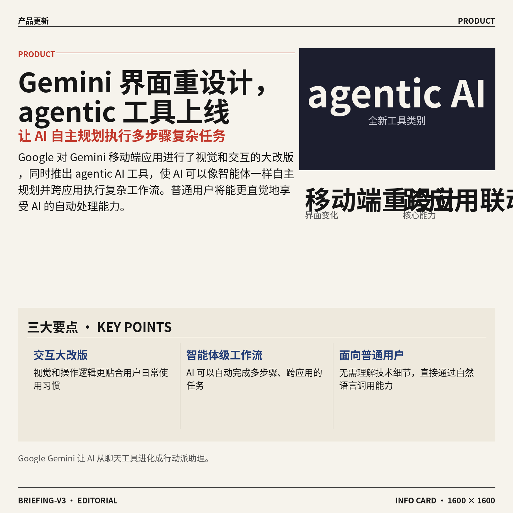

2. **Google 重新设计 Gemini 应用界面，并上线全新 agentic AI（智能体 AI）工具。**  
Google 对 Gemini 移动端应用进行了视觉与交互的大幅重设计，同步推出了多项 **agentic AI 工具**——这类工具让 AI 像“智能体”一样自主规划、执行多步骤操作，例如跨应用联动或自动处理复杂工作流 💡。普通用户无需理解技术细节，就能在日常任务中更直观地调用 AI 能力，进一步提升工作效率。 [详细报道(briefing)](https://news.google.com/rss/articles/CBMilwNBVV95cUxObXB5REtGcHkwQUxzSnhEQXBobFBlZm1UNjduVWtVbEFDcDdNTURsME91WG9oQ0ZrQkM3ZTRRZC1qWnhleEdmOUxib0hqNDVFQ1FFZ1NoMXNlSUE3V3ZZVF91LXpCaGhJRElwcTJoMnpDLTY0emoyUDdEUjN5Y3ZXdU4yWm5nYVAxeVdabVBaOFNuMGd5a3lsY0k5MmhhczlxMWFCdGZGdWkzLVNhZ3NqUThfQmpsaE5FQ0dvZWFCZlN4LTJLT1FXNU5sNHhrNVhWZzFaQ094ZEZydy1SLWliNEV0WmVfWDY3RTZJRUJ1UHloUWVlNkdoeFFGODBXRHVJd3lZUklIYkdYZktiNThWUklUclBHV3BnTTlkc2dKOWFRUUZyU3ZUT2l5VzBlQTJCUDRJLTItekN4N3E5VkVaVXJVWDlsOW9QX21nVFBXWDNDMTd3UGV4cHJFazJKMzhPUExaWU5YcVNMUVBqdGdKdkRsaUVVdDVicFVTeUNiSFVCMVR5RmJ4S3JVOENaNGFxOTJEMXZYSQ?oc=5)


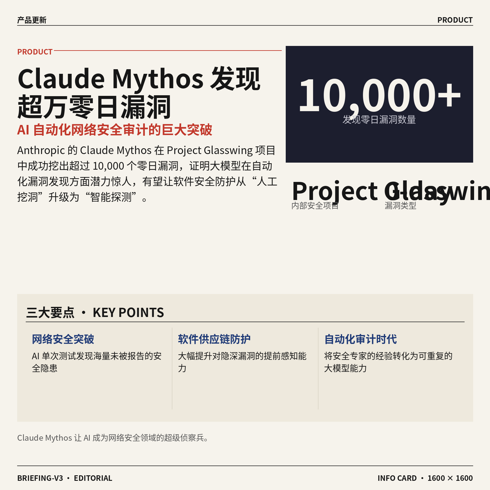

3. **Anthropic 的 Claude Mythos 预览版在 Project Glasswing（安全漏洞挖掘项目）中发现超万个零日漏洞（0-day）。**  
Anthropic 推出的 **Claude Mythos 预览版**（聚焦网络安全研究的大模型版本）在一个名为 **Project Glasswing** 的内部安全测试项目中，成功挖掘出超过 **10,000 个零日漏洞（0-day，指软件里尚未被开发者发现或修补的安全隐患）** 🛡️。这一成果展示了 AI 在自动化漏洞发现与网络安全审计方面的惊人潜力，有望大幅提升软件供应链的防护能力，让安全检查从“人工挖洞”走向“智能探测”。 [网络安全报道(briefing)](https://news.google.com/rss/articles/CBMiekFVX3lxTFBjUVdaQVljUGlPZVdnR0JQNkMtaVZhUW5Idm82Wm5pMGV5ekZnVE5rX21vUWVoQ2xrazdZRmpFMjlqT1VZb0tRV2UteWJNWXVYRXBjN1Jhei1oaTgxRVNUWS1Td3B5YVhiNnhFbmRKUHNkYnRKdkotQWlR0gF_QVVfeXFMTU1RcUJYa2RuMGh0dER4SEUtYnBqbWxwd3IydXN4LVVlS0RnVS1NdzhZT01RSTFUOC10bDVJVC1Fb2N3WXpXSGJ1UHlpNlJwSkxtejJkWkNyWE5KOTQxSmZGUDVkeURDYWhMb01zLW5NVTQzUXFOME5ST3Rod0I2MA?oc=5)


### 🟢 前沿研究

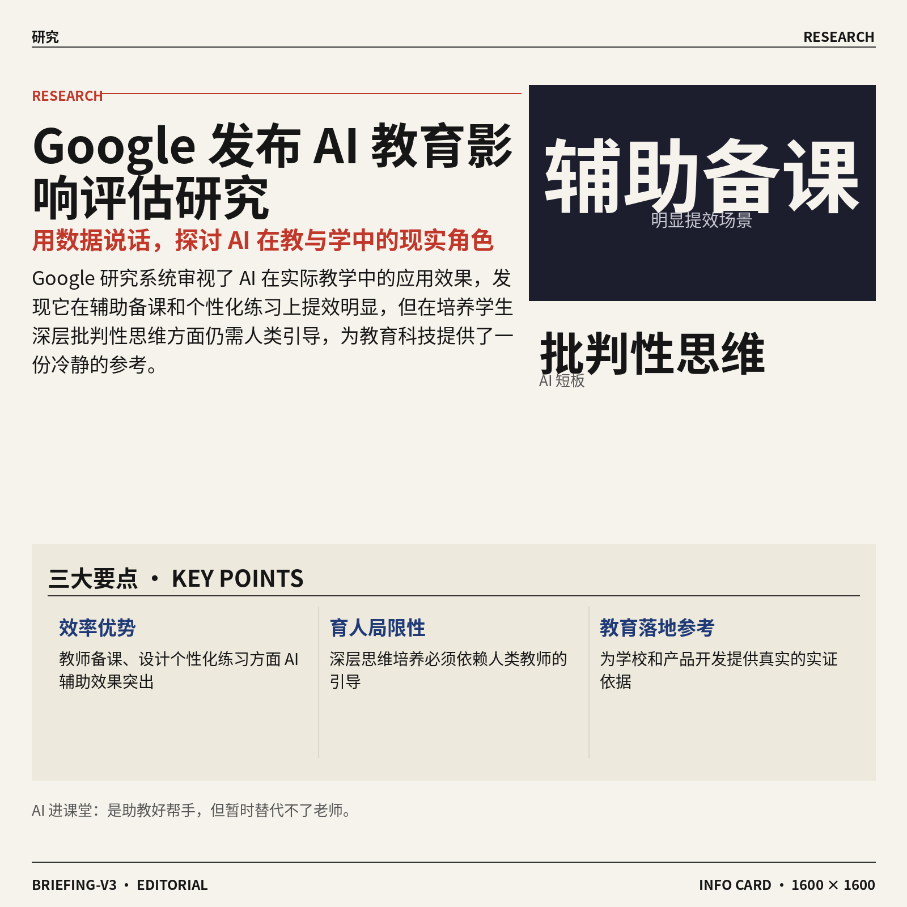

1. **Google 发布教育领域 AI 影响评估研究，探讨教与学的真实现状。**
Google 的最新研究系统性地审视了 **AI 在教学与学习中的实际影响** 📚，不再只谈潜力，而是用数据和实例说话。研究发现，AI 在辅助教师备课、设计个性化练习方面展现出效率优势，但在培养学生深层批判性思维上仍需人类引导 💡。这份 **[来自 Google 的完整研究报告(briefing)](https://news.google.com/rss/articles/CBMitAFBVV95cUxQN2RpX1NfejFPRExSaExvNElQb0dhUXJELWFpTG02d29jRm5jODRUcUFrSTRIUElVLS1FanUzaVFzRTE1SDhVSHdsQTFyUFlOV3pVQkpRRmhmbWZ5cGFCc3dBejktQUU2WVU5ZkIxVVhmSUpiM1QtRmotLXNFNVRwbWpJRXpEbnlMS1AxMXUtdjFPanlYOXBOOGpyM2tkcDFPdXBsekJ0NkNOVzUwdVR6aUNyVmE?oc=5)** 为教育工作者和产品经理提供了很好的参考——AI 更像是“助教”而非“替代者”，有效交互的关键在于如何设计人机协作的流程。

![Google 发布教育领域 AI 影响评估研究，探讨教与学的真实现状](https://image.pollinations.ai/prompt/Google%20%E5%8F%91%E5%B8%83%E6%95%99%E8%82%B2%E9%A2%86%E5%9F%9F%20AI%20%E5%BD%B1%E5%93%8D%E8%AF%84%E4%BC%B0%E7%A0%94%E7%A9%B6%EF%BC%8C%E6%8E%A2%E8%AE%A8%E6%95%99%E4%B8%8E%E5%AD%A6%E7%9A%84%E7%9C%9F%E5%AE%9E%E7%8E%B0%E7%8A%B6.%20Google%20%E5%8F%91%E5%B8%83%E6%95%99%E8%82%B2%E9%A2%86%E5%9F%9F%20AI%20%E5%BD%B1%E5%93%8D%E8%AF%84%E4%BC%B0%E7%A0%94%E7%A9%B6%EF%BC%8C%E6%8E%A2%E8%AE%A8%E6%95%99%E4%B8%8E%E5%AD%A6%E7%9A%84%E7%9C%9F%E5%AE%9E%E7%8E%B0%E7%8A%B6%E3%80%82%20Google%20%E7%9A%84%E6%9C%80%E6%96%B0%E7%A0%94%E7%A9%B6%E7%B3%BB%E7%BB%9F%E6%80%A7%E5%9C%B0%E5%AE%A1%E8%A7%86%E4%BA%86%20AI%20%E5%9C%A8%E6%95%99%E5%AD%A6%E4%B8%8E%E5%AD%A6%E4%B9%A0%E4%B8%AD%E7%9A%84%E5%AE%9E%E9%99%85%E5%BD%B1%E5%93%8D%20%F0%9F%93%9A%EF%BC%8C%E4%B8%8D%E5%86%8D%E5%8F%AA%E8%B0%88%E6%BD%9C%E5%8A%9B%2C%20technical%20infographic%20diagram%2C%20architecture%20flowchart%2C%20clean%20vector%20illustration%2C%20educational%20style%2C%20no%20text%20overlay%2C%20modern%20minimal%2C%20wide%20aspect?width=1200&height=675&nologo=true&seed=10807)

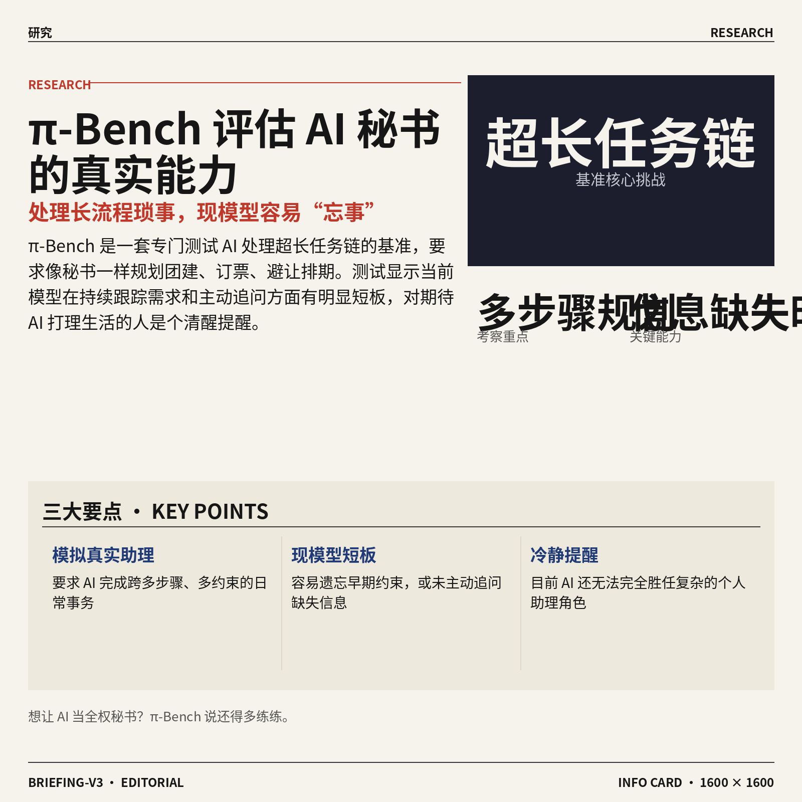

2. **π-Bench（一套评估 AI 能否当个好秘书的基准测试）上线，考验处理长流程琐事的能力。**
“帮我规划下季度的团建，顺便订好机票酒店，记得避开所有人的会议时间”——像这样跨越多个步骤的长周期任务，现在的 **AI 个人助理 Agent** 能干好吗？π-Bench 正是为此设计的严格考场，专门评估 AI 在规划和执行**超长任务链**时的主动性 🧠。它不只看最终结果对不对，更要审视中间每一步决策是否遗漏、能否在信息不全时主动追问。结果表明，当前模型在持续跟踪需求、避免“忘事”上仍有明显短板，这对期待用 AI 打理行程和行政事务的朋友来说是个冷静的提醒。详情查阅 **[π-Bench 论文(briefing)](https://huggingface.co/papers/2605.14678)**。

![π-Bench（一套评估 AI 能否当个好秘书的基准测试）上线，考验处理长流程琐事的能力](https://image.pollinations.ai/prompt/%CF%80-Bench%EF%BC%88%E4%B8%80%E5%A5%97%E8%AF%84%E4%BC%B0%20AI%20%E8%83%BD%E5%90%A6%E5%BD%93%E4%B8%AA%E5%A5%BD%E7%A7%98%E4%B9%A6%E7%9A%84%E5%9F%BA%E5%87%86%E6%B5%8B%E8%AF%95%EF%BC%89%E4%B8%8A%E7%BA%BF%EF%BC%8C%E8%80%83%E9%AA%8C%E5%A4%84%E7%90%86%E9%95%BF%E6%B5%81%E7%A8%8B%E7%90%90%E4%BA%8B%E7%9A%84%E8%83%BD%E5%8A%9B.%20%CF%80-Bench%EF%BC%88%E4%B8%80%E5%A5%97%E8%AF%84%E4%BC%B0%20AI%20%E8%83%BD%E5%90%A6%E5%BD%93%E4%B8%AA%E5%A5%BD%E7%A7%98%E4%B9%A6%E7%9A%84%E5%9F%BA%E5%87%86%E6%B5%8B%E8%AF%95%EF%BC%89%E4%B8%8A%E7%BA%BF%EF%BC%8C%E8%80%83%E9%AA%8C%E5%A4%84%E7%90%86%E9%95%BF%E6%B5%81%E7%A8%8B%E7%90%90%E4%BA%8B%E7%9A%84%E8%83%BD%E5%8A%9B%E3%80%82%20%E2%80%9C%E5%B8%AE%E6%88%91%E8%A7%84%E5%88%92%E4%B8%8B%E5%AD%A3%E5%BA%A6%E7%9A%84%E5%9B%A2%E5%BB%BA%EF%BC%8C%E9%A1%BA%E4%BE%BF%E8%AE%A2%E5%A5%BD%E6%9C%BA%E7%A5%A8%E9%85%92%E5%BA%97%EF%BC%8C%E8%AE%B0%E5%BE%97%E9%81%BF%E5%BC%80%E6%89%80%E6%9C%89%E4%BA%BA%E7%9A%84%E4%BC%9A%E8%AE%AE%E6%97%B6%E9%97%B4%E2%80%9D%2C%20technical%20infographic%20diagram%2C%20architecture%20flowchart%2C%20clean%20vector%20illustration%2C%20educational%20style%2C%20no%20text%20overlay%2C%20modern%20minimal%2C%20wide%20aspect?width=1200&height=675&nologo=true&seed=10838)

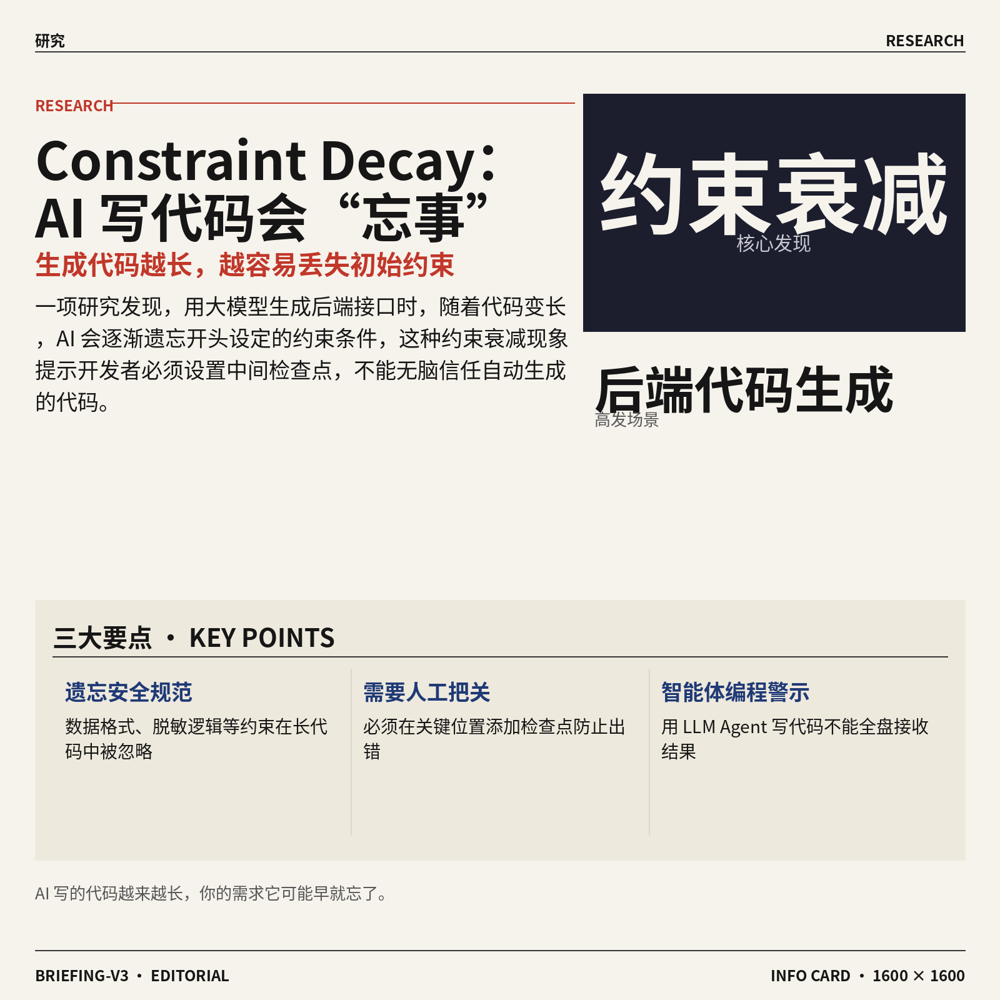

3. **Constraint Decay（约束衰减现象）揭示：AI 写后端代码时会慢慢“忘掉”需求。**
开发者总爱用大模型自动生成后端接口，但一项新研究发现了一个坑：随着生成的代码变长，AI 会逐渐 **“遗忘”** 开头设定的**约束条件**（比如特定的数据格式、安全校验逻辑），这就是所谓的 **Constraint Decay（约束衰减）** ⚠️。打个比方，就像你让实习生写一份长报告，写到后面他可能已经忘了你一开始要求的数据脱敏规范 🗂️。这篇论文提醒我们，在利用 **LLM Agent（大模型智能体，能自主规划并执行编程任务）** 辅助开发时，必须加强中间检查点的设置，不能无脑全盘接受。深入细节可见 **[arXiv 论文(briefing)](https://arxiv.org/abs/2605.06445)**。

![Constraint Decay（约束衰减现象）揭示：AI 写后端代码时会慢慢“忘掉”需求](https://image.pollinations.ai/prompt/Constraint%20Decay%EF%BC%88%E7%BA%A6%E6%9D%9F%E8%A1%B0%E5%87%8F%E7%8E%B0%E8%B1%A1%EF%BC%89%E6%8F%AD%E7%A4%BA%EF%BC%9AAI%20%E5%86%99%E5%90%8E%E7%AB%AF%E4%BB%A3%E7%A0%81%E6%97%B6%E4%BC%9A%E6%85%A2%E6%85%A2%E2%80%9C%E5%BF%98%E6%8E%89%E2%80%9D%E9%9C%80%E6%B1%82.%20Constraint%20Decay%EF%BC%88%E7%BA%A6%E6%9D%9F%E8%A1%B0%E5%87%8F%E7%8E%B0%E8%B1%A1%EF%BC%89%E6%8F%AD%E7%A4%BA%EF%BC%9AAI%20%E5%86%99%E5%90%8E%E7%AB%AF%E4%BB%A3%E7%A0%81%E6%97%B6%E4%BC%9A%E6%85%A2%E6%85%A2%E2%80%9C%E5%BF%98%E6%8E%89%E2%80%9D%E9%9C%80%E6%B1%82%E3%80%82%20%E5%BC%80%E5%8F%91%E8%80%85%E6%80%BB%E7%88%B1%E7%94%A8%E5%A4%A7%E6%A8%A1%E5%9E%8B%E8%87%AA%E5%8A%A8%E7%94%9F%E6%88%90%E5%90%8E%E7%AB%AF%E6%8E%A5%E5%8F%A3%EF%BC%8C%E4%BD%86%E4%B8%80%E9%A1%B9%E6%96%B0%E7%A0%94%E7%A9%B6%E5%8F%91%E7%8E%B0%E4%BA%86%E4%B8%80%E4%B8%AA%E5%9D%91%EF%BC%9A%E9%9A%8F%E7%9D%80%2C%20technical%20infographic%20diagram%2C%20architecture%20flowchart%2C%20clean%20vector%20illustration%2C%20educational%20style%2C%20no%20text%20overlay%2C%20modern%20minimal%2C%20wide%20aspect?width=1200&height=675&nologo=true&seed=10869)

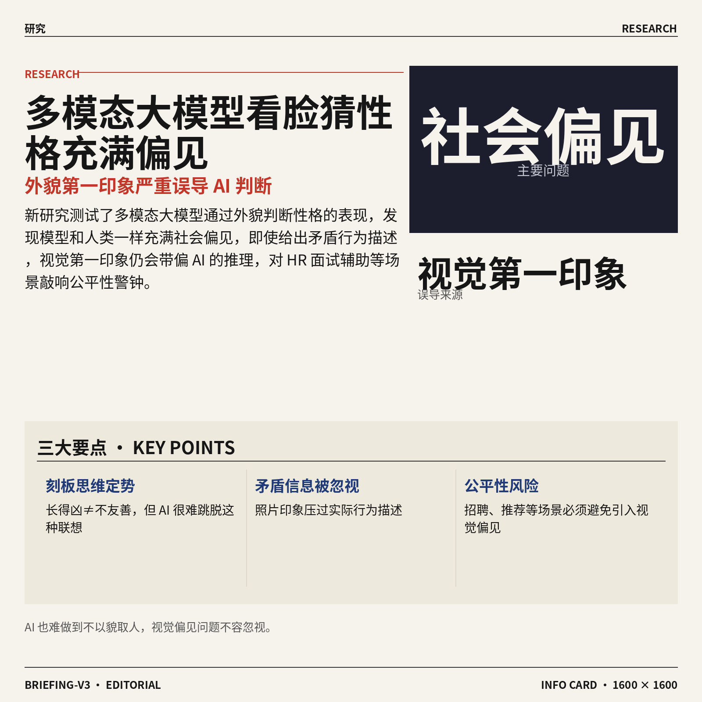

4. **Perception or Prejudice（感知还是偏见）：多模态大模型看人“第一印象”靠谱吗？**
我们常说不要以貌取人，那 **AI 能不能通过外貌分析超越第一印象，准确判断性格呢**？一篇新论文测试了 **MLLM（多模态大模型，能同时看懂图片和文字）** 在看脸猜性格时的表现，发现模型充满了与人类相似的**社会偏见**，很难跳脱出“长得凶=不友善”这种刻板思维定势 👀。即使给出矛盾的行为描述，AI 也常被照片的第一印象“带跑偏”。这意味着在 HR 面试辅助、社交推荐等应用场景中，必须警惕引入视觉因素带来的**公平性风险**。点击 **[完整研究(briefing)](https://huggingface.co/papers/2605.22109)** 了解更多。

![Perception or Prejudice（感知还是偏见）：多模态大模型看人“第一印象”靠谱吗？](https://image.pollinations.ai/prompt/Perception%20or%20Prejudice%EF%BC%88%E6%84%9F%E7%9F%A5%E8%BF%98%E6%98%AF%E5%81%8F%E8%A7%81%EF%BC%89%EF%BC%9A%E5%A4%9A%E6%A8%A1%E6%80%81%E5%A4%A7%E6%A8%A1%E5%9E%8B%E7%9C%8B%E4%BA%BA%E2%80%9C%E7%AC%AC%E4%B8%80%E5%8D%B0%E8%B1%A1%E2%80%9D%E9%9D%A0%E8%B0%B1%E5%90%97%EF%BC%9F.%20Perception%20or%20Prejudice%EF%BC%88%E6%84%9F%E7%9F%A5%E8%BF%98%E6%98%AF%E5%81%8F%E8%A7%81%EF%BC%89%EF%BC%9A%E5%A4%9A%E6%A8%A1%E6%80%81%E5%A4%A7%E6%A8%A1%E5%9E%8B%E7%9C%8B%E4%BA%BA%E2%80%9C%E7%AC%AC%E4%B8%80%E5%8D%B0%E8%B1%A1%E2%80%9D%E9%9D%A0%E8%B0%B1%E5%90%97%EF%BC%9F%20%E6%88%91%E4%BB%AC%E5%B8%B8%E8%AF%B4%E4%B8%8D%E8%A6%81%E4%BB%A5%E8%B2%8C%E5%8F%96%E4%BA%BA%EF%BC%8C%E9%82%A3%20AI%20%E8%83%BD%E4%B8%8D%E8%83%BD%E9%80%9A%E8%BF%87%E5%A4%96%E8%B2%8C%E5%88%86%E6%9E%90%E8%B6%85%E8%B6%8A%E7%AC%AC%E4%B8%80%2C%20technical%20infographic%20diagram%2C%20architecture%20flowchart%2C%20clean%20vector%20illustration%2C%20educational%20style%2C%20no%20text%20overlay%2C%20modern%20minimal%2C%20wide%20aspect?width=1200&height=675&nologo=true&seed=10900)

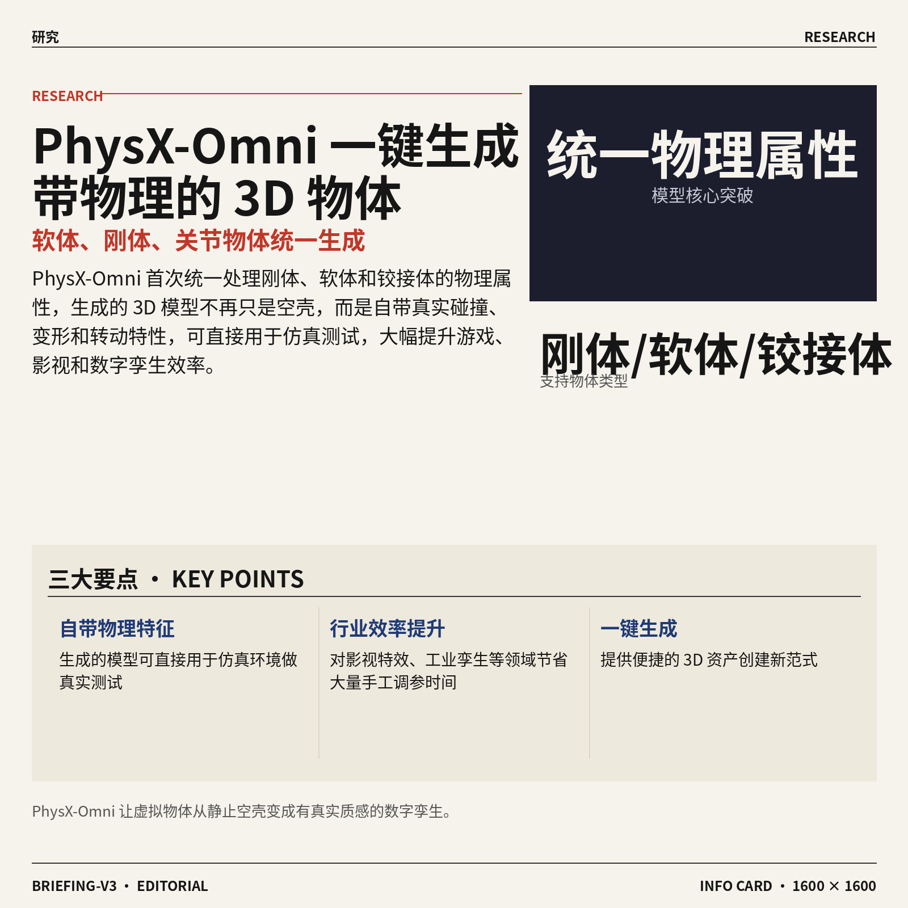

5. **PhysX-Omni（统一物理属性 3D 生成模型）来了：一键生成能跑会动的虚拟物体。**
想给游戏或电影快速造出软皮球、硬桌椅、能开门的人形机器人？**PhysX-Omni** 这个新模型能搞定 🕹️。它首次统一处理了**刚体（硬邦邦的物体）**、**软体（一捏就变形）** 和**铰接体（有关节能转动的物体，像剪刀、机械臂）** 的物理属性，让生成出来的 3D 模型不再只是静止的“空壳”，而是自带真实物理特征，能直接扔进仿真环境做测试。这对影视特效、工业数字孪生等行业的效率提升是巨大的。查阅 **[PhysX-Omni 论文(briefing)](https://huggingface.co/papers/2605.21572)**。

![PhysX-Omni（统一物理属性 3D 生成模型）来了：一键生成能跑会动的虚拟物体](https://image.pollinations.ai/prompt/PhysX-Omni%EF%BC%88%E7%BB%9F%E4%B8%80%E7%89%A9%E7%90%86%E5%B1%9E%E6%80%A7%203D%20%E7%94%9F%E6%88%90%E6%A8%A1%E5%9E%8B%EF%BC%89%E6%9D%A5%E4%BA%86%EF%BC%9A%E4%B8%80%E9%94%AE%E7%94%9F%E6%88%90%E8%83%BD%E8%B7%91%E4%BC%9A%E5%8A%A8%E7%9A%84%E8%99%9A%E6%8B%9F%E7%89%A9%E4%BD%93.%20PhysX-Omni%EF%BC%88%E7%BB%9F%E4%B8%80%E7%89%A9%E7%90%86%E5%B1%9E%E6%80%A7%203D%20%E7%94%9F%E6%88%90%E6%A8%A1%E5%9E%8B%EF%BC%89%E6%9D%A5%E4%BA%86%EF%BC%9A%E4%B8%80%E9%94%AE%E7%94%9F%E6%88%90%E8%83%BD%E8%B7%91%E4%BC%9A%E5%8A%A8%E7%9A%84%E8%99%9A%E6%8B%9F%E7%89%A9%E4%BD%93%E3%80%82%20%E6%83%B3%E7%BB%99%E6%B8%B8%E6%88%8F%E6%88%96%E7%94%B5%E5%BD%B1%E5%BF%AB%E9%80%9F%E9%80%A0%E5%87%BA%E8%BD%AF%E7%9A%AE%E7%90%83%E3%80%81%E7%A1%AC%E6%A1%8C%E6%A4%85%E3%80%81%E8%83%BD%E5%BC%80%E9%97%A8%E7%9A%84%E4%BA%BA%E5%BD%A2%E6%9C%BA%E5%99%A8%E4%BA%BA%EF%BC%9FPhysX-O%2C%20technical%20infographic%20diagram%2C%20architecture%20flowchart%2C%20clean%20vector%20illustration%2C%20educational%20style%2C%20no%20text%20overlay%2C%20modern%20minimal%2C%20wide%20aspect?width=1200&height=675&nologo=true&seed=10931)

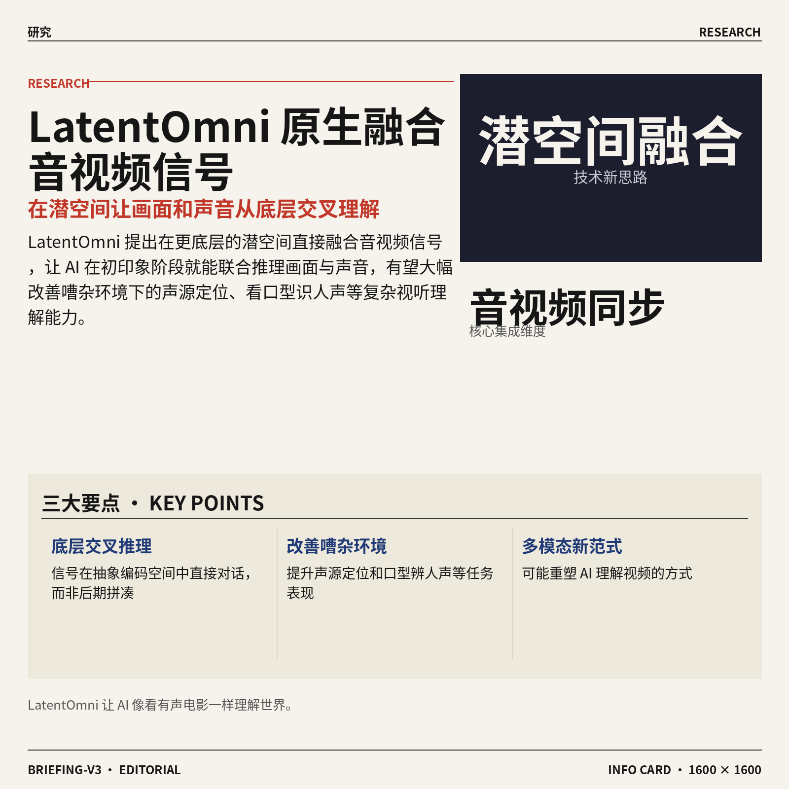

6. **LatentOmni（统一音视频潜空间推理技术）重新思考 AI 多模态理解。**
现在的 AI 通常是分开处理视频里的画面和声音的，就像一边看默片一边听旁白，然后再拼凑理解。**LatentOmni** 提出了一种新思路，尝试在更底层的 **Latent Space（潜空间，AI 压缩高维数据后的抽象编码空间）** 直接融合音视频信号 🎵，让画面和声音从“初印象”阶段就彼此交叉推理。这种原生融合方式有潜力彻底改善 AI 在嘈杂环境中对声源定位、看口型辨人声等复杂视听场景的理解能力。深入资料见 **[LatentOmni 论文(briefing)](https://huggingface.co/papers/2605.22012)**。

![LatentOmni（统一音视频潜空间推理技术）重新思考 AI 多模态理解](https://image.pollinations.ai/prompt/LatentOmni%EF%BC%88%E7%BB%9F%E4%B8%80%E9%9F%B3%E8%A7%86%E9%A2%91%E6%BD%9C%E7%A9%BA%E9%97%B4%E6%8E%A8%E7%90%86%E6%8A%80%E6%9C%AF%EF%BC%89%E9%87%8D%E6%96%B0%E6%80%9D%E8%80%83%20AI%20%E5%A4%9A%E6%A8%A1%E6%80%81%E7%90%86%E8%A7%A3.%20LatentOmni%EF%BC%88%E7%BB%9F%E4%B8%80%E9%9F%B3%E8%A7%86%E9%A2%91%E6%BD%9C%E7%A9%BA%E9%97%B4%E6%8E%A8%E7%90%86%E6%8A%80%E6%9C%AF%EF%BC%89%E9%87%8D%E6%96%B0%E6%80%9D%E8%80%83%20AI%20%E5%A4%9A%E6%A8%A1%E6%80%81%E7%90%86%E8%A7%A3%E3%80%82%20%E7%8E%B0%E5%9C%A8%E7%9A%84%20AI%20%E9%80%9A%E5%B8%B8%E6%98%AF%E5%88%86%E5%BC%80%E5%A4%84%E7%90%86%E8%A7%86%E9%A2%91%E9%87%8C%E7%9A%84%E7%94%BB%E9%9D%A2%E5%92%8C%E5%A3%B0%E9%9F%B3%E7%9A%84%EF%BC%8C%E5%B0%B1%E5%83%8F%E4%B8%80%E8%BE%B9%E7%9C%8B%E9%BB%98%E7%89%87%E4%B8%80%E8%BE%B9%E5%90%AC%E6%97%81%E7%99%BD%EF%BC%8C%E7%84%B6%E5%90%8E%E5%86%8D%2C%20technical%20infographic%20diagram%2C%20architecture%20flowchart%2C%20clean%20vector%20illustration%2C%20educational%20style%2C%20no%20text%20overlay%2C%20modern%20minimal%2C%20wide%20aspect?width=1200&height=675&nologo=true&seed=10962)

### 🟡 行业展望与社会影响

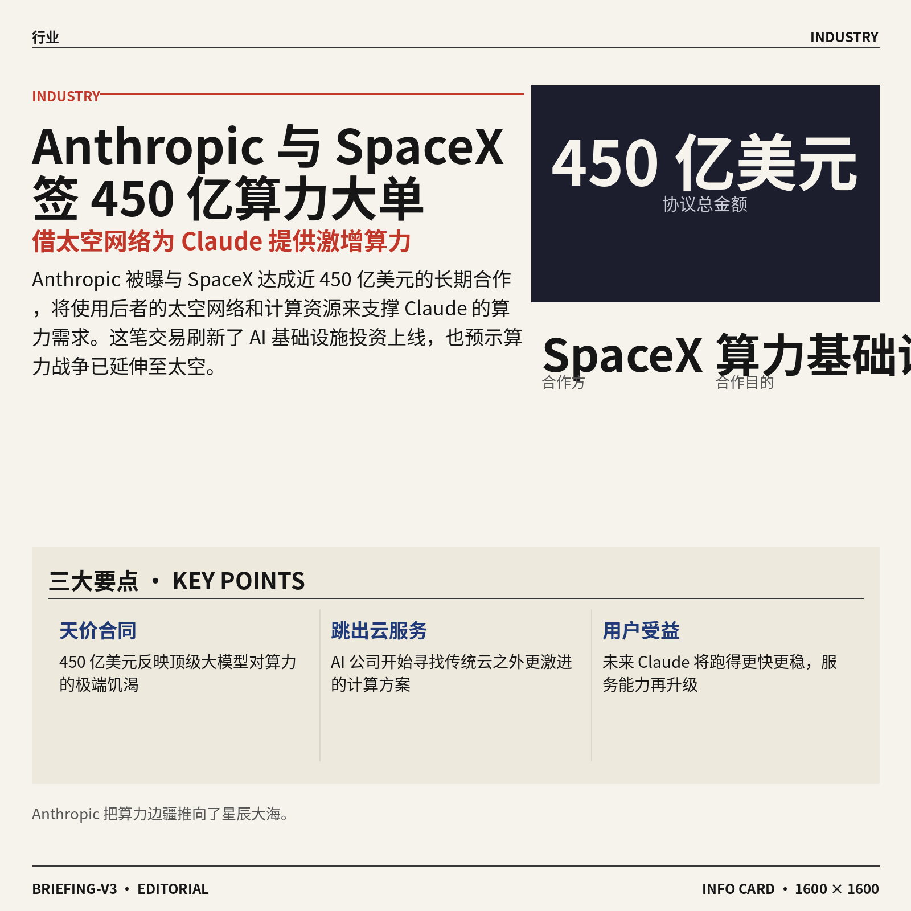

1. **Anthropic 与 SpaceX（马斯克创办的太空探索公司）达成近 450 亿美元算力协议，助阵 Claude AI 狂奔 🚀**
这可能是今年 AI 圈最惊人的一笔基础设施交易——Anthropic 被曝与 SpaceX 签下近 **450 亿美元** 的长期合作，将借助后者的太空网络和计算资源来为 Claude 提供源源不断的算力 💸 这份天价合同不仅反映出顶尖大模型对算力的饥渴程度，也说明 AI 公司已经开始跳出传统云服务商的框架，寻找更激进的供电和计算方案。对普通用户来说，这意味着未来的 Claude 可能会跑得更快、更稳，而整个行业也在用真金白银重新定义“基础设施”的上限。[Pulse 2.0 详细报道(briefing)](https://news.google.com/rss/articles/CBMimAFBVV95cUxQU0d6OVdCam1tYUtTZGhDQVI0eWpySGZCdHktdE5xWVdmYjZ2cTNSMGVVY0F1WTNXV0J0bldOc0N3N0k3SEZBYjhBN3FKRmNLNElEdEpzaGJjOFdfMTNucTd5RGxMM25TMExBWHJwQno5LTJaVUlReU1HMnpBbTU2aGlkYXJ3cENBd0VFT1hZMHpGc3BEZFRqU9IBngFBVV95cUxPa25XM0lfUmdwWnljU3JHZW9sNnZac1JoeFFhbEU5X2pCQWJiWGxzZU1BbWtqaWdIUzFlb3d4dVg0d1VFUzM0QnBEOFNxbXhL


### 🟣 开源TOP项目

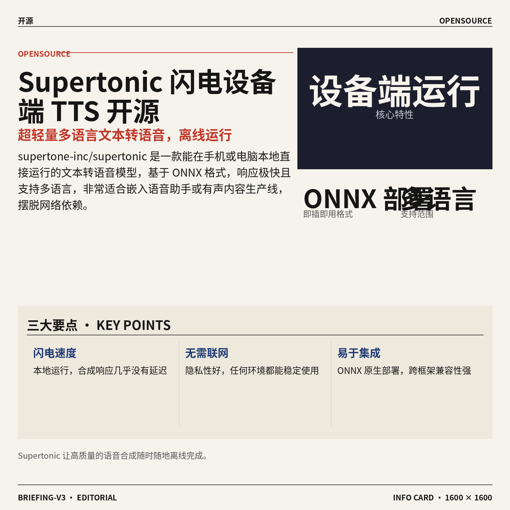

1. **supertone-inc/supertonic（一款闪电般快速的设备端多语言 TTS 模型）开源。**
这个超轻量的**文本转语音**（TTS，把文字变成自然语音的技术）工具直接跑在手机或电脑本地，无需联网就能合成多种语言的语音 🎙️。它基于 **ONNX**（开放神经网络交换格式，能让模型在不同 AI 框架之间“即插即用”）实现原生部署，响应飞快，非常适合嵌入到语音助手或有声内容生产线里。[GitHub 仓库(briefing)](https://github.com/supertone-inc/supertonic)


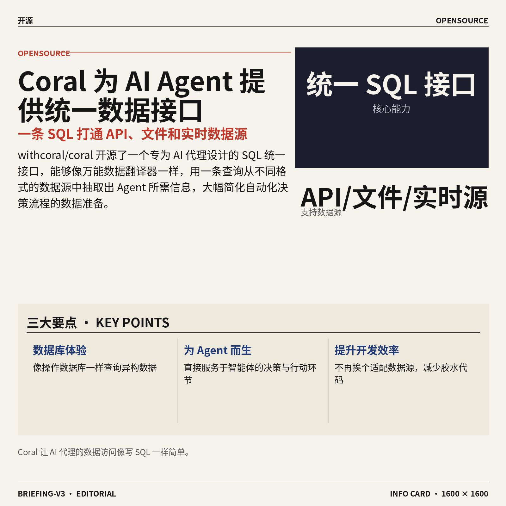

2. **withcoral/coral（为 AI Agent 打造的 SQL 统一数据接口）开源。**
只要写一条 **SQL**（结构化查询语言，常用于数据库查询），就能同时从 API、本地文件和实时数据源里捞出 Agent 需要的信息，就像给智能体装上一个“万能数据翻译器” 💡。它专门为 AI 代理设计，让决策流程无需再挨个翻找不同格式的数据，对做自动化运营或数据分析的团队非常友好。[GitHub 仓库(briefing)](https://github.com/withcoral/coral)


3. **MinishLab/semble（帮 AI Agent 高效搜代码的“省 token”利器）来了。**
传统的 **grep+read**（用命令行搜索文本再读取内容）会吃掉大量 **token**（AI 处理文本时的计费单位），而这个工具能让 Agent 在代码库里搜索时，消耗的 token 数直接砍掉 98% ⚡。对于用 AI 做代码审计或辅助开发的团队，这意味着同样的预算可以做更多轮搜索，成本大幅下降。[GitHub 仓库(briefing)](https://github.com/MinishLab/semble)


4. **decolua/9router（免费接入多厂大模型的 AI 编程路由器）彻底告别额度焦虑。**
这款路由器可以把 **Claude Code**（Anthropic 的 AI 编程助手）、**Codex**（OpenAI 的代码生成模型）、**Cursor**（集成 AI 的代码编辑器）、**Cline**（终端 AI 编程代理）、**GitHub Copilot** 等主流编程工具，一键连接到 Claude、GPT、Gemini 等 40 多家供应商的免费模型上 🌐。它还自带自动切换备用和 token 节省优化，号称永无使用上限，简直是个人开发者和刷题党的快乐源泉。[GitHub 仓库(briefing)](https://github.com/decolua/9router)


5. **can1357/oh-my-pi（终端里的全能 AI 编程代理）酷炫登场。**
这是个跑在命令行里的 AI 编程搭子，不仅能用**哈希锚定编辑**精准定位代码改动位置，还集成了 **LSP**（语言服务器协议，给编辑器提供自动补全和错误检查）、Python 运行环境、浏览器操作和子代理调度 🛠️。就像把一整套开发工具箱塞进了终端，写代码、跑测试、查文档都能靠它一条龙搞定。[GitHub 仓库(briefing)](https://github.com/can1357/oh-my-pi)


6. **Anthropic 开源金融领域 AI 示例，加速行业智能落地。**
虽然没有透露具体细节，但 **Anthropic 开源了 under `anthropics/financial-services` 的代码**，据信包含合规检查、风险评估等金融场景的 AI 应用模板 🏦。这意味着银行、保险等机构的开发者可以直接在这些示例上微调自己的 AI 助手，让金融智能化从“填空题”变成“选择题”。[GitHub 仓库(briefing)](https://github.com/anthropics/financial-services)


### 🔴 社媒分享

1. **Armin Ronacher（Flask 框架原作者）发帖吐槽：AI 让开源项目的问题反馈失了“人味儿”。**  
   知名开发者 Armin 最近发帖指出，越来越多的人用 AI 工具来撰写 **issue（项目问题反馈单）**，结果报上来的内容看似完整规范，却完全丢失了使用者自己的语气和真实观察细节 🤖。他把这种现象称作“最令人沮丧的故障”，真实遇到的问题被丢进 AI 里一顿生成，最终产出的报告倒像是机器的空转，而不像人和人在对话。[Simon Willison 分享(briefing)](https://simonwillison.net/2026/May/24/armin-ronacher/#atom-everything) [Armin 原帖(briefing)](https://lucumr.pocoo.org/2026/5/24/pi-oss/)


2. **DeepSeek 推出 Reasonix（DeepSeek 原生编码 Agent），高缓存低费用。**  
   社区发现 DeepSeek 悄悄上线了 Reasonix，一个专为写代码打造的 **AI Agent（可自动生成和修改代码的智能助手）**，最亮眼的是它通过 **高缓存机制（把重复用到的计算结果临时存起来下次直接复用）** 大幅削减了 API 调用成本 💰。同时 DeepSeek 还把 V4 Pro 模型的价格折扣永久固定下来，这下子开发者能以更低的费用长期调用。[Reasonix 介绍页(briefing)](https://esengine.github.io/DeepSeek-Reasonix/) [社区讨论详情(briefing)](https://news.ycombinator.com/item?id=48237663)


3. **AI 芯片成本大洗牌：内存占比已逼近三分之二。**  
   根据 Epoch AI 发布的数据，高性能 AI 芯片的物料成本结构正在悄然颠覆——**HBM（高带宽内存，为 GPU 专门定制的一种超高速堆叠显存）** 的价格一路猛涨，如今已经吃掉整颗芯片近三分之二的制造成本 📈。简单说，现在买一块训练大模型的昂贵显卡，超过一半的钱其实是花在了内存上，背后正是大模型对海量数据吞吐近乎疯狂的胃口。[Epoch AI 数据洞察(briefing)](https://epoch.ai/data-insights/ai-chip-component-cost-shares)


---

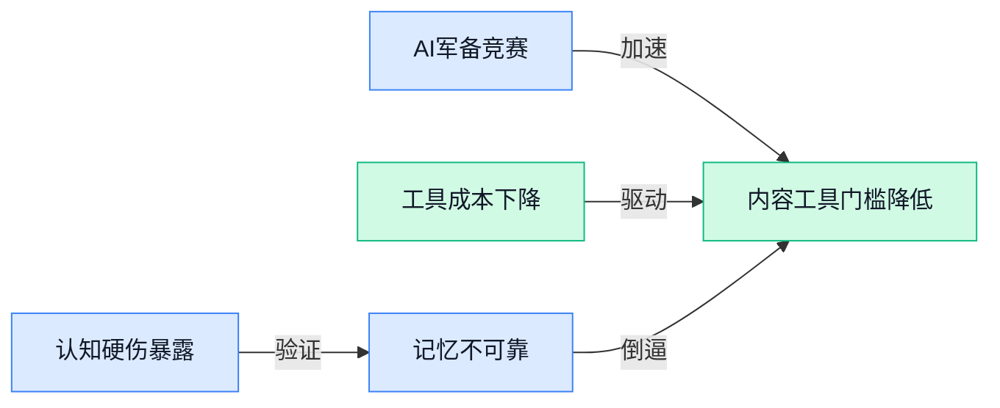
```mermaid
graph LR
    A[AI军备竞赛]
    B[认知硬伤暴露]
    C[工具成本下降]
    D[内容工具门槛降低]
    E[记忆不可靠]

    A -->|加速| D
    B -->|验证| E
    C -->|驱动| D
    E -->|倒逼| D

    classDef blue fill:#dbeafe,stroke:#3b82f6,color:#111827
    classDef green fill:#d1fae5,stroke:#10b981,color:#111827
    class A,B,E blue
    class C,D green
```

### 📊 行业洞察（今日 4 条）

1. Anthropic一边被五角大楼标记为供应链风险，一边仍向美国国家安全局输出Claude；同时Claude Mythos又挖出超万个零日漏洞
  【洞察】安全争议和防御能力的双重叙事其实服务于同一个逻辑：AI公司正在全面渗透国防与安防市场

2. Google教育研究发现AI更适合当“助教”而非替代者；π-Bench测试又显示AI在做长流程秘书任务时容易“忘事”
  【洞察】两件事共同揭示一个本质问题：AI在需要持续记忆和真实理解的复杂场景中，能力远不如宣传的那么可靠

3. Constraint Decay论文证明AI写后端代码会遗忘约束；Armin吐槽AI生成的问题报告失去人味儿
  【洞察】AI生成内容缺乏真实上下文和理解力，这不是某个模型的问题，而是当前架构在持续专注力上的结构性缺陷

4. AI芯片内存成本占比逼近三分之二；DeepSeek把V4 Pro模型75%折扣永久固定
  【洞察】模型调用价格看似持续下降，但硬件成本正从计算向内存转移，本质上是“算力饥渴”换了支付对象，行业总成本并未降低

### 💭 对我们的启发（今日 3 条）

1. PhysX-Omni能一键生成带物理属性的3D虚拟物体，这说明3D内容创作工具的门槛正在被重新定义。我们短视频剪辑软件应在素材库中提前储备能被AI驱动的轻量3D模板，让带货品牌商能低成本加入动态产品展示。

2. Armin吐槽AI让反馈“失了人味儿”，对我们的产品交互设计是一个警示。当用户提交视频生成需求时，我们的AI助手不应该只是机械套模板，而要保留足够的“策划人痕迹”，让客户感觉到是工具在理解他们的营销场景，而非冷冰冰的输出。

3. semple用更少token做更精准的代码搜索，对我们优化视频素材标签和检索系统有参考价值。剪辑后台的智能搜索功能可以考虑相似的“省算力”策略，帮品牌商在海量镜头里更快找到想要的画面，同时降低云端处理的调用成本。

