## AI资讯日报 2026/5/29

> AI 早报 · 每日早读 · 全网深度聚合

## **今日摘要**

```
```

### 🔵 产品与功能更新

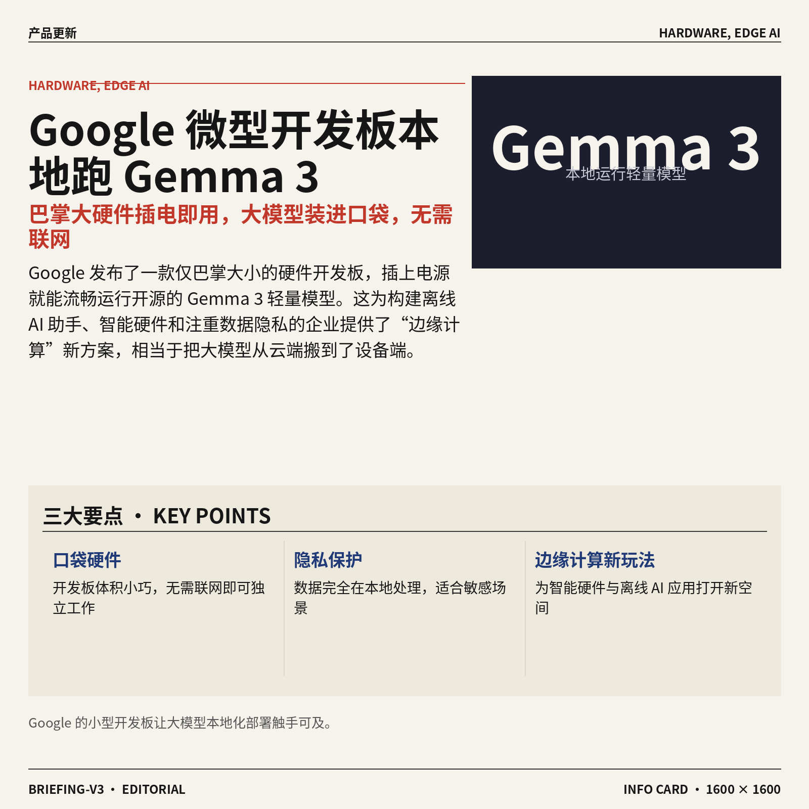

1. **Google 发布能本地运行 Gemma 3（谷歌开源轻量模型）的微型开发板。**
   这款巴掌大的硬件板，插上电就能在本地流畅运行 Gemma 3 模型，无需联网 🌍。对想搭建**离线 AI 助手、智能硬件或需要保护数据隐私**的公司来说，这相当于把大模型“装进口袋”，在**边缘计算（在靠近数据产生的地方直接处理，不依赖云端）**场景里打开了新玩法 💡。[完整报道(briefing)](https://the-decoder.com/google-launches-a-tiny-board-that-runs-gemma-3-locally/)


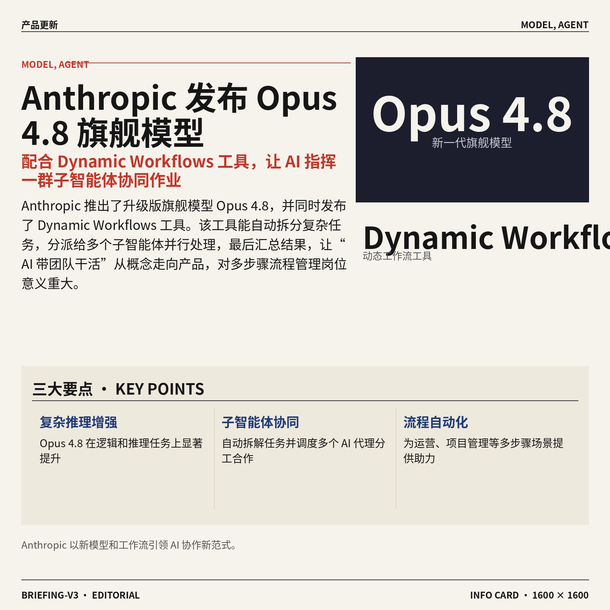

2. **Anthropic 推出 Opus 4.8（最新旗舰大模型），同时发布 Dynamic Workflows（动态工作流）工具。**
   新版 Opus 模型在复杂推理上更进一步，而真正让人眼前一亮的是配套的 **Dynamic Workflows** 🧩。这个工具能像“总指挥”一样，自动把大任务拆解，再分派给一群 **子智能体（sub-agents，能独立干活的 AI 代理）** 协同处理，最后汇总结果。它让“AI 带团队干活”从概念走向了产品，对需要处理多步骤流程的运营、项目管理岗位潜力巨大 🚀。[TechCrunch 报道(briefing)](https://techcrunch.com/2026/05/28/anthropic-releases-opus-4-8-with-new-dynamic-workflow-tool/)


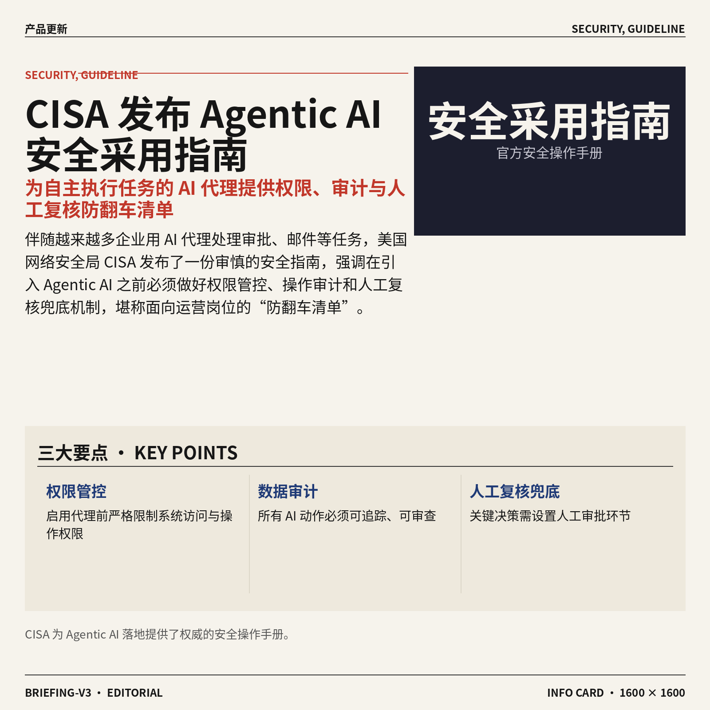

3. **CISA（美国网络安全与基础设施安全局）发布 Agentic AI（能自主执行任务的智能体服务）安全采用指南。**
   随着越来越多的公司开始用 AI 代理处理邮件、安排会议甚至审批流程，CISA 及时敲响警钟 🔔。这份指南提醒企业，在把业务交给 **Agentic AI** 之前，必须先做好**权限管控、数据审计和人工复核兜底机制**。对行政、财务等日常接触自动化的岗位而言，这相当于一份拿来即用的“防翻车清单” 🛡️。[指南原文(briefing)](https://news.google.com/rss/articles/CBMiwgFBVV95cUxOYXlVYUE3cF9BaXA4SGljQlc0YlF2RWRLYjJrU2R2bVhiZmNMOXBVX2dUZmJ6a3lwZ202dTNIR2FrR0pQRTNZc0h5VUVrYTdadnNWWXBvSVVLMmY1REI4OTZ6R3NWTFZBYVVrQWltYUpxdGRZOFluUy05TzRaSXlNSmNsd3pJdXpNRGtxeXA3NXhqUmFnSEk1ZjVIYlZQaDBGbW9oXy1xUjhzRFVYbV9wNFZ6SGU0SE84LVhSLWw0UGdhdw?oc=5)

![CISA（美国网络安全与基础设施安全局）发布 Agentic AI（能自主执行任务的智能体服务）安全采用指南](https://image.pollinations.ai/prompt/CISA%EF%BC%88%E7%BE%8E%E5%9B%BD%E7%BD%91%E7%BB%9C%E5%AE%89%E5%85%A8%E4%B8%8E%E5%9F%BA%E7%A1%80%E8%AE%BE%E6%96%BD%E5%AE%89%E5%85%A8%E5%B1%80%EF%BC%89%E5%8F%91%E5%B8%83%20Agentic%20AI%EF%BC%88%E8%83%BD%E8%87%AA%E4%B8%BB%E6%89%A7%E8%A1%8C%E4%BB%BB%E5%8A%A1%E7%9A%84%E6%99%BA%E8%83%BD%E4%BD%93%E6%9C%8D%E5%8A%A1%EF%BC%89%E5%AE%89%E5%85%A8%E9%87%87%E7%94%A8%E6%8C%87%E5%8D%97.%20CISA%EF%BC%88%E7%BE%8E%E5%9B%BD%E7%BD%91%E7%BB%9C%E5%AE%89%E5%85%A8%E4%B8%8E%E5%9F%BA%E7%A1%80%E8%AE%BE%E6%96%BD%E5%AE%89%E5%85%A8%E5%B1%80%EF%BC%89%E5%8F%91%E5%B8%83%20Agentic%20AI%EF%BC%88%E8%83%BD%E8%87%AA%E4%B8%BB%E6%89%A7%E8%A1%8C%E4%BB%BB%E5%8A%A1%E7%9A%84%E6%99%BA%E8%83%BD%E4%BD%93%E6%9C%8D%E5%8A%A1%EF%BC%89%E5%AE%89%E5%85%A8%E9%87%87%E7%94%A8%E6%8C%87%E5%8D%97%E3%80%82%20%E9%9A%8F%E7%9D%80%E8%B6%8A%E6%9D%A5%E8%B6%8A%E5%A4%9A%E7%9A%84%E5%85%AC%E5%8F%B8%E5%BC%80%E5%A7%8B%E7%94%A8%20AI%20%E4%BB%A3%E7%90%86%E5%A4%84%E7%90%86%E9%82%AE%E4%BB%B6%E3%80%81%E5%AE%89%2C%20technical%20infographic%20diagram%2C%20architecture%20flowchart%2C%20clean%20vector%20illustration%2C%20educational%20style%2C%20no%20text%20overlay%2C%20modern%20minimal%2C%20wide%20aspect?width=1200&height=675&nologo=true&seed=11451)

### 🟢 前沿研究

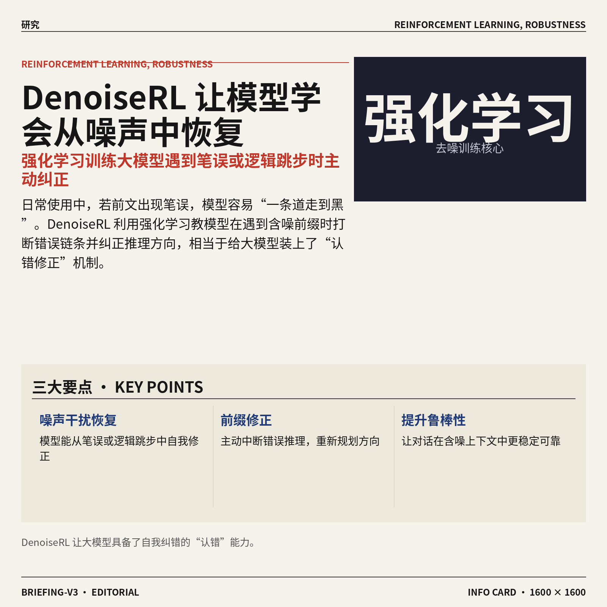

1. **DenoiseRL（去噪强化学习）：让推理模型学会从噪声干扰中恢复。**
日常使用 ChatGPT 时，如果前面的对话出现笔误或逻辑跳步，模型就很容易“一条道走到黑” 🤔。DenoiseRL 这项研究通过 **强化学习（一种像训宠物一样, 通过给奖励让模型在试错中自我进化的训练方法）** , 专门教大模型在遇到含噪、不完美的**前缀（此前的生成内容）** 时, 主动打断错误链条并纠正推理方向 🚀。这好比给模型装了“认错修正”的机制, 即使一开始听岔了, 后面也能自己圆回来。[HuggingFace 论文页(briefing)](https://huggingface.co/papers/2605.28421)


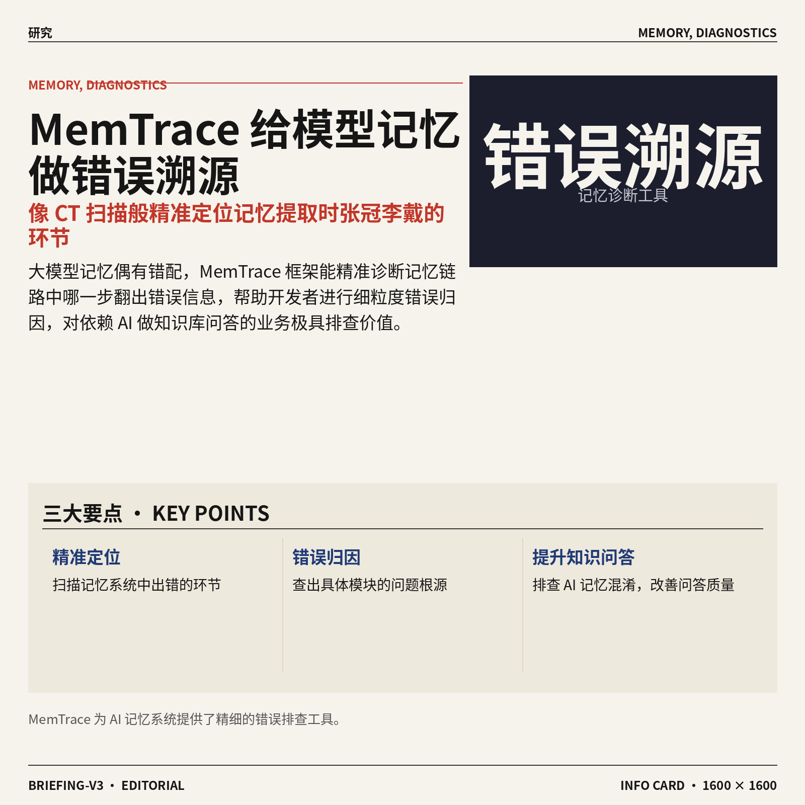

2. **MemTrace（记忆追踪）：给大模型的记忆系统做“错误溯源”。**
大模型虽然记东西快, 但它偶尔也会在提取记忆时张冠李戴。MemTrace 框架做了一件很细腻的活：它像 CT 扫描一样, 能精准定位模型在 **记忆环节（指模型存储和检索过往信息的内部机制）** 中, 究竟是哪一步翻出了错误的信息 🏥。对于希望利用 AI 做知识库问答或长期记忆助手的业务来说, 有了这套 **错误归因（查清具体是哪个模块的锅）** 工具, 排查问题的效率将大幅提升。[HuggingFace 论文页(briefing)](https://huggingface.co/papers/2605.28732)

![MemTrace（记忆追踪）：给大模型的记忆系统做“错误溯源”](https://image.pollinations.ai/prompt/MemTrace%EF%BC%88%E8%AE%B0%E5%BF%86%E8%BF%BD%E8%B8%AA%EF%BC%89%EF%BC%9A%E7%BB%99%E5%A4%A7%E6%A8%A1%E5%9E%8B%E7%9A%84%E8%AE%B0%E5%BF%86%E7%B3%BB%E7%BB%9F%E5%81%9A%E2%80%9C%E9%94%99%E8%AF%AF%E6%BA%AF%E6%BA%90%E2%80%9D.%20MemTrace%EF%BC%88%E8%AE%B0%E5%BF%86%E8%BF%BD%E8%B8%AA%EF%BC%89%EF%BC%9A%E7%BB%99%E5%A4%A7%E6%A8%A1%E5%9E%8B%E7%9A%84%E8%AE%B0%E5%BF%86%E7%B3%BB%E7%BB%9F%E5%81%9A%E2%80%9C%E9%94%99%E8%AF%AF%E6%BA%AF%E6%BA%90%E2%80%9D%E3%80%82%20%E5%A4%A7%E6%A8%A1%E5%9E%8B%E8%99%BD%E7%84%B6%E8%AE%B0%E4%B8%9C%E8%A5%BF%E5%BF%AB%2C%20%E4%BD%86%E5%AE%83%E5%81%B6%E5%B0%94%E4%B9%9F%E4%BC%9A%E5%9C%A8%E6%8F%90%E5%8F%96%E8%AE%B0%E5%BF%86%E6%97%B6%E5%BC%A0%E5%86%A0%E6%9D%8E%E6%88%B4%E3%80%82MemTrace%20%E6%A1%86%E6%9E%B6%E5%81%9A%E4%BA%86%E4%B8%80%E4%BB%B6%E5%BE%88%E7%BB%86%E8%85%BB%E7%9A%84%2C%20technical%20infographic%20diagram%2C%20architecture%20flowchart%2C%20clean%20vector%20illustration%2C%20educational%20style%2C%20no%20text%20overlay%2C%20modern%20minimal%2C%20wide%20aspect?width=1200&height=675&nologo=true&seed=10838)

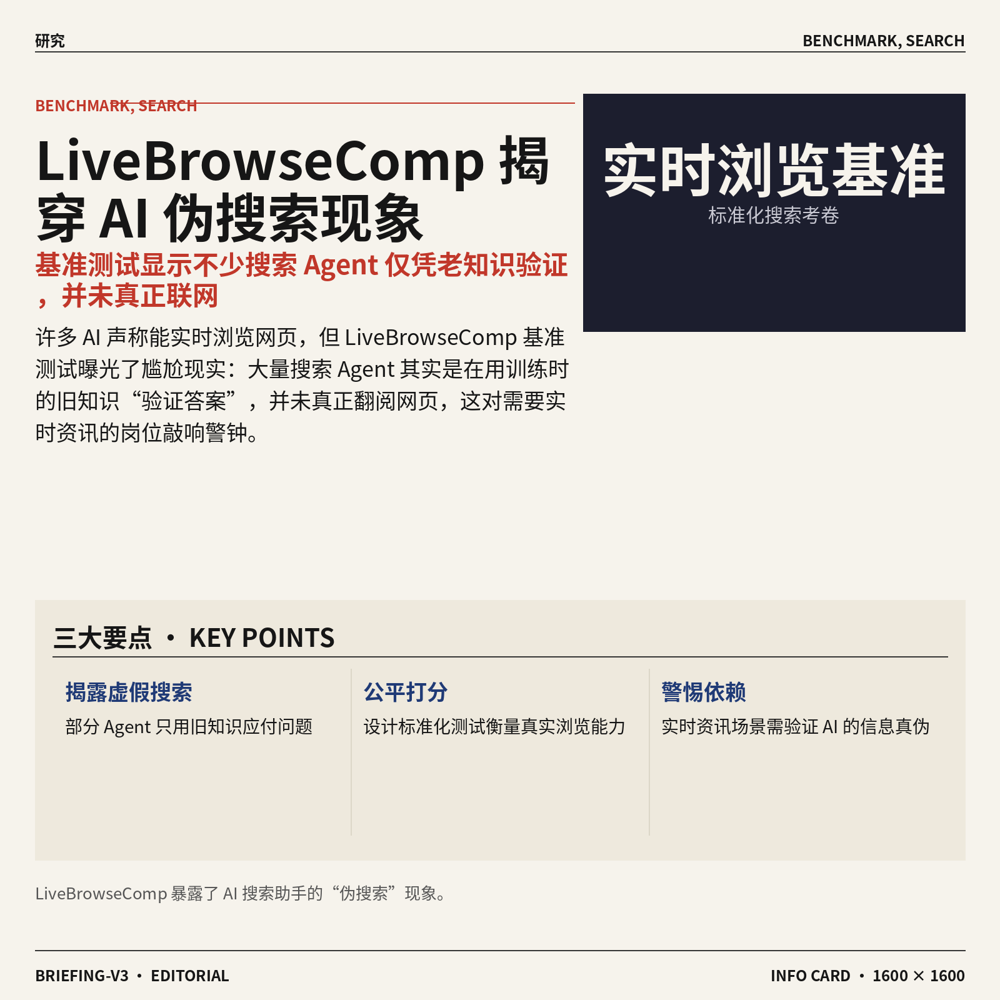

3. **LiveBrowseComp（实时浏览对比基准）：你的搜索助手真在搜索, 还是仅凭老本在猜？**
很多 AI 宣称能联网查资料, 但它们真的去搜了吗？LiveBrowseComp 这个**基准测试（用来公平打分的标准化考卷）** 毫不留情地揭示了一个尴尬现状：不少 **搜索 Agent（能自己上网查资料的 AI 助手）** 其实只是在利用训练时记下的老知识“验证答案”, 并没有真正去实时翻阅网页 💡。这对依赖 AI 抓取实时资讯的运营和风控岗位来说, 得留个心眼了。[HuggingFace 论文页(briefing)](https://huggingface.co/papers/2605.28721)

![LiveBrowseComp（实时浏览对比基准）：你的搜索助手真在搜索, 还是仅凭老本在猜？](https://image.pollinations.ai/prompt/LiveBrowseComp%EF%BC%88%E5%AE%9E%E6%97%B6%E6%B5%8F%E8%A7%88%E5%AF%B9%E6%AF%94%E5%9F%BA%E5%87%86%EF%BC%89%EF%BC%9A%E4%BD%A0%E7%9A%84%E6%90%9C%E7%B4%A2%E5%8A%A9%E6%89%8B%E7%9C%9F%E5%9C%A8%E6%90%9C%E7%B4%A2%2C%20%E8%BF%98%E6%98%AF%E4%BB%85%E5%87%AD%E8%80%81%E6%9C%AC%E5%9C%A8%E7%8C%9C%EF%BC%9F.%20LiveBrowseComp%EF%BC%88%E5%AE%9E%E6%97%B6%E6%B5%8F%E8%A7%88%E5%AF%B9%E6%AF%94%E5%9F%BA%E5%87%86%EF%BC%89%EF%BC%9A%E4%BD%A0%E7%9A%84%E6%90%9C%E7%B4%A2%E5%8A%A9%E6%89%8B%E7%9C%9F%E5%9C%A8%E6%90%9C%E7%B4%A2%2C%20%E8%BF%98%E6%98%AF%E4%BB%85%E5%87%AD%E8%80%81%E6%9C%AC%E5%9C%A8%E7%8C%9C%EF%BC%9F%20%E5%BE%88%E5%A4%9A%20AI%20%E5%AE%A3%E7%A7%B0%E8%83%BD%E8%81%94%E7%BD%91%E6%9F%A5%E8%B5%84%E6%96%99%2C%20%E4%BD%86%E5%AE%83%E4%BB%AC%E7%9C%9F%E7%9A%84%E5%8E%BB%E6%90%9C%E4%BA%86%E5%90%97%EF%BC%9FLiveBro%2C%20technical%20infographic%20diagram%2C%20architecture%20flowchart%2C%20clean%20vector%20illustration%2C%20educational%20style%2C%20no%20text%20overlay%2C%20modern%20minimal%2C%20wide%20aspect?width=1200&height=675&nologo=true&seed=10869)

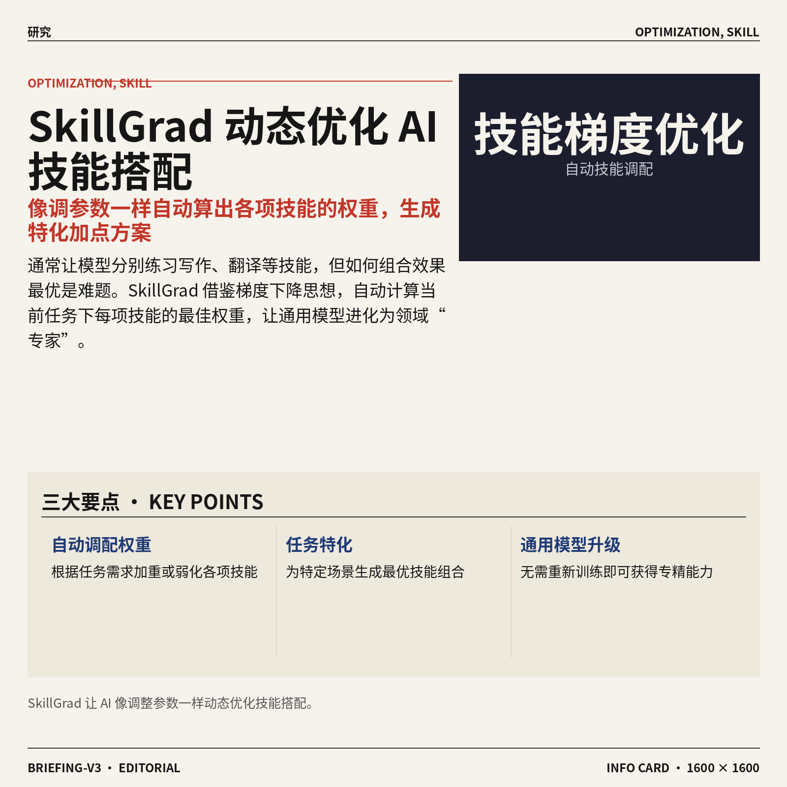

4. **SkillGrad（技能梯度优化）：像训练AI参数一样优化它的技能搭配。**
我们通常会分别让大模型练习写作、翻译或编程, 但怎么调配这些能力的组合才是真正的艺术 🎨。SkillGrad 借鉴了 **梯度下降（AI 内部分步优化参数的经典数学思路）** 的思想, 它能自动计算出当前任务下, 哪项技能该加重、哪项该弱化, 从而让 Agent 的表现层层递进。这相当于为通用模型自动生成了“特化技能加点方案”。[HuggingFace 论文页(briefing)](https://huggingface.co/papers/2605.27760)

![SkillGrad（技能梯度优化）：像训练AI参数一样优化它的技能搭配](https://image.pollinations.ai/prompt/SkillGrad%EF%BC%88%E6%8A%80%E8%83%BD%E6%A2%AF%E5%BA%A6%E4%BC%98%E5%8C%96%EF%BC%89%EF%BC%9A%E5%83%8F%E8%AE%AD%E7%BB%83AI%E5%8F%82%E6%95%B0%E4%B8%80%E6%A0%B7%E4%BC%98%E5%8C%96%E5%AE%83%E7%9A%84%E6%8A%80%E8%83%BD%E6%90%AD%E9%85%8D.%20SkillGrad%EF%BC%88%E6%8A%80%E8%83%BD%E6%A2%AF%E5%BA%A6%E4%BC%98%E5%8C%96%EF%BC%89%EF%BC%9A%E5%83%8F%E8%AE%AD%E7%BB%83AI%E5%8F%82%E6%95%B0%E4%B8%80%E6%A0%B7%E4%BC%98%E5%8C%96%E5%AE%83%E7%9A%84%E6%8A%80%E8%83%BD%E6%90%AD%E9%85%8D%E3%80%82%20%E6%88%91%E4%BB%AC%E9%80%9A%E5%B8%B8%E4%BC%9A%E5%88%86%E5%88%AB%E8%AE%A9%E5%A4%A7%E6%A8%A1%E5%9E%8B%E7%BB%83%E4%B9%A0%E5%86%99%E4%BD%9C%E3%80%81%E7%BF%BB%E8%AF%91%E6%88%96%E7%BC%96%E7%A8%8B%2C%20%E4%BD%86%E6%80%8E%E4%B9%88%E8%B0%83%E9%85%8D%E8%BF%99%E4%BA%9B%E8%83%BD%E5%8A%9B%E7%9A%84%E7%BB%84%E5%90%88%E6%89%8D%E6%98%AF%E7%9C%9F%E6%AD%A3%E7%9A%84%E8%89%BA%E6%9C%AF%2C%20technical%20infographic%20diagram%2C%20architecture%20flowchart%2C%20clean%20vector%20illustration%2C%20educational%20style%2C%20no%20text%20overlay%2C%20modern%20minimal%2C%20wide%20aspect?width=1200&height=675&nologo=true&seed=10900)

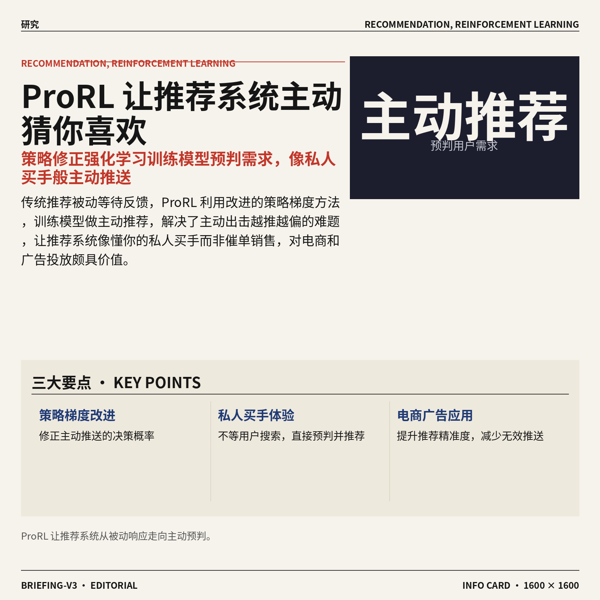

5. **ProRL（策略修正强化学习）：让推荐系统主动“猜你喜欢”的下一个爆款。**
传统的推荐往往等你点了赞才开始反应, ProRL 则利用改进的 **策略梯度（一种直接修正决策动作概率的数学手段）** 估算方法, 训练模型做**主动推荐（不等待用户搜索, 直接预判需求并推送）** 🚀。它解决了以往”主动出击”时容易越推越偏的问题, 让推荐像懂你的私人买手, 而非只会催单的销售, 对电商运营和广告投放很有启发。[HuggingFace 论文页(briefing)](https://huggingface.co/papers/2605.28293)

![ProRL（策略修正强化学习）：让推荐系统主动“猜你喜欢”的下一个爆款](https://image.pollinations.ai/prompt/ProRL%EF%BC%88%E7%AD%96%E7%95%A5%E4%BF%AE%E6%AD%A3%E5%BC%BA%E5%8C%96%E5%AD%A6%E4%B9%A0%EF%BC%89%EF%BC%9A%E8%AE%A9%E6%8E%A8%E8%8D%90%E7%B3%BB%E7%BB%9F%E4%B8%BB%E5%8A%A8%E2%80%9C%E7%8C%9C%E4%BD%A0%E5%96%9C%E6%AC%A2%E2%80%9D%E7%9A%84%E4%B8%8B%E4%B8%80%E4%B8%AA%E7%88%86%E6%AC%BE.%20ProRL%EF%BC%88%E7%AD%96%E7%95%A5%E4%BF%AE%E6%AD%A3%E5%BC%BA%E5%8C%96%E5%AD%A6%E4%B9%A0%EF%BC%89%EF%BC%9A%E8%AE%A9%E6%8E%A8%E8%8D%90%E7%B3%BB%E7%BB%9F%E4%B8%BB%E5%8A%A8%E2%80%9C%E7%8C%9C%E4%BD%A0%E5%96%9C%E6%AC%A2%E2%80%9D%E7%9A%84%E4%B8%8B%E4%B8%80%E4%B8%AA%E7%88%86%E6%AC%BE%E3%80%82%20%E4%BC%A0%E7%BB%9F%E7%9A%84%E6%8E%A8%E8%8D%90%E5%BE%80%E5%BE%80%E7%AD%89%E4%BD%A0%E7%82%B9%E4%BA%86%E8%B5%9E%E6%89%8D%E5%BC%80%E5%A7%8B%E5%8F%8D%E5%BA%94%2C%20ProRL%20%E5%88%99%E5%88%A9%E7%94%A8%E6%94%B9%E8%BF%9B%E7%9A%84%20%E7%AD%96%E7%95%A5%E6%A2%AF%E5%BA%A6%EF%BC%88%E4%B8%80%E7%A7%8D%E7%9B%B4%E6%8E%A5%E4%BF%AE%E6%AD%A3%2C%20technical%20infographic%20diagram%2C%20architecture%20flowchart%2C%20clean%20vector%20illustration%2C%20educational%20style%2C%20no%20text%20overlay%2C%20modern%20minimal%2C%20wide%20aspect?width=1200&height=675&nologo=true&seed=10931)

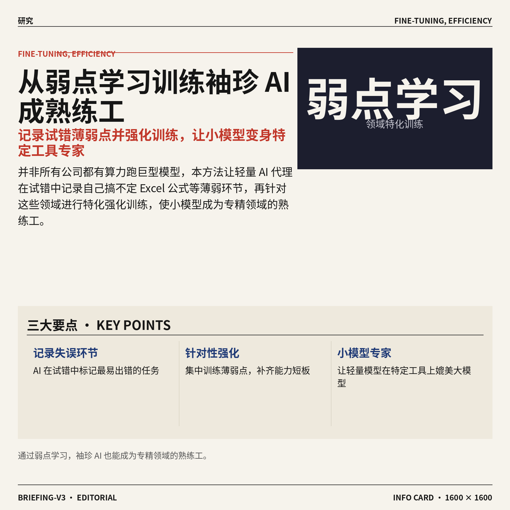

6. **Learn from Weaknesses（从弱点中学习）：教会袖珍AI做专精领域的“熟练工”。**
不是所有公司都跑得动巨大的通用模型, 很多场景里我们用的是轻量的 **电脑操作 Agent（能像真人一样去点鼠标用软件的 AI）** 💡。这项研究提出了一种自动化路径：让 AI 在试错中记录下自己最容易失误的环节（比如搞不定复杂的 Excel 公式）, 然后针对这些薄弱点进行 **领域特化（把通用知识转化成某一行的深度技能）** 强化训练, 让小模型也变成特定工具里的专家。[HuggingFace 论文页(briefing)](https://huggingface.co/papers/2605.28775)

![Learn from Weaknesses（从弱点中学习）：教会袖珍AI做专精领域的“熟练工”](https://image.pollinations.ai/prompt/Learn%20from%20Weaknesses%EF%BC%88%E4%BB%8E%E5%BC%B1%E7%82%B9%E4%B8%AD%E5%AD%A6%E4%B9%A0%EF%BC%89%EF%BC%9A%E6%95%99%E4%BC%9A%E8%A2%96%E7%8F%8DAI%E5%81%9A%E4%B8%93%E7%B2%BE%E9%A2%86%E5%9F%9F%E7%9A%84%E2%80%9C%E7%86%9F%E7%BB%83%E5%B7%A5%E2%80%9D.%20Learn%20from%20Weaknesses%EF%BC%88%E4%BB%8E%E5%BC%B1%E7%82%B9%E4%B8%AD%E5%AD%A6%E4%B9%A0%EF%BC%89%EF%BC%9A%E6%95%99%E4%BC%9A%E8%A2%96%E7%8F%8DAI%E5%81%9A%E4%B8%93%E7%B2%BE%E9%A2%86%E5%9F%9F%E7%9A%84%E2%80%9C%E7%86%9F%E7%BB%83%E5%B7%A5%E2%80%9D%E3%80%82%20%E4%B8%8D%E6%98%AF%E6%89%80%E6%9C%89%E5%85%AC%E5%8F%B8%E9%83%BD%E8%B7%91%E5%BE%97%E5%8A%A8%E5%B7%A8%E5%A4%A7%E7%9A%84%E9%80%9A%E7%94%A8%E6%A8%A1%E5%9E%8B%2C%20%E5%BE%88%E5%A4%9A%E5%9C%BA%E6%99%AF%E9%87%8C%E6%88%91%E4%BB%AC%E7%94%A8%E7%9A%84%E6%98%AF%E8%BD%BB%E9%87%8F%2C%20technical%20infographic%20diagram%2C%20architecture%20flowchart%2C%20clean%20vector%20illustration%2C%20educational%20style%2C%20no%20text%20overlay%2C%20modern%20minimal%2C%20wide%20aspect?width=1200&height=675&nologo=true&seed=10962)

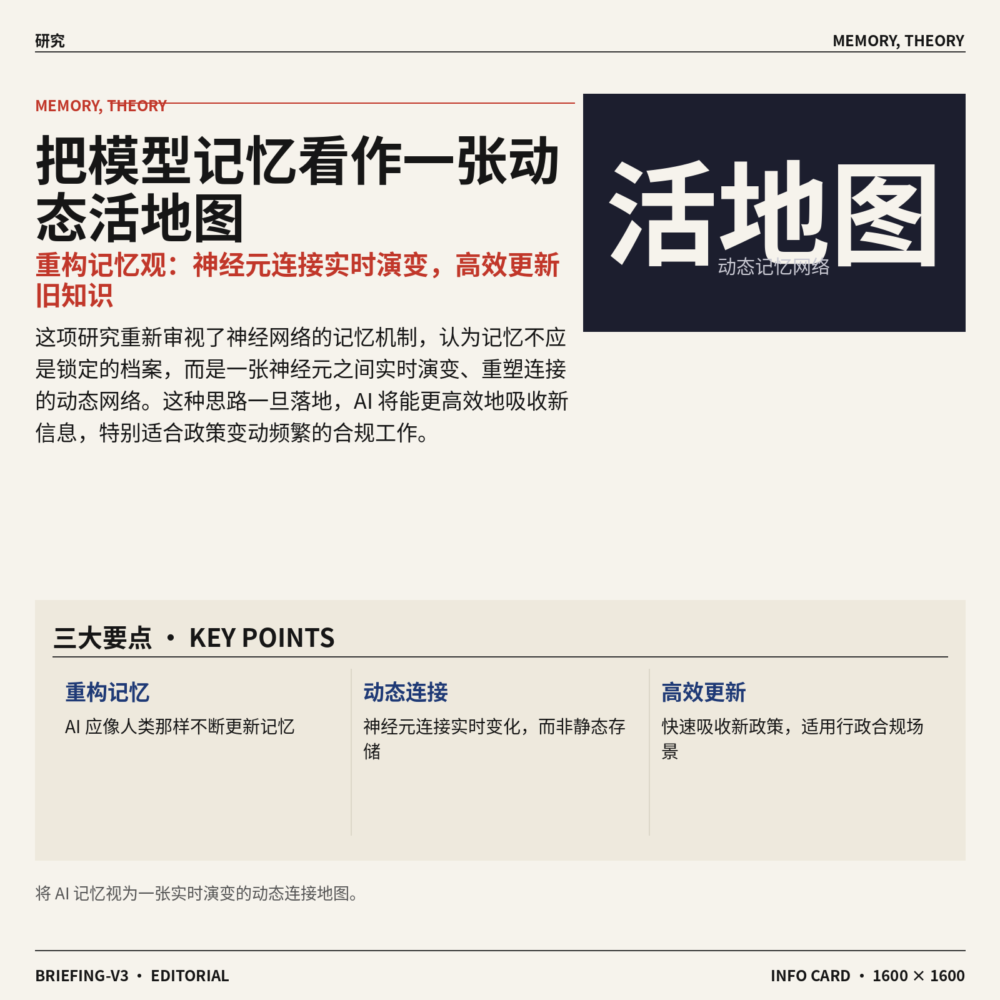

7. **Rethinking Memory as Continuously Evolving Connectivity（动态连接记忆观）：把模型记忆看作一张“活地图”。**
我们不希望 AI 永远死记硬背, 它应该像人类一样不断重构记忆 🧠。这项研究重新审视了 **神经网络的记忆机制（模型内部保存和调用知识的方式）** , 认为记忆不应是锁在柜子里的档案, 而是一张神经元之间 **实时演变、重塑连接的动态网**。这种思路一旦落地, 将让 AI 能更高效地更新旧知识、吸收新信息, 对于需要不断跟进政策变动的行政与合规工作非常实用。[HuggingFace 论文页(briefing)](https://huggingface.co/papers/2605.28773)


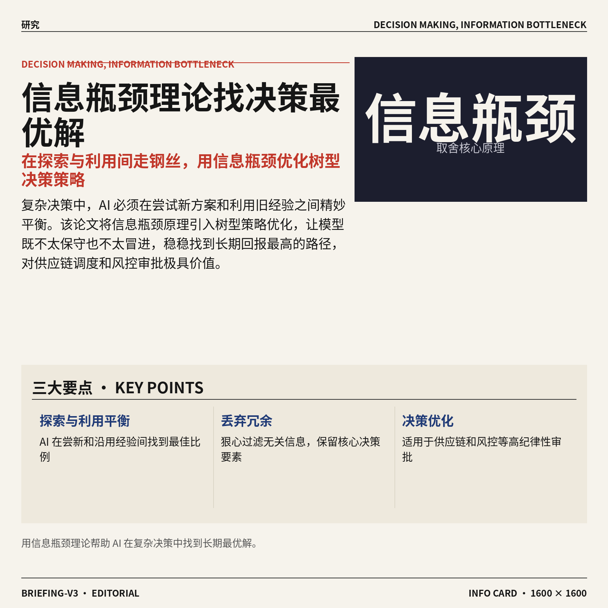

8. **Long Live The Balance（平衡万岁）：用信息瓶颈理论找到决策的最优解。**
在复杂的博弈或业务规划中, AI 必须在 **“探索”新花样与“利用”现有经验（强化学习里的基本权衡）** 之间精妙地走钢丝 🎯。这篇论文把 **信息瓶颈（一种在保留核心前提下狠心丢弃冗余信息的信息论方法）** 原理搬进 **树型策略（像走迷宫一样在分支选项中做决策）** 的优化里, 让模型既不会太怂也不敢太浪, 稳稳找到长期回报最高的那条路, 对于供应链调度或高纪律性的风控审批极具价值。[HuggingFace 论文页(briefing)](https://huggingface.co/papers/2605.28109)


### 🟡 行业展望与社会影响


1. **Anthropic 完成 650 亿美元 Series H（H 轮）融资，估值逼近万亿美元 💰**
    Anthropic 刚完成高达 650 亿美元的 H 轮融资（H 轮即公司的第 8 轮外部私募融资），投后估值（post-money valuation，融资完成后的公司估值）达 9650 亿美元，距离 1 万亿美元仅一步之遥 🚀。这很可能是 Anthropic 在冲击 IPO（首次公开募股）前的最后一轮私募，也让它一举超越 OpenAI，成为全球身价最高的 AI 初创公司。背后的驱动力是 Claude 服务需求井喷，大量企业和开发者争相接入，AI 行业正以前所未有的速度虹吸资本，万亿估值预期或将重塑整个科技股市场。[TechCrunch 融资详情报道(briefing)](https://techcrunch.com/2026/05/28/anthropic-raises-65-billion-nears-1t-valuation-ahead-of-ipo/) [The Decoder 分析文章(briefing)](https://the-decoder.com/claude-company-anthropic-nears-a-trillion-dollar-valuation-after-raising-65-billion-in-series-h/)


2. **马斯克称 xAI 与 Anthropic 的算力大单“短期可取消”，SpaceX 的 S-1（IPO 注册声明）却暗示付款到 2029 年 🤔**
    AI 算力（训练和运行大模型所需的庞大计算资源）正成为科技巨头之间博弈的数字油田。马斯克公开表示，其旗下 xAI


### 🟣 开源TOP项目

### 🔴 社媒分享

1. **YouTube 将自动标注 AI 生成视频，提升内容透明度。**
YouTube 官方发布新举措，平台将借助自动检测技术为 AI 生成或合成的视频自动打上标签，让观众能一眼看清视频的“出身” 🤖。这一改变旨在减轻创作者的标注负担，同时有效防范深度伪造（Deepfake，用 AI 伪造的逼真影像）风险，让信息环境更透明可靠。[YouTube 官方博客公告(briefing)](https://blog.youtube/news-and-events/improving-ai-labels-viewers-creators/)


2. **各种 LLM Smells（大型语言模型的“异味”）大盘点。**
这篇技术博客盘点了大型语言模型（LLM）开发与使用中常见的“异味”——也就是那些看起来不对劲、容易引发问题的坏模式或反模式 🧐。文章帮助开发者识别模型为何会胡说


---

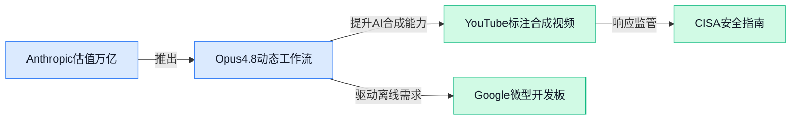
```mermaid
graph LR
    A[Anthropic估值万亿] -->|推出| B[Opus4.8动态工作流]
    B -->|提升AI合成能力| C[YouTube标注合成视频]
    C -->|响应监管| D[CISA安全指南]
    B -->|驱动离线需求| E[Google微型开发板]
    classDef blue fill:#dbeafe,stroke:#3b82f6,color:#111827
    classDef green fill:#d1fae5,stroke:#10b981,color:#111827
    class A,B blue
    class C,D,E green
```

### 📊 行业洞察（今日 4 条）

1. Anthropic 刚融了650亿美元，估值冲到9650亿，距离万亿只差一步；同一天它又发布能指挥一群子AI协同干活的 Opus 4.8 和 Dynamic Workflows
  【洞察】资本和产品一起发力，说明 Anthropic 正在把“AI当团队管理者”做成真正的生意，而不再只是更强的对话模型
2. 谷歌推出能离线跑 Gemma 3 的巴掌大开发板，同时研究界在教小模型“从弱点中学习”做专精熟练工
  【洞察】两件事连着看，AI 正从云端巨无霸分化出能揣进兜里干活的小型专家，离线、隐私、特化是下一波落地方向
3. CISA 发布 Agentic AI 安全指南要求权限管控和人工复核，YouTube 也开始自动给 AI 合成视频打标签
  【洞察】监管和平台都在给自主行动的 AI 系“安全带”，不是阻止它跑步，而是要求每一步都留脚印、能喊停
4. LiveBrowseComp 抽检发现很多自称能上网查资料的 AI 其实在用老本猜答案，LLM Smells 文章又盘点了大模型常见的坏毛病
  【洞察】AI 的现实可靠性远没到能放手的地步，尤其在需要实时信息的运营和风控岗位，必须做交叉验证

### 💭 对我们的启发（今日 3 条）

1. YouTube 自动标注 AI 合成视频，说明“内容身世透明”正成为平台硬要求。我们的剪辑工具必须内置能自动记录并标记AI生成片段的机制，这既是合规成本，也是客户信任的卖点
2. Anthropic 的 Dynamic Workflows 把复杂任务拆解给一群子AI，这思路可以直接用到视频制作里：脚本、分镜、素材匹配、配音、字幕，分派给不同 Agent 流水线处理，大幅降低人工串流程的麻烦
3. 谷歌的微型板证明小设备也能本地跑大模型，未来我们完全可以为品牌商提供离线版剪辑终端，素材不出客户电脑，在数据隐私和成本上拉开差异化，尤其适合对保密要求高的带货视频团队

