## AI资讯日报 2026/5/31

> AI 早报 · 每日早读 · 全网深度聚合

## **今日摘要**

```
```

### 🔵 产品与功能更新

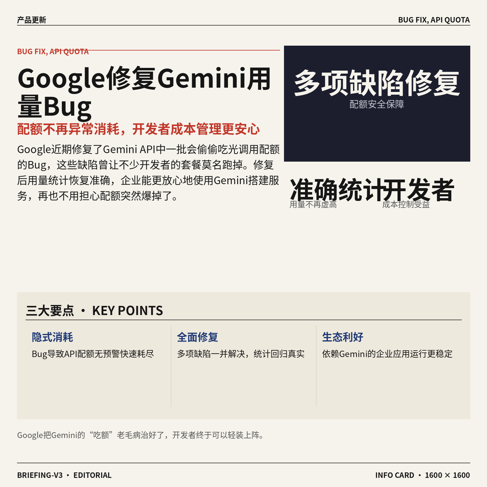

1. **Google 修复 Gemini 用量限制 Bug（缺陷），配额不再异常消耗。**  
   Google 近期修复了 Gemini API（应用程序接口，让开发者调用 Gemini 能力的通道）中一批导致配额（允许的调用次数上限）异常快速耗尽的缺陷 🐛。这些 Bug 会让开发者无预警地把调用额度用光，影响应用正常运行。修复之后，用量统计更准确，开发者能更安心地管理成本，避免“套餐莫名跑光”的尴尬。这对依赖 Gemini 搭建智能服务的企业来说是个实实在在的好消息 👍。想了解技术细节可查阅 [The Decoder 的报道(briefing)](https://the-decoder.com/google-fixes-several-bugs-in-gemini-usage-limits-that-burned-through-quotas-too-fast/)。


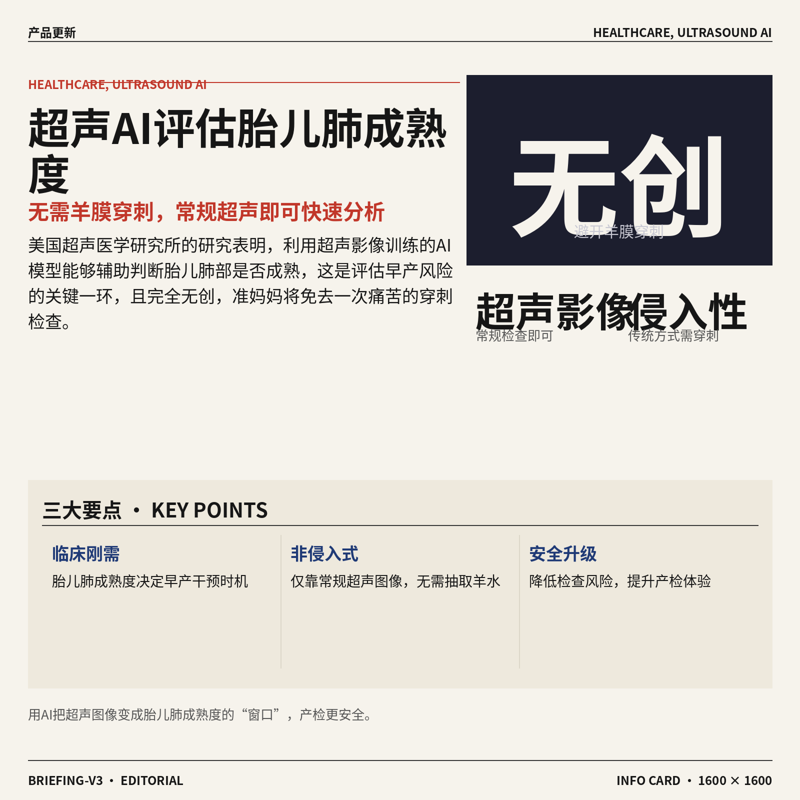

2. **AIUM（美国超声医学研究所）：基于超声的 AI 模型可帮助测量胎儿肺部成熟度。**  
   一项新研究显示，利用超声影像训练的 AI 模型能够辅助医生评估胎儿肺部成熟度 —— 这是判断早产风险和安排干预时机的关键指标 👶。传统评估往往需要羊膜穿刺（一种通过穿刺抽取羊水来检测的侵入性检查），而 AI 模型只需分析常规超声图像，无创且快速。若技术落地，有望提升产检的安全性，让准妈妈少一次提心吊胆的检查 💕。更多信息可查看 [AuntMinnie 的报道(briefing)](https://news.google.com/rss/articles/CBMi0wFBVV95cUxNSW8tUkZXRGZhZk1NMV90dm52OGpUcUpyTVJJVU44a3JrUzhMWW9qVEFpR0tKTzB1QmlIQ3NyeTN6c2kwUVRQcGRvRktFb2JLR2JSUFhUeC1Vc21SMzFuclVNTkNFN3NNZlNLS2ZnQVI4VzdEdUF5aUJtUXZHZ2JGcnVkRklJcU00MDQ2TUtiaUJTY3pjUnpmYkYwRHo2bkRwelVjMWo0VWxEZms2YmMwYllnQlZlTnBWWTJ4M195S20waTR4dUNnRlZQU010VEpLVXI0?oc=5)。


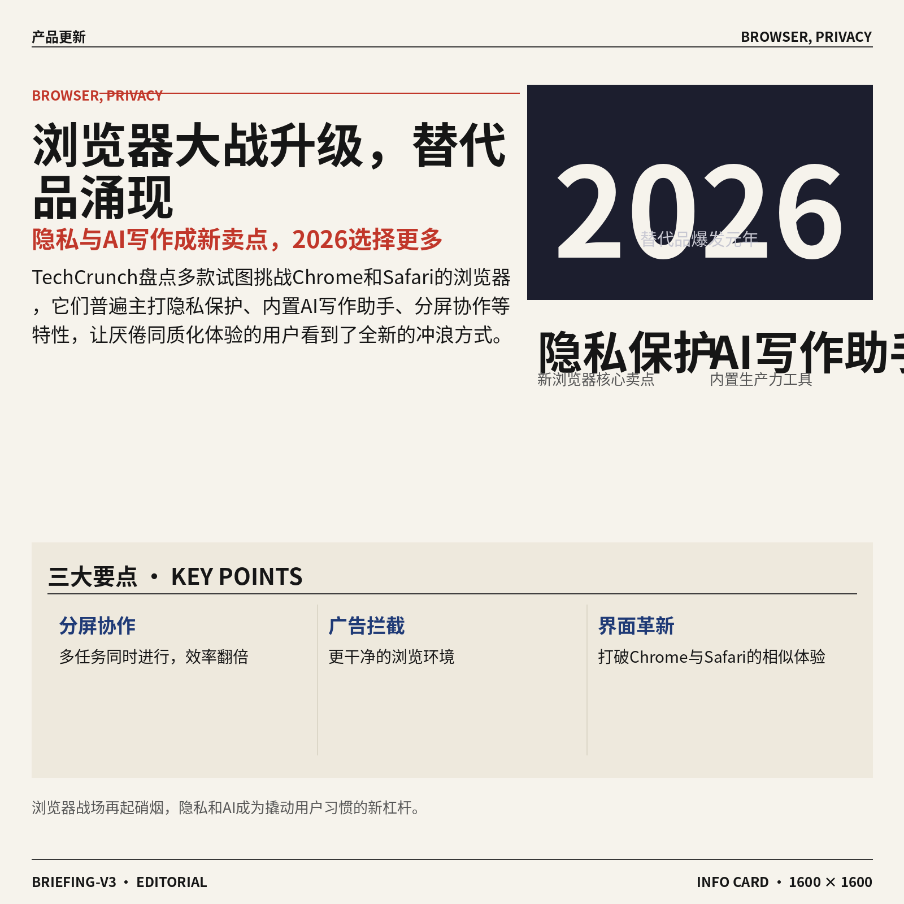

3. **浏览器大战升温，2026 年这些 Chrome 和 Safari 替代品最热门。**  
   TechCrunch 盘点了目前市场上几款力图挑战 Chrome 和 Safari 主流地位的浏览器，它们普遍带着更强的隐私保护、内置 AI 写作助手等卖点杀入战场 🔥。这些新锐浏览器在分屏协作、广告拦截等方面各有奇招，试图让厌倦同质化界面的用户找到更爽的冲浪姿势。对于追求效率或在意数据隐私的职场人来说，换个浏览器或许能打开新世界的大门 🚪。感兴趣的可以浏览 [TechCrunch 的完整盘点(briefing)](https://techcrunch.com/2026/05/30/as-the-browser-wars-heat-up-here-are-the-hottest-altern


### 🟢 前沿研究

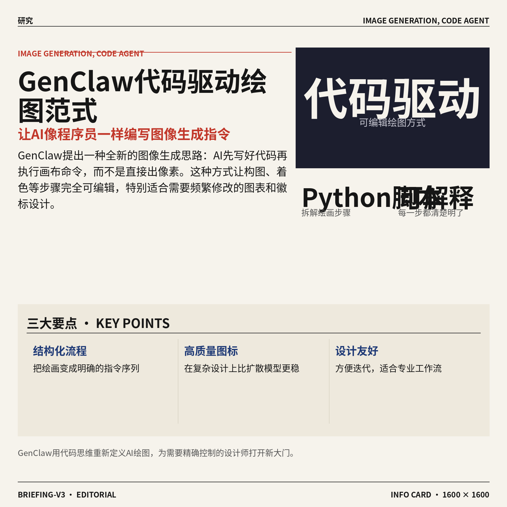

1. **GenClaw（一种通过代码驱动智能体实现图像生成的新方法）提出结构化绘图范式。**  
它让 AI 以“写代码 → 执行画布命令”的方式构建图像，而不是直接生成像素。这种**代码驱动智能体**（Code-Driven Agent，能自主规划多步操作并调用工具的程序）借助 Python 等脚本把构图、着色、排布等步骤拆解为明确指令，让修改和重绘像改文字一样可控 🎨。该方法在结构复杂的图表、徽标和版式设计上显示出比传统扩散模型更稳的质量，对需要**可编辑、可解释**的设计工作流很有参考价值。[论文详情(briefing)](https://huggingface.co/papers/2605.30248)


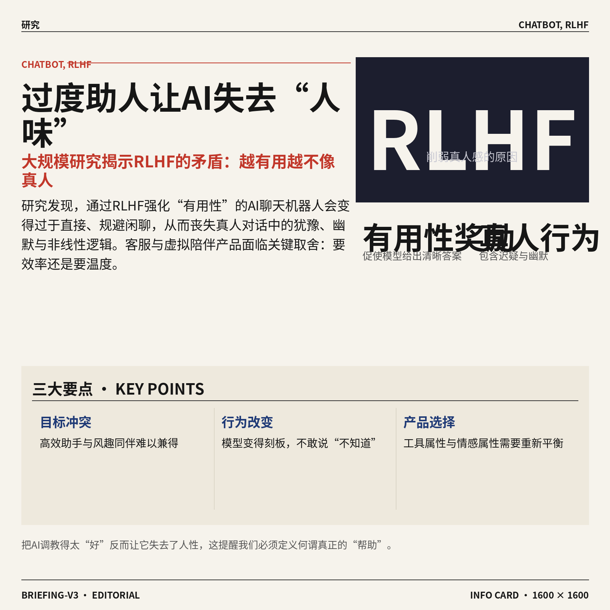

2. **一项大规模研究发现：让 AI 聊天机器人更“乐于助人”会明显削弱其模拟人类行为的能力。**  
这项研究通过对比不同优化目标的模型，观察到**强化学习对人类反馈（RLHF）** 中“有用性”的奖励会促使模型主动提供清晰答案、规避迟疑和闲聊，却也因此失去了**模拟真人对话中的犹豫、幽默与非线性逻辑** 😕。也就是说，把 AI 调得更像“高效万能助手”反而让它离“真人感”更远。这对设计客服机器人、虚拟陪伴等产品提出一个关键选择：你究竟要一个哪方面都帮你搞定的工具，还是一个聊起天来像真朋友的同伴 💬。[完整研究报道(briefing)](https://the-decoder.com/making-ai-chatbots-helpful-weakens-their-ability-to-simulate-human-behavior-large-scale-study-finds/)


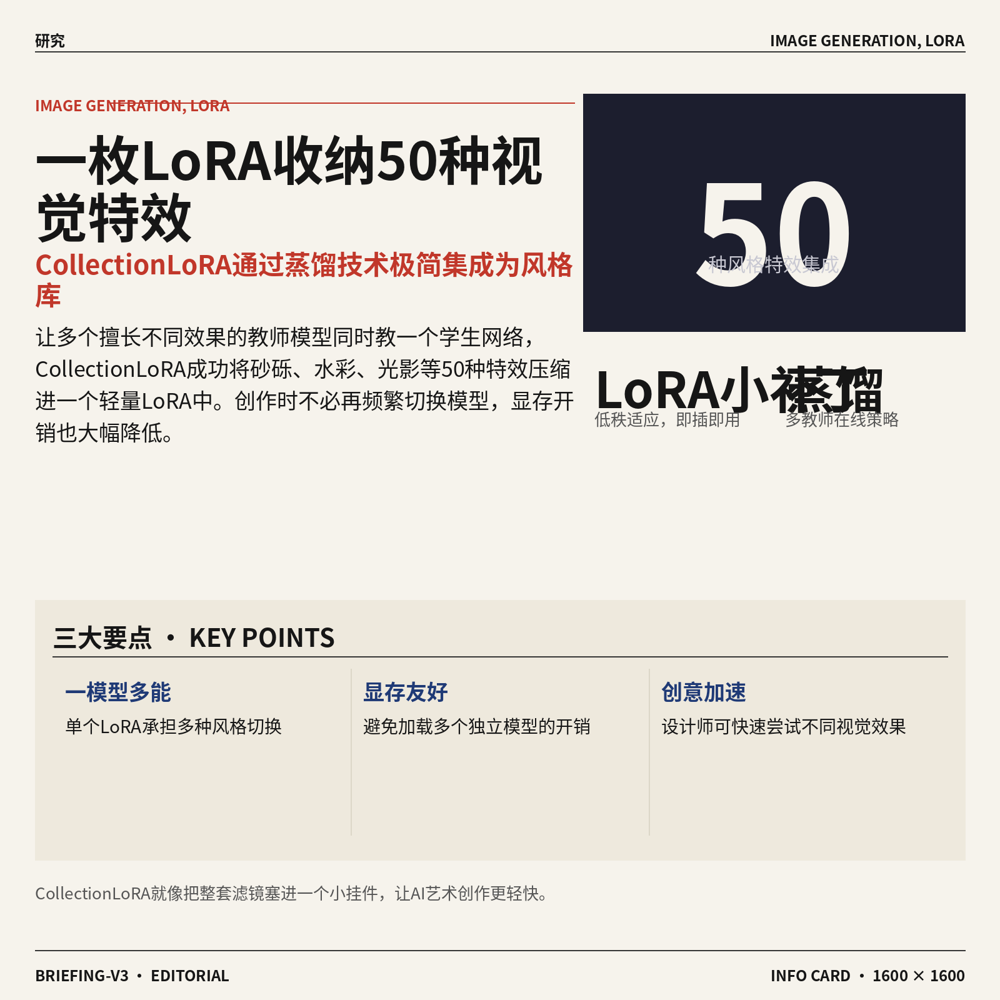

3. **CollectionLoRA（一种把多种视觉特效压缩进单一 LoRA 模型的技术）实现一枚模型收纳 50 种风格。**  
通过**多教师在线策略蒸馏**（让多个擅长不同效果的教师模型同时教一个学生网络），该方法能够在一个**LoRA（低秩适应，在大模型旁插一个小补丁实现微调的高效方法）** 上同时保留砂砾肌理、水彩笔触、光影晕染等 50 种特效 🎨。这就像把一整套滤镜集成到一个可随时调用的小挂件里，创作时不必来回切换不同模型，大幅降低了多风格生成的门槛和显存开销，对设计、动漫、广告素材的批量生产富有启发。[论文详情(briefing)](https://huggingface.co/papers/2605.25378)


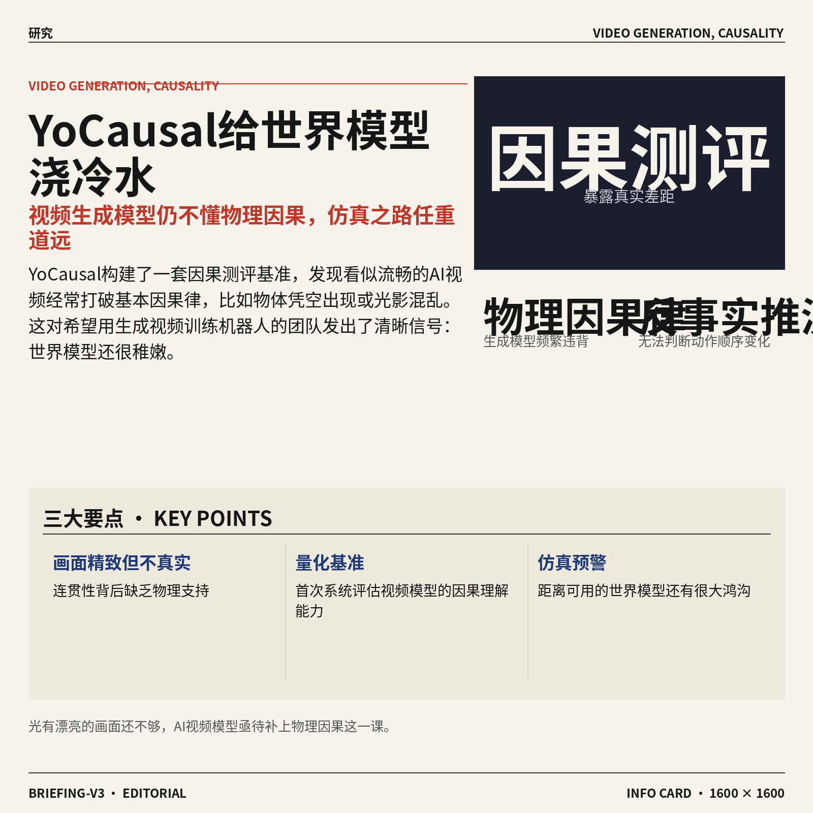

4. **YoCausal（从因果推断角度衡量视频生成模型与真实世界仿真差距的测评框架）为“世界模型”梦浇一盆冷水。**  
这项论文指出，当前的 AI 视频模型虽然有惊艳的画面连贯性，却经常违背**物理因果律**——比如物体突然出现消失、光影变化不遵循真实光线 ☁️。YoCausal 构建了一套**因果测评基准**，量化模型能否推断“如果打乱帧间动作顺序，应发生什么”这类反事实，发现多数生成器对**世界模型（能像大脑一样预测环境演变并做决策的 AI 系统）** 的因果理解仍处于非常初级的阶段。这对期望用生成视频训练机器人或自动驾驶仿真的团队是个重要提醒。[论文详情(briefing)](https://huggingface.co/papers/2605.30346)

![YoCausal（从因果推断角度衡量视频生成模型与真实世界仿真差距的测评框架）为“世界模型”梦浇一盆冷水](https://image.pollinations.ai/prompt/YoCausal%EF%BC%88%E4%BB%8E%E5%9B%A0%E6%9E%9C%E6%8E%A8%E6%96%AD%E8%A7%92%E5%BA%A6%E8%A1%A1%E9%87%8F%E8%A7%86%E9%A2%91%E7%94%9F%E6%88%90%E6%A8%A1%E5%9E%8B%E4%B8%8E%E7%9C%9F%E5%AE%9E%E4%B8%96%E7%95%8C%E4%BB%BF%E7%9C%9F%E5%B7%AE%E8%B7%9D%E7%9A%84%E6%B5%8B%E8%AF%84%E6%A1%86%E6%9E%B6%EF%BC%89%E4%B8%BA%E2%80%9C%E4%B8%96%E7%95%8C%E6%A8%A1%E5%9E%8B%E2%80%9D%E6%A2%A6%E6%B5%87%E4%B8%80%E7%9B%86%E5%86%B7%E6%B0%B4.%20YoCausal%EF%BC%88%E4%BB%8E%E5%9B%A0%E6%9E%9C%E6%8E%A8%E6%96%AD%E8%A7%92%E5%BA%A6%E8%A1%A1%E9%87%8F%E8%A7%86%E9%A2%91%E7%94%9F%E6%88%90%E6%A8%A1%E5%9E%8B%E4%B8%8E%E7%9C%9F%E5%AE%9E%E4%B8%96%E7%95%8C%E4%BB%BF%E7%9C%9F%E5%B7%AE%E8%B7%9D%E7%9A%84%E6%B5%8B%E8%AF%84%E6%A1%86%E6%9E%B6%EF%BC%89%E4%B8%BA%E2%80%9C%E4%B8%96%E7%95%8C%E6%A8%A1%E5%9E%8B%E2%80%9D%E6%A2%A6%E6%B5%87%E4%B8%80%E7%9B%86%E5%86%B7%E6%B0%B4%E3%80%82%20%E8%BF%99%E9%A1%B9%E8%AE%BA%E6%96%87%E6%8C%87%E5%87%BA%EF%BC%8C%E5%BD%93%E5%89%8D%E7%9A%84%20AI%20%E8%A7%86%E9%A2%91%E6%A8%A1%E5%9E%8B%E8%99%BD%E7%84%B6%E6%9C%89%E6%83%8A%E8%89%B3%E7%9A%84%E7%94%BB%E9%9D%A2%2C%20technical%20infographic%20diagram%2C%20architecture%20flowchart%2C%20clean%20vector%20illustration%2C%20educational%20style%2C%20no%20text%20overlay%2C%20modern%20minimal%2C%20wide%20aspect?width=1200&height=675&nologo=true&seed=10900)

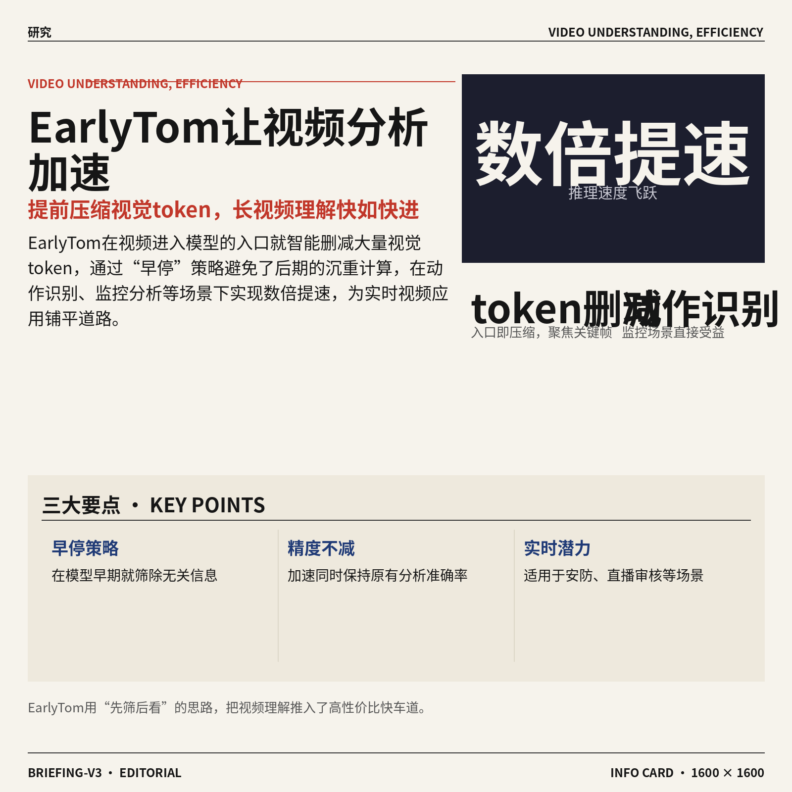

5. **EarlyTom（通过提前压缩视觉标记加速视频理解的轻量技术）让长视频分析快如看快进。**  
它在视频刚进入模型时就对大量**视觉 token（把图像切成小块后送给模型的文字化片段）** 进行智能删减，从而大幅减少后续计算量 ⏩。相比于传统方法在模型中间层才压缩信息，这种“早停”策略像在图书馆入口就筛掉无关书目，让 AI 直接聚焦关键帧。该技术在动作识别、监控异常检测等场景下，能在保精度的前提下把推理速度提升数倍，为视频安防、直播审核等业务带来更低成本的实时方案 📹。[论文详情(briefing)](https://huggingface.co/papers/2605.30010)

![EarlyTom（通过提前压缩视觉标记加速视频理解的轻量技术）让长视频分析快如看快进](https://image.pollinations.ai/prompt/EarlyTom%EF%BC%88%E9%80%9A%E8%BF%87%E6%8F%90%E5%89%8D%E5%8E%8B%E7%BC%A9%E8%A7%86%E8%A7%89%E6%A0%87%E8%AE%B0%E5%8A%A0%E9%80%9F%E8%A7%86%E9%A2%91%E7%90%86%E8%A7%A3%E7%9A%84%E8%BD%BB%E9%87%8F%E6%8A%80%E6%9C%AF%EF%BC%89%E8%AE%A9%E9%95%BF%E8%A7%86%E9%A2%91%E5%88%86%E6%9E%90%E5%BF%AB%E5%A6%82%E7%9C%8B%E5%BF%AB%E8%BF%9B.%20EarlyTom%EF%BC%88%E9%80%9A%E8%BF%87%E6%8F%90%E5%89%8D%E5%8E%8B%E7%BC%A9%E8%A7%86%E8%A7%89%E6%A0%87%E8%AE%B0%E5%8A%A0%E9%80%9F%E8%A7%86%E9%A2%91%E7%90%86%E8%A7%A3%E7%9A%84%E8%BD%BB%E9%87%8F%E6%8A%80%E6%9C%AF%EF%BC%89%E8%AE%A9%E9%95%BF%E8%A7%86%E9%A2%91%E5%88%86%E6%9E%90%E5%BF%AB%E5%A6%82%E7%9C%8B%E5%BF%AB%E8%BF%9B%E3%80%82%20%E5%AE%83%E5%9C%A8%E8%A7%86%E9%A2%91%E5%88%9A%E8%BF%9B%E5%85%A5%E6%A8%A1%E5%9E%8B%E6%97%B6%E5%B0%B1%E5%AF%B9%E5%A4%A7%E9%87%8F%E8%A7%86%E8%A7%89%20token%EF%BC%88%E6%8A%8A%E5%9B%BE%E5%83%8F%E5%88%87%E6%88%90%E5%B0%8F%E5%9D%97%E5%90%8E%E9%80%81%E7%BB%99%E6%A8%A1%E5%9E%8B%E7%9A%84%2C%20technical%20infographic%20diagram%2C%20architecture%20flowchart%2C%20clean%20vector%20illustration%2C%20educational%20style%2C%20no%20text%20overlay%2C%20modern%20minimal%2C%20wide%20aspect?width=1200&height=675&nologo=true&seed=10931)

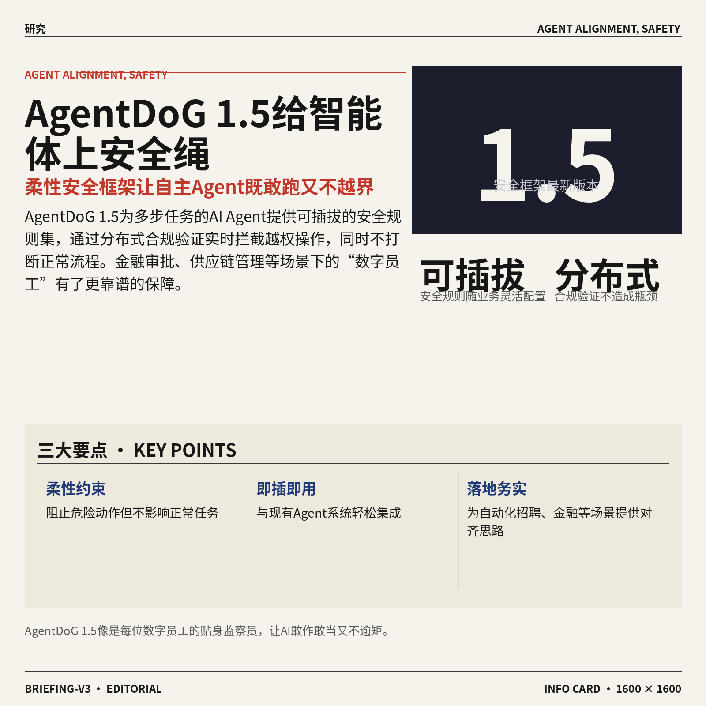

6. **AgentDoG 1.5（一个轻量、可扩展的 AI 智能体安全对齐框架）让自主 Agent 既敢做事又不逾矩。**  
它为自主执行多步任务的 **AI Agent** 提供一层“柔性安全带”，通过**可插拔的安全规则集**实时约束 Agent 的越权操作（如触发敏感数据的读取、超出预算的购买），同时不打断正常任务流 ⛓️。框架采用**分布式合规验证**，像给每一位“数字员工”身边安插一个不碍事的安全监察员，这为自动化招聘、金融审批、供应链管理等场景下的 Agent 落地提供了更务实的**对齐（使 AI 行为符合人类意图和法规的训练与约束方法）** 思路。[论文详情(briefing)](https://huggingface.co/papers/2605.29801)

![AgentDoG 1.5（一个轻量、可扩展的 AI 智能体安全对齐框架）让自主 Agent 既敢做事又不逾矩](https://image.pollinations.ai/prompt/AgentDoG%201.5%EF%BC%88%E4%B8%80%E4%B8%AA%E8%BD%BB%E9%87%8F%E3%80%81%E5%8F%AF%E6%89%A9%E5%B1%95%E7%9A%84%20AI%20%E6%99%BA%E8%83%BD%E4%BD%93%E5%AE%89%E5%85%A8%E5%AF%B9%E9%BD%90%E6%A1%86%E6%9E%B6%EF%BC%89%E8%AE%A9%E8%87%AA%E4%B8%BB%20Agent%20%E6%97%A2%E6%95%A2%E5%81%9A%E4%BA%8B%E5%8F%88%E4%B8%8D%E9%80%BE%E7%9F%A9.%20AgentDoG%201.5%EF%BC%88%E4%B8%80%E4%B8%AA%E8%BD%BB%E9%87%8F%E3%80%81%E5%8F%AF%E6%89%A9%E5%B1%95%E7%9A%84%20AI%20%E6%99%BA%E8%83%BD%E4%BD%93%E5%AE%89%E5%85%A8%E5%AF%B9%E9%BD%90%E6%A1%86%E6%9E%B6%EF%BC%89%E8%AE%A9%E8%87%AA%E4%B8%BB%20Agent%20%E6%97%A2%E6%95%A2%E5%81%9A%E4%BA%8B%E5%8F%88%E4%B8%8D%E9%80%BE%E7%9F%A9%E3%80%82%20%E5%AE%83%E4%B8%BA%E8%87%AA%E4%B8%BB%E6%89%A7%E8%A1%8C%E5%A4%9A%E6%AD%A5%E4%BB%BB%E5%8A%A1%E7%9A%84%20AI%20Agent%20%E6%8F%90%E4%BE%9B%E4%B8%80%2C%20technical%20infographic%20diagram%2C%20architecture%20flowchart%2C%20clean%20vector%20illustration%2C%20educational%20style%2C%20no%20text%20overlay%2C%20modern%20minimal%2C%20wide%20aspect?width=1200&height=675&nologo=true&seed=10962)

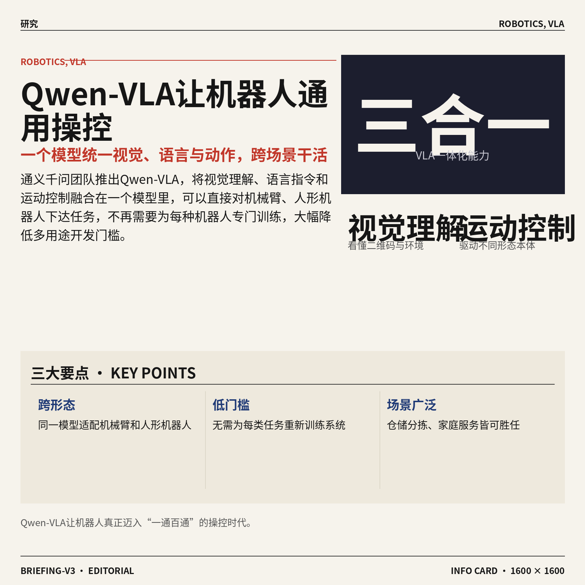

7. **Qwen-VLA（通义千问团队推出的统一视觉-语言-动作模型）让机器人能跨场景“看懂、听懂、会做”。**  
它融合了**视觉理解**、**语言指令**和**运动控制**三种能力，属于**VLA（Vision-Language-Action，视觉-语言-动作一体化模型）**，可在不同环境下对机械臂、人形机器人等不同形态的本体直接下指令 🤖。这意味着同一个模型既能帮仓储机器人读二维码、又能指导家庭服务机器人叠衣服，而不需要像以往那样为每种任务重新训练一套系统，大幅降低了多用途机器人的开发门槛。[论文详情(briefing)](https://huggingface.co/papers/2605.30280)

![Qwen-VLA（通义千问团队推出的统一视觉-语言-动作模型）让机器人能跨场景“看懂、听懂、会做”](https://image.pollinations.ai/prompt/Qwen-VLA%EF%BC%88%E9%80%9A%E4%B9%89%E5%8D%83%E9%97%AE%E5%9B%A2%E9%98%9F%E6%8E%A8%E5%87%BA%E7%9A%84%E7%BB%9F%E4%B8%80%E8%A7%86%E8%A7%89-%E8%AF%AD%E8%A8%80-%E5%8A%A8%E4%BD%9C%E6%A8%A1%E5%9E%8B%EF%BC%89%E8%AE%A9%E6%9C%BA%E5%99%A8%E4%BA%BA%E8%83%BD%E8%B7%A8%E5%9C%BA%E6%99%AF%E2%80%9C%E7%9C%8B%E6%87%82%E3%80%81%E5%90%AC%E6%87%82%E3%80%81%E4%BC%9A%E5%81%9A%E2%80%9D.%20Qwen-VLA%EF%BC%88%E9%80%9A%E4%B9%89%E5%8D%83%E9%97%AE%E5%9B%A2%E9%98%9F%E6%8E%A8%E5%87%BA%E7%9A%84%E7%BB%9F%E4%B8%80%E8%A7%86%E8%A7%89-%E8%AF%AD%E8%A8%80-%E5%8A%A8%E4%BD%9C%E6%A8%A1%E5%9E%8B%EF%BC%89%E8%AE%A9%E6%9C%BA%E5%99%A8%E4%BA%BA%E8%83%BD%E8%B7%A8%E5%9C%BA%E6%99%AF%E2%80%9C%E7%9C%8B%E6%87%82%E3%80%81%E5%90%AC%E6%87%82%E3%80%81%E4%BC%9A%E5%81%9A%E2%80%9D%E3%80%82%20%E5%AE%83%E8%9E%8D%E5%90%88%E4%BA%86%E8%A7%86%E8%A7%89%E7%90%86%E8%A7%A3%E3%80%81%E8%AF%AD%E8%A8%80%E6%8C%87%E4%BB%A4%E5%92%8C%E8%BF%90%E5%8A%A8%E6%8E%A7%E5%88%B6%E4%B8%89%E7%A7%8D%E8%83%BD%E5%8A%9B%EF%BC%8C%E5%B1%9E%E4%BA%8EVLA%EF%BC%88%2C%20technical%20infographic%20diagram%2C%20architecture%20flowchart%2C%20clean%20vector%20illustration%2C%20educational%20style%2C%20no%20text%20overlay%2C%20modern%20minimal%2C%20wide%20aspect?width=1200&height=675&nologo=true&seed=10993)

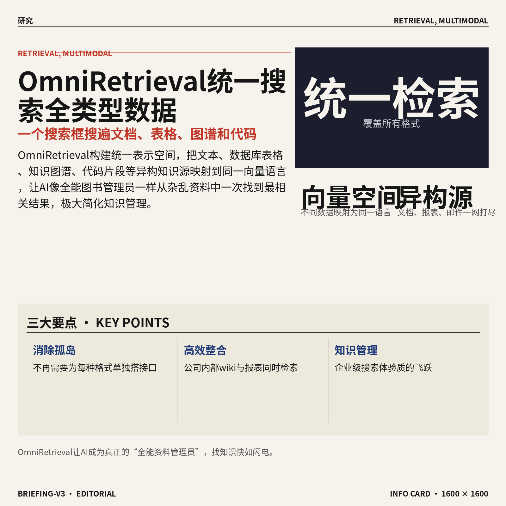

8. **OmniRetrieval（统一检索异构知识源的通用检索器）打造一个搜索框搜遍所有类型的数据。**  
它让同一个检索系统可以直接在**文本文档、数据库表格、知识图谱、程序代码片段甚至图片标注**等差异极大的**异构知识源**里找到答案 🔍，不再需要为每种格式单独搭建接口。该方法通过构建**统一表示空间**，把不同结构的数据映射到相同的向量语言，让 AI 像“全能图书管理员”一样面对杂乱的资料室一次找出最相关的材料。对需要同时查阅公司内部 wiki、报表和邮件的知识管理产品极具整合价值。[论文详情(briefing)](https://huggingface.co/papers/2605.29250)

![OmniRetrieval（统一检索异构知识源的通用检索器）打造一个搜索框搜遍所有类型的数据](https://image.pollinations.ai/prompt/OmniRetrieval%EF%BC%88%E7%BB%9F%E4%B8%80%E6%A3%80%E7%B4%A2%E5%BC%82%E6%9E%84%E7%9F%A5%E8%AF%86%E6%BA%90%E7%9A%84%E9%80%9A%E7%94%A8%E6%A3%80%E7%B4%A2%E5%99%A8%EF%BC%89%E6%89%93%E9%80%A0%E4%B8%80%E4%B8%AA%E6%90%9C%E7%B4%A2%E6%A1%86%E6%90%9C%E9%81%8D%E6%89%80%E6%9C%89%E7%B1%BB%E5%9E%8B%E7%9A%84%E6%95%B0%E6%8D%AE.%20OmniRetrieval%EF%BC%88%E7%BB%9F%E4%B8%80%E6%A3%80%E7%B4%A2%E5%BC%82%E6%9E%84%E7%9F%A5%E8%AF%86%E6%BA%90%E7%9A%84%E9%80%9A%E7%94%A8%E6%A3%80%E7%B4%A2%E5%99%A8%EF%BC%89%E6%89%93%E9%80%A0%E4%B8%80%E4%B8%AA%E6%90%9C%E7%B4%A2%E6%A1%86%E6%90%9C%E9%81%8D%E6%89%80%E6%9C%89%E7%B1%BB%E5%9E%8B%E7%9A%84%E6%95%B0%E6%8D%AE%E3%80%82%20%E5%AE%83%E8%AE%A9%E5%90%8C%E4%B8%80%E4%B8%AA%E6%A3%80%E7%B4%A2%E7%B3%BB%E7%BB%9F%E5%8F%AF%E4%BB%A5%E7%9B%B4%E6%8E%A5%E5%9C%A8%E6%96%87%E6%9C%AC%E6%96%87%E6%A1%A3%E3%80%81%E6%95%B0%E6%8D%AE%E5%BA%93%E8%A1%A8%E6%A0%BC%E3%80%81%E7%9F%A5%E8%AF%86%E5%9B%BE%E8%B0%B1%E3%80%81%E7%A8%8B%E5%BA%8F%2C%20technical%20infographic%20diagram%2C%20architecture%20flowchart%2C%20clean%20vector%20illustration%2C%20educational%20style%2C%20no%20text%20overlay%2C%20modern%20minimal%2C%20wide%20aspect?width=1200&height=675&nologo=true&seed=11024)

### 🟡 行业展望与社会影响

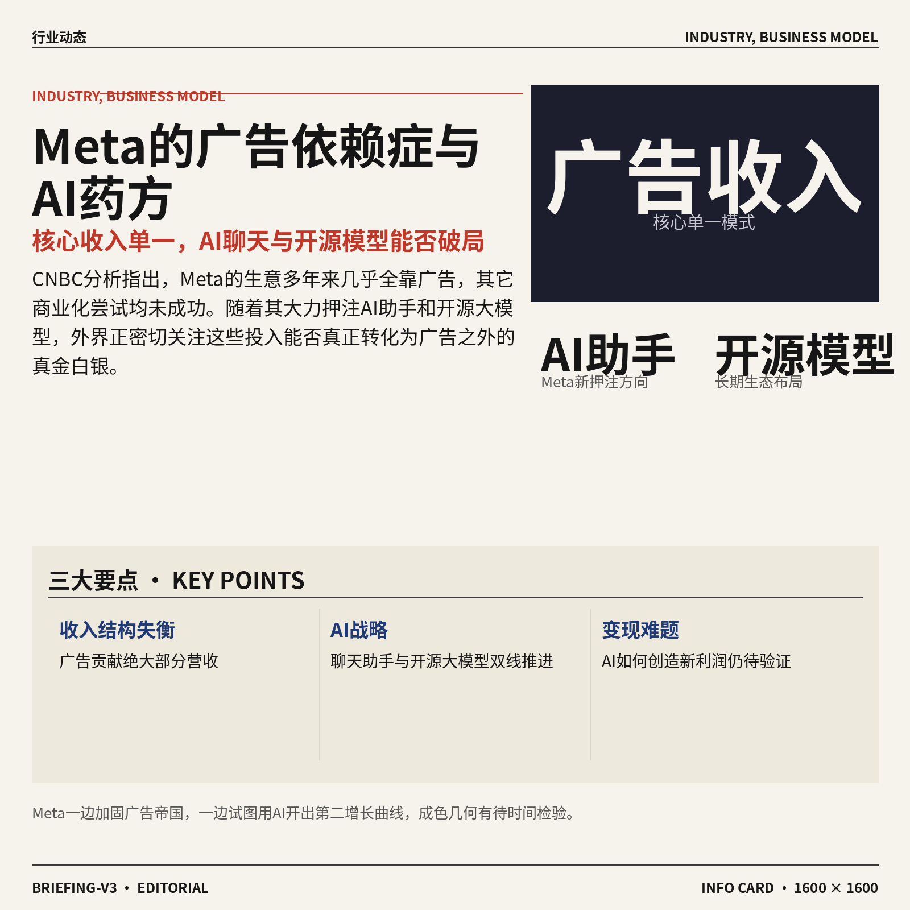

1. **Meta 一直只靠广告赚钱，AI 能带来不同吗？**
   CNBC 分析指出，Meta 的核心商业模式多年来严重依赖广告收入，其它商业化尝试屡屡受挫。随着 Meta 大举投入 AI 聊天助手和开源大模型，如何将 AI 技术转化为除广告之外的真实营收，成为其面临的关键挑战。外界正在观察，Meta 是否能借 AI 跳出单一收入结构的局限 🧐。[完整分析报道(briefing)](https://news.google.com/rss/articles/CBMipwFBVV95cUxQZDRSYlBpNGJRb2hpYld2dFE3WDB2UjJ0UTE0REYzQXNaVE9xWldNYnBtYUJ1TUh5eGppZEVpMHo1dlVLb2RQSVQ5cmVzT2VHeUNjTGRCdUZPeHRwRHh6Qks4MUNQcEpTbFZBV0Nubm5tckY1QVFRaFRjSFdkM3RJUGctMVRGM3BIV3RkSHBkbzZWcUZkUEhXLTFQU3JiUjZ3TmVrN051Z9IBrAFBVV95cUxQM0Y0NUZ6YjVSVFYwVUtzdjNqZTI0SFRyY2lobUVva19ZNnkwblFMWTdETC1fUzdaWUt4dFNTam9pLUZGbTRDX3V0X01kSlNrbng2UkswdlpudXBVUzNnaVMzV1pGTy1CczFqenYwZk05eWd2X3RQb1paN2QzcW1pbkNqVWx2ajZjZF84UUtCVGluekdaRHJoQzJfR012VmJjRkV2amVnb29LY3Zy?oc=5)


2. **一家公司一个月在 Claude 上花费 5 亿美元，只因未设置用量上限。**
   据 Ramp（一家主打企业支出管理与金融分析的工具）的分析，某企业在使用 Claude 时没有对 API 调用做预算封顶，导致单月账单飙升至 5 亿美元 💸。这个夸张案例给所有公司敲响了警钟：将 AI 融入业务时，必须建立严格的用量监控和成本追踪机制，否则庞大的推理费用可能瞬间吞噬利润。[完整报道(briefing)](https://the-decoder.com/one-company-reportedly-spent-500-million-on-claude-in-one-month-after-failing-to-cap-ai-usage/)


3. **软银（SoftBank，日本跨国投资巨头）宣布将投资 750 亿欧元在法国建设数据中心。**
   软银表示，目标是在法国开发和运营高达 5 吉瓦的新增数据中心容量，以满足全球 AI 计算需求的海量增长 🏭。这笔巨额投入将显著提升欧洲的云计算和模型训练能力，也折射出科技巨头对**算力基础设施**的竞争已进入白热化阶段。[TechCrunch 报道(briefing)](https://techcrunch.com/2026/05/30/softbank-says-it-will-invest-up-to-e75-billion-to-build-french-data-centers/)

![软银（SoftBank，日本跨国投资巨头）宣布将投资 750 亿欧元在法国建设数据中心](https://image.pollinations.ai/prompt/%E8%BD%AF%E9%93%B6%EF%BC%88SoftBank%EF%BC%8C%E6%97%A5%E6%9C%AC%E8%B7%A8%E5%9B%BD%E6%8A%95%E8%B5%84%E5%B7%A8%E5%A4%B4%EF%BC%89%E5%AE%A3%E5%B8%83%E5%B0%86%E6%8A%95%E8%B5%84%20750%20%E4%BA%BF%E6%AC%A7%E5%85%83%E5%9C%A8%E6%B3%95%E5%9B%BD%E5%BB%BA%E8%AE%BE%E6%95%B0%E6%8D%AE%E4%B8%AD%E5%BF%83.%20%E8%BD%AF%E9%93%B6%EF%BC%88SoftBank%EF%BC%8C%E6%97%A5%E6%9C%AC%E8%B7%A8%E5%9B%BD%E6%8A%95%E8%B5%84%E5%B7%A8%E5%A4%B4%EF%BC%89%E5%AE%A3%E5%B8%83%E5%B0%86%E6%8A%95%E8%B5%84%20750%20%E4%BA%BF%E6%AC%A7%E5%85%83%E5%9C%A8%E6%B3%95%E5%9B%BD%E5%BB%BA%E8%AE%BE%E6%95%B0%E6%8D%AE%E4%B8%AD%E5%BF%83%E3%80%82%20%E8%BD%AF%E9%93%B6%E8%A1%A8%E7%A4%BA%EF%BC%8C%E7%9B%AE%E6%A0%87%E6%98%AF%E5%9C%A8%E6%B3%95%E5%9B%BD%E5%BC%80%E5%8F%91%E5%92%8C%E8%BF%90%E8%90%A5%E9%AB%98%E8%BE%BE%205%20%E5%90%89%E7%93%A6%E7%9A%84%E6%96%B0%E5%A2%9E%E6%95%B0%E6%8D%AE%E4%B8%AD%E5%BF%83%E5%AE%B9%E9%87%8F%EF%BC%8C%E4%BB%A5%E6%BB%A1%2C%20technical%20infographic%20diagram%2C%20architecture%20flowchart%2C%20clean%20vector%20illustration%2C%20educational%20style%2C%20no%20text%20overlay%2C%20modern%20minimal%2C%20wide%20aspect?width=1200&height=675&nologo=true&seed=10869)

4. **Snowflake（一家云数据仓库平台）CEO 表示，强劲财报证明软件公司需要新定价模式才能在 AI 时代繁荣。**
   Snowflake 的最新业绩大超预期，CEO 指出，传统的按用户席位付费的软件订阅模式已难以匹配 AI 工作负载的动态消耗。企业必须转向基于**compute（计算用量）**或实际消耗的弹性计费方式，才能让客户灵活扩展 AI 应用，并把技术真正转化为商业价值。[Fortune 报道(briefing)](https://news.google.com/rss/articles/CBMieEFVX3lxTFA2WDdOQWFkYUZEbHpkTkpzekpCN0cxQUJZemo5R3JDeHNKcW53dzg2bWs1Q1lCVlJVd0lvRzFjYXZESnB3ak4tOXp0ZEp5M3ZQaEdEN2dQaU1oZGVDOWNyTGExRHZGaGI0U3JFcnZqSkRNZ2dRRlZBTA?oc=5)

![Snowflake（一家云数据仓库平台）CEO 表示，强劲财报证明软件公司需要新定价模式才能在 AI 时代繁荣](https://image.pollinations.ai/prompt/Snowflake%EF%BC%88%E4%B8%80%E5%AE%B6%E4%BA%91%E6%95%B0%E6%8D%AE%E4%BB%93%E5%BA%93%E5%B9%B3%E5%8F%B0%EF%BC%89CEO%20%E8%A1%A8%E7%A4%BA%EF%BC%8C%E5%BC%BA%E5%8A%B2%E8%B4%A2%E6%8A%A5%E8%AF%81%E6%98%8E%E8%BD%AF%E4%BB%B6%E5%85%AC%E5%8F%B8%E9%9C%80%E8%A6%81%E6%96%B0%E5%AE%9A%E4%BB%B7%E6%A8%A1%E5%BC%8F%E6%89%8D%E8%83%BD%E5%9C%A8%20AI%20%E6%97%B6%E4%BB%A3%E7%B9%81%E8%8D%A3.%20Snowflake%EF%BC%88%E4%B8%80%E5%AE%B6%E4%BA%91%E6%95%B0%E6%8D%AE%E4%BB%93%E5%BA%93%E5%B9%B3%E5%8F%B0%EF%BC%89CEO%20%E8%A1%A8%E7%A4%BA%EF%BC%8C%E5%BC%BA%E5%8A%B2%E8%B4%A2%E6%8A%A5%E8%AF%81%E6%98%8E%E8%BD%AF%E4%BB%B6%E5%85%AC%E5%8F%B8%E9%9C%80%E8%A6%81%E6%96%B0%E5%AE%9A%E4%BB%B7%E6%A8%A1%E5%BC%8F%E6%89%8D%E8%83%BD%E5%9C%A8%20AI%20%E6%97%B6%E4%BB%A3%E7%B9%81%E8%8D%A3%E3%80%82%20Snowflake%20%E7%9A%84%E6%9C%80%E6%96%B0%E4%B8%9A%E7%BB%A9%E5%A4%A7%E8%B6%85%E9%A2%84%E6%9C%9F%EF%BC%8CCEO%2C%20technical%20infographic%20diagram%2C%20architecture%20flowchart%2C%20clean%20vector%20illustration%2C%20educational%20style%2C%20no%20text%20overlay%2C%20modern%20minimal%2C%20wide%20aspect?width=1200&height=675&nologo=true&seed=10900)

5. **OpenAI 的 Codex 现已能自主操作你的 Windows 电脑，自动找 Bug 和测试应用。**
   OpenAI 让 Codex 获得了对 **Windows 桌面环境的自主操控能力**，它能够像人类一样点击、输入并排查软件缺陷 🖱️。这标志着 AI Agent 正从单纯的代码生成，迈向实际操作系统交互，未来有望让软件测试和日常运维的效率得到质的飞跃。[解码器报道(briefing)](https://the-decoder.com/openais-codex-can-now-operate-your-windows-pc-autonomously-hunting-bugs-and-testing-apps-on-its-own/)


6. **OpenAI 升级 GPT-5.5 Instant（轻量级快速文本模型）的可读性，并逐步淘汰两款旧模型。**
   OpenAI 为 GPT-5.5 Instant


### 🟣 开源TOP项目

### 🔴 社媒分享

1. **Anthropic 公开沙盒（Sandboxing，AI 安全限制机制）文档，详解如何跨产品安全约束 Claude。**
Simon Willison（知名独立开发者）难得地点赞了一篇科技公司的安全文档 🧐。他常吐槽多数产品的沙盒策略**写得不清不楚**，但 Anthropic 这次把 Claude 在不同产品里的**隔离与限制方式**讲得非常透彻。沙盒（Sandboxing）本质就是给 AI 画个“活动范围”，防止它接触到不该碰的系统权限或数据，这份文档对想在企业级场景安全落地 AI 的团队参考价值很高。[Anthropic 官方工程博客(briefing)](https://www.anthropic.com/engineering/how-we-contain-claude) [Simon Willison 评论原文(briefing)](https://simonwillison.net/2026/May/30/how-we-contain-claude/#atom-everything)


2. **OpenRouter（整合多家大模型 API 的统一调度平台）获 1.13 亿美元 B 轮融资。**
OpenRouter 刚宣布完成 **1.13 亿美元 B 轮融资** 💰，这家平台的核心价值在于 **模型路由（Model Routing）**—— 也就是根据用户的任务复杂度和预算，自动从上百种模型里挑出最合适的那一个来响应。这意味着用同一套 API 就能无缝切换 GPT、Claude、Gemini 等模型，极大降低了 AI 应用开发的选型成本。此次大额融资也反映出市场对“模型调度中间层”这条赛道越来越看重。[官方融资公告(briefing)](https://openrouter.ai/announcements/series-b)


3. **安永加拿大网络安全报告被曝大量引用为 AI 幻觉（Hallucination）产物。**
GPTZero（一款专门检测文本是否由 AI 生成的工具）调查发现，安永加拿大（EY Canada）发布的一份网络安全报告中 **大部分文献引用都是虚构的** ⚠️。这正是典型的 **AI 幻觉（Hallucination）** —— 模型会自信地编造出看似权威但根本不存在的论文、作者或数据。这件事给所有用 AI 辅助写报告的业务和行政同事提了个醒：**AI 生成的内容必须人工交叉核查**，尤其涉及金融、法律、安全等专业领域时绝不能“一键引用”。[GPTZero 调查报告(briefing)](https://gptzero.me/investigations/ey)


---

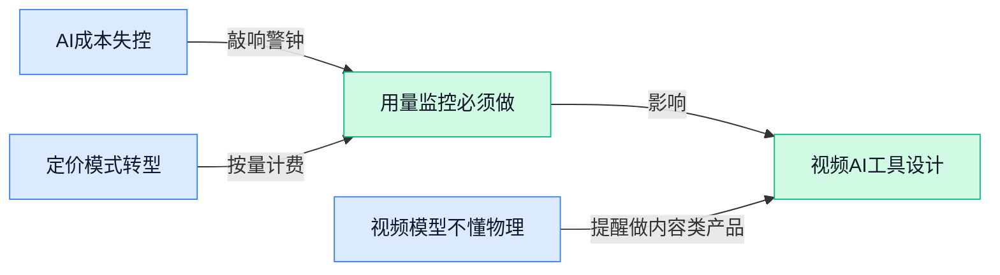
```mermaid
graph LR
    A[AI成本失控] -->|敲响警钟| B[用量监控必须做]
    C[定价模式转型] -->|按量计费| B
    B -->|影响| D[视频AI工具设计]
    E[视频模型不懂物理] -->|提醒做内容类产品| D
    classDef blue fill:#dbeafe,stroke:#3b82f6,color:#111827
    classDef green fill:#d1fae5,stroke:#10b981,color:#111827
    class A,C,E blue
    class B,D green
```

### 📊 行业洞察（今日 3 条）

1. 有公司一个月在Claude上烧掉5亿美元，Google紧急修复Gemini配额Bug
  【洞察】AI成本管理不只是技术问题，更是公司生存问题——连大企业都会因为没用对工具设置上限而翻车，创业者更得把用量监控当作基础设施，而不是“以后再说”。

2. Snowflake CEO说传统订阅制已死，OpenRouter靠模型调度拿到1.13亿美元融资
  【洞察】AI时代软件定价正在从“按人头收费”转向“按实际消耗计费”，模型调度中间层（帮你在不同AI模型间自动选最合适的那个）成了资本热捧的新赛道，说明“用AI”这件事复杂度已经高到需要专业中间商来打理。

3. YoCausal测试说视频模型不懂物理因果，EarlyTom则让视频分析快了好几倍
  【洞察】视频AI呈两极分化：生成侧还在补“逻辑不及格”的课，分析侧则在卷“更快更便宜”——做视频工具的公司要分清自己是在生成端还是理解端发力，两条路的产品逻辑完全不同。

### 💭 对我们的启发（今日 2 条）

1. 安永加拿大报告被查出大量AI编造的假引用，说明AI幻觉在专业内容领域是商业级风险。我们的视频剪辑软件如果接入AI写脚本或生成字幕功能，必须内置人工核查节点，不能直接交付未经确认的文案给品牌商。

2. CollectionLoRA用一个模型装进50种视觉风格，GenClaw用代码控制图像生成让修改像改文字一样简单，两件事加起来意味着：多风格、可编辑的视频模板将成为基础能力。我们的剪辑工具需要有“一键批量生成50种风格版本”的能力，帮品牌商快速试不同创意方向，而不是让他们手动切来切去。

