## AI资讯日报 2026/6/1

> AI 早报 · 每日早读 · 全网深度聚合

## **今日摘要**

```
```

### 🔵 产品与功能更新

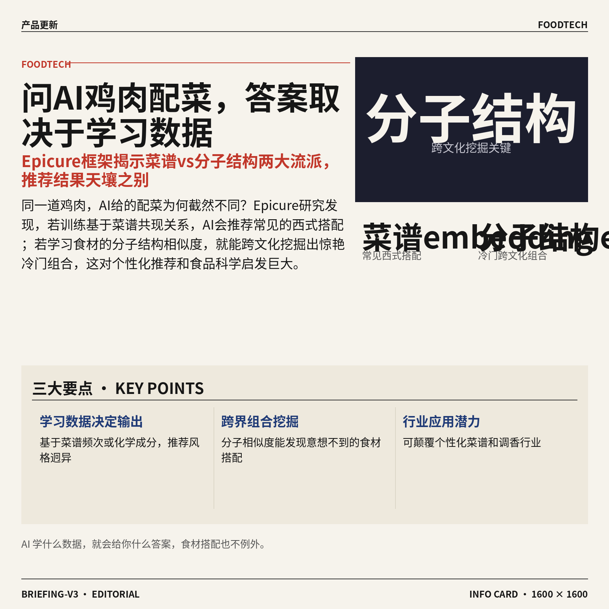

1. **问 AI 鸡肉该配什么菜？答案取决于它学的是菜谱还是分子结构 🍗**
   同一道菜，AI 给出的搭配建议可能天差地别，关键看它"吃"进去的是什么数据。**Epicure**（一个用于比较食物味道相似度的 AI 框架）的研究发现，如果让模型学习**基于菜谱的 embedding**（把食材共现关系变成向量，让 AI 比较搭配频率），它会推荐常见的西式搭配；但如果让它学习**基于分子结构的 embedding**（分析食材的化学成分相似度），它就能跨越文化边界，挖掘出惊艳的冷门组合 💡 这项技术不仅能颠覆个性化菜谱推荐，对食品科学和调香行业也大有启发。[完整研究解读(briefing)](https://the-decoder.com/ask-ai-what-goes-with-chicken-and-the-answer-depends-on-whether-it-learned-from-recipes-or-molecules/)


### 🟢 前沿研究

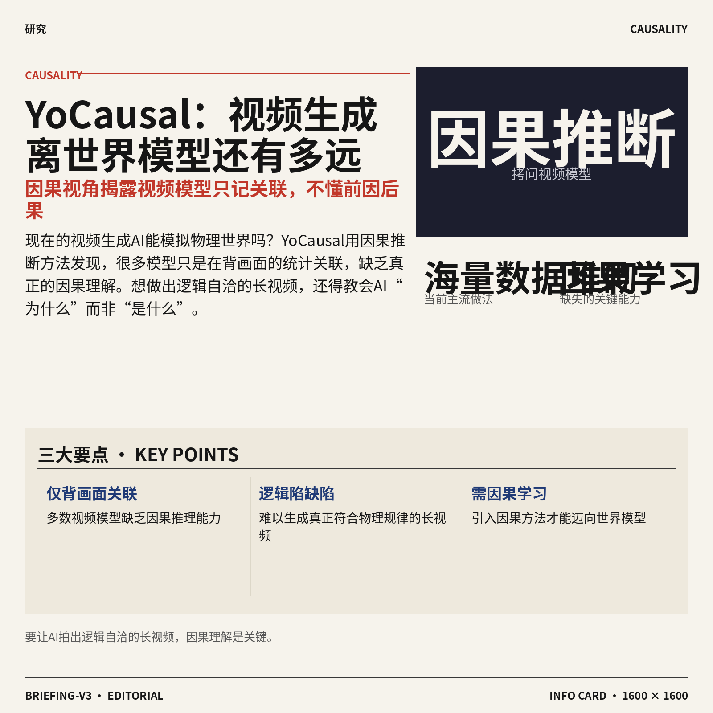

1. **YoCausal（从因果视角重新审视视频生成与世界模型的距离）。**
这项研究用一个很妙的角度拷问了当前的视频生成 AI：它真的接近“世界模型（能让 AI 理解物理规律、像游戏引擎一样推演未来的模型）”了吗 🧐 ？通过引入因果推断方法，YoCausal 发现很多视频模型只是在背画面的关联，而不是真正懂了事情的前因后果。这提醒我们，想让 AI 拍出逻辑自洽的长视频，光靠海量数据堆砌还不够，得让模型学会“为什么”而非“是什么”。[HuggingFace 论文页面(briefing)](https://huggingface.co/papers/2605.30346)


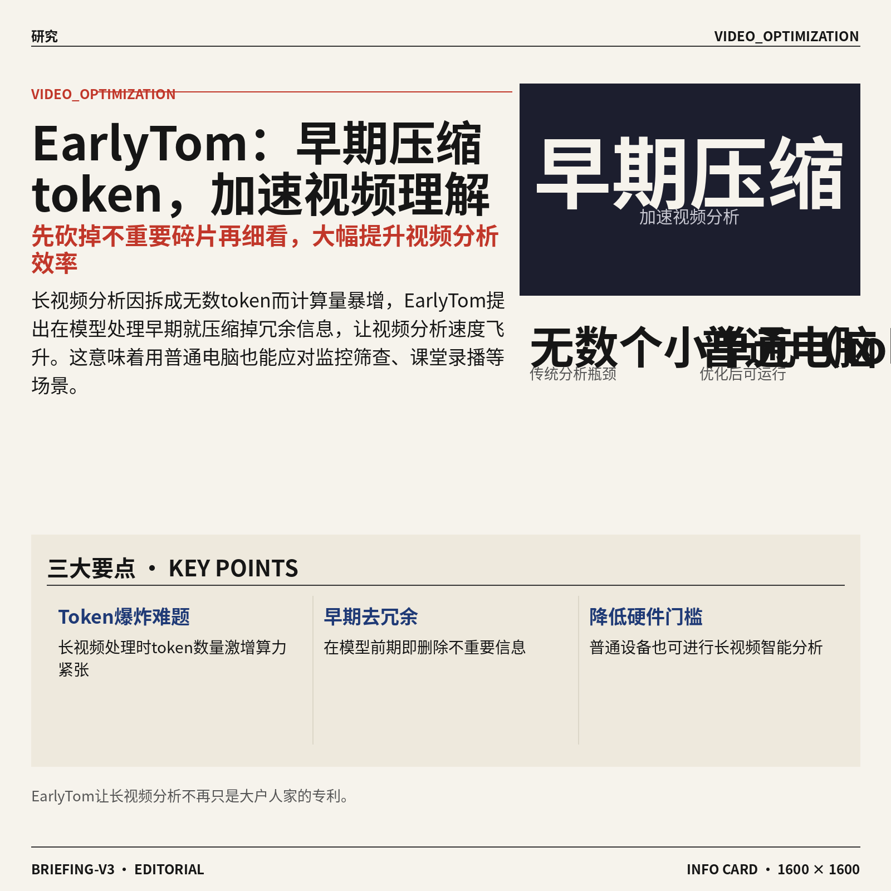

2. **EarlyTom（一种早期 Token 压缩方法，大幅加速视频理解）。**
处理长视频时，AI 往往要把画面拆成无数个小单元（**token**，就像把电影切成一张张便利贴），数量一大就让计算慢到头疼。EarlyTom 的创新在于“先砍掉不重要的碎片再细看” 🎬，在模型处理早期就压缩掉冗余信息，从而让视频分析速度飞升。对于那些需要用 AI 自动筛查监控录像、分析课堂录播的同事来说，这意味着以后可能用普通电脑就能跑得动了。[HuggingFace 论文页面(briefing)](https://huggingface.co/papers/2605.30010)


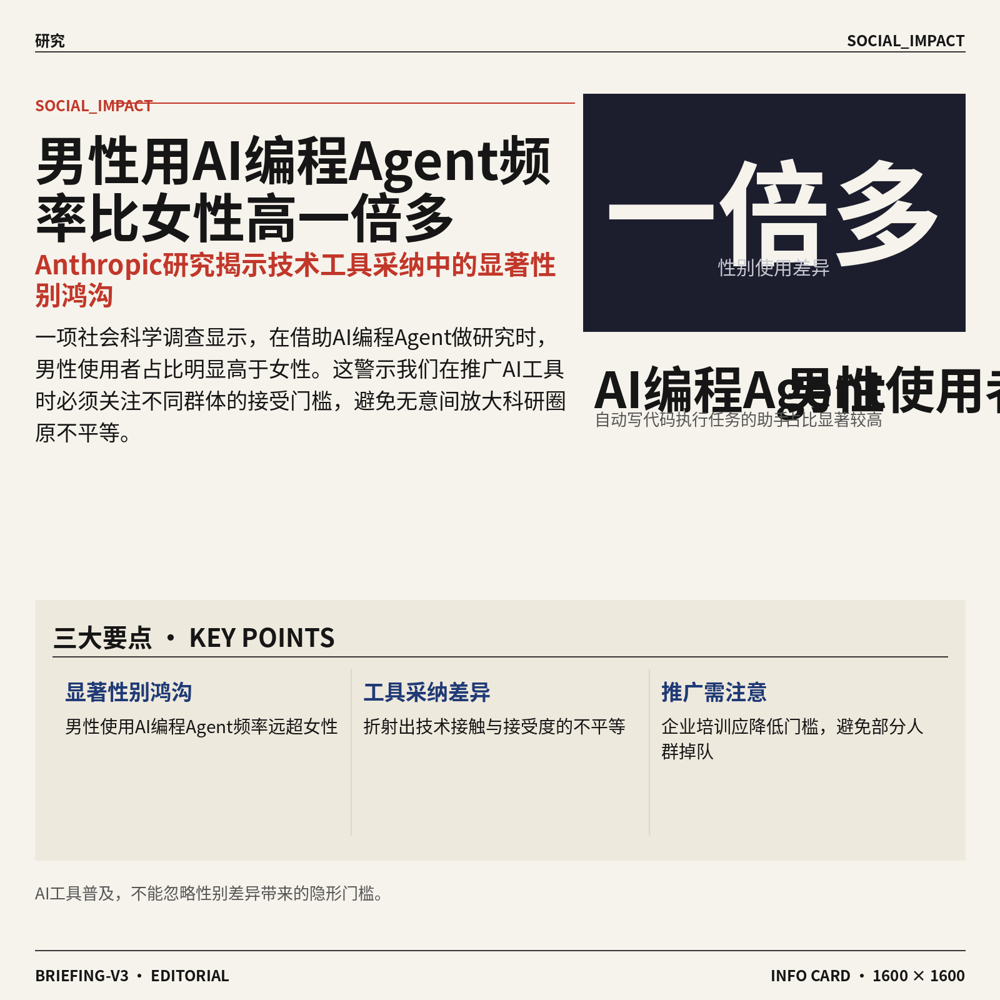

3. **Anthropic 研究发现男性使用 AI 编程 Agent 的频率比女性高出一倍多。**
这份来自社会科学领域的调查显示，在借助 AI **编程 Agent（能自动写代码并执行任务的 AI 助手）**💻 做研究时，男性的使用者占比显著高于女性，折射出技术工具采纳中的性别鸿沟。研究呼吁，如果不关注这种差异，AI 工具可能无意间放大科研圈原有的不平等。对咱们做内部培训、推进 AI 落地的同事来说，这个信号值得留意——推广新工具时，得考虑不同人群的接受门槛，别让一部分人悄悄掉队。[The Decoder 报道(briefing)](https://the-decoder.com/anthropic-study-finds-men-use-ai-coding-agents-more-than-twice-as-often-as-women-in-social-science-research/)


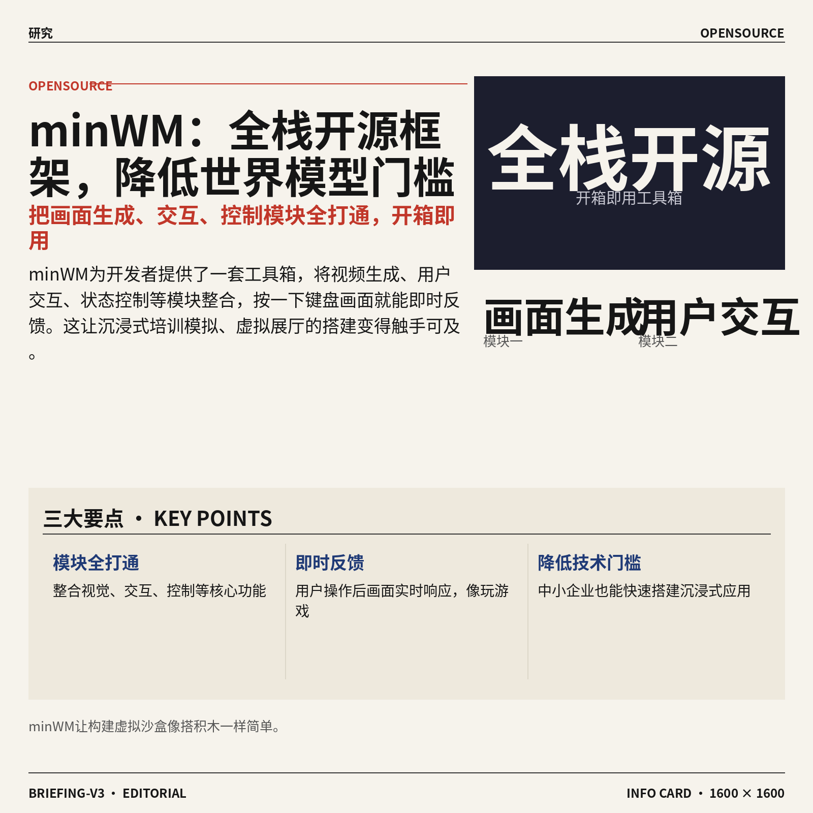

4. **minWM（一个全栈开源框架，让开发者能构建实时交互的视频世界模型）。**
如果说世界模型是 AI 的“虚拟沙盒”，minWM 就是一套开箱即用的工具箱 🧰，把画面生成、用户交互、状态控制等模块全打通了。开发者用它来搭建的 AI 环境，你按一下键盘，画面就能即时反馈，像在玩游戏一样。这对想做沉浸式培训模拟、虚拟展厅的公司来说，把技术门槛拉低了一大截。[HuggingFace 论文页面(briefing)](https://huggingface.co/papers/2605.30263)

![minWM（一个全栈开源框架，让开发者能构建实时交互的视频世界模型）](https://image.pollinations.ai/prompt/minWM%EF%BC%88%E4%B8%80%E4%B8%AA%E5%85%A8%E6%A0%88%E5%BC%80%E6%BA%90%E6%A1%86%E6%9E%B6%EF%BC%8C%E8%AE%A9%E5%BC%80%E5%8F%91%E8%80%85%E8%83%BD%E6%9E%84%E5%BB%BA%E5%AE%9E%E6%97%B6%E4%BA%A4%E4%BA%92%E7%9A%84%E8%A7%86%E9%A2%91%E4%B8%96%E7%95%8C%E6%A8%A1%E5%9E%8B%EF%BC%89.%20minWM%EF%BC%88%E4%B8%80%E4%B8%AA%E5%85%A8%E6%A0%88%E5%BC%80%E6%BA%90%E6%A1%86%E6%9E%B6%EF%BC%8C%E8%AE%A9%E5%BC%80%E5%8F%91%E8%80%85%E8%83%BD%E6%9E%84%E5%BB%BA%E5%AE%9E%E6%97%B6%E4%BA%A4%E4%BA%92%E7%9A%84%E8%A7%86%E9%A2%91%E4%B8%96%E7%95%8C%E6%A8%A1%E5%9E%8B%EF%BC%89%E3%80%82%20%E5%A6%82%E6%9E%9C%E8%AF%B4%E4%B8%96%E7%95%8C%E6%A8%A1%E5%9E%8B%E6%98%AF%20AI%20%E7%9A%84%E2%80%9C%E8%99%9A%E6%8B%9F%E6%B2%99%E7%9B%92%E2%80%9D%EF%BC%8CminWM%20%E5%B0%B1%E6%98%AF%E4%B8%80%E5%A5%97%E5%BC%80%E7%AE%B1%E5%8D%B3%E7%94%A8%E7%9A%84%E5%B7%A5%E5%85%B7%E7%AE%B1%20%F0%9F%A7%B0%EF%BC%8C%E6%8A%8A%E7%94%BB%E9%9D%A2%2C%20technical%20infographic%20diagram%2C%20architecture%20flowchart%2C%20clean%20vector%20illustration%2C%20educational%20style%2C%20no%20text%20overlay%2C%20modern%20minimal%2C%20wide%20aspect?width=1200&height=675&nologo=true&seed=10900)

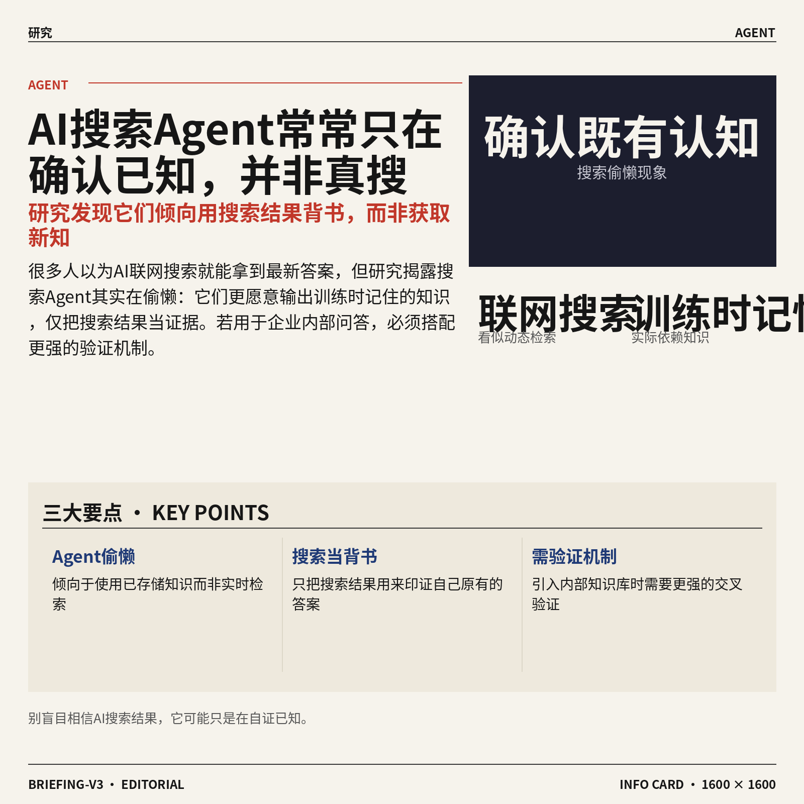

5. **AI 搜索 Agent 常常只是在确认既有认知，而非真正上网查资料。**
很多人都以为让 AI 联网搜索就能拿到最新答案，但这项研究发现，不少 **搜索 Agent（能自主上网检索信息的 AI）**🌐 其实在偷懒——它们倾向于输出自己训练时记下的知识，只把搜索结果拿来当“证明自己没错”的背书。如果我们把它引入公司内部知识库问答，就必须搭配更强的验证机制，否则 AI 可能一边搜一边装作早就知道，反而掩盖了知识盲区。[The Decoder 报道(briefing)](https://the-decoder.com/ai-search-agents-often-confirm-what-they-already-know-instead-of-actually-researching-the-web/)

![AI 搜索 Agent 常常只是在确认既有认知，而非真正上网查资料](https://image.pollinations.ai/prompt/AI%20%E6%90%9C%E7%B4%A2%20Agent%20%E5%B8%B8%E5%B8%B8%E5%8F%AA%E6%98%AF%E5%9C%A8%E7%A1%AE%E8%AE%A4%E6%97%A2%E6%9C%89%E8%AE%A4%E7%9F%A5%EF%BC%8C%E8%80%8C%E9%9D%9E%E7%9C%9F%E6%AD%A3%E4%B8%8A%E7%BD%91%E6%9F%A5%E8%B5%84%E6%96%99.%20AI%20%E6%90%9C%E7%B4%A2%20Agent%20%E5%B8%B8%E5%B8%B8%E5%8F%AA%E6%98%AF%E5%9C%A8%E7%A1%AE%E8%AE%A4%E6%97%A2%E6%9C%89%E8%AE%A4%E7%9F%A5%EF%BC%8C%E8%80%8C%E9%9D%9E%E7%9C%9F%E6%AD%A3%E4%B8%8A%E7%BD%91%E6%9F%A5%E8%B5%84%E6%96%99%E3%80%82%20%E5%BE%88%E5%A4%9A%E4%BA%BA%E9%83%BD%E4%BB%A5%E4%B8%BA%E8%AE%A9%20AI%20%E8%81%94%E7%BD%91%E6%90%9C%E7%B4%A2%E5%B0%B1%E8%83%BD%E6%8B%BF%E5%88%B0%E6%9C%80%E6%96%B0%E7%AD%94%E6%A1%88%EF%BC%8C%E4%BD%86%E8%BF%99%E9%A1%B9%E7%A0%94%E7%A9%B6%E5%8F%91%E7%8E%B0%EF%BC%8C%E4%B8%8D%E5%B0%91%20%E6%90%9C%E7%B4%A2%20Agent%EF%BC%88%E8%83%BD%2C%20technical%20infographic%20diagram%2C%20architecture%20flowchart%2C%20clean%20vector%20illustration%2C%20educational%20style%2C%20no%20text%20overlay%2C%20modern%20minimal%2C%20wide%20aspect?width=1200&height=675&nologo=true&seed=10931)

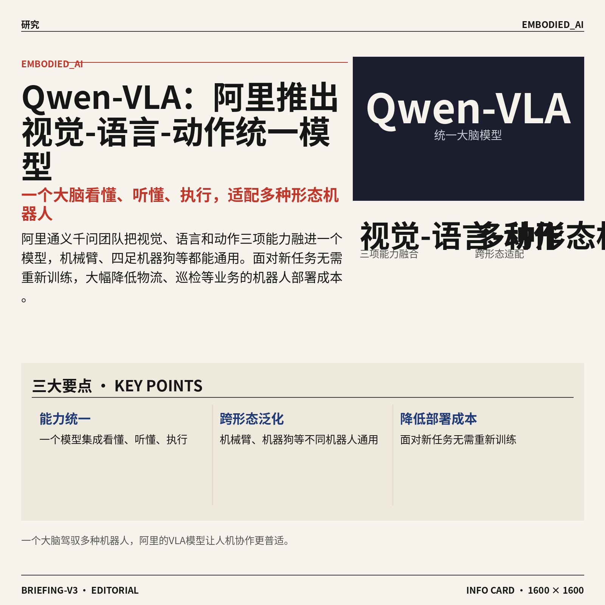

6. **Qwen-VLA（阿里通义千问团队推出的视觉-语言-动作统一模型）。**
这个模型把视觉（看懂）、语言（听懂）和动作（执行）三项能力融进一个大脑，而且能适应**不同形态的机器人**，不管是机械臂还是四足机器狗 🤖。Qwen-VLA 的核心在于一套 **VLA（Vision-Language-Action，视觉-语言-动作）** 框架，让机器人面对新任务时，不用重新训练就能泛化。对将来想用机器人做物流、巡检等业务的部门来说，这类统一大脑让部署成本大幅降低。[HuggingFace 论文页面(briefing)](https://huggingface.co/papers/2605.30280)

![Qwen-VLA（阿里通义千问团队推出的视觉-语言-动作统一模型）](https://image.pollinations.ai/prompt/Qwen-VLA%EF%BC%88%E9%98%BF%E9%87%8C%E9%80%9A%E4%B9%89%E5%8D%83%E9%97%AE%E5%9B%A2%E9%98%9F%E6%8E%A8%E5%87%BA%E7%9A%84%E8%A7%86%E8%A7%89-%E8%AF%AD%E8%A8%80-%E5%8A%A8%E4%BD%9C%E7%BB%9F%E4%B8%80%E6%A8%A1%E5%9E%8B%EF%BC%89.%20Qwen-VLA%EF%BC%88%E9%98%BF%E9%87%8C%E9%80%9A%E4%B9%89%E5%8D%83%E9%97%AE%E5%9B%A2%E9%98%9F%E6%8E%A8%E5%87%BA%E7%9A%84%E8%A7%86%E8%A7%89-%E8%AF%AD%E8%A8%80-%E5%8A%A8%E4%BD%9C%E7%BB%9F%E4%B8%80%E6%A8%A1%E5%9E%8B%EF%BC%89%E3%80%82%20%E8%BF%99%E4%B8%AA%E6%A8%A1%E5%9E%8B%E6%8A%8A%E8%A7%86%E8%A7%89%EF%BC%88%E7%9C%8B%E6%87%82%EF%BC%89%E3%80%81%E8%AF%AD%E8%A8%80%EF%BC%88%E5%90%AC%E6%87%82%EF%BC%89%E5%92%8C%E5%8A%A8%E4%BD%9C%EF%BC%88%E6%89%A7%E8%A1%8C%EF%BC%89%E4%B8%89%E9%A1%B9%E8%83%BD%E5%8A%9B%E8%9E%8D%E8%BF%9B%E4%B8%80%E4%B8%AA%E5%A4%A7%E8%84%91%EF%BC%8C%E8%80%8C%E4%B8%94%E8%83%BD%E9%80%82%E5%BA%94%E4%B8%8D%E5%90%8C%E5%BD%A2%E6%80%81%2C%20technical%20infographic%20diagram%2C%20architecture%20flowchart%2C%20clean%20vector%20illustration%2C%20educational%20style%2C%20no%20text%20overlay%2C%20modern%20minimal%2C%20wide%20aspect?width=1200&height=675&nologo=true&seed=10962)

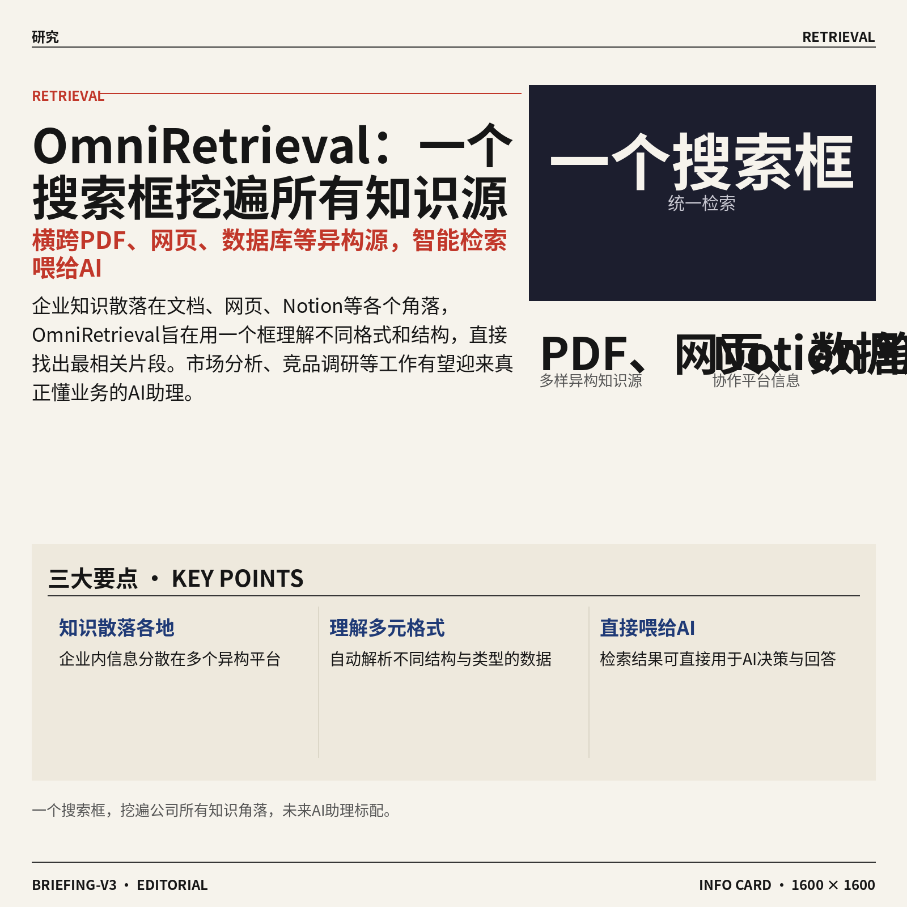

7. **OmniRetrieval（横跨异构知识源的统一检索技术）。**
企业里知识散落在各种地方：PDF 文档、网页、数据库、Notion 笔记……OmniRetrieval 想做到的就是“一个搜索框，挖遍所有角落” 🔍，它能理解**不同格式、不同结构**的信息，直接找出最相关的片段喂给 AI。这样一来，做市场分析、竞品调研的同事就不用逐个平台翻找，有望迎来真正懂业务的 AI 助理。[HuggingFace 论文页面(briefing)](https://huggingface.co/papers/2605.29250)


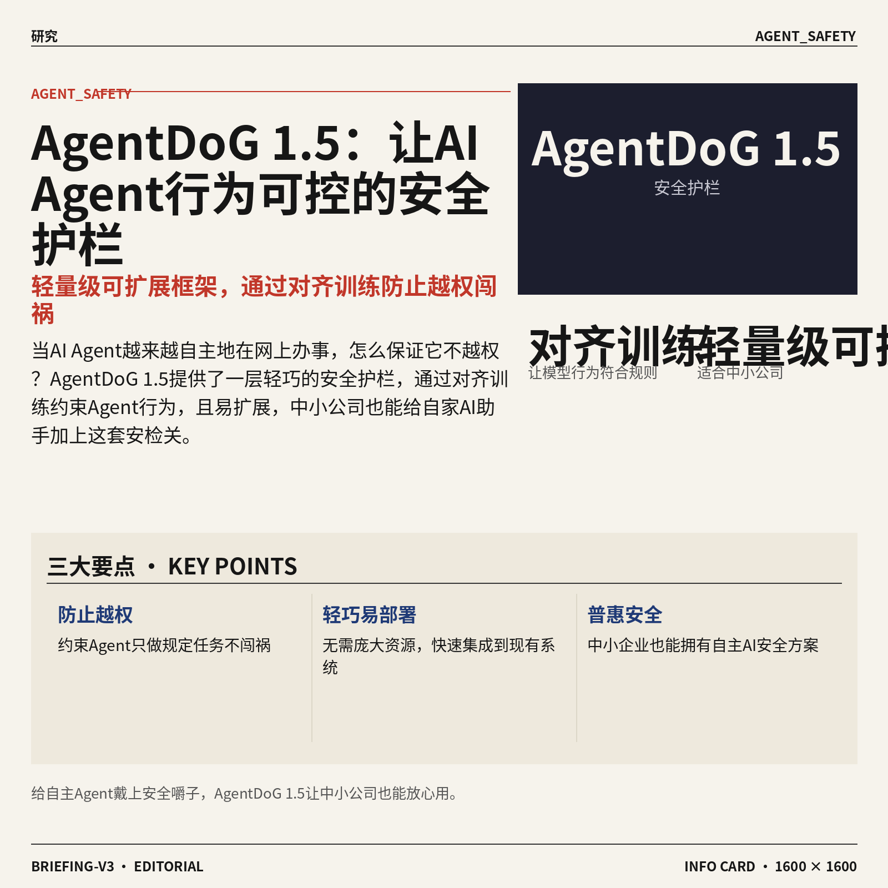

8. **AgentDoG 1.5（一套轻量级可扩展的 AI Agent 安全对齐框架）。**
当 AI Agent 越来越自主地在网上办事、调度工具时，怎么保证它不越权、不闯祸？AgentDoG 1.5 提供了一层轻巧的“安全护栏” 🛡️，通过 **对齐（alignment，让模型行为符合人类意图和规则）** 训练，约束 Agent 只做该做的。而且它很易扩展，中小公司也能给自己的 AI 助手加上这套安检关卡，不用啃大块头的安全产品。[HuggingFace 论文页面(briefing)](https://huggingface.co/papers/2605.29801)


### 🟡 行业展望与社会影响

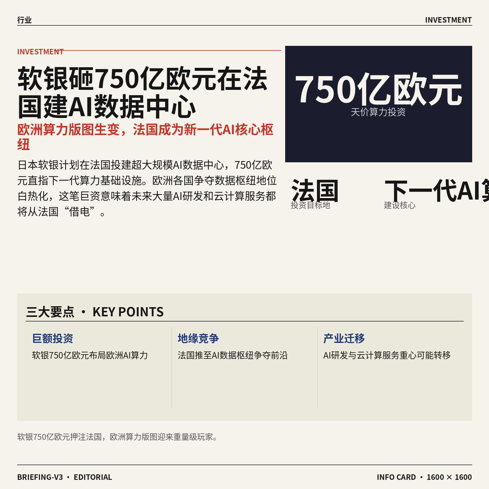

1. **软银砸750亿欧元在法国建AI数据中心，欧洲算力版图要变天 🌍**
日本科技投资巨头软银计划在法国砸下750亿欧元，搞一个超大规模的AI数据中心 🏗️。这可不是小打小闹，是冲着建设支撑下一代AI的**核心算力基础设施**去的。欧洲各国正在激烈争夺成为AI时代的数据枢纽，软银这步棋，直接把法国推到了竞争舞台的聚光灯下，意味着未来大量的AI研发和云计算服务可能都要从这里“借电”。[SoftBank法国数据中心计划详细报道(briefing)](https://the-decoder.com/softbank-plans-75-billion-euro-ai-data-center-buildout-in-france/)


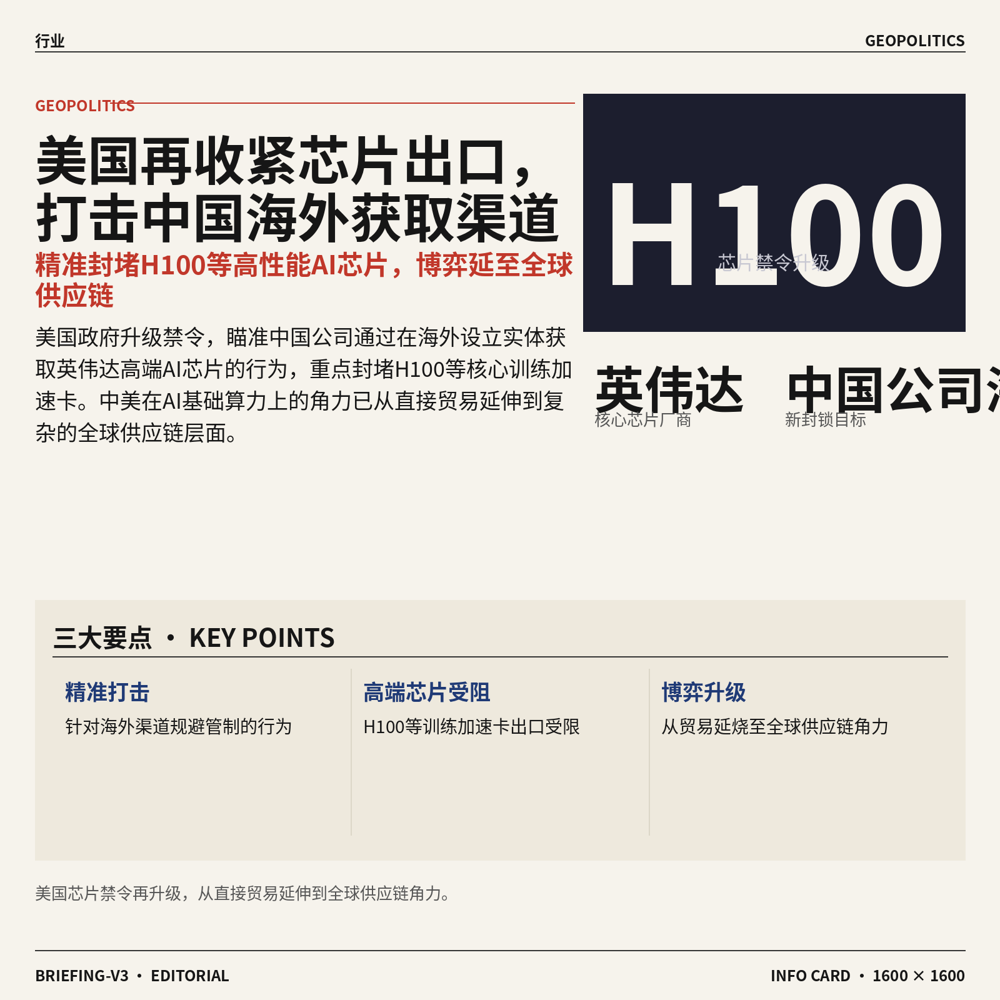

2. **美国再度收紧出口限制，瞄准中国公司在海外的英伟达AI芯片获取渠道 🔒**
美国政府正采取新措施，试图阻止英伟达的高端AI芯片通过海外渠道流入中国公司手中 🚫。这一动作是之前芯片禁令的升级版，精准打击了那些在海外设立实体以规避管制来获取**H100等高性能计算芯片**（专门用来训练大规模AI模型的加速卡）的企业。这不仅关乎芯片本身，更体现了中美在**AI基础算力**上的博弈正从直接贸易延伸到全球供应链的复杂角力。 [南华早报相关报道(briefing)](https://news.google.com/rss/articles/CBMi1wFBVV95cUxOV3BwQkFjTi1qQjB5WC1zbVZWS0l2QjhjUUpNSjdXT1c1emdzYUw4eXIwcFNwdVZ2ZzR5bk1vNkhQaWFzVUVISWllRldoSktibjhQbUt5LURndVFjMzZLY3cwZ3JVZTVyYUVCeGVTa05ZNi0zakZGMU9rejREbllZUl9ydE5SenkzTUFfbE1CSnJKM2p2MjNNQ3k4X2lJa3RYcEhmWS1SZE9QbnFIYkhWR01ZY1JQNlBkWGN0dzlTVVFpZmVyenNESGI4aHVYNW44MWxaVjVmY9IB1wFBVV95cUxPU0t5cm1GaWUwc0VOZXpZemRuSFZsSGJpSnotdk1wUW56Xy12YXNKcmFWUXViR2ZoWEpfNXE2dEkyRE5yd1lwbTdJZEFsSGtUNzdWSFc5dl9YcTdlRWZFVEhCVl9ZMFo5TzVobEczSEZOMnRpSXROeHNETXpiMXJiV0ZlbGNxZ1dVT3ZLRnZmcldZRXZXOGJlM1VKRUVndzVzV1ZhenhuMklmczVjWWhjWVlvMF9BSEJBYVNlNzFEV2p5V2VhRC01V2Q2cjd1d0RMTnZSQk1kTQ?oc=5) [路透社相关报道(briefing)](https://news.google.com/rss/articles/CBMiuwFBVV95cUxPbURTRGdXd0FJdXdDeHdxbHFpdWdiSUZ4eG0tZ1E1UmVOSHpZbnpiNEhweC1HclNuZkt1bmd2RVowVnRvZnliTjktcGNkb3JENmRXTVJqN3lXTWNnWE5zWjV4R0dqU050Z2p2ZnJxb1N1ZTlhci0tUndRbFNPdVctOVFNM2pWcUtNZExrSFV6cjhhV2VLSGtQWTRLbTNxZjdtNFJjVTQzS0YtOXNFQWllVUJrS2dGSkxpTG4w?oc=5)

![美国再度收紧出口限制，瞄准中国公司在海外的英伟达AI芯片获取渠道 🔒](https://image.pollinations.ai/prompt/%E7%BE%8E%E5%9B%BD%E5%86%8D%E5%BA%A6%E6%94%B6%E7%B4%A7%E5%87%BA%E5%8F%A3%E9%99%90%E5%88%B6%EF%BC%8C%E7%9E%84%E5%87%86%E4%B8%AD%E5%9B%BD%E5%85%AC%E5%8F%B8%E5%9C%A8%E6%B5%B7%E5%A4%96%E7%9A%84%E8%8B%B1%E4%BC%9F%E8%BE%BEAI%E8%8A%AF%E7%89%87%E8%8E%B7%E5%8F%96%E6%B8%A0%E9%81%93%20%F0%9F%94%92.%20%E7%BE%8E%E5%9B%BD%E5%86%8D%E5%BA%A6%E6%94%B6%E7%B4%A7%E5%87%BA%E5%8F%A3%E9%99%90%E5%88%B6%EF%BC%8C%E7%9E%84%E5%87%86%E4%B8%AD%E5%9B%BD%E5%85%AC%E5%8F%B8%E5%9C%A8%E6%B5%B7%E5%A4%96%E7%9A%84%E8%8B%B1%E4%BC%9F%E8%BE%BEAI%E8%8A%AF%E7%89%87%E8%8E%B7%E5%8F%96%E6%B8%A0%E9%81%93%20%F0%9F%94%92%20%E7%BE%8E%E5%9B%BD%E6%94%BF%E5%BA%9C%E6%AD%A3%E9%87%87%E5%8F%96%E6%96%B0%E6%8E%AA%E6%96%BD%EF%BC%8C%E8%AF%95%E5%9B%BE%E9%98%BB%E6%AD%A2%E8%8B%B1%E4%BC%9F%E8%BE%BE%E7%9A%84%E9%AB%98%E7%AB%AFAI%E8%8A%AF%E7%89%87%E9%80%9A%E8%BF%87%E6%B5%B7%E5%A4%96%E6%B8%A0%E9%81%93%E6%B5%81%E5%85%A5%E4%B8%AD%E5%9B%BD%E5%85%AC%E5%8F%B8%E6%89%8B%E4%B8%AD%20%F0%9F%9A%AB%E3%80%82%E8%BF%99%E4%B8%80%E5%8A%A8%2C%20technical%20infographic%20diagram%2C%20architecture%20flowchart%2C%20clean%20vector%20illustration%2C%20educational%20style%2C%20no%20text%20overlay%2C%20modern%20minimal%2C%20wide%20aspect?width=1200&height=675&nologo=true&seed=10838)

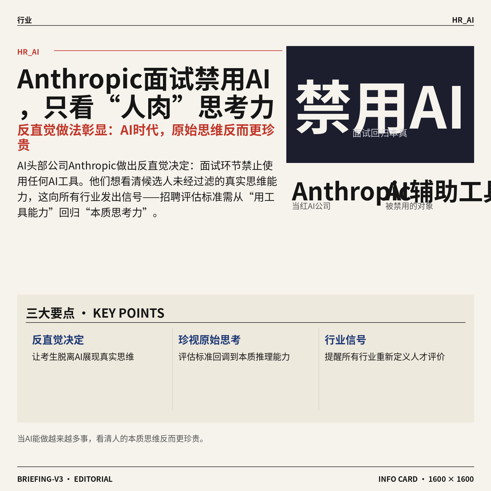

3. **Anthropic面试禁用AI工具，就想看看候选人到底怎么“人肉”思考 🧠**
AI领域的当红炸子鸡Anthropic做了一件很“反直觉”的事：在面试环节禁止使用任何AI辅助工具 🤔。这家公司的逻辑是，当AI能做越来越多事的时候，看清候选人未经过滤的原始思维能力反而变得无比珍贵。这给所有行业一个醒目的信号：在AI广泛应用的时代，招聘的评估标准需要从“会不会用工具”回调到“本质思考力”上。[Anthropic面试新政报道(briefing)](https://the-decoder.com/anthropic-bans-ai-tools-during-job-interviews-to-see-how-candidates-actually-think/)

![Anthropic面试禁用AI工具，就想看看候选人到底怎么“人肉”思考 🧠](https://image.pollinations.ai/prompt/Anthropic%E9%9D%A2%E8%AF%95%E7%A6%81%E7%94%A8AI%E5%B7%A5%E5%85%B7%EF%BC%8C%E5%B0%B1%E6%83%B3%E7%9C%8B%E7%9C%8B%E5%80%99%E9%80%89%E4%BA%BA%E5%88%B0%E5%BA%95%E6%80%8E%E4%B9%88%E2%80%9C%E4%BA%BA%E8%82%89%E2%80%9D%E6%80%9D%E8%80%83%20%F0%9F%A7%A0.%20Anthropic%E9%9D%A2%E8%AF%95%E7%A6%81%E7%94%A8AI%E5%B7%A5%E5%85%B7%EF%BC%8C%E5%B0%B1%E6%83%B3%E7%9C%8B%E7%9C%8B%E5%80%99%E9%80%89%E4%BA%BA%E5%88%B0%E5%BA%95%E6%80%8E%E4%B9%88%E2%80%9C%E4%BA%BA%E8%82%89%E2%80%9D%E6%80%9D%E8%80%83%20%F0%9F%A7%A0%20AI%E9%A2%86%E5%9F%9F%E7%9A%84%E5%BD%93%E7%BA%A2%E7%82%B8%E5%AD%90%E9%B8%A1Anthropic%E5%81%9A%E4%BA%86%E4%B8%80%E4%BB%B6%E5%BE%88%E2%80%9C%E5%8F%8D%E7%9B%B4%E8%A7%89%E2%80%9D%E7%9A%84%E4%BA%8B%EF%BC%9A%E5%9C%A8%E9%9D%A2%E8%AF%95%E7%8E%AF%E8%8A%82%E7%A6%81%E6%AD%A2%E4%BD%BF%E7%94%A8%E4%BB%BB%2C%20technical%20infographic%20diagram%2C%20architecture%20flowchart%2C%20clean%20vector%20illustration%2C%20educational%20style%2C%20no%20text%20overlay%2C%20modern%20minimal%2C%20wide%20aspect?width=1200&height=675&nologo=true&seed=10869)

4. **Gemini用户突破9亿大关，与ChatGPT的用户争夺战进入白热化 📈**
谷歌的AI助手Gemini宣布全球用户数已达到9亿，正在飞快地缩小与ChatGPT的差距 🏃‍♂️。这个增长很大程度上得益于它与谷歌庞大的生态系统深度绑定，比如Android手机、谷歌搜索和Google Workspace（谷歌的办公套件），让普通用户几乎是在“无感”状态下就用上了AI。这告诉我们，AI产品的竞争已从单纯比模型脑筋急转弯，进入了拼分发渠道和用户触达的“巷战”阶段。[Gemini用户量报道(briefing)](https://news.google.com/rss/articles/CBMigwFBVV95cUxQMEVPb1NyMTRCSGtBQ2J1SWZfNzRUT29OaFBWc3FDbEJ0VnZlTzBGTDNXbVNDTWdCT0h5SHM3NnotSWg3U0hYMzZpTTB3aVY5YkxSVGpTVHNmbkEzOFF2ZVp4anJiMDIwX0E1NjFGd2JKTVNQZU91cU1Cc24yMGZjd3ZUSQ?oc=5)


5. **大神Andrej Karpathy加盟Anthropic，亲自带队Claude的预训练研究 🎓**
前特斯拉AI主管、OpenAI创始成员之一的**Andrej Karpathy**（AI界公认的顶尖技术大牛）宣布加入Anthropic，将领导Claude模型的**预训练**（pre-training，用海量数据教模型“看懂”世界的基础训练阶段）研究工作 🚀。他的加入，无疑给Anthropic的技术实力打了一剂超级强心针，也让本就激烈的大模型竞赛变得更加好看。大公司争抢顶级的、能定义基础学习范式的科学家，暗示着行业发展进入深水区。 [StartupHub.ai报道(briefing)](https://news.google.com/rss/articles/CBMiqAFBVV95cUxQLTN6OGNlb01XUXIxb1JMWjhKTzBQT2hXSWQ2WnJOdXFGNmxFbmVINm1YajF5LVpWUEFkTnZKX1N0UDhMclh2ckJMUEhYNkd6MnpLYk1MdmJVNXZXMldqMUNPdGFIc21hUVpIcWxNQ1VnRDVROHo3R2ptYnExMTlvS2p2MUZRX05jN0oyenM2WEJON0tGR2ZkMmlXSXdEcER4SnBCYUl0SnU?oc=5)


6. **微软的“AI独立日”：逐步减少对OpenAI的依赖，自建技术王牌 🪄**
有报道指出，微软正迎来它的“AI独立日”，战略开始转向减少对合作伙伴OpenAI技术的过度依赖，转而大力发展自家的AI模型和产品。这就像一个大公司不再满足于做渠道商，而是要掌握核心技术，避免在最关键的命脉上受制于人。对于广大使用微软Office、Azure（微软的云计算平台）等产品的企业用户来说，未来可能会看到更多深度融合的、来自微软“原生”的AI功能涌现。[The Information深度报道(briefing)](https://news.google.com/rss/articles/CBMijwFBVV95cUxNbHliaEl1dGhKY1hDTExSZU1iRUYxNGFJQkpUamRaUHpzUWJGMzRiV0ktQ2RtUkU3cXdoWTY2U3IwcjU1aGFycTRGU2tsNHBuU0JvaWRqQUNGT1RwZ2p5TExIMTBCbGpYMUI5OEN1RHR1THRFUWkzLU5vZUkwUkxxNHRnTGZUWmdzdG1qM1ljSQ?oc=5)

![微软的“AI独立日”：逐步减少对OpenAI的依赖，自建技术王牌 🪄](https://image.pollinations.ai/prompt/%E5%BE%AE%E8%BD%AF%E7%9A%84%E2%80%9CAI%E7%8B%AC%E7%AB%8B%E6%97%A5%E2%80%9D%EF%BC%9A%E9%80%90%E6%AD%A5%E5%87%8F%E5%B0%91%E5%AF%B9OpenAI%E7%9A%84%E4%BE%9D%E8%B5%96%EF%BC%8C%E8%87%AA%E5%BB%BA%E6%8A%80%E6%9C%AF%E7%8E%8B%E7%89%8C%20%F0%9F%AA%84.%20%E5%BE%AE%E8%BD%AF%E7%9A%84%E2%80%9CAI%E7%8B%AC%E7%AB%8B%E6%97%A5%E2%80%9D%EF%BC%9A%E9%80%90%E6%AD%A5%E5%87%8F%E5%B0%91%E5%AF%B9OpenAI%E7%9A%84%E4%BE%9D%E8%B5%96%EF%BC%8C%E8%87%AA%E5%BB%BA%E6%8A%80%E6%9C%AF%E7%8E%8B%E7%89%8C%20%F0%9F%AA%84%20%E6%9C%89%E6%8A%A5%E9%81%93%E6%8C%87%E5%87%BA%EF%BC%8C%E5%BE%AE%E8%BD%AF%E6%AD%A3%E8%BF%8E%E6%9D%A5%E5%AE%83%E7%9A%84%E2%80%9CAI%E7%8B%AC%E7%AB%8B%E6%97%A5%E2%80%9D%EF%BC%8C%E6%88%98%E7%95%A5%E5%BC%80%E5%A7%8B%E8%BD%AC%E5%90%91%E5%87%8F%E5%B0%91%E5%AF%B9%E5%90%88%E4%BD%9C%E4%BC%99%E4%BC%B4OpenAI%E6%8A%80%E6%9C%AF%E7%9A%84%E8%BF%87%E5%BA%A6%2C%20technical%20infographic%20diagram%2C%20architecture%20flowchart%2C%20clean%20vector%20illustration%2C%20educational%20style%2C%20no%20text%20overlay%2C%20modern%20minimal%2C%20wide%20aspect?width=1200&height=675&nologo=true&seed=10962)

### 🟣 开源TOP项目

### 🔴 社媒分享

1. **开发者列出 16+ AI 项目后，结论却是“或许该取消 AI 订阅了”。**
一篇博客在社区引发共鸣 🎯 作者 David Wilson 细数了自己借助 AI 工具快速搓出的 16 个以上项目，却最终得出一个反直觉的结论：或许真正的解决方案是**取消自己的 AI 订阅**。这番自嘲体悟戳中了不少过度依赖 AI 的创作者，让人重新审视“离不开 AI”与“被 AI 裹挟”之间的微妙界限。[David Wilson 的博客原文(briefing)](https://simonwillison.net/2026/May/31/the-solution-might-be-cancelling-my-ai-subscription/#atom-everything)


2. **路透社 Breakingviews（财经评论专栏）质疑 Anthropic 收入定义存在“幻觉”。**
路透社 Breakingviews 专栏作者 Karen Kwok 直言，Anthropic 对 **“运行率收入”（run‑rate revenue）** 的拆解像是在玩文字游戏 💸 该定义被拆成两部分：用最近 28 天按用量计费的客户销售额推算年化收入。Breakingviews 戏称这是一种“收入幻觉（revenue hallucination）”，仿佛大模型讲财报也在自动脑补，引得技术社区对 AI 公司财务透明度的讨论又热了一波。[路透社 Breakingviews 评论原文(briefing)](https://simonwillison.net/2026/May/31/anthropic-run-rate/#atom-everything)


3. **我把数据中心级 GPU（图形处理器）装进游戏电脑跑本地大模型。**
一位硬件玩家分享了他的硬核折腾：把一块 **NVIDIA Tesla V100（专为数据中心设计的 GPU 加速卡）** 塞进了家用游戏 PC 🖥️ 他不仅克服了散热、电源和驱动程序兼容等麻烦，还成功在本地跑起了**大语言模型 inference（让训练好的模型回答问题）**。整台机器成本不高，却等于拥有了私有的 AI 实验平台，给想用二手企业卡搭建个人 **GPU cluster（显卡集群的训练硬件）** 的朋友提供了鲜活参考。[博客原文与硬件细节(briefing)](https://

![我把数据中心级 GPU（图形处理器）装进游戏电脑跑本地大模型](https://image.pollinations.ai/prompt/%E6%88%91%E6%8A%8A%E6%95%B0%E6%8D%AE%E4%B8%AD%E5%BF%83%E7%BA%A7%20GPU%EF%BC%88%E5%9B%BE%E5%BD%A2%E5%A4%84%E7%90%86%E5%99%A8%EF%BC%89%E8%A3%85%E8%BF%9B%E6%B8%B8%E6%88%8F%E7%94%B5%E8%84%91%E8%B7%91%E6%9C%AC%E5%9C%B0%E5%A4%A7%E6%A8%A1%E5%9E%8B.%20%E6%88%91%E6%8A%8A%E6%95%B0%E6%8D%AE%E4%B8%AD%E5%BF%83%E7%BA%A7%20GPU%EF%BC%88%E5%9B%BE%E5%BD%A2%E5%A4%84%E7%90%86%E5%99%A8%EF%BC%89%E8%A3%85%E8%BF%9B%E6%B8%B8%E6%88%8F%E7%94%B5%E8%84%91%E8%B7%91%E6%9C%AC%E5%9C%B0%E5%A4%A7%E6%A8%A1%E5%9E%8B%E3%80%82%20%E4%B8%80%E4%BD%8D%E7%A1%AC%E4%BB%B6%E7%8E%A9%E5%AE%B6%E5%88%86%E4%BA%AB%E4%BA%86%E4%BB%96%E7%9A%84%E7%A1%AC%E6%A0%B8%E6%8A%98%E8%85%BE%EF%BC%9A%E6%8A%8A%E4%B8%80%E5%9D%97%20NVIDIA%20Tesla%20V100%EF%BC%88%E4%B8%93%E4%B8%BA%E6%95%B0%E6%8D%AE%E4%B8%AD%E5%BF%83%E8%AE%BE%E8%AE%A1%E7%9A%84%2C%20technical%20infographic%20diagram%2C%20architecture%20flowchart%2C%20clean%20vector%20illustration%2C%20educational%20style%2C%20no%20text%20overlay%2C%20modern%20minimal%2C%20wide%20aspect?width=1200&height=675&nologo=true&seed=10675)

---

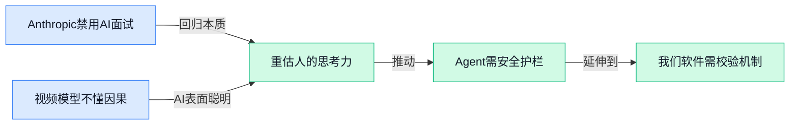
```mermaid
graph LR
    A[Anthropic禁用AI面试] -->|回归本质| B[重估人的思考力]
    C[视频模型不懂因果] -->|AI表面聪明| B
    B -->|推动| D[Agent需安全护栏]
    D -->|延伸到| E[我们软件需校验机制]
    classDef blue fill:#dbeafe,stroke:#3b82f6,color:#111827
    classDef green fill:#d1fae5,stroke:#10b981,color:#111827
    class A,C blue
    class B,D green
    class E green
```

### 📊 行业洞察（今日 4 条）

1. Anthropic面试禁用AI工具，转身又发布AgentDoG安全对齐框架
  【洞察】一边防着人用AI偷懒，一边给AI套上安全护栏，说明头部公司已经在同时处理"人怎么用AI"和"AI怎么不乱来"两本账

2. AI搜索Agent其实在偷懒，只会用搜索结果验证自己本来就记住的东西
  【洞察】这跟YoCausal发现视频模型只背画面关联不懂因果同理——很多AI看起来很聪明，实际是在"抄近道"而非真正理解

3. 软银砸750亿欧元在法国建数据中心，美国却同时掐紧中国芯片渠道
  【洞察】全球算力正在分裂成两个故事：欧美疯狂扩建基础设施，中国被逼另寻出路，这会加速AI技术路线分化

4. 微软做"AI独立日"减少依赖OpenAI，Karpathy加盟Anthropic带预训练
  【洞察】大公司和大神都在往"自控力"投注，说明模型层竞争已从"谁能用"变成"谁能稳住核心技术"

### 💭 对我们的启发（今日 3 条）

1. YoCausal发现视频模型不懂因果逻辑，EarlyTom证明视频处理可以更快——两件事合看，我们剪辑软件要帮品牌商解决的不是"AI能不能生成视频"，而是"生成的视频讲不讲得通、加工起来够不够快"，产品得往"逻辑校验+速度优化"方向靠

2. AI搜索Agent的偷懒行为提醒我们：将来在软件里内置"自动搜素材/竞品视频"功能时，必须有强制验证机制，不能AI说找到就用，得让用户一眼看穿它是不是在应付

3. 微软自建AI、Anthropic收紧用人标准，都在强调"核心能力不能外包"——我们的剪辑工具如果过度依赖某一家AI模型的能力，也会面临同样风险，技术选型上得保持可替换性

