## AI资讯日报 2026/6/4

> AI 早报 · 每日早读 · 全网深度聚合

## **今日摘要**

```
Meta 开发者 AI 模型二度延期，Ideogram 4.0（AI 图像模型）开放权重直上原生 2K
Anthropic 披露一年 AI 网络威胁，754 个安全技能库直接喂给 Agent
Uber 给 Claude Code 月封顶 1500 美元，headroom（上下文压缩工具）狂省 95% token
```

### 🔵 产品与功能更新

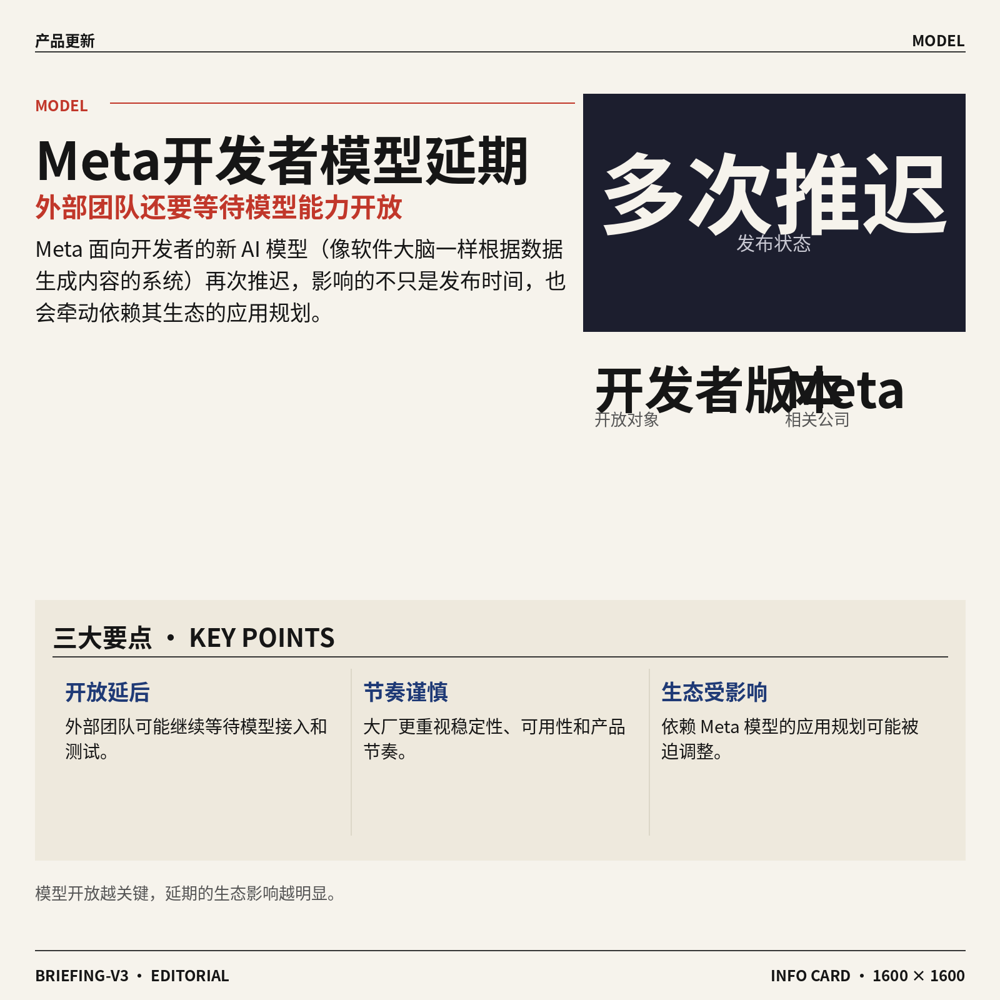

1. **Meta 推迟面向开发者的 AI 模型（像软件大脑一样根据数据生成内容的系统）发布。**
据路透援引《华尔街日报》报道，Meta 面向**开发者**的新 AI 模型发布被多次推迟，这意味着外部团队可能还要继续等待相关能力开放 🕒。对业务同事来说，重点不在“晚几天发”，而是大公司在把模型交给外部使用前，会更谨慎地处理稳定性、可用性和产品节奏。开发者版本（给软件团队接入、测试和二次开发的版本）延期，也可能影响依赖 Meta 模型生态的应用规划。[路透报道摘要(briefing)](https://news.google.com/rss/articles/CBMitgFBVV95cUxQZ3lEdmlvOHhFdTlRdVJUQ0o5SHJlV0pVTWtQRHBGX2RLSDZ4M2c1cktSREp4RVZIeXdtYlhJbWR6Zjc5QVFXX0ZicVVrOUVHbHR1Y1MtaVdEcnRXdmJPVVV3WlNfRDFsMWpnZk9yYkdWU0Q3bDMwQUxoVEllMHd2TUZmSGJ6WURoMTFIUWROdEEyZ1lWQmxKVDJLc0NoNnh5YUFNVGhxNkZxbHpMRF9RNnAtN0JzQQ?oc=5)


2. **Ideogram 4.0（主打文字生成更准的 AI 图像模型）发布，开放权重并支持原生 2K。**
Ideogram 4.0 这次以 **open-weight（开放权重，模型核心参数可被外部下载和研究，但不一定等同完全开源）** 形式发布，对研究者和创作者都更友好 💡。它支持**原生 2K 分辨率**（不用先生成低清图再放大，而是直接产出更高清的图），并强调改进了文字渲染（让图片里的海报字、招牌字更像真实文字）。这类能力对设计、营销和内容团队很实用，因为 AI 生成图过去最容易翻车的地方之一，就是“图好看但字乱写”。[Ideogram 发布报道(briefing)](https://the-decoder.com/ideogram-4-0-drops-as-an-open-weight-model-with-native-2k-resolution-and-improved-text-rendering/)


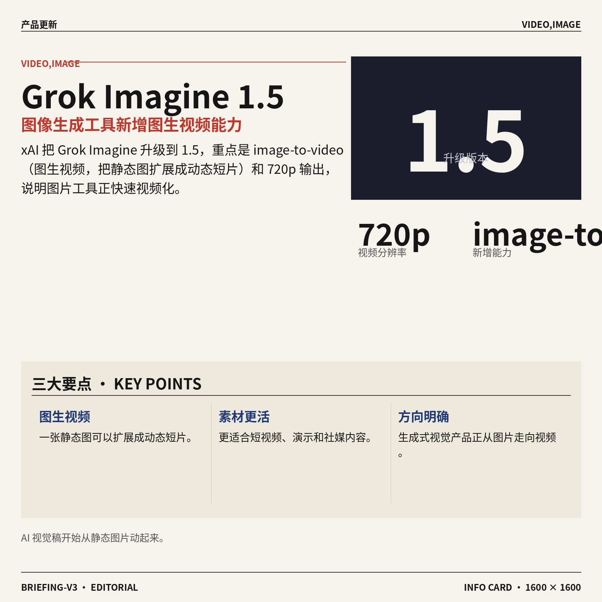

3. **xAI（推出 Grok 产品的 AI 公司）把 Grok Imagine（一款图像与视频生成工具）升级到 1.5。**
Grok Imagine 1.5 新增 **image-to-video（图生视频，把一张静态图扩展成动态短片）** 能力，并支持 **720p 分辨率**（常见高清视频清晰度规格）输出 🎬。这说明图像生成产品正在快速往视频方向延伸，用户不只想要“一张图”，还想要能直接用于短视频、演示或社媒素材的动态内容。对非技术团队来说，可以把它理解成：AI 正在从“帮你画一张视觉稿”，进化到“帮你把视觉稿动起来”。[Grok Imagine 升级报道(briefing)](https://the-decoder.com/xai-updates-grok-imagine-to-1-5-with-image-to-video-generation-at-720p-resolution/)


### 🟢 前沿研究

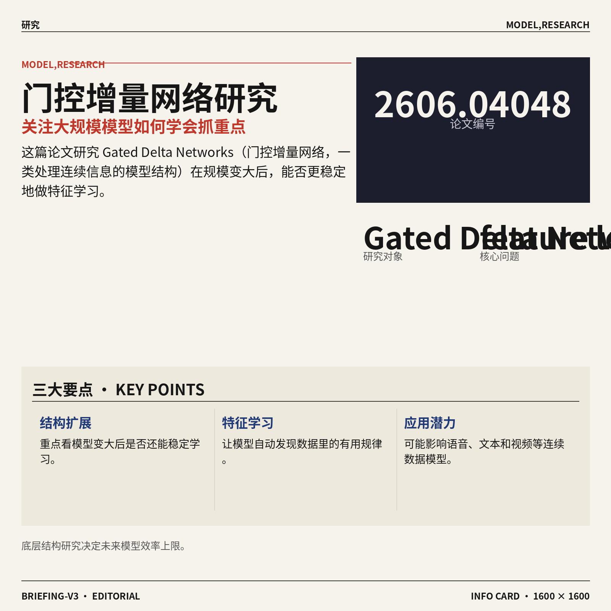

1. **Unlocking Feature Learning in Gated Delta Networks at Scale（研究门控增量网络如何大规模学习特征的论文）关注模型“学会抓重点”的能力。**  
这篇论文聚焦 **Gated Delta Networks（门控增量网络，一类用于处理连续信息的模型结构）**，核心问题是它在规模变大后如何更有效地做 **feature learning（特征学习，让模型自动发现数据里有用规律）** 🚀。从题目看，研究重点不是单次任务效果，而是模型结构在更大规模下是否能稳定学到可迁移的表示。对业务同事来说，这类研究如果推进顺利，可能影响未来语音、文本、视频等连续数据模型的效率与能力边界。[模型社区论文页(briefing)](https://huggingface.co/papers/2606.04048)


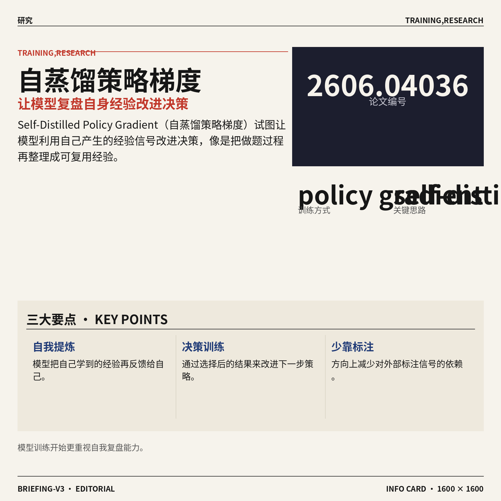

2. **Self-Distilled Policy Gradient（自蒸馏策略梯度，一种让模型从自身经验中改进决策的训练方法）提出新的训练思路。**  
这项研究围绕 **policy gradient（策略梯度，让模型通过“做选择后看结果”来改进决策的训练方式）** 展开，并加入 **self-distilled（自蒸馏，让模型把自己学到的经验再提炼给自己）** 的思路 💡。从标题可见，它试图让决策类模型在训练时更好地利用自身产生的信号，而不是只依赖外部标注。普通理解可以把它看成“模型复盘自己的做题过程，再整理成更好用的经验”。[模型社区论文页(briefing)](https://huggingface.co/papers/2606.04036)

![Self-Distilled Policy Gradient（自蒸馏策略梯度，一种让模型从自身经验中改进决策的训练方法）提出新的训练思路](https://image.pollinations.ai/prompt/Self-Distilled%20Policy%20Gradient%EF%BC%88%E8%87%AA%E8%92%B8%E9%A6%8F%E7%AD%96%E7%95%A5%E6%A2%AF%E5%BA%A6%EF%BC%8C%E4%B8%80%E7%A7%8D%E8%AE%A9%E6%A8%A1%E5%9E%8B%E4%BB%8E%E8%87%AA%E8%BA%AB%E7%BB%8F%E9%AA%8C%E4%B8%AD%E6%94%B9%E8%BF%9B%E5%86%B3%E7%AD%96%E7%9A%84%E8%AE%AD%E7%BB%83%E6%96%B9%E6%B3%95%EF%BC%89%E6%8F%90%E5%87%BA%E6%96%B0%E7%9A%84%E8%AE%AD%E7%BB%83%E6%80%9D%E8%B7%AF.%20Self-Distilled%20Policy%20Gradient%EF%BC%88%E8%87%AA%E8%92%B8%E9%A6%8F%E7%AD%96%E7%95%A5%E6%A2%AF%E5%BA%A6%EF%BC%8C%E4%B8%80%E7%A7%8D%E8%AE%A9%E6%A8%A1%E5%9E%8B%E4%BB%8E%E8%87%AA%E8%BA%AB%E7%BB%8F%E9%AA%8C%E4%B8%AD%E6%94%B9%E8%BF%9B%E5%86%B3%E7%AD%96%E7%9A%84%E8%AE%AD%E7%BB%83%E6%96%B9%E6%B3%95%EF%BC%89%E6%8F%90%E5%87%BA%E6%96%B0%E7%9A%84%E8%AE%AD%E7%BB%83%E6%80%9D%E8%B7%AF%E3%80%82%20%E8%BF%99%E9%A1%B9%E7%A0%94%E7%A9%B6%E5%9B%B4%E7%BB%95%20pol%2C%20technical%20infographic%20diagram%2C%20architecture%20flowchart%2C%20clean%20vector%20illustration%2C%20educational%20style%2C%20no%20text%20overlay%2C%20modern%20minimal%2C%20wide%20aspect?width=1200&height=675&nologo=true&seed=10838)

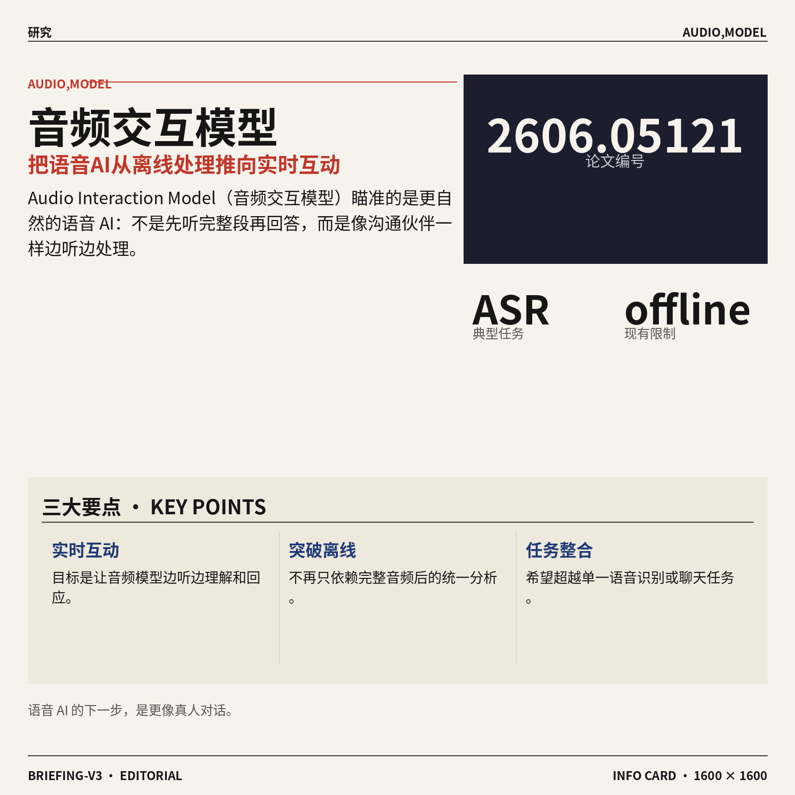

3. **Audio Interaction Model（音频交互模型）想把语音 AI 从“离线处理”推向实时互动。**  
论文指出，音频本来就是一种很强的互动媒介，但当前很多 **Large Audio Language Models（大型音频语言模型，能理解和生成语音内容的 AI 模型）** 仍偏向 **offline（离线处理，先收完整段音频再分析）**。已有的 **streaming audio models（流式音频模型，边听边处理的语音模型）** 又常常只覆盖单一任务，比如 **ASR（自动语音识别，把人说的话转成文字）** 或语音聊天 🎧。这篇研究的方向，是让音频模型更像真正的实时沟通伙伴，而不是只能“听完再回答”的工具。[arxiv 论文页(briefing)](https://arxiv.org/abs/2606.05121) [模型社区论文页(briefing)](https://huggingface.co/papers/2606.05121)

![Audio Interaction Model（音频交互模型）想把语音 AI 从“离线处理”推向实时互动](https://image.pollinations.ai/prompt/Audio%20Interaction%20Model%EF%BC%88%E9%9F%B3%E9%A2%91%E4%BA%A4%E4%BA%92%E6%A8%A1%E5%9E%8B%EF%BC%89%E6%83%B3%E6%8A%8A%E8%AF%AD%E9%9F%B3%20AI%20%E4%BB%8E%E2%80%9C%E7%A6%BB%E7%BA%BF%E5%A4%84%E7%90%86%E2%80%9D%E6%8E%A8%E5%90%91%E5%AE%9E%E6%97%B6%E4%BA%92%E5%8A%A8.%20Audio%20Interaction%20Model%EF%BC%88%E9%9F%B3%E9%A2%91%E4%BA%A4%E4%BA%92%E6%A8%A1%E5%9E%8B%EF%BC%89%E6%83%B3%E6%8A%8A%E8%AF%AD%E9%9F%B3%20AI%20%E4%BB%8E%E2%80%9C%E7%A6%BB%E7%BA%BF%E5%A4%84%E7%90%86%E2%80%9D%E6%8E%A8%E5%90%91%E5%AE%9E%E6%97%B6%E4%BA%92%E5%8A%A8%E3%80%82%20%E8%AE%BA%E6%96%87%E6%8C%87%E5%87%BA%EF%BC%8C%E9%9F%B3%E9%A2%91%E6%9C%AC%E6%9D%A5%E5%B0%B1%E6%98%AF%E4%B8%80%E7%A7%8D%E5%BE%88%E5%BC%BA%E7%9A%84%E4%BA%92%E5%8A%A8%E5%AA%92%E4%BB%8B%EF%BC%8C%E4%BD%86%E5%BD%93%E5%89%8D%E5%BE%88%E5%A4%9A%2C%20technical%20infographic%20diagram%2C%20architecture%20flowchart%2C%20clean%20vector%20illustration%2C%20educational%20style%2C%20no%20text%20overlay%2C%20modern%20minimal%2C%20wide%20aspect?width=1200&height=675&nologo=true&seed=10869)

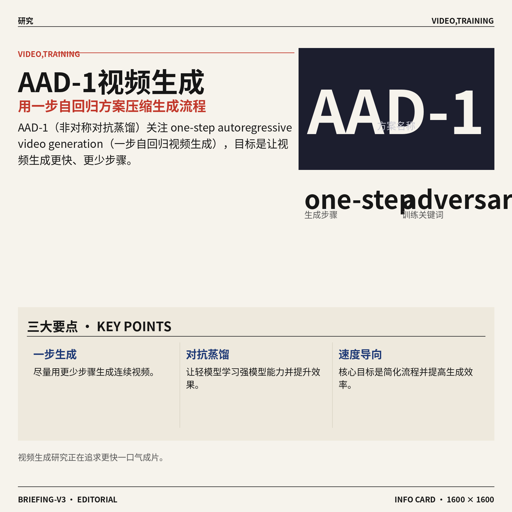

4. **AAD-1（非对称对抗蒸馏，用于一步生成自回归视频的训练方案）瞄准更快的视频生成。**  
这篇论文关注 **one-step autoregressive video generation（一步自回归视频生成，让模型尽量用更少步骤生成连续视频）**，目标明显指向生成速度与流程简化 🚀。其中 **adversarial distillation（对抗蒸馏，用一个更轻的模型学习强模型能力，同时用“对抗式打磨”提升效果）** 是关键词，意味着研究想把复杂生成能力压缩到更高效的形式里。对非技术同事可以理解为：原来视频生成可能要反复推敲很多步，现在研究者想让模型更快“一口气画出来”。[模型社区论文页(briefing)](https://huggingface.co/papers/2606.03972)

![AAD-1（非对称对抗蒸馏，用于一步生成自回归视频的训练方案）瞄准更快的视频生成](https://image.pollinations.ai/prompt/AAD-1%EF%BC%88%E9%9D%9E%E5%AF%B9%E7%A7%B0%E5%AF%B9%E6%8A%97%E8%92%B8%E9%A6%8F%EF%BC%8C%E7%94%A8%E4%BA%8E%E4%B8%80%E6%AD%A5%E7%94%9F%E6%88%90%E8%87%AA%E5%9B%9E%E5%BD%92%E8%A7%86%E9%A2%91%E7%9A%84%E8%AE%AD%E7%BB%83%E6%96%B9%E6%A1%88%EF%BC%89%E7%9E%84%E5%87%86%E6%9B%B4%E5%BF%AB%E7%9A%84%E8%A7%86%E9%A2%91%E7%94%9F%E6%88%90.%20AAD-1%EF%BC%88%E9%9D%9E%E5%AF%B9%E7%A7%B0%E5%AF%B9%E6%8A%97%E8%92%B8%E9%A6%8F%EF%BC%8C%E7%94%A8%E4%BA%8E%E4%B8%80%E6%AD%A5%E7%94%9F%E6%88%90%E8%87%AA%E5%9B%9E%E5%BD%92%E8%A7%86%E9%A2%91%E7%9A%84%E8%AE%AD%E7%BB%83%E6%96%B9%E6%A1%88%EF%BC%89%E7%9E%84%E5%87%86%E6%9B%B4%E5%BF%AB%E7%9A%84%E8%A7%86%E9%A2%91%E7%94%9F%E6%88%90%E3%80%82%20%E8%BF%99%E7%AF%87%E8%AE%BA%E6%96%87%E5%85%B3%E6%B3%A8%20one-step%20autoregressive%20video%20g%2C%20technical%20infographic%20diagram%2C%20architecture%20flowchart%2C%20clean%20vector%20illustration%2C%20educational%20style%2C%20no%20text%20overlay%2C%20modern%20minimal%2C%20wide%20aspect?width=1200&height=675&nologo=true&seed=10900)


5. **Echo-Infinity（实时无限视频生成研究）尝试让 AI 视频拥有持续记忆。**  
这项研究的关键词是 **evolving memory（演化记忆，让模型在生成过程中持续记住并更新前后内容）**，对应的是 **real-time infinite video generation（实时无限视频生成，持续不断地产生视频画面）** 🎬。从标题看，它要解决的问题很直观：视频越生成越长，模型越容易忘记前面发生了什么，画面和内容就可能不连贯。若这类方向成熟，未来直播式虚拟场景、长时长互动视频和游戏内容生成都会更有想象空间。[模型社区论文页(briefing)](https://huggingface.co/papers/2606.04527)


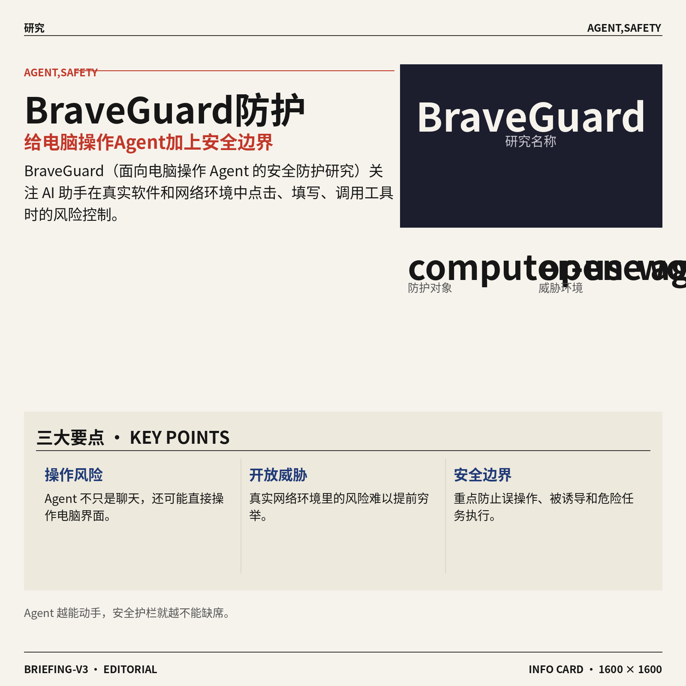

6. **BraveGuard（面向电脑操作 Agent 的安全防护研究）关注开放环境里的风险控制。**  
这篇论文把重点放在 **computer-use agents（能操作电脑界面完成任务的 AI 助手）**，以及它们在 **open-world threats（开放世界威胁，真实网络和软件环境中难以提前穷举的风险）** 下如何更安全地工作 🛡️。这里的 **Agent** 不只是聊天，而是可能点击网页、填写表单、调用工具，所以安全边界会比普通问答更复杂。标题里的 **safer（更安全）** 指向一个很现实的问题：AI 越能替人操作电脑，就越需要防止误操作、被诱导或执行危险任务。[模型社区论文页(briefing)](https://huggingface.co/papers/2606.01166)


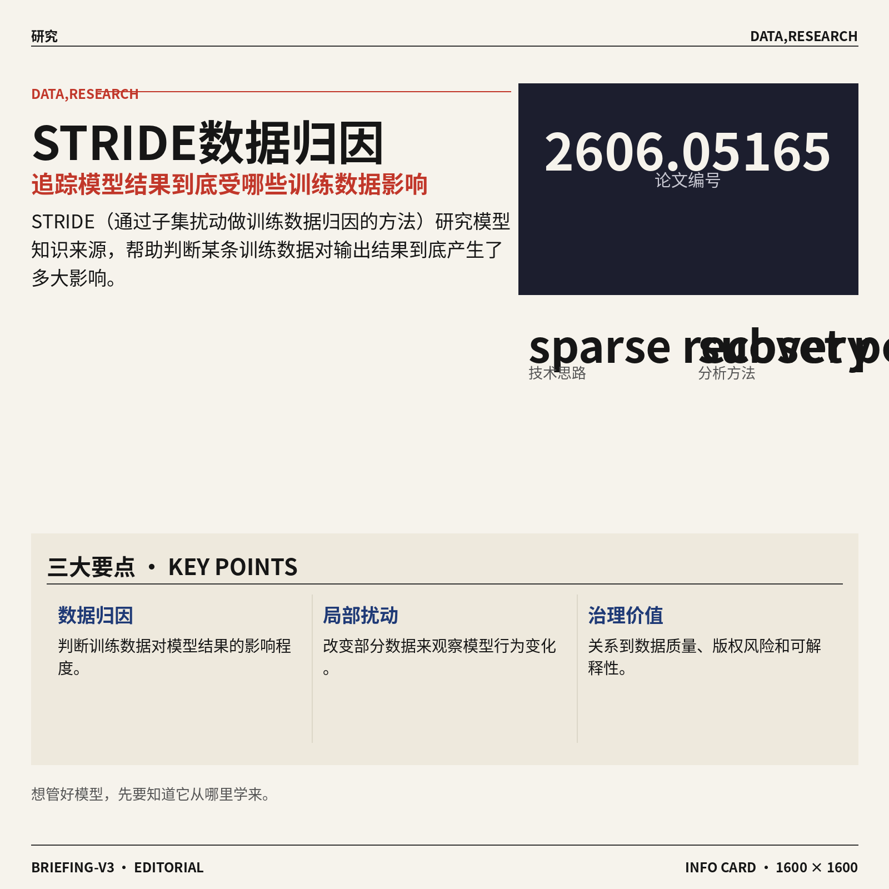

7. **STRIDE（通过子集扰动做训练数据归因的方法）想追踪模型到底从哪些数据里学到了东西。**  
这篇论文研究 **training data attribution（训练数据归因，判断某条训练数据对模型结果有多大影响）**，这是理解大模型“知识来源”的重要方向 🔍。标题中的 **sparse recovery（稀疏恢复，从少量关键信号中还原重要影响因素）** 和 **subset perturbations（子集扰动，故意改变一部分训练数据来观察模型变化）**，说明它可能通过对训练数据做局部变化来追踪影响。对公司场景来说，这类研究关系到数据质量、版权风险和模型可解释性：模型答错或答对时，我们更想知道它受哪些数据影响。[模型社区论文页(briefing)](https://huggingface.co/papers/2606.05165)

![STRIDE（通过子集扰动做训练数据归因的方法）想追踪模型到底从哪些数据里学到了东西](https://image.pollinations.ai/prompt/STRIDE%EF%BC%88%E9%80%9A%E8%BF%87%E5%AD%90%E9%9B%86%E6%89%B0%E5%8A%A8%E5%81%9A%E8%AE%AD%E7%BB%83%E6%95%B0%E6%8D%AE%E5%BD%92%E5%9B%A0%E7%9A%84%E6%96%B9%E6%B3%95%EF%BC%89%E6%83%B3%E8%BF%BD%E8%B8%AA%E6%A8%A1%E5%9E%8B%E5%88%B0%E5%BA%95%E4%BB%8E%E5%93%AA%E4%BA%9B%E6%95%B0%E6%8D%AE%E9%87%8C%E5%AD%A6%E5%88%B0%E4%BA%86%E4%B8%9C%E8%A5%BF.%20STRIDE%EF%BC%88%E9%80%9A%E8%BF%87%E5%AD%90%E9%9B%86%E6%89%B0%E5%8A%A8%E5%81%9A%E8%AE%AD%E7%BB%83%E6%95%B0%E6%8D%AE%E5%BD%92%E5%9B%A0%E7%9A%84%E6%96%B9%E6%B3%95%EF%BC%89%E6%83%B3%E8%BF%BD%E8%B8%AA%E6%A8%A1%E5%9E%8B%E5%88%B0%E5%BA%95%E4%BB%8E%E5%93%AA%E4%BA%9B%E6%95%B0%E6%8D%AE%E9%87%8C%E5%AD%A6%E5%88%B0%E4%BA%86%E4%B8%9C%E8%A5%BF%E3%80%82%20%E8%BF%99%E7%AF%87%E8%AE%BA%E6%96%87%E7%A0%94%E7%A9%B6%20training%20data%20attribution%EF%BC%88%E8%AE%AD%E7%BB%83%E6%95%B0%2C%20technical%20infographic%20diagram%2C%20architecture%20flowchart%2C%20clean%20vector%20illustration%2C%20educational%20style%2C%20no%20text%20overlay%2C%20modern%20minimal%2C%20wide%20aspect?width=1200&height=675&nologo=true&seed=10993)

### 🟡 行业展望与社会影响

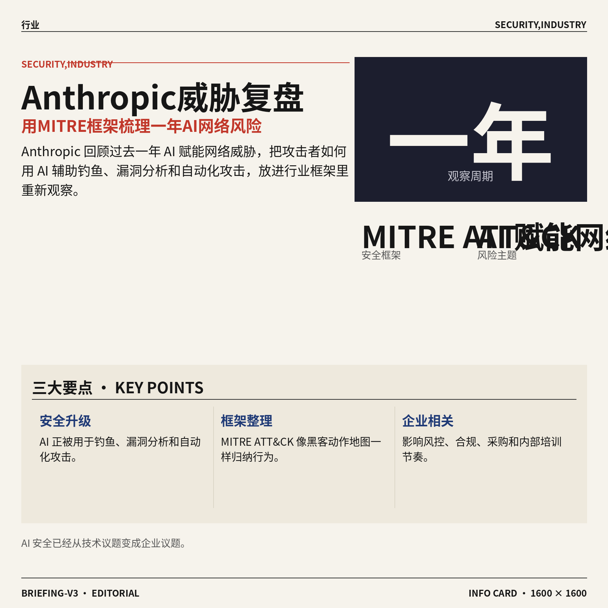

1. **Anthropic 梳理一年 AI 赋能网络威胁（攻击者用 AI 辅助网络攻击的风险）。**  
Anthropic 发布政策文章，回顾了过去一年与 **AI 赋能网络威胁** 相关的观察，这类风险指攻击者把 AI 用在钓鱼、漏洞分析、自动化攻击等环节 🚨。文章标题提到 **MITRE ATT&CK（网络安全领域常用的攻击行为知识库，像一张“黑客动作地图”）**，说明它不是泛泛谈安全焦虑，而是在用行业框架整理威胁模式。对企业来说，这意味着 AI 安全不只是技术部门的事，也会影响风控、合规、采购和内部培训节奏。[Anthropic 安全报告(briefing)](https://www.anthropic.com/news/AI-enabled-cyber-threats-mitre-attack)


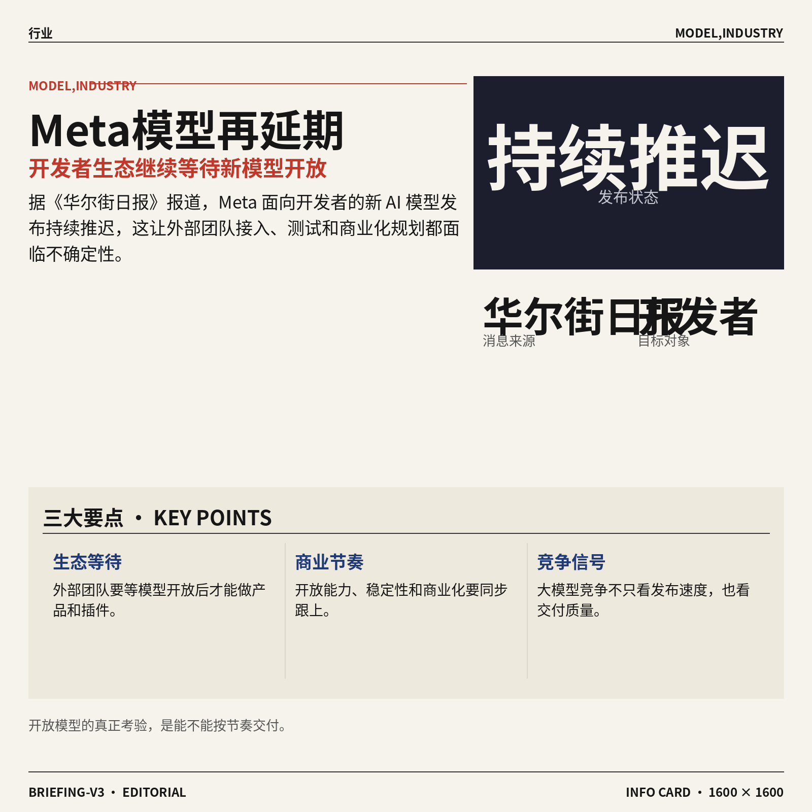

2. **Meta 新 AI 模型面向开发者发布再延期。**  
据《华尔街日报》报道，Meta 面向开发者的新 **AI 模型（能理解和生成文本、代码或多媒体内容的核心系统）** 发布持续推迟 ⏳。这类延期通常会影响开发者生态，因为外部团队要等模型开放后，才能基于它做产品、插件或企业应用。对行业观察者来说，这也提醒大家：大模型竞争不只看谁“发布得快”，还要看 **模型开放（把能力提供给外部开发者调用和集成）**、稳定性和商业化节奏能不能跟上。[WSJ 独家报道(briefing)](https://news.google.com/rss/articles/CBMipAFBVV95cUxNQzFMQXZWZ1pBUXo2V0Z4eXJQdkMwbHVndW9rQjlmdUN5Y2ZLcmRPNUs3VERiaUZpS2VYMU9GN0l5VGxXbnltajlha2EySWRVUnJhSklTcGMyb1piOWFLX3JCdm42UUJPVmJOM1paUjFEREZMR21aRWJ2eWJfaDV0NzR5QmhaWll6b2Q3dTFCUUVGOHRJa0VkQzR5TjRDS2JwZ1JhVg?oc=5)


3. **Endava（企业软件交付服务公司）正围绕 AI Agent（能自动执行多步任务的 AI 助手）重做软件交付。**  
OpenAI 案例显示，Endava 正在用 **AI Agent（能按目标自动拆解并执行任务的 AI 助手）**、ChatGPT Enterprise（面向企业的 ChatGPT 版本，强调团队管理与数据控制）和 Codex（OpenAI 的编程助手，能帮开发者写代码和改代码）来加速软件交付 🚀。这里的重点不是“让 AI 写几行代码”，而是把自动化工作流和企业文化一起改造，让团队更习惯与 AI 协作。对非技术部门也有启发：未来很多流程型工作可能会从“人手动推进”变成“人设规则、AI 跑流程、人做把关”。[OpenAI 客户案例(briefing)](https://openai.com/index/endava-frontiers)

![Endava（企业软件交付服务公司）正围绕 AI Agent（能自动执行多步任务的 AI 助手）重做软件交付](https://image.pollinations.ai/prompt/Endava%EF%BC%88%E4%BC%81%E4%B8%9A%E8%BD%AF%E4%BB%B6%E4%BA%A4%E4%BB%98%E6%9C%8D%E5%8A%A1%E5%85%AC%E5%8F%B8%EF%BC%89%E6%AD%A3%E5%9B%B4%E7%BB%95%20AI%20Agent%EF%BC%88%E8%83%BD%E8%87%AA%E5%8A%A8%E6%89%A7%E8%A1%8C%E5%A4%9A%E6%AD%A5%E4%BB%BB%E5%8A%A1%E7%9A%84%20AI%20%E5%8A%A9%E6%89%8B%EF%BC%89%E9%87%8D%E5%81%9A%E8%BD%AF%E4%BB%B6%E4%BA%A4%E4%BB%98.%20Endava%EF%BC%88%E4%BC%81%E4%B8%9A%E8%BD%AF%E4%BB%B6%E4%BA%A4%E4%BB%98%E6%9C%8D%E5%8A%A1%E5%85%AC%E5%8F%B8%EF%BC%89%E6%AD%A3%E5%9B%B4%E7%BB%95%20AI%20Agent%EF%BC%88%E8%83%BD%E8%87%AA%E5%8A%A8%E6%89%A7%E8%A1%8C%E5%A4%9A%E6%AD%A5%E4%BB%BB%E5%8A%A1%E7%9A%84%20AI%20%E5%8A%A9%E6%89%8B%EF%BC%89%E9%87%8D%E5%81%9A%E8%BD%AF%E4%BB%B6%E4%BA%A4%E4%BB%98%E3%80%82%20OpenAI%20%E6%A1%88%E4%BE%8B%E6%98%BE%E7%A4%BA%EF%BC%8CEndava%20%E6%AD%A3%E5%9C%A8%E7%94%A8%20A%2C%20technical%20infographic%20diagram%2C%20architecture%20flowchart%2C%20clean%20vector%20illustration%2C%20educational%20style%2C%20no%20text%20overlay%2C%20modern%20minimal%2C%20wide%20aspect?width=1200&height=675&nologo=true&seed=10869)

4. **Wasmer（边缘计算开发公司）用 Codex（OpenAI 编程助手）打造边缘端 Node.js 运行时（让网页后端代码在近用户服务器运行的环境）。**  
OpenAI 案例提到，Wasmer 使用 Codex（OpenAI 的编程助手，能辅助写代码、查问题和改实现）以及 GPT-5.5（OpenAI 的大模型版本，用来理解任务并生成代码）构建了一个 **Node.js 运行时（让 JavaScript 后端程序跑起来的软件环境）**。这个运行时面向 **边缘计算（把计算放到离用户更近的服务器，减少等待时间）**，开发速度被提升到 10 到 20 倍，原本可能需要数月的工作缩短到数周 ⚡。这说明 AI 编程工具正在从“辅助个人效率”走向“改变基础软件交付周期”。[Wasmer 案例详情(briefing)](https://openai.com/index/wasmer)


5. **特朗普新行政令拟让 AI 公司自愿提交模型接受政府安全审查。**  
The Decoder 报道称，特朗普的新行政令希望 AI 公司自愿把模型提交给政府做 **安全审查（在正式大规模使用前检查模型是否存在滥用、失控或社会风险）** 🏛️。这里的关键词是“自愿”，意味着它更像一种政策引导，而不是直接强制所有公司过审。对行业来说，这可能影响 **模型治理（围绕 AI 如何开发、发布、监管的一整套规则）** 的走向，也会让企业在发布新模型时更重视合规沟通和风险说明。[行政令报道(briefing)](https://the-decoder.com/trumps-new-executive-order-wants-ai-companies-to-voluntarily-submit-models-for-government-safety-reviews/)

![特朗普新行政令拟让 AI 公司自愿提交模型接受政府安全审查](https://image.pollinations.ai/prompt/%E7%89%B9%E6%9C%97%E6%99%AE%E6%96%B0%E8%A1%8C%E6%94%BF%E4%BB%A4%E6%8B%9F%E8%AE%A9%20AI%20%E5%85%AC%E5%8F%B8%E8%87%AA%E6%84%BF%E6%8F%90%E4%BA%A4%E6%A8%A1%E5%9E%8B%E6%8E%A5%E5%8F%97%E6%94%BF%E5%BA%9C%E5%AE%89%E5%85%A8%E5%AE%A1%E6%9F%A5.%20%E7%89%B9%E6%9C%97%E6%99%AE%E6%96%B0%E8%A1%8C%E6%94%BF%E4%BB%A4%E6%8B%9F%E8%AE%A9%20AI%20%E5%85%AC%E5%8F%B8%E8%87%AA%E6%84%BF%E6%8F%90%E4%BA%A4%E6%A8%A1%E5%9E%8B%E6%8E%A5%E5%8F%97%E6%94%BF%E5%BA%9C%E5%AE%89%E5%85%A8%E5%AE%A1%E6%9F%A5%E3%80%82%20The%20Decoder%20%E6%8A%A5%E9%81%93%E7%A7%B0%EF%BC%8C%E7%89%B9%E6%9C%97%E6%99%AE%E7%9A%84%E6%96%B0%E8%A1%8C%E6%94%BF%E4%BB%A4%E5%B8%8C%E6%9C%9B%20AI%20%E5%85%AC%E5%8F%B8%E8%87%AA%E6%84%BF%E6%8A%8A%E6%A8%A1%E5%9E%8B%E6%8F%90%E4%BA%A4%E7%BB%99%E6%94%BF%E5%BA%9C%E5%81%9A%20%E5%AE%89%E5%85%A8%E5%AE%A1%E6%9F%A5%EF%BC%88%2C%20technical%20infographic%20diagram%2C%20architecture%20flowchart%2C%20clean%20vector%20illustration%2C%20educational%20style%2C%20no%20text%20overlay%2C%20modern%20minimal%2C%20wide%20aspect?width=1200&height=675&nologo=true&seed=10931)

### 🟣 开源TOP项目

1. **greensock/gsap-skills（GSAP 网页动画库的 AI 使用技能包）帮助编程 Agent 写对动画代码。**  
这个官方项目把 **GSAP（GreenSock Animation Platform，常用于网页动效制作的动画开发库）** 的正确用法整理成给 AI 编程 Agent 学的“技能包” 🚀。它覆盖最佳实践、常见动画模式和插件使用，目标是让 AI 在写前端动效时少走弯路。对设计和前端协作同事来说，这类项目意味着 AI 不只是“会写代码”，还开始学习具体工具的规范用法 💡。[官方技能仓库(briefing)](https://github.com/greensock/gsap-skills)


2. **Anthropic-Cybersecurity-Skills（给 AI Agent 使用的网络安全技能库）收录 754 个结构化安全技能。**  
这个项目整理了 **754 个网络安全技能**，供 AI Agent 在安全相关任务中调用，内容还映射到 5 套框架。比如 **MITRE ATT&CK（网络攻击战术与技术知识库，像安全行业的攻击手法词典）**、**NIST CSF 2.0（美国国家标准与技术研究院发布的网络安全框架，帮助组织管理安全风险）** 等，能让 AI 的安全分析更有章法。它还提到兼容 Claude Code、GitHub Copilot、Codex CLI（命令行里的 Codex 编程工具）、Cursor、Gemini CLI（命令行里的 Gemini 工具）等 20 多个平台，适合关注安全自动化的团队留意 🚀。[网络安全技能库(briefing)](https://github.com/mukul975/Anthropic-Cybersecurity-Skills)


3. **CodeWhale（面向开源模型的编程 Agent）主打开源与开放权重模型。**  
CodeWhale 是一个 **Coding agent（编程 Agent，能自动理解需求并协助写代码的 AI 助手）**，定位是服务 **open weight models（开放权重模型，模型参数可被下载和使用，便于本地部署或二次开发）**。从摘要看，它面向开源生态，而不是只绑定某一家闭源大模型。对技术团队来说，这代表“用更开放的模型做自动编程”仍在快速探索中，未来可能降低对单一平台的依赖 💡。[CodeWhale 仓库(briefing)](https://github.com/Hmbown/CodeWhale)


4. **terax-ai（轻量级终端优先 AI 开发工作区）只有约 7MB。**  
terax-ai 是一个 **Terminal-first（终端优先，主要在命令行窗口里操作）** 的 **AI-native dev workspace（原生面向 AI 的开发工作区，把 AI 协助开发作为核心体验）**。它强调轻量，摘要里标注体积约 **7MB**，这对不想安装庞大开发环境的用户很友好。它的方向也很清晰：让开发者在终端里直接进入 AI 辅助工作流，而不是频繁切换多个工具 🚀。[轻量开发工作区(briefing)](https://github.com/crynta/terax-ai)


5. **headroom（压缩工具输出与日志的 AI 上下文工具）可减少 60%-95% token。**  
headroom 解决的是 AI 使用中的一个实际痛点：工具输出、日志、文件和 **RAG chunks（检索增强生成里的资料片段，AI 回答前先查资料再分块阅读）** 太长，会塞满模型上下文。它会在内容进入 **LLM（大语言模型，也就是 ChatGPT 这类模型的大脑）** 之前先压缩，摘要称可减少 **60%-95% token（模型读取文字的小单位，越多通常成本越高）**，同时保持答案一致。项目形态包括库、代理和 **MCP server（模型上下文协议服务器，让 AI 工具能标准化连接外部数据和能力）**，适合重度使用 Agent 的团队关注 💡。[上下文压缩工具(briefing)](https://github.com/chopratejas/headroom)


6. **hermes-desktop（Hermes Agent 的桌面伴侣应用）把 Agent 带到桌面端。**  
hermes-desktop 是 **Hermes Agent（名为 Hermes 的 AI Agent，可理解为能执行任务的 AI 助手）** 的桌面伴侣应用。它的重点是 **Desktop Companion（桌面伴侣应用，运行在电脑桌面环境中，辅助用户调用或管理 Agent）**，说明这个项目更偏向把 Agent 使用体验产品化。虽然摘要信息不多，但方向很典型：AI Agent 正从命令行、网页工具，继续向日常桌面工作场景延伸 🚀。[桌面伴侣仓库(briefing)](https://github.com/fathah/hermes-desktop)


### 🔴 社媒分享

1. **Uber（网约车与出行平台）给 Claude Code 设置每月 1500 美元使用上限。**  
Uber 开始限制员工使用 **AI 工具**（能辅助写代码、总结资料或自动处理任务的软件）的额度，Simon Willison（知名开发者与技术博主）认为这对 **AI 工具定价**（企业到底愿意为员工的 AI 助手付多少钱）是个很有参考价值的信号 💡。这件事说明，哪怕企业认可 Claude Code 的效率，也会认真盯住成本，而不是无限量放开使用。对普通职场人来说，这意味着公司未来采购 AI 工具时，可能更看重“每人每月值不值”而不是单纯追新 🚀。[AI 工具限额分析(briefing)](https://simonwillison.net/2026/Jun/3/uber-caps-usage/)


2. **Ted Chiang（科幻作家兼科技评论者）提醒：AI（人工智能）并没有意识。**  
Ted Chiang 在文章中讨论了一个常被热议的问题：现在的 AI 虽然会对话、会写作、会推理，但这并不等于它真的“有意识” 🤔。这里的 **意识**（能主观感受世界、拥有自我体验的状态）和 **语言生成**（根据大量文本规律组织回答）不是一回事。这个提醒对业务同事也很重要：使用 ChatGPT 时可以把它当高效助手，但不该把它当作真正理解人类处境的“同事”或“人”来看待。[意识争议文章(briefing)](https://www.theatlantic.com/philosophy/2026/06/no-artificial-intelligence-is-not-conscious/687378/)

![Ted Chiang（科幻作家兼科技评论者）提醒：AI（人工智能）并没有意识](https://image.pollinations.ai/prompt/Ted%20Chiang%EF%BC%88%E7%A7%91%E5%B9%BB%E4%BD%9C%E5%AE%B6%E5%85%BC%E7%A7%91%E6%8A%80%E8%AF%84%E8%AE%BA%E8%80%85%EF%BC%89%E6%8F%90%E9%86%92%EF%BC%9AAI%EF%BC%88%E4%BA%BA%E5%B7%A5%E6%99%BA%E8%83%BD%EF%BC%89%E5%B9%B6%E6%B2%A1%E6%9C%89%E6%84%8F%E8%AF%86.%20Ted%20Chiang%EF%BC%88%E7%A7%91%E5%B9%BB%E4%BD%9C%E5%AE%B6%E5%85%BC%E7%A7%91%E6%8A%80%E8%AF%84%E8%AE%BA%E8%80%85%EF%BC%89%E6%8F%90%E9%86%92%EF%BC%9AAI%EF%BC%88%E4%BA%BA%E5%B7%A5%E6%99%BA%E8%83%BD%EF%BC%89%E5%B9%B6%E6%B2%A1%E6%9C%89%E6%84%8F%E8%AF%86%E3%80%82%20Ted%20Chiang%20%E5%9C%A8%E6%96%87%E7%AB%A0%E4%B8%AD%E8%AE%A8%E8%AE%BA%E4%BA%86%E4%B8%80%E4%B8%AA%E5%B8%B8%E8%A2%AB%E7%83%AD%E8%AE%AE%E7%9A%84%E9%97%AE%E9%A2%98%EF%BC%9A%E7%8E%B0%E5%9C%A8%E7%9A%84%20AI%20%E8%99%BD%E7%84%B6%E4%BC%9A%E5%AF%B9%E8%AF%9D%2C%20technical%20infographic%20diagram%2C%20architecture%20flowchart%2C%20clean%20vector%20illustration%2C%20educational%20style%2C%20no%20text%20overlay%2C%20modern%20minimal%2C%20wide%20aspect?width=1200&height=675&nologo=true&seed=10644)

3. **数学家警告：AI（人工智能）正在快速进入数学研究领域。**  
Science（国际知名科学媒体）报道称，数学家们正在关注 AI 在数学领域快速推进带来的影响 📐。这里的 **数学研究**（不只是算题，而是发现规律、证明定理、建立新理论）对严谨性要求极高，因此 AI 的加入既可能提升效率，也会让学界更重视验证和边界。对非技术岗位来说，这条新闻的重点不是“AI 会不会替代数学家”，而是 AI 正在进入更高门槛的知识工作，未来很多专业岗位都要学会和 AI 协作 🚀。[数学界警告报道(briefing)](https://www.science.org/content/article/mathematicians-issue-warning-ai-rapidly-gains-ground)

![数学家警告：AI（人工智能）正在快速进入数学研究领域](https://image.pollinations.ai/prompt/%E6%95%B0%E5%AD%A6%E5%AE%B6%E8%AD%A6%E5%91%8A%EF%BC%9AAI%EF%BC%88%E4%BA%BA%E5%B7%A5%E6%99%BA%E8%83%BD%EF%BC%89%E6%AD%A3%E5%9C%A8%E5%BF%AB%E9%80%9F%E8%BF%9B%E5%85%A5%E6%95%B0%E5%AD%A6%E7%A0%94%E7%A9%B6%E9%A2%86%E5%9F%9F.%20%E6%95%B0%E5%AD%A6%E5%AE%B6%E8%AD%A6%E5%91%8A%EF%BC%9AAI%EF%BC%88%E4%BA%BA%E5%B7%A5%E6%99%BA%E8%83%BD%EF%BC%89%E6%AD%A3%E5%9C%A8%E5%BF%AB%E9%80%9F%E8%BF%9B%E5%85%A5%E6%95%B0%E5%AD%A6%E7%A0%94%E7%A9%B6%E9%A2%86%E5%9F%9F%E3%80%82%20Science%EF%BC%88%E5%9B%BD%E9%99%85%E7%9F%A5%E5%90%8D%E7%A7%91%E5%AD%A6%E5%AA%92%E4%BD%93%EF%BC%89%E6%8A%A5%E9%81%93%E7%A7%B0%EF%BC%8C%E6%95%B0%E5%AD%A6%E5%AE%B6%E4%BB%AC%E6%AD%A3%E5%9C%A8%E5%85%B3%E6%B3%A8%20AI%20%E5%9C%A8%E6%95%B0%E5%AD%A6%E9%A2%86%E5%9F%9F%E5%BF%AB%E9%80%9F%E6%8E%A8%E8%BF%9B%E5%B8%A6%E6%9D%A5%E7%9A%84%E5%BD%B1%E5%93%8D%20%F0%9F%93%90%E3%80%82%E8%BF%99%E9%87%8C%2C%20technical%20infographic%20diagram%2C%20architecture%20flowchart%2C%20clean%20vector%20illustration%2C%20educational%20style%2C%20no%20text%20overlay%2C%20modern%20minimal%2C%20wide%20aspect?width=1200&height=675&nologo=true&seed=10675)

---

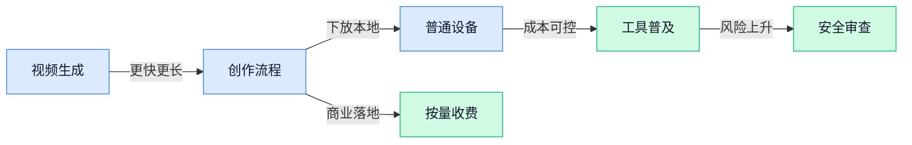

### 📊 行业洞察（今日 4 条）

1. xAI（推出 Grok 的 AI 公司）做图生视频，AAD-1 和 Echo-Infinity 都在研究更快、更长的视频生成
  【洞察】视频生成正在从“能看”转向“能用”，但稳定、连贯、可控还没完全过关，短视频工具会先受益也先踩坑

2. Google Gemma（可在普通笔记本跑的多模态模型）能本地处理文字、图片和音频，Ideogram 4.0 又开放高清图像模型
  【洞察】创作能力正在从云端大厂下放到普通设备，未来比拼的不只是模型强弱，而是谁能把能力做成顺手流程

3. Meta 一边推迟开发者模型，一边让 WhatsApp（海外常用聊天软件）商家 AI 助手按用量收费
  【洞察】大厂不急着“白送能力”了，开放节奏和收费方式会更谨慎，企业接入 AI 要准备面对不稳定供给和成本波动

4. Anthropic 梳理 AI 网络威胁，政府又推动模型安全审查，安全技能库也在快速扩张
  【洞察】AI 越能自动做事，信任成本越高；行业不会只奖励“更聪明”，也会奖励“出错能拦住、责任说得清”

### 💭 对我们的启发（今日 3 条）

1. xAI（推出 Grok 的 AI 公司）图生视频和 AAD-1 都指向更快出片，我们剪辑软件不能只做后期工具，要把“图变视频、视频再剪好”连成一条低操作流程。

2. Google Gemma（可在普通笔记本跑的多模态模型）说明本地创作会变现实，我们可以考虑把敏感素材审核、字幕初修、粗剪建议放到本地，降低成本也增强客户信任。

3. Meta 给 WhatsApp（海外常用聊天软件）商家 AI 助手按用量收费，提醒我们设计调度策略时要分轻重任务：脚本润色别用贵能力，成片质检和关键画面再用强能力。

