## AI资讯日报 2026/6/5

> AI 早报 · 每日早读 · 全网深度聚合

## **今日摘要**

```
Microsoft 计划发布自研 AI 模型套件，正面拆解 OpenAI 依赖
OpenAI 推出生物防御行动计划，ChatGPT 开始保存你的叙事档案
Google 允许退出 AI 搜索，Cloudflare（网站安全商）押注付费抓取
```

### 🔵 产品与功能更新


1. **Microsoft 计划发布自研人工智能模型套件（由公司自己开发的一组模型）。**  
据 Yahoo Finance（雅虎财经，财经新闻平台）消息，**Microsoft** 计划公布一套自研的**人工智能模型** 🚀。这里的“模型套件”可以理解为一组不同能力的模型，未来可能分别服务于不同产品功能，而不是只有一个聊天机器人。对业务同事来说，重点在于大厂正在把更多核心能力握在自己手里，后续产品体验、成本和迭代节奏都值得关注 💡。[雅虎财经报道(briefing)](https://news.google.com/rss/articles/CBMipAFBVV95cUxPSkNPMTVLNTIzQkJzdXJiMzdxNnBoOUFwcGtsUktJaUdOenBmRk1QcEtvNTR3cGlBYXRTeGhjSFdPT21vSS1ScUR4OXJGcHo2bmJoZVVWcjcyT2p2cWVYNGI0OFpmYXhEWF9ZRGt5UDlSdXAxM2Y1aEhhOE1tWlM4VHNYR2NhV1pOWm1LX19KQko0Y2hUUXNUQmJTZlJDOF9aN2labA?oc=5)


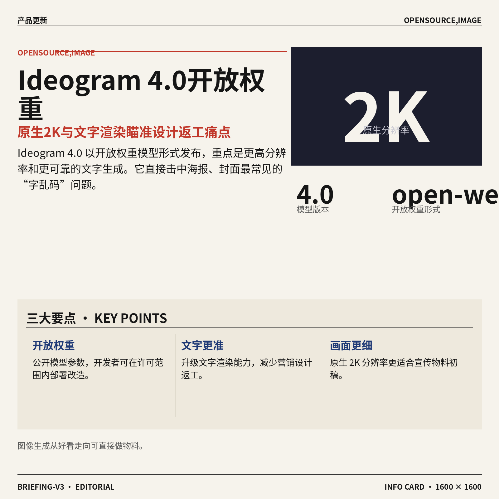

2. **Ideogram 4.0（主打文字准确生成的图像模型）以开放权重模型（公开模型参数，方便外部使用和改造）发布。**  
**Ideogram 4.0** 这次以 **open-weight model（开放权重模型，公开模型参数，开发者可在许可范围内下载、部署或改造）** 形式推出，重点升级包括原生 **2K resolution（2K 分辨率，画面细节比普通高清更丰富）** 和更好的文字渲染能力 ✍️。这对设计、运营、市场同事很实用，因为很多海报、封面图最怕“图好看但字乱码”，文字生成能力提升能减少返工。原生高分辨率也意味着生成图更适合用于展示、宣传物料初稿等场景，不只是社交媒体小图啦 🚀。[Ideogram 发布报道(briefing)](https://the-decoder.com/ideogram-4-0-drops-as-an-open-weight-model-with-native-2k-resolution-and-improved-text-rendering/)


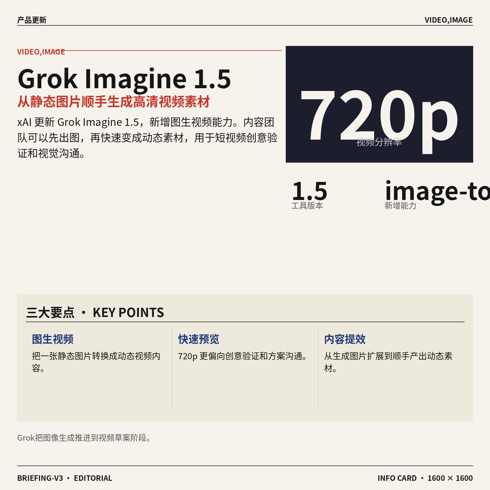

3. **xAI（马斯克旗下人工智能公司）将 Grok Imagine 1.5（图像与视频生成工具）升级到支持图生视频。**  
**xAI（马斯克旗下人工智能公司）** 更新了 **Grok Imagine 1.5（Grok 体系里的图像与视频生成工具）**，新增 **image-to-video generation（图生视频，把一张静态图片变成动态视频）** 能力 🎬。此次生成视频的分辨率达到 **720p resolution（720p 分辨率，常见的高清入门规格）**，说明它更偏向快速生成可预览的视频内容。对内容团队来说，这类功能的价值在于把“先出一张图”升级成“顺手做一段动态素材”，适合短视频创意验证和视觉方案沟通 💡。[Grok Imagine 更新(briefing)](https://the-decoder.com/xai-updates-grok-imagine-to-1-5-with-image-to-video-generation-at-720p-resolution/)

![xAI（马斯克旗下人工智能公司）将 Grok Imagine 1.5（图像与视频生成工具）升级到支持图生视频](https://image.pollinations.ai/prompt/xAI%EF%BC%88%E9%A9%AC%E6%96%AF%E5%85%8B%E6%97%97%E4%B8%8B%E4%BA%BA%E5%B7%A5%E6%99%BA%E8%83%BD%E5%85%AC%E5%8F%B8%EF%BC%89%E5%B0%86%20Grok%20Imagine%201.5%EF%BC%88%E5%9B%BE%E5%83%8F%E4%B8%8E%E8%A7%86%E9%A2%91%E7%94%9F%E6%88%90%E5%B7%A5%E5%85%B7%EF%BC%89%E5%8D%87%E7%BA%A7%E5%88%B0%E6%94%AF%E6%8C%81%E5%9B%BE%E7%94%9F%E8%A7%86%E9%A2%91.%20xAI%EF%BC%88%E9%A9%AC%E6%96%AF%E5%85%8B%E6%97%97%E4%B8%8B%E4%BA%BA%E5%B7%A5%E6%99%BA%E8%83%BD%E5%85%AC%E5%8F%B8%EF%BC%89%E5%B0%86%20Grok%20Imagine%201.5%EF%BC%88%E5%9B%BE%E5%83%8F%E4%B8%8E%E8%A7%86%E9%A2%91%E7%94%9F%E6%88%90%E5%B7%A5%E5%85%B7%EF%BC%89%E5%8D%87%E7%BA%A7%E5%88%B0%E6%94%AF%E6%8C%81%E5%9B%BE%E7%94%9F%E8%A7%86%E9%A2%91%E3%80%82%20xAI%EF%BC%88%E9%A9%AC%E6%96%AF%E5%85%8B%E6%97%97%E4%B8%8B%E4%BA%BA%E5%B7%A5%E6%99%BA%E8%83%BD%E5%85%AC%E5%8F%B8%EF%BC%89%20%E6%9B%B4%E6%96%B0%E4%BA%86%20Gro%2C%20technical%20infographic%20diagram%2C%20architecture%20flowchart%2C%20clean%20vector%20illustration%2C%20educational%20style%2C%20no%20text%20overlay%2C%20modern%20minimal%2C%20wide%20aspect?width=1200&height=675&nologo=true&seed=11451)

### 🟢 前沿研究

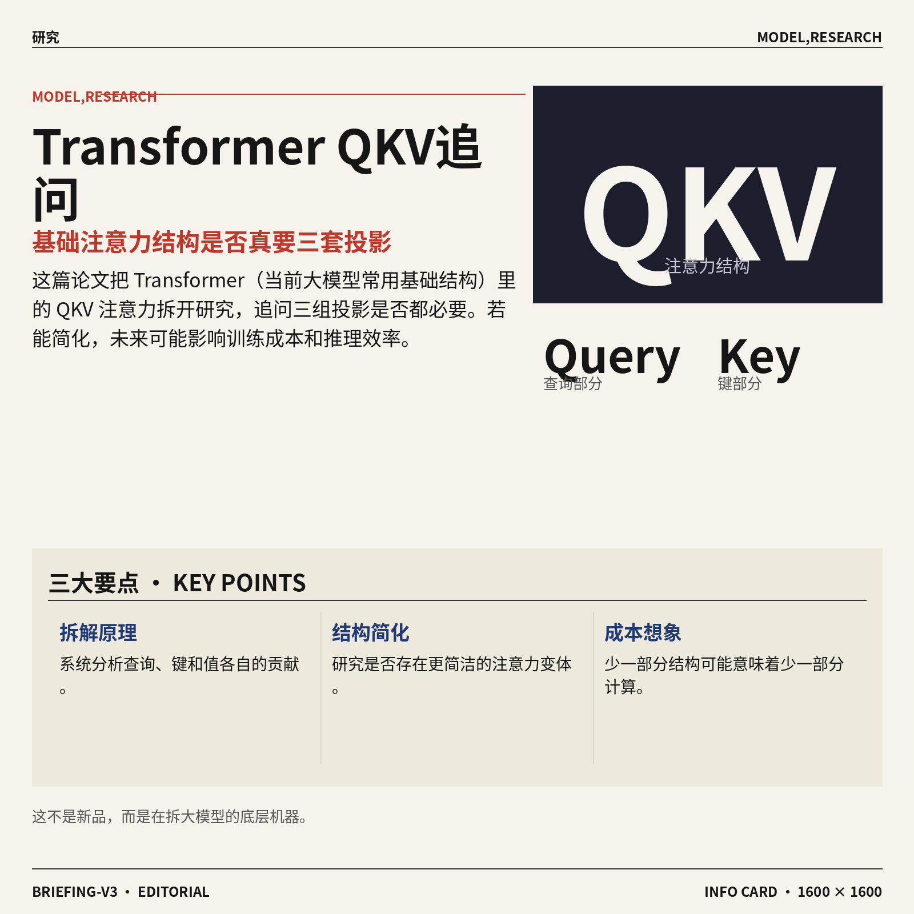

1. **Transformer（当前大模型常用的基础结构）真的需要 QKV（三组注意力投影）吗？**  
这篇论文系统研究了 **QKV 注意力结构**：Query（查询，决定“我要找什么”）、Key（键，决定“哪里可能有答案”）、Value（值，真正被取回的信息）三部分各自到底贡献了什么 💡。作者关注的问题很基础但很关键：Transformer（让模型在一段文字里抓重点关系的架构）是不是必须保留三套投影，还是存在更简洁的变体。对业务同事来说，这类研究如果成立，未来可能影响大模型的**训练成本**和**推理效率**，因为少一部分结构就可能少一部分计算。论文目前是系统性分析，不是直接推出新产品，但属于模型架构层面的“拆机器看原理”研究 🚀。[论文原文(briefing)](https://arxiv.org/abs/2606.04032)

![Transformer（当前大模型常用的基础结构）真的需要 QKV（三组注意力投影）吗？](https://image.pollinations.ai/prompt/Transformer%EF%BC%88%E5%BD%93%E5%89%8D%E5%A4%A7%E6%A8%A1%E5%9E%8B%E5%B8%B8%E7%94%A8%E7%9A%84%E5%9F%BA%E7%A1%80%E7%BB%93%E6%9E%84%EF%BC%89%E7%9C%9F%E7%9A%84%E9%9C%80%E8%A6%81%20QKV%EF%BC%88%E4%B8%89%E7%BB%84%E6%B3%A8%E6%84%8F%E5%8A%9B%E6%8A%95%E5%BD%B1%EF%BC%89%E5%90%97%EF%BC%9F.%20Transformer%EF%BC%88%E5%BD%93%E5%89%8D%E5%A4%A7%E6%A8%A1%E5%9E%8B%E5%B8%B8%E7%94%A8%E7%9A%84%E5%9F%BA%E7%A1%80%E7%BB%93%E6%9E%84%EF%BC%89%E7%9C%9F%E7%9A%84%E9%9C%80%E8%A6%81%20QKV%EF%BC%88%E4%B8%89%E7%BB%84%E6%B3%A8%E6%84%8F%E5%8A%9B%E6%8A%95%E5%BD%B1%EF%BC%89%E5%90%97%EF%BC%9F%20%E8%BF%99%E7%AF%87%E8%AE%BA%E6%96%87%E7%B3%BB%E7%BB%9F%E7%A0%94%E7%A9%B6%E4%BA%86%20QKV%20%E6%B3%A8%E6%84%8F%E5%8A%9B%E7%BB%93%E6%9E%84%EF%BC%9AQuery%EF%BC%88%E6%9F%A5%E8%AF%A2%EF%BC%8C%E5%86%B3%E5%AE%9A%E2%80%9C%E6%88%91%E8%A6%81%E6%89%BE%2C%20technical%20infographic%20diagram%2C%20architecture%20flowchart%2C%20clean%20vector%20illustration%2C%20educational%20style%2C%20no%20text%20overlay%2C%20modern%20minimal%2C%20wide%20aspect?width=1200&height=675&nologo=true&seed=10807)

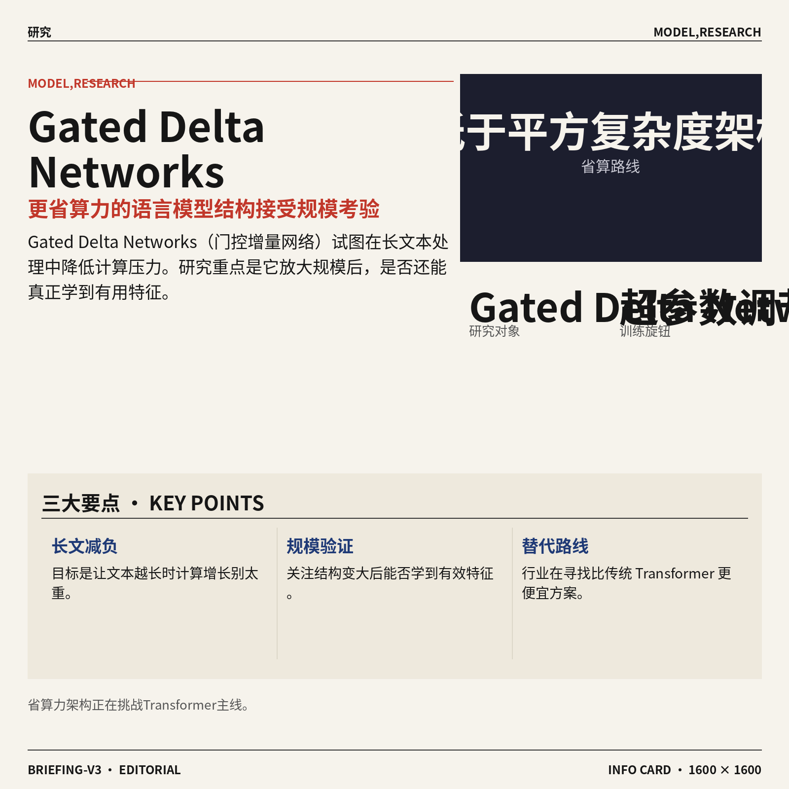

2. **Gated Delta Networks（门控增量网络，一类更省算力的语言模型结构）探索大规模特征学习。**  
这项研究聚焦 **Gated Delta Networks**（门控增量网络，目标是在处理长文本时减少计算压力的模型结构），背景是训练和扩展大语言模型需要非常庞大的算力资源 ⚙️。论文提到，研究动机包括更高效的低于平方复杂度架构（文本越长，计算增长不要像传统注意力那样迅速变重）和更有原则的超参数调节（训练前设置的“旋钮”，比如学习速度等）。它关心的是：这类更省算力的结构在规模变大后，能不能真正学到有用特征，而不是只在小实验里好看。对行业意义在于，大家都在寻找比传统 Transformer（当前大模型常用的基础结构）更便宜的替代路线 (๑•̀ㅂ•́)و。[论文原文(briefing)](https://arxiv.org/abs/2606.04048)


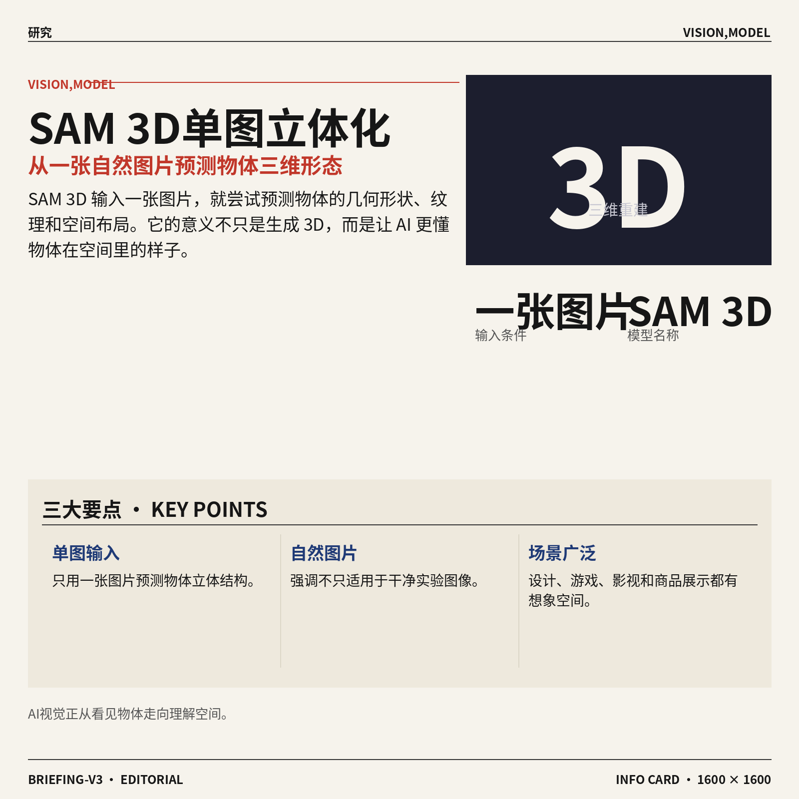

3. **SAM 3D（从单张图片生成三维物体的模型）想把图片里的物体“一键立体化”。**  
**SAM 3D** 是一个面向视觉定位的三维物体重建生成模型，输入一张图片，就预测物体的几何形状、纹理和空间布局 🧊。这里的三维重建（把平面图片还原成可理解的立体结构）对设计、游戏、影视、商品展示等场景都很有想象空间。论文特别强调它面向自然图片表现较强，也就是不是只在干净实验图里工作，而是处理更接近日常拍摄的图像。它的价值不只是“把图变 3D”，更是让 AI 从“看见物体”走向“理解物体在空间里是什么样” 🚀。[论文原文(briefing)](https://arxiv.org/abs/2511.16624)

![SAM 3D（从单张图片生成三维物体的模型）想把图片里的物体“一键立体化”](https://image.pollinations.ai/prompt/SAM%203D%EF%BC%88%E4%BB%8E%E5%8D%95%E5%BC%A0%E5%9B%BE%E7%89%87%E7%94%9F%E6%88%90%E4%B8%89%E7%BB%B4%E7%89%A9%E4%BD%93%E7%9A%84%E6%A8%A1%E5%9E%8B%EF%BC%89%E6%83%B3%E6%8A%8A%E5%9B%BE%E7%89%87%E9%87%8C%E7%9A%84%E7%89%A9%E4%BD%93%E2%80%9C%E4%B8%80%E9%94%AE%E7%AB%8B%E4%BD%93%E5%8C%96%E2%80%9D.%20SAM%203D%EF%BC%88%E4%BB%8E%E5%8D%95%E5%BC%A0%E5%9B%BE%E7%89%87%E7%94%9F%E6%88%90%E4%B8%89%E7%BB%B4%E7%89%A9%E4%BD%93%E7%9A%84%E6%A8%A1%E5%9E%8B%EF%BC%89%E6%83%B3%E6%8A%8A%E5%9B%BE%E7%89%87%E9%87%8C%E7%9A%84%E7%89%A9%E4%BD%93%E2%80%9C%E4%B8%80%E9%94%AE%E7%AB%8B%E4%BD%93%E5%8C%96%E2%80%9D%E3%80%82%20SAM%203D%20%E6%98%AF%E4%B8%80%E4%B8%AA%E9%9D%A2%E5%90%91%E8%A7%86%E8%A7%89%E5%AE%9A%E4%BD%8D%E7%9A%84%E4%B8%89%E7%BB%B4%E7%89%A9%E4%BD%93%E9%87%8D%E5%BB%BA%E7%94%9F%E6%88%90%E6%A8%A1%E5%9E%8B%EF%BC%8C%E8%BE%93%E5%85%A5%E4%B8%80%E5%BC%A0%E5%9B%BE%E7%89%87%EF%BC%8C%E5%B0%B1%E9%A2%84%E6%B5%8B%E7%89%A9%E4%BD%93%E7%9A%84%2C%20technical%20infographic%20diagram%2C%20architecture%20flowchart%2C%20clean%20vector%20illustration%2C%20educational%20style%2C%20no%20text%20overlay%2C%20modern%20minimal%2C%20wide%20aspect?width=1200&height=675&nologo=true&seed=10869)

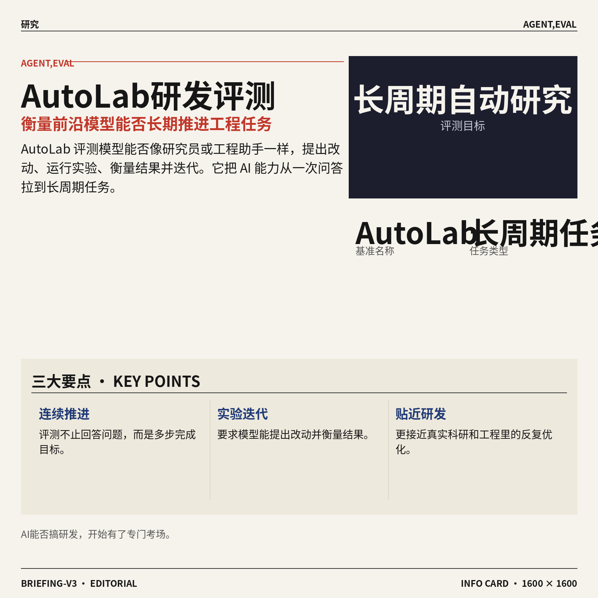

4. **AutoLab（评测前沿模型能否长期做研究和工程任务的基准）追问 AI 能不能真正“搞研发”。**  
**AutoLab** 关注的是长周期自动研究与工程任务：提出改动、运行实验、衡量结果，再不断迭代改进 🔁。长周期任务（不是一次问答，而是连续多步推进一个目标）更接近真实科研和工程工作，因为现实里很少有“一句话就完事”的项目。论文指出，科学与工程进步本质上就是这种反复试错和优化的过程，因此需要新的评测方式来衡量前沿模型是否真的能胜任。对公司里的非技术同事来说，这类研究的重点是：未来 AI 可能不只会回答问题，还会被评估能否像初级研究员或工程助手一样持续推进任务 💡。[论文原文(briefing)](https://arxiv.org/abs/2606.05080)

![AutoLab（评测前沿模型能否长期做研究和工程任务的基准）追问 AI 能不能真正“搞研发”](https://image.pollinations.ai/prompt/AutoLab%EF%BC%88%E8%AF%84%E6%B5%8B%E5%89%8D%E6%B2%BF%E6%A8%A1%E5%9E%8B%E8%83%BD%E5%90%A6%E9%95%BF%E6%9C%9F%E5%81%9A%E7%A0%94%E7%A9%B6%E5%92%8C%E5%B7%A5%E7%A8%8B%E4%BB%BB%E5%8A%A1%E7%9A%84%E5%9F%BA%E5%87%86%EF%BC%89%E8%BF%BD%E9%97%AE%20AI%20%E8%83%BD%E4%B8%8D%E8%83%BD%E7%9C%9F%E6%AD%A3%E2%80%9C%E6%90%9E%E7%A0%94%E5%8F%91%E2%80%9D.%20AutoLab%EF%BC%88%E8%AF%84%E6%B5%8B%E5%89%8D%E6%B2%BF%E6%A8%A1%E5%9E%8B%E8%83%BD%E5%90%A6%E9%95%BF%E6%9C%9F%E5%81%9A%E7%A0%94%E7%A9%B6%E5%92%8C%E5%B7%A5%E7%A8%8B%E4%BB%BB%E5%8A%A1%E7%9A%84%E5%9F%BA%E5%87%86%EF%BC%89%E8%BF%BD%E9%97%AE%20AI%20%E8%83%BD%E4%B8%8D%E8%83%BD%E7%9C%9F%E6%AD%A3%E2%80%9C%E6%90%9E%E7%A0%94%E5%8F%91%E2%80%9D%E3%80%82%20AutoLab%20%E5%85%B3%E6%B3%A8%E7%9A%84%E6%98%AF%E9%95%BF%E5%91%A8%E6%9C%9F%E8%87%AA%E5%8A%A8%E7%A0%94%E7%A9%B6%E4%B8%8E%E5%B7%A5%E7%A8%8B%E4%BB%BB%E5%8A%A1%EF%BC%9A%E6%8F%90%E5%87%BA%E6%94%B9%E5%8A%A8%E3%80%81%E8%BF%90%E8%A1%8C%2C%20technical%20infographic%20diagram%2C%20architecture%20flowchart%2C%20clean%20vector%20illustration%2C%20educational%20style%2C%20no%20text%20overlay%2C%20modern%20minimal%2C%20wide%20aspect?width=1200&height=675&nologo=true&seed=10900)

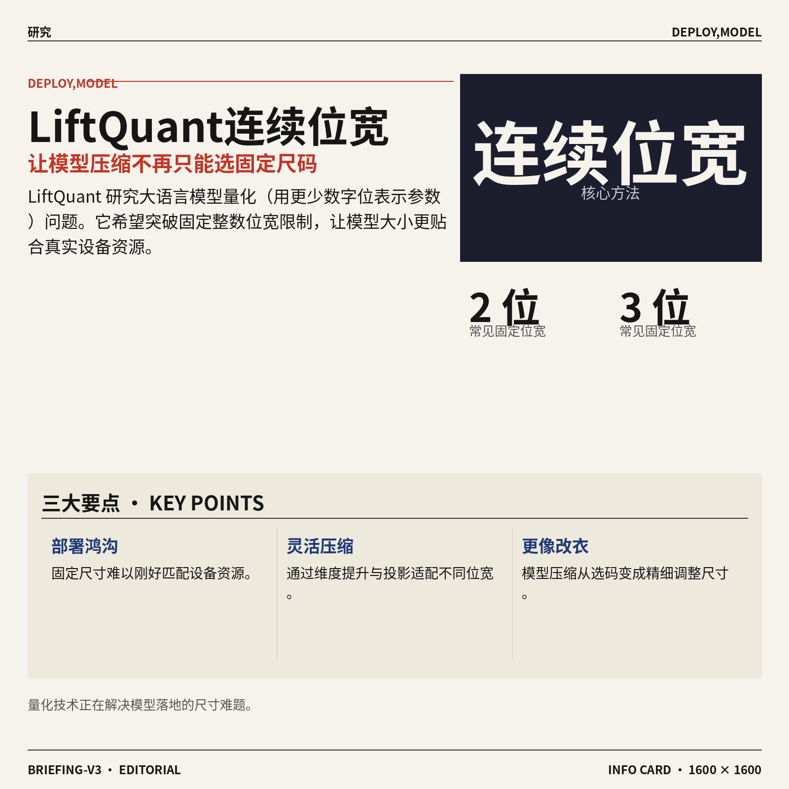

5. **LiftQuant（让大语言模型量化位宽更灵活的方法）试图填上部署鸿沟。**  
**LiftQuant** 研究的是量化（把模型参数用更少数字位表示，从而节省存储和计算）问题。现有方法通常只能用固定整数位宽，比如 2 位、3 位，这会带来论文所说的部署鸿沟（模型大小和实际设备资源之间难以刚好匹配）⚖️。这篇论文提出通过维度提升与投影（先把表示空间调整，再映射回来以适配不同位宽）来实现连续位宽的大语言模型。简单说，它想让模型压缩不再只能“选 S/M/L 码”，而是更像衣服可以精细改尺寸，更贴合实际部署需求 🚀。[论文原文(briefing)](https://arxiv.org/abs/2606.04050)

![LiftQuant（让大语言模型量化位宽更灵活的方法）试图填上部署鸿沟](https://image.pollinations.ai/prompt/LiftQuant%EF%BC%88%E8%AE%A9%E5%A4%A7%E8%AF%AD%E8%A8%80%E6%A8%A1%E5%9E%8B%E9%87%8F%E5%8C%96%E4%BD%8D%E5%AE%BD%E6%9B%B4%E7%81%B5%E6%B4%BB%E7%9A%84%E6%96%B9%E6%B3%95%EF%BC%89%E8%AF%95%E5%9B%BE%E5%A1%AB%E4%B8%8A%E9%83%A8%E7%BD%B2%E9%B8%BF%E6%B2%9F.%20LiftQuant%EF%BC%88%E8%AE%A9%E5%A4%A7%E8%AF%AD%E8%A8%80%E6%A8%A1%E5%9E%8B%E9%87%8F%E5%8C%96%E4%BD%8D%E5%AE%BD%E6%9B%B4%E7%81%B5%E6%B4%BB%E7%9A%84%E6%96%B9%E6%B3%95%EF%BC%89%E8%AF%95%E5%9B%BE%E5%A1%AB%E4%B8%8A%E9%83%A8%E7%BD%B2%E9%B8%BF%E6%B2%9F%E3%80%82%20LiftQuant%20%E7%A0%94%E7%A9%B6%E7%9A%84%E6%98%AF%E9%87%8F%E5%8C%96%EF%BC%88%E6%8A%8A%E6%A8%A1%E5%9E%8B%E5%8F%82%E6%95%B0%E7%94%A8%E6%9B%B4%E5%B0%91%E6%95%B0%E5%AD%97%E4%BD%8D%E8%A1%A8%E7%A4%BA%EF%BC%8C%E4%BB%8E%E8%80%8C%E8%8A%82%E7%9C%81%E5%AD%98%E5%82%A8%E5%92%8C%E8%AE%A1%E7%AE%97%EF%BC%89%E9%97%AE%E9%A2%98%2C%20technical%20infographic%20diagram%2C%20architecture%20flowchart%2C%20clean%20vector%20illustration%2C%20educational%20style%2C%20no%20text%20overlay%2C%20modern%20minimal%2C%20wide%20aspect?width=1200&height=675&nologo=true&seed=10931)

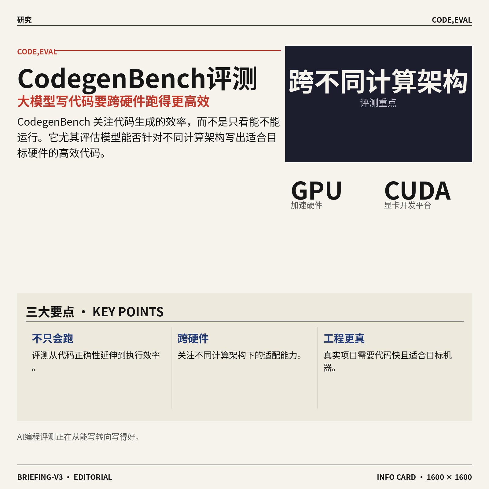

6. **CodegenBench（评测大模型跨硬件写高效代码的基准）不只看代码能不能跑。**  
**CodegenBench** 关注大语言模型写代码时的效率问题，尤其是跨不同计算架构时是否还能写出高效代码 🧑‍💻。论文指出，过去很多代码生成评测主要看通用编程，或集中在 GPU（图形处理器，常被用来加速 AI 计算）加速环境，比如 PyTorch（最流行的 AI 开发框架）和 CUDA（让程序调用英伟达显卡算力的开发平台）。但真实工程里，“代码能运行”和“代码跑得快、适合目标硬件”是两件事。这个基准的意义在于，把 AI 编程能力从“会写答案”推进到“能写适配不同机器的高效方案” 💡。[论文原文(briefing)](https://arxiv.org/abs/2606.04023)

![CodegenBench（评测大模型跨硬件写高效代码的基准）不只看代码能不能跑](https://image.pollinations.ai/prompt/CodegenBench%EF%BC%88%E8%AF%84%E6%B5%8B%E5%A4%A7%E6%A8%A1%E5%9E%8B%E8%B7%A8%E7%A1%AC%E4%BB%B6%E5%86%99%E9%AB%98%E6%95%88%E4%BB%A3%E7%A0%81%E7%9A%84%E5%9F%BA%E5%87%86%EF%BC%89%E4%B8%8D%E5%8F%AA%E7%9C%8B%E4%BB%A3%E7%A0%81%E8%83%BD%E4%B8%8D%E8%83%BD%E8%B7%91.%20CodegenBench%EF%BC%88%E8%AF%84%E6%B5%8B%E5%A4%A7%E6%A8%A1%E5%9E%8B%E8%B7%A8%E7%A1%AC%E4%BB%B6%E5%86%99%E9%AB%98%E6%95%88%E4%BB%A3%E7%A0%81%E7%9A%84%E5%9F%BA%E5%87%86%EF%BC%89%E4%B8%8D%E5%8F%AA%E7%9C%8B%E4%BB%A3%E7%A0%81%E8%83%BD%E4%B8%8D%E8%83%BD%E8%B7%91%E3%80%82%20CodegenBench%20%E5%85%B3%E6%B3%A8%E5%A4%A7%E8%AF%AD%E8%A8%80%E6%A8%A1%E5%9E%8B%E5%86%99%E4%BB%A3%E7%A0%81%E6%97%B6%E7%9A%84%E6%95%88%E7%8E%87%E9%97%AE%E9%A2%98%EF%BC%8C%E5%B0%A4%E5%85%B6%E6%98%AF%E8%B7%A8%E4%B8%8D%E5%90%8C%E8%AE%A1%E7%AE%97%E6%9E%B6%2C%20technical%20infographic%20diagram%2C%20architecture%20flowchart%2C%20clean%20vector%20illustration%2C%20educational%20style%2C%20no%20text%20overlay%2C%20modern%20minimal%2C%20wide%20aspect?width=1200&height=675&nologo=true&seed=10962)

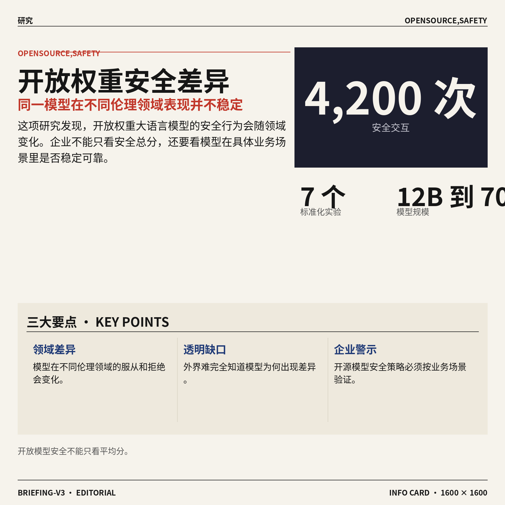

7. **Open-Weight LLMs（开放权重大语言模型）的安全表现被发现会随领域变化。**  
这篇论文研究开放权重大语言模型（模型参数可被外部下载和使用的大模型）的安全行为是否稳定 🛡️。作者做了 7 个标准化实验，覆盖 7 个伦理领域，测试 5 个 12B 到 70B 规模模型，并进行了 4,200 次交互。这里的 12B/70B（模型参数量，数字越大通常代表模型更大）是衡量模型规模的常见方式；“透明度缺口”则指外界很难完全知道模型为什么在某些领域更愿意服从或拒绝。对企业使用开源模型来说，这提醒大家：安全策略不能只看总分，还要看不同业务场景下是否会出现不可预测差异 ⚠️。[论文原文(briefing)](https://arxiv.org/abs/2606.04035)

![Open-Weight LLMs（开放权重大语言模型）的安全表现被发现会随领域变化](https://image.pollinations.ai/prompt/Open-Weight%20LLMs%EF%BC%88%E5%BC%80%E6%94%BE%E6%9D%83%E9%87%8D%E5%A4%A7%E8%AF%AD%E8%A8%80%E6%A8%A1%E5%9E%8B%EF%BC%89%E7%9A%84%E5%AE%89%E5%85%A8%E8%A1%A8%E7%8E%B0%E8%A2%AB%E5%8F%91%E7%8E%B0%E4%BC%9A%E9%9A%8F%E9%A2%86%E5%9F%9F%E5%8F%98%E5%8C%96.%20Open-Weight%20LLMs%EF%BC%88%E5%BC%80%E6%94%BE%E6%9D%83%E9%87%8D%E5%A4%A7%E8%AF%AD%E8%A8%80%E6%A8%A1%E5%9E%8B%EF%BC%89%E7%9A%84%E5%AE%89%E5%85%A8%E8%A1%A8%E7%8E%B0%E8%A2%AB%E5%8F%91%E7%8E%B0%E4%BC%9A%E9%9A%8F%E9%A2%86%E5%9F%9F%E5%8F%98%E5%8C%96%E3%80%82%20%E8%BF%99%E7%AF%87%E8%AE%BA%E6%96%87%E7%A0%94%E7%A9%B6%E5%BC%80%E6%94%BE%E6%9D%83%E9%87%8D%E5%A4%A7%E8%AF%AD%E8%A8%80%E6%A8%A1%E5%9E%8B%EF%BC%88%E6%A8%A1%E5%9E%8B%E5%8F%82%E6%95%B0%E5%8F%AF%E8%A2%AB%E5%A4%96%E9%83%A8%E4%B8%8B%E8%BD%BD%E5%92%8C%E4%BD%BF%E7%94%A8%E7%9A%84%E5%A4%A7%E6%A8%A1%E5%9E%8B%EF%BC%89%E7%9A%84%E5%AE%89%E5%85%A8%2C%20technical%20infographic%20diagram%2C%20architecture%20flowchart%2C%20clean%20vector%20illustration%2C%20educational%20style%2C%20no%20text%20overlay%2C%20modern%20minimal%2C%20wide%20aspect?width=1200&height=675&nologo=true&seed=10993)


8. **RUBAS（基于评分规则的强化学习方法）瞄准 Agent 真实执行安全。**  
**RUBAS** 提出用评分规则来做强化学习（通过奖励和惩罚让模型学会更合适行为的训练方式），目标是提升 Agent 的安全性 🤖。论文强调，当大语言模型从“生成文字”进化为能调用工具的 Agent（能操作外部工具、执行多步骤任务的 AI 助手）后，风险也从说错话扩展到真实执行出错。现有对齐方法（让模型行为符合人类意图的训练过程）往往更偏文本层面，而工具执行会带来新的安全挑战。它的核心意义在于：未来评估 AI 助手，不能只看回答是否礼貌，还要看它真正动手做事时是否守规矩、可控 🚀。[论文原文(briefing)](https://arxiv.org/abs/2606.04051)

![RUBAS（基于评分规则的强化学习方法）瞄准 Agent 真实执行安全](https://image.pollinations.ai/prompt/RUBAS%EF%BC%88%E5%9F%BA%E4%BA%8E%E8%AF%84%E5%88%86%E8%A7%84%E5%88%99%E7%9A%84%E5%BC%BA%E5%8C%96%E5%AD%A6%E4%B9%A0%E6%96%B9%E6%B3%95%EF%BC%89%E7%9E%84%E5%87%86%20Agent%20%E7%9C%9F%E5%AE%9E%E6%89%A7%E8%A1%8C%E5%AE%89%E5%85%A8.%20RUBAS%EF%BC%88%E5%9F%BA%E4%BA%8E%E8%AF%84%E5%88%86%E8%A7%84%E5%88%99%E7%9A%84%E5%BC%BA%E5%8C%96%E5%AD%A6%E4%B9%A0%E6%96%B9%E6%B3%95%EF%BC%89%E7%9E%84%E5%87%86%20Agent%20%E7%9C%9F%E5%AE%9E%E6%89%A7%E8%A1%8C%E5%AE%89%E5%85%A8%E3%80%82%20RUBAS%20%E6%8F%90%E5%87%BA%E7%94%A8%E8%AF%84%E5%88%86%E8%A7%84%E5%88%99%E6%9D%A5%E5%81%9A%E5%BC%BA%E5%8C%96%E5%AD%A6%E4%B9%A0%EF%BC%88%E9%80%9A%E8%BF%87%E5%A5%96%E5%8A%B1%E5%92%8C%E6%83%A9%E7%BD%9A%E8%AE%A9%E6%A8%A1%E5%9E%8B%E5%AD%A6%E4%BC%9A%E6%9B%B4%E5%90%88%E9%80%82%E8%A1%8C%E4%B8%BA%E7%9A%84%E8%AE%AD%E7%BB%83%E6%96%B9%E5%BC%8F%EF%BC%89%2C%20technical%20infographic%20diagram%2C%20architecture%20flowchart%2C%20clean%20vector%20illustration%2C%20educational%20style%2C%20no%20text%20overlay%2C%20modern%20minimal%2C%20wide%20aspect?width=1200&height=675&nologo=true&seed=11024)

### 🟡 行业展望与社会影响

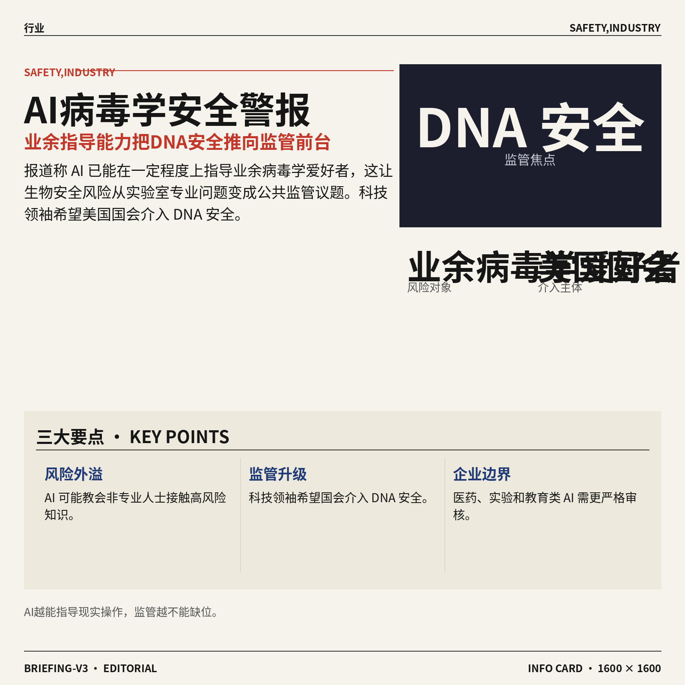

1. **人工智能开始能“指导”业余病毒学爱好者，DNA 安全（基因信息与合成生物材料的安全管控）被推到国会面前。**  
有报道称，人工智能已经能在一定程度上为**业余病毒学爱好者**提供指导，这让生物安全风险不再只是实验室里的专业话题 🧬。文中提到，顶级科技领袖希望美国国会介入 **DNA 安全**，也就是防止基因序列和生物合成能力被滥用。[生物安全报道(briefing)](https://the-decoder.com/ai-can-now-coach-amateur-virologists-and-top-tech-leaders-want-congress-to-act-on-dna-security/) 这件事的行业信号很明确：人工智能越强，监管就越不能只盯着聊天内容，还要关注它在现实世界里可能“教会人做什么”。对企业来说，未来涉及医药、实验、教育内容的人工智能产品，可能都需要更严格的**安全边界**和审核机制 🚨。


2. **Cloudflare（网站加速与安全服务商）认为网页未来会变成“付费抓取”。**  
Cloudflare 首席执行官表示，随着**爬虫机器人**（自动访问网页、抓取内容的程序）流量超过真人访问，互联网可能进入“付费抓取”时代。[网页抓取报道(briefing)](https://the-decoder.com/cloudflare-ceo-says-the-webs-future-is-pay-to-crawl-as-bots-overtake-human-traffic/) 简单说，以后人工智能公司想大量读取网站内容，可能不能再“免费拿走”，而要向内容方付费 💰。这背后其实是一个新版权问题：网站内容被拿去训练或生成答案后，原网站流量和广告收入可能被削弱。对媒体、电商、知识社区来说，**内容定价权**会变得越来越重要。


3. **Airbnb（全球短租民宿平台）计划成立新的人工智能实验室。**  
Airbnb 首席执行官 Brian Chesky 计划推出一个新的人工智能实验室，说明平台型公司正在把人工智能能力放到更核心的位置 🏠。[Airbnb 实验室报道(briefing)](https://techcrunch.com/2026/06/04/airbnbs-brian-chesky-plans-to-launch-a-new-ai-lab/) 报道还提到，他去年曾表示，公司没有达成**大语言模型**（能理解和生成文字的基础人工智能模型）合作，是因为当时现有产品还“不够准备好”。这意味着 Airbnb 可能不只是想接入一个聊天助手，而是在等待更适合旅游、住宿、客服、行程规划等场景的能力成熟。对业务同事来说，这类动作值得关注：未来平台服务可能从“你搜索”变成“系统帮你规划和匹配” ✈️。


4. **OpenAI 发布“智能时代生物防御”行动计划。**  
OpenAI 发布了一份关于**人工智能驱动的生物韧性**（用人工智能提升社会发现、防范和应对生物风险的能力）的行动计划。[OpenAI 生物防御计划(briefing)](https://openai.com/index/biodefense-in-the-intelligence-age) 这类议题听起来很远，但本质上是在回答一个现实问题：当人工智能能帮助理解生物知识时，社会也需要用人工智能来提升防护能力 🛡️。所谓**生物防御**，可以理解为公共卫生、实验室安全、风险预警等环节的综合防线。它传递的信号是，人工智能安全已经从“别胡说”升级到“别在现实世界造成严重后果”。

![OpenAI 发布“智能时代生物防御”行动计划](https://image.pollinations.ai/prompt/OpenAI%20%E5%8F%91%E5%B8%83%E2%80%9C%E6%99%BA%E8%83%BD%E6%97%B6%E4%BB%A3%E7%94%9F%E7%89%A9%E9%98%B2%E5%BE%A1%E2%80%9D%E8%A1%8C%E5%8A%A8%E8%AE%A1%E5%88%92.%20OpenAI%20%E5%8F%91%E5%B8%83%E2%80%9C%E6%99%BA%E8%83%BD%E6%97%B6%E4%BB%A3%E7%94%9F%E7%89%A9%E9%98%B2%E5%BE%A1%E2%80%9D%E8%A1%8C%E5%8A%A8%E8%AE%A1%E5%88%92%E3%80%82%20OpenAI%20%E5%8F%91%E5%B8%83%E4%BA%86%E4%B8%80%E4%BB%BD%E5%85%B3%E4%BA%8E%E4%BA%BA%E5%B7%A5%E6%99%BA%E8%83%BD%E9%A9%B1%E5%8A%A8%E7%9A%84%E7%94%9F%E7%89%A9%E9%9F%A7%E6%80%A7%EF%BC%88%E7%94%A8%E4%BA%BA%E5%B7%A5%E6%99%BA%E8%83%BD%E6%8F%90%E5%8D%87%E7%A4%BE%E4%BC%9A%E5%8F%91%E7%8E%B0%E3%80%81%E9%98%B2%E8%8C%83%E5%92%8C%E5%BA%94%E5%AF%B9%E7%94%9F%E7%89%A9%E9%A3%8E%E9%99%A9%E7%9A%84%E8%83%BD%E5%8A%9B%EF%BC%89%E7%9A%84%E8%A1%8C%E5%8A%A8%E8%AE%A1%2C%20technical%20infographic%20diagram%2C%20architecture%20flowchart%2C%20clean%20vector%20illustration%2C%20educational%20style%2C%20no%20text%20overlay%2C%20modern%20minimal%2C%20wide%20aspect?width=1200&height=675&nologo=true&seed=10900)

5. **OpenAI 负责人 Sam Altman 认为“主动式人工智能”会接棒聊天机器人和 Agent（能自主拆解并执行任务的人工智能助手）。**  
Sam Altman 表示，继聊天机器人和 Agent 之后，下一阶段可能是**主动式人工智能**（不等用户每次提问，而是提前理解需求并主动提供帮助）。[主动式人工智能报道(briefing)](https://the-decoder.com/openai-ceo-sam-altman-sees-proactive-ai-as-the-next-big-phase-after-chatbots-and-agents/) 这意味着产品交互可能从“你问一句、它答一句”，变成“它知道你接下来可能要做什么” 🤖。比如在工作场景里，它可能提前整理资料、提醒风险、准备会议内容，但这也会带来新的隐私和边界问题。对公司管理者来说，未来要思考的不只是“能不能用”，还包括“它主动到什么程度才合适”。

![OpenAI 负责人 Sam Altman 认为“主动式人工智能”会接棒聊天机器人和 Agent（能自主拆解并执行任务的人工智能助手）](https://image.pollinations.ai/prompt/OpenAI%20%E8%B4%9F%E8%B4%A3%E4%BA%BA%20Sam%20Altman%20%E8%AE%A4%E4%B8%BA%E2%80%9C%E4%B8%BB%E5%8A%A8%E5%BC%8F%E4%BA%BA%E5%B7%A5%E6%99%BA%E8%83%BD%E2%80%9D%E4%BC%9A%E6%8E%A5%E6%A3%92%E8%81%8A%E5%A4%A9%E6%9C%BA%E5%99%A8%E4%BA%BA%E5%92%8C%20Agent%EF%BC%88%E8%83%BD%E8%87%AA%E4%B8%BB%E6%8B%86%E8%A7%A3%E5%B9%B6%E6%89%A7%E8%A1%8C%E4%BB%BB%E5%8A%A1%E7%9A%84%E4%BA%BA%E5%B7%A5%E6%99%BA%E8%83%BD%E5%8A%A9%E6%89%8B%EF%BC%89.%20OpenAI%20%E8%B4%9F%E8%B4%A3%E4%BA%BA%20Sam%20Altman%20%E8%AE%A4%E4%B8%BA%E2%80%9C%E4%B8%BB%E5%8A%A8%E5%BC%8F%E4%BA%BA%E5%B7%A5%E6%99%BA%E8%83%BD%E2%80%9D%E4%BC%9A%E6%8E%A5%E6%A3%92%E8%81%8A%E5%A4%A9%E6%9C%BA%E5%99%A8%E4%BA%BA%E5%92%8C%20Agent%EF%BC%88%E8%83%BD%E8%87%AA%E4%B8%BB%E6%8B%86%E8%A7%A3%E5%B9%B6%E6%89%A7%E8%A1%8C%E4%BB%BB%E5%8A%A1%E7%9A%84%E4%BA%BA%E5%B7%A5%E6%99%BA%E8%83%BD%E5%8A%A9%E6%89%8B%EF%BC%89%E3%80%82%20Sam%20Altman%2C%20technical%20infographic%20diagram%2C%20architecture%20flowchart%2C%20clean%20vector%20illustration%2C%20educational%20style%2C%20no%20text%20overlay%2C%20modern%20minimal%2C%20wide%20aspect?width=1200&height=675&nologo=true&seed=10931)

6. **Google 允许网站退出人工智能搜索结果，但多数网站可能别无选择。**  
Google 现在让网站可以选择不出现在人工智能搜索结果中，但报道指出，许多网站实际上没有太多替代渠道。[Google 搜索报道(briefing)](https://the-decoder.com/google-lets-sites-opt-out-of-ai-search-results-knowing-most-have-nowhere-else-to-go/) 这里的**人工智能搜索结果**，指的是搜索引擎直接用人工智能汇总答案，而不是只给用户一排网页链接 🔎。对内容网站来说，退出可能意味着减少被人工智能引用；不退出，又可能让用户不用点击原网页就拿到答案。这个变化会继续重塑**搜索流量分配**，也会影响媒体、品牌官网和知识型平台的获客方式。

![Google 允许网站退出人工智能搜索结果，但多数网站可能别无选择](https://image.pollinations.ai/prompt/Google%20%E5%85%81%E8%AE%B8%E7%BD%91%E7%AB%99%E9%80%80%E5%87%BA%E4%BA%BA%E5%B7%A5%E6%99%BA%E8%83%BD%E6%90%9C%E7%B4%A2%E7%BB%93%E6%9E%9C%EF%BC%8C%E4%BD%86%E5%A4%9A%E6%95%B0%E7%BD%91%E7%AB%99%E5%8F%AF%E8%83%BD%E5%88%AB%E6%97%A0%E9%80%89%E6%8B%A9.%20Google%20%E5%85%81%E8%AE%B8%E7%BD%91%E7%AB%99%E9%80%80%E5%87%BA%E4%BA%BA%E5%B7%A5%E6%99%BA%E8%83%BD%E6%90%9C%E7%B4%A2%E7%BB%93%E6%9E%9C%EF%BC%8C%E4%BD%86%E5%A4%9A%E6%95%B0%E7%BD%91%E7%AB%99%E5%8F%AF%E8%83%BD%E5%88%AB%E6%97%A0%E9%80%89%E6%8B%A9%E3%80%82%20Google%20%E7%8E%B0%E5%9C%A8%E8%AE%A9%E7%BD%91%E7%AB%99%E5%8F%AF%E4%BB%A5%E9%80%89%E6%8B%A9%E4%B8%8D%E5%87%BA%E7%8E%B0%E5%9C%A8%E4%BA%BA%E5%B7%A5%E6%99%BA%E8%83%BD%E6%90%9C%E7%B4%A2%E7%BB%93%E6%9E%9C%E4%B8%AD%EF%BC%8C%E4%BD%86%E6%8A%A5%E9%81%93%E6%8C%87%E5%87%BA%EF%BC%8C%E8%AE%B8%E5%A4%9A%E7%BD%91%E7%AB%99%E5%AE%9E%E9%99%85%E4%B8%8A%E6%B2%A1%E6%9C%89%2C%20technical%20infographic%20diagram%2C%20architecture%20flowchart%2C%20clean%20vector%20illustration%2C%20educational%20style%2C%20no%20text%20overlay%2C%20modern%20minimal%2C%20wide%20aspect?width=1200&height=675&nologo=true&seed=10962)

7. **ChatGPT 开始按工作、爱好和旅行偏好保存你的“叙事档案”。**  
报道称，ChatGPT 现在会保存关于用户的**叙事档案**（把用户信息整理成更连贯的人物画像），并按工作、兴趣爱好、旅行偏好等类别归档。[ChatGPT 记忆报道(briefing)](https://the-decoder.com/chatgpt-now-saves-narrative-dossiers-about-you-sorted-by-work-hobbies-and-travel-preferences/) 这说明聊天工具正在从“临时问答”走向“长期了解你”的个人助手模式 🧠。所谓**记忆功能**，就是系统把你过去透露的信息保留下来，用于之后给出更贴合的建议。好处是体验更个性化，但风险也很明显：用户需要更清楚地知道哪些信息被保存、如何查看、如何删除。

![ChatGPT 开始按工作、爱好和旅行偏好保存你的“叙事档案”](https://image.pollinations.ai/prompt/ChatGPT%20%E5%BC%80%E5%A7%8B%E6%8C%89%E5%B7%A5%E4%BD%9C%E3%80%81%E7%88%B1%E5%A5%BD%E5%92%8C%E6%97%85%E8%A1%8C%E5%81%8F%E5%A5%BD%E4%BF%9D%E5%AD%98%E4%BD%A0%E7%9A%84%E2%80%9C%E5%8F%99%E4%BA%8B%E6%A1%A3%E6%A1%88%E2%80%9D.%20ChatGPT%20%E5%BC%80%E5%A7%8B%E6%8C%89%E5%B7%A5%E4%BD%9C%E3%80%81%E7%88%B1%E5%A5%BD%E5%92%8C%E6%97%85%E8%A1%8C%E5%81%8F%E5%A5%BD%E4%BF%9D%E5%AD%98%E4%BD%A0%E7%9A%84%E2%80%9C%E5%8F%99%E4%BA%8B%E6%A1%A3%E6%A1%88%E2%80%9D%E3%80%82%20%E6%8A%A5%E9%81%93%E7%A7%B0%EF%BC%8CChatGPT%20%E7%8E%B0%E5%9C%A8%E4%BC%9A%E4%BF%9D%E5%AD%98%E5%85%B3%E4%BA%8E%E7%94%A8%E6%88%B7%E7%9A%84%E5%8F%99%E4%BA%8B%E6%A1%A3%E6%A1%88%EF%BC%88%E6%8A%8A%E7%94%A8%E6%88%B7%E4%BF%A1%E6%81%AF%E6%95%B4%E7%90%86%E6%88%90%E6%9B%B4%E8%BF%9E%E8%B4%AF%E7%9A%84%E4%BA%BA%E7%89%A9%E7%94%BB%E5%83%8F%EF%BC%89%EF%BC%8C%E5%B9%B6%E6%8C%89%2C%20technical%20infographic%20diagram%2C%20architecture%20flowchart%2C%20clean%20vector%20illustration%2C%20educational%20style%2C%20no%20text%20overlay%2C%20modern%20minimal%2C%20wide%20aspect?width=1200&height=675&nologo=true&seed=10993)

### 🟣 开源TOP项目

1. **mindfold-ai/Trellis（用于管理智能体运行的开源套件）主打更顺手的智能体操作台。**  
mindfold-ai/Trellis（用于管理智能体运行的开源套件）把自己定位为“最好的 **agent harness**（智能体运行支架，负责把模型、工具和任务流程串起来的操作台）” 🚀。对不写代码的同事来说，可以把它理解成：不是一个聊天机器人本身，而是让智能体更稳定执行任务的“后台工作台”。这类项目如果成熟，通常会帮助团队更容易测试、调度和管理各种自动化任务 💡。感兴趣可以看它的 [GitHub 仓库(briefing)](https://github.com/mindfold-ai/Trellis)。


2. **pewdiepie-archdaemon/odysseus（可自托管的人工智能工作空间）想把办公环境搬到自己服务器上。**  
pewdiepie-archdaemon/odysseus（可自托管的人工智能工作空间）主打 **self-hosted**（自托管，把软件部署在自己的服务器或电脑上，而不是完全依赖外部云服务）🚀。它的定位是一个人工智能工作空间，也就是把与人工智能协作相关的内容集中在一个地方。对企业来说，自托管的吸引点通常在于数据和系统更可控，尤其适合对内部资料比较敏感的场景 💡。项目入口在 [GitHub 仓库(briefing)](https://github.com/pewdiepie-archdaemon/odysseus)。


3. **run-llama/liteparse（快速开源文档解析器）瞄准“让机器读懂文件”这件事。**  
run-llama/liteparse（快速开源文档解析器）强调 **document parser**（文档解析器，把 PDF、网页、表格等文件内容整理成机器更容易处理的结构）能力 🚀。它的关键词是快速、好用、开源，说明目标不是炫技，而是降低把文档接入人工智能应用的门槛。很多知识库、客服机器人、内部资料问答都离不开这一步，因为模型要先“读懂资料”，才能进一步回答问题 💡。项目详情可查看 [GitHub 仓库(briefing)](https://github.com/run-llama/liteparse)。


4. **Anthropic 开源漏洞发现框架（用人工智能辅助找代码安全问题的工具）。**  
Anthropic 这次开源的是一个面向 **vulnerability discovery**（漏洞发现，找出代码里可能被攻击者利用的安全缺陷）的参考框架 🚀。它强调 **AI-powered**（由人工智能辅助，让模型参与分析和发现问题）代码安全探索，适合安全研究或工程团队参考。对业务同事来说，这类工具的意义在于：未来代码上线前，人工智能可能更早帮团队发现潜在风险，而不是等事故发生后再补救 💡。代码已放在 [开源框架仓库(briefing)](https://github.com/anthropics/defending-code-reference-harness)。


5. **p-e-w/heretic（自动移除语言模型审查限制的工具）聚焦模型输出限制调整。**  
p-e-w/heretic（自动移除语言模型审查限制的工具）介绍中写明，它用于 **censorship removal**（审查限制移除，减少语言模型回答时的内容过滤或拒答）🚀。这里的 **language model**（语言模型，能理解和生成文字的人工智能系统）是它处理的对象。这个方向比较敏感，因为它涉及模型安全边界和内容控制；从行业角度看，也反映出开源社区正在持续讨论“模型应该限制到什么程度”这个问题 💡。项目页面见 [GitHub 仓库(briefing)](https://github.com/p-e-w/heretic)。

![p-e-w/heretic（自动移除语言模型审查限制的工具）聚焦模型输出限制调整](https://image.pollinations.ai/prompt/p-e-w%2Fheretic%EF%BC%88%E8%87%AA%E5%8A%A8%E7%A7%BB%E9%99%A4%E8%AF%AD%E8%A8%80%E6%A8%A1%E5%9E%8B%E5%AE%A1%E6%9F%A5%E9%99%90%E5%88%B6%E7%9A%84%E5%B7%A5%E5%85%B7%EF%BC%89%E8%81%9A%E7%84%A6%E6%A8%A1%E5%9E%8B%E8%BE%93%E5%87%BA%E9%99%90%E5%88%B6%E8%B0%83%E6%95%B4.%20p-e-w%2Fheretic%EF%BC%88%E8%87%AA%E5%8A%A8%E7%A7%BB%E9%99%A4%E8%AF%AD%E8%A8%80%E6%A8%A1%E5%9E%8B%E5%AE%A1%E6%9F%A5%E9%99%90%E5%88%B6%E7%9A%84%E5%B7%A5%E5%85%B7%EF%BC%89%E8%81%9A%E7%84%A6%E6%A8%A1%E5%9E%8B%E8%BE%93%E5%87%BA%E9%99%90%E5%88%B6%E8%B0%83%E6%95%B4%E3%80%82%20p-e-w%2Fheretic%EF%BC%88%E8%87%AA%E5%8A%A8%E7%A7%BB%E9%99%A4%E8%AF%AD%E8%A8%80%E6%A8%A1%E5%9E%8B%E5%AE%A1%E6%9F%A5%E9%99%90%E5%88%B6%E7%9A%84%E5%B7%A5%E5%85%B7%EF%BC%89%E4%BB%8B%E7%BB%8D%E4%B8%AD%E5%86%99%E6%98%8E%EF%BC%8C%E5%AE%83%E7%94%A8%2C%20technical%20infographic%20diagram%2C%20architecture%20flowchart%2C%20clean%20vector%20illustration%2C%20educational%20style%2C%20no%20text%20overlay%2C%20modern%20minimal%2C%20wide%20aspect?width=1200&height=675&nologo=true&seed=11125)

6. **EveryInc/compound-engineering-plugin（面向多款编程助手的官方插件）接入 Claude Code、Codex、Cursor 等工具。**  
EveryInc/compound-engineering-plugin（面向多款编程助手的官方插件）是 **Compound Engineering**（复合工程，把多个编程工具或智能助手组合起来协同完成开发任务）的官方插件 🚀。它明确支持 Claude Code、Codex、Cursor 等编程助手，说明目标是让开发者在不同工具里复用同一套能力。对非技术同事来说，可以把 **plugin**（插件，给现有软件额外增加功能的小组件）理解成“给常用办公软件装扩展”，只是这里服务的是程序员的开发环境 💡。项目可在 [官方插件仓库(briefing)](https://github.com/EveryInc/compound-engineering-plugin) 查看。


### 🔴 社媒分享

1. **《Co-Intelligence（人机协同智能，强调人和 AI 一起思考与工作）》作者谈“共存”新阶段。**  
这篇分享来自《Co-Intelligence（人机协同智能，把 AI 当作协作伙伴而不是单纯工具）》作者 Ethan Mollick，他回顾了这本 AI 书出版两年来的影响力 📚。原文提到，这本书成为《纽约时报》畅销书，并被翻译成 **25 种以上语言**，说明“普通人如何理解和使用 AI”已经是全球性话题。标题里的 **co-existence（共存，指人类与 AI 长期一起工作和生活）** 也很值得关注：讨论重点正在从“AI 能不能帮我”转向“我们如何和 AI 稳定相处”。[作者原文分享(briefing)](https://www.oneusefulthing.org/p/co-existence-and-the-end-of-co-intelligence)


2. **Anthropic 探讨 recursive self-improvement（递归式自我改进，AI 参与改进自身能力）的进展。**  
Anthropic 研究机构发布了一篇关于 **recursive self-improvement（递归式自我改进，简单说就是 AI 不只完成任务，还可能参与优化下一代 AI）** 的文章 🤖。标题“当 AI 构建自己”点出了一个很关键的方向：未来 AI 的进步，可能不再完全依赖人类工程师手工推动。对非技术同事来说，可以把它理解成“工具开始帮忙升级工具本身”，这会影响研发效率、产品迭代速度，也会带来更高的治理要求。[Anthropic 研究文章(briefing)](https://www.anthropic.com/institute/recursive-self-improvement)


3. **微软首席执行官 Satya Nadella 谈如何找到企业核心竞争力。**  
这是一篇对微软首席执行官 Satya Nadella 的访谈，主题聚焦 **core competencies（核心竞争力，企业最擅长、最难被复制的能力）** 🧭。在 AI 时代，企业不只是追逐新工具，更要判断哪些能力应该自己长期掌握，哪些可以借助外部平台完成。对业务、运营和管理同事来说，这类讨论很实用：它提醒我们做 AI 项目时，别只问“能不能上”，还要问“这是不是我们的关键能力”。[访谈全文(briefing)](https://stratechery.com/2026/an-interview-with-microsoft-ceo-satya-nadella-about-finding-core-competencies/)


---

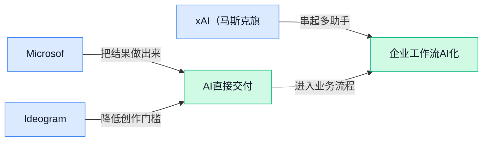

### 📊 行业洞察（今日 4 条）

1. Microsoft计划发布自研人工智能模型套件（由公司自己开发的一组模型）
  【洞察】大厂更重视底层能力自主权，因为可控成本与体验，但也增加投入风险。

2. Ideogram 4.0以开放权重模型（公开模型参数）发布，并强化2K分辨率文字生成
  【洞察】设计生成正走向可商用素材，因为文字更准能少返工，但版权边界仍需关注。

3. xAI将Grok Imagine 1.5升级为图生视频（把静态图变成动态视频）工具
  【洞察】短视频创意门槛在下降，因为单图可快速成片，但720p质量仍限制正式交付。

4. OpenAI称ChatGPT会保存叙事档案（连贯用户画像），按工作和爱好归类
  【洞察】个性化助手会更强，因为长期偏好可被利用，但隐私透明度将成为关键风险。

### 💭 对我们的启发（今日 3 条）

1. Grok Imagine 1.5图生视频说明，剪辑工具可把封面、分镜直接变动效；机会是提效，风险是画质不稳。

2. Ideogram 4.0强化文字生成，适合做视频封面和字幕样式草稿；机会是少返工，风险是品牌字形失真。

3. ChatGPT叙事档案启发Agent（自主完成多步任务的AI助手）平台记住创作者偏好；机会是更懂剪辑风格，风险是隐私压力。

