## AI资讯日报 2026/6/6

> AI 早报 · 每日早读 · 全网深度聚合

## **今日摘要**

```
Google 每月9.2亿美元砸向 SpaceX 买算力，AI 基建战重磅改道
美国政府被曝谈入股 OpenAI，佛州起诉 Altman 称 ChatGPT 是缺陷产品
Anthropic 呼吁 AI 竞赛暂停键，Apollo（投资巨头）350亿美元融资买芯片
```

### 🔵 产品与功能更新

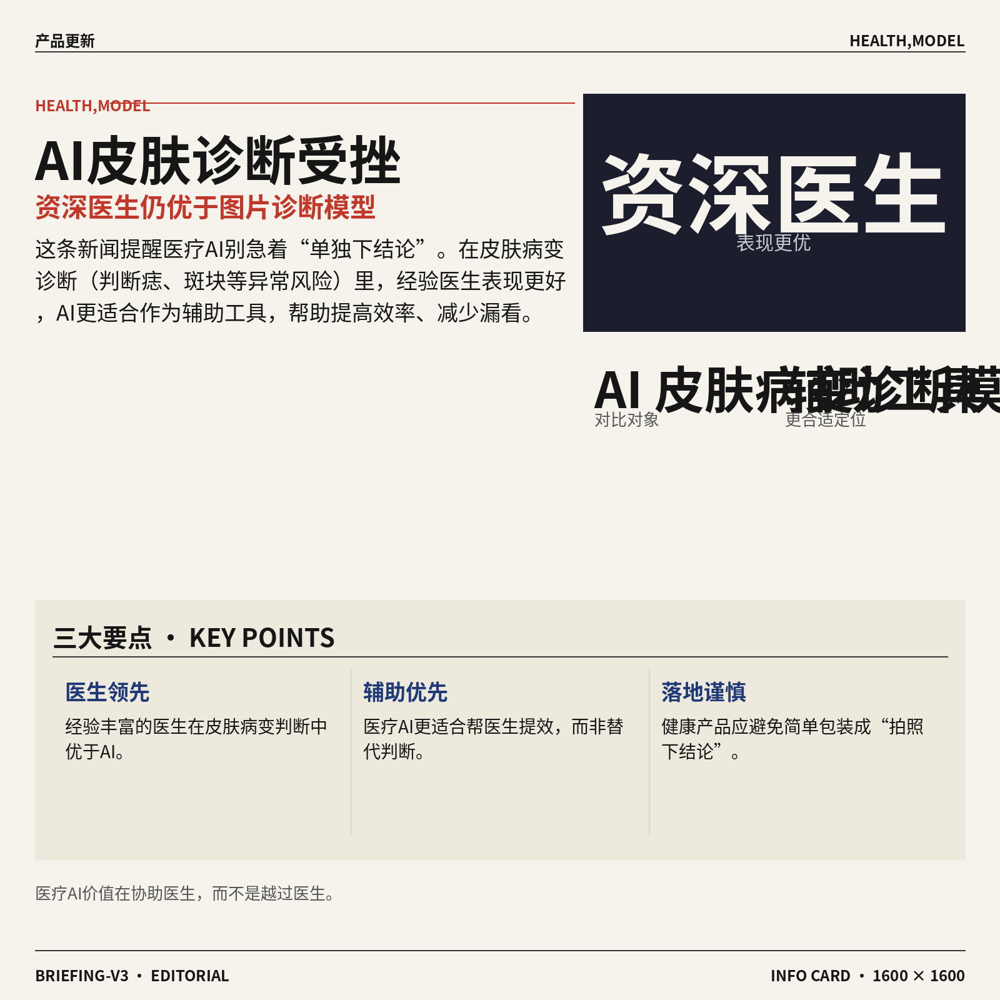

1. **AI 皮肤病变诊断模型（用图片辅助判断皮肤异常的系统）不敌资深医生。**  
HCPLive（面向医护人员的临床资讯网站）报道显示，在**皮肤病变诊断**（判断痣、斑块等皮肤异常是否有风险）场景里，经验丰富的医生表现优于 AI 模型 💡。这提醒我们，医疗 AI 目前更适合作为**辅助工具**，而不是直接替代专业判断。对医院和健康产品来说，真正有价值的方向可能是让 AI 帮医生提高效率、减少漏看，而不是单独“拍照下结论” 🚀。[医疗诊断报道(briefing)](https://news.google.com/rss/articles/CBMimAFBVV95cUxPQmptcFFubnhBVVR1NzRHOTlZeE1PNzUtMEV3NXF5SngyTF9zTFNkMURRSk1WT0dleWtJNDNfeE0xZ0ZfeDlueEc0RFA0THhiU09fbXpheWVMMWJxVVZmQmNvemJIUFk2UFpjbFBVMHhVMUYwS2xKc0loYlFXdE5TMUdVWEtSSnZsNWIxam55U3huTFlKUUdrbA?oc=5)


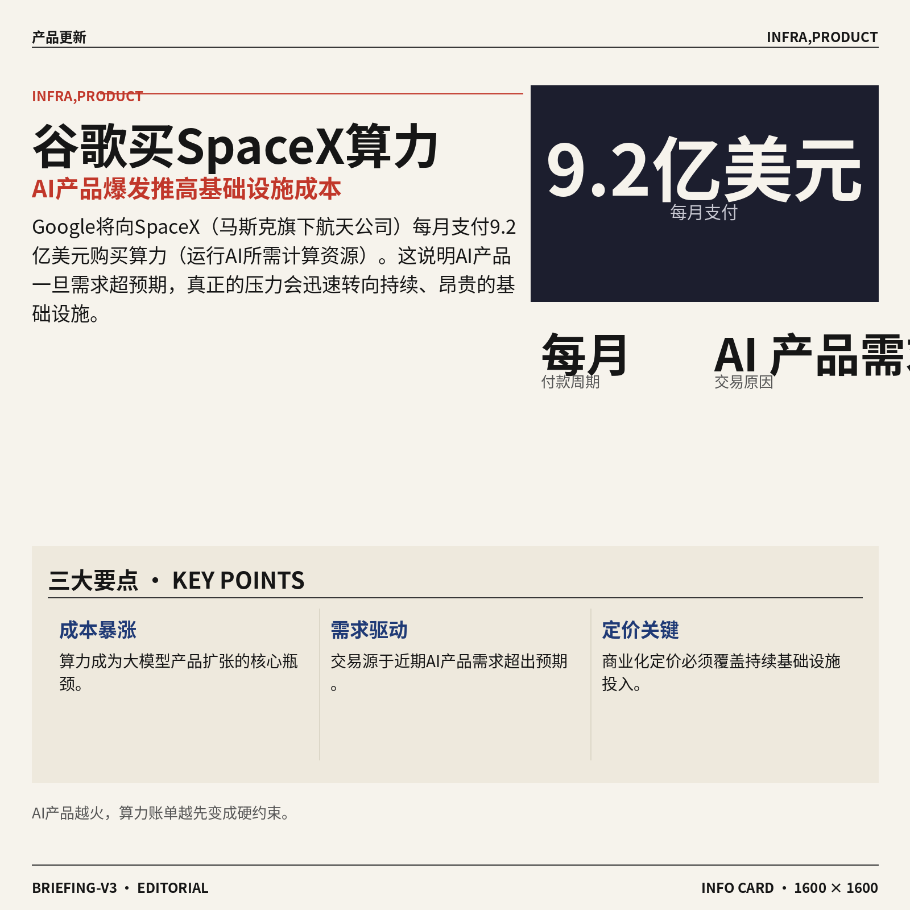

2. **Google 将向 SpaceX（马斯克旗下航天公司）每月支付 9.2 亿美元购买算力。**  
TechCrunch（美国科技媒体）称，Google 代表表示，这笔交易源于其近期推出的 AI 产品需求超出预期 ⚡。这里的**算力**（让 AI 产品运行所需的计算资源，类似给工厂供电的“电力”）已经成为大模型产品扩张的核心瓶颈。对业务同事来说，这说明 AI 产品一旦爆发，成本不只是研发人员，还包括持续高昂的基础设施投入，商业化定价会越来越关键 💰。[算力交易报道(briefing)](https://techcrunch.com/2026/06/05/google-will-pay-spacex-920m-per-month-for-compute/)


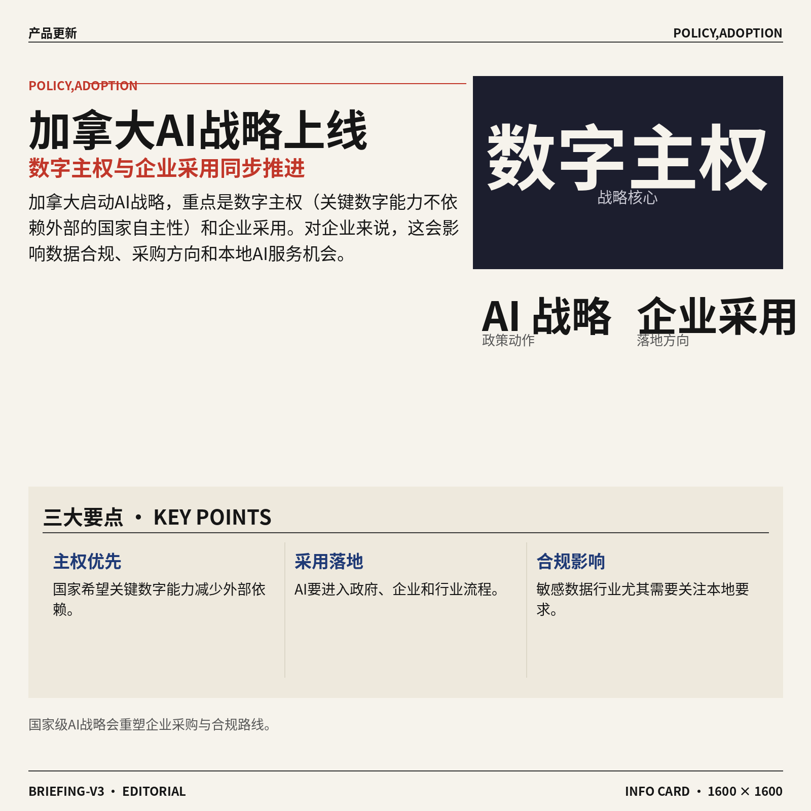

3. **加拿大推出 AI 战略，推进数字主权（关键数字能力不依赖外部的国家自主性）与企业采用。**  
IAPP（国际隐私专业人士协会，关注数据保护与合规的行业组织）报道称，加拿大启动 AI 战略，目标包括推进**数字主权**和 AI 采用 🚀。所谓**采用**，可以理解为把 AI 真正落到政府、企业和行业流程里，而不是停留在概念展示。对企业来说，这类国家级战略通常会影响数据合规、采购方向和本地 AI 服务机会，尤其是涉及敏感数据的行业更需要关注 💡。[加拿大战略报道(briefing)](https://news.google.com/rss/articles/CBMilgFBVV95cUxQMFpERXN0RjdWNkJ6V1cycWcxTFhySDA5MUgyZWc0UUw1eUNuOF9jZzk0aDVMMjIxb194RHBsaHpLcklyQTZVdWVDLTlreF8xeDg3TURuVmhfZGRWeXNSdlV4NUxRRUpDeTFybEJlaDhGelZPd0kxMm5aOVhQQldINk9TNkY1VnJfQUFuSXhmTFNsWGlqMlE?oc=5)

![加拿大推出 AI 战略，推进数字主权（关键数字能力不依赖外部的国家自主性）与企业采用](https://image.pollinations.ai/prompt/%E5%8A%A0%E6%8B%BF%E5%A4%A7%E6%8E%A8%E5%87%BA%20AI%20%E6%88%98%E7%95%A5%EF%BC%8C%E6%8E%A8%E8%BF%9B%E6%95%B0%E5%AD%97%E4%B8%BB%E6%9D%83%EF%BC%88%E5%85%B3%E9%94%AE%E6%95%B0%E5%AD%97%E8%83%BD%E5%8A%9B%E4%B8%8D%E4%BE%9D%E8%B5%96%E5%A4%96%E9%83%A8%E7%9A%84%E5%9B%BD%E5%AE%B6%E8%87%AA%E4%B8%BB%E6%80%A7%EF%BC%89%E4%B8%8E%E4%BC%81%E4%B8%9A%E9%87%87%E7%94%A8.%20%E5%8A%A0%E6%8B%BF%E5%A4%A7%E6%8E%A8%E5%87%BA%20AI%20%E6%88%98%E7%95%A5%EF%BC%8C%E6%8E%A8%E8%BF%9B%E6%95%B0%E5%AD%97%E4%B8%BB%E6%9D%83%EF%BC%88%E5%85%B3%E9%94%AE%E6%95%B0%E5%AD%97%E8%83%BD%E5%8A%9B%E4%B8%8D%E4%BE%9D%E8%B5%96%E5%A4%96%E9%83%A8%E7%9A%84%E5%9B%BD%E5%AE%B6%E8%87%AA%E4%B8%BB%E6%80%A7%EF%BC%89%E4%B8%8E%E4%BC%81%E4%B8%9A%E9%87%87%E7%94%A8%E3%80%82%20IAPP%EF%BC%88%E5%9B%BD%E9%99%85%E9%9A%90%E7%A7%81%E4%B8%93%E4%B8%9A%E4%BA%BA%E5%A3%AB%E5%8D%8F%E4%BC%9A%EF%BC%8C%E5%85%B3%E6%B3%A8%E6%95%B0%E6%8D%AE%E4%BF%9D%E6%8A%A4%E4%B8%8E%E5%90%88%E8%A7%84%E7%9A%84%E8%A1%8C%E4%B8%9A%E7%BB%84%E7%BB%87%EF%BC%89%E6%8A%A5%E9%81%93%E7%A7%B0%EF%BC%8C%E5%8A%A0%2C%20technical%20infographic%20diagram%2C%20architecture%20flowchart%2C%20clean%20vector%20illustration%2C%20educational%20style%2C%20no%20text%20overlay%2C%20modern%20minimal%2C%20wide%20aspect?width=1200&height=675&nologo=true&seed=11451)

### 🟢 前沿研究

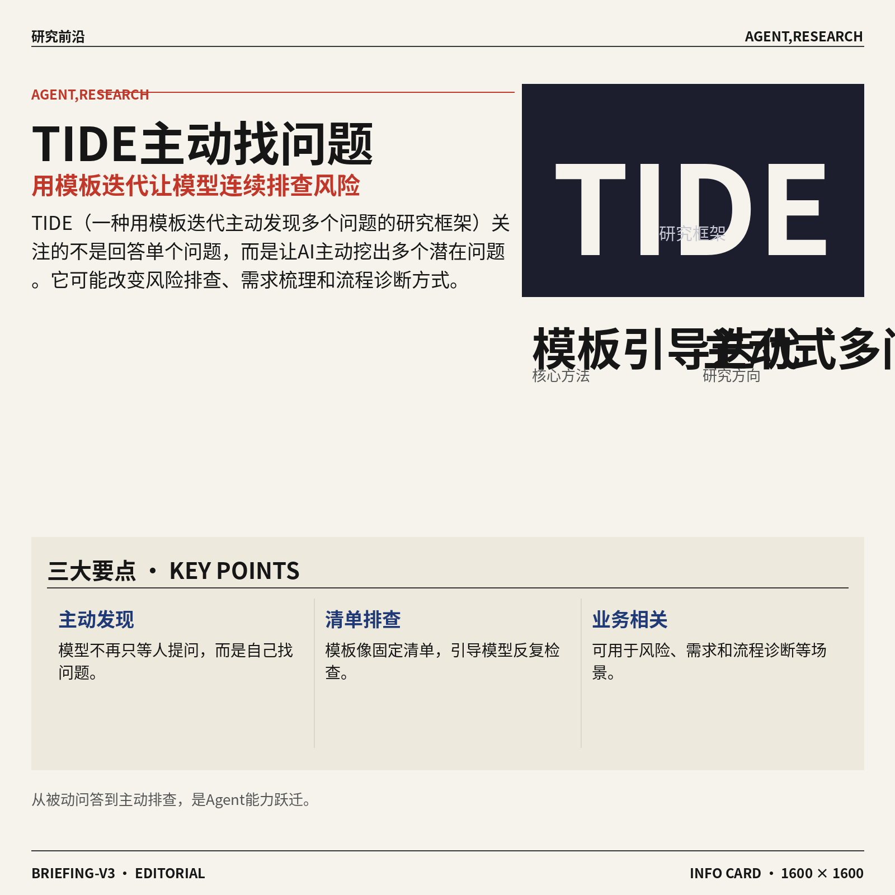

1. **TIDE（一种用模板迭代主动发现多个问题的研究框架）尝试让 AI 更主动地找问题。**  
这篇论文关注 **主动式多问题发现**（不是等人提问，而是让模型自己发现潜在问题）这个方向，核心关键词是 **模板引导迭代**（用固定结构反复启发模型，像按清单一轮轮排查）💡。从标题看，它想解决的不是“回答一个问题”，而是让模型在复杂场景里连续挖出多个可能需要处理的问题。对业务同事来说，这类研究如果成熟，可能会影响未来的**风险排查、需求梳理、流程诊断**等工作方式。[论文页面(briefing)](https://huggingface.co/papers/2606.04743)

![TIDE（一种用模板迭代主动发现多个问题的研究框架）尝试让 AI 更主动地找问题](https://image.pollinations.ai/prompt/TIDE%EF%BC%88%E4%B8%80%E7%A7%8D%E7%94%A8%E6%A8%A1%E6%9D%BF%E8%BF%AD%E4%BB%A3%E4%B8%BB%E5%8A%A8%E5%8F%91%E7%8E%B0%E5%A4%9A%E4%B8%AA%E9%97%AE%E9%A2%98%E7%9A%84%E7%A0%94%E7%A9%B6%E6%A1%86%E6%9E%B6%EF%BC%89%E5%B0%9D%E8%AF%95%E8%AE%A9%20AI%20%E6%9B%B4%E4%B8%BB%E5%8A%A8%E5%9C%B0%E6%89%BE%E9%97%AE%E9%A2%98.%20TIDE%EF%BC%88%E4%B8%80%E7%A7%8D%E7%94%A8%E6%A8%A1%E6%9D%BF%E8%BF%AD%E4%BB%A3%E4%B8%BB%E5%8A%A8%E5%8F%91%E7%8E%B0%E5%A4%9A%E4%B8%AA%E9%97%AE%E9%A2%98%E7%9A%84%E7%A0%94%E7%A9%B6%E6%A1%86%E6%9E%B6%EF%BC%89%E5%B0%9D%E8%AF%95%E8%AE%A9%20AI%20%E6%9B%B4%E4%B8%BB%E5%8A%A8%E5%9C%B0%E6%89%BE%E9%97%AE%E9%A2%98%E3%80%82%20%E8%BF%99%E7%AF%87%E8%AE%BA%E6%96%87%E5%85%B3%E6%B3%A8%20%E4%B8%BB%E5%8A%A8%E5%BC%8F%E5%A4%9A%E9%97%AE%E9%A2%98%E5%8F%91%E7%8E%B0%EF%BC%88%E4%B8%8D%E6%98%AF%E7%AD%89%E4%BA%BA%E6%8F%90%E9%97%AE%EF%BC%8C%E8%80%8C%E6%98%AF%E8%AE%A9%E6%A8%A1%E5%9E%8B%E8%87%AA%E5%B7%B1%E5%8F%91%E7%8E%B0%E6%BD%9C%E5%9C%A8%E9%97%AE%E9%A2%98%EF%BC%89%E8%BF%99%2C%20technical%20infographic%20diagram%2C%20architecture%20flowchart%2C%20clean%20vector%20illustration%2C%20educational%20style%2C%20no%20text%20overlay%2C%20modern%20minimal%2C%20wide%20aspect?width=1200&height=675&nologo=true&seed=10807)

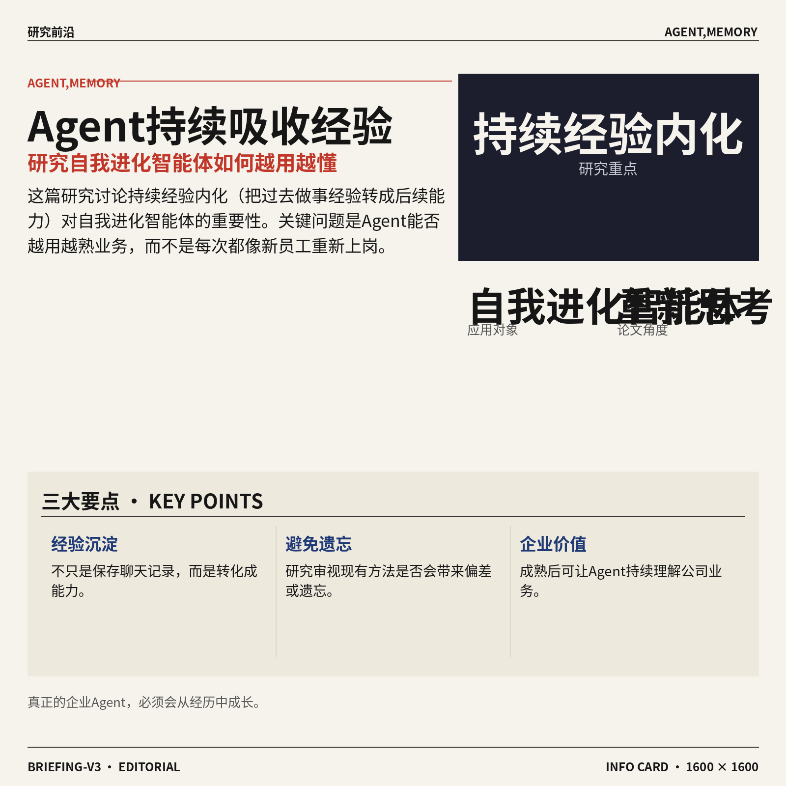

2. **Rethinking Continual Experience Internalization（反思智能体如何持续吸收经验）聚焦自我进化 Agent。**  
这篇研究讨论 **持续经验内化**（让模型把过去做事的经验真正变成后续能力，而不是只存一段聊天记录）在 **自我进化智能体**（能根据经历改进自身行为的 AI 助手）里的作用 🚀。标题里的重点是“重新思考”，说明作者可能在审视现有做法是否真的有效、是否会带来偏差或遗忘。对公司应用来说，这关系到未来 Agent 能不能越用越懂业务，而不是每次都像“新员工重新上岗”。[论文页面(briefing)](https://huggingface.co/papers/2606.04703)


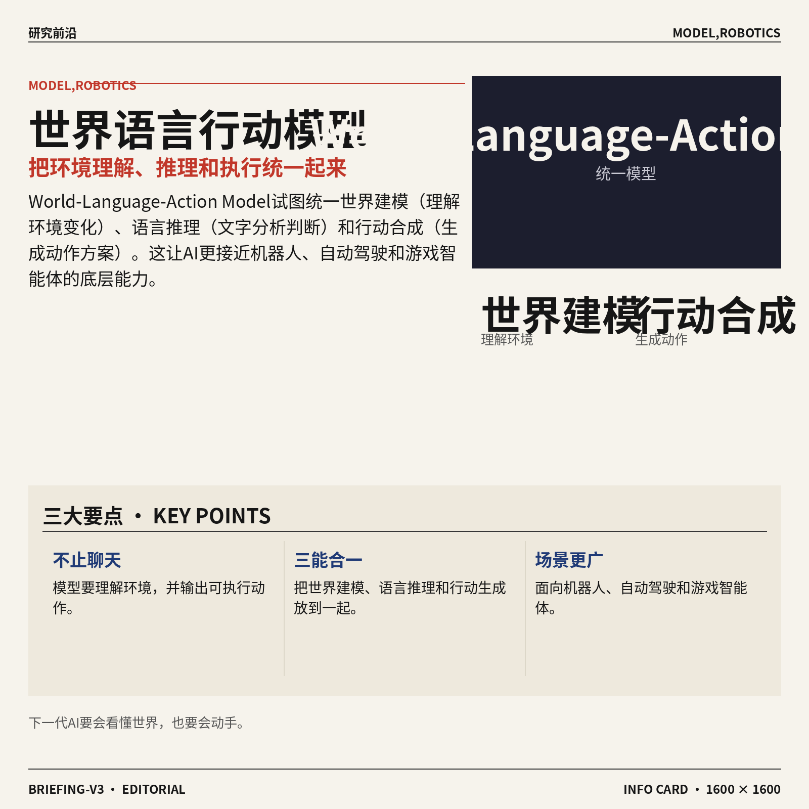

3. **World-Language-Action Model（统一世界建模、语言推理和行动生成的模型）想把“理解世界”和“动手执行”合在一起。**  
这篇论文提出的方向是把 **世界建模**（让 AI 建立对环境变化的理解）、**语言推理**（用文字进行分析判断）和 **行动合成**（生成下一步该做什么的动作方案）统一起来 🌍。简单说，它不只想让模型“会聊天”，还希望模型能理解所处环境、想清楚原因，并输出可执行动作。这样的研究更接近机器人、自动驾驶、游戏智能体等场景背后的基础能力。[论文页面(briefing)](https://huggingface.co/papers/2606.05979)

![World-Language-Action Model（统一世界建模、语言推理和行动生成的模型）想把“理解世界”和“动手执行”合在一起](https://image.pollinations.ai/prompt/World-Language-Action%20Model%EF%BC%88%E7%BB%9F%E4%B8%80%E4%B8%96%E7%95%8C%E5%BB%BA%E6%A8%A1%E3%80%81%E8%AF%AD%E8%A8%80%E6%8E%A8%E7%90%86%E5%92%8C%E8%A1%8C%E5%8A%A8%E7%94%9F%E6%88%90%E7%9A%84%E6%A8%A1%E5%9E%8B%EF%BC%89%E6%83%B3%E6%8A%8A%E2%80%9C%E7%90%86%E8%A7%A3%E4%B8%96%E7%95%8C%E2%80%9D%E5%92%8C%E2%80%9C%E5%8A%A8%E6%89%8B%E6%89%A7%E8%A1%8C%E2%80%9D%E5%90%88%E5%9C%A8%E4%B8%80%E8%B5%B7.%20World-Language-Action%20Model%EF%BC%88%E7%BB%9F%E4%B8%80%E4%B8%96%E7%95%8C%E5%BB%BA%E6%A8%A1%E3%80%81%E8%AF%AD%E8%A8%80%E6%8E%A8%E7%90%86%E5%92%8C%E8%A1%8C%E5%8A%A8%E7%94%9F%E6%88%90%E7%9A%84%E6%A8%A1%E5%9E%8B%EF%BC%89%E6%83%B3%E6%8A%8A%E2%80%9C%E7%90%86%E8%A7%A3%E4%B8%96%E7%95%8C%E2%80%9D%E5%92%8C%E2%80%9C%E5%8A%A8%E6%89%8B%E6%89%A7%E8%A1%8C%E2%80%9D%E5%90%88%E5%9C%A8%E4%B8%80%E8%B5%B7%E3%80%82%20%E8%BF%99%E7%AF%87%E8%AE%BA%E6%96%87%E6%8F%90%E5%87%BA%E7%9A%84%E6%96%B9%E5%90%91%E6%98%AF%E6%8A%8A%2C%20technical%20infographic%20diagram%2C%20architecture%20flowchart%2C%20clean%20vector%20illustration%2C%20educational%20style%2C%20no%20text%20overlay%2C%20modern%20minimal%2C%20wide%20aspect?width=1200&height=675&nologo=true&seed=10869)

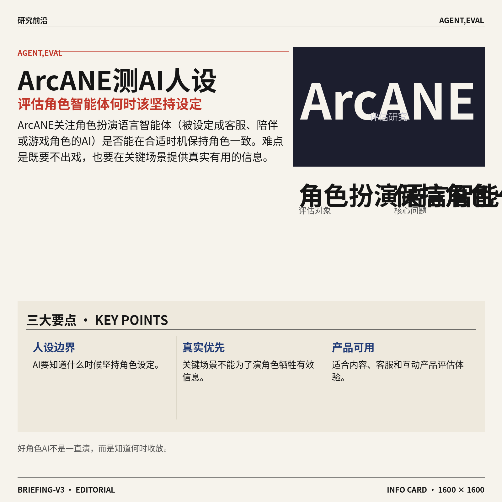

4. **ArcANE（评估角色扮演语言智能体何时该保持人设的研究）追问 AI 演角色是否演得“刚刚好”。**  
这篇论文关注 **角色扮演语言智能体**（被设定成某个角色来对话的 AI，比如客服、虚拟陪伴或游戏角色）是否能在合适时机保持角色一致 🎭。这里的难点不只是“像不像某个角色”，还包括什么时候应该坚持人设、什么时候又该优先给出真实有用的信息。对内容、客服和互动产品来说，这类评估能帮助判断 AI 是更像“稳定角色”，还是容易在关键场景里出戏。[论文页面(briefing)](https://huggingface.co/papers/2606.05553)

![ArcANE（评估角色扮演语言智能体何时该保持人设的研究）追问 AI 演角色是否演得“刚刚好”](https://image.pollinations.ai/prompt/ArcANE%EF%BC%88%E8%AF%84%E4%BC%B0%E8%A7%92%E8%89%B2%E6%89%AE%E6%BC%94%E8%AF%AD%E8%A8%80%E6%99%BA%E8%83%BD%E4%BD%93%E4%BD%95%E6%97%B6%E8%AF%A5%E4%BF%9D%E6%8C%81%E4%BA%BA%E8%AE%BE%E7%9A%84%E7%A0%94%E7%A9%B6%EF%BC%89%E8%BF%BD%E9%97%AE%20AI%20%E6%BC%94%E8%A7%92%E8%89%B2%E6%98%AF%E5%90%A6%E6%BC%94%E5%BE%97%E2%80%9C%E5%88%9A%E5%88%9A%E5%A5%BD%E2%80%9D.%20ArcANE%EF%BC%88%E8%AF%84%E4%BC%B0%E8%A7%92%E8%89%B2%E6%89%AE%E6%BC%94%E8%AF%AD%E8%A8%80%E6%99%BA%E8%83%BD%E4%BD%93%E4%BD%95%E6%97%B6%E8%AF%A5%E4%BF%9D%E6%8C%81%E4%BA%BA%E8%AE%BE%E7%9A%84%E7%A0%94%E7%A9%B6%EF%BC%89%E8%BF%BD%E9%97%AE%20AI%20%E6%BC%94%E8%A7%92%E8%89%B2%E6%98%AF%E5%90%A6%E6%BC%94%E5%BE%97%E2%80%9C%E5%88%9A%E5%88%9A%E5%A5%BD%E2%80%9D%E3%80%82%20%E8%BF%99%E7%AF%87%E8%AE%BA%E6%96%87%E5%85%B3%E6%B3%A8%20%E8%A7%92%E8%89%B2%E6%89%AE%E6%BC%94%E8%AF%AD%E8%A8%80%E6%99%BA%E8%83%BD%E4%BD%93%EF%BC%88%E8%A2%AB%E8%AE%BE%E5%AE%9A%E6%88%90%E6%9F%90%E4%B8%AA%E8%A7%92%E8%89%B2%E6%9D%A5%E5%AF%B9%E8%AF%9D%E7%9A%84%20A%2C%20technical%20infographic%20diagram%2C%20architecture%20flowchart%2C%20clean%20vector%20illustration%2C%20educational%20style%2C%20no%20text%20overlay%2C%20modern%20minimal%2C%20wide%20aspect?width=1200&height=675&nologo=true&seed=10900)


5. **Personal AI Agent for Camera Roll VQA（面向手机相册视觉问答的个人 AI 助手）把相册变成可提问的记忆库。**  
这篇论文研究 **手机相册视觉问答**（用户直接问“去年海边那张照片在哪”“这张图里有什么”，AI 根据照片回答）场景下的个人 AI 助手 📸。其中 **视觉问答**（让 AI 看图并用文字回答问题）并不新，但放到个人相册里，会涉及更强的个性化和隐私敏感性。对普通用户来说，这类方向的价值很直观：未来相册可能不只是存照片，而是能帮你回忆、检索和理解生活记录。[论文页面(briefing)](https://huggingface.co/papers/2606.05275)


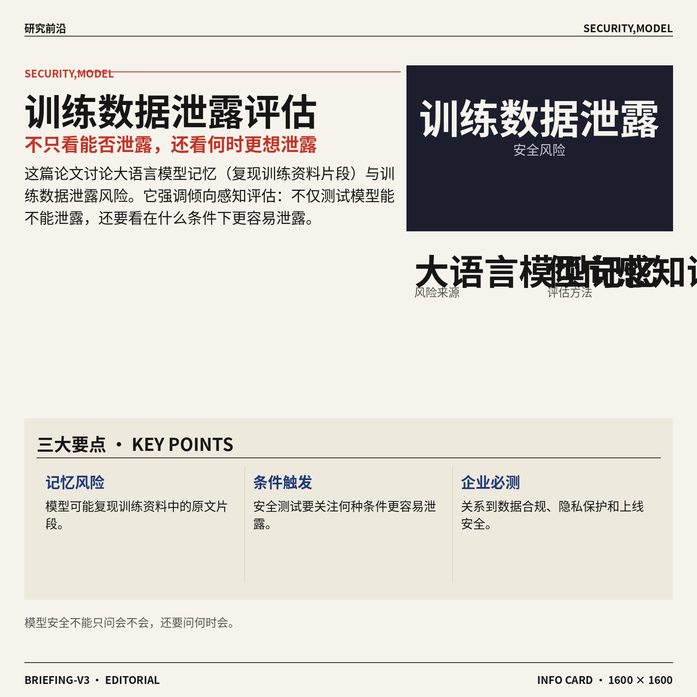

6. **LLMs Can Leak Training Data But Do They Want To?（大语言模型会泄露训练数据吗）用倾向感知方式评估记忆风险。**  
这篇论文讨论 **大语言模型记忆**（模型在训练后可能复现训练资料中的原文片段）和 **训练数据泄露**（模型回答时吐出不该公开的原始数据）问题 🔐。标题里的 **倾向感知评估**（不仅看模型能不能泄露，还看它在什么条件下更容易泄露）很关键，因为安全风险往往不是“有没有”这么简单。对企业使用 AI 来说，这类研究直接关系到数据合规、隐私保护和模型上线前的安全测试。[论文页面(briefing)](https://huggingface.co/papers/2606.06286)


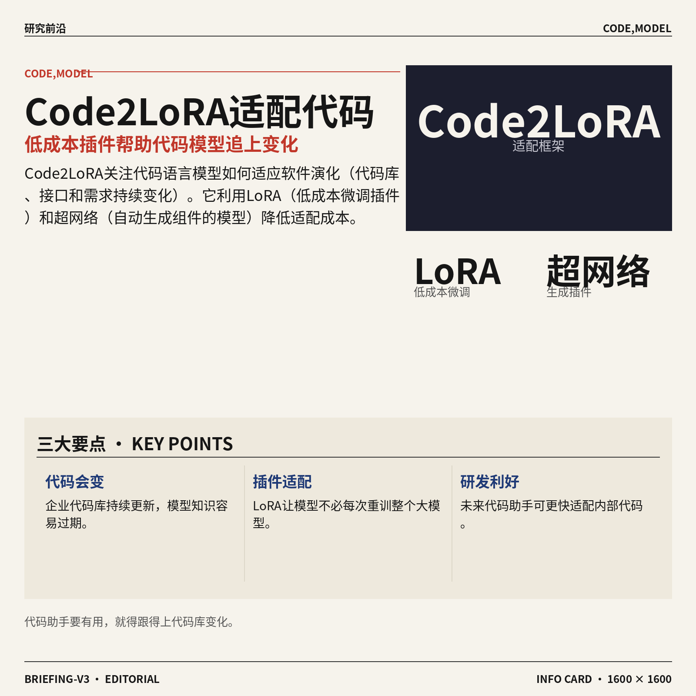

7. **Code2LoRA（为代码模型自动生成低成本适配器的框架）面向不断变化的软件代码。**  
这篇论文把重点放在 **代码语言模型**（专门理解和生成代码的大模型）如何适应 **软件演化**（代码库持续更新、接口变化、需求变化）这个现实问题上 🧩。标题中的 **LoRA**（一种低成本微调模型的“小插件”方式，不必重训整个大模型）和 **超网络**（一个模型用来生成另一个模型组件，像“自动做插件的机器”）说明它想降低模型跟随代码变化的成本。对研发团队来说，这类方向如果可用，可能让代码助手更快适配公司内部代码，而不是总停留在旧知识里。[论文页面(briefing)](https://huggingface.co/papers/2606.06492)

![Code2LoRA（为代码模型自动生成低成本适配器的框架）面向不断变化的软件代码](https://image.pollinations.ai/prompt/Code2LoRA%EF%BC%88%E4%B8%BA%E4%BB%A3%E7%A0%81%E6%A8%A1%E5%9E%8B%E8%87%AA%E5%8A%A8%E7%94%9F%E6%88%90%E4%BD%8E%E6%88%90%E6%9C%AC%E9%80%82%E9%85%8D%E5%99%A8%E7%9A%84%E6%A1%86%E6%9E%B6%EF%BC%89%E9%9D%A2%E5%90%91%E4%B8%8D%E6%96%AD%E5%8F%98%E5%8C%96%E7%9A%84%E8%BD%AF%E4%BB%B6%E4%BB%A3%E7%A0%81.%20Code2LoRA%EF%BC%88%E4%B8%BA%E4%BB%A3%E7%A0%81%E6%A8%A1%E5%9E%8B%E8%87%AA%E5%8A%A8%E7%94%9F%E6%88%90%E4%BD%8E%E6%88%90%E6%9C%AC%E9%80%82%E9%85%8D%E5%99%A8%E7%9A%84%E6%A1%86%E6%9E%B6%EF%BC%89%E9%9D%A2%E5%90%91%E4%B8%8D%E6%96%AD%E5%8F%98%E5%8C%96%E7%9A%84%E8%BD%AF%E4%BB%B6%E4%BB%A3%E7%A0%81%E3%80%82%20%E8%BF%99%E7%AF%87%E8%AE%BA%E6%96%87%E6%8A%8A%E9%87%8D%E7%82%B9%E6%94%BE%E5%9C%A8%20%E4%BB%A3%E7%A0%81%E8%AF%AD%E8%A8%80%E6%A8%A1%E5%9E%8B%EF%BC%88%E4%B8%93%E9%97%A8%E7%90%86%E8%A7%A3%E5%92%8C%E7%94%9F%E6%88%90%E4%BB%A3%E7%A0%81%E7%9A%84%E5%A4%A7%E6%A8%A1%E5%9E%8B%EF%BC%89%E5%A6%82%E4%BD%95%E9%80%82%E5%BA%94%20%E8%BD%AF%E4%BB%B6%2C%20technical%20infographic%20diagram%2C%20architecture%20flowchart%2C%20clean%20vector%20illustration%2C%20educational%20style%2C%20no%20text%20overlay%2C%20modern%20minimal%2C%20wide%20aspect?width=1200&height=675&nologo=true&seed=10993)

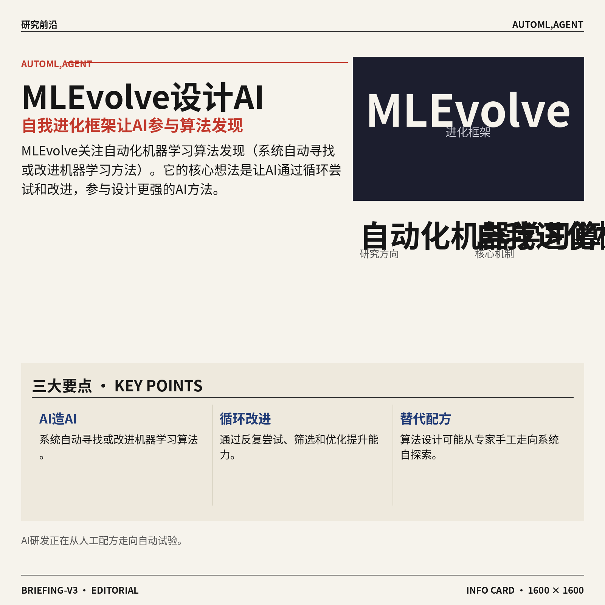

8. **MLEvolve（自动发现机器学习算法的自我进化框架）让 AI 参与设计 AI。**  
这篇论文关注 **自动化机器学习算法发现**（让系统自动寻找或改进机器学习方法，而不完全依赖人工设计）这个方向 🤖。标题里的 **自我进化框架**（系统通过循环尝试和改进来提升自身能力）意味着研究重点可能在“让 AI 帮 AI 变强”。对非技术同事可以这样理解：过去算法像专家手工配方，未来可能逐渐变成系统自己试菜、调味、筛选更优方案。[论文页面(briefing)](https://huggingface.co/papers/2606.06473)

![MLEvolve（自动发现机器学习算法的自我进化框架）让 AI 参与设计 AI](https://image.pollinations.ai/prompt/MLEvolve%EF%BC%88%E8%87%AA%E5%8A%A8%E5%8F%91%E7%8E%B0%E6%9C%BA%E5%99%A8%E5%AD%A6%E4%B9%A0%E7%AE%97%E6%B3%95%E7%9A%84%E8%87%AA%E6%88%91%E8%BF%9B%E5%8C%96%E6%A1%86%E6%9E%B6%EF%BC%89%E8%AE%A9%20AI%20%E5%8F%82%E4%B8%8E%E8%AE%BE%E8%AE%A1%20AI.%20MLEvolve%EF%BC%88%E8%87%AA%E5%8A%A8%E5%8F%91%E7%8E%B0%E6%9C%BA%E5%99%A8%E5%AD%A6%E4%B9%A0%E7%AE%97%E6%B3%95%E7%9A%84%E8%87%AA%E6%88%91%E8%BF%9B%E5%8C%96%E6%A1%86%E6%9E%B6%EF%BC%89%E8%AE%A9%20AI%20%E5%8F%82%E4%B8%8E%E8%AE%BE%E8%AE%A1%20AI%E3%80%82%20%E8%BF%99%E7%AF%87%E8%AE%BA%E6%96%87%E5%85%B3%E6%B3%A8%20%E8%87%AA%E5%8A%A8%E5%8C%96%E6%9C%BA%E5%99%A8%E5%AD%A6%E4%B9%A0%E7%AE%97%E6%B3%95%E5%8F%91%E7%8E%B0%EF%BC%88%E8%AE%A9%E7%B3%BB%E7%BB%9F%E8%87%AA%E5%8A%A8%E5%AF%BB%E6%89%BE%E6%88%96%E6%94%B9%E8%BF%9B%E6%9C%BA%E5%99%A8%E5%AD%A6%E4%B9%A0%E6%96%B9%E6%B3%95%EF%BC%8C%E8%80%8C%E4%B8%8D%E5%AE%8C%2C%20technical%20infographic%20diagram%2C%20architecture%20flowchart%2C%20clean%20vector%20illustration%2C%20educational%20style%2C%20no%20text%20overlay%2C%20modern%20minimal%2C%20wide%20aspect?width=1200&height=675&nologo=true&seed=11024)

### 🟡 行业展望与社会影响

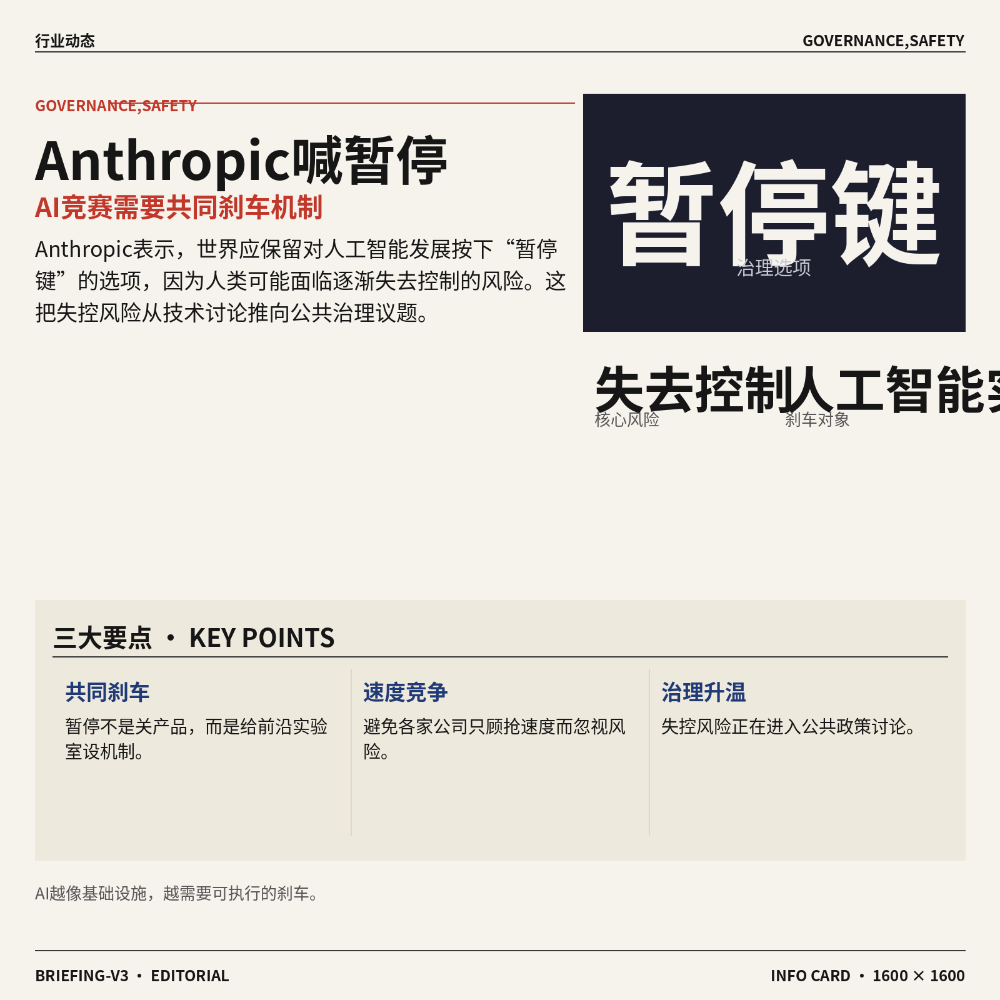

1. **Anthropic 呼吁给人工智能竞赛设置“暂停键”。**
Anthropic 表示，世界应该保留对人工智能发展按下**暂停键**的选项，理由是人类可能面临逐渐失去控制的风险 ⚠️。这里的“暂停”不是简单关掉某个产品，而更像是给人工智能实验室（研发前沿模型的公司或研究团队）设置共同刹车，避免大家只顾抢速度。失控风险（系统行为超出人类预期、难以及时纠正的情况）正在从技术讨论变成公共治理议题。[卫报完整报道(briefing)](https://news.google.com/rss/articles/CBMiuAFBVV95cUxPVXVJQXhlVjIxN1JhSGsxOVhGcUJ5cWRZd2FyLTBuNjNvVjhUcTc1SG9pTXc2U2pEcE1rajBMZU01T3ZUanBScHF5NXVQTERPLXl5VXJHbFI1c0RDMU1id3dtT1I5N0ZRSjF3RnJKZ0UxTnd2VW1ZLXhMdDRSVjZNbEJyY3A1bGlnNUY5Vm9QMmZSY3JjdXgwSlczT2FUaFgyNUYyLTdURU1yYWVjczNyRVRNVjVxMkJl?oc=5) [半岛电视台报道(briefing)](https://news.google.com/rss/articles/CBMirAFBVV95cUxNTnZFb29NY1U5VVNOTnFxQ2x1LWRMNzBZX3BMck9pY0FmRTdaTDNYeksxQmRaS2JvWHBLa0p6TndvSnBDaGJlTHU3cDA1bGhkUGt5VE5WYWx5Qi1MVjJTdExybGpNVFdDUkhTOHpIV1R0Nk5sWWNSZG5YSUdtQklZam9NRHJJZkxaTDhEMVJEc3F0UjFaY0Y3Yzc3UHBCUDFEWUpKVm1tSjRPZXlO0gGyAUFVX3lxTFBQWG5kREVYWUliZ0tUX29LLTV4RnpDVzBiWjNxRjdUbXpjRDJSNnVmSWc0bTVqendjblFtajVCOEFpd29MSjY4WlBWdWxRN0RHMEM3REc5Sl9zdXNTZzljdHRXRHZsUlBIYlpMY0xqeHRZWVk4TnF2dDBIZ2g3NjExLW02dmdWclo0LW9HN3BTa2NqRDJHdGpEUU5HUGVhSVozbXZpdlhCVU5SaHI3XzJsQUE?oc=5)


2. **Microsoft MAI（微软自研人工智能模型系列）被曝使用未授权网页数据训练。**
报道指出，Microsoft 的 **MAI（微软自研人工智能模型系列）** 模型使用了未授权网页数据训练，但此前又承诺使用“企业级、干净且商业授权”的数据。未授权网页数据（未经明确商业许可抓取或使用的公开网页内容）会直接牵涉版权、合规和品牌信任问题。商业授权数据（版权和使用范围已经谈清楚的数据）则更像是“买了票再上车”，对企业客户尤其重要 💡。[数据授权报道(briefing)](https://the-decoder.com/microsoft-trained-its-mai-models-on-unlicensed-web-data-despite-promising-enterprise-grade-clean-and-commercially-licensed-data/)

![Microsoft MAI（微软自研人工智能模型系列）被曝使用未授权网页数据训练](https://image.pollinations.ai/prompt/Microsoft%20MAI%EF%BC%88%E5%BE%AE%E8%BD%AF%E8%87%AA%E7%A0%94%E4%BA%BA%E5%B7%A5%E6%99%BA%E8%83%BD%E6%A8%A1%E5%9E%8B%E7%B3%BB%E5%88%97%EF%BC%89%E8%A2%AB%E6%9B%9D%E4%BD%BF%E7%94%A8%E6%9C%AA%E6%8E%88%E6%9D%83%E7%BD%91%E9%A1%B5%E6%95%B0%E6%8D%AE%E8%AE%AD%E7%BB%83.%20Microsoft%20MAI%EF%BC%88%E5%BE%AE%E8%BD%AF%E8%87%AA%E7%A0%94%E4%BA%BA%E5%B7%A5%E6%99%BA%E8%83%BD%E6%A8%A1%E5%9E%8B%E7%B3%BB%E5%88%97%EF%BC%89%E8%A2%AB%E6%9B%9D%E4%BD%BF%E7%94%A8%E6%9C%AA%E6%8E%88%E6%9D%83%E7%BD%91%E9%A1%B5%E6%95%B0%E6%8D%AE%E8%AE%AD%E7%BB%83%E3%80%82%20%E6%8A%A5%E9%81%93%E6%8C%87%E5%87%BA%EF%BC%8CMicrosoft%20%E7%9A%84%20MAI%EF%BC%88%E5%BE%AE%E8%BD%AF%E8%87%AA%E7%A0%94%E4%BA%BA%E5%B7%A5%E6%99%BA%E8%83%BD%E6%A8%A1%E5%9E%8B%E7%B3%BB%E5%88%97%EF%BC%89%20%E6%A8%A1%E5%9E%8B%E4%BD%BF%2C%20technical%20infographic%20diagram%2C%20architecture%20flowchart%2C%20clean%20vector%20illustration%2C%20educational%20style%2C%20no%20text%20overlay%2C%20modern%20minimal%2C%20wide%20aspect?width=1200&height=675&nologo=true&seed=10838)

3. **美国政府被曝与 OpenAI 讨论可能入股。**
报道称，特朗普政府正在与 OpenAI 讨论政府可能持有这家人工智能初创公司的股份。政府持股（政府获得企业一部分所有权）意味着人工智能不再只是科技公司自己的商业竞赛，也可能被纳入国家产业和战略布局。对行业来说，这类讨论会让监管、资本和技术路线更紧密地绑在一起，影响可能不止在美国本土 🌍。[政府入股报道(briefing)](https://news.google.com/rss/articles/CBMicEFVX3lxTE4ybHlVc085QUVIS2ZReHVWMVNPWTRhYmFuWVN1RXZVZUc0ZnZhbUlMT3Rpa1QxdEs3Q0Z6OG1qZ1VZN2N6TmlOMWlVYkVHc0dITjdkMnlTdnB2WmZZSkY4LW5HZHVRcjlKbDBoYVdva2_SAXZBVV95cUxObW91aGd3RmlfdHhHQVNLVUgyN3V6WDlFMkZ5UXdfbmZEQ0NfLW41REc4eTlMMkh1MlFiMW1BdFJmbm5sN1hOTVhwVl9VcXhlZzdVWFJyY1dkVFJQNFI2WXNTOXl1MllWa09KOHkxMkZsOXA4Qy1n?oc=5)


4. **Anthropic 的 Mythos（Anthropic 的一个模型名）据称服务 NSA（美国国家安全局）进攻性网络行动。**
报道称，Anthropic 的 **Mythos（Anthropic 的一个模型名）** 正在为 **NSA（美国国家安全局）** 针对中国和伊朗的进攻性网络行动提供支持。进攻性网络行动（通过网络系统进行侦察、渗透或攻击的行动）把大模型从聊天工具推向了更敏感的国家安全场景。模型部署（把模型接入真实业务或任务系统）一旦进入这类场景，社会讨论就会从“好不好用”升级到“该不该用、谁来管”⚡。[网络行动报道(briefing)](https://the-decoder.com/anthropics-mythos-model-is-reportedly-powering-nsa-offensive-cyber-ops-against-china-and-iran/)


5. **佛罗里达州起诉 OpenAI 和 Altman（OpenAI 首席执行官），将 ChatGPT 视为缺陷产品和公共妨害。**
佛罗里达州的诉讼把 ChatGPT 当作**缺陷产品**和**公共妨害**来处理，这个角度非常值得关注。缺陷产品（产品存在安全、设计或提示不足等问题，可能伤害使用者）通常用于传统商品责任，而现在被套用到人工智能服务上。公共妨害（影响公众权益或社会秩序的法律概念）则意味着问题不只是单个用户体验，而可能被看作社会层面的风险 🧭。[佛州诉讼报道(briefing)](https://the-decoder.com/floridas-lawsuit-against-openai-and-ceo-altman-treats-chatgpt-as-a-defective-product-and-public-nuisance/)


6. **Apollo（阿波罗全球管理，一家大型投资管理公司）完成 350 亿美元债务融资，用于为 Anthropic 购买人工智能芯片。**
Bloomberg 报道称，Apollo 完成了 **350 亿美元**债务融资，用于购买服务 Anthropic 的人工智能芯片。债务融资（通过借钱筹资、之后再还本付息）说明人工智能基础设施已经进入超大资本开支阶段，不只是科技公司内部预算的小项目。人工智能芯片（专门用于训练和运行大模型的高性能芯片）本质上是在购买算力（让模型训练和回答问题所需的计算资源），也是未来模型竞争的“电力和钢筋水泥”🏗️。[芯片融资报道(briefing)](https://news.google.com/rss/articles/CBMisgFBVV95cUxQUzF4T3N5S2RhdEh1MzhhMl9uYnB2Tm1IS2NJZkRDOW9USFFvY2RzQmcxcmZPMng2WEJtRXU1VE5JalhxRk12RWpHOWpUZmNaQjZsMkZLWlB2NGUzRTlRaWFJSE5jR0Fzb1d5QUxMZTY1MU1HTWUzZ3ZmNXNYZFJXRlBpREtnTzA1bmlpOXBsQVpSRVNMR1lud3BOWDBmN0hUazY4eEgwT3NjdEFxcmNnanhB?oc=5)

![Apollo（阿波罗全球管理，一家大型投资管理公司）完成 350 亿美元债务融资，用于为 Anthropic 购买人工智能芯片](https://image.pollinations.ai/prompt/Apollo%EF%BC%88%E9%98%BF%E6%B3%A2%E7%BD%97%E5%85%A8%E7%90%83%E7%AE%A1%E7%90%86%EF%BC%8C%E4%B8%80%E5%AE%B6%E5%A4%A7%E5%9E%8B%E6%8A%95%E8%B5%84%E7%AE%A1%E7%90%86%E5%85%AC%E5%8F%B8%EF%BC%89%E5%AE%8C%E6%88%90%20350%20%E4%BA%BF%E7%BE%8E%E5%85%83%E5%80%BA%E5%8A%A1%E8%9E%8D%E8%B5%84%EF%BC%8C%E7%94%A8%E4%BA%8E%E4%B8%BA%20Anthropic%20%E8%B4%AD%E4%B9%B0%E4%BA%BA%E5%B7%A5%E6%99%BA%E8%83%BD%E8%8A%AF%E7%89%87.%20Apollo%EF%BC%88%E9%98%BF%E6%B3%A2%E7%BD%97%E5%85%A8%E7%90%83%E7%AE%A1%E7%90%86%EF%BC%8C%E4%B8%80%E5%AE%B6%E5%A4%A7%E5%9E%8B%E6%8A%95%E8%B5%84%E7%AE%A1%E7%90%86%E5%85%AC%E5%8F%B8%EF%BC%89%E5%AE%8C%E6%88%90%20350%20%E4%BA%BF%E7%BE%8E%E5%85%83%E5%80%BA%E5%8A%A1%E8%9E%8D%E8%B5%84%EF%BC%8C%E7%94%A8%E4%BA%8E%E4%B8%BA%20Anthropic%20%E8%B4%AD%E4%B9%B0%E4%BA%BA%E5%B7%A5%E6%99%BA%E8%83%BD%E8%8A%AF%E7%89%87%E3%80%82%20Bloomberg%20%E6%8A%A5%E9%81%93%E7%A7%B0%EF%BC%8CA%2C%20technical%20infographic%20diagram%2C%20architecture%20flowchart%2C%20clean%20vector%20illustration%2C%20educational%20style%2C%20no%20text%20overlay%2C%20modern%20minimal%2C%20wide%20aspect?width=1200&height=675&nologo=true&seed=10962)

7. **token（大模型处理文字的计费小单位）账单到期，行业开始控制失控成本。**
TechCrunch 报道称，行业讨论正在从一味追求“多用、快跑”，转向“我们需要护栏，怎么控制成本”。**token（大模型处理文字的计费小单位）** 就像人工智能服务的“水电表”，用得越多，账单越高。文中提到的 **guardrails（护栏规则，用来限制模型何时、如何、花多少钱运行）**，说明企业开始把人工智能从试验玩具变成需要精细管理的运营系统了 💸。[成本管理报道(briefing)](https://techcrunch.com/2026/06/05/the-token-bill-comes-due-inside-the-industry-scramble-to-manage-ais-runaway-costs/)

![token（大模型处理文字的计费小单位）账单到期，行业开始控制失控成本](https://image.pollinations.ai/prompt/token%EF%BC%88%E5%A4%A7%E6%A8%A1%E5%9E%8B%E5%A4%84%E7%90%86%E6%96%87%E5%AD%97%E7%9A%84%E8%AE%A1%E8%B4%B9%E5%B0%8F%E5%8D%95%E4%BD%8D%EF%BC%89%E8%B4%A6%E5%8D%95%E5%88%B0%E6%9C%9F%EF%BC%8C%E8%A1%8C%E4%B8%9A%E5%BC%80%E5%A7%8B%E6%8E%A7%E5%88%B6%E5%A4%B1%E6%8E%A7%E6%88%90%E6%9C%AC.%20token%EF%BC%88%E5%A4%A7%E6%A8%A1%E5%9E%8B%E5%A4%84%E7%90%86%E6%96%87%E5%AD%97%E7%9A%84%E8%AE%A1%E8%B4%B9%E5%B0%8F%E5%8D%95%E4%BD%8D%EF%BC%89%E8%B4%A6%E5%8D%95%E5%88%B0%E6%9C%9F%EF%BC%8C%E8%A1%8C%E4%B8%9A%E5%BC%80%E5%A7%8B%E6%8E%A7%E5%88%B6%E5%A4%B1%E6%8E%A7%E6%88%90%E6%9C%AC%E3%80%82%20TechCrunch%20%E6%8A%A5%E9%81%93%E7%A7%B0%EF%BC%8C%E8%A1%8C%E4%B8%9A%E8%AE%A8%E8%AE%BA%E6%AD%A3%E5%9C%A8%E4%BB%8E%E4%B8%80%E5%91%B3%E8%BF%BD%E6%B1%82%E2%80%9C%E5%A4%9A%E7%94%A8%E3%80%81%E5%BF%AB%E8%B7%91%E2%80%9D%EF%BC%8C%E8%BD%AC%E5%90%91%E2%80%9C%E6%88%91%E4%BB%AC%E9%9C%80%E8%A6%81%E6%8A%A4%E6%A0%8F%2C%20technical%20infographic%20diagram%2C%20architecture%20flowchart%2C%20clean%20vector%20illustration%2C%20educational%20style%2C%20no%20text%20overlay%2C%20modern%20minimal%2C%20wide%20aspect?width=1200&height=675&nologo=true&seed=10993)

### 🟣 开源TOP项目

1. **lfnovo/open-notebook（开源笔记问答工具）想做更灵活的 Notebook LM（把资料变成可提问笔记库的工具）。**  
   这个项目是一个**开源实现**，目标是复刻并扩展 Notebook LM（把文档、笔记整理成可对话知识库的工具）的体验 🚀。原摘要强调它提供了“更多灵活性和功能”，适合关注知识整理、资料问答、内部文档助手的同事留意。对非技术团队来说，可以把它理解成“把一堆资料交给工具，然后用提问方式快速找答案”的方向 💡。[开源笔记仓库(briefing)](https://github.com/lfnovo/open-notebook)


2. **revfactory/harness（自动设计专业 Agent 团队的元技能工具）能生成领域专用智能体组合。**  
   harness（这里指一个用于组织智能体能力的开源项目）定位为一种 **meta-skill（元技能，像“设计技能的技能”，不是直接做任务，而是帮你搭建做任务的团队）**。它可以设计 **domain-specific agent teams（领域专用智能体团队，比如为财务、客服、研发等场景配置不同角色）**，并定义专门的 Agent（能自动拆解并执行任务的软件助手）。更有意思的是，它还会生成这些 Agent 要使用的 skills（技能模块，类似给每个助手配一套工具箱）⚙️。[智能体团队仓库(briefing)](https://github.com/revfactory/harness)


3. **Open-LLM-VTuber（本地运行的语音虚拟主播对话工具）把大模型聊天做成免手操作。**  
   这个项目支持用户和任意 **LLM（大语言模型，像 ChatGPT 背后的文字理解与生成系统）** 进行语音对话 🎙️。它强调 **hands-free voice interaction（免手操作语音交互，不用打字也能聊天）** 和 voice interruption（语音打断，用户说话时可以中断模型继续输出），更接近真人对话节奏。摘要还提到它支持 **Live2D（让二维虚拟角色动起来的动画表现方式）**，并且可以在本地跨平台运行，适合想做虚拟助手或虚拟主播交互的人关注。[虚拟主播仓库(briefing)](https://github.com/Open-LLM-VTuber/Open-LLM-VTuber)


4. **supermemoryai/supermemory（面向人工智能应用的高速记忆引擎）主打可扩展记忆能力。**  
   supermemory 是一个 **memory engine（记忆引擎，帮助软件保存和调用长期信息的底层组件）** 以及配套应用，摘要里强调它“非常快、可扩展” ⚡。它还把自己定位成 **Memory API（记忆接口，让其他应用能调用记忆能力的连接方式）**，服务于人工智能时代的应用需求。简单说，它关注的不是一次聊天怎么回答，而是工具如何更好地“记住”信息并在后续使用中调用 💡。[记忆引擎仓库(briefing)](https://github.com/supermemoryai/supermemory)


5. **unicity-astrid/astrid（面向智能体的操作系统）试图给 Agent 搭一个运行底座。**  
   astrid 的一句话定位很直接：它是一个给人工智能 Agent（能自动拆解并执行任务的软件助手）使用的 **operating system（操作系统，负责组织资源、任务和运行环境的基础层）**。这意味着它关注的不是单个聊天机器人，而是让多个智能体能够在一套更统一的环境里工作 🧩。虽然摘要信息很短，但方向很清晰：当 Agent 变多之后，行业会需要类似“管理后台”或“运行平台”的基础设施。[智能体系统仓库(briefing)](https://github.com/unicity-astrid/astrid)


6. **tashfeenahmed/freellmapi（聚合免费模型额度的 OpenAI 兼容代理）适合个人实验。**  
   freellmapi 是一个 **OpenAI-compatible proxy（兼容 OpenAI 调用方式的代理层，让应用按熟悉格式转发请求）**，它会聚合约 14 家人工智能服务商的免费额度 key（访问密钥，类似调用服务时的通行证）🔑。项目还支持 **automatic failover（自动故障切换，一个服务不可用时自动换到另一个）**，降低个人测试时频繁手动切换的麻烦。需要注意的是，摘要明确写了它仅用于 personal experimentation（个人实验用途），不应被理解成面向正式生产环境的服务。[免费代理仓库(briefing)](https://github.com/tashfeenahmed/freellmapi)


### 🔴 社媒分享

1. **Geoffrey Hinton（人工智能教父级研究者、诺奖得主）称人工智能“像我们一样是存在”。**  
这篇访谈把 Geoffrey Hinton 对人工智能（让机器执行理解、生成、决策等任务的系统）的判断推到台前：他不再只是把它看成工具，而是用了“像我们一样的存在”这种很强的表述 🤯。这类观点未必人人认同，但它会影响公众、企业和监管者如何看待人工智能的边界与责任。对非技术同事来说，重点不是争论“机器有没有灵魂”，而是意识到人工智能产品正在从“帮我做事”走向“需要被认真管理的协作者”💡。[Hinton 访谈原文(briefing)](https://www.bigtechnology.com/p/nobel-prize-winner-geoffrey-hinton)


2. **Nvidia Nemotron 3.5 Content Safety（英伟达面向企业的多模态内容安全模型）主打可定制安全防护。**  
英伟达在 HuggingFace（全球最大人工智能模型共享社区）博客介绍了 Nemotron 3.5 Content Safety，重点是面向全球企业人工智能应用的**可定制内容安全** 🚀。这里的多模态（能同时处理文字、图片等不同类型信息）很关键，因为企业真实场景里风险不只出现在聊天文本，也可能来自图片或混合内容。内容安全（识别、拦截或约束危险/不合规内容的机制）如果能按企业需求定制，就更适合不同行业、地区和合规要求。[模型介绍博客(briefing)](https://huggingface.co/blog/nvidia/nemotron-3-5-content-safety)


3. **Google Gemma 4 QAT（通过量化感知训练压缩的轻量模型）优化手机与笔记本运行效率。**  
Google 介绍了 Gemma 4 QAT models，其中 Gemma 4（Google 推出的轻量级人工智能模型系列）主打在移动设备和笔记本上更高效运行 ⚡。QAT（量化感知训练，训练时就模拟“模型被压缩后”的误差，让变小后的模型尽量不掉太多效果）是这次标题里的核心。简单说，模型压缩（把模型变小，降低存储、算力和耗电压力）正在从“能不能跑”变成“怎么在日常设备上跑得更好”，这对未来办公端、设计端、移动端人工智能功能都很重要。[Google 技术博客(briefing)](https://blog.google/innovation-and-ai/technology/developers-tools/quantization-aware-training-gemma-4/)


4. **Stratechery（科技商业分析专栏）用《Power Shifts（权力转移）》观察行业力量变化。**  
这篇 Stratechery 文章标题指向一个大主题：科技行业的**权力转移**，也就是谁掌握用户入口、数据、分发渠道和商业定价权 👀。对人工智能行业来说，平台权力（谁能决定产品被看见、被使用、被收费）往往比单个功能更影响公司命运。虽然摘要信息有限，但这类商业分析适合用来提醒团队：看人工智能热闹时，也要看背后的生态位和话语权变化。[Stratechery 分析文(briefing)](https://stratechery.com/2026/power-shifts/)


---

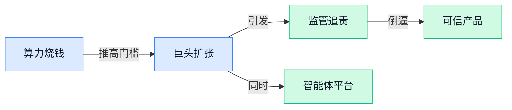
```mermaid
graph LR
A[算力烧钱] -->|推高门槛| B[巨头扩张]
B -->|引发| C[监管追责]
C -->|倒逼| D[可信产品]
B -->|同时| E[智能体平台]
classDef blue fill:#dbeafe,stroke:#3b82f6,color:#111827
classDef green fill:#d1fae5,stroke:#10b981,color:#111827
class A,B blue
class C,D,E green
```

### 📊 行业洞察（今日 4 条）

1. Google向SpaceX（马斯克旗下航天公司）买算力，Apollo（大型投资机构）又为Anthropic筹钱买芯片  
  【洞察】人工智能竞争已变成重资产游戏，模型好不好之外，谁能扛住长期成本更关键

2. Anthropic喊“暂停人工智能竞赛”，同日又曝其模型服务美国国家安全局网络行动  
  【洞察】安全口号和商业落地正在打架，越强的模型越难只按“安全产品”来包装

3. 微软自研模型被曝用未授权网页数据，佛州又把ChatGPT当缺陷产品起诉  
  【洞察】人工智能风险正从道德争议变成法律账单，数据来源和产品责任都会被追责

4. 记忆引擎、智能体团队工具、智能体操作系统多个开源项目同时出现  
  【洞察】行业不再只拼单个聊天助手，而是在搭“多人协作的人工智能工作台”

### 💭 对我们的启发（今日 3 条）

1. Google和Anthropic相关算力成本新闻说明，视频生成和智能剪辑不能无限调用大模型，产品要有“省钱模式”和任务分级，简单剪辑别用最贵能力。

2. 微软数据授权争议提醒我们，素材、脚本、配音、商品图训练来源要能说清楚；品牌商最怕视频爆了之后被版权追责。

3. 智能体团队和记忆引擎开源项目验证了一个方向：剪辑软件不能只做一次性生成，要记住品牌调性、爆款结构和人工修改记录，越用越懂客户。

