## AI资讯日报 2026/6/7

> AI 早报 · 每日早读 · 全网深度聚合

## **今日摘要**

```
特朗普政府或入股 OpenAI，OpenAI 推 Lockdown Mode 防数据外泄
SpaceX（马斯克航天公司）签 Google 月付 9.2 亿美元芯片大单
xAI（马斯克AI公司）被曝用 Claude 训练编程模型，Meta 数千账号失守
```

### 🔵 产品与功能更新

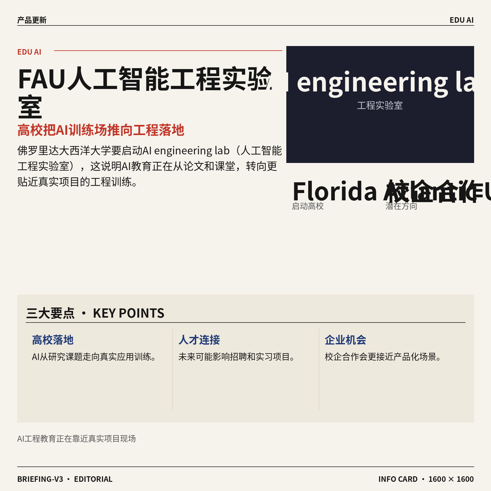

1. **Florida Atlantic University（佛罗里达大西洋大学）将启动 AI engineering lab（人工智能工程实验室）。**
佛罗里达大西洋大学将推出新的**人工智能工程实验室**，重点信号是高校正在把 AI 从“研究课题”推进到更偏工程落地的训练场 🚀。AI engineering lab（人工智能工程实验室，通常用于把算法、数据和真实应用场景结合起来做产品化实验）对学生和企业都意味着更接近实际项目的能力培养。对公司同事来说，这类实验室未来可能影响**校企合作、人才招聘、实习项目**等方向。[当地报道原文(briefing)](https://news.google.com/rss/articles/CBMiqgFBVV95cUxOWE5TNUVHQzYtLTdmRGRTQUlseVc4WTg4Q3FrQ3NfdFpSYUQ3NXRlM2JsZXFWbkNGV3V6NGRBVFZ4eGcxd0NkejE5UktVak5GN1BYQ3lrNEFWNDktNEFXbU5Ec1RybUd4OGtqbXJfWjBBcE44bmJ1WVdfb0s2dkpJS1MxT1g2TVkzOHFzdE9wQ1NtNGFFa0N3Y19GMTBJODRWRHV2aTVCNDIyUQ?oc=5)


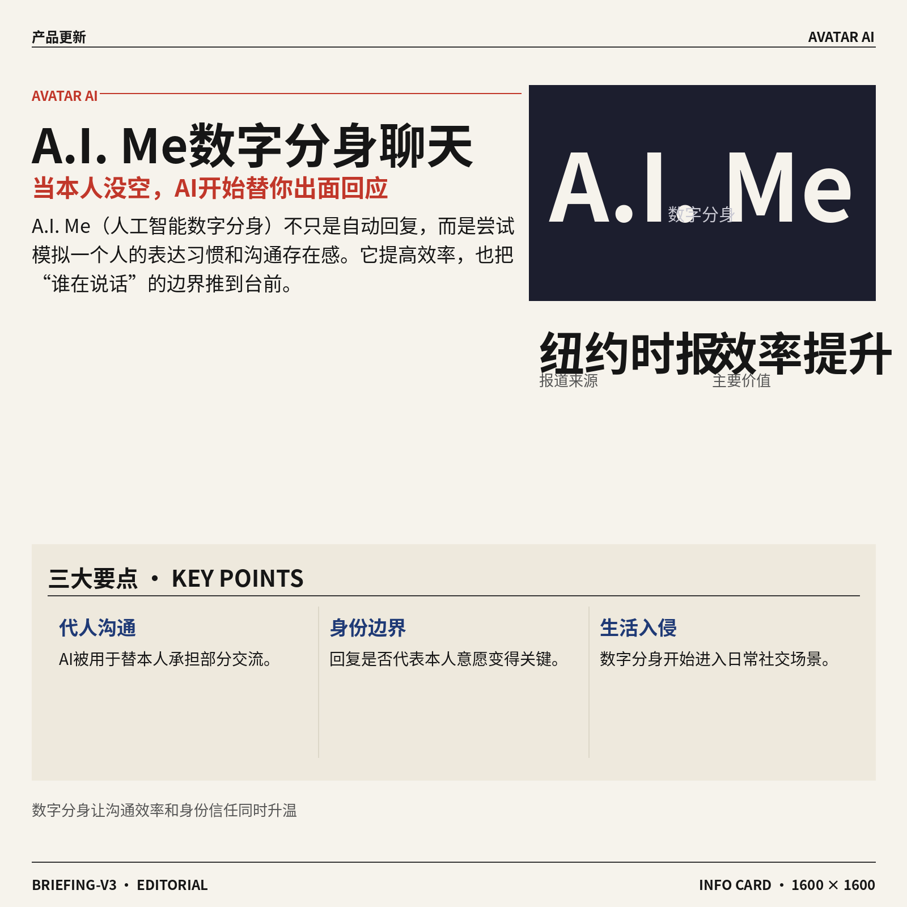

2. **A.I. Me（用人工智能模拟自己的数字分身）开始替人“出面聊天”。**
《纽约时报》这篇文章的标题点出一个很有现实感的趋势：当本人没空时，别人可能被引导去和“人工智能版的我”交流 💡。A.I. Me（人工智能数字分身，按个人信息或表达习惯生成的虚拟回应者）不是简单的自动回复，而是在尝试替人承担一部分沟通存在感。对职场和生活来说，这会带来**效率提升**，也会让大家重新思考“谁在说话”“回复是否代表本人意愿”这些边界问题。[纽约时报报道(briefing)](https://news.google.com/rss/articles/CBMifkFVX3lxTE1fZnBYemx0U1pIYUJQSk1WSm1sdThzLWNxcnJmaUNqMDFSajVISUtSXzJBTWFtSW9PY0JjcUVZSjRSaTZwblhuYWg3NUM1Xy1MVmxpSWtHSUJzRmlGZjA1VHBHczEwbkl5UmswVW1qVi00Q0Z3NUtZeHZDb0lEQQ?oc=5)

![A.I. Me（用人工智能模拟自己的数字分身）开始替人“出面聊天”](https://image.pollinations.ai/prompt/A.I.%20Me%EF%BC%88%E7%94%A8%E4%BA%BA%E5%B7%A5%E6%99%BA%E8%83%BD%E6%A8%A1%E6%8B%9F%E8%87%AA%E5%B7%B1%E7%9A%84%E6%95%B0%E5%AD%97%E5%88%86%E8%BA%AB%EF%BC%89%E5%BC%80%E5%A7%8B%E6%9B%BF%E4%BA%BA%E2%80%9C%E5%87%BA%E9%9D%A2%E8%81%8A%E5%A4%A9%E2%80%9D.%20A.I.%20Me%EF%BC%88%E7%94%A8%E4%BA%BA%E5%B7%A5%E6%99%BA%E8%83%BD%E6%A8%A1%E6%8B%9F%E8%87%AA%E5%B7%B1%E7%9A%84%E6%95%B0%E5%AD%97%E5%88%86%E8%BA%AB%EF%BC%89%E5%BC%80%E5%A7%8B%E6%9B%BF%E4%BA%BA%E2%80%9C%E5%87%BA%E9%9D%A2%E8%81%8A%E5%A4%A9%E2%80%9D%E3%80%82%20%E3%80%8A%E7%BA%BD%E7%BA%A6%E6%97%B6%E6%8A%A5%E3%80%8B%E8%BF%99%E7%AF%87%E6%96%87%E7%AB%A0%E7%9A%84%E6%A0%87%E9%A2%98%E7%82%B9%E5%87%BA%E4%B8%80%E4%B8%AA%E5%BE%88%E6%9C%89%E7%8E%B0%E5%AE%9E%E6%84%9F%E7%9A%84%E8%B6%8B%E5%8A%BF%EF%BC%9A%E5%BD%93%E6%9C%AC%E4%BA%BA%E6%B2%A1%E7%A9%BA%E6%97%B6%EF%BC%8C%E5%88%AB%E4%BA%BA%E5%8F%AF%E8%83%BD%E8%A2%AB%E5%BC%95%E5%AF%BC%E5%8E%BB%E5%92%8C%E2%80%9C%E4%BA%BA%E5%B7%A5%2C%20technical%20infographic%20diagram%2C%20architecture%20flowchart%2C%20clean%20vector%20illustration%2C%20educational%20style%2C%20no%20text%20overlay%2C%20modern%20minimal%2C%20wide%20aspect?width=1200&height=675&nologo=true&seed=11420)

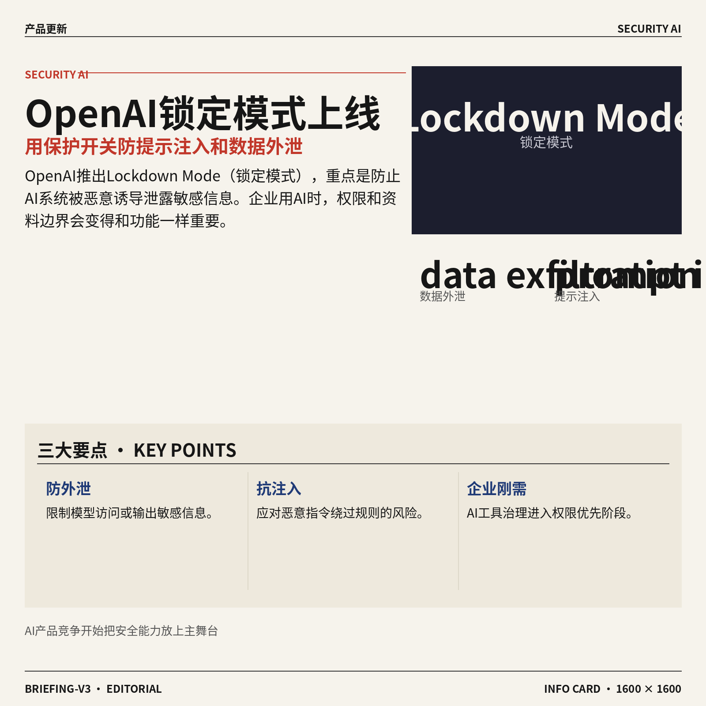

3. **OpenAI 推出 Lockdown Mode（锁定模式）应对数据外泄风险。**
OpenAI 被报道推出 **Lockdown Mode（锁定模式，遇到高风险场景时限制模型访问或输出敏感信息的保护开关）**，核心是防范 AI 系统被诱导泄露数据 🚨。文章提到的 data exfiltration（数据外泄，指资料被偷偷带出系统）和 prompt injection（提示注入，用恶意指令骗 AI 绕过规则）都是企业使用 AI 时很实际的安全问题。对普通业务团队来说，这意味着以后使用 AI 工具时，**权限、资料边界、敏感信息保护**会变得和功能本身一样重要。[安全更新报道(briefing)](https://news.google.com/rss/articles/CBMiiwFBVV95cUxPbXIyNU9MUWhUSjNxcjlFbW1aTFFiS0RpRHVQQTBzRW5STDlSSmRTUGl6M012ZTR1NDl3NDNwaldsX0tmWExkT292UEV2VmplM0wxQ3BJZmEzbC1KV2wtLXdLV1RtWGZFb044VlVfVm5ob1VEYktkTTRYUmh2S1VLQ2NZUTl0WlNENHlz?oc=5)


### 🟢 前沿研究

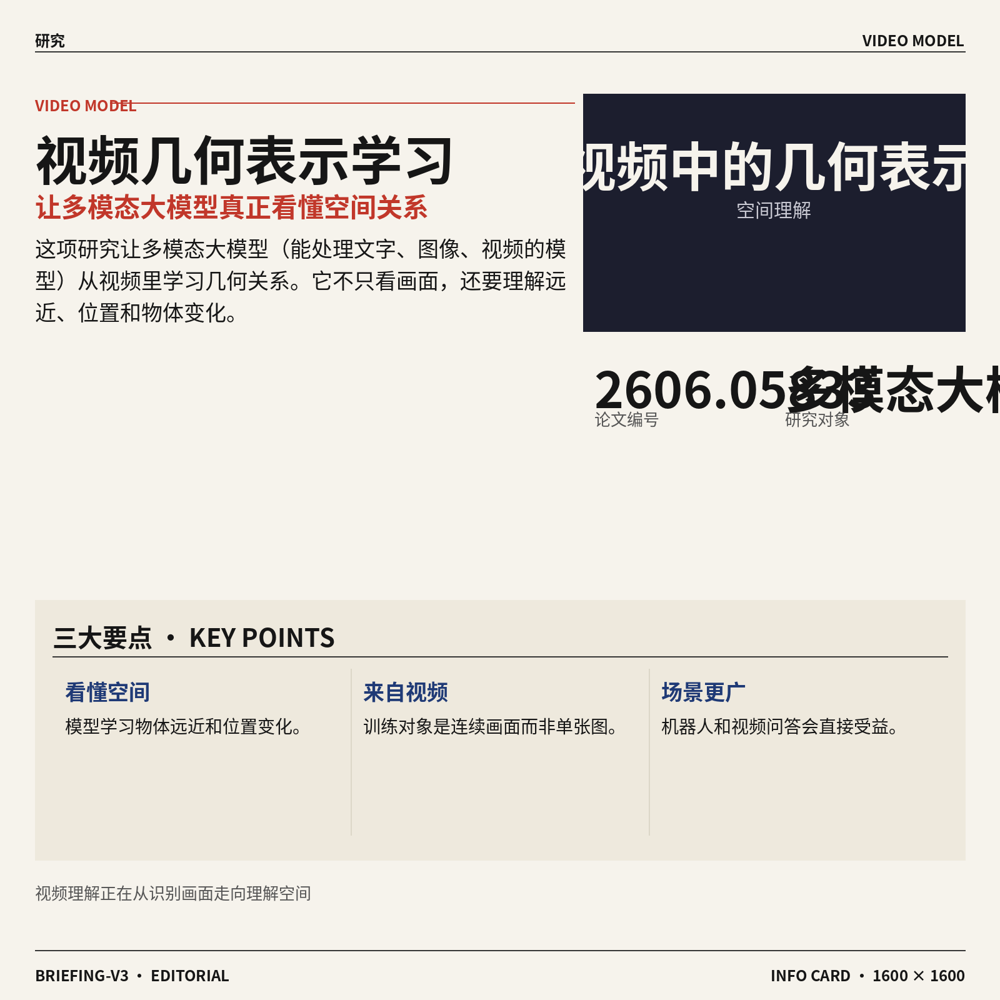

1. **Learning Geometric Representations from Videos（一项让多模态大模型从视频学习空间几何表示的研究）关注“看懂空间”。**  
这篇研究把重点放在**视频中的几何表示**上，也就是让 AI 不只看见画面，还能理解物体之间的空间关系、远近和位置变化 🚀。这里的**多模态大模型**（能同时处理文字、图像、视频等多种信息的大模型）如果学会这种能力，未来在机器人、视频理解、空间问答等场景里会更有用。论文题目强调从视频中学习，意味着研究对象不是单张图片，而是带有时间变化的连续画面。[论文页面(briefing)](https://huggingface.co/papers/2606.05833)


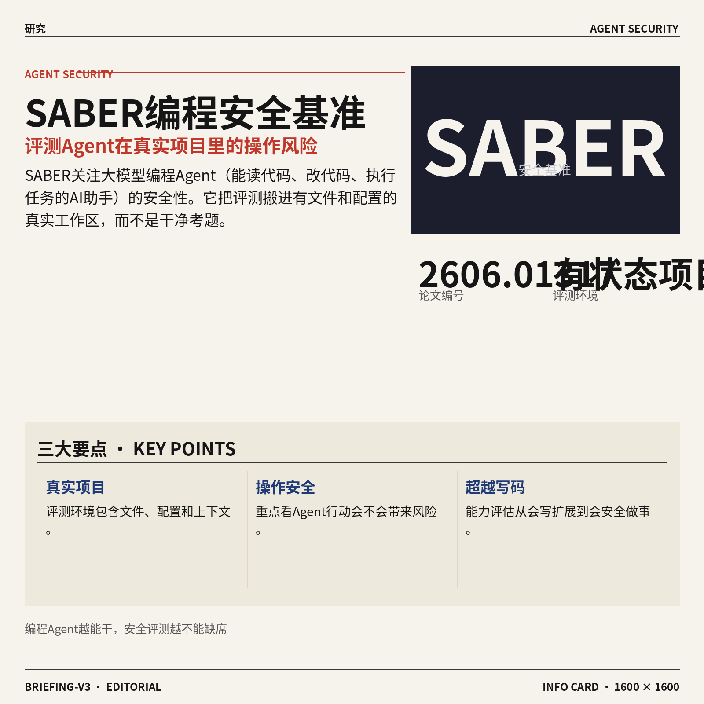

2. **SABER（一套评测大模型编程 Agent 操作安全性的基准）开始盯上真实项目风险。**  
SABER 这篇论文关注的是**大模型编程 Agent**（能自己读代码、改代码、执行任务的 AI 编程助手）在“有状态项目工作区”里的操作安全性 💡。所谓**有状态项目工作区**，可以理解成一个真实项目现场：里面有文件、配置、历史修改和上下文，不是干净的考试题。研究重点不是单纯看 AI 会不会写代码，而是评估它在真实项目里行动时会不会带来安全和操作风险。[论文页面(briefing)](https://huggingface.co/papers/2606.01317)

![SABER（一套评测大模型编程 Agent 操作安全性的基准）开始盯上真实项目风险](https://image.pollinations.ai/prompt/SABER%EF%BC%88%E4%B8%80%E5%A5%97%E8%AF%84%E6%B5%8B%E5%A4%A7%E6%A8%A1%E5%9E%8B%E7%BC%96%E7%A8%8B%20Agent%20%E6%93%8D%E4%BD%9C%E5%AE%89%E5%85%A8%E6%80%A7%E7%9A%84%E5%9F%BA%E5%87%86%EF%BC%89%E5%BC%80%E5%A7%8B%E7%9B%AF%E4%B8%8A%E7%9C%9F%E5%AE%9E%E9%A1%B9%E7%9B%AE%E9%A3%8E%E9%99%A9.%20SABER%EF%BC%88%E4%B8%80%E5%A5%97%E8%AF%84%E6%B5%8B%E5%A4%A7%E6%A8%A1%E5%9E%8B%E7%BC%96%E7%A8%8B%20Agent%20%E6%93%8D%E4%BD%9C%E5%AE%89%E5%85%A8%E6%80%A7%E7%9A%84%E5%9F%BA%E5%87%86%EF%BC%89%E5%BC%80%E5%A7%8B%E7%9B%AF%E4%B8%8A%E7%9C%9F%E5%AE%9E%E9%A1%B9%E7%9B%AE%E9%A3%8E%E9%99%A9%E3%80%82%20SABER%20%E8%BF%99%E7%AF%87%E8%AE%BA%E6%96%87%E5%85%B3%E6%B3%A8%E7%9A%84%E6%98%AF%E5%A4%A7%E6%A8%A1%E5%9E%8B%E7%BC%96%E7%A8%8B%20Agent%EF%BC%88%E8%83%BD%E8%87%AA%E5%B7%B1%E8%AF%BB%E4%BB%A3%E7%A0%81%E3%80%81%E6%94%B9%E4%BB%A3%E7%A0%81%E3%80%81%2C%20technical%20infographic%20diagram%2C%20architecture%20flowchart%2C%20clean%20vector%20illustration%2C%20educational%20style%2C%20no%20text%20overlay%2C%20modern%20minimal%2C%20wide%20aspect?width=1200&height=675&nologo=true&seed=10838)

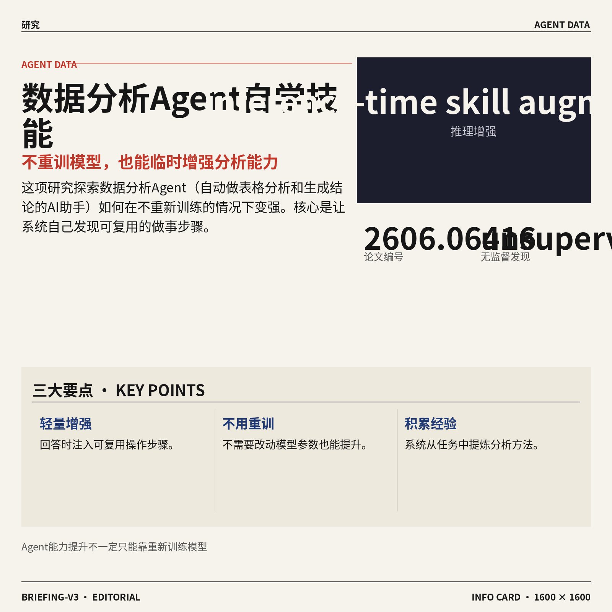

3. **Unsupervised Skill Discovery for Agentic Data Analysis（一项让数据分析 Agent 自动发现技能的研究）提出轻量增强思路。**  
这篇论文研究**数据分析 Agent**（能自动做表格分析、写分析步骤、生成结论的 AI 助手）如何在不重新训练模型的情况下变强 🚀。摘要提到的**inference-time skill augmentation**（推理阶段技能增强，指 AI 回答问题时临时注入可复用做事步骤）是一种更轻量的办法，不需要改动模型参数。论文还强调**unsupervised skill discovery**（无监督技能发现，让系统自己从任务中找出可复用方法），目标是为数据分析任务积累“操作经验”。[arxiv 论文(briefing)](https://arxiv.org/abs/2606.06416) [论文页面(briefing)](https://huggingface.co/papers/2606.06416)


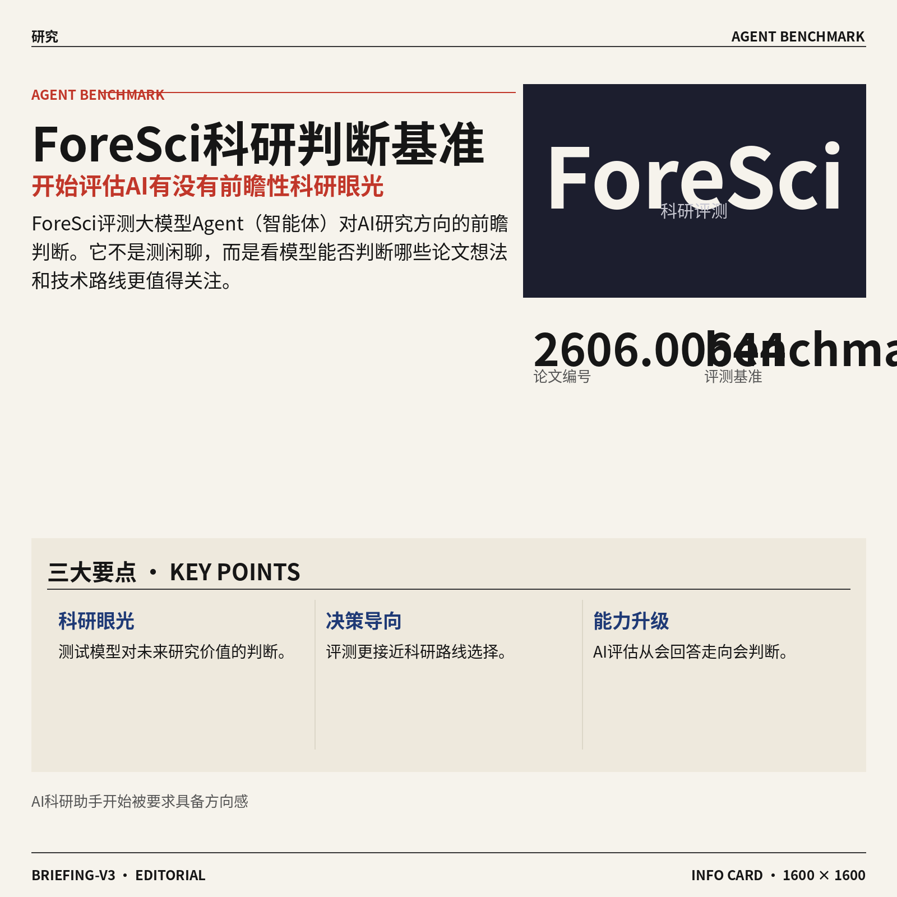

4. **ForeSci（一套评估大模型 Agent 前瞻性科研判断的基准）瞄准 AI 科研眼光。**  
ForeSci 关注的是大模型 Agent 在**前瞻性 AI 研究判断**上的表现，也就是能不能判断哪些研究方向、论文想法或技术路线更值得关注 💡。这里的**benchmark**（评测基准，用统一题目和规则比较不同 AI 能力）不是测闲聊能力，而是测更接近科研决策的判断能力。它提醒我们，AI 研究能力的评估正在从“会不会回答”走向“会不会判断未来价值”。[论文页面(briefing)](https://huggingface.co/papers/2606.00644)


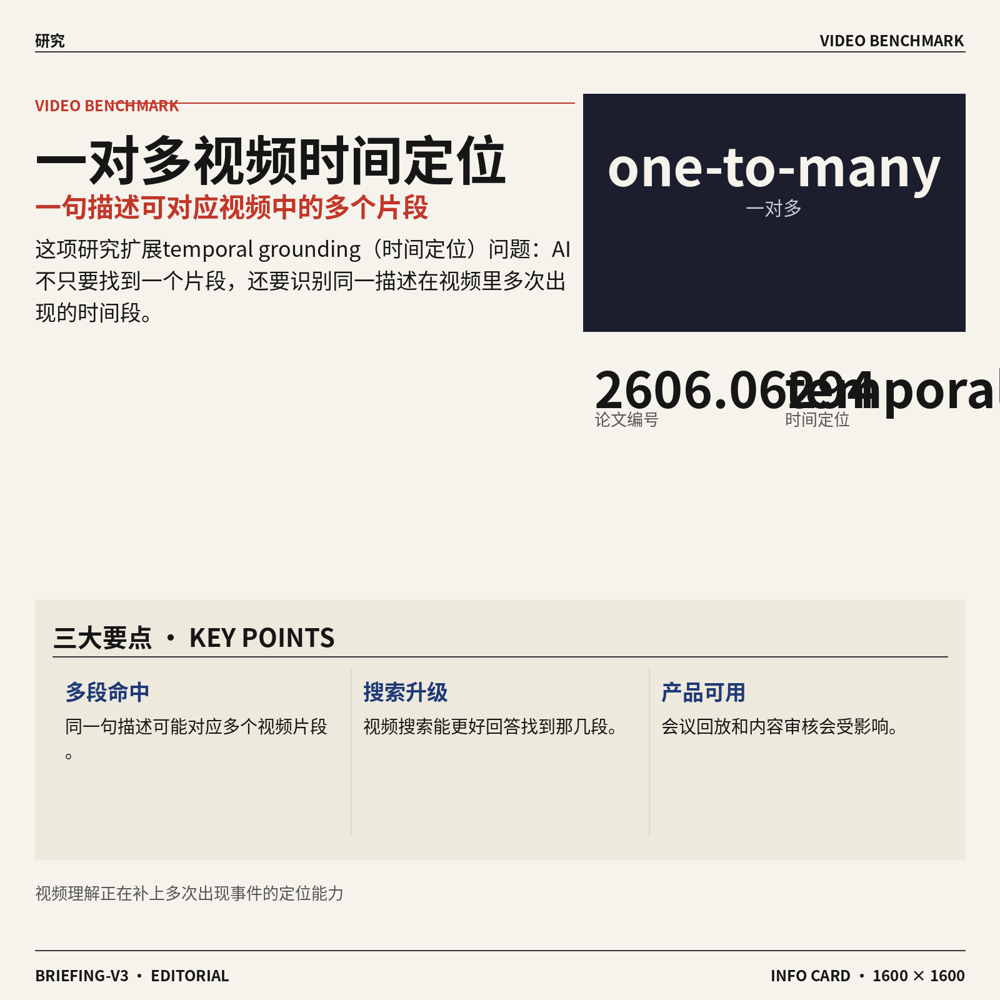

5. **Towards One-to-Many Temporal Grounding（一项研究视频中“一段描述对应多个时间片段”的论文）扩展视频理解评测。**  
这篇论文聚焦**temporal grounding**（时间定位，指 AI 根据一句描述在视频里找到对应发生时间）这个视频理解问题 🚀。题目里的**one-to-many**（一对多）说明它关注的不是一句话只对应一个片段，而是同一个事件或描述可能在视频中多次出现。对普通产品来说，这类能力会影响视频搜索、内容审核、会议回放定位等场景中“帮我找到那几段”的体验。[论文页面(briefing)](https://huggingface.co/papers/2606.06294)

![Towards One-to-Many Temporal Grounding（一项研究视频中“一段描述对应多个时间片段”的论文）扩展视频理解评测](https://image.pollinations.ai/prompt/Towards%20One-to-Many%20Temporal%20Grounding%EF%BC%88%E4%B8%80%E9%A1%B9%E7%A0%94%E7%A9%B6%E8%A7%86%E9%A2%91%E4%B8%AD%E2%80%9C%E4%B8%80%E6%AE%B5%E6%8F%8F%E8%BF%B0%E5%AF%B9%E5%BA%94%E5%A4%9A%E4%B8%AA%E6%97%B6%E9%97%B4%E7%89%87%E6%AE%B5%E2%80%9D%E7%9A%84%E8%AE%BA%E6%96%87%EF%BC%89%E6%89%A9%E5%B1%95%E8%A7%86%E9%A2%91%E7%90%86%E8%A7%A3%E8%AF%84%E6%B5%8B.%20Towards%20One-to-Many%20Temporal%20Grounding%EF%BC%88%E4%B8%80%E9%A1%B9%E7%A0%94%E7%A9%B6%E8%A7%86%E9%A2%91%E4%B8%AD%E2%80%9C%E4%B8%80%E6%AE%B5%E6%8F%8F%E8%BF%B0%E5%AF%B9%E5%BA%94%E5%A4%9A%E4%B8%AA%E6%97%B6%E9%97%B4%E7%89%87%E6%AE%B5%E2%80%9D%E7%9A%84%E8%AE%BA%E6%96%87%EF%BC%89%E6%89%A9%E5%B1%95%E8%A7%86%E9%A2%91%E7%90%86%E8%A7%A3%E8%AF%84%E6%B5%8B%E3%80%82%20%E8%BF%99%E7%AF%87%E8%AE%BA%E6%96%87%E8%81%9A%E7%84%A6%2C%20technical%20infographic%20diagram%2C%20architecture%20flowchart%2C%20clean%20vector%20illustration%2C%20educational%20style%2C%20no%20text%20overlay%2C%20modern%20minimal%2C%20wide%20aspect?width=1200&height=675&nologo=true&seed=10931)

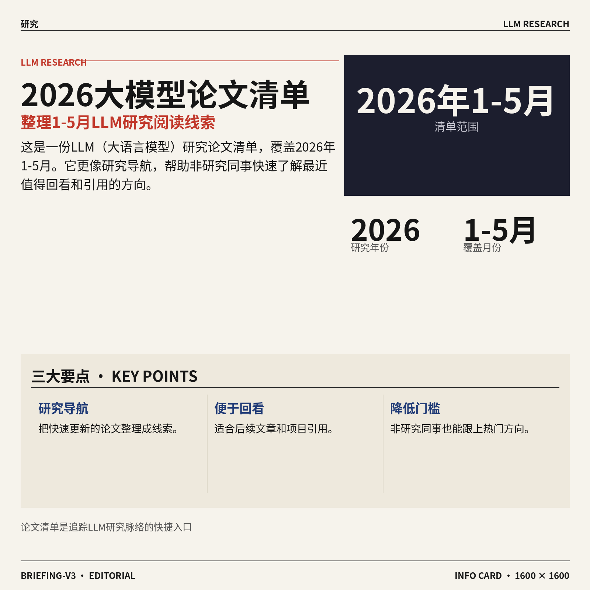

6. **LLM Research Papers: The 2026 List（一份 2026 年 1-5 月大语言模型论文清单）整理研究阅读线索。**  
这篇文章是一份**大语言模型论文清单**，作者说明自己长期维护想阅读、回看或在后续文章和项目中引用的研究论文列表 📚。这里的**LLM**（大语言模型，像 ChatGPT 背后的文字理解与生成模型）研究更新很快，清单式整理能帮助非研究同事快速知道“最近大家在看什么”。它更像一份研究导航，而不是单篇论文结论，适合用来追踪 2026 年前几个月的研究脉络。[论文清单文章(briefing)](https://magazine.sebastianraschka.com/p/llm-research-papers-2026-part1)


### 🟡 行业展望与社会影响

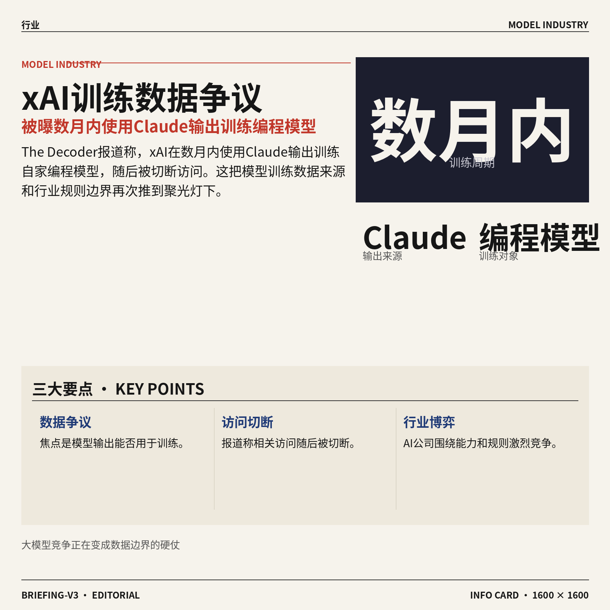

1. **xAI（马斯克旗下人工智能公司）被曝曾用 Claude 输出训练编程模型。**  
The Decoder 报道称，马斯克旗下 **xAI（马斯克创办的人工智能公司）** 在数月内使用 **Claude** 的输出内容来训练自家**编程模型（专门帮助写代码、改代码的大模型）**，随后被切断相关访问 🚀。这件事的看点不只是“谁用了谁的数据”，更关系到大模型行业里越来越敏感的**训练数据来源（模型学习时吃进去的材料）**问题。对普通用户来说，它提醒我们：AI 公司之间也在围绕能力、数据和规则边界激烈博弈。[训练争议报道(briefing)](https://the-decoder.com/elon-musks-xai-reportedly-trained-its-coding-models-on-claude-outputs-for-months-before-getting-cut-off/)


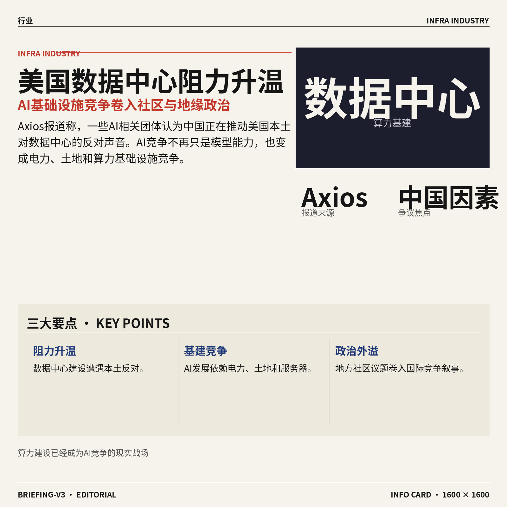

2. **美国数据中心阻力升温，人工智能团体称背后有中国因素。**  
Axios 报道称，一些人工智能相关团体认为，中国正在推动美国本土对**数据中心（存放大量服务器、支撑云服务和人工智能运算的基础设施）**的反对声音 💡。这类争议的核心，是人工智能发展越来越依赖电力、土地和大型硬件设施，而这些设施往往会碰到社区、环保和地方政治问题。换句话说，人工智能竞争已经不只是模型能力比拼，也开始变成**基础设施竞争（谁能建设更多算力和能源配套）**。[数据中心争议(briefing)](https://news.google.com/rss/articles/CBMikgFBVV95cUxNY0FBSEJOR0I2ZFpBZUZvTUJtMjJFUnJucWtQNXpyc2lPZk1zREdEekdURDZSWF8xanNISmVpYWRuRHdqbUxKeENjUHlyN2FUUTBOLVQwUWFBdkVibXJ3VEF0dlVFVi0tSWprem1ra2Y5ejZWZTNvZHM0QXpkSGhaNHhZbE5HZ25VdkU5QW9Wd2ZnZw?oc=5)


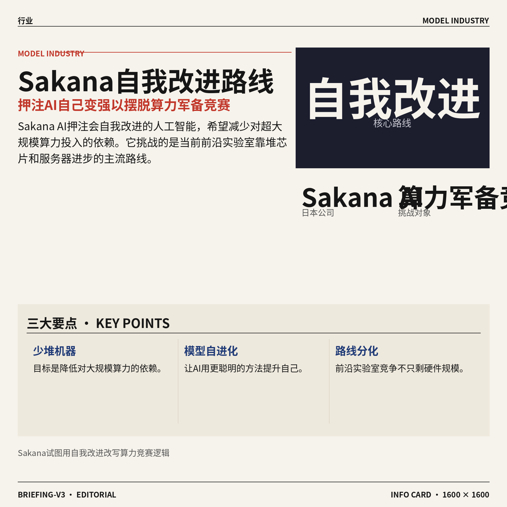

3. **Sakana AI（日本人工智能创业公司）押注“会自我改进的人工智能”打破算力军备竞赛。**  
The Decoder 报道称，**Sakana AI（日本一家研究让模型自动改进自己的人工智能公司）**正在押注一种方向：让人工智能自己提升能力，从而减少对超大规模算力投入的依赖 🚀。这里的**算力军备竞赛（各家公司不断堆更多芯片和服务器来训练更强模型）**，是当前前沿实验室最烧钱的竞争方式之一。它想解决的问题很直白：如果模型能更聪明地改进自己，也许不必每次都靠堆更多机器来进步。[自我改进路线(briefing)](https://the-decoder.com/sakana-ai-bets-ai-that-improves-itself-can-break-the-compute-arms-race-of-frontier-labs/)

![Sakana AI（日本人工智能创业公司）押注“会自我改进的人工智能”打破算力军备竞赛](https://image.pollinations.ai/prompt/Sakana%20AI%EF%BC%88%E6%97%A5%E6%9C%AC%E4%BA%BA%E5%B7%A5%E6%99%BA%E8%83%BD%E5%88%9B%E4%B8%9A%E5%85%AC%E5%8F%B8%EF%BC%89%E6%8A%BC%E6%B3%A8%E2%80%9C%E4%BC%9A%E8%87%AA%E6%88%91%E6%94%B9%E8%BF%9B%E7%9A%84%E4%BA%BA%E5%B7%A5%E6%99%BA%E8%83%BD%E2%80%9D%E6%89%93%E7%A0%B4%E7%AE%97%E5%8A%9B%E5%86%9B%E5%A4%87%E7%AB%9E%E8%B5%9B.%20Sakana%20AI%EF%BC%88%E6%97%A5%E6%9C%AC%E4%BA%BA%E5%B7%A5%E6%99%BA%E8%83%BD%E5%88%9B%E4%B8%9A%E5%85%AC%E5%8F%B8%EF%BC%89%E6%8A%BC%E6%B3%A8%E2%80%9C%E4%BC%9A%E8%87%AA%E6%88%91%E6%94%B9%E8%BF%9B%E7%9A%84%E4%BA%BA%E5%B7%A5%E6%99%BA%E8%83%BD%E2%80%9D%E6%89%93%E7%A0%B4%E7%AE%97%E5%8A%9B%E5%86%9B%E5%A4%87%E7%AB%9E%E8%B5%9B%E3%80%82%20The%20Decoder%20%E6%8A%A5%E9%81%93%E7%A7%B0%EF%BC%8CSakana%20AI%EF%BC%88%E6%97%A5%E6%9C%AC%E4%B8%80%E5%AE%B6%E7%A0%94%E7%A9%B6%E8%AE%A9%E6%A8%A1%E5%9E%8B%2C%20technical%20infographic%20diagram%2C%20architecture%20flowchart%2C%20clean%20vector%20illustration%2C%20educational%20style%2C%20no%20text%20overlay%2C%20modern%20minimal%2C%20wide%20aspect?width=1200&height=675&nologo=true&seed=10869)

4. **特朗普政府或考虑持有 OpenAI 股权。**  
TechCrunch 报道称，特朗普表示正在讨论一些交易，让“美国人民能够从人工智能的成功中受益” 💡。这指向一个很新的治理方向：政府可能通过**股权持有（政府成为公司股东、分享公司未来收益或影响力）**参与人工智能公司的发展。对行业来说，这不只是商业新闻，也意味着人工智能正在从科技公司内部事务，变成国家层面的经济与政策议题。[政府入股消息(briefing)](https://techcrunch.com/2026/06/06/the-trump-administration-might-take-an-equity-stake-in-openai/)


5. **OpenAI 与特朗普政府据称正谈判政府入股人工智能初创公司。**  
The Decoder 报道称，OpenAI 与特朗普政府正在就政府持股进行谈判 🚀。这里的**初创公司（还处在高速成长阶段、通常依赖融资扩张的公司）**已经不再只是普通科技企业，因为其技术可能影响办公、教育、国防和产业效率。若政府真的成为股东，人工智能公司的**公司治理（谁能参与重大决策、如何平衡商业和公共利益）**会变得更复杂。[入股谈判报道(briefing)](https://the-decoder.com/openai-and-the-trump-administration-are-negotiating-a-government-stake-in-the-ai-startup/)


6. **SpaceX（马斯克旗下航天公司）据称与 Google 签下每月 9.2 亿美元芯片协议。**  
The Decoder 报道称，**SpaceX（马斯克旗下火箭、卫星与航天服务公司）**与 Google 签署协议，每月金额达 9.2 亿美元，涉及 11 万块 Nvidia 人工智能芯片，并发生在 **IPO（首次公开募股，公司第一次向公众投资者卖股票）**之前 ⚡。这里的人工智能芯片，本质上是训练和运行大模型所需的核心硬件。这个消息也说明，未来能否拿到足够多的高端芯片，可能会直接影响大型科技和航天公司的战略节奏。[芯片协议报道(briefing)](https://the-decoder.com/spacex-signs-920-million-per-month-deal-with-google-for-110000-nvidia-ai-chips-ahead-of-ipo/)


### 🟣 开源TOP项目

1. **Agent-Reach（一款让 AI Agent（能自动执行任务的 AI 助手）看见全网内容的命令行工具）打通多平台搜索。**  
Agent-Reach 主打给 **AI Agent（能自动执行任务的 AI 助手）**“装上眼睛”，让它能读取和搜索 Twitter（海外社交平台）、Reddit（海外论坛社区）、YouTube（视频平台）、GitHub、Bilibili（哔哩哔哩视频社区）、小红书等内容 🔎。它把这些能力集中到一个 **CLI（命令行工具，像用文字指令操作软件的入口）** 里，并强调 **zero API fees（零接口费用，不需要为平台接口额外付费）**。对需要做内容检索、舆情观察、资料收集的团队来说，这类工具的意义是让 AI 不只会“凭记忆回答”，还能去不同平台找资料再帮你整理 💡。[GitHub 项目页(briefing)](https://github.com/Panniantong/Agent-Reach)


2. **ian-xiaohei-illustrations（一套用 Codex 生成中文小黑怪诞配图的 Skill）专注正文插画。**  
这个项目是一个中文配图生成 **Skill（可复用的 AI 技能包，像给 AI 安装一个固定工作流程）**，风格聚焦 **16:9 白底手绘**，并加入少量红、橙、蓝批注 ✍️。它和 Codex（面向代码与任务自动化的 AI 工具）结合，用来生成“中文小黑怪诞正文配图”，适合需要稳定视觉风格的内容生产场景。对运营、设计和内容同事来说，价值在于把“插画风格要求”沉淀成可重复调用的流程，而不是每次都重新写一大段 prompt（提示词，用来告诉 AI 要做什么）🚀。[GitHub 项目页(briefing)](https://github.com/helloianneo/ian-xiaohei-illustrations)


3. **copilot-sdk（一套把 GitHub Copilot Agent（GitHub 的自动化编程助手）接入应用的开发工具包）开放集成。**  
GitHub 的 **copilot-sdk（软件开发工具包，帮开发者把某项能力接进自己的产品）** 面向多平台，目标是把 GitHub Copilot Agent（GitHub 的自动化编程助手）集成到应用和服务里 ⚙️。换句话说，它不是单独给用户聊天的产品，而是给开发者做“内嵌式 AI 编程能力”的底座。对企业产品来说，这意味着未来更多内部工具、研发平台或业务系统，可能直接把 **Agent（能自动执行任务的 AI 助手）** 放进自己的工作流里 💡。[GitHub 仓库(briefing)](https://github.com/github/copilot-sdk)


4. **OpenSquilla（一款更省 token（AI 处理文字的小单位）的 AI Agent）主打同预算更高智能密度。**  
OpenSquilla 的定位是 **Token-Efficient AI Agent（更节省 token 的 AI 助手）**，强调在相同预算下提供更高的 **intelligence density（智能密度，可以理解为每花一份成本获得更多有效能力）** 💰。这里的 **token（AI 处理文字的小单位，输入输出越多通常成本越高）** 是很多 AI 产品成本控制的关键。它的卖点不是“更炫的界面”，而是让 Agent（能自动执行任务的 AI 助手）在有限预算里尽量做更多有效思考和处理 🚀。[GitHub 项目页(briefing)](https://github.com/opensquilla/opensquilla)


5. **herdr（一款住在终端里的 Agent multiplexer（多 Agent 调度器））帮你统一调度 AI 助手。**  
herdr 的一句话定位是 **agent multiplexer（多 Agent 调度器，把多个 AI 助手集中到一个入口管理）**，并且运行在 **terminal（终端，开发者用文字命令操作电脑的窗口）** 里 🧩。它面向习惯用命令行工作的开发者，让不同 Agent（能自动执行任务的 AI 助手）可以在同一个终端环境中被组织和调用。对非技术同事来说，可以把它理解成“AI 助手总控台”，只是这个总控台主要服务程序员的日常工作流 ⚡。[GitHub 仓库(briefing)](https://github.com/ogulcancelik/herdr)


6. **CopilotKit（一套面向 Agent 和 Generative UI（可由 AI 动态生成的界面）的前端工具栈）支持 React 与 Angular。**  
CopilotKit 定位为 **Frontend Stack（前端工具栈，做网页和应用界面时使用的一组工具）**，服务于 Agents（能自动执行任务的 AI 助手）和 **Generative UI（生成式界面，界面内容可由 AI 根据任务动态生成）** 🎛️。项目摘要提到它支持 React（常见网页界面开发框架）和 Angular（企业级网页应用开发框架），还关联 **AG-UI Protocol（面向 Agent 和界面协作的协议，让 AI 助手与前端界面更好配合）**。这类项目的价值在于让 AI 不只是藏在聊天框里，而是能更自然地嵌入应用界面和业务流程中 💡。[GitHub 项目页(briefing)](https://github.com/CopilotKit/CopilotKit)


### 🔴 社媒分享

1. **S&P 500（标普500指数，美国重要股票指数）拒绝 SpaceX（马斯克旗下商业航天公司）快速入选，也挡住 OpenAI 和 Anthropic。**  
S&P 500（标普500指数，常被用来衡量美国大公司整体表现）没有给 SpaceX（马斯克旗下商业航天公司）开快速通道，这也让 OpenAI 和 Anthropic 这类**尚未盈利的 AI 公司**暂时被挡在门外 🚧。这件事说明，哪怕 AI 公司估值和关注度再高，进入主流资本市场核心指数时，仍要面对传统的**盈利规则**和审核门槛。对普通同事来说，可以把它理解成“名气很大不等于马上能进优等生名单” 💡。[完整报道(briefing)](https://arstechnica.com/tech-policy/2026/06/sp-500-blocks-fast-spacex-entry-wont-waive-rule-for-unprofitable-ai-firms/)


2. **MicroPython（轻量级编程运行环境）和 WASM（让网页安全运行程序的通用格式）让沙盒运行代码更可控。**  
Simon Willison 分享了自己用 MicroPython（轻量级编程运行环境，适合在受限环境里跑代码）和 WASM（网页端安全运行程序的通用格式）做**代码沙盒**的新尝试 🧪。所谓代码沙盒，就是把代码关在一个“隔离房间”里运行，避免它随便碰到系统里的文件、网络或敏感数据。这个方向对 AI 产品很关键，因为很多 Agent 会自动写代码、跑代码，沙盒越可靠，自动化能力就越不容易带来安全风险。[技术实验记录(briefing)](https://simonwillison.net/2026/Jun/6/micropython-in-a-sandbox/#atom-everything)


3. **Meta 确认数千个 Instagram（图片和短视频社交平台）账号被滥用 AI 聊天机器人攻破。**  
Meta 确认，数千个 Instagram（图片和短视频社交平台）账号遭到攻击，问题出在有人滥用了它的 **AI 聊天机器人** 😟。这里的“滥用”可以理解为攻击者把原本用来帮用户对话的 AI 工具，变成了绕过防护或获取账号访问的入口。对企业来说，这提醒我们：AI 功能上线后，安全测试不能只看“回答得好不好”，还要看它会不会被人拿来做坏事。[安全事件报道(briefing)](https://this.weekinsecurity.com/meta-confirms-thousands-of-instagram-accounts-were-hacked-by-abusing-its-ai-chatbot/)


---

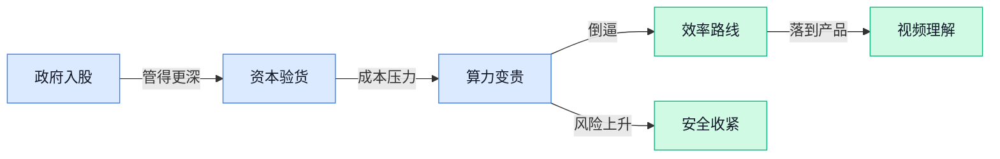
```mermaid
graph LR
  A[政府入股] -->|管得更深| B[资本验货]
  B -->|成本压力| C[算力变贵]
  C -->|倒逼| D[效率路线]
  D -->|落到产品| E[视频理解]
  C -->|风险上升| F[安全收紧]

  classDef blue fill:#dbeafe,stroke:#3b82f6,color:#111827
  classDef green fill:#d1fae5,stroke:#10b981,color:#111827
  class A,B,C blue
  class D,E,F green
```

### 📊 行业洞察（今日 4 条）

1. OpenAI被曝谈政府入股，标普500指数又挡住未盈利人工智能公司  
  【洞察】两件事放一起看，人工智能公司一边被国家盯上，一边仍要被资本市场按盈利能力验货。

2. SpaceX（马斯克旗下航天公司）买芯片，美国数据中心建设遇阻，Sakana（日本人工智能创业公司）押注自我改进  
  【洞察】行业正在同时走两条路：巨头继续烧硬件，小公司想省硬件，但短期内算力成本不会轻易下降。

3. OpenAI推锁定模式，Meta确认Instagram（图片和短视频社交平台）账号被人工智能聊天机器人攻破  
  【洞察】安全已经不是“上线前检查一下”，而是人工智能产品能不能被企业放心使用的核心门槛。

4. 视频空间理解、视频时间定位两篇研究同时出现，说明模型正在学会“看懂视频过程”  
  【洞察】视频人工智能正从生成画面，转向理解镜头里发生了什么、在哪发生、重复出现几次。

### 💭 对我们的启发（今日 3 条）

1. 视频空间理解和时间定位研究说明，剪辑软件不能只做“生成片段”，还要能自动找卖点镜头、重复动作、产品特写，减少运营人工翻素材的时间。

2. OpenAI锁定模式和Meta账号事件提醒我们，品牌商素材、账号、投放脚本都很敏感；自动剪辑功能必须有权限边界、人工确认和可撤回机制。

3. OpenSquilla（主打节省人工智能处理成本的助手）和Meta每月200美元人工智能助手说明，创作工具会进入成本竞争；我们的自动化能力要按任务难度分层，别每一步都用最贵能力。

