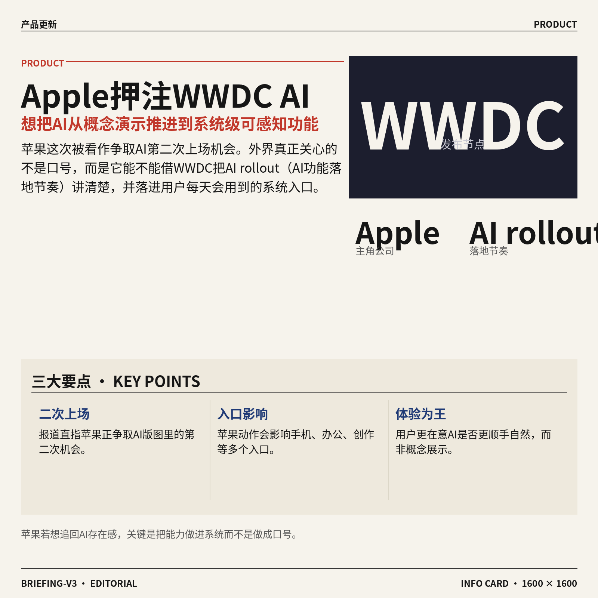
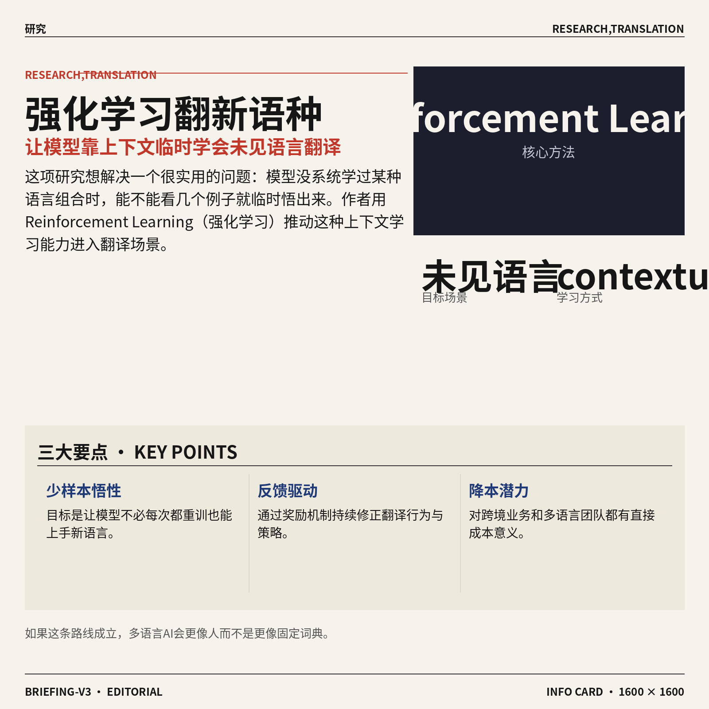
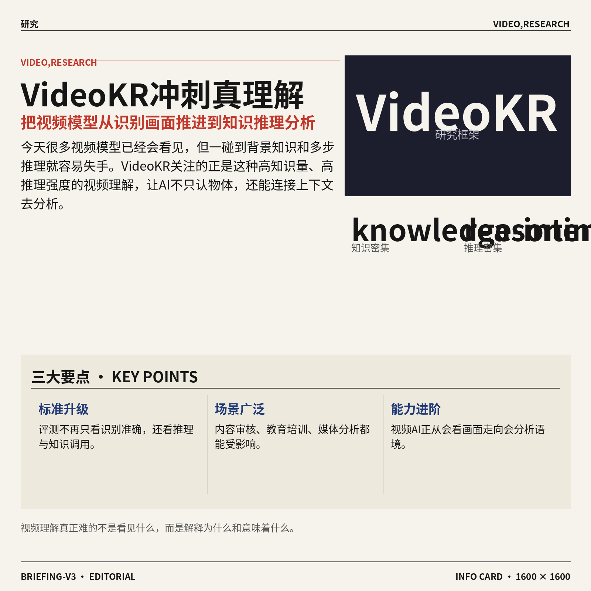
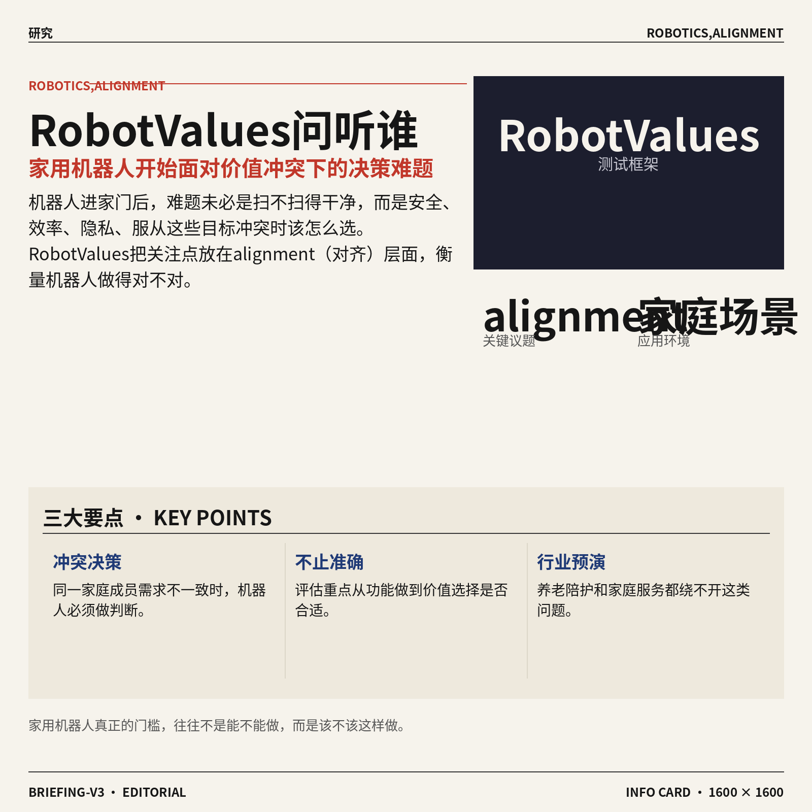
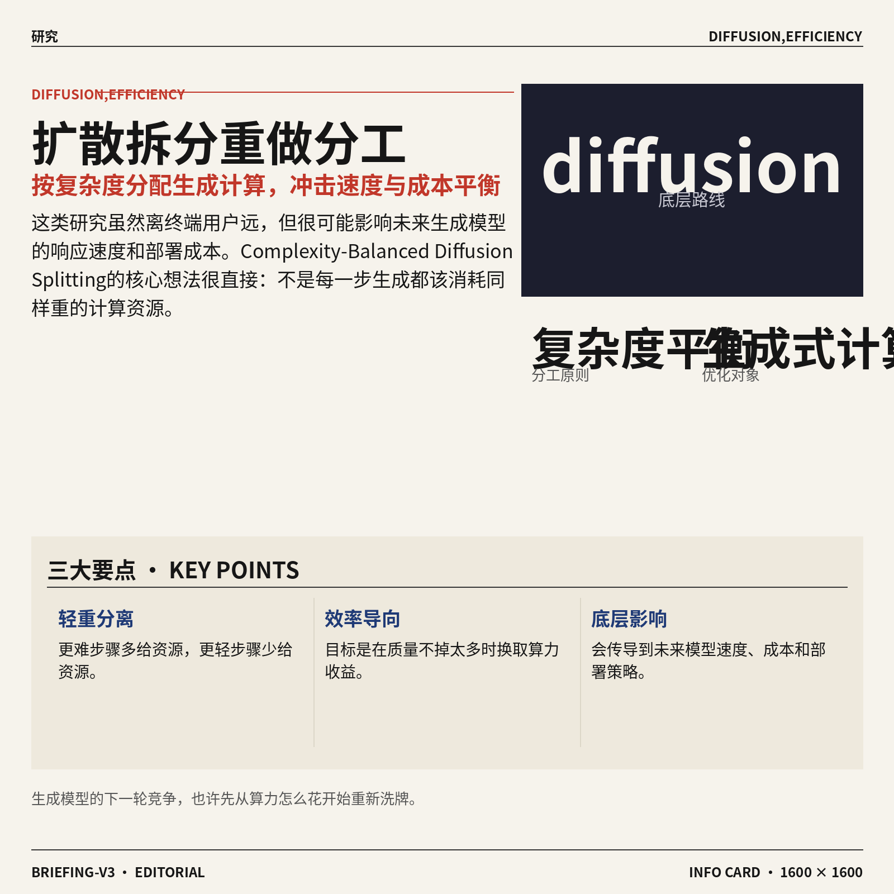
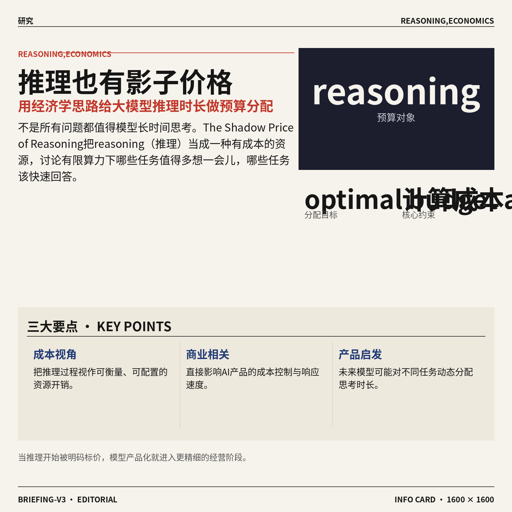
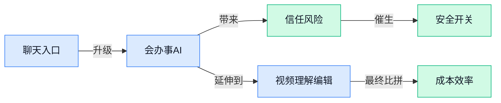

## AI资讯日报 2026/6/8

> AI 早报 · 每日早读 · 全网深度聚合

## **今日摘要**

```
OpenAI筹划ChatGPT上线以来最大改版，重心从聊天转向Agent，直奔“超级应用”入口
Apple借WWDC争AI第二次上场机会，OpenAI猛推ChatGPT改版，巨头赛点突然转向Agent
Claude Code驱动ai-job-search（求职自动化框架）把海投流程化，阿里open-code-review逐行审代码
```

### 🔵 产品与功能更新


1. **OpenAI 筹划 ChatGPT 上线以来最大改版，重心转向 Agent（能自己拆解任务并连续执行的 AI 助手）。**
多家报道都指向同一个方向：OpenAI 正准备把 **ChatGPT** 从“你问一句、它答一句”的聊天工具，进一步推向更主动的 **Agent** 形态 🤖。这类产品的关键不只是会说，而是能理解目标、分步骤处理任务，甚至在一次交互里连续完成多步操作，对日常办公场景会更有想象空间。对普通同事来说，这意味着以后 AI 可能不只是“帮你写”，而是开始“帮你办”——比如整理信息、推进流程、协助执行重复工作。[完整报道汇总(briefing)](https://news.google.com/rss/articles/CBMiiAFBVV95cUxOZWkyUGp2R3ByLTJrZl90WkxUdjFPTERGM1k2LWVXUktSX28xWW9DZEJxLW02M0IxNHRMb0FQcUJ5azh5VEhjSkJmVEtfVFF6ZFhLRjI4OTNnNDFnR2pmcERiS1BMM2kzT2IwVV9fTGZuaXUwSmlxQklMWVFtOVp1QUdCWWJHUGpJ?oc=5) [相关消息来源(briefing)](https://news.google.com/rss/articles/CBMihgFBVV95cUxQT2Voa2s0bVM1TzI2dFdtWHBwT1p2VzZDY0taUDMxQUNPWEJOU1JXVmRHblJra3lWTDVpc08xQnNyNXFvUEdBY3JQd255Nkh6V0ZiSUQwS0NZRFpWVVRiOHFJNTVhRkZlVXMtYmdwaHhYR2M0Rlo1R3l0dlM2TGlvWDRfNkc4Zw?oc=5)

![OpenAI 筹划 ChatGPT 上线以来最大改版，重心转向 Agent（能自己拆解任务并连续执行的 AI 助手）](https://image.pollinations.ai/prompt/OpenAI%20%E7%AD%B9%E5%88%92%20ChatGPT%20%E4%B8%8A%E7%BA%BF%E4%BB%A5%E6%9D%A5%E6%9C%80%E5%A4%A7%E6%94%B9%E7%89%88%EF%BC%8C%E9%87%8D%E5%BF%83%E8%BD%AC%E5%90%91%20Agent%EF%BC%88%E8%83%BD%E8%87%AA%E5%B7%B1%E6%8B%86%E8%A7%A3%E4%BB%BB%E5%8A%A1%E5%B9%B6%E8%BF%9E%E7%BB%AD%E6%89%A7%E8%A1%8C%E7%9A%84%20AI%20%E5%8A%A9%E6%89%8B%EF%BC%89.%20OpenAI%20%E7%AD%B9%E5%88%92%20ChatGPT%20%E4%B8%8A%E7%BA%BF%E4%BB%A5%E6%9D%A5%E6%9C%80%E5%A4%A7%E6%94%B9%E7%89%88%EF%BC%8C%E9%87%8D%E5%BF%83%E8%BD%AC%E5%90%91%20Agent%EF%BC%88%E8%83%BD%E8%87%AA%E5%B7%B1%E6%8B%86%E8%A7%A3%E4%BB%BB%E5%8A%A1%E5%B9%B6%E8%BF%9E%E7%BB%AD%E6%89%A7%E8%A1%8C%E7%9A%84%20AI%20%E5%8A%A9%E6%89%8B%EF%BC%89%E3%80%82%20%E5%A4%9A%E5%AE%B6%E6%8A%A5%E9%81%93%E9%83%BD%E6%8C%87%E5%90%91%E5%90%8C%E4%B8%80%E4%B8%AA%E6%96%B9%E5%90%91%EF%BC%9AOpenAI%2C%20technical%20infographic%20diagram%2C%20architecture%20flowchart%2C%20clean%20vector%20illustration%2C%20educational%20style%2C%20no%20text%20overlay%2C%20modern%20minimal%2C%20wide%20aspect?width=1200&height=675&nologo=true&seed=11389)



2. **Apple 借 WWDC（苹果全球开发者大会）争取 AI 版图“第二次上场机会”。**
这次预热信号很明确：Apple 想在接下来的 **WWDC** 上，重新讲清楚自己的 **AI rollout（AI 功能落地节奏与产品发布安排）** 📱。报道把它形容为一次“第二次机会”，说明外界正盯着苹果能否把 AI 从概念演示，推进到用户真能感受到的功能更新。对行业来说，苹果的一举一动会影响手机、办公、创作等多个入口；对普通用户来说，真正重要的不是口号，而是 AI 能不能在系统里变得更顺手、更自然。[WWDC 前瞻报道(briefing)](https://news.google.com/rss/articles/CBMiqwFBVV95cUxPLU5FYlpFRnNTekt5cU0yX281Sk1VY0N4WUxUb0xCaTBzS3RhVjVfSkc5cGZOY2h3cnlwUEpsNmJsUG1VUW5xSWNYZWRSb1FqWUhvX3hzaU9xVXAzVlhONVRlVDdqcEhOVy1tRVU0bTVWTU1PMXVja0JqbHNzVTczQ0x5V3VhOHB6alBFX0cyN2NiV09SYjZQeWRYMFd0dWY5cG5OUVRzUGUzSnc?oc=5)

![Apple 借 WWDC（苹果全球开发者大会）争取 AI 版图“第二次上场机会”](https://image.pollinations.ai/prompt/Apple%20%E5%80%9F%20WWDC%EF%BC%88%E8%8B%B9%E6%9E%9C%E5%85%A8%E7%90%83%E5%BC%80%E5%8F%91%E8%80%85%E5%A4%A7%E4%BC%9A%EF%BC%89%E4%BA%89%E5%8F%96%20AI%20%E7%89%88%E5%9B%BE%E2%80%9C%E7%AC%AC%E4%BA%8C%E6%AC%A1%E4%B8%8A%E5%9C%BA%E6%9C%BA%E4%BC%9A%E2%80%9D.%20Apple%20%E5%80%9F%20WWDC%EF%BC%88%E8%8B%B9%E6%9E%9C%E5%85%A8%E7%90%83%E5%BC%80%E5%8F%91%E8%80%85%E5%A4%A7%E4%BC%9A%EF%BC%89%E4%BA%89%E5%8F%96%20AI%20%E7%89%88%E5%9B%BE%E2%80%9C%E7%AC%AC%E4%BA%8C%E6%AC%A1%E4%B8%8A%E5%9C%BA%E6%9C%BA%E4%BC%9A%E2%80%9D%E3%80%82%20%E8%BF%99%E6%AC%A1%E9%A2%84%E7%83%AD%E4%BF%A1%E5%8F%B7%E5%BE%88%E6%98%8E%E7%A1%AE%EF%BC%9AApple%20%E6%83%B3%E5%9C%A8%E6%8E%A5%E4%B8%8B%E6%9D%A5%E7%9A%84%20WWDC%20%E4%B8%8A%EF%BC%8C%E9%87%8D%E6%96%B0%E8%AE%B2%E6%B8%85%E6%A5%9A%E8%87%AA%E5%B7%B1%E7%9A%84%2C%20technical%20infographic%20diagram%2C%20architecture%20flowchart%2C%20clean%20vector%20illustration%2C%20educational%20style%2C%20no%20text%20overlay%2C%20modern%20minimal%2C%20wide%20aspect?width=1200&height=675&nologo=true&seed=11420)

### 🟢 前沿研究


1. **AdaPlanBench（用于评估大模型 Agent 自适应规划能力的测试基准）检验 AI 在现实约束下会不会“临场变通”。**  
这篇工作聚焦 **Agent** 在真实任务里最容易翻车的一点：计划不是写出来就完了，还得根据**世界约束**和**用户约束**随时调整 💡。这里的测试基准（专门用来统一测评模型水平的一套题库和规则）想看的，是大模型能不能在外部条件变化时继续把事办成，而不是只会照着初始方案机械执行。对企业来说，这类研究很关键，因为未来无论是客服助手、办公自动化还是流程机器人，真正有价值的都不是“会答题”，而是“遇到变化还能稳住”。可查看 [论文主页摘要(briefing)](https://huggingface.co/papers/2606.05622) 了解这项 **自适应规划** 评测方向 🚀

![AdaPlanBench（用于评估大模型 Agent 自适应规划能力的测试基准）检验 AI 在现实约束下会不会“临场变通”](https://image.pollinations.ai/prompt/AdaPlanBench%EF%BC%88%E7%94%A8%E4%BA%8E%E8%AF%84%E4%BC%B0%E5%A4%A7%E6%A8%A1%E5%9E%8B%20Agent%20%E8%87%AA%E9%80%82%E5%BA%94%E8%A7%84%E5%88%92%E8%83%BD%E5%8A%9B%E7%9A%84%E6%B5%8B%E8%AF%95%E5%9F%BA%E5%87%86%EF%BC%89%E6%A3%80%E9%AA%8C%20AI%20%E5%9C%A8%E7%8E%B0%E5%AE%9E%E7%BA%A6%E6%9D%9F%E4%B8%8B%E4%BC%9A%E4%B8%8D%E4%BC%9A%E2%80%9C%E4%B8%B4%E5%9C%BA%E5%8F%98%E9%80%9A%E2%80%9D.%20AdaPlanBench%EF%BC%88%E7%94%A8%E4%BA%8E%E8%AF%84%E4%BC%B0%E5%A4%A7%E6%A8%A1%E5%9E%8B%20Agent%20%E8%87%AA%E9%80%82%E5%BA%94%E8%A7%84%E5%88%92%E8%83%BD%E5%8A%9B%E7%9A%84%E6%B5%8B%E8%AF%95%E5%9F%BA%E5%87%86%EF%BC%89%E6%A3%80%E9%AA%8C%20AI%20%E5%9C%A8%E7%8E%B0%E5%AE%9E%E7%BA%A6%E6%9D%9F%E4%B8%8B%E4%BC%9A%E4%B8%8D%E4%BC%9A%E2%80%9C%E4%B8%B4%E5%9C%BA%E5%8F%98%E9%80%9A%E2%80%9D%E3%80%82%20%E8%BF%99%E7%AF%87%E5%B7%A5%E4%BD%9C%E8%81%9A%E7%84%A6%20Agent%20%E5%9C%A8%E7%9C%9F%E5%AE%9E%E4%BB%BB%2C%20technical%20infographic%20diagram%2C%20architecture%20flowchart%2C%20clean%20vector%20illustration%2C%20educational%20style%2C%20no%20text%20overlay%2C%20modern%20minimal%2C%20wide%20aspect?width=1200&height=675&nologo=true&seed=10807)



2. **Reinforcement Learning（强化学习，让 AI 通过奖励机制学会更优决策）被用于激发未见语言翻译的上下文学习能力。**  
这篇论文讨论的是一个很有意思的问题：如果模型从没系统学过某种语言组合，能不能依靠上下文临时“悟出来”怎么翻译 🧠。作者把 **Reinforcement Learning（强化学习，让模型根据反馈不断修正行为）** 引入翻译场景，重点观察模型是否能对**未见语言**形成 **contextual learning（上下文学习，指根据当前示例临时归纳规律）**。这类研究的意义在于，未来 AI 可能不必每遇到一种新语言都重新大规模训练，而是更像人一样“看几个例子就上手”。对跨境业务、国际客服和多语言内容团队来说，这会直接影响 AI 翻译工具的覆盖范围与成本结构。[论文摘要页面(briefing)](https://huggingface.co/papers/2606.06428)

![Reinforcement Learning（强化学习，让 AI 通过奖励机制学会更优决策）被用于激发未见语言翻译的上下文学习能力](https://image.pollinations.ai/prompt/Reinforcement%20Learning%EF%BC%88%E5%BC%BA%E5%8C%96%E5%AD%A6%E4%B9%A0%EF%BC%8C%E8%AE%A9%20AI%20%E9%80%9A%E8%BF%87%E5%A5%96%E5%8A%B1%E6%9C%BA%E5%88%B6%E5%AD%A6%E4%BC%9A%E6%9B%B4%E4%BC%98%E5%86%B3%E7%AD%96%EF%BC%89%E8%A2%AB%E7%94%A8%E4%BA%8E%E6%BF%80%E5%8F%91%E6%9C%AA%E8%A7%81%E8%AF%AD%E8%A8%80%E7%BF%BB%E8%AF%91%E7%9A%84%E4%B8%8A%E4%B8%8B%E6%96%87%E5%AD%A6%E4%B9%A0%E8%83%BD%E5%8A%9B.%20Reinforcement%20Learning%EF%BC%88%E5%BC%BA%E5%8C%96%E5%AD%A6%E4%B9%A0%EF%BC%8C%E8%AE%A9%20AI%20%E9%80%9A%E8%BF%87%E5%A5%96%E5%8A%B1%E6%9C%BA%E5%88%B6%E5%AD%A6%E4%BC%9A%E6%9B%B4%E4%BC%98%E5%86%B3%E7%AD%96%EF%BC%89%E8%A2%AB%E7%94%A8%E4%BA%8E%E6%BF%80%E5%8F%91%E6%9C%AA%E8%A7%81%E8%AF%AD%E8%A8%80%E7%BF%BB%E8%AF%91%E7%9A%84%E4%B8%8A%E4%B8%8B%E6%96%87%E5%AD%A6%E4%B9%A0%E8%83%BD%E5%8A%9B%E3%80%82%20%E8%BF%99%E7%AF%87%E8%AE%BA%E6%96%87%E8%AE%A8%E8%AE%BA%E7%9A%84%E6%98%AF%E4%B8%80%E4%B8%AA%E5%BE%88%E6%9C%89%E6%84%8F%2C%20technical%20infographic%20diagram%2C%20architecture%20flowchart%2C%20clean%20vector%20illustration%2C%20educational%20style%2C%20no%20text%20overlay%2C%20modern%20minimal%2C%20wide%20aspect?width=1200&height=675&nologo=true&seed=10838)



3. **VideoKR（面向高知识量与强推理需求的视频理解研究）想让 AI 不只“看见”，还要“看懂”。**  
很多视频模型今天已经能识别画面里有什么，但一旦问题涉及背景知识或多步推理，就容易答非所问 😅。这篇工作把重点放在 **knowledge-intensive（需要大量背景知识支撑）** 和 **reasoning-intensive（需要多步逻辑推理）** 的视频理解任务上，意味着评测标准不再只是“认出物体”，而是要判断 AI 能否把视频内容和外部知识连接起来。对内容审核、教育培训、媒体分析这类场景来说，这代表视频 AI 正从“会看”走向“会分析”。更多可见 [论文摘要介绍(briefing)](https://huggingface.co/papers/2606.05259)

![VideoKR（面向高知识量与强推理需求的视频理解研究）想让 AI 不只“看见”，还要“看懂”](https://image.pollinations.ai/prompt/VideoKR%EF%BC%88%E9%9D%A2%E5%90%91%E9%AB%98%E7%9F%A5%E8%AF%86%E9%87%8F%E4%B8%8E%E5%BC%BA%E6%8E%A8%E7%90%86%E9%9C%80%E6%B1%82%E7%9A%84%E8%A7%86%E9%A2%91%E7%90%86%E8%A7%A3%E7%A0%94%E7%A9%B6%EF%BC%89%E6%83%B3%E8%AE%A9%20AI%20%E4%B8%8D%E5%8F%AA%E2%80%9C%E7%9C%8B%E8%A7%81%E2%80%9D%EF%BC%8C%E8%BF%98%E8%A6%81%E2%80%9C%E7%9C%8B%E6%87%82%E2%80%9D.%20VideoKR%EF%BC%88%E9%9D%A2%E5%90%91%E9%AB%98%E7%9F%A5%E8%AF%86%E9%87%8F%E4%B8%8E%E5%BC%BA%E6%8E%A8%E7%90%86%E9%9C%80%E6%B1%82%E7%9A%84%E8%A7%86%E9%A2%91%E7%90%86%E8%A7%A3%E7%A0%94%E7%A9%B6%EF%BC%89%E6%83%B3%E8%AE%A9%20AI%20%E4%B8%8D%E5%8F%AA%E2%80%9C%E7%9C%8B%E8%A7%81%E2%80%9D%EF%BC%8C%E8%BF%98%E8%A6%81%E2%80%9C%E7%9C%8B%E6%87%82%E2%80%9D%E3%80%82%20%E5%BE%88%E5%A4%9A%E8%A7%86%E9%A2%91%E6%A8%A1%E5%9E%8B%E4%BB%8A%E5%A4%A9%E5%B7%B2%E7%BB%8F%E8%83%BD%E8%AF%86%E5%88%AB%E7%94%BB%E9%9D%A2%E9%87%8C%E6%9C%89%E4%BB%80%E4%B9%88%EF%BC%8C%E4%BD%86%E4%B8%80%E6%97%A6%E9%97%AE%E9%A2%98%E6%B6%89%E5%8F%8A%E8%83%8C%E6%99%AF%E7%9F%A5%E8%AF%86%2C%20technical%20infographic%20diagram%2C%20architecture%20flowchart%2C%20clean%20vector%20illustration%2C%20educational%20style%2C%20no%20text%20overlay%2C%20modern%20minimal%2C%20wide%20aspect?width=1200&height=675&nologo=true&seed=10869)



4. **RobotValues（评估家用机器人在人类价值冲突下如何决策的测试框架）关注“机器人该听谁的”难题。**  
家用机器人一旦真正进入家庭，麻烦的不只是扫地叠衣服，而是当不同人的需求冲突时，它到底该怎么选 🤖。这篇研究提出 **RobotValues**，用于评估家庭场景中机器人面对**人类价值冲突**时的表现，比如安全、效率、隐私、服从等目标可能并不总是一致。这里讨论的已不只是功能准确率，而是 **alignment（对齐，让 AI 的行为更符合人类真实意图和社会规范）** 问题。对养老陪护、家庭服务和智能硬件行业来说，这类评测会越来越重要，因为“做得到”不代表“做得对”。[论文页面摘要(briefing)](https://huggingface.co/papers/2606.03312)

![RobotValues（评估家用机器人在人类价值冲突下如何决策的测试框架）关注“机器人该听谁的”难题](https://image.pollinations.ai/prompt/RobotValues%EF%BC%88%E8%AF%84%E4%BC%B0%E5%AE%B6%E7%94%A8%E6%9C%BA%E5%99%A8%E4%BA%BA%E5%9C%A8%E4%BA%BA%E7%B1%BB%E4%BB%B7%E5%80%BC%E5%86%B2%E7%AA%81%E4%B8%8B%E5%A6%82%E4%BD%95%E5%86%B3%E7%AD%96%E7%9A%84%E6%B5%8B%E8%AF%95%E6%A1%86%E6%9E%B6%EF%BC%89%E5%85%B3%E6%B3%A8%E2%80%9C%E6%9C%BA%E5%99%A8%E4%BA%BA%E8%AF%A5%E5%90%AC%E8%B0%81%E7%9A%84%E2%80%9D%E9%9A%BE%E9%A2%98.%20RobotValues%EF%BC%88%E8%AF%84%E4%BC%B0%E5%AE%B6%E7%94%A8%E6%9C%BA%E5%99%A8%E4%BA%BA%E5%9C%A8%E4%BA%BA%E7%B1%BB%E4%BB%B7%E5%80%BC%E5%86%B2%E7%AA%81%E4%B8%8B%E5%A6%82%E4%BD%95%E5%86%B3%E7%AD%96%E7%9A%84%E6%B5%8B%E8%AF%95%E6%A1%86%E6%9E%B6%EF%BC%89%E5%85%B3%E6%B3%A8%E2%80%9C%E6%9C%BA%E5%99%A8%E4%BA%BA%E8%AF%A5%E5%90%AC%E8%B0%81%E7%9A%84%E2%80%9D%E9%9A%BE%E9%A2%98%E3%80%82%20%E5%AE%B6%E7%94%A8%E6%9C%BA%E5%99%A8%E4%BA%BA%E4%B8%80%E6%97%A6%E7%9C%9F%E6%AD%A3%E8%BF%9B%E5%85%A5%E5%AE%B6%E5%BA%AD%EF%BC%8C%E9%BA%BB%E7%83%A6%E7%9A%84%E4%B8%8D%E5%8F%AA%E6%98%AF%E6%89%AB%E5%9C%B0%E5%8F%A0%E8%A1%A3%E6%9C%8D%EF%BC%8C%E8%80%8C%E6%98%AF%2C%20technical%20infographic%20diagram%2C%20architecture%20flowchart%2C%20clean%20vector%20illustration%2C%20educational%20style%2C%20no%20text%20overlay%2C%20modern%20minimal%2C%20wide%20aspect?width=1200&height=675&nologo=true&seed=10900)


5. **LoomVideo（把多模态输入统一到视频生成与编辑中的模型）瞄准“一套系统吃下多种素材”。**  
这项工作关注的是 **multimodal inputs（多模态输入，指文字、图片、音频等不同类型信息一起输入）** 如何统一用于视频生成和视频编辑 🎬。如果做得好，用户未来不必在不同工具之间来回切换，而是能把一句话、几张图甚至其他参考信息交给同一个系统处理。对设计、营销和内容制作团队来说，这意味着视频工作流可能进一步整合，制作门槛继续下降。论文摘要可见 [模型研究页面(briefing)](https://huggingface.co/papers/2606.06042)

![LoomVideo（把多模态输入统一到视频生成与编辑中的模型）瞄准“一套系统吃下多种素材”](https://image.pollinations.ai/prompt/LoomVideo%EF%BC%88%E6%8A%8A%E5%A4%9A%E6%A8%A1%E6%80%81%E8%BE%93%E5%85%A5%E7%BB%9F%E4%B8%80%E5%88%B0%E8%A7%86%E9%A2%91%E7%94%9F%E6%88%90%E4%B8%8E%E7%BC%96%E8%BE%91%E4%B8%AD%E7%9A%84%E6%A8%A1%E5%9E%8B%EF%BC%89%E7%9E%84%E5%87%86%E2%80%9C%E4%B8%80%E5%A5%97%E7%B3%BB%E7%BB%9F%E5%90%83%E4%B8%8B%E5%A4%9A%E7%A7%8D%E7%B4%A0%E6%9D%90%E2%80%9D.%20LoomVideo%EF%BC%88%E6%8A%8A%E5%A4%9A%E6%A8%A1%E6%80%81%E8%BE%93%E5%85%A5%E7%BB%9F%E4%B8%80%E5%88%B0%E8%A7%86%E9%A2%91%E7%94%9F%E6%88%90%E4%B8%8E%E7%BC%96%E8%BE%91%E4%B8%AD%E7%9A%84%E6%A8%A1%E5%9E%8B%EF%BC%89%E7%9E%84%E5%87%86%E2%80%9C%E4%B8%80%E5%A5%97%E7%B3%BB%E7%BB%9F%E5%90%83%E4%B8%8B%E5%A4%9A%E7%A7%8D%E7%B4%A0%E6%9D%90%E2%80%9D%E3%80%82%20%E8%BF%99%E9%A1%B9%E5%B7%A5%E4%BD%9C%E5%85%B3%E6%B3%A8%E7%9A%84%E6%98%AF%20multimodal%20inputs%EF%BC%88%E5%A4%9A%E6%A8%A1%E6%80%81%E8%BE%93%E5%85%A5%EF%BC%8C%2C%20technical%20infographic%20diagram%2C%20architecture%20flowchart%2C%20clean%20vector%20illustration%2C%20educational%20style%2C%20no%20text%20overlay%2C%20modern%20minimal%2C%20wide%20aspect?width=1200&height=675&nologo=true&seed=10931)



6. **Complexity-Balanced Diffusion Splitting（复杂度平衡的扩散拆分方法）探索更高效的生成式计算分工。**  
标题里的 **diffusion（扩散模型，一类主流图像/视频生成模型，靠逐步去噪生成内容）** 是当前生成式 AI 的核心路线之一，而这篇工作讨论的是如何按**复杂度**来拆分生成过程。直白说，就是不是所有步骤都该用同样重的计算资源，有些部分更难、有些部分更轻，合理分工可能带来效率收益 ⚙️。这类底层研究虽然离普通用户有点远，但它会影响未来生成模型的速度、成本和部署方式。想看原始信息可参考 [论文摘要页(briefing)](https://huggingface.co/papers/2606.06477)




7. **The Shadow Price of Reasoning（“推理影子价格”研究）用经济学视角讨论大模型该把算力花在哪。**  
这篇论文把大模型的 **reasoning（推理，指模型在回答前进行更长链条思考）** 当成一种要花预算的资源来看待，很像企业做项目时要考虑钱该投在哪最值 💰。所谓 **optimal budget allocation（最优预算分配，意思是把有限资源用在最能提升效果的地方）**，核心是在问：当计算成本有限时，模型该在哪些任务上多“想一会儿”，哪些任务上快速回答就够了。这个视角很接地气，因为它直接关系到 AI 产品的成本控制、响应速度和最终商业化效率。详情可见 [论文摘要介绍(briefing)](https://huggingface.co/papers/2606.03092)


8. **Dream.exe（让视频生成模型“做梦”出可执行机器人操作的研究）尝试把“看起来会做”变成“真的能做”。**  
这项工作把 **video generation models（视频生成模型，能自动生成动作画面的 AI）** 和机器人操作联系起来，问题很大胆：AI 生成的一段动作视频，能不能直接转成机器人可执行的操作方案 🤯。这里的关键不只是画面逼真，而是 **executable robot manipulation（可执行的机器人操控，指机器人真能照着完成抓取、移动等动作）** 是否成立。若这条路线有效，未来机器人训练可能不必完全依赖真人示范，而能更多借助生成式 AI 先“想象”和规划动作。原始摘要见 [论文页面摘要(briefing)](https://huggingface.co/papers/2606.04811)

![Dream.exe（让视频生成模型“做梦”出可执行机器人操作的研究）尝试把“看起来会做”变成“真的能做”](https://image.pollinations.ai/prompt/Dream.exe%EF%BC%88%E8%AE%A9%E8%A7%86%E9%A2%91%E7%94%9F%E6%88%90%E6%A8%A1%E5%9E%8B%E2%80%9C%E5%81%9A%E6%A2%A6%E2%80%9D%E5%87%BA%E5%8F%AF%E6%89%A7%E8%A1%8C%E6%9C%BA%E5%99%A8%E4%BA%BA%E6%93%8D%E4%BD%9C%E7%9A%84%E7%A0%94%E7%A9%B6%EF%BC%89%E5%B0%9D%E8%AF%95%E6%8A%8A%E2%80%9C%E7%9C%8B%E8%B5%B7%E6%9D%A5%E4%BC%9A%E5%81%9A%E2%80%9D%E5%8F%98%E6%88%90%E2%80%9C%E7%9C%9F%E7%9A%84%E8%83%BD%E5%81%9A%E2%80%9D.%20Dream.exe%EF%BC%88%E8%AE%A9%E8%A7%86%E9%A2%91%E7%94%9F%E6%88%90%E6%A8%A1%E5%9E%8B%E2%80%9C%E5%81%9A%E6%A2%A6%E2%80%9D%E5%87%BA%E5%8F%AF%E6%89%A7%E8%A1%8C%E6%9C%BA%E5%99%A8%E4%BA%BA%E6%93%8D%E4%BD%9C%E7%9A%84%E7%A0%94%E7%A9%B6%EF%BC%89%E5%B0%9D%E8%AF%95%E6%8A%8A%E2%80%9C%E7%9C%8B%E8%B5%B7%E6%9D%A5%E4%BC%9A%E5%81%9A%E2%80%9D%E5%8F%98%E6%88%90%E2%80%9C%E7%9C%9F%E7%9A%84%E8%83%BD%E5%81%9A%E2%80%9D%E3%80%82%20%E8%BF%99%E9%A1%B9%E5%B7%A5%E4%BD%9C%E6%8A%8A%20video%20generation%20mod%2C%20technical%20infographic%20diagram%2C%20architecture%20flowchart%2C%20clean%20vector%20illustration%2C%20educational%20style%2C%20no%20text%20overlay%2C%20modern%20minimal%2C%20wide%20aspect?width=1200&height=675&nologo=true&seed=11024)

### 🟡 行业展望与社会影响


1. **OpenAI 计划把 ChatGPT 改造成“超级应用”（把聊天、任务执行和更多服务装进一个入口），或成上线以来最大一次改版。**
多家媒体援引报道指出，OpenAI 正筹划对 **ChatGPT** 做自发布以来最大幅度的重构，不再只把它当成“聊天框”，而是朝 **superapp（超级应用，把多种功能集中到一个 App 里）** 方向推进 💡。The Decoder 的说法更直白：OpenAI 内部认为单纯 **chat（聊天式交互）** 已经不够，目标是把 ChatGPT 重建成更完整的 **agent app（智能代理应用，能自己连续完成任务，而不只是回答一句话）**。这件事对普通用户和公司都很关键——以后大家用 AI，可能不只是“问问题”，而是直接把订安排、查资料、处理流程等任务交给它 🚀。可参考 [路透转述报道(briefing)](https://news.google.com/rss/articles/CBMirAFBVV95cUxQcUs5SGticWFRUEZVQlh1R1NUWkdYN285SHFnaEQtdGp2czkxbUJGUS1aTC1FVDJIT0QyRjc4TDBucFpLODlobjk0QTR5ZU0xUVktSnY0cVh2aFpUd3MzUVF3Ny1mYVdtQUtTZVdGU3pCOE5pYWlYbFEycGhONlM5OFVZaGRWX1FhSFl2QkpTV3IxdTU5eUhCcF9NSlkzdnV1b2kwTXRWdXRkU29E?oc=5)、[The Decoder 解读(briefing)](https://the-decoder.com/openai-says-chat-is-dead-and-plans-to-rebuild-chatgpt-as-a-full-blown-agent-app/)、[FT 相关线索(briefing)](https://news.google.com/rss/articles/CBMihAFBVV95cUxNNGJ0WEREdmV6SGUyOG5rbWU2ZFA5Z2Z4Wjg5MTZiQ0V5SGk5RFVHYnZuSXJ3QjZpQXpvRXNwN2s3bXNBZlNkRThwc2hxTG1oQnBkakxnOHBuOUE0NGN3Y0h0R084ZXRKeTBOM1BUaTg1TXRHX1BOU3M4TWFnOHR2bW1ER1Y?oc=5)

![OpenAI 计划把 ChatGPT 改造成“超级应用”（把聊天、任务执行和更多服务装进一个入口），或成上线以来最大一次改版](https://image.pollinations.ai/prompt/OpenAI%20%E8%AE%A1%E5%88%92%E6%8A%8A%20ChatGPT%20%E6%94%B9%E9%80%A0%E6%88%90%E2%80%9C%E8%B6%85%E7%BA%A7%E5%BA%94%E7%94%A8%E2%80%9D%EF%BC%88%E6%8A%8A%E8%81%8A%E5%A4%A9%E3%80%81%E4%BB%BB%E5%8A%A1%E6%89%A7%E8%A1%8C%E5%92%8C%E6%9B%B4%E5%A4%9A%E6%9C%8D%E5%8A%A1%E8%A3%85%E8%BF%9B%E4%B8%80%E4%B8%AA%E5%85%A5%E5%8F%A3%EF%BC%89%EF%BC%8C%E6%88%96%E6%88%90%E4%B8%8A%E7%BA%BF%E4%BB%A5%E6%9D%A5%E6%9C%80%E5%A4%A7%E4%B8%80%E6%AC%A1%E6%94%B9%E7%89%88.%20OpenAI%20%E8%AE%A1%E5%88%92%E6%8A%8A%20ChatGPT%20%E6%94%B9%E9%80%A0%E6%88%90%E2%80%9C%E8%B6%85%E7%BA%A7%E5%BA%94%E7%94%A8%E2%80%9D%EF%BC%88%E6%8A%8A%E8%81%8A%E5%A4%A9%E3%80%81%E4%BB%BB%E5%8A%A1%E6%89%A7%E8%A1%8C%E5%92%8C%E6%9B%B4%E5%A4%9A%E6%9C%8D%E5%8A%A1%E8%A3%85%E8%BF%9B%E4%B8%80%E4%B8%AA%E5%85%A5%E5%8F%A3%EF%BC%89%EF%BC%8C%E6%88%96%E6%88%90%E4%B8%8A%E7%BA%BF%E4%BB%A5%E6%9D%A5%E6%9C%80%E5%A4%A7%E4%B8%80%E6%AC%A1%E6%94%B9%E7%89%88%E3%80%82%20%E5%A4%9A%E5%AE%B6%E5%AA%92%E4%BD%93%E6%8F%B4%E5%BC%95%E6%8A%A5%E9%81%93%E6%8C%87%E5%87%BA%EF%BC%8COpenA%2C%20technical%20infographic%20diagram%2C%20architecture%20flowchart%2C%20clean%20vector%20illustration%2C%20educational%20style%2C%20no%20text%20overlay%2C%20modern%20minimal%2C%20wide%20aspect?width=1200&height=675&nologo=true&seed=10807)

### 🟣 开源TOP项目


1. **open-code-review（阿里开源的 AI 代码审查工具）把代码检查做到了“逐行点评”。**
它采用**混合架构**：一边用**确定性流程**（按固定规则稳定执行的检查流程），一边结合 **LLM Agent**（大模型智能体，会自己分析并给出建议），所以既有规则的稳，又有 AI 的灵活 🛠️。项目内置了针对 **NPE**（空指针异常，程序最常见的报错之一）、**XSS**（跨站脚本攻击，会让网页被注入恶意代码）、**SQL injection**（SQL 注入，可能导致数据库被恶意读取或篡改）等问题的微调规则，能直接给出**行级评论**，对研发团队尤其省时间。更实际的是，它还兼容 OpenAI 和 Anthropic 生态，说明接入现有大模型服务的门槛不高。[GitHub 仓库页(briefing)](https://github.com/alibaba/open-code-review)


2. **ai-job-search（用 Claude Code 驱动的求职自动化框架）想把“海投”变成流程化作业。**
这个项目的思路很直白：你先填好自己的经历资料，再让 AI 去帮你**筛岗位**、**改简历**、**写求职信**，甚至准备面试问答 🎯。它基于 **Claude Code**，把求职这件事拆成多个连续步骤，让 AI 不只是“写一段话”，而是按流程执行任务。对 HR、招聘运营或求职者来说，这类工具的价值在于把重复劳动标准化，也让“不同岗位定制不同材料”这件事更容易落地。[项目仓库说明(briefing)](https://github.com/MadsLorentzen/ai-job-search)


3. **forkd（给 AI Agent 用的微型虚拟机调度工具）瞄准“批量分身”能力。**
它主打的是给 AI Agent 提供类似 **fork()**（操作系统里“复制一个正在运行进程”的能力）的体验，但这里对象换成了 **microVMs**（微型虚拟机，比传统虚拟机更轻、更快，适合大规模任务隔离）⚙️。按照项目描述，它可以从一个预热好的父实例快速派生大量子实例，还支持 **BRANCH**（从正在运行的虚拟机状态直接分叉），这对需要同时跑很多 Agent 任务的场景很有吸引力。底层用了 **KVM**（Linux 常用的虚拟化能力，用来做系统级隔离）和 **CoW**（写时复制，只有改动部分才真正占新空间），意味着它追求的是速度、隔离和资源利用率三者兼顾。[GitHub 项目页(briefing)](https://github.com/deeplethe/forkd)


4. **turbovec（基于 TurboQuant 的向量索引工具）把高效检索能力打包成了开源项目。**
所谓**向量索引**，可以理解为把文字、图片等内容转成便于机器比较的坐标，再快速找到“最相似”的结果，这类能力常用于 AI 搜索和 **RAG**（检索增强生成，让 AI 回答前先查资料）📚。这个项目基于 **TurboQuant**（项目所依赖的量化底层方案，目标是用更省资源的方式处理向量数据），主体用 **Rust**（以性能和安全著称的编程语言）编写，同时提供 **Python bindings**（让 Python 也能直接调用这套底层能力的接口）。对做知识库、搜索或推荐系统的人来说，这类项目的意义在于：检索层可能更快、更省资源。[仓库主页(briefing)](https://github.com/RyanCodrai/turbovec)

![turbovec（基于 TurboQuant 的向量索引工具）把高效检索能力打包成了开源项目](https://image.pollinations.ai/prompt/turbovec%EF%BC%88%E5%9F%BA%E4%BA%8E%20TurboQuant%20%E7%9A%84%E5%90%91%E9%87%8F%E7%B4%A2%E5%BC%95%E5%B7%A5%E5%85%B7%EF%BC%89%E6%8A%8A%E9%AB%98%E6%95%88%E6%A3%80%E7%B4%A2%E8%83%BD%E5%8A%9B%E6%89%93%E5%8C%85%E6%88%90%E4%BA%86%E5%BC%80%E6%BA%90%E9%A1%B9%E7%9B%AE.%20turbovec%EF%BC%88%E5%9F%BA%E4%BA%8E%20TurboQuant%20%E7%9A%84%E5%90%91%E9%87%8F%E7%B4%A2%E5%BC%95%E5%B7%A5%E5%85%B7%EF%BC%89%E6%8A%8A%E9%AB%98%E6%95%88%E6%A3%80%E7%B4%A2%E8%83%BD%E5%8A%9B%E6%89%93%E5%8C%85%E6%88%90%E4%BA%86%E5%BC%80%E6%BA%90%E9%A1%B9%E7%9B%AE%E3%80%82%20%E6%89%80%E8%B0%93%E5%90%91%E9%87%8F%E7%B4%A2%E5%BC%95%EF%BC%8C%E5%8F%AF%E4%BB%A5%E7%90%86%E8%A7%A3%E4%B8%BA%E6%8A%8A%E6%96%87%E5%AD%97%E3%80%81%E5%9B%BE%E7%89%87%E7%AD%89%E5%86%85%E5%AE%B9%E8%BD%AC%E6%88%90%E4%BE%BF%E4%BA%8E%E6%9C%BA%E5%99%A8%E6%AF%94%E8%BE%83%E7%9A%84%E5%9D%90%E6%A0%87%2C%20technical%20infographic%20diagram%2C%20architecture%20flowchart%2C%20clean%20vector%20illustration%2C%20educational%20style%2C%20no%20text%20overlay%2C%20modern%20minimal%2C%20wide%20aspect?width=1200&height=675&nologo=true&seed=11094)

5. **flowsint（面向网络安全调查的可视化图谱平台）强调“边看边查”的调查体验。**
它是一个基于**图结构**的调查平台，适合网络安全分析师和调查人员把复杂线索串起来看 🕸️。这里的**graph-based investigations**（基于关系图的调查方式）可以理解为：把人、设备、事件、账号等信息连成关系网，比单看表格更容易发现异常链路。项目强调**可视化**、**灵活**和**可扩展**，说明它不是单一功能小工具，而是更像一个可持续加能力的调查工作台。[GitHub 仓库(briefing)](https://github.com/reconurge/flowsint)

![flowsint（面向网络安全调查的可视化图谱平台）强调“边看边查”的调查体验](https://image.pollinations.ai/prompt/flowsint%EF%BC%88%E9%9D%A2%E5%90%91%E7%BD%91%E7%BB%9C%E5%AE%89%E5%85%A8%E8%B0%83%E6%9F%A5%E7%9A%84%E5%8F%AF%E8%A7%86%E5%8C%96%E5%9B%BE%E8%B0%B1%E5%B9%B3%E5%8F%B0%EF%BC%89%E5%BC%BA%E8%B0%83%E2%80%9C%E8%BE%B9%E7%9C%8B%E8%BE%B9%E6%9F%A5%E2%80%9D%E7%9A%84%E8%B0%83%E6%9F%A5%E4%BD%93%E9%AA%8C.%20flowsint%EF%BC%88%E9%9D%A2%E5%90%91%E7%BD%91%E7%BB%9C%E5%AE%89%E5%85%A8%E8%B0%83%E6%9F%A5%E7%9A%84%E5%8F%AF%E8%A7%86%E5%8C%96%E5%9B%BE%E8%B0%B1%E5%B9%B3%E5%8F%B0%EF%BC%89%E5%BC%BA%E8%B0%83%E2%80%9C%E8%BE%B9%E7%9C%8B%E8%BE%B9%E6%9F%A5%E2%80%9D%E7%9A%84%E8%B0%83%E6%9F%A5%E4%BD%93%E9%AA%8C%E3%80%82%20%E5%AE%83%E6%98%AF%E4%B8%80%E4%B8%AA%E5%9F%BA%E4%BA%8E%E5%9B%BE%E7%BB%93%E6%9E%84%E7%9A%84%E8%B0%83%E6%9F%A5%E5%B9%B3%E5%8F%B0%EF%BC%8C%E9%80%82%E5%90%88%E7%BD%91%E7%BB%9C%E5%AE%89%E5%85%A8%E5%88%86%E6%9E%90%E5%B8%88%E5%92%8C%E8%B0%83%E6%9F%A5%E4%BA%BA%E5%91%98%E6%8A%8A%E5%A4%8D%E6%9D%82%E7%BA%BF%E7%B4%A2%E4%B8%B2%E8%B5%B7%E6%9D%A5%E7%9C%8B%2C%20technical%20infographic%20diagram%2C%20architecture%20flowchart%2C%20clean%20vector%20illustration%2C%20educational%20style%2C%20no%20text%20overlay%2C%20modern%20minimal%2C%20wide%20aspect?width=1200&height=675&nologo=true&seed=11125)

6. **Lathe（用大模型带你“学会”而不是“代做”的学习工具）想把 AI 变成陪练老师。**
这个项目的理念很有意思：不是让 **LLMs**（大语言模型，像 ChatGPT 这类能理解和生成文字的模型）替你直接完成任务，而是帮你生成一个**带来源依据的动手教程**，让你自己一步步学会新领域 💡。它会围绕你想学的技术主题组织材料、给出练习路径，并强调“自己动手”而不是“跳过理解”。对团队培训、自学新方向或跨岗学习来说，这种工具的价值在于把 AI 从“代笔助手”变成“教学搭子”。[项目介绍页(briefing)](https://github.com/devenjarvis/lathe)

![Lathe（用大模型带你“学会”而不是“代做”的学习工具）想把 AI 变成陪练老师](https://image.pollinations.ai/prompt/Lathe%EF%BC%88%E7%94%A8%E5%A4%A7%E6%A8%A1%E5%9E%8B%E5%B8%A6%E4%BD%A0%E2%80%9C%E5%AD%A6%E4%BC%9A%E2%80%9D%E8%80%8C%E4%B8%8D%E6%98%AF%E2%80%9C%E4%BB%A3%E5%81%9A%E2%80%9D%E7%9A%84%E5%AD%A6%E4%B9%A0%E5%B7%A5%E5%85%B7%EF%BC%89%E6%83%B3%E6%8A%8A%20AI%20%E5%8F%98%E6%88%90%E9%99%AA%E7%BB%83%E8%80%81%E5%B8%88.%20Lathe%EF%BC%88%E7%94%A8%E5%A4%A7%E6%A8%A1%E5%9E%8B%E5%B8%A6%E4%BD%A0%E2%80%9C%E5%AD%A6%E4%BC%9A%E2%80%9D%E8%80%8C%E4%B8%8D%E6%98%AF%E2%80%9C%E4%BB%A3%E5%81%9A%E2%80%9D%E7%9A%84%E5%AD%A6%E4%B9%A0%E5%B7%A5%E5%85%B7%EF%BC%89%E6%83%B3%E6%8A%8A%20AI%20%E5%8F%98%E6%88%90%E9%99%AA%E7%BB%83%E8%80%81%E5%B8%88%E3%80%82%20%E8%BF%99%E4%B8%AA%E9%A1%B9%E7%9B%AE%E7%9A%84%E7%90%86%E5%BF%B5%E5%BE%88%E6%9C%89%E6%84%8F%E6%80%9D%EF%BC%9A%E4%B8%8D%E6%98%AF%E8%AE%A9%20LLMs%EF%BC%88%E5%A4%A7%E8%AF%AD%E8%A8%80%E6%A8%A1%E5%9E%8B%EF%BC%8C%E5%83%8F%20ChatGPT%2C%20technical%20infographic%20diagram%2C%20architecture%20flowchart%2C%20clean%20vector%20illustration%2C%20educational%20style%2C%20no%20text%20overlay%2C%20modern%20minimal%2C%20wide%20aspect?width=1200&height=675&nologo=true&seed=11156)

### 🔴 社媒分享

1. **《大模型正在侵蚀我的软件工程职业生涯》引发从业者焦虑。**
这篇社媒分享把很多人的隐性不安直接说破了：当 **LLM（大语言模型，能理解和生成文字的 AI）** 越来越会写代码、改代码、解释代码时，软件工程师会开始担心自己多年积累的优势是不是在被稀释 😶‍🌫️。它的价值不在于给出标准答案，而在于真实呈现一线从业者对职业定位、能力护城河和长期发展路径的困惑，也让非技术同事更容易理解：AI 改变的并不只是“效率”，还有岗位的自我认知。对公司管理者来说，这类声音也提醒大家，未来讨论人才发展时，不能只盯着“会不会用 AI”，还要思考“人和 AI 怎么重新分工” 💡。[原文博文(briefing)](https://human-in-the-loop.bearblog.dev/llms-are-eroding-my-software-engineering-career-and-i-dont-know-what-to-do/)


2. **《我现在用 Claude 设计的时间比 Figma 还多》展示 AI 正在改写设计流程。**
这篇分享最有意思的地方是：作者把 Claude 当成了比传统设计工具更常用的协作对象，而不只是一个聊天助手 🤖。文中的 **Figma（设计师最常用的界面与原型设计工具）** 与 **Claude Code（Anthropic 的代码助手，可通过对话直接改界面和功能）** 形成了鲜明对比，说明设计工作正在从“先画图再实现”转向“边聊边生成、边改边验证”。这对业务、运营、产品同事都是个信号：未来很多创意表达可能会更快进入可演示状态，设计沟通的门槛也会继续降低 🚀。[作者原文(briefing)](https://blog.janestreet.com/i-design-with-claude-code-more-than-figma-now-index/)


---



### 📊 行业洞察（今日 4 条）

1. OpenAI一边要把 ChatGPT 改成能办事的“超级应用”，一边又上线 Lockdown Mode（锁定模式，关闭联网和自动执行来防数据泄露）
  【洞察】这说明 AI 从“会聊”走向“会做”后，真正卡脖子的不是功能，而是信任；能力越强，企业越怕它乱拿数据、乱做事

2. OpenAI押注 Agent，AdaPlanBench（测试 AI 遇到变化能不能临场调整的评测）又专门补测“变通能力”
  【洞察】行业已经默认 Agent 会成主战场，但离稳定商用还有距离；现在最缺的不是演示效果，而是遇到限制、插单、改需求时别掉链子

3. LoomVideo（把文字、图片、音频统一做视频生成和编辑）加上 VideoKR（让 AI 不只看见视频，还要看懂视频）
  【洞察】视频 AI 正从“做一段出来”走向“理解素材再改好它”；以后竞争点不是单次生成，而是能不能吃懂上下文、连续修改到可交付

4. Complexity-Balanced Diffusion Splitting（按难度分配生成算力）和 The Shadow Price of Reasoning（研究算力该花在哪更值）都在算成本账
  【洞察】AI 行业开始从拼最强，转向拼最省；未来赢家未必是效果最炸的，而是效果够好、速度够快、成本压得住的产品

### 💭 对我们的启发（今日 3 条）

1. OpenAI做“超级应用”又加锁定模式，提醒我们视频剪辑工具不能只堆自动化；凡是会改素材、发内容的功能，都要有可回看、可撤销、可人工接管

2. LoomVideo 和 VideoKR 说明，用户要的不是单点生成功能，而是“理解商品、脚本、素材后持续改片”；我们该补强多素材统一入口和修改记忆，而不是只比特效

3. 成本研究连续出现，说明视频 AI 很快会卷到毛利；我们产品设计上要区分“简单任务快跑、复杂任务精做”，别把所有视频都用最贵方式处理

