## AI资讯日报 2026/6/9

> AI 早报 · 每日早读 · 全网深度聚合

## **今日摘要**

```
Apple 联手 Google、Nvidia 押注更先进 AI 模型，WWDC 连发 Siri 改造与 Core AI，全面补课生成式 AI
OpenAI 已向 SEC 秘交 S-1 冲刺上市，Applied Digital 狂签52亿美元数据中心租约，AI 资本战再升温
Meta 自曝 Instagram AI 聊天机器人漏洞波及超2万个账号，Google 反向向 SpaceX 买算力，安全与基建同天拉满
```

### 🔵 产品与功能更新

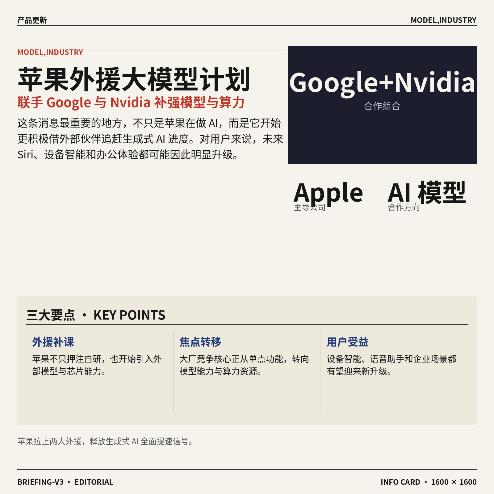

1. **Apple 联手 Google 和 Nvidia，瞄准“更先进的 AI 模型”。**
据 CNBC 报道，Apple 正与 **Google** 和 **Nvidia** 合作，推进被称为更先进的 **AI 模型** 研发，这也说明苹果在自研之外，开始更积极借助外部伙伴能力补齐进度 📌。对普通用户和企业来说，这类合作往往意味着未来的设备功能、语音助手体验，甚至办公场景里的智能能力都可能升级。虽然报道标题没有展开更多产品细节，但“苹果 + Google + Nvidia”这个组合本身已经很能说明，**模型能力**和**算力资源**（算力就是跑 AI 所需的芯片与计算能力）正在成为大厂竞争焦点。[CNBC 转引报道(briefing)](https://news.google.com/rss/articles/CBMic0FVX3lxTFB4TjFkZDFJdkg4ZVUwNmhSSENfbldRMDdRS1dYNTVMTXZMVUt5bldNTzFWdmkxQlo4U3JRUWJOZXU5S0tYdDhDSUFsRnlIQzZST293NUFST1BfbWMzbGhnYTBHdHVoenZzMXhjWnRwdk50Q0XSAXhBVV95cUxNRUI5M19abFhpcDlMVlJRV0NJUTFybXExZ2pkTWVBT0pLMGsxeklfSHJiMDlSOGVyTjNSQzJKaUxEX2R5NjdHdUJDUGYwWWluRkEtd1BjbFQ3TVFaLUpQcHZXeUs0V1h1MjdtbldGR2Z3Q0x1WDRkczE?oc=5)


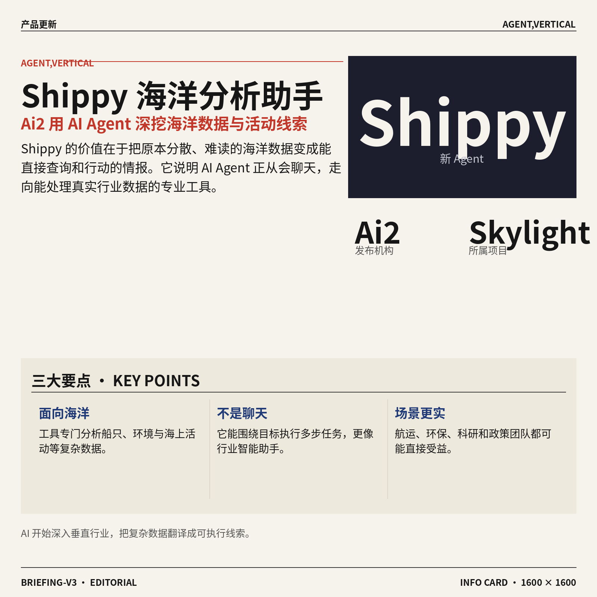

2. **Shippy（一款可深入分析海洋数据的 AI Agent）上线，Ai2 的 Skylight（AI 海洋观测项目）继续扩展。**
Ai2 推出的 **Skylight** 项目发布了 **Shippy**，这是一名专门“钻进海洋数据里找信息”的 **AI Agent**，更像是帮研究者和机构做海事情报整理的智能助手 🌊。这里的海洋数据通常包含船只、环境和活动相关信息，而 Agent 则是能按目标自动执行多步任务的 AI 助手，不只是简单聊天。对航运、环保、科研甚至政策制定相关团队来说，这类工具的意义在于，把原本分散又难读的数据变得更容易查询、理解和行动。换句话说，AI 正在从“会写字”走向“会看复杂行业数据并给出线索” 💡。[GeekWire 完整报道(briefing)](https://news.google.com/rss/articles/CBMiqwFBVV95cUxOZ1FkQnJHM1UyOUhfSERXX3hFMkVtVF9wWm5zWW5XZUZkajhsOWNqWVJXaEhVdkRVY1NBeGN6SnhyLWF6engwb3h4UjN5N01HQUtZckdnNG9LeEpMSWRkb2lQUHhHeEsta25EWFAxRWQ2TGxTbEk3Wm5YdVl2S1QyaGJLUEtmaDlramZhbkUwelJkY0g1TUNpRU1ZellWSnppaWlNXzU5WUx1dHc?oc=5)


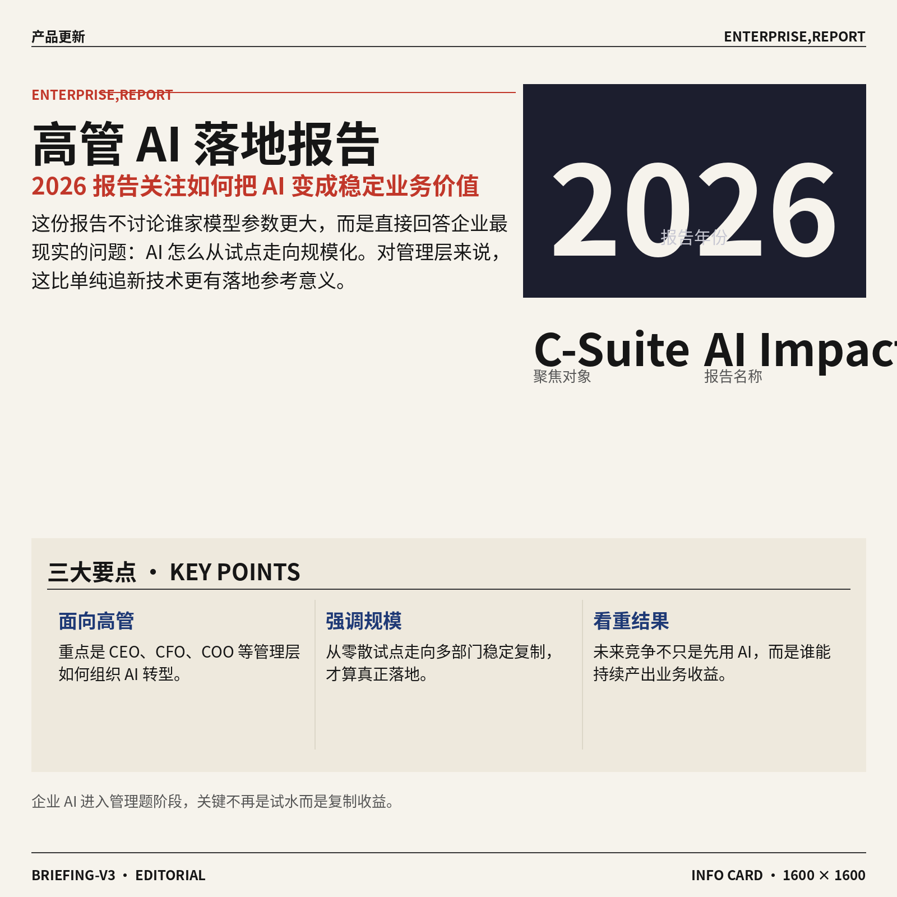

3. **University of Phoenix 发布 2026 年 C-Suite AI Impact Report（高管层 AI 影响报告），聚焦“如何把 AI 真正做出业务价值”。**
这份报告的重点不是单聊技术有多新，而是讨论企业高管层该怎样**规模化落地 AI**，把尝试变成真正的业务收益 📈。这里的 **C-Suite** 指公司最高管理层，比如 CEO、CFO、COO 这些以 C 开头的高管；所谓“规模化”则是从零散试点走向能稳定复制到多个部门。对业务、财务、人事和运营同事来说，这类报告的价值在于提醒大家：AI 竞争已经不只是“谁先用了”，而是“谁能持续产出结果、形成流程”。如果你所在团队正在推进自动化、知识管理或客服提效，这类管理视角会比单纯看模型参数更有参考意义 🚀。[报告发布消息(briefing)](https://news.google.com/rss/articles/CBMi4wFBVV95cUxOeHU1aFhTel9JSjhSWkxUVGhYZFNtNkZIX3Jmb0JHbTgyZGVJcm1lOUNLQ3ppVEtUdE1NUnVVdFBaUE9Eb29Dc2UwVUozTk9uR09vc3lzQ0FyZUhOZlhfVjl3d0RVb3d4YU1jT2tkTHhQVUZtMzFGQnFIQl9vZ2JkWTdpeUdEQ2tGbDZ6TWN2enJRd1RYZXlGMXdPclp2ZDRKcWdETVBWTzN4OVFjMWFEME1GQXp0aDF0RDhXMGJ4OE1qTVNpTy1XNHZmamRRZ29jeGZ2RHowMFZWb0Fjc0hmVnJMUQ?oc=5)


### 🟢 前沿研究

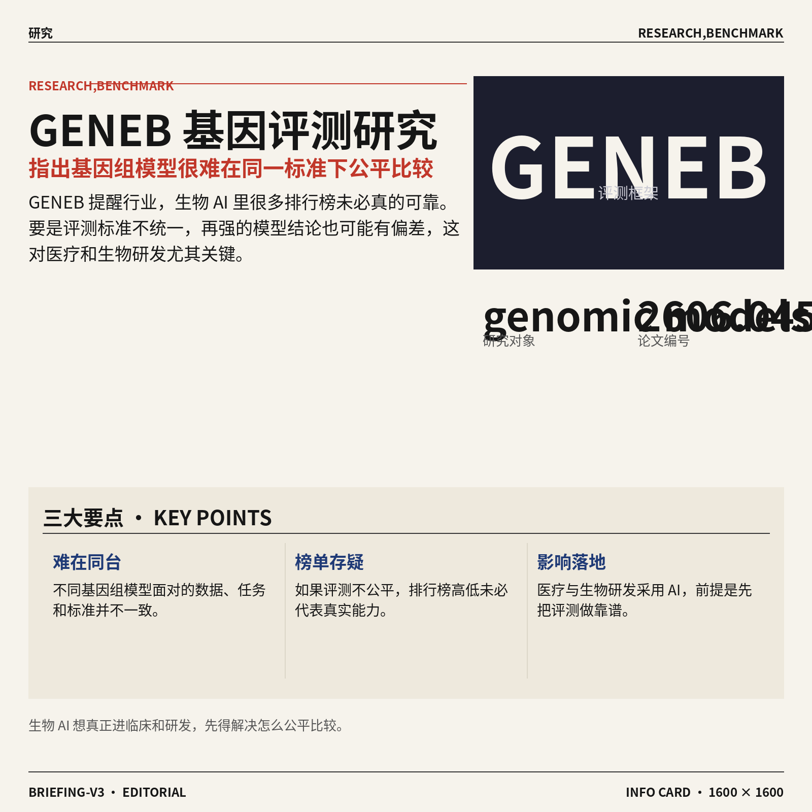

1. **GENEB（一套评估基因组模型是否真能公平比较的研究）指出：基因组模型其实很难“同台竞技”。**
这篇工作聚焦 **genomic models（基因组模型，处理 DNA 等生物序列的 AI 模型）** 为什么难比较，核心是在提醒行业：如果**评测标准**不统一，排行榜未必真能说明谁更强 🧬。对非技术同事来说，这类研究的意义在于，未来医疗、生物研发里的 AI 能不能被放心采用，很大程度取决于“是不是比得公平、测得靠谱”。原文可见 [论文介绍页(briefing)](https://huggingface.co/papers/2606.04525) 💡


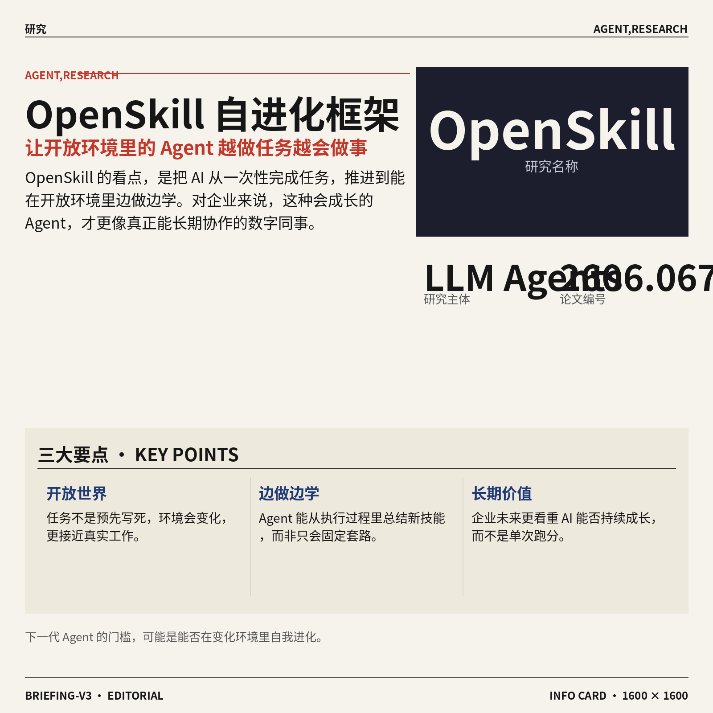

2. **OpenSkill（一种让大模型 Agent 在开放环境中自我进化的研究）瞄准“越用越会做事”的 AI。**
这项研究讨论 **open-world（开放世界，指任务和环境不是 заранее写死，而是会不断变化）** 下，**LLM Agents（大模型智能体，能自己分步骤完成任务的 AI）** 如何进行 **self-evolution（自我进化，边做任务边总结并提升能力）**。它的看点不只是让 AI 会答题，而是让 AI 在陌生场景里逐步长出新“技能”，更接近真实工作环境中的助手形态 🤖。如果这条路线走通，未来企业会更关注“AI 能不能持续成长”，而不只是一次性跑分。[论文详情页(briefing)](https://huggingface.co/papers/2606.06741)


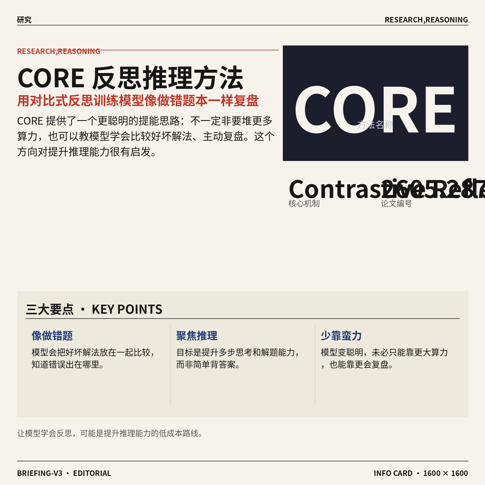

3. **CORE（一种靠“对比式反思”快速提升推理能力的方法）想让模型学会复盘。**
这篇论文提出 **Contrastive Reflection（对比式反思，让模型把好坏解法放在一起比较，反过来纠正自己）**，用于加速 **reasoning（推理，指多步思考和解题能力）** 提升。通俗说，它不是单纯喂更多题，而是让模型像做错题本一样，知道“错在哪、为什么另一个思路更好” 📝。这对行业的启发是，提升模型聪明程度，未必只能靠更大算力，也可能靠更会“复盘”的训练方式。[论文页面(briefing)](https://huggingface.co/papers/2605.28742)

![CORE（一种靠“对比式反思”快速提升推理能力的方法）想让模型学会复盘](https://image.pollinations.ai/prompt/CORE%EF%BC%88%E4%B8%80%E7%A7%8D%E9%9D%A0%E2%80%9C%E5%AF%B9%E6%AF%94%E5%BC%8F%E5%8F%8D%E6%80%9D%E2%80%9D%E5%BF%AB%E9%80%9F%E6%8F%90%E5%8D%87%E6%8E%A8%E7%90%86%E8%83%BD%E5%8A%9B%E7%9A%84%E6%96%B9%E6%B3%95%EF%BC%89%E6%83%B3%E8%AE%A9%E6%A8%A1%E5%9E%8B%E5%AD%A6%E4%BC%9A%E5%A4%8D%E7%9B%98.%20CORE%EF%BC%88%E4%B8%80%E7%A7%8D%E9%9D%A0%E2%80%9C%E5%AF%B9%E6%AF%94%E5%BC%8F%E5%8F%8D%E6%80%9D%E2%80%9D%E5%BF%AB%E9%80%9F%E6%8F%90%E5%8D%87%E6%8E%A8%E7%90%86%E8%83%BD%E5%8A%9B%E7%9A%84%E6%96%B9%E6%B3%95%EF%BC%89%E6%83%B3%E8%AE%A9%E6%A8%A1%E5%9E%8B%E5%AD%A6%E4%BC%9A%E5%A4%8D%E7%9B%98%E3%80%82%20%E8%BF%99%E7%AF%87%E8%AE%BA%E6%96%87%E6%8F%90%E5%87%BA%20Contrastive%20Reflection%EF%BC%88%E5%AF%B9%E6%AF%94%E5%BC%8F%E5%8F%8D%E6%80%9D%EF%BC%8C%E8%AE%A9%E6%A8%A1%E5%9E%8B%E6%8A%8A%E5%A5%BD%E5%9D%8F%E8%A7%A3%2C%20technical%20infographic%20diagram%2C%20architecture%20flowchart%2C%20clean%20vector%20illustration%2C%20educational%20style%2C%20no%20text%20overlay%2C%20modern%20minimal%2C%20wide%20aspect?width=1200&height=675&nologo=true&seed=10869)

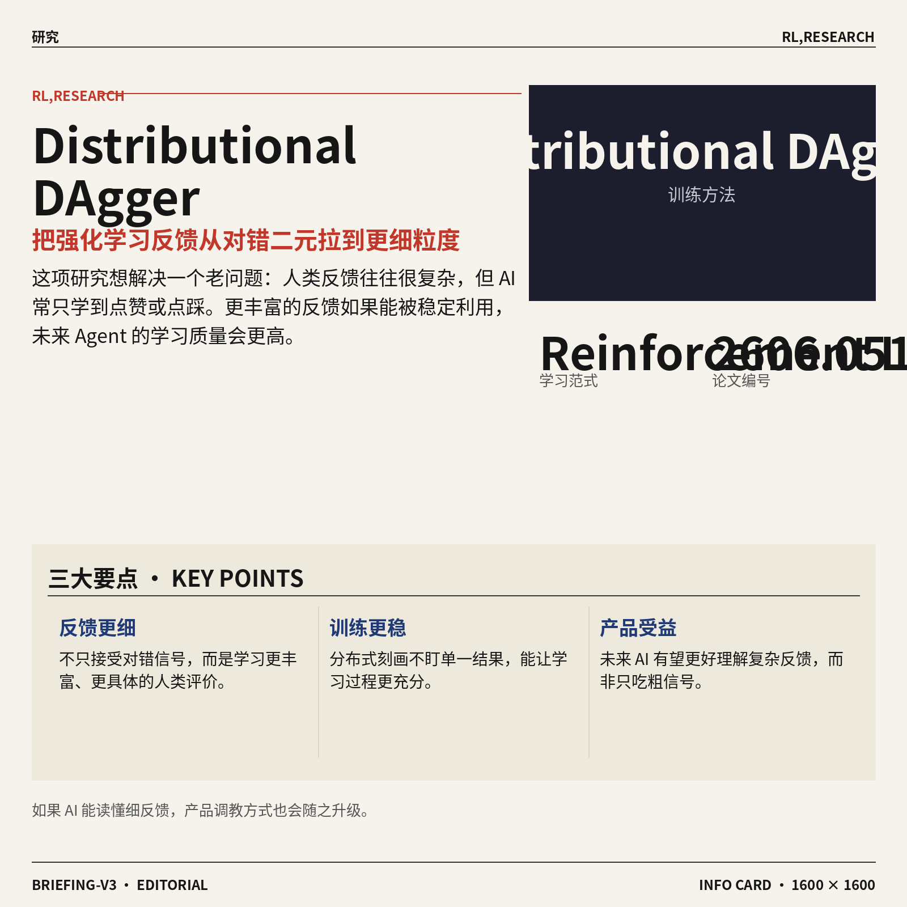

4. **Distributional DAgger（一种利用更丰富反馈做强化学习的训练方法）试图让 AI 学得更细。**
这项研究关注 **Reinforcement Learning（强化学习，让 AI 在反馈中逐步学会更优决策）**，并引入 **rich feedback（丰富反馈，不只是简单“对/错”，而是更细粒度的评价）**。其中 **DAgger（让模型边学边模仿更优示范的训练思路）** 被做成 **distributional（分布式刻画，意思是不只看单一结果，还看一类可能结果）** 版本，目标是让学习过程更稳、更充分 🎯。对实际产品来说，这意味着未来 AI 可能更擅长从复杂的人类反馈里学习，而不是只能吃“点赞/点踩”这种粗信号。[论文介绍页(briefing)](https://huggingface.co/papers/2606.05152)


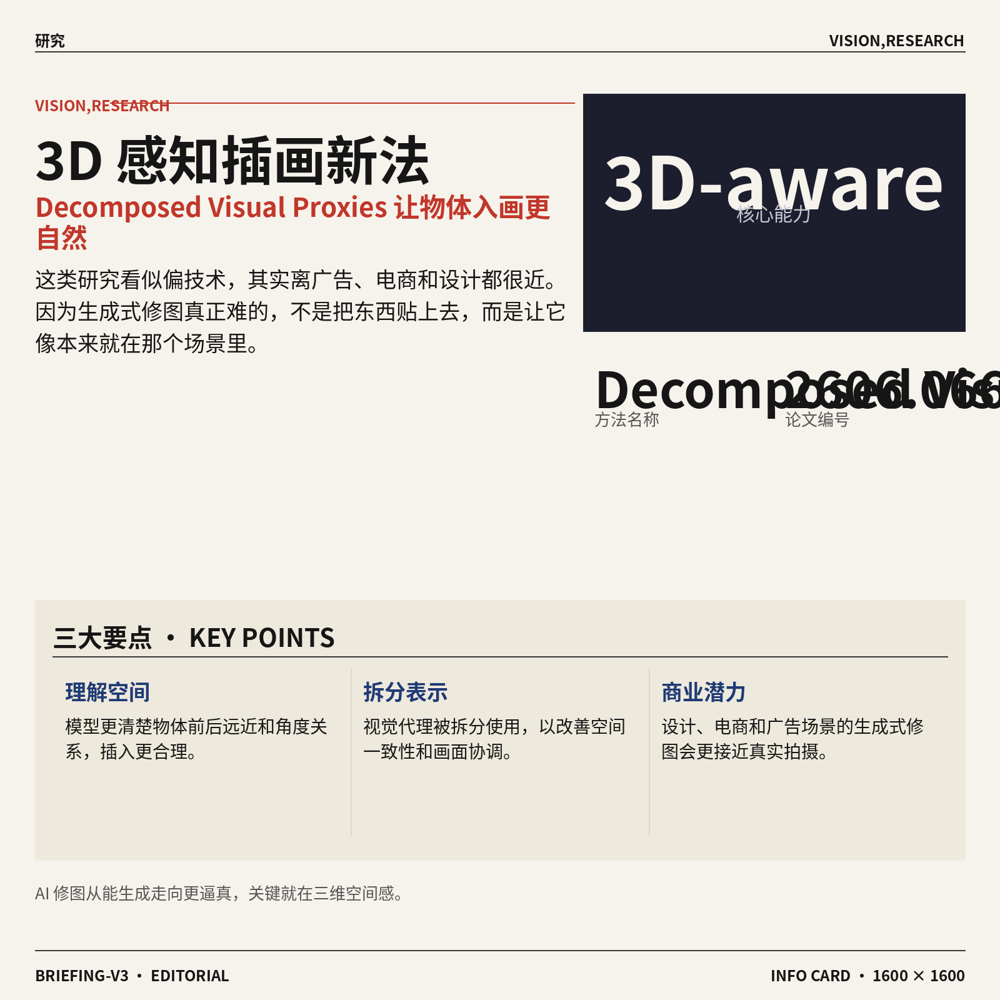

5. **Decomposed Visual Proxies（一种把物体更自然插入画面的视觉方法）推动 3D 感知编辑再进一步。**
这篇研究讨论 **3D-aware（具备三维空间感知，知道物体在前后远近和角度上的关系）** 的物体插入，目标是把新物体直接放进现有画面里，还能尽量保持真实感。这里的 **visual proxies（视觉代理，可理解为帮助模型理解画面结构的中间表示）** 被拆分使用，以改善插入时的空间一致性和视觉协调性 🖼️。对设计、广告、电商展示这类场景来说，这类能力一旦成熟，生成式修图会更接近“像真的拍过”。[论文详情页(briefing)](https://huggingface.co/papers/2606.06601)


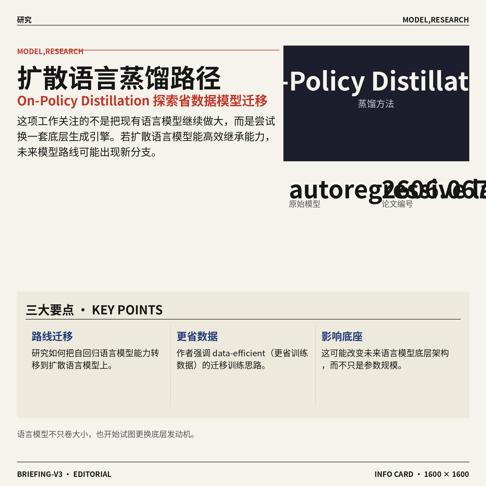

6. **On-Policy Distillation（一种更省数据的蒸馏训练方式）探索把自回归模型变成扩散语言模型。**
这项工作研究如何把 **autoregressive language models（自回归语言模型，像 ChatGPT 这样按顺序一个词一个词生成）** 转向 **diffusion language models（扩散语言模型，先加噪再逐步还原内容的生成思路）**，同时尽量做到 **data-efficient（更省训练数据）**。其中 **distillation（蒸馏训练，让强模型把能力“教”给另一种模型）** 采用 **on-policy（按模型当前行为实时采样的训练方式）**，说明作者在尝试更高效的迁移路径 🔄。这类研究的价值在于，它可能影响未来语言模型的底层路线选择，不只是“更大”，而是“更换发动机”。[论文页面(briefing)](https://huggingface.co/papers/2606.06712)


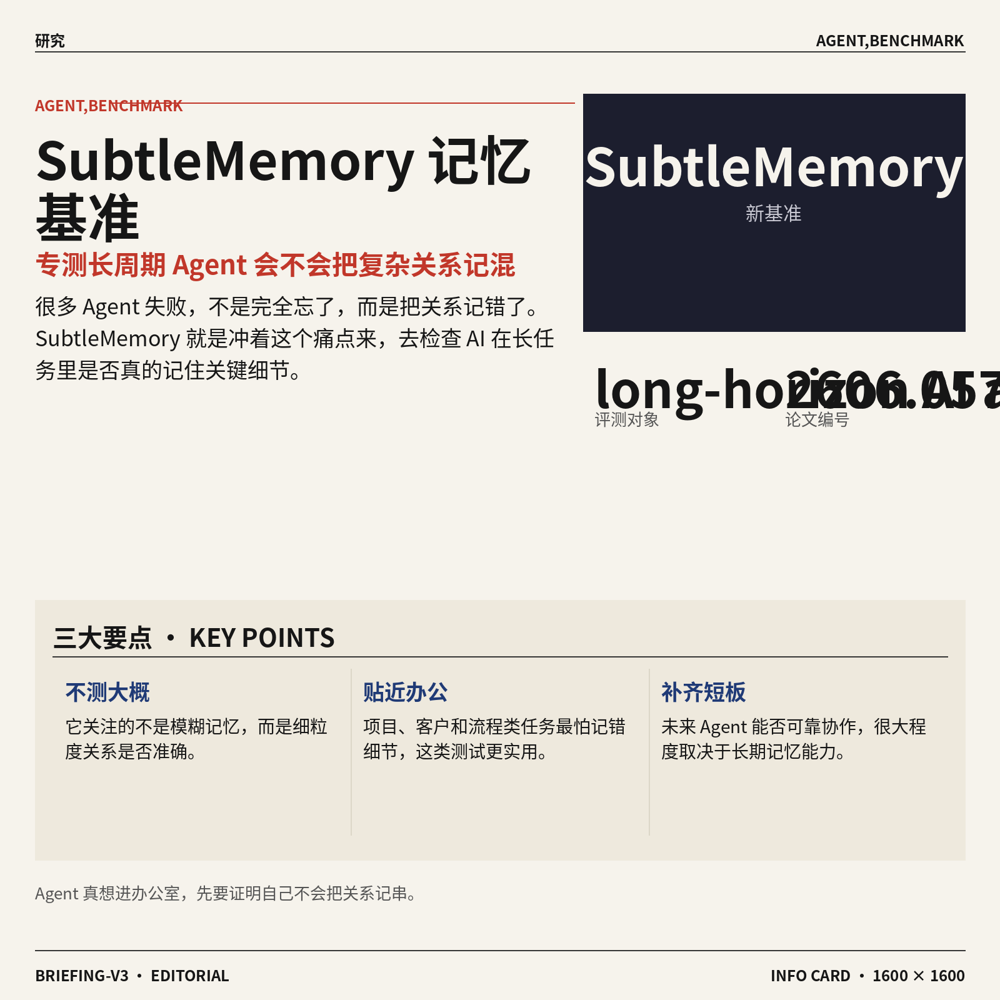

7. **SubtleMemory（一套检测 Agent 长程细粒度记忆能力的基准）专盯 AI 会不会“记混关系”。**
这篇论文提出一个新 **benchmark（基准测试，用来系统衡量模型能力的标准题库）**，评估 **long-horizon AI agents（长周期智能体，需要跨很多步骤持续完成任务的 AI）** 是否真的记住了复杂关系。它强调 **fine-grained relational memory discrimination（细粒度关系记忆辨别，指分清“谁和谁、在什么条件下、发生过什么”）**，而不是只测模型能不能记住大概意思 🧠。这很关键，因为未来办公 Agent 若要处理项目、客户、流程，多半败在“记错细节”而不是“完全没记忆”。[论文介绍页(briefing)](https://huggingface.co/papers/2606.05761)

![SubtleMemory（一套检测 Agent 长程细粒度记忆能力的基准）专盯 AI 会不会“记混关系”](https://image.pollinations.ai/prompt/SubtleMemory%EF%BC%88%E4%B8%80%E5%A5%97%E6%A3%80%E6%B5%8B%20Agent%20%E9%95%BF%E7%A8%8B%E7%BB%86%E7%B2%92%E5%BA%A6%E8%AE%B0%E5%BF%86%E8%83%BD%E5%8A%9B%E7%9A%84%E5%9F%BA%E5%87%86%EF%BC%89%E4%B8%93%E7%9B%AF%20AI%20%E4%BC%9A%E4%B8%8D%E4%BC%9A%E2%80%9C%E8%AE%B0%E6%B7%B7%E5%85%B3%E7%B3%BB%E2%80%9D.%20SubtleMemory%EF%BC%88%E4%B8%80%E5%A5%97%E6%A3%80%E6%B5%8B%20Agent%20%E9%95%BF%E7%A8%8B%E7%BB%86%E7%B2%92%E5%BA%A6%E8%AE%B0%E5%BF%86%E8%83%BD%E5%8A%9B%E7%9A%84%E5%9F%BA%E5%87%86%EF%BC%89%E4%B8%93%E7%9B%AF%20AI%20%E4%BC%9A%E4%B8%8D%E4%BC%9A%E2%80%9C%E8%AE%B0%E6%B7%B7%E5%85%B3%E7%B3%BB%E2%80%9D%E3%80%82%20%E8%BF%99%E7%AF%87%E8%AE%BA%E6%96%87%E6%8F%90%E5%87%BA%E4%B8%80%E4%B8%AA%E6%96%B0%20benchmark%EF%BC%88%E5%9F%BA%E5%87%86%E6%B5%8B%E8%AF%95%EF%BC%8C%E7%94%A8%2C%20technical%20infographic%20diagram%2C%20architecture%20flowchart%2C%20clean%20vector%20illustration%2C%20educational%20style%2C%20no%20text%20overlay%2C%20modern%20minimal%2C%20wide%20aspect?width=1200&height=675&nologo=true&seed=10993)

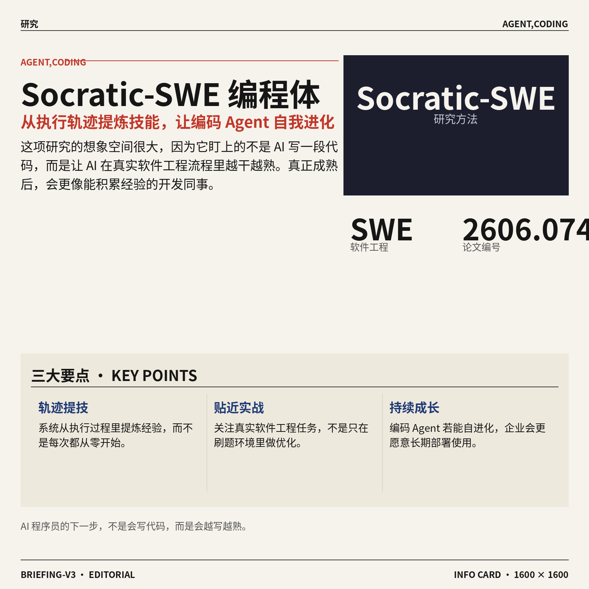

8. **Socratic-SWE（一种从执行轨迹里提炼技能、让编码 Agent 自我进化的方法）想让 AI 程序员越干越熟。**
这项研究面向 **coding agents（编程智能体，能读代码、改代码、执行任务的 AI）**，通过 **trace-derived agent skills（从执行轨迹中提炼出的技能，类似复盘做事过程后沉淀经验）** 实现 **self-evolving（自我进化）**。名字里的 **SWE（软件工程，指真实的软件开发工作流程）** 说明它关注的不是刷题式编程，而是更贴近实际开发任务的能力提升 👨‍💻。对企业来说，这类方向若成熟，AI 写代码就不只是“一次性帮忙”，而会更像能持续积累经验的数字同事。[论文详情页(briefing)](https://huggingface.co/papers/2606.07412)

![Socratic-SWE（一种从执行轨迹里提炼技能、让编码 Agent 自我进化的方法）想让 AI 程序员越干越熟](https://image.pollinations.ai/prompt/Socratic-SWE%EF%BC%88%E4%B8%80%E7%A7%8D%E4%BB%8E%E6%89%A7%E8%A1%8C%E8%BD%A8%E8%BF%B9%E9%87%8C%E6%8F%90%E7%82%BC%E6%8A%80%E8%83%BD%E3%80%81%E8%AE%A9%E7%BC%96%E7%A0%81%20Agent%20%E8%87%AA%E6%88%91%E8%BF%9B%E5%8C%96%E7%9A%84%E6%96%B9%E6%B3%95%EF%BC%89%E6%83%B3%E8%AE%A9%20AI%20%E7%A8%8B%E5%BA%8F%E5%91%98%E8%B6%8A%E5%B9%B2%E8%B6%8A%E7%86%9F.%20Socratic-SWE%EF%BC%88%E4%B8%80%E7%A7%8D%E4%BB%8E%E6%89%A7%E8%A1%8C%E8%BD%A8%E8%BF%B9%E9%87%8C%E6%8F%90%E7%82%BC%E6%8A%80%E8%83%BD%E3%80%81%E8%AE%A9%E7%BC%96%E7%A0%81%20Agent%20%E8%87%AA%E6%88%91%E8%BF%9B%E5%8C%96%E7%9A%84%E6%96%B9%E6%B3%95%EF%BC%89%E6%83%B3%E8%AE%A9%20AI%20%E7%A8%8B%E5%BA%8F%E5%91%98%E8%B6%8A%E5%B9%B2%E8%B6%8A%E7%86%9F%E3%80%82%20%E8%BF%99%E9%A1%B9%E7%A0%94%E7%A9%B6%E9%9D%A2%E5%90%91%20coding%20agents%EF%BC%88%2C%20technical%20infographic%20diagram%2C%20architecture%20flowchart%2C%20clean%20vector%20illustration%2C%20educational%20style%2C%20no%20text%20overlay%2C%20modern%20minimal%2C%20wide%20aspect?width=1200&height=675&nologo=true&seed=11024)

### 🟡 行业展望与社会影响

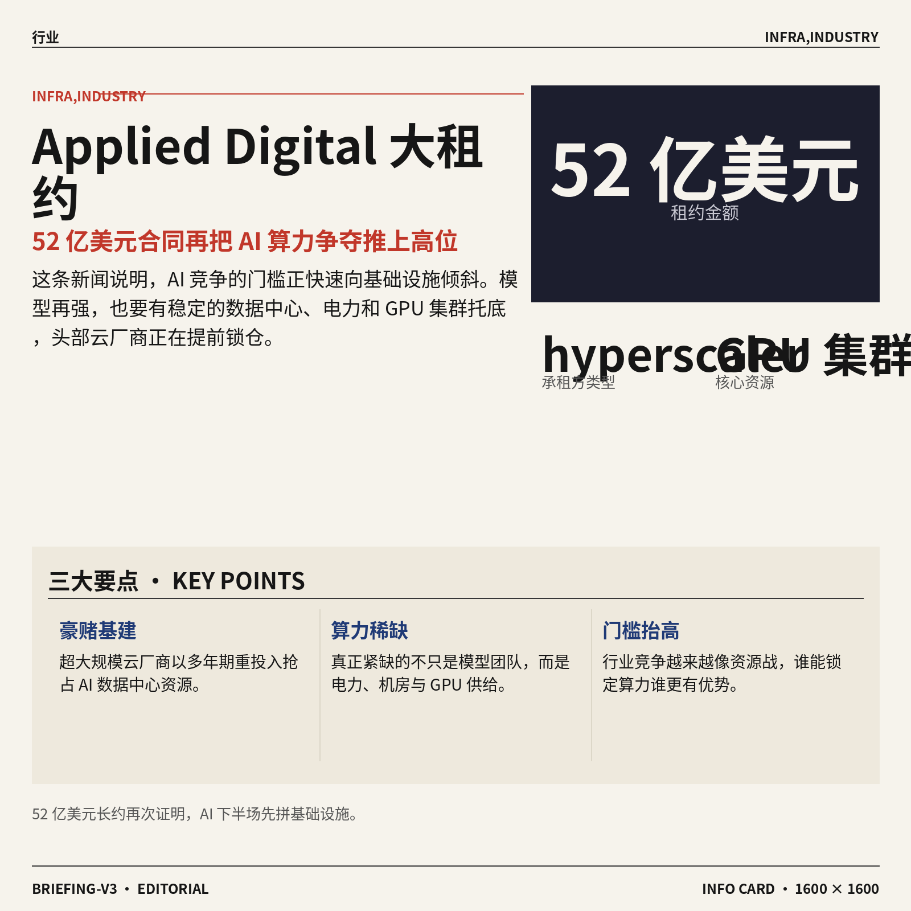

1. **Applied Digital 签下 52 亿美元 AI 数据中心租约，超大规模云厂商继续豪赌算力。**
这笔长达数十亿美元的租约，说明 **AI 基础设施** 竞赛还在明显升温，真正稀缺的不只是模型，更是背后的 **数据中心** 和电力资源 ⚡。报道提到承租方是美国 **hyperscaler（超大规模云服务商，指运营海量服务器与云平台的巨头公司）**，这类玩家一出手就是多年期重投入，也侧面反映 **GPU 集群（显卡集群，训练和运行大模型的核心硬件设施）** 需求仍然非常强。对行业来说，这类合同意味着 AI 的竞争门槛正越来越往“谁能拿到稳定算力”倾斜，而不只是“谁会做模型”这么简单。[路透租约报道(briefing)](https://news.google.com/rss/articles/CBMivAFBVV95cUxOazJZU3JwMjdXNnVsR0ZHN0VlcGFwV09jT1lMYmgtNFdNXzVqUmtFYlBWRzNZVEIyM3Jnd2tLV3pwanNfNGttaFRhYkJVVHFNcWhhZHRlMWZTOG8yZDdYNk0yRklvVi1xc0RsR1A1OTlYR1k4dklOdkxHUmpiNEV4UFpVM21RalJ4MTZZTl9ET0hRTWNBWWthUlJYajlGc01zT2NHOHZ1RkhrRmVkbEhDdkxCVVBTNmZJOURXUA?oc=5)


2. **Meta 披露 Instagram AI 聊天机器人漏洞，可能影响超 2 万个账号。**
这起事件提醒大家，AI 功能一旦深入社交产品，**隐私与账号安全** 就不再是边角问题，而是产品能不能放心用的底线 🔐。报道说，Instagram 的 AI chatbot（AI 聊天机器人，嵌在应用里与用户对话的智能助手）相关漏洞，可能波及超过 2 万个账号，说明哪怕是大平台，也可能在新功能上线后暴露新的安全缺口。对普通用户是风险，对企业则是警钟：以后评估 AI 产品，不能只看“聪不聪明”，还得看 **安全治理** 和事故响应是否跟得上。[完整披露报道(briefing)](https://the-decoder.com/instagram-ai-chatbot-breach-may-have-affected-over-to-20000-accounts-meta-discloses/)


3. **Apple 把 Shortcuts（苹果自动化快捷指令工具）升级成可用 prompt（文字指令）搭工作流的 AI 入口。**
这次更新的关键，不是又多了一个 AI 功能，而是 Apple 在把“自动化”这件原本偏折腾的事，变成更像自然聊天的体验 💡。按照报道，新版 Shortcuts 允许用户直接描述自己想要的 workflow（工作流，指一串自动连续执行的操作步骤），系统再根据 prompt 生成流程。对非技术同事来说，这意味着以后做“整理信息、触发提醒、跨应用操作”这类任务，门槛可能进一步降低，AI 开始真正接管日常数字杂务。[TechCrunch 功能报道(briefing)](https://techcrunch.com/2026/06/08/apple-will-let-you-build-workflows-using-ai-in-its-new-shortcuts-app/)

![Apple 把 Shortcuts（苹果自动化快捷指令工具）升级成可用 prompt（文字指令）搭工作流的 AI 入口](https://image.pollinations.ai/prompt/Apple%20%E6%8A%8A%20Shortcuts%EF%BC%88%E8%8B%B9%E6%9E%9C%E8%87%AA%E5%8A%A8%E5%8C%96%E5%BF%AB%E6%8D%B7%E6%8C%87%E4%BB%A4%E5%B7%A5%E5%85%B7%EF%BC%89%E5%8D%87%E7%BA%A7%E6%88%90%E5%8F%AF%E7%94%A8%20prompt%EF%BC%88%E6%96%87%E5%AD%97%E6%8C%87%E4%BB%A4%EF%BC%89%E6%90%AD%E5%B7%A5%E4%BD%9C%E6%B5%81%E7%9A%84%20AI%20%E5%85%A5%E5%8F%A3.%20Apple%20%E6%8A%8A%20Shortcuts%EF%BC%88%E8%8B%B9%E6%9E%9C%E8%87%AA%E5%8A%A8%E5%8C%96%E5%BF%AB%E6%8D%B7%E6%8C%87%E4%BB%A4%E5%B7%A5%E5%85%B7%EF%BC%89%E5%8D%87%E7%BA%A7%E6%88%90%E5%8F%AF%E7%94%A8%20prompt%EF%BC%88%E6%96%87%E5%AD%97%E6%8C%87%E4%BB%A4%EF%BC%89%E6%90%AD%E5%B7%A5%E4%BD%9C%E6%B5%81%E7%9A%84%20AI%20%E5%85%A5%E5%8F%A3%E3%80%82%20%E8%BF%99%E6%AC%A1%E6%9B%B4%E6%96%B0%E7%9A%84%E5%85%B3%E9%94%AE%EF%BC%8C%E4%B8%8D%E6%98%AF%E5%8F%88%E5%A4%9A%E4%BA%86%E4%B8%80%E4%B8%AA%20AI%2C%20technical%20infographic%20diagram%2C%20architecture%20flowchart%2C%20clean%20vector%20illustration%2C%20educational%20style%2C%20no%20text%20overlay%2C%20modern%20minimal%2C%20wide%20aspect?width=1200&height=675&nologo=true&seed=10869)

4. **Apple 在 WWDC（苹果全球开发者大会）集中展示更“个人化”的 AI，Siri 和儿童安全成重点。**
从路透总结看，Apple 这次并不只是强调模型能力有多强，而是主打 **更贴近个人使用场景** 的 AI 路线，包括 Siri 的升级和儿童安全工具 👀。这种思路和行业里常见的“先拼参数、再找场景”不太一样，更像是把 AI 直接嵌进操作系统和日常设备体验里。对市场影响在于，AI 竞争正在从“谁最聪明”逐步转向“谁最容易被普通人真正用起来”。[WWDC 要点汇总(briefing)](https://news.google.com/rss/articles/CBMingFBVV95cUxNU3lRRHJVSC1zZ3dfNU5Bb1R4b1l2UmpocUdYVzJ5bEYyNldsU3hZY1BlaUpsR2lHSE5JNldJZ2RxYjgwRk1zeWpsRm94Zk9UR2FpOEp3YVNicnNpQ2RLOENvR3ZmS09lQmpBVEFBdEJYS05EUzZtb2I2S3BpTEhuM0w2VUtZSXkzRElNZ3B6M08zNlZ0S3pWSUMtQlFUdw?oc=5)

![Apple 在 WWDC（苹果全球开发者大会）集中展示更“个人化”的 AI，Siri 和儿童安全成重点](https://image.pollinations.ai/prompt/Apple%20%E5%9C%A8%20WWDC%EF%BC%88%E8%8B%B9%E6%9E%9C%E5%85%A8%E7%90%83%E5%BC%80%E5%8F%91%E8%80%85%E5%A4%A7%E4%BC%9A%EF%BC%89%E9%9B%86%E4%B8%AD%E5%B1%95%E7%A4%BA%E6%9B%B4%E2%80%9C%E4%B8%AA%E4%BA%BA%E5%8C%96%E2%80%9D%E7%9A%84%20AI%EF%BC%8CSiri%20%E5%92%8C%E5%84%BF%E7%AB%A5%E5%AE%89%E5%85%A8%E6%88%90%E9%87%8D%E7%82%B9.%20Apple%20%E5%9C%A8%20WWDC%EF%BC%88%E8%8B%B9%E6%9E%9C%E5%85%A8%E7%90%83%E5%BC%80%E5%8F%91%E8%80%85%E5%A4%A7%E4%BC%9A%EF%BC%89%E9%9B%86%E4%B8%AD%E5%B1%95%E7%A4%BA%E6%9B%B4%E2%80%9C%E4%B8%AA%E4%BA%BA%E5%8C%96%E2%80%9D%E7%9A%84%20AI%EF%BC%8CSiri%20%E5%92%8C%E5%84%BF%E7%AB%A5%E5%AE%89%E5%85%A8%E6%88%90%E9%87%8D%E7%82%B9%E3%80%82%20%E4%BB%8E%E8%B7%AF%E9%80%8F%E6%80%BB%E7%BB%93%E7%9C%8B%EF%BC%8CApple%20%E8%BF%99%E6%AC%A1%E5%B9%B6%E4%B8%8D%E5%8F%AA%E6%98%AF%E5%BC%BA%E8%B0%83%E6%A8%A1%E5%9E%8B%E8%83%BD%E5%8A%9B%E6%9C%89%E5%A4%9A%2C%20technical%20infographic%20diagram%2C%20architecture%20flowchart%2C%20clean%20vector%20illustration%2C%20educational%20style%2C%20no%20text%20overlay%2C%20modern%20minimal%2C%20wide%20aspect?width=1200&height=675&nologo=true&seed=10900)

5. **Apple 终于推进 Siri 的 AI 大改版，语音助手开始向“AI 伙伴”转型。**
TechCrunch 提到，新版 Siri AI 的核心想法，是让 Siri 不再只是“听指令、回一句”的语音助手，而是变成更主动、更能完成复杂任务的 **AI companion（AI 伙伴，能持续理解你需求并协助处理事情的智能助手）** 🚀。这类变化听起来像产品升级，背后其实是用户期待的转变：大家已经不满足于“问天气、设闹钟”，而是希望 AI 真能帮忙做事。对行业来说，这意味着手机系统级 AI 的竞争，正在进入“能否成为个人数字助理”这一更高标准。[Siri 改版报道(briefing)](https://techcrunch.com/2026/06/08/apples-long-awaited-ai-siri-overhaul-is-finally-here/)


6. **Apple 押注修复 Siri 短板，试图缩小自身 AI 差距。**
路透的判断很直接：Apple 现在把很大希望放在 Siri 身上，希望借这次修补长期短板，追赶当前的 **AI 差距**。这反映出一个现实——哪怕是消费电子巨头，进入 AI 时代后也不能只靠硬件和品牌，系统级助手是否足够好用，已经变成核心竞争力之一 📱。对外部观察者来说，这不只是 Apple 自身的产品调整，也代表整个行业正在把 AI 助手视作下一轮用户入口之争的重要战场。[路透分析报道(briefing)](https://news.google.com/rss/articles/CBMiugFBVV95cUxQMk5BeHJzcVFqR05lZ25VSVAyZnRVdng4YWNwdjh0c1EtMndLUG85VVNqTEY2bTFEWE9nejF2c1VxUlluWEFWeFVwUnYxenNLU0ZQZk1NZnFELWhvcnpVVEw3QXU3Z0lURFY4VldPYkxUVHBlTWdTbVdWYzZWOWdSSWNKRXdvZXJiMzJlTVNEd0F4VEdaSDh3aFJXM0xHNU5tZHpfeFVwcjUtdWc1YlFXNDNsd3NJTXFRVmc?oc=5)


7. **Apple Photos（苹果相册应用）加入 AI 编辑，新功能可用 Reframe（智能重构画面）调整视角。**
这次更新把 AI 用在一个更容易感知价值的地方：照片处理 📸。报道提到，新的 spatial Reframe（空间重构功能，利用 AI 调整画面透视和构图）可以帮助用户改变照片视角，这说明 AI 正在从“会聊天”进一步走向“会改内容”。对普通用户和内容团队来说，这类功能的意义很实际：过去需要手动修图的步骤，未来可能一键就能完成，创作门槛会继续下降。[相册更新介绍(briefing)](https://techcrunch.com/2026/06/08/apples-photos-app-is-getting-new-ai-editing-features/)

![Apple Photos（苹果相册应用）加入 AI 编辑，新功能可用 Reframe（智能重构画面）调整视角](https://image.pollinations.ai/prompt/Apple%20Photos%EF%BC%88%E8%8B%B9%E6%9E%9C%E7%9B%B8%E5%86%8C%E5%BA%94%E7%94%A8%EF%BC%89%E5%8A%A0%E5%85%A5%20AI%20%E7%BC%96%E8%BE%91%EF%BC%8C%E6%96%B0%E5%8A%9F%E8%83%BD%E5%8F%AF%E7%94%A8%20Reframe%EF%BC%88%E6%99%BA%E8%83%BD%E9%87%8D%E6%9E%84%E7%94%BB%E9%9D%A2%EF%BC%89%E8%B0%83%E6%95%B4%E8%A7%86%E8%A7%92.%20Apple%20Photos%EF%BC%88%E8%8B%B9%E6%9E%9C%E7%9B%B8%E5%86%8C%E5%BA%94%E7%94%A8%EF%BC%89%E5%8A%A0%E5%85%A5%20AI%20%E7%BC%96%E8%BE%91%EF%BC%8C%E6%96%B0%E5%8A%9F%E8%83%BD%E5%8F%AF%E7%94%A8%20Reframe%EF%BC%88%E6%99%BA%E8%83%BD%E9%87%8D%E6%9E%84%E7%94%BB%E9%9D%A2%EF%BC%89%E8%B0%83%E6%95%B4%E8%A7%86%E8%A7%92%E3%80%82%20%E8%BF%99%E6%AC%A1%E6%9B%B4%E6%96%B0%E6%8A%8A%20AI%20%E7%94%A8%E5%9C%A8%E4%B8%80%E4%B8%AA%E6%9B%B4%E5%AE%B9%E6%98%93%E6%84%9F%E7%9F%A5%E4%BB%B7%E5%80%BC%E7%9A%84%E5%9C%B0%E6%96%B9%EF%BC%9A%2C%20technical%20infographic%20diagram%2C%20architecture%20flowchart%2C%20clean%20vector%20illustration%2C%20educational%20style%2C%20no%20text%20overlay%2C%20modern%20minimal%2C%20wide%20aspect?width=1200&height=675&nologo=true&seed=10993)

8. **Apple 主打更个人、更易用的 AI，消费级产品路线愈发清晰。**
从外媒总结来看，Apple 这次对外传递的重点不是“最强模型”，而是 **更个人化**、**更容易上手** 的 AI 体验 😊。这说明消费级 AI 的竞争逻辑正在变化：普通人未必关心底层模型参数，但会非常在意它是否真的省事、顺手、少学习成本。对企业和产品团队也是个启发——未来 AI 能否大规模普及，很可能取决于“使用摩擦”有多低，而不只是功能表有多长。[Yahoo Finance 报道(briefing)](https://news.google.com/rss/articles/CBMitAFBVV95cUxOQWxmODE4WjJyc1Z5VzhhVDJuX3lISDFEMjgyb29UUGE4VExsVXluVWs0VVYtZzUyc2pMN1F6dmJvaG4yT3dXd0FTR1F3dDd0aUFqVldQVkFZQTJlb0RFdVRvSkUyN0dPWk5Fbmh3SHFGOW50bUxaeDFtZDJCMUZKZ0R0WTVQcnJQM0hQWDNlaGdhSWtUak1RenppSXlXOVZMajNKbzQ2VTZrX1VjTklXUUVUVk4?oc=5)

![Apple 主打更个人、更易用的 AI，消费级产品路线愈发清晰](https://image.pollinations.ai/prompt/Apple%20%E4%B8%BB%E6%89%93%E6%9B%B4%E4%B8%AA%E4%BA%BA%E3%80%81%E6%9B%B4%E6%98%93%E7%94%A8%E7%9A%84%20AI%EF%BC%8C%E6%B6%88%E8%B4%B9%E7%BA%A7%E4%BA%A7%E5%93%81%E8%B7%AF%E7%BA%BF%E6%84%88%E5%8F%91%E6%B8%85%E6%99%B0.%20Apple%20%E4%B8%BB%E6%89%93%E6%9B%B4%E4%B8%AA%E4%BA%BA%E3%80%81%E6%9B%B4%E6%98%93%E7%94%A8%E7%9A%84%20AI%EF%BC%8C%E6%B6%88%E8%B4%B9%E7%BA%A7%E4%BA%A7%E5%93%81%E8%B7%AF%E7%BA%BF%E6%84%88%E5%8F%91%E6%B8%85%E6%99%B0%E3%80%82%20%E4%BB%8E%E5%A4%96%E5%AA%92%E6%80%BB%E7%BB%93%E6%9D%A5%E7%9C%8B%EF%BC%8CApple%20%E8%BF%99%E6%AC%A1%E5%AF%B9%E5%A4%96%E4%BC%A0%E9%80%92%E7%9A%84%E9%87%8D%E7%82%B9%E4%B8%8D%E6%98%AF%E2%80%9C%E6%9C%80%E5%BC%BA%E6%A8%A1%E5%9E%8B%E2%80%9D%EF%BC%8C%E8%80%8C%E6%98%AF%20%E6%9B%B4%E4%B8%AA%E4%BA%BA%E5%8C%96%E3%80%81%E6%9B%B4%E5%AE%B9%E6%98%93%E4%B8%8A%E6%89%8B%20%E7%9A%84%2C%20technical%20infographic%20diagram%2C%20architecture%20flowchart%2C%20clean%20vector%20illustration%2C%20educational%20style%2C%20no%20text%20overlay%2C%20modern%20minimal%2C%20wide%20aspect?width=1200&height=675&nologo=true&seed=11024)

### 🟣 开源TOP项目

1. **supervision（一个可复用的计算机视觉工具库）帮开发者少造轮子。**
这个项目主打**可复用**的计算机视觉工具，适合把识别、检测、标注这类常见流程更快搭起来 💡。这里的计算机视觉（让 AI “看懂”图片和视频的能力）本来常常要反复写很多基础代码，而 supervision 想做的就是把这些通用能力整理成现成工具箱。对团队来说，这类项目的价值不在“更炫”，而在**更省时间、更方便复用**，尤其适合做图像类 AI 产品时打底。[GitHub 仓库(briefing)](https://github.com/roboflow/supervision)


2. **goose（可扩展的开源 AI Agent）不只给建议，还能直接动手执行。**
goose 把自己定位成一个**开源**、**可扩展**的 AI Agent（能按目标自主调用工具、分步骤完成任务的智能助手），重点不是“提示你怎么做”，而是能进一步**安装、执行、编辑、测试** 🚀。摘要里还提到它可搭配任意 LLM（大语言模型，也就是 ChatGPT、Claude 这类能理解和生成文字的模型）使用，这意味着团队不用被单一模型绑定，灵活度更高。对开发和自动化场景来说，这类工具代表着 AI 正从“聊天助手”走向“能实际干活的执行助手”。[项目主页(briefing)](https://github.com/aaif-goose/goose)


3. **Huashu Design（面向 Claude Code 的 HTML 原生设计技能包）让 AI 直接产出高保真设计稿。**
这个项目瞄准的是 Claude Code 里的设计工作流，核心卖点是用 HTML（网页的基础结构语言）原生方式来做**高保真原型**、**幻灯片**、**动画**，还支持 **MP4**（常见视频文件格式）导出 ✨。摘要还提到它包含 **20 条设计哲学**、**5 维评审**，说明它不只是“出图”，而是在尝试把设计规范和评审标准一起塞进 AI 协作流程里。另一个值得注意的点是它强调 Agent-agnostic（不绑定单一 AI 助手，换别的 Agent 也能用），这对想长期沉淀设计方法、又不想被某个平台锁死的团队很有吸引力。[GitHub 项目页(briefing)](https://github.com/alchaincyf/huashu-design)


4. **AiToEarn（用 AI 赚钱的开源项目集合）把“AI 变现”作为直接主题。**
这个项目的定位非常直白：**Let’s use AI to Earn**，也就是围绕“怎么用 AI 赚钱”来组织内容 📌。从摘要看，它更像一个面向实操和变现场景的开源方向，而不是单一模型或单一工具。对业务、运营甚至个人副业探索者来说，这类项目吸引力在于它把大家最关心的问题挑明了——不是 AI 有多先进，而是**AI 到底怎么转化成实际收入**。[仓库地址(briefing)](https://github.com/yikart/AiToEarn)


### 🔴 社媒分享

1. **OpenAI 已向 SEC（美国证券交易委员会，负责监管上市与证券披露）提交保密版 S-1（企业申请上市时要交的核心招股文件）。**
这条信息虽然只有一句，但信号非常明确：**S-1** 往往是公司推进**IPO（首次公开募股，也就是上市）**流程的关键一步 📄。而“保密提交”意味着公司先把材料交给监管方审阅，外界暂时还看不到完整财务与业务细节，属于正式冲刺前的常见操作。对行业来说，这会让市场更关注 OpenAI 的营收结构、成本压力和商业化节奏，也会进一步放大生成式 AI 的资本热度。[OpenAI 官方说明(briefing)](https://openai.com/index/openai-submits-confidential-s-1/)


2. **Apple 推出 Core AI（苹果面向开发者的 AI 应用框架，方便在自家设备里接入模型能力）。**
从官方页面看，**Core AI** 是 Apple 提供给开发者的新框架，核心意义是把 AI 能力更系统地接入苹果生态 🍎。这里的“框架”可以理解为一套现成工具箱，开发者不必从零搭建底层能力，就能调用模型、管理数据流和设备能力。对普通用户和企业团队来说，这通常意味着未来会有更多原生 iPhone、iPad、Mac 应用把 AI 做进日常工作流里，而不是停留在单独的聊天窗口。[Apple 开发者文档(briefing)](https://developer.apple.com/documentation/coreai/)


3. **Apple 预告 WWDC 2026（苹果全球开发者大会，集中发布系统与开发平台新能力）。**
**WWDC** 一直是观察 Apple 软件战略和开发者生态的关键窗口，今年也不例外 👀。这类大会最值得关注的，不只是新功能本身，而是 Apple 会把哪些 AI 能力做成系统级能力开放给开发者——也就是让第三方应用都能接上。对公司里的产品、设计和运营同事来说，这类发布往往会决定未来一年 iPhone、Mac 端的交互趋势，以及“AI 是否会变成系统默认能力”这件事。[Apple 活动直播页(briefing)](https://www.apple.com/apple-events/event-stream/)

![Apple 预告 WWDC 2026（苹果全球开发者大会，集中发布系统与开发平台新能力）](https://image.pollinations.ai/prompt/Apple%20%E9%A2%84%E5%91%8A%20WWDC%202026%EF%BC%88%E8%8B%B9%E6%9E%9C%E5%85%A8%E7%90%83%E5%BC%80%E5%8F%91%E8%80%85%E5%A4%A7%E4%BC%9A%EF%BC%8C%E9%9B%86%E4%B8%AD%E5%8F%91%E5%B8%83%E7%B3%BB%E7%BB%9F%E4%B8%8E%E5%BC%80%E5%8F%91%E5%B9%B3%E5%8F%B0%E6%96%B0%E8%83%BD%E5%8A%9B%EF%BC%89.%20Apple%20%E9%A2%84%E5%91%8A%20WWDC%202026%EF%BC%88%E8%8B%B9%E6%9E%9C%E5%85%A8%E7%90%83%E5%BC%80%E5%8F%91%E8%80%85%E5%A4%A7%E4%BC%9A%EF%BC%8C%E9%9B%86%E4%B8%AD%E5%8F%91%E5%B8%83%E7%B3%BB%E7%BB%9F%E4%B8%8E%E5%BC%80%E5%8F%91%E5%B9%B3%E5%8F%B0%E6%96%B0%E8%83%BD%E5%8A%9B%EF%BC%89%E3%80%82%20WWDC%20%E4%B8%80%E7%9B%B4%E6%98%AF%E8%A7%82%E5%AF%9F%20Apple%20%E8%BD%AF%E4%BB%B6%E6%88%98%E7%95%A5%E5%92%8C%E5%BC%80%E5%8F%91%E8%80%85%E7%94%9F%E6%80%81%E7%9A%84%E5%85%B3%E9%94%AE%E7%AA%97%E5%8F%A3%EF%BC%8C%E4%BB%8A%2C%20technical%20infographic%20diagram%2C%20architecture%20flowchart%2C%20clean%20vector%20illustration%2C%20educational%20style%2C%20no%20text%20overlay%2C%20modern%20minimal%2C%20wide%20aspect?width=1200&height=675&nologo=true&seed=10675)

4. **Google 向 SpaceX（马斯克旗下航天与卫星公司）购买算力，折射 AI 基础设施竞争继续升温。**
这篇分析把 Google 与 SpaceX 的合作、博通业绩展望，以及 Apple 的 AI 动向放在了一起看，核心判断是：这些变化整体都对英伟达偏利好 📈。其中“买算力”可以理解为企业为了训练和运行大模型，提前锁定更多计算资源；而**算力**本质上就是让 AI 跑得动、跑得快的硬件与电力能力。对外行同事来说，最重要的含义是：AI 竞争现在早已不只是“谁模型更聪明”，而是“谁能拿到足够的芯片、网络和数据中心资源”。[完整分析文章(briefing)](https://stratechery.com/2026/google-buys-compute-from-spacex-broadcoms-outlook-apples-ai-politics/)

![Google 向 SpaceX（马斯克旗下航天与卫星公司）购买算力，折射 AI 基础设施竞争继续升温](https://image.pollinations.ai/prompt/Google%20%E5%90%91%20SpaceX%EF%BC%88%E9%A9%AC%E6%96%AF%E5%85%8B%E6%97%97%E4%B8%8B%E8%88%AA%E5%A4%A9%E4%B8%8E%E5%8D%AB%E6%98%9F%E5%85%AC%E5%8F%B8%EF%BC%89%E8%B4%AD%E4%B9%B0%E7%AE%97%E5%8A%9B%EF%BC%8C%E6%8A%98%E5%B0%84%20AI%20%E5%9F%BA%E7%A1%80%E8%AE%BE%E6%96%BD%E7%AB%9E%E4%BA%89%E7%BB%A7%E7%BB%AD%E5%8D%87%E6%B8%A9.%20Google%20%E5%90%91%20SpaceX%EF%BC%88%E9%A9%AC%E6%96%AF%E5%85%8B%E6%97%97%E4%B8%8B%E8%88%AA%E5%A4%A9%E4%B8%8E%E5%8D%AB%E6%98%9F%E5%85%AC%E5%8F%B8%EF%BC%89%E8%B4%AD%E4%B9%B0%E7%AE%97%E5%8A%9B%EF%BC%8C%E6%8A%98%E5%B0%84%20AI%20%E5%9F%BA%E7%A1%80%E8%AE%BE%E6%96%BD%E7%AB%9E%E4%BA%89%E7%BB%A7%E7%BB%AD%E5%8D%87%E6%B8%A9%E3%80%82%20%E8%BF%99%E7%AF%87%E5%88%86%E6%9E%90%E6%8A%8A%20Google%20%E4%B8%8E%20SpaceX%20%E7%9A%84%E5%90%88%E4%BD%9C%E3%80%81%E5%8D%9A%E9%80%9A%2C%20technical%20infographic%20diagram%2C%20architecture%20flowchart%2C%20clean%20vector%20illustration%2C%20educational%20style%2C%20no%20text%20overlay%2C%20modern%20minimal%2C%20wide%20aspect?width=1200&height=675&nologo=true&seed=10706)

5. **Apple 强化 Siri 的 AI 能力，继续推进 Apple Intelligence（苹果自家的生成式 AI 功能集合）。**
从官方页面能看出，Apple 正把 **Siri** 与 **Apple Intelligence** 更紧地结合起来，让语音助手不只是“听懂一句话”，而是更像能理解上下文的系统级助手 ✨。这里的“系统级”很关键，意思是它不只是一个单独 App，而是能和手机里的写作、搜索、通知、应用操作等场景联动。对普通办公人群来说，这类能力一旦成熟，最直接的变化会体现在“更自然地下命令、整理信息、跨应用完成任务”上。[Apple Intelligence 官方页(briefing)](https://www.apple.com/apple-intelligence/)


6. **OpenEnv（面向 Agentic RL 的开源环境，帮 AI 智能体在可操作任务里训练决策能力）获得开源社区支持。**
这篇来自 HuggingFace（全球最大 AI 模型共享社区）的文章，重点是开源社区正围绕 **OpenEnv** 形成共识与支持 🤝。其中 **Agentic RL** 指的是“让 AI 智能体通过不断试错来学会完成复杂任务”的训练方向，**RL（强化学习，让系统靠奖励与惩罚学会决策）**常被用来提升自主执行能力。对行业的意义在于，大家不只想让 AI 会聊天，还想让它在更真实的任务环境里学会“自己做事”，这会直接影响未来 Agent 产品的可靠性和落地速度。[HuggingFace 博客解读(briefing)](https://huggingface.co/blog/openenv-agentic-rl)

![OpenEnv（面向 Agentic RL 的开源环境，帮 AI 智能体在可操作任务里训练决策能力）获得开源社区支持](https://image.pollinations.ai/prompt/OpenEnv%EF%BC%88%E9%9D%A2%E5%90%91%20Agentic%20RL%20%E7%9A%84%E5%BC%80%E6%BA%90%E7%8E%AF%E5%A2%83%EF%BC%8C%E5%B8%AE%20AI%20%E6%99%BA%E8%83%BD%E4%BD%93%E5%9C%A8%E5%8F%AF%E6%93%8D%E4%BD%9C%E4%BB%BB%E5%8A%A1%E9%87%8C%E8%AE%AD%E7%BB%83%E5%86%B3%E7%AD%96%E8%83%BD%E5%8A%9B%EF%BC%89%E8%8E%B7%E5%BE%97%E5%BC%80%E6%BA%90%E7%A4%BE%E5%8C%BA%E6%94%AF%E6%8C%81.%20OpenEnv%EF%BC%88%E9%9D%A2%E5%90%91%20Agentic%20RL%20%E7%9A%84%E5%BC%80%E6%BA%90%E7%8E%AF%E5%A2%83%EF%BC%8C%E5%B8%AE%20AI%20%E6%99%BA%E8%83%BD%E4%BD%93%E5%9C%A8%E5%8F%AF%E6%93%8D%E4%BD%9C%E4%BB%BB%E5%8A%A1%E9%87%8C%E8%AE%AD%E7%BB%83%E5%86%B3%E7%AD%96%E8%83%BD%E5%8A%9B%EF%BC%89%E8%8E%B7%E5%BE%97%E5%BC%80%E6%BA%90%E7%A4%BE%E5%8C%BA%E6%94%AF%E6%8C%81%E3%80%82%20%E8%BF%99%E7%AF%87%E6%9D%A5%E8%87%AA%20HuggingFace%EF%BC%88%E5%85%A8%E7%90%83%E6%9C%80%2C%20technical%20infographic%20diagram%2C%20architecture%20flowchart%2C%20clean%20vector%20illustration%2C%20educational%20style%2C%20no%20text%20overlay%2C%20modern%20minimal%2C%20wide%20aspect?width=1200&height=675&nologo=true&seed=10768)

---

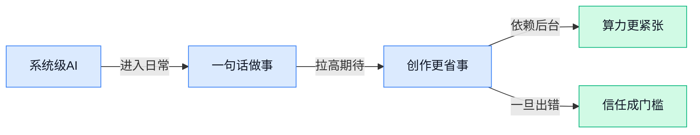
```mermaid
graph LR
A[系统级AI] -->|进入日常| B[一句话做事]
B -->|拉高期待| C[创作更省事]
C -->|依赖后台| D[算力更紧张]
C -->|一旦出错| E[信任成门槛]

classDef blue fill:#dbeafe,stroke:#3b82f6,color:#111827
classDef green fill:#d1fae5,stroke:#10b981,color:#111827
class A,B,C blue
class D,E green
```

### 📊 行业洞察（今日 4 条）

1. Apple 一天内同时推 Siri 大改版、Shortcuts（苹果自动化快捷指令工具）可用文字生成流程、Core AI（苹果给开发者接入 AI 的系统工具箱）
  【洞察】这几件事放一起看，AI 入口正从独立聊天框变成系统默认能力；谁能嵌进用户日常动作里，谁才更可能长期留住人

2. Apple 一边找 Google 和英伟达补模型与算力，一边被路透点名要靠 Siri 修复 AI 短板；Applied Digital 又签下 52 亿美元数据中心大单
  【洞察】大厂现在是“两线作战”：前台拼体验，后台拼资源；没有稳定算力和合作网络，产品野心很容易变成发布会口号

3. OpenSkill、Socratic-SWE、CORE 都在讲“边做边复盘、越干越熟”，但 SubtleMemory 和 GENEB 又在提醒记忆和评测并不可靠
  【洞察】行业开始追求“会成长的 AI”，但现实是先别急着神化，很多能力还停留在研究里，离稳定商用还有明显距离

4. Meta 披露 Instagram 的 AI 聊天机器人漏洞影响超 2 万账号，Apple 在 WWDC 又高调强调儿童安全与更个人化 AI
  【洞察】安全和信任已经不是附加分，而是 AI 产品的准入门槛；越靠近个人数据和日常操作，出一次事故的代价就越大

### 💭 对我们的启发（今日 3 条）

1. Apple 把 AI 做进系统流程和相册编辑，说明用户会越来越习惯“一句话出结果”。我们的视频剪辑软件要少让用户搭步骤，多直接给成片和可修改草稿。

2. Applied Digital 的大额数据中心租约、Apple 联手 Google 和英伟达，说明算力不会一直便宜。我们得把高成本生成留给关键环节，普通剪辑优先走轻量方案，守住毛利。

3. Meta 的漏洞提醒很直接：如果我们的工具会接素材库、账号、客户资料，就必须把人工确认、操作留痕、权限分层做前面，不然越智能越难被品牌商信任。

