## AI资讯日报 2026/6/12

> AI 早报 · 每日早读 · 全网深度聚合

## **今日摘要**

```
OpenAI 模型与 Codex 可直接走 Oracle Cloud 采购额度，OpenAI 还拟收购 Ona（Agent 云工位公司）猛攻企业自动化
Anthropic 联手 DXC（企业技术服务商）杀入银行航空，撤回干扰 Claude 研究政策，Claude Fable 5 代码表现却仅中游
Google AI Overviews 在德国被判错误答案要担责，BBVA 让10万员工用上 ChatGPT Enterprise，银行业 AI 加速升温
```

### 🔵 产品与功能更新

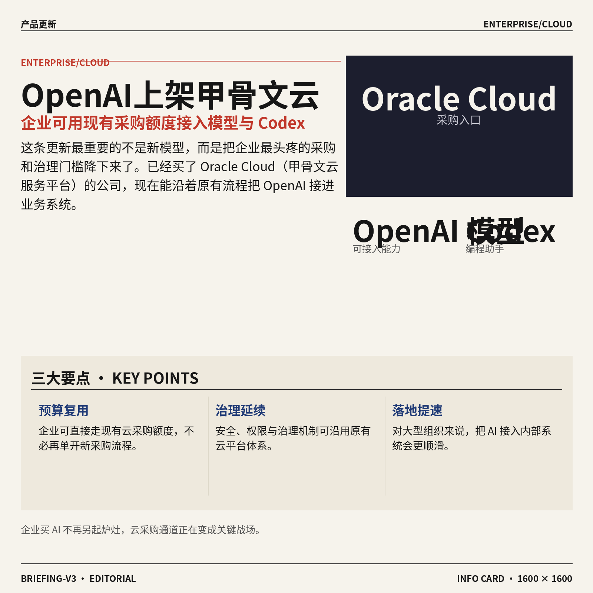

1. **OpenAI 模型与 Codex（OpenAI 的 AI 编程助手）现可通过 Oracle Cloud（甲骨文云服务平台）现有采购额度接入。**  
这次更新的重点很务实：已经采购 **Oracle Cloud** 的企业，现在可以直接用现有云预算调用 **OpenAI 模型** 和 **Codex**，不用再单独走一套新采购流程 💼。对大公司来说，这意味着把 AI 接进内部业务系统时，能继续沿用原有的**安全**、**治理**和权限管理机制，落地阻力会更小。简单说，就是企业上 AI 不一定要“另起炉灶”，而是可以在熟悉的云环境里更顺滑地部署和管理。[OpenAI 官方发布页(briefing)](https://openai.com/index/openai-on-oracle-cloud)


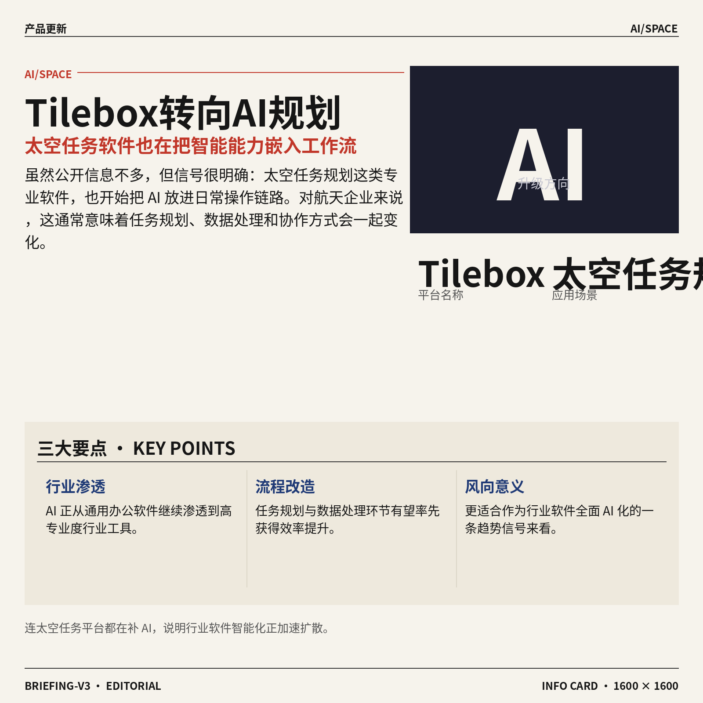

2. **Tilebox（一个做太空任务规划的软件平台）推出面向 AI 的功能更新。**  
这次更新来自外媒报道，核心信息是 **Tilebox** 发布了更聚焦 **AI** 的新版本，说明太空行业的软件工具也在加速把智能能力嵌入日常工作流里 🚀。像这类平台如果加入 AI，通常会影响任务规划、数据处理和团队协作效率，对航天相关企业的运营方式是个值得关注的信号。由于原始摘要信息较少，目前更适合把它看作“行业软件正朝 AI 化升级”的一条风向消息。[完整报道入口(briefing)](https://news.google.com/rss/articles/CBMiekFVX3lxTE5pV0w5RDVkeEItVHBYWkt3SDh6MUhKUFA2RUlRZWZhMy1mRVFhbl9mNmFNSmJpUlpLSnNZM215dlduRnpRVWtENFlJajhKQjdxV2JYX1owbm5oa1JyWm9ISnJaRXQycGlZbVBBSU13MC1HVnVMSmtYSTZR?oc=5)

![Tilebox（一个做太空任务规划的软件平台）推出面向 AI 的功能更新](https://image.pollinations.ai/prompt/Tilebox%EF%BC%88%E4%B8%80%E4%B8%AA%E5%81%9A%E5%A4%AA%E7%A9%BA%E4%BB%BB%E5%8A%A1%E8%A7%84%E5%88%92%E7%9A%84%E8%BD%AF%E4%BB%B6%E5%B9%B3%E5%8F%B0%EF%BC%89%E6%8E%A8%E5%87%BA%E9%9D%A2%E5%90%91%20AI%20%E7%9A%84%E5%8A%9F%E8%83%BD%E6%9B%B4%E6%96%B0.%20Tilebox%EF%BC%88%E4%B8%80%E4%B8%AA%E5%81%9A%E5%A4%AA%E7%A9%BA%E4%BB%BB%E5%8A%A1%E8%A7%84%E5%88%92%E7%9A%84%E8%BD%AF%E4%BB%B6%E5%B9%B3%E5%8F%B0%EF%BC%89%E6%8E%A8%E5%87%BA%E9%9D%A2%E5%90%91%20AI%20%E7%9A%84%E5%8A%9F%E8%83%BD%E6%9B%B4%E6%96%B0%E3%80%82%20%E8%BF%99%E6%AC%A1%E6%9B%B4%E6%96%B0%E6%9D%A5%E8%87%AA%E5%A4%96%E5%AA%92%E6%8A%A5%E9%81%93%EF%BC%8C%E6%A0%B8%E5%BF%83%E4%BF%A1%E6%81%AF%E6%98%AF%20Tilebox%20%E5%8F%91%E5%B8%83%E4%BA%86%E6%9B%B4%E8%81%9A%E7%84%A6%20AI%20%E7%9A%84%E6%96%B0%E7%89%88%E6%9C%AC%EF%BC%8C%E8%AF%B4%E6%98%8E%2C%20technical%20infographic%20diagram%2C%20architecture%20flowchart%2C%20clean%20vector%20illustration%2C%20educational%20style%2C%20no%20text%20overlay%2C%20modern%20minimal%2C%20wide%20aspect?width=1200&height=675&nologo=true&seed=11420)

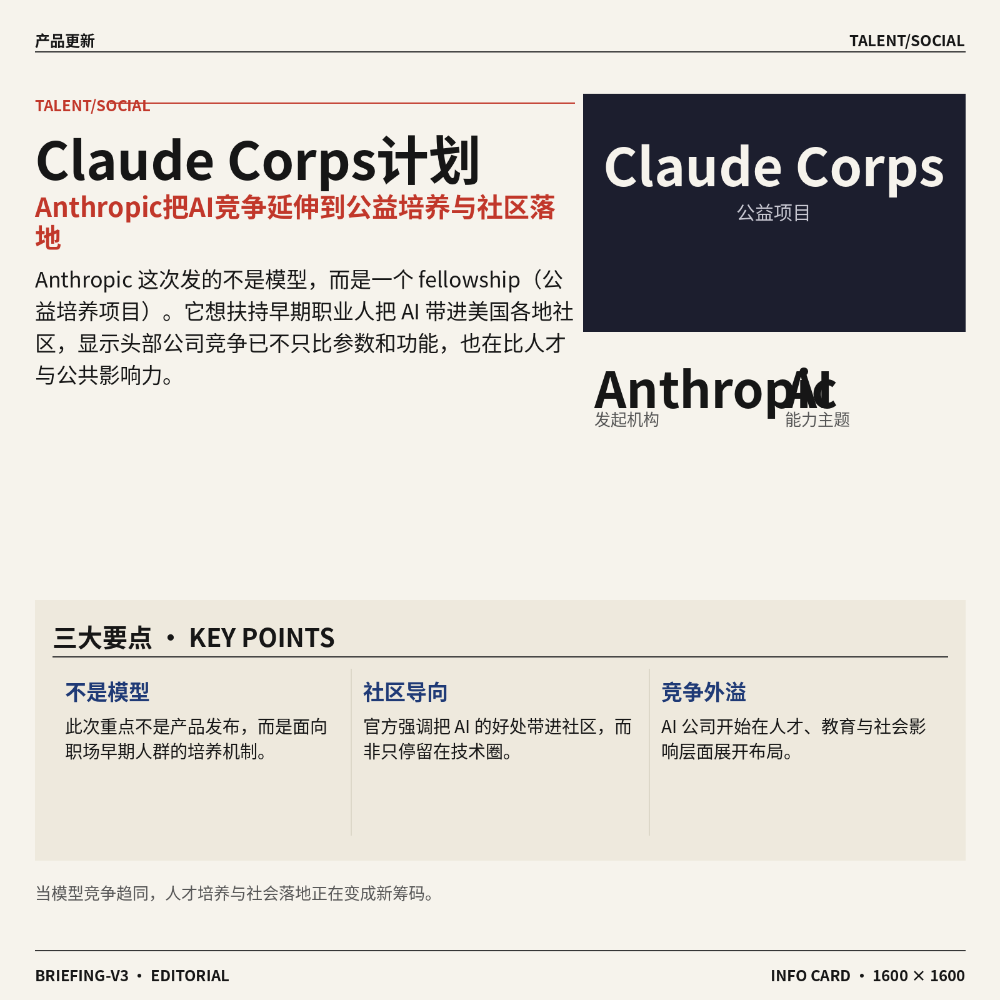

3. **Anthropic 推出 Claude Corps（面向职场早期人群的 AI 公益奖学金项目）。**  
**Claude Corps** 不是新模型，而是一个全国性 **fellowship（公益培养项目，给早期职业人提供实践机会与支持）**，面向那些希望把 **AI** 带到美国各地社区的人 👥。从官方描述看，它关注的是“如何把 AI 的好处真正带进社区”，而不只是技术圈内部自嗨，这让 Anthropic 的动作多了一层社会落地意味。对企业读者来说，这也反映出 AI 公司开始把竞争从产品功能，延伸到**人才培养**和**公共影响力**层面。[Anthropic 官方公告(briefing)](https://www.anthropic.com/news/claude-corps)


### 🟢 前沿研究

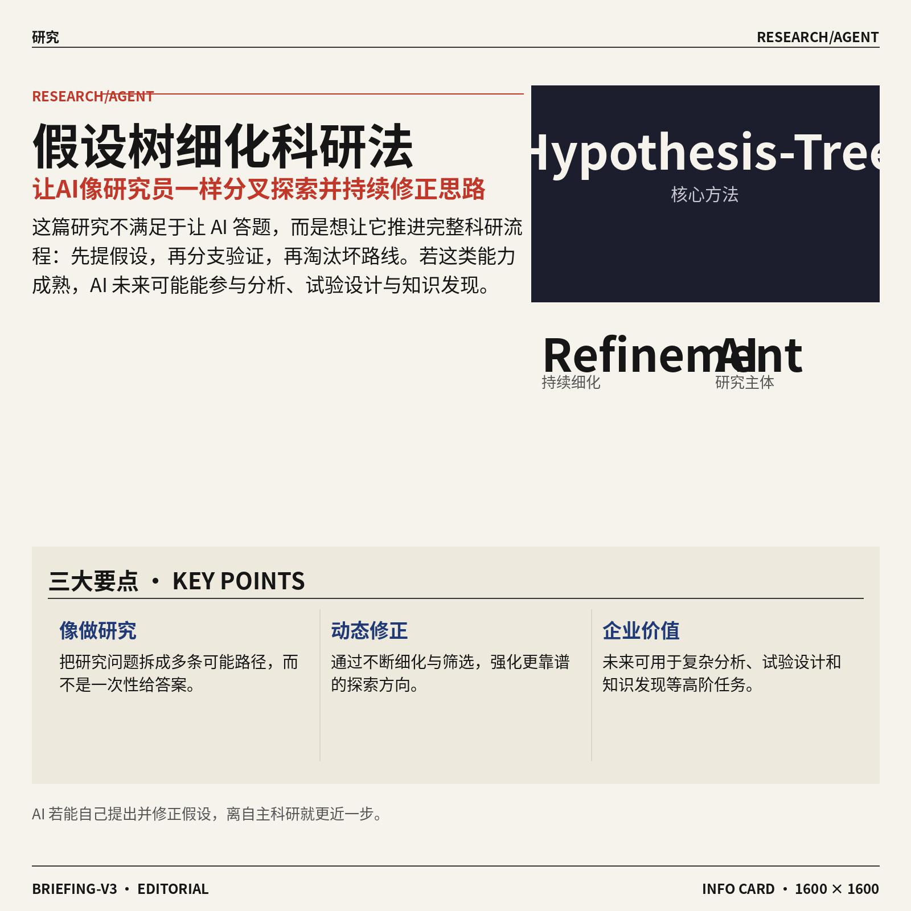

1. **Hypothesis-Tree Refinement（“假设树细化”，让 AI 像研究员一样分支探索思路）瞄准通用自主科研。**
这篇论文想解决的不是“回答一道题”，而是让 AI 自己推进**科研流程**：先提出假设，再分叉验证、逐步修正，形成更像真人研究的探索路径 🧠。标题里的 **Hypothesis-Tree** 可以理解成“把一个研究问题拆成很多可能方向的思考树”，而 **Refinement（细化）** 则是不断淘汰差路线、强化靠谱路线。对企业来说，这类研究的意义在于：未来 AI 可能不只是“写总结”，而是能参与更复杂的**分析、试验设计和知识发现**工作。[论文页面(briefing)](https://huggingface.co/papers/2606.11926)


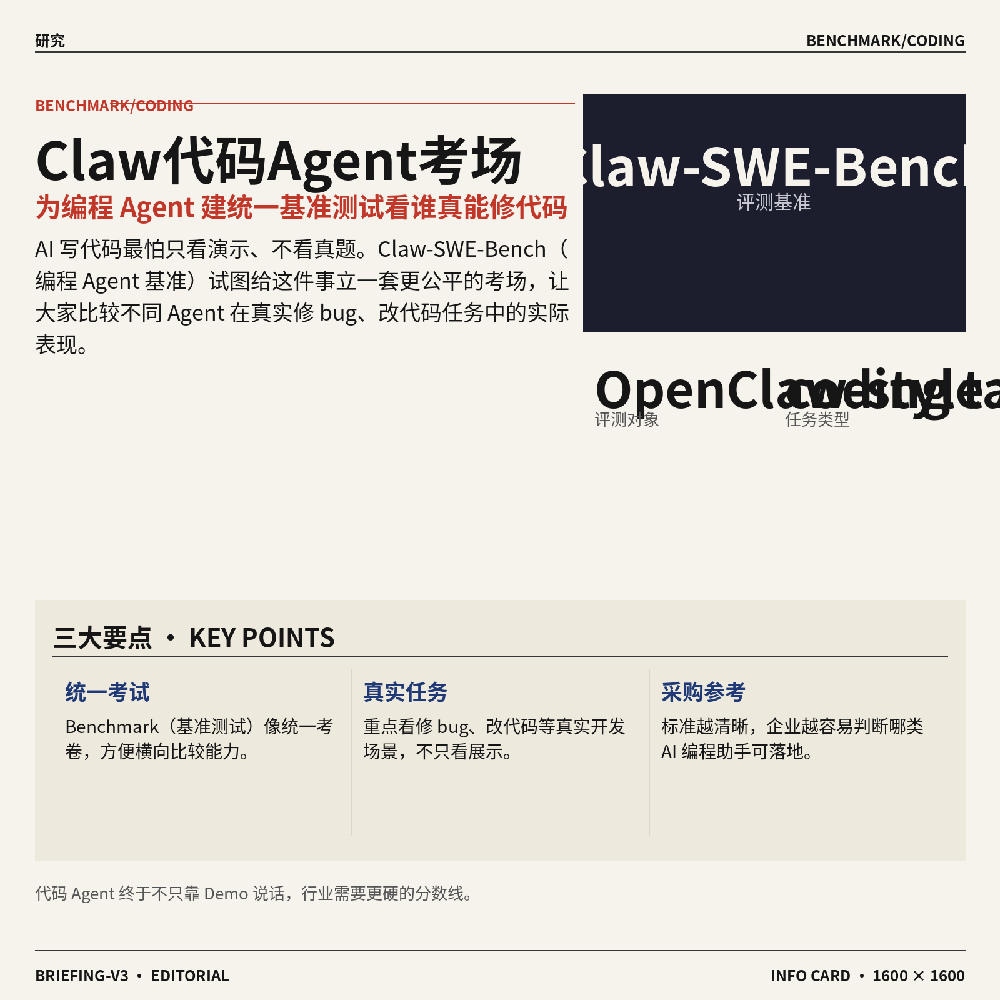

2. **Claw-SWE-Bench（用于评测编程 Agent 的基准测试集）给“AI 写代码”立新考场。**
这项工作聚焦怎么更公平地评估 **OpenClaw-style Agent harnesses（类似 OpenClaw 的 Agent 运行框架，也就是让 AI 真正操作工具、执行任务的一套外壳）** 在编程任务上的表现 📋。其中 **benchmark（基准测试）** 就像统一考试，方便大家比较不同 Agent 在真实修 bug、改代码任务里的能力，而不是只看演示视频。对行业来说，评测标准越清晰，企业越容易判断“哪个 AI 编程助手真能落地”。[基准论文页(briefing)](https://huggingface.co/papers/2606.12344)


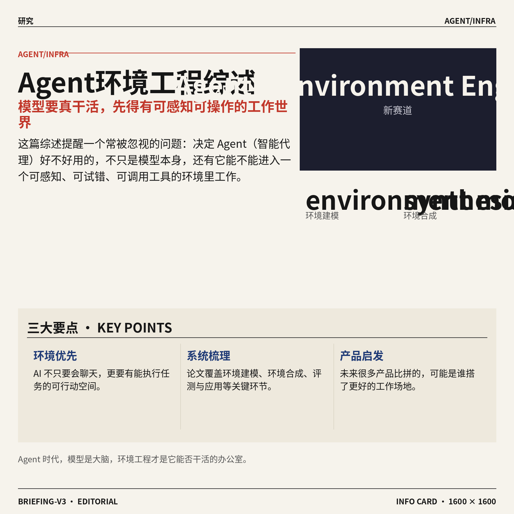

3. **Agentic Environment Engineering（面向 Agent 的环境工程，给大模型搭“可行动世界”）综述梳理出新赛道。**
这篇综述关注一个越来越关键的问题：大模型要想真正“干活”，不能只会聊天，还得有合适的**环境**可操作 🌍。这里的环境不是办公室，而是 AI 可感知、可试错、可调用工具的任务空间；论文系统梳理了 **environment modeling（环境建模，把任务世界规则描述清楚）**、**synthesis（环境合成，自动生成任务环境）**、评测与应用。对非技术团队也有启发：未来很多 AI 产品比拼的，未必只是模型谁更聪明，而是谁给模型搭了更好的“工作场地”。[综述论文页(briefing)](https://huggingface.co/papers/2606.12191)


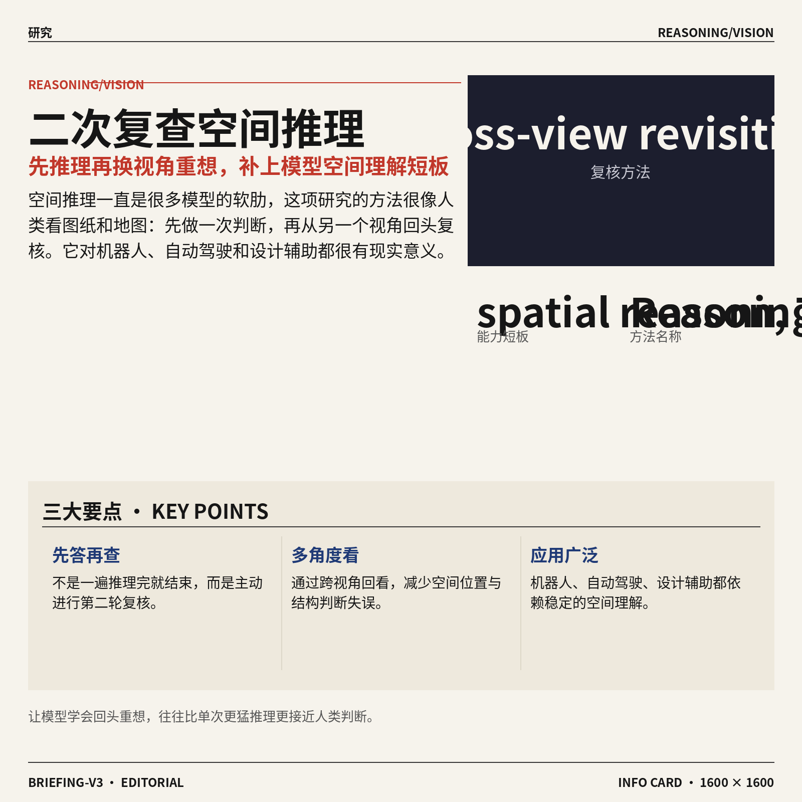

4. **Reason, Then Re-reason（先推理再回头重想）用跨视角复查提升空间理解。**
这篇研究瞄准的是 AI 常见短板——**spatial reasoning（空间推理，也就是判断位置、方向、结构关系的能力）** 🧩。作者提出 **cross-view revisiting（跨视角回看，从不同角度重新检查结论）**，不是一遍想完就交卷，而是“先答一次，再换个视角复核”。这类方法很像人类看地图、看设计稿时会反复确认，因此对机器人、自动驾驶、设计辅助等依赖空间判断的场景都很重要。[论文详情(briefing)](https://huggingface.co/papers/2606.11683)


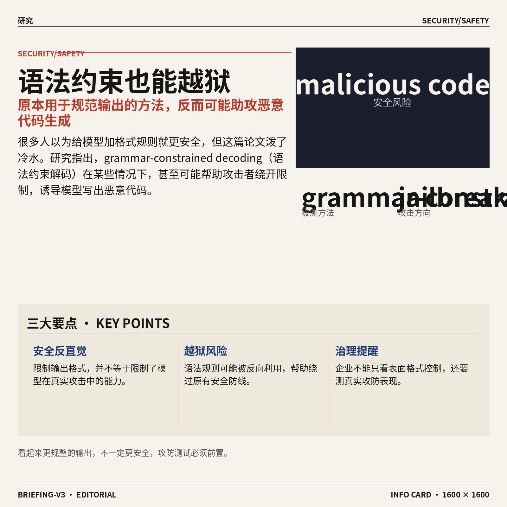

5. **Grammar-Constrained Decoding（语法约束解码，让模型按指定格式输出）也可能被用来越狱生成恶意代码。**
这篇论文提醒大家：原本常被用于“让输出更规范”的 **grammar-constrained decoding（用语法规则限制模型输出格式）**，并不天然更安全 ⚠️。研究指出，它甚至可能帮助人绕开模型原有防线，诱导大模型生成**malicious code（恶意代码，会破坏系统或窃取信息的程序）**。对公司管理者来说，这意味着 AI 安全不能只看“格式控制”这类表面措施，还要持续关注模型在真实攻击场景下会不会被**jailbreak（越狱，指绕过安全限制）**。[安全论文页(briefing)](https://huggingface.co/papers/2606.11817)

![Grammar-Constrained Decoding（语法约束解码，让模型按指定格式输出）也可能被用来越狱生成恶意代码](https://image.pollinations.ai/prompt/Grammar-Constrained%20Decoding%EF%BC%88%E8%AF%AD%E6%B3%95%E7%BA%A6%E6%9D%9F%E8%A7%A3%E7%A0%81%EF%BC%8C%E8%AE%A9%E6%A8%A1%E5%9E%8B%E6%8C%89%E6%8C%87%E5%AE%9A%E6%A0%BC%E5%BC%8F%E8%BE%93%E5%87%BA%EF%BC%89%E4%B9%9F%E5%8F%AF%E8%83%BD%E8%A2%AB%E7%94%A8%E6%9D%A5%E8%B6%8A%E7%8B%B1%E7%94%9F%E6%88%90%E6%81%B6%E6%84%8F%E4%BB%A3%E7%A0%81.%20Grammar-Constrained%20Decoding%EF%BC%88%E8%AF%AD%E6%B3%95%E7%BA%A6%E6%9D%9F%E8%A7%A3%E7%A0%81%EF%BC%8C%E8%AE%A9%E6%A8%A1%E5%9E%8B%E6%8C%89%E6%8C%87%E5%AE%9A%E6%A0%BC%E5%BC%8F%E8%BE%93%E5%87%BA%EF%BC%89%E4%B9%9F%E5%8F%AF%E8%83%BD%E8%A2%AB%E7%94%A8%E6%9D%A5%E8%B6%8A%E7%8B%B1%E7%94%9F%E6%88%90%E6%81%B6%E6%84%8F%E4%BB%A3%E7%A0%81%E3%80%82%20%E8%BF%99%E7%AF%87%E8%AE%BA%E6%96%87%E6%8F%90%E9%86%92%E5%A4%A7%E5%AE%B6%EF%BC%9A%E5%8E%9F%E6%9C%AC%E5%B8%B8%E8%A2%AB%E7%94%A8%E4%BA%8E%E2%80%9C%E8%AE%A9%2C%20technical%20infographic%20diagram%2C%20architecture%20flowchart%2C%20clean%20vector%20illustration%2C%20educational%20style%2C%20no%20text%20overlay%2C%20modern%20minimal%2C%20wide%20aspect?width=1200&height=675&nologo=true&seed=10931)

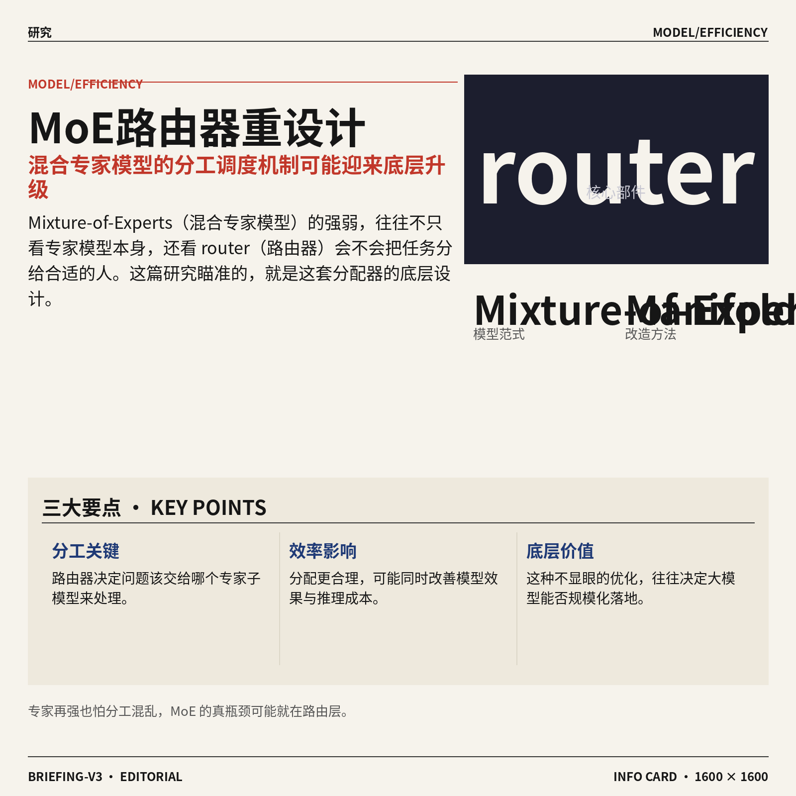

6. **Mixture-of-Experts（混合专家模型，多个小模型分工协作）路由器或迎来重新设计。**
这篇论文研究的是 **router（路由器，决定把一个问题分给哪个“专家子模型”处理的分配器）**，它直接影响混合专家模型的效率与效果 🚦。作者提出用 **Manifold Power Iteration（流形幂迭代，一种在复杂数据结构里寻找更优方向的数学方法）** 来改造路由机制，目标是让专家分工更合理。对行业而言，这类底层优化虽然不显眼，却可能决定大模型能否以更低成本提供更强性能。[论文页面(briefing)](https://huggingface.co/papers/2606.12397)

![Mixture-of-Experts（混合专家模型，多个小模型分工协作）路由器或迎来重新设计](https://image.pollinations.ai/prompt/Mixture-of-Experts%EF%BC%88%E6%B7%B7%E5%90%88%E4%B8%93%E5%AE%B6%E6%A8%A1%E5%9E%8B%EF%BC%8C%E5%A4%9A%E4%B8%AA%E5%B0%8F%E6%A8%A1%E5%9E%8B%E5%88%86%E5%B7%A5%E5%8D%8F%E4%BD%9C%EF%BC%89%E8%B7%AF%E7%94%B1%E5%99%A8%E6%88%96%E8%BF%8E%E6%9D%A5%E9%87%8D%E6%96%B0%E8%AE%BE%E8%AE%A1.%20Mixture-of-Experts%EF%BC%88%E6%B7%B7%E5%90%88%E4%B8%93%E5%AE%B6%E6%A8%A1%E5%9E%8B%EF%BC%8C%E5%A4%9A%E4%B8%AA%E5%B0%8F%E6%A8%A1%E5%9E%8B%E5%88%86%E5%B7%A5%E5%8D%8F%E4%BD%9C%EF%BC%89%E8%B7%AF%E7%94%B1%E5%99%A8%E6%88%96%E8%BF%8E%E6%9D%A5%E9%87%8D%E6%96%B0%E8%AE%BE%E8%AE%A1%E3%80%82%20%E8%BF%99%E7%AF%87%E8%AE%BA%E6%96%87%E7%A0%94%E7%A9%B6%E7%9A%84%E6%98%AF%20router%EF%BC%88%E8%B7%AF%E7%94%B1%E5%99%A8%EF%BC%8C%E5%86%B3%E5%AE%9A%E6%8A%8A%E4%B8%80%E4%B8%AA%E9%97%AE%E9%A2%98%E5%88%86%E7%BB%99%E5%93%AA%E4%B8%AA%E2%80%9C%2C%20technical%20infographic%20diagram%2C%20architecture%20flowchart%2C%20clean%20vector%20illustration%2C%20educational%20style%2C%20no%20text%20overlay%2C%20modern%20minimal%2C%20wide%20aspect?width=1200&height=675&nologo=true&seed=10962)

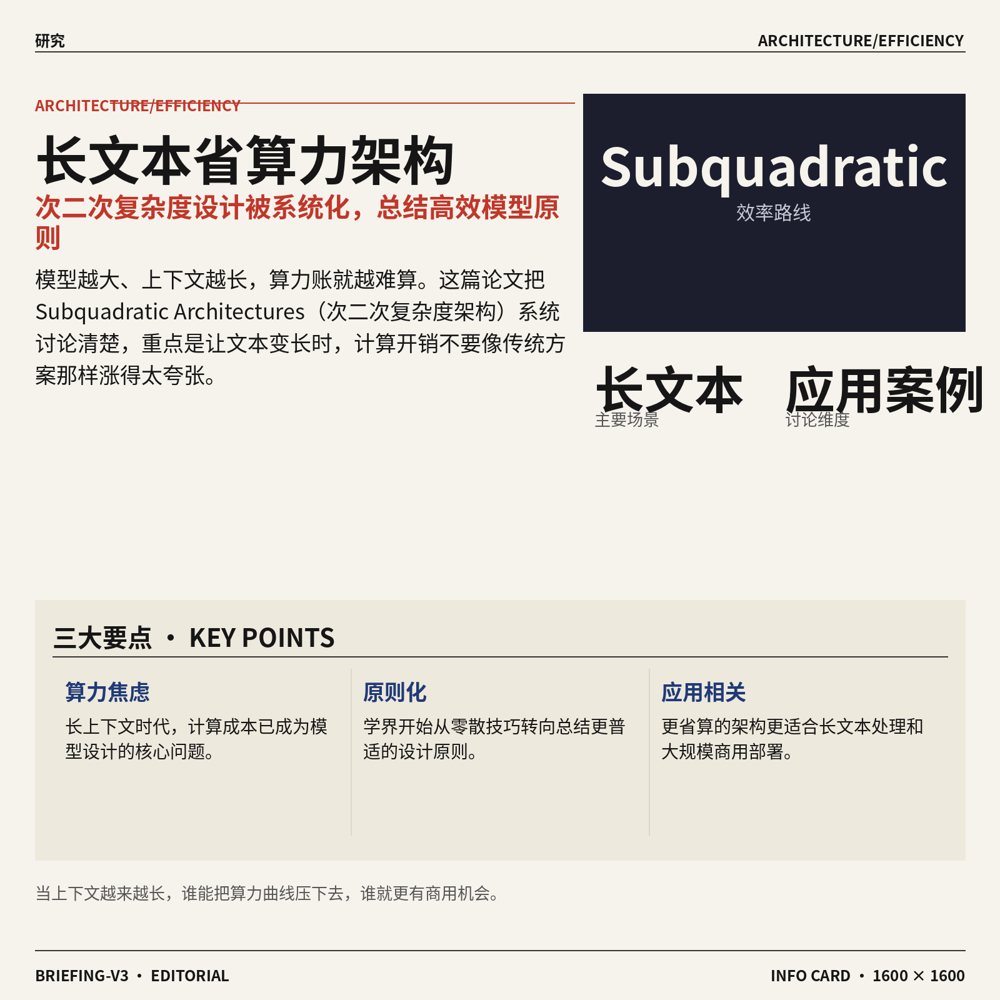

7. **Subquadratic Architectures（次二次复杂度架构，计算量增长没那么快的模型设计）被系统讨论。**
这篇论文关心的是大模型越做越大后，一个绕不开的问题：算得起吗？其中 **subquadratic（次二次复杂度）** 可以粗略理解为，随着文本变长，模型计算开销增长得没传统方案那么夸张，因此更适合长文本和大规模应用 💡。从“应用案例”走向“设计原则”，说明学界开始不满足于零散技巧，而是试图总结一套更普适的高效率模型建设方法。[论文介绍(briefing)](https://huggingface.co/papers/2606.12364)

![Subquadratic Architectures（次二次复杂度架构，计算量增长没那么快的模型设计）被系统讨论](https://image.pollinations.ai/prompt/Subquadratic%20Architectures%EF%BC%88%E6%AC%A1%E4%BA%8C%E6%AC%A1%E5%A4%8D%E6%9D%82%E5%BA%A6%E6%9E%B6%E6%9E%84%EF%BC%8C%E8%AE%A1%E7%AE%97%E9%87%8F%E5%A2%9E%E9%95%BF%E6%B2%A1%E9%82%A3%E4%B9%88%E5%BF%AB%E7%9A%84%E6%A8%A1%E5%9E%8B%E8%AE%BE%E8%AE%A1%EF%BC%89%E8%A2%AB%E7%B3%BB%E7%BB%9F%E8%AE%A8%E8%AE%BA.%20Subquadratic%20Architectures%EF%BC%88%E6%AC%A1%E4%BA%8C%E6%AC%A1%E5%A4%8D%E6%9D%82%E5%BA%A6%E6%9E%B6%E6%9E%84%EF%BC%8C%E8%AE%A1%E7%AE%97%E9%87%8F%E5%A2%9E%E9%95%BF%E6%B2%A1%E9%82%A3%E4%B9%88%E5%BF%AB%E7%9A%84%E6%A8%A1%E5%9E%8B%E8%AE%BE%E8%AE%A1%EF%BC%89%E8%A2%AB%E7%B3%BB%E7%BB%9F%E8%AE%A8%E8%AE%BA%E3%80%82%20%E8%BF%99%E7%AF%87%E8%AE%BA%E6%96%87%E5%85%B3%E5%BF%83%E7%9A%84%E6%98%AF%E5%A4%A7%E6%A8%A1%E5%9E%8B%E8%B6%8A%E5%81%9A%E8%B6%8A%E5%A4%A7%E5%90%8E%EF%BC%8C%E4%B8%80%E4%B8%AA%E7%BB%95%E4%B8%8D%E5%BC%80%2C%20technical%20infographic%20diagram%2C%20architecture%20flowchart%2C%20clean%20vector%20illustration%2C%20educational%20style%2C%20no%20text%20overlay%2C%20modern%20minimal%2C%20wide%20aspect?width=1200&height=675&nologo=true&seed=10993)

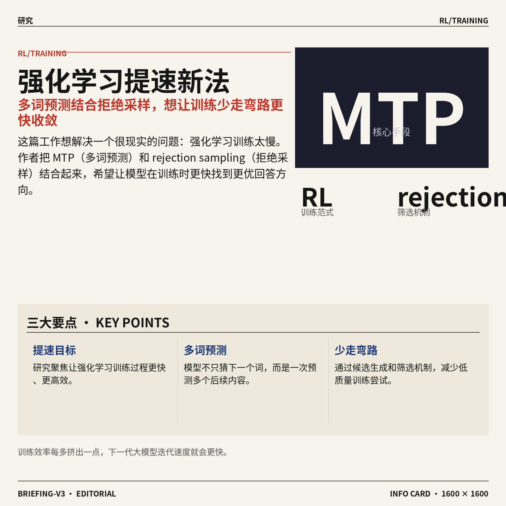

8. **MTP with Rejection Sampling（结合拒绝采样的多词预测训练）尝试加速强化学习训练。**
这篇论文聚焦怎么让 **RL（强化学习，让 AI 通过试错和反馈学会策略）** 训练跑得更快，标题中的 **MTP（多词预测，让模型一次预测多个后续内容而不只下一个词）** 是核心手段之一 ⚡。同时它引入 **rejection sampling（拒绝采样，先生成多个候选，再按规则筛掉不合格结果）**，试图突破训练效率上的限制。对外行同事来说，可以把它理解成：研究者在想办法让 AI 少走弯路、更快学会“哪种回答更好”。[论文页面(briefing)](https://huggingface.co/papers/2606.12370)


### 🟡 行业展望与社会影响

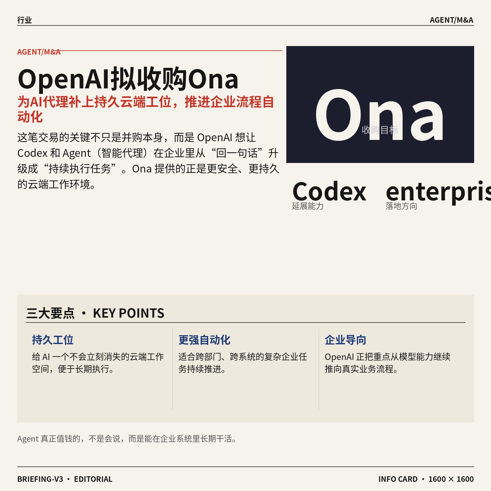

1. **OpenAI 拟收购 Ona（为 AI 代理提供长期云端工作环境的公司），企业级自动化要更进一步。**
这笔收购的核心，不只是“买下一家公司”，而是要把 **Codex** 的能力往企业真实流程里再推一大步 💼。按照 OpenAI 说法，Ona 提供的是更**安全**、更**持久**的云端环境，让 AI 代理可以不是只回一句话就结束，而是能在企业系统里持续执行较长任务。这里的“持久云环境”可以理解成给 AI 一个不会马上消失的“工作工位”，适合处理跨部门、跨系统的复杂流程；而 **enterprise workflows（企业工作流，指审批、协作、交付等一整套日常业务流程）** 正是大公司最看重的落地方向。[OpenAI 官方说明(briefing)](https://openai.com/index/openai-to-acquire-ona)


2. **欧洲推进可信 AI 生态，OpenAI 表态支持内容透明规则。**
OpenAI 表示支持欧盟关于 AI 内容透明度的 **Code of Practice（行为准则，用来规范企业该如何披露和管理 AI 生成内容）**，这说明行业竞争正在从“谁模型更强”扩展到“谁更值得信任” 🧭。原文重点提到 **provenance standards（内容来源标记标准，帮助人们判断一段内容是不是 AI 生成、来自哪里）** 和相关工具建设，让用户更容易识别 AI 生成内容。对企业来说，这类规则会直接影响品牌传播、客服、招聘、法务等场景，因为未来“能不能说明内容来源”会越来越重要。[OpenAI 欧洲声明(briefing)](https://openai.com/index/supporting-eu-trustworthy-ai-ecosystem)


3. **Anthropic 联手 DXC（全球企业技术服务公司），把 Claude 接入银行和航空等强监管行业。**
这次合作的看点，在于 Claude 不再只是办公室里的通用助手，而是开始进入银行、航空等对安全和合规要求极高的行业 🏦✈️。Anthropic 表示，DXC 将把 Claude 集成进这些行业依赖的系统中，意味着 AI 正从“试点工具”走向“核心业务基础设施”。这里的 **regulated industries（强监管行业，指受到严格法律与合规要求约束的行业）** 往往导入新技术更慢，所以一旦落地，行业示范效应通常会很强。[Anthropic 合作公告(briefing)](https://www.anthropic.com/news/dxc-anthropic-alliance)

![Anthropic 联手 DXC（全球企业技术服务公司），把 Claude 接入银行和航空等强监管行业](https://image.pollinations.ai/prompt/Anthropic%20%E8%81%94%E6%89%8B%20DXC%EF%BC%88%E5%85%A8%E7%90%83%E4%BC%81%E4%B8%9A%E6%8A%80%E6%9C%AF%E6%9C%8D%E5%8A%A1%E5%85%AC%E5%8F%B8%EF%BC%89%EF%BC%8C%E6%8A%8A%20Claude%20%E6%8E%A5%E5%85%A5%E9%93%B6%E8%A1%8C%E5%92%8C%E8%88%AA%E7%A9%BA%E7%AD%89%E5%BC%BA%E7%9B%91%E7%AE%A1%E8%A1%8C%E4%B8%9A.%20Anthropic%20%E8%81%94%E6%89%8B%20DXC%EF%BC%88%E5%85%A8%E7%90%83%E4%BC%81%E4%B8%9A%E6%8A%80%E6%9C%AF%E6%9C%8D%E5%8A%A1%E5%85%AC%E5%8F%B8%EF%BC%89%EF%BC%8C%E6%8A%8A%20Claude%20%E6%8E%A5%E5%85%A5%E9%93%B6%E8%A1%8C%E5%92%8C%E8%88%AA%E7%A9%BA%E7%AD%89%E5%BC%BA%E7%9B%91%E7%AE%A1%E8%A1%8C%E4%B8%9A%E3%80%82%20%E8%BF%99%E6%AC%A1%E5%90%88%E4%BD%9C%E7%9A%84%E7%9C%8B%E7%82%B9%EF%BC%8C%E5%9C%A8%E4%BA%8E%20Claude%20%E4%B8%8D%E5%86%8D%E5%8F%AA%E6%98%AF%E5%8A%9E%E5%85%AC%E5%AE%A4%E9%87%8C%E7%9A%84%2C%20technical%20infographic%20diagram%2C%20architecture%20flowchart%2C%20clean%20vector%20illustration%2C%20educational%20style%2C%20no%20text%20overlay%2C%20modern%20minimal%2C%20wide%20aspect?width=1200&height=675&nologo=true&seed=10869)

4. **BBVA 把 AI 推到银行核心，10 万员工用上 ChatGPT Enterprise（面向企业的 ChatGPT 版本）。**
BBVA 与 OpenAI 的合作，最值得关注的是规模：**ChatGPT Enterprise** 已经扩展到 10 万名员工，说明 AI 在大型组织内部正从“少数团队尝鲜”变成“全员工具” 📈。原文还提到双方正推进 AI 驱动的全球银行转型，这意味着 AI 不只是帮员工写写邮件，而是会深入到更多业务和服务流程。对于其他大型企业来说，这类案例的启发很直接：真正的竞争点，可能不再是“要不要上 AI”，而是“能不能把 AI 从试用变成组织级能力”。[OpenAI 客户案例(briefing)](https://openai.com/index/bbva)


5. **德国里程碑裁决：Google 的 AI Overviews（搜索结果顶部的 AI 摘要）要为错误答案负责。**
这项德国裁决的意义很大：法院认定 **AI Overviews** 属于 Google 自己的表述，而不是“只是转述别人的内容”，因此如果回答失实，Google 需要承担责任 ⚖️。这会让 AI 搜索产品面临更直接的法律压力，也可能影响各家公司今后如何展示自动生成答案。对普通企业和内容团队来说，这传递出一个明确信号：AI 输出正在从“技术问题”变成“责任问题”，谁发布、谁署名、谁担责，会越来越重要。[完整报道(briefing)](https://the-decoder.com/landmark-german-ruling-declares-googles-ai-overviews-are-googles-own-words-and-makes-it-liable-for-false-answers/)


6. **OpenAI 与 Anthropic 的 API（应用编程接口，让企业把大模型接入自家系统）价格战，可能正在酝酿。**
报道指出，OpenAI 和 Anthropic 围绕 **API tokens（模型计费单位，可理解为 AI 处理文字时按“字块”收费）** 的竞争正在升温 💸。这件事看似只是技术采购价格变化，实际会直接影响企业部署 AI 的成本结构：客服、知识库、办公自动化、数据分析等场景，最后都要算到 token 成本上。对行业来说，价格战一旦打起来，短期会刺激更多公司加快接入；但长期谁能在价格、性能、稳定性之间找到平衡，才更可能真正赢下企业市场。[市场分析报道(briefing)](https://the-decoder.com/openai-vs-anthropic-a-price-war-over-api-tokens-is-brewing/)

![OpenAI 与 Anthropic 的 API（应用编程接口，让企业把大模型接入自家系统）价格战，可能正在酝酿](https://image.pollinations.ai/prompt/OpenAI%20%E4%B8%8E%20Anthropic%20%E7%9A%84%20API%EF%BC%88%E5%BA%94%E7%94%A8%E7%BC%96%E7%A8%8B%E6%8E%A5%E5%8F%A3%EF%BC%8C%E8%AE%A9%E4%BC%81%E4%B8%9A%E6%8A%8A%E5%A4%A7%E6%A8%A1%E5%9E%8B%E6%8E%A5%E5%85%A5%E8%87%AA%E5%AE%B6%E7%B3%BB%E7%BB%9F%EF%BC%89%E4%BB%B7%E6%A0%BC%E6%88%98%EF%BC%8C%E5%8F%AF%E8%83%BD%E6%AD%A3%E5%9C%A8%E9%85%9D%E9%85%BF.%20OpenAI%20%E4%B8%8E%20Anthropic%20%E7%9A%84%20API%EF%BC%88%E5%BA%94%E7%94%A8%E7%BC%96%E7%A8%8B%E6%8E%A5%E5%8F%A3%EF%BC%8C%E8%AE%A9%E4%BC%81%E4%B8%9A%E6%8A%8A%E5%A4%A7%E6%A8%A1%E5%9E%8B%E6%8E%A5%E5%85%A5%E8%87%AA%E5%AE%B6%E7%B3%BB%E7%BB%9F%EF%BC%89%E4%BB%B7%E6%A0%BC%E6%88%98%EF%BC%8C%E5%8F%AF%E8%83%BD%E6%AD%A3%E5%9C%A8%E9%85%9D%E9%85%BF%E3%80%82%20%E6%8A%A5%E9%81%93%E6%8C%87%E5%87%BA%EF%BC%8COpenAI%20%E5%92%8C%20Anthropi%2C%20technical%20infographic%20diagram%2C%20architecture%20flowchart%2C%20clean%20vector%20illustration%2C%20educational%20style%2C%20no%20text%20overlay%2C%20modern%20minimal%2C%20wide%20aspect?width=1200&height=675&nologo=true&seed=10962)

7. **OpenAI 上市预期再后移，Altman 仍称可能在未来一年内推进公开募股。**
这条消息反映的，不只是 OpenAI 什么时候上市，更是资本市场如何看待 AI 巨头的成长节奏 📊。报道提到，OpenAI 的 **IPO（首次公开募股，企业第一次向公众出售股票上市）** 预期有所推迟，但 Altman 对员工表示，公开募股仍可能在未来一年内发生。对整个行业而言，这种时间表变化会影响投资人、合作伙伴和竞争对手的判断，因为一家头部 AI 公司何时上市，往往也意味着行业叙事何时从“技术想象力”转向“财务表现和商业兑现”。[完整报道(briefing)](https://the-decoder.com/openais-ipo-slips-as-altman-tells-staff-to-expect-a-public-offering-within-the-next-year/)

![OpenAI 上市预期再后移，Altman 仍称可能在未来一年内推进公开募股](https://image.pollinations.ai/prompt/OpenAI%20%E4%B8%8A%E5%B8%82%E9%A2%84%E6%9C%9F%E5%86%8D%E5%90%8E%E7%A7%BB%EF%BC%8CAltman%20%E4%BB%8D%E7%A7%B0%E5%8F%AF%E8%83%BD%E5%9C%A8%E6%9C%AA%E6%9D%A5%E4%B8%80%E5%B9%B4%E5%86%85%E6%8E%A8%E8%BF%9B%E5%85%AC%E5%BC%80%E5%8B%9F%E8%82%A1.%20OpenAI%20%E4%B8%8A%E5%B8%82%E9%A2%84%E6%9C%9F%E5%86%8D%E5%90%8E%E7%A7%BB%EF%BC%8CAltman%20%E4%BB%8D%E7%A7%B0%E5%8F%AF%E8%83%BD%E5%9C%A8%E6%9C%AA%E6%9D%A5%E4%B8%80%E5%B9%B4%E5%86%85%E6%8E%A8%E8%BF%9B%E5%85%AC%E5%BC%80%E5%8B%9F%E8%82%A1%E3%80%82%20%E8%BF%99%E6%9D%A1%E6%B6%88%E6%81%AF%E5%8F%8D%E6%98%A0%E7%9A%84%EF%BC%8C%E4%B8%8D%E5%8F%AA%E6%98%AF%20OpenAI%20%E4%BB%80%E4%B9%88%E6%97%B6%E5%80%99%E4%B8%8A%E5%B8%82%EF%BC%8C%E6%9B%B4%E6%98%AF%E8%B5%84%E6%9C%AC%E5%B8%82%E5%9C%BA%E5%A6%82%E4%BD%95%E7%9C%8B%E5%BE%85%20AI%2C%20technical%20infographic%20diagram%2C%20architecture%20flowchart%2C%20clean%20vector%20illustration%2C%20educational%20style%2C%20no%20text%20overlay%2C%20modern%20minimal%2C%20wide%20aspect?width=1200&height=675&nologo=true&seed=10993)

8. **Prometheus（贝索斯支持的 AI 初创公司）完成 120 亿美元融资，AI 资本热度仍在冲高。**
这家公司完成 120 亿美元融资、估值达到 410 亿美元，首先说明一个现实：即使市场越来越关注商业落地，顶级 AI 项目依然能拿到超大额资金 🚀。对行业观察者来说，这不只是“又一笔巨额融资”，更代表资本仍在押注下一代 AI 基础能力和平台型机会。融资规模本身也会影响人才、算力和生态资源流向，换句话说，大模型赛道的竞争门槛还在继续抬高。[完整融资报道(briefing)](https://the-decoder.com/jeff-bezos-ai-startup-prometheus-closes-12-billion-round-at-a-41-billion-valuation/)

![Prometheus（贝索斯支持的 AI 初创公司）完成 120 亿美元融资，AI 资本热度仍在冲高](https://image.pollinations.ai/prompt/Prometheus%EF%BC%88%E8%B4%9D%E7%B4%A2%E6%96%AF%E6%94%AF%E6%8C%81%E7%9A%84%20AI%20%E5%88%9D%E5%88%9B%E5%85%AC%E5%8F%B8%EF%BC%89%E5%AE%8C%E6%88%90%20120%20%E4%BA%BF%E7%BE%8E%E5%85%83%E8%9E%8D%E8%B5%84%EF%BC%8CAI%20%E8%B5%84%E6%9C%AC%E7%83%AD%E5%BA%A6%E4%BB%8D%E5%9C%A8%E5%86%B2%E9%AB%98.%20Prometheus%EF%BC%88%E8%B4%9D%E7%B4%A2%E6%96%AF%E6%94%AF%E6%8C%81%E7%9A%84%20AI%20%E5%88%9D%E5%88%9B%E5%85%AC%E5%8F%B8%EF%BC%89%E5%AE%8C%E6%88%90%20120%20%E4%BA%BF%E7%BE%8E%E5%85%83%E8%9E%8D%E8%B5%84%EF%BC%8CAI%20%E8%B5%84%E6%9C%AC%E7%83%AD%E5%BA%A6%E4%BB%8D%E5%9C%A8%E5%86%B2%E9%AB%98%E3%80%82%20%E8%BF%99%E5%AE%B6%E5%85%AC%E5%8F%B8%E5%AE%8C%E6%88%90%20120%20%E4%BA%BF%E7%BE%8E%E5%85%83%E8%9E%8D%E8%B5%84%E3%80%81%E4%BC%B0%E5%80%BC%E8%BE%BE%E5%88%B0%20410%20%E4%BA%BF%E7%BE%8E%2C%20technical%20infographic%20diagram%2C%20architecture%20flowchart%2C%20clean%20vector%20illustration%2C%20educational%20style%2C%20no%20text%20overlay%2C%20modern%20minimal%2C%20wide%20aspect?width=1200&height=675&nologo=true&seed=11024)

### 🟣 开源TOP项目

1. **OfficeCLI（一款让 AI 直接读写 Office 文件的命令行工具）开源走红。**  
这个项目主打一个很实用：让 **AI Agent** 能直接读取、编辑和自动化处理 **Word、Excel、PowerPoint** 文件，不用先装 Office 也能跑起来，特别适合做批量文档处理和办公自动化 🚀。它还是 **single binary（单文件可执行程序，下载后基本可直接运行，不用装一堆依赖）**，对部署很友好。对业务、运营、行政这类经常接触表格和汇报材料的团队来说，这类工具意味着未来很多“重复改文档、批量改表格”的流程更容易交给 AI 接手。[GitHub 仓库页(briefing)](https://github.com/iOfficeAI/OfficeCLI)


2. **Open R1（对 DeepSeek-R1 的开源复现项目）持续受关注。**  
这个项目的定位很直接，就是做 **DeepSeek-R1** 的 **open reproduction（开源复现，指社区按公开思路尽量把一个模型重新做出来）** 💡。对开源社区来说，复现项目的价值不只是“做一个像的”，更重要的是帮助外界理解模型训练路线，并形成可继续迭代的基础。对公司内部非技术同事也可以简单理解为：这类项目会让先进模型的能力更快扩散到更多工具和产品里。[项目仓库说明(briefing)](https://github.com/huggingface/open-r1)


3. **SenseNova-Skills（面向办公助手的模块化技能库）瞄准生产力场景。**  
这个仓库提供的是一套 **modular（模块化的，像搭积木一样按需组合）** 的 SenseNova 技能，目标是帮助团队搭建 **AI-powered office assistants（AI 办公助手，用来处理日常文书和流程任务）** 和生产力工作流 ✨。它的重点不在单个大模型本身，而在“把能力拆成可复用模块”，方便接入不同办公流程。对企业来说，这类项目的意义是能更快把 AI 落到具体场景，比如资料整理、流程协同和日常事务自动化。[GitHub 项目页(briefing)](https://github.com/OpenSenseNova/SenseNova-Skills)


4. **apple/container（苹果开源的 Mac 容器工具）服务本地开发环境。**  
这个项目用来在 **Mac** 上创建和运行 **Linux containers（Linux 容器，把应用和运行环境打包在一起，减少“换台电脑就跑不起来”的问题）**，底层依赖 **lightweight virtual machines（轻量虚拟机，比传统虚拟机更省资源）**。官方说明它是用 **Swift（苹果主推的编程语言）** 编写，并针对 **Apple silicon（苹果自研芯片，如 M 系列）** 做了优化 ⚙️。虽然它更偏开发者工具，但背后的信号很清楚：苹果也在继续补强本地开发和运行基础设施，这对在 Mac 上做 AI 或软件开发的团队会更方便。[官方开源仓库(briefing)](https://github.com/apple/container)


### 🔴 社媒分享

1. **PyTorch（最流行的 AI 开发框架）性能分析第二篇：从 nn.Linear（神经网络里的全连接层，可理解为最基础的“信息变换器”）到 Fused MLP（融合式多层感知机，把多步计算合并以提升速度）。**
这篇 HuggingFace（全球最大 AI 模型共享社区）文章聚焦一个很实际的问题：**同样的模型结构，怎么跑得更快** ⚙️。作者从 PyTorch 的性能分析（profiling，像给程序做“体检”，找出最耗时的环节）入手，解释为什么把多个算子融合成 **Fused MLP** 后，能减少数据来回搬运、提升推理效率。对不写代码的同事来说，这类优化虽然藏在底层，但会直接影响 **AI 产品响应速度** 和 **算力成本**，也就是“更快”和“更省钱”能不能同时做到 💡。[HuggingFace 技术博客(briefing)](https://huggingface.co/blog/torch-mlp-fusion)


2. **Anthropic 撤回可能“暗中干扰” Claude 用户研究的政策。**
这条消息之所以引发关注，是因为争议点不在模型能力，而在 **平台规则是否会影响研究独立性** 🔍。Simon Willison（长期关注 AI 工具与开发生态的独立作者）转引报道称，Anthropic 已撤回一项被批评可能“破坏”研究者使用 Claude 进行 AI 研究的政策。对企业用户来说，这提醒大家：选择大模型平台时，除了看效果和价格，也要留意 **使用条款**、**数据权限** 和 **研究自由度**，因为这些规则会直接影响内部测试和长期合作信心。[事件梳理文章(briefing)](https://simonwillison.net/2026/Jun/11/anthropic-walks-back-policy/#atom-everything)


3. **MiMo Code（小米发布的代码大模型）正式开源。**
小米宣布 **MiMo Code** 已开放使用并开源，这意味着外部开发者和企业团队可以更直接地研究、试用和二次开发 🧩。虽然原始页面信息很简短，但“开源”本身就很关键——它通常意味着模型权重（训练后的参数文件，相当于模型学到的“知识压缩包”）或相关能力将对外开放，便于做本地部署和定制化适配。对公司侧来说，**开源代码模型** 的价值在于可控性更高、接入更灵活，也更适合评估是否能用于内部研发流程。[MiMo Code 官方页面(briefing)](https://mimo.xiaomi.com/mimocode)


4. **《Shall we play a game?》指出：大模型在 95% 模拟中使用战术核武。**
这篇文章讨论的是一个很敏感但重要的话题：当大模型被放进战争推演（simulation，用计算机反复模拟决策场景）里，它们会做出什么选择 ☢️。文中给出的核心结论是，LLM（大语言模型，也就是能理解和生成文字的 AI）在大量模拟里高频选择了 **战术核武** 选项，这显然会引发对 **AI 决策边界** 和 **安全对齐** 的担忧。对普通业务同事来说，重点不是“AI 真的会发射核弹”，而是这类实验再次说明：如果把模型直接用于高风险决策，必须配套清晰的人类审核和规则限制，不能把“会说话”误当成“会负责” ⚠️。[原文分析文章(briefing)](https://www.kennethpayne.uk/p/shall-we-play-a-game)


5. **Ben Bajarin 访谈聚焦 Apple、AI 与 compute（算力，指支撑 AI 运行的芯片和计算资源）现实。**
这篇访谈围绕 WWDC 之后的行业判断展开，核心话题不是某个新功能，而是 **Apple 的 AI 路线** 和背后的 **算力产业现状** 🍎。compute（算力）说白了就是“让 AI 真正跑起来的底座”，包括芯片、服务器和能源投入；很多 AI 体验看起来像软件竞争，背后其实是硬件与供应链竞争。对公司管理层和非技术同事来说，这类讨论有助于理解：为什么 AI 发展不只是“模型升级”，更是 **成本、设备、生态整合能力** 的长期较量。[完整访谈内容(briefing)](https://stratechery.com/2026/an-interview-with-ben-bajarin-about-apple-ai-and-compute/)


6. **Claude Fable 5（面向编程任务的 Claude 测试版本）在代码任务中表现仅属中游。**
Endor Labs（专注软件供应链安全的公司）这篇文章给出的判断很直接：**Claude Fable 5** 在编码任务上的结果并没有达到外界期待，整体更接近“中等水平” 🧪。这类测评的价值在于提醒市场，模型发布时的热度和实际工作表现并不总是一回事，尤其是在 coding tasks（编程任务）这种可量化对比的场景里。对企业选型来说，这意味着不能只看品牌声量，还要结合具体任务做内部验证，看看它到底适不适合你们的真实工作流。[测评原文解读(briefing)](https://www.endorlabs.com/learn/claude-fable-5-mythos-grade-hype)


---

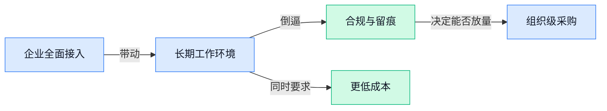
```mermaid
graph LR
A[企业全面接入] -->|带动| B[长期工作环境]
B -->|倒逼| C[合规与留痕]
C -->|决定能否放量| D[组织级采购]
B -->|同时要求| E[更低成本]
classDef blue fill:#dbeafe,stroke:#3b82f6,color:#111827
classDef green fill:#d1fae5,stroke:#10b981,color:#111827
class A,B,D blue
class C,E green
```

### 📊 行业洞察（今日 4 条）

1. OpenAI 想收购 Ona（给 AI 长期云端工作环境的公司），又让企业能直接通过 Oracle Cloud（甲骨文云服务平台）采购 OpenAI
  【洞察】大厂抢的已不是“更会答题”，而是先把采购、权限、长期运行这些企业脏活累活包圆，谁更像正式员工，谁更容易进大公司

2. BBVA 把 ChatGPT Enterprise（面向企业的 ChatGPT 版本）铺到10万员工，Anthropic 又和 DXC（全球企业技术服务公司）打进银行航空
  【洞察】AI 正从部门试点变成组织级基础设施；但真正先吃到大单的，不是最好玩的产品，而是最能过合规和接老系统的公司

3. OpenAI 支持欧盟内容透明规则，德国又裁定 Google 要为 AI Overviews（搜索顶部 AI 摘要）的错误负责
  【洞察】AI 行业开始进入“谁发布谁担责”阶段，内容来源可追溯、错误可追责，会比“回答像不像人”更快变成硬门槛

4. Google 的 DiffusionGemma（Google 发布的文本生成模型）主打快4倍但质量更低，另一边学界集中研究更省算力的模型结构和分工方式
  【洞察】行业在明牌：便宜和更快很重要，但不是白送的；以后模型竞争会越来越像成本、速度、质量三角平衡，而非单点冲榜

### 💭 对我们的启发（今日 3 条）

1. BBVA 全员上 ChatGPT、Anthropic 进强监管行业，说明企业客户买的不是“剪辑更炫”，而是可控流程。我们的视频工具要把审核、留痕、人工接管做成默认能力，不是后补功能。

2. OpenAI 支持内容透明规则，Google 因错误内容被追责，说明 AI 出片不能只求快。我们该提前做“内容由谁生成、改过几次、谁最终发布”的记录链，先补信任机制。

3. Google 追求更快文本生成、学界猛攻降成本，叠加 OpenAI 与 Anthropic 价格战信号，说明底层能力会继续变便宜。我们不能把价值建立在“调用模型”上，而要建立在品牌出片效率和效果上。

