## AI资讯日报 2026/6/14

> AI 早报 · 每日早读 · 全网深度聚合

## **今日摘要**

```
Visa 计划把支付能力接入 OpenAI，AI Agent 离自己下单付款只差最后一公里
特朗普限制外国用户使用 Anthropic 最新 AI，Amazon 曾表担忧，美国审查同步加码
Nebius 跻身 Nasdaq-100，美国 AI 热潮推高亚洲顺差，资本继续豪赌算力基建
```

### 🔵 产品与功能更新

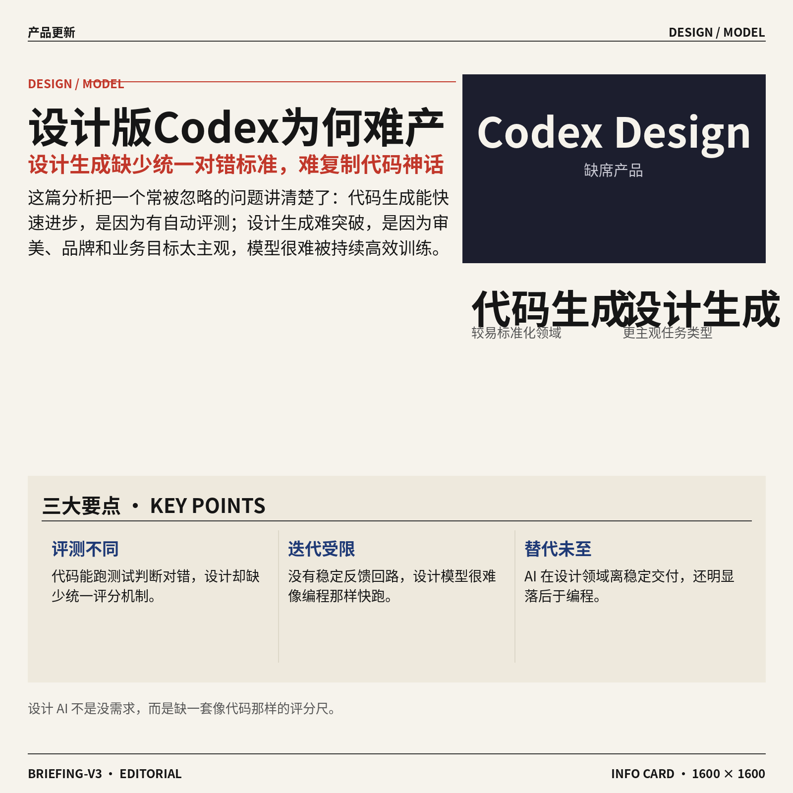

1. **为什么 Codex 还没出现 Codex Design（面向设计工作的 AI 生成产品）？**
这篇文章的核心判断是：**代码生成**和**设计生成**表面上都像“让 AI 帮人做创作”，但底层难度并不在一个量级 🤔。代码有更清晰的对错标准，能靠**自动评测**（让程序自己跑测试、判断结果是否正确）持续优化；而设计往往依赖审美、品牌风格和业务目标，评价标准更主观，所以很难像写代码那样快速训练和迭代。对普通办公团队来说，这意味着 AI 在编程领域更容易先做出“可交付成果”，但在设计领域，离真正稳定替代人类创意还有明显距离。[作者分析原文(briefing)](https://baoyu.io/blog/2026-06-13/codex-design-model-gap)


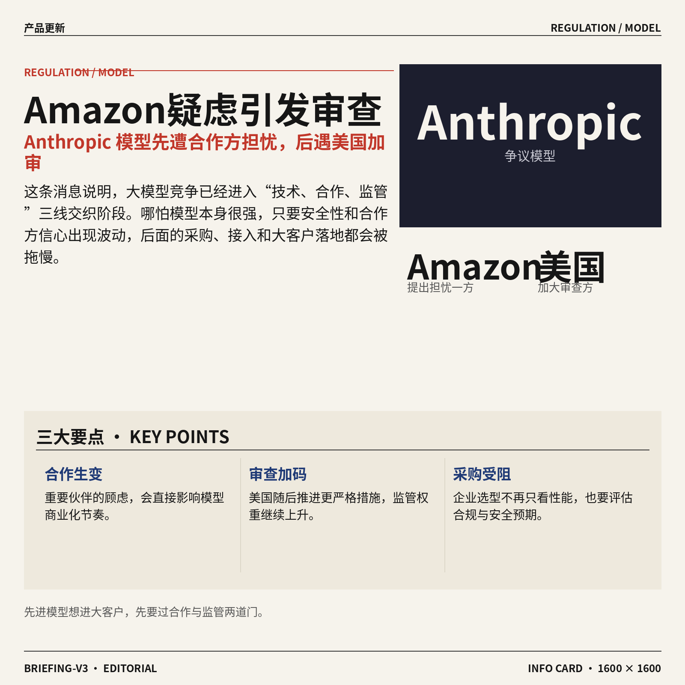

2. **路透：Amazon 曾对 Anthropic 模型表达担忧，美国随后加大审查。**
这条消息讲的是，**Amazon** 此前曾对 **Anthropic 模型**提出顾虑，而美国之后推进了更严格的相关审查措施 📌。从行业信号看，大模型竞争已经不只是拼能力和价格，也越来越受**监管**、**安全性**和合作关系影响。对企业用户来说，这类变化会直接影响模型的采购、接入节奏，甚至影响哪些 AI 产品能更快进入大客户场景。[路透转引报道(briefing)](https://news.google.com/rss/articles/CBMi2AFBVV95cUxPYTBINmZMTlZvc1RPNEkyWjk0VkxJY29QRHRtSUpjYTlZNWMtYWJlZkVpMUwxejFzSjVxdU02MHJVS1BKYUtCNkRObWYxTkdsMWJmcF9Bb3VQTnBDZktBenJ2SjFnR2VQUGZhY3RWWXBvWGwyZFNOV250VG5QVm5sTE1fWU4tQXc3enltTUZUWXZuM1pEMTFvSmlNdlEyamFwTFBrdXRkeGFWUjU2eVp4b0ozT3p6bG5JUHNWNV9Hcm1nSjcxbHYyd1NPWHVGNFB0azJmNTFLRWM?oc=5)


3. **Expedia 推出 AI 旅行工具，并更新平台功能。**
**Expedia** 这次发布的是一组面向旅游场景的 **AI 工具** 和平台增强功能，方向很明确：让用户更快完成找灵感、比方案和做决策这几步 ✈️。这类产品更新说明，AI 正在从“聊天演示”走向垂直业务流程，尤其适合旅行这种信息分散、选择复杂的消费场景。对做运营、客服和产品的同事来说，这也是一个很典型的信号：未来很多行业应用，拼的不是谁先接入大模型，而是谁先把 AI 塞进真实工作流里。[财报媒体报道(briefing)](https://news.google.com/rss/articles/CBMiogFBVV95cUxQTHZWOU14dGJoSzRsQ1lLVGJZMnZuUWVmdDhmUHExSWRFY2puUGFVQTRWZWRHZFFTY3NoM29EbWlOYjlFMm1RVlpITEFjWk1mazlvbk5BVUxBTzBiNzNWZkhZeVVGOGNxSkpWUEpRaHV1TEpOU1lRNlR6QjdvWkR5NjhWVlZKRENYSTZmR182VlppZjBrSVB6UjNBa2pmUUpndmc?oc=5)


### 🟢 前沿研究

### 🟡 行业展望与社会影响

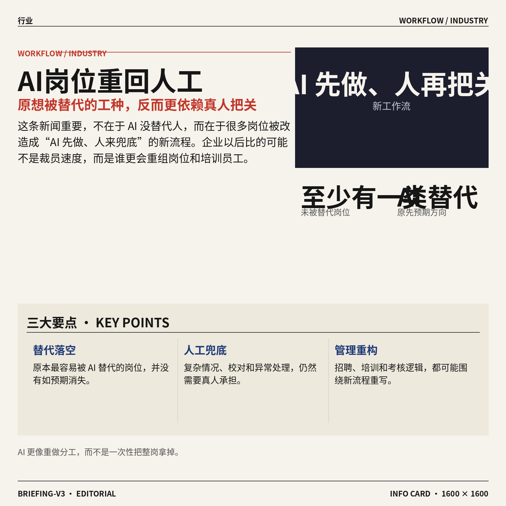

1. **AI 本想取代的岗位，反而比以前更需要真人。**
《华尔街日报》这篇报道指出，至少有一类原本被认为最容易被 **AI 替代** 的工作，并没有如预期那样“消失”，反而更依赖**人工参与**来兜底、校对和处理复杂情况 🤔。这类变化很值得普通职场人关注：很多岗位未必是被整块替换，而是被重新拆分成“AI 先做、人再把关”的新流程。对企业来说，这意味着招聘逻辑、培训重点和绩效考核都可能跟着变，不是单纯“裁员换模型”这么简单。[华尔街日报报道(briefing)](https://news.google.com/rss/articles/CBMiowFBVV95cUxPZ3JwdC1kbEQyYno1R1ZFV3lRWldZUnVSdDlrS3lMQzAyczNtbnVVZlhYNDlkTnluSkJmYy1SekZJRTRLOTlhdHNYWDNuNE5RRDFnVHQ4bHhrUjhiOXNMMEtNaDczcUlMLWVrZEdXQ3c5YTIzNUlCdVFnMUlqWjZrZmRYdDcwcC0tczN4X1B0YlBxX2tWcDhFWEgxWUZKUUN1VVpZ?oc=5)

![AI 本想取代的岗位，反而比以前更需要真人](https://image.pollinations.ai/prompt/AI%20%E6%9C%AC%E6%83%B3%E5%8F%96%E4%BB%A3%E7%9A%84%E5%B2%97%E4%BD%8D%EF%BC%8C%E5%8F%8D%E8%80%8C%E6%AF%94%E4%BB%A5%E5%89%8D%E6%9B%B4%E9%9C%80%E8%A6%81%E7%9C%9F%E4%BA%BA.%20AI%20%E6%9C%AC%E6%83%B3%E5%8F%96%E4%BB%A3%E7%9A%84%E5%B2%97%E4%BD%8D%EF%BC%8C%E5%8F%8D%E8%80%8C%E6%AF%94%E4%BB%A5%E5%89%8D%E6%9B%B4%E9%9C%80%E8%A6%81%E7%9C%9F%E4%BA%BA%E3%80%82%20%E3%80%8A%E5%8D%8E%E5%B0%94%E8%A1%97%E6%97%A5%E6%8A%A5%E3%80%8B%E8%BF%99%E7%AF%87%E6%8A%A5%E9%81%93%E6%8C%87%E5%87%BA%EF%BC%8C%E8%87%B3%E5%B0%91%E6%9C%89%E4%B8%80%E7%B1%BB%E5%8E%9F%E6%9C%AC%E8%A2%AB%E8%AE%A4%E4%B8%BA%E6%9C%80%E5%AE%B9%E6%98%93%E8%A2%AB%20AI%20%E6%9B%BF%E4%BB%A3%20%E7%9A%84%E5%B7%A5%E4%BD%9C%EF%BC%8C%E5%B9%B6%E6%B2%A1%E6%9C%89%E5%A6%82%E9%A2%84%E6%9C%9F%E9%82%A3%E6%A0%B7%E2%80%9C%E6%B6%88%E5%A4%B1%E2%80%9D%EF%BC%8C%E5%8F%8D%E8%80%8C%E6%9B%B4%E4%BE%9D%E8%B5%96%2C%20technical%20infographic%20diagram%2C%20architecture%20flowchart%2C%20clean%20vector%20illustration%2C%20educational%20style%2C%20no%20text%20overlay%2C%20modern%20minimal%2C%20wide%20aspect?width=1200&height=675&nologo=true&seed=10807)

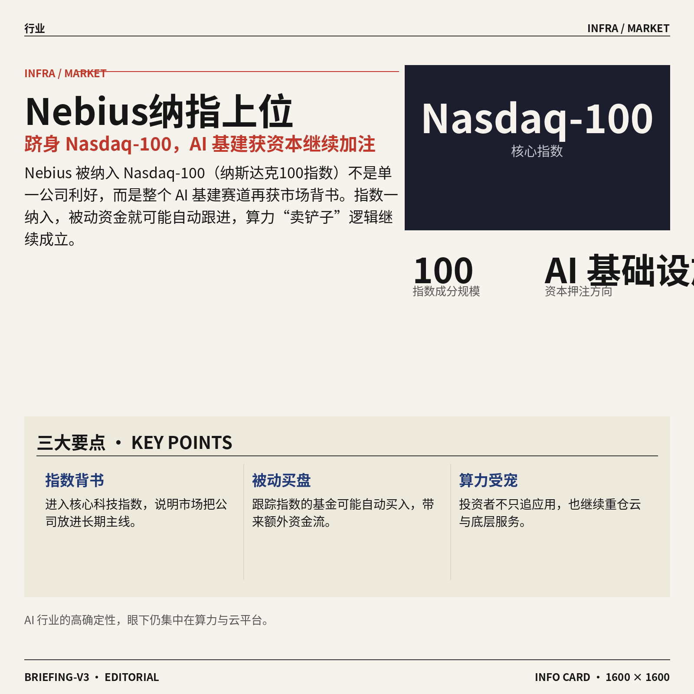

2. **Nebius（提供 AI 算力和云基础设施的公司）跻身 Nasdaq-100，资本市场继续押注 AI 基建。**
Yahoo Finance 提到，Nebius 被纳入 **Nasdaq-100（纳斯达克 100 指数，美国科技股核心指数之一）**，说明资本市场正在把 **AI 基础设施** 当成长期主线来看 📈。这里的关键不只是公司本身，而是“指数纳入”往往会带来更多被动资金流入，也就是很多跟踪指数的基金会自动买入。对行业而言，这释放出一个明显信号：除了大模型应用层，卖“铲子”的算力、云平台和底层服务，仍然是投资者重点押注的方向。[财经报道原文(briefing)](https://news.google.com/rss/articles/CBMilgFBVV95cUxQV3hhRkJPejJILUhHckVVUmdDUmlkTHpONFpMMFR0VmFlZHhMTXc5VFpmQmx6VVFiN1ZrQUFpWUM0dXZMVkxWbWhKaGUxck1ubjFVallEbE5lQ1JlY1RTXzJHTFFseHZSNHVsYWF1ZXFWbnNFOUl1bjk3TGRIUXpuZWtmendQNXhmalF5S0xSaG5zNnBWUmc?oc=5)


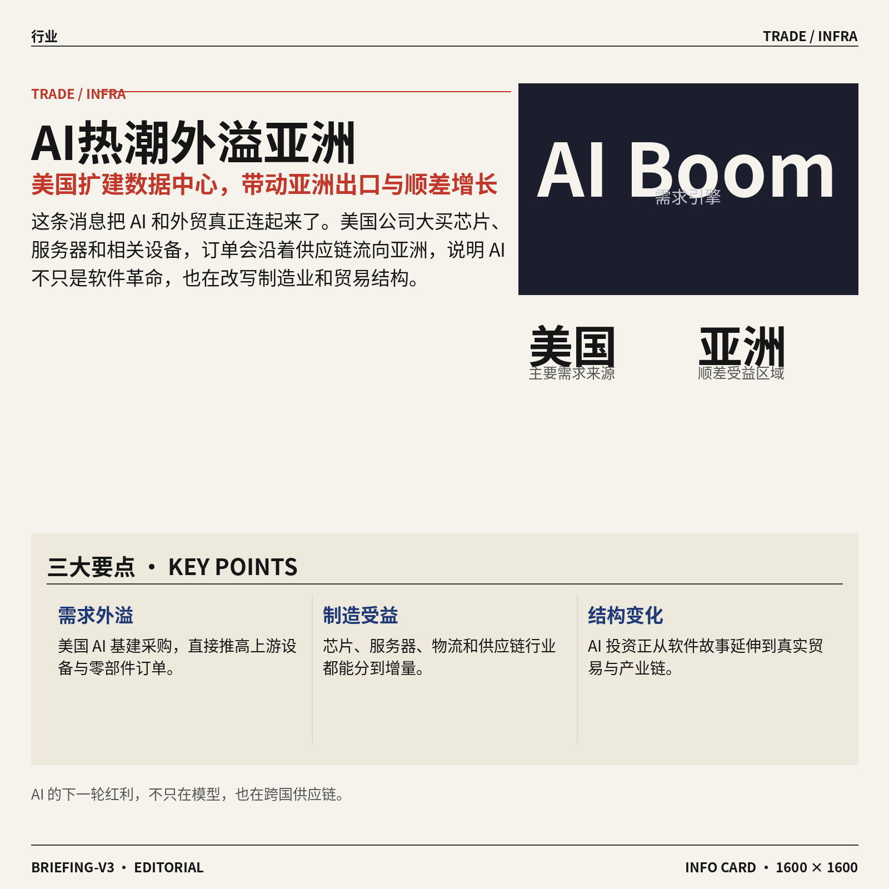

3. **美国 AI 热潮，正在推高亚洲对外贸易顺差。**
彭博这篇分析把 **AI Boom（AI 热潮）** 和亚洲出口联系到一起，指出美国对 AI 相关设备和供应链的需求，正在带动亚洲一些经济体的贸易顺差扩大 🌏。这背后很好理解：当美国企业大量建设数据中心、采购芯片和服务器时，上游制造和零部件订单自然会流向亚洲。对国内企业和职场人来说，这提醒我们，AI 不只是软件故事，它也会实打实影响**制造业、外贸、物流和供应链**这些传统岗位与行业。[彭博完整分析(briefing)](https://news.google.com/rss/articles/CBMisgFBVV95cUxQdDRESm9BSHNPaXhpM0VsN0dIa1VpUXh3TFpEVmtBOEZrMFZIQkg0bUd1WHBweW5YeW83WkZYaHZTNEFzMDNLLXZRUlpYWXRSb1dTd0dpMl9mVG5YZThlTFJDczJMSVJWcnEzRjdLelQyNDdNeEVPUDJQd2pOTHF0SkViQnAzQmY4SHFwcEhQUEEtb2s0THUtMkxlVDkyaldMVzZpSXZCOVJUeGtLRkFTYzB3?oc=5)


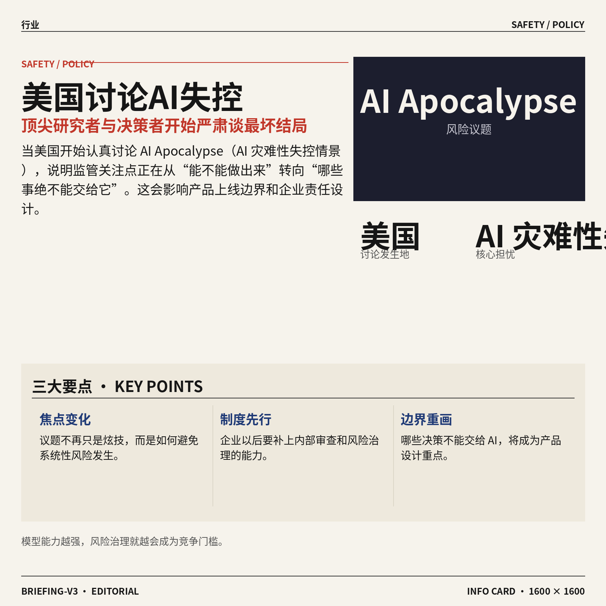

4. **美国正认真讨论，如何避免 AI 走向“失控结局”。**
《华尔街日报》这篇报道聚焦一群顶尖研究者和决策参与者，讨论的核心不是“怎么把 AI 做得更炫”，而是怎么避免所谓 **AI Apocalypse（AI 灾难性失控情景，指 AI 发展带来极端系统性风险）** 😶。这类议题听上去很远，但其实和监管、企业责任、产品上线边界都直接相关。对公司管理层来说，未来比拼的不只是模型能力，还包括**风险治理**、内部审查和“哪些事情不能交给 AI”这套制度设计。[华尔街日报深度报道(briefing)](https://news.google.com/rss/articles/CBMitwFBVV95cUxPVTRGY3RjbEFnVlJRdUxsdHZCcExKa3R2LXg0Rmo1UVExYXFOTk5qX3pUNEkybDRBa1Zrb29xeEtIb3F6Uk9IbGZhblI1TVM1c0RBbERQVVlqV285WU51STBJSE9kU19zSXJrOElPdHJMMU5HdlFXOEhRMEJoM2k0VVl2VktFNzMzZXpHSk8wend5VElYM3ROYXBMRUdXUm5MRjhMeU4teFNMUGM2TkIzem1DQnUwRFk?oc=5)

![美国正认真讨论，如何避免 AI 走向“失控结局”](https://image.pollinations.ai/prompt/%E7%BE%8E%E5%9B%BD%E6%AD%A3%E8%AE%A4%E7%9C%9F%E8%AE%A8%E8%AE%BA%EF%BC%8C%E5%A6%82%E4%BD%95%E9%81%BF%E5%85%8D%20AI%20%E8%B5%B0%E5%90%91%E2%80%9C%E5%A4%B1%E6%8E%A7%E7%BB%93%E5%B1%80%E2%80%9D.%20%E7%BE%8E%E5%9B%BD%E6%AD%A3%E8%AE%A4%E7%9C%9F%E8%AE%A8%E8%AE%BA%EF%BC%8C%E5%A6%82%E4%BD%95%E9%81%BF%E5%85%8D%20AI%20%E8%B5%B0%E5%90%91%E2%80%9C%E5%A4%B1%E6%8E%A7%E7%BB%93%E5%B1%80%E2%80%9D%E3%80%82%20%E3%80%8A%E5%8D%8E%E5%B0%94%E8%A1%97%E6%97%A5%E6%8A%A5%E3%80%8B%E8%BF%99%E7%AF%87%E6%8A%A5%E9%81%93%E8%81%9A%E7%84%A6%E4%B8%80%E7%BE%A4%E9%A1%B6%E5%B0%96%E7%A0%94%E7%A9%B6%E8%80%85%E5%92%8C%E5%86%B3%E7%AD%96%E5%8F%82%E4%B8%8E%E8%80%85%EF%BC%8C%E8%AE%A8%E8%AE%BA%E7%9A%84%E6%A0%B8%E5%BF%83%E4%B8%8D%E6%98%AF%E2%80%9C%E6%80%8E%E4%B9%88%E6%8A%8A%20AI%20%E5%81%9A%E5%BE%97%E6%9B%B4%E7%82%AB%E2%80%9D%EF%BC%8C%E8%80%8C%E6%98%AF%E6%80%8E%E4%B9%88%E9%81%BF%E5%85%8D%2C%20technical%20infographic%20diagram%2C%20architecture%20flowchart%2C%20clean%20vector%20illustration%2C%20educational%20style%2C%20no%20text%20overlay%2C%20modern%20minimal%2C%20wide%20aspect?width=1200&height=675&nologo=true&seed=10900)

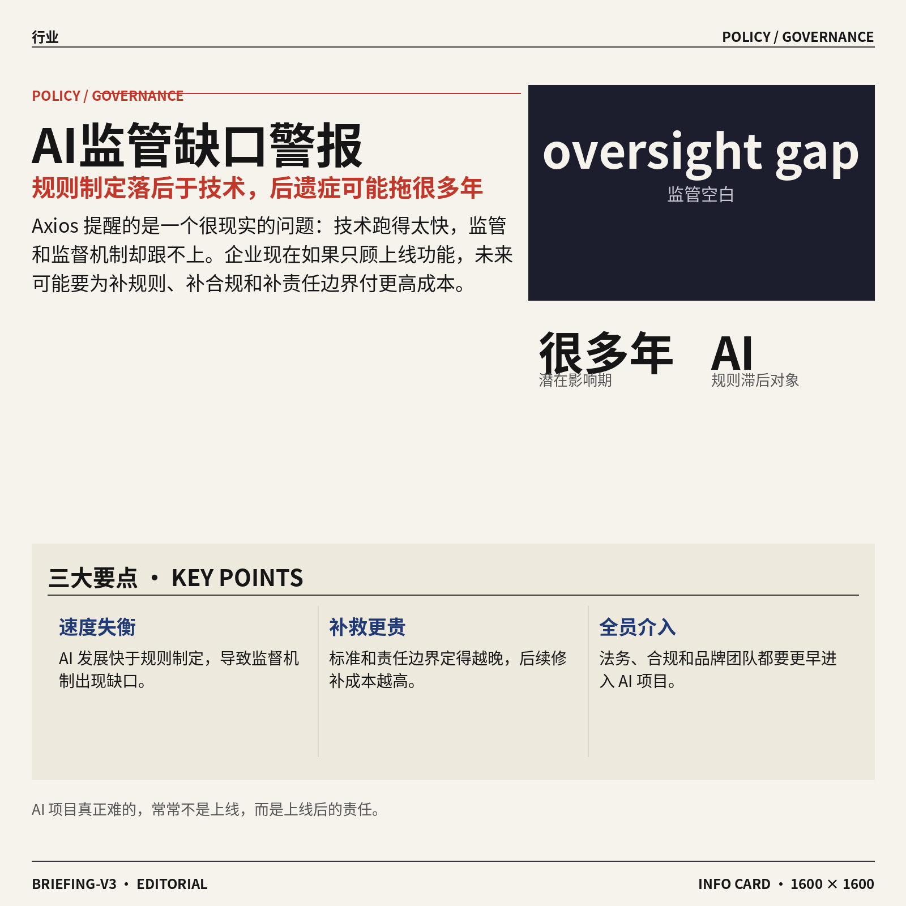

5. **AI oversight gap（AI 监管空白，指技术发展快于规则制定）可能留下长期后遗症。**
Axios 这篇文章提醒，当前 AI 发展速度太快，而 **oversight（监管与监督机制）** 没有同步跟上，这种缺口可能会产生持续很多年的影响 ⚠️。问题不只是“现在有没有管住”，还在于一旦标准、责任边界和审查流程定得太慢，后面再补规则，成本会更高。对企业日常经营来说，这意味着合规、法务、人事和品牌团队以后可能都得更早介入 AI 项目，而不是等产品上线后再补救。[Axios 观察原文(briefing)](https://news.google.com/rss/articles/CBMidkFVX3lxTE1JRm1US1lTbUQzV3M4YXdnSkc2cjFhU2FtRVVaQmc1Q3dNNjI2UGZqU3Y2QU9wRHNVakpmTGs2U05UTWJOSUNjejlDWUQyMTJCbUFIR2FxN3UwWndmRUg5UUJlRDJYUG1iRWdkLWR4VVd5dW42MXc?oc=5)


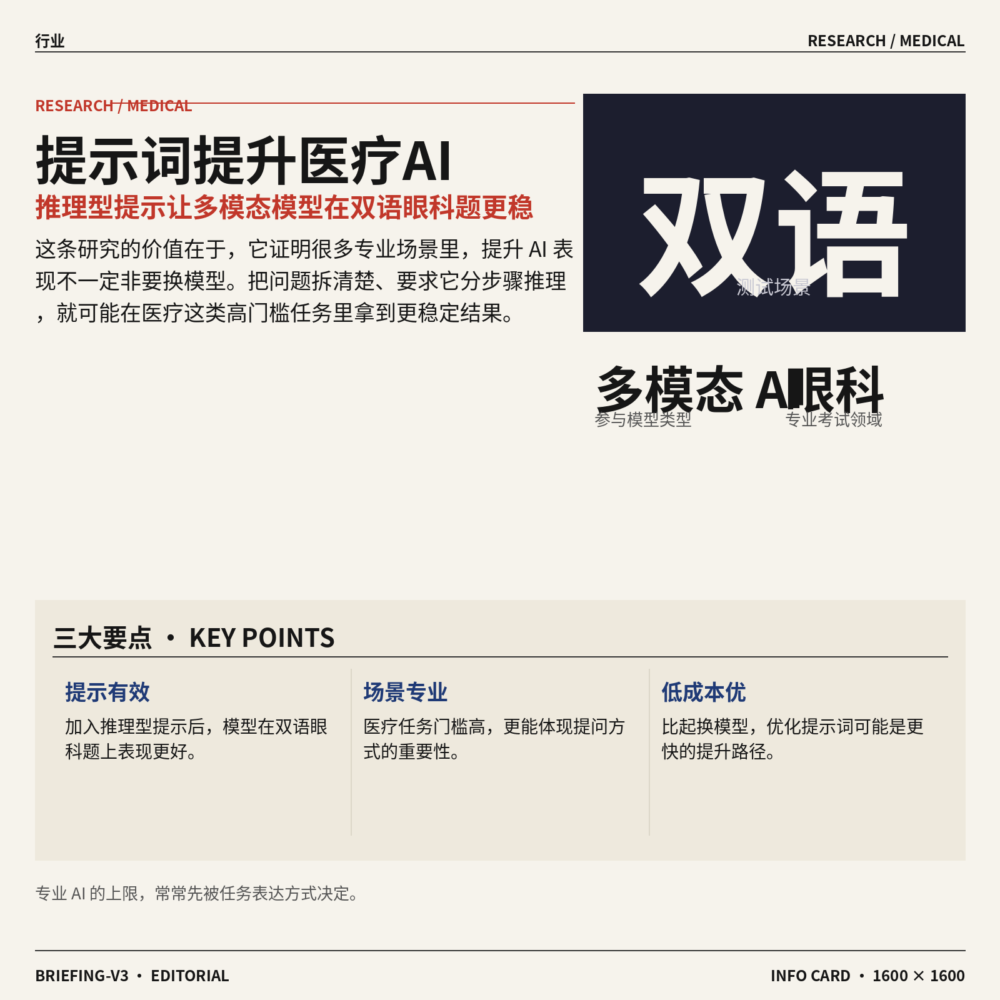

6. **Reasoning prompts（推理型提示词，引导模型分步骤思考）让多模态 AI 在双语眼科考题上表现更好。**
Ophthalmology Times 报道称，在**双语眼科考试题**场景里，加入 **multimodal AI（多模态 AI，能同时理解文字和图像的模型）** 的推理型提示后，模型表现得到提升 👀。这件事的意义不只是“考试更会做了”，而是说明在医疗这类高门槛专业场景里，提问方式本身就会明显影响 AI 输出质量。对非技术同事也有启发：AI 不一定要换一个新模型才变强，很多时候把任务说明写清楚、分步骤引导，同样能提升结果稳定性。[医疗场景报道(briefing)](https://news.google.com/rss/articles/CBMivgFBVV95cUxQc3FYTGtBU2h4akJfX0dma005UzVJRTRXcFZ5ejZrTVJLdVZ6dUNsSk14X0hhRXJKTDVUUHA3TDh3M0lQeDhxVzNNUVZ5V2RHLXhBMzJOSDJscnNWWGdOS1JTNnR1YWdpWkg1Wkp4R0ZsV0M1WDRfczhyWmpYblhRZ2JIeGlQMnlvS2tXbUdoR0RtZEs1aDN5Rm50VFZlWlllT2dGOXNkVms1ajc3bzRQQkt1UlN3NkNlZ09OdDF3?oc=5)


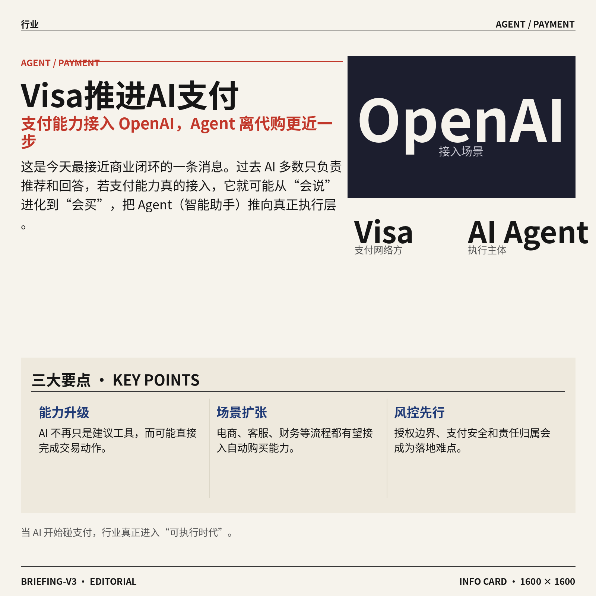

7. **Visa 计划把支付能力接入 OpenAI，AI Agent 离“自己下单付款”又近一步。**
Yahoo Finance 提到，Visa 正推进把**支付功能**整合进 OpenAI 相关场景，用于支持 **AI Agent（能代替用户执行任务的智能助手）** 完成交易 💳。如果这类合作落地，AI 就不只是“帮你推荐”，而是可能进一步变成“帮你完成购买”的执行者。对电商、客服、财务和风控团队来说，这会带来新机会，也会带来新问题：比如授权边界、支付安全和责任归属都要提前想清楚。[支付整合报道(briefing)](https://news.google.com/rss/articles/CBMingFBVV95cUxQX3hCRFhtVFBiY2dXYTNCSmprUTBrNFlkMENnVlh2TW9WbS0wVzhhNVZRMjE5VjZNMTM3OUZBWEIxSnBxQXRNMGk5QkZPblJOWGFNYTAwTzdkNjhTQzVzcXJIRXhtNjNaWEJjOFVJV0hhXzNiS2s1NTNhX2o0OHRiUVRSeGIxVHg0c2g5WVYtSWQzWlM4eXc5ZVhFcm9Fdw?oc=5)


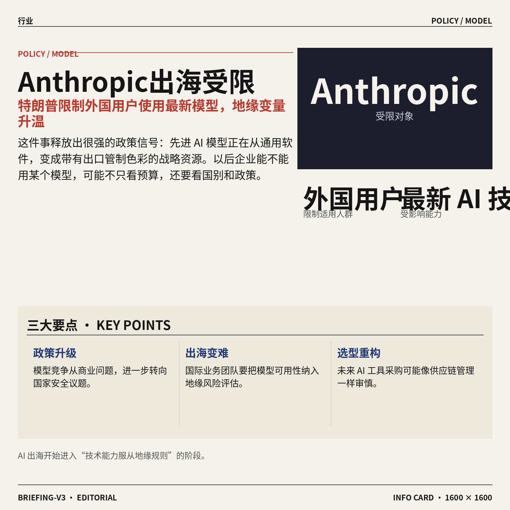

8. **特朗普限制外国用户使用 Anthropic 最新 AI 技术，AI 出海开始更受地缘政治影响。**
Mother Jones 这篇报道说，特朗普阻止外国人使用 Anthropic 最新的 **AI Tech（AI 技术与能力）**，让 AI 竞争不再只是产品和商业问题，也越来越带有**国家安全**和**技术出口管制**色彩 🌐。这意味着，未来企业能不能用到某些先进模型，不一定只取决于预算和技术能力，还可能受到国籍、地区和政策约束。对想做国际业务的团队来说，AI 工具选型以后可能要像供应链一样，纳入更严肃的地缘风险评估。[政策争议报道(briefing)](https://news.google.com/rss/articles/CBMiigFBVV95cUxNaXRnQW9XUHVXMnR2TXo1d1VpV0F4c0dPZ3pCaC02aFk4YUo5RGs5aGJGMEJURDllcGppSjVIei03UHNudkRSOHlWdXM2LVBBbEdaczdTemQ2aEYtaXdWc3Flb1ozeG8ySFoyRGFZUEduSlRBeUFOUzFyaFcwaGVocnowVmZndzN2Ymc?oc=5)


### 🟣 开源TOP项目

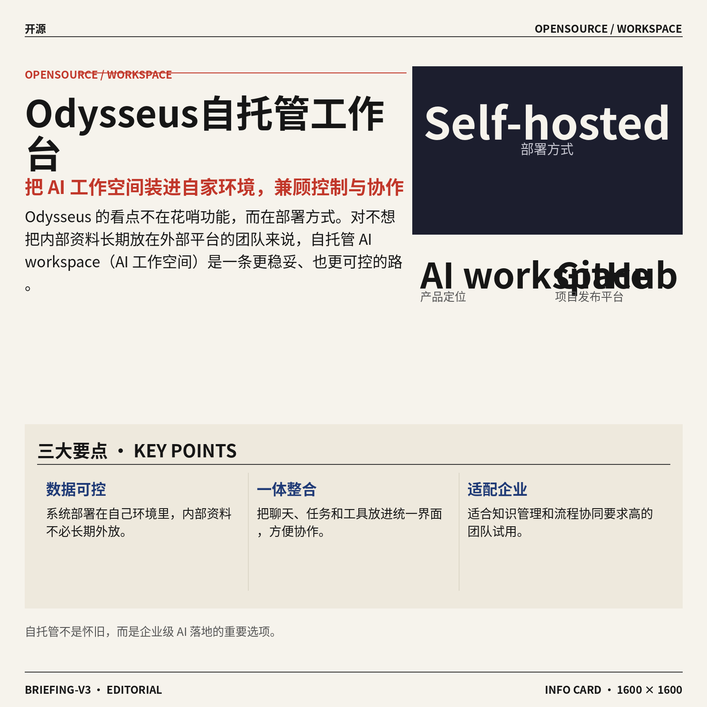

1. **Odysseus（一款可自托管的 AI 工作空间）让团队把 AI 工具装进自己环境里。**  
这个项目主打 **Self-hosted（自托管，把系统部署在自己服务器或电脑里，不依赖外部云平台）** 的 **AI workspace（AI 工作空间，把聊天、任务和工具整合到一个界面里）**，适合对数据控制和使用灵活度有要求的团队 💡。对公司来说，这类项目的意义在于：如果你不想把内部资料长期放在第三方平台上，自托管会更安心一些。当前项目页给出的公开信息比较精简，但“自建 AI 工作台”这个方向本身就很值得关注，尤其适合有内部知识管理、流程协作需求的场景 🚀。可先看它的 [GitHub 项目页(briefing)](https://github.com/pewdiepie-archdaemon/odysseus)


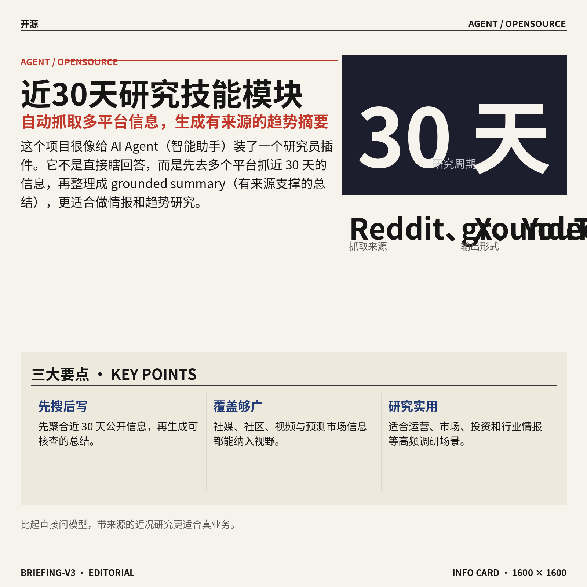

2. **last30days-skill（一种帮 AI 自动做近 30 天话题研究的技能模块）把全网信息汇总成可落地摘要。**  
这个项目是给 **AI agent（能自动执行任务的 AI 助手）** 用的 **skill（技能模块，相当于给 AI 加一个专门能力插件）**，能围绕任意主题抓取 Reddit、X、YouTube、HN（Hacker News，海外知名科技社区）、Polymarket（一个用真金白银下注预测事件结果的平台）以及网页信息，再整理成 **grounded summary（有来源支撑的总结，不是纯凭模型“脑补”）** 🧠。对运营、市场、投资研究或行业情报同事来说，这类工具很有现实价值：它更像一个“近 30 天舆情与趋势助理”，能帮你快速摸清某个话题最近到底发生了什么。尤其在热点变化快的时候，这种“先搜集、再归纳”的能力，比直接问模型更稳一些。项目可见 [GitHub 仓库页(briefing)](https://github.com/mvanhorn/last30days-skill)


### 🔴 社媒分享

---

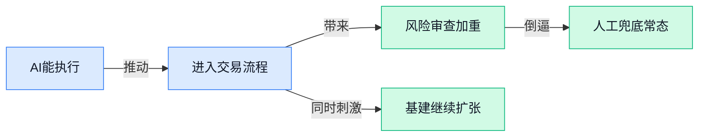
```mermaid
graph LR
A[AI能执行] -->|推动| B[进入交易流程]
B -->|带来| C[风险审查加重]
C -->|倒逼| D[人工兜底常态]
B -->|同时刺激| E[基建继续扩张]

classDef blue fill:#dbeafe,stroke:#3b82f6,color:#111827
classDef green fill:#d1fae5,stroke:#10b981,color:#111827
class A,B blue
class C,D,E green
```

### 📊 行业洞察（今日 4 条）

1. Visa要把支付接进OpenAI，Expedia也把AI塞进订票决策流程
  【洞察】AI 正从“给建议”走向“替你把事办完”，竞争点开始从回答质量转向成交闭环能力

2. 美国讨论AI失控、Axios说监管空白会留后遗症，Amazon还曾担心Anthropic
  【洞察】行业已经进入“能力越强，审查越重”阶段，大客户采购会越来越看可控性，不只看效果

3. Nebius进入纳斯达克100，彭博又说美国AI热潮带动亚洲出口
  【洞察】资本和供应链都在押注AI基建，说明这波不是短期概念炒作，而是重资产长期投入

4. 华尔街日报说有些岗位没被AI替掉，反而更需要真人；设计生成也明显比代码更难
  【洞察】很多创意类工作短期不会被整块替代，真实落地方向更像“AI先做，人来定稿和兜底”

### 💭 对我们的启发（今日 3 条）

1. Visa和Expedia都在做“从建议到执行”，我们的视频工具不能只会生成脚本和剪辑，得把选题、出片、审核、投放衔接起来，但付款、发布这类高风险动作要坚持人工确认。

2. 监管讨论、模型审查、地缘限制放在一起看，我们不能把核心能力绑死在单一模型上；产品里要让客户知道“这条视频是谁生成的、改过几次、哪里需人审”。

3. 设计生成比代码更难，提醒我们别迷信“一键出爆款”。更现实的产品方向是先把封面、口播、字幕、节奏拆成可控小步骤，让运营能随时接管修改。

