## AI资讯日报 2026/6/15

> AI 早报 · 每日早读 · 全网深度聚合

## **今日摘要**

```
美国突袭收紧 Anthropic 海外权限，Claude 高能力版疑似临时下线，AI 出口管制开始外溢
Anthropic 顶级模型 Fable 风波升级，传六家公司曾触发政府介入，全球访问边界骤然收紧
Google 开源 google/skills（产品技能组件库），Understand-Anything（代码知识图谱工具）把 Agent 调 Google、读代码一起推快
```

### 🔵 产品与功能更新

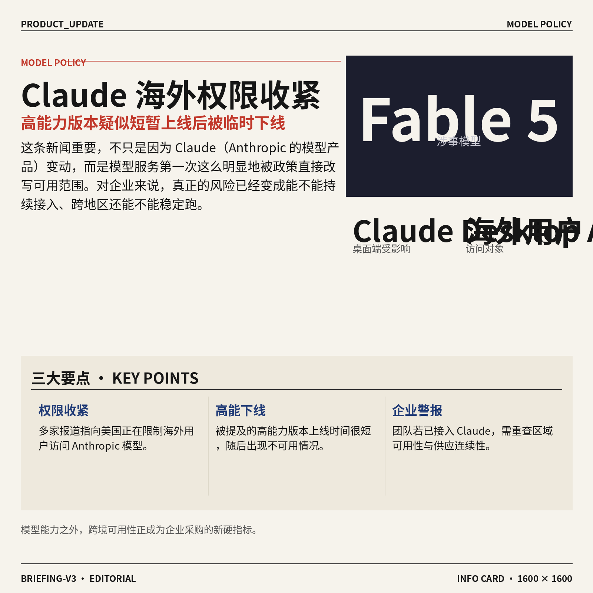

1. **美国收紧海外访问 Anthropic 模型权限，Claude 部分高能力版本疑似被临时下线。**  
从多家报道的表述来看，美国方面正在**限制海外用户访问 Anthropic AI 模型**，而 Claude 相关的高能力版本也因此出现了“上线很短、随后不可用”的情况 😮。其中被提到的 **Fable 5（Claude 体系内一款被报道提及的高性能模型版本）**，在公开可用时间上非常短，连 **Claude Desktop App（Claude 桌面应用）** 里也被指无法继续使用，这说明政策变化已经直接影响到产品触达范围。对企业用户来说，这类变化最现实的影响不是“模型强不强”，而是**能不能稳定用、哪些地区能用、内部流程会不会受限**。如果你们团队正在把 Claude 接入日常写作、客服或研究流程，最近尤其要关注**区域可用性**和**供应连续性**这两个问题 ⚠️。[美国限制报道(briefing)](https://news.google.com/rss/articles/CBMipAFBVV95cUxOQlVGa3pwSzZkOG55Q2RPWkJQdHY3UGs3cXZ4bUZ6RGktNU1LYnZqUVRlRkpvSGE0UmZlRUJRZmtUTWN0b2xzcy1yYjZQb1NCRmo0ZnNCYWZvLXBHdnlQUEJJeGFWU1RyTzBEYjRHMUdoaTZ1R2YtXzFRQWd3UlRScVgxdGhmMzk2cXgyNW1jaU1fRlZJUGcwWU0yM2VNVDl5aDB6Tg?oc=5) [三天后下线报道(briefing)](https://news.google.com/rss/articles/CBMi3wFBVV95cUxQNXVfQ3FlbllQUmhGUnUxTlFBMHdrdHJYWERVaHJkWm9VQmlCM2NuR1UyaGRIUDdzLXZkc0UyeHcwNjhWNFRRTG8xN1Q0WHRFcXdFaHJJU0cyQ2xfb1RHR3FnbnNlNEZkdVhHQ2N2bXhxdlZ6Z2U4bXVfRW96WW11ek5lclM2YjdKSC1zNTl0bVh6WEhiMTA2OUtwTnY1cHRVQm5JRkpkWXNFUWJuRmFFV2IwRXY2bTVyZXAtTm85bnA4cjluQkpkc1NkcUxIbEFKeUtmLUVyUi1LYWNQYkdz?oc=5) [桌面端不可用报道(briefing)](https://news.google.com/rss/articles/CBMixAFBVV95cUxQX2sxcm5KWllKSk04UmUwUmNaQkNvbmVmY3VuclNUWVBmWWdmY213bzFacE13WUQyOXdVZXdZZC1xcUo3N2ZlQ2NHT3RBZEVISUlTcloyN0UyeXhzcFZSRW8tZ0JuR0RVMkp6VEtpZGJBUlZ5YllmSl9qOGlONFlmLTkwTldEM2lkQm04b3N4SU9LNXI1VHRPNkphNGQteTJGQVcwTEczNXFwRkF3ZmUwQXBOTDktYjN4MkhWYXppVXJFeXND?oc=5)

![美国收紧海外访问 Anthropic 模型权限，Claude 部分高能力版本疑似被临时下线](https://image.pollinations.ai/prompt/%E7%BE%8E%E5%9B%BD%E6%94%B6%E7%B4%A7%E6%B5%B7%E5%A4%96%E8%AE%BF%E9%97%AE%20Anthropic%20%E6%A8%A1%E5%9E%8B%E6%9D%83%E9%99%90%EF%BC%8CClaude%20%E9%83%A8%E5%88%86%E9%AB%98%E8%83%BD%E5%8A%9B%E7%89%88%E6%9C%AC%E7%96%91%E4%BC%BC%E8%A2%AB%E4%B8%B4%E6%97%B6%E4%B8%8B%E7%BA%BF.%20%E7%BE%8E%E5%9B%BD%E6%94%B6%E7%B4%A7%E6%B5%B7%E5%A4%96%E8%AE%BF%E9%97%AE%20Anthropic%20%E6%A8%A1%E5%9E%8B%E6%9D%83%E9%99%90%EF%BC%8CClaude%20%E9%83%A8%E5%88%86%E9%AB%98%E8%83%BD%E5%8A%9B%E7%89%88%E6%9C%AC%E7%96%91%E4%BC%BC%E8%A2%AB%E4%B8%B4%E6%97%B6%E4%B8%8B%E7%BA%BF%E3%80%82%20%E4%BB%8E%E5%A4%9A%E5%AE%B6%E6%8A%A5%E9%81%93%E7%9A%84%E8%A1%A8%E8%BF%B0%E6%9D%A5%E7%9C%8B%EF%BC%8C%E7%BE%8E%E5%9B%BD%E6%96%B9%E9%9D%A2%E6%AD%A3%E5%9C%A8%E9%99%90%E5%88%B6%E6%B5%B7%E5%A4%96%E7%94%A8%E6%88%B7%E8%AE%BF%E9%97%AE%20Anthrop%2C%20technical%20infographic%20diagram%2C%20architecture%20flowchart%2C%20clean%20vector%20illustration%2C%20educational%20style%2C%20no%20text%20overlay%2C%20modern%20minimal%2C%20wide%20aspect?width=1200&height=675&nologo=true&seed=11389)

### 🟢 前沿研究

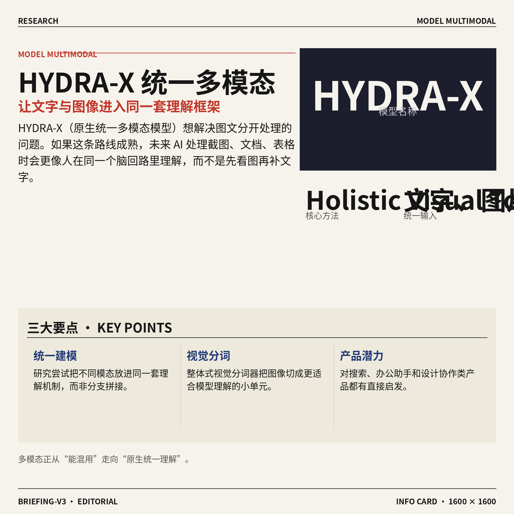

1. **HYDRA-X（一种原生统一多模态模型）尝试把文字、图片等输入放进同一套理解框架。**  
这篇论文聚焦 **多模态统一建模**，核心亮点是引入 **Holistic Visual Tokenizers（整体式视觉分词器，把图像切成更适合模型理解的小单元）**，希望让模型不再把视觉信息和文本信息“分开处理” 🤖。对非技术同事来说，可以把它理解成：AI 未来可能不只是“会看图”，而是更像人一样把图文放在同一个脑回路里处理。这样的方向如果成熟，会直接影响搜索、办公助手、设计协作等需要同时理解截图、文档和表格的产品形态。[论文页面(briefing)](https://huggingface.co/papers/2606.13289)


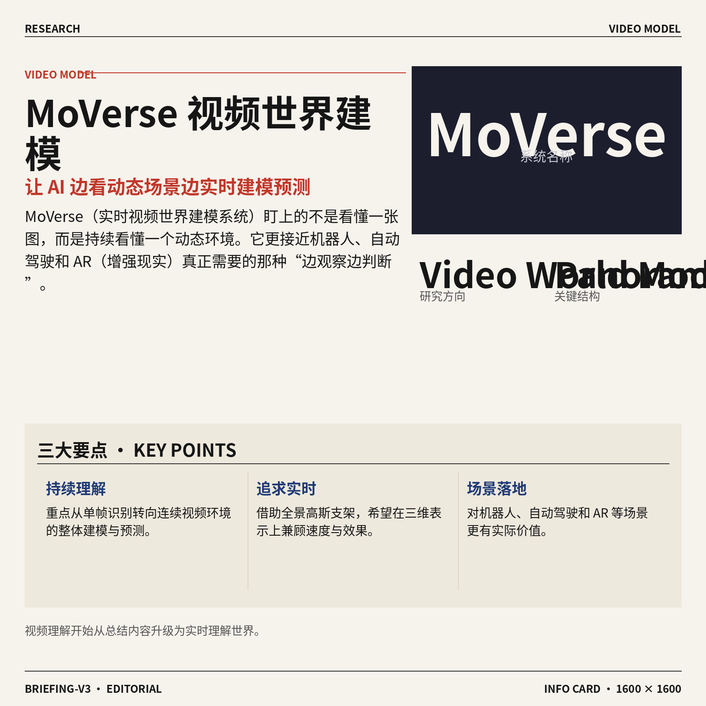

2. **MoVerse（一种实时视频世界建模系统）瞄准让 AI 更快理解动态场景。**  
MoVerse 研究的是 **Video World Modeling（视频世界建模，让 AI 不只看单帧，而是理解整个动态环境）**，并结合 **Panoramic Gaussian Scaffold（全景高斯支架，一种用更轻量方式表示三维场景的结构）** 来追求实时效果 🎥。这类研究的重要性在于，AI 若想真正进入机器人、自动驾驶、AR（增强现实，把数字内容叠加到真实世界）等场景，就得先学会“持续看懂”世界，而不是只会回答一张图里有什么。对行业来说，这代表视频理解正从“看视频做总结”迈向“边看边建模边预测”。[论文页面(briefing)](https://huggingface.co/papers/2606.13376)


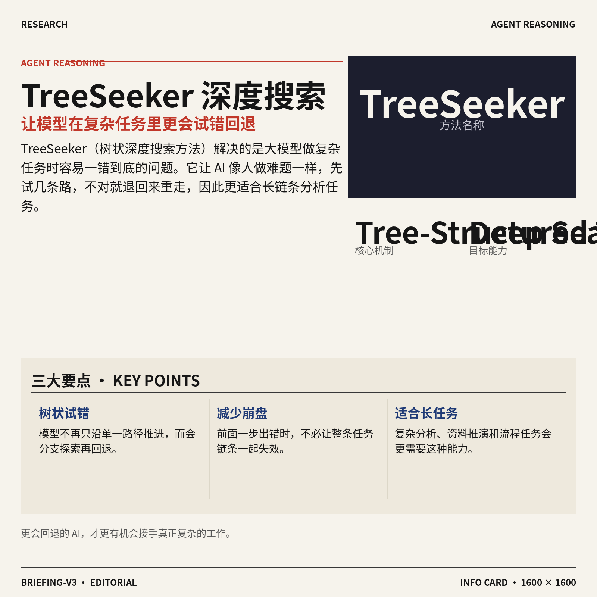

3. **TreeSeeker（一种树状深度搜索方法）想让 AI 在复杂任务里更会试错和回退。**  
这篇工作提出 **Tree-Structured Trial, Error, and Return（树状的尝试、纠错与返回机制）**，重点是提升 **Deep Search（深度搜索，让模型像解题一样分步骤探索路径）** 的质量 🌲。通俗说，它不像普通 AI 那样“一条路走到黑”，而是更像人在做复杂题时会先试几种方案，发现不对再退回来改思路。对工作场景的意义在于，未来 AI 在做长流程任务、复杂分析、资料推演时，可能会更稳，不容易因为前面某一步错了就整题崩掉。[论文页面(briefing)](https://huggingface.co/papers/2606.11662)


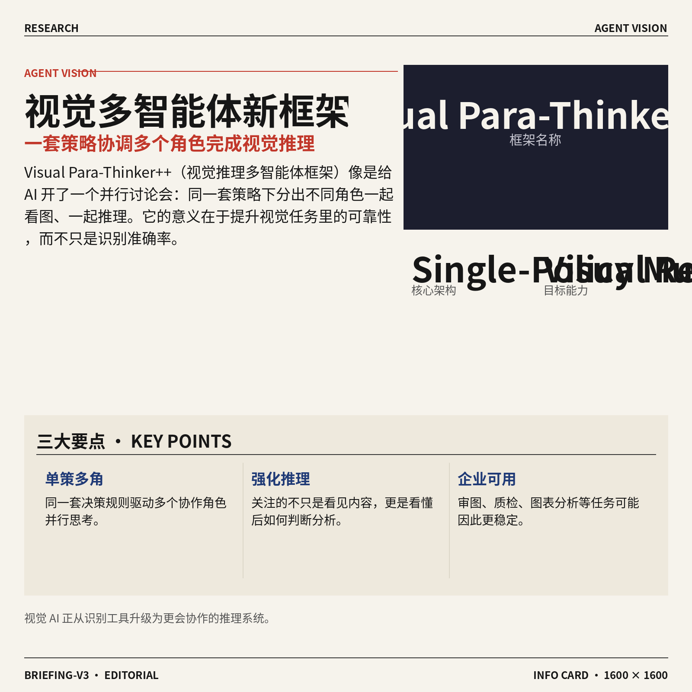

4. **Visual Para-Thinker++（面向视觉推理的多智能体框架）探索“一套策略管多个分工角色”。**  
它是一种 **Single-Policy Multi-Agent Framework（单策略多智能体框架，用同一套决策规则驱动多个协作角色）**，目标是提升 **Visual Reasoning（视觉推理，不只是识别图像内容，还要根据图像进行判断和分析）** 能力 🧠。你可以把它想成一个“AI 小组讨论”机制：虽然背后是同一个大脑，但会分出不同角色并行思考，再把结果汇总。对企业应用来说，这类路线有望让 AI 在审图、质检、图表分析、医疗影像辅助等任务上更可靠，因为它不只“看见”，还更强调“看懂后怎么推理”。[论文页面(briefing)](https://huggingface.co/papers/2606.09290)


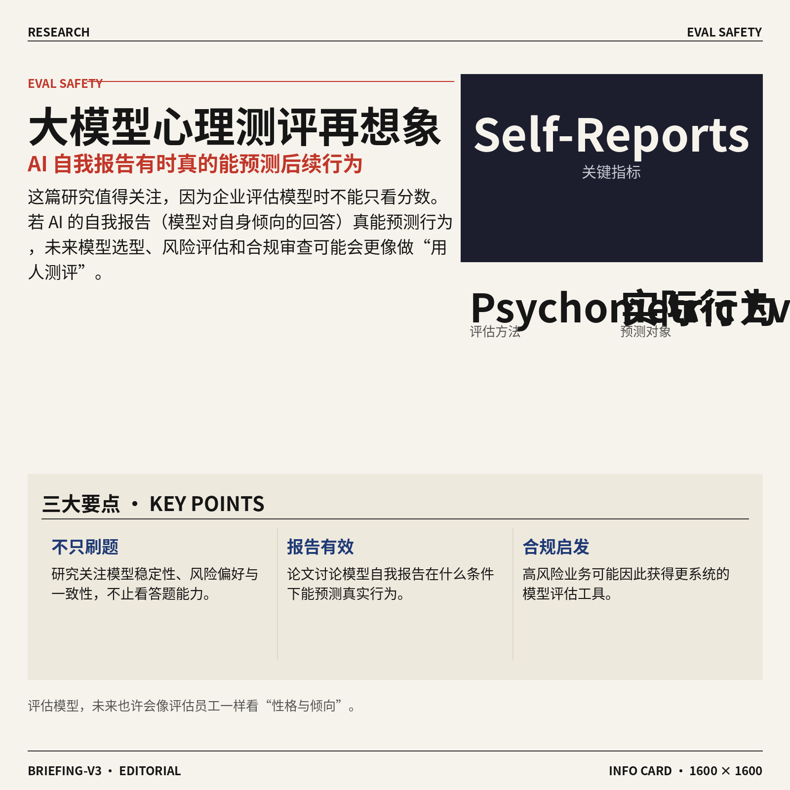

5. **《重新思考大模型心理测评》提出：AI 的“自我报告”有时真的能预测行为。**  
这篇论文讨论 **Psychometric Evaluation（心理测量式评估，用类似人格测试的方法观察模型行为）** 在大模型上的有效性，重点追问：模型给出的 **Self-Reports（自我报告，也就是它对自己倾向和选择的回答）**，究竟在什么情况下能预测实际行为 📋。这件事很关键，因为很多公司正在尝试评估 AI 的稳定性、风险偏好和一致性，而不是只看答题分数。若这条研究线走通，未来企业在选模型、做合规评估、设计高风险业务流程时，可能会有更像“用人测评”的 AI 评估工具。[论文页面(briefing)](https://huggingface.co/papers/2606.12730)

![《重新思考大模型心理测评》提出：AI 的“自我报告”有时真的能预测行为](https://image.pollinations.ai/prompt/%E3%80%8A%E9%87%8D%E6%96%B0%E6%80%9D%E8%80%83%E5%A4%A7%E6%A8%A1%E5%9E%8B%E5%BF%83%E7%90%86%E6%B5%8B%E8%AF%84%E3%80%8B%E6%8F%90%E5%87%BA%EF%BC%9AAI%20%E7%9A%84%E2%80%9C%E8%87%AA%E6%88%91%E6%8A%A5%E5%91%8A%E2%80%9D%E6%9C%89%E6%97%B6%E7%9C%9F%E7%9A%84%E8%83%BD%E9%A2%84%E6%B5%8B%E8%A1%8C%E4%B8%BA.%20%E3%80%8A%E9%87%8D%E6%96%B0%E6%80%9D%E8%80%83%E5%A4%A7%E6%A8%A1%E5%9E%8B%E5%BF%83%E7%90%86%E6%B5%8B%E8%AF%84%E3%80%8B%E6%8F%90%E5%87%BA%EF%BC%9AAI%20%E7%9A%84%E2%80%9C%E8%87%AA%E6%88%91%E6%8A%A5%E5%91%8A%E2%80%9D%E6%9C%89%E6%97%B6%E7%9C%9F%E7%9A%84%E8%83%BD%E9%A2%84%E6%B5%8B%E8%A1%8C%E4%B8%BA%E3%80%82%20%E8%BF%99%E7%AF%87%E8%AE%BA%E6%96%87%E8%AE%A8%E8%AE%BA%20Psychometric%20Evaluation%EF%BC%88%E5%BF%83%E7%90%86%E6%B5%8B%E9%87%8F%E5%BC%8F%E8%AF%84%E4%BC%B0%EF%BC%8C%E7%94%A8%E7%B1%BB%E4%BC%BC%E4%BA%BA%2C%20technical%20infographic%20diagram%2C%20architecture%20flowchart%2C%20clean%20vector%20illustration%2C%20educational%20style%2C%20no%20text%20overlay%2C%20modern%20minimal%2C%20wide%20aspect?width=1200&height=675&nologo=true&seed=10931)

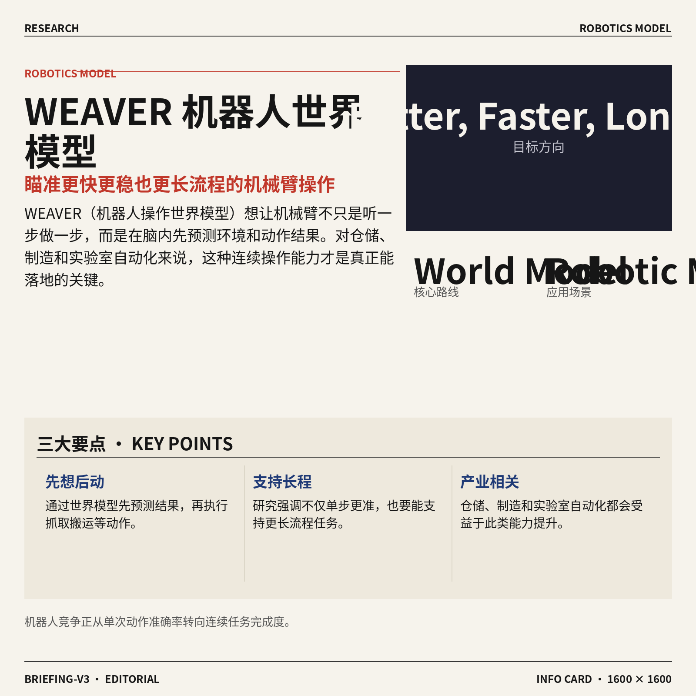

6. **WEAVER（一种机器人操作世界模型）想让机械臂干活更快、更稳、更持久。**  
论文把重点放在 **World Model（世界模型，让机器人先在“脑内”预测环境和动作结果）** 用于 **Robotic Manipulation（机器人操作，比如抓取、搬运、摆放物体）** 的效果提升上 🤖。标题里的 “Better, Faster, Longer” 直接点出目标：更好、更快、支持更长流程任务。对普通读者来说，这意味着机器人不只是“按指令动一下”，而是在连续操作中更懂上下文，未来在仓储、制造、实验室自动化等场景会更有实际价值。[论文页面(briefing)](https://huggingface.co/papers/2606.13672)

![WEAVER（一种机器人操作世界模型）想让机械臂干活更快、更稳、更持久](https://image.pollinations.ai/prompt/WEAVER%EF%BC%88%E4%B8%80%E7%A7%8D%E6%9C%BA%E5%99%A8%E4%BA%BA%E6%93%8D%E4%BD%9C%E4%B8%96%E7%95%8C%E6%A8%A1%E5%9E%8B%EF%BC%89%E6%83%B3%E8%AE%A9%E6%9C%BA%E6%A2%B0%E8%87%82%E5%B9%B2%E6%B4%BB%E6%9B%B4%E5%BF%AB%E3%80%81%E6%9B%B4%E7%A8%B3%E3%80%81%E6%9B%B4%E6%8C%81%E4%B9%85.%20WEAVER%EF%BC%88%E4%B8%80%E7%A7%8D%E6%9C%BA%E5%99%A8%E4%BA%BA%E6%93%8D%E4%BD%9C%E4%B8%96%E7%95%8C%E6%A8%A1%E5%9E%8B%EF%BC%89%E6%83%B3%E8%AE%A9%E6%9C%BA%E6%A2%B0%E8%87%82%E5%B9%B2%E6%B4%BB%E6%9B%B4%E5%BF%AB%E3%80%81%E6%9B%B4%E7%A8%B3%E3%80%81%E6%9B%B4%E6%8C%81%E4%B9%85%E3%80%82%20%E8%AE%BA%E6%96%87%E6%8A%8A%E9%87%8D%E7%82%B9%E6%94%BE%E5%9C%A8%20World%20Model%EF%BC%88%E4%B8%96%E7%95%8C%E6%A8%A1%E5%9E%8B%EF%BC%8C%E8%AE%A9%E6%9C%BA%E5%99%A8%E4%BA%BA%E5%85%88%E5%9C%A8%E2%80%9C%E8%84%91%E5%86%85%E2%80%9D%E9%A2%84%E6%B5%8B%E7%8E%AF%E5%A2%83%E5%92%8C%E5%8A%A8%E4%BD%9C%E7%BB%93%2C%20technical%20infographic%20diagram%2C%20architecture%20flowchart%2C%20clean%20vector%20illustration%2C%20educational%20style%2C%20no%20text%20overlay%2C%20modern%20minimal%2C%20wide%20aspect?width=1200&height=675&nologo=true&seed=10962)


7. **研究称 AI 编码 Agent 往往能找到正确文件，却抓不准真正关键的代码行。**  
The Decoder 报道援引一项研究指出，**AI coding agents（AI 编码助手，能自动读代码、改代码、提修复方案的工具）** 在定位问题时常常“方向对了、下手偏了” 😅：它们能进入正确文件，却不一定锁定最重要的那几行。这个发现很有现实意义，因为很多团队已经开始让 AI 参与开发流程，但这类工具如果只做到“粗定位”，就仍然离真正替代人工排查差一截。对非研发同事也值得关注：这说明 AI 写代码正在变实用，但短期内更像“高级副驾驶”，还不是可以完全放手的“自动驾驶”。[完整报道(briefing)](https://the-decoder.com/ai-coding-agents-find-the-right-file-but-miss-the-exact-lines-that-matter-study-shows/)


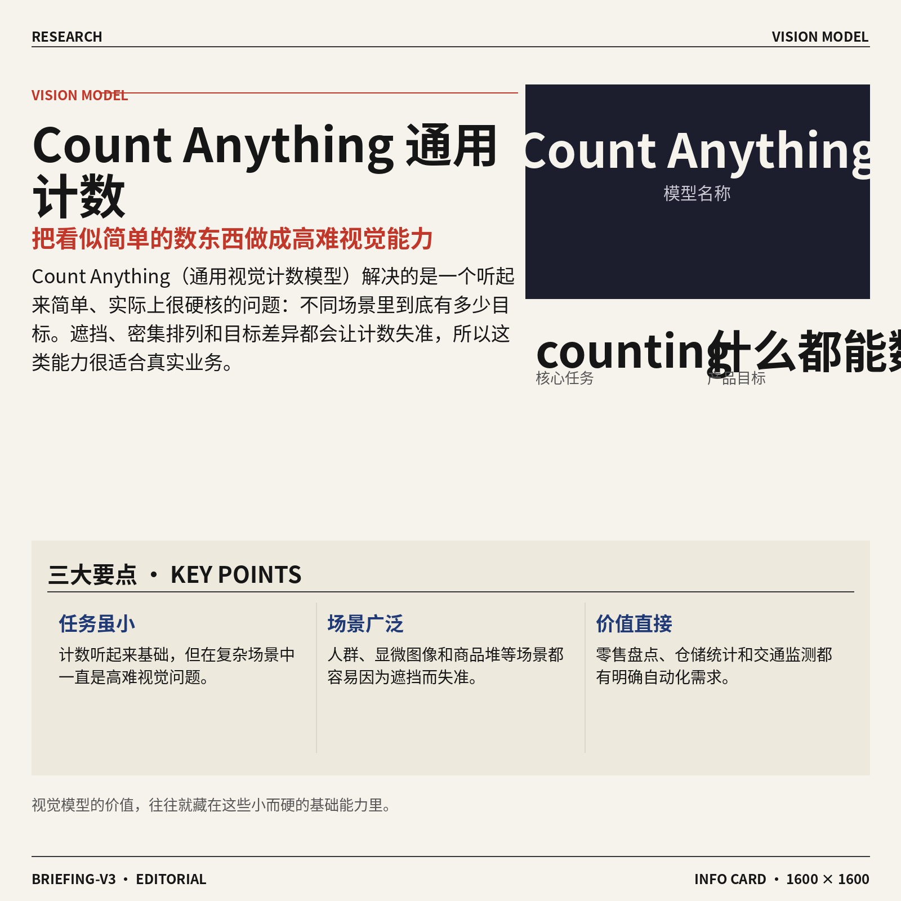

8. **Count Anything（一个“看到什么都能数”的视觉模型）把“数东西”这件小事做成了硬功夫。**  
The Decoder 介绍的这个新模型，目标非常直白：让 AI 能在不同场景里准确完成 **counting（计数，也就是识别并统计画面中的目标数量）** 🔍。听起来简单，但现实里从人群、显微图像到杂乱商品堆，计数都很容易因为遮挡、密集排列或目标差异而失准，所以“什么都能数”其实是个很难的视觉任务。它的潜在价值很实际，像零售盘点、仓储统计、交通流量监测、实验数据读取等场景，都可能因为这类模型变得更自动化。[完整报道(briefing)](https://the-decoder.com/new-ai-model-called-count-anything-does-exactly-what-it-says-and-thats-harder-than-it-sounds/)

![Count Anything（一个“看到什么都能数”的视觉模型）把“数东西”这件小事做成了硬功夫](https://image.pollinations.ai/prompt/Count%20Anything%EF%BC%88%E4%B8%80%E4%B8%AA%E2%80%9C%E7%9C%8B%E5%88%B0%E4%BB%80%E4%B9%88%E9%83%BD%E8%83%BD%E6%95%B0%E2%80%9D%E7%9A%84%E8%A7%86%E8%A7%89%E6%A8%A1%E5%9E%8B%EF%BC%89%E6%8A%8A%E2%80%9C%E6%95%B0%E4%B8%9C%E8%A5%BF%E2%80%9D%E8%BF%99%E4%BB%B6%E5%B0%8F%E4%BA%8B%E5%81%9A%E6%88%90%E4%BA%86%E7%A1%AC%E5%8A%9F%E5%A4%AB.%20Count%20Anything%EF%BC%88%E4%B8%80%E4%B8%AA%E2%80%9C%E7%9C%8B%E5%88%B0%E4%BB%80%E4%B9%88%E9%83%BD%E8%83%BD%E6%95%B0%E2%80%9D%E7%9A%84%E8%A7%86%E8%A7%89%E6%A8%A1%E5%9E%8B%EF%BC%89%E6%8A%8A%E2%80%9C%E6%95%B0%E4%B8%9C%E8%A5%BF%E2%80%9D%E8%BF%99%E4%BB%B6%E5%B0%8F%E4%BA%8B%E5%81%9A%E6%88%90%E4%BA%86%E7%A1%AC%E5%8A%9F%E5%A4%AB%E3%80%82%20The%20Decoder%20%E4%BB%8B%E7%BB%8D%E7%9A%84%E8%BF%99%E4%B8%AA%E6%96%B0%E6%A8%A1%E5%9E%8B%EF%BC%8C%E7%9B%AE%E6%A0%87%E9%9D%9E%E5%B8%B8%E7%9B%B4%E7%99%BD%EF%BC%9A%E8%AE%A9%2C%20technical%20infographic%20diagram%2C%20architecture%20flowchart%2C%20clean%20vector%20illustration%2C%20educational%20style%2C%20no%20text%20overlay%2C%20modern%20minimal%2C%20wide%20aspect?width=1200&height=675&nologo=true&seed=11024)

### 🟡 行业展望与社会影响

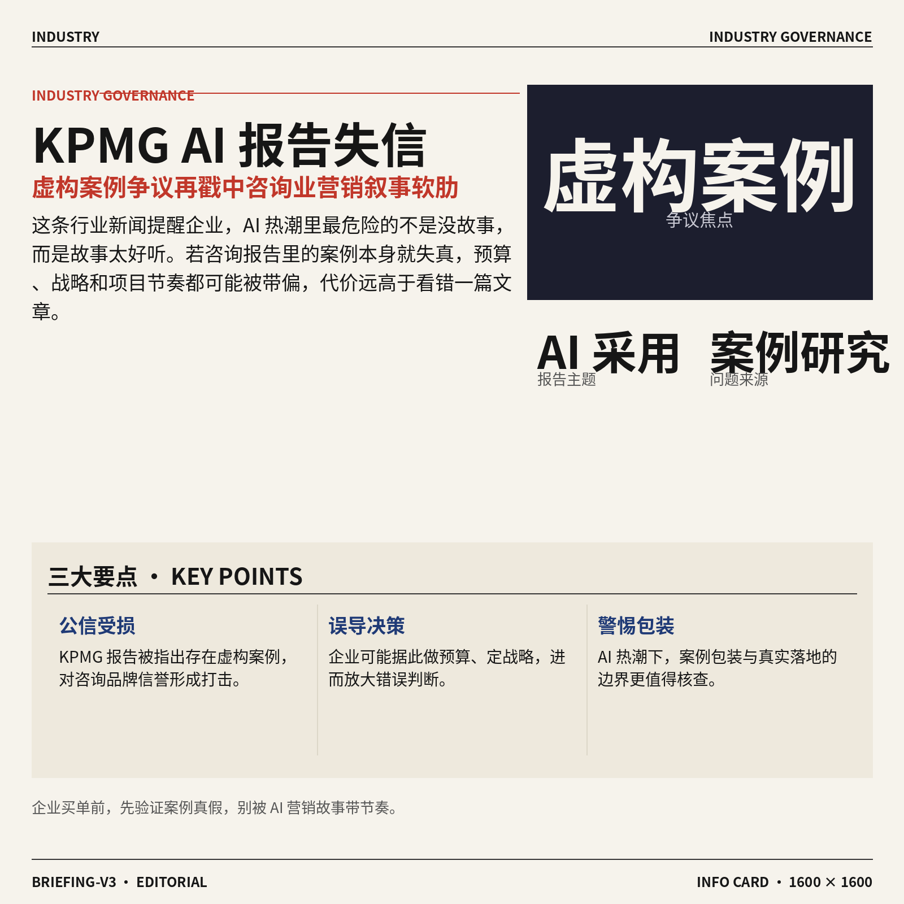

1. **KPMG 被曝在 AI 报告中虚构案例，营销叙事的可信度再受拷问。**  
KPMG 发布的一份劝说客户加速 **AI 采用** 的报告，被指出其中部分**案例研究**存在虚构问题，这对咨询行业的公信力是个不小的打击 😶。对企业读者来说，真正的风险不只是“看错一份报告”，而是可能基于失真的成功故事做预算、定战略、推项目。AI 热潮下，**案例包装**和**真实落地**之间的边界，正在变得越来越值得警惕。[完整报道(briefing)](https://the-decoder.com/kpmg-fabricated-ai-case-studies-in-a-report-designed-to-sell-clients-on-ai-adoption/)

![KPMG 被曝在 AI 报告中虚构案例，营销叙事的可信度再受拷问](https://image.pollinations.ai/prompt/KPMG%20%E8%A2%AB%E6%9B%9D%E5%9C%A8%20AI%20%E6%8A%A5%E5%91%8A%E4%B8%AD%E8%99%9A%E6%9E%84%E6%A1%88%E4%BE%8B%EF%BC%8C%E8%90%A5%E9%94%80%E5%8F%99%E4%BA%8B%E7%9A%84%E5%8F%AF%E4%BF%A1%E5%BA%A6%E5%86%8D%E5%8F%97%E6%8B%B7%E9%97%AE.%20KPMG%20%E8%A2%AB%E6%9B%9D%E5%9C%A8%20AI%20%E6%8A%A5%E5%91%8A%E4%B8%AD%E8%99%9A%E6%9E%84%E6%A1%88%E4%BE%8B%EF%BC%8C%E8%90%A5%E9%94%80%E5%8F%99%E4%BA%8B%E7%9A%84%E5%8F%AF%E4%BF%A1%E5%BA%A6%E5%86%8D%E5%8F%97%E6%8B%B7%E9%97%AE%E3%80%82%20KPMG%20%E5%8F%91%E5%B8%83%E7%9A%84%E4%B8%80%E4%BB%BD%E5%8A%9D%E8%AF%B4%E5%AE%A2%E6%88%B7%E5%8A%A0%E9%80%9F%20AI%20%E9%87%87%E7%94%A8%20%E7%9A%84%E6%8A%A5%E5%91%8A%EF%BC%8C%E8%A2%AB%E6%8C%87%E5%87%BA%E5%85%B6%E4%B8%AD%E9%83%A8%E5%88%86%E6%A1%88%E4%BE%8B%E7%A0%94%E7%A9%B6%E5%AD%98%E5%9C%A8%E8%99%9A%E6%9E%84%E9%97%AE%E9%A2%98%EF%BC%8C%E8%BF%99%2C%20technical%20infographic%20diagram%2C%20architecture%20flowchart%2C%20clean%20vector%20illustration%2C%20educational%20style%2C%20no%20text%20overlay%2C%20modern%20minimal%2C%20wide%20aspect?width=1200&height=675&nologo=true&seed=10807)

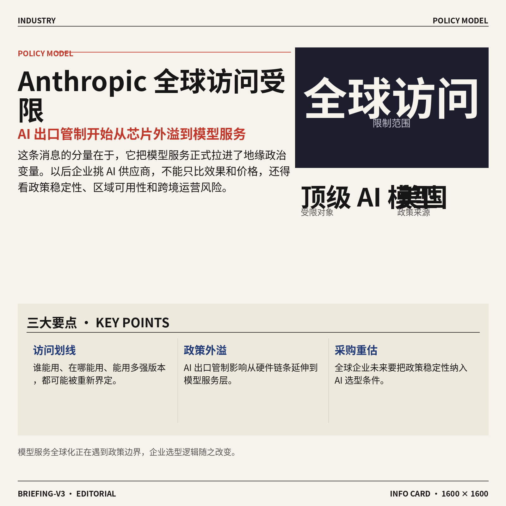

2. **美国要求限制 Anthropic 顶级模型全球访问，AI 出口管制开始外溢。**  
多家报道都指向同一件事：美国方面要求 Anthropic 限制其顶级 **AI 模型**的全球访问，这已经不只是企业产品策略，而是明显带上了**地缘政治**色彩 🌍。这里的“访问限制”可以理解为谁能用、在哪能用、能用到多强版本，都可能被政策重新划线。对全球企业而言，这意味着未来选择 AI 供应商时，除了看效果和价格，还得评估**政策稳定性**与**跨境可用性**。[事件梳理(briefing)](https://news.google.com/rss/articles/CBMiswFBVV95cUxOS0JVZ1VmVE9Tam15QlVrVURFYkFKaDRCenItc1JZWGlaakl3ZmhIUVFfbE4yMUhaQmdIUDlHVnJxT1FONWdBWW1ZREFPcHJBQVhIUFdYd28tNEVzSS1FdVZBcGNLdG01bDB3T2p2dnpBSDY1UUV5N3N5dEx3ejZJZk9zNzZxRlhPdnJHYmRPeDlrQzNVMGxSYkg4YUoxQ21lbURBY0ZpczRpSkU3SktvbUxpQdIBuAFBVV95cUxONGMzSmFWQzJhLWV5ckJsX2dXQ2FuVk5rMjQ5dGZjblRVSzNuUU9lRjRMOHRzdGRUQ2RPbGJBMTFmczM3eEZHYVA1bG1vUFVjWkYzQUpMRXN5dmVjV0t3YTJlRlBmbDhmSkZlTXJsSXM4V0pHeDc0cmpBS1ROQkxxcDkzcmFjVjVaOVZwNGhOU3FwNENFZ0g3RzFmaC1maXNjTEQ3TGlZaWhXeU5iWTN4Q1ctRVd6eVNt?oc=5) [批评声音(briefing)](https://news.google.com/rss/articles/CBMipgFBVV95cUxPVm9vUU5DLXZ3RkpsbTJnRy03NXlZNm5FeHN3VHpwWEhyR1BMMGdnVkk5RXQ2WTliZ19qQnBVbVdac3BrbWZNLTlPSTRTSWU1OUFZZFp0VlF4bXpOdHhHWHJ0LW1RTHAxY0VsZ01pQjJBVGdfeTlaN1dGTWtnbGdzVEZKMm9way0talAxWnR2QlZIb1lCLVkzbVZNWkxMMmlMMFA1ZVV3?oc=5)


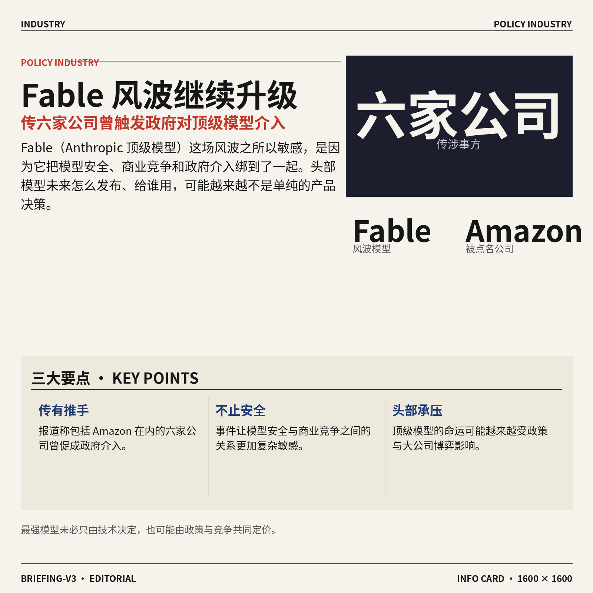

3. **Anthropic 的 Fable（Anthropic 的一款顶级 AI 模型）风波升级，传六家公司曾触发政府介入。**  
The Decoder 报道称，Amazon 等六家公司据传促成了政府对 Anthropic **Fable** 的整治行动，这让“模型安全”与“商业竞争”之间的关系更耐人寻味 🧩。Fable 这类顶级模型一旦被视为过于敏感，监管就可能不再只盯着公开风险，也会关注它会被谁拿去用、是否影响产业格局。对行业来说，这释放了一个信号：未来**头部模型**的命运，可能越来越受大公司博弈和政策判断共同影响。[原始报道(briefing)](https://the-decoder.com/amazon-and-five-other-companies-reportedly-triggered-the-government-crackdown-on-anthropics-fable-model/)


4. **Google DeepMind 支持多智能体安全倡议，AI 不再只是“单个助手”问题。**  
Google DeepMind 公开支持一项关于 **multi-agent（多智能体，指多个 AI 彼此协作或对抗完成任务）** 安全的呼吁，说明行业担心的风险正在升级 🤖。如果未来不是一个 AI 帮你干活，而是一群 AI 自动分工、互相调用，那么失控、误判和责任归属都会变得更复杂。对企业用户来说，这提醒大家：以后评估 AI，不只看单点功能，更要看它在**协作场景**中的行为边界。[倡议报道(briefing)](https://news.google.com/rss/articles/CBMitgFBVV95cUxPekFzN2VSVEQ1RjJqLWRNdklFc2YzNGNjei1oMW5CdnRxbUdzcUpQdUFaQV9YTlZvNGpIUXIyZEo2Nk5HVlRySGdmV0YwMS1qRFg2X0FoU3RrTHhwV1hBZnU0alRSdHNIRkEzZ2lYQ2lWdnJ1UmJ2QWZIOHNWMEdXaEx1Mkh1ekxjQmhwN2VyX3RFRXI2OHlnaDZYMUwzSzdPTjlBLVpmZ09IQ2t3d2trLUpUTmlxZw?oc=5)


5. **生成式 AI 与 Agent 型 AI 的成本治理，正成为企业落地成败关键。**  
SiliconANGLE 总结了 10 条优化 **generative AI（生成式 AI，能写文案、做图、生成内容的 AI）** 和 **agentic AI（Agent 型 AI，能自动拆任务并执行流程的 AI）** 成本的实践，说明如今企业最现实的问题已不只是“要不要上”，而是“上了之后值不值” 💰。尤其 Agent 一旦接入多个系统、反复调用模型，费用就可能像流水一样往外跑。对管理层来说，AI 项目进入下一阶段后，**成本控制**、**使用频率**和**投入产出比**会比“试点成功”更重要。[成本优化建议(briefing)](https://news.google.com/rss/articles/CBMimAFBVV95cUxNbUdRdWxCOXQwTkxHeFFvY0lfZXNUdlgwVlhselk4ME11Q0RiN3IxRWNLV3YzdDMtVnBBcWNIczZ6aXlOc0V6SUZNUDJhcWR5R2w4VWFOMzB5alhwUnhjRUV4TzRtaUw4bWo0Qkd2eGdfbXZpU1BPXzEycjZCQXVESDZ3N2tzNGlxOUwyWDBldTJLb3lSNVhWTg?oc=5)


### 🟣 开源TOP项目

1. **google/skills（Google 开源的产品技能组件仓库）让 Agent 更容易调用 Google 生态能力。**
这个项目主打 **Agent Skills**（给 AI 助手准备好的“技能模块”，让它能按规范调用具体产品能力），面向的是 Google 自家产品和技术栈的集成场景。对团队来说，它像一套可复用的“插件清单”，能帮助大家更快把 **AI 助手**接进现有工作流，而不是每次都从零搭功能 💡。如果你关注企业内部工具、自动化办公或跨产品协作，这类标准化技能仓库的价值会很直观：复用性高、接入更省事。[GitHub 项目页(briefing)](https://github.com/google/skills)


2. **Understand-Anything（一款把代码变成可交互知识图谱的开源工具）想让“读代码”变成“看地图”。**
它的核心思路是把代码转成 **interactive knowledge graph**（可交互知识图谱，把复杂代码关系画成可点击、可搜索、可提问的结构图），让人不只“看见”代码，还能真正“理解”代码之间怎么连起来 🚀。项目说明里强调，用户可以对代码做 **search**（搜索）和提问，这对接手老项目、做团队知识交接尤其友好。它还兼容 Claude Code、Codex、Cursor、Copilot、Gemini CLI（命令行版 Gemini，用打字指令驱动 AI 的工具），说明它不是单点工具，而是想嵌进主流 **编码 Agent** 工作流里。[GitHub 仓库(briefing)](https://github.com/Egonex-AI/Understand-Anything)


3. **agentsview（一款面向编码 Agent 的本地优先分析工具）把 AI 编程过程也纳入“数据看板”。**
这个项目聚焦 **local-first**（数据优先保存在本地设备，而不是先上传云端）的会话智能与分析，目标是帮用户看清 Claude Code、Codex 等 20 多种 **编码 Agent** 的使用情况。简单说，它像给 AI 编程助手装了一个“后台统计面板”，方便团队理解谁在用、怎么用、效果如何 📊。项目还提到它可作为 **ccusage**（一类统计 Claude Code 使用情况的工具）的更快替代品，强调的是性能和分析效率。[项目主页(briefing)](https://github.com/kenn-io/agentsview)


4. **knowledge-catalog（Google Cloud 的知识目录工具与示例集）瞄准企业知识资产整理。**
从仓库描述看，这是一套围绕 **Knowledge Catalog**（知识目录，把分散的文档、数据和知识条目做统一整理与索引）提供的工具和示例，服务于 Google Cloud 场景。对非技术团队也很好理解：企业资料往往散落在文档、表格、系统里，知识目录就是把这些内容更有条理地“编目”和“找出来” 🧭。这类项目的意义不在炫技，而在于让组织内部知识更容易沉淀、复用与检索。[官方仓库页(briefing)](https://github.com/GoogleCloudPlatform/knowledge-catalog)


5. **frontend-slides（一款用前端方式生成网页幻灯片的开源项目）把做 PPT 变成“让 Agent 写页面”。**
这个项目的定位很直接：利用 **frontend**（前端，也就是网页界面开发能力）来创建漂亮的网页幻灯片，并明确结合 **coding agent**（会帮你写代码、搭页面的 AI 助手）的能力。对内容团队、运营和设计协作来说，这类方向很有意思——幻灯片不再只是手工拖拽排版，也可以变成“描述需求 → AI 出页面”的流程 ✨。如果后续生态成熟，做演示稿、产品介绍页、活动提案的效率可能都会被重新定义。[GitHub 项目页(briefing)](https://github.com/zarazhangrui/frontend-slides)

![frontend-slides（一款用前端方式生成网页幻灯片的开源项目）把做 PPT 变成“让 Agent 写页面”](https://image.pollinations.ai/prompt/frontend-slides%EF%BC%88%E4%B8%80%E6%AC%BE%E7%94%A8%E5%89%8D%E7%AB%AF%E6%96%B9%E5%BC%8F%E7%94%9F%E6%88%90%E7%BD%91%E9%A1%B5%E5%B9%BB%E7%81%AF%E7%89%87%E7%9A%84%E5%BC%80%E6%BA%90%E9%A1%B9%E7%9B%AE%EF%BC%89%E6%8A%8A%E5%81%9A%20PPT%20%E5%8F%98%E6%88%90%E2%80%9C%E8%AE%A9%20Agent%20%E5%86%99%E9%A1%B5%E9%9D%A2%E2%80%9D.%20frontend-slides%EF%BC%88%E4%B8%80%E6%AC%BE%E7%94%A8%E5%89%8D%E7%AB%AF%E6%96%B9%E5%BC%8F%E7%94%9F%E6%88%90%E7%BD%91%E9%A1%B5%E5%B9%BB%E7%81%AF%E7%89%87%E7%9A%84%E5%BC%80%E6%BA%90%E9%A1%B9%E7%9B%AE%EF%BC%89%E6%8A%8A%E5%81%9A%20PPT%20%E5%8F%98%E6%88%90%E2%80%9C%E8%AE%A9%20Agent%20%E5%86%99%E9%A1%B5%E9%9D%A2%E2%80%9D%E3%80%82%20%E8%BF%99%E4%B8%AA%E9%A1%B9%E7%9B%AE%E7%9A%84%E5%AE%9A%E4%BD%8D%E5%BE%88%E7%9B%B4%E6%8E%A5%EF%BC%9A%E5%88%A9%E7%94%A8%20fronte%2C%20technical%20infographic%20diagram%2C%20architecture%20flowchart%2C%20clean%20vector%20illustration%2C%20educational%20style%2C%20no%20text%20overlay%2C%20modern%20minimal%2C%20wide%20aspect?width=1200&height=675&nologo=true&seed=11125)

6. **里约“自研”大模型争议：Nex-N2 issue（GitHub 议题页，用来公开讨论项目问题）指向模型可能是已有模型混合版本。**
这条候选内容本质上不是新项目发布，而是一则围绕 **LLM**（大语言模型，能理解和生成文字的 AI 模型）来源的公开质疑。根据标题，争议点在于里约热内卢所谓“本土自研”模型，可能只是对现有模型做了 **merge**（模型合并，把多个已有模型权重拼接或融合）处理，而非完全独立训练 🤔。这类事件对行业的提醒很现实：开源时代“有没有做出来”和“是不是原创做出来”是两回事，模型出处、训练路径和透明度会越来越重要。[争议讨论页(briefing)](https://github.com/nex-agi/Nex-N2/issues/4)

![里约“自研”大模型争议：Nex-N2 issue（GitHub 议题页，用来公开讨论项目问题）指向模型可能是已有模型混合版本](https://image.pollinations.ai/prompt/%E9%87%8C%E7%BA%A6%E2%80%9C%E8%87%AA%E7%A0%94%E2%80%9D%E5%A4%A7%E6%A8%A1%E5%9E%8B%E4%BA%89%E8%AE%AE%EF%BC%9ANex-N2%20issue%EF%BC%88GitHub%20%E8%AE%AE%E9%A2%98%E9%A1%B5%EF%BC%8C%E7%94%A8%E6%9D%A5%E5%85%AC%E5%BC%80%E8%AE%A8%E8%AE%BA%E9%A1%B9%E7%9B%AE%E9%97%AE%E9%A2%98%EF%BC%89%E6%8C%87%E5%90%91%E6%A8%A1%E5%9E%8B%E5%8F%AF%E8%83%BD%E6%98%AF%E5%B7%B2%E6%9C%89%E6%A8%A1%E5%9E%8B%E6%B7%B7%E5%90%88%E7%89%88%E6%9C%AC.%20%E9%87%8C%E7%BA%A6%E2%80%9C%E8%87%AA%E7%A0%94%E2%80%9D%E5%A4%A7%E6%A8%A1%E5%9E%8B%E4%BA%89%E8%AE%AE%EF%BC%9ANex-N2%20issue%EF%BC%88GitHub%20%E8%AE%AE%E9%A2%98%E9%A1%B5%EF%BC%8C%E7%94%A8%E6%9D%A5%E5%85%AC%E5%BC%80%E8%AE%A8%E8%AE%BA%E9%A1%B9%E7%9B%AE%E9%97%AE%E9%A2%98%EF%BC%89%E6%8C%87%E5%90%91%E6%A8%A1%E5%9E%8B%E5%8F%AF%E8%83%BD%E6%98%AF%E5%B7%B2%E6%9C%89%E6%A8%A1%E5%9E%8B%E6%B7%B7%E5%90%88%E7%89%88%E6%9C%AC%E3%80%82%20%E8%BF%99%E6%9D%A1%E5%80%99%E9%80%89%E5%86%85%E5%AE%B9%E6%9C%AC%E8%B4%A8%E4%B8%8A%E4%B8%8D%E6%98%AF%E6%96%B0%E9%A1%B9%E7%9B%AE%E5%8F%91%E5%B8%83%2C%20technical%20infographic%20diagram%2C%20architecture%20flowchart%2C%20clean%20vector%20illustration%2C%20educational%20style%2C%20no%20text%20overlay%2C%20modern%20minimal%2C%20wide%20aspect?width=1200&height=675&nologo=true&seed=11156)

### 🔴 社媒分享

1. **《Not everyone is using AI for everything》指出：并不是所有人都在把 AI 用到工作和生活的每个角落。**
这篇分享提醒我们，当前外界对 **AI 普及度** 的感知，可能被科技圈和高频用户“放大”了 💡。作者想表达的核心很直接：虽然 AI 话题很热，但普通人真实的 **使用频率**、**依赖程度**，未必已经到了“万事都找 AI”的阶段。对企业来说，这意味着别只盯着最先锋的一批用户做判断，还要看到更广泛员工和客户的真实接受度，产品推广、培训和流程改造都要更接地气一些。可查看这篇原文分享 [作者原文观点(briefing)](https://gabrielweinberg.com/p/people-are-consuming-ai-like-they) 🚀


---

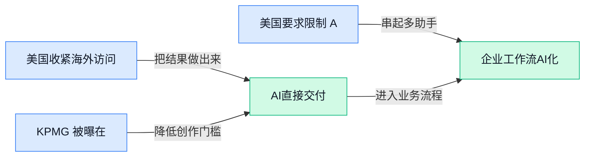
```mermaid
graph LR
A[美国收紧海外访问] -->|把结果做出来| D[AI直接交付]
B[KPMG 被曝在] -->|降低创作门槛| D
C[美国要求限制 A] -->|串起多助手| E[企业工作流AI化]
 D -->|进入业务流程| E
classDef blue fill:#dbeafe,stroke:#3b82f6,color:#111827
classDef green fill:#d1fae5,stroke:#10b981,color:#111827
class A,B,C blue
class D,E green
```

### 📊 行业洞察（今日 4 条）

1. Anthropic 的 Claude 与 Fable 5（被报道提及的高性能模型版本）因美国收紧海外访问而出现短暂可用后不可用。  
  【洞察】这表明顶级模型正从产品竞争转向政策约束竞争，因为地区限制已直接改变企业可用性与采购稳定性，机会是多供应商需求上升，风险是单一依赖更脆弱。

2. HYDRA-X（原生统一多模态模型）提出 Holistic Visual Tokenizers（整体式视觉分词器），把图像与文字放进同一理解框架。  
  【洞察】这说明多模态正从“拼接能力”走向“原生统一”，因为研究重点已不只是看图识字，而是共享表征，机会是复杂内容理解增强，风险是落地成本和效果仍待验证。

3. MoVerse（实时视频世界建模系统）结合 Video World Modeling（视频世界建模）与 Panoramic Gaussian Scaffold（全景高斯支架）追求实时动态理解。  
  【洞察】这意味着视频智能正从事后总结转向连续建模，因为核心价值已变成边看边理解场景变化，机会是交互式视频应用扩展，风险是对算力与数据质量要求更高。

4. KPMG 被曝在 AI 报告中虚构案例，相关报告原本用于劝说客户加速采用 AI。  
  【洞察】这反映行业叙事正进入信任重估阶段，因为市场不再只看愿景表达，而会追问案例真伪与复现性，机会是真实产品更易脱颖而出，风险是采购决策会更谨慎。

### 💭 对我们的启发（今日 2 条）

1. MoVerse 强调连续视频理解，我们若做视频剪辑软件，可加强镜头语义切分、角色轨迹识别与自动粗剪；机会是提升创作效率，风险是误判动作连续性会破坏成片节奏。

2. HYDRA-X 追求图文统一理解，我们可在内容创作工具里做“脚本+素材”联合编辑，如按文案自动找片段与配图；机会是降低检索成本，风险是跨模态匹配不准会增加返工。

