## AI资讯日报 2026/6/17

> AI 早报 · 每日早读 · 全网深度聚合

## **今日摘要**

```
DeepSeek 首引外部融资估值冲上500亿美元，ChatGPT 全球市占率却首次跌破50%
Anthropic 撤回计费改版先刹车，Microsoft Copilot Cowork 改按量收费还可能接入 DeepSeek
Google 上线 Android 17 与 Wear OS 7 把 Gemini 推向更多设备，OpenAI 用部署模拟预演模型上线表现
```

### 🔵 产品与功能更新

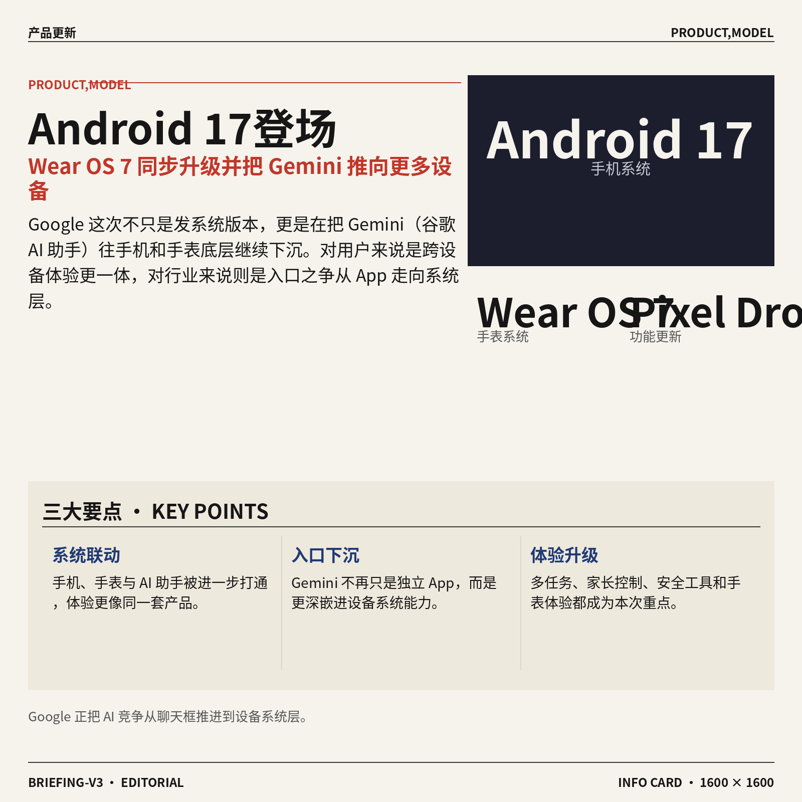

1. **Android 17 与 Wear OS 7 上线，Google 顺手把 Gemini 能力推到更多设备上。**  
Google 这次发布的不只是手机系统 **Android 17**，还包括智能手表系统 **Wear OS 7（Google 的智能手表操作系统）**，重点升级了**多任务处理**、**家长控制**、**安全工具**和手表体验 ⌚。配套推出的 **Pixel Drop（Google 给 Pixel 设备定期推送的一揽子新功能更新）**，还把 Google 最新的 **AI 模型（训练好的智能“大脑”，决定 AI 回答和处理能力）** 带到了自家设备上。对普通用户来说，这意味着手机、手表和 AI 助手会更像一个整体；对做产品和运营的同事来说，也能看到 Google 正在把 **Gemini** 更深地嵌进系统层，而不只是做成一个单独 App。更多细节可看 [TechCrunch 报道(briefing)](https://techcrunch.com/2026/06/16/android-17-launches-with-new-multitasking-tools-as-google-expands-gemini-features/) 💡


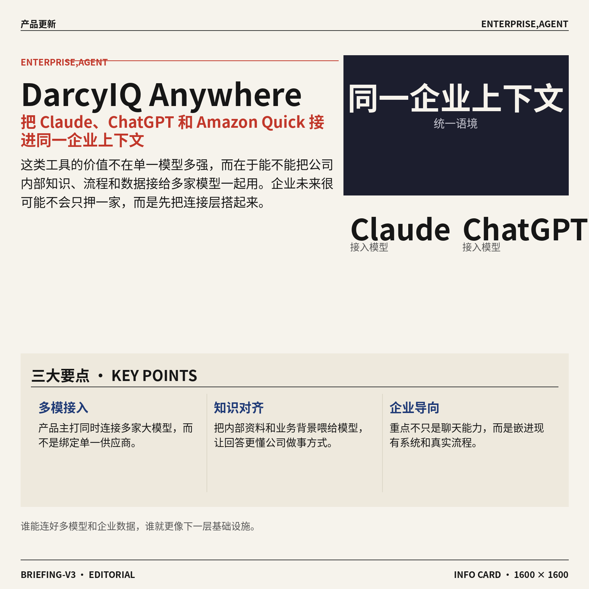

2. **DarcyIQ Anywhere（一款把多家大模型接入企业内部资料的工具）想把 Claude、ChatGPT 和 Amazon Quick 连进同一套企业上下文。**  
Innovative Solutions 发布了 **DarcyIQ Anywhere（面向企业的 AI 连接工具，核心是让模型能理解公司内部资料和业务背景）**，主打把 **Claude**、**ChatGPT** 以及 **Amazon Quick（亚马逊相关的企业智能服务，原文如此表述）** 接到统一的企业语境里。这里的“**企业上下文**”可以理解为公司自己的知识、流程和数据，让 AI 不只是会聊天，而是更懂“你们公司是怎么做事的” 🧩。这类产品的意义在于，企业未来未必只押注一家模型，而是更看重“谁能把多个模型接进现有系统并用起来”。原始信息可见 [发布消息入口(briefing)](https://news.google.com/rss/articles/CBMi-wFBVV95cUxQMXVodkFfQnktV3lhYTAyaEdoMVBHMnNSSW1OYmpBLXRxemdaVDBuNnpZU2JqbVNQcV9oM2tOeEZiVkdmZUlFYnhqUklTYXA3amYtWUVMSmxNN01zUnNCVjBfN2pBY0ZMb0tHM2RmMGszYnNLNHl2ajlZUmtuUGxjbmdOZUxveWJ1amdoR3ZrbHIxSUZKV1cybUlFdlZBNUI3eFNwZFhYdl8yZ0gxY01ZSGFUa21XRF9XaGp3RUF1b3huU1lfOFVoRzlRdXd0MzFRWmgzeW1yY2dqbTBEeHVIQ2VJUHBIYkh5WTVxZUI5R1k5V1l4Vk1SaTBQbw?oc=5) 🚀

![DarcyIQ Anywhere（一款把多家大模型接入企业内部资料的工具）想把 Claude、ChatGPT 和 Amazon Quick 连进同一套企业上下文](https://image.pollinations.ai/prompt/DarcyIQ%20Anywhere%EF%BC%88%E4%B8%80%E6%AC%BE%E6%8A%8A%E5%A4%9A%E5%AE%B6%E5%A4%A7%E6%A8%A1%E5%9E%8B%E6%8E%A5%E5%85%A5%E4%BC%81%E4%B8%9A%E5%86%85%E9%83%A8%E8%B5%84%E6%96%99%E7%9A%84%E5%B7%A5%E5%85%B7%EF%BC%89%E6%83%B3%E6%8A%8A%20Claude%E3%80%81ChatGPT%20%E5%92%8C%20Amazon%20Quick%20%E8%BF%9E%E8%BF%9B%E5%90%8C%E4%B8%80%E5%A5%97%E4%BC%81%E4%B8%9A%E4%B8%8A%E4%B8%8B%E6%96%87.%20DarcyIQ%20Anywhere%EF%BC%88%E4%B8%80%E6%AC%BE%E6%8A%8A%E5%A4%9A%E5%AE%B6%E5%A4%A7%E6%A8%A1%E5%9E%8B%E6%8E%A5%E5%85%A5%E4%BC%81%E4%B8%9A%E5%86%85%E9%83%A8%E8%B5%84%E6%96%99%E7%9A%84%E5%B7%A5%E5%85%B7%EF%BC%89%E6%83%B3%E6%8A%8A%20Claude%E3%80%81ChatGPT%20%E5%92%8C%20Amazon%20Quick%20%E8%BF%9E%E8%BF%9B%E5%90%8C%E4%B8%80%E5%A5%97%E4%BC%81%E4%B8%9A%E4%B8%8A%E4%B8%8B%E6%96%87%2C%20technical%20infographic%20diagram%2C%20architecture%20flowchart%2C%20clean%20vector%20illustration%2C%20educational%20style%2C%20no%20text%20overlay%2C%20modern%20minimal%2C%20wide%20aspect?width=1200&height=675&nologo=true&seed=11420)

### 🟢 前沿研究

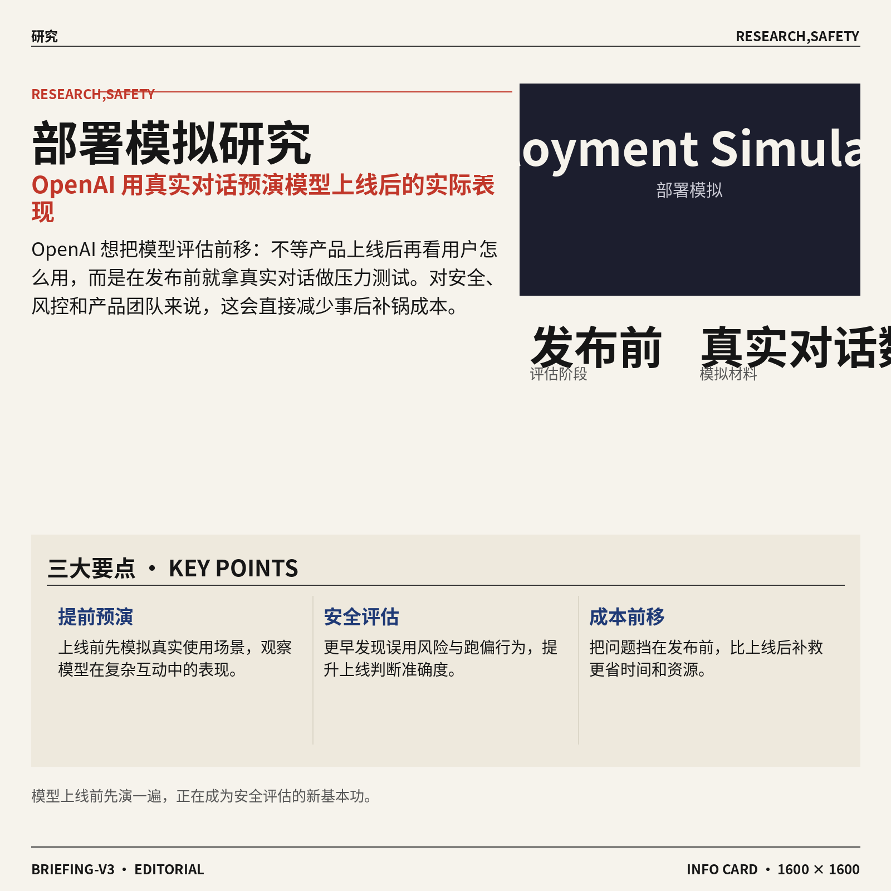

1. **OpenAI 提出 Deployment Simulation（部署模拟，用真实对话提前演练模型上线后的表现）来预测模型发布前行为。**  
OpenAI 这项研究的核心思路很直白：别等模型正式上线后再看用户会把它“用成什么样”，而是先拿**真实对话数据**做一轮“预演” 👀。所谓 **Deployment Simulation（部署模拟）**，就是在发布前模拟真实使用场景，提前观察模型在复杂互动里的表现，从而提升**安全评估**和效果判断的准确度。对公司里的产品、运营和风控同事来说，这意味着未来 AI 功能上线前，可能能更早发现“用户会怎么误用、模型会怎么跑偏”这类问题，减少事后补救成本。更多可看 [OpenAI 官方说明(briefing)](https://openai.com/index/deployment-simulation) 💡

![OpenAI 提出 Deployment Simulation（部署模拟，用真实对话提前演练模型上线后的表现）来预测模型发布前行为](https://image.pollinations.ai/prompt/OpenAI%20%E6%8F%90%E5%87%BA%20Deployment%20Simulation%EF%BC%88%E9%83%A8%E7%BD%B2%E6%A8%A1%E6%8B%9F%EF%BC%8C%E7%94%A8%E7%9C%9F%E5%AE%9E%E5%AF%B9%E8%AF%9D%E6%8F%90%E5%89%8D%E6%BC%94%E7%BB%83%E6%A8%A1%E5%9E%8B%E4%B8%8A%E7%BA%BF%E5%90%8E%E7%9A%84%E8%A1%A8%E7%8E%B0%EF%BC%89%E6%9D%A5%E9%A2%84%E6%B5%8B%E6%A8%A1%E5%9E%8B%E5%8F%91%E5%B8%83%E5%89%8D%E8%A1%8C%E4%B8%BA.%20OpenAI%20%E6%8F%90%E5%87%BA%20Deployment%20Simulation%EF%BC%88%E9%83%A8%E7%BD%B2%E6%A8%A1%E6%8B%9F%EF%BC%8C%E7%94%A8%E7%9C%9F%E5%AE%9E%E5%AF%B9%E8%AF%9D%E6%8F%90%E5%89%8D%E6%BC%94%E7%BB%83%E6%A8%A1%E5%9E%8B%E4%B8%8A%E7%BA%BF%E5%90%8E%E7%9A%84%E8%A1%A8%E7%8E%B0%EF%BC%89%E6%9D%A5%E9%A2%84%E6%B5%8B%E6%A8%A1%E5%9E%8B%E5%8F%91%E5%B8%83%E5%89%8D%E8%A1%8C%E4%B8%BA%E3%80%82%20OpenAI%20%E8%BF%99%E9%A1%B9%E7%A0%94%E7%A9%B6%E7%9A%84%E6%A0%B8%2C%20technical%20infographic%20diagram%2C%20architecture%20flowchart%2C%20clean%20vector%20illustration%2C%20educational%20style%2C%20no%20text%20overlay%2C%20modern%20minimal%2C%20wide%20aspect?width=1200&height=675&nologo=true&seed=10807)

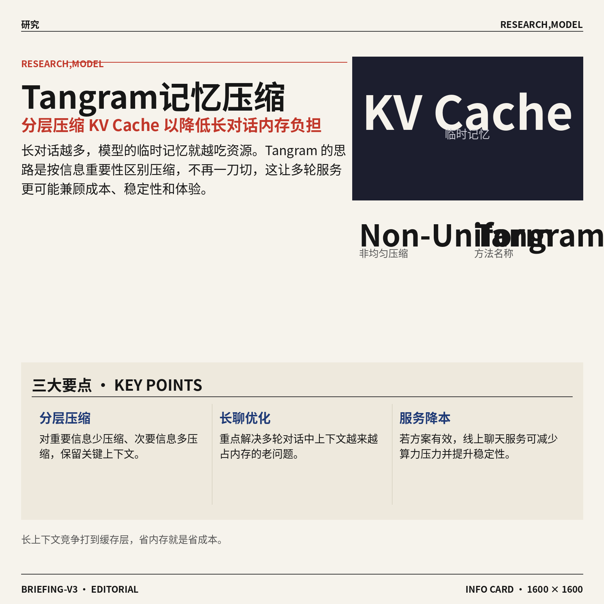

2. **Tangram（一种让大模型“分层压缩记忆”的新方法）瞄准多轮对话的 KV Cache（模型保存上下文的临时记忆）压缩。**  
这篇论文关注的是大模型在长对话里越来越“吃内存”的老问题，提出了 **Non-Uniform KV Cache Compression（非均匀 KV 缓存压缩，给不同信息分配不同压缩力度）**。这里的 **KV Cache（键值缓存）** 可以理解成模型为了记住前文而保留的“临时笔记”，对多轮聊天特别重要，但也非常占资源。Tangram 的价值在于，它不是一刀切地压缩所有内容，而是更精细地保留重要信息、压缩次要信息，有望让**多轮服务**更省算力也更稳 🚀。原文可见 [论文条目页(briefing)](https://huggingface.co/papers/2606.06302)

![Tangram（一种让大模型“分层压缩记忆”的新方法）瞄准多轮对话的 KV Cache（模型保存上下文的临时记忆）压缩](https://image.pollinations.ai/prompt/Tangram%EF%BC%88%E4%B8%80%E7%A7%8D%E8%AE%A9%E5%A4%A7%E6%A8%A1%E5%9E%8B%E2%80%9C%E5%88%86%E5%B1%82%E5%8E%8B%E7%BC%A9%E8%AE%B0%E5%BF%86%E2%80%9D%E7%9A%84%E6%96%B0%E6%96%B9%E6%B3%95%EF%BC%89%E7%9E%84%E5%87%86%E5%A4%9A%E8%BD%AE%E5%AF%B9%E8%AF%9D%E7%9A%84%20KV%20Cache%EF%BC%88%E6%A8%A1%E5%9E%8B%E4%BF%9D%E5%AD%98%E4%B8%8A%E4%B8%8B%E6%96%87%E7%9A%84%E4%B8%B4%E6%97%B6%E8%AE%B0%E5%BF%86%EF%BC%89%E5%8E%8B%E7%BC%A9.%20Tangram%EF%BC%88%E4%B8%80%E7%A7%8D%E8%AE%A9%E5%A4%A7%E6%A8%A1%E5%9E%8B%E2%80%9C%E5%88%86%E5%B1%82%E5%8E%8B%E7%BC%A9%E8%AE%B0%E5%BF%86%E2%80%9D%E7%9A%84%E6%96%B0%E6%96%B9%E6%B3%95%EF%BC%89%E7%9E%84%E5%87%86%E5%A4%9A%E8%BD%AE%E5%AF%B9%E8%AF%9D%E7%9A%84%20KV%20Cache%EF%BC%88%E6%A8%A1%E5%9E%8B%E4%BF%9D%E5%AD%98%E4%B8%8A%E4%B8%8B%E6%96%87%E7%9A%84%E4%B8%B4%E6%97%B6%E8%AE%B0%E5%BF%86%EF%BC%89%E5%8E%8B%E7%BC%A9%E3%80%82%20%E8%BF%99%E7%AF%87%E8%AE%BA%E6%96%87%E5%85%B3%E6%B3%A8%E7%9A%84%E6%98%AF%E5%A4%A7%E6%A8%A1%E5%9E%8B%E5%9C%A8%E9%95%BF%E5%AF%B9%E8%AF%9D%E9%87%8C%E8%B6%8A%E6%9D%A5%E8%B6%8A%2C%20technical%20infographic%20diagram%2C%20architecture%20flowchart%2C%20clean%20vector%20illustration%2C%20educational%20style%2C%20no%20text%20overlay%2C%20modern%20minimal%2C%20wide%20aspect?width=1200&height=675&nologo=true&seed=10838)

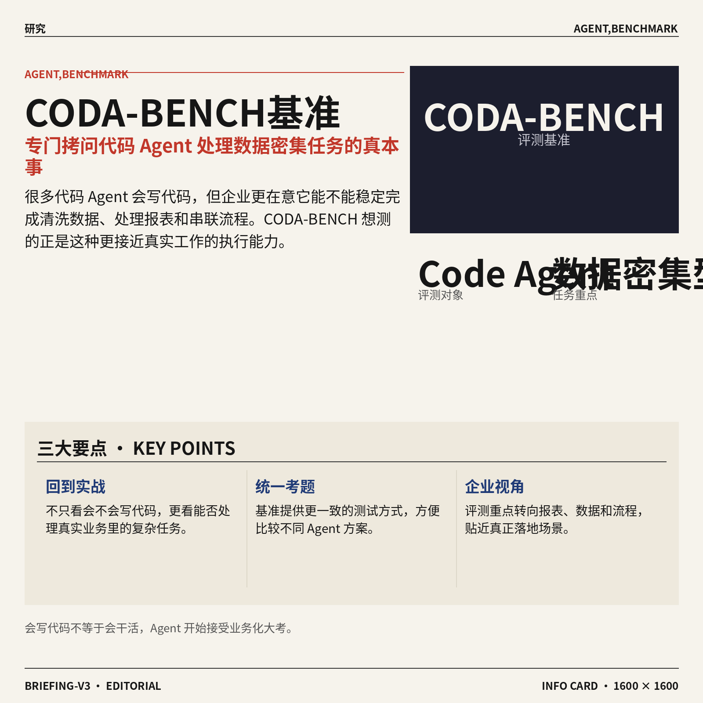

3. **CODA-BENCH（专测代码 Agent 处理数据密集任务能力的基准）开始追问：会写代码，不等于真会干活。**  
很多 **Code Agent（代码 Agent，能自动写代码并执行任务的 AI 助手）** 看起来很强，但论文把问题拉回现实：一旦任务变成**数据密集型工作**，它们到底行不行？CODA-BENCH 本质上是一个 **Benchmark（评测基准，像统一考试题库）**，专门拿来测这类 Agent 在更贴近真实工作的任务里表现如何。对非技术同事来说，这类研究很重要，因为企业真正关心的不是 AI 会不会“写一段漂亮代码”，而是它能不能稳定处理报表、清洗数据、串联流程这类复杂工作流 📊。详情可看 [评测论文页面(briefing)](https://huggingface.co/papers/2606.15300)

![CODA-BENCH（专测代码 Agent 处理数据密集任务能力的基准）开始追问：会写代码，不等于真会干活](https://image.pollinations.ai/prompt/CODA-BENCH%EF%BC%88%E4%B8%93%E6%B5%8B%E4%BB%A3%E7%A0%81%20Agent%20%E5%A4%84%E7%90%86%E6%95%B0%E6%8D%AE%E5%AF%86%E9%9B%86%E4%BB%BB%E5%8A%A1%E8%83%BD%E5%8A%9B%E7%9A%84%E5%9F%BA%E5%87%86%EF%BC%89%E5%BC%80%E5%A7%8B%E8%BF%BD%E9%97%AE%EF%BC%9A%E4%BC%9A%E5%86%99%E4%BB%A3%E7%A0%81%EF%BC%8C%E4%B8%8D%E7%AD%89%E4%BA%8E%E7%9C%9F%E4%BC%9A%E5%B9%B2%E6%B4%BB.%20CODA-BENCH%EF%BC%88%E4%B8%93%E6%B5%8B%E4%BB%A3%E7%A0%81%20Agent%20%E5%A4%84%E7%90%86%E6%95%B0%E6%8D%AE%E5%AF%86%E9%9B%86%E4%BB%BB%E5%8A%A1%E8%83%BD%E5%8A%9B%E7%9A%84%E5%9F%BA%E5%87%86%EF%BC%89%E5%BC%80%E5%A7%8B%E8%BF%BD%E9%97%AE%EF%BC%9A%E4%BC%9A%E5%86%99%E4%BB%A3%E7%A0%81%EF%BC%8C%E4%B8%8D%E7%AD%89%E4%BA%8E%E7%9C%9F%E4%BC%9A%E5%B9%B2%E6%B4%BB%E3%80%82%20%E5%BE%88%E5%A4%9A%20Code%20Agent%EF%BC%88%E4%BB%A3%E7%A0%81%20Agent%EF%BC%8C%E8%83%BD%E8%87%AA%2C%20technical%20infographic%20diagram%2C%20architecture%20flowchart%2C%20clean%20vector%20illustration%2C%20educational%20style%2C%20no%20text%20overlay%2C%20modern%20minimal%2C%20wide%20aspect?width=1200&height=675&nologo=true&seed=10869)

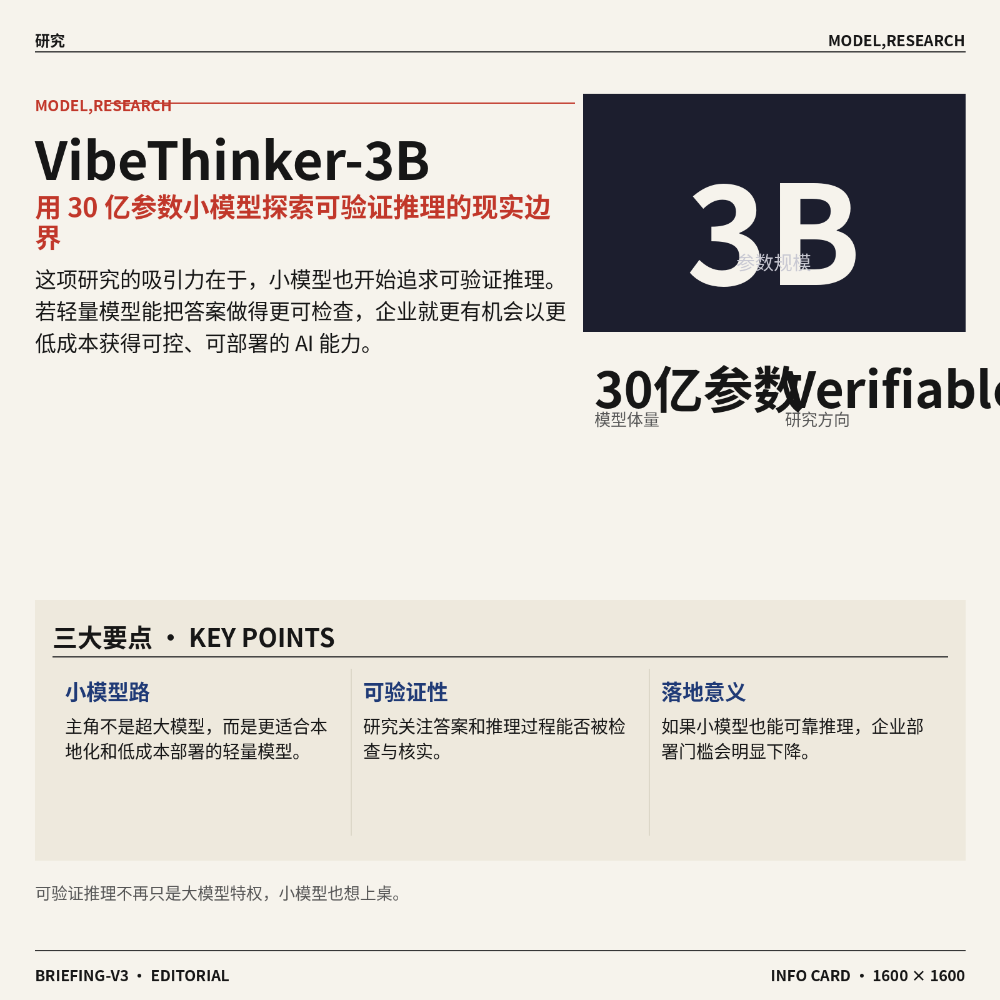

4. **VibeThinker-3B（一款 30 亿参数的小模型）探索“小模型也能可验证推理”的边界。**  
这项研究聚焦 **Verifiable Reasoning（可验证推理，指模型的推理过程或答案能被检查、核实）**，而且主角不是超大模型，而是 **Small Language Models（小语言模型，体量更小、部署成本更低）**。标题里的 **3B（约 30 亿参数）** 说明它属于相对轻量级选手，重点在于看看小模型能否也做到更可靠、更能被证明对错的推理。对企业用户来说，这个方向很有现实意义：如果小模型就能实现不错的可验证能力，那本地部署、低成本应用和更可控的 AI 产品会更有吸引力 💡。可参考 [论文摘要页(briefing)](https://huggingface.co/papers/2606.16140)


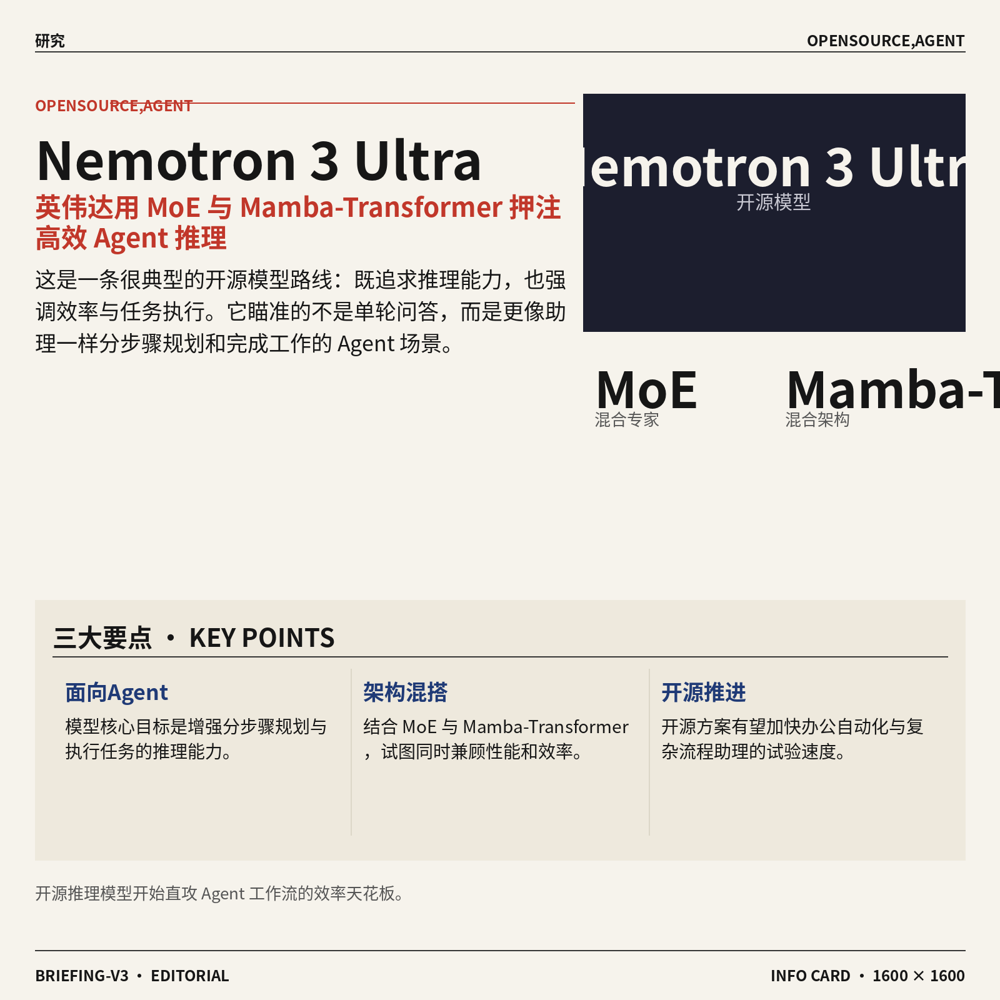

5. **Nemotron 3 Ultra（英伟达推出的开源推理模型）用 MoE（混合专家模型）+ Mamba-Transformer（两种架构结合）冲击高效 Agent 推理。**  
这篇论文的信息量很大，核心是做了一套面向 **Agentic Reasoning（Agent 式推理，能分步骤规划并执行任务的推理能力）** 的开源模型。它采用 **MoE（混合专家模型，让多个“专长不同”的子模型分工协作）**，再结合 **Mamba-Transformer（把新型序列建模结构 Mamba 与 Transformer 结合的架构）**，目标是兼顾性能与效率。简单说，这类研究在尝试让模型不仅“会答题”，还更适合承担长流程、多步骤的任务执行工作，对未来办公自动化、智能助理和复杂流程协同都很关键 🤖。更多见 [论文介绍页(briefing)](https://huggingface.co/papers/2606.15007)

![Nemotron 3 Ultra（英伟达推出的开源推理模型）用 MoE（混合专家模型）+ Mamba-Transformer（两种架构结合）冲击高效 Agent 推理](https://image.pollinations.ai/prompt/Nemotron%203%20Ultra%EF%BC%88%E8%8B%B1%E4%BC%9F%E8%BE%BE%E6%8E%A8%E5%87%BA%E7%9A%84%E5%BC%80%E6%BA%90%E6%8E%A8%E7%90%86%E6%A8%A1%E5%9E%8B%EF%BC%89%E7%94%A8%20MoE%EF%BC%88%E6%B7%B7%E5%90%88%E4%B8%93%E5%AE%B6%E6%A8%A1%E5%9E%8B%EF%BC%89+%20Mamba-Transformer%EF%BC%88%E4%B8%A4%E7%A7%8D%E6%9E%B6%E6%9E%84%E7%BB%93%E5%90%88%EF%BC%89%E5%86%B2%E5%87%BB%E9%AB%98%E6%95%88%20Agent%20%E6%8E%A8%E7%90%86.%20Nemotron%203%20Ultra%EF%BC%88%E8%8B%B1%E4%BC%9F%E8%BE%BE%E6%8E%A8%E5%87%BA%E7%9A%84%E5%BC%80%E6%BA%90%E6%8E%A8%E7%90%86%E6%A8%A1%E5%9E%8B%EF%BC%89%E7%94%A8%20MoE%EF%BC%88%E6%B7%B7%E5%90%88%E4%B8%93%E5%AE%B6%E6%A8%A1%E5%9E%8B%EF%BC%89+%20Mamba-Transformer%EF%BC%88%E4%B8%A4%E7%A7%8D%E6%9E%B6%E6%9E%84%E7%BB%93%E5%90%88%EF%BC%89%E5%86%B2%E5%87%BB%E9%AB%98%E6%95%88%20Agent%2C%20technical%20infographic%20diagram%2C%20architecture%20flowchart%2C%20clean%20vector%20illustration%2C%20educational%20style%2C%20no%20text%20overlay%2C%20modern%20minimal%2C%20wide%20aspect?width=1200&height=675&nologo=true&seed=10931)

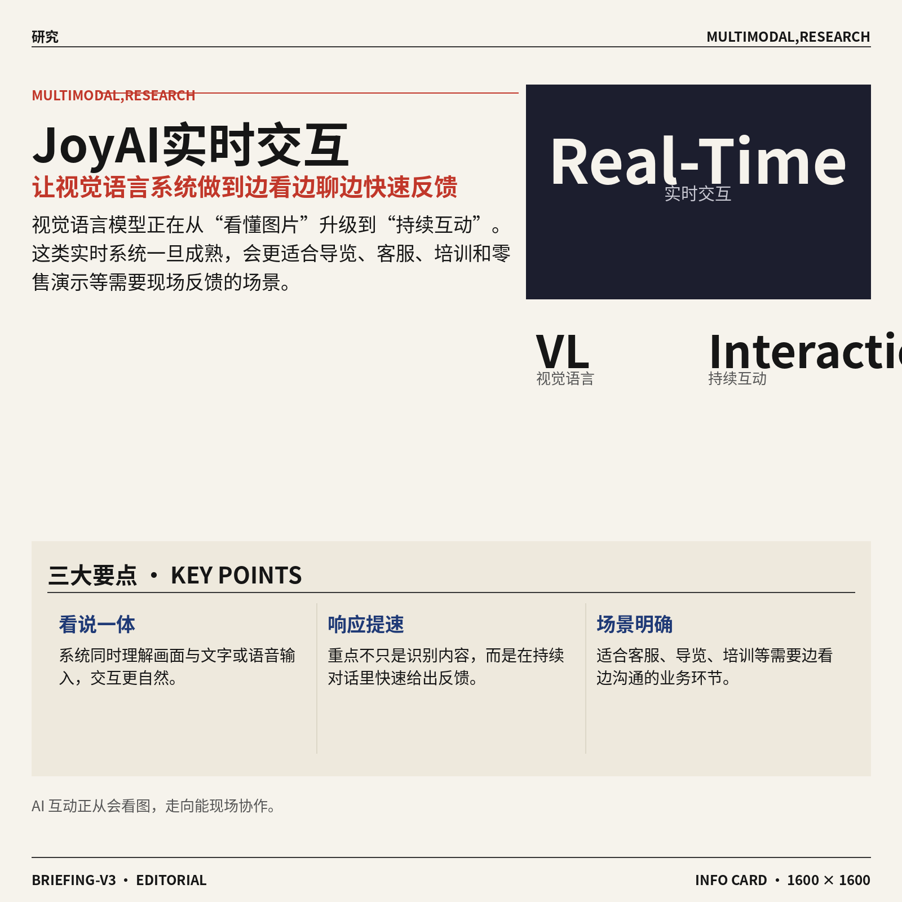

6. **JoyAI-VL-Interaction（一套实时视觉语言交互系统）瞄准“看得见也聊得动”的 AI 互动体验。**  
这里的 **VL（Vision-Language，视觉语言）** 指的是让 AI 同时理解画面和文字/语音输入，往更自然的人机互动走。论文强调 **Real-Time（实时）** 交互 intelligence（交互智能），说明重点不只是“看懂一张图”，而是要在持续互动中快速响应用户。对业务场景来说，这类能力很适合客服、导览、培训、零售演示等需要“边看边说边反馈”的场景，让 AI 从聊天工具进一步变成现场协作助手 📷。原始信息见 [论文页面(briefing)](https://huggingface.co/papers/2606.14777)


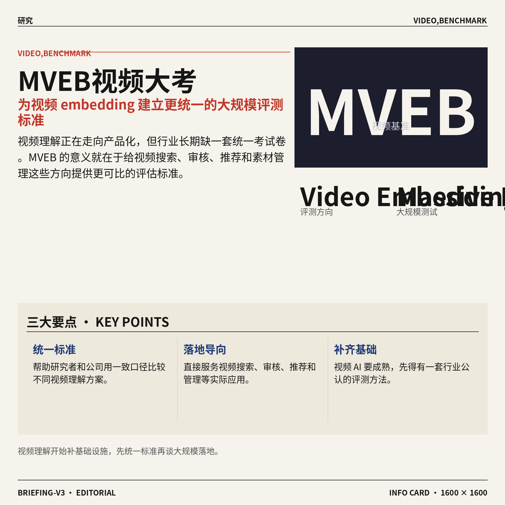

7. **MVEB（大规模视频 embedding 评测基准）补上了视频理解领域的统一“考试卷”。**  
这项工作聚焦 **Video Embedding（视频 embedding，把视频内容压缩成便于 AI 比较和检索的向量表示）**，并提出一个 **Massive Benchmark（大规模评测基准）**。你可以把它理解成：当越来越多公司想用 AI 做视频搜索、内容审核、推荐和素材管理时，行业需要一套更系统的方法来衡量“模型到底看懂视频没有”。MVEB 的意义就在于帮助研究者和公司用更一致的标准比较不同方案，为视频 AI 产品落地打基础 🎬。更多内容可看 [基准论文条目(briefing)](https://huggingface.co/papers/2606.14958)


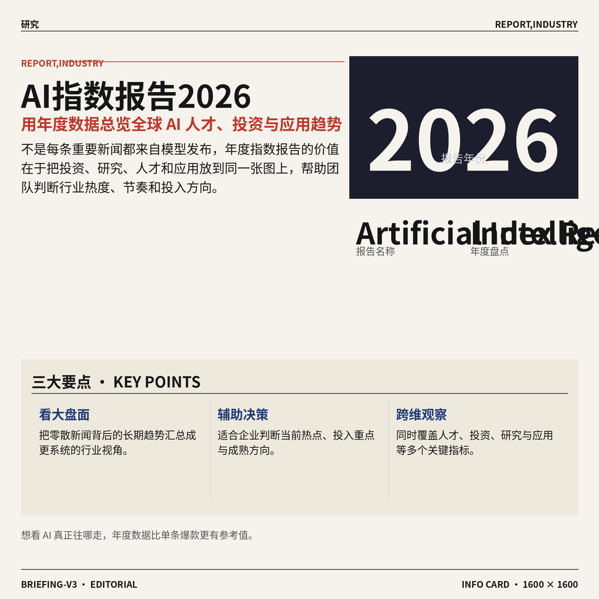

8. **Artificial Intelligence Index Report 2026（2026 年人工智能指数报告）继续用数据盘点全球 AI 发展趋势。**  
这类 **Index Report（指数报告，用系统化数据追踪行业变化的年度报告）** 的价值，不在于给出某个单点技术突破，而在于把人才、投资、研究、应用等关键信号放到一张大图里。对于不直接做技术的同事来说，这种报告特别适合拿来判断：AI 行业现在热在哪、企业投入重点在哪、哪些方向正在加速成熟 📈。如果你想快速建立对大盘走势的感知，这种资料往往比零散新闻更有参考价值。可查看 [报告条目页(briefing)](https://huggingface.co/papers/2606.15708)


### 🟡 行业展望与社会影响

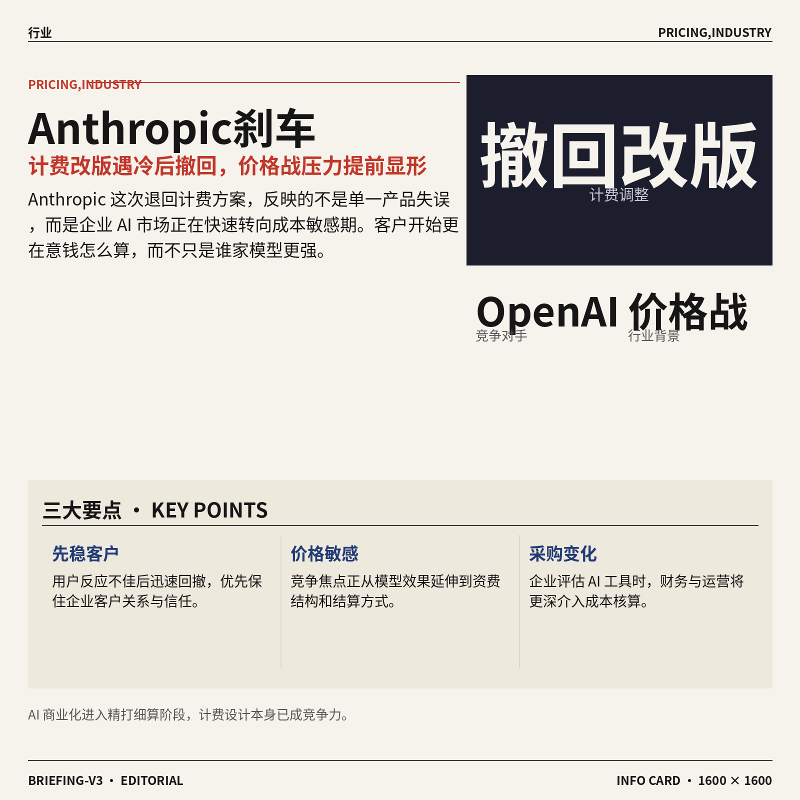

1. **Anthropic 撤回不受欢迎的计费改版，OpenAI 价格战阴影下先“刹车”。**
Anthropic 原本想推进新的**计费机制**，但因为用户反应不佳，最后选择退回调整，这很像 AI 厂商在激烈竞争前先稳住基本盘 💡。报道把这一动作放进与 OpenAI 的潜在**价格战**背景里看，说明如今企业客户不只比模型效果，也越来越在意“到底要花多少钱、怎么算钱”。对采购、运营和财务同事来说，这类变化很关键：AI 工具未来可能不再是统一套餐价，而会更像云服务一样按实际消耗收费。[完整报道(briefing)](https://the-decoder.com/anthropic-backs-off-unpopular-billing-overhaul-as-price-war-with-openai-looms/)


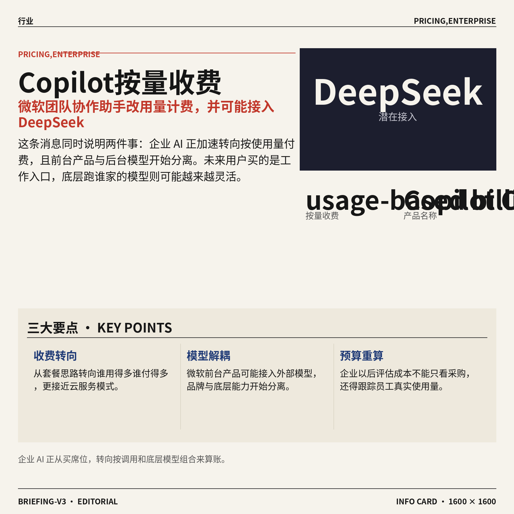

2. **Microsoft Copilot Cowork（微软面向团队协作的 AI 助手）改按使用量收费，并可能接入 DeepSeek。**
这条消息透露两个行业信号：一是 **usage-based billing（按使用量计费，谁用得多谁付得多）** 正在成为企业 AI 的主流模式，二是大厂也开始更灵活地选择底层模型，而不一定只押注自家方案 🚀。如果 Copilot Cowork 后续真的引入 DeepSeek，就意味着企业级 AI 产品的“前台品牌”和“后台模型”可能进一步分离，用户看到的是微软界面，背后跑的却未必是单一模型。对公司内部预算管理来说，这也提醒大家以后评估 AI 成本，不能只看“买没买”，还要看“员工实际用了多少”。[原文报道(briefing)](https://the-decoder.com/microsofts-copilot-cowork-moves-to-usage-based-billing-and-may-tap-deepseek/)


3. **ChatGPT 市占率首次跌破 50%，但仍是全球最受欢迎 AI 助手。**
TechCrunch 提到，ChatGPT 的**市场份额**第一次低于一半，不过它依然拥有超过 11 亿月活用户，领先 Gemini 和 Claude 📉。这说明 AI 助手市场正在从“一家独大”走向“多强并立”，用户开始分流，不再只盯着一个入口。对普通职场人来说，这意味着以后选 AI 工具会更像选办公软件：不同产品各有长板，企业也更可能根据场景搭配使用，而不是全公司只押一个平台。[完整报道(briefing)](https://techcrunch.com/2026/06/16/chatgpts-market-share-slips-below-50-for-first-time/)


4. **Anthropic 风波暴露特朗普政府 AI 监管口径混乱。**
NPR 这篇报道的重点，不是某个模型升级，而是美国政府在 **AI regulation（AI 监管，也就是政府给 AI 行业定规则）** 上释放出的信号有些混乱 😵。Anthropic 相关事件引发外界困惑，说明企业现在面对的不只是技术竞争，还有政策层面的不确定性。对所有依赖海外 AI 产品的公司来说，这类监管摇摆会影响产品上线节奏、合规判断，甚至影响未来哪些能力能开放给企业客户。[NPR 报道入口(briefing)](https://news.google.com/rss/articles/CBMivwFBVV95cUxOdzNiRnVqVi1PYkVlREJpMk5MX2FpUTRMNkZOZGFuODUtVXlxeExIbXN4YnZBa1lsRENYR3h1UExnaWNIYVN3UGxUNGV6UU5ld1ZKV29NdmhveGZnN2JKRXEyQV92bEtIZGpEa2pWOVdoMGpyaUV0QmNBeGtVVWtqVDQ5TmxRVlFZcEhLdlAtUTRrNW9qbU1rMHF3TUF3T1hORjdLOFlUVkU4UmNlVjdnWjRER0JXbk1FNWY2QjEwbw?oc=5)


5. **DeepSeek 首次引入外部融资，估值来到 500 亿美元。**
DeepSeek 过去一直很受关注，这次首次接受外部资金，更重要的信息其实是资本市场开始正式给它“定价”了 💰。**估值**来到 500 亿美元，意味着投资人不再只把它看成热门模型团队，而是看成可能持续影响全球 AI 格局的重要玩家。对行业观察者来说，这类融资不仅关系到一家公司的账面数字，也往往意味着它会在算力、产品推广和国际竞争上进一步加速。[完整报道(briefing)](https://the-decoder.com/deepseek-takes-outside-money-for-the-first-time-at-a-50-billion-valuation/)


6. **美国司法部以“国家安全”为由，为 xAI 未获许可的燃气轮机辩护。**
这起争议把 AI 竞争背后的**能源问题**直接摆上台面：美国司法部认为，xAI 持续使用这些未获许可的 **gas turbines（燃气轮机，用来发电的大型设备）**，涉及国家、经济和能源安全 ⚡。换句话说，训练和运行大模型需要的电力已经大到足以进入政策与法律博弈。对非技术同事来说，这件事很值得关注，因为 AI 行业拼到后面不只是拼模型和人才，还要拼谁能拿到稳定电力、数据中心和政策支持。[TechCrunch 报道(briefing)](https://techcrunch.com/2026/06/16/doj-claims-xais-unpermitted-gas-turbines-are-a-matter-of-national-economic-and-energy-security/) [案件背景解读(briefing)](https://the-decoder.com/doj-invokes-national-security-to-defend-xais-unpermitted-gas-turbines-in-naacp-lawsuit/)

![美国司法部以“国家安全”为由，为 xAI 未获许可的燃气轮机辩护](https://image.pollinations.ai/prompt/%E7%BE%8E%E5%9B%BD%E5%8F%B8%E6%B3%95%E9%83%A8%E4%BB%A5%E2%80%9C%E5%9B%BD%E5%AE%B6%E5%AE%89%E5%85%A8%E2%80%9D%E4%B8%BA%E7%94%B1%EF%BC%8C%E4%B8%BA%20xAI%20%E6%9C%AA%E8%8E%B7%E8%AE%B8%E5%8F%AF%E7%9A%84%E7%87%83%E6%B0%94%E8%BD%AE%E6%9C%BA%E8%BE%A9%E6%8A%A4.%20%E7%BE%8E%E5%9B%BD%E5%8F%B8%E6%B3%95%E9%83%A8%E4%BB%A5%E2%80%9C%E5%9B%BD%E5%AE%B6%E5%AE%89%E5%85%A8%E2%80%9D%E4%B8%BA%E7%94%B1%EF%BC%8C%E4%B8%BA%20xAI%20%E6%9C%AA%E8%8E%B7%E8%AE%B8%E5%8F%AF%E7%9A%84%E7%87%83%E6%B0%94%E8%BD%AE%E6%9C%BA%E8%BE%A9%E6%8A%A4%E3%80%82%20%E8%BF%99%E8%B5%B7%E4%BA%89%E8%AE%AE%E6%8A%8A%20AI%20%E7%AB%9E%E4%BA%89%E8%83%8C%E5%90%8E%E7%9A%84%E8%83%BD%E6%BA%90%E9%97%AE%E9%A2%98%E7%9B%B4%E6%8E%A5%E6%91%86%E4%B8%8A%E5%8F%B0%E9%9D%A2%EF%BC%9A%E7%BE%8E%E5%9B%BD%E5%8F%B8%E6%B3%95%E9%83%A8%E8%AE%A4%E4%B8%BA%EF%BC%8CxAI%20%E6%8C%81%E7%BB%AD%E4%BD%BF%E7%94%A8%E8%BF%99%E4%BA%9B%E6%9C%AA%E8%8E%B7%E8%AE%B8%2C%20technical%20infographic%20diagram%2C%20architecture%20flowchart%2C%20clean%20vector%20illustration%2C%20educational%20style%2C%20no%20text%20overlay%2C%20modern%20minimal%2C%20wide%20aspect?width=1200&height=675&nologo=true&seed=10962)

7. **SpaceX 豪赌 Cursor，显示 AI 编程工具已成巨头追赶 OpenAI 和 Anthropic 的新抓手。**
这篇报道把 SpaceX 对 Cursor 的巨额押注，放进更大的竞争框架里看：谁能掌握下一代高频 AI 入口，谁就更有机会追近 OpenAI 和 Anthropic 🚀。虽然 Cursor 已是很多开发者熟悉的工具，但它本质上是一类 **AI coding assistant（AI 编程助手，帮助程序员写代码、改代码、查问题）** 的代表，而这类产品正从“小众效率工具”变成战略资产。对企业管理层来说，这也释放出一个信号：未来最值钱的 AI 产品，未必只是聊天机器人，还可能是直接嵌进工作流、把生产过程提速的专业助手。[完整报道(briefing)](https://the-decoder.com/spacex-bets-60-billion-on-cursor-to-catch-openai-and-anthropic/)


### 🟣 开源TOP项目

1. **MasterDnsVPN（一款通过 DNS 隧道绕过网络封锁的开源 VPN）主打高丢包下也能稳定联网。**  
这个项目的核心思路是 **DNS tunneling（DNS 隧道，把网络数据伪装成域名查询流量传出去）**，适合在受限网络环境里做连通性突破。项目说明强调，它在 **ARQ（自动重传机制，像快递没送到就自动补发）**、**resolver load balancing（DNS 解析器负载均衡，让请求分散到不同解析节点）** 和高丢包稳定性上做了优化，目标是比同类方案更快、更稳 💡。对普通用户来说，这类工具的价值在于“网络很差也尽量能连上”；对企业同事来说，也能帮助理解为什么 **底层传输优化** 会直接影响跨境访问和远程协作体验。[GitHub 项目页(briefing)](https://github.com/masterking32/MasterDnsVPN)


2. **claude-bug-bounty（基于 Claude Code 的漏洞赏金自动化工具）把安全测试搬进终端。**  
这个开源项目主打用 **AI-powered（AI 驱动，也就是让模型辅助完成流程）** 的方式做 **bug bounty（漏洞赏金，企业悬赏外部安全研究员找系统漏洞）** 挖掘，从信息收集到报告生成都尽量自动化 🚀。摘要提到它支持 **20 类漏洞** 检测，还能做 **autonomous hunting（自主式排查，AI 按流程自己找问题）**，并且全部运行在 Claude Code 里。对非技术同事来说，可以把它理解成“安全团队的 AI 助手”：以前要人工逐步试，现在是把排查流程更系统地交给模型先跑一遍。[GitHub 仓库页(briefing)](https://github.com/shuvonsec/claude-bug-bounty)


3. **desktop-cc-gui（一款给 Claude Code 提供图形界面的客户端）想把 VibeCoding（自然语言驱动的轻松编程方式）做得更顺手。**  
项目简介很短，但信息很明确：它是一个 **GUI（图形用户界面，不用只敲命令行）** 客户端，定位是“专为开发者打造的 VibeCoding 平台” ✨。这意味着它想把原本偏命令行的使用方式，变成更直观的桌面操作体验，让用户更方便地管理对话、任务和代码协作。对业务或运营同事来说，这类项目反映了一个趋势：**AI 编程工具** 正在从“能用”走向“更好上手”。[项目主页说明(briefing)](https://github.com/zhukunpenglinyutong/desktop-cc-gui)


4. **archify（一款帮 Agent 生成架构图的技能工具）让系统示意图也能自动出图。**  
这个项目的卖点很直接：给任意 Agent 配上这项 **Skill（技能模块，相当于给 AI 加一个专门能力包）** 后，就能生成漂亮的 **architecture diagrams（架构图，用来展示系统模块和关系的示意图）**。它还支持深浅主题切换，以及导出 **PNG / JPEG / WebP / SVG（常见图片与矢量图格式，方便汇报、设计和文档复用）** 📊。对跨部门协作尤其友好，因为很多时候大家不是不懂业务，而是看不懂系统结构图；这类工具能把技术方案更快翻译成“人人看得懂”的视觉表达。[GitHub 项目页(briefing)](https://github.com/tt-a1i/archify)

![archify（一款帮 Agent 生成架构图的技能工具）让系统示意图也能自动出图](https://image.pollinations.ai/prompt/archify%EF%BC%88%E4%B8%80%E6%AC%BE%E5%B8%AE%20Agent%20%E7%94%9F%E6%88%90%E6%9E%B6%E6%9E%84%E5%9B%BE%E7%9A%84%E6%8A%80%E8%83%BD%E5%B7%A5%E5%85%B7%EF%BC%89%E8%AE%A9%E7%B3%BB%E7%BB%9F%E7%A4%BA%E6%84%8F%E5%9B%BE%E4%B9%9F%E8%83%BD%E8%87%AA%E5%8A%A8%E5%87%BA%E5%9B%BE.%20archify%EF%BC%88%E4%B8%80%E6%AC%BE%E5%B8%AE%20Agent%20%E7%94%9F%E6%88%90%E6%9E%B6%E6%9E%84%E5%9B%BE%E7%9A%84%E6%8A%80%E8%83%BD%E5%B7%A5%E5%85%B7%EF%BC%89%E8%AE%A9%E7%B3%BB%E7%BB%9F%E7%A4%BA%E6%84%8F%E5%9B%BE%E4%B9%9F%E8%83%BD%E8%87%AA%E5%8A%A8%E5%87%BA%E5%9B%BE%E3%80%82%20%E8%BF%99%E4%B8%AA%E9%A1%B9%E7%9B%AE%E7%9A%84%E5%8D%96%E7%82%B9%E5%BE%88%E7%9B%B4%E6%8E%A5%EF%BC%9A%E7%BB%99%E4%BB%BB%E6%84%8F%20Agent%20%E9%85%8D%E4%B8%8A%E8%BF%99%E9%A1%B9%20Skill%EF%BC%88%E6%8A%80%E8%83%BD%E6%A8%A1%E5%9D%97%EF%BC%8C%2C%20technical%20infographic%20diagram%2C%20architecture%20flowchart%2C%20clean%20vector%20illustration%2C%20educational%20style%2C%20no%20text%20overlay%2C%20modern%20minimal%2C%20wide%20aspect?width=1200&height=675&nologo=true&seed=11094)

5. **Claude-BugHunter（一套面向漏洞挖掘与红队演练的 Claude Code 技能包）把安全攻防流程打包得很完整。**  
项目摘要显示，它内置 **71 个 skills（技能模块，预设好的任务能力）**、**15 个 slash commands（斜杠命令，像聊天里输入快捷指令触发动作）**，并整理了 **681 个已披露报告模式**，覆盖 **24 类核心漏洞**。另外还包含面向企业身份系统和基础设施的 **attack matrices（攻击矩阵，把常见攻击路径整理成清单和地图）**，方便做 **red-team（红队演练，模拟攻击者来检验系统防御）** 工作 🔍。简单说，它不是单点工具，而更像一套“安全测试工作台模板”，把经验沉淀成 Claude Code 可以复用的操作框架。[GitHub 仓库说明(briefing)](https://github.com/elementalsouls/Claude-BugHunter)

![Claude-BugHunter（一套面向漏洞挖掘与红队演练的 Claude Code 技能包）把安全攻防流程打包得很完整](https://image.pollinations.ai/prompt/Claude-BugHunter%EF%BC%88%E4%B8%80%E5%A5%97%E9%9D%A2%E5%90%91%E6%BC%8F%E6%B4%9E%E6%8C%96%E6%8E%98%E4%B8%8E%E7%BA%A2%E9%98%9F%E6%BC%94%E7%BB%83%E7%9A%84%20Claude%20Code%20%E6%8A%80%E8%83%BD%E5%8C%85%EF%BC%89%E6%8A%8A%E5%AE%89%E5%85%A8%E6%94%BB%E9%98%B2%E6%B5%81%E7%A8%8B%E6%89%93%E5%8C%85%E5%BE%97%E5%BE%88%E5%AE%8C%E6%95%B4.%20Claude-BugHunter%EF%BC%88%E4%B8%80%E5%A5%97%E9%9D%A2%E5%90%91%E6%BC%8F%E6%B4%9E%E6%8C%96%E6%8E%98%E4%B8%8E%E7%BA%A2%E9%98%9F%E6%BC%94%E7%BB%83%E7%9A%84%20Claude%20Code%20%E6%8A%80%E8%83%BD%E5%8C%85%EF%BC%89%E6%8A%8A%E5%AE%89%E5%85%A8%E6%94%BB%E9%98%B2%E6%B5%81%E7%A8%8B%E6%89%93%E5%8C%85%E5%BE%97%E5%BE%88%E5%AE%8C%E6%95%B4%E3%80%82%20%E9%A1%B9%E7%9B%AE%E6%91%98%E8%A6%81%E6%98%BE%E7%A4%BA%EF%BC%8C%E5%AE%83%E5%86%85%E7%BD%AE%2071%20%E4%B8%AA%20s%2C%20technical%20infographic%20diagram%2C%20architecture%20flowchart%2C%20clean%20vector%20illustration%2C%20educational%20style%2C%20no%20text%20overlay%2C%20modern%20minimal%2C%20wide%20aspect?width=1200&height=675&nologo=true&seed=11125)

6. **codebase-memory-mcp（一款把代码库建成知识图谱的 MCP 服务器）主打超快检索和大幅省 token。**  
这个项目是一个高性能的 **MCP（模型上下文协议，让 AI 助手更标准化地调用外部工具和数据）** 服务器，会把代码库索引成 **knowledge graph（知识图谱，把文件、函数、依赖关系连成可查询的网络）**。摘要提到它支持 **158 种语言**、查询达到 **sub-ms（小于 1 毫秒，几乎瞬时返回）** 级速度，并宣称可减少 **99% tokens（模型处理文本时消耗的“字数配额”）**，同时还是 **single static binary（单一可执行文件，安装更省事）**、零依赖 ⚡。对团队来说，这类工具的意义非常现实：当代码库越来越大时，AI 不再只是“读几段代码回答问题”，而是能先建立长期记忆，再更快、更便宜地理解整个项目。[GitHub 项目主页(briefing)](https://github.com/DeusData/codebase-memory-mcp)


### 🔴 社媒分享

1. **GPT‑NL（荷兰正在建设的“主权大模型”，强调本国可控）瞄准欧洲本土 AI 自主。**  
这是一项由荷兰推进的 **“主权大模型”** 计划，核心意思是：模型、数据和治理规则尽量掌握在本国或本地区手里，而不是完全依赖海外科技公司 🌍。对业务同事来说，这类项目的意义不只是“又一个模型”，更在于 **数据合规**、**语言文化适配** 和政府/公共机构的可控性——尤其适合对隐私和监管要求高的场景。原始介绍页明确把 GPT‑NL 定位为面向荷兰语环境的本土模型建设项目，体现出欧洲正在把 **AI 能力本地化** 当成长期工程来做。[官方项目介绍(briefing)](https://www.tno.nl/en/digital/artificial-intelligence/gpt-nl/)


2. **《The Fable 5 Export Controls Harm US Cyber Defense》指出出口管制可能反伤美国网络防御。**  
这篇文章讨论的是，美国针对部分 AI 能力的 **出口管制**，未必只会限制对手，反而也可能削弱自己在 **网络防御** 方面的准备能力 🛡️。这里的 cyber defense（网络防御，指发现并抵御黑客攻击、漏洞利用等安全威胁的能力）并不是抽象概念，而是越来越依赖先进模型来做分析、预警和自动化响应。对企业读者来说，值得关注的点在于：当 AI 被纳入地缘政策后，**安全能力**、**供应链可得性** 和 **技术竞争力** 可能会被一起牵动，不再只是单纯的技术问题。[原文评论解读(briefing)](https://simonwillison.net/2026/Jun/16/fable-5-export-controls/#atom-everything)


3. **SubQ 1.1 Small（轻量级大模型版本）发布技术报告，主打“小而能打”。**  
从名称就能看出，SubQ 1.1 Small 是一个强调 **小模型体积** 的版本，通常这类模型更适合部署在成本敏感、响应速度要求高的场景里 ⚙️。技术报告（technical report，指团队用来说明模型设计、训练和表现的正式文档）通常是判断一个模型是否靠谱的重要依据，因为它会交代模型能力边界，而不只是放营销口号。对公司内部使用者来说，这类“小模型”尤其值得看，因为它往往更接近真实办公落地：**更省资源**、**更容易接入产品**、也更利于私有化部署。[技术报告原文(briefing)](https://subq.ai/subq-1-1-small-technical-report)


4. **《Elon Musk Sold Investors The Future. Now SpaceX Has To Build It.》聚焦 SpaceX 如何把愿景兑现成现实。**  
这篇报道的核心张力很直接：马斯克向投资人描绘了很大的未来图景，但接下来真正考验 SpaceX 的，是能不能把这些承诺一步步造出来 🚀。这类讨论对 AI 圈也有参考价值，因为今天无论是航天还是 AI，市场都越来越关心 **叙事** 和 **交付** 之间有没有落差。对非技术同事来说，可以把它理解成一个很现实的商业问题：讲故事能帮助融资，但最终决定公司价值的，还是产品、基础设施和执行能力。[完整报道入口(briefing)](https://www.bigtechnology.com/p/elon-musk-sold-investors-the-future)


---

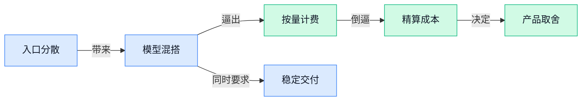
```mermaid
graph LR
A[入口分散] -->|带来| B[模型混搭]
B -->|逼出| C[按量计费]
C -->|倒逼| D[精算成本]
D -->|决定| E[产品取舍]
B -->|同时要求| F[稳定交付]

classDef blue fill:#dbeafe,stroke:#3b82f6,color:#111827
classDef green fill:#d1fae5,stroke:#10b981,color:#111827
class A,B,F blue
class C,D,E green
```

### 📊 行业洞察（今日 4 条）

1. Anthropic 撤回新计费、Microsoft Copilot Cowork（微软的团队协作 AI 助手）改按使用量收费，DarcyIQ Anywhere（一款把多家大模型接入企业内部资料的工具）又主打多模型接入
  【洞察】企业 AI 正从“买一家最强模型”变成“按用量精算、按场景混搭”，真正值钱的开始不是模型名气，而是接入能力和成本控制

2. ChatGPT 市占率首次跌破 50%，Google 把 Gemini 深埋进 Android 17 和 Wear OS 7（Google 的智能手表操作系统），微软还可能给 Copilot 接入 DeepSeek
  【洞察】AI 入口正在分散到手机系统、办公软件和垂直工具里，单独做一个聊天框越来越不够，谁贴近真实工作流，谁更容易留住用户

3. OpenAI 用 Deployment Simulation（部署模拟，用真实对话提前演练上线后表现）做发布前预演，CODA-BENCH（专测代码 Agent 干活能力的统一考卷）则追问 Agent 会不会真做事
  【洞察】行业关注点明显变了：不再迷信“演示很聪明”，而是开始严查上线后稳不稳、能不能交付结果，评测标准正从会说转向会干

4. Tangram（分层压缩模型临时记忆的方法）、VibeThinker-3B（轻量级可验证推理模型）和 Nemotron 3 Ultra（英伟达开源推理模型）都在拼效率，xAI 甚至因燃气轮机卷入能源争议
  【洞察】算力和电力还远没便宜到可以乱花，行业一边追更强能力，一边被现实成本拽住，未来赢家未必最强，而是最会省

### 💭 对我们的启发（今日 3 条）

1. 既然 Anthropic、微软都在改按使用量收费，我们的视频剪辑工具不能再只报功能价，得把“每条视频生成、修改、导出分别花多少钱”给客户说透，避免后期失信。

2. Google 把 Gemini 塞进系统、ChatGPT 份额下滑，说明用户会在更多入口直接完成创作。我们不能只做“剪辑台”，要做能接住脚本、素材整理、成片修改的一整段流程。

3. OpenAI 强调上线前预演，MVEB（视频理解统一评测基准）开始补考试卷，说明视频 AI 产品以后比的不是炫技，而是稳定识别素材、少误剪、可回退、可人工接管。

