## AI资讯日报 2026/6/23

> AI 早报 · 每日早读 · 全网深度聚合

## **今日摘要**

```
Microsoft 得州豪建 2 吉瓦数据中心还自配燃气电厂，雪佛龙再签 20 年供电协议直冲算力饥渴
Groq 确认融资 6.5 亿美元猛押 neocloud（AI云算力服务），Anthropic 联手 Micron（美国存储芯片公司）改写 AI 内存战局
Getty Images 与 OpenAI 连签多年合作把授权图片送进 ChatGPT 搜索，三星电子全球部署 ChatGPT Enterprise 和 Codex
```

### 🔵 产品与功能更新

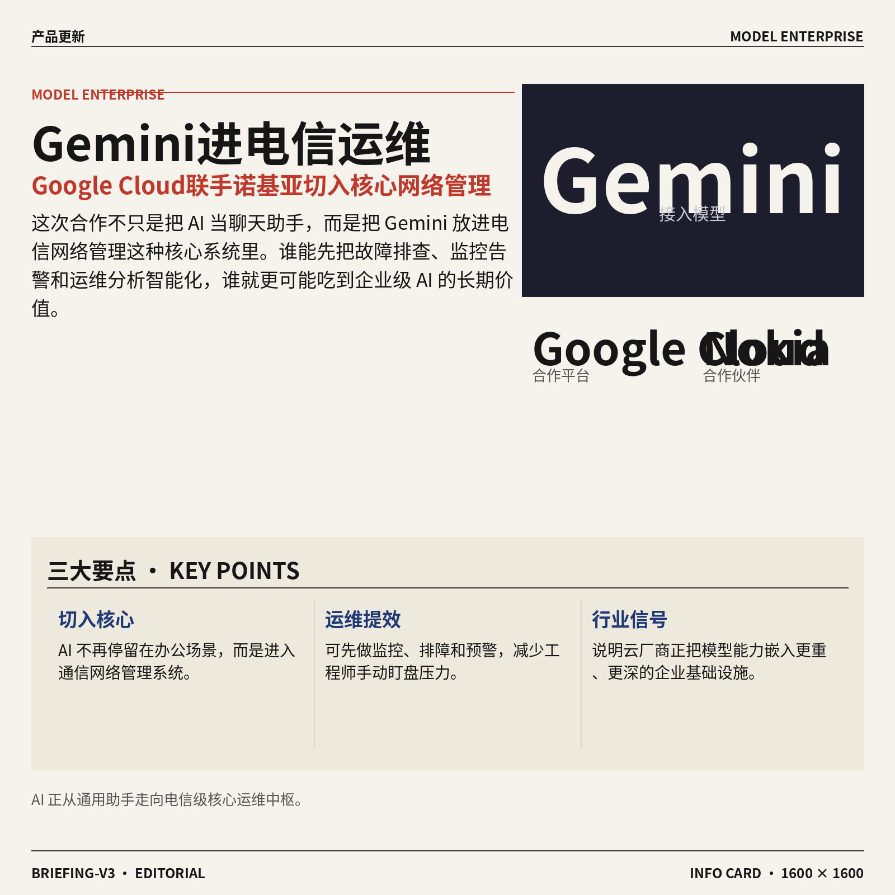

1. **Google Cloud 联手 Nokia（诺基亚的通信网络设备与服务业务）把 Gemini 用进电信网络管理。**
这次合作的重点，是把 **Gemini** 模型接入电信网络管理场景，让运营商处理网络运维、监控和故障分析时能更智能一些 📡。对非技术同事来说，可以把它理解成：原本大量靠工程师手动盯盘、排查的问题，未来会更多交给 AI 做“先看、先找、先提醒”。而 **telecom network management（电信网络管理，负责保障通信网络稳定运行的一整套系统）** 本身是非常复杂的行业基础设施，Google Cloud 往里放模型，也说明 AI 正在从办公助手走向更核心的企业系统。[合作消息概览(briefing)](https://news.google.com/rss/articles/CBMifkFVX3lxTE8yQTdZRXBxcUM4QmJDQ2RPdkRueDBVMUkzay1ONEFCaDFzRndTWF9fNkhGZzhzNUFueE1HTFIyMGRLaVNXa0JZdTQybGN6ZnpaNHF1MWYtQktEb3lQUERzVDYtM0NGdURpX2dIUFY3NFUyMXZFVzZMREF5ZXU0Zw?oc=5)


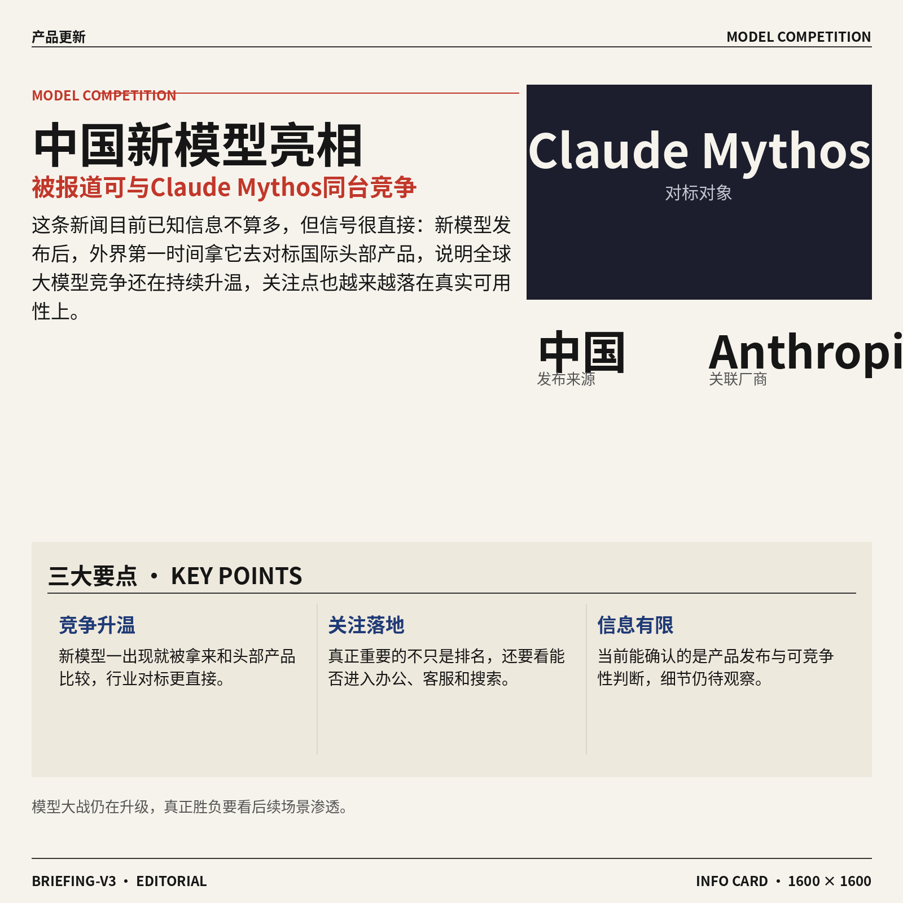

2. **中国推出新 AI，报道指其可与 Claude Mythos（Anthropic 相关模型名称）竞争。**
从标题信息看，这是一款来自中国的新 **AI 模型**，并被报道拿来与 Anthropic 的 **Claude Mythos（报道中提到的对标模型名称）** 做对比 🤖。这类消息的行业意义在于，全球大模型竞争还在持续升温，而且“谁能对标谁”正在成为外界判断产品实力的直观方式。对业务团队来说，值得关注的不只是性能排名，更是后续它会不会进入办公、客服、搜索或企业服务场景；不过基于当前材料，我们只能确认“新产品发布”与“被认为可竞争”这两层信息。[报道原文入口(briefing)](https://news.google.com/rss/articles/CBMirwFBVV95cUxNd2FHNmdjdE5RWDBIZ01wbm5zRUxaNEdPanFtLXAwaElxWFcwNUdralNfdzJyR0pCREY0d2o0UGVuWGdFcHhZSk9VVDB6MklvOFNmeVY5QV95bDZ1a0hvZVhrdnNQVlNaSXkxMXlPdEVVb05XSi1hTG5SWnYwQWpISXJPQWo2djJrMGppdngtZ3dZb2lfMmhBaERRMmFyQXFFakY3VkNQTVZCeDFLakt3?oc=5)


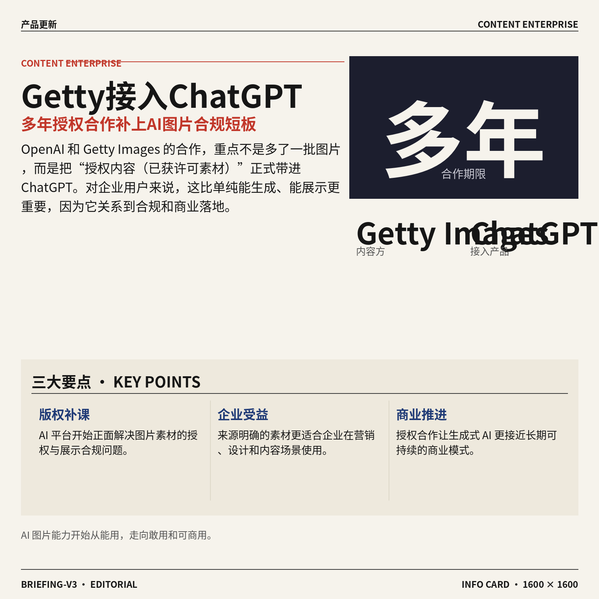

3. **Getty Images 与 OpenAI 达成多年展示合作，把授权内容带入 ChatGPT。**
这次合作的关键词是 **licensed content（授权内容，指已经获得正式使用许可的图片等素材）** 与 **display partnership（展示合作，重点是内容展示与使用授权）** 🖼️。Getty Images 本来就是全球知名的正版视觉素材平台，把它的内容带进 ChatGPT，意味着 AI 产品在“能不能用”和“合不合规”之间，开始更认真地补版权这门课。对企业用户尤其重要：以后在 AI 里看到的图片、素材展示，若来自明确授权渠道，使用时的风险会更可控，也更接近真正可落地的商业化路径。[合作报道原文(briefing)](https://news.google.com/rss/articles/CBMi-AFBVV95cUxPdm5WbDc3eGFzUjI4WVp2NHM5QmM1SEpXaU9EV1BtNjNGdGpYRTJ4TzZlSzY1VEtXVm5NdndqQkkzUXZpQUxkeG1xOU90OV9uLU0zcHE2RjF0WVpNdXJvaldjUDZNQ05ZeUo1bDM1dFVBYXVBRTd4QnV1b2V3SXliY0NPYkhJWS15REVNZGhnNUhLa2pSc3VTYk9qQUJlTnZKQlFxTUN3SUdnQkpDdEJTeVFoc2w2ZTBHbUc0LWt0U09IUV9yQ3lsWUIwekxjeTJQVEplOWZ2UkZVdVFsVFhRaXJHYVlXd3FIcFByTzFnZTFCeVdUVFdHRQ?oc=5)


### 🟢 前沿研究

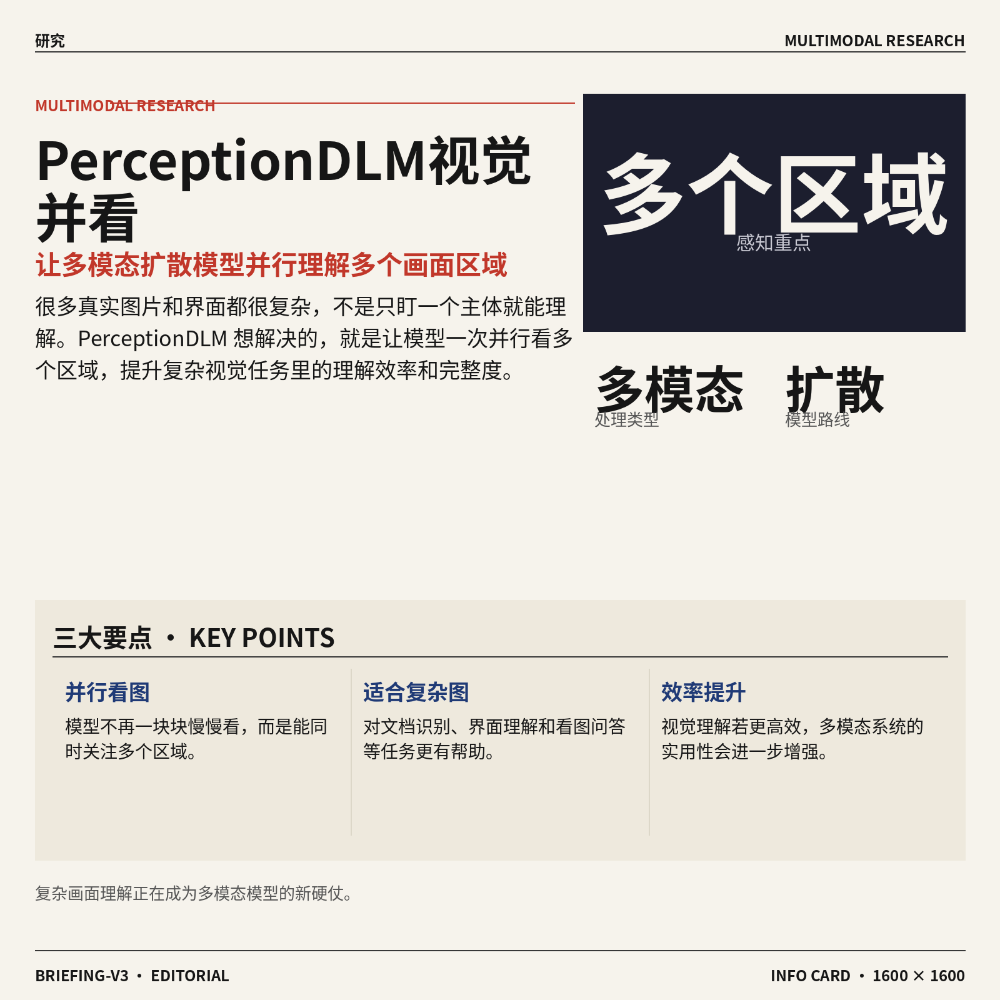

1. **PerceptionDLM（并行区域感知的多模态扩散语言模型）尝试让 AI 一次看懂画面里多个区域。**
这篇论文聚焦 **多模态扩散语言模型**（把图像、文字等多种信息一起处理，并用“扩散”方式逐步生成结果的模型）怎么更高效理解复杂画面。标题里的 **并行区域感知**，意思是让模型不是一块一块慢慢看，而是能同时关注多个画面区域，提升视觉理解效率 💡。这类研究对文档识别、复杂界面理解、看图问答等场景很关键，因为现实图片往往不是“一个主体配一句话”那么简单。[论文页面介绍(briefing)](https://huggingface.co/papers/2606.19534)


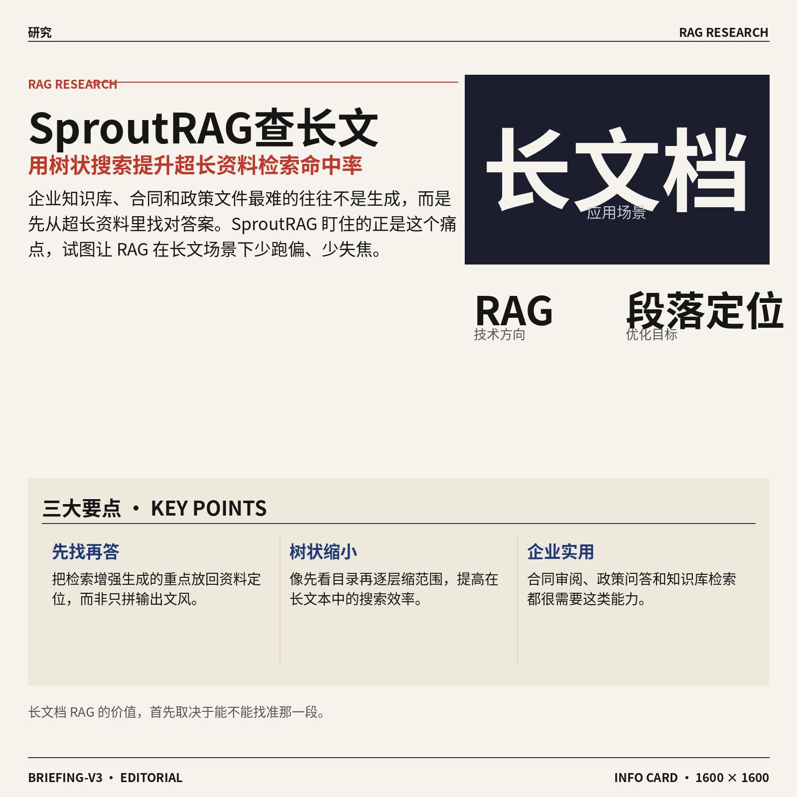

2. **SproutRAG（面向长文档检索增强生成的新方法）瞄准“超长资料里怎么更准地找答案”。**
这项工作研究 **长文档 RAG**（检索增强生成，让 AI 回答前先去资料里找内容）在资料太长时容易“翻找失焦”的问题。它把 **attention-guided tree search**（注意力引导的树状搜索，像先看目录再逐层缩小范围）和 **progressive embeddings**（渐进式向量表示，让文本先粗分再细找）结合起来，提升段落定位能力 🚀。对企业知识库、合同审阅、政策文件问答这类场景来说，这类改进很实用，因为真正难的往往不是“会不会写”，而是“能不能先找对内容”。[论文页面介绍(briefing)](https://huggingface.co/papers/2606.18381)

![SproutRAG（面向长文档检索增强生成的新方法）瞄准“超长资料里怎么更准地找答案”](https://image.pollinations.ai/prompt/SproutRAG%EF%BC%88%E9%9D%A2%E5%90%91%E9%95%BF%E6%96%87%E6%A1%A3%E6%A3%80%E7%B4%A2%E5%A2%9E%E5%BC%BA%E7%94%9F%E6%88%90%E7%9A%84%E6%96%B0%E6%96%B9%E6%B3%95%EF%BC%89%E7%9E%84%E5%87%86%E2%80%9C%E8%B6%85%E9%95%BF%E8%B5%84%E6%96%99%E9%87%8C%E6%80%8E%E4%B9%88%E6%9B%B4%E5%87%86%E5%9C%B0%E6%89%BE%E7%AD%94%E6%A1%88%E2%80%9D.%20SproutRAG%EF%BC%88%E9%9D%A2%E5%90%91%E9%95%BF%E6%96%87%E6%A1%A3%E6%A3%80%E7%B4%A2%E5%A2%9E%E5%BC%BA%E7%94%9F%E6%88%90%E7%9A%84%E6%96%B0%E6%96%B9%E6%B3%95%EF%BC%89%E7%9E%84%E5%87%86%E2%80%9C%E8%B6%85%E9%95%BF%E8%B5%84%E6%96%99%E9%87%8C%E6%80%8E%E4%B9%88%E6%9B%B4%E5%87%86%E5%9C%B0%E6%89%BE%E7%AD%94%E6%A1%88%E2%80%9D%E3%80%82%20%E8%BF%99%E9%A1%B9%E5%B7%A5%E4%BD%9C%E7%A0%94%E7%A9%B6%20%E9%95%BF%E6%96%87%E6%A1%A3%20RAG%EF%BC%88%E6%A3%80%E7%B4%A2%E5%A2%9E%E5%BC%BA%E7%94%9F%E6%88%90%EF%BC%8C%E8%AE%A9%20AI%20%E5%9B%9E%E7%AD%94%E5%89%8D%E5%85%88%E5%8E%BB%E8%B5%84%E6%96%99%E9%87%8C%2C%20technical%20infographic%20diagram%2C%20architecture%20flowchart%2C%20clean%20vector%20illustration%2C%20educational%20style%2C%20no%20text%20overlay%2C%20modern%20minimal%2C%20wide%20aspect?width=1200&height=675&nologo=true&seed=10838)

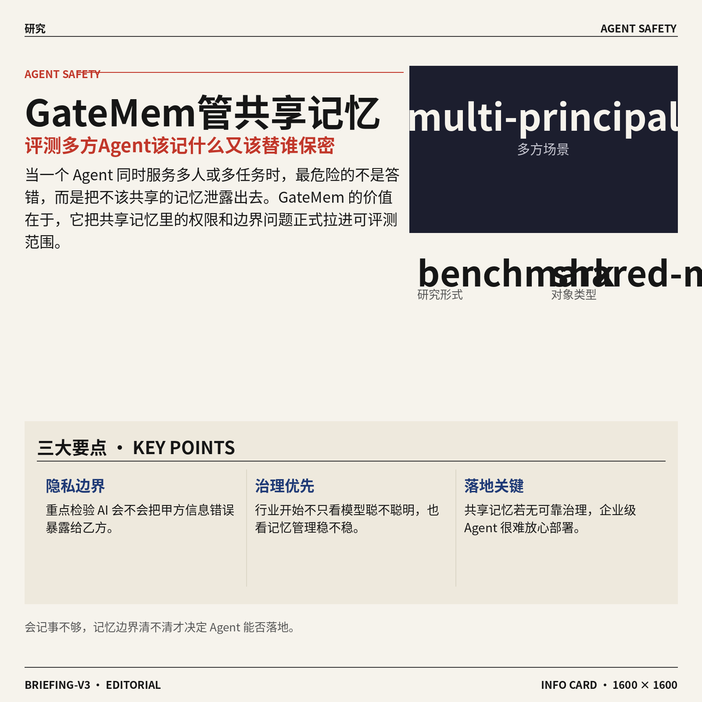

3. **GateMem（多方共享记忆 Agent 的治理评测基准）把焦点放到 AI 该记住谁、又该替谁保密。**
这篇论文讨论 **shared-memory agents**（共享记忆型 Agent，多个任务或多位用户共用一套记忆的智能体）里的记忆治理问题。所谓 **multi-principal**，可以理解为一个 AI 同时服务多个“委托方”时，如何避免把甲的信息错误泄露给乙，这本质上是权限与边界问题 ⚠️。论文提出的是一个 **benchmark**（评测基准，用来系统测试模型表现的标准题库），意味着行业开始更认真地衡量“AI 记忆管理是否可靠”，而不只是看它答题聪不聪明。[论文页面介绍(briefing)](https://huggingface.co/papers/2606.18829)


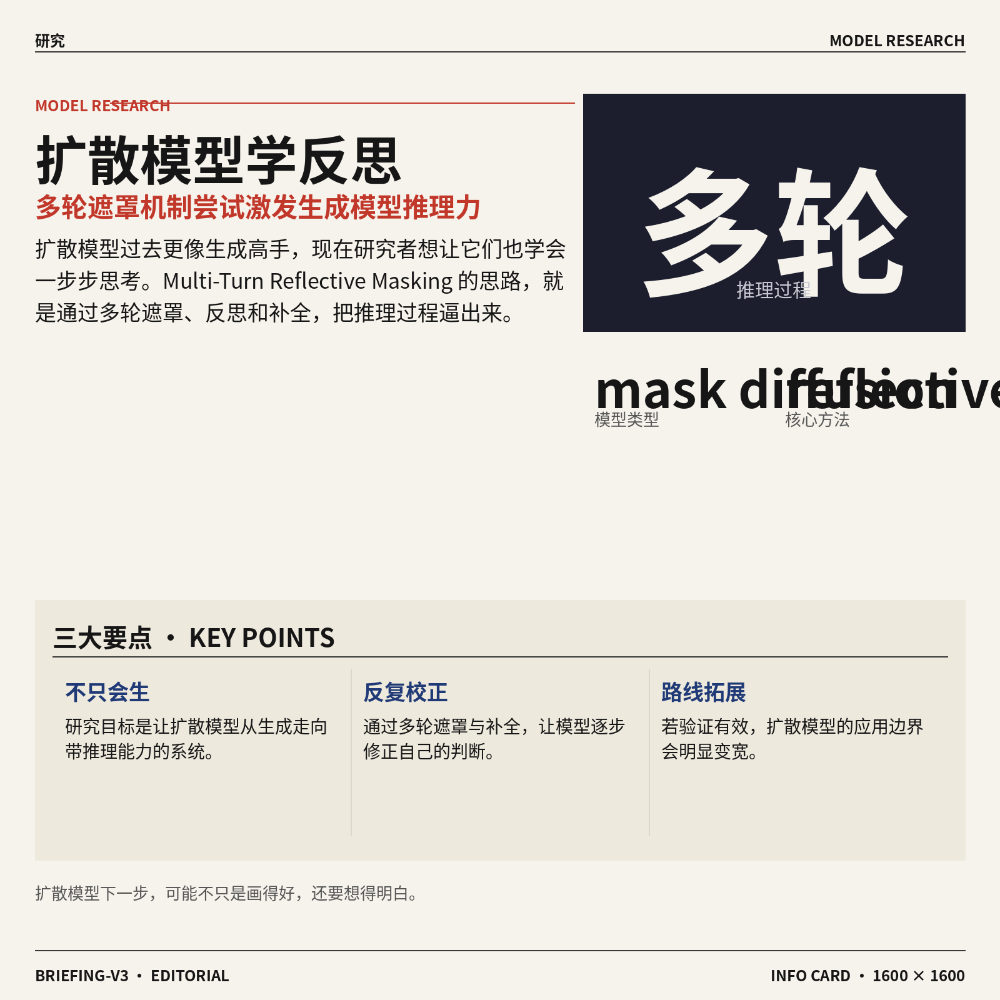

4. **Multi-Turn Reflective Masking（多轮反思式遮罩）探索如何激发扩散模型的推理能力。**
这项研究关注 **mask diffusion models**（遮罩式扩散模型，先把部分内容遮住，再一步步补全的模型）能不能不只“生成”，还学会更像人在做推理。所谓 **multi-turn reflective masking**，可以理解为让模型经过多轮“先遮住、再反思、再补全”的过程，逼自己一步步想清楚 🧠。如果这条路线有效，扩散模型未来可能不只会画图、补内容，还能在某些任务上表现出更强的分析能力。[论文页面介绍(briefing)](https://huggingface.co/papers/2606.16700)


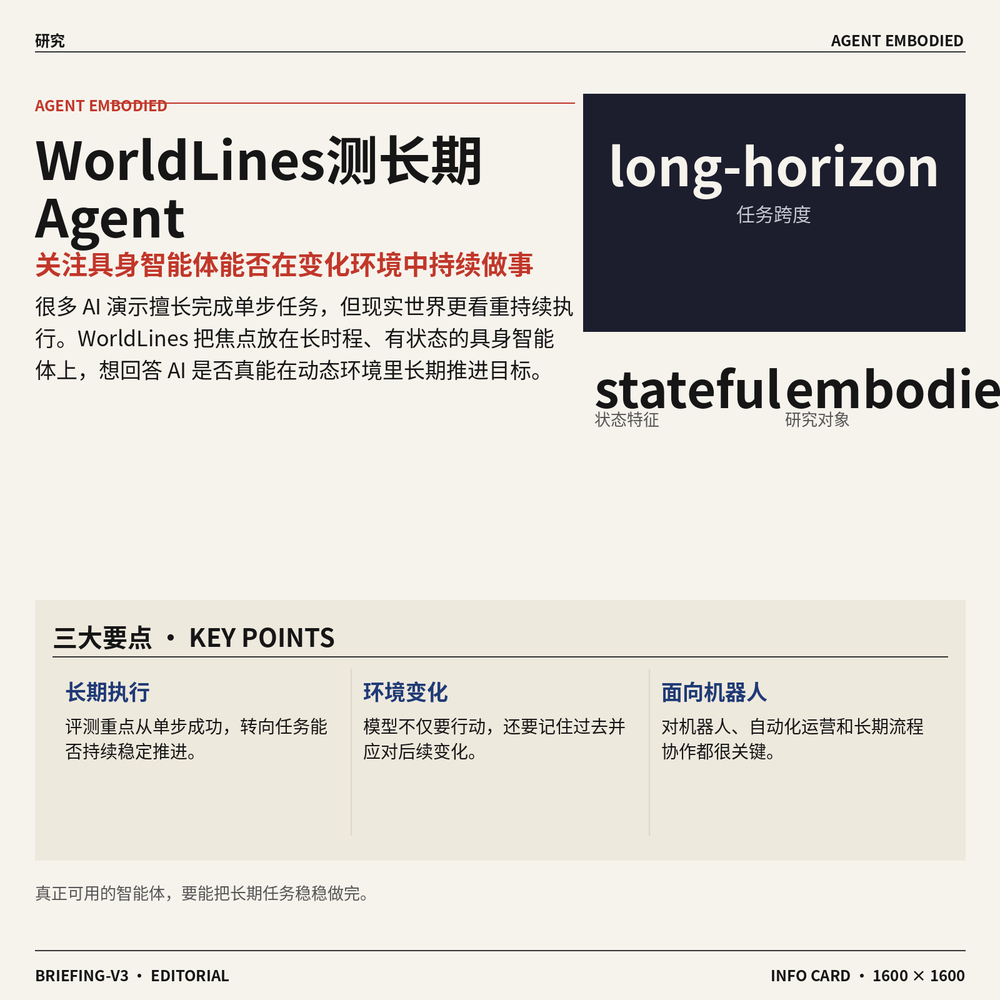

5. **WorldLines（长时程具身智能体评测与建模项目）关注 AI 能否在持续变化的环境里长期做事。**
论文研究的是 **long-horizon stateful embodied agents**（长时程、有状态的具身智能体：不仅能行动，还要记住过去发生过什么，并持续影响后续决策）。这里的 **embodied agents**，可以理解为“活在环境里的 AI”，比如在虚拟世界或机器人任务里持续执行目标，而不是只回一句话就结束。它提出评测与建模方法，说明行业开始把重点从“单步任务成功”转向“长期任务能否稳定推进” 📌。这对自动化运营、机器人执行、长期流程协作等方向都很有参考价值。[论文页面介绍(briefing)](https://huggingface.co/papers/2606.18847)

![WorldLines（长时程具身智能体评测与建模项目）关注 AI 能否在持续变化的环境里长期做事](https://image.pollinations.ai/prompt/WorldLines%EF%BC%88%E9%95%BF%E6%97%B6%E7%A8%8B%E5%85%B7%E8%BA%AB%E6%99%BA%E8%83%BD%E4%BD%93%E8%AF%84%E6%B5%8B%E4%B8%8E%E5%BB%BA%E6%A8%A1%E9%A1%B9%E7%9B%AE%EF%BC%89%E5%85%B3%E6%B3%A8%20AI%20%E8%83%BD%E5%90%A6%E5%9C%A8%E6%8C%81%E7%BB%AD%E5%8F%98%E5%8C%96%E7%9A%84%E7%8E%AF%E5%A2%83%E9%87%8C%E9%95%BF%E6%9C%9F%E5%81%9A%E4%BA%8B.%20WorldLines%EF%BC%88%E9%95%BF%E6%97%B6%E7%A8%8B%E5%85%B7%E8%BA%AB%E6%99%BA%E8%83%BD%E4%BD%93%E8%AF%84%E6%B5%8B%E4%B8%8E%E5%BB%BA%E6%A8%A1%E9%A1%B9%E7%9B%AE%EF%BC%89%E5%85%B3%E6%B3%A8%20AI%20%E8%83%BD%E5%90%A6%E5%9C%A8%E6%8C%81%E7%BB%AD%E5%8F%98%E5%8C%96%E7%9A%84%E7%8E%AF%E5%A2%83%E9%87%8C%E9%95%BF%E6%9C%9F%E5%81%9A%E4%BA%8B%E3%80%82%20%E8%AE%BA%E6%96%87%E7%A0%94%E7%A9%B6%E7%9A%84%E6%98%AF%20long-horizon%20stateful%20e%2C%20technical%20infographic%20diagram%2C%20architecture%20flowchart%2C%20clean%20vector%20illustration%2C%20educational%20style%2C%20no%20text%20overlay%2C%20modern%20minimal%2C%20wide%20aspect?width=1200&height=675&nologo=true&seed=10931)

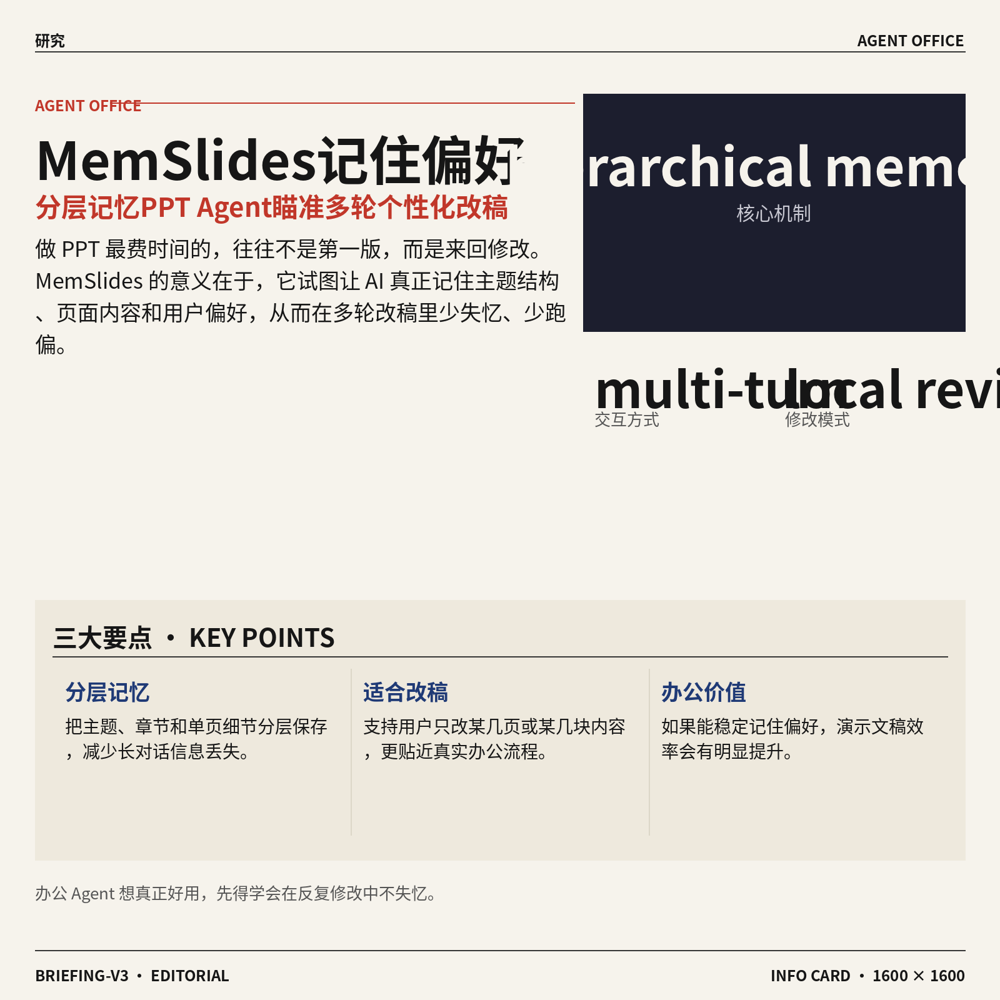

6. **MemSlides（带分层记忆的个性化 PPT 生成 Agent 框架）想让 AI 做演示文稿时更懂上下文。**
这篇论文提出一个用于 **personalized slide generation**（个性化幻灯片生成）的 Agent 框架，并支持 **multi-turn local revision**（多轮局部修改，也就是用户反复只改某几页、某几块内容）。其中 **hierarchical memory**（分层记忆，像把“主题—章节—单页细节”分层存放）是核心，能帮助模型在长对话中持续记住用户偏好和内容结构 ✍️。这类方向离办公场景很近：如果 AI 真能稳定记住你的风格、目的和修改意见，做汇报材料的效率会明显提升。[论文页面介绍(briefing)](https://huggingface.co/papers/2606.17162)


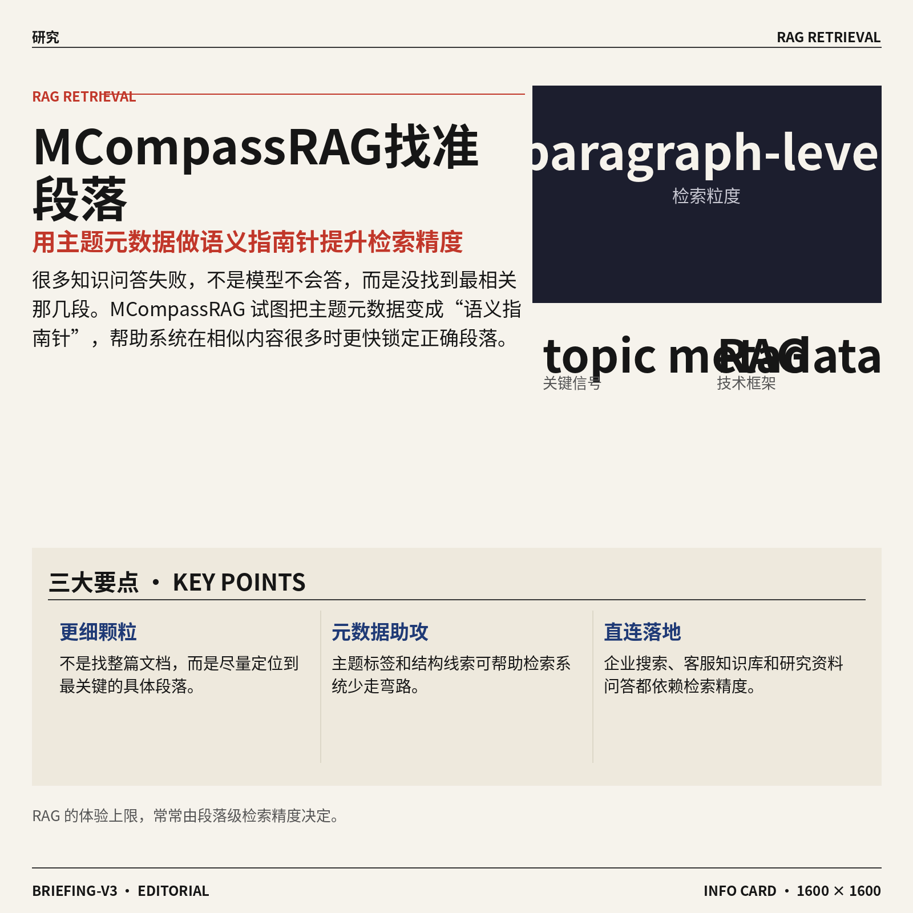

7. **MCompassRAG（把主题元数据当“语义指南针”的检索方法）提升段落级找资料的准确度。**
这项研究面向 **paragraph-level retrieval**（段落级检索，也就是不是找整篇文档，而是精确找到最相关那几段）做优化。论文提出把 **topic metadata**（主题元数据，可理解为给内容打上的主题标签、结构线索）当作“语义指南针”，帮助模型在相似内容很多时更快找准方向 🧭。对于企业内部知识问答、研究资料搜索、客服知识库来说，这种改进很重要，因为真正可用的 AI 往往取决于“检索够不够准”。[论文页面介绍(briefing)](https://huggingface.co/papers/2606.18508)


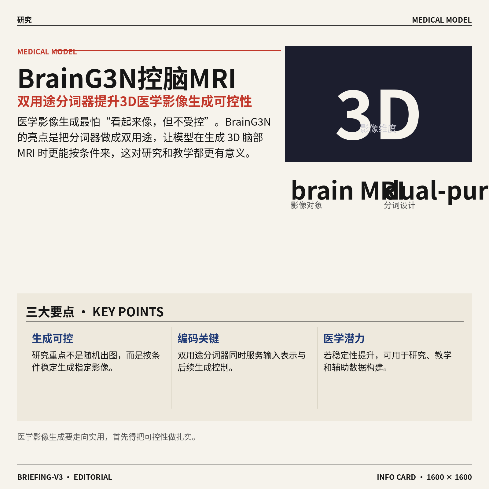

8. **BrainG3N（可控生成 3D 脑部 MRI 的双用途分词器）把医学影像生成做得更可控。**
这篇论文研究 **3D brain MRI generation**（三维脑部核磁影像生成），目标是让生成过程更可控，而不是“随机长一张图”。其中 **tokenizer**（分词器/编码器，把复杂数据切成模型更容易处理的小单元）被设计成 **dual-purpose**（双用途），说明它既服务于表示输入，也服务于后续生成控制 🧪。医学影像是高门槛场景，这类工作的重要性在于：如果模型能更稳定地按条件生成影像，就更有机会用于研究、教学和辅助数据构建。[论文页面介绍(briefing)](https://huggingface.co/papers/2606.19651)


### 🟡 行业展望与社会影响

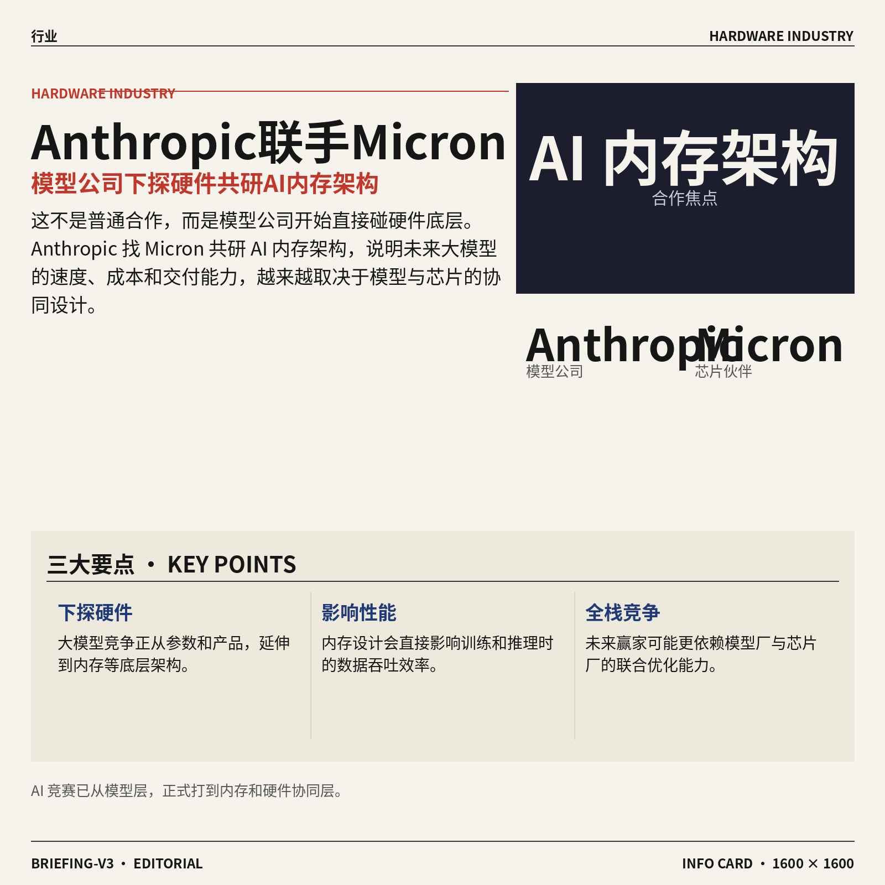

1. **Anthropic 联手 Micron（美国存储芯片公司）想共研 AI 内存架构。**
这件事指向一个很现实的行业趋势：AI 竞争不只是拼模型，还要拼**内存架构**（决定数据怎么被快速存取的底层设计）🧠。原报道提到，Anthropic 与 Micron 希望一起设计更适合 AI 的**memory architecture**（内存架构，影响训练和推理时的数据吞吐效率），说明大模型公司正越来越深地介入硬件层。对行业来说，这意味着未来 AI 的性能、成本和交付速度，可能会更多取决于模型公司与芯片厂的协同能力，而不只是“谁的参数更多”。可参考[合作消息解读(briefing)](https://the-decoder.com/anthropic-and-micron-want-to-co-design-ai-memory-architecture/) 💡


2. **Groq（AI 芯片创业公司）确认融资 6.5 亿美元，押注自家 neocloud（面向 AI 的云算力服务）。**
在英伟达主导的算力市场里，Groq 这轮动作释放出一个信号：**替代性算力平台**还在加速补位 🚀。报道提到，Groq 在确认融资后，正把重心放到 **neocloud**（新型云服务，主打为 AI 提供专门优化的算力）业务，并重新招募管理层，说明它不是只卖芯片，而是在争夺更完整的企业服务入口。对企业用户和行业观察者来说，这类公司能不能做大，关系到未来 AI 基础设施是否会继续被少数巨头高度垄断。[融资与业务调整报道(briefing)](https://techcrunch.com/2026/06/22/ai-chipmaker-groq-confirms-650m-raise-re-staffs-after-nvidias-20b-not-acqui-hire-deal/) 📈

![Groq（AI 芯片创业公司）确认融资 6.5 亿美元，押注自家 neocloud（面向 AI 的云算力服务）](https://image.pollinations.ai/prompt/Groq%EF%BC%88AI%20%E8%8A%AF%E7%89%87%E5%88%9B%E4%B8%9A%E5%85%AC%E5%8F%B8%EF%BC%89%E7%A1%AE%E8%AE%A4%E8%9E%8D%E8%B5%84%206.5%20%E4%BA%BF%E7%BE%8E%E5%85%83%EF%BC%8C%E6%8A%BC%E6%B3%A8%E8%87%AA%E5%AE%B6%20neocloud%EF%BC%88%E9%9D%A2%E5%90%91%20AI%20%E7%9A%84%E4%BA%91%E7%AE%97%E5%8A%9B%E6%9C%8D%E5%8A%A1%EF%BC%89.%20Groq%EF%BC%88AI%20%E8%8A%AF%E7%89%87%E5%88%9B%E4%B8%9A%E5%85%AC%E5%8F%B8%EF%BC%89%E7%A1%AE%E8%AE%A4%E8%9E%8D%E8%B5%84%206.5%20%E4%BA%BF%E7%BE%8E%E5%85%83%EF%BC%8C%E6%8A%BC%E6%B3%A8%E8%87%AA%E5%AE%B6%20neocloud%EF%BC%88%E9%9D%A2%E5%90%91%20AI%20%E7%9A%84%E4%BA%91%E7%AE%97%E5%8A%9B%E6%9C%8D%E5%8A%A1%EF%BC%89%E3%80%82%20%E5%9C%A8%E8%8B%B1%E4%BC%9F%E8%BE%BE%E4%B8%BB%E5%AF%BC%E7%9A%84%E7%AE%97%E5%8A%9B%E5%B8%82%E5%9C%BA%E9%87%8C%EF%BC%8CGroq%20%E8%BF%99%E8%BD%AE%E5%8A%A8%E4%BD%9C%E9%87%8A%2C%20technical%20infographic%20diagram%2C%20architecture%20flowchart%2C%20clean%20vector%20illustration%2C%20educational%20style%2C%20no%20text%20overlay%2C%20modern%20minimal%2C%20wide%20aspect?width=1200&height=675&nologo=true&seed=10838)

3. **Google DeepMind 与 A24（美国独立电影公司）合作研究 AI 影视制作。**
这不是简单的“AI 进军娱乐圈”，而是大模型公司开始和内容工业更系统地绑定 🎬。多家报道都提到，Google DeepMind 将与 A24 围绕 **AI filmmaking**（AI 电影制作，用生成式模型辅助剧本、镜头、特效等创作流程）展开研究合作，甚至有明确的资金投入信号。对普通职场人来说，这件事的意义在于：AI 正从“写文案、做表格”进一步走向更高价值的创意生产环节，未来内容团队、品牌团队和影视营销团队的工作流都可能被重新定义。[合作消息汇总(briefing)](https://the-decoder.com/google-deepmind-and-a24-team-up-on-ai-filmmaking-research/) [完整商业报道(briefing)](https://techcrunch.com/2026/06/22/google-deepmind-bets-75m-on-ais-future-in-hollywood-with-a24-deal/) ✨


4. **Microsoft 在得州建设 2 吉瓦级数据中心，并配套自有燃气电厂。**
这条消息把 AI 的另一个核心瓶颈摆到了台前：不是模型不够强，而是**电力不够用** ⚡。报道指出，Microsoft 正建设一个 **2-gigawatt data center**（2 吉瓦级数据中心，耗电规模极大）并搭配自有燃气电厂，以尽量绕开公共电网限制，这说明 AI 基础设施已经直接影响能源布局。对行业的启发很明确：未来谁能稳定拿到**算力**（支撑 AI 运行的计算资源）和电力，谁就更可能掌握下一阶段的竞争主动权。[项目详情解读(briefing)](https://the-decoder.com/microsoft-is-building-a-2-gigawatt-data-center-in-texas-with-its-own-gas-plant-to-dodge-the-grid/) 🌍

![Microsoft 在得州建设 2 吉瓦级数据中心，并配套自有燃气电厂](https://image.pollinations.ai/prompt/Microsoft%20%E5%9C%A8%E5%BE%97%E5%B7%9E%E5%BB%BA%E8%AE%BE%202%20%E5%90%89%E7%93%A6%E7%BA%A7%E6%95%B0%E6%8D%AE%E4%B8%AD%E5%BF%83%EF%BC%8C%E5%B9%B6%E9%85%8D%E5%A5%97%E8%87%AA%E6%9C%89%E7%87%83%E6%B0%94%E7%94%B5%E5%8E%82.%20Microsoft%20%E5%9C%A8%E5%BE%97%E5%B7%9E%E5%BB%BA%E8%AE%BE%202%20%E5%90%89%E7%93%A6%E7%BA%A7%E6%95%B0%E6%8D%AE%E4%B8%AD%E5%BF%83%EF%BC%8C%E5%B9%B6%E9%85%8D%E5%A5%97%E8%87%AA%E6%9C%89%E7%87%83%E6%B0%94%E7%94%B5%E5%8E%82%E3%80%82%20%E8%BF%99%E6%9D%A1%E6%B6%88%E6%81%AF%E6%8A%8A%20AI%20%E7%9A%84%E5%8F%A6%E4%B8%80%E4%B8%AA%E6%A0%B8%E5%BF%83%E7%93%B6%E9%A2%88%E6%91%86%E5%88%B0%E4%BA%86%E5%8F%B0%E5%89%8D%EF%BC%9A%E4%B8%8D%E6%98%AF%E6%A8%A1%E5%9E%8B%E4%B8%8D%E5%A4%9F%E5%BC%BA%EF%BC%8C%E8%80%8C%E6%98%AF%E7%94%B5%E5%8A%9B%E4%B8%8D%E5%A4%9F%E7%94%A8%20%E2%9A%A1%E3%80%82%E6%8A%A5%E9%81%93%2C%20technical%20infographic%20diagram%2C%20architecture%20flowchart%2C%20clean%20vector%20illustration%2C%20educational%20style%2C%20no%20text%20overlay%2C%20modern%20minimal%2C%20wide%20aspect?width=1200&height=675&nologo=true&seed=10900)

5. **Getty Images 与 ChatGPT 搜索达成多年合作，把授权图片接入答案场景。**
这件事很能代表 AI 进入主流商业后的一个关键变化：从“先抓数据再说”转向**授权内容合作** 📷。根据报道，Getty Images 将把自家**licensed photos**（已获得合法授权、可商用的图片资源）引入 ChatGPT 搜索结果，意味着 AI 平台开始更重视版权清晰、可商业落地的内容来源。对企业尤其重要，因为这会影响品牌、市场、设计团队今后使用 AI 生成或调用素材时的合规风险和采购方式。[合作详情报道(briefing)](https://the-decoder.com/getty-images-strikes-multi-year-deal-to-put-licensed-photos-in-chatgpt-search/) ✅


6. **三星电子把 ChatGPT Enterprise（面向企业的 ChatGPT 版本）和 Codex 部署给全球员工。**
这是一次相当有代表性的企业级落地案例：AI 不再只是少数团队试点，而是开始走向**全员部署** 🏢。OpenAI 介绍称，三星电子已向全球员工上线 ChatGPT Enterprise 和 Codex，后者可理解为帮助编写和理解代码的 AI 工具，属于大规模企业内部推广。对其他公司来说，这说明 AI 的价值评估正在从“单点提效”转向“组织级协同”，未来人事、培训、合规和知识管理都会被一起卷进去。[官方部署案例(briefing)](https://openai.com/index/samsung-electronics-chatgpt-codex-deployment) 🤖


### 🟣 开源TOP项目

### 🔴 社媒分享

1. **雪佛龙与 Microsoft 签下 20 年供电协议，直指西得州数据中心用电需求。**
这条消息很值得社媒关注，因为它把 **AI 算力** 背后的现实问题说透了：不是只有模型和芯片，**电力** 也正在成为关键资源 ⚡。雪佛龙宣布与 Microsoft 就西得州数据中心达成 20 年电力协议，说明大型科技公司正在为长期稳定供能提前“锁资源”。对普通同事来说，这意味着未来聊 AI 竞争，不能只看模型谁更强，还要看谁能拿到足够的基础设施支持。[官方发布页(briefing)](https://www.chevron.com/newsroom/2026/q2/chevron-signs-20-year-power-agreement-with-microsoft-for-west-texas-data-center)


2. **Import AI 462（Anthropic 联合创始人 Jack Clark 的 AI 行业观察通讯）讨论“超级说服”、自我维持 AI 与通向 ASI 的路径。**
这篇通讯聚焦几个很“社媒化”的大话题：**superpersuasion（超级说服，指 AI 可能比人类更擅长精准影响他人决策）**、**self-sustaining AI（自我维持型 AI，指系统能持续运行并维持自身工作流程）**，以及通往 **ASI（超级人工智能，能力全面超过人类的假想 AI 形态）** 的不同路线 🤖。它的价值不在于给出定论，而是在提醒大家：AI 讨论正在从“好不好用”转向“会不会重塑社会关系和权力结构”。如果你负责内容、品牌或管理，这类议题很适合拿来做观点型分享，引发讨论。[原文通讯(briefing)](https://jack-clark.net/2026/06/22/import-ai-462-superpersuasion-self-sustaining-ai-paths-to-asi/)


3. **Apple Intelligence（苹果的生成式 AI 功能套件）与欧盟监管拉扯，苹果提价信号也更清晰了。**
这篇分析把两个看似分开的话题连在了一起：一边是苹果开始上调价格，另一边是 **Apple Intelligence（苹果把 AI 写作、总结、辅助操作等能力打包成的系统级功能）** 在欧盟市场推进受阻 🍎。文中提到，苹果没有把 **Siri AI（接入生成式 AI 的 Siri 版本）** 带到欧盟，这让 AI 功能与地区监管之间的矛盾被放大。对业务同事来说，这说明 AI 产品落地不只是技术问题，还会直接影响定价、区域策略和用户体验节奏。[完整分析(briefing)](https://stratechery.com/2026/apple-price-increases-apple-intelligence-and-the-e-u/)

![Apple Intelligence（苹果的生成式 AI 功能套件）与欧盟监管拉扯，苹果提价信号也更清晰了](https://image.pollinations.ai/prompt/Apple%20Intelligence%EF%BC%88%E8%8B%B9%E6%9E%9C%E7%9A%84%E7%94%9F%E6%88%90%E5%BC%8F%20AI%20%E5%8A%9F%E8%83%BD%E5%A5%97%E4%BB%B6%EF%BC%89%E4%B8%8E%E6%AC%A7%E7%9B%9F%E7%9B%91%E7%AE%A1%E6%8B%89%E6%89%AF%EF%BC%8C%E8%8B%B9%E6%9E%9C%E6%8F%90%E4%BB%B7%E4%BF%A1%E5%8F%B7%E4%B9%9F%E6%9B%B4%E6%B8%85%E6%99%B0%E4%BA%86.%20Apple%20Intelligence%EF%BC%88%E8%8B%B9%E6%9E%9C%E7%9A%84%E7%94%9F%E6%88%90%E5%BC%8F%20AI%20%E5%8A%9F%E8%83%BD%E5%A5%97%E4%BB%B6%EF%BC%89%E4%B8%8E%E6%AC%A7%E7%9B%9F%E7%9B%91%E7%AE%A1%E6%8B%89%E6%89%AF%EF%BC%8C%E8%8B%B9%E6%9E%9C%E6%8F%90%E4%BB%B7%E4%BF%A1%E5%8F%B7%E4%B9%9F%E6%9B%B4%E6%B8%85%E6%99%B0%E4%BA%86%E3%80%82%20%E8%BF%99%E7%AF%87%E5%88%86%E6%9E%90%E6%8A%8A%E4%B8%A4%E4%B8%AA%E7%9C%8B%E4%BC%BC%E5%88%86%E5%BC%80%E7%9A%84%E8%AF%9D%E9%A2%98%E8%BF%9E%E5%9C%A8%E4%BA%86%E4%B8%80%E8%B5%B7%EF%BC%9A%E4%B8%80%E8%BE%B9%E6%98%AF%E8%8B%B9%E6%9E%9C%2C%20technical%20infographic%20diagram%2C%20architecture%20flowchart%2C%20clean%20vector%20illustration%2C%20educational%20style%2C%20no%20text%20overlay%2C%20modern%20minimal%2C%20wide%20aspect?width=1200&height=675&nologo=true&seed=10675)

4. **Oak（一套为 Agent 打造的 Git 替代版版本控制系统）想重做 AI 时代的协作底座。**
Oak 的核心卖点很直接：它不是单纯给程序员用的传统版本控制工具，而是专门为 **Agent（能自主执行多步任务的 AI 助手）** 设计，强调让 AI 更快获得项目上下文和改动历史 🛠️。这里的 **version control system（版本控制系统，像“文档修订记录+多人协作轨迹”的组合）**，本来是软件开发基础设施；Oak 想做的是把这套机制改造成更适合 AI 读懂和操作的形式。对外行也很好理解：如果未来 AI 真要深度参与写代码、改项目，它就需要一种比传统 Git 更“看得懂”的协作环境。[项目主页(briefing)](https://oak.space/oak/oak)

![Oak（一套为 Agent 打造的 Git 替代版版本控制系统）想重做 AI 时代的协作底座](https://image.pollinations.ai/prompt/Oak%EF%BC%88%E4%B8%80%E5%A5%97%E4%B8%BA%20Agent%20%E6%89%93%E9%80%A0%E7%9A%84%20Git%20%E6%9B%BF%E4%BB%A3%E7%89%88%E7%89%88%E6%9C%AC%E6%8E%A7%E5%88%B6%E7%B3%BB%E7%BB%9F%EF%BC%89%E6%83%B3%E9%87%8D%E5%81%9A%20AI%20%E6%97%B6%E4%BB%A3%E7%9A%84%E5%8D%8F%E4%BD%9C%E5%BA%95%E5%BA%A7.%20Oak%EF%BC%88%E4%B8%80%E5%A5%97%E4%B8%BA%20Agent%20%E6%89%93%E9%80%A0%E7%9A%84%20Git%20%E6%9B%BF%E4%BB%A3%E7%89%88%E7%89%88%E6%9C%AC%E6%8E%A7%E5%88%B6%E7%B3%BB%E7%BB%9F%EF%BC%89%E6%83%B3%E9%87%8D%E5%81%9A%20AI%20%E6%97%B6%E4%BB%A3%E7%9A%84%E5%8D%8F%E4%BD%9C%E5%BA%95%E5%BA%A7%E3%80%82%20Oak%20%E7%9A%84%E6%A0%B8%E5%BF%83%E5%8D%96%E7%82%B9%E5%BE%88%E7%9B%B4%E6%8E%A5%EF%BC%9A%E5%AE%83%E4%B8%8D%E6%98%AF%E5%8D%95%E7%BA%AF%E7%BB%99%E7%A8%8B%E5%BA%8F%E5%91%98%E7%94%A8%E7%9A%84%E4%BC%A0%E7%BB%9F%E7%89%88%E6%9C%AC%E6%8E%A7%E5%88%B6%E5%B7%A5%E5%85%B7%2C%20technical%20infographic%20diagram%2C%20architecture%20flowchart%2C%20clean%20vector%20illustration%2C%20educational%20style%2C%20no%20text%20overlay%2C%20modern%20minimal%2C%20wide%20aspect?width=1200&height=675&nologo=true&seed=10706)

5. **Flock（美国一家车牌识别监控公司）被曝卷入警务滥用，再次提醒 AI 监控不能少了授权边界。**
这则报道讨论的不是炫酷功能，而是 **监控 AI** 的现实风险：当车牌识别与追踪系统被掌握在权力部门手里，如果缺少 **warrant（司法授权令，类似“先经合法批准再查人”）**，技术就可能被滥用于私人目的 😬。Flock 提供的这类系统，本质上是把摄像头、数据库和检索能力结合起来，让追踪特定车辆变得更快。对社媒传播来说，这类案例很能说明一个朴素道理：AI 工具越强，越需要制度约束，否则“效率提升”也可能变成“隐私风险放大”。[完整报道(briefing)](https://ipvm.com/reports/police-chiefs-track)

![Flock（美国一家车牌识别监控公司）被曝卷入警务滥用，再次提醒 AI 监控不能少了授权边界](https://image.pollinations.ai/prompt/Flock%EF%BC%88%E7%BE%8E%E5%9B%BD%E4%B8%80%E5%AE%B6%E8%BD%A6%E7%89%8C%E8%AF%86%E5%88%AB%E7%9B%91%E6%8E%A7%E5%85%AC%E5%8F%B8%EF%BC%89%E8%A2%AB%E6%9B%9D%E5%8D%B7%E5%85%A5%E8%AD%A6%E5%8A%A1%E6%BB%A5%E7%94%A8%EF%BC%8C%E5%86%8D%E6%AC%A1%E6%8F%90%E9%86%92%20AI%20%E7%9B%91%E6%8E%A7%E4%B8%8D%E8%83%BD%E5%B0%91%E4%BA%86%E6%8E%88%E6%9D%83%E8%BE%B9%E7%95%8C.%20Flock%EF%BC%88%E7%BE%8E%E5%9B%BD%E4%B8%80%E5%AE%B6%E8%BD%A6%E7%89%8C%E8%AF%86%E5%88%AB%E7%9B%91%E6%8E%A7%E5%85%AC%E5%8F%B8%EF%BC%89%E8%A2%AB%E6%9B%9D%E5%8D%B7%E5%85%A5%E8%AD%A6%E5%8A%A1%E6%BB%A5%E7%94%A8%EF%BC%8C%E5%86%8D%E6%AC%A1%E6%8F%90%E9%86%92%20AI%20%E7%9B%91%E6%8E%A7%E4%B8%8D%E8%83%BD%E5%B0%91%E4%BA%86%E6%8E%88%E6%9D%83%E8%BE%B9%E7%95%8C%E3%80%82%20%E8%BF%99%E5%88%99%E6%8A%A5%E9%81%93%E8%AE%A8%E8%AE%BA%E7%9A%84%E4%B8%8D%E6%98%AF%E7%82%AB%E9%85%B7%E5%8A%9F%E8%83%BD%EF%BC%8C%E8%80%8C%E6%98%AF%20%E7%9B%91%E6%8E%A7%20AI%20%E7%9A%84%E7%8E%B0%E5%AE%9E%E9%A3%8E%E9%99%A9%EF%BC%9A%E5%BD%93%E8%BD%A6%E7%89%8C%2C%20technical%20infographic%20diagram%2C%20architecture%20flowchart%2C%20clean%20vector%20illustration%2C%20educational%20style%2C%20no%20text%20overlay%2C%20modern%20minimal%2C%20wide%20aspect?width=1200&height=675&nologo=true&seed=10737)

6. **Moebius（一款图像修补模型）用 0.2B 参数做出接近 10B 级效果，轻量化路线很吸睛。**
Moebius 主打 **image inpainting（图像修补，让 AI 自动补全被遮挡、删除或缺失的画面部分）**，而最亮眼的是它只有 **0.2B 参数（约 2 亿个可调节变量，可理解为模型“大脑”的规模）**，却号称达到 **10B 级模型** 的表现 🎨。这类消息对行业很重要，因为它说明不一定非得“越大越好”，更小、更省资源的模型也可能做出高质量结果。对产品和运营同事来说，这意味着未来很多视觉 AI 能力可能更容易部署到成本敏感的场景里。[项目介绍页(briefing)](https://hustvl.github.io/Moebius/)


---

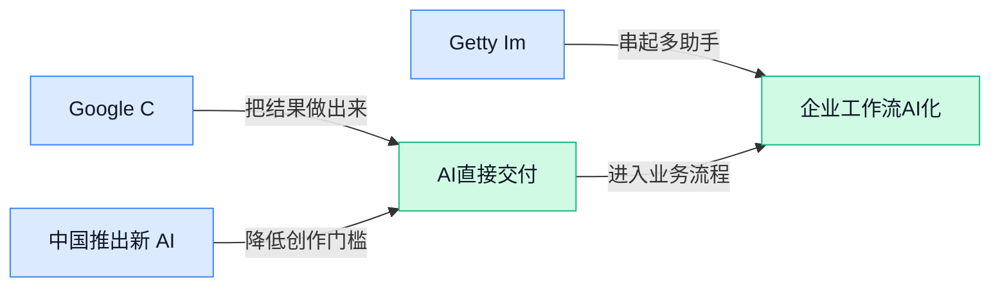
```mermaid
graph LR
A[Google C] -->|把结果做出来| D[AI直接交付]
B[中国推出新 AI] -->|降低创作门槛| D
C[Getty Im] -->|串起多助手| E[企业工作流AI化]
 D -->|进入业务流程| E
classDef blue fill:#dbeafe,stroke:#3b82f6,color:#111827
classDef green fill:#d1fae5,stroke:#10b981,color:#111827
class A,B,C blue
class D,E green
```

### 📊 行业洞察（今日 4 条）

1. Google DeepMind 与 A24 合作研究 AI filmmaking（AI 影视制作），并有约7500万美元投入。  
  【洞察】这表明生成式 AI 正进入专业内容工业，因为影视公司愿意联合研发；机会是流程提效，风险是创作版权与审美同质化争议会同步放大。

2. Getty Images 与 OpenAI 达成多年授权合作，把 licensed photos（授权图片）带入 ChatGPT 搜索。  
  【洞察】行业正从“先能用”转向“先合规”，因为素材来源开始被明确绑定；机会是商业化更稳，风险是优质内容入口可能被少数版权方掌控。

3. Anthropic 联手 Micron 共研 memory architecture（内存架构），并获得多年供应合作。  
  【洞察】大模型竞争已下沉到硬件协同层，因为训练与运行成本越来越受数据吞吐影响；机会是性能提升，风险是资本绑定过深可能放大产业泡沫质疑。

4. Microsoft 在得州建设 2-gigawatt data center（2吉瓦级数据中心），并配套燃气电厂。  
  【洞察】AI 基础设施竞争正受电力约束主导，因为超大规模算力扩张先受能源可得性限制；机会是头部企业壁垒增强，风险是成本、环保与地方阻力上升。

### 💭 对我们的启发（今日 2 条）

1. 参考 Google DeepMind 与 A24 事件，视频剪辑软件可强化脚本分镜、镜头重组与风格参考。机会是缩短创作链路；风险是结果趋同，仍需保留人工精修入口。

2. 参考 Getty Images 与 OpenAI 合作，内容创作工具应优先接入授权素材库与来源标识。机会是降低商用风险、提升企业采纳；风险是素材成本上升，免费体验受限。

