## AI资讯日报 2026/6/24

> AI 早报 · 每日早读 · 全网深度聚合

## **今日摘要**

```
OpenAI 宣称 GPT-5.5-Cyber 安全测试超越 Anthropic Mythos，Anthropic 同日连发 Claude Tag 抢企业入口
GPT-5 帮免疫学家破解 3 年未解之谜，OpenAI 还下场牵头高级 AI 共享标准补规则课
Sakana AI 的 Fugu 追平 Anthropic Fable 与 Mythos，阿里 zvec（轻量向量库）百度 Unlimited OCR（长文档识别）同步开源
```

### 🔵 产品与功能更新

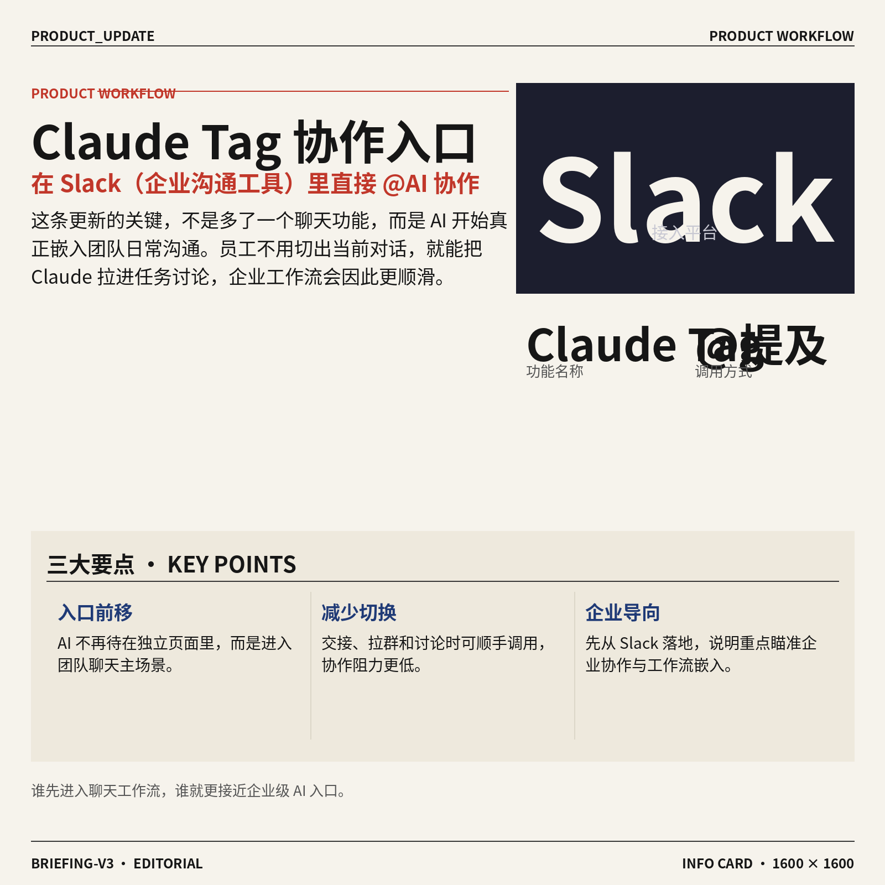

1. **Anthropic 推出 Claude Tag（可在 Slack 里直接点名调用 Claude 的企业协作功能）。**
Anthropic 上线了 **Claude Tag**，让团队成员在 Slack（企业常用的即时沟通工具）里通过“@提及”的方式直接把 Claude 拉进对话，处理协作任务更顺手了 💬。从报道看，这项功能先在 Slack 中推出，后续还计划扩大覆盖范围，明显是在强化 **企业协作** 和 **工作流嵌入** 这两个方向。对非技术岗位同事来说，最直接的意义是：以后不一定要单独打开 AI 页面，可能在日常聊天、拉群讨论、交接事项时就能顺手让 AI 参与进来，减少工具切换 🚀。更多信息可参考 [路透社报道(briefing)](https://news.google.com/rss/articles/CBMiqAFBVV95cUxQMXZ2NGkzVnpxZ1NkOHloUkVWRmVMcGNYSG82TTBYWXRuZHh6UW8xV1I2TDlpWkJpMGRoaHplMFJfa3dHdDlyOUUzWVM1VkpsRDRCTlZ1blFoZXgwVU1WWDE5OHB1Y2NDVDRtRm40bUpOTVhMOUNFV3QyN1FqajVUenFxaXBOR1prQ3BoQkh6dURSaUtLWDlxTTBYUzUxdnZuSjVVc1YtUHo?oc=5)、[功能解读报道(briefing)](https://news.google.com/rss/articles/CBMiwAFBVV95cUxOdHFwS0F6dFVtRFJZQXg1ekpxV29zVWhkaGZzVmY1bjVPNndsWHJYak9xZWlySGR6a0ZCTGpWc0Z0dVVkZEk5cWZWNUZuaEo3X2U1ZnVCQVQ1clplaW8wd0VLNkwzaFotS3hSaXlPdUswSllKZHUzM0FqT2JiUFJMVGo0QlQ3ZUtNVTdSZ3Z5VThyN0l5aWRCMVU5a1Q0b09sZUxvcHhJdXJTRm5WS2tKcWFsNG1RaG5Sa3ExOFVNVGk?oc=5)、[产品细节报道(briefing)](https://news.google.com/rss/articles/CBMiswFBVV95cUxPMlEtc1NLbFotV1FWOW5VSHBrakJBZmpfc3VPdE9Qcm5sR0YybkNzNWtmTmlZajU4QkJZR1Y5eF81VjdIUTVuVFNhbzNpN29fNTEyLWVpdWhBZjE1YW54bTY1d2hoRnBMUXhVdUdWWkZGaW1qc1h2RmF3cnpWTEdMeWNjdHBtaWF5ZUxUeTRZRk1qcUk4SFp6NHBsSVRfZVNicjdZaG53VkVQQU1zMnNRWW1kVQ?oc=5)


### 🟢 前沿研究

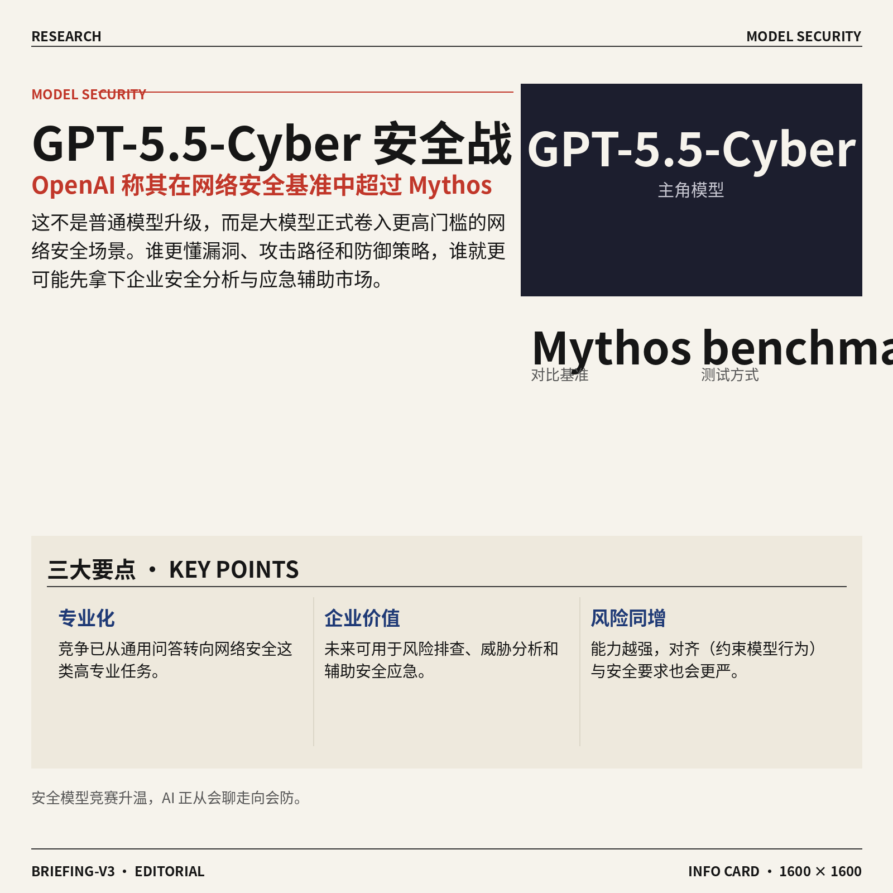

1. **OpenAI 称 GPT-5.5-Cyber（面向网络安全任务的专用模型）在安全测试中超过 Anthropic Mythos（Anthropic 的网络安全能力基准）。**
这条消息的核心不是“又一个新模型”，而是 **AI 正在更深入切入网络安全** 场景：不仅要会聊天，还要能理解漏洞、攻击路径和防御策略。文中提到 OpenAI 表示 **GPT-5.5-Cyber** 在一项网络安全 **benchmark（基准测试，用统一题目比较模型能力的测评）** 上优于 Anthropic 的 **Mythos**，说明大模型竞争已经从通用问答延伸到更专业的实战领域 🔐。对企业来说，这类模型未来可能更适合做安全分析、风险排查和辅助应急，但也意味着“能力更强”与“风险更高”会同时出现，行业对 **alignment（对齐，让模型行为符合人类意图的训练过程）** 的要求会更严。[完整报道(briefing)](https://the-decoder.com/openai-says-new-gpt-5-5-cyber-outperforms-anthropics-mythos-on-cybersecurity-benchmark/)


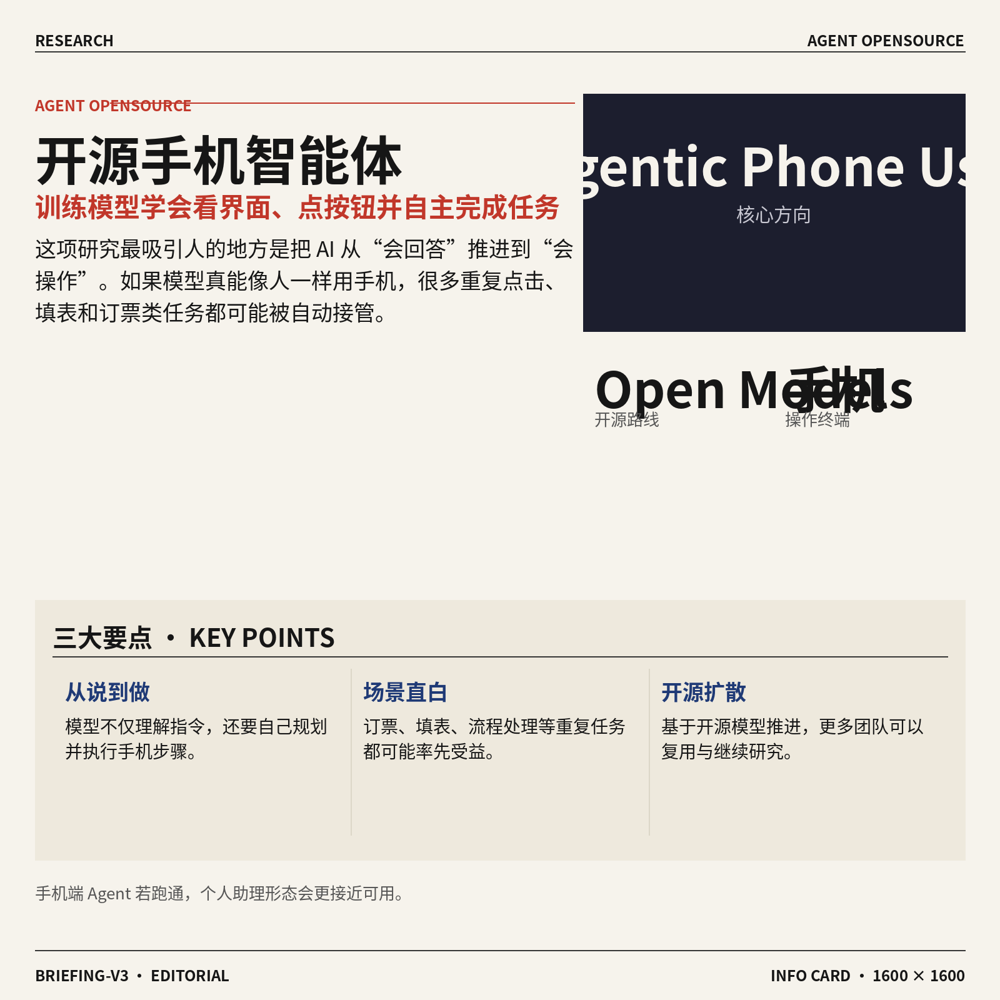

2. **Training Open Models for Agentic Phone Use（训练可自主操作手机的开源模型）瞄准“AI 代你点手机”。**
这篇论文关注的是让 **开源模型** 学会“像人一样用手机”——不是只回答问题，而是能理解界面、点击按钮、完成任务。这里的 **Agentic Phone Use（自主式手机操作，让 AI 自己规划并执行手机步骤）** 可以理解为“AI 版手机助理”，未来有望用于订票、填表、处理重复流程等日常事务 📱。它的重要性在于，把 AI 从“会说”推进到“会做”，而且是基于开源路线，意味着更多团队都能研究和复用相关能力。[论文条目(briefing)](https://huggingface.co/papers/2606.23049)


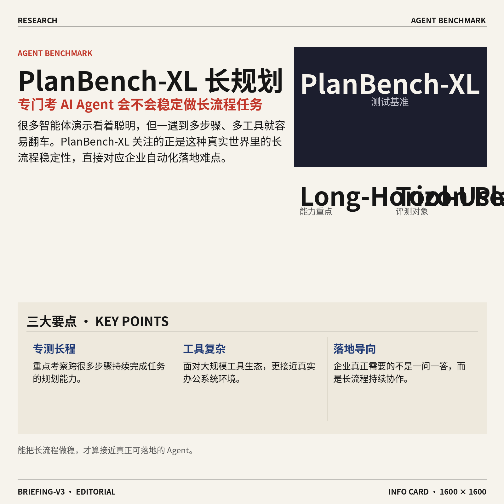

3. **PlanBench-XL（超大规模工具规划测试集）专门考 AI Agent 会不会“做长计划”。**
很多 AI Agent 演示看起来很聪明，但一旦任务步骤变长、工具变多，就容易中途跑偏。**PlanBench-XL** 关注的正是 **Long-Horizon Planning（长程规划，指 AI 需要跨很多步持续完成任务）** 与 **Tool-Use Agents（会调用外部工具的智能体）** 在大规模工具生态里的表现，相当于测试 AI 能否真正胜任复杂流程 🧭。这类研究对企业非常关键，因为真实工作往往不是“一问一答”，而是要在多个系统、多个步骤之间连续协作；谁能把长流程做稳，谁才更接近真正可落地的办公自动化。[论文条目(briefing)](https://huggingface.co/papers/2606.22388)


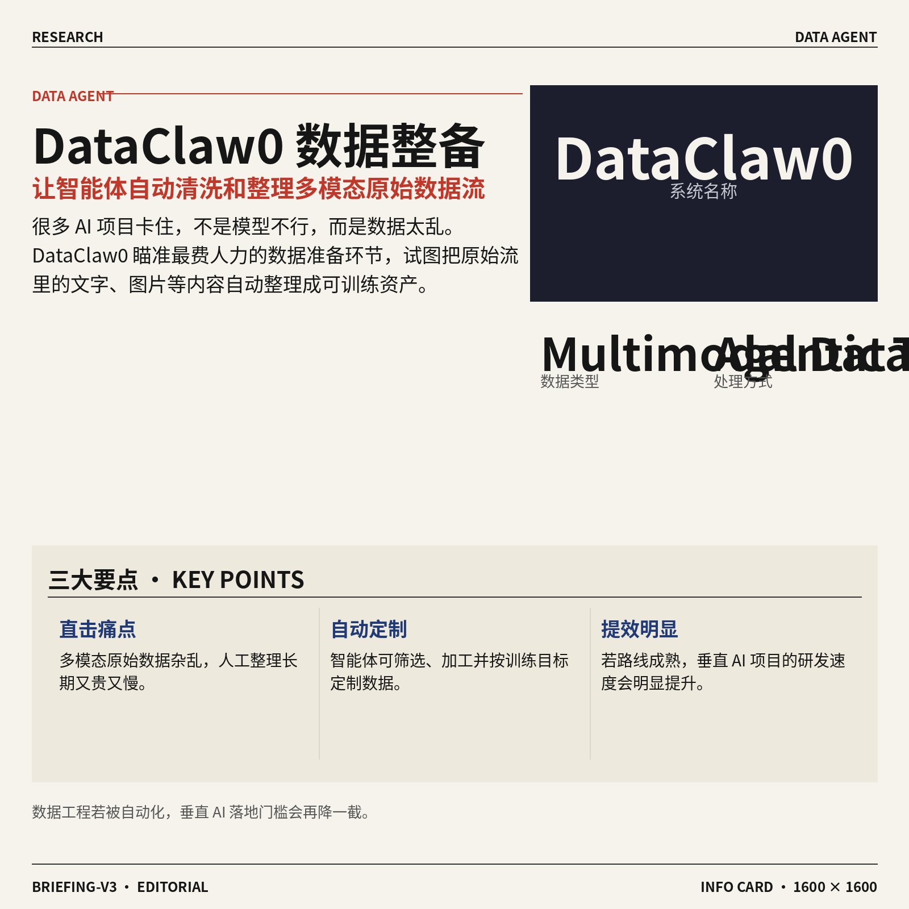

4. **DataClaw0（从原始数据流里自动整理多模态数据的智能体系统）想解决“好数据太难做”的老问题。**
AI 模型好不好，很多时候不只看算法，还看喂给它的数据是否干净、完整、适合训练。**Multimodal Data（多模态数据，指文字、图片、音频、视频等多种类型的数据）** 往往来自杂乱的原始流，人工整理成本很高；而 **Agentic Tailoring（由智能体自动筛选、加工和定制数据）** 就是在尝试把这件事自动化 ✂️。如果这条路线成熟，未来企业做垂直场景 AI 时，最麻烦的数据准备环节可能会被大幅提效，这对研发速度和项目成本都有直接影响。[论文条目(briefing)](https://huggingface.co/papers/2606.21337)

![DataClaw0（从原始数据流里自动整理多模态数据的智能体系统）想解决“好数据太难做”的老问题](https://image.pollinations.ai/prompt/DataClaw0%EF%BC%88%E4%BB%8E%E5%8E%9F%E5%A7%8B%E6%95%B0%E6%8D%AE%E6%B5%81%E9%87%8C%E8%87%AA%E5%8A%A8%E6%95%B4%E7%90%86%E5%A4%9A%E6%A8%A1%E6%80%81%E6%95%B0%E6%8D%AE%E7%9A%84%E6%99%BA%E8%83%BD%E4%BD%93%E7%B3%BB%E7%BB%9F%EF%BC%89%E6%83%B3%E8%A7%A3%E5%86%B3%E2%80%9C%E5%A5%BD%E6%95%B0%E6%8D%AE%E5%A4%AA%E9%9A%BE%E5%81%9A%E2%80%9D%E7%9A%84%E8%80%81%E9%97%AE%E9%A2%98.%20DataClaw0%EF%BC%88%E4%BB%8E%E5%8E%9F%E5%A7%8B%E6%95%B0%E6%8D%AE%E6%B5%81%E9%87%8C%E8%87%AA%E5%8A%A8%E6%95%B4%E7%90%86%E5%A4%9A%E6%A8%A1%E6%80%81%E6%95%B0%E6%8D%AE%E7%9A%84%E6%99%BA%E8%83%BD%E4%BD%93%E7%B3%BB%E7%BB%9F%EF%BC%89%E6%83%B3%E8%A7%A3%E5%86%B3%E2%80%9C%E5%A5%BD%E6%95%B0%E6%8D%AE%E5%A4%AA%E9%9A%BE%E5%81%9A%E2%80%9D%E7%9A%84%E8%80%81%E9%97%AE%E9%A2%98%E3%80%82%20AI%20%E6%A8%A1%E5%9E%8B%E5%A5%BD%E4%B8%8D%E5%A5%BD%EF%BC%8C%E5%BE%88%E5%A4%9A%E6%97%B6%E5%80%99%E4%B8%8D%E5%8F%AA%E7%9C%8B%E7%AE%97%E6%B3%95%EF%BC%8C%E8%BF%98%E7%9C%8B%E5%96%82%E7%BB%99%E5%AE%83%E7%9A%84%E6%95%B0%E6%8D%AE%E6%98%AF%E5%90%A6%E5%B9%B2%2C%20technical%20infographic%20diagram%2C%20architecture%20flowchart%2C%20clean%20vector%20illustration%2C%20educational%20style%2C%20no%20text%20overlay%2C%20modern%20minimal%2C%20wide%20aspect?width=1200&height=675&nologo=true&seed=10900)

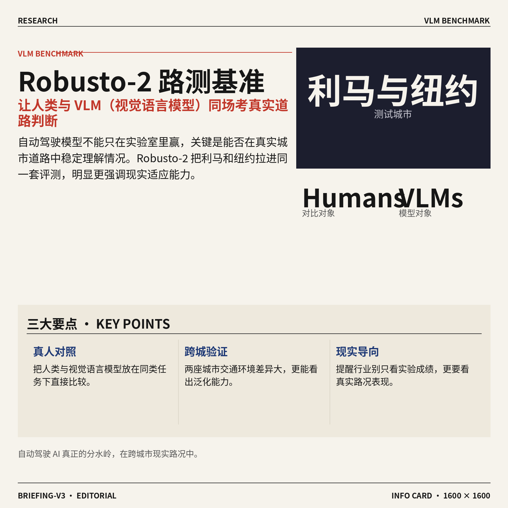

5. **Robusto-2（自动驾驶视觉模型对比基准）把人类和 VLM 放到利马与纽约真实道路中同场考试。**
这项研究把焦点放在自动驾驶理解能力上，比较 **Humans** 与 **VLMs（视觉语言模型，既能看图又能理解文字说明的模型）** 在真实城市驾驶场景里的判断表现。它选用利马和纽约两个差异明显的城市，意味着测试不只是“会不会看路”，还包括能不能适应不同交通环境、规则和复杂度 🚗。这类基准的价值在于提醒行业：自动驾驶 AI 不该只在实验室里表现好，还要经得起跨城市、跨文化、跨路况的现实考验。[论文条目(briefing)](https://huggingface.co/papers/2606.20980)

![Robusto-2（自动驾驶视觉模型对比基准）把人类和 VLM 放到利马与纽约真实道路中同场考试](https://image.pollinations.ai/prompt/Robusto-2%EF%BC%88%E8%87%AA%E5%8A%A8%E9%A9%BE%E9%A9%B6%E8%A7%86%E8%A7%89%E6%A8%A1%E5%9E%8B%E5%AF%B9%E6%AF%94%E5%9F%BA%E5%87%86%EF%BC%89%E6%8A%8A%E4%BA%BA%E7%B1%BB%E5%92%8C%20VLM%20%E6%94%BE%E5%88%B0%E5%88%A9%E9%A9%AC%E4%B8%8E%E7%BA%BD%E7%BA%A6%E7%9C%9F%E5%AE%9E%E9%81%93%E8%B7%AF%E4%B8%AD%E5%90%8C%E5%9C%BA%E8%80%83%E8%AF%95.%20Robusto-2%EF%BC%88%E8%87%AA%E5%8A%A8%E9%A9%BE%E9%A9%B6%E8%A7%86%E8%A7%89%E6%A8%A1%E5%9E%8B%E5%AF%B9%E6%AF%94%E5%9F%BA%E5%87%86%EF%BC%89%E6%8A%8A%E4%BA%BA%E7%B1%BB%E5%92%8C%20VLM%20%E6%94%BE%E5%88%B0%E5%88%A9%E9%A9%AC%E4%B8%8E%E7%BA%BD%E7%BA%A6%E7%9C%9F%E5%AE%9E%E9%81%93%E8%B7%AF%E4%B8%AD%E5%90%8C%E5%9C%BA%E8%80%83%E8%AF%95%E3%80%82%20%E8%BF%99%E9%A1%B9%E7%A0%94%E7%A9%B6%E6%8A%8A%E7%84%A6%E7%82%B9%E6%94%BE%E5%9C%A8%E8%87%AA%E5%8A%A8%E9%A9%BE%E9%A9%B6%E7%90%86%E8%A7%A3%E8%83%BD%E5%8A%9B%E4%B8%8A%EF%BC%8C%E6%AF%94%E8%BE%83%20Humans%20%E4%B8%8E%2C%20technical%20infographic%20diagram%2C%20architecture%20flowchart%2C%20clean%20vector%20illustration%2C%20educational%20style%2C%20no%20text%20overlay%2C%20modern%20minimal%2C%20wide%20aspect?width=1200&height=675&nologo=true&seed=10931)

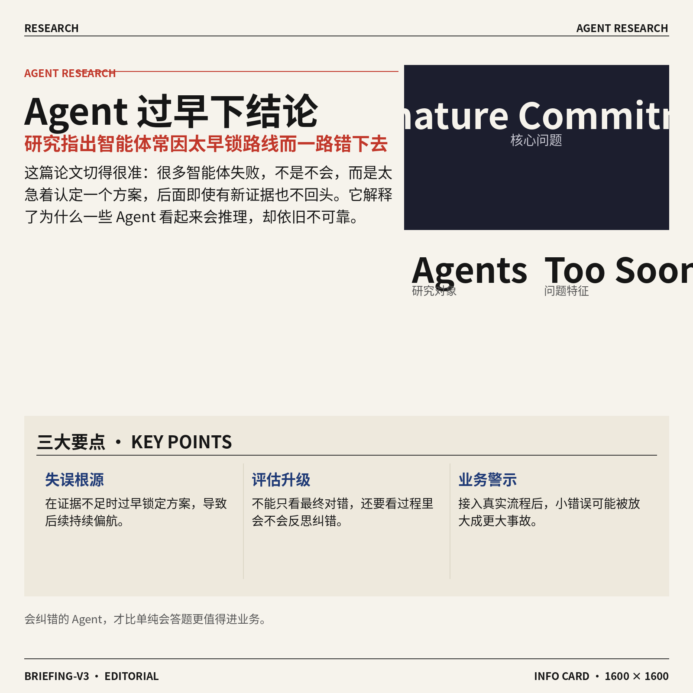

6. **When Agents Commit Too Soon（智能体过早下结论问题研究）点出 AI Agent 常见但容易被忽视的失误。**
不少 AI Agent 失败，不是因为完全不会做，而是因为太早认定某条路线正确，后面就一路错下去。论文把这个问题概括为 **Premature Commitment（过早承诺，指 AI 在证据不足时太快锁定方案）**，本质上是在诊断大模型智能体为什么明明能推理，却还是会“钻牛角尖” 🤔。这对产品和业务团队也很有启发：以后评估 AI，不该只看最终答对率，还要看它是不是会在流程中及时反思、改计划、纠错，否则一旦接入真实业务就可能把小错误放大成大事故。[论文条目(briefing)](https://huggingface.co/papers/2606.22936)


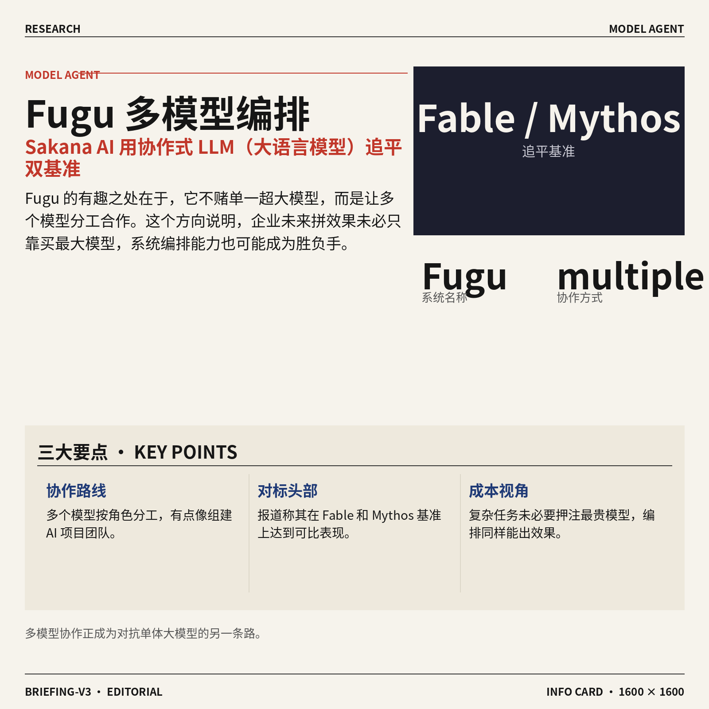

7. **Sakana AI 的 Fugu（协调多个大模型分工协作的系统）号称追平 Anthropic 的 Fable 与 Mythos 基准。**
这条研究路线很有意思：它不一定靠“一个更大的单体模型”取胜，而是让多个 **LLMs（大语言模型）** 彼此协作、分工完成任务，有点像把不同专长的人组成项目组。报道提到 **Fugu** 通过这种 **orchestrates（编排协调，让多个模型按角色协同工作）** 的方式，在 Anthropic 的 **Fable** 和 **Mythos** 基准上达到可比表现，说明“多模型协作”正在成为另一条重要竞争路线 🐡。对企业而言，这意味着未来做复杂任务时，未必只盯着最贵最大的模型，如何把多个模型搭配起来，可能同样决定系统效果和成本。[完整报道(briefing)](https://the-decoder.com/sakana-ais-fugu-orchestrates-multiple-llms-to-match-anthropics-fable-and-mythos-benchmarks/)


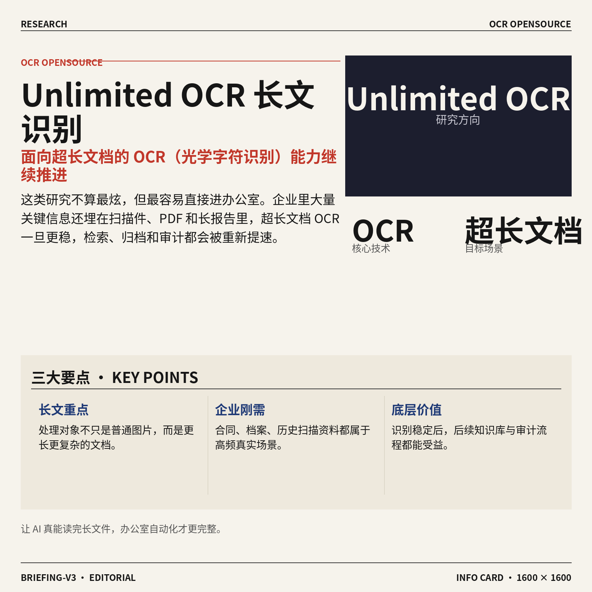

8. **Unlimited OCR Works（面向超长文档识别的光学字符识别研究）继续推动“让 AI 读万页文件”。**
**OCR（光学字符识别，把图片或扫描件里的文字自动提取出来）** 早就不新鲜，但“Unlimited”这个方向指向的是更长、更复杂、更难一次性处理的文档场景，比如超长报告、档案、合同或历史扫描资料 📄。这类研究的现实意义很强：企业里大量信息还躺在 PDF、截图和扫描件里，如果 OCR 能稳定处理超长内容，就能让后续检索、归档、审计和知识库建设更顺畅。换句话说，它不是最吸睛的前沿热点，却很可能是最容易直接改变办公室工作流的一类底层能力。[论文条目(briefing)](https://huggingface.co/papers/2606.23050)

![Unlimited OCR Works（面向超长文档识别的光学字符识别研究）继续推动“让 AI 读万页文件”](https://image.pollinations.ai/prompt/Unlimited%20OCR%20Works%EF%BC%88%E9%9D%A2%E5%90%91%E8%B6%85%E9%95%BF%E6%96%87%E6%A1%A3%E8%AF%86%E5%88%AB%E7%9A%84%E5%85%89%E5%AD%A6%E5%AD%97%E7%AC%A6%E8%AF%86%E5%88%AB%E7%A0%94%E7%A9%B6%EF%BC%89%E7%BB%A7%E7%BB%AD%E6%8E%A8%E5%8A%A8%E2%80%9C%E8%AE%A9%20AI%20%E8%AF%BB%E4%B8%87%E9%A1%B5%E6%96%87%E4%BB%B6%E2%80%9D.%20Unlimited%20OCR%20Works%EF%BC%88%E9%9D%A2%E5%90%91%E8%B6%85%E9%95%BF%E6%96%87%E6%A1%A3%E8%AF%86%E5%88%AB%E7%9A%84%E5%85%89%E5%AD%A6%E5%AD%97%E7%AC%A6%E8%AF%86%E5%88%AB%E7%A0%94%E7%A9%B6%EF%BC%89%E7%BB%A7%E7%BB%AD%E6%8E%A8%E5%8A%A8%E2%80%9C%E8%AE%A9%20AI%20%E8%AF%BB%E4%B8%87%E9%A1%B5%E6%96%87%E4%BB%B6%E2%80%9D%E3%80%82%20OCR%EF%BC%88%E5%85%89%E5%AD%A6%E5%AD%97%E7%AC%A6%E8%AF%86%E5%88%AB%EF%BC%8C%E6%8A%8A%E5%9B%BE%E7%89%87%E6%88%96%E6%89%AB%E6%8F%8F%E4%BB%B6%E9%87%8C%E7%9A%84%E6%96%87%E5%AD%97%E8%87%AA%E5%8A%A8%2C%20technical%20infographic%20diagram%2C%20architecture%20flowchart%2C%20clean%20vector%20illustration%2C%20educational%20style%2C%20no%20text%20overlay%2C%20modern%20minimal%2C%20wide%20aspect?width=1200&height=675&nologo=true&seed=11024)

### 🟡 行业展望与社会影响

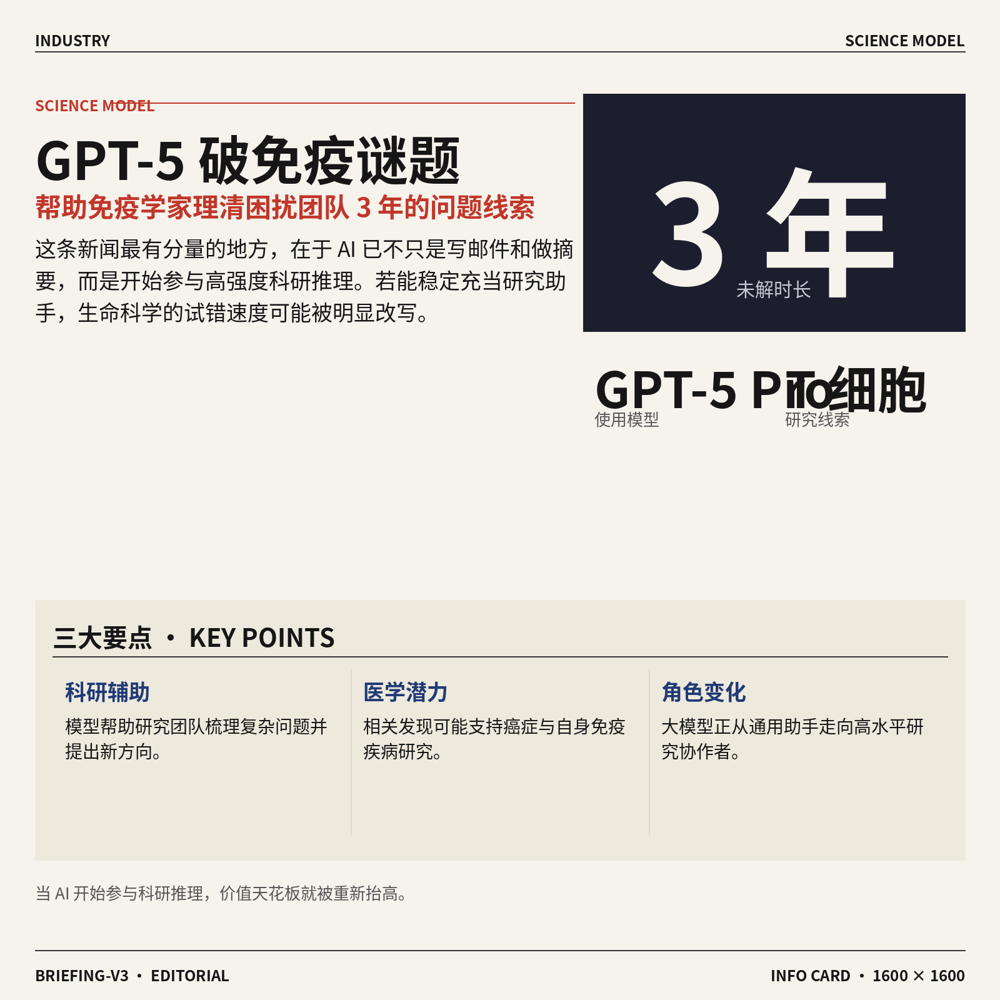

1. **GPT-5 帮助免疫学家破解 3 年未解之谜。**
OpenAI 分享了一个很能说明 **AI 科研辅助价值** 的案例：GPT-5 Pro（GPT-5 的增强版）帮助免疫学家 Derya Unutmaz 理清了困扰团队 3 年的免疫学问题，并给出了关于 **T 细胞**（人体免疫系统里负责识别和攻击异常细胞的关键白细胞）行为的新线索 🧪。这件事的意义不只是“答对一道题”，而是说明大模型已经开始在复杂科研推理里扮演“高水平研究助手”的角色。原文还提到，这一突破可能进一步支持 **癌症** 和 **自身免疫疾病**（免疫系统误伤自己身体的疾病）研究，对医疗行业的长期影响值得关注 💡。[OpenAI 案例分享(briefing)](https://openai.com/index/gpt-5-immunology-mystery)


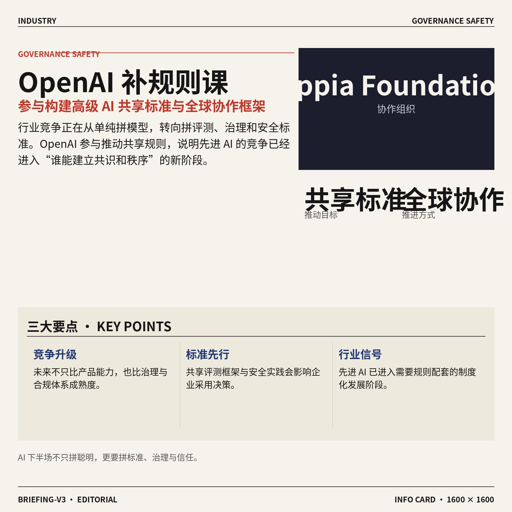

2. **OpenAI 参与构建高级 AI 共享标准，行业开始补“规则课”。**
随着 AI 能力越来越强，行业现在比拼的不只是模型谁更聪明，也包括谁能把 **评测框架**（用统一标准衡量 AI 能力与风险的机制）和 **安全实践**（降低误用、失控、伤害的具体做法）做得更扎实。OpenAI 表示，正通过 Appia Foundation（一个推动高级 AI 协作与治理的组织）支持更广泛的 **全球协作**，帮助建立面向先进 AI 的共享标准 🌍。这释放出一个很清晰的信号：未来 AI 竞争不只是产品竞争，也会越来越多地进入“标准、治理、合规”层面。对企业来说，这意味着选用 AI 工具时，除了看效果，也要更关注其背后的安全评估与行业规范。[OpenAI 标准倡议(briefing)](https://openai.com/index/helping-build-shared-standards-for-advanced-ai)

![OpenAI 参与构建高级 AI 共享标准，行业开始补“规则课”](https://image.pollinations.ai/prompt/OpenAI%20%E5%8F%82%E4%B8%8E%E6%9E%84%E5%BB%BA%E9%AB%98%E7%BA%A7%20AI%20%E5%85%B1%E4%BA%AB%E6%A0%87%E5%87%86%EF%BC%8C%E8%A1%8C%E4%B8%9A%E5%BC%80%E5%A7%8B%E8%A1%A5%E2%80%9C%E8%A7%84%E5%88%99%E8%AF%BE%E2%80%9D.%20OpenAI%20%E5%8F%82%E4%B8%8E%E6%9E%84%E5%BB%BA%E9%AB%98%E7%BA%A7%20AI%20%E5%85%B1%E4%BA%AB%E6%A0%87%E5%87%86%EF%BC%8C%E8%A1%8C%E4%B8%9A%E5%BC%80%E5%A7%8B%E8%A1%A5%E2%80%9C%E8%A7%84%E5%88%99%E8%AF%BE%E2%80%9D%E3%80%82%20%E9%9A%8F%E7%9D%80%20AI%20%E8%83%BD%E5%8A%9B%E8%B6%8A%E6%9D%A5%E8%B6%8A%E5%BC%BA%EF%BC%8C%E8%A1%8C%E4%B8%9A%E7%8E%B0%E5%9C%A8%E6%AF%94%E6%8B%BC%E7%9A%84%E4%B8%8D%E5%8F%AA%E6%98%AF%E6%A8%A1%E5%9E%8B%E8%B0%81%E6%9B%B4%E8%81%AA%E6%98%8E%EF%BC%8C%E4%B9%9F%E5%8C%85%E6%8B%AC%E8%B0%81%E8%83%BD%E6%8A%8A%20%E8%AF%84%E6%B5%8B%E6%A1%86%E6%9E%B6%EF%BC%88%E7%94%A8%E7%BB%9F%E4%B8%80%E6%A0%87%2C%20technical%20infographic%20diagram%2C%20architecture%20flowchart%2C%20clean%20vector%20illustration%2C%20educational%20style%2C%20no%20text%20overlay%2C%20modern%20minimal%2C%20wide%20aspect?width=1200&height=675&nologo=true&seed=10838)

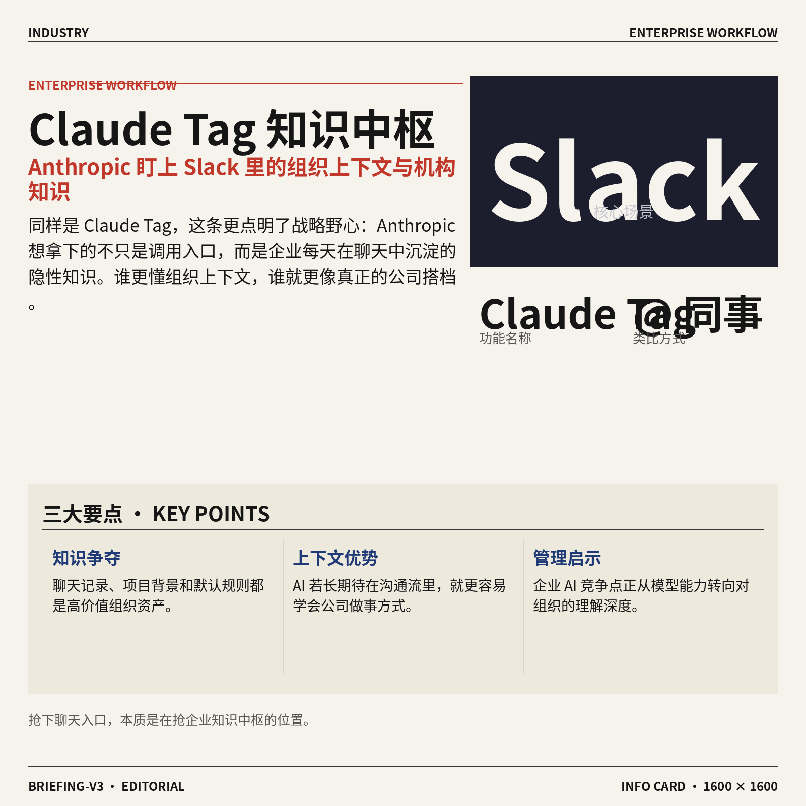

3. **Anthropic 推出 Claude Tag（可在 Slack 内随时召唤的 AI 助手），瞄准企业知识中枢。**
Anthropic 新功能 Claude Tag 上线到 Slack（企业常用的团队沟通工具）后，员工可以像 @ 同事一样直接唤起 Claude，让它在聊天流里持续参与工作 🤖。TechCrunch 的解读指出，这背后不只是提升效率，更是在让 AI 学会公司的 **组织上下文**（团队内部默认规则、项目背景、历史决策）和 **机构知识**（散落在聊天记录、文档、流程里的隐性经验）。换句话说，谁先进入企业日常沟通场景，谁就更有机会成为真正懂公司业务的 AI 搭档。对管理者而言，这也提示一个新趋势：未来企业 AI 的竞争点，可能不只是模型能力，而是谁更懂你公司的沟通和协作方式。[TechCrunch 完整报道(briefing)](https://techcrunch.com/2026/06/23/anthropics-claude-tag-is-learning-your-company-one-slack-message-at-a-time/) [功能上线消息(briefing)](https://news.google.com/rss/articles/CBMicEFVX3lxTE1XeGw5UU90TzEwZGFhNEM2eHVJNUFISC1MSW1MNWNETkJvOExvd3FFaVFPaUQ5d0dacjdiVGQtRHFQWUNzdzJ1Ui1IRkFad21XMGpsSWlhYXFnbzZ6RE9xM2hOY25vWXhPRGpLRmlUb3k?oc=5)


### 🟣 开源TOP项目

1. **system_prompts_leaks（多家主流 AI 助手系统提示词泄露整理库）在 GitHub 走红。**
这个项目把 Anthropic、OpenAI、Google、xAI 等多家产品的**系统提示词**（system prompt，开发者预先写给模型的“后台说明书”，决定它怎么回答、能做什么）整理到一个仓库里，等于把不少 AI 助手的“工作守则”摊开给大家看 👀。对普通用户来说，它能帮助理解为什么不同助手会有截然不同的语气、边界和工具调用方式；对产品和运营同事来说，也能更直观看到**提示词设计**到底怎样影响体验。由于原仓库核心价值就是汇总这些已提取内容，想快速感受差异可直接看 [GitHub 提示词仓库(briefing)](https://github.com/asgeirtj/system_prompts_leaks) 💡


2. **zvec（阿里巴巴开源的轻量级向量数据库）主打快和轻。**
zvec 是一个**向量数据库**（把文字、图片等内容转成一串数字，方便按“语义相似”去检索的存储工具），而且强调 **in-process**（进程内运行，意思是不必额外搭一套独立数据库服务，应用里就能直接用）⚡。这类能力常被用在 RAG（检索增强生成，让 AI 回答前先查资料）场景里，比如知识库问答、相似内容推荐、客服资料召回。对想做轻量 AI 应用的团队来说，它意味着部署门槛更低、响应也更直接；项目说明可见 [阿里开源仓库页(briefing)](https://github.com/alibaba/zvec)。


3. **Unlimited OCR（百度开源的长文档一次性识别解析方案）瞄准复杂文档处理。**
OCR（光学字符识别，让 AI 从图片或扫描件里读出文字）大家不陌生，但这个项目特别强调 **one-shot long-horizon parsing**（一次处理长流程解析，尽量减少传统分步骤拼接带来的信息断裂）📄。这意味着面对长表格、长报告、跨页材料时，模型有机会更完整地理解整份文档，而不只是“截一块识一块”。对行政、财务、法务等经常碰扫描文件的岗位来说，这类能力未来最直接的价值就是减少人工整理和校对。想看原始项目可参考 [百度项目主页(briefing)](https://github.com/baidu/Unlimited-OCR)。


4. **QwenPaw（可自部署的个人 AI 助手项目）主打多聊天应用接入。**
QwenPaw 把“个人 AI 助手”做成了一个更容易安装和部署的开源项目，既能放在自己电脑上，也支持放到云端使用 ☁️。它强调支持多个**聊天应用**，并且能力可扩展，背后其实是把不同工具和服务接成一个更完整的 Agent 工作流。对企业团队来说，这类项目的意义在于：如果不想把核心流程完全交给外部平台，就可以尝试**自部署**（把系统搭在自己控制的环境里）来做更可控的内部助手。[项目仓库说明(briefing)](https://github.com/agentscope-ai/QwenPaw) 里能看到它的安装与定位。

![QwenPaw（可自部署的个人 AI 助手项目）主打多聊天应用接入](https://image.pollinations.ai/prompt/QwenPaw%EF%BC%88%E5%8F%AF%E8%87%AA%E9%83%A8%E7%BD%B2%E7%9A%84%E4%B8%AA%E4%BA%BA%20AI%20%E5%8A%A9%E6%89%8B%E9%A1%B9%E7%9B%AE%EF%BC%89%E4%B8%BB%E6%89%93%E5%A4%9A%E8%81%8A%E5%A4%A9%E5%BA%94%E7%94%A8%E6%8E%A5%E5%85%A5.%20QwenPaw%EF%BC%88%E5%8F%AF%E8%87%AA%E9%83%A8%E7%BD%B2%E7%9A%84%E4%B8%AA%E4%BA%BA%20AI%20%E5%8A%A9%E6%89%8B%E9%A1%B9%E7%9B%AE%EF%BC%89%E4%B8%BB%E6%89%93%E5%A4%9A%E8%81%8A%E5%A4%A9%E5%BA%94%E7%94%A8%E6%8E%A5%E5%85%A5%E3%80%82%20QwenPaw%20%E6%8A%8A%E2%80%9C%E4%B8%AA%E4%BA%BA%20AI%20%E5%8A%A9%E6%89%8B%E2%80%9D%E5%81%9A%E6%88%90%E4%BA%86%E4%B8%80%E4%B8%AA%E6%9B%B4%E5%AE%B9%E6%98%93%E5%AE%89%E8%A3%85%E5%92%8C%E9%83%A8%E7%BD%B2%E7%9A%84%E5%BC%80%E6%BA%90%E9%A1%B9%E7%9B%AE%EF%BC%8C%E6%97%A2%E8%83%BD%E6%94%BE%E5%9C%A8%E8%87%AA%E5%B7%B1%E7%94%B5%2C%20technical%20infographic%20diagram%2C%20architecture%20flowchart%2C%20clean%20vector%20illustration%2C%20educational%20style%2C%20no%20text%20overlay%2C%20modern%20minimal%2C%20wide%20aspect?width=1200&height=675&nologo=true&seed=11094)

5. **MiMo-Code（小米开源的模型与 Agent 共演化编码项目）探索更自主的写代码方式。**
这个项目的关键词是 **Models and Agents Co-Evolve**（模型与 Agent 共同进化，意思不是只提升模型本身，而是连同自动执行任务的智能体一起迭代）🛠️。相比传统“你问一句、它答一句”的编码助手，这种方向更强调让 AI 在写代码、调用工具、修正结果之间形成闭环。对研发管理者和产品团队来说，这代表未来的 AI 编程工具可能不只是“补全代码”，而是逐步变成能自己推进任务的协作伙伴。项目入口见 [小米开源仓库(briefing)](https://github.com/XiaomiMiMo/MiMo-Code)。


6. **OpenMontage（号称首个开源 Agent 化视频制作系统）想把 AI 编程助手变成视频工作室。**
OpenMontage 把视频生产拆成了 12 条**流水线**（pipeline，把复杂工作拆成一连串可执行步骤）、52 个工具和 500 多项 Agent 技能，目标是覆盖更完整的视频制作流程 🎬。它最有意思的点在于“agentic video production”（Agent 驱动的视频生产，不是单点生成，而是让 AI 分步骤完成策划、处理、组合等任务），这比单纯的文生视频更像一个生产系统。对内容运营、市场和品牌团队来说，这类项目说明 AI 正从“生成一个片段”走向“协助完成整套制作流程”。更多细节可查看 [开源项目主页(briefing)](https://github.com/calesthio/OpenMontage)。


### 🔴 社媒分享

1. **《AI's Affordability Crisis》指出 AI 正陷入“用得起”危机。**
这篇文章把焦点放在 **可负担性** 上：不是 AI 能不能做，而是越来越多公司和用户是否还能长期承受它的成本压力 💸。当模型能力持续上涨，背后的 **inference（模型推理，让训练好的模型真正回答问题的过程）** 与算力投入也可能同步抬升，这会直接影响产品定价和普及速度。对业务团队来说，这类讨论很重要，因为 AI 竞争不只看“谁最强”，还要看“谁能把价格打到更多人用得起” 📉。[原文分析文章(briefing)](https://blog.dshr.org/2026/06/ais-affordability-crisis.html)


2. **Lift4D（一个把单视角视频还原成动态 3D 场景的研究项目）瞄准更自然的 4D 重建。**
这个项目关注的是“只看一个视角”，也尽量还原人物或场景随时间变化的立体效果，所谓 **4D reconstruction（四维重建，也就是 3D 立体结构再加上时间变化）**。它试图协调 **single-view 3D estimation（单视角三维估计，仅凭一个镜头推断立体形状）**，让真实世界里随手拍的视频也更容易做出动态 3D 结果 🎥。这类方向如果成熟，会让电商展示、游戏内容制作、影视特效等场景的建模门槛继续下降，对内容行业尤其值得关注。[项目主页介绍(briefing)](https://lift4d.github.io/)


3. **《Memory Chips and China, Microsoft and Chinese Models》讨论中国存储芯片与模型生态的连锁影响。**
文章一边谈 **memory chips（存储芯片，负责保存数据和程序的核心硬件）** 厂商与中国市场的关系，一边点出 Microsoft 在模型选择上的现实激励：如果中国模型更有性价比，就可能更有吸引力。这里的核心不是单一技术突破，而是 **供应链**、**成本结构** 和模型商业化之间开始更紧地绑在一起 🔗。对企业管理者来说，这提醒我们未来看 AI 竞争，不能只盯产品体验，也要看芯片、区域市场和合作生态如何一起改写牌局。[完整专栏文章(briefing)](https://stratechery.com/2026/memory-chips-and-china-microsoft-and-chinese-models/)


4. **Claude Tag（Anthropic 推出的 Claude 内容标记方案）上线，AI 生成内容可识别性再进一步。**
从官方标题看，Claude Tag 主打的是 **标记** 能力，也就是给 Claude 生成的内容加上可识别线索，方便外界判断内容来源 🏷️。这类机制通常关系到 **content provenance（内容溯源，帮助判断一段内容是怎么生成、来自哪里的机制）**，对媒体、企业传播和合规团队都很关键。说白了，AI 生成内容越来越多之后，大家不只关心“好不好用”，也更关心“能不能分清是谁生成的、是否可追踪” 👀。[Anthropic 官方发布(briefing)](https://www.anthropic.com/news/introducing-claude-tag)


---

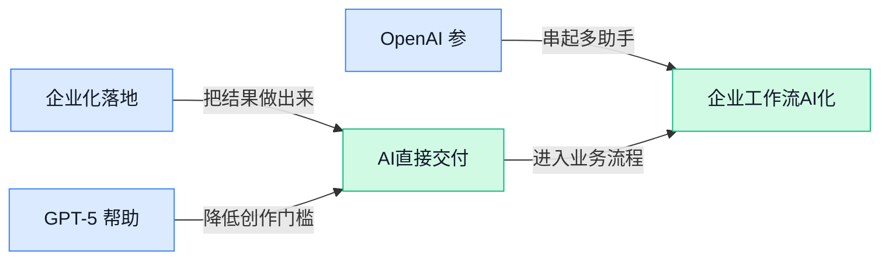
```mermaid
graph LR
A[企业化落地] -->|把结果做出来| D[AI直接交付]
B[GPT-5 帮助] -->|降低创作门槛| D
C[OpenAI 参] -->|串起多助手| E[企业工作流AI化]
 D -->|进入业务流程| E
classDef blue fill:#dbeafe,stroke:#3b82f6,color:#111827
classDef green fill:#d1fae5,stroke:#10b981,color:#111827
class A,B,C blue
class D,E green
```

### 📊 行业洞察（今日 4 条）

1. Anthropic把 Claude Tag 塞进 Slack（团队沟通工具），OpenMontage 又把视频制作拆成 12 条流水线
  【洞察】AI 竞争点正从“会不会生成”转向“能不能嵌进现成工作流里把整活做完”，入口和流程控制权比单点能力更值钱

2. PlanBench-XL（长流程任务测试）、When Agents Commit Too Soon（过早下结论研究）、手机操作模型三条新闻撞在一起
  【洞察】Agent 离真正替人干活还差一口气，最大短板不是不会点按钮，而是长流程里容易走偏、死磕错误路线

3. OpenAI 一边说 GPT-5.5-Cyber 在安全基准上超过 Anthropic，一边又参与制定高级 AI 共享标准
  【洞察】头部公司现在是“两条腿走路”：一边拼专业场景战力，一边抢规则制定权，后者会越来越影响企业采购信任

4. system_prompts_leaks（系统提示词泄露仓库）走红，Anthropic 又推 Claude Tag 做内容标记
  【洞察】这放一起看很现实：AI 产品越来越强，但“能否被看懂、被追踪、被约束”正在变成和效果同等重要的卖点

### 💭 对我们的启发（今日 3 条）

1. OpenMontage 证明“视频 Agent 化”已经开始开源化，我们的视频剪辑软件不能只做素材处理，要把脚本、选镜头、剪辑、审校串成完整出片流程。

2. PlanBench-XL 和“过早下结论”研究提醒我们，自动剪片不能默认全自动到底；关键节点要能让人接管，比如定脚本、定商品卖点、定最终版本。

3. Claude Tag 和提示词泄露同时出现，说明信任机制要前置：我们若做 AI 生成视频，得默认保留过程记录、版本来源和可回退能力，不然企业客户不敢深用。

