## AI资讯日报 2026/6/27

> AI 早报 · 每日早读 · 全网深度聚合

## **今日摘要**

```
OpenAI 预览 GPT-5.6 Sol、Terra、Luna三线齐发，美国政府逐个客户审批，前沿模型走向准入制
Lindy（AI 自动化创业公司）全面弃用 Claude 转投 DeepSeek，智谱被指快速逼近美国头部大模型
Anthropic 的 Mythos 获准向100多家美国机构发布，CEO直言AI正替掉初级工程师引爆争议
```

### 🔵 产品与功能更新

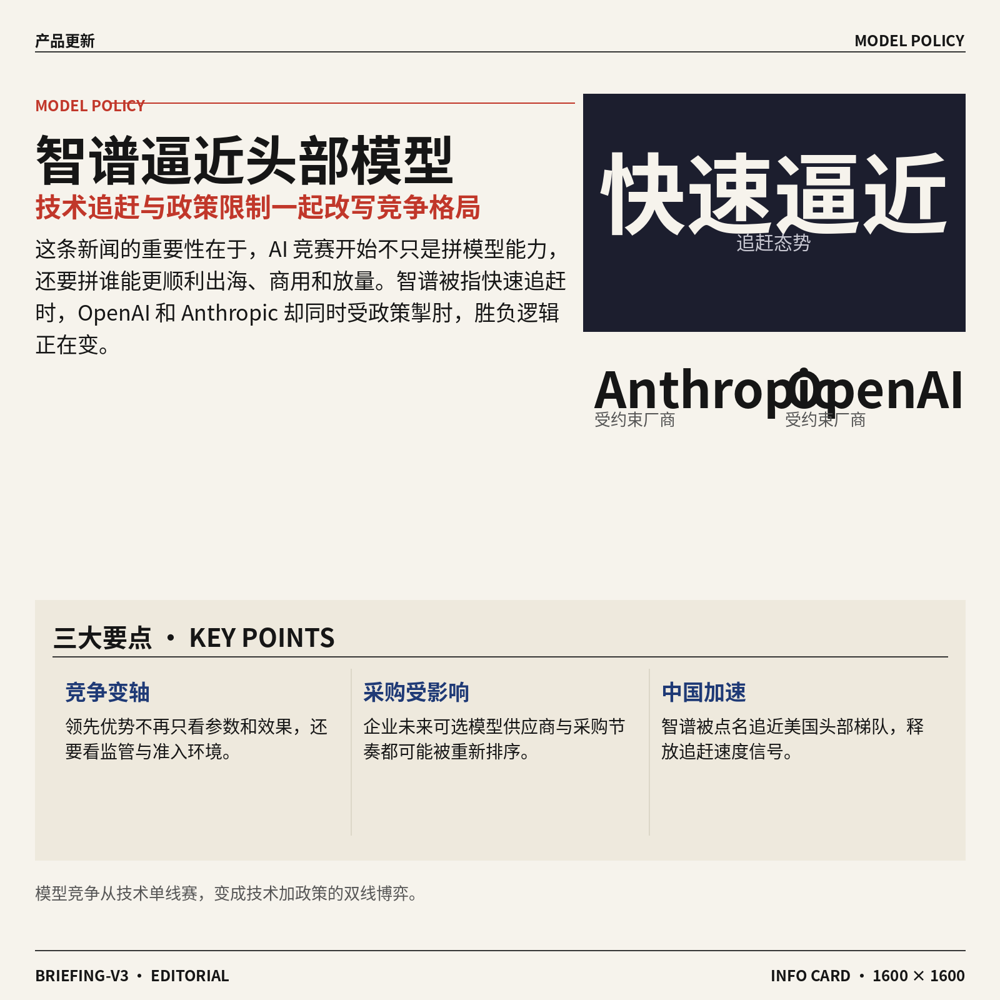

1. **智谱被指快速逼近美国头部大模型，Anthropic 和 OpenAI 受政策掣肘。**
CNBC 报道称，中国公司**智谱**正在加速追赶美国最强一梯队的 AI 模型，这条线索的看点不只是“谁更强”，更是**技术进展与政策限制**开始同时影响竞争格局 📈。文中提到，**Anthropic** 和 **OpenAI** 在部分对外能力释放上受到约束，这意味着领先优势不一定只由模型水平决定，还会被监管和市场准入左右。对普通企业用户来说，这类变化会直接影响未来可选的**模型供应商**、采购节奏和产品落地空间。[CNBC 报道原文(briefing)](https://news.google.com/rss/articles/CBMiigFBVV95cUxPSFBiWXhDV3VHdk83TGVfaWRuem1fODFCeUg2ckJFcGlXZzJFYUJKTzFQb0FKQ1BJLUZZN0Z3VkxKOW5Yb0lEQkw4WXB5cTRsenFGdnZLUURTeW1KdWZGakFWdlV0dFNRVkdpcElQS3lRNDhSN2x4R2xQT0FCT1Yxa01SbDdkNFdFM2fSAY8BQVVfeXFMTkFzUHpXWjJ3dGkybjdSLXBaNTEyX1Uyek4zU2ROMDRBbU5MdkV5Y3BwRm9PNEx5dzYyRDF5Y0ItMVNPZEVEZ1QzVWFRZHRhbVBJQ2FMRm01Wl9NMkxfbVVzaWcyMmh5bTczQy05MWtSeFRUWUxyeFZoekV2S0kzQXA3Si1xb2ltNVRNQXpXZWs?oc=5)


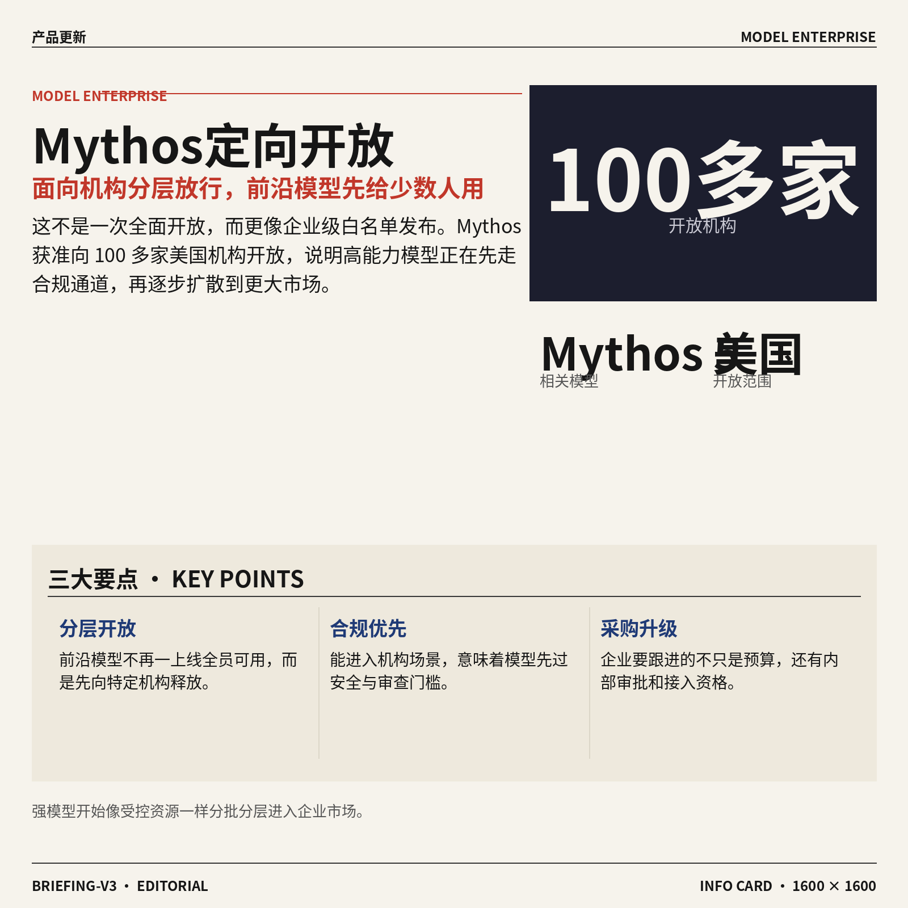

2. **Anthropic 的 Mythos（面向美国机构开放的模型）获准向 100 多家美国机构发布。**
综合 Reuters 和 9to5Mac 的说法，**Claude Mythos 5** 或相关 **Mythos** 模型已获准向部分美国公司和 100 多家美国机构开放，这更像一次**定向放行**而不是全面铺开 🔓。这里的“机构”通常意味着有更高的合规与安全门槛，所以这类发布本身也传递出一个信号：高能力模型正越来越多地以**分层开放**方式进入市场。对企业侧来说，这会影响谁能先用上更强模型，以及**企业级采购**和内部审批流程怎么跟进。[Reuters 报道摘要(briefing)](https://news.google.com/rss/articles/CBMitgFBVV95cUxOREhtVHBfT0Y3bnFFSm9mMmdvYlFhelN2SkZfWWdkb0lzSkpvazRVUFdoY0l6RVVUNEZqdUIxaWtuQWZ5TXpFRzRSTHlDMkhUOS1MZ1ozVHVHSUJpZVZmQ2pmSmRPVHZSRmxqRm11RzhtLTgxbkJRZkVYeXQ4WFd4bFJxb1Z5Yi0xa2poU3U5SUZDMjVyM3p0T2dUYkRIanlGSjlPOFcyekpnbU5wd3UzY1FYQWJBUQ?oc=5) [9to5Mac 补充报道(briefing)](https://news.google.com/rss/articles/CBMipwFBVV95cUxPeDlJRnNOZHVJREEzNTY4ZmNxLXExcTdFQ3JueG5XdE9pYlpibFp0aTZTU3Z2MUdsSHFxNmZhV25QbE5IajVrTldXcUFxZm9UQm54Z1pMR0RqNk5TTFBlbk1IR3NDcVFiaExEWm55MDAtd19SOThZbk9FOU1lTGhWaldxNjlMdFRZNnlXb1BYdkxLQzFvRTZUaEVHS2hjSjdmT0dBVzBNOA?oc=5)


### 🟢 前沿研究

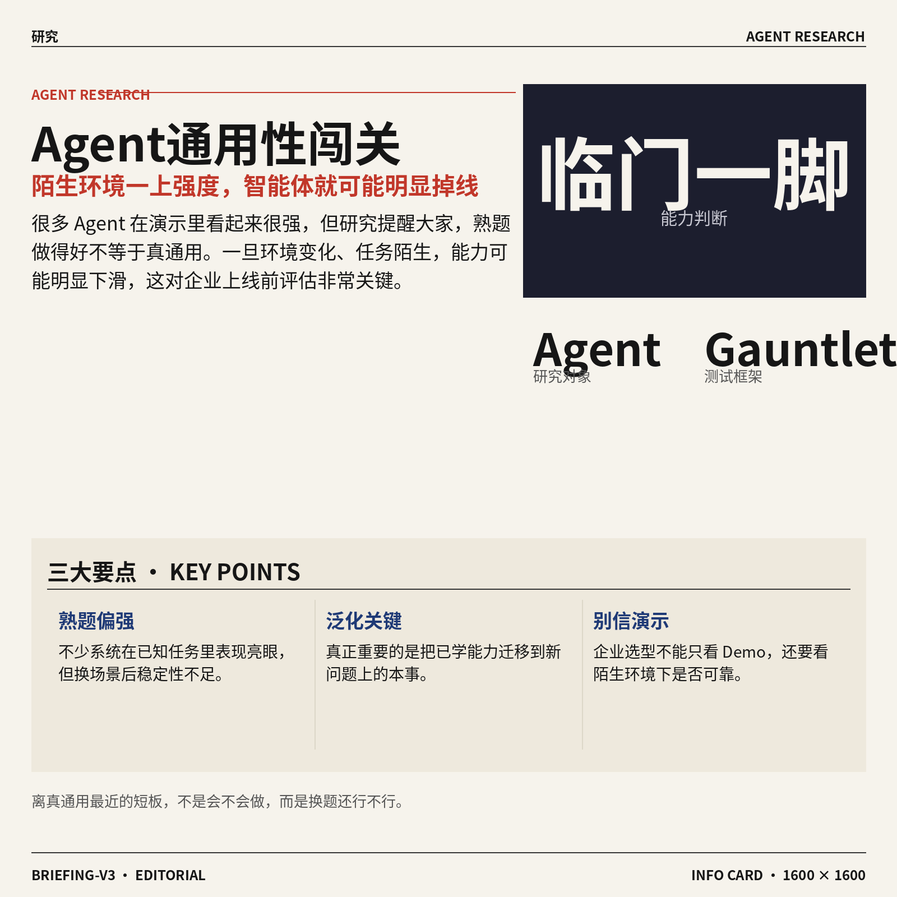

1. **Running the Gauntlet（重新评估 AI Agent 在陌生环境中的能力）指出：Agent 离“真通用”还差临门一脚。**
这篇研究聚焦一个很关键的问题：很多 **Agent** 在熟悉任务里看起来很能打，但一换到陌生环境，能力可能就明显下滑 😮。标题里的 Gauntlet 更像“高强度闯关测试”，意思是研究者不再只看模型会不会做熟题，而是看它遇到新场景时能不能继续稳定完成任务。对企业来说，这提醒大家别只看演示视频或单一基准成绩，真正上线前更该关注 **泛化能力**（能不能把学会的本事迁移到新情况）和 **稳健性**（环境变化后还能不能靠谱工作）。可查看 [论文页面介绍(briefing)](https://huggingface.co/papers/2606.14397) 了解原始论文信息。

![Running the Gauntlet（重新评估 AI Agent 在陌生环境中的能力）指出：Agent 离“真通用”还差临门一脚](https://image.pollinations.ai/prompt/Running%20the%20Gauntlet%EF%BC%88%E9%87%8D%E6%96%B0%E8%AF%84%E4%BC%B0%20AI%20Agent%20%E5%9C%A8%E9%99%8C%E7%94%9F%E7%8E%AF%E5%A2%83%E4%B8%AD%E7%9A%84%E8%83%BD%E5%8A%9B%EF%BC%89%E6%8C%87%E5%87%BA%EF%BC%9AAgent%20%E7%A6%BB%E2%80%9C%E7%9C%9F%E9%80%9A%E7%94%A8%E2%80%9D%E8%BF%98%E5%B7%AE%E4%B8%B4%E9%97%A8%E4%B8%80%E8%84%9A.%20Running%20the%20Gauntlet%EF%BC%88%E9%87%8D%E6%96%B0%E8%AF%84%E4%BC%B0%20AI%20Agent%20%E5%9C%A8%E9%99%8C%E7%94%9F%E7%8E%AF%E5%A2%83%E4%B8%AD%E7%9A%84%E8%83%BD%E5%8A%9B%EF%BC%89%E6%8C%87%E5%87%BA%EF%BC%9AAgent%20%E7%A6%BB%E2%80%9C%E7%9C%9F%E9%80%9A%E7%94%A8%E2%80%9D%E8%BF%98%E5%B7%AE%E4%B8%B4%E9%97%A8%E4%B8%80%E8%84%9A%E3%80%82%20%E8%BF%99%E7%AF%87%E7%A0%94%E7%A9%B6%E8%81%9A%E7%84%A6%E4%B8%80%E4%B8%AA%E5%BE%88%E5%85%B3%E9%94%AE%E7%9A%84%2C%20technical%20infographic%20diagram%2C%20architecture%20flowchart%2C%20clean%20vector%20illustration%2C%20educational%20style%2C%20no%20text%20overlay%2C%20modern%20minimal%2C%20wide%20aspect?width=1200&height=675&nologo=true&seed=10807)

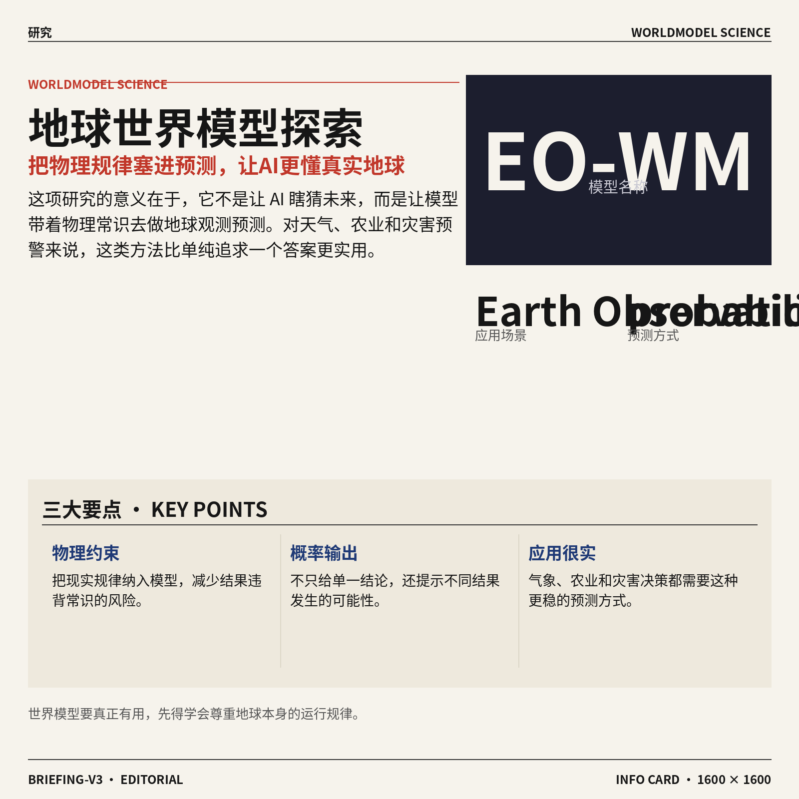

2. **EO-WM（用于地球观测预测的物理约束世界模型）探索让 AI 更懂“地球怎么运转”。**
这项工作研究的是 **world model**（世界模型，让 AI 在内部“模拟外部世界”变化的机制），但不是空想式预测，而是强调 **physically informed**（融入物理规律约束，避免结果违背常识）。它面向 **Earth Observation**（地球观测，通常指卫星持续拍摄地表、云层、海洋等数据）场景，目标是做 **probabilistic forecasting**（概率预测，不只给一个答案，而是给出多种可能及其概率）🌍。这类研究对气象、农业、灾害预警等领域尤其重要，因为现实决策常常更需要“有不确定性提示的预测”，而不是看似确定却不可靠的单一结论。[论文摘要页(briefing)](https://huggingface.co/papers/2606.27277)

![EO-WM（用于地球观测预测的物理约束世界模型）探索让 AI 更懂“地球怎么运转”](https://image.pollinations.ai/prompt/EO-WM%EF%BC%88%E7%94%A8%E4%BA%8E%E5%9C%B0%E7%90%83%E8%A7%82%E6%B5%8B%E9%A2%84%E6%B5%8B%E7%9A%84%E7%89%A9%E7%90%86%E7%BA%A6%E6%9D%9F%E4%B8%96%E7%95%8C%E6%A8%A1%E5%9E%8B%EF%BC%89%E6%8E%A2%E7%B4%A2%E8%AE%A9%20AI%20%E6%9B%B4%E6%87%82%E2%80%9C%E5%9C%B0%E7%90%83%E6%80%8E%E4%B9%88%E8%BF%90%E8%BD%AC%E2%80%9D.%20EO-WM%EF%BC%88%E7%94%A8%E4%BA%8E%E5%9C%B0%E7%90%83%E8%A7%82%E6%B5%8B%E9%A2%84%E6%B5%8B%E7%9A%84%E7%89%A9%E7%90%86%E7%BA%A6%E6%9D%9F%E4%B8%96%E7%95%8C%E6%A8%A1%E5%9E%8B%EF%BC%89%E6%8E%A2%E7%B4%A2%E8%AE%A9%20AI%20%E6%9B%B4%E6%87%82%E2%80%9C%E5%9C%B0%E7%90%83%E6%80%8E%E4%B9%88%E8%BF%90%E8%BD%AC%E2%80%9D%E3%80%82%20%E8%BF%99%E9%A1%B9%E5%B7%A5%E4%BD%9C%E7%A0%94%E7%A9%B6%E7%9A%84%E6%98%AF%20world%20model%EF%BC%88%E4%B8%96%E7%95%8C%E6%A8%A1%E5%9E%8B%EF%BC%8C%E8%AE%A9%20AI%20%E5%9C%A8%E5%86%85%E9%83%A8%E2%80%9C%E6%A8%A1%E6%8B%9F%2C%20technical%20infographic%20diagram%2C%20architecture%20flowchart%2C%20clean%20vector%20illustration%2C%20educational%20style%2C%20no%20text%20overlay%2C%20modern%20minimal%2C%20wide%20aspect?width=1200&height=675&nologo=true&seed=10838)

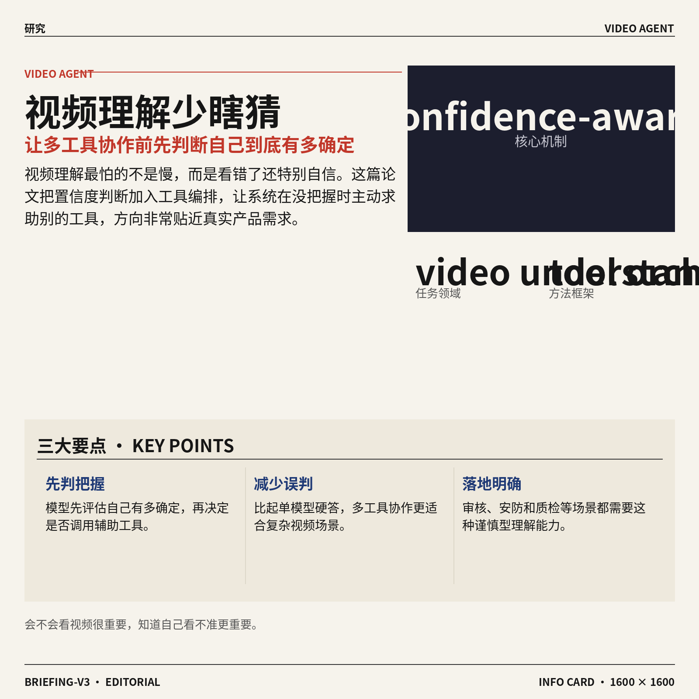

3. **Confidence-Aware Tool Orchestration（带置信度判断的视频理解工具编排）想让 AI 看视频时少“瞎猜”。**
这篇论文关注 **video understanding**（视频理解，让 AI 不只识别一帧画面，而是理解整段视频中发生了什么）里的一个老难题：单靠一个模型，常常会漏看、误判或过度自信 🎥。作者提出 **tool orchestration**（工具编排，让多个专长不同的工具按顺序协作）并加入 **confidence-aware**（感知自身把握程度）的机制，也就是 AI 会根据自己“有多确定”来决定要不要调用别的工具辅助判断。对实际产品来说，这种思路很有价值，因为视频审核、客服质检、安防巡检等场景最怕的不是“慢一点”，而是“看错了还很自信”。更多可见 [论文信息页(briefing)](https://huggingface.co/papers/2606.26904)。


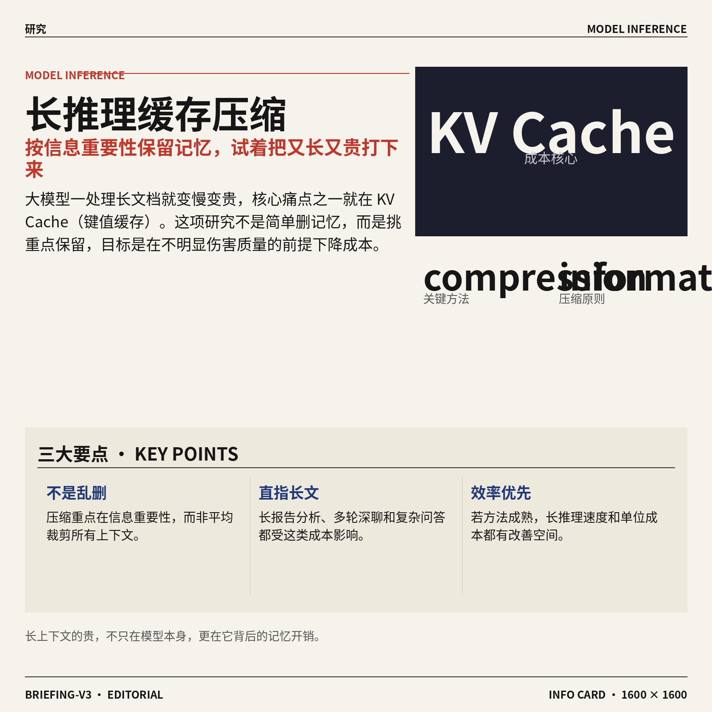

4. **Information-Aware KV Cache Compression（面向长推理的关键信息缓存压缩）瞄准大模型“又长又贵”的推理成本。**
这里的 **KV Cache**（键值缓存，大模型在生成过程中临时保存上下文信息的记忆区，能加快后续回答）是长文本推理的核心成本之一。论文讨论如何做 **compression**（压缩），但重点不是一刀切地删缓存，而是 **information-aware**（按信息重要性来保留），尽量在省资源的同时不明显伤害回答质量 💡。对普通用户而言，这背后关系到一个现实问题：为什么模型一旦处理超长文档、复杂分析或多轮深度对话，就容易变慢、变贵。若这类方法成熟，未来长报告分析、法务材料梳理、财务文档问答等场景的 **推理效率**（模型实际回答问题时的速度和成本）会更有改善空间。[论文页面(briefing)](https://huggingface.co/papers/2606.26875)


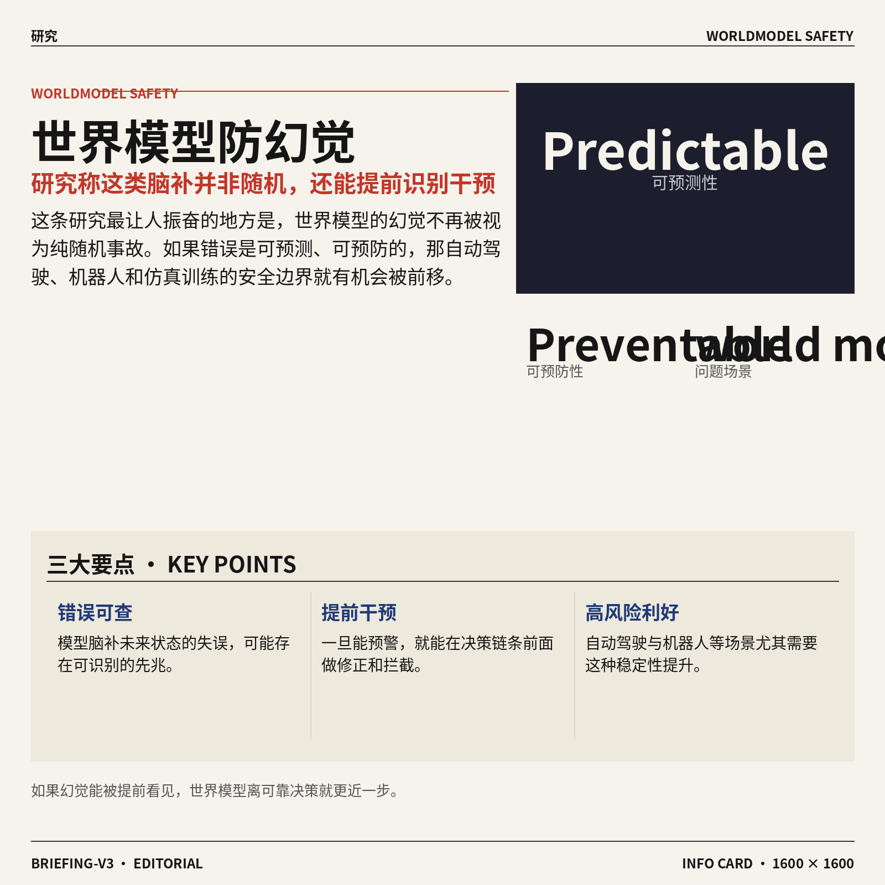

5. **Hallucination in World Models is Predictable and Preventable（世界模型中的幻觉可预测也可预防）为“AI 脑补”问题提供新思路。**
这里的 **hallucination**（幻觉，指 AI 生成看似合理但并不真实的内容）不只是聊天机器人会遇到，**world model**（世界模型）在模拟未来状态时同样可能“想当然”。这篇论文的关键信号很积极：研究者认为这类错误并非完全随机，而是 **predictable**（可提前识别）且 **preventable**（可通过方法干预减少）🧠。这对自动驾驶、机器人、仿真训练等高风险场景尤其重要，因为一旦模型在“预测世界将如何变化”这件事上出错，后续决策就可能层层偏掉。原始信息可参考 [论文摘要介绍(briefing)](https://huggingface.co/papers/2606.27326)。


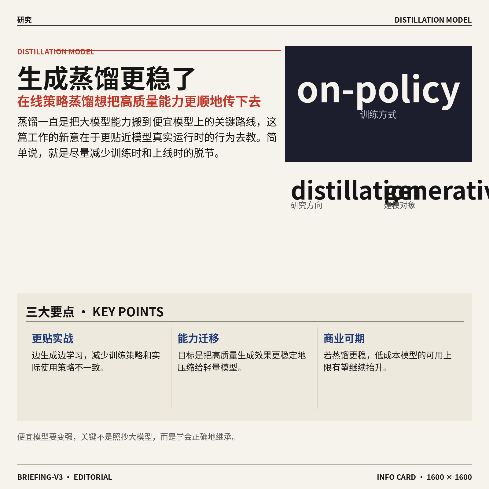

6. **DanceOPD（在线策略生成场蒸馏方法）研究如何把高质量生成能力更稳地“教”给模型。**
从标题看，这项工作属于 **distillation**（蒸馏，把大模型或复杂系统的能力压缩传递给更高效模型）方向，但它特别强调 **on-policy**（按当前策略实时采样，也就是边生成边根据当下行为继续训练），这通常用于减少“训练时学的”和“真正运行时做的”不一致。标题里的 **generative field**（生成场，可以理解为一种描述连续生成结果分布的建模方式）说明它不是只优化单一步骤，而是在更整体的生成过程上做学习 ✨。虽然名字偏学术，但背后的产业意义并不抽象：如果蒸馏做得更稳、更贴近真实运行过程，就有机会把高质量生成能力更快落到成本更低、速度更快的模型上。[论文页面说明(briefing)](https://huggingface.co/papers/2606.27377)

![DanceOPD（在线策略生成场蒸馏方法）研究如何把高质量生成能力更稳地“教”给模型](https://image.pollinations.ai/prompt/DanceOPD%EF%BC%88%E5%9C%A8%E7%BA%BF%E7%AD%96%E7%95%A5%E7%94%9F%E6%88%90%E5%9C%BA%E8%92%B8%E9%A6%8F%E6%96%B9%E6%B3%95%EF%BC%89%E7%A0%94%E7%A9%B6%E5%A6%82%E4%BD%95%E6%8A%8A%E9%AB%98%E8%B4%A8%E9%87%8F%E7%94%9F%E6%88%90%E8%83%BD%E5%8A%9B%E6%9B%B4%E7%A8%B3%E5%9C%B0%E2%80%9C%E6%95%99%E2%80%9D%E7%BB%99%E6%A8%A1%E5%9E%8B.%20DanceOPD%EF%BC%88%E5%9C%A8%E7%BA%BF%E7%AD%96%E7%95%A5%E7%94%9F%E6%88%90%E5%9C%BA%E8%92%B8%E9%A6%8F%E6%96%B9%E6%B3%95%EF%BC%89%E7%A0%94%E7%A9%B6%E5%A6%82%E4%BD%95%E6%8A%8A%E9%AB%98%E8%B4%A8%E9%87%8F%E7%94%9F%E6%88%90%E8%83%BD%E5%8A%9B%E6%9B%B4%E7%A8%B3%E5%9C%B0%E2%80%9C%E6%95%99%E2%80%9D%E7%BB%99%E6%A8%A1%E5%9E%8B%E3%80%82%20%E4%BB%8E%E6%A0%87%E9%A2%98%E7%9C%8B%EF%BC%8C%E8%BF%99%E9%A1%B9%E5%B7%A5%E4%BD%9C%E5%B1%9E%E4%BA%8E%20distillation%EF%BC%88%E8%92%B8%E9%A6%8F%EF%BC%8C%E6%8A%8A%E5%A4%A7%E6%A8%A1%E5%9E%8B%E6%88%96%E5%A4%8D%E6%9D%82%E7%B3%BB%2C%20technical%20infographic%20diagram%2C%20architecture%20flowchart%2C%20clean%20vector%20illustration%2C%20educational%20style%2C%20no%20text%20overlay%2C%20modern%20minimal%2C%20wide%20aspect?width=1200&height=675&nologo=true&seed=10962)

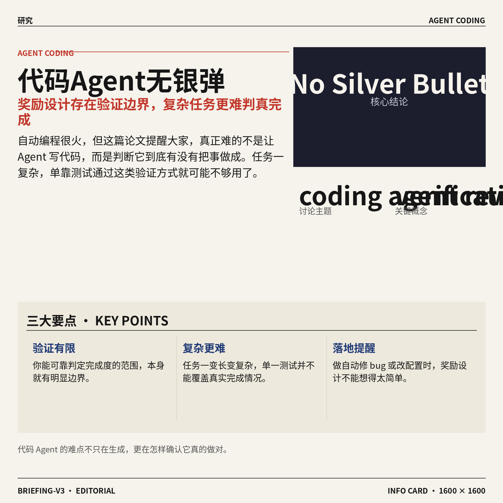

7. **The Verification Horizon（代码 Agent 奖励机制的验证边界）提醒：给编程 Agent 设计奖励，没有万能解。**
这篇论文讨论 **coding agent rewards**（给编程 Agent 设计的奖励信号，也就是系统如何判断“这次写代码做得好不好”）这个热门问题。标题里的 **verification horizon**（验证边界，指你能在多大范围内可靠判断任务是否真的完成）很关键：短任务也许能靠测试通过来判定，但任务一复杂，单一验证方式就不够用了 🛠️。论文直白地说 **No Silver Bullet**（没有银弹，意思是不存在一招通吃的万能方法），这对所有想做自动编程、自动修 bug、自动改系统配置的团队都是现实提醒。想了解原始论文入口，可看 [论文详情页(briefing)](https://huggingface.co/papers/2606.26300)。


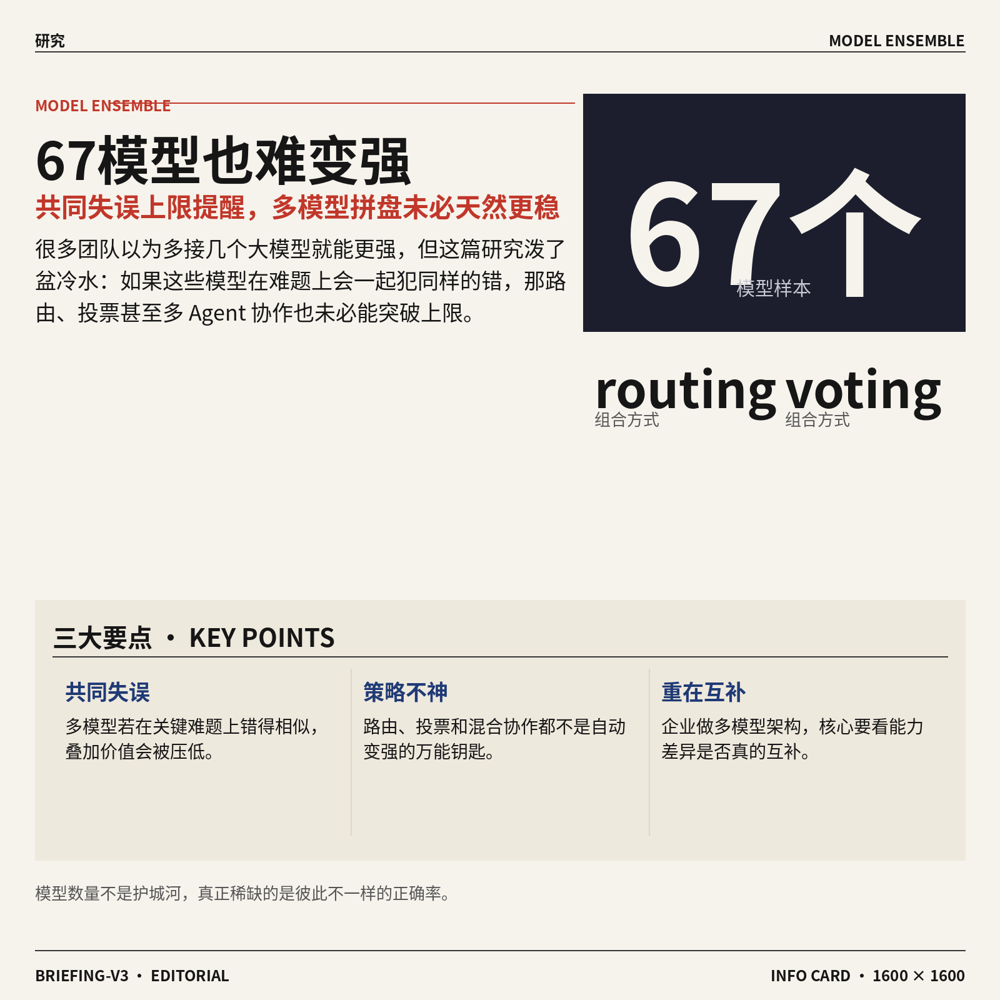

8. **Co-Failure Ceiling（大模型组合的共同失误上限）论文：把 67 个前沿模型拼起来，也不一定更强。**
这篇研究问了一个很实在的问题：**combining language models**（把多个大模型组合使用）到底什么时候真的有帮助？它考察了 **routing**（路由，把问题分配给最合适的模型）、**voting**（投票，让多个模型各自作答后选多数意见）和 **Mixture-of-Agents**（多 Agent 混合协作，让不同模型分工完成任务）等方案，结论聚焦在 **co-failure**（共同失败，也就是多个模型会在同类问题上一起出错）这个上限上。换句话说，如果几个模型在难题上“错得很像”，那把它们叠在一起也未必能突破天花板 📉。这对企业选型很有启发：多模型策略不等于天然更稳，关键要看它们是否真正 **互补**（擅长不同类型问题），而不是只是“模型数量更多”。可参考 [研究论文页面(briefing)](https://huggingface.co/papers/2606.27288)。

![Co-Failure Ceiling（大模型组合的共同失误上限）论文：把 67 个前沿模型拼起来，也不一定更强](https://image.pollinations.ai/prompt/Co-Failure%20Ceiling%EF%BC%88%E5%A4%A7%E6%A8%A1%E5%9E%8B%E7%BB%84%E5%90%88%E7%9A%84%E5%85%B1%E5%90%8C%E5%A4%B1%E8%AF%AF%E4%B8%8A%E9%99%90%EF%BC%89%E8%AE%BA%E6%96%87%EF%BC%9A%E6%8A%8A%2067%20%E4%B8%AA%E5%89%8D%E6%B2%BF%E6%A8%A1%E5%9E%8B%E6%8B%BC%E8%B5%B7%E6%9D%A5%EF%BC%8C%E4%B9%9F%E4%B8%8D%E4%B8%80%E5%AE%9A%E6%9B%B4%E5%BC%BA.%20Co-Failure%20Ceiling%EF%BC%88%E5%A4%A7%E6%A8%A1%E5%9E%8B%E7%BB%84%E5%90%88%E7%9A%84%E5%85%B1%E5%90%8C%E5%A4%B1%E8%AF%AF%E4%B8%8A%E9%99%90%EF%BC%89%E8%AE%BA%E6%96%87%EF%BC%9A%E6%8A%8A%2067%20%E4%B8%AA%E5%89%8D%E6%B2%BF%E6%A8%A1%E5%9E%8B%E6%8B%BC%E8%B5%B7%E6%9D%A5%EF%BC%8C%E4%B9%9F%E4%B8%8D%E4%B8%80%E5%AE%9A%E6%9B%B4%E5%BC%BA%E3%80%82%20%E8%BF%99%E7%AF%87%E7%A0%94%E7%A9%B6%E9%97%AE%E4%BA%86%E4%B8%80%E4%B8%AA%E5%BE%88%E5%AE%9E%E5%9C%A8%E7%9A%84%E9%97%AE%E9%A2%98%EF%BC%9Acombinin%2C%20technical%20infographic%20diagram%2C%20architecture%20flowchart%2C%20clean%20vector%20illustration%2C%20educational%20style%2C%20no%20text%20overlay%2C%20modern%20minimal%2C%20wide%20aspect?width=1200&height=675&nologo=true&seed=11024)

### 🟡 行业展望与社会影响

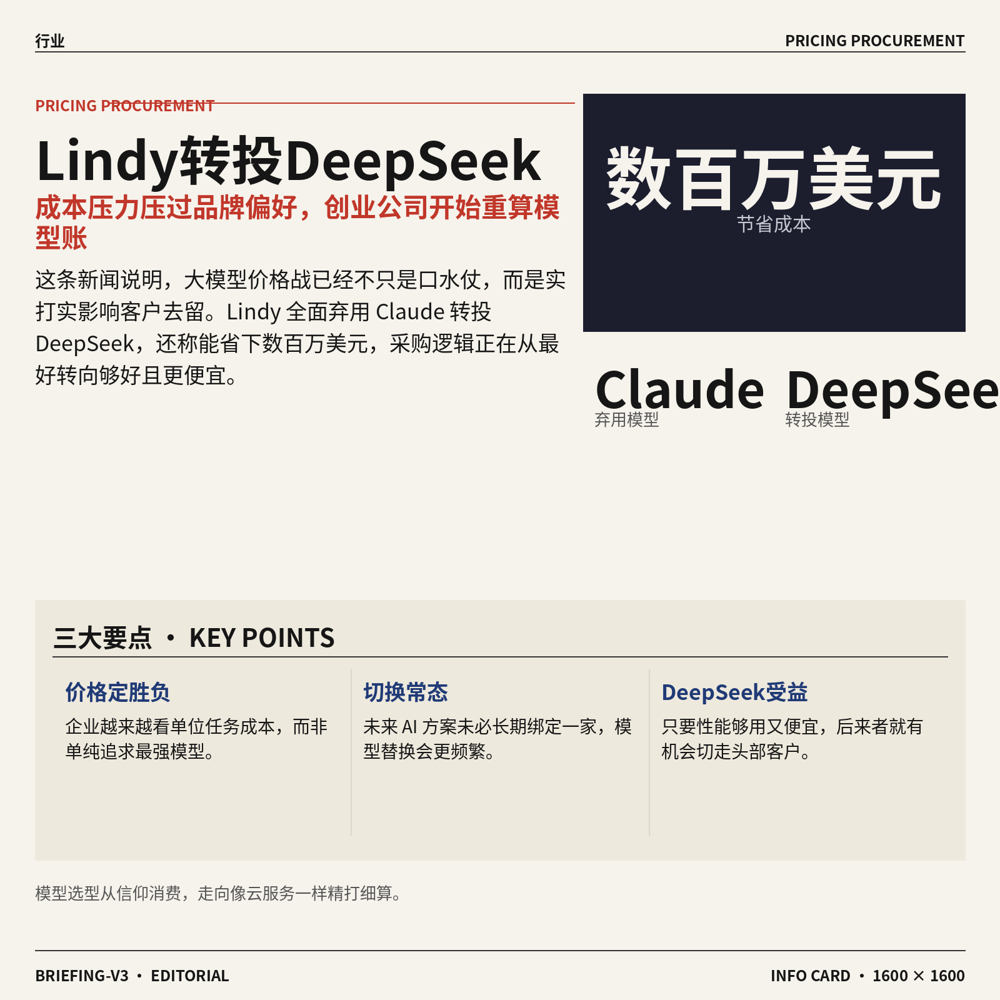

1. **Lindy（AI 自动化创业公司）全面弃用 Claude 转投 DeepSeek，成本压力开始改写模型选型。**  
这条消息最值得关注的，不只是“换模型”本身，而是 **价格战** 已经真实影响创业公司生存线了 💸。报道提到，Lindy 因为成本考量彻底放弃 Claude，转向 DeepSeek，并声称能省下数百万美元，这说明企业采购大模型时，已经越来越看重 **单位任务成本**，而不只是“谁最强”。对业务团队来说，这也是个很现实的信号：未来 AI 方案未必长期绑定单一供应商，谁更便宜、够好用、能稳定交付，谁就更容易被选中。[完整报道(briefing)](https://the-decoder.com/ai-startup-lindy-ditched-claude-entirely-for-deepseek-saving-millions-as-cost-pressure-mounts-on-anthropic/)


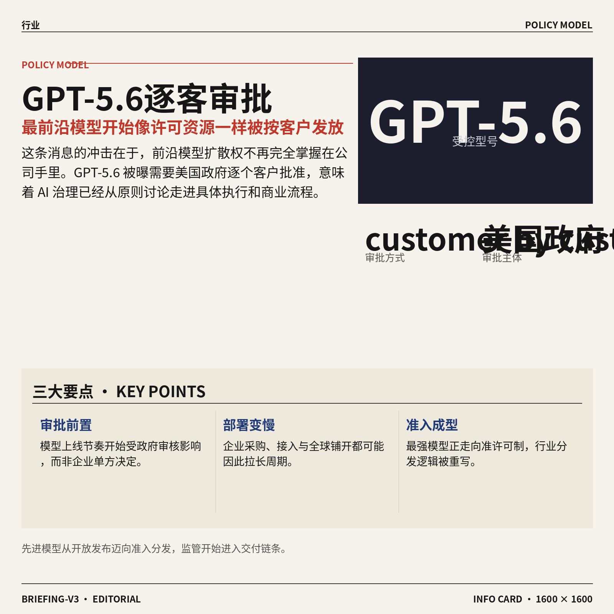

2. **OpenAI 的 GPT-5.6 发布需逐个客户获美国政府批准，先进模型开始进入“准许可制”。**  
这意味着最前沿模型的扩散，已经不再只是公司自己决定，而是越来越受 **政府审批** 影响 🏛️。报道指出，GPT-5.6 的推出需要按“customer by customer basis（逐个客户单独审核）”来批准，本质上就是把模型使用权限变成更严格的分发机制。对企业用户来说，这会直接影响采购节奏、上线时间和全球部署；对行业来说，也说明 **AI 治理** 正从原则讨论走向具体执行。[政策限制报道(briefing)](https://the-decoder.com/openais-gpt-5-6-rollout-now-requires-us-government-approval-on-a-customer-by-customer-basis/) [TechCrunch 解读(briefing)](https://techcrunch.com/2026/06/26/openai-limits-gpt-5-6-rollout-after-government-request-says-restrictions-shouldnt-be-the-norm/)


3. **Anthropic 称 AI 已不太需要初级工程师，并警告更多行业跟进后可能带来经济冲击。**  
这条消息的分量在于，它不是外部观察，而是头部 AI 公司自己发出的 **就业预警** ⚠️。报道提到，Anthropic 认为 AI 已经能覆盖越来越多初级工程工作，而当这种趋势扩散到更多岗位时，可能带来明显的经济震荡。对非技术同事来说，这件事不该只理解成“程序员受影响”，更值得关注的是：凡是流程标准化、重复性高、可被拆成规则的白领工作，未来都可能面临类似压力，组织的人才结构也会随之变化。[原文报道(briefing)](https://the-decoder.com/anthropic-doesnt-need-junior-engineers-anymore-thanks-to-ai-and-warns-of-an-economic-shock-when-other-industries-follow/)


4. **Linux Foundation（Linux 基金会，维护大量开源基础项目的国际组织）联合 20 家科技巨头推出 Akrites（开源安全协作项目），提前修补 AI 时代的攻击入口。**  
这背后反映的是一个很现实的风险：当攻击者也开始用 AI 提高效率，**开源软件漏洞** 被大规模利用的速度可能会更快 🔐。Akrites 的目标，是在 AI-powered attacks（AI 驱动攻击，指用 AI 自动寻找和利用系统弱点）真正大规模到来前，先把开源生态里最危险的薄弱点补上。对企业管理层来说，这提醒我们：AI 不只是带来生产力，也会同步放大 **网络安全** 压力，尤其是依赖开源组件（可免费使用和修改的软件模块）的系统会更需要提前体检。[项目报道(briefing)](https://the-decoder.com/linux-foundation-and-20-tech-giants-launch-akrites-to-fix-open-source-flaws-before-ai-powered-attacks-hit/)

![Linux Foundation（Linux 基金会，维护大量开源基础项目的国际组织）联合 20 家科技巨头推出 Akrites（开源安全协作项目），提前修补 AI 时代的攻击入口](https://image.pollinations.ai/prompt/Linux%20Foundation%EF%BC%88Linux%20%E5%9F%BA%E9%87%91%E4%BC%9A%EF%BC%8C%E7%BB%B4%E6%8A%A4%E5%A4%A7%E9%87%8F%E5%BC%80%E6%BA%90%E5%9F%BA%E7%A1%80%E9%A1%B9%E7%9B%AE%E7%9A%84%E5%9B%BD%E9%99%85%E7%BB%84%E7%BB%87%EF%BC%89%E8%81%94%E5%90%88%2020%20%E5%AE%B6%E7%A7%91%E6%8A%80%E5%B7%A8%E5%A4%B4%E6%8E%A8%E5%87%BA%20Akrites%EF%BC%88%E5%BC%80%E6%BA%90%E5%AE%89%E5%85%A8%E5%8D%8F%E4%BD%9C%E9%A1%B9%E7%9B%AE%EF%BC%89%EF%BC%8C%E6%8F%90%E5%89%8D%E4%BF%AE%E8%A1%A5%20AI%20%E6%97%B6%E4%BB%A3%E7%9A%84%E6%94%BB%E5%87%BB%E5%85%A5%E5%8F%A3.%20Linux%20Foundation%EF%BC%88Linux%20%E5%9F%BA%E9%87%91%E4%BC%9A%EF%BC%8C%E7%BB%B4%E6%8A%A4%E5%A4%A7%E9%87%8F%E5%BC%80%E6%BA%90%E5%9F%BA%E7%A1%80%E9%A1%B9%E7%9B%AE%E7%9A%84%E5%9B%BD%E9%99%85%E7%BB%84%E7%BB%87%EF%BC%89%E8%81%94%E5%90%88%2020%20%E5%AE%B6%E7%A7%91%E6%8A%80%E5%B7%A8%E5%A4%B4%E6%8E%A8%E5%87%BA%20Akrites%EF%BC%88%E5%BC%80%E6%BA%90%E5%AE%89%E5%85%A8%E5%8D%8F%E4%BD%9C%E9%A1%B9%E7%9B%AE%EF%BC%89%EF%BC%8C%E6%8F%90%E5%89%8D%E4%BF%AE%E8%A1%A5%2C%20technical%20infographic%20diagram%2C%20architecture%20flowchart%2C%20clean%20vector%20illustration%2C%20educational%20style%2C%20no%20text%20overlay%2C%20modern%20minimal%2C%20wide%20aspect?width=1200&height=675&nologo=true&seed=10900)

### 🟣 开源TOP项目

1. **Page Agent（阿里巴巴开源的网页操作 AI 助手）让自然语言直接操控网页界面。**  
这个项目主打 **in-page（直接在网页内部运行，而不是跳到外部程序）** 的 **GUI agent（图形界面智能助手，能像人一样点按钮、填表单、切换页面）**，一句话说就是：你用自然语言下指令，它来帮你操作网站 🚀。对不写代码的同事也很好理解，未来这类能力很适合做**自动填报、后台录入、网页流程助手**等办公场景。它的亮点不在“能聊天”，而在“能动手”，也就是把 AI 从回答问题推进到真正执行页面任务。[GitHub 项目页(briefing)](https://github.com/alibaba/page-agent)


2. **Codex 橙皮书（面向 Codex 的非官方实战指南）把安装到案例全链路讲清了。**  
这是一个围绕 **Codex** 使用方法整理的开源教程，覆盖从上手安装到实战案例的完整路径，属于很典型的 **playbook（实操手册，照着做就能快速入门）** 💡。对团队来说，这类资料的价值不是“发明新模型”，而是帮大家更快把 AI 编码工具真正用起来，减少摸索成本。项目还提到包含可下载 **PDF（便于离线阅读和内部分享的文档格式）**，对培训、知识沉淀和内部推广都比较友好。[开源指南仓库(briefing)](https://github.com/bozhouDev/codex-orange-book)


3. **AI Berkshire（基于 Claude Code 的价值投资研究框架）把多人物方法论和多 Agent 研究结合起来。**  
这个项目想做的是“AI 时代的伯克希尔”，核心是基于 **Claude Code** 搭建一套价值投资研究框架，并引入 **multi-agent（多智能体协作，让多个 AI 分工并行分析）** 机制来做研究与对照判断 📊。摘要里明确提到融合巴菲特、芒格、段永平、李录四位投资人的方法论，因此它更像一个“投资研究工作流”而不只是普通问答机器人。对业务同事来说，这类项目的启发在于：AI 不只是生成内容，还能按既定分析框架拆任务、做并行研究、形成更结构化的判断。[项目仓库说明(briefing)](https://github.com/xbtlin/ai-berkshire)


4. **reverse-skill（面向逆向与安全研究的 AI 技能路由包）想把工具选择和知识积累自动化。**  
这个项目面向 **Reverse Engineering（逆向工程，把软件拆开研究其内部工作方式）**、**Authorized Penetration Testing（授权渗透测试，在许可前提下模拟攻击找漏洞）** 和安全研究场景，重点是用 AI 做 **routing（任务路由，自动判断该调用哪类能力或工具）**。摘要里提到它支持按需启动工具链，也就是 **toolchain bootstrapping（工具链快速拉起，临时把需要的软件和流程配齐）**，并维护 **self-evolving knowledge base（自我演进知识库，越用越积累经验）** 🔐。它还兼容 Claude Code、Cursor、Cline 等 AI 编码客户端，说明这类安全工作也正在被纳入统一的 AI 协作流程中。[GitHub 仓库介绍(briefing)](https://github.com/zhaoxuya520/reverse-skill)


5. **agent-native（面向 Agent 原生应用的开发框架）瞄准“为智能体而生”的应用搭建方式。**  
Builder.io 开源的这个项目定位很直接：它是一个构建 **agent-native application（Agent 原生应用，从设计之初就默认 AI 会参与决策和执行）** 的 **framework（开发框架，帮助团队更快搭建一类应用的基础骨架）**。这意味着它关注的不是给传统软件“外挂一个聊天框”，而是从产品结构上围绕 Agent 来组织交互与能力 🧩。对企业来说，这类框架的意义在于，它代表越来越多团队开始把 AI 当成应用的一等公民，而不是后期附加功能。[官方开源仓库(briefing)](https://github.com/BuilderIO/agent-native)

![agent-native（面向 Agent 原生应用的开发框架）瞄准“为智能体而生”的应用搭建方式](https://image.pollinations.ai/prompt/agent-native%EF%BC%88%E9%9D%A2%E5%90%91%20Agent%20%E5%8E%9F%E7%94%9F%E5%BA%94%E7%94%A8%E7%9A%84%E5%BC%80%E5%8F%91%E6%A1%86%E6%9E%B6%EF%BC%89%E7%9E%84%E5%87%86%E2%80%9C%E4%B8%BA%E6%99%BA%E8%83%BD%E4%BD%93%E8%80%8C%E7%94%9F%E2%80%9D%E7%9A%84%E5%BA%94%E7%94%A8%E6%90%AD%E5%BB%BA%E6%96%B9%E5%BC%8F.%20agent-native%EF%BC%88%E9%9D%A2%E5%90%91%20Agent%20%E5%8E%9F%E7%94%9F%E5%BA%94%E7%94%A8%E7%9A%84%E5%BC%80%E5%8F%91%E6%A1%86%E6%9E%B6%EF%BC%89%E7%9E%84%E5%87%86%E2%80%9C%E4%B8%BA%E6%99%BA%E8%83%BD%E4%BD%93%E8%80%8C%E7%94%9F%E2%80%9D%E7%9A%84%E5%BA%94%E7%94%A8%E6%90%AD%E5%BB%BA%E6%96%B9%E5%BC%8F%E3%80%82%20Builder.io%20%E5%BC%80%E6%BA%90%E7%9A%84%E8%BF%99%E4%B8%AA%E9%A1%B9%E7%9B%AE%E5%AE%9A%E4%BD%8D%E5%BE%88%E7%9B%B4%E6%8E%A5%EF%BC%9A%E5%AE%83%E6%98%AF%E4%B8%80%E4%B8%AA%E6%9E%84%2C%20technical%20infographic%20diagram%2C%20architecture%20flowchart%2C%20clean%20vector%20illustration%2C%20educational%20style%2C%20no%20text%20overlay%2C%20modern%20minimal%2C%20wide%20aspect?width=1200&height=675&nologo=true&seed=11125)

### 🔴 社媒分享

1. **2000 人围攻 AI 助手后，开发者总结出一堂“提示词攻防课”。**
一位开发者发起公开挑战，邀请大家去“黑”自己的 AI 助手，结果有 **2000 多人**参与，集中暴露了 **prompt 注入（通过特意设计的话术诱导 AI 违背原规则）** 的真实风险 💥。这件事的价值不只在于热闹，而是在提醒所有做客服、知识库、内部助手的团队：只要 AI 能接触外部内容，就可能被“带偏”。对企业来说，这类案例能帮助大家更具体地理解 **安全边界** 该怎么设，而不是只停留在“模型很聪明”这层表面。[作者复盘文章(briefing)](https://simonwillison.net/2026/Jun/26/hack-my-ai-assistant/#atom-everything) [挑战项目页面(briefing)](https://hackmyclaw.com/)


2. **OpenAI 预览 GPT‑5.6 Sol（新一代旗舰模型），还同时放出 Terra 和 Luna 分层定位。**
OpenAI 开始小范围预览 **GPT‑5.6 系列**，其中 **Sol** 是旗舰版本，**Terra（偏均衡的日常工作模型）** 和 **Luna（更快、更便宜的轻量模型）** 则明显是在做更细的产品分层 🌗。这类分层意味着，未来企业选模型时不一定只追“最强”，而会更看重 **成本、速度、任务匹配度** 的组合。对日常办公场景来说，这会让“写作、分析、批量处理”更像挑工具箱，而不是永远只用一个万能锤子。[OpenAI 官方预览(briefing)](https://openai.com/index/previewing-gpt-5-6-sol/) [Simon 解读摘录(briefing)](https://simonwillison.net/2026/Jun/26/openai/#atom-everything)


3. **美国政府将审核谁能使用 GPT‑5.6，前沿模型开始走向“准入制”。**
据报道，OpenAI 最新模型 **GPT‑5.6** 的使用资格将由美国政府参与审核，这说明前沿 AI 正越来越像一种需要管控的战略能力，而不再只是普通软件服务 🏛️。这背后反映的是 **模型治理（围绕安全、出口、用途做规则约束）** 正在快速升级，尤其是高能力模型可能面临更强的身份和用途审查。对企业用户来说，今后“能不能买到、能不能接入、在哪些国家能用”都可能变成现实问题，而不只是技术问题。[华盛顿邮报报道(briefing)](https://www.washingtonpost.com/technology/2026/06/26/openai-says-us-government-will-vet-users-its-latest-ai-model/)

![美国政府将审核谁能使用 GPT‑5.6，前沿模型开始走向“准入制”](https://image.pollinations.ai/prompt/%E7%BE%8E%E5%9B%BD%E6%94%BF%E5%BA%9C%E5%B0%86%E5%AE%A1%E6%A0%B8%E8%B0%81%E8%83%BD%E4%BD%BF%E7%94%A8%20GPT%E2%80%915.6%EF%BC%8C%E5%89%8D%E6%B2%BF%E6%A8%A1%E5%9E%8B%E5%BC%80%E5%A7%8B%E8%B5%B0%E5%90%91%E2%80%9C%E5%87%86%E5%85%A5%E5%88%B6%E2%80%9D.%20%E7%BE%8E%E5%9B%BD%E6%94%BF%E5%BA%9C%E5%B0%86%E5%AE%A1%E6%A0%B8%E8%B0%81%E8%83%BD%E4%BD%BF%E7%94%A8%20GPT%E2%80%915.6%EF%BC%8C%E5%89%8D%E6%B2%BF%E6%A8%A1%E5%9E%8B%E5%BC%80%E5%A7%8B%E8%B5%B0%E5%90%91%E2%80%9C%E5%87%86%E5%85%A5%E5%88%B6%E2%80%9D%E3%80%82%20%E6%8D%AE%E6%8A%A5%E9%81%93%EF%BC%8COpenAI%20%E6%9C%80%E6%96%B0%E6%A8%A1%E5%9E%8B%20GPT%E2%80%915.6%20%E7%9A%84%E4%BD%BF%E7%94%A8%E8%B5%84%E6%A0%BC%E5%B0%86%E7%94%B1%E7%BE%8E%E5%9B%BD%E6%94%BF%E5%BA%9C%E5%8F%82%E4%B8%8E%E5%AE%A1%E6%A0%B8%EF%BC%8C%E8%BF%99%E8%AF%B4%E6%98%8E%E5%89%8D%E6%B2%BF%2C%20technical%20infographic%20diagram%2C%20architecture%20flowchart%2C%20clean%20vector%20illustration%2C%20educational%20style%2C%20no%20text%20overlay%2C%20modern%20minimal%2C%20wide%20aspect?width=1200&height=675&nologo=true&seed=10675)

4. **GPT‑5.6 Sol（OpenAI 新一代旗舰模型）正式预览，系统安全卡也同步公开。**
这次 OpenAI 不只是发了新模型，还一并公开了 **system card（系统安全说明文档，用来披露模型能力边界、风险和测试结果）**，说明“发布模型”这件事正越来越强调透明度与审查流程 📋。对外界来说，真正值得关注的不只是模型有多强，还包括它在 **部署安全（模型上线前后的风险控制）** 上给出了哪些约束。对于企业采购或评估 AI 工具的人，这类文档会越来越像“产品说明书 + 风险告知书”，看不看可能直接影响决策。[OpenAI 官方预览(briefing)](https://openai.com/index/previewing-gpt-5-6-sol/) [系统安全卡页面(briefing)](https://deploymentsafety.openai.com/gpt-5-6-preview)


5. **HuggingFace 讨论 hybrid model（混合模型）到底更擅长预测哪些 token（AI 处理文字时切分的小单位）。**
这篇内容聚焦一个很底层但很关键的问题：**hybrid model（把不同预测机制结合起来的模型）**，究竟在哪些文字片段上比传统方式更有优势 🔍。看似学术，实际上它关系到模型是否能更高效地理解长文本、复杂结构和罕见表达，因为 **token** 就像 AI 阅读世界时一块一块咀嚼的信息单位。对普通用户而言，这类研究最终会体现在更稳的回答、更低的成本，以及模型在专业文档场景里的表现提升上。[HuggingFace 技术博客(briefing)](https://huggingface.co/blog/allenai/hybrid-token-prediction)

![HuggingFace 讨论 hybrid model（混合模型）到底更擅长预测哪些 token（AI 处理文字时切分的小单位）](https://image.pollinations.ai/prompt/HuggingFace%20%E8%AE%A8%E8%AE%BA%20hybrid%20model%EF%BC%88%E6%B7%B7%E5%90%88%E6%A8%A1%E5%9E%8B%EF%BC%89%E5%88%B0%E5%BA%95%E6%9B%B4%E6%93%85%E9%95%BF%E9%A2%84%E6%B5%8B%E5%93%AA%E4%BA%9B%20token%EF%BC%88AI%20%E5%A4%84%E7%90%86%E6%96%87%E5%AD%97%E6%97%B6%E5%88%87%E5%88%86%E7%9A%84%E5%B0%8F%E5%8D%95%E4%BD%8D%EF%BC%89.%20HuggingFace%20%E8%AE%A8%E8%AE%BA%20hybrid%20model%EF%BC%88%E6%B7%B7%E5%90%88%E6%A8%A1%E5%9E%8B%EF%BC%89%E5%88%B0%E5%BA%95%E6%9B%B4%E6%93%85%E9%95%BF%E9%A2%84%E6%B5%8B%E5%93%AA%E4%BA%9B%20token%EF%BC%88AI%20%E5%A4%84%E7%90%86%E6%96%87%E5%AD%97%E6%97%B6%E5%88%87%E5%88%86%E7%9A%84%E5%B0%8F%E5%8D%95%E4%BD%8D%EF%BC%89%E3%80%82%20%E8%BF%99%E7%AF%87%E5%86%85%E5%AE%B9%E8%81%9A%E7%84%A6%E4%B8%80%E4%B8%AA%E5%BE%88%E5%BA%95%E5%B1%82%E4%BD%86%E5%BE%88%E5%85%B3%2C%20technical%20infographic%20diagram%2C%20architecture%20flowchart%2C%20clean%20vector%20illustration%2C%20educational%20style%2C%20no%20text%20overlay%2C%20modern%20minimal%2C%20wide%20aspect?width=1200&height=675&nologo=true&seed=10737)

---

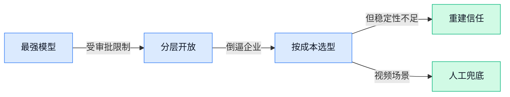
```mermaid
graph LR
A[最强模型] -->|受审批限制| B[分层开放]
B -->|倒逼企业| C[按成本选型]
C -->|但稳定性不足| D[重建信任]
C -->|视频场景| E[人工兜底]

classDef blue fill:#dbeafe,stroke:#3b82f6,color:#111827
classDef green fill:#d1fae5,stroke:#10b981,color:#111827
class A,B,C blue
class D,E green
```

### 📊 行业洞察（今日 4 条）

1. OpenAI 的 GPT-5.6 要逐个客户获批，Anthropic 的 Mythos 也只定向开放给 100 多家美国机构
  【洞察】最强模型不再是谁做出来谁就能卖，而是先进入“分层供给、按身份放行”的时代，模型能力开始被政策一起定义

2. Lindy 因成本全面弃用 Claude 转投 DeepSeek，OpenAI 又把 GPT-5.6 分成 Sol、Terra、Luna 三档
  【洞察】行业竞争重点已从“单一最强模型”转向“按任务分配成本”，以后拼的不是王炸参数，而是谁更便宜且刚好够用

3. Running the Gauntlet（测试 Agent 到陌生环境是否还靠谱）说陌生场景会掉链子，Co-Failure Ceiling（研究多模型一起上为何也可能一起错）说 67 个模型拼起来也未必更强
  【洞察】这说明“多 Agent 叠加”不是万能药，行业正在从炫演示转向追问真实稳定性，堆模型数量解决不了根本可靠性

4. 视频理解论文强调“没把握就调用别的工具”，OpenAI 同步公开 GPT-5.6 系统安全卡，2000 人攻击 AI 助手又暴露提示词注入风险
  【洞察】AI 产品接下来比的不是更敢答，而是谁更会承认不确定、展示边界并防被带偏，信任机制正变成核心卖点

### 💭 对我们的启发（今日 3 条）

1. Lindy 换 DeepSeek、省下数百万美元，再叠加 OpenAI 模型分档，说明我们的视频剪辑工具不能默认绑死单一模型，得按脚本生成、标题改写、镜头分析分开选最省的方案。

2. 视频理解论文提出“没把握就换工具”，这对我们很直接：做爆款拆解、口播识别、商品卖点提取时，要给结果加“可信度提示”，低把握任务默认进入人工复核。

3. Running the Gauntlet 和“67 模型拼起来也会一起错”是在泼冷水：我们别把“多模型协作”包装成万能。对客户承诺应是“关键环节可回看、可接管、可修改”，而不是“全自动出片”。

