## AI资讯日报 2026/6/29

> AI 早报 · 每日早读 · 全网深度聚合

## **今日摘要**

```
Google 限制 Meta 使用 Gemini，模型合作正式划边界
Coinbase（加密交易平台）转向中国 AI 模型，西方实验室遭价格压力测试
百度昆仑芯（AI芯片部门）冲刺 500 亿美元 IPO，智谱 GLM 5.2 反超 Claude
```

### 🔵 产品与功能更新

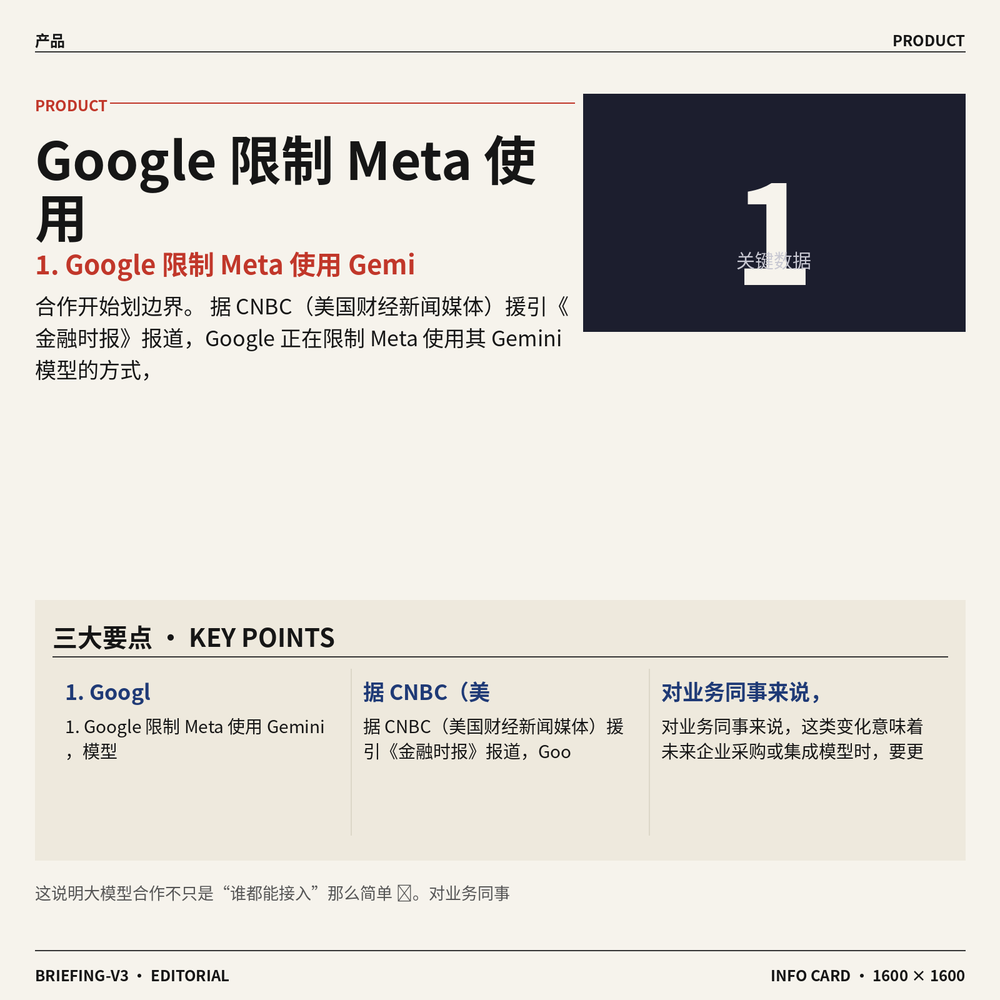

1. **Google 限制 Meta 使用 Gemini，模型合作开始划边界。**  
据 CNBC（美国财经新闻媒体）援引《金融时报》报道，Google 正在限制 Meta 使用其 **Gemini** 模型的方式，这说明大模型合作不只是“谁都能接入”那么简单 🚦。对业务同事来说，这类变化意味着未来企业采购或集成模型时，要更关注**授权范围**和**使用边界**，不能只看模型能力强不强。Gemini 虽然是大众熟悉的 Google AI 产品，但背后的模型访问权限（谁能用、怎么用、能不能用于竞争产品）正在变成行业竞争的一部分。[财经媒体报道(briefing)](https://news.google.com/rss/articles/CBMimwFBVV95cUxOallHQVB2WkxmbVZtVUIwRmg1NnBkclB4bkx4bmF0cGp6eThCUTNkMS0tQUdadHRrWnhuTUZzaHlCZUVSRGM3TEkxa1d1YU1jVTM4azlsTnZ0MEJocGdUV0dRZWhJajNBQ2NrT1BOUGFkRjhwYzc2TWxVOTJmOWxGMXBleFdIaE5Nai1KOFd2dTUtTGI5RWl6cWRlNNIBoAFBVV95cUxQcWRyNHVZQ3VZbGllcnlSRkF6YmtZNVh1NGo4QlI0T0pYcDA1Q3k5X292cElkMVo4Zm4zVkpaZm1Nb3ZJMFlDQ0k0WXAxMldiOWlEdG5ZYWZfdlZpd1RacFBLbGlQaEkwRTRuaUcyNzk1ZmlkOEVVNmcxQ1c0Qk9QZnBvTUZzTnJNN21PV0VsSUprUzBpd2JPYTZ2bUgtbEx5?oc=5)


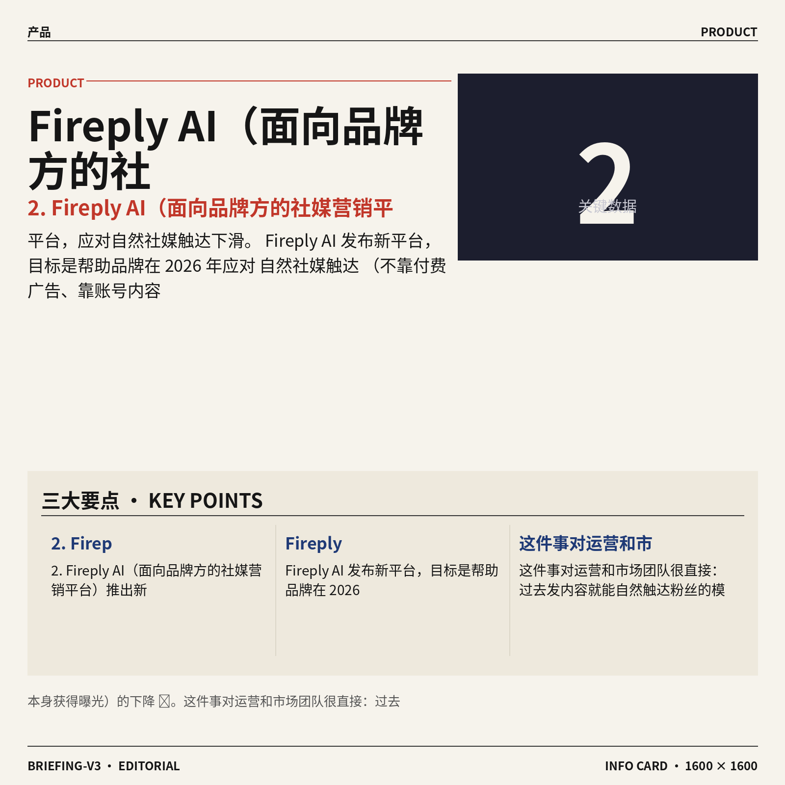

2. **Fireply AI（面向品牌方的社媒营销平台）推出新平台，应对自然社媒触达下滑。**  
Fireply AI 发布新平台，目标是帮助品牌在 2026 年应对 **自然社媒触达**（不靠付费广告、靠账号内容本身获得曝光）的下降 📉。这件事对运营和市场团队很直接：过去发内容就能自然触达粉丝的模式，可能越来越不稳定，需要更多工具来辅助判断内容分发效果。这里的 **品牌社媒运营**（企业在社交平台上做内容、互动和用户关系维护）正在从“凭经验发帖”走向更数据化的平台管理 💡。[平台发布消息(briefing)](https://news.google.com/rss/articles/CBMi2AFBVV95cUxQT1NMeGtCSXJNQU1vTXF4Uzh1MTVJZ0VEZEV5dzFCMjEyeU50MVlIX2RiSGlEUnVaRXZ6YlRQTnd2X2dTVHl5eWlZQ3BNTDNrNkNxZVhqbVJwMkhzanNJcFpTYzlQcGRGQlJkRW1wUUpWNElnZmx0TmtRN0NFbEFzZ0ZiREV4ZmVaS1VFVjRpc3htTEdkWjZqY25sWDRpNDVwbzdSajBFaExWWWxENWN1em41bUF5aHRhdnotTVFzbVJ2RHIyc0duRFVGYXdlMkZDcWxPZnhwX3E?oc=5)

![Fireply AI（面向品牌方的社媒营销平台）推出新平台，应对自然社媒触达下滑](https://image.pollinations.ai/prompt/Fireply%20AI%EF%BC%88%E9%9D%A2%E5%90%91%E5%93%81%E7%89%8C%E6%96%B9%E7%9A%84%E7%A4%BE%E5%AA%92%E8%90%A5%E9%94%80%E5%B9%B3%E5%8F%B0%EF%BC%89%E6%8E%A8%E5%87%BA%E6%96%B0%E5%B9%B3%E5%8F%B0%EF%BC%8C%E5%BA%94%E5%AF%B9%E8%87%AA%E7%84%B6%E7%A4%BE%E5%AA%92%E8%A7%A6%E8%BE%BE%E4%B8%8B%E6%BB%91.%20Fireply%20AI%EF%BC%88%E9%9D%A2%E5%90%91%E5%93%81%E7%89%8C%E6%96%B9%E7%9A%84%E7%A4%BE%E5%AA%92%E8%90%A5%E9%94%80%E5%B9%B3%E5%8F%B0%EF%BC%89%E6%8E%A8%E5%87%BA%E6%96%B0%E5%B9%B3%E5%8F%B0%EF%BC%8C%E5%BA%94%E5%AF%B9%E8%87%AA%E7%84%B6%E7%A4%BE%E5%AA%92%E8%A7%A6%E8%BE%BE%E4%B8%8B%E6%BB%91%E3%80%82%20Fireply%20AI%20%E5%8F%91%E5%B8%83%E6%96%B0%E5%B9%B3%E5%8F%B0%EF%BC%8C%E7%9B%AE%E6%A0%87%E6%98%AF%E5%B8%AE%E5%8A%A9%E5%93%81%E7%89%8C%E5%9C%A8%202026%20%E5%B9%B4%E5%BA%94%E5%AF%B9%20%E8%87%AA%E7%84%B6%E7%A4%BE%2C%20technical%20infographic%20diagram%2C%20architecture%20flowchart%2C%20clean%20vector%20illustration%2C%20educational%20style%2C%20no%20text%20overlay%2C%20modern%20minimal%2C%20wide%20aspect?width=1200&height=675&nologo=true&seed=11420)

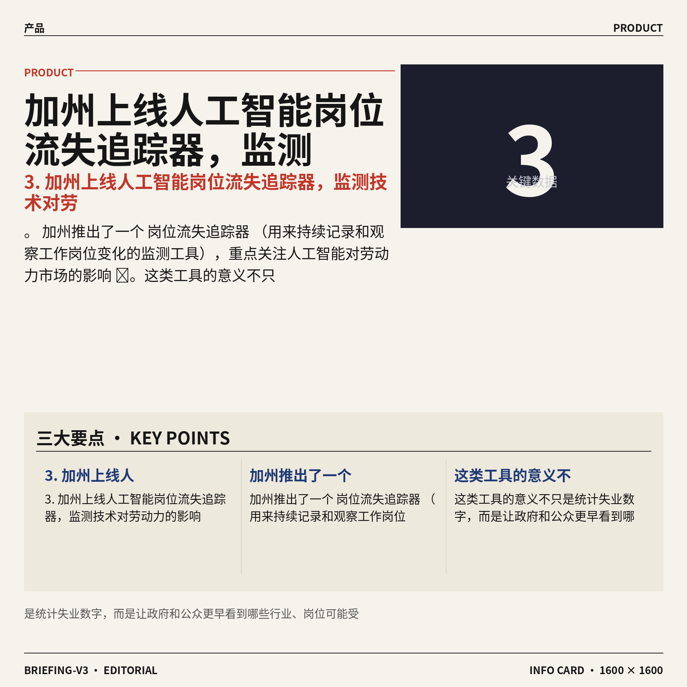

3. **加州上线人工智能岗位流失追踪器，监测技术对劳动力的影响。**  
加州推出了一个 **岗位流失追踪器**（用来持续记录和观察工作岗位变化的监测工具），重点关注人工智能对劳动力市场的影响 👀。这类工具的意义不只是统计失业数字，而是让政府和公众更早看到哪些行业、岗位可能受到冲击。对企业的人事、财务和运营团队来说，**劳动力影响监测**（观察技术变化如何改变招聘、裁员和岗位需求）会越来越像经营决策的一部分。[地方新闻报道(briefing)](https://news.google.com/rss/articles/CBMirgFBVV95cUxPYUZxMkNYNWU1cnprbVBrdVB5ZnBPa0dnRnFKS0RWYVp6RDRka2dPMzEzbTU5NExqTEtoNnRsZXdMWGlMWEJrQm5BZVpjOVN0Nmk3cEJvSDh2M24xNG9YU01oZ0pXN2EwVXNZbWNGQmlLTkVRV0JBTUwwcjNrR3ZjajJhQWl0aEtxZ2tQMk4wdHlCMW15eUZzTFlSa1RjNGt2b2xvTGVsQVpYQ01vOUE?oc=5)

![加州上线人工智能岗位流失追踪器，监测技术对劳动力的影响](https://image.pollinations.ai/prompt/%E5%8A%A0%E5%B7%9E%E4%B8%8A%E7%BA%BF%E4%BA%BA%E5%B7%A5%E6%99%BA%E8%83%BD%E5%B2%97%E4%BD%8D%E6%B5%81%E5%A4%B1%E8%BF%BD%E8%B8%AA%E5%99%A8%EF%BC%8C%E7%9B%91%E6%B5%8B%E6%8A%80%E6%9C%AF%E5%AF%B9%E5%8A%B3%E5%8A%A8%E5%8A%9B%E7%9A%84%E5%BD%B1%E5%93%8D.%20%E5%8A%A0%E5%B7%9E%E4%B8%8A%E7%BA%BF%E4%BA%BA%E5%B7%A5%E6%99%BA%E8%83%BD%E5%B2%97%E4%BD%8D%E6%B5%81%E5%A4%B1%E8%BF%BD%E8%B8%AA%E5%99%A8%EF%BC%8C%E7%9B%91%E6%B5%8B%E6%8A%80%E6%9C%AF%E5%AF%B9%E5%8A%B3%E5%8A%A8%E5%8A%9B%E7%9A%84%E5%BD%B1%E5%93%8D%E3%80%82%20%E5%8A%A0%E5%B7%9E%E6%8E%A8%E5%87%BA%E4%BA%86%E4%B8%80%E4%B8%AA%20%E5%B2%97%E4%BD%8D%E6%B5%81%E5%A4%B1%E8%BF%BD%E8%B8%AA%E5%99%A8%EF%BC%88%E7%94%A8%E6%9D%A5%E6%8C%81%E7%BB%AD%E8%AE%B0%E5%BD%95%E5%92%8C%E8%A7%82%E5%AF%9F%E5%B7%A5%E4%BD%9C%E5%B2%97%E4%BD%8D%E5%8F%98%E5%8C%96%E7%9A%84%E7%9B%91%E6%B5%8B%E5%B7%A5%E5%85%B7%EF%BC%89%EF%BC%8C%E9%87%8D%E7%82%B9%E5%85%B3%E6%B3%A8%E4%BA%BA%E5%B7%A5%E6%99%BA%E8%83%BD%E5%AF%B9%E5%8A%B3%E5%8A%A8%E5%8A%9B%E5%B8%82%2C%20technical%20infographic%20diagram%2C%20architecture%20flowchart%2C%20clean%20vector%20illustration%2C%20educational%20style%2C%20no%20text%20overlay%2C%20modern%20minimal%2C%20wide%20aspect?width=1200&height=675&nologo=true&seed=11451)

### 🟢 前沿研究

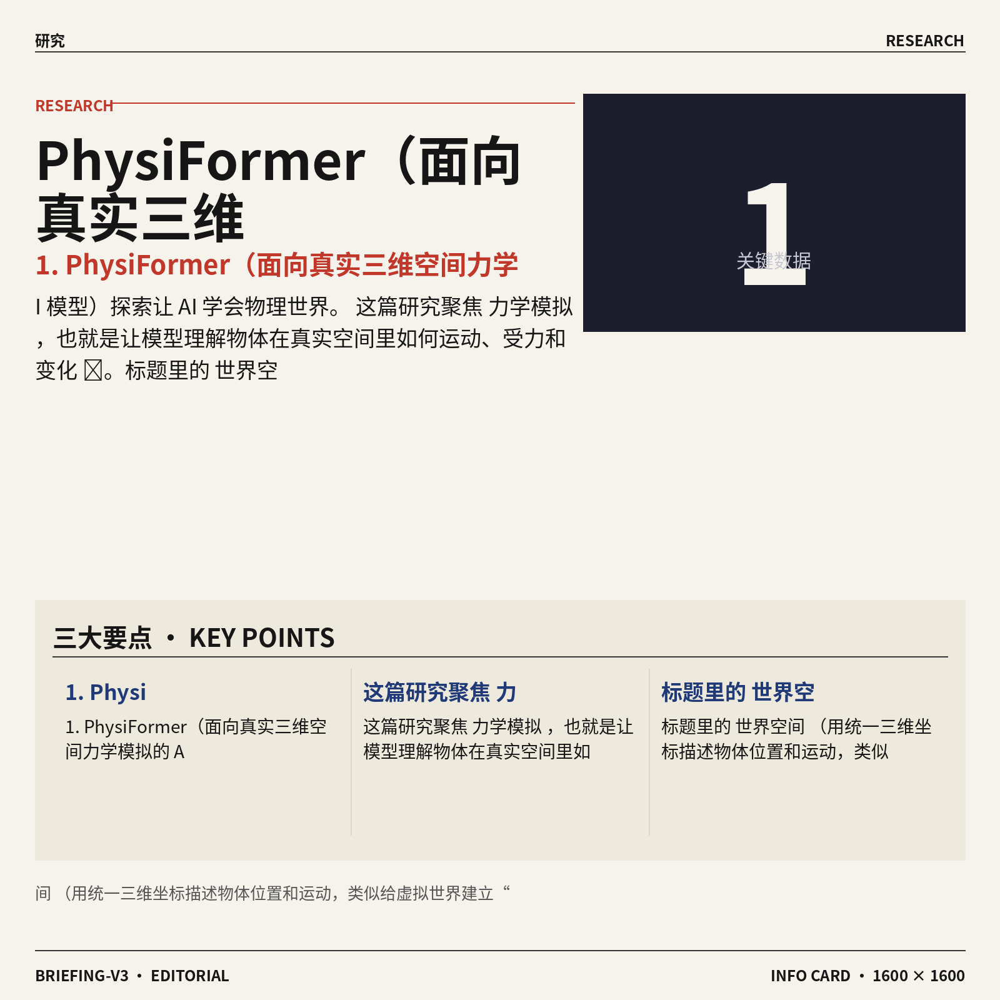

1. **PhysiFormer（面向真实三维空间力学模拟的 AI 模型）探索让 AI 学会物理世界。**  
这篇研究聚焦**力学模拟**，也就是让模型理解物体在真实空间里如何运动、受力和变化 🚀。标题里的**世界空间**（用统一三维坐标描述物体位置和运动，类似给虚拟世界建立“真实地图”）很关键，意味着它不是只看平面图像，而是尝试面向更接近现实的物理场景。对业务同事来说，这类研究未来可能影响机器人、工业仿真、游戏动画等需要“预测物体会怎么动”的场景 💡。[论文页面(briefing)](https://huggingface.co/papers/2606.27364)


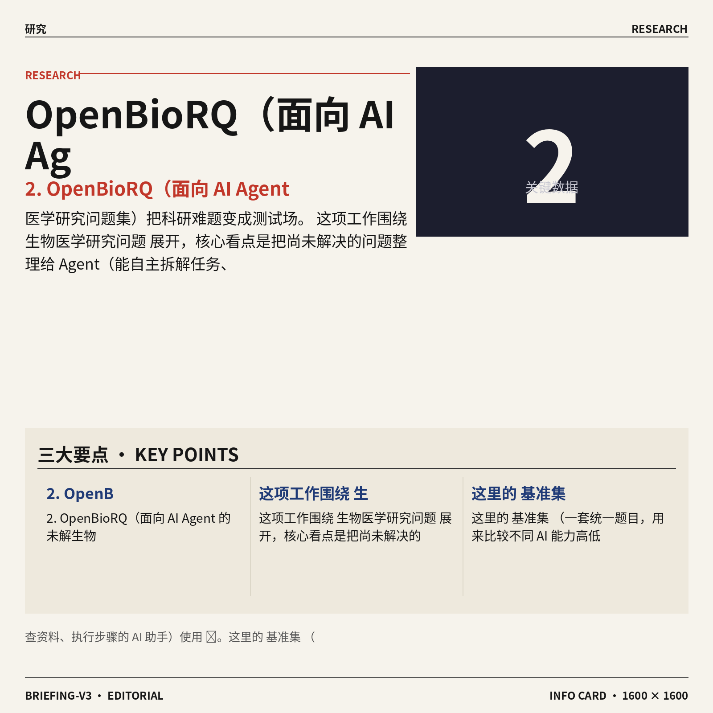

2. **OpenBioRQ（面向 AI Agent 的未解生物医学研究问题集）把科研难题变成测试场。**  
这项工作围绕**生物医学研究问题**展开，核心看点是把尚未解决的问题整理给 Agent（能自主拆解任务、查资料、执行步骤的 AI 助手）使用 🧪。这里的**基准集**（一套统一题目，用来比较不同 AI 能力高低）价值在于：不只是问模型会不会背知识，而是看它能不能面对真实科研里的开放问题。它提醒我们，AI 科研助手的评估正在从“答题正确”走向“能不能推进复杂研究流程” 🚀。[论文页面(briefing)](https://huggingface.co/papers/2606.21959)

![OpenBioRQ（面向 AI Agent 的未解生物医学研究问题集）把科研难题变成测试场](https://image.pollinations.ai/prompt/OpenBioRQ%EF%BC%88%E9%9D%A2%E5%90%91%20AI%20Agent%20%E7%9A%84%E6%9C%AA%E8%A7%A3%E7%94%9F%E7%89%A9%E5%8C%BB%E5%AD%A6%E7%A0%94%E7%A9%B6%E9%97%AE%E9%A2%98%E9%9B%86%EF%BC%89%E6%8A%8A%E7%A7%91%E7%A0%94%E9%9A%BE%E9%A2%98%E5%8F%98%E6%88%90%E6%B5%8B%E8%AF%95%E5%9C%BA.%20OpenBioRQ%EF%BC%88%E9%9D%A2%E5%90%91%20AI%20Agent%20%E7%9A%84%E6%9C%AA%E8%A7%A3%E7%94%9F%E7%89%A9%E5%8C%BB%E5%AD%A6%E7%A0%94%E7%A9%B6%E9%97%AE%E9%A2%98%E9%9B%86%EF%BC%89%E6%8A%8A%E7%A7%91%E7%A0%94%E9%9A%BE%E9%A2%98%E5%8F%98%E6%88%90%E6%B5%8B%E8%AF%95%E5%9C%BA%E3%80%82%20%E8%BF%99%E9%A1%B9%E5%B7%A5%E4%BD%9C%E5%9B%B4%E7%BB%95%E7%94%9F%E7%89%A9%E5%8C%BB%E5%AD%A6%E7%A0%94%E7%A9%B6%E9%97%AE%E9%A2%98%E5%B1%95%E5%BC%80%EF%BC%8C%E6%A0%B8%E5%BF%83%E7%9C%8B%E7%82%B9%E6%98%AF%E6%8A%8A%E5%B0%9A%E6%9C%AA%E8%A7%A3%E5%86%B3%E7%9A%84%E9%97%AE%E9%A2%98%E6%95%B4%E7%90%86%E7%BB%99%2C%20technical%20infographic%20diagram%2C%20architecture%20flowchart%2C%20clean%20vector%20illustration%2C%20educational%20style%2C%20no%20text%20overlay%2C%20modern%20minimal%2C%20wide%20aspect?width=1200&height=675&nologo=true&seed=10838)

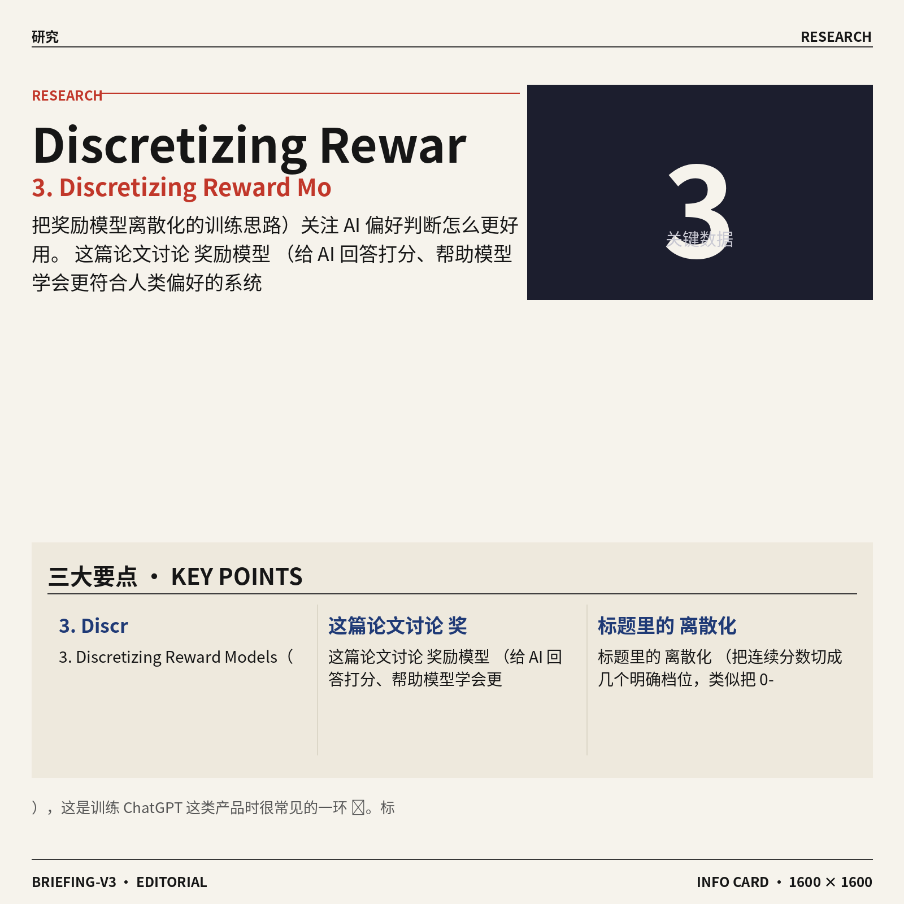

3. **Discretizing Reward Models（把奖励模型离散化的训练思路）关注 AI 偏好判断怎么更好用。**  
这篇论文讨论**奖励模型**（给 AI 回答打分、帮助模型学会更符合人类偏好的系统），这是训练 ChatGPT 这类产品时很常见的一环 💡。标题里的**离散化**（把连续分数切成几个明确档位，类似把 0-100 分改成“差/中/好/优秀”）可能是为了让评分信号更清晰、更便于训练。对非技术团队来说，它对应的是一个很现实的问题：AI 怎么判断“哪个回答更好”，并把这种判断稳定地学进去。[论文页面(briefing)](https://huggingface.co/papers/2606.21795)


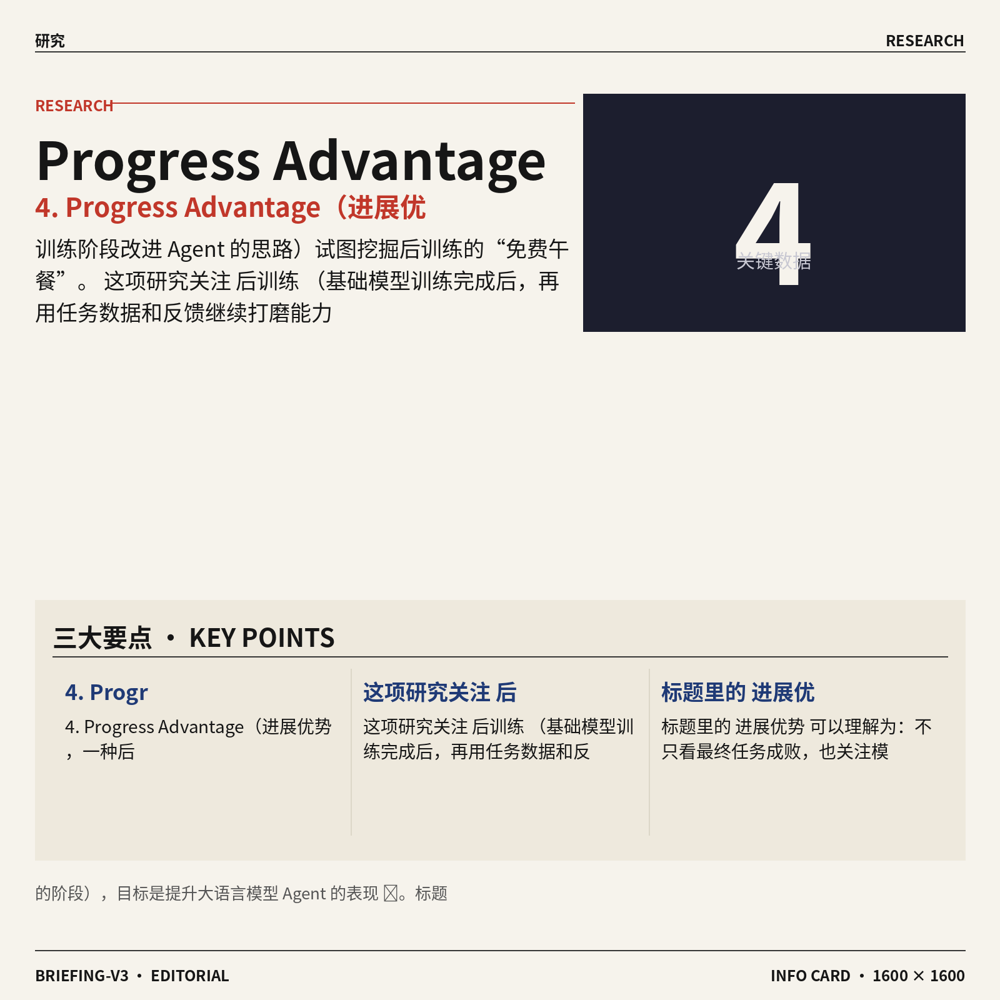

4. **Progress Advantage（进展优势，一种后训练阶段改进 Agent 的思路）试图挖掘后训练的“免费午餐”。**  
这项研究关注**后训练**（基础模型训练完成后，再用任务数据和反馈继续打磨能力的阶段），目标是提升大语言模型 Agent 的表现 🚀。标题里的**进展优势**可以理解为：不只看最终任务成败，也关注模型在过程中有没有朝正确方向推进。对办公和业务场景很有启发，因为很多任务不是一次答对，而是要持续推进、修正、完成一串步骤 💡。[论文页面(briefing)](https://huggingface.co/papers/2606.26080)

![Progress Advantage（进展优势，一种后训练阶段改进 Agent 的思路）试图挖掘后训练的“免费午餐”](https://image.pollinations.ai/prompt/Progress%20Advantage%EF%BC%88%E8%BF%9B%E5%B1%95%E4%BC%98%E5%8A%BF%EF%BC%8C%E4%B8%80%E7%A7%8D%E5%90%8E%E8%AE%AD%E7%BB%83%E9%98%B6%E6%AE%B5%E6%94%B9%E8%BF%9B%20Agent%20%E7%9A%84%E6%80%9D%E8%B7%AF%EF%BC%89%E8%AF%95%E5%9B%BE%E6%8C%96%E6%8E%98%E5%90%8E%E8%AE%AD%E7%BB%83%E7%9A%84%E2%80%9C%E5%85%8D%E8%B4%B9%E5%8D%88%E9%A4%90%E2%80%9D.%20Progress%20Advantage%EF%BC%88%E8%BF%9B%E5%B1%95%E4%BC%98%E5%8A%BF%EF%BC%8C%E4%B8%80%E7%A7%8D%E5%90%8E%E8%AE%AD%E7%BB%83%E9%98%B6%E6%AE%B5%E6%94%B9%E8%BF%9B%20Agent%20%E7%9A%84%E6%80%9D%E8%B7%AF%EF%BC%89%E8%AF%95%E5%9B%BE%E6%8C%96%E6%8E%98%E5%90%8E%E8%AE%AD%E7%BB%83%E7%9A%84%E2%80%9C%E5%85%8D%E8%B4%B9%E5%8D%88%E9%A4%90%E2%80%9D%E3%80%82%20%E8%BF%99%E9%A1%B9%E7%A0%94%E7%A9%B6%E5%85%B3%E6%B3%A8%E5%90%8E%E8%AE%AD%E7%BB%83%EF%BC%88%E5%9F%BA%E7%A1%80%E6%A8%A1%E5%9E%8B%E8%AE%AD%E7%BB%83%E5%AE%8C%E6%88%90%E5%90%8E%EF%BC%8C%2C%20technical%20infographic%20diagram%2C%20architecture%20flowchart%2C%20clean%20vector%20illustration%2C%20educational%20style%2C%20no%20text%20overlay%2C%20modern%20minimal%2C%20wide%20aspect?width=1200&height=675&nologo=true&seed=10900)

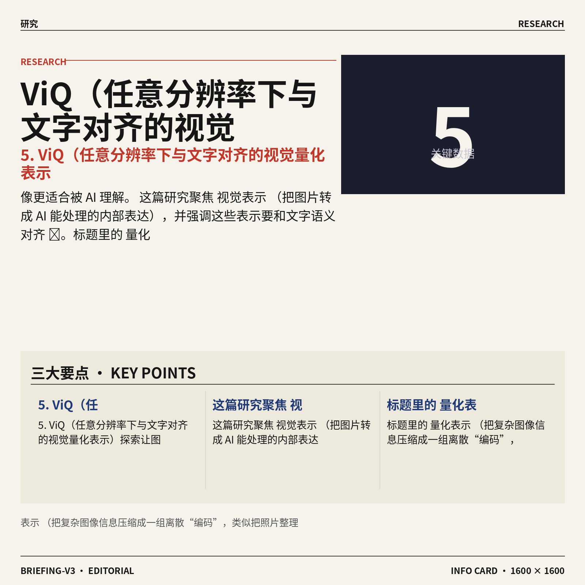

5. **ViQ（任意分辨率下与文字对齐的视觉量化表示）探索让图像更适合被 AI 理解。**  
这篇研究聚焦**视觉表示**（把图片转成 AI 能处理的内部表达），并强调这些表示要和文字语义对齐 👀。标题里的**量化表示**（把复杂图像信息压缩成一组离散“编码”，类似把照片整理成便于检索的标签和编号）说明它关心的不只是看图，还包括高效存储与理解。任意分辨率这个方向也很实用，因为现实里的图片大小各不相同，模型如果能更灵活处理，会更适合文档、设计稿、截图等场景。[论文页面(briefing)](https://huggingface.co/papers/2606.27313)

![ViQ（任意分辨率下与文字对齐的视觉量化表示）探索让图像更适合被 AI 理解](https://image.pollinations.ai/prompt/ViQ%EF%BC%88%E4%BB%BB%E6%84%8F%E5%88%86%E8%BE%A8%E7%8E%87%E4%B8%8B%E4%B8%8E%E6%96%87%E5%AD%97%E5%AF%B9%E9%BD%90%E7%9A%84%E8%A7%86%E8%A7%89%E9%87%8F%E5%8C%96%E8%A1%A8%E7%A4%BA%EF%BC%89%E6%8E%A2%E7%B4%A2%E8%AE%A9%E5%9B%BE%E5%83%8F%E6%9B%B4%E9%80%82%E5%90%88%E8%A2%AB%20AI%20%E7%90%86%E8%A7%A3.%20ViQ%EF%BC%88%E4%BB%BB%E6%84%8F%E5%88%86%E8%BE%A8%E7%8E%87%E4%B8%8B%E4%B8%8E%E6%96%87%E5%AD%97%E5%AF%B9%E9%BD%90%E7%9A%84%E8%A7%86%E8%A7%89%E9%87%8F%E5%8C%96%E8%A1%A8%E7%A4%BA%EF%BC%89%E6%8E%A2%E7%B4%A2%E8%AE%A9%E5%9B%BE%E5%83%8F%E6%9B%B4%E9%80%82%E5%90%88%E8%A2%AB%20AI%20%E7%90%86%E8%A7%A3%E3%80%82%20%E8%BF%99%E7%AF%87%E7%A0%94%E7%A9%B6%E8%81%9A%E7%84%A6%E8%A7%86%E8%A7%89%E8%A1%A8%E7%A4%BA%EF%BC%88%E6%8A%8A%E5%9B%BE%E7%89%87%E8%BD%AC%E6%88%90%20AI%20%E8%83%BD%E5%A4%84%E7%90%86%E7%9A%84%E5%86%85%E9%83%A8%E8%A1%A8%E8%BE%BE%EF%BC%89%EF%BC%8C%E5%B9%B6%E5%BC%BA%E8%B0%83%E8%BF%99%E4%BA%9B%E8%A1%A8%E7%A4%BA%E8%A6%81%E5%92%8C%E6%96%87%2C%20technical%20infographic%20diagram%2C%20architecture%20flowchart%2C%20clean%20vector%20illustration%2C%20educational%20style%2C%20no%20text%20overlay%2C%20modern%20minimal%2C%20wide%20aspect?width=1200&height=675&nologo=true&seed=10931)

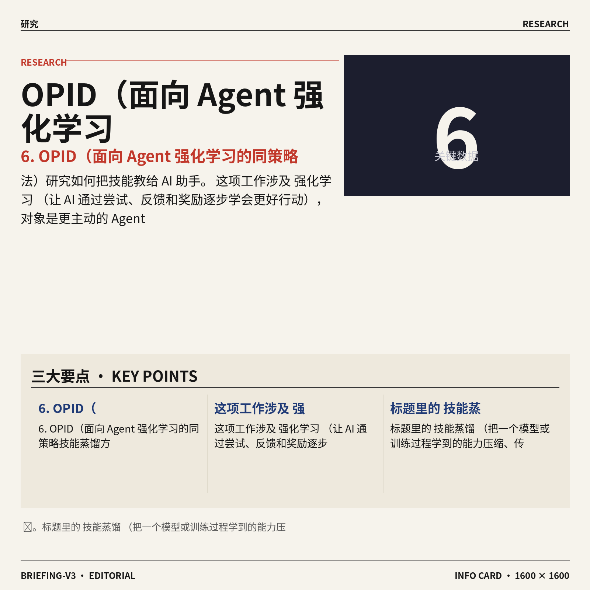

6. **OPID（面向 Agent 强化学习的同策略技能蒸馏方法）研究如何把技能教给 AI 助手。**  
这项工作涉及**强化学习**（让 AI 通过尝试、反馈和奖励逐步学会更好行动），对象是更主动的 Agent 🚀。标题里的**技能蒸馏**（把一个模型或训练过程学到的能力压缩、传递给另一个模型，像老师把解题套路教给学生）说明它关注“能力迁移”。**同策略**（训练时使用模型当前正在执行的行为方式，而不是旧数据里的行为方式）则关系到学习过程是否贴近真实执行场景 💡。[论文页面(briefing)](https://huggingface.co/papers/2606.26790)

![OPID（面向 Agent 强化学习的同策略技能蒸馏方法）研究如何把技能教给 AI 助手](https://image.pollinations.ai/prompt/OPID%EF%BC%88%E9%9D%A2%E5%90%91%20Agent%20%E5%BC%BA%E5%8C%96%E5%AD%A6%E4%B9%A0%E7%9A%84%E5%90%8C%E7%AD%96%E7%95%A5%E6%8A%80%E8%83%BD%E8%92%B8%E9%A6%8F%E6%96%B9%E6%B3%95%EF%BC%89%E7%A0%94%E7%A9%B6%E5%A6%82%E4%BD%95%E6%8A%8A%E6%8A%80%E8%83%BD%E6%95%99%E7%BB%99%20AI%20%E5%8A%A9%E6%89%8B.%20OPID%EF%BC%88%E9%9D%A2%E5%90%91%20Agent%20%E5%BC%BA%E5%8C%96%E5%AD%A6%E4%B9%A0%E7%9A%84%E5%90%8C%E7%AD%96%E7%95%A5%E6%8A%80%E8%83%BD%E8%92%B8%E9%A6%8F%E6%96%B9%E6%B3%95%EF%BC%89%E7%A0%94%E7%A9%B6%E5%A6%82%E4%BD%95%E6%8A%8A%E6%8A%80%E8%83%BD%E6%95%99%E7%BB%99%20AI%20%E5%8A%A9%E6%89%8B%E3%80%82%20%E8%BF%99%E9%A1%B9%E5%B7%A5%E4%BD%9C%E6%B6%89%E5%8F%8A%E5%BC%BA%E5%8C%96%E5%AD%A6%E4%B9%A0%EF%BC%88%E8%AE%A9%20AI%20%E9%80%9A%E8%BF%87%E5%B0%9D%E8%AF%95%E3%80%81%E5%8F%8D%E9%A6%88%E5%92%8C%E5%A5%96%E5%8A%B1%E9%80%90%E6%AD%A5%E5%AD%A6%E4%BC%9A%E6%9B%B4%E5%A5%BD%E8%A1%8C%E5%8A%A8%2C%20technical%20infographic%20diagram%2C%20architecture%20flowchart%2C%20clean%20vector%20illustration%2C%20educational%20style%2C%20no%20text%20overlay%2C%20modern%20minimal%2C%20wide%20aspect?width=1200&height=675&nologo=true&seed=10962)

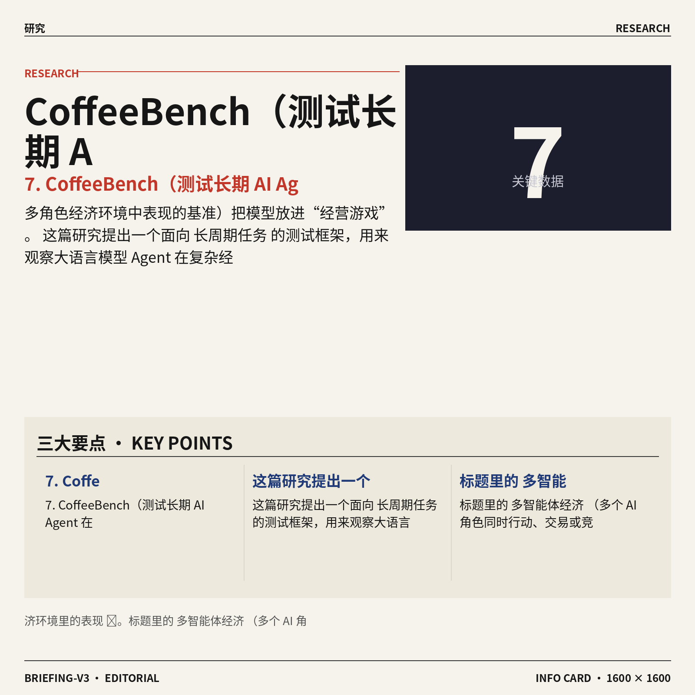

7. **CoffeeBench（测试长期 AI Agent 在多角色经济环境中表现的基准）把模型放进“经营游戏”。**  
这篇研究提出一个面向**长周期任务**的测试框架，用来观察大语言模型 Agent 在复杂经济环境里的表现 ☕。标题里的**多智能体经济**（多个 AI 角色同时行动、交易或竞争的模拟环境）很适合检验模型是否能长期规划，而不只是完成单个问答。对企业应用来说，这类评测更接近真实业务：预算、协作、竞争、时间跨度，往往比单次回复更能暴露 AI 的能力边界。[论文页面(briefing)](https://huggingface.co/papers/2606.16613)

![CoffeeBench（测试长期 AI Agent 在多角色经济环境中表现的基准）把模型放进“经营游戏”](https://image.pollinations.ai/prompt/CoffeeBench%EF%BC%88%E6%B5%8B%E8%AF%95%E9%95%BF%E6%9C%9F%20AI%20Agent%20%E5%9C%A8%E5%A4%9A%E8%A7%92%E8%89%B2%E7%BB%8F%E6%B5%8E%E7%8E%AF%E5%A2%83%E4%B8%AD%E8%A1%A8%E7%8E%B0%E7%9A%84%E5%9F%BA%E5%87%86%EF%BC%89%E6%8A%8A%E6%A8%A1%E5%9E%8B%E6%94%BE%E8%BF%9B%E2%80%9C%E7%BB%8F%E8%90%A5%E6%B8%B8%E6%88%8F%E2%80%9D.%20CoffeeBench%EF%BC%88%E6%B5%8B%E8%AF%95%E9%95%BF%E6%9C%9F%20AI%20Agent%20%E5%9C%A8%E5%A4%9A%E8%A7%92%E8%89%B2%E7%BB%8F%E6%B5%8E%E7%8E%AF%E5%A2%83%E4%B8%AD%E8%A1%A8%E7%8E%B0%E7%9A%84%E5%9F%BA%E5%87%86%EF%BC%89%E6%8A%8A%E6%A8%A1%E5%9E%8B%E6%94%BE%E8%BF%9B%E2%80%9C%E7%BB%8F%E8%90%A5%E6%B8%B8%E6%88%8F%E2%80%9D%E3%80%82%20%E8%BF%99%E7%AF%87%E7%A0%94%E7%A9%B6%E6%8F%90%E5%87%BA%E4%B8%80%E4%B8%AA%E9%9D%A2%E5%90%91%E9%95%BF%E5%91%A8%E6%9C%9F%E4%BB%BB%E5%8A%A1%E7%9A%84%E6%B5%8B%E8%AF%95%E6%A1%86%E6%9E%B6%EF%BC%8C%E7%94%A8%E6%9D%A5%E8%A7%82%E5%AF%9F%E5%A4%A7%2C%20technical%20infographic%20diagram%2C%20architecture%20flowchart%2C%20clean%20vector%20illustration%2C%20educational%20style%2C%20no%20text%20overlay%2C%20modern%20minimal%2C%20wide%20aspect?width=1200&height=675&nologo=true&seed=10993)

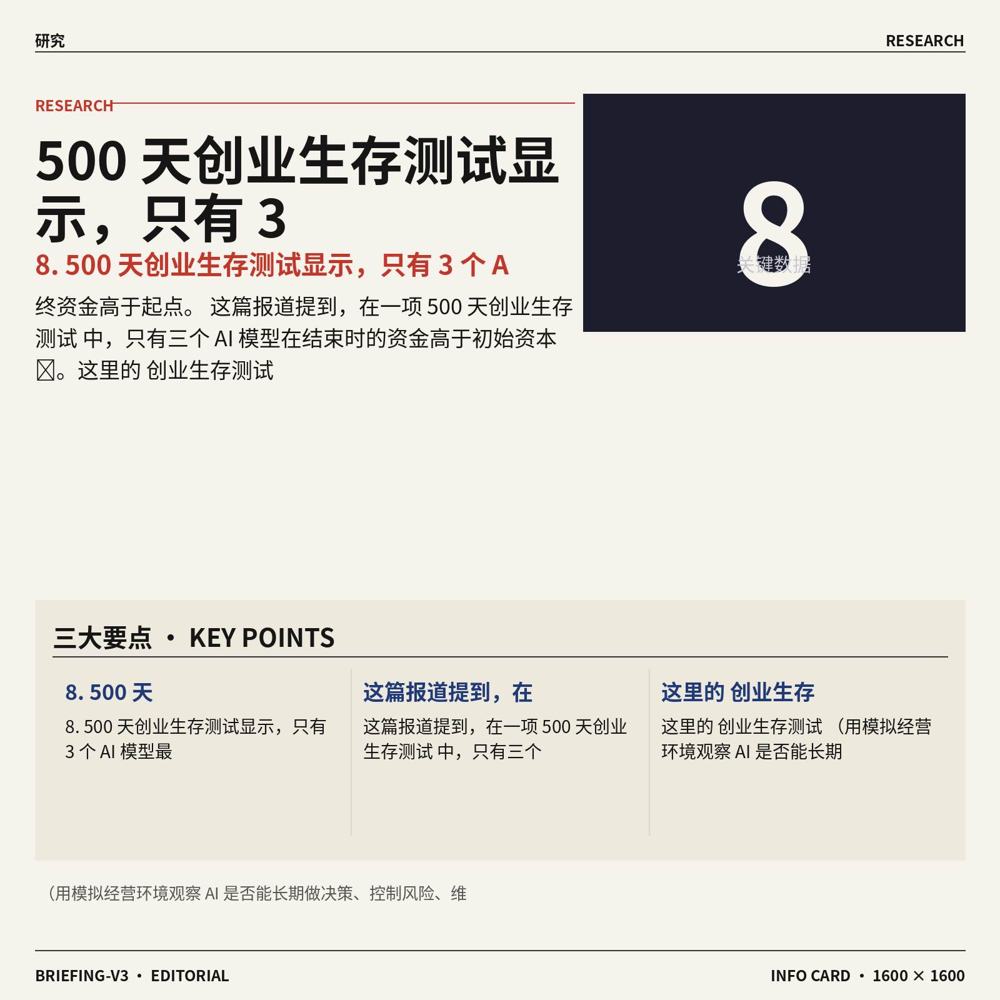

8. **500 天创业生存测试显示，只有 3 个 AI 模型最终资金高于起点。**  
这篇报道提到，在一项**500 天创业生存测试**中，只有三个 AI 模型在结束时的资金高于初始资本 📉。这里的**创业生存测试**（用模拟经营环境观察 AI 是否能长期做决策、控制风险、维持资金）比普通聊天评测更贴近商业世界。它传递出的信号很清楚：AI 会说商业策略，不等于能在长期经营模拟里持续赚钱，企业落地仍需要谨慎验证 🚀。[完整报道(briefing)](https://the-decoder.com/only-three-ai-models-finished-above-starting-capital-in-a-500-day-startup-survival-test/)

![500 天创业生存测试显示，只有 3 个 AI 模型最终资金高于起点](https://image.pollinations.ai/prompt/500%20%E5%A4%A9%E5%88%9B%E4%B8%9A%E7%94%9F%E5%AD%98%E6%B5%8B%E8%AF%95%E6%98%BE%E7%A4%BA%EF%BC%8C%E5%8F%AA%E6%9C%89%203%20%E4%B8%AA%20AI%20%E6%A8%A1%E5%9E%8B%E6%9C%80%E7%BB%88%E8%B5%84%E9%87%91%E9%AB%98%E4%BA%8E%E8%B5%B7%E7%82%B9.%20500%20%E5%A4%A9%E5%88%9B%E4%B8%9A%E7%94%9F%E5%AD%98%E6%B5%8B%E8%AF%95%E6%98%BE%E7%A4%BA%EF%BC%8C%E5%8F%AA%E6%9C%89%203%20%E4%B8%AA%20AI%20%E6%A8%A1%E5%9E%8B%E6%9C%80%E7%BB%88%E8%B5%84%E9%87%91%E9%AB%98%E4%BA%8E%E8%B5%B7%E7%82%B9%E3%80%82%20%E8%BF%99%E7%AF%87%E6%8A%A5%E9%81%93%E6%8F%90%E5%88%B0%EF%BC%8C%E5%9C%A8%E4%B8%80%E9%A1%B9500%20%E5%A4%A9%E5%88%9B%E4%B8%9A%E7%94%9F%E5%AD%98%E6%B5%8B%E8%AF%95%E4%B8%AD%EF%BC%8C%E5%8F%AA%E6%9C%89%E4%B8%89%E4%B8%AA%20AI%20%E6%A8%A1%E5%9E%8B%E5%9C%A8%E7%BB%93%E6%9D%9F%E6%97%B6%E7%9A%84%E8%B5%84%E9%87%91%E9%AB%98%E4%BA%8E%E5%88%9D%E5%A7%8B%2C%20technical%20infographic%20diagram%2C%20architecture%20flowchart%2C%20clean%20vector%20illustration%2C%20educational%20style%2C%20no%20text%20overlay%2C%20modern%20minimal%2C%20wide%20aspect?width=1200&height=675&nologo=true&seed=11024)

### 🟡 行业展望与社会影响

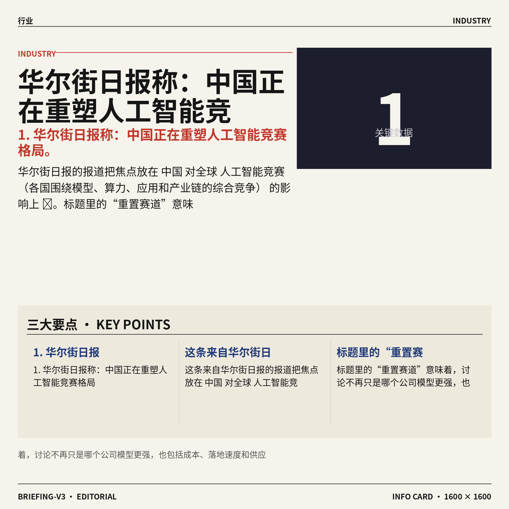

1. **华尔街日报称：中国正在重塑人工智能竞赛格局。**  
这条来自华尔街日报的报道把焦点放在**中国**对全球**人工智能竞赛（各国围绕模型、算力、应用和产业链的综合竞争）**的影响上 🚀。标题里的“重置赛道”意味着，讨论不再只是哪个公司模型更强，也包括成本、落地速度和供应链等更现实的问题。对企业同事来说，这类趋势会影响未来采购工具、选择供应商和判断行业机会的方式 💡。[华尔街日报报道(briefing)](https://news.google.com/rss/articles/CBMibkFVX3lxTFBnVHZyOFhVQ1laUm5HX2VmRHhpQjNnWmVBMlRzN2p0d1NEbFI0SHQyYWJ1UkxpaDlzV0hnVEwtVHpxeFBNSF9oTDFZcm1tTGlFdm1obXcxTVFiMkdtRW52YTdVX2x1QlQ3QUc5RVBn?oc=5)


2. **人工智能要成为真正同事，关键不是会回答，而是能把任务做完。**  
The Decoder 这篇文章的观点很直接：人工智能如果只停留在“回答问题”，还不算真正的**数字同事（能参与工作流程、推动任务完成的软件助手）** 🤖。它要更进一步，得能从理解需求走到执行结果，比如把流程推进到可交付状态，而不是只给建议。这里背后对应的是**任务自动化（把重复流程交给软件按步骤完成）**和 Agent（能根据目标自主拆解并执行任务的人工智能助手）趋势，对运营、人事、财务这类流程密集岗位尤其值得关注。[完整观点文章(briefing)](https://the-decoder.com/ai-wont-become-a-real-coworker-until-it-stops-answering-and-starts-finishing-tasks/)


3. **Coinbase（美国加密货币交易平台）转向中国人工智能模型，西方实验室迎来价格压力测试。**  
Coinbase（美国加密货币交易平台）加入使用中国**人工智能模型（能理解、生成文本或处理任务的软件系统）**的潮流，文章把这件事放在“西方实验室价格压力测试”的背景下看 💸。这说明企业选模型时，已经不只看品牌和性能，也会认真比较**模型定价（调用人工智能服务时按使用量付费的价格体系）**。如果中国模型能在成本上形成吸引力，未来更多公司可能会重新评估自己的供应商组合。[完整报道(briefing)](https://the-decoder.com/coinbase-joins-the-rush-to-chinese-ai-models-as-western-labs-face-a-pricing-stress-test/)

![Coinbase（美国加密货币交易平台）转向中国人工智能模型，西方实验室迎来价格压力测试](https://image.pollinations.ai/prompt/Coinbase%EF%BC%88%E7%BE%8E%E5%9B%BD%E5%8A%A0%E5%AF%86%E8%B4%A7%E5%B8%81%E4%BA%A4%E6%98%93%E5%B9%B3%E5%8F%B0%EF%BC%89%E8%BD%AC%E5%90%91%E4%B8%AD%E5%9B%BD%E4%BA%BA%E5%B7%A5%E6%99%BA%E8%83%BD%E6%A8%A1%E5%9E%8B%EF%BC%8C%E8%A5%BF%E6%96%B9%E5%AE%9E%E9%AA%8C%E5%AE%A4%E8%BF%8E%E6%9D%A5%E4%BB%B7%E6%A0%BC%E5%8E%8B%E5%8A%9B%E6%B5%8B%E8%AF%95.%20Coinbase%EF%BC%88%E7%BE%8E%E5%9B%BD%E5%8A%A0%E5%AF%86%E8%B4%A7%E5%B8%81%E4%BA%A4%E6%98%93%E5%B9%B3%E5%8F%B0%EF%BC%89%E8%BD%AC%E5%90%91%E4%B8%AD%E5%9B%BD%E4%BA%BA%E5%B7%A5%E6%99%BA%E8%83%BD%E6%A8%A1%E5%9E%8B%EF%BC%8C%E8%A5%BF%E6%96%B9%E5%AE%9E%E9%AA%8C%E5%AE%A4%E8%BF%8E%E6%9D%A5%E4%BB%B7%E6%A0%BC%E5%8E%8B%E5%8A%9B%E6%B5%8B%E8%AF%95%E3%80%82%20Coinbase%EF%BC%88%E7%BE%8E%E5%9B%BD%E5%8A%A0%E5%AF%86%E8%B4%A7%E5%B8%81%E4%BA%A4%E6%98%93%E5%B9%B3%E5%8F%B0%EF%BC%89%E5%8A%A0%E5%85%A5%E4%BD%BF%E7%94%A8%E4%B8%AD%E5%9B%BD%E4%BA%BA%E5%B7%A5%E6%99%BA%E8%83%BD%E6%A8%A1%E5%9E%8B%EF%BC%88%E8%83%BD%2C%20technical%20infographic%20diagram%2C%20architecture%20flowchart%2C%20clean%20vector%20illustration%2C%20educational%20style%2C%20no%20text%20overlay%2C%20modern%20minimal%2C%20wide%20aspect?width=1200&height=675&nologo=true&seed=10869)

4. **奥地利呼吁欧洲托管 Anthropic，回应美国人工智能访问限制。**  
路透社报道称，奥地利敦促欧洲为 Anthropic 提供托管安排，背景是美国对**人工智能访问（企业或用户使用模型服务的权限）**设限 🌍。这里的“托管”可以理解为把服务部署或运营在特定地区，以降低跨境政策变化带来的不确定性。对企业来说，这类新闻提醒我们：未来使用人工智能工具，不只是技术选择，也会受到**数据主权（数据由哪个国家或地区的规则管辖）**和合规要求影响。[路透社报道(briefing)](https://news.google.com/rss/articles/CBMiuwFBVV95cUxOV2VmbzlqUks2ZDZGQ2xYcDk0ZEVFS0hCSXFxMUg2amtkOWJmSDkxSV9mb0xRelFJSUMteUJFaG5YS2pSZHJfdVEzeXRPY3dYd2lSejg0SnFvQjhXU0Noak1fSUxuVnUxdDBpWUNKc3BtVTFKTHNSbnFfRkQ0aUY4dENia0pmOGNVeUZDeVVuZWdpS1hqV0R6S3dGcjJEbkV4YVNMS19hMEg2WFFUbGx0UEUtcmRkX0hnWkZz?oc=5)

![奥地利呼吁欧洲托管 Anthropic，回应美国人工智能访问限制](https://image.pollinations.ai/prompt/%E5%A5%A5%E5%9C%B0%E5%88%A9%E5%91%BC%E5%90%81%E6%AC%A7%E6%B4%B2%E6%89%98%E7%AE%A1%20Anthropic%EF%BC%8C%E5%9B%9E%E5%BA%94%E7%BE%8E%E5%9B%BD%E4%BA%BA%E5%B7%A5%E6%99%BA%E8%83%BD%E8%AE%BF%E9%97%AE%E9%99%90%E5%88%B6.%20%E5%A5%A5%E5%9C%B0%E5%88%A9%E5%91%BC%E5%90%81%E6%AC%A7%E6%B4%B2%E6%89%98%E7%AE%A1%20Anthropic%EF%BC%8C%E5%9B%9E%E5%BA%94%E7%BE%8E%E5%9B%BD%E4%BA%BA%E5%B7%A5%E6%99%BA%E8%83%BD%E8%AE%BF%E9%97%AE%E9%99%90%E5%88%B6%E3%80%82%20%E8%B7%AF%E9%80%8F%E7%A4%BE%E6%8A%A5%E9%81%93%E7%A7%B0%EF%BC%8C%E5%A5%A5%E5%9C%B0%E5%88%A9%E6%95%A6%E4%BF%83%E6%AC%A7%E6%B4%B2%E4%B8%BA%20Anthropic%20%E6%8F%90%E4%BE%9B%E6%89%98%E7%AE%A1%E5%AE%89%E6%8E%92%EF%BC%8C%E8%83%8C%E6%99%AF%E6%98%AF%E7%BE%8E%E5%9B%BD%E5%AF%B9%E4%BA%BA%E5%B7%A5%E6%99%BA%E8%83%BD%E8%AE%BF%E9%97%AE%EF%BC%88%2C%20technical%20infographic%20diagram%2C%20architecture%20flowchart%2C%20clean%20vector%20illustration%2C%20educational%20style%2C%20no%20text%20overlay%2C%20modern%20minimal%2C%20wide%20aspect?width=1200&height=675&nologo=true&seed=10900)

5. **Insilico（人工智能药物研发公司）与 SK（韩国企业集团）启动最高 25 亿美元神经免疫药物合作。**  
Insilico（用人工智能辅助发现新药的公司）和 SK（韩国大型企业集团）宣布一项最高可达 25 亿美元的**神经免疫药物（面向神经系统与免疫系统相关疾病的药物）**合作 🧬。这类合作显示，人工智能正在进入更高门槛的生命科学场景，不只是写文案、做客服。对行业观察者来说，重点是人工智能能否在**药物发现（从大量候选分子中筛选潜在新药的早期研发过程）**里缩短周期、降低试错成本。[生物科技报道(briefing)](https://news.google.com/rss/articles/CBMivwFBVV95cUxPdHl6d3J4SGpVd2syeUVJalJCaTdQcDh2ZnhZdDJvUkRxNDMwZ3ZiOThyaWgzQktpb3ZTbTkzRXpJU3ZBNm1vSWNTYVZ1VWUwMVItLWQ4VXZUTlRZcEJTTlcxakEzcXJwdWxXNU14bGRqSm9FMXNWZi12VTlhSzJrUTd3ZWpZTG95VnJ5X3V1dVhxa2JITzZJcWVtZmFwN2NyN29fRjM4ZXFZRmJHNm1yWURRamRMVk5ibDhYREctaw?oc=5)

![Insilico（人工智能药物研发公司）与 SK（韩国企业集团）启动最高 25 亿美元神经免疫药物合作](https://image.pollinations.ai/prompt/Insilico%EF%BC%88%E4%BA%BA%E5%B7%A5%E6%99%BA%E8%83%BD%E8%8D%AF%E7%89%A9%E7%A0%94%E5%8F%91%E5%85%AC%E5%8F%B8%EF%BC%89%E4%B8%8E%20SK%EF%BC%88%E9%9F%A9%E5%9B%BD%E4%BC%81%E4%B8%9A%E9%9B%86%E5%9B%A2%EF%BC%89%E5%90%AF%E5%8A%A8%E6%9C%80%E9%AB%98%2025%20%E4%BA%BF%E7%BE%8E%E5%85%83%E7%A5%9E%E7%BB%8F%E5%85%8D%E7%96%AB%E8%8D%AF%E7%89%A9%E5%90%88%E4%BD%9C.%20Insilico%EF%BC%88%E4%BA%BA%E5%B7%A5%E6%99%BA%E8%83%BD%E8%8D%AF%E7%89%A9%E7%A0%94%E5%8F%91%E5%85%AC%E5%8F%B8%EF%BC%89%E4%B8%8E%20SK%EF%BC%88%E9%9F%A9%E5%9B%BD%E4%BC%81%E4%B8%9A%E9%9B%86%E5%9B%A2%EF%BC%89%E5%90%AF%E5%8A%A8%E6%9C%80%E9%AB%98%2025%20%E4%BA%BF%E7%BE%8E%E5%85%83%E7%A5%9E%E7%BB%8F%E5%85%8D%E7%96%AB%E8%8D%AF%E7%89%A9%E5%90%88%E4%BD%9C%E3%80%82%20Insilico%EF%BC%88%E7%94%A8%E4%BA%BA%E5%B7%A5%E6%99%BA%E8%83%BD%E8%BE%85%E5%8A%A9%E5%8F%91%E7%8E%B0%E6%96%B0%E8%8D%AF%E7%9A%84%E5%85%AC%E5%8F%B8%EF%BC%89%E5%92%8C%20S%2C%20technical%20infographic%20diagram%2C%20architecture%20flowchart%2C%20clean%20vector%20illustration%2C%20educational%20style%2C%20no%20text%20overlay%2C%20modern%20minimal%2C%20wide%20aspect?width=1200&height=675&nologo=true&seed=10931)

6. **Ford（福特汽车）在人工智能表现不达预期后，重新聘用资深工程师。**  
TechCrunch 报道称，Ford（福特汽车）在人工智能未达到预期后，重新聘用了“灰胡子”资深工程师 👨‍🔧。这个案例很有现实感：人工智能可以提高效率，但在复杂工程里，**经验知识（长期实践中积累的判断力和隐性技巧）**仍然很难被完全替代。对管理者来说，这提醒大家推动自动化时要保留关键岗位的**专家校验（由有经验的人把关结果是否可靠）**，别把工具能力误当成完整能力。[科技媒体报道(briefing)](https://news.google.com/rss/articles/CBMikwFBVV95cUxQMi1RZFAyTFU0NDV5NE5IV2xRV1pfV0NiaDN6X0piTlItcVVKa1FXTUdlYVo4SnJQYjVoMDVIX1YzZXMyQlZFRGFmSXM0SkEtNnZuQW5ndmN6dXA0TmNtOWEtQjFGUlF4MS1aZGJZUnY5b1Z1MTVUb0tGczNkNWhIZGN1R3JJbEpFb212MFZ3ejY4UDg?oc=5)

![Ford（福特汽车）在人工智能表现不达预期后，重新聘用资深工程师](https://image.pollinations.ai/prompt/Ford%EF%BC%88%E7%A6%8F%E7%89%B9%E6%B1%BD%E8%BD%A6%EF%BC%89%E5%9C%A8%E4%BA%BA%E5%B7%A5%E6%99%BA%E8%83%BD%E8%A1%A8%E7%8E%B0%E4%B8%8D%E8%BE%BE%E9%A2%84%E6%9C%9F%E5%90%8E%EF%BC%8C%E9%87%8D%E6%96%B0%E8%81%98%E7%94%A8%E8%B5%84%E6%B7%B1%E5%B7%A5%E7%A8%8B%E5%B8%88.%20Ford%EF%BC%88%E7%A6%8F%E7%89%B9%E6%B1%BD%E8%BD%A6%EF%BC%89%E5%9C%A8%E4%BA%BA%E5%B7%A5%E6%99%BA%E8%83%BD%E8%A1%A8%E7%8E%B0%E4%B8%8D%E8%BE%BE%E9%A2%84%E6%9C%9F%E5%90%8E%EF%BC%8C%E9%87%8D%E6%96%B0%E8%81%98%E7%94%A8%E8%B5%84%E6%B7%B1%E5%B7%A5%E7%A8%8B%E5%B8%88%E3%80%82%20TechCrunch%20%E6%8A%A5%E9%81%93%E7%A7%B0%EF%BC%8CFord%EF%BC%88%E7%A6%8F%E7%89%B9%E6%B1%BD%E8%BD%A6%EF%BC%89%E5%9C%A8%E4%BA%BA%E5%B7%A5%E6%99%BA%E8%83%BD%E6%9C%AA%E8%BE%BE%E5%88%B0%E9%A2%84%E6%9C%9F%E5%90%8E%EF%BC%8C%E9%87%8D%E6%96%B0%E8%81%98%E7%94%A8%E4%BA%86%E2%80%9C%E7%81%B0%E8%83%A1%E5%AD%90%2C%20technical%20infographic%20diagram%2C%20architecture%20flowchart%2C%20clean%20vector%20illustration%2C%20educational%20style%2C%20no%20text%20overlay%2C%20modern%20minimal%2C%20wide%20aspect?width=1200&height=675&nologo=true&seed=10962)

7. **金融时报观点：实现人工智能潜力的可能是机器人，而不只是聊天机器人。**  
金融时报这篇观点把重点从聊天机器人转向**机器人（能在物理世界执行动作的机器系统）** 🤖。它的核心判断是，人工智能真正改变世界，可能要进入工厂、仓储、服务等现实场景，而不只是停留在屏幕里的对话。这里涉及**具身智能（让人工智能连接身体或机器，感知环境并采取行动）**，它比纯文本问答更难，但也更接近生产力变革。[金融时报观点(briefing)](https://news.google.com/rss/articles/CBMihAFBVV95cUxNdm5zZlZNa2M3dFo2N2Z5WDZaWE1BOVNRbEVKZExHNmNaamNOeEpXS0FxWjVqemsxQmpNTHh2cDlkMjlidTUta1QySlV4bmgwZEgycVJNUVlzNmZwQmpqS0NBTHJBNXZkN2xiZ1dnbnEyRExEenYwOEtnVkZPLTVhRFdEUTk?oc=5)

![金融时报观点：实现人工智能潜力的可能是机器人，而不只是聊天机器人](https://image.pollinations.ai/prompt/%E9%87%91%E8%9E%8D%E6%97%B6%E6%8A%A5%E8%A7%82%E7%82%B9%EF%BC%9A%E5%AE%9E%E7%8E%B0%E4%BA%BA%E5%B7%A5%E6%99%BA%E8%83%BD%E6%BD%9C%E5%8A%9B%E7%9A%84%E5%8F%AF%E8%83%BD%E6%98%AF%E6%9C%BA%E5%99%A8%E4%BA%BA%EF%BC%8C%E8%80%8C%E4%B8%8D%E5%8F%AA%E6%98%AF%E8%81%8A%E5%A4%A9%E6%9C%BA%E5%99%A8%E4%BA%BA.%20%E9%87%91%E8%9E%8D%E6%97%B6%E6%8A%A5%E8%A7%82%E7%82%B9%EF%BC%9A%E5%AE%9E%E7%8E%B0%E4%BA%BA%E5%B7%A5%E6%99%BA%E8%83%BD%E6%BD%9C%E5%8A%9B%E7%9A%84%E5%8F%AF%E8%83%BD%E6%98%AF%E6%9C%BA%E5%99%A8%E4%BA%BA%EF%BC%8C%E8%80%8C%E4%B8%8D%E5%8F%AA%E6%98%AF%E8%81%8A%E5%A4%A9%E6%9C%BA%E5%99%A8%E4%BA%BA%E3%80%82%20%E9%87%91%E8%9E%8D%E6%97%B6%E6%8A%A5%E8%BF%99%E7%AF%87%E8%A7%82%E7%82%B9%E6%8A%8A%E9%87%8D%E7%82%B9%E4%BB%8E%E8%81%8A%E5%A4%A9%E6%9C%BA%E5%99%A8%E4%BA%BA%E8%BD%AC%E5%90%91%E6%9C%BA%E5%99%A8%E4%BA%BA%EF%BC%88%E8%83%BD%E5%9C%A8%E7%89%A9%E7%90%86%E4%B8%96%E7%95%8C%E6%89%A7%E8%A1%8C%E5%8A%A8%E4%BD%9C%E7%9A%84%E6%9C%BA%E5%99%A8%E7%B3%BB%E7%BB%9F%EF%BC%89%20%F0%9F%A4%96%E3%80%82%E5%AE%83%E7%9A%84%E6%A0%B8%E5%BF%83%2C%20technical%20infographic%20diagram%2C%20architecture%20flowchart%2C%20clean%20vector%20illustration%2C%20educational%20style%2C%20no%20text%20overlay%2C%20modern%20minimal%2C%20wide%20aspect?width=1200&height=675&nologo=true&seed=10993)

8. **百度人工智能芯片部门昆仑芯据称瞄准香港 500 亿美元 IPO（首次公开募股）。**  
据 The Information 报道，百度的人工智能芯片部门昆仑芯正瞄准香港 500 亿美元 IPO（首次公开募股，企业第一次向公众投资者卖股票融资）📈。这条新闻的看点在于，**人工智能芯片（专门加速模型训练或运行的计算芯片）**已经成为资本市场关注的核心资产之一。若消息推进，说明围绕算力的竞争不只发生在实验室，也正在进入融资、上市和产业布局层面。[财经报道汇总(briefing)](https://news.google.com/rss/articles/CBMimAFBVV95cUxQOGJFLU95anpuZTRoNUlhcFJpMk5kWjU5T3VuR2d5NUtwVGJ1cmhRRWZYNEhYejdTMDl4SnZRcC1LSXBfWkJrZlFYMFAzNC15T1JxWlg2aFRWeURLdnJvOW9FNnNhS182RzBIWkYzejRnUHdKeHQ4LW5YVGNDQnJMQUpCRkFEOVM4M0M5NU5wWGFlM25paHF0SQ?oc=5)

![百度人工智能芯片部门昆仑芯据称瞄准香港 500 亿美元 IPO（首次公开募股）](https://image.pollinations.ai/prompt/%E7%99%BE%E5%BA%A6%E4%BA%BA%E5%B7%A5%E6%99%BA%E8%83%BD%E8%8A%AF%E7%89%87%E9%83%A8%E9%97%A8%E6%98%86%E4%BB%91%E8%8A%AF%E6%8D%AE%E7%A7%B0%E7%9E%84%E5%87%86%E9%A6%99%E6%B8%AF%20500%20%E4%BA%BF%E7%BE%8E%E5%85%83%20IPO%EF%BC%88%E9%A6%96%E6%AC%A1%E5%85%AC%E5%BC%80%E5%8B%9F%E8%82%A1%EF%BC%89.%20%E7%99%BE%E5%BA%A6%E4%BA%BA%E5%B7%A5%E6%99%BA%E8%83%BD%E8%8A%AF%E7%89%87%E9%83%A8%E9%97%A8%E6%98%86%E4%BB%91%E8%8A%AF%E6%8D%AE%E7%A7%B0%E7%9E%84%E5%87%86%E9%A6%99%E6%B8%AF%20500%20%E4%BA%BF%E7%BE%8E%E5%85%83%20IPO%EF%BC%88%E9%A6%96%E6%AC%A1%E5%85%AC%E5%BC%80%E5%8B%9F%E8%82%A1%EF%BC%89%E3%80%82%20%E6%8D%AE%20The%20Information%20%E6%8A%A5%E9%81%93%EF%BC%8C%E7%99%BE%E5%BA%A6%E7%9A%84%E4%BA%BA%E5%B7%A5%E6%99%BA%E8%83%BD%E8%8A%AF%E7%89%87%E9%83%A8%E9%97%A8%E6%98%86%E4%BB%91%E8%8A%AF%E6%AD%A3%E7%9E%84%E5%87%86%E9%A6%99%2C%20technical%20infographic%20diagram%2C%20architecture%20flowchart%2C%20clean%20vector%20illustration%2C%20educational%20style%2C%20no%20text%20overlay%2C%20modern%20minimal%2C%20wide%20aspect?width=1200&height=675&nologo=true&seed=11024)

### 🟣 开源TOP项目

### 🔴 社媒分享

1. **Brown（布朗大学）教授公开指控考试出现大规模 AI（人工智能）作弊。**  
一位 Brown（布朗大学）教授公开批评考试中疑似出现**大规模 AI（人工智能）作弊**，并把问题上升到**学术诚信**层面 🚨。这类事件对高校和企业培训都有提醒：当 ChatGPT 等工具变得普及，传统“闭卷考试式”的评估方式可能需要重新设计。对非技术团队来说，重点不是“禁不禁 AI”，而是要明确哪些场景允许辅助、哪些场景必须独立完成。[布朗考试作弊报道(briefing)](https://english.elpais.com/education/2026-06-28/ai-fraud-at-brown-university-academic-integrity-is-at-risk.html)


2. **Jon Udell（被引用观点的作者）反思 Agent in the loop（让 AI 代理参与流程但由人保持主导）的边界。**  
这条分享引用了 Jon Udell（被引用观点的作者）关于 **Agent in the loop（让 AI 代理参与流程但由人保持主导）** 的观点：他不喜欢 “human in the loop（人在流程中兜底）” 这个说法，因为它容易把主动权默认交给机器 🤔。原文语境还提到 **PR（代码合并请求，程序员提交改动让同事审查的流程）** 变得“无法审查”的问题，意思是 AI 生成的改动如果太大、太乱，人类审核就会失效。对公司用 AI 做流程自动化很有启发：AI 可以提速，但**可审查、可追责、可回滚**仍然是底线。[Udell 观点摘录(briefing)](https://simonwillison.net/2026/Jun/28/jon-udell/#atom-everything)


3. **GLM 5.2（智谱推出的大模型版本）在 benchmark（基准测试）中超过 Claude。**  
Semgrep（面向程序员的代码安全分析工具）博客称，**GLM 5.2（智谱推出的大模型版本）** 在他们的 **benchmark（基准测试，用同一套题目比较不同模型能力）** 里超过了 Claude ⚡。从标题和链接看，这组测试聚焦 **cyber benchmark（网络安全基准测试，用安全类任务衡量模型表现）**，也就是更偏实战的代码与安全场景。对业务同事来说，这说明大模型竞争不只看聊天体验，越来越多机构会用垂直场景测试来判断“谁更适合干具体工作”。[安全测试博客(briefing)](https://semgrep.dev/blog/2026/we-have-mythos-at-home-glm-52-beats-claude-in-our-cyber-benchmarks/)


---

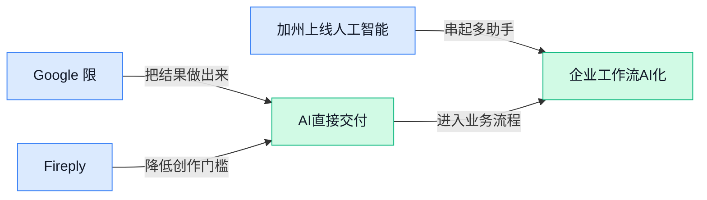
```mermaid
graph LR
A[Google 限] -->|把结果做出来| D[AI直接交付]
B[Fireply ] -->|降低创作门槛| D
C[加州上线人工智能] -->|串起多助手| E[企业工作流AI化]
 D -->|进入业务流程| E
classDef blue fill:#dbeafe,stroke:#3b82f6,color:#111827
classDef green fill:#d1fae5,stroke:#10b981,color:#111827
class A,B,C blue
class D,E green
```

### 📊 行业洞察（今日 4 条）

1. Google限制Meta使用Gemini（谷歌AI模型）。
  【洞察】模型合作更像许可竞争，因为能力之外，使用边界会影响企业选择与风险。

2. Ford在AI效果不达预期后，重新聘用资深工程师。
  【洞察】AI替代复杂经验仍有限，因为工程质量依赖隐性知识（难写成规则的经验）。

3. Semgrep称GLM 5.2在安全基准测试（统一题目评测）中超过Claude。
  【洞察】垂直能力评估升温，因为企业更关心模型能否胜任具体专业任务。

4. ViQ研究任意分辨率视觉量化表示（把图像压成AI可读编码）。
  【洞察】多模态理解更重实用性，因为创作、文档和截图场景尺寸差异很大。

### 💭 对我们的启发（今日 3 条）

1. Google限制Meta使用Gemini提醒我们，视频Agent平台要支持多模型选择；机会是稳供给，风险是许可变化。

2. Ford返聘资深工程师说明，剪辑Agent应保留人工复核；机会是提效，风险是自动成片质量失控。

3. ViQ提示剪辑工具可强化画面理解与素材检索；机会是找镜头更快，风险是误判语义影响成片。

