## AI资讯日报 2026/6/30

> AI 早报 · 每日早读 · 全网深度聚合

## **今日摘要**

```
亚马逊被曝蒸馏 Anthropic 模型压低 token 成本，Claude 全面登陆 Azure 还吃上 NVIDIA Blackwell 算力
Meta 限制 Claude Code 和 Codex 抓取训练数据，Anthropic 又与加州政府签协议半价推进 Claude 入政务
Google 推 Nano Banana 2 Pro 接入 Gemini 3.1 Flash Image，Qwen 3.6 27B 被捧成本地开发甜点位
```

### 🔵 产品与功能更新

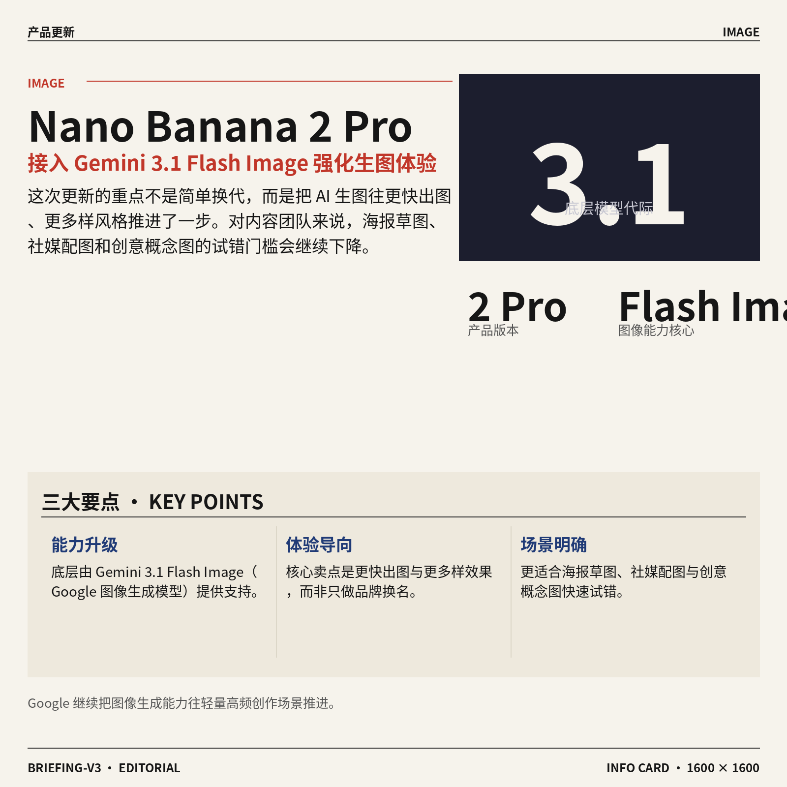

1. **Nano Banana 2 Pro（AI 图片生成工具）发布，主打 Gemini 3.1 Flash Image（Google 的图像生成模型）能力。**  
这次更新的核心，是把 **AI 生图** 能力进一步往“更快出图、更多样效果”方向推了一步 🎨。从标题信息看，Nano Banana 2 Pro 由 **Gemini 3.1 Flash Image（Google 的图像生成模型）** 提供底层支持，说明产品重点放在新一代图像生成体验上，而不是单纯换个名字。对普通用户和内容团队来说，这类工具的意义很直接：做海报草图、社媒配图、创意概念图时，试错成本会继续下降 💡。相关信息可参考 [产品发布报道(briefing)](https://news.google.com/rss/articles/CBMi2AFBVV95cUxQbUh1QllKejVhVF83aDNtQ2V2Y2tQcTZ2bDhLdG9fVFh3NUtkV3ExWjViRXEtV0lsOFBOTXhwVHBNaWxsVW45ME1LWEVZTmlrTWF6SE9DSmxuam9OQU44cElkb2thYnhfaWlnLW1XSW83bmhFa0t2WjNQMUs0TTh4Q0Qza3NqMnpPSnBvU0sxTjBOWWtzLVYyb25IWGJQN3VxTkNmTThKc1hqWl9HMGF6QmQzck9uaXpURjVSQ0JSMHQyOGxkMVhoalB1R1pyM3R3anBEQnl2Q0Q?oc=5)


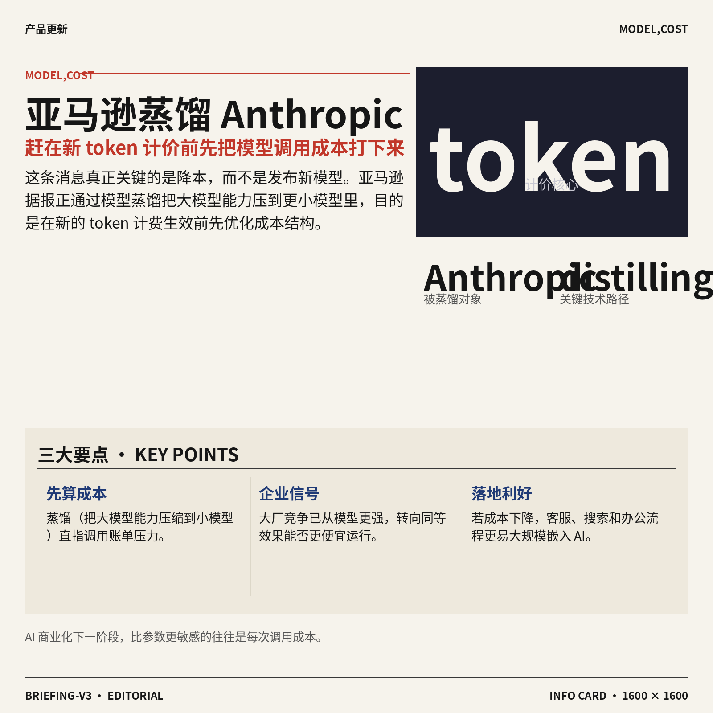

2. **亚马逊据报正在蒸馏 Anthropic 模型，以便在新 token（模型处理文本的小计量单位）计价前压低成本。**  
这条消息的关键词不是新模型，而是 **降本**：亚马逊工程师据称在做 **distilling（模型蒸馏，把大模型能力“压缩”到更小模型里）**，目的是在新的 **token 计费** 生效前，把调用成本先打下来 ⚙️。这说明大厂现在拼的不只是模型聪不聪明，还很看重“同样效果能不能更便宜地跑”。对企业用户来说，这类动作往往意味着未来 AI 功能会更容易大规模嵌入客服、搜索、办公流程，因为每次调用的账单压力可能更可控 📉。更多细节见 [完整报道(briefing)](https://the-decoder.com/amazon-engineers-are-reportedly-distilling-anthropic-models-to-cut-costs-before-new-token-based-pricing-kicks-in/)

![亚马逊据报正在蒸馏 Anthropic 模型，以便在新 token（模型处理文本的小计量单位）计价前压低成本](https://image.pollinations.ai/prompt/%E4%BA%9A%E9%A9%AC%E9%80%8A%E6%8D%AE%E6%8A%A5%E6%AD%A3%E5%9C%A8%E8%92%B8%E9%A6%8F%20Anthropic%20%E6%A8%A1%E5%9E%8B%EF%BC%8C%E4%BB%A5%E4%BE%BF%E5%9C%A8%E6%96%B0%20token%EF%BC%88%E6%A8%A1%E5%9E%8B%E5%A4%84%E7%90%86%E6%96%87%E6%9C%AC%E7%9A%84%E5%B0%8F%E8%AE%A1%E9%87%8F%E5%8D%95%E4%BD%8D%EF%BC%89%E8%AE%A1%E4%BB%B7%E5%89%8D%E5%8E%8B%E4%BD%8E%E6%88%90%E6%9C%AC.%20%E4%BA%9A%E9%A9%AC%E9%80%8A%E6%8D%AE%E6%8A%A5%E6%AD%A3%E5%9C%A8%E8%92%B8%E9%A6%8F%20Anthropic%20%E6%A8%A1%E5%9E%8B%EF%BC%8C%E4%BB%A5%E4%BE%BF%E5%9C%A8%E6%96%B0%20token%EF%BC%88%E6%A8%A1%E5%9E%8B%E5%A4%84%E7%90%86%E6%96%87%E6%9C%AC%E7%9A%84%E5%B0%8F%E8%AE%A1%E9%87%8F%E5%8D%95%E4%BD%8D%EF%BC%89%E8%AE%A1%E4%BB%B7%E5%89%8D%E5%8E%8B%E4%BD%8E%E6%88%90%E6%9C%AC%E3%80%82%20%E8%BF%99%E6%9D%A1%E6%B6%88%E6%81%AF%E7%9A%84%E5%85%B3%E9%94%AE%E8%AF%8D%E4%B8%8D%E6%98%AF%E6%96%B0%E6%A8%A1%E5%9E%8B%EF%BC%8C%E8%80%8C%E6%98%AF%20%E9%99%8D%E6%9C%AC%EF%BC%9A%E4%BA%9A%E9%A9%AC%E9%80%8A%E5%B7%A5%2C%20technical%20infographic%20diagram%2C%20architecture%20flowchart%2C%20clean%20vector%20illustration%2C%20educational%20style%2C%20no%20text%20overlay%2C%20modern%20minimal%2C%20wide%20aspect?width=1200&height=675&nologo=true&seed=11420)

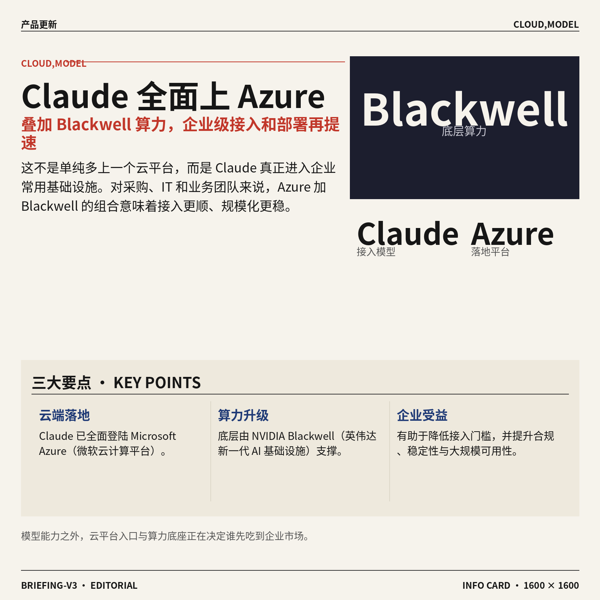

3. **Claude 已全面登陆 Microsoft Azure（微软云计算平台），并由 NVIDIA Blackwell（英伟达新一代 AI 计算基础设施）提供底层支撑。**  
这条更新更像是 **企业级落地** 的加速信号：Claude 不只是“能用”，而是进一步进入 Azure 这类大公司常用的云平台环境 ☁️。标题还提到 **Blackwell（英伟达新一代 AI 计算基础设施）**，意味着背后的算力底座也在升级，重点是让模型部署与商业化推进得更顺。对企业采购、IT 管理和业务团队来说，这类进展通常意味着接入门槛会更低，合规、稳定性和大规模使用的可行性也更强一些 🚀。可查看 [相关商业化报道(briefing)](https://news.google.com/rss/articles/CBMiygFBVV95cUxPa1ZXenBHUGhvZzg3ZFV4NWdQM2ZmVFBWWGFWVUpGMEI4blJSWGpmMUJfY0hKT1BWWmJPRzlCWFBocFQzTHRmUUhYMS1lQVRfYm1RWjNsNGxkcTA1MzdibUtpVHUydGpmQ3UyQWFGN01oVEh3a0lfZzNEOTBBRDZZV2ZYaFhNUjZWUDdUSlI3Qk1nTEJwbENOaTJXTHhkSGR1NU9LbWROMXV2SXd3UmxuS0FkNjFKXzFsbmN0VFNpMnJUbkRvY25mNEZB?oc=5)

![Claude 已全面登陆 Microsoft Azure（微软云计算平台），并由 NVIDIA Blackwell（英伟达新一代 AI 计算基础设施）提供底层支撑](https://image.pollinations.ai/prompt/Claude%20%E5%B7%B2%E5%85%A8%E9%9D%A2%E7%99%BB%E9%99%86%20Microsoft%20Azure%EF%BC%88%E5%BE%AE%E8%BD%AF%E4%BA%91%E8%AE%A1%E7%AE%97%E5%B9%B3%E5%8F%B0%EF%BC%89%EF%BC%8C%E5%B9%B6%E7%94%B1%20NVIDIA%20Blackwell%EF%BC%88%E8%8B%B1%E4%BC%9F%E8%BE%BE%E6%96%B0%E4%B8%80%E4%BB%A3%20AI%20%E8%AE%A1%E7%AE%97%E5%9F%BA%E7%A1%80%E8%AE%BE%E6%96%BD%EF%BC%89%E6%8F%90%E4%BE%9B%E5%BA%95%E5%B1%82%E6%94%AF%E6%92%91.%20Claude%20%E5%B7%B2%E5%85%A8%E9%9D%A2%E7%99%BB%E9%99%86%20Microsoft%20Azure%EF%BC%88%E5%BE%AE%E8%BD%AF%E4%BA%91%E8%AE%A1%E7%AE%97%E5%B9%B3%E5%8F%B0%EF%BC%89%EF%BC%8C%E5%B9%B6%E7%94%B1%20NVIDIA%20Blackwell%EF%BC%88%E8%8B%B1%E4%BC%9F%E8%BE%BE%E6%96%B0%E4%B8%80%E4%BB%A3%20AI%20%E8%AE%A1%E7%AE%97%E5%9F%BA%E7%A1%80%E8%AE%BE%E6%96%BD%EF%BC%89%E6%8F%90%E4%BE%9B%E5%BA%95%E5%B1%82%E6%94%AF%2C%20technical%20infographic%20diagram%2C%20architecture%20flowchart%2C%20clean%20vector%20illustration%2C%20educational%20style%2C%20no%20text%20overlay%2C%20modern%20minimal%2C%20wide%20aspect?width=1200&height=675&nologo=true&seed=11451)

### 🟢 前沿研究

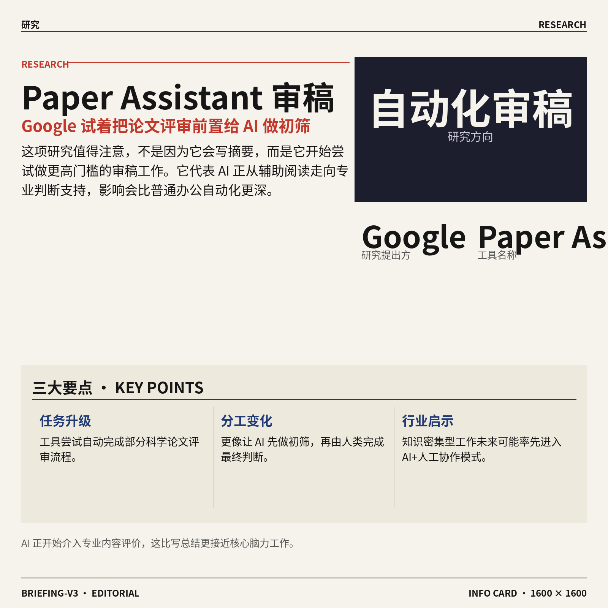

1. **Google 的 Paper Assistant（论文评审辅助工具）探索“自动化审稿”。**
这篇研究把焦点放在**科学论文评审**这件高门槛工作上，尝试用 Google 的 Paper Assistant（论文评审辅助工具，帮研究者读论文、提炼重点并生成评语）来自动完成部分流程 💡。对普通业务同事来说，这类工具的意义不只是“省时间”，更可能改变知识密集型工作的分工：先让 AI 做初筛、人类再做最终判断。它也提醒我们，AI 正在从“写摘要”走向“给专业内容打分和提意见”这一步，影响会比一般办公自动化更深。可查看 [论文页面介绍(briefing)](https://huggingface.co/papers/2606.28277)


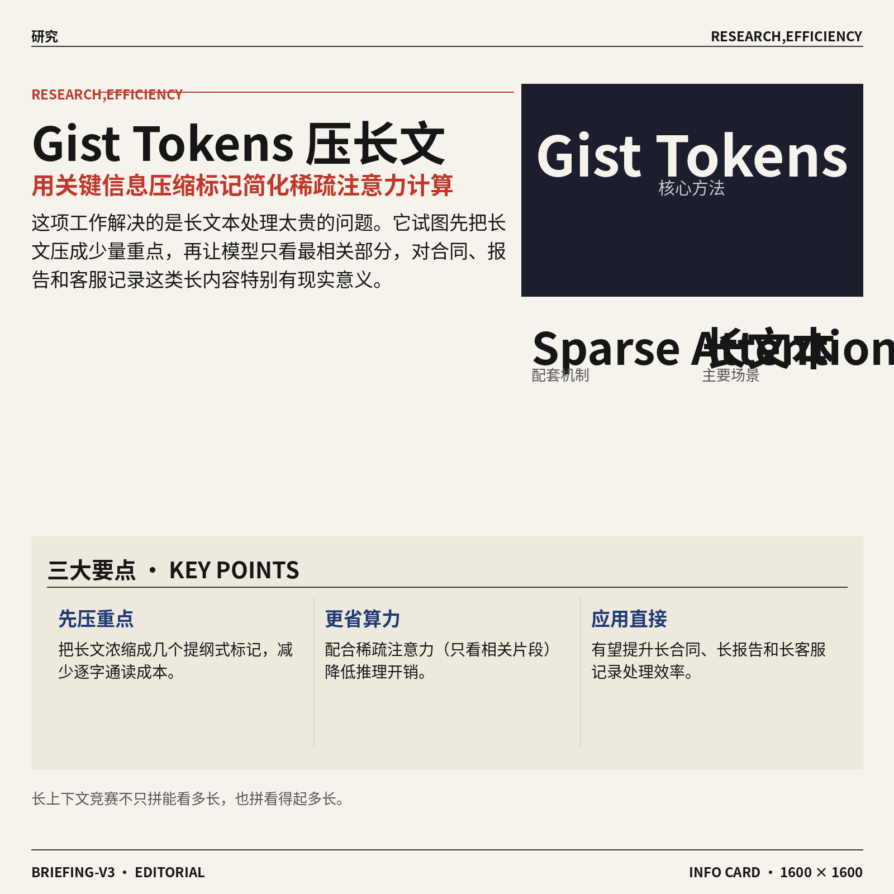

2. **Gist Tokens（关键信息压缩标记）让 Sparse Attention（稀疏注意力，只关注部分内容以降低计算量）更简单。**
这项工作研究的是怎么让大模型在处理超长文本时，既**更省算力**又尽量不丢重点 🚀。所谓 Gist Tokens（关键信息压缩标记，可以理解成先把长文浓缩成几个“提纲卡片”）配合 Sparse Attention（稀疏注意力，只看最相关片段）使用，本质上是在想办法减少模型“逐字通读”的成本。对企业应用来说，这类研究会直接影响长合同、长报告、长客服记录的处理效率，未来也可能让本地部署的长文本 AI 更实用。[研究论文页面(briefing)](https://huggingface.co/papers/2604.20920)

![Gist Tokens（关键信息压缩标记）让 Sparse Attention（稀疏注意力，只关注部分内容以降低计算量）更简单](https://image.pollinations.ai/prompt/Gist%20Tokens%EF%BC%88%E5%85%B3%E9%94%AE%E4%BF%A1%E6%81%AF%E5%8E%8B%E7%BC%A9%E6%A0%87%E8%AE%B0%EF%BC%89%E8%AE%A9%20Sparse%20Attention%EF%BC%88%E7%A8%80%E7%96%8F%E6%B3%A8%E6%84%8F%E5%8A%9B%EF%BC%8C%E5%8F%AA%E5%85%B3%E6%B3%A8%E9%83%A8%E5%88%86%E5%86%85%E5%AE%B9%E4%BB%A5%E9%99%8D%E4%BD%8E%E8%AE%A1%E7%AE%97%E9%87%8F%EF%BC%89%E6%9B%B4%E7%AE%80%E5%8D%95.%20Gist%20Tokens%EF%BC%88%E5%85%B3%E9%94%AE%E4%BF%A1%E6%81%AF%E5%8E%8B%E7%BC%A9%E6%A0%87%E8%AE%B0%EF%BC%89%E8%AE%A9%20Sparse%20Attention%EF%BC%88%E7%A8%80%E7%96%8F%E6%B3%A8%E6%84%8F%E5%8A%9B%EF%BC%8C%E5%8F%AA%E5%85%B3%E6%B3%A8%E9%83%A8%E5%88%86%E5%86%85%E5%AE%B9%E4%BB%A5%E9%99%8D%E4%BD%8E%E8%AE%A1%E7%AE%97%E9%87%8F%EF%BC%89%E6%9B%B4%E7%AE%80%E5%8D%95%E3%80%82%20%E8%BF%99%E9%A1%B9%E5%B7%A5%E4%BD%9C%E7%A0%94%E7%A9%B6%E7%9A%84%E6%98%AF%E6%80%8E%E4%B9%88%E8%AE%A9%E5%A4%A7%E6%A8%A1%E5%9E%8B%E5%9C%A8%2C%20technical%20infographic%20diagram%2C%20architecture%20flowchart%2C%20clean%20vector%20illustration%2C%20educational%20style%2C%20no%20text%20overlay%2C%20modern%20minimal%2C%20wide%20aspect?width=1200&height=675&nologo=true&seed=10838)

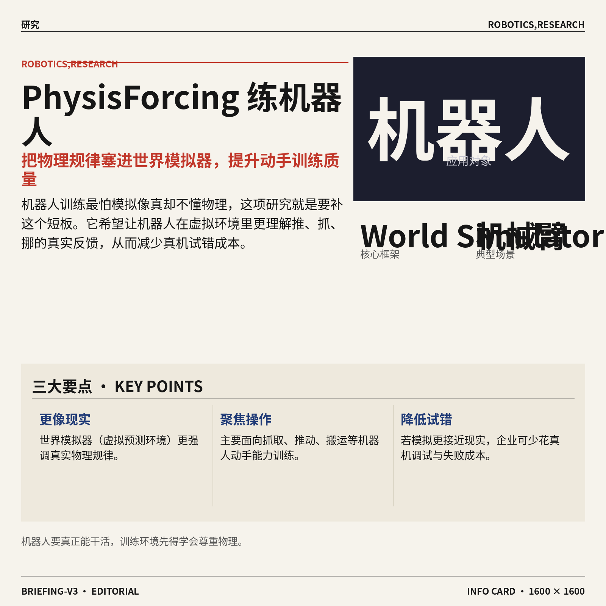

3. **PhysisForcing（物理强化世界模拟器）瞄准机器人“动手能力”训练。**
这篇论文关注**机器人操作**场景，希望通过更强调物理规律的 World Simulator（世界模拟器，在虚拟环境里预测物体和动作结果）来提升训练效果 🤖。简单说，就是让机器人不是只靠“看起来像”，而是更理解推、抓、挪这些动作背后的真实物理反馈，这对机械臂、仓储自动化等场景尤其关键。对非技术同事也很好理解：如果模拟环境更接近现实，企业训练机器人就能少走弯路、少花真机试错成本。[论文详情页(briefing)](https://huggingface.co/papers/2606.28128)


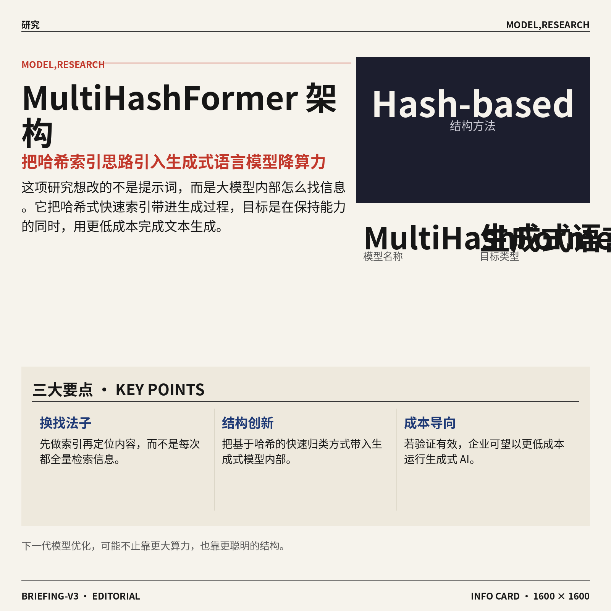

4. **MultiHashFormer（基于哈希的生成式语言模型）尝试改写大模型算力结构。**
这项研究把 Hash-based（基于哈希，用“快速归类”的方式加速检索和匹配）思路引入生成式语言模型，目标是让模型在生成文本时更高效地找到相关信息 ⚙️。如果说传统大模型像“把整本资料都翻一遍”，那这类方法更像先做索引，再精准定位要用的内容。它的行业价值在于，一旦这种结构被验证有效，未来可能帮助企业以更低成本运行生成式 AI，特别适合预算敏感、又想要大模型能力的团队。[论文页面说明(briefing)](https://huggingface.co/papers/2606.28057)

![MultiHashFormer（基于哈希的生成式语言模型）尝试改写大模型算力结构](https://image.pollinations.ai/prompt/MultiHashFormer%EF%BC%88%E5%9F%BA%E4%BA%8E%E5%93%88%E5%B8%8C%E7%9A%84%E7%94%9F%E6%88%90%E5%BC%8F%E8%AF%AD%E8%A8%80%E6%A8%A1%E5%9E%8B%EF%BC%89%E5%B0%9D%E8%AF%95%E6%94%B9%E5%86%99%E5%A4%A7%E6%A8%A1%E5%9E%8B%E7%AE%97%E5%8A%9B%E7%BB%93%E6%9E%84.%20MultiHashFormer%EF%BC%88%E5%9F%BA%E4%BA%8E%E5%93%88%E5%B8%8C%E7%9A%84%E7%94%9F%E6%88%90%E5%BC%8F%E8%AF%AD%E8%A8%80%E6%A8%A1%E5%9E%8B%EF%BC%89%E5%B0%9D%E8%AF%95%E6%94%B9%E5%86%99%E5%A4%A7%E6%A8%A1%E5%9E%8B%E7%AE%97%E5%8A%9B%E7%BB%93%E6%9E%84%E3%80%82%20%E8%BF%99%E9%A1%B9%E7%A0%94%E7%A9%B6%E6%8A%8A%20Hash-based%EF%BC%88%E5%9F%BA%E4%BA%8E%E5%93%88%E5%B8%8C%EF%BC%8C%E7%94%A8%E2%80%9C%E5%BF%AB%E9%80%9F%E5%BD%92%E7%B1%BB%E2%80%9D%E7%9A%84%E6%96%B9%E5%BC%8F%E5%8A%A0%E9%80%9F%E6%A3%80%E7%B4%A2%E5%92%8C%E5%8C%B9%2C%20technical%20infographic%20diagram%2C%20architecture%20flowchart%2C%20clean%20vector%20illustration%2C%20educational%20style%2C%20no%20text%20overlay%2C%20modern%20minimal%2C%20wide%20aspect?width=1200&height=675&nologo=true&seed=10900)


5. **ProMSA（渐进式多模态搜索 Agent）让 AI 回答“看图问答”前先主动查资料。**
这篇研究面向 Knowledge-Based Visual Question Answering（基于外部知识的视觉问答，AI 不只看图，还要结合资料回答问题）这个难题，提出了会逐步搜索信息的多模态 Agent（能处理文字与图像的智能体）🔎。它的重点不是“直接猜答案”，而是像人一样边看图边查资料，再一步步缩小范围。对企业场景很有启发：以后 AI 做质检、商品识别、图文客服时，可能不只是“看见了什么”，还会联动知识库回答“这意味着什么”。[论文介绍页(briefing)](https://huggingface.co/papers/2606.27974)


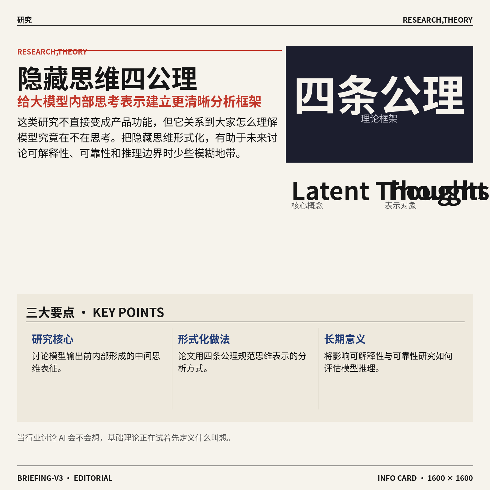

6. **Formalizing Latent Thoughts（把“隐藏思维”形式化）提出大模型思考表示的四条公理。**
这项研究讨论的是大模型内部“怎么想”的问题，也就是 Latent Thoughts（隐藏思维，模型在输出答案前内部形成但不直接展示的中间表征）🧠。论文试图用“四条公理”来规范 Thought Representation（思维表示，描述模型内部推理状态的方式），相当于给“AI 是否真的在思考、怎么表达这种思考”建立更清晰的分析框架。对非研发岗位来说，这类基础研究虽不直接变成产品功能，但会影响未来我们怎么理解模型的可解释性（为什么它会这样回答）与可靠性。[论文页面概览(briefing)](https://huggingface.co/papers/2606.27378)

![Formalizing Latent Thoughts（把“隐藏思维”形式化）提出大模型思考表示的四条公理](https://image.pollinations.ai/prompt/Formalizing%20Latent%20Thoughts%EF%BC%88%E6%8A%8A%E2%80%9C%E9%9A%90%E8%97%8F%E6%80%9D%E7%BB%B4%E2%80%9D%E5%BD%A2%E5%BC%8F%E5%8C%96%EF%BC%89%E6%8F%90%E5%87%BA%E5%A4%A7%E6%A8%A1%E5%9E%8B%E6%80%9D%E8%80%83%E8%A1%A8%E7%A4%BA%E7%9A%84%E5%9B%9B%E6%9D%A1%E5%85%AC%E7%90%86.%20Formalizing%20Latent%20Thoughts%EF%BC%88%E6%8A%8A%E2%80%9C%E9%9A%90%E8%97%8F%E6%80%9D%E7%BB%B4%E2%80%9D%E5%BD%A2%E5%BC%8F%E5%8C%96%EF%BC%89%E6%8F%90%E5%87%BA%E5%A4%A7%E6%A8%A1%E5%9E%8B%E6%80%9D%E8%80%83%E8%A1%A8%E7%A4%BA%E7%9A%84%E5%9B%9B%E6%9D%A1%E5%85%AC%E7%90%86%E3%80%82%20%E8%BF%99%E9%A1%B9%E7%A0%94%E7%A9%B6%E8%AE%A8%E8%AE%BA%E7%9A%84%E6%98%AF%E5%A4%A7%E6%A8%A1%E5%9E%8B%E5%86%85%E9%83%A8%E2%80%9C%E6%80%8E%E4%B9%88%E6%83%B3%E2%80%9D%E7%9A%84%E9%97%AE%E9%A2%98%EF%BC%8C%E4%B9%9F%E5%B0%B1%E6%98%AF%2C%20technical%20infographic%20diagram%2C%20architecture%20flowchart%2C%20clean%20vector%20illustration%2C%20educational%20style%2C%20no%20text%20overlay%2C%20modern%20minimal%2C%20wide%20aspect?width=1200&height=675&nologo=true&seed=10962)

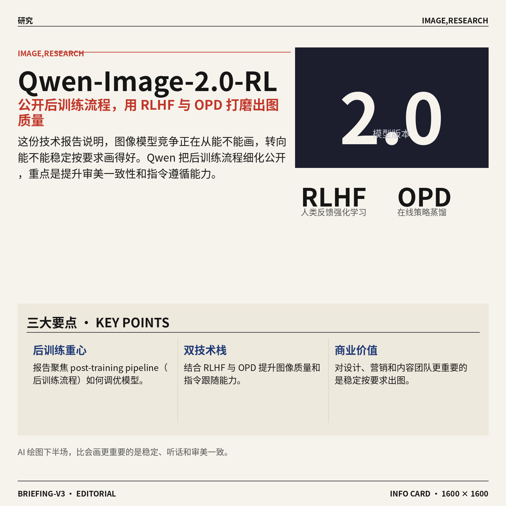

7. **Qwen-Image-2.0-RL（通义千问图像模型 2.0 强化学习版）技术报告公布后训练方案。**
这份技术报告介绍了 Qwen-Image-2.0-RL 的 post-training pipeline（后训练流程，模型预训练完成后再做定向优化的一整套步骤），核心用了 RLHF（基于人类反馈的强化学习，让模型更符合人的审美和指令）与 OPD（在线策略蒸馏，一边生成一边把更优策略压缩进模型）来提升图像质量和指令遵循能力 🎨。说白了，这不是单纯“再喂更多数据”，而是通过更精细的后期调教，让 AI 更懂人想要什么图、也更少跑偏。对内容、设计和营销团队来说，这意味着 AI 绘图竞争正从“能不能画”进入“能不能稳定按要求画得好”的阶段。[arXiv 论文摘要(briefing)](https://arxiv.org/abs/2606.27608) [论文页面介绍(briefing)](https://huggingface.co/papers/2606.27608)


### 🟡 行业展望与社会影响

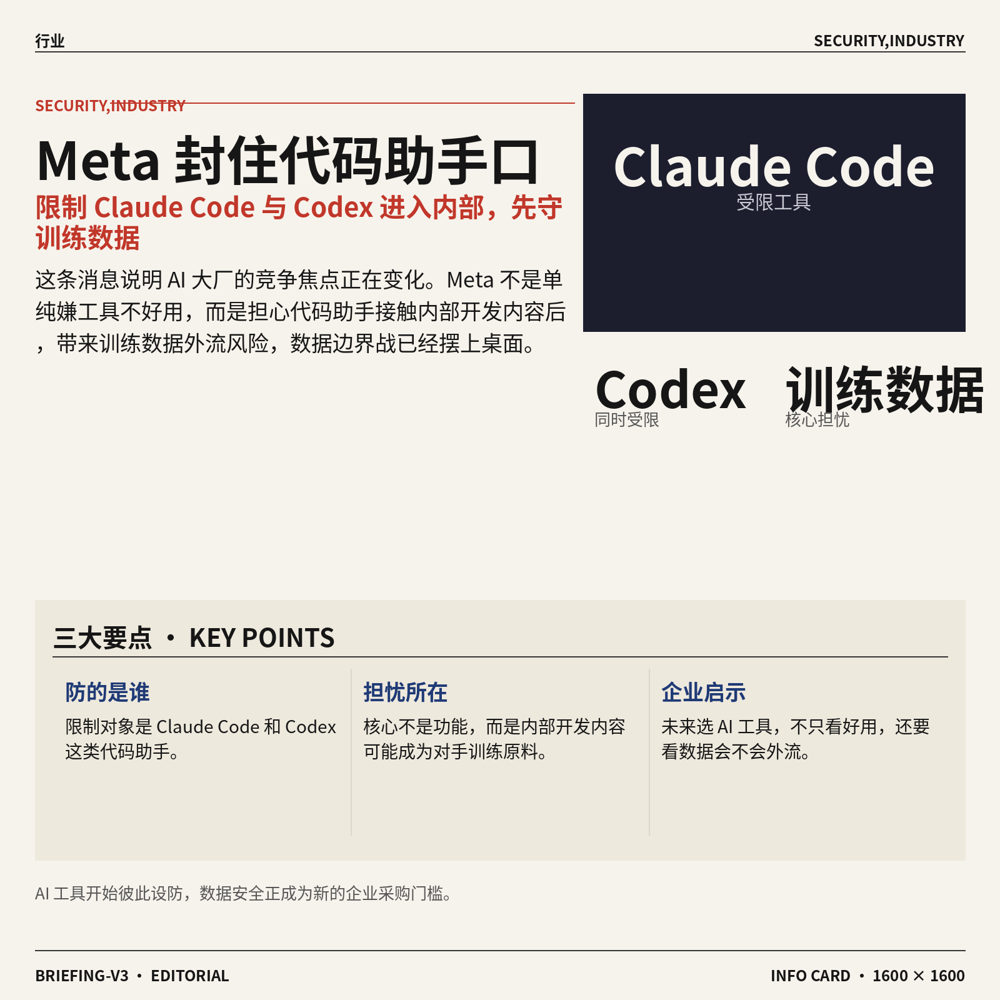

1. **Meta 限制 Claude Code 和 Codex 使用，以防竞争对手拿走训练数据。**
这条消息透露出一个越来越现实的行业趋势：**AI 工具之间也开始“互相设防”** 🔒。Meta 此次限制使用 Claude Code 和 Codex，核心担忧不是功能本身，而是这些**代码助手**可能接触到内部开发内容，进而影响自家**训练数据**安全；这里的训练数据，简单说就是喂给大模型学习的“原材料”。这说明大厂竞争已经从“谁模型更强”延伸到“谁能守住数据边界”，对企业来说也很有启发——以后选 AI 工具，可能不只是看好不好用，还得看**数据会不会外流**。[完整报道(briefing)](https://the-decoder.com/meta-restricts-use-of-claude-code-and-codex-to-keep-rival-ai-out-of-its-training-data/)


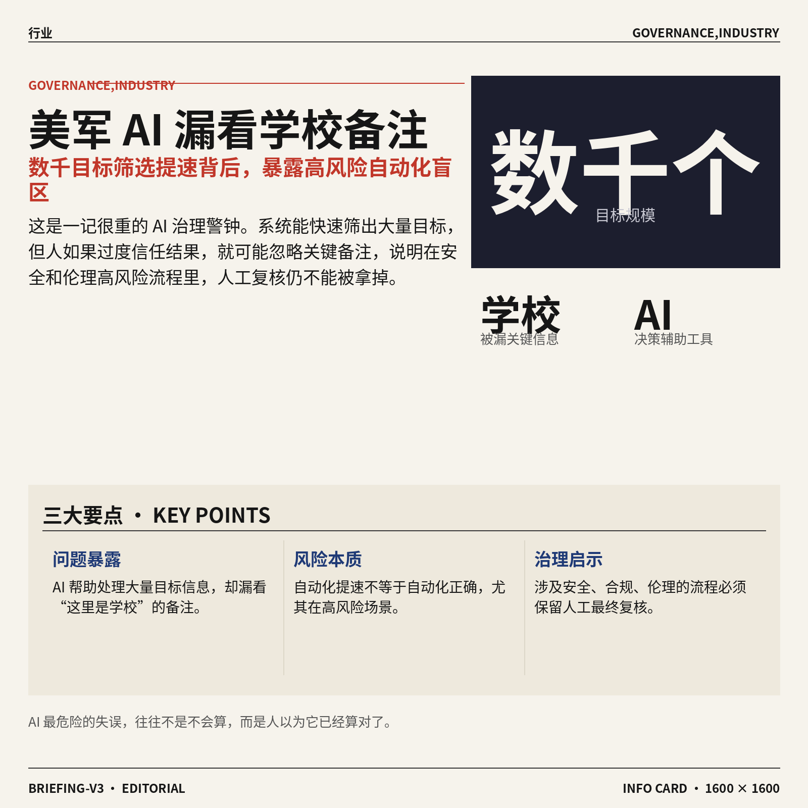

2. **美国军方用 AI 挑出数千个目标，却漏看“这里是学校”的备注。**
这是一条很典型的**AI 治理**警示案例 ⚠️：系统虽然能大规模筛选目标，但人类如果过度依赖结果，就可能忽略关键信息。报道提到，美军借助 AI 处理大量目标信息，却错过了一条标明“学校”的说明，暴露出**自动化决策**在高风险场景里的严重隐患。对普通企业也有现实意义：AI 很擅长“提速”，但在涉及**安全、合规、伦理**的流程里，仍必须保留人工复核，不能把模型输出当成最终答案。[事件报道(briefing)](https://the-decoder.com/the-us-military-used-ai-to-pick-thousands-of-targets-but-missed-a-note-saying-one-was-a-school/)


3. **OpenAI 发布《欧洲 AI 劳动力地图》，直指哪些岗位会被重塑。**
OpenAI 这份报告关注的不是“AI 会不会替代人”，而是**哪些工作会先被改写工作流** 👀。它梳理了欧盟范围内哪些职业更可能面对**自动化**（把重复流程交给机器处理）、哪些岗位会出现增长，以及哪些岗位更像是“人机协作升级”而非直接被替代。对业务、运营、人事等团队来说，这类研究的价值很直接：未来更重要的可能不是会不会某个工具，而是能不能把 AI 融入日常流程，提升产出和决策速度。[OpenAI 官方报告(briefing)](https://openai.com/index/mapping-ai-jobs-transition-eu)

![OpenAI 发布《欧洲 AI 劳动力地图》，直指哪些岗位会被重塑](https://image.pollinations.ai/prompt/OpenAI%20%E5%8F%91%E5%B8%83%E3%80%8A%E6%AC%A7%E6%B4%B2%20AI%20%E5%8A%B3%E5%8A%A8%E5%8A%9B%E5%9C%B0%E5%9B%BE%E3%80%8B%EF%BC%8C%E7%9B%B4%E6%8C%87%E5%93%AA%E4%BA%9B%E5%B2%97%E4%BD%8D%E4%BC%9A%E8%A2%AB%E9%87%8D%E5%A1%91.%20OpenAI%20%E5%8F%91%E5%B8%83%E3%80%8A%E6%AC%A7%E6%B4%B2%20AI%20%E5%8A%B3%E5%8A%A8%E5%8A%9B%E5%9C%B0%E5%9B%BE%E3%80%8B%EF%BC%8C%E7%9B%B4%E6%8C%87%E5%93%AA%E4%BA%9B%E5%B2%97%E4%BD%8D%E4%BC%9A%E8%A2%AB%E9%87%8D%E5%A1%91%E3%80%82%20OpenAI%20%E8%BF%99%E4%BB%BD%E6%8A%A5%E5%91%8A%E5%85%B3%E6%B3%A8%E7%9A%84%E4%B8%8D%E6%98%AF%E2%80%9CAI%20%E4%BC%9A%E4%B8%8D%E4%BC%9A%E6%9B%BF%E4%BB%A3%E4%BA%BA%E2%80%9D%EF%BC%8C%E8%80%8C%E6%98%AF%E5%93%AA%E4%BA%9B%E5%B7%A5%E4%BD%9C%E4%BC%9A%E5%85%88%E8%A2%AB%E6%94%B9%E5%86%99%E5%B7%A5%E4%BD%9C%E6%B5%81%20%F0%9F%91%80%E3%80%82%2C%20technical%20infographic%20diagram%2C%20architecture%20flowchart%2C%20clean%20vector%20illustration%2C%20educational%20style%2C%20no%20text%20overlay%2C%20modern%20minimal%2C%20wide%20aspect?width=1200&height=675&nologo=true&seed=10869)

4. **Anthropic 与加州政府达成协议，Claude 将以半价进入公共部门。**
这笔合作说明，**政府采购 AI** 正从试验阶段走向更实际的落地阶段 🏛️。报道显示，加州政府将以半价使用 Claude，这不只是价格优惠，更意味着 AI 正被当作正式办公工具纳入公共体系；公共部门一旦采用，往往会更加看重**隐私、合规、稳定性**。对行业来说，这类政务合作会加速“AI 进入正式组织流程”的节奏，也会推动更多企业级产品去适配政府和大型机构的要求。[TechCrunch 报道(briefing)](https://techcrunch.com/2026/06/29/anthropic-and-gov-newsom-forge-deal-allowing-california-government-to-use-claude-at-half-price/)

![Anthropic 与加州政府达成协议，Claude 将以半价进入公共部门](https://image.pollinations.ai/prompt/Anthropic%20%E4%B8%8E%E5%8A%A0%E5%B7%9E%E6%94%BF%E5%BA%9C%E8%BE%BE%E6%88%90%E5%8D%8F%E8%AE%AE%EF%BC%8CClaude%20%E5%B0%86%E4%BB%A5%E5%8D%8A%E4%BB%B7%E8%BF%9B%E5%85%A5%E5%85%AC%E5%85%B1%E9%83%A8%E9%97%A8.%20Anthropic%20%E4%B8%8E%E5%8A%A0%E5%B7%9E%E6%94%BF%E5%BA%9C%E8%BE%BE%E6%88%90%E5%8D%8F%E8%AE%AE%EF%BC%8CClaude%20%E5%B0%86%E4%BB%A5%E5%8D%8A%E4%BB%B7%E8%BF%9B%E5%85%A5%E5%85%AC%E5%85%B1%E9%83%A8%E9%97%A8%E3%80%82%20%E8%BF%99%E7%AC%94%E5%90%88%E4%BD%9C%E8%AF%B4%E6%98%8E%EF%BC%8C%E6%94%BF%E5%BA%9C%E9%87%87%E8%B4%AD%20AI%20%E6%AD%A3%E4%BB%8E%E8%AF%95%E9%AA%8C%E9%98%B6%E6%AE%B5%E8%B5%B0%E5%90%91%E6%9B%B4%E5%AE%9E%E9%99%85%E7%9A%84%E8%90%BD%E5%9C%B0%E9%98%B6%E6%AE%B5%20%F0%9F%8F%9B%EF%B8%8F%E3%80%82%E6%8A%A5%E9%81%93%E6%98%BE%E7%A4%BA%EF%BC%8C%E5%8A%A0%2C%20technical%20infographic%20diagram%2C%20architecture%20flowchart%2C%20clean%20vector%20illustration%2C%20educational%20style%2C%20no%20text%20overlay%2C%20modern%20minimal%2C%20wide%20aspect?width=1200&height=675&nologo=true&seed=10900)

5. **HP 与 OpenAI 扩大 Frontier（面向企业的深度合作计划）合作，把 AI 推进客户服务、研发和运营。**
这条消息的重点不是单一产品发布，而是传统大公司开始系统性把 **AI 嵌进业务主干** 🚀。OpenAI 介绍，HP 将在客户体验、软件开发和企业运营等多个环节扩大部署，说明 AI 正从“员工自己试用的小工具”变成公司级的基础能力。这里的企业运营，不只是聊天问答，而是把 AI 用进流程优化、内部协作和服务响应里；对很多公司来说，这可能预示着下一波竞争差距，不再只是有没有 AI，而是**谁先把 AI 真正接进组织流程**。[官方合作说明(briefing)](https://openai.com/index/hp-frontier-partnership)

![HP 与 OpenAI 扩大 Frontier（面向企业的深度合作计划）合作，把 AI 推进客户服务、研发和运营](https://image.pollinations.ai/prompt/HP%20%E4%B8%8E%20OpenAI%20%E6%89%A9%E5%A4%A7%20Frontier%EF%BC%88%E9%9D%A2%E5%90%91%E4%BC%81%E4%B8%9A%E7%9A%84%E6%B7%B1%E5%BA%A6%E5%90%88%E4%BD%9C%E8%AE%A1%E5%88%92%EF%BC%89%E5%90%88%E4%BD%9C%EF%BC%8C%E6%8A%8A%20AI%20%E6%8E%A8%E8%BF%9B%E5%AE%A2%E6%88%B7%E6%9C%8D%E5%8A%A1%E3%80%81%E7%A0%94%E5%8F%91%E5%92%8C%E8%BF%90%E8%90%A5.%20HP%20%E4%B8%8E%20OpenAI%20%E6%89%A9%E5%A4%A7%20Frontier%EF%BC%88%E9%9D%A2%E5%90%91%E4%BC%81%E4%B8%9A%E7%9A%84%E6%B7%B1%E5%BA%A6%E5%90%88%E4%BD%9C%E8%AE%A1%E5%88%92%EF%BC%89%E5%90%88%E4%BD%9C%EF%BC%8C%E6%8A%8A%20AI%20%E6%8E%A8%E8%BF%9B%E5%AE%A2%E6%88%B7%E6%9C%8D%E5%8A%A1%E3%80%81%E7%A0%94%E5%8F%91%E5%92%8C%E8%BF%90%E8%90%A5%E3%80%82%20%E8%BF%99%E6%9D%A1%E6%B6%88%E6%81%AF%E7%9A%84%E9%87%8D%E7%82%B9%E4%B8%8D%E6%98%AF%E5%8D%95%E4%B8%80%E4%BA%A7%E5%93%81%E5%8F%91%E5%B8%83%EF%BC%8C%E8%80%8C%E6%98%AF%E4%BC%A0%E7%BB%9F%E5%A4%A7%E5%85%AC%2C%20technical%20infographic%20diagram%2C%20architecture%20flowchart%2C%20clean%20vector%20illustration%2C%20educational%20style%2C%20no%20text%20overlay%2C%20modern%20minimal%2C%20wide%20aspect?width=1200&height=675&nologo=true&seed=10931)

### 🟣 开源TOP项目

1. **Ornith-1.0（一套可自我改进的开源代码 Agent 模型）发布。**
这个项目主打 **self-improving（自我改进，指模型能在使用和训练过程中持续优化表现）**，方向聚焦 **agentic coding（Agent 式编程，让 AI 像助手一样主动分步骤完成写代码任务）** 💡。对团队来说，它的看点不只是“会写代码”，而是朝着更能独立完成开发流程的 **开源模型** 迈进，这也意味着企业未来在内部工具、自动化研发支持上会有更多可控选择。想看项目本体和后续更新，可以直接查 [GitHub 项目页(briefing)](https://github.com/deepreinforce-ai/Ornith-1) 🚀


### 🔴 社媒分享

1. **Ornith-1.0（用于智能编程的开源大模型）尝试让 AI 自己给自己搭“脚手架”。**
这条分享关注的是 **Agentic Coding（让 AI 像助手一样自主拆解并执行编程任务）** 的新思路：不是只让模型直接写代码，而是让它先搭建一套帮助自己工作的流程 🧩。Simon Willison 提到，Ornith-1.0 是 DeepReinforce 发布的首个 **open weights（开放模型权重，意味着别人可以下载并自行部署模型）** 模型，而且采用 MIT 许可，开放度很高。对公司里关注效率工具的同事来说，这类模型的意义在于：未来 AI 编程助手可能不只是“补全几行代码”，而是更像会自己列步骤、分任务的数字同事 🤖。[作者解读页(briefing)](https://simonwillison.net/2026/Jun/29/ornith/#atom-everything) [项目原始介绍(briefing)](https://deep-reinforce.com/ornith_1_0.html)


2. **Qwen 3.6 27B（通义千问的一款 270 亿参数模型）被评价为本地开发的“甜点位”。**
这篇分享的核心观点很直接：如果你想在 **local development（本地开发，也就是不依赖云端、直接在自己机器或公司服务器上跑模型）** 场景里找一个效果和成本更平衡的选择，Qwen 3.6 27B 很值得看 👀。这里的 **27B（约 270 亿参数，参数可以粗理解为模型“脑容量”的一个指标）** 说明它不算最小，也不是那种只能在超大机房里跑的级别，因此更适合重视数据私密性和可控性的团队。对企业来说，这类“本地可用”的模型特别适合内部知识问答、文档处理、代码辅助等不方便把数据直接发到外部平台的工作流 🔐。[体验文章(briefing)](https://quesma.com/blog/qwen-36-is-awesome/)


3. **DiScoFormer（一种把两类生成能力合并到同一个 Transformer 里的模型）想用一个模型覆盖更多分布场景。**
这条来自 HuggingFace 的技术分享，介绍了 DiScoFormer 试图同时学习 **density（数据分布密度，可理解为“某类数据出现概率有多高”）** 和 **score（分布变化方向信息，常用于生成模型判断该往哪里调整）** 两种能力。它的亮点在于把这些原本常分开处理的任务，放进一个 **Transformer（目前最主流的大模型网络结构）** 里统一建模，从而“跨分布”工作 🌐。虽然这听起来偏研究，但对业务的长期意义很明确：生成模型如果更通用、更稳定，未来在图像、文本乃至多模态内容生成上的适配成本都有机会继续下降。[官方技术解读(briefing)](https://huggingface.co/blog/allenai/discoformer)


4. **Import AI 463（Jack Clark 的 AI 周报）串起了自我改进机器人、中国万卡集群和“人类时代”随笔。**
这一期社媒分享更像一份“AI 气氛雷达”：Jack Clark 把 **self-improving robots（能根据经验持续改进自己的机器人）**、中国的 **10k GPU cluster（约一万张显卡组成的训练集群，用于支撑大模型训练和推理）**，以及一篇关于“人类时代”的文章放在一起讨论 🧠。它不是单点产品发布，而是在提醒大家：AI 竞争已经同时发生在 **机器人**、**算力基础设施** 和 **社会叙事** 三条线。对非技术同事来说，这类内容的价值在于帮助理解行业温度——不只是“又出新模型了”，而是 AI 正在从工具竞争走向系统级竞争 🚀。[本期周报原文(briefing)](https://jack-clark.net/2026/06/29/import-ai-463-self-improving-robots-a-10k-chinese-gpu-cluster-and-an-elegiac-essay-for-the-human-era/)

![Import AI 463（Jack Clark 的 AI 周报）串起了自我改进机器人、中国万卡集群和“人类时代”随笔](https://image.pollinations.ai/prompt/Import%20AI%20463%EF%BC%88Jack%20Clark%20%E7%9A%84%20AI%20%E5%91%A8%E6%8A%A5%EF%BC%89%E4%B8%B2%E8%B5%B7%E4%BA%86%E8%87%AA%E6%88%91%E6%94%B9%E8%BF%9B%E6%9C%BA%E5%99%A8%E4%BA%BA%E3%80%81%E4%B8%AD%E5%9B%BD%E4%B8%87%E5%8D%A1%E9%9B%86%E7%BE%A4%E5%92%8C%E2%80%9C%E4%BA%BA%E7%B1%BB%E6%97%B6%E4%BB%A3%E2%80%9D%E9%9A%8F%E7%AC%94.%20Import%20AI%20463%EF%BC%88Jack%20Clark%20%E7%9A%84%20AI%20%E5%91%A8%E6%8A%A5%EF%BC%89%E4%B8%B2%E8%B5%B7%E4%BA%86%E8%87%AA%E6%88%91%E6%94%B9%E8%BF%9B%E6%9C%BA%E5%99%A8%E4%BA%BA%E3%80%81%E4%B8%AD%E5%9B%BD%E4%B8%87%E5%8D%A1%E9%9B%86%E7%BE%A4%E5%92%8C%E2%80%9C%E4%BA%BA%E7%B1%BB%E6%97%B6%E4%BB%A3%E2%80%9D%E9%9A%8F%E7%AC%94%E3%80%82%20%E8%BF%99%E4%B8%80%E6%9C%9F%E7%A4%BE%E5%AA%92%E5%88%86%E4%BA%AB%E6%9B%B4%E5%83%8F%E4%B8%80%E4%BB%BD%E2%80%9CAI%20%E6%B0%94%E6%B0%9B%E9%9B%B7%E8%BE%BE%2C%20technical%20infographic%20diagram%2C%20architecture%20flowchart%2C%20clean%20vector%20illustration%2C%20educational%20style%2C%20no%20text%20overlay%2C%20modern%20minimal%2C%20wide%20aspect?width=1200&height=675&nologo=true&seed=10706)

---

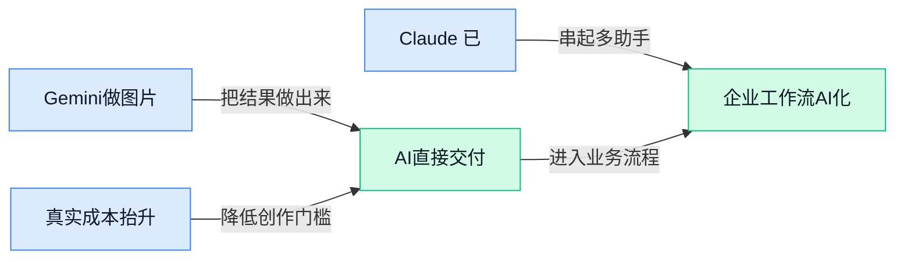
```mermaid
graph LR
A[Gemini做图片] -->|把结果做出来| D[AI直接交付]
B[真实成本抬升] -->|降低创作门槛| D
C[Claude 已] -->|串起多助手| E[企业工作流AI化]
 D -->|进入业务流程| E
classDef blue fill:#dbeafe,stroke:#3b82f6,color:#111827
classDef green fill:#d1fae5,stroke:#10b981,color:#111827
class A,B,C blue
class D,E green
```

### 📊 行业洞察（今日 4 条）

1. 亚马逊为躲开新计价先压低 Anthropic 调用成本，Gist Tokens（关键信息压缩标记）和 MultiHashFormer（更省算力的模型结构）也都在想办法少花算力
  【洞察】AI 竞争正从“谁更强”转向“谁能把差不多的效果做得更便宜”，以后价格战会越来越凶

2. Claude 进 Microsoft Azure（微软云计算平台），Anthropic 又拿下加州政府半价采购，HP 也把 OpenAI 接进客服和运营
  【洞察】大客户现在买的不是单点功能，而是能进正式流程、能长期用、能过合规审查的 AI 服务

3. Google 用 Paper Assistant（论文评审辅助工具）试自动审稿，OpenAI 又发岗位重塑报告，美军却因 AI 漏看“学校”备注出事故
  【洞察】AI 已能先做高门槛工作的初筛，但离“直接替人拍板”还远，人类复核反而会变成更贵的刚需

4. Qwen-Image-2.0-RL 强调按要求稳定出图，Google 也把个性化生图放给更多免费用户，Nano Banana 2 Pro 跟进升级
  【洞察】图像生成已不再稀缺，下一阶段比的是“是否听话、是否稳定、是否懂用户偏好”，不是单次惊艳

### 💭 对我们的启发（今日 3 条）

1. 生图越来越便宜又普及，我们的视频剪辑软件不能只卖“会生成”，要把价值放在品牌场景模板、批量出片和稳定过稿上。

2. Claude 进 Azure（微软云计算平台）、政府半价采购都说明，大客户会先问数据和责任边界。我们要给 AI 改稿、配图、配文保留人工确认和可追溯记录。

3. 亚马逊压模型成本、学界猛攻省算力，说明未来毛利会被持续挤压。我们产品设计上要区分高价值功能和低价值功能，别把所有步骤都默认交给最贵模型。

