## AI资讯日报 2026/7/3

> AI 早报 · 每日早读 · 全网深度聚合

## **今日摘要**

```
Anthropic 发布 Claude Sonnet 5，Claude Code 系统提示词砍掉 80%
微软 Frontier Company（企业AI落地）投 25 亿美元，英伟达推收入分成
美国持有 OpenAI 股权，Meta 转向 Neocloud（新型云算力）震撼市场
```

### 🔵 产品与功能更新

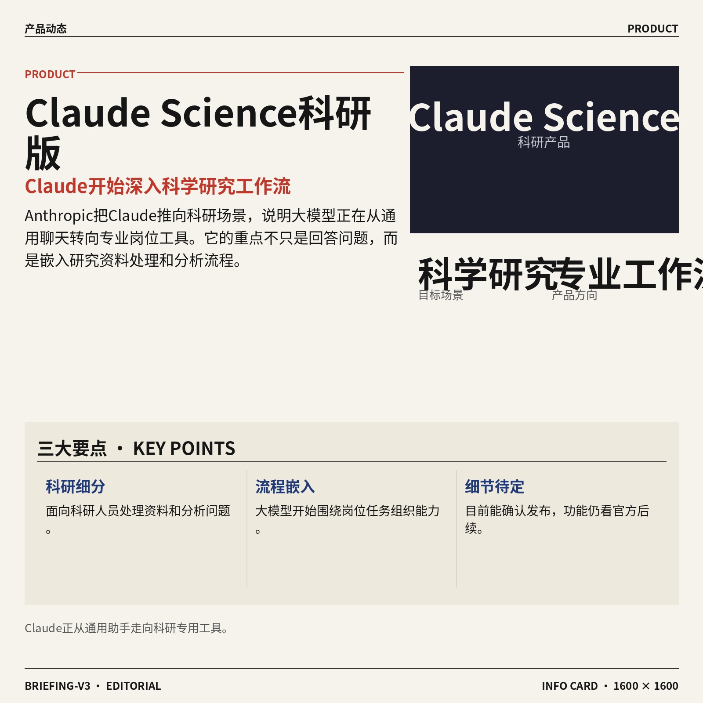

1. **Anthropic 推出 Claude Science（面向科研场景的 Claude 产品/功能）。**  
报道标题显示，Anthropic 正在把 Claude 往**科学研究**方向继续细分，推出 Claude Science（面向科研人员处理研究资料、问题分析等工作的 Claude 产品/功能）🚀。这类产品更新的意义在于，大模型不再只是通用聊天工具，而是开始进入更具体的**专业工作流**（围绕某类岗位日常任务组织起来的一整套操作流程）💡。不过原始摘要信息较少，目前能确认的是“发布”这一动作，具体功能细节仍需以后续官方信息为准。[产品动态报道(briefing)](https://news.google.com/rss/articles/CBMizgFBVV95cUxOUTJ6cVQ1Y1FTaEI3MHpwc1FTdENPcElQeElMcHM0VXJrZWI5blFvbFAxVVdVUU1lTzdBeHFQMTJKR1JTQnUtZ1Z6TmFCQklfQlBXNi1LX2NfVUx0WG94a1BnYWNzQkZoMXRuREtEeHk0eWhzMkhOajNKRUd6RUkyUW5rWDNDWWVnbF9Kb3BvWkYxRnJjUENtZzRCc0RNX2VKd0R3bVl6QUM4ck9jcHRSQnVXM3V5RHNwQ1hnd0NMblJ6cnJVcDd4bGh3WVI1Zw?oc=5)


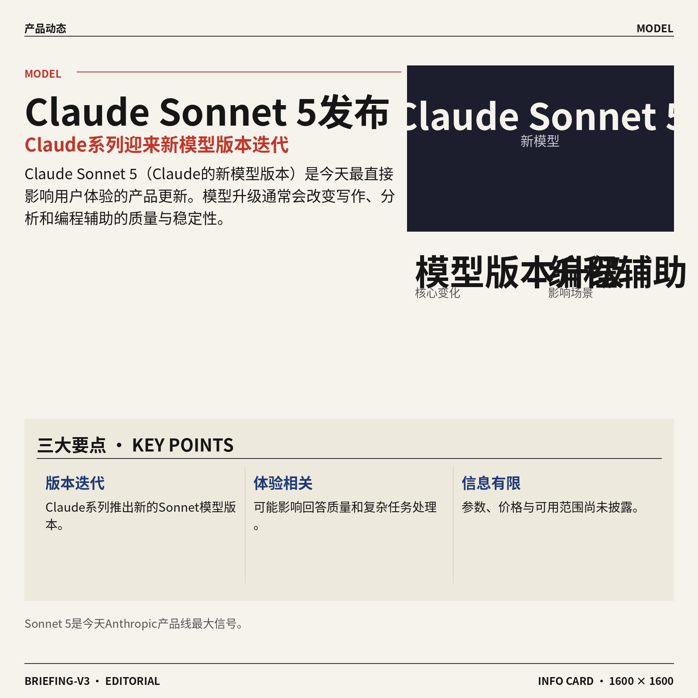

2. **Anthropic 发布 Claude Sonnet 5（Claude 的新模型版本）。**  
另一条报道指向 Anthropic 推出 Claude Sonnet 5（Claude 系列里的一个新模型版本，通常代表能力、速度或使用体验的迭代）⚡。对普通用户来说，**模型版本升级**（像手机系统更新一样，可能影响回答质量、处理复杂任务的能力和稳定性）往往会直接改变日常写作、分析、编程辅助等体验。当前候选材料只给出了发布标题，没有展开参数、价格或可用范围，所以这里不额外推断功能细节。[模型发布报道(briefing)](https://news.google.com/rss/articles/CBMiZEFVX3lxTE5aODRoRWZrWG93bTh4YlZIcUJCNUc0YUtOb2N4bGNIZDNPR0hNQzczOWJSUDM4QmhDR1NMcllOQkxka2l2c3V0a1pZYnZlNGdnTlBKMjlGV0ZVVmlJcXFhckZmLWTSAWpBVV95cUxPVUVGbE00N09jUlgtQ2NUcThpbW16eHFhZFdGSkVnUUJPM0tEOXNfSXBKR3BnMEk1MjdlRkVrMzdmQWVQVTBSb3dXWExaS0J5NmRYX093cGNRRXpzVHQxZVFQcnNfdm5Dckxn?oc=5)


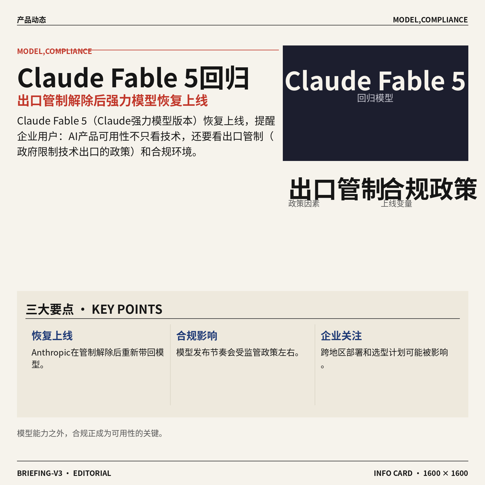

3. **Anthropic 在美国出口管制解除后恢复 Claude Fable 5（Claude 的强力模型版本）。**  
报道标题称，Anthropic 在美国**出口管制**（政府限制某些高端技术或产品向特定地区提供的政策）解除后，重新带回 Claude Fable 5（Claude 系列中的一个强力模型版本）🔁。这说明大模型产品的上线节奏，不只取决于技术本身，也会受到**合规政策**（企业必须遵守的法律和监管要求）的影响。对企业用户来说，这类变化值得关注，因为模型是否可用、何时可用，可能会影响内部工具选型和跨地区部署计划。[恢复上线报道(briefing)](https://news.google.com/rss/articles/CBMiwgFBVV95cUxNeFIxQnNXbFRuQndfdXNvRlA3S0lkYzlfWHBSU01hcTJnWjd5ZFpjZ1d4QmhvenJsTlUtRVB2TkY3M3JxZWdSXzJmd2NacHk5OFBjdlhPQ3o3a1pQVERyNlpNbFRodG9oSmI5N0YwREJhVVRhenVxUndLRHl6dmFTajVjLUx1bWNaLWZlOEF2UkZlY3BRVzROUTNwSVM4ODlUNkN0NjNyNUVjWWVrTjF2bDkxN01BMXNzSk55dzhuS2loZ9IBxwFBVV95cUxNSEVCUFExUkJLWERNZlZsaWtKTFBWSTNSQUY4eDBXdnV6aHl6N3RKQmRVWFA2YTlWaDd4OUp2ZnJqR1U3Nmt4cEVzalNLRUlMV3EtSGJMYlg5b2dvX2tiYnlPUlYwdUFVOENOcDNoYmljYnRzX3gtZnVSdnBjZ2V5R0NJSlBONUxXWUVPRWNSQVpUYlBXdzZKQnlWTmhUYnNLQ01ZbGRtVjV1amhOTkp1ZW9xZm5EdFZtZFFMaFBrRzNpeF9tZ1g4?oc=5)


### 🟢 前沿研究

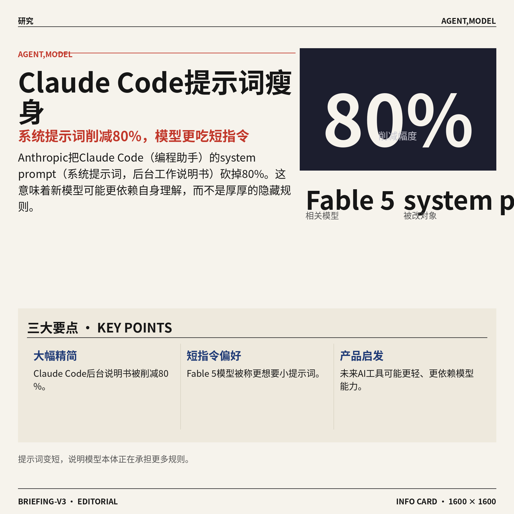

1. **Anthropic 为 Claude Code 精简 80% 系统提示词，称 Fable 5（Anthropic 提到的一组新模型代号）更偏好短指令。**  
Anthropic 表示，它把 Claude Code 的 **system prompt（系统提示词，写给 AI 的“后台工作说明书”，决定它该怎么理解任务和遵守规则）** 削减了 **80%** 🚀。原因是 Fable 5（Anthropic 提到的一组新模型代号）模型“想要更小的系统提示词”，这说明新模型可能不再需要那么厚的操作手册也能稳定工作。对业务同事来说，这类变化意味着未来 AI 工具可能更轻、更快，也更依赖模型本身的理解能力，而不是靠一大堆隐藏规则硬控 💡。[完整报道(briefing)](https://the-decoder.com/anthropic-says-it-cut-80-percent-of-claude-codes-system-prompt-because-fable-5-models-want-a-smaller-system-prompt/)


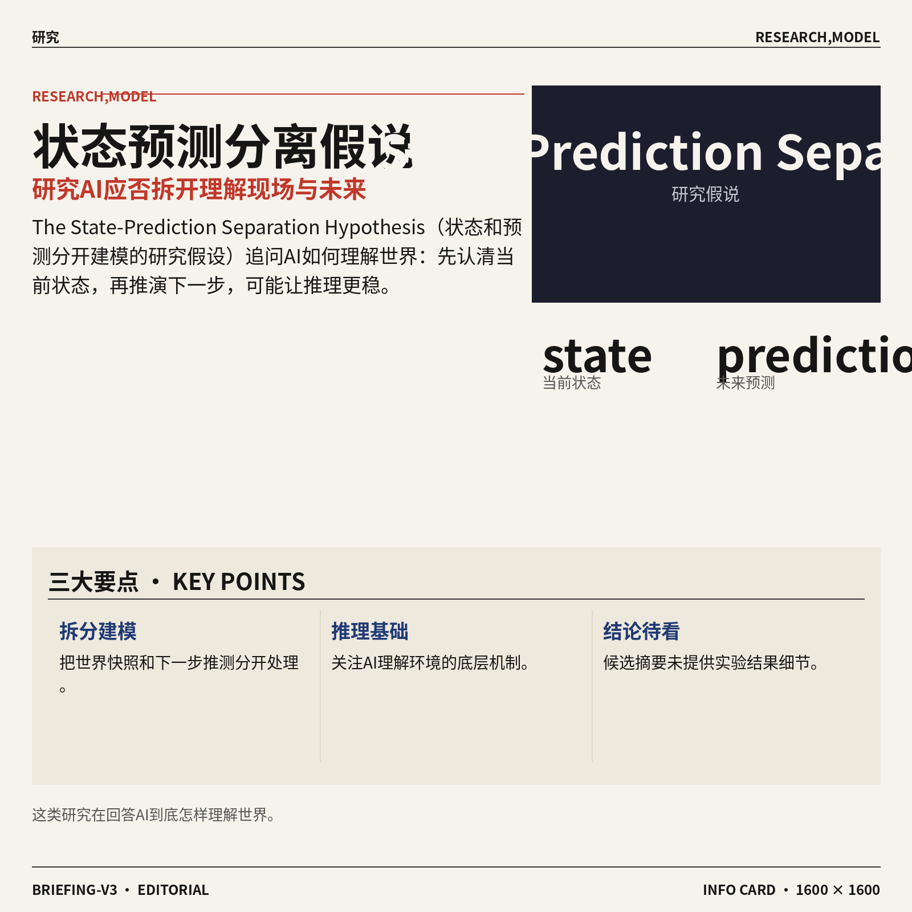

2. **The State-Prediction Separation Hypothesis（“状态”和“预测”应分开建模的研究假设）关注 AI 如何理解世界。**  
这篇论文题为 **The State-Prediction Separation Hypothesis（“状态”和“预测”应分开建模的研究假设）**，核心指向一个很基础但重要的问题：AI 是不是应该把“当前世界是什么样”和“接下来会发生什么”分开处理 🤔。这里的 **state（状态，像系统当前的现场快照）** 和 **prediction（预测，基于现场快照推测下一步）**，如果能拆清楚，可能会帮助模型更稳地做推理。候选摘要只提供了题名，因此这里不展开实验结论，但它属于偏底层的 AI 认知与建模研究 💡。[论文页面(briefing)](https://huggingface.co/papers/2607.01218)


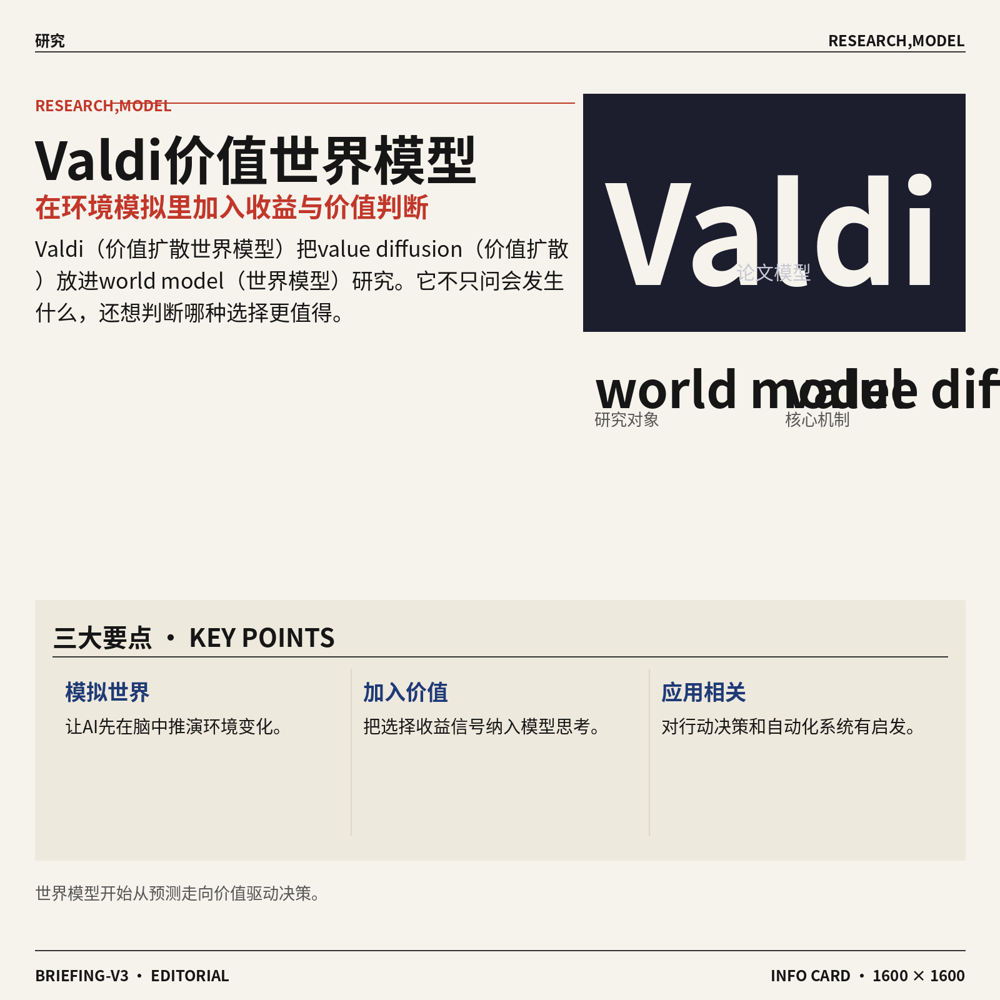

3. **Valdi（价值扩散世界模型）把“价值判断”放进世界模型研究。**  
**Valdi（价值扩散世界模型）** 这篇论文聚焦 **world model（世界模型，让 AI 在脑中模拟环境变化，类似先“想一遍”再行动）** 🚀。标题里的 **value diffusion（价值扩散，把“什么选择更值得”这类信号逐步传播开）**，暗示研究重点是让模型在模拟世界时也能考虑价值或收益。对普通读者可以理解为：它不是只问“会发生什么”，还想问“哪种走法更划算” 💡。候选摘要仅给出题名，具体方法和效果需看论文原文。[论文页面(briefing)](https://huggingface.co/papers/2607.00917)


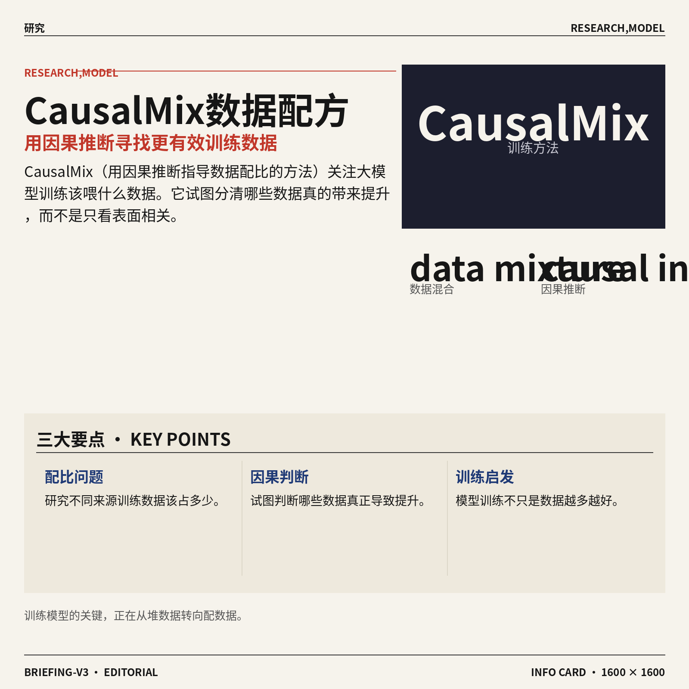

4. **CausalMix（用因果推断指导数据配比的方法）探索语言模型训练该喂什么数据。**  
**CausalMix（用因果推断指导数据配比的方法）** 关注的是大模型训练里的 **data mixture（数据混合，决定训练时不同来源数据各占多少比例）** 问题 📊。标题中的 **causal inference（因果推断，用来判断“到底是什么导致了结果变化”，而不只是看到相关性）**，说明它试图更科学地判断哪些数据组合真正提升模型。对行业的意义很直接：训练模型不是“数据越多越好”，还要知道哪些数据更有用、怎么搭配更合适 💡。候选摘要只提供题名，因此不额外推断实验表现。[论文页面(briefing)](https://huggingface.co/papers/2607.01104)

![CausalMix（用因果推断指导数据配比的方法）探索语言模型训练该喂什么数据](https://image.pollinations.ai/prompt/CausalMix%EF%BC%88%E7%94%A8%E5%9B%A0%E6%9E%9C%E6%8E%A8%E6%96%AD%E6%8C%87%E5%AF%BC%E6%95%B0%E6%8D%AE%E9%85%8D%E6%AF%94%E7%9A%84%E6%96%B9%E6%B3%95%EF%BC%89%E6%8E%A2%E7%B4%A2%E8%AF%AD%E8%A8%80%E6%A8%A1%E5%9E%8B%E8%AE%AD%E7%BB%83%E8%AF%A5%E5%96%82%E4%BB%80%E4%B9%88%E6%95%B0%E6%8D%AE.%20CausalMix%EF%BC%88%E7%94%A8%E5%9B%A0%E6%9E%9C%E6%8E%A8%E6%96%AD%E6%8C%87%E5%AF%BC%E6%95%B0%E6%8D%AE%E9%85%8D%E6%AF%94%E7%9A%84%E6%96%B9%E6%B3%95%EF%BC%89%E6%8E%A2%E7%B4%A2%E8%AF%AD%E8%A8%80%E6%A8%A1%E5%9E%8B%E8%AE%AD%E7%BB%83%E8%AF%A5%E5%96%82%E4%BB%80%E4%B9%88%E6%95%B0%E6%8D%AE%E3%80%82%20CausalMix%EF%BC%88%E7%94%A8%E5%9B%A0%E6%9E%9C%E6%8E%A8%E6%96%AD%E6%8C%87%E5%AF%BC%E6%95%B0%E6%8D%AE%E9%85%8D%E6%AF%94%E7%9A%84%E6%96%B9%E6%B3%95%EF%BC%89%20%E5%85%B3%E6%B3%A8%E7%9A%84%E6%98%AF%E5%A4%A7%E6%A8%A1%E5%9E%8B%E8%AE%AD%E7%BB%83%E9%87%8C%E7%9A%84%20d%2C%20technical%20infographic%20diagram%2C%20architecture%20flowchart%2C%20clean%20vector%20illustration%2C%20educational%20style%2C%20no%20text%20overlay%2C%20modern%20minimal%2C%20wide%20aspect?width=1200&height=675&nologo=true&seed=10900)

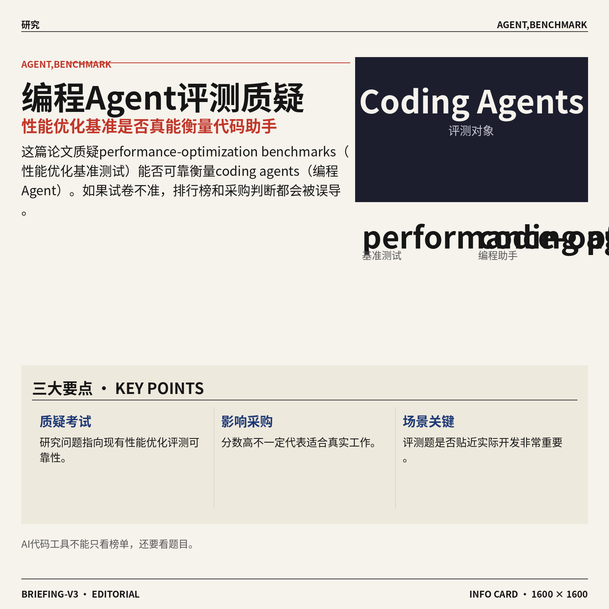

5. **Are Performance-Optimization Benchmarks Reliably Measuring Coding Agents?（性能优化测试能否可靠评估编程 Agent）质疑现有评测。**  
这篇论文直接追问：**performance-optimization benchmarks（性能优化基准测试，用固定任务衡量代码提速能力的考试）** 是否真的能可靠衡量 **coding agents（编程 Agent，能自动读写和修改代码的 AI 助手）** 🧪。这个问题很关键，因为如果“考试卷”本身不准，工具排行榜和采购判断都可能被误导。对非技术团队来说，可以把它理解为：不是 AI 分数高就一定适合真实工作，还要看评测题是否贴近实际场景 💡。候选摘要只有题名，因此这里重点说明研究问题本身。[论文页面(briefing)](https://huggingface.co/papers/2607.01211)


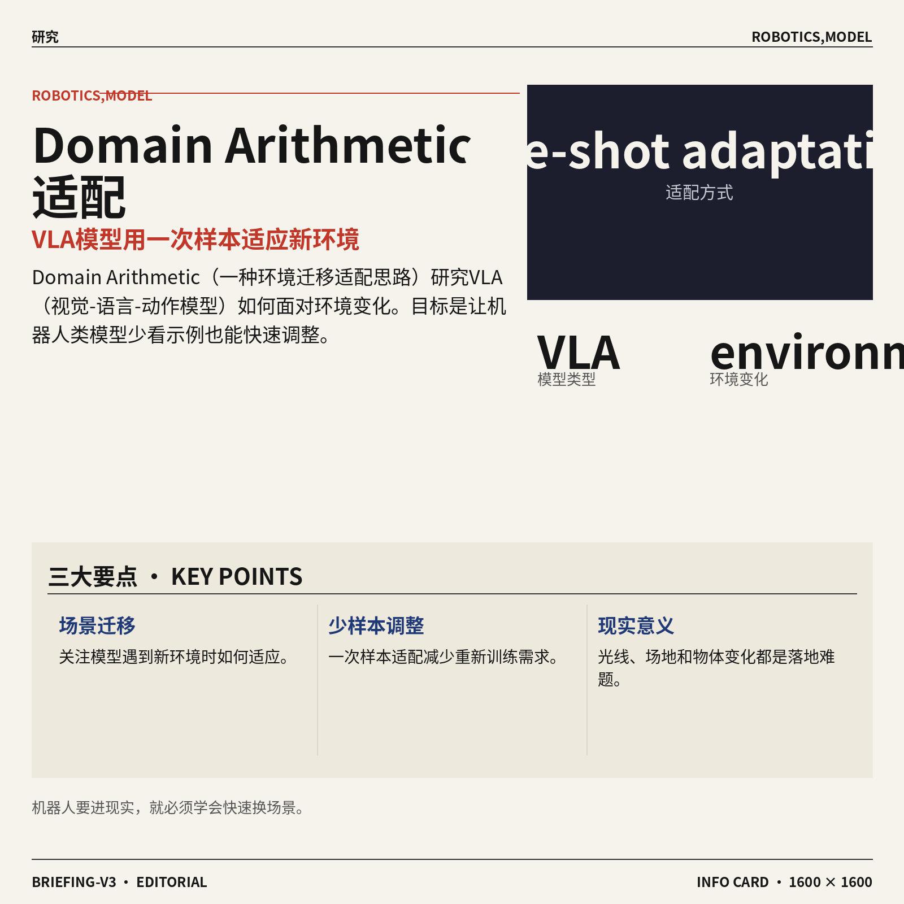

6. **Domain Arithmetic（一种环境迁移适配思路）研究 VLA（视觉-语言-动作模型）如何快速适应新场景。**  
**Domain Arithmetic（一种环境迁移适配思路）** 这篇论文关注 **VLA（视觉-语言-动作模型，让机器同时看画面、听懂指令并执行动作）** 在环境变化下的适应能力 🤖。标题里的 **one-shot adaptation（一次样本适配，只看很少示例就调整到新场景）**，说明研究目标是让模型遇到新环境时不用大量重新训练。**environmental shifts（环境变化，比如光线、场地、物体摆放变了）** 是机器人和现实应用里很常见的难题，所以这类研究和未来自动化设备落地有关 💡。候选摘要仅提供题名，具体实验设置需看论文。[论文页面(briefing)](https://huggingface.co/papers/2607.00666)


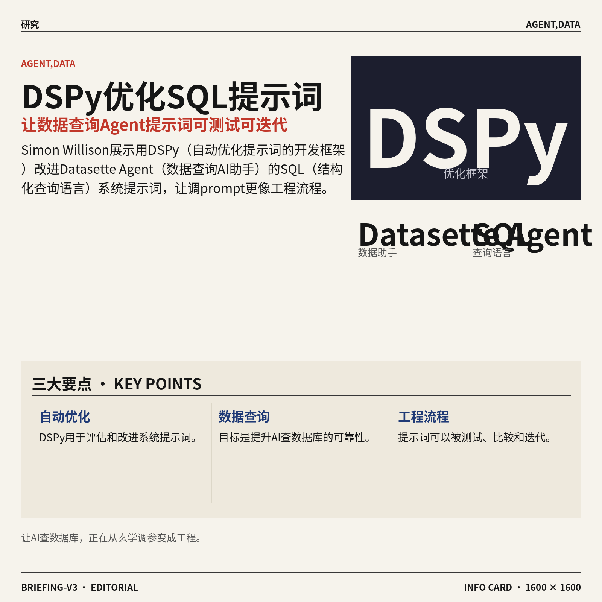

7. **DSPy（自动优化提示词的开发框架）被用于改进 Datasette Agent（面向数据查询的 AI 助手）的 SQL 提示词。**  
Simon Willison 的研究记录展示了如何用 **DSPy（帮助开发者自动评估和优化提示词的框架）** 来评估并改进 **Datasette Agent（围绕 Datasette 数据工具构建的 AI 助手）** 的 **SQL（结构化查询语言，用来从数据库里查数据）** 系统提示词 🛠️。这里的 **system prompt（系统提示词，AI 背后的行为说明书）** 不是随手写几句，而是可以被测试、比较和迭代。对运营、财务、分析同事来说，这类工作意味着未来“让 AI 查数据库”会更像可验证流程，而不是纯靠感觉调 prompt 💡。[研究记录(briefing)](https://simonwillison.net/2026/Jul/2/dspy-datasette-agent-prompts/#atom-everything)


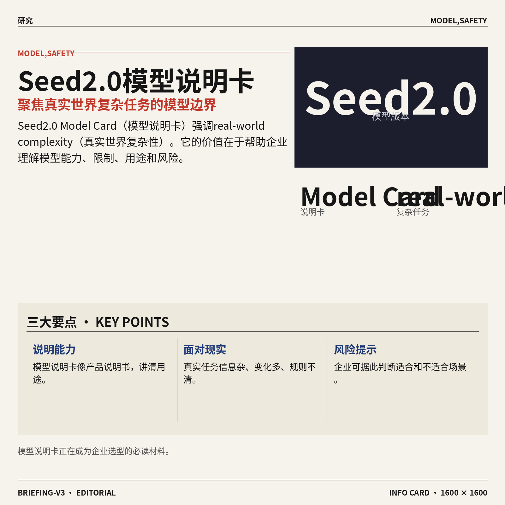

8. **Seed2.0 Model Card（模型说明卡）瞄准真实世界复杂任务的智能前沿。**  
**Seed2.0 Model Card（模型说明卡，像产品说明书一样介绍模型能力、限制和用途）** 的标题指向“面向真实世界复杂性”的智能前沿 🌍。这里的 **real-world complexity（真实世界复杂性，指现实任务里信息杂、变化多、规则不总是清楚）**，正是大模型从演示走向业务落地时必须面对的问题。**model card（模型说明卡）** 对企业也很实用，因为它通常帮助使用者理解模型适合做什么、不适合做什么、风险在哪里 💡。候选摘要仅给出题名，因此不补充未披露的参数、成绩或发布细节。[论文页面(briefing)](https://huggingface.co/papers/2607.00248)


### 🟡 行业展望与社会影响

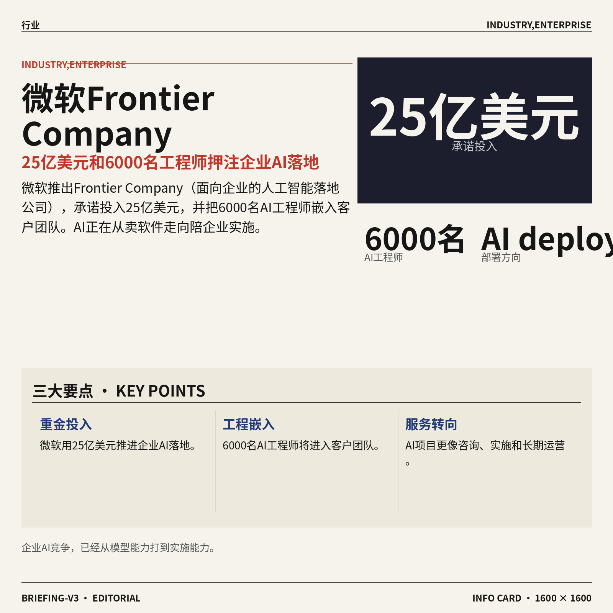

1. **微软推出 Frontier Company（面向企业的人工智能落地公司），承诺投入 25 亿美元。**  
微软正在把**人工智能落地**从“卖工具”推进到“派人进企业一起做”的阶段：新公司将投入 **25 亿美元**，并计划把 **6000 名人工智能工程师**嵌入企业客户团队 🚀。这里的 **AI deployment（人工智能部署，把模型真正接入业务流程并跑起来）**，重点不是炫技，而是帮助公司把内部系统、员工流程和智能工具打通。对企业来说，这意味着人工智能项目可能更像咨询、实施和长期运营服务，而不是单次购买软件。[TechCrunch 报道(briefing)](https://techcrunch.com/2026/07/02/microsoft-launches-its-own-ai-deployment-company-with-2-5-billion-commitment/) [The Decoder 详情(briefing)](https://the-decoder.com/microsoft-launches-2-5-billion-frontier-company-to-embed-6000-ai-engineers-inside-enterprise-clients/)


2. **Anthropic 探索与三星定制芯片合作，但仍强调英伟达重要。**  
Anthropic 据称正在研究与三星合作做**定制芯片**，这说明大模型公司不只在拼模型，也在往底层硬件供应链延伸 ⚙️。所谓 **custom chip（定制芯片，按自家模型需求设计的专用计算芯片）**，目标通常是让训练和运行模型更可控、更匹配自身业务。与此同时，报道也提到 Anthropic 仍强调英伟达的重要性，说明短期内 **GPU（图形处理器，大模型训练和推理最常用的高性能计算芯片）** 仍是行业核心资源。[芯片合作报道(briefing)](https://the-decoder.com/anthropic-reportedly-explores-custom-chip-manufacturing-with-samsung-while-insisting-nvidia-still-matters/)


3. **AI Agent（能代办任务的人工智能助手）开始触碰隐私法律红线。**  
路透社关注的场景很现实：AI Agent 可能会读取邮件、处理文件，甚至替用户提交理赔申请 😶。这里的 **AI Agent（能理解目标并调用工具完成任务的人工智能助手）**，比普通聊天机器人更进一步，因为它可能直接操作个人资料和业务流程。问题也随之变尖锐：如果它“没明确问你就行动”，责任、授权和隐私边界该怎么算？这类讨论会影响未来办公助手、保险、金融、人事系统的产品设计。[路透社隐私分析(briefing)](https://news.google.com/rss/articles/CBMi1AFBVV95cUxPOEc3Ul94a1JmZWdWV01ONWlMS0c4MUJvdWJjSUhYVWhjZVBTM2htVFZfcS1oczZGS1RIMnJLYXNWM2NWYU1fMlVDMDM2aHVJQXdNWG5RZ2tTSkNxYU1LNXpwZk9qeUNYdTlOc2MxUFBDN2F6cThIUFNJRmNPRmVzQ21FQUFnZGVXYVQ3OHRId19zWFdEYnJXUTJIeHpEU0Fac0VzZjlBenVMTjJxOHlJLVVHSnlTcHpLdlk2X1dFOGFWTUxvN3lJc1prdEN3ZHRIVjNYNg?oc=5)

![AI Agent（能代办任务的人工智能助手）开始触碰隐私法律红线](https://image.pollinations.ai/prompt/AI%20Agent%EF%BC%88%E8%83%BD%E4%BB%A3%E5%8A%9E%E4%BB%BB%E5%8A%A1%E7%9A%84%E4%BA%BA%E5%B7%A5%E6%99%BA%E8%83%BD%E5%8A%A9%E6%89%8B%EF%BC%89%E5%BC%80%E5%A7%8B%E8%A7%A6%E7%A2%B0%E9%9A%90%E7%A7%81%E6%B3%95%E5%BE%8B%E7%BA%A2%E7%BA%BF.%20AI%20Agent%EF%BC%88%E8%83%BD%E4%BB%A3%E5%8A%9E%E4%BB%BB%E5%8A%A1%E7%9A%84%E4%BA%BA%E5%B7%A5%E6%99%BA%E8%83%BD%E5%8A%A9%E6%89%8B%EF%BC%89%E5%BC%80%E5%A7%8B%E8%A7%A6%E7%A2%B0%E9%9A%90%E7%A7%81%E6%B3%95%E5%BE%8B%E7%BA%A2%E7%BA%BF%E3%80%82%20%E8%B7%AF%E9%80%8F%E7%A4%BE%E5%85%B3%E6%B3%A8%E7%9A%84%E5%9C%BA%E6%99%AF%E5%BE%88%E7%8E%B0%E5%AE%9E%EF%BC%9AAI%20Agent%20%E5%8F%AF%E8%83%BD%E4%BC%9A%E8%AF%BB%E5%8F%96%E9%82%AE%E4%BB%B6%E3%80%81%E5%A4%84%E7%90%86%E6%96%87%E4%BB%B6%EF%BC%8C%E7%94%9A%E8%87%B3%E6%9B%BF%E7%94%A8%E6%88%B7%E6%8F%90%E4%BA%A4%E7%90%86%E8%B5%94%E7%94%B3%E8%AF%B7%2C%20technical%20infographic%20diagram%2C%20architecture%20flowchart%2C%20clean%20vector%20illustration%2C%20educational%20style%2C%20no%20text%20overlay%2C%20modern%20minimal%2C%20wide%20aspect?width=1200&height=675&nologo=true&seed=10869)

4. **英伟达推出面向人工智能创业公司的 revenue-sharing model（收入分成模式）。**  
英伟达据称推出面向人工智能创业公司的**收入分成模式**，这让算力供应商和创业公司之间的关系更像“共同押注” 🤝。所谓 **revenue-sharing model（收入分成模式，先提供资源或合作支持，再按未来收入分账）**，可能降低早期公司一次性付费压力。对行业来说，这反映出人工智能创业的关键门槛不只是模型创意，还有 **compute（算力，运行和训练模型所需的计算资源）** 获取方式。[Quartz 报道(briefing)](https://news.google.com/rss/articles/CBMiekFVX3lxTE1QU2pTRHg1RWx0X2x0RzVvMjNtdXpzbmpibUdHRTJMRjhIUTMtUUdQUjFWVHFKUnh3eTNwTGZZNURyTkdrRmhreFVPZkIxV1JhMjAwbC1uTjI4WFlaanphd25hZUxNRVplVUI3VFZlU1ZTTWd1Z0cwVjZ3?oc=5)

![英伟达推出面向人工智能创业公司的 revenue-sharing model（收入分成模式）](https://image.pollinations.ai/prompt/%E8%8B%B1%E4%BC%9F%E8%BE%BE%E6%8E%A8%E5%87%BA%E9%9D%A2%E5%90%91%E4%BA%BA%E5%B7%A5%E6%99%BA%E8%83%BD%E5%88%9B%E4%B8%9A%E5%85%AC%E5%8F%B8%E7%9A%84%20revenue-sharing%20model%EF%BC%88%E6%94%B6%E5%85%A5%E5%88%86%E6%88%90%E6%A8%A1%E5%BC%8F%EF%BC%89.%20%E8%8B%B1%E4%BC%9F%E8%BE%BE%E6%8E%A8%E5%87%BA%E9%9D%A2%E5%90%91%E4%BA%BA%E5%B7%A5%E6%99%BA%E8%83%BD%E5%88%9B%E4%B8%9A%E5%85%AC%E5%8F%B8%E7%9A%84%20revenue-sharing%20model%EF%BC%88%E6%94%B6%E5%85%A5%E5%88%86%E6%88%90%E6%A8%A1%E5%BC%8F%EF%BC%89%E3%80%82%20%E8%8B%B1%E4%BC%9F%E8%BE%BE%E6%8D%AE%E7%A7%B0%E6%8E%A8%E5%87%BA%E9%9D%A2%E5%90%91%E4%BA%BA%E5%B7%A5%E6%99%BA%E8%83%BD%E5%88%9B%E4%B8%9A%E5%85%AC%E5%8F%B8%E7%9A%84%E6%94%B6%E5%85%A5%E5%88%86%E6%88%90%E6%A8%A1%E5%BC%8F%EF%BC%8C%E8%BF%99%E8%AE%A9%E7%AE%97%E5%8A%9B%E4%BE%9B%E5%BA%94%E5%95%86%2C%20technical%20infographic%20diagram%2C%20architecture%20flowchart%2C%20clean%20vector%20illustration%2C%20educational%20style%2C%20no%20text%20overlay%2C%20modern%20minimal%2C%20wide%20aspect?width=1200&height=675&nologo=true&seed=10900)

### 🟣 开源TOP项目

1. **browser-use/video-use（用编程 Agent 辅助剪视频的开源项目）让视频编辑也能“写指令”。**  
这个项目的定位很直接：用 **coding agents（会按指令写代码、调用工具并执行任务的 AI 编程助手）** 来编辑视频 🎬。它把视频处理这类原本偏手工的软件操作，往“让 AI 按目标执行”的方向推了一步。对内容、运营、设计同事来说，这类工具的意义在于：未来剪辑可能不只靠时间线拖拽，也能靠更结构化的任务描述来完成。[GitHub 仓库(briefing)](https://github.com/browser-use/video-use) 🚀


2. **KittenML/KittenTTS（小于 25MB 的文字转语音模型）主打轻量高质量语音生成。**  
KittenTTS 主打 **TTS（文字转语音，把文本自动读成语音的 AI 模型）**，并强调模型体积小于 **25MB（模型文件大小很小，便于下载安装到本地设备）** 😻。原项目摘要称它达到 **state-of-the-art（当前先进水平，通常指同类任务里效果很强）**，说明它想在小体积和语音质量之间做平衡。对产品团队来说，这类轻量语音模型可能更适合放进应用、工具或离线场景里，减少对大型云服务的依赖。[GitHub 仓库(briefing)](https://github.com/KittenML/KittenTTS) 💡


3. **usestrix/strix（开源 AI 安全检查助手）帮应用找漏洞并尝试修复。**  
strix 的定位是 **open-source AI hackers（开源 AI 黑客助手，用自动化方式模拟安全测试人员）**，目标是发现并修复应用里的安全漏洞 🛡️。这里的 **vulnerabilities（漏洞，可能被攻击者利用的安全缺口）** 是软件团队非常关心的问题，因为它直接影响用户数据和业务系统安全。它把安全测试从“只靠人工排查”推进到“AI 参与发现问题和修补问题”，对中小团队尤其有现实价值。[GitHub 仓库(briefing)](https://github.com/usestrix/strix) 🚀


4. **OmniRoute（免费 AI 网关，统一连接多家模型服务）想让开发者不断线写代码。**  
OmniRoute 主打 **AI gateway（AI 网关，把多个模型服务统一成一个入口，开发者不用逐个接入）**，摘要里提到可通过 **one endpoint（一个接口入口）** 连接 160+ providers（模型服务提供商），其中 50+ 是免费选项 ⚡。它还强调能连接 Claude Code、Codex、Cursor、Cline（AI 编程助手工具）和 Copilot 到免费的 Claude、GPT（OpenAI 的大模型系列）与 Gemini。项目摘要还提到 **RTK+Caveman stacked compression（叠加压缩方案，用来减少模型对话消耗的 token）** 可节省 15%-95% token，并支持 **smart auto-fallback（智能自动切换，某个服务不可用时换到其他服务）**、**MCP（模型上下文协议，让 AI 更标准地连接外部工具）**、**A2A（Agent 到 Agent 协作，让多个 AI 助手互相配合）** 和 **multimodal（多模态，能处理文字之外的图片等信息）**。[GitHub 仓库(briefing)](https://github.com/diegosouzapw/OmniRoute) 💡


### 🔴 社媒分享

1. **日本最高法院裁定 AI（人工智能）不能列为专利发明人。**  
日本最高法院明确：在**专利申请**（向政府申请保护发明权益的法律流程）里，**AI（人工智能，能生成内容或辅助决策的软件系统）**不能被写成“发明人”⚖️。这意味着日本在法律层面仍把发明主体限定在人类，而不是机器本身。对企业来说，未来使用 AI 辅助研发时，仍要清楚记录**人类贡献者**是谁，避免知识产权归属说不清。[日本法院裁定(briefing)](https://japannews.yomiuri.co.jp/science-nature/technology/20260306-314930/)


2. **科技行业追不上 AI（人工智能）反弹情绪。**  
这篇专栏讨论了围绕 **AI（人工智能，能自动生成文字、图片或辅助决策的软件系统）** 的社会反弹：从**数据中心**（集中放置服务器、为 AI 提供算力的机房设施）、就业影响到通胀压力，公众担忧正在变得更具体 😶。文章的重点不是“AI 好不好”，而是科技行业在解释成本、收益和风险时，节奏明显跟不上外部质疑。对公司沟通和公共事务团队来说，这提醒我们：AI 项目不能只讲效率，也要讲清楚对资源、岗位和社区的影响。[AI 反弹专栏(briefing)](https://www.platformer.news/ai-backlash-data-centers-jobs-inflation/)

![科技行业追不上 AI（人工智能）反弹情绪](https://image.pollinations.ai/prompt/%E7%A7%91%E6%8A%80%E8%A1%8C%E4%B8%9A%E8%BF%BD%E4%B8%8D%E4%B8%8A%20AI%EF%BC%88%E4%BA%BA%E5%B7%A5%E6%99%BA%E8%83%BD%EF%BC%89%E5%8F%8D%E5%BC%B9%E6%83%85%E7%BB%AA.%20%E7%A7%91%E6%8A%80%E8%A1%8C%E4%B8%9A%E8%BF%BD%E4%B8%8D%E4%B8%8A%20AI%EF%BC%88%E4%BA%BA%E5%B7%A5%E6%99%BA%E8%83%BD%EF%BC%89%E5%8F%8D%E5%BC%B9%E6%83%85%E7%BB%AA%E3%80%82%20%E8%BF%99%E7%AF%87%E4%B8%93%E6%A0%8F%E8%AE%A8%E8%AE%BA%E4%BA%86%E5%9B%B4%E7%BB%95%20AI%EF%BC%88%E4%BA%BA%E5%B7%A5%E6%99%BA%E8%83%BD%EF%BC%8C%E8%83%BD%E8%87%AA%E5%8A%A8%E7%94%9F%E6%88%90%E6%96%87%E5%AD%97%E3%80%81%E5%9B%BE%E7%89%87%E6%88%96%E8%BE%85%E5%8A%A9%E5%86%B3%E7%AD%96%E7%9A%84%E8%BD%AF%E4%BB%B6%E7%B3%BB%E7%BB%9F%EF%BC%89%20%E7%9A%84%E7%A4%BE%E4%BC%9A%E5%8F%8D%E5%BC%B9%EF%BC%9A%E4%BB%8E%E6%95%B0%E6%8D%AE%E4%B8%AD%E5%BF%83%EF%BC%88%E9%9B%86%E4%B8%AD%E6%94%BE%E7%BD%AE%E6%9C%8D%E5%8A%A1%2C%20technical%20infographic%20diagram%2C%20architecture%20flowchart%2C%20clean%20vector%20illustration%2C%20educational%20style%2C%20no%20text%20overlay%2C%20modern%20minimal%2C%20wide%20aspect?width=1200&height=675&nologo=true&seed=10644)

3. **llm-coding-agent（一款命令行 AI 编程助手）发布 0.1a0 版本。**  
Simon Willison 发布了 **llm-coding-agent（一款命令行 AI 编程助手，让模型在终端里辅助写代码）** 的 0.1a0 版本，这是他另一个 **Fable 5（作者用于快速实验 AI 工具形态的项目系列）** 实验 🧪。他提到自己的 **LLM library（大模型工具库，方便开发者统一调用不同模型）** 已经发展到能作为这类 Agent 的基础。对非技术同事可以理解为：开发者正在把“和 AI 聊天写代码”，推进到“让 AI 在开发环境里更主动地完成任务”。[版本发布说明(briefing)](https://simonwillison.net/2026/Jul/2/llm-coding-agent/#atom-everything)


4. **美国持有 OpenAI 股权、Meta 转向 Neocloud（新型云算力服务商）等话题引发关注。**  
Big Technology 这期内容把几个行业热议放在一起：**美国与 OpenAI 股权**、**Meta** 和 **Neocloud（新型云算力服务商，通常为 AI 公司提供大规模计算资源）**，以及 Karp 的攻击性言论 🧭。其中 **agentic AI（智能体式 AI，能按目标拆任务并自动执行多步操作的系统）** 也出现在相关引导内容里，说明行业讨论正在从“模型能力”扩展到“谁掌握算力、资本和自动化执行权”。这类话题对管理层尤其重要，因为 AI 竞争不只是产品竞争，也牵涉政府、平台、基础设施和舆论。[行业评论文章(briefing)](https://www.bigtechnology.com/p/the-united-states-openai-equity-stake)


5. **西班牙下令公私部门拉黑 Palantir（美国数据分析软件公司）。**  
报道标题称，西班牙要求公共和私人公司将 **Palantir（美国数据分析软件公司，常为政府和企业整合大量数据）** 列入黑名单 🚫。这类动作通常会牵动**数据治理**（规定数据如何收集、使用、共享和审计的管理体系）和供应商合规问题，尤其是涉及政府或敏感行业时。对企业采购来说，AI 和数据工具不只是“好不好用”，还要看供应商背景、数据风险和监管态度。[西班牙禁令报道(briefing)](https://clashreport.com/world/articles/spain-orders-blacklist-of-us-tech-giant-palantir-from-public-and-private-companies-fsnc2z17gjv)

![西班牙下令公私部门拉黑 Palantir（美国数据分析软件公司）](https://image.pollinations.ai/prompt/%E8%A5%BF%E7%8F%AD%E7%89%99%E4%B8%8B%E4%BB%A4%E5%85%AC%E7%A7%81%E9%83%A8%E9%97%A8%E6%8B%89%E9%BB%91%20Palantir%EF%BC%88%E7%BE%8E%E5%9B%BD%E6%95%B0%E6%8D%AE%E5%88%86%E6%9E%90%E8%BD%AF%E4%BB%B6%E5%85%AC%E5%8F%B8%EF%BC%89.%20%E8%A5%BF%E7%8F%AD%E7%89%99%E4%B8%8B%E4%BB%A4%E5%85%AC%E7%A7%81%E9%83%A8%E9%97%A8%E6%8B%89%E9%BB%91%20Palantir%EF%BC%88%E7%BE%8E%E5%9B%BD%E6%95%B0%E6%8D%AE%E5%88%86%E6%9E%90%E8%BD%AF%E4%BB%B6%E5%85%AC%E5%8F%B8%EF%BC%89%E3%80%82%20%E6%8A%A5%E9%81%93%E6%A0%87%E9%A2%98%E7%A7%B0%EF%BC%8C%E8%A5%BF%E7%8F%AD%E7%89%99%E8%A6%81%E6%B1%82%E5%85%AC%E5%85%B1%E5%92%8C%E7%A7%81%E4%BA%BA%E5%85%AC%E5%8F%B8%E5%B0%86%20Palantir%EF%BC%88%E7%BE%8E%E5%9B%BD%E6%95%B0%E6%8D%AE%E5%88%86%E6%9E%90%E8%BD%AF%E4%BB%B6%E5%85%AC%E5%8F%B8%EF%BC%8C%E5%B8%B8%E4%B8%BA%E6%94%BF%E5%BA%9C%E5%92%8C%E4%BC%81%2C%20technical%20infographic%20diagram%2C%20architecture%20flowchart%2C%20clean%20vector%20illustration%2C%20educational%20style%2C%20no%20text%20overlay%2C%20modern%20minimal%2C%20wide%20aspect?width=1200&height=675&nologo=true&seed=10737)

---

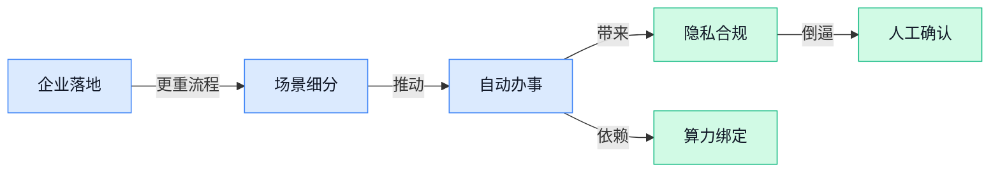
```mermaid
graph LR
A[企业落地] -->|更重流程| B[场景细分]
B -->|推动| C[自动办事]
C -->|带来| D[隐私合规]
C -->|依赖| E[算力绑定]
D -->|倒逼| F[人工确认]
classDef blue fill:#dbeafe,stroke:#3b82f6,color:#111827
classDef green fill:#d1fae5,stroke:#10b981,color:#111827
class A,B,C blue
class D,E,F green
```

### 📊 行业洞察（今日 4 条）

1. 微软投25亿美元派6000名工程师进企业，Anthropic也在推Claude Science细分场景  
  【洞察】人工智能落地正在从“买工具”变成“陪客户改流程”，谁更懂业务流程，谁更容易拿企业预算。

2. Anthropic砍掉Claude Code八成后台说明，DSPy（自动优化提示词的工具）又在自动改数据查询提示词  
  【洞察】两件事放一起看，人工智能工具不再靠堆长说明硬控，开始转向更短指令、更可验证的工作流程。

3. 英伟达推收入分成，Anthropic谈三星定制芯片，Meta转向新型云算力服务商  
  【洞察】算力正在从“买服务器资源”变成战略合作筹码，创业公司成本压力可能下降，但也更容易被上游绑定。

4. Agent（能代办任务的人工智能助手）碰隐私红线，日本又裁定人工智能不能当专利发明人  
  【洞察】人工智能越能替人办事，法律越会要求人负责；产品不能只追自动化，还得留下授权、记录和人工确认。

### 💭 对我们的启发（今日 3 条）

1. browser-use/video-use（用编程 Agent 辅助剪视频的开源项目）说明“写一句话剪视频”会更普及；我们的剪辑软件不能只拼时间线功能，要把脚本、素材、剪辑、审核做成可控流程。

2. KittenTTS（小于25MB的文字转语音模型）这种轻量语音能力出现，意味着配音成本会继续降；我们可以考虑本地或低成本配音，但要提供声音版权、商用授权和人工复核提示。

3. Agent隐私争议和西班牙拉黑Palantir（美国数据分析软件公司）提醒我们，品牌客户的视频素材、达人数据、订单数据不能随便交给模型；产品里要有权限边界、操作记录和人工接管入口。

