## AI资讯日报 2026/7/4

> AI 早报 · 每日早读 · 全网深度聚合

## **今日摘要**

```
Tesla 把员工 AI 支出周封顶 200 美元，Microsoft 升级 Copilot 与 AutoPilot agents 抢超级应用入口
Bridgewater（桥水基金）金融测试让 GPT 和 Claude 集体失分，英国 AI Security Institute 直指基准低估 Agent
Kling（中国 AI 视频平台）融资 20 亿美元冲刺香港上市，Google DeepMind 联手 A24 把 AI 推进影视业
```

### 🔵 产品与功能更新

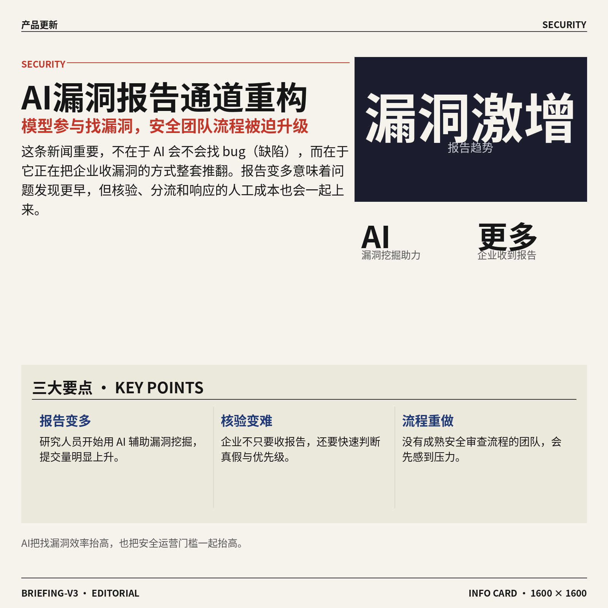

1. **AI 找漏洞带火安全报告，漏洞提交通道正被重新定义。**
随着 AI 模型开始主动帮人“找 bug”，**安全漏洞报告**数量明显飙升，这说明网络安全团队的工作流正在被 AI 改写 🚀。原文提到，越来越多研究人员会用 AI 辅助做漏洞挖掘，也让企业收到更多需要核验的报告；这里的**漏洞挖掘**，就是主动寻找系统里可能被攻击者利用的缺陷。对公司来说，这既是机会也是压力：发现问题会更早，但**安全审查**和分流成本也会同步上升，尤其对没有成熟响应流程的团队更明显。[漏洞激增报道(briefing)](https://the-decoder.com/security-vulnerability-reports-have-exploded-since-ai-models-started-hunting-for-bugs/)


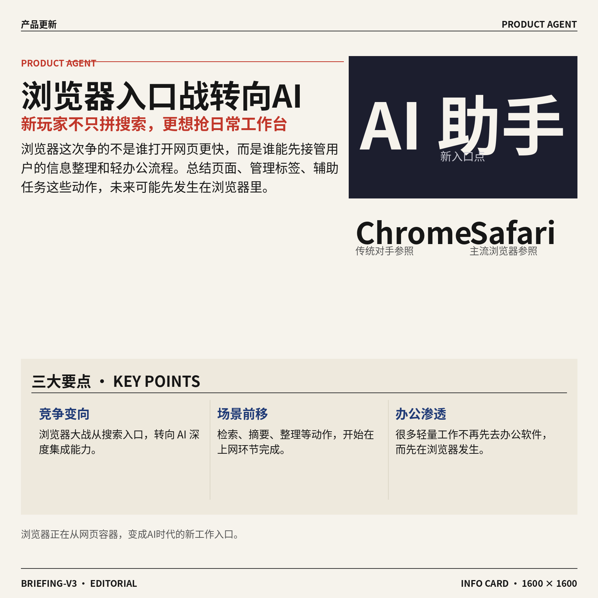

2. **浏览器大战转向 AI 助手，Chrome 之外的新玩家开始抢入口。**
TechCrunch 这篇盘点指出，如今浏览器竞争不再只围着**搜索**打转，而是开始比谁能把 **AI 功能**更深地塞进日常上网流程里 💡。这里说的浏览器，不只是打开网页的工具，更可能变成用户的“工作台”——例如帮你总结页面、整理标签页，甚至辅助完成任务。对业务和运营同事而言，这意味着未来很多信息检索、内容整理和轻量办公动作，可能会先发生在浏览器里，而不是传统办公软件里。[浏览器新格局盘点(briefing)](https://techcrunch.com/2026/07/03/as-the-browser-wars-heat-up-here-are-the-hottest-alternatives-to-chrome-and-safari-in-2026/)


### 🟢 前沿研究

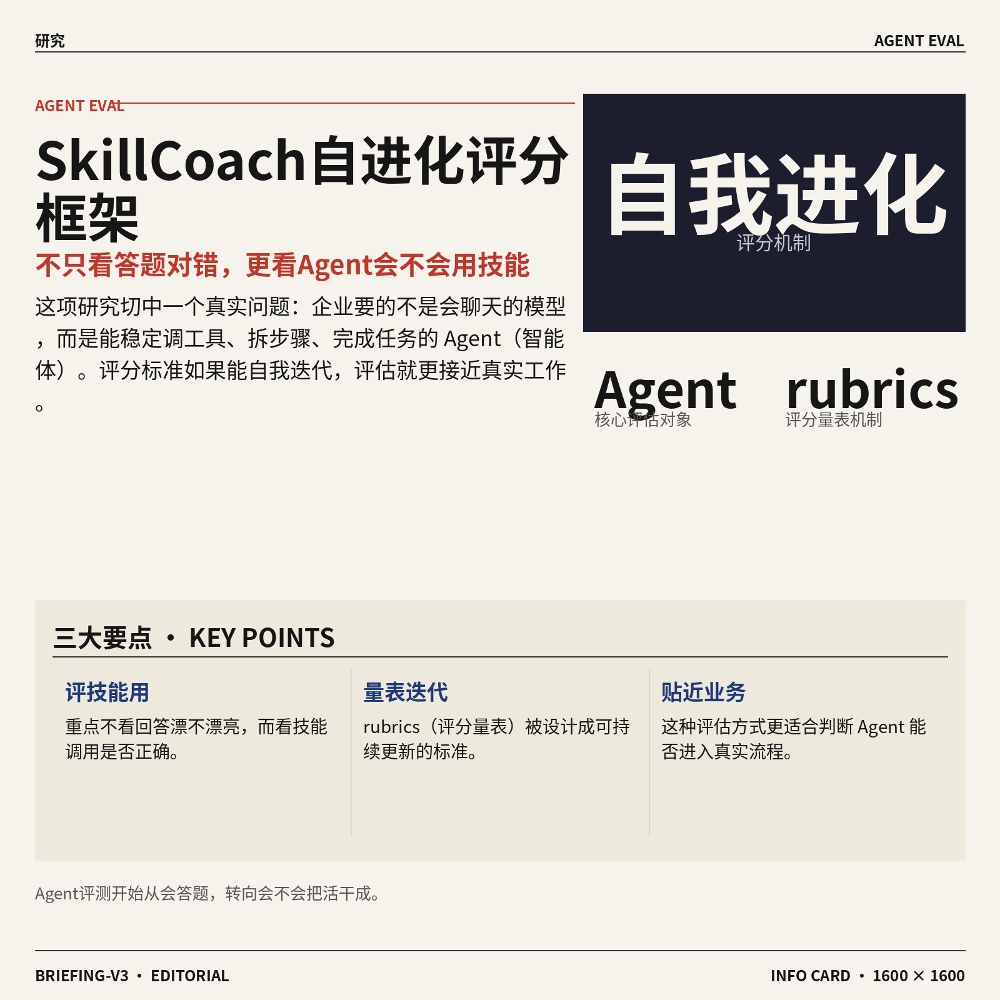

1. **SkillCoach（用于评估和提升 Agent 技能使用能力的研究框架）提出“会自我进化的评分标准”。**
这项研究盯上的不是模型“答对了没”，而是它到底会不会**正确调用技能**、会不会越用越熟练 💡。从标题看，作者把 **rubrics（评分量表，像面试打分表那样把好坏拆成可比较的标准）**做成可自我迭代的机制，用来评估并增强 **agentic skill-use（Agent 在真实任务里调工具、分步骤解决问题的能力）**。这类方向很关键，因为未来企业买的未必只是“会聊天”的模型，而是能稳定完成流程工作的 Agent 🚀。可先看 [论文摘要页(briefing)](https://huggingface.co/papers/2607.01874)。


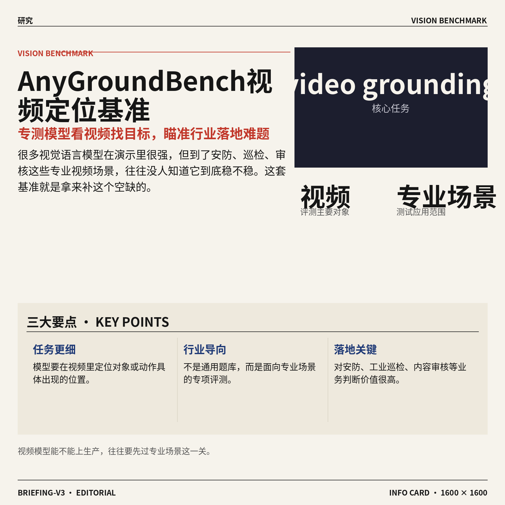

2. **AnyGroundBench（面向视频定位任务的专业评测集）瞄准视觉语言模型的“看视频找目标”能力。**
这篇工作聚焦 **video grounding（视频定位，让模型在一段视频里找出某个对象或动作具体出现在哪里）**，而且还是 **specialized-domain benchmark（面向特定专业场景的测试基准，不是泛泛而谈的通用题库）**。它的意义在于，很多模型在通用演示里看着很强，但一进细分行业视频场景，能力是否靠谱往往没人说得清 🤔。如果你关心安防、工业巡检、内容审核这类视频业务，这种评测会直接影响“模型能不能上生产环境”。更多可见 [论文摘要页(briefing)](https://huggingface.co/papers/2607.02269)。

![AnyGroundBench（面向视频定位任务的专业评测集）瞄准视觉语言模型的“看视频找目标”能力](https://image.pollinations.ai/prompt/AnyGroundBench%EF%BC%88%E9%9D%A2%E5%90%91%E8%A7%86%E9%A2%91%E5%AE%9A%E4%BD%8D%E4%BB%BB%E5%8A%A1%E7%9A%84%E4%B8%93%E4%B8%9A%E8%AF%84%E6%B5%8B%E9%9B%86%EF%BC%89%E7%9E%84%E5%87%86%E8%A7%86%E8%A7%89%E8%AF%AD%E8%A8%80%E6%A8%A1%E5%9E%8B%E7%9A%84%E2%80%9C%E7%9C%8B%E8%A7%86%E9%A2%91%E6%89%BE%E7%9B%AE%E6%A0%87%E2%80%9D%E8%83%BD%E5%8A%9B.%20AnyGroundBench%EF%BC%88%E9%9D%A2%E5%90%91%E8%A7%86%E9%A2%91%E5%AE%9A%E4%BD%8D%E4%BB%BB%E5%8A%A1%E7%9A%84%E4%B8%93%E4%B8%9A%E8%AF%84%E6%B5%8B%E9%9B%86%EF%BC%89%E7%9E%84%E5%87%86%E8%A7%86%E8%A7%89%E8%AF%AD%E8%A8%80%E6%A8%A1%E5%9E%8B%E7%9A%84%E2%80%9C%E7%9C%8B%E8%A7%86%E9%A2%91%E6%89%BE%E7%9B%AE%E6%A0%87%E2%80%9D%E8%83%BD%E5%8A%9B%E3%80%82%20%E8%BF%99%E7%AF%87%E5%B7%A5%E4%BD%9C%E8%81%9A%E7%84%A6%20video%20grounding%EF%BC%88%E8%A7%86%E9%A2%91%E5%AE%9A%E4%BD%8D%EF%BC%8C%E8%AE%A9%2C%20technical%20infographic%20diagram%2C%20architecture%20flowchart%2C%20clean%20vector%20illustration%2C%20educational%20style%2C%20no%20text%20overlay%2C%20modern%20minimal%2C%20wide%20aspect?width=1200&height=675&nologo=true&seed=10838)

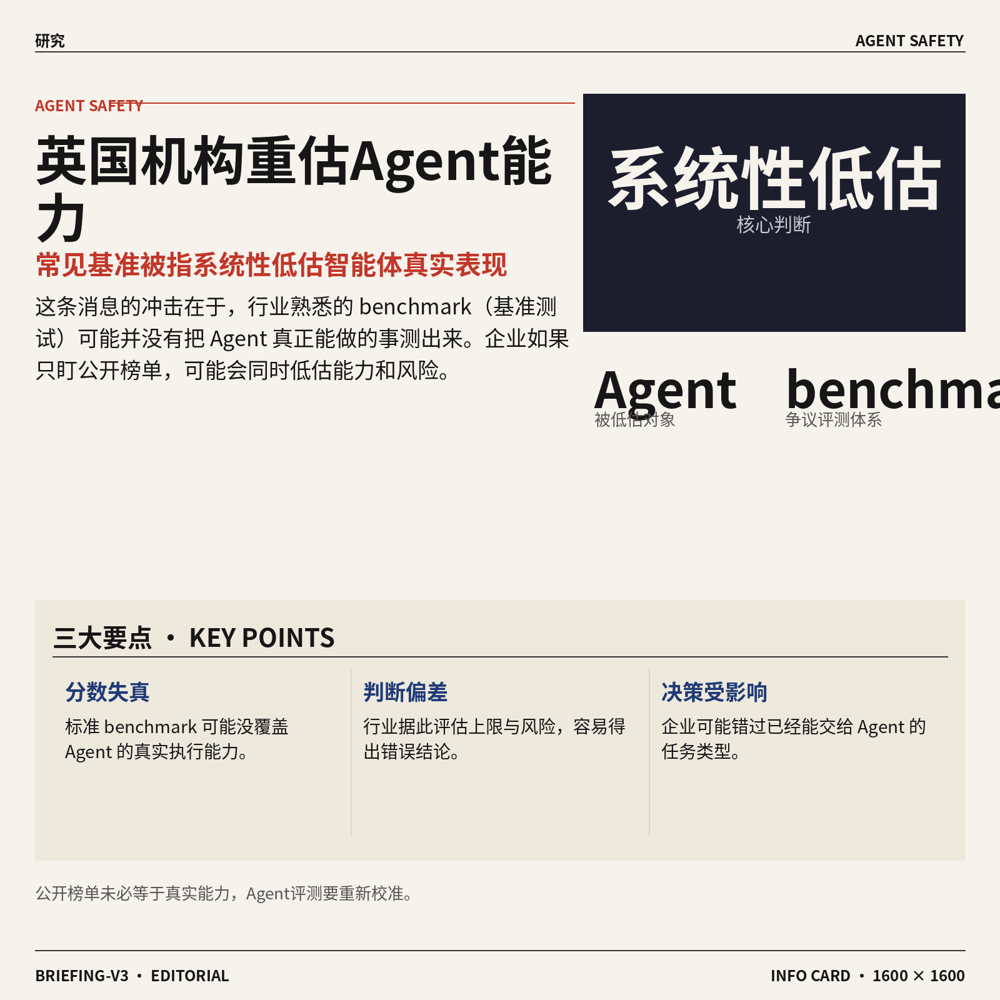

3. **英国 AI Security Institute（英国人工智能安全研究机构）称常见基准测试低估了 Agent 真实能力。**
这项发现的重点很直接：很多**标准 benchmark（基准测试，用来统一比较模型能力的考试题）**测出来的分数，可能没把 Agent 真正能做的事情算进去 📉。报道指出，现有评测体系会**系统性低估** AI agents（能自主拆解并执行任务的 AI 助手）的实际表现，这对行业判断风险和能力上限都很关键。换句话说，企业如果只看公开榜单，可能会错判哪些任务已经可以交给 Agent 去做了 ⚠️。详情见 [完整报道(briefing)](https://the-decoder.com/uks-ai-security-institute-finds-standard-benchmarks-systematically-underestimate-what-ai-agents-can-actually-do/)。

![英国 AI Security Institute（英国人工智能安全研究机构）称常见基准测试低估了 Agent 真实能力](https://image.pollinations.ai/prompt/%E8%8B%B1%E5%9B%BD%20AI%20Security%20Institute%EF%BC%88%E8%8B%B1%E5%9B%BD%E4%BA%BA%E5%B7%A5%E6%99%BA%E8%83%BD%E5%AE%89%E5%85%A8%E7%A0%94%E7%A9%B6%E6%9C%BA%E6%9E%84%EF%BC%89%E7%A7%B0%E5%B8%B8%E8%A7%81%E5%9F%BA%E5%87%86%E6%B5%8B%E8%AF%95%E4%BD%8E%E4%BC%B0%E4%BA%86%20Agent%20%E7%9C%9F%E5%AE%9E%E8%83%BD%E5%8A%9B.%20%E8%8B%B1%E5%9B%BD%20AI%20Security%20Institute%EF%BC%88%E8%8B%B1%E5%9B%BD%E4%BA%BA%E5%B7%A5%E6%99%BA%E8%83%BD%E5%AE%89%E5%85%A8%E7%A0%94%E7%A9%B6%E6%9C%BA%E6%9E%84%EF%BC%89%E7%A7%B0%E5%B8%B8%E8%A7%81%E5%9F%BA%E5%87%86%E6%B5%8B%E8%AF%95%E4%BD%8E%E4%BC%B0%E4%BA%86%20Agent%20%E7%9C%9F%E5%AE%9E%E8%83%BD%E5%8A%9B%E3%80%82%20%E8%BF%99%E9%A1%B9%E5%8F%91%E7%8E%B0%E7%9A%84%E9%87%8D%E7%82%B9%E5%BE%88%E7%9B%B4%E6%8E%A5%EF%BC%9A%E5%BE%88%E5%A4%9A%E6%A0%87%E5%87%86%20ben%2C%20technical%20infographic%20diagram%2C%20architecture%20flowchart%2C%20clean%20vector%20illustration%2C%20educational%20style%2C%20no%20text%20overlay%2C%20modern%20minimal%2C%20wide%20aspect?width=1200&height=675&nologo=true&seed=10869)

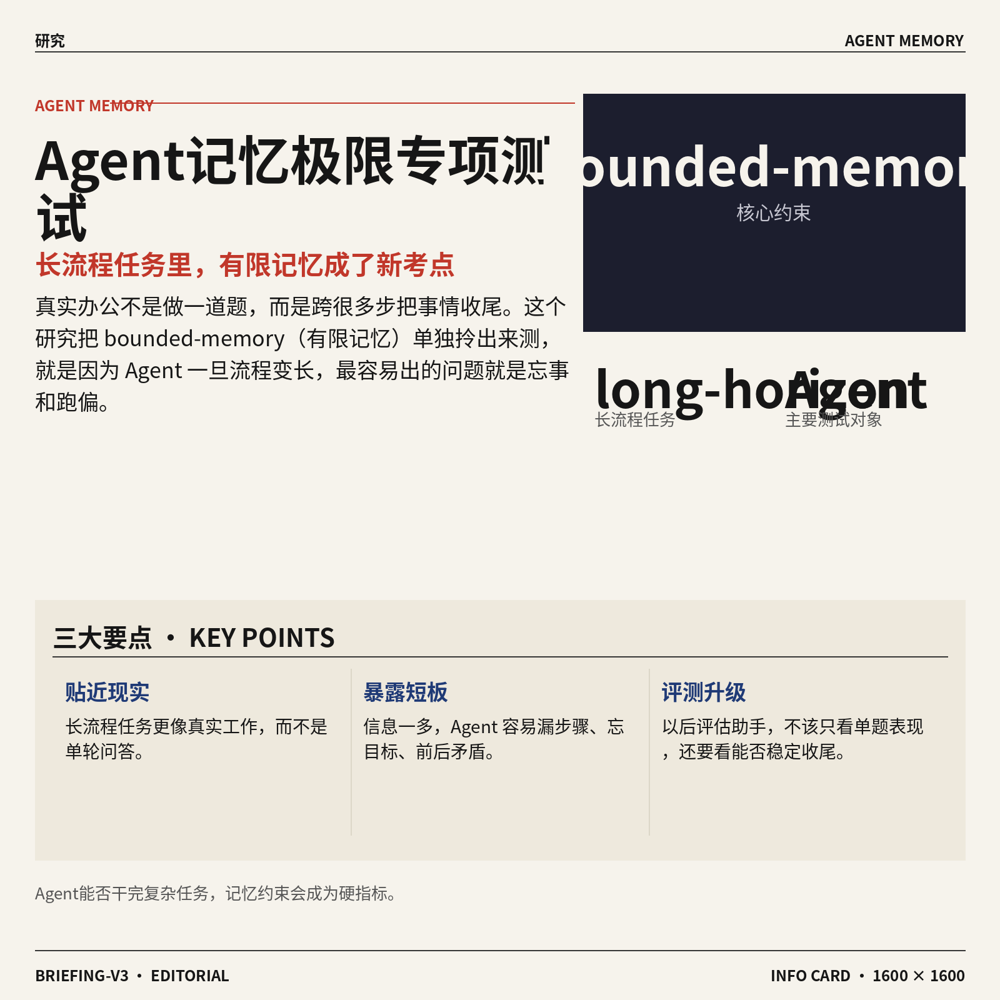

4. **AgenticSTS（测试长流程 Agent 的有限记忆实验平台）专门考模型“记不住太多时还能不能把事做完”。**
这篇研究关注 **long-horizon LLM agents（需要连续完成很多步任务的大模型 Agent）**，并把 **bounded-memory（有限记忆，指模型不能无限保存上下文，像人工作时也会遗忘细节）** 设成核心约束。这个问题很贴近真实办公：任务一长、信息一多，Agent 就容易前后矛盾、漏步骤或忘目标 😵。如果这类测试成熟，未来大家评估 AI 助手时就不能只看“单题表现”，还要看它在复杂流程里能不能一路稳定收尾。可参考 [论文摘要页(briefing)](https://huggingface.co/papers/2607.02255)。

![AgenticSTS（测试长流程 Agent 的有限记忆实验平台）专门考模型“记不住太多时还能不能把事做完”](https://image.pollinations.ai/prompt/AgenticSTS%EF%BC%88%E6%B5%8B%E8%AF%95%E9%95%BF%E6%B5%81%E7%A8%8B%20Agent%20%E7%9A%84%E6%9C%89%E9%99%90%E8%AE%B0%E5%BF%86%E5%AE%9E%E9%AA%8C%E5%B9%B3%E5%8F%B0%EF%BC%89%E4%B8%93%E9%97%A8%E8%80%83%E6%A8%A1%E5%9E%8B%E2%80%9C%E8%AE%B0%E4%B8%8D%E4%BD%8F%E5%A4%AA%E5%A4%9A%E6%97%B6%E8%BF%98%E8%83%BD%E4%B8%8D%E8%83%BD%E6%8A%8A%E4%BA%8B%E5%81%9A%E5%AE%8C%E2%80%9D.%20AgenticSTS%EF%BC%88%E6%B5%8B%E8%AF%95%E9%95%BF%E6%B5%81%E7%A8%8B%20Agent%20%E7%9A%84%E6%9C%89%E9%99%90%E8%AE%B0%E5%BF%86%E5%AE%9E%E9%AA%8C%E5%B9%B3%E5%8F%B0%EF%BC%89%E4%B8%93%E9%97%A8%E8%80%83%E6%A8%A1%E5%9E%8B%E2%80%9C%E8%AE%B0%E4%B8%8D%E4%BD%8F%E5%A4%AA%E5%A4%9A%E6%97%B6%E8%BF%98%E8%83%BD%E4%B8%8D%E8%83%BD%E6%8A%8A%E4%BA%8B%E5%81%9A%E5%AE%8C%E2%80%9D%E3%80%82%20%E8%BF%99%E7%AF%87%E7%A0%94%E7%A9%B6%E5%85%B3%E6%B3%A8%20long-horizon%20LLM%2C%20technical%20infographic%20diagram%2C%20architecture%20flowchart%2C%20clean%20vector%20illustration%2C%20educational%20style%2C%20no%20text%20overlay%2C%20modern%20minimal%2C%20wide%20aspect?width=1200&height=675&nologo=true&seed=10900)

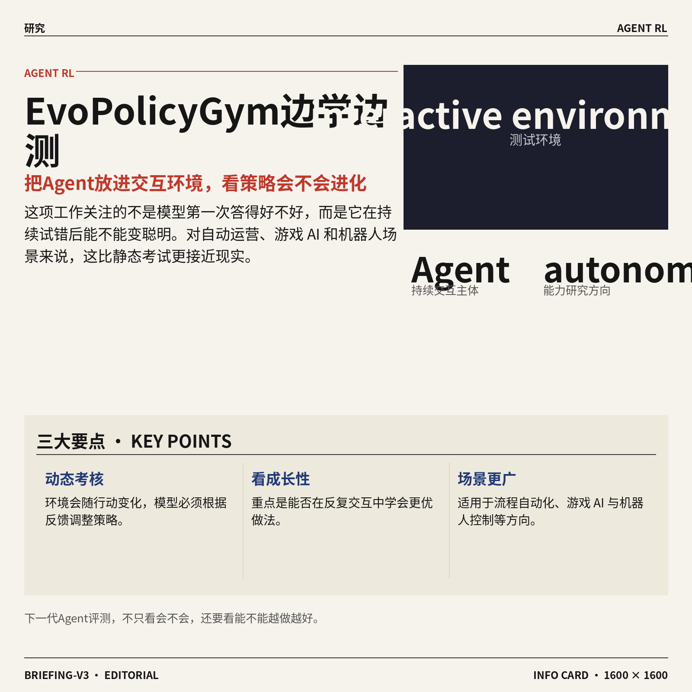

5. **EvoPolicyGym（评估自主策略进化能力的交互环境）把 Agent 拉进“边做边学”的考场。**
从标题看，这项工作研究的是 **autonomous policy evolution（自主策略进化，指 Agent 在反复交互中自己调整做事策略）**，并放在 **interactive environments（交互环境，会根据行动变化反馈的任务场景）** 里评估。它不只是问模型“这题会不会”，而是问它能不能在持续试错后变得更聪明 🧠。这对自动运营、流程自动化、游戏 AI 或机器人控制都很重要，因为现实任务很少是一锤子买卖。更多信息见 [论文摘要页(briefing)](https://huggingface.co/papers/2607.02440)。


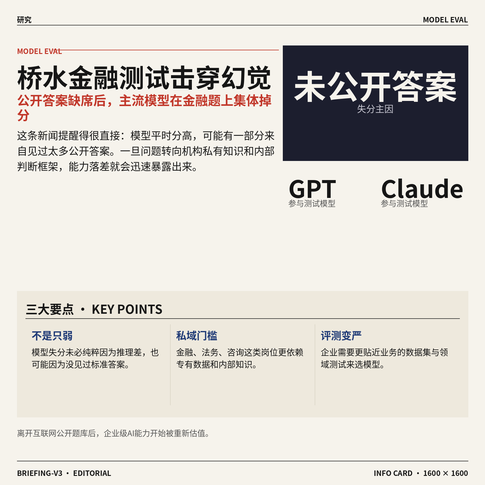

6. **Bridgewater（桥水基金，全球知名对冲基金）的金融测试让 GPT 和 Claude 集体失分，暴露“公开答案依赖症”。**
这篇报道的核心结论很值得细想：模型没做好，并不一定只是“能力不够”，还可能因为测试题的**正确答案从未公开**，模型缺少可直接模仿的现成材料 📚。这触到一个现实问题——很多大模型擅长处理互联网上已有共识的问题，但碰到机构内部知识、私有判断框架或稀缺数据时，表现会明显下滑。对企业来说，这意味着想让 AI 真正在金融、法务、咨询等知识密集岗位发挥价值，**专有数据**和**领域评测**会越来越重要。可查看 [完整报道(briefing)](https://the-decoder.com/gpt-and-claude-failed-bridgewaters-finance-tests-because-the-right-answers-were-never-public/)。

![Bridgewater（桥水基金，全球知名对冲基金）的金融测试让 GPT 和 Claude 集体失分，暴露“公开答案依赖症”](https://image.pollinations.ai/prompt/Bridgewater%EF%BC%88%E6%A1%A5%E6%B0%B4%E5%9F%BA%E9%87%91%EF%BC%8C%E5%85%A8%E7%90%83%E7%9F%A5%E5%90%8D%E5%AF%B9%E5%86%B2%E5%9F%BA%E9%87%91%EF%BC%89%E7%9A%84%E9%87%91%E8%9E%8D%E6%B5%8B%E8%AF%95%E8%AE%A9%20GPT%20%E5%92%8C%20Claude%20%E9%9B%86%E4%BD%93%E5%A4%B1%E5%88%86%EF%BC%8C%E6%9A%B4%E9%9C%B2%E2%80%9C%E5%85%AC%E5%BC%80%E7%AD%94%E6%A1%88%E4%BE%9D%E8%B5%96%E7%97%87%E2%80%9D.%20Bridgewater%EF%BC%88%E6%A1%A5%E6%B0%B4%E5%9F%BA%E9%87%91%EF%BC%8C%E5%85%A8%E7%90%83%E7%9F%A5%E5%90%8D%E5%AF%B9%E5%86%B2%E5%9F%BA%E9%87%91%EF%BC%89%E7%9A%84%E9%87%91%E8%9E%8D%E6%B5%8B%E8%AF%95%E8%AE%A9%20GPT%20%E5%92%8C%20Claude%20%E9%9B%86%E4%BD%93%E5%A4%B1%E5%88%86%EF%BC%8C%E6%9A%B4%E9%9C%B2%E2%80%9C%E5%85%AC%E5%BC%80%E7%AD%94%E6%A1%88%E4%BE%9D%E8%B5%96%E7%97%87%E2%80%9D%E3%80%82%20%E8%BF%99%E7%AF%87%E6%8A%A5%E9%81%93%E7%9A%84%E6%A0%B8%E5%BF%83%E7%BB%93%E8%AE%BA%E5%BE%88%E5%80%BC%E5%BE%97%E7%BB%86%E6%83%B3%EF%BC%9A%E6%A8%A1%2C%20technical%20infographic%20diagram%2C%20architecture%20flowchart%2C%20clean%20vector%20illustration%2C%20educational%20style%2C%20no%20text%20overlay%2C%20modern%20minimal%2C%20wide%20aspect?width=1200&height=675&nologo=true&seed=10962)

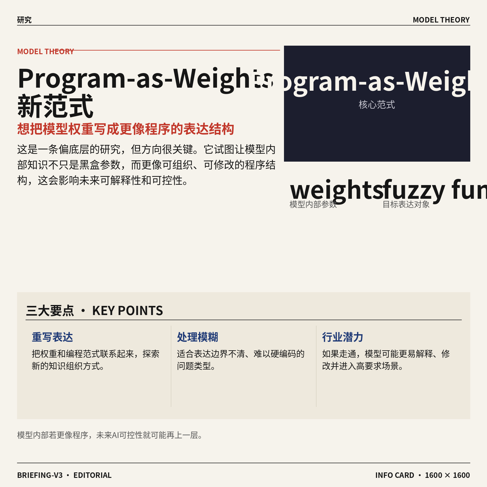

7. **Program-as-Weights（一种把“程序”当作模型权重来表达模糊函数的新范式）尝试改写模型表达方式。**
这篇论文提出一种新思路：把 **weights（权重，决定模型如何处理输入的内部参数）** 和 **programming paradigm（编程范式，也就是“如何组织计算逻辑”的基本思路）** 联系起来，用来表示 **fuzzy functions（模糊函数，适合处理边界不清、非黑即白不好定义的问题）**。虽然标题偏学术，但它讨论的是一个很底层的问题：模型的“知识”是否能用更可控、更像程序的方式来组织。若这类方向走通，未来 AI 可能更容易解释、修改，甚至更适合进高要求行业场景。可先看 [论文摘要页(briefing)](https://huggingface.co/papers/2607.02512)。

![Program-as-Weights（一种把“程序”当作模型权重来表达模糊函数的新范式）尝试改写模型表达方式](https://image.pollinations.ai/prompt/Program-as-Weights%EF%BC%88%E4%B8%80%E7%A7%8D%E6%8A%8A%E2%80%9C%E7%A8%8B%E5%BA%8F%E2%80%9D%E5%BD%93%E4%BD%9C%E6%A8%A1%E5%9E%8B%E6%9D%83%E9%87%8D%E6%9D%A5%E8%A1%A8%E8%BE%BE%E6%A8%A1%E7%B3%8A%E5%87%BD%E6%95%B0%E7%9A%84%E6%96%B0%E8%8C%83%E5%BC%8F%EF%BC%89%E5%B0%9D%E8%AF%95%E6%94%B9%E5%86%99%E6%A8%A1%E5%9E%8B%E8%A1%A8%E8%BE%BE%E6%96%B9%E5%BC%8F.%20Program-as-Weights%EF%BC%88%E4%B8%80%E7%A7%8D%E6%8A%8A%E2%80%9C%E7%A8%8B%E5%BA%8F%E2%80%9D%E5%BD%93%E4%BD%9C%E6%A8%A1%E5%9E%8B%E6%9D%83%E9%87%8D%E6%9D%A5%E8%A1%A8%E8%BE%BE%E6%A8%A1%E7%B3%8A%E5%87%BD%E6%95%B0%E7%9A%84%E6%96%B0%E8%8C%83%E5%BC%8F%EF%BC%89%E5%B0%9D%E8%AF%95%E6%94%B9%E5%86%99%E6%A8%A1%E5%9E%8B%E8%A1%A8%E8%BE%BE%E6%96%B9%E5%BC%8F%E3%80%82%20%E8%BF%99%E7%AF%87%E8%AE%BA%E6%96%87%E6%8F%90%E5%87%BA%E4%B8%80%E7%A7%8D%E6%96%B0%E6%80%9D%E8%B7%AF%EF%BC%9A%E6%8A%8A%20weights%EF%BC%88%E6%9D%83%E9%87%8D%2C%20technical%20infographic%20diagram%2C%20architecture%20flowchart%2C%20clean%20vector%20illustration%2C%20educational%20style%2C%20no%20text%20overlay%2C%20modern%20minimal%2C%20wide%20aspect?width=1200&height=675&nologo=true&seed=10993)

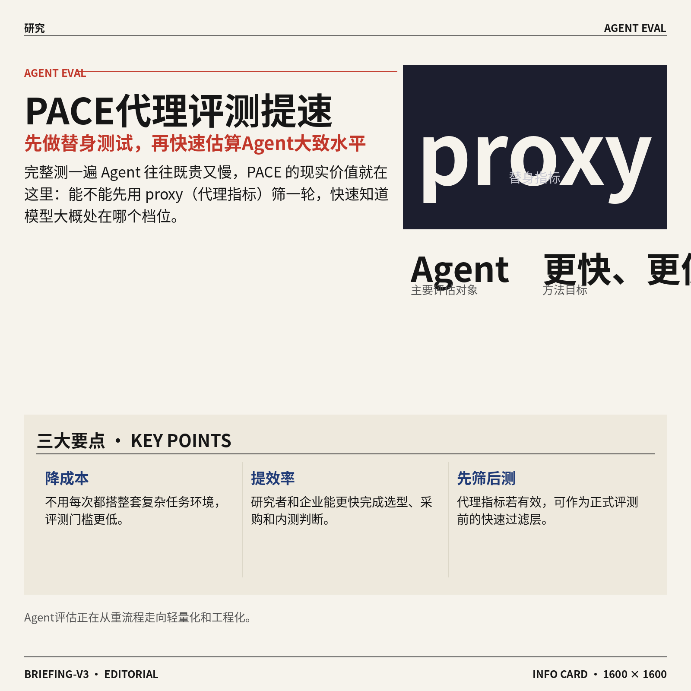

8. **PACE（用于评估 Agent 能力的代理指标）想先用“替身测试”快速判断 Agent 水平。**
这项研究里的 **proxy（代理指标，指不直接测最终能力，而用一个更快、更便宜的替代指标来估算）** 很有现实意义，因为完整评测 Agent 往往既慢又贵 ⏱️。PACE 试图为 **agentic capability evaluation（Agent 能力评估）** 找到一种更轻量的判断方式，让研究者和企业更快知道模型大概处在什么水平。要是这种方法有效，未来选型、采购、内测都会更高效，不必每次都搭一整套复杂任务环境。详情可见 [论文摘要页(briefing)](https://huggingface.co/papers/2607.02032)。

![PACE（用于评估 Agent 能力的代理指标）想先用“替身测试”快速判断 Agent 水平](https://image.pollinations.ai/prompt/PACE%EF%BC%88%E7%94%A8%E4%BA%8E%E8%AF%84%E4%BC%B0%20Agent%20%E8%83%BD%E5%8A%9B%E7%9A%84%E4%BB%A3%E7%90%86%E6%8C%87%E6%A0%87%EF%BC%89%E6%83%B3%E5%85%88%E7%94%A8%E2%80%9C%E6%9B%BF%E8%BA%AB%E6%B5%8B%E8%AF%95%E2%80%9D%E5%BF%AB%E9%80%9F%E5%88%A4%E6%96%AD%20Agent%20%E6%B0%B4%E5%B9%B3.%20PACE%EF%BC%88%E7%94%A8%E4%BA%8E%E8%AF%84%E4%BC%B0%20Agent%20%E8%83%BD%E5%8A%9B%E7%9A%84%E4%BB%A3%E7%90%86%E6%8C%87%E6%A0%87%EF%BC%89%E6%83%B3%E5%85%88%E7%94%A8%E2%80%9C%E6%9B%BF%E8%BA%AB%E6%B5%8B%E8%AF%95%E2%80%9D%E5%BF%AB%E9%80%9F%E5%88%A4%E6%96%AD%20Agent%20%E6%B0%B4%E5%B9%B3%E3%80%82%20%E8%BF%99%E9%A1%B9%E7%A0%94%E7%A9%B6%E9%87%8C%E7%9A%84%20proxy%EF%BC%88%E4%BB%A3%E7%90%86%E6%8C%87%E6%A0%87%EF%BC%8C%E6%8C%87%E4%B8%8D%E7%9B%B4%E6%8E%A5%E6%B5%8B%E6%9C%80%E7%BB%88%E8%83%BD%E5%8A%9B%EF%BC%8C%E8%80%8C%E7%94%A8%E4%B8%80%E4%B8%AA%2C%20technical%20infographic%20diagram%2C%20architecture%20flowchart%2C%20clean%20vector%20illustration%2C%20educational%20style%2C%20no%20text%20overlay%2C%20modern%20minimal%2C%20wide%20aspect?width=1200&height=675&nologo=true&seed=11024)

### 🟡 行业展望与社会影响

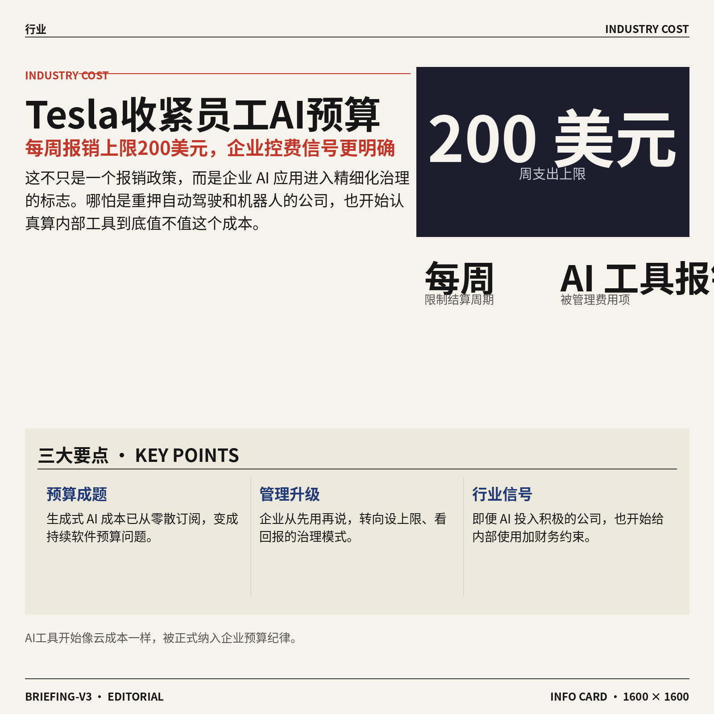

1. **Tesla 限制员工 AI 支出：每周上限 200 美元。**
Tesla 把员工的 **AI 工具报销**设了明确天花板，这个动作很像企业开始从“先上再说”转向“精打细算” 💰。对很多公司来说，生成式 AI 的成本不再只是买几个账号，而是会变成持续发生的**软件预算管理**问题。报道也让人看到一个现实：哪怕是积极押注自动驾驶和机器人业务的公司，也在给内部 AI 使用加上财务约束。[完整报道(briefing)](https://the-decoder.com/tesla-caps-employee-ai-spending-at-200-per-week/)


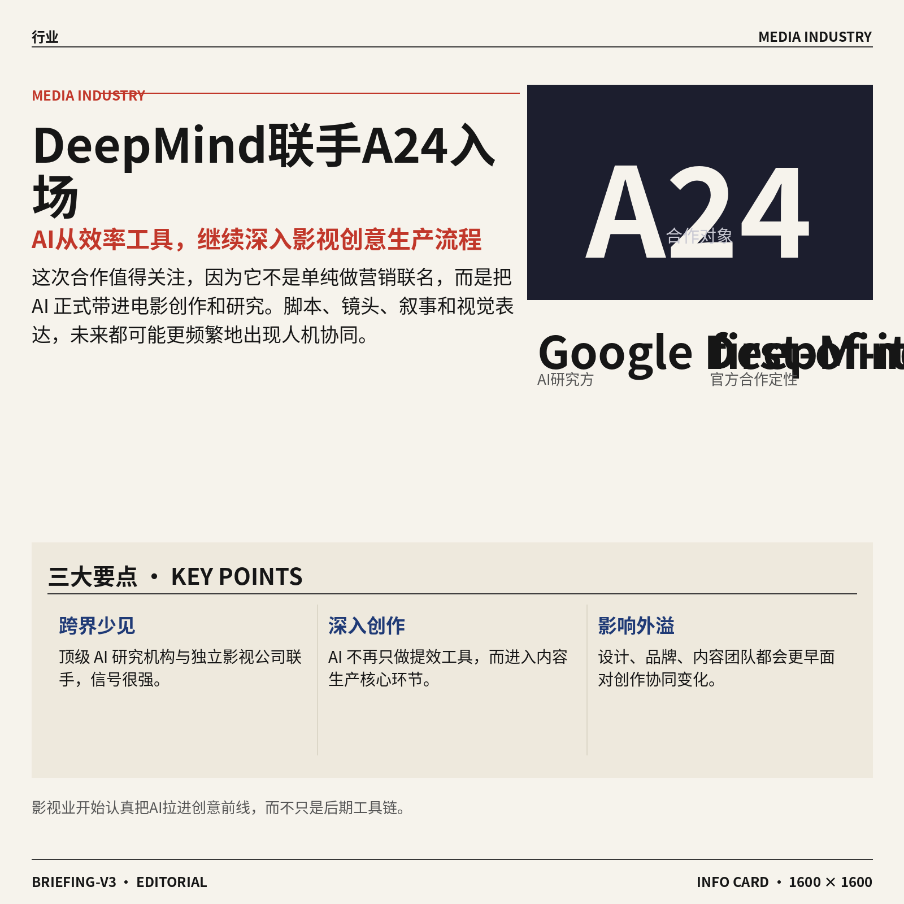

2. **Google DeepMind 与 A24（美国独立影视制作公司）启动研究合作。**
Google DeepMind 宣布和 A24 展开一项面向**电影创作与研究**的合作，这类跨界组合很少见 🎬。它释放的信号很明确：AI 不只是效率工具，也正在进入内容行业更核心的**创意生产流程**。对设计、品牌、内容团队来说，这意味着未来围绕脚本、镜头、叙事和视觉表达的工作，可能会更频繁地与 AI 协同完成。[官方发布页(briefing)](https://deepmind.google/blog/google-deepmind-and-a24-announce-first-of-its-kind-research-partnership/)


3. **AI 术语表走红，行业沟通门槛正在变成真实问题。**
TechCrunch 整理了一份年度 **AI 词汇表**，专门解释像 hallucination（幻觉，指 AI 一本正经地编错内容）、inference（模型推理，让训练好的模型真正“回答问题”的过程）这类高频词 📘。这件事本身就说明，AI 的普及速度已经快到让大量非技术岗位需要“补语言课”。对企业内部协作来说，谁能把术语讲人话、把概念讲清楚，谁就更容易推动 AI 项目落地。[术语表原文(briefing)](https://techcrunch.com/2026/07/03/artificial-intelligence-definition-glossary-hallucinations-guide-to-common-ai-terms/)


4. **Claude Code 遭遇复杂的中国难题，跨境合规成了 AI 工具出海硬门槛。**
这篇报道聚焦 Claude Code 在中美两侧都面临限制，折射出的不是单一产品问题，而是**AI 工具全球化**的现实阻力 🌍。对企业用户来说，代码助手、办公助手这类产品的可用性，已经不只取决于模型能力，还取决于**合规规则**、地区政策和服务可达性。Claude Code（Anthropic 推出的 AI 编程助手）这类工具想进入更多市场，接下来拼的不只是功能，还有跨境运营能力。[完整报道(briefing)](https://the-decoder.com/claude-codes-complicated-china-problem-involves-bans-on-both-sides-of-the-pacific/)


5. **Meta 的 Agent 推进慢于预期，AI 助手落地比想象中更难。**
Meta 正在力推 **Agent** 方向，但报道指出其进展没有扎克伯格预期得那么快 ⏳。这提醒市场一个关键事实：让 AI 从“会聊天”变成“真能办事”，中间还隔着流程稳定性、任务执行能力和产品整合难题。对企业管理者来说，这也是个信号——别只看演示效果，真正值得关注的是 Agent 在日常工作里能否持续、可靠地完成任务。[完整报道(briefing)](https://the-decoder.com/metas-ai-agent-push-is-moving-slower-than-zuckerberg-planned/)


6. **Kling（中国 AI 视频生成平台）融资 20 亿美元，冲刺香港上市。**
Kling 获得大额融资并为香港 IPO（首次公开募股，企业把股票拿到交易所公开出售）做准备，说明 **AI 视频**赛道正在从“技术新鲜感”走向“资本大生意” 🎥。这类平台的价值，不只是做出炫酷短片，而是可能重塑广告、品牌、影视和电商内容的生产方式。对市场而言，资金大举进入也意味着行业竞争会继续加速，头部玩家的商业化压力和机会都会同步放大。[完整报道(briefing)](https://the-decoder.com/chinese-ai-video-maker-kling-raises-2-billion-as-it-gears-up-for-hong-kong-ipo/)

![Kling（中国 AI 视频生成平台）融资 20 亿美元，冲刺香港上市](https://image.pollinations.ai/prompt/Kling%EF%BC%88%E4%B8%AD%E5%9B%BD%20AI%20%E8%A7%86%E9%A2%91%E7%94%9F%E6%88%90%E5%B9%B3%E5%8F%B0%EF%BC%89%E8%9E%8D%E8%B5%84%2020%20%E4%BA%BF%E7%BE%8E%E5%85%83%EF%BC%8C%E5%86%B2%E5%88%BA%E9%A6%99%E6%B8%AF%E4%B8%8A%E5%B8%82.%20Kling%EF%BC%88%E4%B8%AD%E5%9B%BD%20AI%20%E8%A7%86%E9%A2%91%E7%94%9F%E6%88%90%E5%B9%B3%E5%8F%B0%EF%BC%89%E8%9E%8D%E8%B5%84%2020%20%E4%BA%BF%E7%BE%8E%E5%85%83%EF%BC%8C%E5%86%B2%E5%88%BA%E9%A6%99%E6%B8%AF%E4%B8%8A%E5%B8%82%E3%80%82%20Kling%20%E8%8E%B7%E5%BE%97%E5%A4%A7%E9%A2%9D%E8%9E%8D%E8%B5%84%E5%B9%B6%E4%B8%BA%E9%A6%99%E6%B8%AF%20IPO%EF%BC%88%E9%A6%96%E6%AC%A1%E5%85%AC%E5%BC%80%E5%8B%9F%E8%82%A1%EF%BC%8C%E4%BC%81%E4%B8%9A%E6%8A%8A%E8%82%A1%E7%A5%A8%E6%8B%BF%E5%88%B0%E4%BA%A4%E6%98%93%E6%89%80%E5%85%AC%E5%BC%80%E5%87%BA%E5%94%AE%EF%BC%89%2C%20technical%20infographic%20diagram%2C%20architecture%20flowchart%2C%20clean%20vector%20illustration%2C%20educational%20style%2C%20no%20text%20overlay%2C%20modern%20minimal%2C%20wide%20aspect?width=1200&height=675&nologo=true&seed=10962)

7. **Microsoft 升级 Copilot 与 AutoPilot agents（可自动执行多步骤任务的 AI 助手），加入 AI 超级应用竞赛。**
Microsoft 正在改造 Copilot，并推出更强的 AutoPilot agents，明显是在追赶 OpenAI 和 Anthropic 所推动的 **AI super app（AI 超级应用，把聊天、搜索、执行任务整合到一个入口里）**方向 🚀。这场竞争的重点，已经不只是“谁回答更聪明”，而是“谁能成为用户每天工作的总入口”。对办公场景来说，这意味着未来的 AI 可能不只是助手，而会逐步接管排程、检索、总结、执行等一整串任务链条。[完整报道(briefing)](https://the-decoder.com/microsoft-follows-anthropic-and-openai-into-the-ai-super-app-race-with-overhauled-copilot-and-autopilot-agents/)


### 🟣 开源TOP项目

1. **OpenWiki（一款为代码库自动生成文档的命令行工具）想把“项目说明书”这件事交给 Agent。**  
这个项目主打 **自动写文档** 和 **持续维护文档**，面向的是日常总被“代码没人看得懂”困扰的开发团队 🚀。它是一个 CLI（命令行工具，程序员在黑底终端里输入命令来运行的工具），能为代码库生成并更新 Agent 文档（给 AI 助手看的项目说明，让它更懂你的代码结构和规则）。对业务同事来说，这类工具的意义在于：以后团队里不只是“人交接靠文档”，连 AI 也能更快接手项目、减少答非所问 💡。[GitHub 项目页(briefing)](https://github.com/langchain-ai/openwiki)


2. **Microsoft 的 AI-For-Beginners（面向零基础人群的 AI 入门课程）把 AI 教育做成了 12 周公开课。**  
这个开源项目给出了 **12 周、24 节课** 的系统化学习材料，核心卖点就是 **零门槛入门** 📚。它不是单篇教程，而更像一套完整课程，适合想从“会用 ChatGPT”进一步走到“真正理解 AI 基本原理和应用场景”的同事。对于企业内部培训也很有参考价值，尤其适合做通识学习、跨部门科普或新人培养。[课程仓库主页(briefing)](https://github.com/microsoft/AI-For-Beginners)


3. **pxpipe（一种把代码转成图片再交给模型识别的流程工具）号称把 Fable 成本砍掉 60%。**  
这个项目最特别的点，是把 **代码先转成图片**，再让模型通过 OCR（光学字符识别，让机器“看图读字”）去理解内容，从而实现成本下降 💸。摘要里直接给出的核心结论是：这样做让 **Fable**（原文提到的相关使用场景/系统名称）成本降低了 **60%**。这也提醒大家一个很现实的趋势：AI 成本优化不一定只靠换模型，有时连“输入给模型的形式”都能成为降本突破口。[项目说明页(briefing)](https://github.com/teamchong/pxpipe)


4. **council-of-high-intelligence（多模型“圆桌议事”决策工具）想用 18 个 AI 角色帮你做难决定。**  
这个项目把 **18 个 AI 人设** 拉进同一个“议事会”，围绕难题做多轮讨论，强调的是 **结构化 deliberation（结构化审议，让不同观点按轮次展开讨论）** 和 **模型多样性** 🧠。摘要中提到，它会跨多个 LLM providers（大模型服务提供方，也就是不同家的模型平台）来调用模型，让“不同思路”不只是换提示词，而是真有不同模型参与。对普通用户来说，这类工具的价值在于：当你遇到复杂决策时，它不只给一个答案，而是模拟“多人会商”，更适合做方案比较和风险权衡。[GitHub 仓库页(briefing)](https://github.com/0xNyk/council-of-high-intelligence)


5. **claude-obsidian（一套把笔记自动整理成知识网络的 AI 第二大脑方案）瞄准个人知识管理。**  
这个项目把 Obsidian（一款流行的本地笔记与知识库工具）和 Claude Code 结合起来，主打 **自组织笔记** 与 **知识图谱**（把零散信息自动连成关系网络，方便后续查找和串联）📝。按摘要描述，你只要丢进资料，系统就会读取、建立链接，并归档成你自己持有的 Markdown（纯文本标记格式，适合长期保存、迁移和编辑）笔记体系。对经常处理会议纪要、资料归档、研究整理的人来说，这种“AI 帮你连线而不是只会记一条笔记”的思路很有吸引力。[项目主页介绍(briefing)](https://github.com/AgriciDaniel/claude-obsidian)

![claude-obsidian（一套把笔记自动整理成知识网络的 AI 第二大脑方案）瞄准个人知识管理](https://image.pollinations.ai/prompt/claude-obsidian%EF%BC%88%E4%B8%80%E5%A5%97%E6%8A%8A%E7%AC%94%E8%AE%B0%E8%87%AA%E5%8A%A8%E6%95%B4%E7%90%86%E6%88%90%E7%9F%A5%E8%AF%86%E7%BD%91%E7%BB%9C%E7%9A%84%20AI%20%E7%AC%AC%E4%BA%8C%E5%A4%A7%E8%84%91%E6%96%B9%E6%A1%88%EF%BC%89%E7%9E%84%E5%87%86%E4%B8%AA%E4%BA%BA%E7%9F%A5%E8%AF%86%E7%AE%A1%E7%90%86.%20claude-obsidian%EF%BC%88%E4%B8%80%E5%A5%97%E6%8A%8A%E7%AC%94%E8%AE%B0%E8%87%AA%E5%8A%A8%E6%95%B4%E7%90%86%E6%88%90%E7%9F%A5%E8%AF%86%E7%BD%91%E7%BB%9C%E7%9A%84%20AI%20%E7%AC%AC%E4%BA%8C%E5%A4%A7%E8%84%91%E6%96%B9%E6%A1%88%EF%BC%89%E7%9E%84%E5%87%86%E4%B8%AA%E4%BA%BA%E7%9F%A5%E8%AF%86%E7%AE%A1%E7%90%86%E3%80%82%20%E8%BF%99%E4%B8%AA%E9%A1%B9%E7%9B%AE%E6%8A%8A%20Obsidian%EF%BC%88%E4%B8%80%E6%AC%BE%E6%B5%81%E8%A1%8C%E7%9A%84%E6%9C%AC%E5%9C%B0%E7%AC%94%E8%AE%B0%E4%B8%8E%E7%9F%A5%E8%AF%86%E5%BA%93%2C%20technical%20infographic%20diagram%2C%20architecture%20flowchart%2C%20clean%20vector%20illustration%2C%20educational%20style%2C%20no%20text%20overlay%2C%20modern%20minimal%2C%20wide%20aspect?width=1200&height=675&nologo=true&seed=11125)

6. **TabFM（Google Research 推出的表格数据基础模型项目）进入开源视野。**  
从仓库名称看，TabFM 里的 FM 很可能指 foundation model（基础模型，能作为通用底座再适配不同任务的大模型），而 **tab** 则对应表格数据这一常见企业场景 📊。这类项目通常会引起关注，是因为公司里大量真实业务数据都躺在 Excel、报表和数据库表里，谁能把“表格理解”做好，谁就更接近真正可落地的企业 AI。当前候选材料没有给出更详细摘要，因此这里以仓库公开信息为准，建议直接查看项目主页了解其定位与进展。[Google Research 仓库(briefing)](https://github.com/google-research/tabfm)


### 🔴 社媒分享

1. **Fable's Judgement（Fable 团队总结的一套 AI 输出评估思路）值得做 AI 产品的人细看。**
这篇分享来自 Simon Willison 对一场访谈内容的提炼，核心在于怎么判断 **AI 回答到底算不算“好”**，而不是只盯着模型跑分 📌。文中提到的 **evaluation（评估，用一套标准检查 AI 输出是否可靠、是否有用）** 思路，对做客服、运营内容、知识助手的人都很有参考价值，因为它更贴近真实使用场景，而不是实验室里的理想题目。对非技术同事来说，这类讨论的意义很直接：以后看 AI 工具，不该只问“能不能生成”，更该问“生成结果稳不稳、能不能长期拿来用” 💡。[原文解读文章(briefing)](https://simonwillison.net/2026/Jul/3/judgement/#atom-everything)


2. **Open Source AI Gap Map（开源 AI 能力缺口地图）把“哪些基础能力还没人补上”画出来了。**
这是一份聚焦 **开源 AI** 生态的“空白地图”，试图告诉大家：哪些关键环节已经很成熟，哪些地方仍然存在明显短板 🗺️。它由 Current AI（一个推动公共型 AI 基础设施建设的非营利组织）发布，适合想理解行业格局的人快速建立全局视角。对企业来说，这种 **gap map（缺口地图，把产业链里“谁强谁弱、哪里空白”可视化的工具）** 的价值在于，能帮助团队判断是该直接采购成熟方案，还是关注未来可能冒出来的新机会 🚀。[缺口地图主页(briefing)](https://map.currentai.org) [原文介绍文章(briefing)](https://simonwillison.net/2026/Jul/3/open-source-ai-gap-map/#atom-everything)

![Open Source AI Gap Map（开源 AI 能力缺口地图）把“哪些基础能力还没人补上”画出来了](https://image.pollinations.ai/prompt/Open%20Source%20AI%20Gap%20Map%EF%BC%88%E5%BC%80%E6%BA%90%20AI%20%E8%83%BD%E5%8A%9B%E7%BC%BA%E5%8F%A3%E5%9C%B0%E5%9B%BE%EF%BC%89%E6%8A%8A%E2%80%9C%E5%93%AA%E4%BA%9B%E5%9F%BA%E7%A1%80%E8%83%BD%E5%8A%9B%E8%BF%98%E6%B2%A1%E4%BA%BA%E8%A1%A5%E4%B8%8A%E2%80%9D%E7%94%BB%E5%87%BA%E6%9D%A5%E4%BA%86.%20Open%20Source%20AI%20Gap%20Map%EF%BC%88%E5%BC%80%E6%BA%90%20AI%20%E8%83%BD%E5%8A%9B%E7%BC%BA%E5%8F%A3%E5%9C%B0%E5%9B%BE%EF%BC%89%E6%8A%8A%E2%80%9C%E5%93%AA%E4%BA%9B%E5%9F%BA%E7%A1%80%E8%83%BD%E5%8A%9B%E8%BF%98%E6%B2%A1%E4%BA%BA%E8%A1%A5%E4%B8%8A%E2%80%9D%E7%94%BB%E5%87%BA%E6%9D%A5%E4%BA%86%E3%80%82%20%E8%BF%99%E6%98%AF%E4%B8%80%E4%BB%BD%E8%81%9A%E7%84%A6%20%E5%BC%80%E6%BA%90%20AI%20%E7%94%9F%E6%80%81%E7%9A%84%E2%80%9C%E7%A9%BA%E7%99%BD%E5%9C%B0%E5%9B%BE%E2%80%9D%EF%BC%8C%E8%AF%95%2C%20technical%20infographic%20diagram%2C%20architecture%20flowchart%2C%20clean%20vector%20illustration%2C%20educational%20style%2C%20no%20text%20overlay%2C%20modern%20minimal%2C%20wide%20aspect?width=1200&height=675&nologo=true&seed=10644)

---

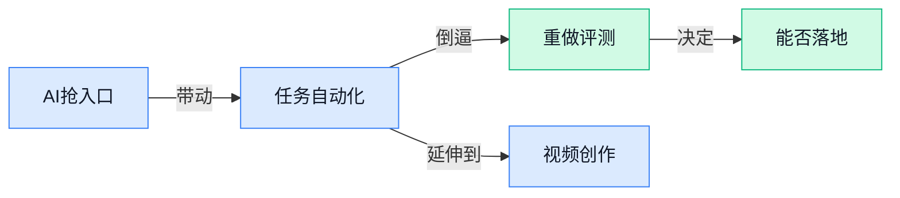
```mermaid
graph LR
A[AI抢入口] -->|带动| B[任务自动化]
B -->|倒逼| C[重做评测]
C -->|决定| D[能否落地]
B -->|延伸到| E[视频创作]

classDef blue fill:#dbeafe,stroke:#3b82f6,color:#111827
classDef green fill:#d1fae5,stroke:#10b981,color:#111827
class A,B,E blue
class C,D green
```

### 📊 行业洞察（今日 4 条）

1. Microsoft 把 Copilot 并成单一入口、浏览器厂商把 AI 塞进上网流程  
  【洞察】AI 竞争正在从“谁更会答”转向“谁先占住用户入口”，聊天框只是表面，真正抢的是你每天开始工作的第一站

2. Meta 的 Agent 推进慢、英国 AI Security Institute（英国人工智能安全研究机构）又说常见测试低估真实能力  
  【洞察】这两件事放一起看，说明行业现在最大的问题不是没能力，而是“演示很强、落地很难、评估也不准”，市场会继续高估或低估同一类产品

3. SkillCoach（用于评估和提升 Agent 技能使用能力的研究框架）、PACE（用替身测试快速估算 Agent 水平的评估方案）、AgenticSTS（测试长流程 Agent 有限记忆下稳定性的实验平台）同天出现  
  【洞察】行业重点已经明显从“造更强模型”转到“怎么判断它能不能稳定干活”，因为企业真正买单的是可控结果，不是跑分热闹

4. Kling（中国 AI 视频生成平台）融资 20 亿美元，Google DeepMind 又和 A24（美国独立影视制作公司）合作做电影研究  
  【洞察】AI 视频已经不是小工具生意，而是在同时吃“工业化内容生产”和“高端创意制作”两头，赛道会更大，但也更卷更贵

### 💭 对我们的启发（今日 3 条）

1. Microsoft 抢总入口、浏览器也在抢工作台，说明我们的视频剪辑软件不能只做“加工环节”，要尽量前置到选题、找素材、生成初稿这一跳，否则容易被上游入口截流。

2. Meta 落地慢，SkillCoach（用于评估和提升 Agent 技能使用能力的研究框架）和 AgenticSTS（测试长流程 Agent 有限记忆下稳定性的实验平台）却都在补评测，说明我们产品里要先把“哪些步骤可全自动、哪些必须人工确认”写死，别拿不稳定流程冒充全自动。

3. Kling 融资、AnyGroundBench（测试模型在视频里找目标是否靠谱的专业题库）出现，说明视频行业下一轮比拼不会只是“能生成”，还会比“认得准、改得准、定位准”；我们该优先补自动找片段、找商品、找口播重点这类硬功能，而不是只追炫技特效。

