## AI资讯日报 2026/7/6

> AI 早报 · 每日早读 · 全网深度聚合

## **今日摘要**

```
Seedance 2.0 让好莱坞又想禁又想用，Midjourney反手要求影视公司公开AI使用情况
Amazon Mechanical Turk（众包标注平台）停收新客户，特朗普设限私有模型，开源路线再度升温
百度Unlimited OCR冲击超长文档极限，Claude接入claude-video（视频理解工具）把看视频门槛打下来
```

### 🔵 产品与功能更新

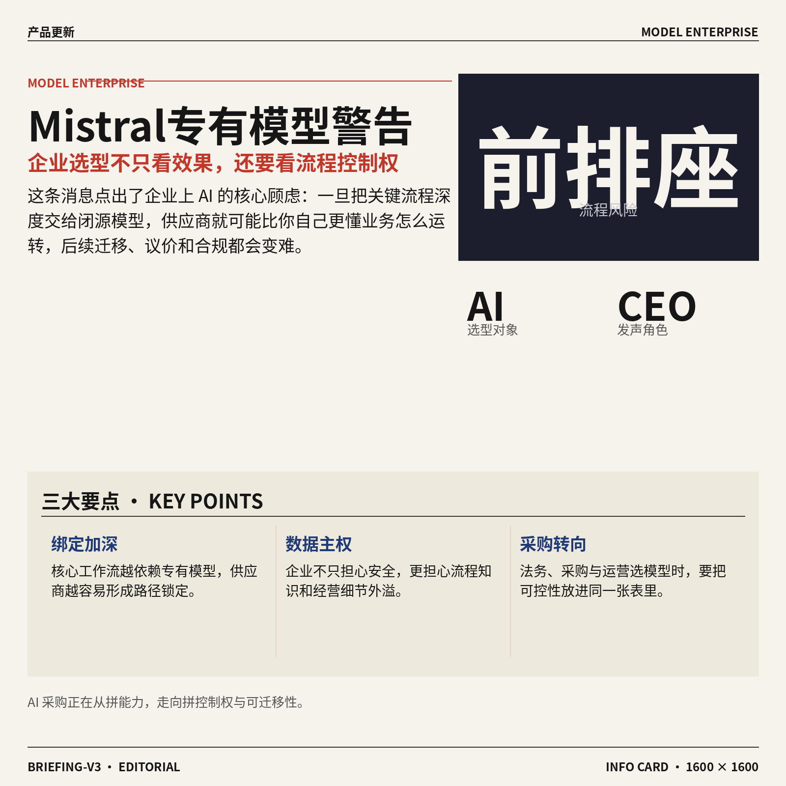

1. **Mistral CEO 警告：专有模型可能让 AI 实验室坐上你业务流程的“前排座”。**
Mistral 首席执行官 Arthur Mensch 这次把话说得很直白：如果企业把核心工作流深度交给**专有模型**（闭源、由供应商完全控制的模型），模型提供方就可能更贴近、也更了解你的业务怎么运转 💼。这条信息的重点不只是“安全焦虑”，而是企业在选模型时，得同时考虑**数据掌控权**和**供应商依赖**两件事。对采购、运营、法务这类岗位来说，这也提醒大家：AI 选型已经不是单纯比效果，还得看谁能真正守住企业流程与知识资产。[原文报道(briefing)](https://the-decoder.com/mistral-ceo-mensch-says-proprietary-ai-models-give-labs-a-front-row-seat-to-your-business-processes/)


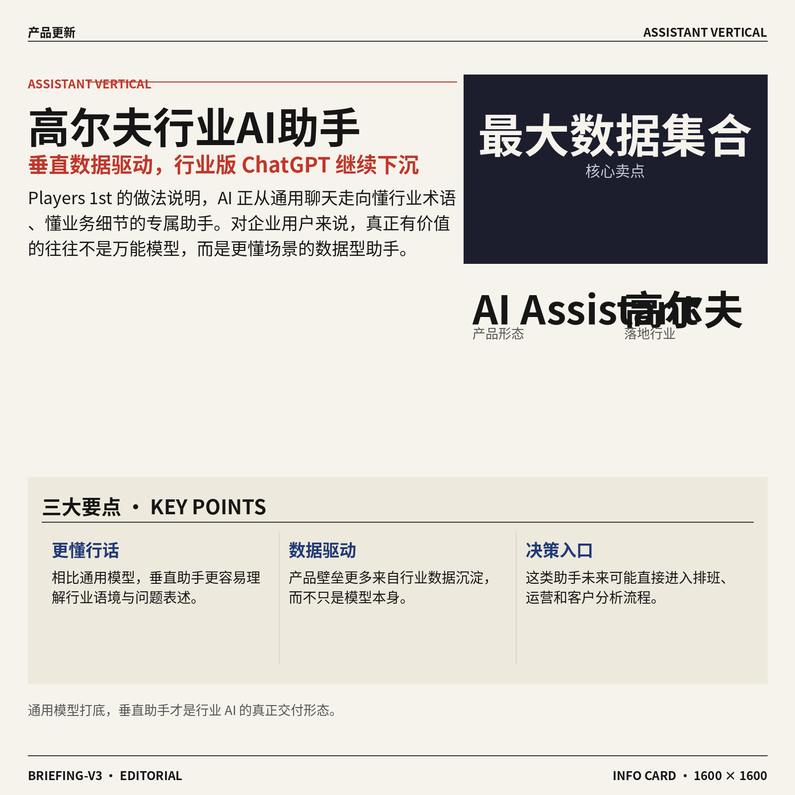

2. **Players 1st 推出高尔夫 AI Assistant（AI 助手），主打海量高尔夫数据分析。**
Players 1st 发布了一款面向高尔夫场景的**AI Assistant（AI 助手，用来根据已有资料和数据回答问题、给建议）**，核心卖点是基于其号称全球最大的高尔夫行业数据集合来提供洞察 ⛳。这类产品的意义在于，AI 不再只是通用聊天工具，而是越来越多地变成“懂行业黑话、懂业务细节”的**垂直助手**。对文职同事也很好理解：未来各行业都可能出现自己的“行业版 ChatGPT”，比通用模型更会讲本行业语言、也更容易直接用于日常决策。[发布消息(briefing)](https://news.google.com/rss/articles/CBMiYEFVX3lxTE41VmdDNEJRT0RtWEE2bkhNcmI0Zk81OENMM3NBY2JLeHZhYlMyLXJscDMxQTlUdThVb2ozZXctYzRhYkFQWHZwbDJkVkJxcm80OGdLSHRBUXRNclpkTDlRZQ?oc=5)


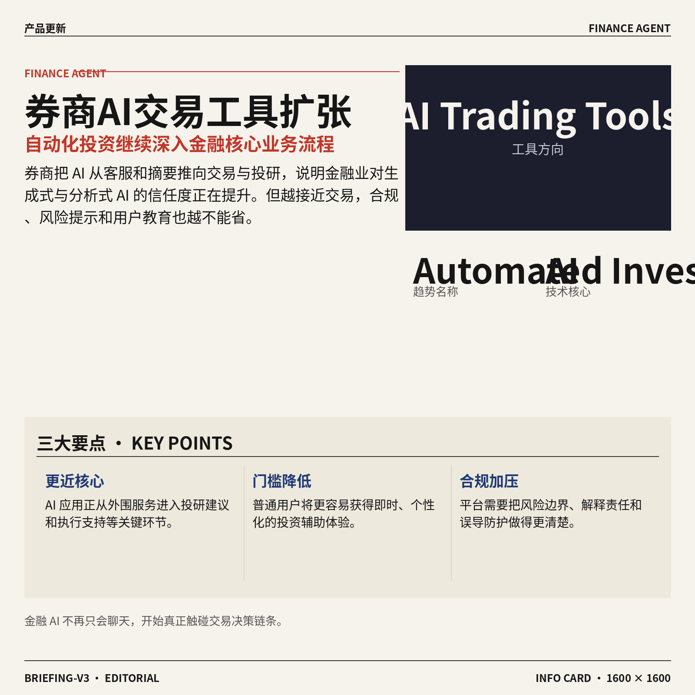

3. **券商加速上线 AI Trading Tools（AI 交易工具），自动化投资继续扩张。**
这条消息显示，越来越多券商正在推进**AI Trading Tools（AI 交易工具，帮助用户分析市场、生成投资建议或自动执行部分交易）**，背后趋势是**Automated Investing（自动化投资，把部分投研和执行流程交给系统）** 正在进一步普及 📈。它说明金融行业对 AI 的应用，已经从“客服和报告摘要”逐步走向更接近业务核心的位置。对普通职场人来说，这类变化意味着金融服务会越来越“即时、个性化、低门槛”，但同时也会让平台在风险提示、合规说明和用户教育上承担更大责任。[完整报道(briefing)](https://news.google.com/rss/articles/CBMipwFBVV95cUxONk5lMXhFNGw1T0wwOC1xUE8wWmE4UkVPTncwZVl0UmV1bllDZkJCd1YtOFJTZWEwQl9UUF93OHRMWm5XZGt4OWV6UWdNM2VHR29kd0FlMVdmQm5wcEZsNFdSWTRSRVNfSzNubUw4NVpyd1o5em5oSGZCMUloelpHdWkyVFhpU0h1VHlFcnhabVFjTE5Ub1R3TmoxZkVUOGJfZUlnNWQ1aw?oc=5)


### 🟢 前沿研究


1. **百度 Unlimited OCR（可一次处理超长文档的文字识别方案）尝试用“像人会遗忘”的记忆机制突破页数限制。**
传统 **OCR**（光学字符识别，把图片或扫描件里的文字转成可编辑文本）做多页长文档时，常会被上下文长度拖慢甚至“看不过来”；这项百度研究的思路，是让模型像人一样保留关键信息、逐步忘掉不重要内容，从而一次处理几十页材料 📄。对企业里常见的合同、报表、档案数字化场景来说，这意味着超长文档录入有望更省人工，也更适合后续接入 **RAG**（检索增强生成，让 AI 回答前先查资料）做知识问答。想看原始报道可读[研究新闻解读(briefing)](https://the-decoder.com/baidus-unlimited-ocr-processes-dozens-of-document-pages-in-one-pass-by-treating-memory-like-human-forgetting/) 💡


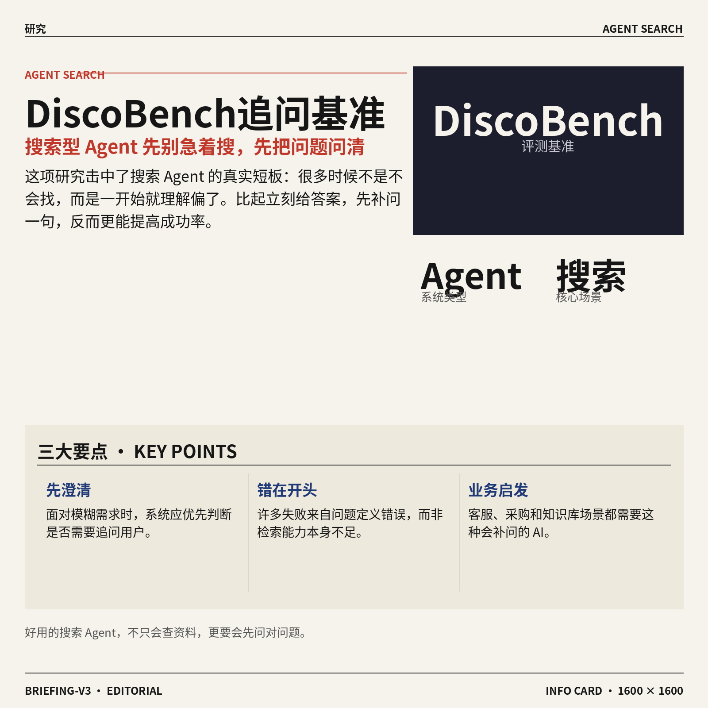

2. **DiscoBench（评测搜索型 Agent 何时该追问用户的基准）指出：AI 搜索不怕“不会搜”，更怕“一开始就问错”。**
这项研究聚焦一个很接地气的问题：当用户提问很含糊时，搜索型 **Agent** 应不应该先追问，而不是立刻去查资料 🔍。论文认为，很多失败并不是搜索能力不够，而是没有先做“澄清问题”这一步；为此提出了 **DiscoBench**（专门测试 AI 何时该补问细节的评测集），衡量系统在模糊任务中的判断力。对做客服、内部知识库、采购查询这类业务特别有启发——未来好用的 AI，不只是回答快，还要知道什么时候该先把需求问清楚。[论文页面(briefing)](https://huggingface.co/papers/2606.27669) 以及[媒体报道解读(briefing)](https://the-decoder.com/ai-search-agents-dont-fail-at-searching-they-fail-at-asking-the-right-questions-when-queries-get-ambiguous/)


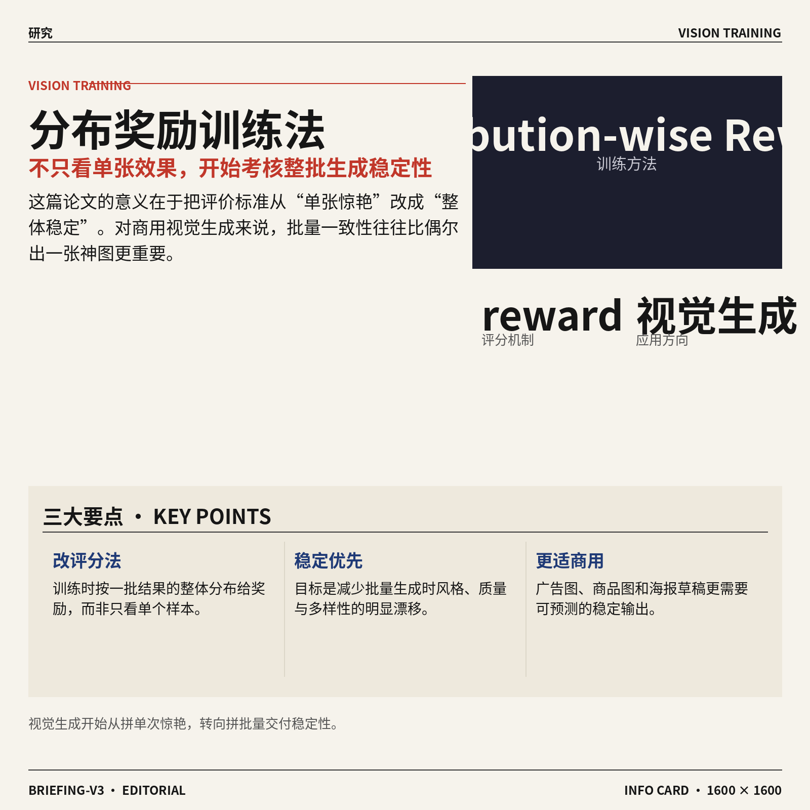

3. **Distribution-wise Rewards（按整体分布给奖励的训练方法）瞄准视觉生成模型“单张看着好、整体不稳定”的老问题。**
很多图像生成模型单看某几张效果不错，但批量生成时风格、质量和多样性容易飘；这篇论文提出 **Distribution-wise Rewards**（不是只奖励单个结果，而是从一批结果的整体分布来打分），希望让模型整体输出更均衡 🎨。这背后用到的 **reward**（奖励信号，相当于训练时给模型的“评分标准”）思路，更接近“看一整个作品集”而不是“只审一张图”。如果这类方法成熟，未来企业在做批量广告图、商品图、海报草稿时，稳定性可能比单次惊艳更有价值。[论文原文页(briefing)](https://huggingface.co/papers/2607.02291)


4. **Logit-Contribution Scoring（一种分析模型内部“谁在出力”的方法）可识别非字面检索头。**
这篇研究讨论的是大模型内部的 **retrieval heads**（检索头，模型注意力结构里专门负责“想起相关信息”的部分）并不总是按字面匹配工作，有些会进行更隐性的联想式召回 🧠。作者提出 **Logit-Contribution Scoring**（通过观察各部分对最终输出分数贡献多少，来定位关键模块），用来识别这些“非字面检索头”。这类工作虽然偏底层，但意义很现实：它能帮助研究者更好解释模型为什么会想起某段知识，也有助于后续提升可控性与可靠性。[论文页面(briefing)](https://huggingface.co/papers/2607.01002)


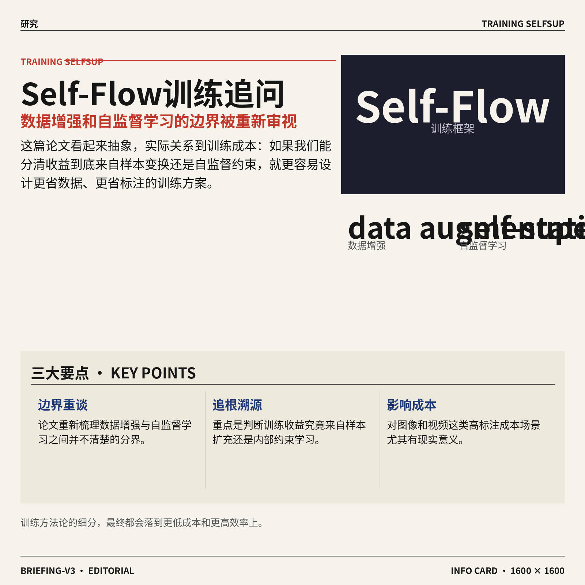

5. **Self-Flow（自流式训练框架）追问一个关键问题：这到底算数据增强，还是自监督学习？**
论文标题里的 **data augmentation**（数据增强，用裁剪、变换等方式“扩充”训练样本）和 **self-supervision**（自监督学习，不靠人工标注、让模型自己从数据里学规律）本来常被一起提，但边界并不总是清楚。作者从 **SRA** 到 **Self-Flow** 的脉络出发，重新讨论两者关系，试图回答某些训练收益到底来自“样本变多了”，还是“模型学会了更好的内部约束” 🤔。这类研究看似抽象，其实会影响大家今后怎么更省成本地训练模型——尤其是在标注数据昂贵的图像与视频场景里。[论文原文页(briefing)](https://huggingface.co/papers/2607.02508)

![Self-Flow（自流式训练框架）追问一个关键问题：这到底算数据增强，还是自监督学习？](https://image.pollinations.ai/prompt/Self-Flow%EF%BC%88%E8%87%AA%E6%B5%81%E5%BC%8F%E8%AE%AD%E7%BB%83%E6%A1%86%E6%9E%B6%EF%BC%89%E8%BF%BD%E9%97%AE%E4%B8%80%E4%B8%AA%E5%85%B3%E9%94%AE%E9%97%AE%E9%A2%98%EF%BC%9A%E8%BF%99%E5%88%B0%E5%BA%95%E7%AE%97%E6%95%B0%E6%8D%AE%E5%A2%9E%E5%BC%BA%EF%BC%8C%E8%BF%98%E6%98%AF%E8%87%AA%E7%9B%91%E7%9D%A3%E5%AD%A6%E4%B9%A0%EF%BC%9F.%20Self-Flow%EF%BC%88%E8%87%AA%E6%B5%81%E5%BC%8F%E8%AE%AD%E7%BB%83%E6%A1%86%E6%9E%B6%EF%BC%89%E8%BF%BD%E9%97%AE%E4%B8%80%E4%B8%AA%E5%85%B3%E9%94%AE%E9%97%AE%E9%A2%98%EF%BC%9A%E8%BF%99%E5%88%B0%E5%BA%95%E7%AE%97%E6%95%B0%E6%8D%AE%E5%A2%9E%E5%BC%BA%EF%BC%8C%E8%BF%98%E6%98%AF%E8%87%AA%E7%9B%91%E7%9D%A3%E5%AD%A6%E4%B9%A0%EF%BC%9F%20%E8%AE%BA%E6%96%87%E6%A0%87%E9%A2%98%E9%87%8C%E7%9A%84%20data%20augmentation%EF%BC%88%E6%95%B0%E6%8D%AE%E5%A2%9E%E5%BC%BA%EF%BC%8C%E7%94%A8%E8%A3%81%E5%89%AA%E3%80%81%E5%8F%98%2C%20technical%20infographic%20diagram%2C%20architecture%20flowchart%2C%20clean%20vector%20illustration%2C%20educational%20style%2C%20no%20text%20overlay%2C%20modern%20minimal%2C%20wide%20aspect?width=1200&height=675&nologo=true&seed=10931)

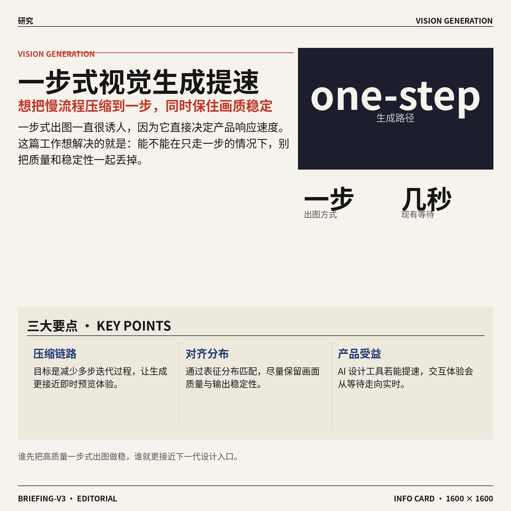

6. **Representation Distribution Matching（表征分布匹配）探索一步式视觉生成，想把慢流程压缩成快出图。**
所谓 **one-step visual generation**（一步式视觉生成，模型尽量一次就生成结果，而不是多轮逐步修正）一直很吸引人，因为它能显著缩短出图等待时间 ⚡。这篇论文提出 **Representation Distribution Matching**（让模型内部表征的整体分布尽量对齐），希望在只走一步的前提下，仍保住画面质量与稳定性。对产品团队来说，这类方向如果跑通，会直接影响 AI 设计工具的响应速度——从“等几秒”走向“几乎即时预览”。[论文页面(briefing)](https://huggingface.co/papers/2607.02375)


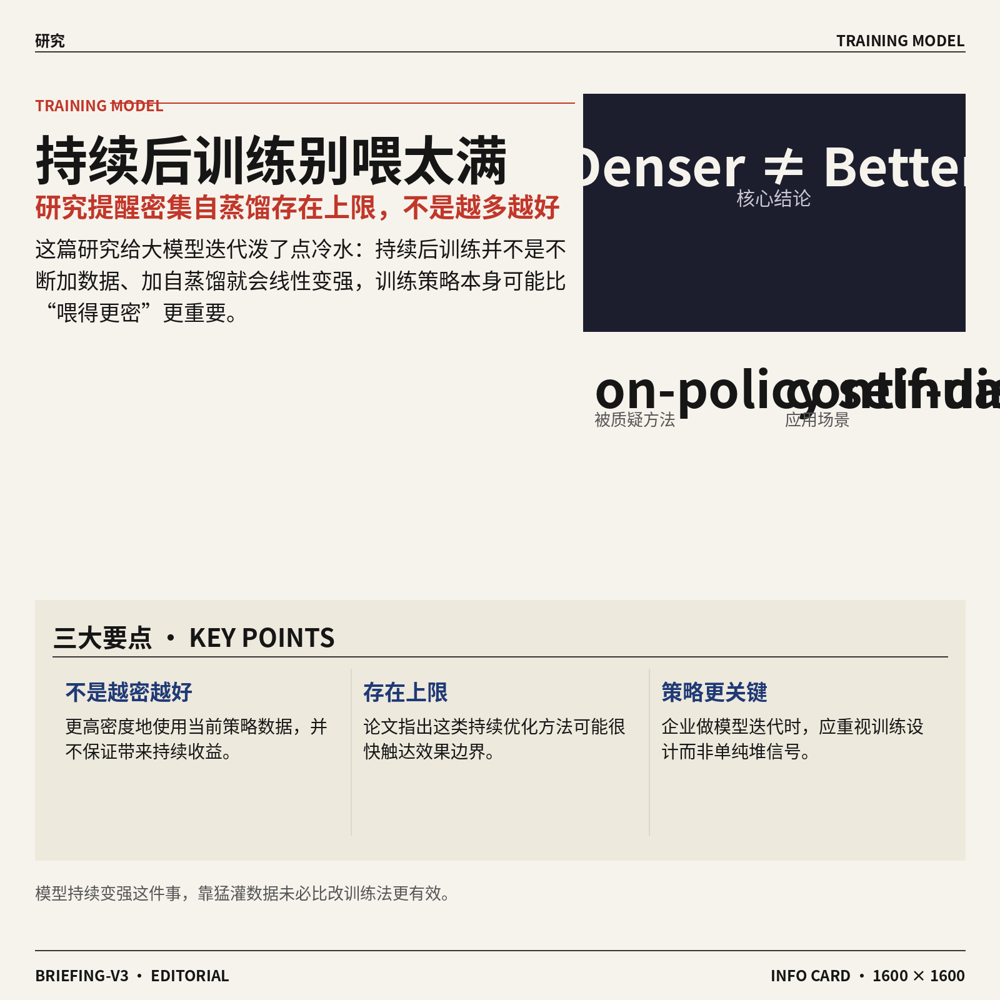

7. **Denser ≠ Better（更密集不等于更好）提醒业界：持续后训练不是把数据喂得越满越有效。**
这篇研究质疑 **on-policy self-distillation**（在模型自己当前策略生成的数据上，再反过来训练自己的做法）在 **continual post-training**（持续后训练，模型上线后继续迭代优化）里的效果边界。作者指出，更密集地使用这类训练信号，并不一定带来更好结果，反而可能存在明显上限 📉。对企业做大模型迭代尤其重要：这意味着“持续加料”不等于“持续变强”，训练策略本身可能比单纯堆数据更关键。[论文原文页(briefing)](https://huggingface.co/papers/2607.01763)


### 🟡 行业展望与社会影响

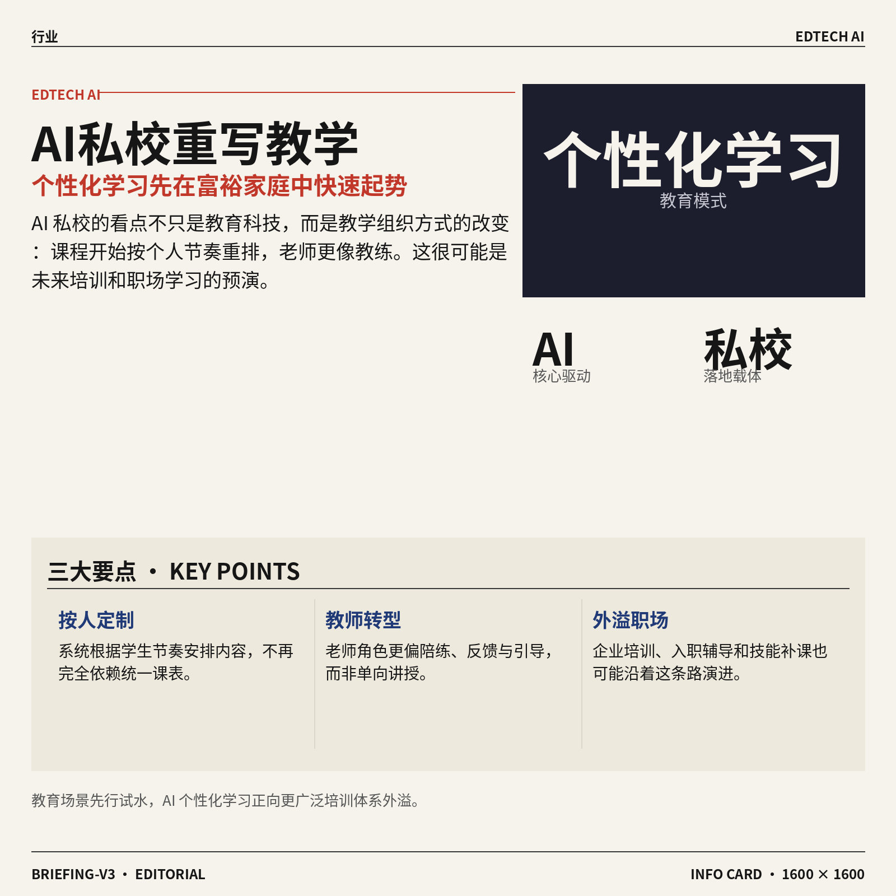

1. **美国富裕家庭追捧 AI 私校，用个性化学习挑战传统教育。**
一些美国高收入家庭正把孩子送进主打 **AI 个性化教学** 的私立学校：系统会按学生节奏安排内容，老师角色也更像陪练和引导者，而不是统一讲课的人 💡。这背后反映的不是单纯“换个上课工具”，而是教育模式开始从“同一套课表教所有人”转向“按人定制学习路径”。对企业同事来说，这也像是在提前预演未来职场培训：员工培训、入职学习、技能补课，之后都可能越来越依赖这种 **因人而异** 的 AI 辅助方式。[完整报道(briefing)](https://the-decoder.com/ai-private-schools-sell-wealthy-us-families-on-personalized-learning-over-traditional-education/)


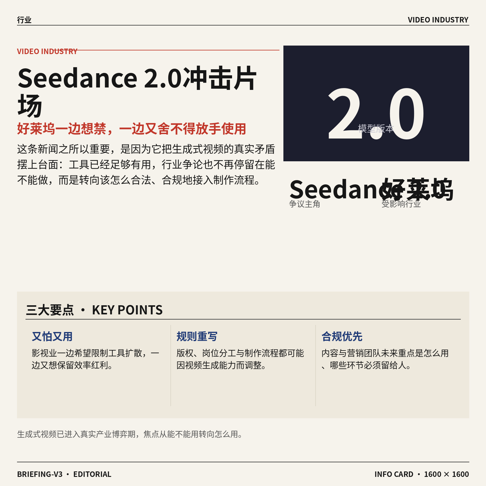

2. **Seedance 2.0（字节跳动推出的 AI 视频生成模型）让好莱坞又想禁又想用。**
报道显示，好莱坞一边希望限制 **Seedance 2.0** 这类 AI 视频工具，一边又据称不愿放弃它带来的制作效率，这种矛盾心态很有代表性 🎬。说白了，行业真正焦虑的不是“AI 能不能做内容”，而是当 **生成式 AI** 已经足够好用时，版权、岗位分工和制作流程该怎么重写。对内容、营销、设计团队来说，这意味着未来讨论 AI 时，重点会越来越从“要不要用”转向“怎么合规地用、哪些环节必须保留人工判断”。[完整报道(briefing)](https://the-decoder.com/hollywood-wants-seedance-banned-and-reportedly-also-wants-to-keep-using-it/)


3. **Amazon Mechanical Turk（亚马逊的众包人工标注平台）停止接收新客户，AI 数据外包老路走到拐点。**
TechCrunch 报道称，Amazon 将不再为 **Mechanical Turk（把大量零碎任务外包给网络劳工的平台，比如图片标注、问卷填写）** 接收新客户 🚧。这个平台曾是很多 AI 项目背后的“隐形人工层”，帮助企业低成本完成训练数据整理和质量检查，如今收缩也说明行业正在变化。它释放出的信号很现实：AI 产业不只是模型在变，连最基础的 **数据标注** 和众包劳动模式都在重组，企业以后可能会更重视自动化标注、私有数据流程和更正式的供应链管理。[TechCrunch 报道(briefing)](https://techcrunch.com/2026/07/05/amazon-will-stop-accepting-new-customers-for-mechanical-turk/)


4. **特朗普对私有 AI 模型设限，让开源路线再次升温。**
这篇报道指出，针对 **私有 AI 模型** 的政策限制，正在把更多注意力重新推向 **开源模型**——也就是任何组织都能下载、部署和改造的模型版本 🔄。这种变化的意义很大：当封闭产品面临更高监管或更强不确定性时，企业可能更愿意选择自己可控的方案。对公司管理层来说，开源不只是“省钱替代品”，更像一种 **风险分散** 手段：至少关键能力不会完全被单一供应商卡住。[报道原文(briefing)](https://news.google.com/rss/articles/CBMikwFBVV95cUxNM3R4SjNhdDktdk9mME91S1JDcnFHWXo5NkVwd3BqNlU3eEdLcFRKQTh0d3phRkJsQnRiZzBSQzJSbmNZMjdkdVV4TWlLLW1ZWkptNVl2M0I1empwajd1THFMRjI2ZEMtVUFjaXdaai10bnhGejBmOUZGN0NvVEJFa1Rzd1gtR1RxLXVfeEItMFhsd2PSAZgBQVVfeXFMTlU3Mk9MSVZGUmdETnR3dm9YWEY2NE5idHBKWHJXbTdiUjRGRnpTV1FYcGNHaDZTRFg1X2xXQUlZSWVvbVg1LS1zM1FYQnBNNmp4NDlHUnhLVmwwREJnVkZicTJCSjNNQmNaUW5nM2UxZmhuVWF2aUhMMEk1anRqek5Uem5QTEcyN0pEWXhuUjM3WEZDVXRXYks?oc=5)

![特朗普对私有 AI 模型设限，让开源路线再次升温](https://image.pollinations.ai/prompt/%E7%89%B9%E6%9C%97%E6%99%AE%E5%AF%B9%E7%A7%81%E6%9C%89%20AI%20%E6%A8%A1%E5%9E%8B%E8%AE%BE%E9%99%90%EF%BC%8C%E8%AE%A9%E5%BC%80%E6%BA%90%E8%B7%AF%E7%BA%BF%E5%86%8D%E6%AC%A1%E5%8D%87%E6%B8%A9.%20%E7%89%B9%E6%9C%97%E6%99%AE%E5%AF%B9%E7%A7%81%E6%9C%89%20AI%20%E6%A8%A1%E5%9E%8B%E8%AE%BE%E9%99%90%EF%BC%8C%E8%AE%A9%E5%BC%80%E6%BA%90%E8%B7%AF%E7%BA%BF%E5%86%8D%E6%AC%A1%E5%8D%87%E6%B8%A9%E3%80%82%20%E8%BF%99%E7%AF%87%E6%8A%A5%E9%81%93%E6%8C%87%E5%87%BA%EF%BC%8C%E9%92%88%E5%AF%B9%20%E7%A7%81%E6%9C%89%20AI%20%E6%A8%A1%E5%9E%8B%20%E7%9A%84%E6%94%BF%E7%AD%96%E9%99%90%E5%88%B6%EF%BC%8C%E6%AD%A3%E5%9C%A8%E6%8A%8A%E6%9B%B4%E5%A4%9A%E6%B3%A8%E6%84%8F%E5%8A%9B%E9%87%8D%E6%96%B0%E6%8E%A8%E5%90%91%20%E5%BC%80%E6%BA%90%E6%A8%A1%E5%9E%8B%E2%80%94%E2%80%94%E4%B9%9F%E5%B0%B1%E6%98%AF%E4%BB%BB%E4%BD%95%E7%BB%84%E7%BB%87%E9%83%BD%E8%83%BD%E4%B8%8B%2C%20technical%20infographic%20diagram%2C%20architecture%20flowchart%2C%20clean%20vector%20illustration%2C%20educational%20style%2C%20no%20text%20overlay%2C%20modern%20minimal%2C%20wide%20aspect?width=1200&height=675&nologo=true&seed=10900)

5. **GLAAD（关注 LGBTQ 群体权益的美国组织）梳理 AI 对 LGBTQ 人群的失误与修复方向。**
这篇文章聚焦一个容易被忽略的问题：AI 在服务 **LGBTQ（性少数群体）** 用户时，可能出现误判、刻板印象或不恰当内容，影响的不只是体验，还有公平性与信任感 🧭。GLAAD 给出的价值，在于把“AI 偏见”从抽象讨论拉回真实使用场景：谁被系统误解、谁更容易被排除、企业该怎样修正。对做产品、客服、品牌和人事的团队来说，这提醒大家，**包容性设计** 不是公关口号，而是 AI 系统上线前必须认真检查的一环。[相关报道(briefing)](https://news.google.com/rss/articles/CBMiiAFBVV95cUxPSDlfRnBKS2FhZmV4ZVR0T05SbzQzemQ3QnlWQzV4OWhDc1BRYVJPM2NRNkdHT1JmLVI3dndQeHZLTmVCTm5DUy1lVG1TejNMVTVrMGVlbm0yc2daNE5QRi0wdnJDRTdJeDhYNWhieldZUUdNUFBFTENfQ0drRUhTdVFsN1FSRWtK?oc=5)


6. **Midjourney 在版权拉锯战中，反过来要求公开影视公司的 AI 使用情况。**
在与影视公司的版权争议里，Midjourney 正试图推动披露对方自己的 **AI 实践**，让这场争论不只停留在“AI 公司是否侵权”，也延伸到“传统内容公司自己是否也在用类似工具” 👀。这会让版权战越来越不像单纯的法律攻防，而更像一场关于行业双重标准的博弈。对外部看热闹的人来说，重点不是谁喊得更响，而是谁能拿出更一致的规则：如果大家都在用 AI，那未来真正决定胜负的，可能是 **授权机制** 和透明度，而不是口头立场。[完整报道(briefing)](https://news.google.com/rss/articles/CBMihAFBVV95cUxOMmNha2hiZGtiTG9XLVM3T3dTUnJic2pkQzVEWGx6bldOTy1ManJxZHpDSHlQNnpMWHFuZHhUTnVSQ0lvNlg3WnEzRHFEamhEbmIxRzlWTjdaRHQ2TFZNQ2hZaXFweks1VzF2Q0tDT2JMaTFzZ3dueHN3QjgwQll2RDBJc2c?oc=5)


7. **Fable 5（一款用自然语言协助开发软件的 AI 编程工具）配合 Claude Code，几小时把 2003 年老游戏移植到 iOS。**
报道提到，开发者借助 **Fable 5（用文字指令协助改代码、迁移软件的工具）** 和 **Claude Code**，在短时间内把经典 PC 游戏《命令与征服》移植成原生 **iOS（苹果手机和平板操作系统）** 版本 ⚙️。这件事吸引人的地方，不只是“AI 写代码更快了”，而是软件改造、旧系统迁移、跨平台移植这些原本很费人的工作，正在被大幅压缩。对企业来说，这类能力的外溢影响很现实：以后内部老系统升级、历史工具重做、移动端适配，门槛都可能被 AI 再往下拉一截。[完整报道(briefing)](https://the-decoder.com/claude-code-and-fable-5-ported-the-2003-pc-game-command-conquer-to-native-ios-in-a-few-hours/)

![Fable 5（一款用自然语言协助开发软件的 AI 编程工具）配合 Claude Code，几小时把 2003 年老游戏移植到 iOS](https://image.pollinations.ai/prompt/Fable%205%EF%BC%88%E4%B8%80%E6%AC%BE%E7%94%A8%E8%87%AA%E7%84%B6%E8%AF%AD%E8%A8%80%E5%8D%8F%E5%8A%A9%E5%BC%80%E5%8F%91%E8%BD%AF%E4%BB%B6%E7%9A%84%20AI%20%E7%BC%96%E7%A8%8B%E5%B7%A5%E5%85%B7%EF%BC%89%E9%85%8D%E5%90%88%20Claude%20Code%EF%BC%8C%E5%87%A0%E5%B0%8F%E6%97%B6%E6%8A%8A%202003%20%E5%B9%B4%E8%80%81%E6%B8%B8%E6%88%8F%E7%A7%BB%E6%A4%8D%E5%88%B0%20iOS.%20Fable%205%EF%BC%88%E4%B8%80%E6%AC%BE%E7%94%A8%E8%87%AA%E7%84%B6%E8%AF%AD%E8%A8%80%E5%8D%8F%E5%8A%A9%E5%BC%80%E5%8F%91%E8%BD%AF%E4%BB%B6%E7%9A%84%20AI%20%E7%BC%96%E7%A8%8B%E5%B7%A5%E5%85%B7%EF%BC%89%E9%85%8D%E5%90%88%20Claude%20Code%EF%BC%8C%E5%87%A0%E5%B0%8F%E6%97%B6%E6%8A%8A%202003%20%E5%B9%B4%E8%80%81%E6%B8%B8%E6%88%8F%E7%A7%BB%E6%A4%8D%E5%88%B0%20iOS%E3%80%82%20%E6%8A%A5%E9%81%93%E6%8F%90%E5%88%B0%EF%BC%8C%E5%BC%80%E5%8F%91%E8%80%85%E5%80%9F%E5%8A%A9%2C%20technical%20infographic%20diagram%2C%20architecture%20flowchart%2C%20clean%20vector%20illustration%2C%20educational%20style%2C%20no%20text%20overlay%2C%20modern%20minimal%2C%20wide%20aspect?width=1200&height=675&nologo=true&seed=10993)

### 🟣 开源TOP项目

1. **box3d（一个给游戏做碰撞和运动效果的 3D 物理引擎）开源上线。**  
这个项目主打 **3D 物理模拟**，可以帮开发者快速做出物体碰撞、掉落、反弹这类更真实的游戏效果 🎮。所谓物理引擎，就是提前把“重力、速度、碰撞规则”封装好，开发者不用从零手搓一套。对做游戏、互动演示，甚至一些数字孪生（把现实场景做成可计算的虚拟副本）项目的人来说，能明显节省底层开发时间。[GitHub 仓库(briefing)](https://github.com/erincatto/box3d)


2. **claude-video（让 Claude 能“看视频”的工具）把视频理解门槛降下来了。**  
这个项目的思路很直白：用户通过 `/watch` 指令，把视频先**下载**、再抽取关键**帧**（视频里的单张画面）、再做**转录**（把语音变成文字），最后一并交给 Claude 分析 👀。这意味着 Claude 不只是“读文字”，而是能基于画面和字幕一起理解视频内容。对做培训整理、会议复盘、内容审核的人来说，这类“视频转可提问资料”的流程会很有想象空间。[项目说明页(briefing)](https://github.com/bradautomates/claude-video)


3. **seedance-2.0（围绕 Seedance 2.0 的 AI 影视制作流程包）瞄准“四模态”创作。**  
这个仓库提供的是一套更完整的 **AI 电影生产流水线**，而不只是单点工具 🎬。摘要里提到的 quad-modal（四模态，指把多种内容形态协同起来）可以理解为让文字、画面、声音等素材在同一流程里联动，减少创作时来回切工具的麻烦。对内容团队、短片团队和品牌创意团队来说，这类“流程化”项目的价值，在于把零散的 AI 能力拼成可重复执行的产出链路。[GitHub 仓库(briefing)](https://github.com/Emily2040/seedance-2.0)


4. **ai-goofish-monitor（用 AI 盯闲鱼商品的监控系统）把“捡漏”做成自动化。**  
这个项目基于 Playwright（浏览器自动化工具，能模拟人打开网页、搜索、点击）和 **AI 分析**，支持对闲鱼商品做**实时**或**定时**监控，还配了比较完整的后台管理界面 🛒。它的核心价值是帮用户从海量商品里自动筛选、分析，减少人工反复刷页面的时间。对二手交易重度用户，或者想研究“监控+分析+提醒”这类自动化业务流程的人来说，很有参考意义。[项目仓库说明(briefing)](https://github.com/Usagi-org/ai-goofish-monitor)


5. **T3MP3ST（一个自主化红队测试平台）把 AI 安全对抗做成多 Agent 协作。**  
所谓 red teaming（红队测试，指站在攻击者视角主动找系统漏洞和风险），这个项目把它做成了 autonomous（自主式，不必每一步都人工盯着）的平台 🛡️。摘要里的 multi-agent（多 Agent，多个 AI 助手分工协作）和 offensive-security（进攻性安全，主动模拟攻击来测安全）说明，它更像是一个让多个 AI 角色协同开展安全测试的“总控台”。这类项目对安全团队、模型评估团队尤其重要，因为 AI 系统越强，越需要更系统化的压力测试。[GitHub 项目页(briefing)](https://github.com/elder-plinius/T3MP3ST)


6. **Meetily（主打本地处理的 AI 会议助手）把转写、分人、总结都放到电脑本地。**  
这个项目强调 **privacy first（隐私优先，数据尽量不上传云端）**，支持实时会议转录、speaker diarization（说话人区分，自动判断“这句话是谁说的”）和 Ollama（本地大模型运行工具，让模型直接在自己电脑上跑）总结 🧠。摘要还提到它用了 Parakeet/Whisper（两种语音识别模型，用来把语音转成文字）以及 Rust（一种更强调性能和稳定性的编程语言）构建，并且 100% local processing（全本地处理，不依赖云服务）。对重视合规、保密和会议记录效率的团队来说，这种“本地会议纪要助手”很有吸引力。[GitHub 仓库(briefing)](https://github.com/Zackriya-Solutions/meetily)

![Meetily（主打本地处理的 AI 会议助手）把转写、分人、总结都放到电脑本地](https://image.pollinations.ai/prompt/Meetily%EF%BC%88%E4%B8%BB%E6%89%93%E6%9C%AC%E5%9C%B0%E5%A4%84%E7%90%86%E7%9A%84%20AI%20%E4%BC%9A%E8%AE%AE%E5%8A%A9%E6%89%8B%EF%BC%89%E6%8A%8A%E8%BD%AC%E5%86%99%E3%80%81%E5%88%86%E4%BA%BA%E3%80%81%E6%80%BB%E7%BB%93%E9%83%BD%E6%94%BE%E5%88%B0%E7%94%B5%E8%84%91%E6%9C%AC%E5%9C%B0.%20Meetily%EF%BC%88%E4%B8%BB%E6%89%93%E6%9C%AC%E5%9C%B0%E5%A4%84%E7%90%86%E7%9A%84%20AI%20%E4%BC%9A%E8%AE%AE%E5%8A%A9%E6%89%8B%EF%BC%89%E6%8A%8A%E8%BD%AC%E5%86%99%E3%80%81%E5%88%86%E4%BA%BA%E3%80%81%E6%80%BB%E7%BB%93%E9%83%BD%E6%94%BE%E5%88%B0%E7%94%B5%E8%84%91%E6%9C%AC%E5%9C%B0%E3%80%82%20%E8%BF%99%E4%B8%AA%E9%A1%B9%E7%9B%AE%E5%BC%BA%E8%B0%83%20privacy%20first%EF%BC%88%E9%9A%90%E7%A7%81%E4%BC%98%E5%85%88%EF%BC%8C%E6%95%B0%E6%8D%AE%E5%B0%BD%E9%87%8F%E4%B8%8D%E4%B8%8A%E4%BC%A0%E4%BA%91%E7%AB%AF%EF%BC%89%EF%BC%8C%E6%94%AF%2C%20technical%20infographic%20diagram%2C%20architecture%20flowchart%2C%20clean%20vector%20illustration%2C%20educational%20style%2C%20no%20text%20overlay%2C%20modern%20minimal%2C%20wide%20aspect?width=1200&height=675&nologo=true&seed=11156)

### 🔴 社媒分享

1. **新型 AI tutor（AI 辅导系统，能像助教一样陪学陪练）在达特茅斯课程中取得显著学习提升。**
这篇材料提到，一款新的 **AI tutor** 在达特茅斯课程里实现了 **0.71–1.30 SD effect size**（标准差效应值，用来衡量教学干预效果有多大，数值越高通常代表提升越明显）📈。简单说，这不是“学生觉得好用”这么主观，而是用教育研究里常见的量化指标来评估学习成效，说明 AI 在**教学辅导**上的作用开始更接近“能不能真的提高成绩”这个硬指标。对企业培训、内部学习平台甚至新人带教来说，这类结果很值得关注：未来 AI 可能不只是答题工具，而是更像能持续陪跑的“数字导师” 🤖。[论文原文 PDF(briefing)](https://intextbooks.science.uu.nl/workshop2026/files/itb26_s1s2.pdf)

![新型 AI tutor（AI 辅导系统，能像助教一样陪学陪练）在达特茅斯课程中取得显著学习提升](https://image.pollinations.ai/prompt/%E6%96%B0%E5%9E%8B%20AI%20tutor%EF%BC%88AI%20%E8%BE%85%E5%AF%BC%E7%B3%BB%E7%BB%9F%EF%BC%8C%E8%83%BD%E5%83%8F%E5%8A%A9%E6%95%99%E4%B8%80%E6%A0%B7%E9%99%AA%E5%AD%A6%E9%99%AA%E7%BB%83%EF%BC%89%E5%9C%A8%E8%BE%BE%E7%89%B9%E8%8C%85%E6%96%AF%E8%AF%BE%E7%A8%8B%E4%B8%AD%E5%8F%96%E5%BE%97%E6%98%BE%E8%91%97%E5%AD%A6%E4%B9%A0%E6%8F%90%E5%8D%87.%20%E6%96%B0%E5%9E%8B%20AI%20tutor%EF%BC%88AI%20%E8%BE%85%E5%AF%BC%E7%B3%BB%E7%BB%9F%EF%BC%8C%E8%83%BD%E5%83%8F%E5%8A%A9%E6%95%99%E4%B8%80%E6%A0%B7%E9%99%AA%E5%AD%A6%E9%99%AA%E7%BB%83%EF%BC%89%E5%9C%A8%E8%BE%BE%E7%89%B9%E8%8C%85%E6%96%AF%E8%AF%BE%E7%A8%8B%E4%B8%AD%E5%8F%96%E5%BE%97%E6%98%BE%E8%91%97%E5%AD%A6%E4%B9%A0%E6%8F%90%E5%8D%87%E3%80%82%20%E8%BF%99%E7%AF%87%E6%9D%90%E6%96%99%E6%8F%90%E5%88%B0%EF%BC%8C%E4%B8%80%E6%AC%BE%E6%96%B0%E7%9A%84%20AI%20tutor%20%E5%9C%A8%E8%BE%BE%E7%89%B9%E8%8C%85%E6%96%AF%E8%AF%BE%E7%A8%8B%E9%87%8C%E5%AE%9E%E7%8E%B0%2C%20technical%20infographic%20diagram%2C%20architecture%20flowchart%2C%20clean%20vector%20illustration%2C%20educational%20style%2C%20no%20text%20overlay%2C%20modern%20minimal%2C%20wide%20aspect?width=1200&height=675&nologo=true&seed=10613)

2. **sqlite-utils（一个把 SQLite 数据库操作变简单的工具）4.0rc2 发布。**
这次更新来自 Simon Willison 的项目动态，核心是 **sqlite-utils 4.0rc2**，其中 **rc2**（发布候选版，意思是正式版前的接近完成版本）已经放出，方便开发者提前试用和反馈 🛠️。SQLite（一个轻量级数据库，很多本地应用和小型系统都在用）本来就以“省事”著称，而这个工具的定位就是让导入、查询、处理数据这类动作更顺手。对不写代码的同事来说，它背后的意义是：AI 和数据工具的门槛还在继续下降，未来做报表、整理业务数据、搭建轻量知识库时，可能会有更多“开箱即用”的基础设施可选 💡。[作者发布说明(briefing)](https://simonwillison.net/2026/Jul/5/sqlite-utils/#atom-everything) [GitHub 发布页(briefing)](https://github.com/simonw/sqlite-utils/releases/tag/4.0rc2)


---

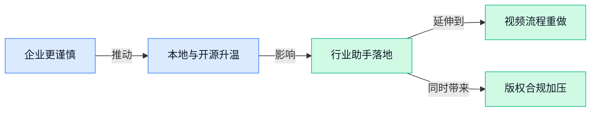

### 📊 行业洞察（今日 4 条）

1. Mistral 警告专有模型会看穿企业流程，特朗普又对私有模型设限，Meetily 这类本地处理工具也在冒头
  【洞察】企业买 AI，考核点正从“效果强不强”转向“数据归谁、能不能自己掌控”，可控性开始变成真需求

2. Players 1st 做高尔夫助手，券商加速上线 AI 交易工具，AI 私校和达特茅斯 AI 辅导也都在跑通
  【洞察】AI 正从通用聊天变成行业专员，真正有壁垒的不是模型本身，而是行业数据、流程和结果责任

3. Seedance 2.0 让好莱坞一边想禁一边想用，Midjourney 又反咬影视公司公开自家 AI 使用情况
  【洞察】内容行业已进入“离不开 AI、又讲不清规则”的阶段，接下来拼的不是态度，而是谁先把授权和留痕做明白

4. 百度 Unlimited OCR 能一次读几十页，claude-video 让 Claude 可看视频，DiscoBench 还指出 AI 常败在没先问清需求
  【洞察】下一代 AI 产品不再只是会生成，而是先看懂长文档、视频和模糊指令，理解能力会比炫技更值钱

### 💭 对我们的启发（今日 3 条）

1. Seedance 2.0 流程包、claude-video 和百度 Unlimited OCR 放一起看，我们产品该补“先理解素材再剪辑”的能力，比如读口播、看画面、抓商品卖点，而不只是加生成按钮。

2. Mistral 对专有模型的警告，加上 Meetily 这种全本地工具在起量，说明品牌商会越来越在意素材和投放数据外流；我们要准备私有化、本地处理或敏感环节不出云的方案。

3. DiscoBench 说明 AI 最大问题常不是不会做，而是没问清；做视频工具时，别让 AI 直接开剪，先追问平台、时长、商品、风格，能明显减少废片和人工返工成本。

