## AI资讯日报 2026/7/7

> AI 早报 · 每日早读 · 全网深度聚合

## **今日摘要**

```
微软近5000人裁员重砍Xbox与销售，亚马逊关闭Mechanical Turk，AI吃掉的不只岗位是整条标注链
阿里巴巴因蒸馏攻击指控禁用Anthropic，中国下线拟人化聊天角色，企业AI合规与安全同时收紧
智谱AI推出ZCode（AI编程助手）低价硬刚Claude Code与Codex，Nvidia Kyber NVL144（AI服务器）却被曝延后一整年
```

### 🔵 产品与功能更新

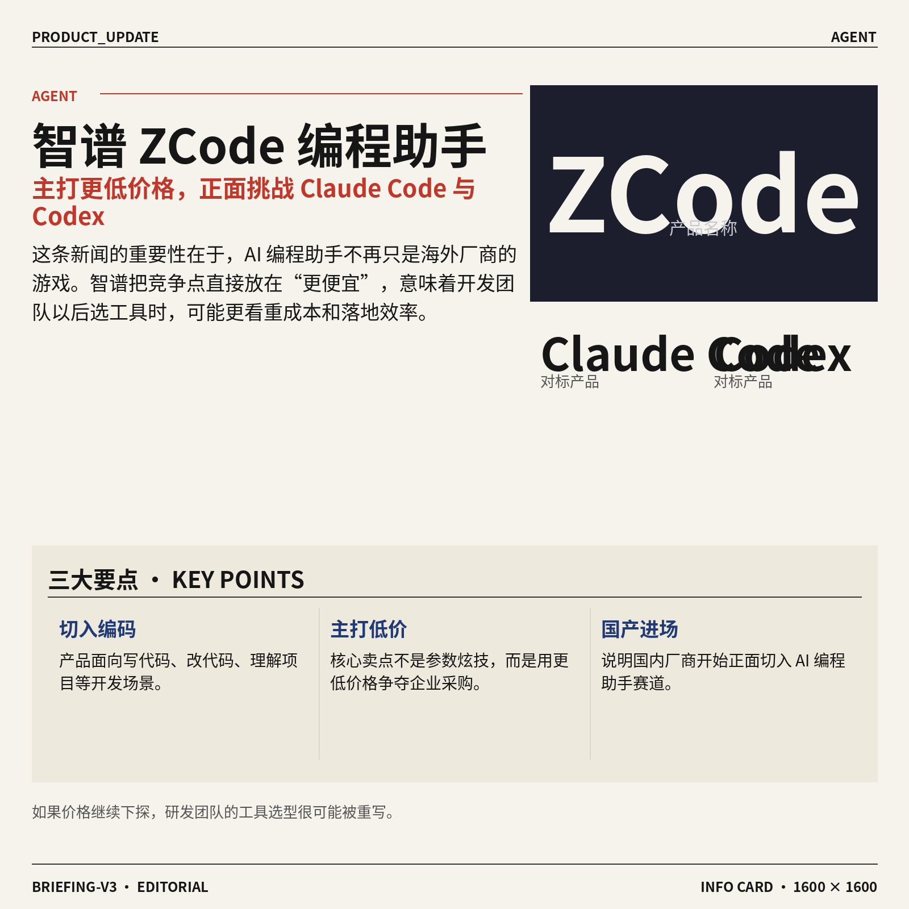

1. **智谱 AI 推出 ZCode（AI 编程助手），想用更低价格挑战 Claude Code 和 Codex。**
这条更新的核心很直接：**智谱 AI** 上线了面向编程场景的 **ZCode（帮开发者写代码、改代码、理解项目的 AI 助手）**，并把卖点放在“**更便宜**”上 💡。对公司来说，这类工具如果价格进一步打下来，最先受影响的就是研发团队的**日常编码成本**和工具采购选择。虽然这条消息主要聚焦产品定位与价格竞争，但也能看出国内厂商正在正面切入 **AI 编程助手** 赛道，而不只是跟随聊天产品。可通过[相关报道原文(briefing)](https://news.google.com/rss/articles/CBMitwFBVV95cUxOTUYtRUVHLU9oaExOQlphQ2FwRVV5VWNjblhobEdsdzB2UG5MbGZaYVh2Y2I3aEpIdXY0Y05ZUlkwNlpVVE51OVFpSVNCaTJPUjBJaVVmUkFTZ21GbkJJWk1WcFhTdGxUeW1SaWl2MklBYkxNQVZZSHJwME42eEVWWkdLQmpJTmh6N1RCenpoZEtkbXloRW5tSVF1WFBxWkp3ZlpvUnhsb2pwZnd1NmdtUXRRRExyRjA?oc=5)了解详情。


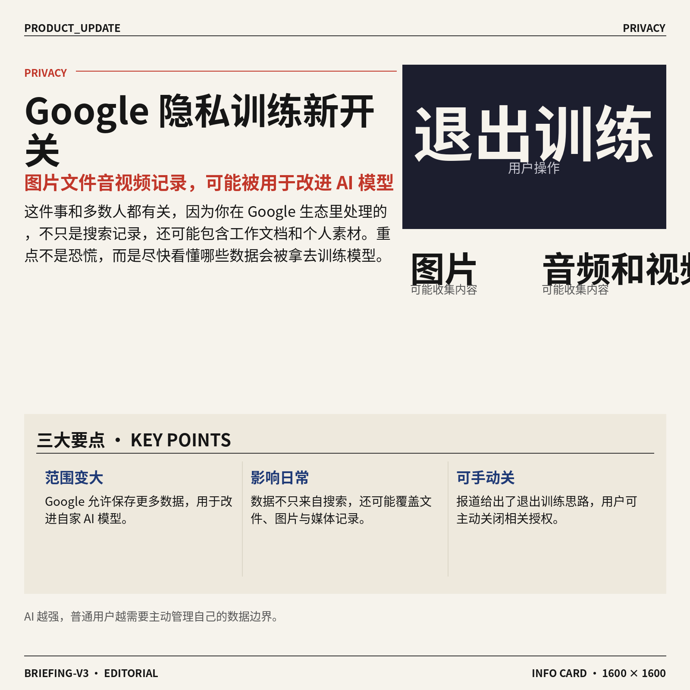

2. **Google 隐私设置变动：你日常使用的数据，可能正在被拿去训练 AI。**
TechCrunch 提醒用户，Google 最近调整了**隐私设置**，允许公司保存更多数据来改进自家 **AI 模型**，其中包括图片、文件、音频和视频记录 😯。这件事对普通同事尤其重要，因为很多人平时在 Google 生态里处理的内容并不只是搜索记录，还可能包含工作素材与个人资料。好消息是，报道也给出了**退出训练**的操作思路，也就是主动关闭相关数据使用授权，避免自己的内容继续被用于模型优化。想看具体影响与退出方式，可参考[TechCrunch 完整报道(briefing)](https://techcrunch.com/2026/07/06/if-you-use-google-youre-training-its-ai-heres-how-to-opt-out/)。


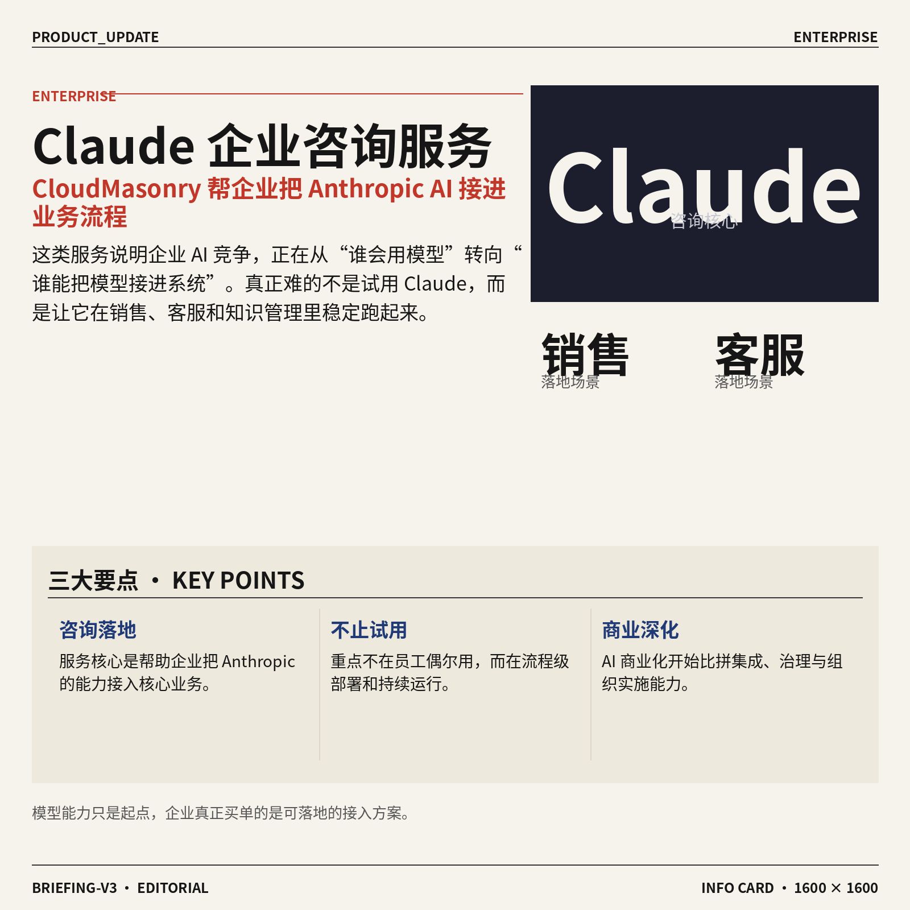

3. **CloudMasonry 推出 Claude 咨询服务，帮企业把 Anthropic 的 AI 更深接入业务。**
CloudMasonry 宣布上线专门的 **Claude 咨询服务**，目标很明确：帮助企业把 **Anthropic** 的 AI 能力放进核心业务流程，而不是只停留在“员工自己偶尔用一用”的阶段 🚀。这类“咨询 + 落地”服务的意义在于，很多公司真正卡住的不是会不会用模型，而是怎么把它接进销售、客服、知识管理等日常系统里。换句话说，AI 商业化正在从“模型谁更强”进一步走向“谁能真正部署到企业内部并跑起来”。更多信息可查看[发布消息原文(briefing)](https://news.google.com/rss/articles/CBMiggJBVV95cUxQR0lDYWg1X2Q0WTZtbGlMdUNTNXR2dmVSTUlfM1BRemVsdFR4NW5MUE1TWmFMTUt5U3hrRGdOaG1KNEVLN2tZNkY0bXFpTUpvUTRxQVZpRFc1MGZLSjlDamprTURxVnBrY19ZNVEwQnBmeWtMV1o3N21yU0dUWFBIMEM1clIxaElPdXhCdnhYUXRMSDFWRjFIZmZPZUt5RUdlZHhSSVY4c0dRQjRsN0ZudFNhVXltd2l1dDk5T3VqRkpQMmpsNzdYcWFFc3drbmtxN3paeHRTYUdNT2ZyelEwOXpaanJDWHR5TDBMSUZiY1o1RHZpVjd2bEZSSFVDSDVwN3c?oc=5)。


### 🟢 前沿研究

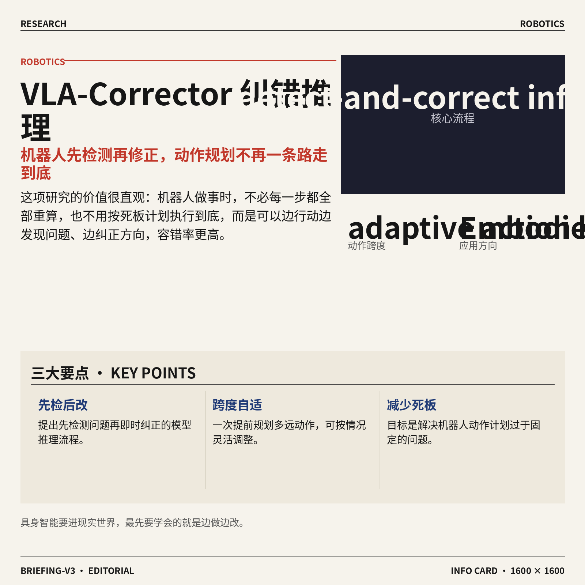

1. **VLA-Corrector（一种让机器人模型先检测再纠错的推理方案）提出自适应动作跨度思路。**
这篇论文关注的是 **Embodied AI（具身智能，让 AI 通过机器人“看见并动手”完成现实任务）** 在执行动作时怎么少犯错 💡。它提出 **detect-and-correct inference（先检测问题再即时纠正的模型推理流程）**，并围绕 **adaptive action horizon（自适应动作跨度，简单说就是一次提前规划多远的动作）** 做轻量化设计，想解决机器人动作计划太死板的问题。对行业来说，这类研究的意义在于：机器人不一定每一步都重算一遍，也不必一条指令走到底，而是能更灵活地“边走边修正” 🤖。[论文摘要页(briefing)](https://huggingface.co/papers/2607.01804)

![VLA-Corrector（一种让机器人模型先检测再纠错的推理方案）提出自适应动作跨度思路](https://image.pollinations.ai/prompt/VLA-Corrector%EF%BC%88%E4%B8%80%E7%A7%8D%E8%AE%A9%E6%9C%BA%E5%99%A8%E4%BA%BA%E6%A8%A1%E5%9E%8B%E5%85%88%E6%A3%80%E6%B5%8B%E5%86%8D%E7%BA%A0%E9%94%99%E7%9A%84%E6%8E%A8%E7%90%86%E6%96%B9%E6%A1%88%EF%BC%89%E6%8F%90%E5%87%BA%E8%87%AA%E9%80%82%E5%BA%94%E5%8A%A8%E4%BD%9C%E8%B7%A8%E5%BA%A6%E6%80%9D%E8%B7%AF.%20VLA-Corrector%EF%BC%88%E4%B8%80%E7%A7%8D%E8%AE%A9%E6%9C%BA%E5%99%A8%E4%BA%BA%E6%A8%A1%E5%9E%8B%E5%85%88%E6%A3%80%E6%B5%8B%E5%86%8D%E7%BA%A0%E9%94%99%E7%9A%84%E6%8E%A8%E7%90%86%E6%96%B9%E6%A1%88%EF%BC%89%E6%8F%90%E5%87%BA%E8%87%AA%E9%80%82%E5%BA%94%E5%8A%A8%E4%BD%9C%E8%B7%A8%E5%BA%A6%E6%80%9D%E8%B7%AF%E3%80%82%20%E8%BF%99%E7%AF%87%E8%AE%BA%E6%96%87%E5%85%B3%E6%B3%A8%E7%9A%84%E6%98%AF%20Embodied%20AI%EF%BC%88%E5%85%B7%E8%BA%AB%E6%99%BA%E8%83%BD%EF%BC%8C%E8%AE%A9%20AI%20%E9%80%9A%E8%BF%87%2C%20technical%20infographic%20diagram%2C%20architecture%20flowchart%2C%20clean%20vector%20illustration%2C%20educational%20style%2C%20no%20text%20overlay%2C%20modern%20minimal%2C%20wide%20aspect?width=1200&height=675&nologo=true&seed=10807)

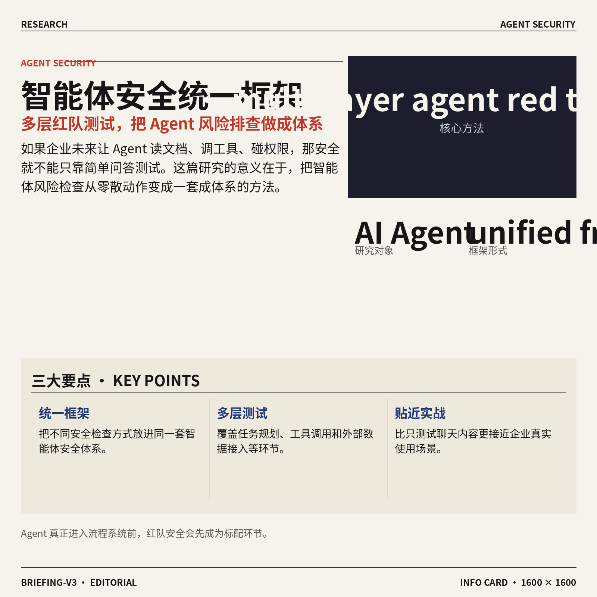

2. **Securing the AI Agent（面向智能体安全的统一框架）主打多层红队测试。**
这项研究聚焦 **AI Agent** 的安全问题，提出一个 **unified framework（统一框架，把不同安全检查方式放到同一套体系里）**，用于 **multi-layer agent red teaming（多层智能体红队测试，意思是像攻防演练一样系统找漏洞）**。红队测试不只是“问坏问题”，还可能覆盖任务规划、工具调用、外部数据接入等多个环节，因此更贴近真实使用场景 🔍。对企业来说，这类工作很重要，因为未来大家用 Agent 处理流程、文档和系统权限时，安全边界会比普通聊天机器人复杂得多。[论文摘要页(briefing)](https://huggingface.co/papers/2606.31227)


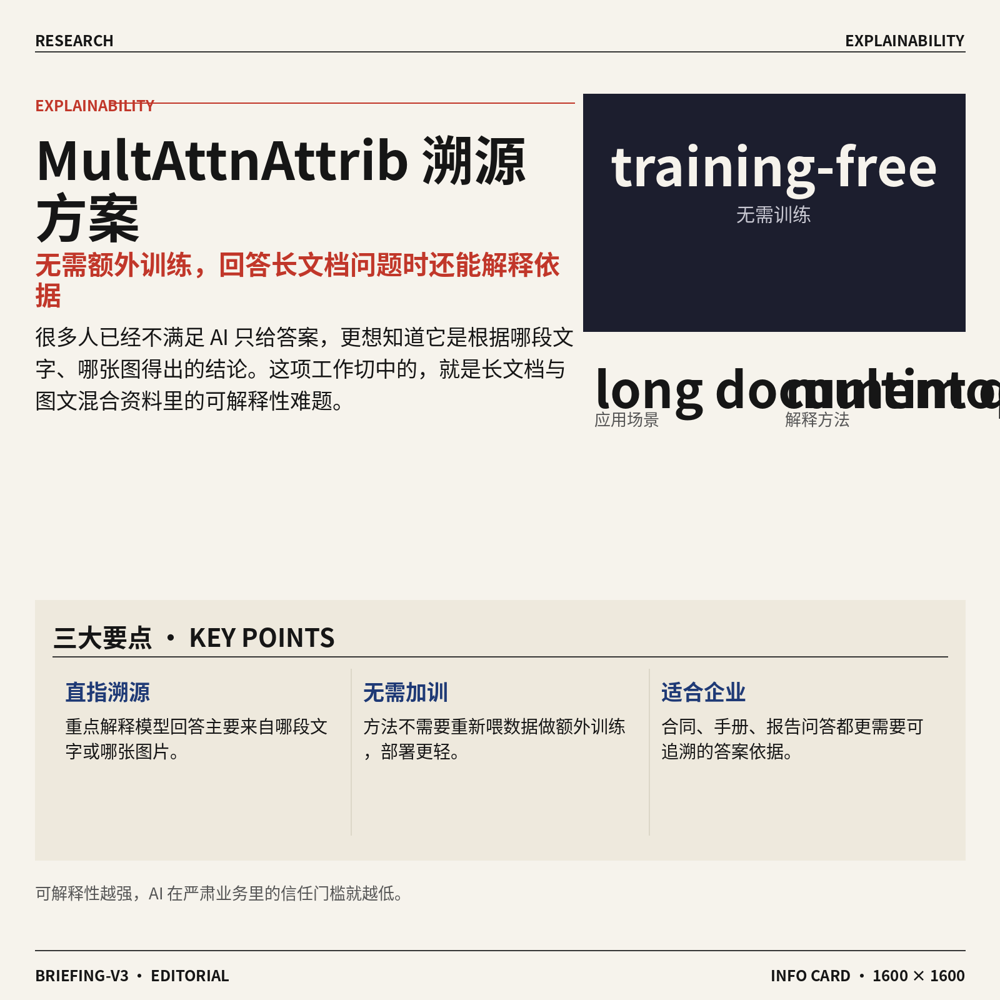

3. **MultAttnAttrib（一种无需额外训练的多模态溯源方法）瞄准长文档问答可解释性。**
这篇论文研究的是 **long document question answering（长文档问答，让模型在很长的资料里找答案）** 场景下，AI 到底依据了哪些内容来作答 🧭。它提出 **training-free（无需额外训练，不用再喂新数据重新训练模型）** 的 **multimodal attribution（多模态归因，定位答案主要来自哪段文字、哪张图）** 方法，重点放在图文混合资料的解释能力上。对非技术团队也有现实意义：以后如果 AI 帮你读合同、报告、手册，大家不仅想要答案，还会想知道“它是根据哪里说的”。[论文摘要页(briefing)](https://huggingface.co/papers/2607.01420)


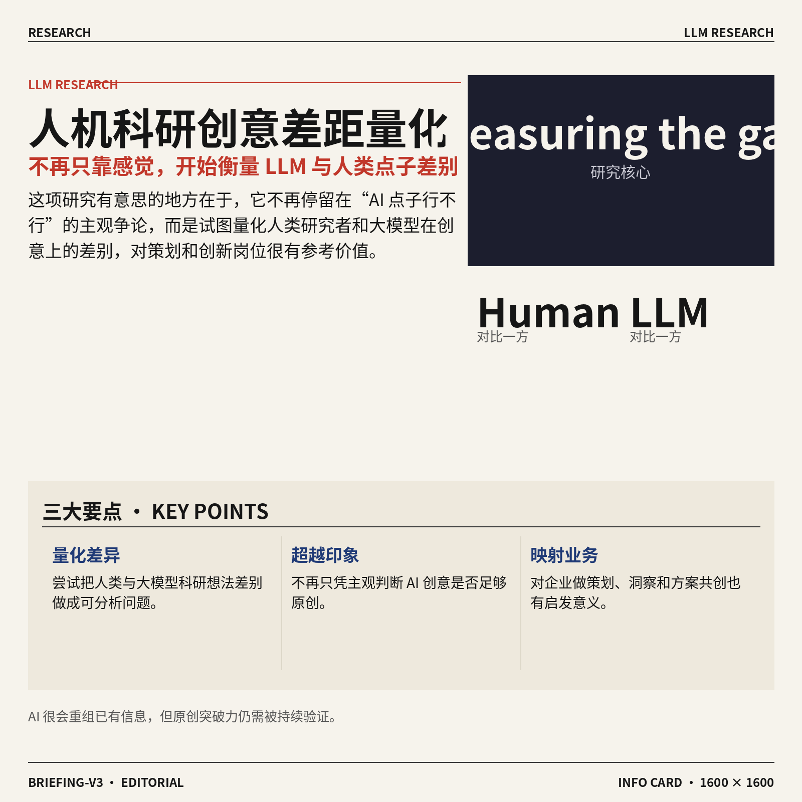

4. **Measuring the Gap Between Human and LLM Research Ideas（衡量人类与大模型科研想法差距）尝试把“创意差异”量化。**
这项研究直指一个很有讨论度的话题：**LLM（大语言模型，像 ChatGPT 这类能理解和生成文字的模型）** 提出的研究点子，和人类研究者的想法到底差在哪儿 🤔。论文核心是 **measuring the gap（量化差距）**，也就是不再只凭主观印象判断“AI 点子行不行”，而是尝试做成可分析的问题。它的价值不只是学术圈自我反思，也关系到企业怎么用 AI 做策划、洞察和方案共创：AI 可能很会组合已有信息，但是否真有原创突破，这件事值得持续观察。[论文摘要页(briefing)](https://huggingface.co/papers/2607.01233)


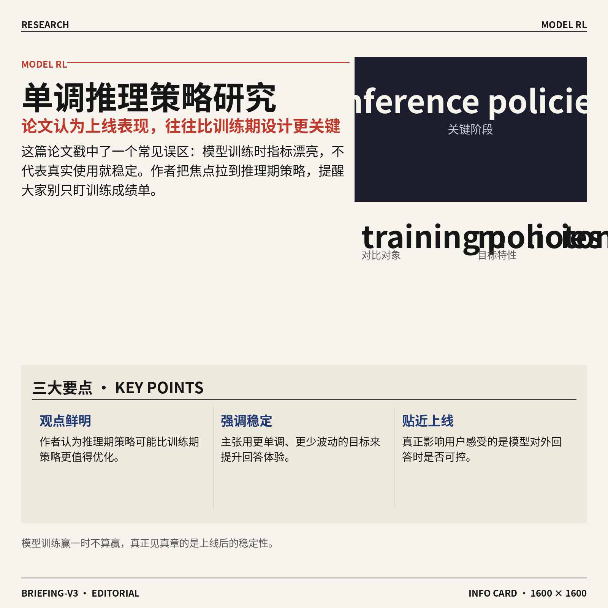

5. **Monotonic Inference Policies（单调推理策略，让模型回答阶段更稳定的策略）被论文认为比训练期策略更关键。**
这篇论文讨论 **LLM reinforcement learning（大模型强化学习，让模型通过奖励机制学会更符合目标的回答方式）** 到底应该优化什么，观点相当鲜明 ⚙️。作者认为，与其过度关注 **training policies（训练期策略，模型训练时采用的决策规则）**，不如把重点放在 **inference policies（推理期策略，模型真正对外回答时的行为规则）**，尤其是更稳定的 **monotonic（单调、逐步改进而不反复波动）** 目标。对业务侧的启发是：一个模型“训练时看起来更强”，不代表上线后就一定更好，真正影响体验的往往是它在实际回答阶段是否稳定、可控。[论文摘要页(briefing)](https://huggingface.co/papers/2606.29526)

![Monotonic Inference Policies（单调推理策略，让模型回答阶段更稳定的策略）被论文认为比训练期策略更关键](https://image.pollinations.ai/prompt/Monotonic%20Inference%20Policies%EF%BC%88%E5%8D%95%E8%B0%83%E6%8E%A8%E7%90%86%E7%AD%96%E7%95%A5%EF%BC%8C%E8%AE%A9%E6%A8%A1%E5%9E%8B%E5%9B%9E%E7%AD%94%E9%98%B6%E6%AE%B5%E6%9B%B4%E7%A8%B3%E5%AE%9A%E7%9A%84%E7%AD%96%E7%95%A5%EF%BC%89%E8%A2%AB%E8%AE%BA%E6%96%87%E8%AE%A4%E4%B8%BA%E6%AF%94%E8%AE%AD%E7%BB%83%E6%9C%9F%E7%AD%96%E7%95%A5%E6%9B%B4%E5%85%B3%E9%94%AE.%20Monotonic%20Inference%20Policies%EF%BC%88%E5%8D%95%E8%B0%83%E6%8E%A8%E7%90%86%E7%AD%96%E7%95%A5%EF%BC%8C%E8%AE%A9%E6%A8%A1%E5%9E%8B%E5%9B%9E%E7%AD%94%E9%98%B6%E6%AE%B5%E6%9B%B4%E7%A8%B3%E5%AE%9A%E7%9A%84%E7%AD%96%E7%95%A5%EF%BC%89%E8%A2%AB%E8%AE%BA%E6%96%87%E8%AE%A4%E4%B8%BA%E6%AF%94%E8%AE%AD%E7%BB%83%E6%9C%9F%E7%AD%96%E7%95%A5%E6%9B%B4%E5%85%B3%E9%94%AE%E3%80%82%20%E8%BF%99%E7%AF%87%E8%AE%BA%E6%96%87%E8%AE%A8%E8%AE%BA%20LLM%20rei%2C%20technical%20infographic%20diagram%2C%20architecture%20flowchart%2C%20clean%20vector%20illustration%2C%20educational%20style%2C%20no%20text%20overlay%2C%20modern%20minimal%2C%20wide%20aspect?width=1200&height=675&nologo=true&seed=10931)

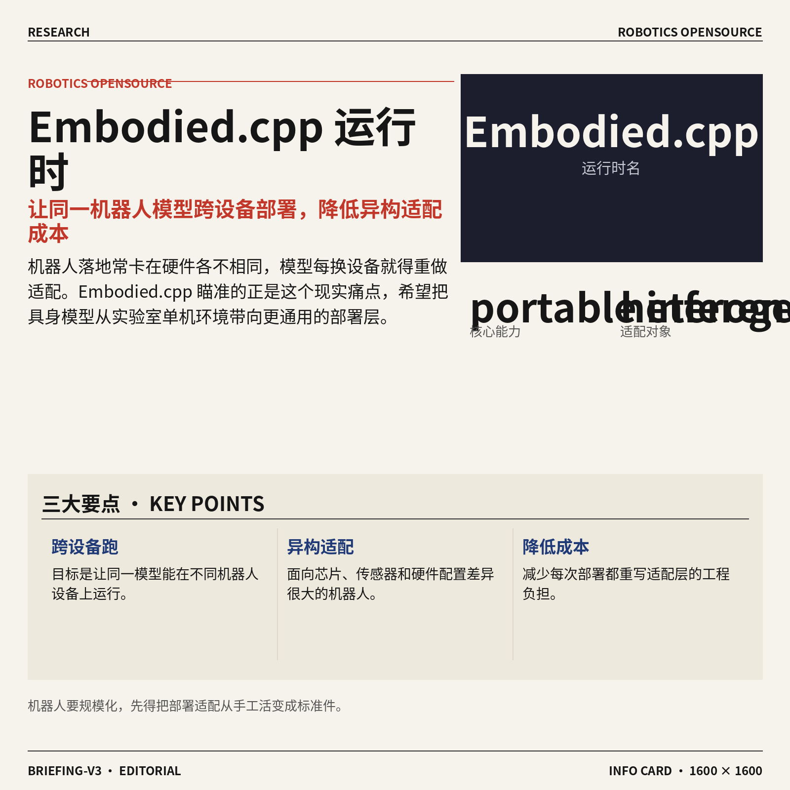

6. **Embodied.cpp（一套让机器人模型跨设备运行的推理运行时）想解决异构机器人适配难题。**
这项工作关注 **portable inference runtime（可移植推理运行时，让同一模型能在不同设备上跑起来）**，对象是 **heterogeneous robots（异构机器人，指硬件配置、芯片和传感器都不一样的机器人）**。论文里的 **Embodied AI（具身智能，让 AI 在真实物理环境中感知和行动）** 模型，不再只停留在实验室单一设备，而是朝“多种机器人都能部署”这个方向推进 🚀。这类研究如果走通，会降低机器人应用落地时反复改适配层的成本，对制造、物流和服务场景都很关键。[论文摘要页(briefing)](https://huggingface.co/papers/2607.02501)


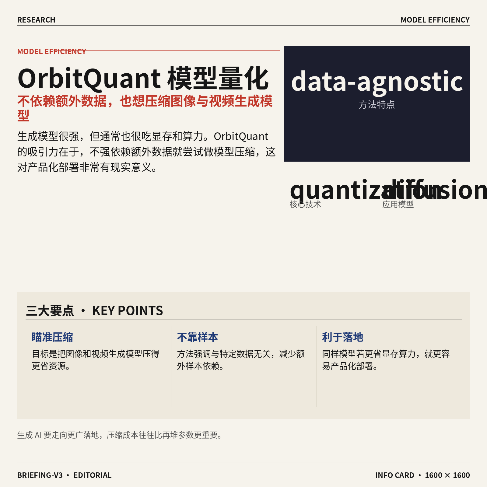

7. **OrbitQuant（一种无需依赖数据的量化方法）试图压缩图像与视频生成模型。**
这篇论文瞄准的是 **quantization（量化，把模型参数压缩成更省显存和算力的表示方式）**，应用对象是 **diffusion transformers（扩散 Transformer，一类常用于图像和视频生成的模型架构）**。它强调 **data-agnostic（与特定数据无关）**，意思是不强依赖额外样本数据也能做压缩，这对模型部署很有吸引力 📦。简单说，如果同样的生成模型能更省资源地运行，就更有机会从“大厂机房专属”走向更广泛的产品化落地。[论文摘要页(briefing)](https://huggingface.co/papers/2607.02461)

![OrbitQuant（一种无需依赖数据的量化方法）试图压缩图像与视频生成模型](https://image.pollinations.ai/prompt/OrbitQuant%EF%BC%88%E4%B8%80%E7%A7%8D%E6%97%A0%E9%9C%80%E4%BE%9D%E8%B5%96%E6%95%B0%E6%8D%AE%E7%9A%84%E9%87%8F%E5%8C%96%E6%96%B9%E6%B3%95%EF%BC%89%E8%AF%95%E5%9B%BE%E5%8E%8B%E7%BC%A9%E5%9B%BE%E5%83%8F%E4%B8%8E%E8%A7%86%E9%A2%91%E7%94%9F%E6%88%90%E6%A8%A1%E5%9E%8B.%20OrbitQuant%EF%BC%88%E4%B8%80%E7%A7%8D%E6%97%A0%E9%9C%80%E4%BE%9D%E8%B5%96%E6%95%B0%E6%8D%AE%E7%9A%84%E9%87%8F%E5%8C%96%E6%96%B9%E6%B3%95%EF%BC%89%E8%AF%95%E5%9B%BE%E5%8E%8B%E7%BC%A9%E5%9B%BE%E5%83%8F%E4%B8%8E%E8%A7%86%E9%A2%91%E7%94%9F%E6%88%90%E6%A8%A1%E5%9E%8B%E3%80%82%20%E8%BF%99%E7%AF%87%E8%AE%BA%E6%96%87%E7%9E%84%E5%87%86%E7%9A%84%E6%98%AF%20quantization%EF%BC%88%E9%87%8F%E5%8C%96%EF%BC%8C%E6%8A%8A%E6%A8%A1%E5%9E%8B%E5%8F%82%E6%95%B0%E5%8E%8B%E7%BC%A9%E6%88%90%E6%9B%B4%E7%9C%81%E6%98%BE%E5%AD%98%E5%92%8C%E7%AE%97%E5%8A%9B%2C%20technical%20infographic%20diagram%2C%20architecture%20flowchart%2C%20clean%20vector%20illustration%2C%20educational%20style%2C%20no%20text%20overlay%2C%20modern%20minimal%2C%20wide%20aspect?width=1200&height=675&nologo=true&seed=10993)

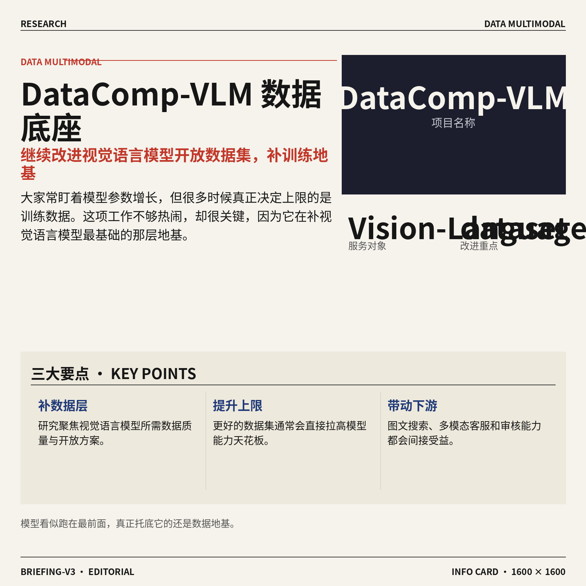

8. **DataComp-VLM（面向视觉语言模型的开放数据集改进项目）继续补数据底座。**
这项研究聚焦 **Vision-Language Models（视觉语言模型，能同时理解图片和文字的模型）** 所需的数据质量问题，提出更完善的开放数据集方案 🗂️。相比大家平时更关注“模型参数又变大了”，这类工作其实是在补 **dataset（数据集，训练 AI 的基础材料）** 这一层的地基：数据更好，模型上限通常也会更高。对行业来说，开放数据集的持续改进会影响很多下游产品，从图文搜索到多模态客服，再到内容审核，都会间接受益。[论文摘要页(briefing)](https://huggingface.co/papers/2606.28551)


### 🟡 行业展望与社会影响

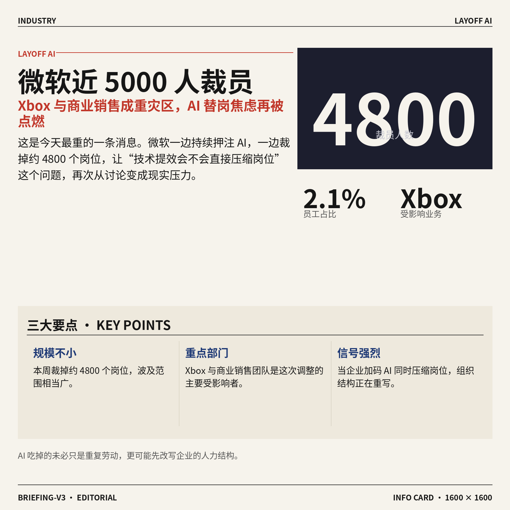

1. **Microsoft 近 5000 人裁员，Xbox 与商业销售成重灾区。**
Microsoft 本周裁掉约 **4800 个岗位**，约占全球员工总数的 **2.1%**，其中 **Xbox** 和 **商业销售团队**受影响最明显。这条消息之所以格外刺痛人，是因为它再次点燃了“**AI 是否正在替代岗位**”的担忧 😶‍🌫️。对普通职场人来说，这不只是科技公司的内部调整，更像是在提醒大家：当企业一边加码 AI，一边压缩传统岗位时，组织结构和能力要求都在变。[裁员报道全文(briefing)](https://techcrunch.com/2026/07/06/microsoft-lays-off-nearly-5000-employees-across-xbox-commercial-sales/)


2. **中国要求头部 AI 平台下线“拟人化聊天角色”，监管开始卡住情感陪伴边界。**
中国正在推动大型 AI 平台关闭过于 **像真人** 的聊天机器人角色，重点显然不只是技术能力，而是 **情感依赖** 与 **平台责任** 的边界问题。所谓拟人化 persona（角色设定，让用户感觉自己在和某种“真实人格”对话）一旦做得太像，用户就可能把工具当关系对象，这也是监管最担心的地方 💬。这件事说明，AI 产品接下来不只拼好不好用，还要回答“该不该这么做”的问题，尤其是面向未成年人、陪伴和心理支持场景时更敏感。[监管动态解读(briefing)](https://the-decoder.com/china-forces-its-biggest-ai-platforms-to-shut-down-humanlike-chatbot-personas/)


3. **阿里巴巴因“蒸馏攻击”指控禁用 Anthropic，企业 AI 使用开始卷入安全与合规。**
据报道，阿里巴巴已禁止员工使用 Anthropic 的 AI 服务，背景是所谓 **distillation attack（蒸馏攻击，把别家模型的回答“学走”，低成本模仿其能力）** 指控。这类争议表面看是公司之间的攻防，实质上反映出企业在接入外部大模型时，越来越担心 **数据安全**、**知识产权** 和 **合规责任** ⚠️。对公司管理层来说，未来“能不能用某个 AI 工具”不只是效率问题，还会变成采购、法务和内控共同参与的决策。[相关报道入口(briefing)](https://news.google.com/rss/articles/CBMif0FVX3lxTE53Ykl5M1J5SW5wclpRaERtUUllclU0clBCaTlPYVJ5WWVGQkpIUTRYaXJJcS1XcmVYa2lVUkZhQnpWQ0NvY3h1alBReENVT1RZa2tJMWQ3SHdMU1F2cVJuWjM0bktmZElSbGE4WVk5VWd2VnRaa2FpRm5PM2cySU3SAYQBQVVfeXFMUC13eFAwV0ZDbm02SURnMjhrd3JvUEUzeHcxdEFkNFQzbFZwUnkyMDU0MnhqYzRzaHpLZjR3MHRSQ2VycnRuaXRVd3YyNzE5UUxMN2NKQU1DamFKYV9qLVNsN0NpS1VabzVnQjluZ05odnViTUZFM2txRUpkZHhRS3hGYUhs?oc=5)

![阿里巴巴因“蒸馏攻击”指控禁用 Anthropic，企业 AI 使用开始卷入安全与合规](https://image.pollinations.ai/prompt/%E9%98%BF%E9%87%8C%E5%B7%B4%E5%B7%B4%E5%9B%A0%E2%80%9C%E8%92%B8%E9%A6%8F%E6%94%BB%E5%87%BB%E2%80%9D%E6%8C%87%E6%8E%A7%E7%A6%81%E7%94%A8%20Anthropic%EF%BC%8C%E4%BC%81%E4%B8%9A%20AI%20%E4%BD%BF%E7%94%A8%E5%BC%80%E5%A7%8B%E5%8D%B7%E5%85%A5%E5%AE%89%E5%85%A8%E4%B8%8E%E5%90%88%E8%A7%84.%20%E9%98%BF%E9%87%8C%E5%B7%B4%E5%B7%B4%E5%9B%A0%E2%80%9C%E8%92%B8%E9%A6%8F%E6%94%BB%E5%87%BB%E2%80%9D%E6%8C%87%E6%8E%A7%E7%A6%81%E7%94%A8%20Anthropic%EF%BC%8C%E4%BC%81%E4%B8%9A%20AI%20%E4%BD%BF%E7%94%A8%E5%BC%80%E5%A7%8B%E5%8D%B7%E5%85%A5%E5%AE%89%E5%85%A8%E4%B8%8E%E5%90%88%E8%A7%84%E3%80%82%20%E6%8D%AE%E6%8A%A5%E9%81%93%EF%BC%8C%E9%98%BF%E9%87%8C%E5%B7%B4%E5%B7%B4%E5%B7%B2%E7%A6%81%E6%AD%A2%E5%91%98%E5%B7%A5%E4%BD%BF%E7%94%A8%20Anthropic%20%E7%9A%84%20AI%20%E6%9C%8D%E5%8A%A1%EF%BC%8C%E8%83%8C%2C%20technical%20infographic%20diagram%2C%20architecture%20flowchart%2C%20clean%20vector%20illustration%2C%20educational%20style%2C%20no%20text%20overlay%2C%20modern%20minimal%2C%20wide%20aspect?width=1200&height=675&nologo=true&seed=10869)

4. **Nvidia 的 Kyber NVL144（新一代 AI 服务器系统）被曝推迟超一年，算力军备竞赛也会“卡壳”。**
报道称，Nvidia 的 **Kyber NVL144（面向大规模 AI 训练和推理的服务器级系统）** 交付时间被推迟了一年多，连带亚洲供应链企业也受到影响。表面看这只是硬件延期，实际上会直接影响企业扩建 **GPU cluster（显卡集群，训练大模型的核心硬件设施）** 的节奏 ⏳。这也提醒市场一个现实：AI 热潮再猛，最终仍受制于芯片、封装、供货和整机交付，行业发展并不是一路直线加速。[延期消息解读(briefing)](https://the-decoder.com/nvidias-kyber-nvl144-reportedly-pushed-back-more-than-a-year-asian-suppliers-drop/)


5. **JADEPUFFER（首个“代理式”勒索软件组织）出现，AI 攻击开始像员工一样自主干活。**
报道将 **JADEPUFFER** 称为首个 **agentic ransomware（代理式勒索软件，能自己规划步骤并连续执行攻击的恶意程序）** 行动，意味着网络攻击正在从“单次工具”升级为“会自己推进流程的数字打手”。这种变化的危险在于，旧漏洞本来就没修完，如今 AI 能把侦察、渗透、横向移动（在同一组织内继续扩散攻击）等步骤大幅提速，问题会被成倍放大 😨。对任何机构来说，这都不是“IT 部门的事”了，而是经营连续性、数据安全和声誉风险的共同挑战。[安全威胁分析(briefing)](https://the-decoder.com/jadepuffer-is-the-first-agentic-ransomware-operation-and-it-exposes-old-security-sins-at-machine-speed/)


6. **阿尔伯塔省政府用 Claude 排查并修复网络安全漏洞，AI 开始进入政府基础运维。**
Anthropic 发布案例称，加拿大阿尔伯塔省政府正使用 **Claude** 来发现并修复政府系统中的 **cybersecurity vulnerabilities（网络安全漏洞，也就是系统里可能被黑客利用的薄弱点）**。这说明 AI 的价值不只在写文案、做客服，也在进入更“幕后”的关键工作，比如持续排查风险、协助技术团队处理积压问题 🔐。对公共部门和大型企业来说，这类实践很有参考意义：AI 不一定先替代人，但很可能先成为提高安全效率的“第二双眼睛”。[官方案例页面(briefing)](https://www.anthropic.com/news/alberta-government-claude-cybersecurity)

![阿尔伯塔省政府用 Claude 排查并修复网络安全漏洞，AI 开始进入政府基础运维](https://image.pollinations.ai/prompt/%E9%98%BF%E5%B0%94%E4%BC%AF%E5%A1%94%E7%9C%81%E6%94%BF%E5%BA%9C%E7%94%A8%20Claude%20%E6%8E%92%E6%9F%A5%E5%B9%B6%E4%BF%AE%E5%A4%8D%E7%BD%91%E7%BB%9C%E5%AE%89%E5%85%A8%E6%BC%8F%E6%B4%9E%EF%BC%8CAI%20%E5%BC%80%E5%A7%8B%E8%BF%9B%E5%85%A5%E6%94%BF%E5%BA%9C%E5%9F%BA%E7%A1%80%E8%BF%90%E7%BB%B4.%20%E9%98%BF%E5%B0%94%E4%BC%AF%E5%A1%94%E7%9C%81%E6%94%BF%E5%BA%9C%E7%94%A8%20Claude%20%E6%8E%92%E6%9F%A5%E5%B9%B6%E4%BF%AE%E5%A4%8D%E7%BD%91%E7%BB%9C%E5%AE%89%E5%85%A8%E6%BC%8F%E6%B4%9E%EF%BC%8CAI%20%E5%BC%80%E5%A7%8B%E8%BF%9B%E5%85%A5%E6%94%BF%E5%BA%9C%E5%9F%BA%E7%A1%80%E8%BF%90%E7%BB%B4%E3%80%82%20Anthropic%20%E5%8F%91%E5%B8%83%E6%A1%88%E4%BE%8B%E7%A7%B0%EF%BC%8C%E5%8A%A0%E6%8B%BF%E5%A4%A7%E9%98%BF%E5%B0%94%E4%BC%AF%E5%A1%94%E7%9C%81%E6%94%BF%E5%BA%9C%E6%AD%A3%E4%BD%BF%E7%94%A8%20Claude%2C%20technical%20infographic%20diagram%2C%20architecture%20flowchart%2C%20clean%20vector%20illustration%2C%20educational%20style%2C%20no%20text%20overlay%2C%20modern%20minimal%2C%20wide%20aspect?width=1200&height=675&nologo=true&seed=10962)

7. **GPT-4 曾统治一年，如今顶级模型平均“保鲜期”只剩七周。**
一项观察指出，**GPT-4** 当年的领先优势维持了整整一年，而现在最强模型在榜首位置平均只能待 **七周** 左右，行业竞争明显进入超高速轮换。对外行人来说，这意味着 AI 市场已经不像早期那样由少数玩家长期领跑，而是进入“今天刚领先、下月就被追上”的状态 🚀。这会带来两个直接影响：企业更难押注单一供应商，用户也会更频繁看到功能、价格和体验快速变化。[趋势分析报道(briefing)](https://the-decoder.com/gpt-4s-dominance-lasted-a-year-while-todays-top-models-barely-survive-seven-weeks-at-the-top/)

![GPT-4 曾统治一年，如今顶级模型平均“保鲜期”只剩七周](https://image.pollinations.ai/prompt/GPT-4%20%E6%9B%BE%E7%BB%9F%E6%B2%BB%E4%B8%80%E5%B9%B4%EF%BC%8C%E5%A6%82%E4%BB%8A%E9%A1%B6%E7%BA%A7%E6%A8%A1%E5%9E%8B%E5%B9%B3%E5%9D%87%E2%80%9C%E4%BF%9D%E9%B2%9C%E6%9C%9F%E2%80%9D%E5%8F%AA%E5%89%A9%E4%B8%83%E5%91%A8.%20GPT-4%20%E6%9B%BE%E7%BB%9F%E6%B2%BB%E4%B8%80%E5%B9%B4%EF%BC%8C%E5%A6%82%E4%BB%8A%E9%A1%B6%E7%BA%A7%E6%A8%A1%E5%9E%8B%E5%B9%B3%E5%9D%87%E2%80%9C%E4%BF%9D%E9%B2%9C%E6%9C%9F%E2%80%9D%E5%8F%AA%E5%89%A9%E4%B8%83%E5%91%A8%E3%80%82%20%E4%B8%80%E9%A1%B9%E8%A7%82%E5%AF%9F%E6%8C%87%E5%87%BA%EF%BC%8CGPT-4%20%E5%BD%93%E5%B9%B4%E7%9A%84%E9%A2%86%E5%85%88%E4%BC%98%E5%8A%BF%E7%BB%B4%E6%8C%81%E4%BA%86%E6%95%B4%E6%95%B4%E4%B8%80%E5%B9%B4%EF%BC%8C%E8%80%8C%E7%8E%B0%E5%9C%A8%E6%9C%80%E5%BC%BA%E6%A8%A1%E5%9E%8B%E5%9C%A8%E6%A6%9C%E9%A6%96%E4%BD%8D%E7%BD%AE%E5%B9%B3%E5%9D%87%E5%8F%AA%E8%83%BD%E5%BE%85%20%E4%B8%83%E5%91%A8%2C%20technical%20infographic%20diagram%2C%20architecture%20flowchart%2C%20clean%20vector%20illustration%2C%20educational%20style%2C%20no%20text%20overlay%2C%20modern%20minimal%2C%20wide%20aspect?width=1200&height=675&nologo=true&seed=10993)

8. **Amazon 关闭 Mechanical Turk（最早的人力众包标注平台），“人工假装智能”的时代谢幕。**
Amazon 正在关闭 **Mechanical Turk（把大量零碎任务分发给真人完成的众包平台）**，它曾被戏称为 **Artificial Artificial Intelligence（“人工扮演人工智能”，本质上是让人类在后台替机器完成任务）**。这个平台的象征意义很强：在今天生成式 AI 大行其道之前，很多所谓“智能服务”其实靠的是廉价分散的人力在背后支撑 🧩。它的落幕像是一个时代切换的标志——AI 产业正在从“靠人补机器短板”，走向“机器真正接管更多基础任务”。[平台落幕报道(briefing)](https://the-decoder.com/amazon-sunsets-mechanical-turk-the-original-artificial-artificial-intelligence/)


### 🟣 开源TOP项目

1. **cs249r_book（哈佛开源的《机器学习系统》课程书）帮你系统理解 AI 是怎么真正跑起来的。**  
这不是教你“怎么写几个提示词”的速成资料，而是一本围绕 **Machine Learning Systems（机器学习系统，指让模型从训练到上线稳定运行的一整套工程体系）** 的开源课程书 📘。它更适合想弄明白“AI 产品背后到底怎么搭”的同事：比如模型训练、部署和系统设计为什么会影响成本、速度与稳定性。对业务和管理岗位来说，这类材料的价值在于帮你看懂团队讨论的底层逻辑，而不只是听一堆术语 💡。项目已在 GitHub 开放，可直接查看 [课程仓库主页(briefing)](https://github.com/harvard-edge/cs249r_book)。


2. **dotnet/skills（微软 .NET 生态的 AI 编码助手技能库）想让代码 Agent 更懂企业开发。**  
这是一个给 **AI coding agents（AI 编码助手，能按指令帮人写代码、改代码、执行开发任务的智能代理）** 使用的技能仓库，重点服务 **.NET（微软的软件开发平台，很多企业内部系统都在用）** 和 **C#（.NET 里最常见的编程语言）** 场景 🛠️。简单说，它像是在给 AI 编码助手补“岗位培训资料”，让它更会处理这套企业技术栈里的具体任务。对公司里依赖内部系统、业务平台或办公流程工具的团队来说，这类项目意味着 AI 写代码正在往“更懂公司真实环境”迈进 🚀。可在 [GitHub 技能仓库(briefing)](https://github.com/dotnet/skills) 了解项目内容。


### 🔴 社媒分享

1. **Anthropic 提出 Global Workspace（“全局工作空间”，研究大模型内部是否会集中整合信息的机制）。**
Anthropic 这篇研究想回答一个很有意思的问题：**大模型**在处理任务时，内部会不会像“总控室”一样，把不同线索汇总后再统一决策 🧠。这里的 Global Workspace（全局工作空间，可以理解为把分散信息临时集中、统一调度的“中枢”）原本来自认知科学，现在被拿来观察语言模型的内部行为。对非技术团队来说，这类研究的意义在于：它不直接带来新产品功能，但会影响大家未来怎么理解 **AI 是否真的在“思考”**、以及模型为什么会出现某些稳定或反常表现。[Anthropic 研究原文(briefing)](https://www.anthropic.com/research/global-workspace)


2. **自动化让世界杯变糟？一篇文章点出 Automation（自动化）时代的矛盾。**
这篇评论讨论的不是“AI 能不能做”，而是“**自动化**做了以后，体验是不是更好了” ⚽。文章借世界杯场景提醒大家：当越来越多流程交给算法和系统，效率可能上去了，但人类原本珍视的节奏、判断和情感参与，也可能被一点点稀释。这里的 Automation（自动化，指把原本由人完成的判断或执行过程交给系统）并不是新鲜词，但它对企业工作的启发很直接：不是所有能自动化的环节，都值得无条件自动化。[完整评论文章(briefing)](https://www.bigtechnology.com/p/automation-makes-the-world-cup-worse)


3. **Photoroom（AI 修图公司）公开 PRX（其内部训练项目）第四部分：数据策略。**
HuggingFace（全球最大 AI 模型共享社区）这篇博客来自 Photoroom，主题聚焦 **数据策略**，也就是模型训练前最关键、却最容易被外界忽略的一环 📸。数据策略不是单纯“多喂点数据”，而是决定用什么数据、怎么筛、怎么标注，才能让模型学到真正有用的能力；这对做产品、运营甚至知识管理的同事都很有启发。标题中的 PRX（Photoroom 的内部 AI 训练项目系列）虽然偏技术，但本质上讨论的是：企业怎样把数据资产变成稳定的模型效果。[HuggingFace 博客原文(briefing)](https://huggingface.co/blog/Photoroom/prx-part4-data)


4. **HuggingFace 更新 Kernels（在线运行代码与模型的计算环境），面向开发体验做大改版。**
这次更新的主角是 Kernels（可在网页里直接运行代码、调用模型的在线计算环境，有点像“免安装的云端工作台”）💡。对开发者来说，它关系到试模型、跑脚本、做演示时是否顺手；对业务同事来说，则意味着未来很多 AI 工具可能会越来越像“点开就能用”，不必先折腾本地环境。HuggingFace（全球最大 AI 模型共享社区）这类平台持续改造底层体验，也说明 **AI 基础设施** 正在从“能用”走向“好用”。[官方更新说明(briefing)](https://huggingface.co/blog/revamped-kernels)

![HuggingFace 更新 Kernels（在线运行代码与模型的计算环境），面向开发体验做大改版](https://image.pollinations.ai/prompt/HuggingFace%20%E6%9B%B4%E6%96%B0%20Kernels%EF%BC%88%E5%9C%A8%E7%BA%BF%E8%BF%90%E8%A1%8C%E4%BB%A3%E7%A0%81%E4%B8%8E%E6%A8%A1%E5%9E%8B%E7%9A%84%E8%AE%A1%E7%AE%97%E7%8E%AF%E5%A2%83%EF%BC%89%EF%BC%8C%E9%9D%A2%E5%90%91%E5%BC%80%E5%8F%91%E4%BD%93%E9%AA%8C%E5%81%9A%E5%A4%A7%E6%94%B9%E7%89%88.%20HuggingFace%20%E6%9B%B4%E6%96%B0%20Kernels%EF%BC%88%E5%9C%A8%E7%BA%BF%E8%BF%90%E8%A1%8C%E4%BB%A3%E7%A0%81%E4%B8%8E%E6%A8%A1%E5%9E%8B%E7%9A%84%E8%AE%A1%E7%AE%97%E7%8E%AF%E5%A2%83%EF%BC%89%EF%BC%8C%E9%9D%A2%E5%90%91%E5%BC%80%E5%8F%91%E4%BD%93%E9%AA%8C%E5%81%9A%E5%A4%A7%E6%94%B9%E7%89%88%E3%80%82%20%E8%BF%99%E6%AC%A1%E6%9B%B4%E6%96%B0%E7%9A%84%E4%B8%BB%E8%A7%92%E6%98%AF%20Kernels%EF%BC%88%E5%8F%AF%E5%9C%A8%E7%BD%91%E9%A1%B5%E9%87%8C%E7%9B%B4%E6%8E%A5%E8%BF%90%E8%A1%8C%E4%BB%A3%E7%A0%81%E3%80%81%2C%20technical%20infographic%20diagram%2C%20architecture%20flowchart%2C%20clean%20vector%20illustration%2C%20educational%20style%2C%20no%20text%20overlay%2C%20modern%20minimal%2C%20wide%20aspect?width=1200&height=675&nologo=true&seed=10706)

5. **sqlite-utils（一款把 SQLite 数据库操作变简单的工具）发布 4.0rc3 候选版。**
这次发布的是 4.0rc3，其中 rc（Release Candidate，正式版前的候选版本，通常用于最后测试）说明它已经接近稳定版了 🛠️。sqlite-utils 主要用来更方便地操作 SQLite（轻量级数据库，可以理解为一个单文件就能保存结构化数据的“小型数据仓库”），很适合做数据整理、内容归档、轻量报表等场景。虽然这看起来偏开发者，但它背后反映的是一个趋势：越来越多 AI 和数据工作，正在依赖这种**轻量工具链**快速落地。[发布说明原文(briefing)](https://simonwillison.net/2026/Jul/6/sqlite-utils/#atom-everything)


---

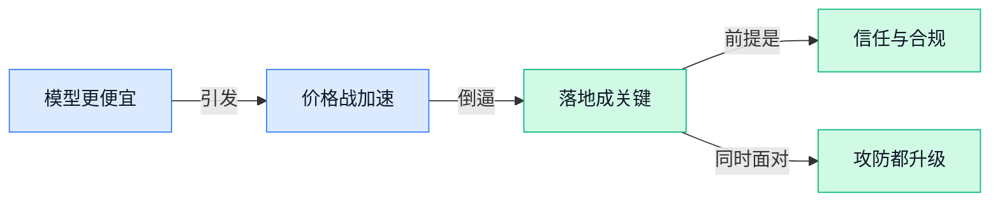
```mermaid
graph LR
A[模型更便宜] -->|引发| B[价格战加速]
B -->|倒逼| C[落地成关键]
C -->|前提是| D[信任与合规]
C -->|同时面对| E[攻防都升级]

classDef blue fill:#dbeafe,stroke:#3b82f6,color:#111827
classDef green fill:#d1fae5,stroke:#10b981,color:#111827
class A,B blue
class C,D,E green
```

### 📊 行业洞察（今日 4 条）

1. 智谱 AI 推出低价 ZCode（AI 编程助手），同时顶级模型榜首平均只能坐七周
  【洞察】模型能力越来越像“快消品”，价格战会比能力战更凶，真正值钱的会变成落地体验和具体场景包装

2. CloudMasonry 开卖 Claude 咨询服务，阿尔伯塔省政府也已用 Claude 查修安全漏洞
  【洞察】AI 商业化已经从“试着用”走到“接进正式流程”，客户买的不是模型本身，而是能不能稳定交付结果

3. Google 扩大数据用于训练 AI，阿里巴巴又因安全与合规禁用 Anthropic
  【洞察】企业用 AI 的核心矛盾正在变成“越好用越要喂数据，越喂数据越难放心”，信任会成为成交前提而非加分项

4. JADEPUFFER（代理式勒索软件）能自主发起攻击，另一边阿尔伯塔省政府用 Claude 做安全排查
  【洞察】AI 正同时放大攻防两端，未来不是“要不要用 AI”，而是不用就可能在效率和风险上同时落后

### 💭 对我们的启发（今日 3 条）

1. 顶级模型领先期只剩七周，别把卖点绑死在单一模型上。我们的视频剪辑工具要强化多模型切换、效果对比和人工兜底，不然很快被上游变化拖着走。

2. Google 数据训练争议、阿里巴巴禁用 Anthropic，都在提醒我们：品牌商最怕素材外流。产品里要把“素材是否参与训练、存多久、谁能看”写得非常明白，这直接影响成交。

3. CloudMasonry 做咨询、政府把 Claude 接进正式安全流程，说明客户要的是可控交付。我们不能只卖 AI 生成功能，还要做可审核、可回退、可人工接管的出片流程。

