## AI资讯日报 2026/7/8

> AI 早报 · 每日早读 · 全网深度聚合

## **今日摘要**

```
美国企业转向中国 AI 模型，OpenAI 与 Anthropic 成本走高，DeepSeek 又被曝自研 AI 芯片
Google 扩展 Gemini API 托管 Agent，Claude Cowork 杀入手机和网页，AI 助手从写代码卷向全天办公
Cloudflare 收紧 AI 爬虫控制权，网站反制“被拿去喂模型”，Meta 推出 Muse 抢广告主与付费用户
```

### 🔵 产品与功能更新

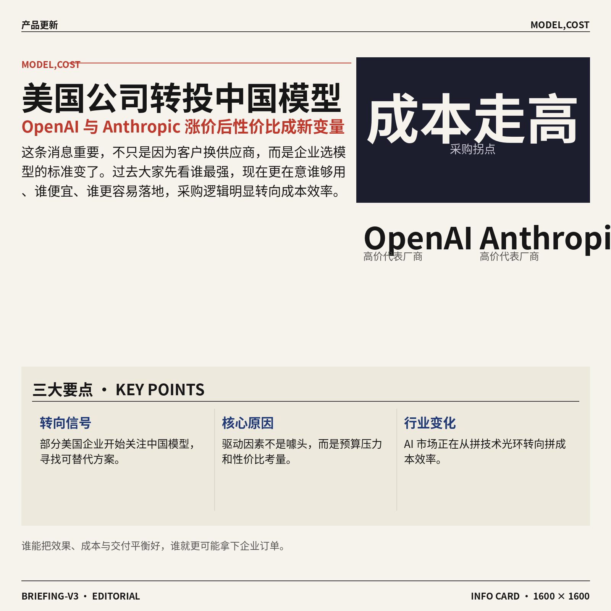

1. **美国企业转向中国 AI 模型，因 OpenAI 和 Anthropic 成本持续走高。**
随着 **OpenAI** 和 **Anthropic** 的使用费用上升，一些美国公司开始把目光投向中国 AI 模型，背后核心还是**性价比**和**可替代性** 💡。这说明企业在选模型时，已经不只看“谁最强”，而是更看重“谁更适合落地、谁更省预算”——对采购、运营和业务团队都很有现实意义。对行业来说，这也是 AI 市场从“拼技术光环”转向“拼成本效率”的一个明显信号。[CNBC 报道摘要(briefing)](https://news.google.com/rss/articles/CBMihwFBVV95cUxQempzVHpGakNndDQtVHVKbUhnbWJZTFVyaTJYRXc4dEFrbVVVVG91aWVPWmlabXJyNWpiQjZWdFdzbkl0a0JrR25SYjIzM2dlNDhZU3NQN3djZ0txSGp4NVBTTmZfNjVzdHNralJwc2VMRTlxd0FFcmNJU1YxTHY2d0Z1TnpGeDTSAYwBQVVfeXFMTWNWajVVa1E4LUFmSkxieEhfOGhPNHFDamRRUmRma0xOYzNVXzBKTThOSnVBS2RkY2JydlNoU1dQcHR4UU9qNmlINmptaXJnOTdhbWh5QXlwbDk4SzBXcUVYZUUtYy1YTG11bjREQ2xMMmNkelFMSDFJQjA0ZlJjajlxWGFpNGZQaGpnbXM?oc=5)


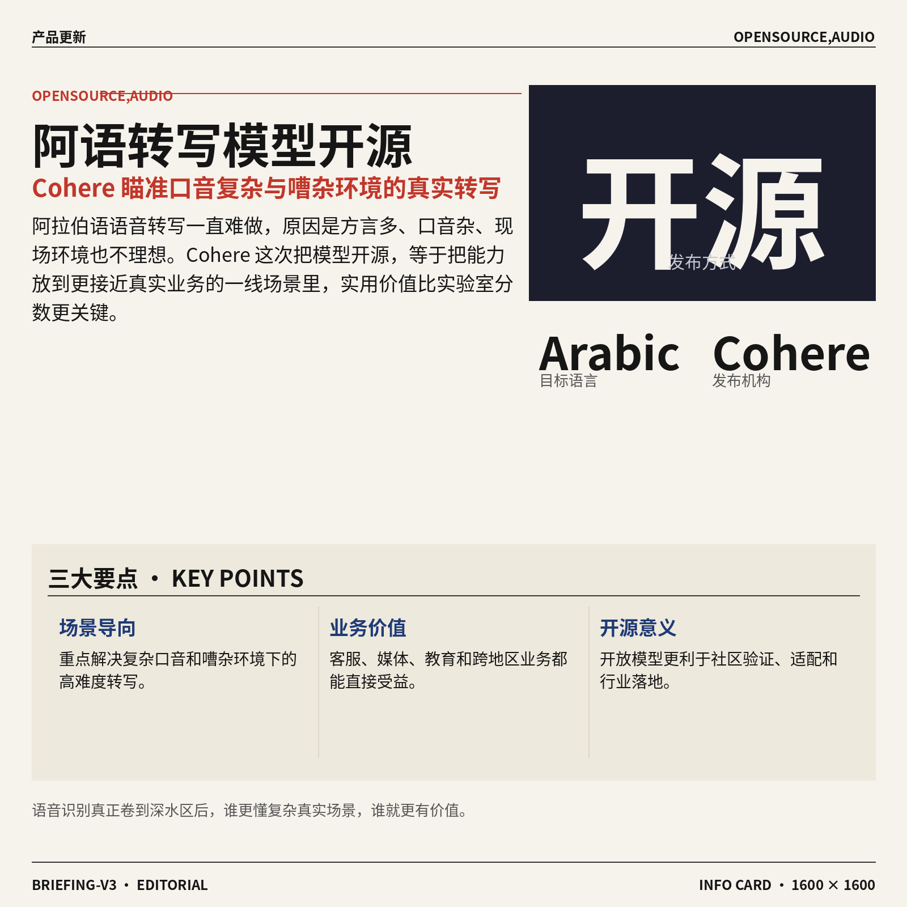

2. **Cohere Transcribe Arabic（Cohere 推出的阿拉伯语语音转文字模型）开源，专攻高难度转写场景。**
Cohere 发布了 **Cohere Transcribe Arabic**，这是一款面向阿拉伯语的**开源**语音识别模型，重点解决复杂口音、嘈杂环境等“最难转”的问题 🚀。这里的 transcription（语音转写，就是把录音自动变成文字）并不只是会议纪要工具，对客服、媒体、教育和跨地区业务都很关键。阿拉伯语本身在方言和发音上差异很大，这类更贴近真实使用场景的模型，往往比实验室里的高分更有实际价值。[官方报道解读(briefing)](https://the-decoder.com/cohere-transcribe-arabic-is-an-open-source-model-built-for-arabics-toughest-transcription-problems/)


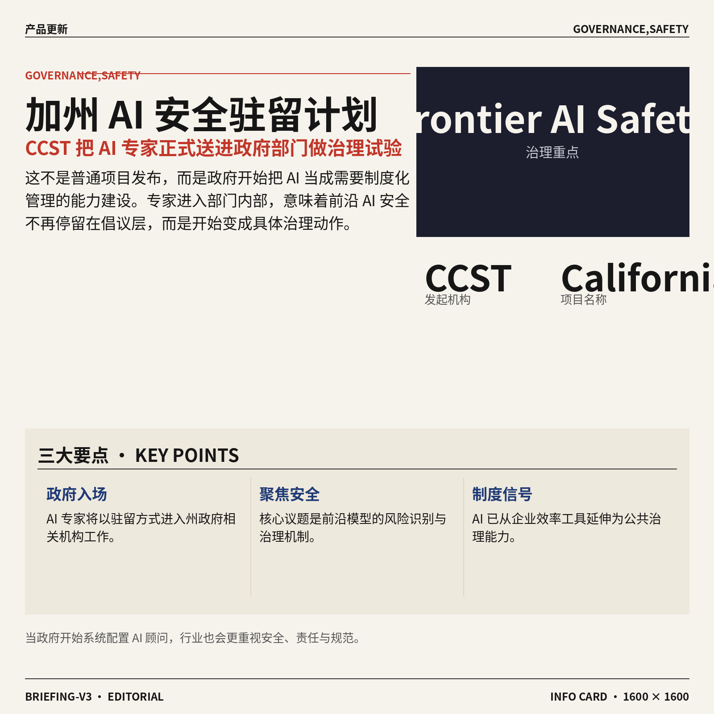

3. **CCST（加州科学与技术委员会）启动 California AI Science Residency Program（加州 AI 科学驻留项目），聚焦前沿 AI 安全。**
加州科学与技术委员会宣布推出 **California AI Science Residency Program**（让 AI 专家进入政府部门参与实际工作的驻留计划），并任命首批 AI 科学顾问进入州政府相关机构 💡。项目重点放在 **Frontier AI Safety**（前沿 AI 安全，指能力最强的新一代模型可能带来的风险治理）上，服务对象包括应急管理和技术部门。对非技术同事来说，这件事传递了一个很明确的趋势：AI 不再只是企业的效率工具，政府也在把它当成需要制度化管理的重要基础能力。[项目发布信息(briefing)](https://news.google.com/rss/articles/CBMib0FVX3lxTE9hci0tRUVFYXRxVzBmYUNoQms3bDZrTVhsQXVFQlFtOURuTmNoZEdVRWg5di1mOGh6WW02NENXZWgwZmU2a3diMlYzR0ZIenAwMU5sUGs3elBkajZGOU5jUWwxYjZFZE5RZTl5aXIwUQ?oc=5)


### 🟢 前沿研究

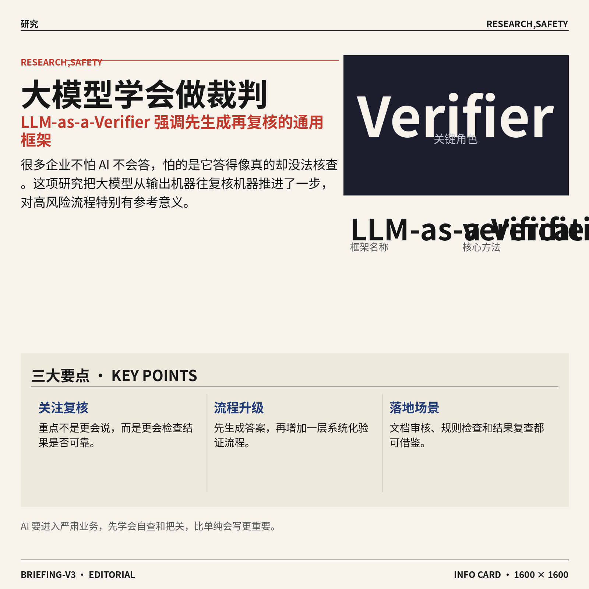

1. **LLM-as-a-Verifier（一种让大模型充当“审稿人/裁判”的通用校验框架）提出更通用的验证思路。**
这篇论文关注的不是让模型“多会说”，而是让它更会**核查**与**判定**结果是否可靠 💡。所谓 verification（验证，指先生成答案，再由系统检查答案对不对、是否符合要求），可以理解成给 AI 加上一层“复核流程”，对企业里常见的文档审核、规则检查、结果复查都很有启发。它的价值在于把大模型从“只会输出”往“会自查、会把关”推进了一步，未来对**高风险场景**尤其关键。可查看这篇 [论文页面摘要(briefing)](https://huggingface.co/papers/2607.05391) 了解原始信息。

![LLM-as-a-Verifier（一种让大模型充当“审稿人/裁判”的通用校验框架）提出更通用的验证思路](https://image.pollinations.ai/prompt/LLM-as-a-Verifier%EF%BC%88%E4%B8%80%E7%A7%8D%E8%AE%A9%E5%A4%A7%E6%A8%A1%E5%9E%8B%E5%85%85%E5%BD%93%E2%80%9C%E5%AE%A1%E7%A8%BF%E4%BA%BA%2F%E8%A3%81%E5%88%A4%E2%80%9D%E7%9A%84%E9%80%9A%E7%94%A8%E6%A0%A1%E9%AA%8C%E6%A1%86%E6%9E%B6%EF%BC%89%E6%8F%90%E5%87%BA%E6%9B%B4%E9%80%9A%E7%94%A8%E7%9A%84%E9%AA%8C%E8%AF%81%E6%80%9D%E8%B7%AF.%20LLM-as-a-Verifier%EF%BC%88%E4%B8%80%E7%A7%8D%E8%AE%A9%E5%A4%A7%E6%A8%A1%E5%9E%8B%E5%85%85%E5%BD%93%E2%80%9C%E5%AE%A1%E7%A8%BF%E4%BA%BA%2F%E8%A3%81%E5%88%A4%E2%80%9D%E7%9A%84%E9%80%9A%E7%94%A8%E6%A0%A1%E9%AA%8C%E6%A1%86%E6%9E%B6%EF%BC%89%E6%8F%90%E5%87%BA%E6%9B%B4%E9%80%9A%E7%94%A8%E7%9A%84%E9%AA%8C%E8%AF%81%E6%80%9D%E8%B7%AF%E3%80%82%20%E8%BF%99%E7%AF%87%E8%AE%BA%E6%96%87%E5%85%B3%E6%B3%A8%E7%9A%84%E4%B8%8D%E6%98%AF%E8%AE%A9%E6%A8%A1%E5%9E%8B%E2%80%9C%E5%A4%9A%E4%BC%9A%E8%AF%B4%E2%80%9D%EF%BC%8C%E8%80%8C%E6%98%AF%E8%AE%A9%E5%AE%83%E6%9B%B4%E4%BC%9A%E6%A0%B8%E6%9F%A5%2C%20technical%20infographic%20diagram%2C%20architecture%20flowchart%2C%20clean%20vector%20illustration%2C%20educational%20style%2C%20no%20text%20overlay%2C%20modern%20minimal%2C%20wide%20aspect?width=1200&height=675&nologo=true&seed=10807)

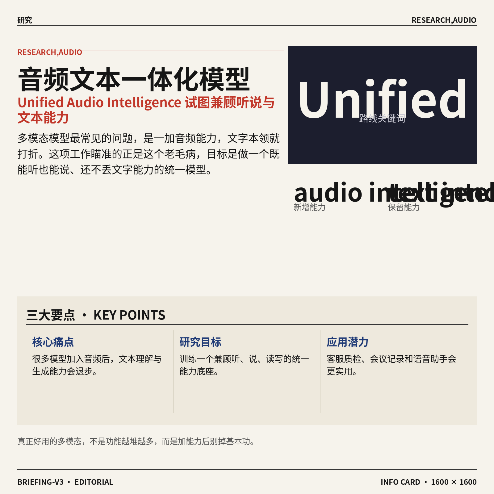

2. **Unified Audio Intelligence（一体化音频智能模型）尝试兼顾声音能力与文本能力。**
很多多模态模型一加上音频能力，就容易出现 text intelligence（文本理解与生成能力）**退步**的问题；这篇工作正是冲着这个痛点来 🚀。你可以把它理解成：研究者想训练一个既能听、也能说、同时还不丢原本文字本领的“大一统模型”。这里的 audio intelligence（音频智能，指对语音、声音内容的理解与处理能力）如果做得更稳，未来客服质检、会议记录、语音助手等场景都会更实用。原文可见 [论文介绍页面(briefing)](https://huggingface.co/papers/2607.05196)。


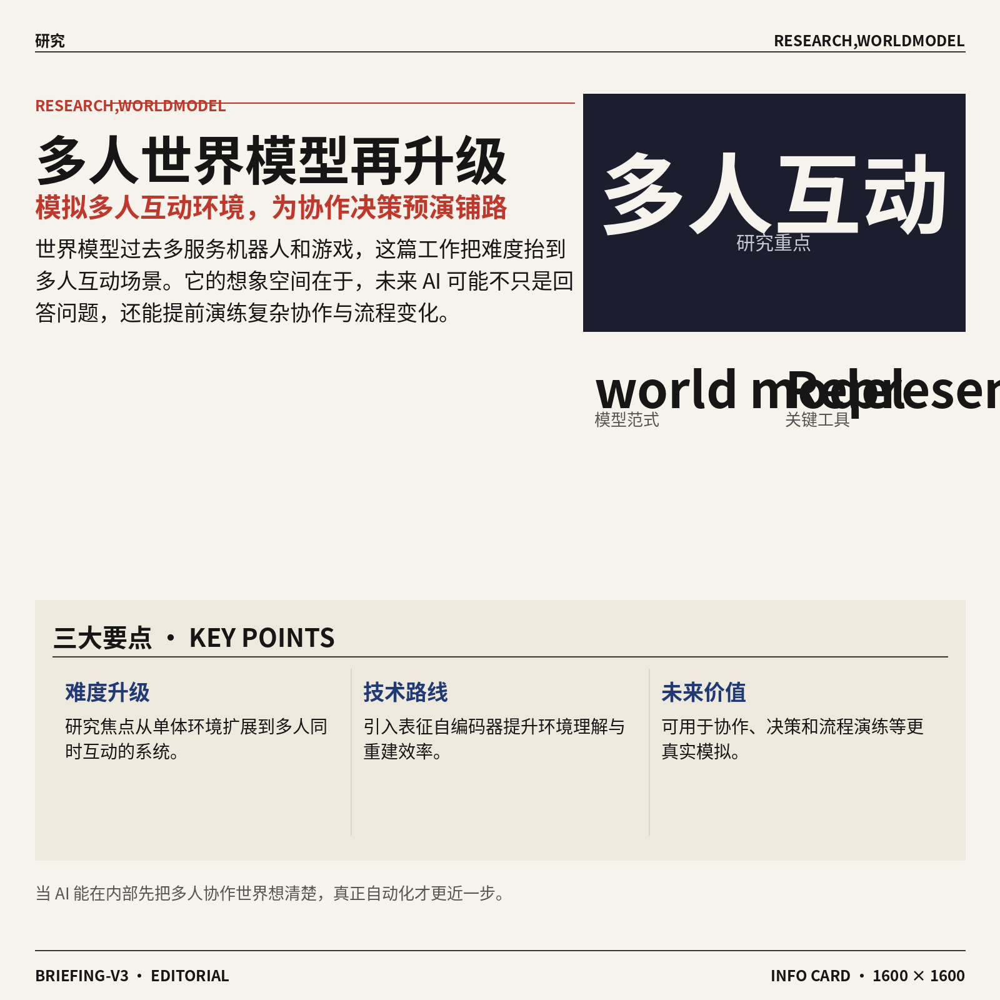

3. **Multiplayer Interactive World Models（多人互动世界模型，可模拟多人环境变化的 AI 模型）探索更复杂的虚拟交互。**
world model（世界模型，指让 AI 在内部“想象/模拟”环境如何变化的模型）原本多用于机器人和游戏，这篇论文把重点放到 **多人互动** 场景上。它还引入 Representation Autoencoders（表征自编码器，一种把复杂信息压缩成更好用内部表示的工具），帮助系统更高效地理解和重建环境状态。对普通业务同事来说，这类研究的意义在于：未来 AI 不只是回答问题，还可能在更像真实世界的模拟环境里提前演练协作、决策和流程。更多内容可见 [论文原始页面(briefing)](https://huggingface.co/papers/2607.05352)。


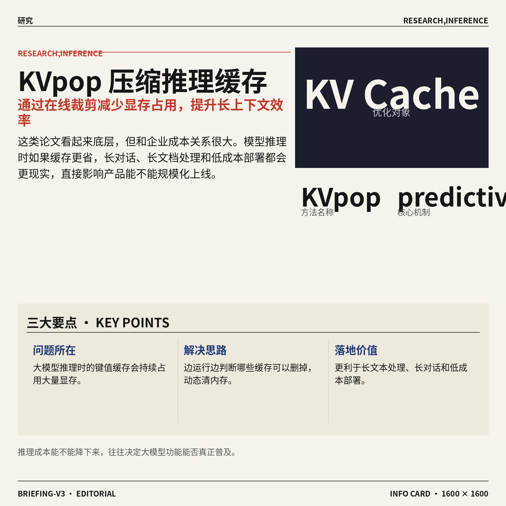

4. **KVpop（一种压缩大模型缓存的新方法）瞄准更省资源的模型推理。**
这篇论文研究的是 Key-Value Cache（键值缓存，模型回答时临时记住上下文的“工作记忆”）压缩问题，核心目标是让大模型在 inference（模型推理，让训练好的模型真正开始回答问题的过程）时更省显存、更高效 ⚙️。它提出 predictive online pruning（预测式在线裁剪，边运行边判断哪些缓存可以删掉），等于帮模型做“动态清理内存”。这类工作虽然底层，但非常关键：缓存更省，通常意味着长对话、长文档处理和低成本部署更有希望。原始信息见 [HuggingFace 论文页(briefing)](https://huggingface.co/papers/2607.05061)。

![KVpop（一种压缩大模型缓存的新方法）瞄准更省资源的模型推理](https://image.pollinations.ai/prompt/KVpop%EF%BC%88%E4%B8%80%E7%A7%8D%E5%8E%8B%E7%BC%A9%E5%A4%A7%E6%A8%A1%E5%9E%8B%E7%BC%93%E5%AD%98%E7%9A%84%E6%96%B0%E6%96%B9%E6%B3%95%EF%BC%89%E7%9E%84%E5%87%86%E6%9B%B4%E7%9C%81%E8%B5%84%E6%BA%90%E7%9A%84%E6%A8%A1%E5%9E%8B%E6%8E%A8%E7%90%86.%20KVpop%EF%BC%88%E4%B8%80%E7%A7%8D%E5%8E%8B%E7%BC%A9%E5%A4%A7%E6%A8%A1%E5%9E%8B%E7%BC%93%E5%AD%98%E7%9A%84%E6%96%B0%E6%96%B9%E6%B3%95%EF%BC%89%E7%9E%84%E5%87%86%E6%9B%B4%E7%9C%81%E8%B5%84%E6%BA%90%E7%9A%84%E6%A8%A1%E5%9E%8B%E6%8E%A8%E7%90%86%E3%80%82%20%E8%BF%99%E7%AF%87%E8%AE%BA%E6%96%87%E7%A0%94%E7%A9%B6%E7%9A%84%E6%98%AF%20Key-Value%20Cache%EF%BC%88%E9%94%AE%E5%80%BC%E7%BC%93%E5%AD%98%EF%BC%8C%E6%A8%A1%E5%9E%8B%E5%9B%9E%E7%AD%94%E6%97%B6%E4%B8%B4%E6%97%B6%E8%AE%B0%E4%BD%8F%E4%B8%8A%E4%B8%8B%E6%96%87%E7%9A%84%E2%80%9C%E5%B7%A5%E4%BD%9C%E8%AE%B0%2C%20technical%20infographic%20diagram%2C%20architecture%20flowchart%2C%20clean%20vector%20illustration%2C%20educational%20style%2C%20no%20text%20overlay%2C%20modern%20minimal%2C%20wide%20aspect?width=1200&height=675&nologo=true&seed=10900)

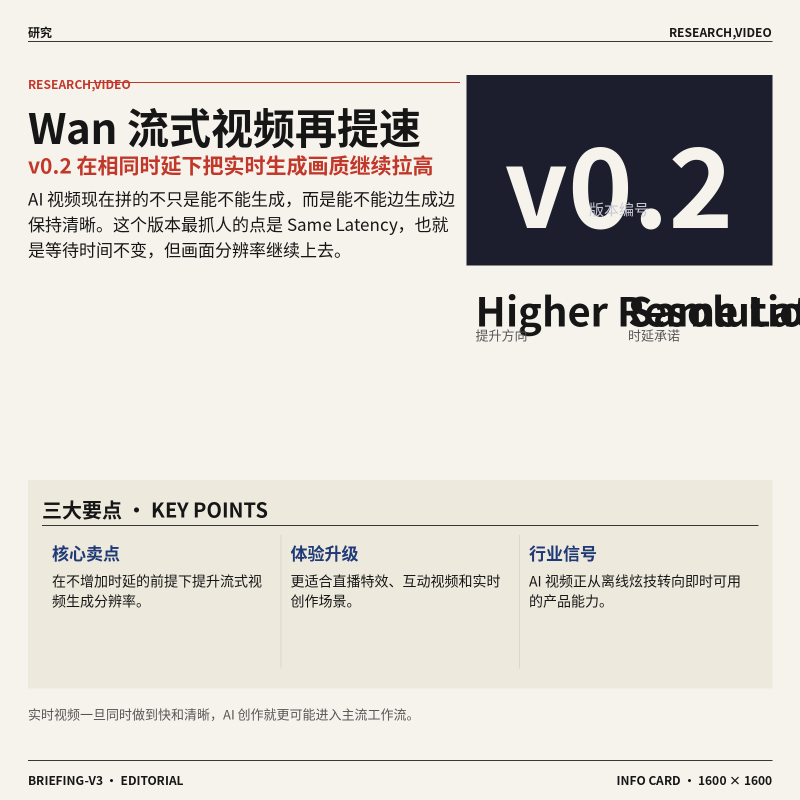

5. **Wan-Streamer v0.2（一种流式 AI 视频生成方案）在相同时延下冲更高分辨率。**
从标题看，这项工作强调的是 **Higher Resolution, Same Latency**：画面更清晰，但 latency（时延，指系统从接到请求到开始出结果的等待时间）不增加，这对实时生成尤其重要 🎬。streamer（流式生成，指内容不是等全部算完才给你，而是一边算一边连续输出）如果能稳定提升分辨率，会直接改善直播特效、互动视频、实时创作等体验。对产品团队来说，这类进展的核心信号是：AI 视频正朝着“更即时、更可用”推进，而不是只停留在离线生成。详情可看 [论文页面摘要(briefing)](https://huggingface.co/papers/2607.04443)。


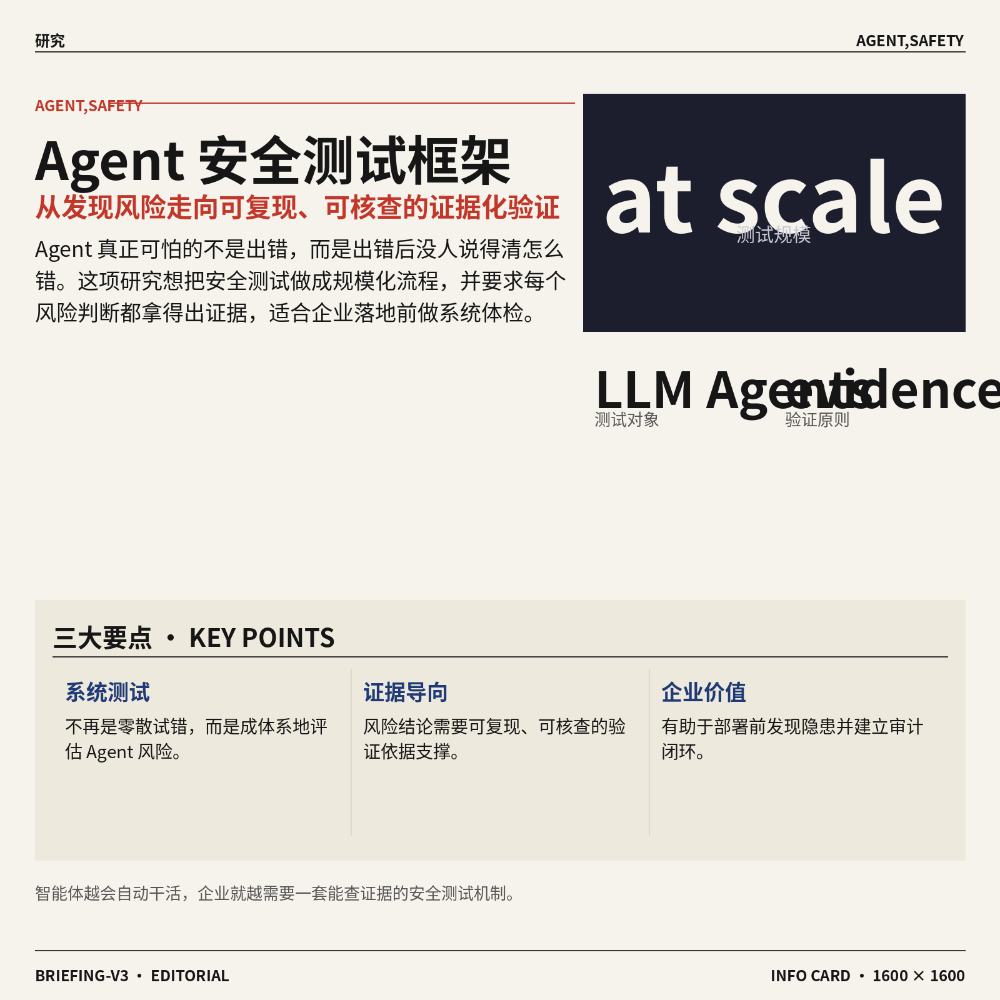

6. **Safety Testing LLM Agents at Scale（大规模测试 Agent 安全性的框架）强调从发现风险到证据化验证。**
这篇研究关注的是怎么系统化地给 LLM Agents（基于大模型、可自动执行任务的智能体）做**安全测试**，而且不是零散试试，而是 at scale（大规模地、成体系地）去做。标题里提到 evidence-grounded verification（基于证据的验证，意思是不只说“好像有风险”，而是要拿出可复现、可核查的依据），这对企业落地非常关键。说白了，AI 能自动干活之后，大家最怕的就是“它做错了还不知道为什么错”，这篇论文正试图补上这道防线。原文可参考 [安全测试论文页(briefing)](https://huggingface.co/papers/2607.01793)。


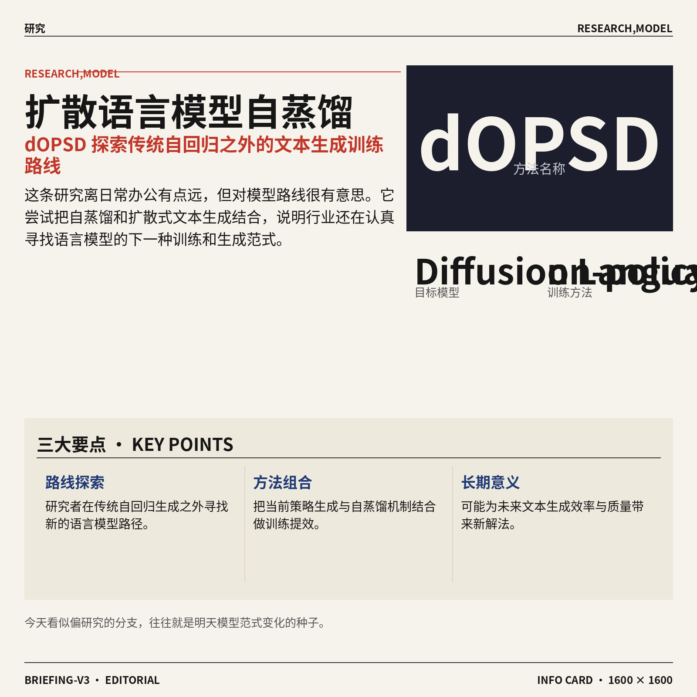

7. **dOPSD（一种用于扩散语言模型的自蒸馏训练方法）探索更高效的模型学习。**
这项工作聚焦 Diffusion Language Models（扩散语言模型，一类借鉴“逐步去噪”思路来生成文本的新路线），并提出 on-policy self-distillation（基于当前策略的自蒸馏，指模型一边按自己当前方式生成，一边把较好的行为再教回自己）🧠。distillation（蒸馏，可以理解成把“更好的答案习惯”浓缩回模型里）常被用来提效，而这篇论文想把它和扩散式文本生成结合起来。虽然离日常办公有点远，但它代表行业还在积极寻找“除了传统自回归生成之外”的新模型路径。更多信息见 [论文摘要页面(briefing)](https://huggingface.co/papers/2607.04428)。

![dOPSD（一种用于扩散语言模型的自蒸馏训练方法）探索更高效的模型学习](https://image.pollinations.ai/prompt/dOPSD%EF%BC%88%E4%B8%80%E7%A7%8D%E7%94%A8%E4%BA%8E%E6%89%A9%E6%95%A3%E8%AF%AD%E8%A8%80%E6%A8%A1%E5%9E%8B%E7%9A%84%E8%87%AA%E8%92%B8%E9%A6%8F%E8%AE%AD%E7%BB%83%E6%96%B9%E6%B3%95%EF%BC%89%E6%8E%A2%E7%B4%A2%E6%9B%B4%E9%AB%98%E6%95%88%E7%9A%84%E6%A8%A1%E5%9E%8B%E5%AD%A6%E4%B9%A0.%20dOPSD%EF%BC%88%E4%B8%80%E7%A7%8D%E7%94%A8%E4%BA%8E%E6%89%A9%E6%95%A3%E8%AF%AD%E8%A8%80%E6%A8%A1%E5%9E%8B%E7%9A%84%E8%87%AA%E8%92%B8%E9%A6%8F%E8%AE%AD%E7%BB%83%E6%96%B9%E6%B3%95%EF%BC%89%E6%8E%A2%E7%B4%A2%E6%9B%B4%E9%AB%98%E6%95%88%E7%9A%84%E6%A8%A1%E5%9E%8B%E5%AD%A6%E4%B9%A0%E3%80%82%20%E8%BF%99%E9%A1%B9%E5%B7%A5%E4%BD%9C%E8%81%9A%E7%84%A6%20Diffusion%20Language%20Models%EF%BC%88%E6%89%A9%E6%95%A3%E8%AF%AD%E8%A8%80%E6%A8%A1%E5%9E%8B%EF%BC%8C%E4%B8%80%E7%B1%BB%E5%80%9F%2C%20technical%20infographic%20diagram%2C%20architecture%20flowchart%2C%20clean%20vector%20illustration%2C%20educational%20style%2C%20no%20text%20overlay%2C%20modern%20minimal%2C%20wide%20aspect?width=1200&height=675&nologo=true&seed=10993)

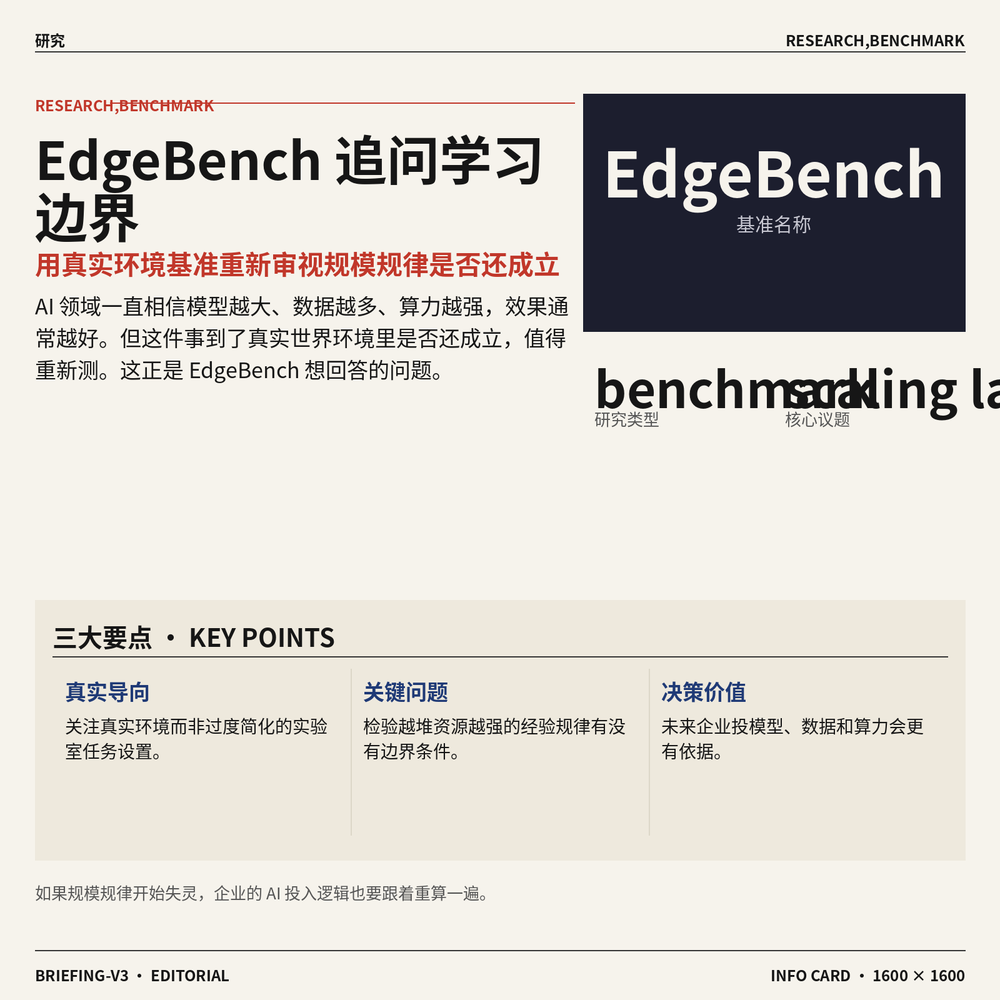

8. **EdgeBench（一套研究真实环境学习规律的基准）试图揭示“越学越强”的边界条件。**
benchmark（基准测试，像统一考卷，用来比较不同模型表现）在 AI 研究里非常重要，而 EdgeBench 关注的是 real-world environments（真实世界环境，而非过度简化的实验室任务）里的学习规律。标题里的 scaling laws（规模规律，指数据、算力、模型变大后，效果通常会如何变化的经验规律）是业内很看重的话题，因为它关系到“继续砸资源值不值”。如果这类研究做深，企业未来在投模型、投数据、投算力时会更有依据，而不是只凭感觉。原始内容可见 [基准论文页面(briefing)](https://huggingface.co/papers/2607.05155)。

![EdgeBench（一套研究真实环境学习规律的基准）试图揭示“越学越强”的边界条件](https://image.pollinations.ai/prompt/EdgeBench%EF%BC%88%E4%B8%80%E5%A5%97%E7%A0%94%E7%A9%B6%E7%9C%9F%E5%AE%9E%E7%8E%AF%E5%A2%83%E5%AD%A6%E4%B9%A0%E8%A7%84%E5%BE%8B%E7%9A%84%E5%9F%BA%E5%87%86%EF%BC%89%E8%AF%95%E5%9B%BE%E6%8F%AD%E7%A4%BA%E2%80%9C%E8%B6%8A%E5%AD%A6%E8%B6%8A%E5%BC%BA%E2%80%9D%E7%9A%84%E8%BE%B9%E7%95%8C%E6%9D%A1%E4%BB%B6.%20EdgeBench%EF%BC%88%E4%B8%80%E5%A5%97%E7%A0%94%E7%A9%B6%E7%9C%9F%E5%AE%9E%E7%8E%AF%E5%A2%83%E5%AD%A6%E4%B9%A0%E8%A7%84%E5%BE%8B%E7%9A%84%E5%9F%BA%E5%87%86%EF%BC%89%E8%AF%95%E5%9B%BE%E6%8F%AD%E7%A4%BA%E2%80%9C%E8%B6%8A%E5%AD%A6%E8%B6%8A%E5%BC%BA%E2%80%9D%E7%9A%84%E8%BE%B9%E7%95%8C%E6%9D%A1%E4%BB%B6%E3%80%82%20benchmark%EF%BC%88%E5%9F%BA%E5%87%86%E6%B5%8B%E8%AF%95%EF%BC%8C%E5%83%8F%E7%BB%9F%E4%B8%80%E8%80%83%E5%8D%B7%EF%BC%8C%E7%94%A8%E6%9D%A5%E6%AF%94%E8%BE%83%E4%B8%8D%E5%90%8C%E6%A8%A1%E5%9E%8B%E8%A1%A8%E7%8E%B0%EF%BC%89%E5%9C%A8%20AI%2C%20technical%20infographic%20diagram%2C%20architecture%20flowchart%2C%20clean%20vector%20illustration%2C%20educational%20style%2C%20no%20text%20overlay%2C%20modern%20minimal%2C%20wide%20aspect?width=1200&height=675&nologo=true&seed=11024)

### 🟡 行业展望与社会影响

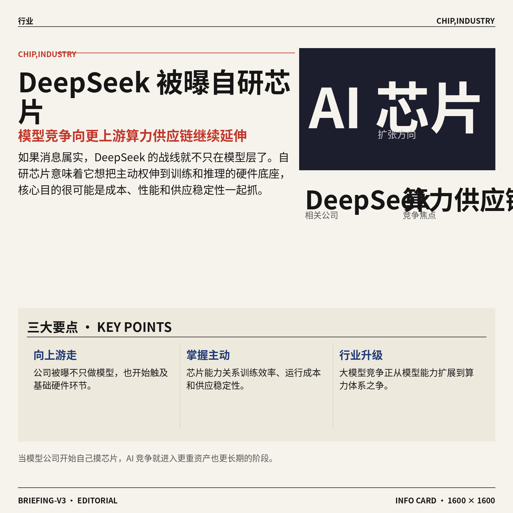

1. **DeepSeek 被曝自研 AI 芯片，开始往更底层的算力环节走。**
如果消息属实，这意味着 DeepSeek 不再只做模型，也在尝试进入**AI 芯片**这类更上游的基础设施环节 💡。芯片是决定模型训练和运行效率的核心硬件，谁能更好掌握它，谁在成本、性能和供应稳定性上就更有主动权。对行业来说，这也说明大模型竞争正从“谁模型更强”延伸到“谁的**算力供应链**更稳” 🚀。[路透相关报道(briefing)](https://news.google.com/rss/articles/CBMipAFBVV95cUxNSGRQQzRJX0VFTThJbC1JZnM2NUpNVHZQeEhxODdQejNBODNSLXpYMGdvSWxJMVhRSFBEOWplZy1NMU5qSnFxc3dpOEczN01EcVRQSk1mSXo3ejlMaUoxcks3LURaeGZ0Q3EyZ2dBQVN0QkRXNWg0YWpyOXJ2TjUtLVF4elZRU1VqdUVCdEhGNnFfYV9uYTdaT3V4MVFEZ2swRmlfRw?oc=5) [解读文章(briefing)](https://the-decoder.com/deepseek-is-designing-its-own-ai-chip/)


2. **Meta 推出 Muse（新的 AI 图片生成器），瞄准广告主和付费用户需求。**
Meta 正式加入新一轮**AI 图像生成**竞赛，推出 Muse（Meta 的新图片生成模型，用文字生成营销图、创意图等）📸。从报道看，它的用途不只面向普通用户，还明显指向**广告制作**、空间装饰和创作者变现等商业场景，这说明图片生成正从“好玩”走向“可直接拿来干活”。对品牌、运营和设计团队来说，这类工具如果成熟，会进一步压缩简单视觉素材的制作时间与外包成本 ✨。[TechCrunch 报道(briefing)](https://techcrunch.com/2026/07/07/meta-rolls-out-muse-a-new-ai-image-generator/) [CNBC 相关报道(briefing)](https://news.google.com/rss/articles/CBMiZkFVX3lxTE16aGRQd3BBT3JyLU13c0pvVDVXS2x5WU8xQ3dUVjE3NnVLOXhCWEw5eE94ZnBTZXRVSmVpUUNJbU0zUUVqZFVBOXE2eDRBREZ5MUtGSVBBZHhTZ2dWYnBxZ0hSY1FlUdIBa0FVX3lxTE9ZZWpjSW0xOFFlaDBha0FjLUhXWWktSWU2eUZDbVFsN3lYMTVLdll3UW1WdDFWLTdUYS1qQ0QxWmJDS0wySXJpTExiRFRpeXpCbm9tMnloblEwQXEyOE44VW1lV0lPeVJRVHVj?oc=5)


3. **Google 扩展 Gemini API 的 Managed Agents（托管式智能体能力），让企业更容易把 AI 任务放到后台持续运行。**
Google 给 Gemini API 增加了 Managed Agents（托管式智能体，开发者不用自己搭整套系统，就能让 AI 按任务持续执行）新能力，包括 background tasks（后台任务，让任务在用户离开后继续跑）和 remote MCP（远程 MCP，Anthropic 提出的模型上下文协议，用来让模型安全连接外部工具和数据）🔧。这类更新看起来偏技术，但对企业影响很直接：AI 不再只是“你问一句它答一句”，而是更像能跨时间、跨系统完成流程的数字同事。对未来办公软件、客服、销售支持、知识管理等场景来说，**Agent 化**会越来越像一条明确的产品路线 🚀。[Google 官方发布页(briefing)](https://blog.google/innovation-and-ai/technology/developers-tools/expanding-managed-agents-gemini-api/)


4. **Cloudflare 改用更细颗粒度的 AI 爬虫管理，网站与内容方开始争夺“被谁拿去喂模型”的控制权。**
Cloudflare 不再一刀切地屏蔽 AI bot（AI 爬虫，自动抓取网站内容的程序），而是改成分别控制 search（搜索抓取）、training（模型训练抓取）和 agent crawlers（Agent 爬虫，替 AI 助手出门找资料的程序）🛡️。这件事背后很关键：内容网站开始更认真地区分“允许被检索”与“允许被拿去训练模型”并不是一回事。对媒体、品牌官网、社区平台甚至企业知识库来说，未来**内容授权**、流量归属和数据价值都会变得更敏感，也会催生更细的商业规则与合作模式。[完整解读(briefing)](https://the-decoder.com/cloudflare-replaces-its-blanket-ai-bot-block-with-granular-controls-for-search-training-and-agent-crawlers/)

![Cloudflare 改用更细颗粒度的 AI 爬虫管理，网站与内容方开始争夺“被谁拿去喂模型”的控制权](https://image.pollinations.ai/prompt/Cloudflare%20%E6%94%B9%E7%94%A8%E6%9B%B4%E7%BB%86%E9%A2%97%E7%B2%92%E5%BA%A6%E7%9A%84%20AI%20%E7%88%AC%E8%99%AB%E7%AE%A1%E7%90%86%EF%BC%8C%E7%BD%91%E7%AB%99%E4%B8%8E%E5%86%85%E5%AE%B9%E6%96%B9%E5%BC%80%E5%A7%8B%E4%BA%89%E5%A4%BA%E2%80%9C%E8%A2%AB%E8%B0%81%E6%8B%BF%E5%8E%BB%E5%96%82%E6%A8%A1%E5%9E%8B%E2%80%9D%E7%9A%84%E6%8E%A7%E5%88%B6%E6%9D%83.%20Cloudflare%20%E6%94%B9%E7%94%A8%E6%9B%B4%E7%BB%86%E9%A2%97%E7%B2%92%E5%BA%A6%E7%9A%84%20AI%20%E7%88%AC%E8%99%AB%E7%AE%A1%E7%90%86%EF%BC%8C%E7%BD%91%E7%AB%99%E4%B8%8E%E5%86%85%E5%AE%B9%E6%96%B9%E5%BC%80%E5%A7%8B%E4%BA%89%E5%A4%BA%E2%80%9C%E8%A2%AB%E8%B0%81%E6%8B%BF%E5%8E%BB%E5%96%82%E6%A8%A1%E5%9E%8B%E2%80%9D%E7%9A%84%E6%8E%A7%E5%88%B6%E6%9D%83%E3%80%82%20Cloudflare%20%E4%B8%8D%E5%86%8D%E4%B8%80%E5%88%80%E5%88%87%E5%9C%B0%E5%B1%8F%E8%94%BD%20AI%20bot%EF%BC%88%2C%20technical%20infographic%20diagram%2C%20architecture%20flowchart%2C%20clean%20vector%20illustration%2C%20educational%20style%2C%20no%20text%20overlay%2C%20modern%20minimal%2C%20wide%20aspect?width=1200&height=675&nologo=true&seed=10900)

5. **Claude Cowork（Claude 的办公协作助手）扩展到手机和网页，AI 助手开始从“写代码”走向“全天候办公搭子”。**
这次更新后，用户可以在电脑上发起任务，在手机上看进度，稍后再接收完成结果，即使笔记本已经合上也不影响 📱。Claude Cowork（Anthropic 推出的办公协作型 AI 助手，帮人持续跟进和完成工作任务）传递出一个明显趋势：AI 助手不再局限于单次聊天，而是在不同设备间持续接力。对日常办公来说，这意味着未来很多资料整理、初稿撰写、信息跟进类任务，可能会越来越像“先交代，再异步等结果”的协作方式，而不是一直守在屏幕前盯着它 ✍️。[TechCrunch 报道(briefing)](https://techcrunch.com/2026/07/07/the-coding-agent-wars-are-spilling-into-the-rest-of-the-office-claude-cowork/)

![Claude Cowork（Claude 的办公协作助手）扩展到手机和网页，AI 助手开始从“写代码”走向“全天候办公搭子”](https://image.pollinations.ai/prompt/Claude%20Cowork%EF%BC%88Claude%20%E7%9A%84%E5%8A%9E%E5%85%AC%E5%8D%8F%E4%BD%9C%E5%8A%A9%E6%89%8B%EF%BC%89%E6%89%A9%E5%B1%95%E5%88%B0%E6%89%8B%E6%9C%BA%E5%92%8C%E7%BD%91%E9%A1%B5%EF%BC%8CAI%20%E5%8A%A9%E6%89%8B%E5%BC%80%E5%A7%8B%E4%BB%8E%E2%80%9C%E5%86%99%E4%BB%A3%E7%A0%81%E2%80%9D%E8%B5%B0%E5%90%91%E2%80%9C%E5%85%A8%E5%A4%A9%E5%80%99%E5%8A%9E%E5%85%AC%E6%90%AD%E5%AD%90%E2%80%9D.%20Claude%20Cowork%EF%BC%88Claude%20%E7%9A%84%E5%8A%9E%E5%85%AC%E5%8D%8F%E4%BD%9C%E5%8A%A9%E6%89%8B%EF%BC%89%E6%89%A9%E5%B1%95%E5%88%B0%E6%89%8B%E6%9C%BA%E5%92%8C%E7%BD%91%E9%A1%B5%EF%BC%8CAI%20%E5%8A%A9%E6%89%8B%E5%BC%80%E5%A7%8B%E4%BB%8E%E2%80%9C%E5%86%99%E4%BB%A3%E7%A0%81%E2%80%9D%E8%B5%B0%E5%90%91%E2%80%9C%E5%85%A8%E5%A4%A9%E5%80%99%E5%8A%9E%E5%85%AC%E6%90%AD%E5%AD%90%E2%80%9D%E3%80%82%20%E8%BF%99%E6%AC%A1%E6%9B%B4%E6%96%B0%E5%90%8E%EF%BC%8C%E7%94%A8%E6%88%B7%E5%8F%AF%E4%BB%A5%E5%9C%A8%E7%94%B5%E8%84%91%E4%B8%8A%E5%8F%91%E8%B5%B7%2C%20technical%20infographic%20diagram%2C%20architecture%20flowchart%2C%20clean%20vector%20illustration%2C%20educational%20style%2C%20no%20text%20overlay%2C%20modern%20minimal%2C%20wide%20aspect?width=1200&height=675&nologo=true&seed=10931)

### 🟣 开源TOP项目

1. **edgeone-makers-tools（腾讯 EdgeOne 的建站与部署工具集合）帮助个人开发者更快把网站上线。**  
这个项目来自腾讯的 **EdgeOne**（边缘加速与安全平台，简单说就是把网站内容更快分发到离用户更近的节点），定位是给 **makers**（独立开发者、小团队产品制作者）准备的一组实用工具 🛠️。从仓库名称看，它更像是围绕**建站、发布、加速**场景整理的工具箱，适合想低门槛把项目推到线上的人使用。对非技术同事来说，这类项目的意义在于：AI 产品不只拼模型，还拼“能不能快速上线、稳定访问、方便运营”这套基础能力。[GitHub 仓库页(briefing)](https://github.com/TencentEdgeOne/edgeone-makers-tools)


2. **Wand-Enhancer（Wand 应用的体验增强扩展）主打更好的交互和兼容能力。**  
这个开源项目是给 **Wand**（摘要中说明也对应 **WeMod**，一类桌面应用）做的增强扩展，核心卖点是更好的 **UX**（用户体验，比如界面是否顺手、操作是否省事）和 **interoperability**（互操作性，指和别的功能或环境更顺畅地配合）✨。虽然摘要信息不多，但方向已经很明确：它不是重做底层，而是补足现有产品在使用层面的细节。对业务和运营同事来说，这也很有代表性——很多开源热门项目不一定是“从零造轮子”，而是把成熟产品变得更好用。[项目主页说明(briefing)](https://github.com/k1tbyte/Wand-Enhancer)


3. **zero（可按你规则运行的代码 Agent）把模型选择权和控制权交还给开发者。**  
这个项目把自己定义为一个 **coding agent**（代码 Agent，能按目标自动写代码、改代码、执行任务的 AI 助手），强调“听你的、用你的模型、跑在你的机器、遵守你的规则” 🤖。这几个点其实很关键：一是支持你自己选 **model**（模型，也就是底层 AI 大脑），二是能放在自己的设备上运行，三是流程可控，不必完全被平台绑定。对企业来说，这类项目的吸引力在于**灵活性**和**可控性**——尤其适合对数据权限、成本或定制流程有要求的团队。[GitHub 仓库页(briefing)](https://github.com/Gitlawb/zero)


4. **ctx（开源 Agentic Development Environment，面向代码 Agent 的桌面工作台）想做可改造的 AI 编程环境。**  
它把自己定位成 **Agentic Development Environment**（面向 Agent 的开发环境，也就是专门让多个 AI 助手参与写代码、改代码、执行任务的工作台），简称 **ADE**（可理解为“AI 编程操作台”）💡。项目强调 **open source**（开源，代码公开可修改）和 **hackable**（可深度改造，开发者能按自己需求拆改扩展），说明它不是封闭成品，而是偏底座型工具。相比单个代码助手，这类桌面 **workbench**（工作台，把多个能力集中到一个界面里）更像是在搭建下一代 AI 编程基础设施。[GitHub 仓库介绍(briefing)](https://github.com/ctxrs/ctx)


### 🔴 社媒分享

1. **Kokoro（一款可本地运行的 AI 语音合成工具）让高质量 TTS（文本转语音，把文字直接变成自然语音）也能轻松跑在 CPU（中央处理器，不用高端显卡也能运行）上。**
这篇分享的重点很接地气：不是拼最贵硬件，而是强调**本地运行**、**CPU 友好**和**语音质量**三件事能兼得 💡。对很多公司来说，这意味着做客服播报、内部工具配音、无障碍朗读时，不一定非得把数据传到云端，**隐私**和**成本**都会更可控。尤其“本地 TTS”这件事，对需要离线环境或预算有限的团队很有吸引力，属于很容易落地的一类 AI 能力。[作者实测分享(briefing)](https://ariya.io/2026/03/local-cpu-friendly-high-quality-tts-text-to-speech-with-kokoro/)


2. **LeRobot v0.6.0（HuggingFace 推出的机器人 AI 开发项目）更新，主打“想象、评估、改进”闭环。**
这次版本迭代传递出的信号很明确：机器人 AI 不再只是“让机械臂动起来”，而是更强调**先模拟、再评估、再优化**的完整流程 🚀。这里的“评估”很关键，它相当于给机器人训练加入更系统的打分机制，方便团队判断模型到底有没有真的变好；而“改进”则更接近持续迭代产品，而不是一次性做完。对非技术同事来说，可以把它理解成：机器人开发也越来越像做数字产品，需要一边试运行、一边复盘、一边更新版本。[官方更新说明(briefing)](https://huggingface.co/blog/lerobot-release-v060)


3. **HuggingFace（全球最大 AI 模型共享社区）支持一键进入 Amazon SageMaker Studio（亚马逊的机器学习工作台，用来训练和管理 AI 项目）。**
这条更新的价值在于把“找模型”和“开始用模型”之间的步骤尽量压缩成**一键操作** ✨。以前很多团队卡在环境配置、部署流程和权限衔接这些麻烦事上，现在如果能直接把 HuggingFace 上的模型送进 SageMaker Studio，就能更快做测试和试验。对企业用户来说，这类整合通常不只是省时间，也是在降低 AI 项目从“看到模型”到“真正跑起来”的门槛。[官方发布页(briefing)](https://huggingface.co/blog/amazon/one-click-to-sagemaker-studio)


4. **HuggingFace 模型接入 Foundry Managed Compute（微软托管算力服务，把算力和运行环境提前配好）。**
这次合作的核心，是让团队在使用 HuggingFace 模型时，能更顺畅地接上微软的**托管算力**资源 ⚙️。所谓“托管”，简单说就是很多底层机器和环境配置由平台先处理好，企业不用自己从零折腾基础设施。对业务团队来说，这类能力的意义不在“技术多炫”，而在于能更快把模型拉进企业工作流里做验证、做应用，减少部署阶段的摩擦。[合作介绍原文(briefing)](https://huggingface.co/blog/microsoft/foundry-managed-compute)


5. **SkyPilot（跨云资源调度工具，帮团队在不同云平台之间统一跑 AI 任务）打通 HuggingFace 存储，主推 zero-egress storage（零出口流量存储，减少跨平台传数据费用）。**
这条看起来偏底层，但其实很关系企业的真金白银：AI 团队常常在不同云平台跑任务，最怕的是**数据搬来搬去又慢又贵** 😵。所谓“zero-egress”，可以理解为尽量避免因为把数据从一个平台往外传而产生额外流量成本，这对大模型训练或批量推理（inference，模型正式回答问题或处理任务的过程）尤其重要。简单说，它想解决的是“算力在哪都能用，但数据别反复折腾”的问题，对多云部署（同时使用多家云服务）团队会很有吸引力。[官方技术解读(briefing)](https://huggingface.co/blog/skypilot-hf-storage)

![SkyPilot（跨云资源调度工具，帮团队在不同云平台之间统一跑 AI 任务）打通 HuggingFace 存储，主推 zero-egress storage（零出口流量存储，减少跨平台传数据费用）](https://image.pollinations.ai/prompt/SkyPilot%EF%BC%88%E8%B7%A8%E4%BA%91%E8%B5%84%E6%BA%90%E8%B0%83%E5%BA%A6%E5%B7%A5%E5%85%B7%EF%BC%8C%E5%B8%AE%E5%9B%A2%E9%98%9F%E5%9C%A8%E4%B8%8D%E5%90%8C%E4%BA%91%E5%B9%B3%E5%8F%B0%E4%B9%8B%E9%97%B4%E7%BB%9F%E4%B8%80%E8%B7%91%20AI%20%E4%BB%BB%E5%8A%A1%EF%BC%89%E6%89%93%E9%80%9A%20HuggingFace%20%E5%AD%98%E5%82%A8%EF%BC%8C%E4%B8%BB%E6%8E%A8%20zero-egress%20storage%EF%BC%88%E9%9B%B6%E5%87%BA%E5%8F%A3%E6%B5%81%E9%87%8F%E5%AD%98%E5%82%A8%EF%BC%8C%E5%87%8F%E5%B0%91%E8%B7%A8%E5%B9%B3%E5%8F%B0%E4%BC%A0%E6%95%B0%E6%8D%AE%E8%B4%B9%E7%94%A8%EF%BC%89.%20SkyPilot%EF%BC%88%E8%B7%A8%E4%BA%91%E8%B5%84%E6%BA%90%E8%B0%83%E5%BA%A6%E5%B7%A5%E5%85%B7%EF%BC%8C%E5%B8%AE%E5%9B%A2%E9%98%9F%E5%9C%A8%E4%B8%8D%E5%90%8C%E4%BA%91%E5%B9%B3%E5%8F%B0%E4%B9%8B%E9%97%B4%E7%BB%9F%E4%B8%80%E8%B7%91%20AI%20%E4%BB%BB%E5%8A%A1%EF%BC%89%E6%89%93%E9%80%9A%20HuggingFace%20%E5%AD%98%E5%82%A8%EF%BC%8C%E4%B8%BB%E6%8E%A8%20zero-egress%20storage%EF%BC%88%2C%20technical%20infographic%20diagram%2C%20architecture%20flowchart%2C%20clean%20vector%20illustration%2C%20educational%20style%2C%20no%20text%20overlay%2C%20modern%20minimal%2C%20wide%20aspect?width=1200&height=675&nologo=true&seed=10737)

6. **《A Script for Mark Zuckerberg》讨论 Meta 当下 AI 叙事该怎么讲，矛头直指战略表达。**
这篇文章从“如果要替扎克伯格写一份讲稿”这个角度切入，本质上是在谈 **Meta 的 AI 战略该如何被外界理解** 🧠。它的看点不只是技术路线，而是公司该怎么把愿景、投入和产品逻辑讲清楚——这对资本市场、合作伙伴和普通用户都很关键。对公司里的非技术同事来说，这类文章提醒我们：AI 竞争不只是拼模型，也在拼谁能把自己的方向说得更明白、更有说服力。[完整文章(briefing)](https://stratechery.com/2026/a-script-for-mark-zuckerberg/)


---

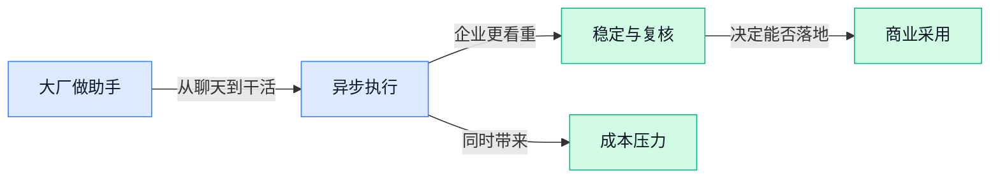
```mermaid
graph LR
A[大厂做助手] -->|从聊天到干活| B[异步执行]
B -->|企业更看重| C[稳定与复核]
C -->|决定能否落地| D[商业采用]
B -->|同时带来| E[成本压力]

classDef blue fill:#dbeafe,stroke:#3b82f6,color:#111827
classDef green fill:#d1fae5,stroke:#10b981,color:#111827
class A,B blue
class C,D,E green
```

### 📊 行业洞察（今日 4 条）

1. Google 扩展 Gemini API 的托管式智能体，Claude Cowork 同时上手机和网页，还能离开电脑持续跑任务
  【洞察】两件事放一起看，AI 正从“聊天工具”变成“异步干活的助手”；竞争点开始从回答质量，转向任务连续性和接管能力

2. 美国企业因 OpenAI、Anthropic 涨价转向中国模型，DeepSeek 又被曝自研 AI 芯片
  【洞察】这说明行业已从“谁最聪明”转向“谁更便宜、更稳”；模型公司往上游控成本，企业客户往下游挑替代，价格战会更硬

3. Meta 推 Muse（面向广告主的图片生成器），Wan-Streamer v0.2 又把 AI 视频推向“更高清、同等待待时间”
  【洞察】图像和视频都在朝“可直接商用”走，基础生成能力会越来越像标配；真正稀缺的将不是生成本身，而是出片效率和效果稳定性

4. 加州科学与技术委员会做 AI 安全驻留，研究圈也在推结果复核与大规模安全测试
  【洞察】政府治理和学术研究同时补“核查”这块，说明大家默认 AI 会进关键流程；以后没有复核证据的产品，更难拿到企业信任

### 💭 对我们的启发（今日 3 条）

1. Google 和 Claude 都在推“任务可持续执行”，我们的视频工具不能只会一次性生成；要支持长任务分段完成、进度可见、关键节点让人接管。

2. 美国企业因涨价转向替代模型，提醒我们别把产品绑死在单一大厂上；视频生成、文案、配音都要能灵活切换，先保成本，再谈极致效果。

3. Meta 做广告图，Wan-Streamer 提升实时高清，说明“会生成”很快不值钱；我们要把重点放在品牌素材复用、批量出片一致性和人工复查机制上。

