## AI资讯日报 2026/7/10

> AI 早报 · 每日早读 · 全网深度聚合

## **今日摘要**

```
OpenAI 一夜连发 GPT-5.6 与 ChatGPT Work，AtCoder 赛场横扫全部人类选手
Anthropic 推出 Claude Reflect 测试追踪个人 AI 习惯，OpenAI再曝三成热门编码评测有问题
Meta 用 Muse Spark 1.1 低价突袭追赶 OpenAI、Anthropic，智谱 GLM 5.2 记账准确率逼近人工
```

### 🔵 产品与功能更新

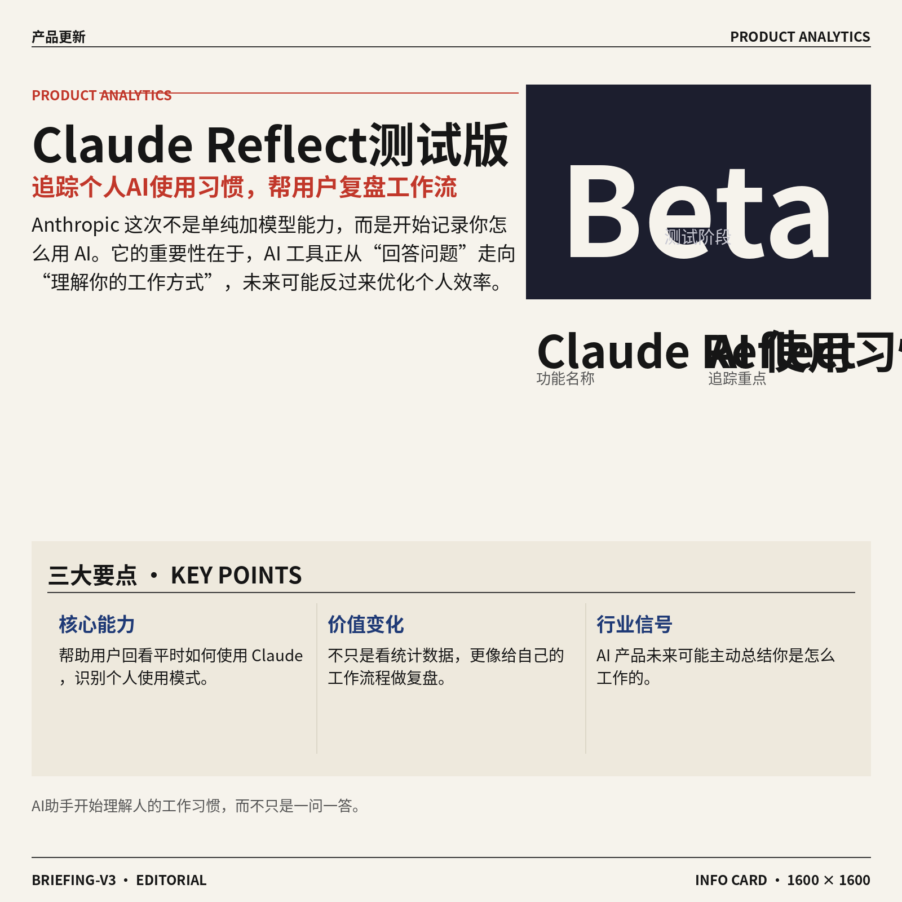

1. **Anthropic 推出 Claude Reflect（用于追踪个人 AI 使用习惯的测试功能）Beta 版。**
Anthropic 上线了 **Claude Reflect** 的 **Beta**（测试版，先给部分用户试用再逐步完善）功能，核心是帮助用户回看自己平时怎么使用 Claude、形成了哪些 **AI 使用习惯** 🧭。这类功能的意义不只是“看统计”，更像给个人工作流做复盘：你会更清楚自己把 AI 用在写作、整理、分析还是沟通上。对公司同事来说，这也意味着未来 AI 工具可能不只回答问题，还会主动帮你总结“你是怎么工作的”。可参考 [功能上线报道(briefing)](https://news.google.com/rss/articles/CBMiSEFVX3lxTFBKWXJOODhiTGVVSHVxYml3SDJiTkFXd0RGSTZBQ2R2SVdPRTllQ1RoT0N4S05uQlF0Z3NxcFZnVFF2NG1OdXhBVA?oc=5) 💡


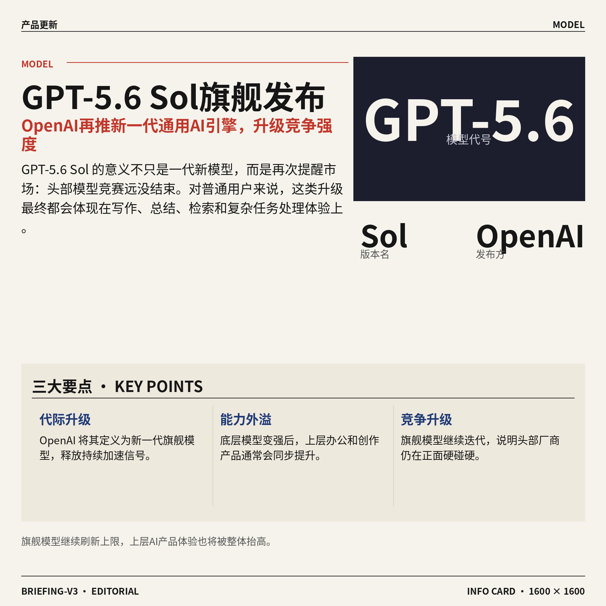

2. **OpenAI 发布 GPT-5.6 Sol（OpenAI 新一代旗舰大模型）。**
OpenAI 推出了 **GPT-5.6 Sol**，并称它是目前最强的 **AI 模型** 之一，释放出的信号很直接：头部模型竞争还在持续升级 🚀。对普通办公场景来说，模型代际更新通常意味着更强的理解、生成和复杂任务处理能力，后续会直接影响写方案、做总结、查资料等日常工作体验。这里的 **大模型** 可以理解为“通用 AI 引擎”，底层能力一变，上层产品往往会跟着一起提升。更多信息可看 [发布消息汇总(briefing)](https://news.google.com/rss/articles/CBMickFVX3lxTE1ScWRxcUZHcF9BRnY3cDhBdXc1dlI3OTdRLXFpb3lFMmN3a3g3azVCdDhHT290RXN1Mmh3NElzNkhWNDZtN3BwT09tTUhnMzBaSW44SF9qR2FmVFd2NFF5VmlmdU1tMkZOaDN3ZjluLUtFZw?oc=5) 📌


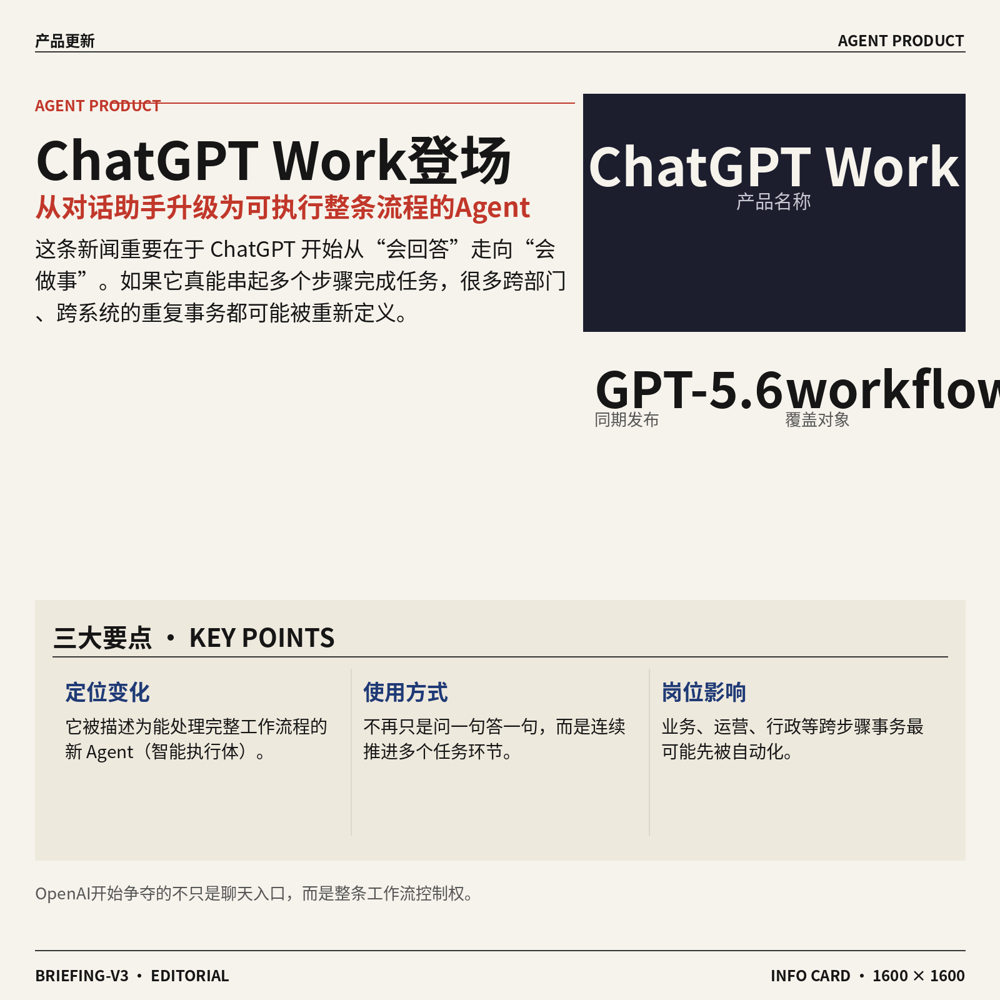

3. **OpenAI 随 GPT-5.6 一同推出 ChatGPT Work（可处理完整工作流程的 AI 助手）。**
OpenAI 在公开推送 **GPT-5.6** 的同时，带来了 **ChatGPT Work**，它被描述为能处理整个 **workflow**（工作流程，把多个步骤串起来自动完成的一整套任务）的新 **Agent**。这意味着 ChatGPT 不再只是“你问一句、它答一句”，而是更像能连续执行任务的数字同事：从接收目标到推进多个环节，覆盖完整流程 🛠️。对业务、运营、行政等岗位来说，这类产品如果成熟，最直接的变化就是跨步骤事务会更容易被自动化。可查看 [完整产品报道(briefing)](https://the-decoder.com/openai-pairs-its-gpt-5-6-public-rollout-with-chatgpt-work-a-new-agent-that-handles-entire-workflows/) 了解细节。


### 🟢 前沿研究

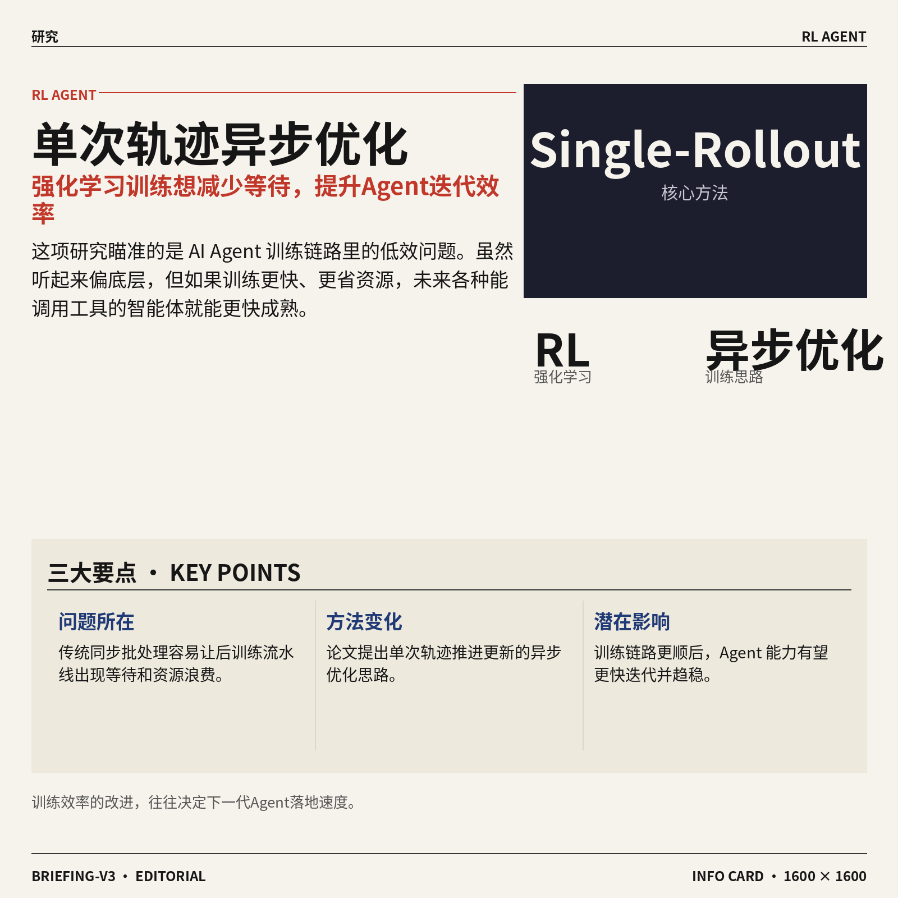

1. **Single-Rollout Asynchronous Optimization（单次轨迹异步优化）想让 Agent 强化学习训练更高效。**
这篇论文聚焦 **Agent 强化学习**，也就是让 AI 助手在“做任务—拿反馈—再改进”的循环里持续变强 🤖。作者指出，过去很多用于大模型后训练的 **RL（强化学习，让模型通过奖励机制学会更优行为）** 流水线偏向“同步批处理”，容易拖慢训练节奏；而这项工作提出 **异步优化** 思路，希望用单次轨迹推进更新，减少等待和资源浪费。对行业来说，这类研究的意义在于：如果训练链路更顺，未来各种能自主拆解任务、调用工具的 Agent，可能会更快迭代出更稳定的能力。可查看 [arxiv 论文原文(briefing)](https://arxiv.org/abs/2607.07508) 或 [论文索引页(briefing)](https://huggingface.co/papers/2607.07508) 了解细节 💡


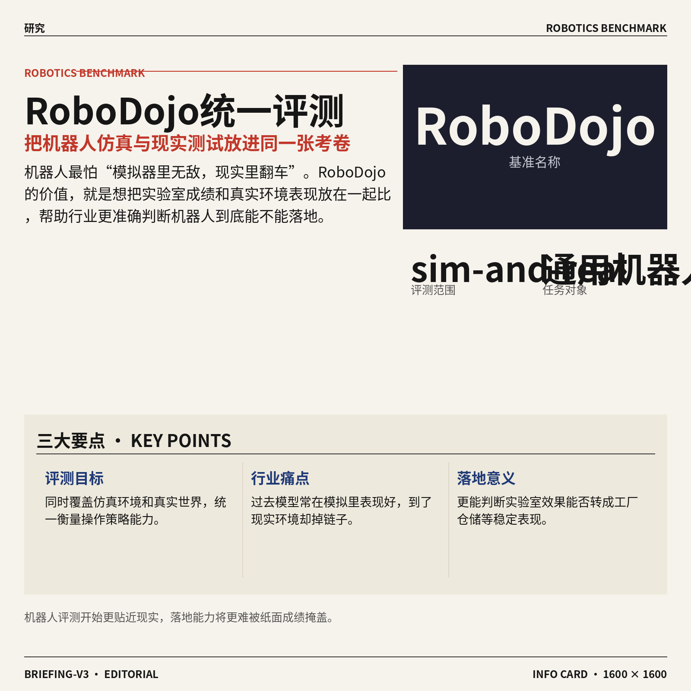

2. **RoboDojo（通用机器人操作能力评测基准）想把机器人“模拟+现实”测试拉到同一张考卷上。**
这项研究提出 **RoboDojo**，核心是做一个同时覆盖仿真环境和真实世界的统一基准，用来更全面地评估 **通用机器人操作策略（让机器人完成抓取、搬运、整理等动作的决策规则）** 🦾。过去机器人常见的问题是：在模拟器里表现很好，到了现实环境却容易掉链子；这类 **sim-and-real（模拟与现实结合）** 评测，就是想更真实地看清模型到底有没有“真本事”。对企业理解机器人落地也很重要，因为它关系到“实验室效果”能不能转成“工厂、仓储、服务场景里的稳定表现”。更多内容可见 [论文索引页(briefing)](https://huggingface.co/papers/2607.04434) 。

![RoboDojo（通用机器人操作能力评测基准）想把机器人“模拟+现实”测试拉到同一张考卷上](https://image.pollinations.ai/prompt/RoboDojo%EF%BC%88%E9%80%9A%E7%94%A8%E6%9C%BA%E5%99%A8%E4%BA%BA%E6%93%8D%E4%BD%9C%E8%83%BD%E5%8A%9B%E8%AF%84%E6%B5%8B%E5%9F%BA%E5%87%86%EF%BC%89%E6%83%B3%E6%8A%8A%E6%9C%BA%E5%99%A8%E4%BA%BA%E2%80%9C%E6%A8%A1%E6%8B%9F+%E7%8E%B0%E5%AE%9E%E2%80%9D%E6%B5%8B%E8%AF%95%E6%8B%89%E5%88%B0%E5%90%8C%E4%B8%80%E5%BC%A0%E8%80%83%E5%8D%B7%E4%B8%8A.%20RoboDojo%EF%BC%88%E9%80%9A%E7%94%A8%E6%9C%BA%E5%99%A8%E4%BA%BA%E6%93%8D%E4%BD%9C%E8%83%BD%E5%8A%9B%E8%AF%84%E6%B5%8B%E5%9F%BA%E5%87%86%EF%BC%89%E6%83%B3%E6%8A%8A%E6%9C%BA%E5%99%A8%E4%BA%BA%E2%80%9C%E6%A8%A1%E6%8B%9F+%E7%8E%B0%E5%AE%9E%E2%80%9D%E6%B5%8B%E8%AF%95%E6%8B%89%E5%88%B0%E5%90%8C%E4%B8%80%E5%BC%A0%E8%80%83%E5%8D%B7%E4%B8%8A%E3%80%82%20%E8%BF%99%E9%A1%B9%E7%A0%94%E7%A9%B6%E6%8F%90%E5%87%BA%20RoboDojo%EF%BC%8C%E6%A0%B8%E5%BF%83%E6%98%AF%E5%81%9A%E4%B8%80%E4%B8%AA%E5%90%8C%E6%97%B6%E8%A6%86%E7%9B%96%E4%BB%BF%E7%9C%9F%E7%8E%AF%E5%A2%83%E5%92%8C%E7%9C%9F%E5%AE%9E%2C%20technical%20infographic%20diagram%2C%20architecture%20flowchart%2C%20clean%20vector%20illustration%2C%20educational%20style%2C%20no%20text%20overlay%2C%20modern%20minimal%2C%20wide%20aspect?width=1200&height=675&nologo=true&seed=10838)

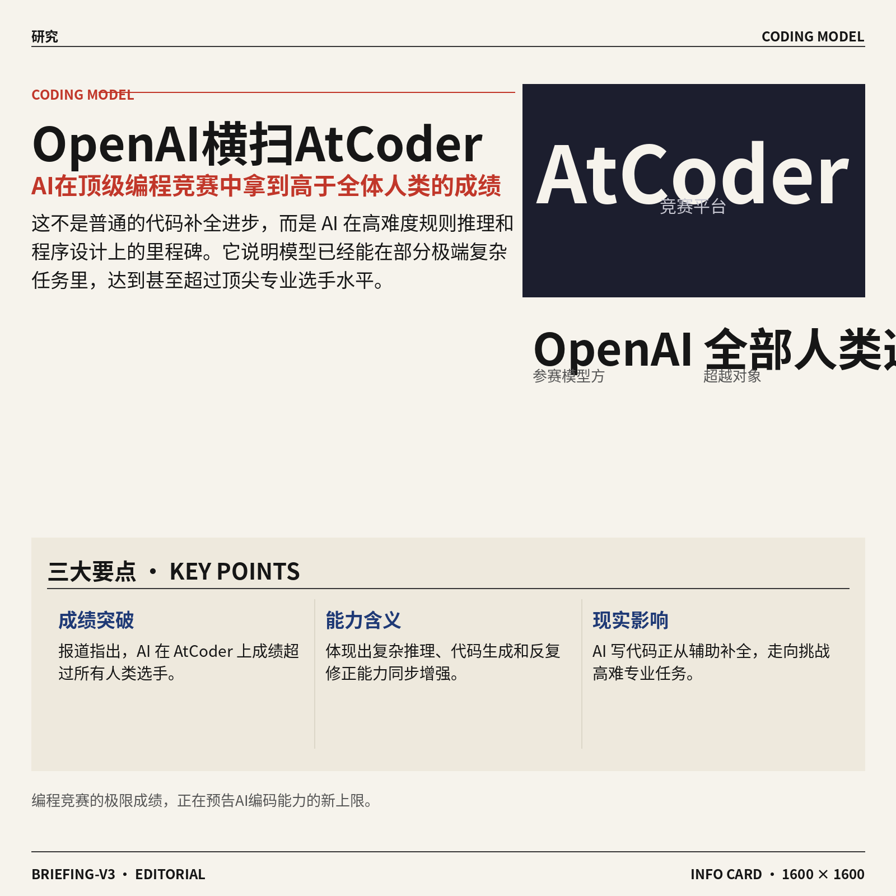

3. **OpenAI 的 AI 在 AtCoder（知名编程竞赛平台）上击败全部人类选手。**
报道提到，OpenAI 的 AI 在 **AtCoder** 这一顶级竞赛编程平台上拿到了超过所有人类选手的成绩，说明 AI 在高强度算法题和程序设计任务上的上限又被往前推了一步 🚀。这类结果不只是“刷题厉害”，更代表模型在复杂推理、代码生成和反复修正上的综合能力正在增强。对普通职场人来说，直接含义是：AI 写代码不再只是“补全几行”，而是在某些高难度规则任务里，已经接近甚至超过顶尖专业人士。[完整报道(briefing)](https://the-decoder.com/openais-ai-beats-every-human-at-atcoder-a-top-competitive-programming-contest/)


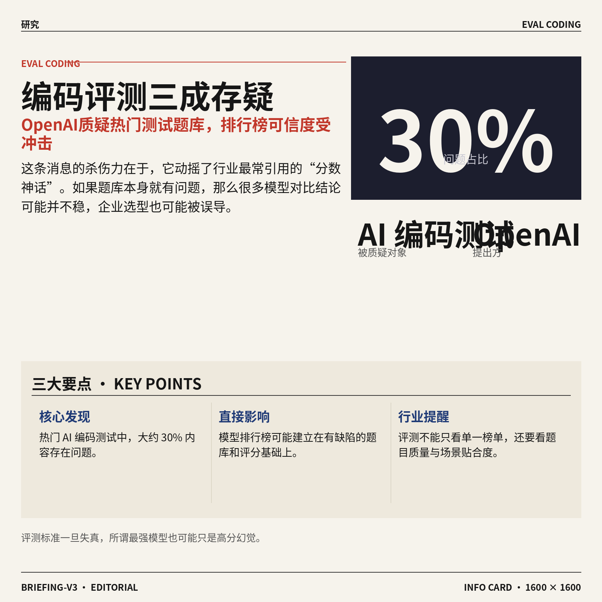

4. **OpenAI 发现约三成热门 AI 编码测试存在问题，行业评测可能没大家想得那么准。**
OpenAI 指出，一个流行的 **AI 编码测试（用来衡量模型写代码能力的标准题库）** 里，大约 **30%** 的内容存在问题，这会直接影响外界对模型能力高低的判断 📏。如果测试本身有缺陷，那么“谁家模型更强”的排行榜就可能建立在不稳的地基上，尤其对开发者和采购方来说，容易被表面分数误导。这条消息也提醒大家，AI 评测不能只看单一榜单，还得关注题目质量、评分方法和是否贴近真实使用场景。详情可看 [完整报道(briefing)](https://the-decoder.com/openai-finds-roughly-30-percent-of-popular-ai-coding-test-is-broken/) 。

![OpenAI 发现约三成热门 AI 编码测试存在问题，行业评测可能没大家想得那么准](https://image.pollinations.ai/prompt/OpenAI%20%E5%8F%91%E7%8E%B0%E7%BA%A6%E4%B8%89%E6%88%90%E7%83%AD%E9%97%A8%20AI%20%E7%BC%96%E7%A0%81%E6%B5%8B%E8%AF%95%E5%AD%98%E5%9C%A8%E9%97%AE%E9%A2%98%EF%BC%8C%E8%A1%8C%E4%B8%9A%E8%AF%84%E6%B5%8B%E5%8F%AF%E8%83%BD%E6%B2%A1%E5%A4%A7%E5%AE%B6%E6%83%B3%E5%BE%97%E9%82%A3%E4%B9%88%E5%87%86.%20OpenAI%20%E5%8F%91%E7%8E%B0%E7%BA%A6%E4%B8%89%E6%88%90%E7%83%AD%E9%97%A8%20AI%20%E7%BC%96%E7%A0%81%E6%B5%8B%E8%AF%95%E5%AD%98%E5%9C%A8%E9%97%AE%E9%A2%98%EF%BC%8C%E8%A1%8C%E4%B8%9A%E8%AF%84%E6%B5%8B%E5%8F%AF%E8%83%BD%E6%B2%A1%E5%A4%A7%E5%AE%B6%E6%83%B3%E5%BE%97%E9%82%A3%E4%B9%88%E5%87%86%E3%80%82%20OpenAI%20%E6%8C%87%E5%87%BA%EF%BC%8C%E4%B8%80%E4%B8%AA%E6%B5%81%E8%A1%8C%E7%9A%84%20AI%20%E7%BC%96%E7%A0%81%E6%B5%8B%E8%AF%95%EF%BC%88%E7%94%A8%E6%9D%A5%E8%A1%A1%E9%87%8F%E6%A8%A1%E5%9E%8B%E5%86%99%E4%BB%A3%E7%A0%81%E8%83%BD%E5%8A%9B%E7%9A%84%E6%A0%87%2C%20technical%20infographic%20diagram%2C%20architecture%20flowchart%2C%20clean%20vector%20illustration%2C%20educational%20style%2C%20no%20text%20overlay%2C%20modern%20minimal%2C%20wide%20aspect?width=1200&height=675&nologo=true&seed=10900)

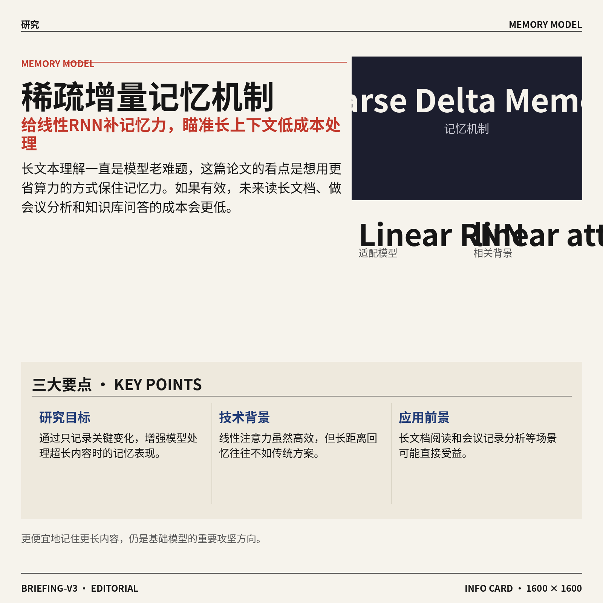

5. **Sparse Delta Memory（稀疏增量记忆机制）探索让 Linear RNN（线性循环神经网络）更擅长处理长上下文。**
这篇论文关注一个老问题：模型读很长内容时，怎么才能记得更牢 🧠。作者提出 **Sparse Delta Memory（只记录关键变化、而不是把所有信息都塞满的记忆方式）**，用于扩展 **Linear RNN（每步计算更省资源的一类序列模型）** 的状态表达能力；背景是 **linear attention（线性注意力，用更低计算成本处理长文本的机制）** 虽然高效，但在超长内容回忆上常落后于传统方案。若这条路线有效，未来长文档阅读、会议记录分析、知识库问答等场景，可能在更低成本下获得更好的“记忆力”。可参考 [arxiv 论文原文(briefing)](https://arxiv.org/abs/2607.07386) 或 [论文索引页(briefing)](https://huggingface.co/papers/2607.07386) 。

![Sparse Delta Memory（稀疏增量记忆机制）探索让 Linear RNN（线性循环神经网络）更擅长处理长上下文](https://image.pollinations.ai/prompt/Sparse%20Delta%20Memory%EF%BC%88%E7%A8%80%E7%96%8F%E5%A2%9E%E9%87%8F%E8%AE%B0%E5%BF%86%E6%9C%BA%E5%88%B6%EF%BC%89%E6%8E%A2%E7%B4%A2%E8%AE%A9%20Linear%20RNN%EF%BC%88%E7%BA%BF%E6%80%A7%E5%BE%AA%E7%8E%AF%E7%A5%9E%E7%BB%8F%E7%BD%91%E7%BB%9C%EF%BC%89%E6%9B%B4%E6%93%85%E9%95%BF%E5%A4%84%E7%90%86%E9%95%BF%E4%B8%8A%E4%B8%8B%E6%96%87.%20Sparse%20Delta%20Memory%EF%BC%88%E7%A8%80%E7%96%8F%E5%A2%9E%E9%87%8F%E8%AE%B0%E5%BF%86%E6%9C%BA%E5%88%B6%EF%BC%89%E6%8E%A2%E7%B4%A2%E8%AE%A9%20Linear%20RNN%EF%BC%88%E7%BA%BF%E6%80%A7%E5%BE%AA%E7%8E%AF%E7%A5%9E%E7%BB%8F%E7%BD%91%E7%BB%9C%EF%BC%89%E6%9B%B4%E6%93%85%E9%95%BF%E5%A4%84%E7%90%86%E9%95%BF%E4%B8%8A%E4%B8%8B%E6%96%87%E3%80%82%20%E8%BF%99%E7%AF%87%E8%AE%BA%E6%96%87%E5%85%B3%E6%B3%A8%E4%B8%80%E4%B8%AA%E8%80%81%E9%97%AE%E9%A2%98%EF%BC%9A%E6%A8%A1%E5%9E%8B%E8%AF%BB%E5%BE%88%2C%20technical%20infographic%20diagram%2C%20architecture%20flowchart%2C%20clean%20vector%20illustration%2C%20educational%20style%2C%20no%20text%20overlay%2C%20modern%20minimal%2C%20wide%20aspect?width=1200&height=675&nologo=true&seed=10931)

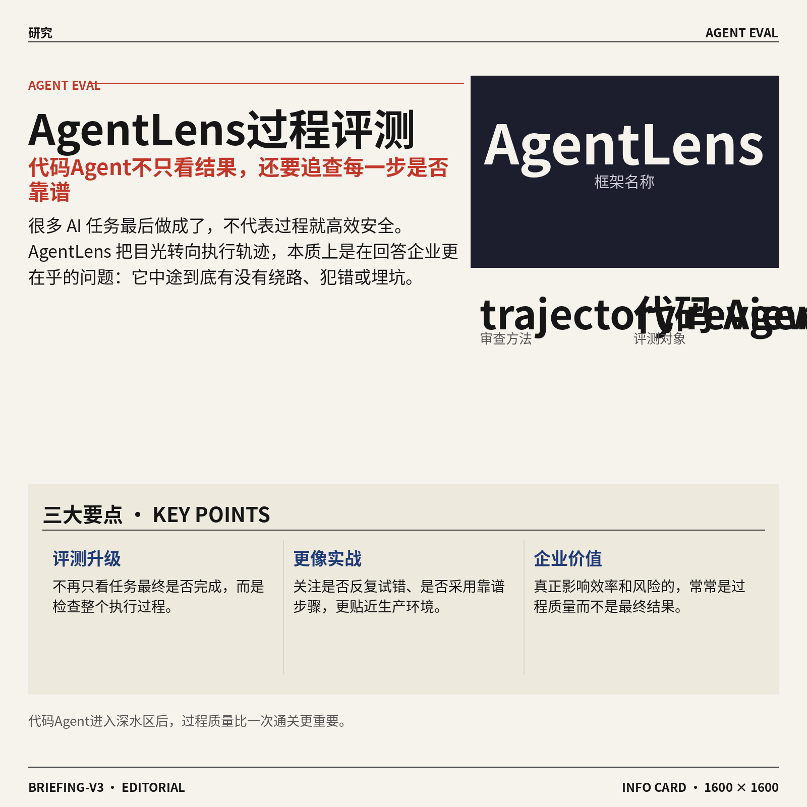

6. **AgentLens（代码 Agent 评测框架）想把“是否做对”升级为“过程到底好不好”。**
这篇论文提出 **AgentLens**，它是一个面向 **交互式代码 Agent（能边写代码边调用工具、逐步完成任务的 AI 编程助手）** 的评测基准，不再只看最后任务是否通过，而是审视整个执行轨迹 🔍。论文强调，真实用户更关心 AI 中途是否走弯路、是否反复试错、是否采用了靠谱步骤，因此引入 **trajectory review（任务轨迹审查，也就是回看 AI 每一步是怎么做决定的）** 会更接近生产环境。对企业来说，这种评测方式更实用，因为真正影响效率和风险的，往往不是“最后成没成”，而是“过程中有没有浪费时间、制造隐患”。可查看 [arxiv 论文原文(briefing)](https://arxiv.org/abs/2607.06624) 。


### 🟡 行业展望与社会影响

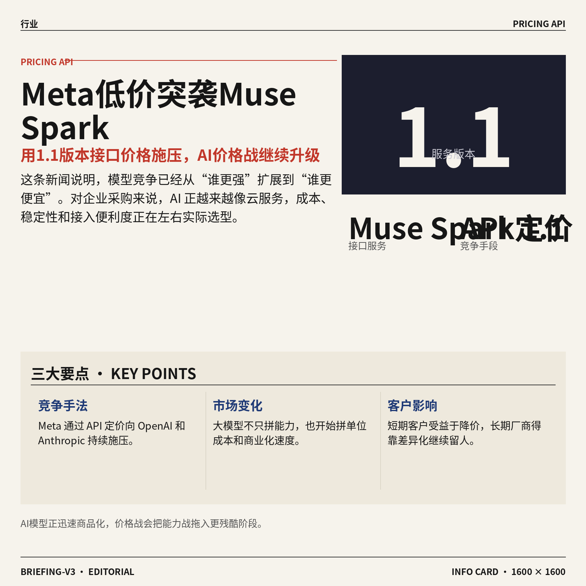

1. **Meta 用 Muse Spark 1.1（Meta 推出的 AI 模型接口服务）低价出招，AI 价格战继续升温。**
Meta 正在用 **API 定价**（开发者调用模型时按用量付费的收费方式）向 OpenAI 和 Anthropic 施压，这说明大模型竞争已经不只是拼能力，更是在拼**单位成本**和商业化速度 💸。对企业用户来说，模型越来越像“云服务采购”：谁更便宜、谁更稳、谁更容易接入，都会直接影响选型。价格战短期会让客户受益，但也可能倒逼厂商更快做出差异化能力，而不是只靠降价抢市场。[完整报道(briefing)](https://the-decoder.com/metas-muse-spark-1-1-api-pricing-squeezes-openai-and-anthropic-as-the-ai-price-war-heats-up/)


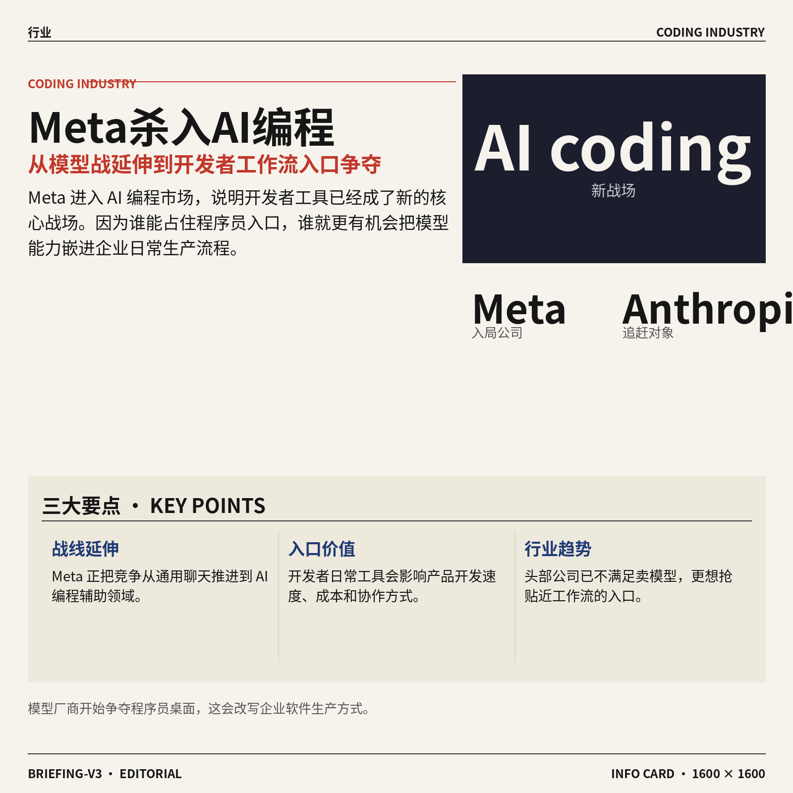

2. **Meta 进军 AI 编程市场，正面追赶 Anthropic 和 OpenAI。**
Meta 把战线从通用聊天、内容生成进一步推进到 **AI coding（AI 编程辅助，帮人写代码、改代码、查问题）** 领域，说明“谁能成为开发者日常工具”正在变成新的关键战场 👨‍💻。这类工具表面上服务程序员，实际上会影响所有数字化团队，因为它会改变产品开发速度、软件成本和内部协作方式。对行业来说，这也意味着头部公司不再满足于卖模型本身，而是要抢占更贴近工作流的入口。[报道摘要(briefing)](https://news.google.com/rss/articles/CBMioAFBVV95cUxOa1dxU1JNM2gybUFmVWR1STVhX2VWVGVGWGhxMEdXX0RBR243dGIzaDBqR1NCS2VSX2Z6ZVFXa181QUZSeHB0SDNhM25wYzNzYk1iY1NObWs3bE5iNlZKdC1jMmFhaklWNHpLQlN6UU5UT01HalhfY0hRRWFzbVk1ZDVSR1V1X1VuMTBsMFlMb0c0eTdVcnU0bDQ1aFE3NTFw0gGmAUFVX3lxTE1nWm5QWUJiRDFLYkZVcEdjUjZJcHlyRXItanp5YUhRSkRIMjVIRFd4YW5uYmlkWjNaLW4yY3FjanBOV2ZlUDY0TjFBZkVaeXh2NzFSdzVoYUZGQlpGaGUzMWVYNHktMkVrRVJWakdxbExxUjRyMVd2VDh0bF9SeG11VTNHRXIwdWFzdmlaNGZ4TzB1RXYteTI0aWFVcmJRQkRMNFpSNEE?oc=5)


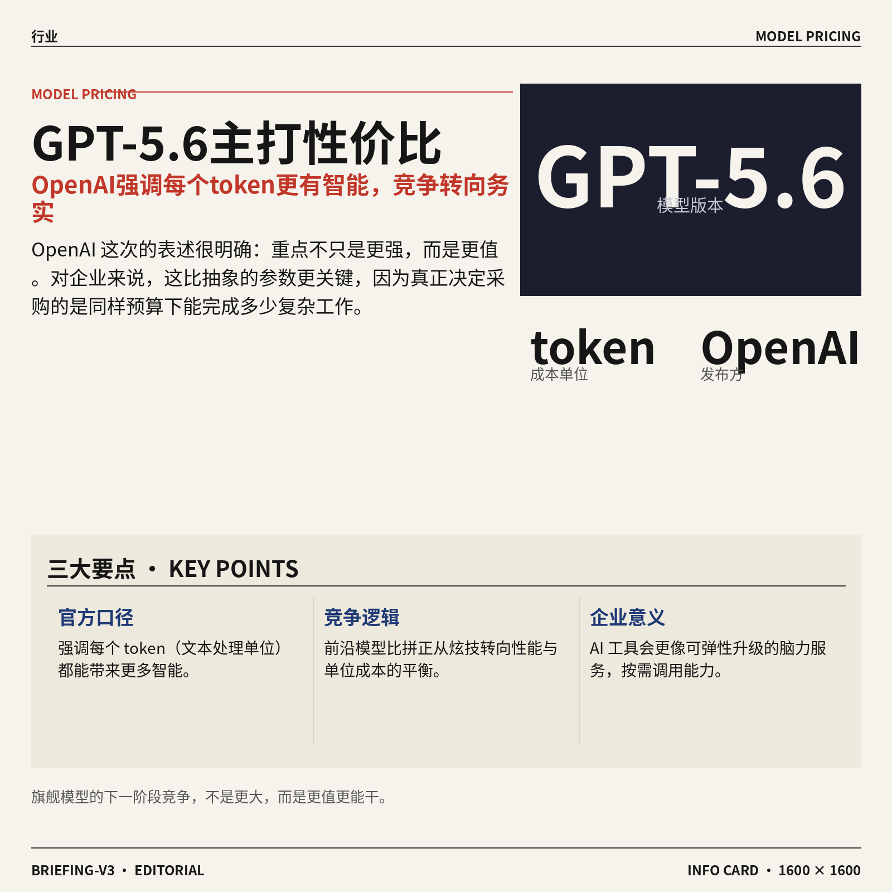

3. **OpenAI 发布 GPT-5.6，并强调“每个 token（模型处理文字时切分的小单位）带来更多智能”。**
从 OpenAI 官方表述看，GPT-5.6 主打的是 **更强性能 / 更低单位成本 / 按需提供更高能力**，重点落在“性价比”而不只是参数或噱头 🚀。这反映出前沿模型竞争进入更务实阶段：企业真正关心的是同样预算下能不能完成更复杂的工作，而不是单纯追求最强榜单成绩。对普通职场场景来说，这意味着 AI 工具未来会更像“可弹性升级的脑力服务”，需要时再调用更强能力。[官方发布页(briefing)](https://openai.com/index/gpt-5-6)


4. **OpenAI 推出 ChatGPT Work（面向工作的 ChatGPT 新方案），企业级 AI 正在加速成型。**
除了发布 GPT-5.6，OpenAI 还宣布了 **ChatGPT Work**，从名字就能看出它在把 ChatGPT 往更正式的工作场景推进 🧩。这类产品的意义不只是“聊天更聪明”，而是试图把 AI 变成日常办公入口，覆盖写作、分析、整理信息等高频任务。对公司管理层来说，这代表 AI 正从个人试用工具走向团队级、组织级部署，接下来关注点会更多转向权限、流程和实际产出。[媒体报道(briefing)](https://news.google.com/rss/articles/CBMilwFBVV95cUxNb1Vfb1J2X0ZsRG5kekItTU9KdFo3Wm1uSE9vUnRMOTd6b3I3djg1NXRyaDdJUERxS2hvcERmTDlkX0k2NkZPQ0VndENDd0NkN2VPMDRoaDdlTjFOUVZ4eldxd0drSHZrUHFKTTVTcVh6eTByNFA0djlXdDZEZGNrejVOOGx4MWdza00wMlBBVmRzMmJxY0lz?oc=5) [OpenAI 官方介绍(briefing)](https://openai.com/index/gpt-5-6)


### 🟣 开源TOP项目

1. **CodexBar（一款查看 OpenAI Codex 与 Claude Code 使用数据的菜单栏工具）让你不登录也能看额度。**
这个开源小工具主打一个**省事**：不用反复登录网页，就能直接查看 **OpenAI Codex** 和 **Claude Code** 的使用统计，适合经常写代码或盯着额度的人 👀。它本质上是个 **menu bar（电脑顶部或底部常驻的小工具栏）** 工具，把原本分散在网页里的信息收拢到一处，减少来回切换。对团队来说，这类小工具也说明大家对 **AI 编码助手** 的日常管理需求越来越细，不只是“能不能用”，还包括“还剩多少、用得怎么样” 💡。项目可见 [GitHub 仓库(briefing)](https://github.com/steipete/CodexBar)


2. **knockoff（一款帮你过滤亚马逊山寨杂牌商品的 Chrome 扩展）想替网购决策“排雷”。**
这个项目是一个 **Chrome extension（浏览器扩展插件, 安装后可给网页增加额外功能）**，目标很直接：在亚马逊页面里过滤掉那些看起来像“伪品牌”的杂牌商品，帮助用户更容易找到**真实、成熟品牌**的产品 🛒。它切中的不是大模型训练，而是更贴近日常消费的**信息筛选**问题——当商品太多、名字太像时，工具能先帮你做第一轮清理。对做运营、采购或电商观察的同事来说，这也反映出 AI / 自动化工具正越来越多地进入**消费决策辅助**场景，而不只是聊天和写代码 🚀。项目详情见 [扩展项目主页(briefing)](https://github.com/Shpigford/knockoff)


### 🔴 社媒分享

1. **ChatGPT Work（OpenAI 面向高强度办公场景的企业工作方案）发布。**
OpenAI 这次主打的是让 ChatGPT 更深入进入**复杂工作流**，瞄准需要长链路思考、资料整合和团队协作的办公场景 💼。对业务、运营和管理岗来说，这类方案的意义不只是“会聊天”，而是把 AI 进一步变成可参与正式工作的**生产力工具**。如果你想看 OpenAI 的原始介绍，可以直接参考 [官方发布页(briefing)](https://openai.com/index/chatgpt-for-your-most-ambitious-work/)。这里的工作流（把一项工作拆成多个连续步骤来推进）和企业级场景，说明 AI 正在从个人助手走向组织能力升级 🚀


2. **Muse Spark 1.1（Meta 推出的模型服务版本）亮相，强调 API 能力与评测结果。**
Meta 发布了 **Muse Spark 1.1**，同时给出评测报告和开发者接入信息，重点显然不只是“模型有多强”，还包括怎么让外部团队真正用起来 🔧。其中 API（应用程序接口，相当于让别家软件接入这个模型的“连接口”）是关键，因为它决定产品团队能否把模型快速嵌进自己的业务系统。对公司内部做产品、运营或数据服务的人来说，这类发布往往意味着更多可直接集成的 AI 能力，而不只是实验室演示。[Meta 官方介绍(briefing)](https://ai.meta.com/blog/introducing-muse-spark-meta-model-api/) 和 [评测报告原文(briefing)](https://ai.meta.com/static-resource/muse-spark-1-1-evaluation-report) 都可以一起看，更容易判断它是“宣传”还是“可落地” 💡


3. **GLM 5.2（智谱新一代大模型）在记账准确率测试中接近人工账务人员。**
这篇分享最吸引人的点，是把 **GLM 5.2** 放进了增值税记账场景做对比，结论是它在测试里的准确度已经接近人工 book keeper（账务处理人员，负责记账和票据核对）📊。这对财务、税务和后台支持团队尤其值得关注，因为 AI 是否能稳定处理规则明确、容错率低的任务，一直是落地关键。这里的 benchmark（基准测试，用统一题目比较不同方案表现）提供了一个更具体的观察角度：AI 不只是会写文案，也开始碰触高要求的数字类工作。[完整测试文章(briefing)](https://toot-books.pages.dev/blog/glm-5-2-vat-benchmark) 值得细读，尤其适合关心财务自动化的人 👀


4. **Hy3（腾讯混元推出的 3D 生成研究项目）发布。**
Hy3 来自腾讯混元研究团队，从名字和发布页看，重点是 **3D 生成** 能力，也就是让 AI 直接生成三维内容 🧩。3D（立体数字模型，常用于游戏、美术、商品展示和虚拟空间）过去门槛高、制作慢，如果 AI 能参与其中，设计、营销展示、电商素材都会被影响。对非技术同事来说，可以把它理解成：以后不仅能“生成图片”和“生成视频”，还可能进一步生成可旋转、可编辑的立体资产。[项目发布页(briefing)](https://hy.tencent.com/research/hy3) 提供了官方入口，适合关注内容生产和数字资产方向的同事了解一下 ✨


5. **GPT-5.6（OpenAI 新模型版本）上线，并同步放出安全与开发文档。**
OpenAI 发布 **GPT-5.6** 时，不只给了模型介绍，还同步提供了安全报告和开发文档，说明这次更新更偏向“正式可用”的产品节奏 🛠️。对企业用户来说，模型能力之外，deployment safety（部署安全，指模型上线后怎么降低风险、避免不当输出）同样重要，因为这关系到它能不能进入真实业务流程。开发文档则意味着 API 接入、产品集成和二次开发会更清晰，方便团队评估接入成本。[官方发布页(briefing)](https://openai.com/index/gpt-5-6/) 和 [安全报告原文(briefing)](https://deploymentsafety.openai.com/gpt-5-6/gpt-5-6.pdf) 可以一起看，更容易判断这次升级对实际工作有多大帮助 🚀


6. **Meta CTO Andrew Bosworth（Meta 首席技术官安德鲁·博斯沃思）谈 Meta 重回 AI 相关性的路径。**
这篇内容的价值，不在某个单一模型发布，而在于 Meta 高层直接解释公司如何看待自己在 **AI 竞争格局** 里的位置与路线图 🧭。对管理层和业务负责人来说，这类访谈能帮助理解大厂为什么持续投入模型、平台和生态，而不只是追逐短期热点。所谓 relevance（行业相关性，指在市场和技术讨论中是否仍被视为关键玩家）其实是个很现实的问题：谁能持续影响开发者、企业客户和用户，谁就更可能掌握下一轮机会。[完整报道(briefing)](https://www.bigtechnology.com/p/metas-path-to-ai-relevance-according) 适合当成“行业风向解读”来看，而不是单纯新闻速读 💡


---

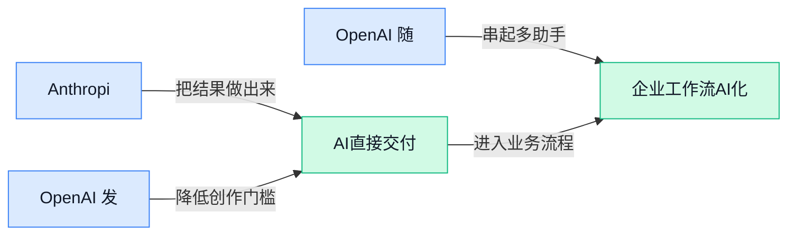
```mermaid
graph LR
A[Anthropi] -->|把结果做出来| D[AI直接交付]
B[OpenAI 发] -->|降低创作门槛| D
C[OpenAI 随] -->|串起多助手| E[企业工作流AI化]
 D -->|进入业务流程| E
classDef blue fill:#dbeafe,stroke:#3b82f6,color:#111827
classDef green fill:#d1fae5,stroke:#10b981,color:#111827
class A,B,C blue
class D,E green
```

### 📊 行业洞察（今日 4 条）

1. OpenAI 一天内同时发 GPT-5.6 和 ChatGPT Work，Meta 又用 Muse Spark 1.1 打低价并杀入 AI 编程
  【洞察】大厂竞争已经从“谁更聪明”转向“谁更便宜、谁更贴近工作入口”，模型本身正在快速变成底层水电

2. OpenAI 的 AI 在 AtCoder（知名编程竞赛平台）赢过所有人类，但它又说热门编程测试约三成题有问题
  【洞察】AI 能力确实在变强，但榜单越来越不值得盲信，今后比拼重点会从“分数”转向“真实场景稳定交付”

3. Claude Reflect（追踪个人 AI 使用习惯的功能）上线，ChatGPT Work 也开始接管完整工作流程
  【洞察】AI 正从“回答你的问题”升级为“理解你的工作方式并持续代劳”，用户数据和使用习惯会变成新护城河

4. AgentLens（回看 AI 每一步做得好不好）和 RoboDojo（把模拟测试与真实环境测试放一起）都在改评测
  【洞察】行业开始承认“实验室跑分”不等于真能落地，过程是否靠谱、到了真实环境是否稳定，正在比结果更重要

### 💭 对我们的启发（今日 3 条）

1. OpenAI 推 ChatGPT Work、Claude Reflect，说明视频工具不能只做“一次生成”。我们要尽快补“记住品牌习惯、复用剪辑偏好、沉淀团队流程”，不然很容易被通用工具吃掉入口。

2. Meta 低价打模型接口，OpenAI 强调更高性价比，这验证我们不能把价值押在单一模型上。产品要支持按任务切换底层能力，把高质量出片和成本控制一起做成默认能力。

3. OpenAI 一边秀 AtCoder 冠军，一边否定热门编程测试，提醒我们别迷信演示效果。视频工具的信任机制要看“客户能否稳定出片、是否少返工”，关键步骤必须保留人工接管。

