## AI资讯日报 2026/7/13

> AI 早报 · 每日早读 · 全网深度聚合

## **今日摘要**

```
OpenAI、Meta、SpaceXAI 围绕更省钱模型正面开打，Meta 9 月量产 AI 芯片并冲刺算力翻倍
Claude Code 未读提示先发 3.3 万 tokens，中国通报其安全漏洞，OpenCode（开源编程助手）仅约 7000
布朗大学禁用 AI 后考试均分从 96% 跌到 48%，LinkedIn 被指成 AI 灌水重灾区震撼职场
```

### 🔵 产品与功能更新

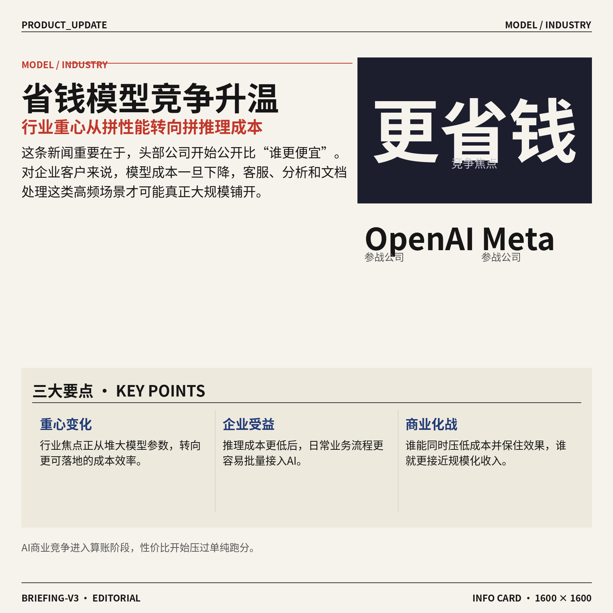

1. **OpenAI、Meta 与 SpaceXAI 围绕更省钱的 AI 模型展开竞争。**  
这条消息的重点不是谁把模型做得“更大”，而是谁能把**成本效率**做得更好 💡。对企业用户来说，模型越便宜，意味着客服、文档处理、数据分析这类日常场景越容易大规模落地；对平台方来说，则是在拼**推理成本**（模型真正回答问题时消耗的算力和电费）和商业化能力。报道提到多家公司都在争夺“更高性价比”的路线，说明 AI 行业正在从单纯比性能，转向比**可用性**和**投入产出比** 🚀。[彭博相关报道(briefing)](https://news.google.com/rss/articles/CBMiswFBVV95cUxNRENTWFpvMXlpQS1vNU03VGZ3aGZKak1ZVlFPWkliOVVSbFpmZ2I1Ui1LMGVtWHd3N2xkaElHUV9CYXhKYlY1eXhmd1lZUzZGRzVXbzYzVVhvUERWN0RzWGVUMVoyUXBoWGR6dHBCeWEtZkl5ZzJKVVlUVXZFYkVBVjdCcXozOGpOUVNSMlpPbElYVGZQbUR2d0tnQ1pWOTJoekJKZzdWMjZ1eVlPNFgtVUZlTQ?oc=5)


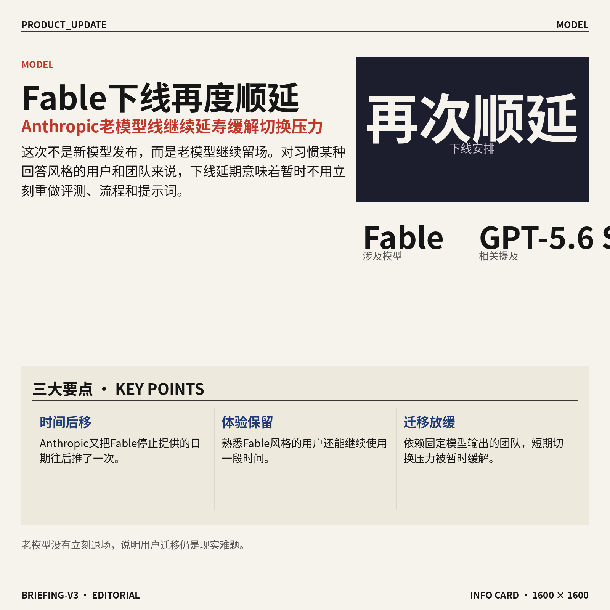

2. **Fable（Anthropic 旗下的一类模型系列）下线时间再次顺延。**  
Simon Willison 的跟踪信息显示，Anthropic 又一次把 **Fable** 在 Claude 中停止提供的日期往后推了 ⏳。文中还提到，**GPT-5.6 Sol** 被认为明显属于 **Fable/Mythos class model**（一种模型家族分类说法，用来描述模型能力和风格接近哪一类），这也让外界继续关注 Anthropic 对老模型线的安排。对普通用户来说，这意味着一部分熟悉的模型体验还能继续用一阵；对依赖固定模型表现的团队来说，产品切换压力也暂时缓了一口气 🙂。[作者跟踪说明(briefing)](https://simonwillison.net/2026/Jul/12/bump/#atom-everything)


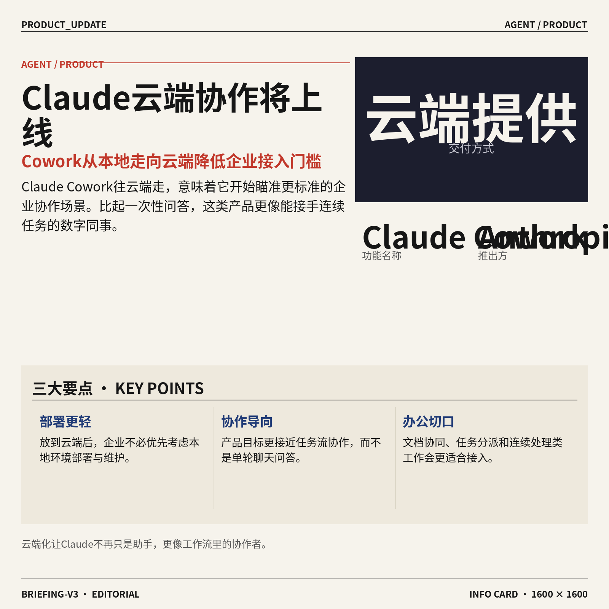

3. **Anthropic 将通过云端提供 Claude Cowork（让 Claude 像同事一样协作的功能）。**  
这条更新的核心是：Anthropic 准备把 **Claude Cowork** 放到**云端**供用户使用，也就是不必局限在本地环境里部署和调用 ☁️。从名字看，Claude Cowork 更强调“协作式”使用体验，像一个能参与工作流程的 AI 助手，而不只是单次问答工具。对企业团队来说，这类能力如果接入成熟，可能会更适合文档协作、任务分派和连续处理型工作；而“云端提供”也通常意味着接入门槛更低、部署更省事 🚀。[AOL 转引报道(briefing)](https://news.google.com/rss/articles/CBMiiwFBVV95cUxNUEVTOEtzZjRiX0VHMDlCdWNQaTE0U1YwUzdvckVnMGRsMXkxNGpLeGdhZFg2WTJOY0Izazh5em1wM1I5OXpScTJBdU1KTm5hNFROVlRiLWNxakNBVGRDNTJ6VDU5MGR3VE9ucGRoZnpXRnRkTHoyYzhJdUhFOXBjVGxIZTRidGJVZmxB?oc=5)


### 🟢 前沿研究


1. **AI Agent 在《Slay the Spire 2》（一款卡牌构筑 roguelike 游戏，每局都要临场决策）中靠结构化记忆打出更好成绩。**
这项研究的亮点，不是单纯“模型更大了”，而是把不断膨胀的聊天记录，换成了**结构化记忆**（把关键信息整理成可检索的“知识卡片”，而不是让模型反复翻长对话）💡。对普通人来说，这很像把开会录音原文，升级成按主题整理的会议纪要：AI 不用再从一大堆上下文里“硬翻”。这说明 **Agent** 的上限，越来越取决于“怎么记、怎么调信息”，而不只是“会不会说” 🚀。如果这套思路能迁移到办公场景，未来多步骤任务协作可能会更稳。[完整研究报道(briefing)](https://the-decoder.com/ai-agents-win-at-slay-the-spire-2-after-researchers-replace-growing-chat-logs-with-structured-memory/)


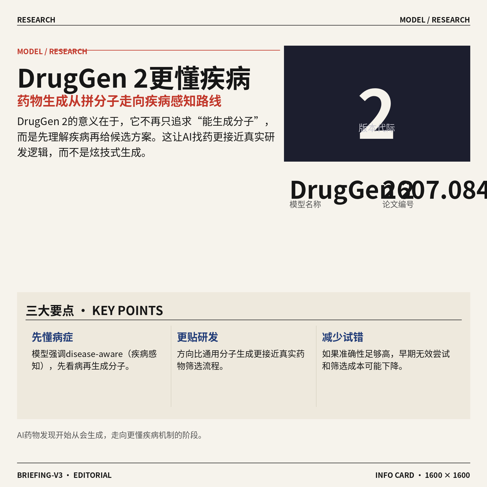

2. **DrugGen 2（面向药物发现的疾病感知语言模型）想让 AI 找药更懂“病”而不只会“拼分子”。**
这篇论文聚焦 **drug discovery**（药物发现，用计算方法提前筛选潜在药物）里的关键难题：同样是生成分子，是否真的对特定疾病有用。DrugGen 2 强调 **disease-aware**（先理解疾病特征，再定向生成候选药物分子）的能力，方向上比“通用生成”更贴近真实研发流程 🧪。对行业来说，这类模型如果做得准，价值不只是提速，更可能减少早期筛选里的无效尝试。具体论文可见[论文简介页(briefing)](https://huggingface.co/papers/2607.08404)

![DrugGen 2（面向药物发现的疾病感知语言模型）想让 AI 找药更懂“病”而不只会“拼分子”](https://image.pollinations.ai/prompt/DrugGen%202%EF%BC%88%E9%9D%A2%E5%90%91%E8%8D%AF%E7%89%A9%E5%8F%91%E7%8E%B0%E7%9A%84%E7%96%BE%E7%97%85%E6%84%9F%E7%9F%A5%E8%AF%AD%E8%A8%80%E6%A8%A1%E5%9E%8B%EF%BC%89%E6%83%B3%E8%AE%A9%20AI%20%E6%89%BE%E8%8D%AF%E6%9B%B4%E6%87%82%E2%80%9C%E7%97%85%E2%80%9D%E8%80%8C%E4%B8%8D%E5%8F%AA%E4%BC%9A%E2%80%9C%E6%8B%BC%E5%88%86%E5%AD%90%E2%80%9D.%20DrugGen%202%EF%BC%88%E9%9D%A2%E5%90%91%E8%8D%AF%E7%89%A9%E5%8F%91%E7%8E%B0%E7%9A%84%E7%96%BE%E7%97%85%E6%84%9F%E7%9F%A5%E8%AF%AD%E8%A8%80%E6%A8%A1%E5%9E%8B%EF%BC%89%E6%83%B3%E8%AE%A9%20AI%20%E6%89%BE%E8%8D%AF%E6%9B%B4%E6%87%82%E2%80%9C%E7%97%85%E2%80%9D%E8%80%8C%E4%B8%8D%E5%8F%AA%E4%BC%9A%E2%80%9C%E6%8B%BC%E5%88%86%E5%AD%90%E2%80%9D%E3%80%82%20%E8%BF%99%E7%AF%87%E8%AE%BA%E6%96%87%E8%81%9A%E7%84%A6%20drug%20discovery%EF%BC%88%E8%8D%AF%E7%89%A9%E5%8F%91%E7%8E%B0%EF%BC%8C%E7%94%A8%E8%AE%A1%E7%AE%97%2C%20technical%20infographic%20diagram%2C%20architecture%20flowchart%2C%20clean%20vector%20illustration%2C%20educational%20style%2C%20no%20text%20overlay%2C%20modern%20minimal%2C%20wide%20aspect?width=1200&height=675&nologo=true&seed=10838)

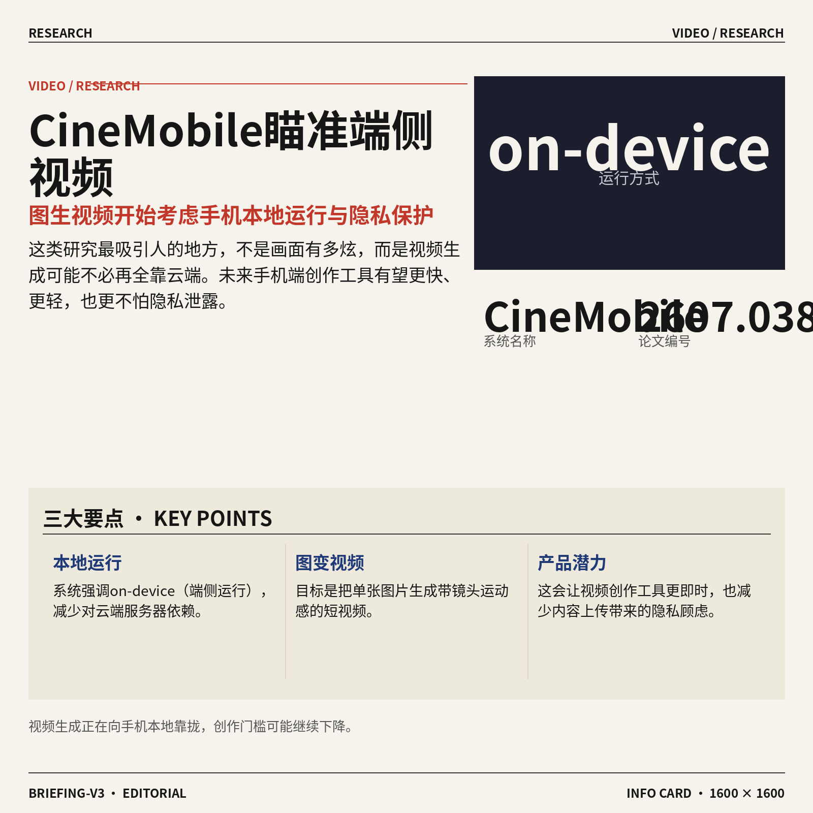

3. **CineMobile（可在手机等设备本地运行的图生视频系统）瞄准“端侧视频生成”。**
这项工作研究的是 **on-device**（直接在手机、平板等本地设备上运行，不依赖云端服务器）的视频生成能力，目标是把一张图片变成带有电影感镜头运动的短视频 🎬。它基于 **diffusion model**（扩散模型，一类通过逐步去噪生成图像或视频的主流生成模型），但重点不只是画面质量，而是把“镜头怎么动”也纳入生成过程。对产品团队来说，这类研究的意义在于：未来视频创作工具可能更轻、更快，也更保护隐私，因为内容不一定要上传云端处理。[论文简介页(briefing)](https://huggingface.co/papers/2607.03803)

![CineMobile（可在手机等设备本地运行的图生视频系统）瞄准“端侧视频生成”](https://image.pollinations.ai/prompt/CineMobile%EF%BC%88%E5%8F%AF%E5%9C%A8%E6%89%8B%E6%9C%BA%E7%AD%89%E8%AE%BE%E5%A4%87%E6%9C%AC%E5%9C%B0%E8%BF%90%E8%A1%8C%E7%9A%84%E5%9B%BE%E7%94%9F%E8%A7%86%E9%A2%91%E7%B3%BB%E7%BB%9F%EF%BC%89%E7%9E%84%E5%87%86%E2%80%9C%E7%AB%AF%E4%BE%A7%E8%A7%86%E9%A2%91%E7%94%9F%E6%88%90%E2%80%9D.%20CineMobile%EF%BC%88%E5%8F%AF%E5%9C%A8%E6%89%8B%E6%9C%BA%E7%AD%89%E8%AE%BE%E5%A4%87%E6%9C%AC%E5%9C%B0%E8%BF%90%E8%A1%8C%E7%9A%84%E5%9B%BE%E7%94%9F%E8%A7%86%E9%A2%91%E7%B3%BB%E7%BB%9F%EF%BC%89%E7%9E%84%E5%87%86%E2%80%9C%E7%AB%AF%E4%BE%A7%E8%A7%86%E9%A2%91%E7%94%9F%E6%88%90%E2%80%9D%E3%80%82%20%E8%BF%99%E9%A1%B9%E5%B7%A5%E4%BD%9C%E7%A0%94%E7%A9%B6%E7%9A%84%E6%98%AF%20on-device%EF%BC%88%E7%9B%B4%E6%8E%A5%E5%9C%A8%E6%89%8B%E6%9C%BA%E3%80%81%E5%B9%B3%E6%9D%BF%E7%AD%89%E6%9C%AC%E5%9C%B0%E8%AE%BE%E5%A4%87%E4%B8%8A%E8%BF%90%E8%A1%8C%EF%BC%8C%E4%B8%8D%E4%BE%9D%2C%20technical%20infographic%20diagram%2C%20architecture%20flowchart%2C%20clean%20vector%20illustration%2C%20educational%20style%2C%20no%20text%20overlay%2C%20modern%20minimal%2C%20wide%20aspect?width=1200&height=675&nologo=true&seed=10869)

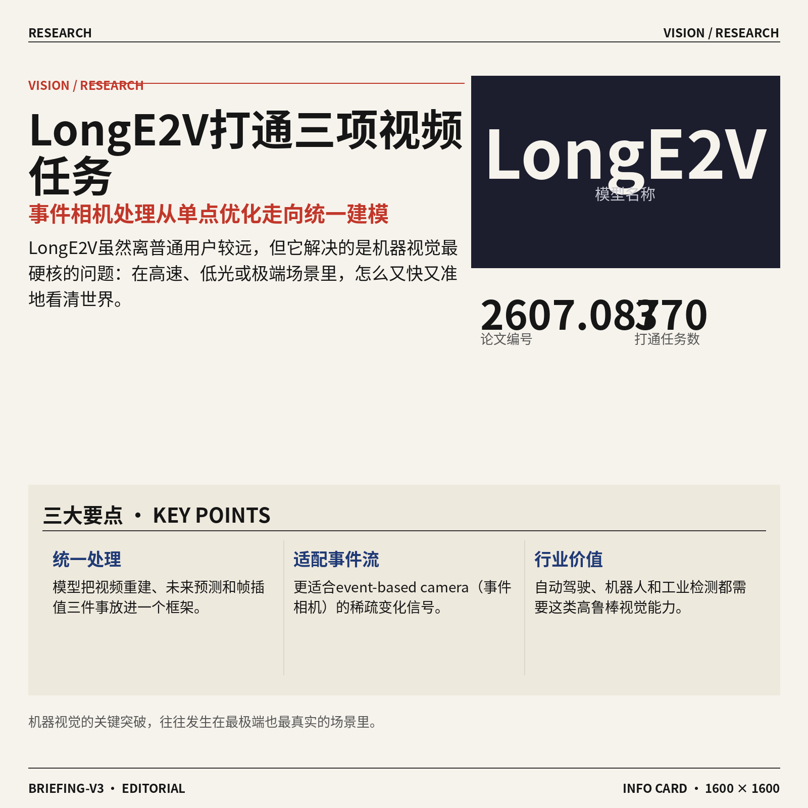

4. **LongE2V（面向长时段事件相机视频重建的模型）把重建、预测、补帧三件事打通了。**
这里的 **event-based camera**（事件相机，只记录画面变化而不是一帧一帧完整拍摄的相机）和普通摄像头很不一样，优势是对高速运动和极端光照更敏感 📷。LongE2V 结合 **video diffusion model**（视频扩散模型，用逐步去噪方式生成连续视频），同时处理视频重建、未来预测和帧插值（在两帧之间补出更顺滑的中间画面）。这类研究离日常办公有点远，但它对自动驾驶、机器人、工业检测都很关键，因为这些场景最怕“看不清”或“反应慢”。[论文简介页(briefing)](https://huggingface.co/papers/2607.08770)

![LongE2V（面向长时段事件相机视频重建的模型）把重建、预测、补帧三件事打通了](https://image.pollinations.ai/prompt/LongE2V%EF%BC%88%E9%9D%A2%E5%90%91%E9%95%BF%E6%97%B6%E6%AE%B5%E4%BA%8B%E4%BB%B6%E7%9B%B8%E6%9C%BA%E8%A7%86%E9%A2%91%E9%87%8D%E5%BB%BA%E7%9A%84%E6%A8%A1%E5%9E%8B%EF%BC%89%E6%8A%8A%E9%87%8D%E5%BB%BA%E3%80%81%E9%A2%84%E6%B5%8B%E3%80%81%E8%A1%A5%E5%B8%A7%E4%B8%89%E4%BB%B6%E4%BA%8B%E6%89%93%E9%80%9A%E4%BA%86.%20LongE2V%EF%BC%88%E9%9D%A2%E5%90%91%E9%95%BF%E6%97%B6%E6%AE%B5%E4%BA%8B%E4%BB%B6%E7%9B%B8%E6%9C%BA%E8%A7%86%E9%A2%91%E9%87%8D%E5%BB%BA%E7%9A%84%E6%A8%A1%E5%9E%8B%EF%BC%89%E6%8A%8A%E9%87%8D%E5%BB%BA%E3%80%81%E9%A2%84%E6%B5%8B%E3%80%81%E8%A1%A5%E5%B8%A7%E4%B8%89%E4%BB%B6%E4%BA%8B%E6%89%93%E9%80%9A%E4%BA%86%E3%80%82%20%E8%BF%99%E9%87%8C%E7%9A%84%20event-based%20camera%EF%BC%88%E4%BA%8B%E4%BB%B6%E7%9B%B8%E6%9C%BA%EF%BC%8C%E5%8F%AA%E8%AE%B0%E5%BD%95%E7%94%BB%E9%9D%A2%E5%8F%98%E5%8C%96%E8%80%8C%E4%B8%8D%E6%98%AF%2C%20technical%20infographic%20diagram%2C%20architecture%20flowchart%2C%20clean%20vector%20illustration%2C%20educational%20style%2C%20no%20text%20overlay%2C%20modern%20minimal%2C%20wide%20aspect?width=1200&height=675&nologo=true&seed=10900)

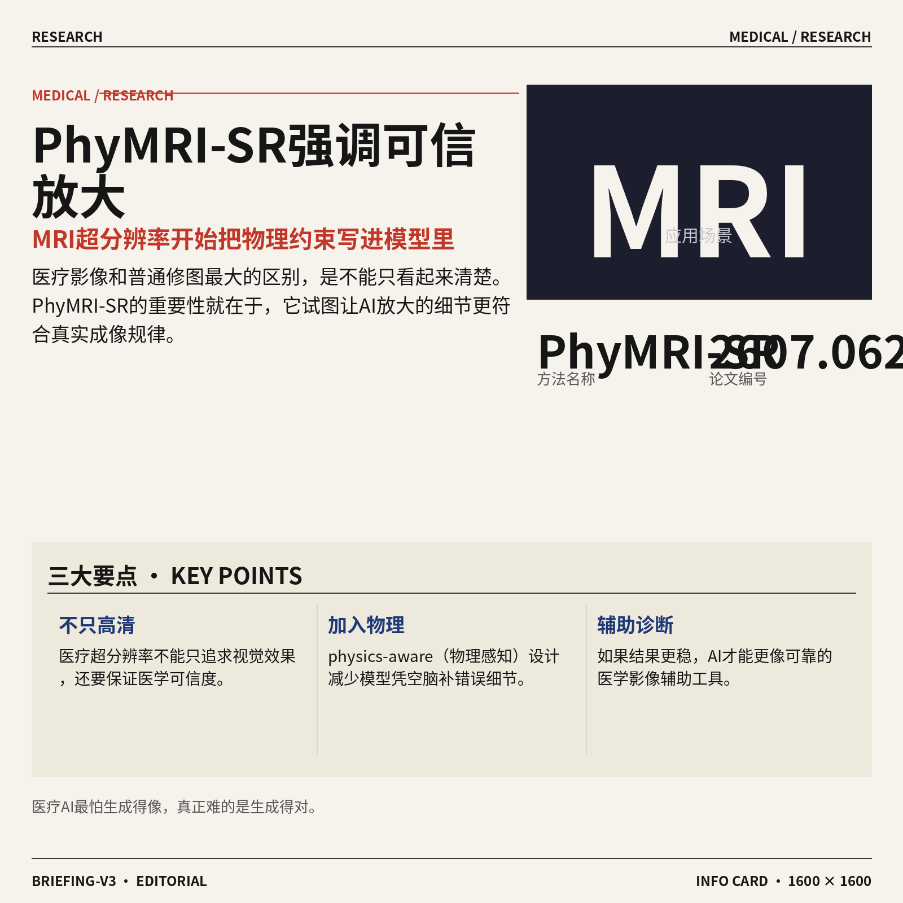

5. **PhyMRI-SR（结合成像物理知识的 MRI 超分辨率方法）想把医学图像放大得更靠谱。**
所谓 **super-resolution**（超分辨率，就是把低清图像补成更高分辨率图像），在医疗里不能只追求“看起来更清楚”，还得尽量符合真实成像规律。PhyMRI-SR 的重点就在 **physics-aware**（把 MRI 成像背后的物理约束一起考虑进去），避免 AI 只会“脑补细节”却补错了 🩺。这对医疗场景尤其重要，因为医生看到的每个纹理都可能影响判断。换句话说，这类研究是在推动 AI 从“修图高手”变成“更可信的医学辅助工具”。[论文简介页(briefing)](https://huggingface.co/papers/2607.06238)

![PhyMRI-SR（结合成像物理知识的 MRI 超分辨率方法）想把医学图像放大得更靠谱](https://image.pollinations.ai/prompt/PhyMRI-SR%EF%BC%88%E7%BB%93%E5%90%88%E6%88%90%E5%83%8F%E7%89%A9%E7%90%86%E7%9F%A5%E8%AF%86%E7%9A%84%20MRI%20%E8%B6%85%E5%88%86%E8%BE%A8%E7%8E%87%E6%96%B9%E6%B3%95%EF%BC%89%E6%83%B3%E6%8A%8A%E5%8C%BB%E5%AD%A6%E5%9B%BE%E5%83%8F%E6%94%BE%E5%A4%A7%E5%BE%97%E6%9B%B4%E9%9D%A0%E8%B0%B1.%20PhyMRI-SR%EF%BC%88%E7%BB%93%E5%90%88%E6%88%90%E5%83%8F%E7%89%A9%E7%90%86%E7%9F%A5%E8%AF%86%E7%9A%84%20MRI%20%E8%B6%85%E5%88%86%E8%BE%A8%E7%8E%87%E6%96%B9%E6%B3%95%EF%BC%89%E6%83%B3%E6%8A%8A%E5%8C%BB%E5%AD%A6%E5%9B%BE%E5%83%8F%E6%94%BE%E5%A4%A7%E5%BE%97%E6%9B%B4%E9%9D%A0%E8%B0%B1%E3%80%82%20%E6%89%80%E8%B0%93%20super-resolution%EF%BC%88%E8%B6%85%E5%88%86%E8%BE%A8%E7%8E%87%EF%BC%8C%E5%B0%B1%E6%98%AF%E6%8A%8A%E4%BD%8E%E6%B8%85%E5%9B%BE%E5%83%8F%E8%A1%A5%E6%88%90%E6%9B%B4%2C%20technical%20infographic%20diagram%2C%20architecture%20flowchart%2C%20clean%20vector%20illustration%2C%20educational%20style%2C%20no%20text%20overlay%2C%20modern%20minimal%2C%20wide%20aspect?width=1200&height=675&nologo=true&seed=10931)

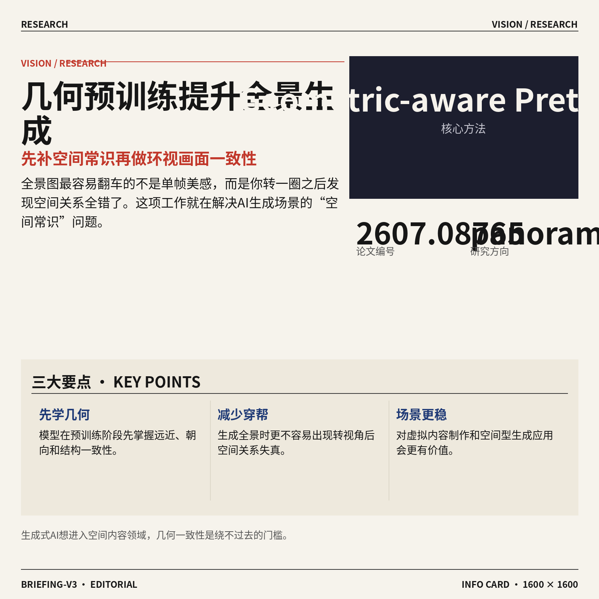

6. **Geometric-aware Pretraining（几何感知预训练）提升了上下文全景图生成。**
这篇工作聚焦 **panoramic generation**（全景图生成，生成可环视的大范围画面），难点在于画面不只要好看，还要空间关系别“拧巴” 🌍。作者提出 **geometric-aware pretraining**（在预训练阶段先让模型学会空间几何关系，比如远近、朝向和结构一致性），来增强 **in-context**（根据当前给定示例或上下文直接生成）的全景生成能力。对内容制作和虚拟场景行业来说，这类方法如果成熟，会让 AI 生成的空间环境更稳定，减少“看一圈就穿帮”的问题。[论文简介页(briefing)](https://huggingface.co/papers/2607.08765)


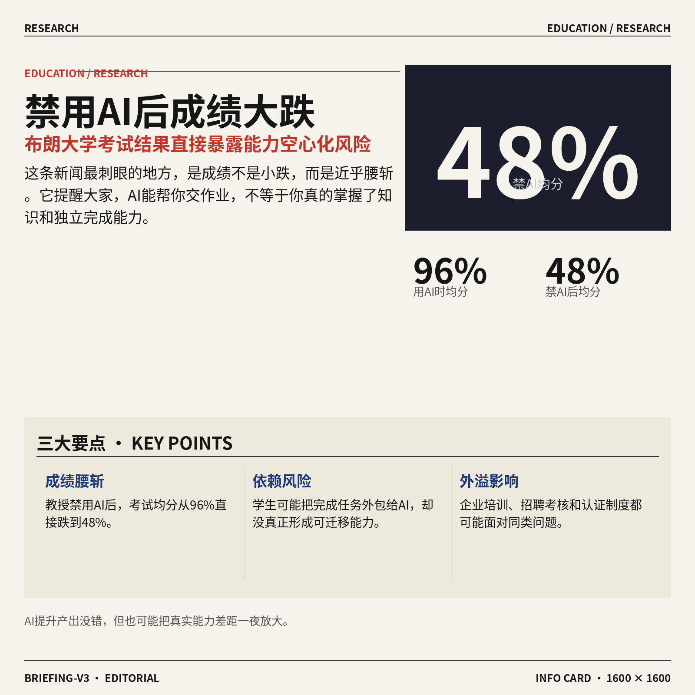

7. **布朗大学教授禁用 AI 后，考试成绩从 96% 跌到 48%，AI 依赖问题被直接放大。**
这则研究型报道最扎眼的，不是 AI 提高了多少效率，而是学生一旦离开 AI 辅助，真实掌握程度可能明显下滑 😮。它折射出的核心问题是 **AI dependency**（AI 依赖，做事越来越靠工具，自己却没真正学会）和 **learning transfer**（迁移学习能力，把平时学到的东西独立用到新场景里）。对企业培训、招聘和内部考核也很有提醒意义：如果一个人平时全靠 AI 交作业，真正到“断网、限时、独立完成”场景时，能力可能会露馅。[完整报道原文(briefing)](https://the-decoder.com/grades-dropped-from-96-to-48-percent-when-a-brown-professor-made-students-take-the-exam-without-ai/)

![布朗大学教授禁用 AI 后，考试成绩从 96% 跌到 48%，AI 依赖问题被直接放大](https://image.pollinations.ai/prompt/%E5%B8%83%E6%9C%97%E5%A4%A7%E5%AD%A6%E6%95%99%E6%8E%88%E7%A6%81%E7%94%A8%20AI%20%E5%90%8E%EF%BC%8C%E8%80%83%E8%AF%95%E6%88%90%E7%BB%A9%E4%BB%8E%2096%25%20%E8%B7%8C%E5%88%B0%2048%25%EF%BC%8CAI%20%E4%BE%9D%E8%B5%96%E9%97%AE%E9%A2%98%E8%A2%AB%E7%9B%B4%E6%8E%A5%E6%94%BE%E5%A4%A7.%20%E5%B8%83%E6%9C%97%E5%A4%A7%E5%AD%A6%E6%95%99%E6%8E%88%E7%A6%81%E7%94%A8%20AI%20%E5%90%8E%EF%BC%8C%E8%80%83%E8%AF%95%E6%88%90%E7%BB%A9%E4%BB%8E%2096%25%20%E8%B7%8C%E5%88%B0%2048%25%EF%BC%8CAI%20%E4%BE%9D%E8%B5%96%E9%97%AE%E9%A2%98%E8%A2%AB%E7%9B%B4%E6%8E%A5%E6%94%BE%E5%A4%A7%E3%80%82%20%E8%BF%99%E5%88%99%E7%A0%94%E7%A9%B6%E5%9E%8B%E6%8A%A5%E9%81%93%E6%9C%80%E6%89%8E%E7%9C%BC%E7%9A%84%EF%BC%8C%E4%B8%8D%E6%98%AF%20AI%20%E6%8F%90%E9%AB%98%E4%BA%86%E5%A4%9A%E5%B0%91%E6%95%88%E7%8E%87%EF%BC%8C%E8%80%8C%E6%98%AF%E5%AD%A6%E7%94%9F%E4%B8%80%E6%97%A6%E7%A6%BB%E5%BC%80%2C%20technical%20infographic%20diagram%2C%20architecture%20flowchart%2C%20clean%20vector%20illustration%2C%20educational%20style%2C%20no%20text%20overlay%2C%20modern%20minimal%2C%20wide%20aspect?width=1200&height=675&nologo=true&seed=10993)

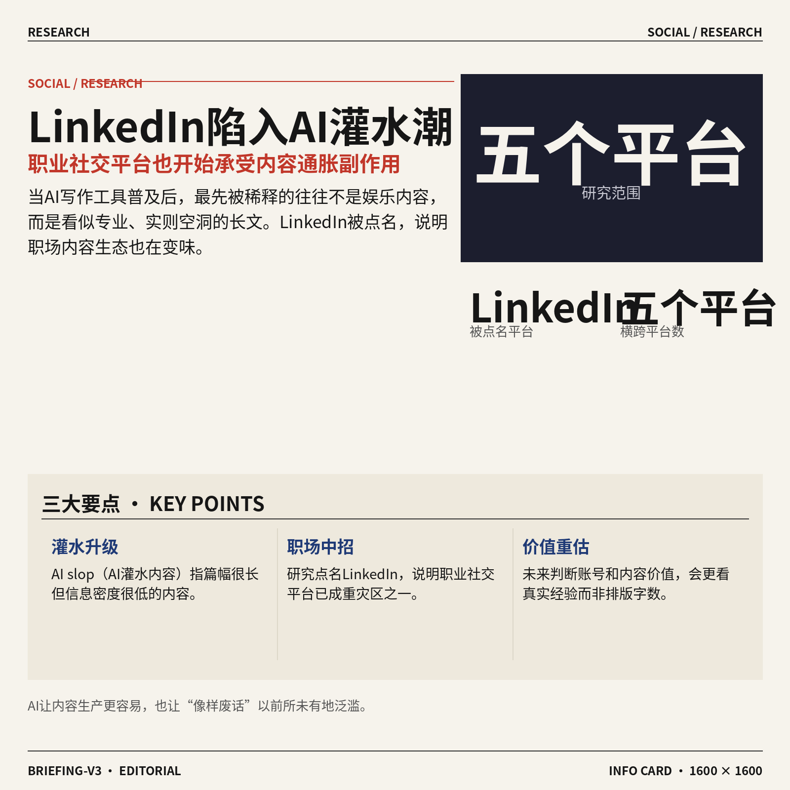

8. **LinkedIn 被研究指为长篇 AI 灌水内容重灾区，平台内容质量问题更值得警惕。**
这里的 **AI slop**（AI 灌水内容，指看起来字很多却信息密度低、套路化严重的机器生成内容）不是单纯“文风像 AI”，而是内容生态开始被低价值长文占领 🧵。研究横跨五个平台，结论点名 LinkedIn，说明 AI 写作工具普及后，职业社交平台也在面临“内容通胀”问题。对做品牌、招聘、运营的同事尤其值得注意：未来判断一个账号或一篇内容的价值，可能要更看**真实洞察**和**可信经验**，而不是篇幅和排版。[完整研究报道(briefing)](https://the-decoder.com/linkedin-is-the-undisputed-king-of-long-form-ai-slop-according-to-a-study-spanning-five-platforms/)

![LinkedIn 被研究指为长篇 AI 灌水内容重灾区，平台内容质量问题更值得警惕](https://image.pollinations.ai/prompt/LinkedIn%20%E8%A2%AB%E7%A0%94%E7%A9%B6%E6%8C%87%E4%B8%BA%E9%95%BF%E7%AF%87%20AI%20%E7%81%8C%E6%B0%B4%E5%86%85%E5%AE%B9%E9%87%8D%E7%81%BE%E5%8C%BA%EF%BC%8C%E5%B9%B3%E5%8F%B0%E5%86%85%E5%AE%B9%E8%B4%A8%E9%87%8F%E9%97%AE%E9%A2%98%E6%9B%B4%E5%80%BC%E5%BE%97%E8%AD%A6%E6%83%95.%20LinkedIn%20%E8%A2%AB%E7%A0%94%E7%A9%B6%E6%8C%87%E4%B8%BA%E9%95%BF%E7%AF%87%20AI%20%E7%81%8C%E6%B0%B4%E5%86%85%E5%AE%B9%E9%87%8D%E7%81%BE%E5%8C%BA%EF%BC%8C%E5%B9%B3%E5%8F%B0%E5%86%85%E5%AE%B9%E8%B4%A8%E9%87%8F%E9%97%AE%E9%A2%98%E6%9B%B4%E5%80%BC%E5%BE%97%E8%AD%A6%E6%83%95%E3%80%82%20%E8%BF%99%E9%87%8C%E7%9A%84%20AI%20slop%EF%BC%88AI%20%E7%81%8C%E6%B0%B4%E5%86%85%E5%AE%B9%EF%BC%8C%E6%8C%87%E7%9C%8B%E8%B5%B7%E6%9D%A5%E5%AD%97%E5%BE%88%E5%A4%9A%E5%8D%B4%E4%BF%A1%E6%81%AF%E5%AF%86%E5%BA%A6%E4%BD%8E%E3%80%81%E5%A5%97%E8%B7%AF%E5%8C%96%2C%20technical%20infographic%20diagram%2C%20architecture%20flowchart%2C%20clean%20vector%20illustration%2C%20educational%20style%2C%20no%20text%20overlay%2C%20modern%20minimal%2C%20wide%20aspect?width=1200&height=675&nologo=true&seed=11024)

### 🟡 行业展望与社会影响

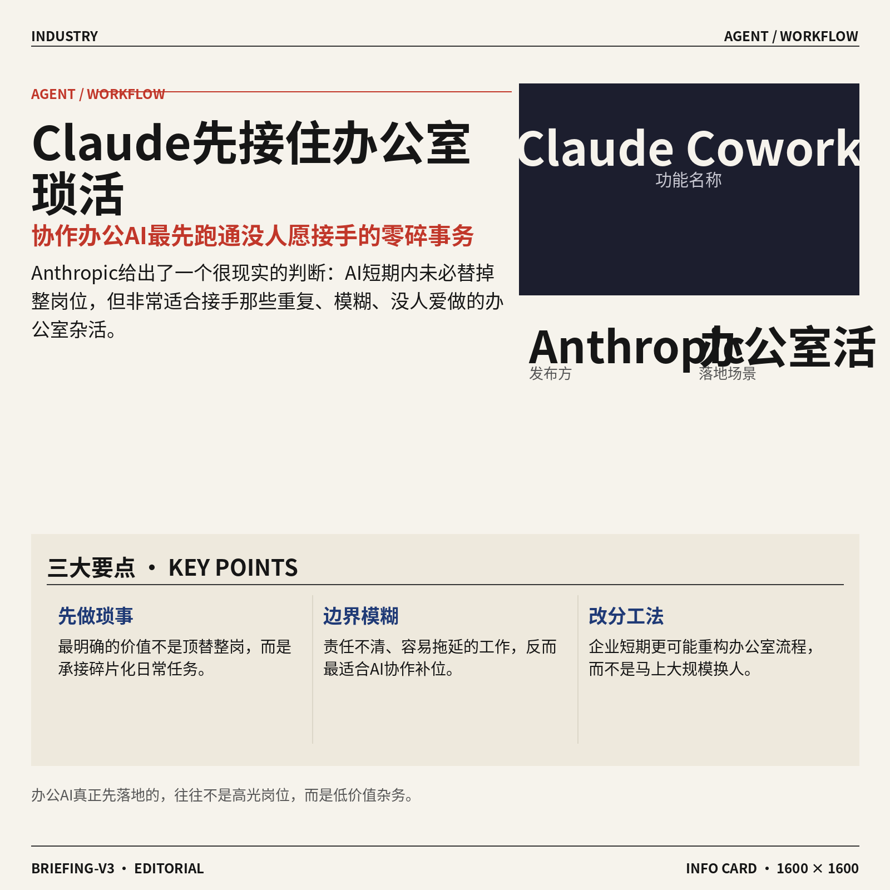

1. **Anthropic：Claude Cowork（Claude 的协作办公功能）最先跑通的，竟是没人想接手的琐碎办公室活。**
Anthropic 认为，**AI 协作办公**当前最明确的落地场景，不是替代整个岗位，而是接住那些重复、零散、责任边界又模糊的日常事务 💼。这类工作往往最容易被拖延，也最难明确归属，所以 Claude Cowork（让 Claude 像同事一样参与协作的办公功能）反而更容易体现价值。对企业来说，这意味着 AI 的短期影响可能不是“大规模换人”，而是先改变**办公室分工方式**和**低价值事务处理流程** 🚀。[完整报道(briefing)](https://the-decoder.com/claude-coworks-biggest-use-case-is-the-mundane-office-work-nobody-wants-to-own-anthropic-says/)


2. **S&P Global（国际评级机构标普全球）下调 Oracle 评级，OpenAI 被点名为关键信用风险。**
这条消息把一个常被忽视的问题摆上台面：**AI 大客户**不只带来收入，也会带来**信用风险**和资本压力 📉。S&P Global（给企业债务偿付能力打分的国际评级机构）认为，OpenAI 对 Oracle 的影响已经大到足以进入评级讨论，说明 AI 基础设施投入不只是技术竞赛，更是**财务结构**和**客户集中度**的考验。对行业来说，谁能接住头部 AI 公司不断增长的算力需求，谁就可能赚到大单；但如果押注过深，也可能让资产负债表承压 💡。[评级调整报道(briefing)](https://the-decoder.com/sp-global-sees-openai-as-a-key-credit-risk-for-oracle-and-cuts-its-credit-rating/)


3. **Altman 改口：现在“相当确定”AI 最终会净创造就业，而非净减少岗位。**
OpenAI CEO Sam Altman 这次表态，和他此前对**大规模裁员**的担忧相比，明显更偏向乐观 📌。所谓“净创造就业”，意思不是某些岗位不会消失，而是新工作机会总量可能超过被替代的岗位数量；这背后通常涉及**岗位重组**、**技能迁移**和新业务形态出现。对普通职场人来说，这类判断的信号意义很强：未来更现实的挑战，也许不是“有没有工作”，而是“工作内容会怎么变” 🤖。[Altman 最新表态(briefing)](https://the-decoder.com/openai-ceo-altman-is-now-pretty-sure-ai-is-net-job-creating-which-is-quite-the-pivot-from-predicting-mass-layoffs/)


4. **Insilico（用 AI 做药物研发的公司）预计利润和营收大增，AI 研发候选药推进到 Phase III（临床三期，大规模验证疗效和安全性阶段）。**
这条消息的重要性在于，AI 不再只是“帮科研提效”的概念，而是开始和**商业收入**、**临床进展**直接挂钩 💊。Phase III（临床三期，大规模人体试验阶段）通常被视为新药上市前最关键的验证关口，因此 AI 开发的候选药能走到这里，本身就很有行业象征意义。对资本市场和医药行业来说，这说明 **AI 制药**正在从“讲故事”走向“看结果”，未来企业估值逻辑也可能更看重真实管线进度而不只是技术演示 🚀。[新闻报道原文(briefing)](https://news.google.com/rss/articles/CBMi7wFBVV95cUxPTDM4b014aFl2MHhHSzJmdXlnajd2MFpzV0Q1NC1KZzVkUXdoRDB6Q2hXWXZmM2gzWjQwczBsdlhWc1k2c1JTODZpVWo3RmRQYXMwU2hSa1pFLWs2MTdvSlY1LUNmSDJLNGhDSkI4XzRSM1k3U0tRZ2VET2dvRmFMWHR3YVBmbTZjd1VoNUl1ZUZyUjdSYUVJRElrV0lMekcxZnBBRE9wN0RsWG5MSlMxNTdPeENwUnViVjlTdExHUFZUUUlub1R6VEJjUWxqOFd2Tl9NODFnUGx0aHlHX3RNWmlZNVdrb29XcHJzRmQ5dw?oc=5)

![Insilico（用 AI 做药物研发的公司）预计利润和营收大增，AI 研发候选药推进到 Phase III（临床三期，大规模验证疗效和安全性阶段）](https://image.pollinations.ai/prompt/Insilico%EF%BC%88%E7%94%A8%20AI%20%E5%81%9A%E8%8D%AF%E7%89%A9%E7%A0%94%E5%8F%91%E7%9A%84%E5%85%AC%E5%8F%B8%EF%BC%89%E9%A2%84%E8%AE%A1%E5%88%A9%E6%B6%A6%E5%92%8C%E8%90%A5%E6%94%B6%E5%A4%A7%E5%A2%9E%EF%BC%8CAI%20%E7%A0%94%E5%8F%91%E5%80%99%E9%80%89%E8%8D%AF%E6%8E%A8%E8%BF%9B%E5%88%B0%20Phase%20III%EF%BC%88%E4%B8%B4%E5%BA%8A%E4%B8%89%E6%9C%9F%EF%BC%8C%E5%A4%A7%E8%A7%84%E6%A8%A1%E9%AA%8C%E8%AF%81%E7%96%97%E6%95%88%E5%92%8C%E5%AE%89%E5%85%A8%E6%80%A7%E9%98%B6%E6%AE%B5%EF%BC%89.%20Insilico%EF%BC%88%E7%94%A8%20AI%20%E5%81%9A%E8%8D%AF%E7%89%A9%E7%A0%94%E5%8F%91%E7%9A%84%E5%85%AC%E5%8F%B8%EF%BC%89%E9%A2%84%E8%AE%A1%E5%88%A9%E6%B6%A6%E5%92%8C%E8%90%A5%E6%94%B6%E5%A4%A7%E5%A2%9E%EF%BC%8CAI%20%E7%A0%94%E5%8F%91%E5%80%99%E9%80%89%E8%8D%AF%E6%8E%A8%E8%BF%9B%E5%88%B0%20Phase%20III%EF%BC%88%E4%B8%B4%E5%BA%8A%E4%B8%89%E6%9C%9F%EF%BC%8C%E5%A4%A7%E8%A7%84%E6%A8%A1%E9%AA%8C%E8%AF%81%E7%96%97%E6%95%88%E5%92%8C%E5%AE%89%E5%85%A8%E6%80%A7%E9%98%B6%E6%AE%B5%EF%BC%89%E3%80%82%20%E8%BF%99%E6%9D%A1%E6%B6%88%E6%81%AF%2C%20technical%20infographic%20diagram%2C%20architecture%20flowchart%2C%20clean%20vector%20illustration%2C%20educational%20style%2C%20no%20text%20overlay%2C%20modern%20minimal%2C%20wide%20aspect?width=1200&height=675&nologo=true&seed=10900)

5. **中国通报 Claude code（Claude 的编程助手功能）存在安全漏洞，AI 编码工具的风险再次被放大。**
这件事提醒大家，AI 不只是会“生成内容”，它一旦深入到**写代码**、**接系统**、**碰数据**的环节，安全问题就会更敏感 🔐。Claude code（让 Claude 协助编写和处理代码的功能）如果被发现漏洞，影响的就不仅是体验，而可能涉及企业内部系统和开发流程的可靠性。对公司管理者来说，未来采购这类 AI 工具时，除了看效率和价格，也得更重视**安全审计**和**权限控制** 🧩。[相关报道汇总(briefing)](https://news.google.com/rss/articles/CBMiyAFBVV95cUxQSERJTVU3YUtkektKaUFLRGhBZkpvV0R5dHNWX2NtQkZUSmRrYllsVlpXT0kxcml0Q2hSTXhXQWtnRTBGbmxYM0kxeW9OZ1pUcjJTWWRTSUlXWWxiaHdkR1BNVjVId2JlSnp5ejdjQVhweVgxa09hTVZLUTM5MXBQV1NaYUJDZ0h1OE9POXZmVmVTLTFLNDViYWdWVHBXcHZjckJMWVlOYzJveUtEM254WmdTS0pOa1c5aWhhRloyU0o0Wm4xUlBVbA?oc=5)

![中国通报 Claude code（Claude 的编程助手功能）存在安全漏洞，AI 编码工具的风险再次被放大](https://image.pollinations.ai/prompt/%E4%B8%AD%E5%9B%BD%E9%80%9A%E6%8A%A5%20Claude%20code%EF%BC%88Claude%20%E7%9A%84%E7%BC%96%E7%A8%8B%E5%8A%A9%E6%89%8B%E5%8A%9F%E8%83%BD%EF%BC%89%E5%AD%98%E5%9C%A8%E5%AE%89%E5%85%A8%E6%BC%8F%E6%B4%9E%EF%BC%8CAI%20%E7%BC%96%E7%A0%81%E5%B7%A5%E5%85%B7%E7%9A%84%E9%A3%8E%E9%99%A9%E5%86%8D%E6%AC%A1%E8%A2%AB%E6%94%BE%E5%A4%A7.%20%E4%B8%AD%E5%9B%BD%E9%80%9A%E6%8A%A5%20Claude%20code%EF%BC%88Claude%20%E7%9A%84%E7%BC%96%E7%A8%8B%E5%8A%A9%E6%89%8B%E5%8A%9F%E8%83%BD%EF%BC%89%E5%AD%98%E5%9C%A8%E5%AE%89%E5%85%A8%E6%BC%8F%E6%B4%9E%EF%BC%8CAI%20%E7%BC%96%E7%A0%81%E5%B7%A5%E5%85%B7%E7%9A%84%E9%A3%8E%E9%99%A9%E5%86%8D%E6%AC%A1%E8%A2%AB%E6%94%BE%E5%A4%A7%E3%80%82%20%E8%BF%99%E4%BB%B6%E4%BA%8B%E6%8F%90%E9%86%92%E5%A4%A7%E5%AE%B6%EF%BC%8CAI%20%E4%B8%8D%E5%8F%AA%E6%98%AF%E4%BC%9A%E2%80%9C%E7%94%9F%E6%88%90%E5%86%85%E5%AE%B9%E2%80%9D%EF%BC%8C%E5%AE%83%E4%B8%80%2C%20technical%20infographic%20diagram%2C%20architecture%20flowchart%2C%20clean%20vector%20illustration%2C%20educational%20style%2C%20no%20text%20overlay%2C%20modern%20minimal%2C%20wide%20aspect?width=1200&height=675&nologo=true&seed=10931)

6. **Meta 下线 Muse Image（可生成 Instagram 用户 AI 照片的功能），无同意生成他人形象引发反弹。**
这次下线直接碰到了一个越来越现实的话题：**生成式 AI**能不能随意调用普通用户的形象与数据 🧠。Muse Image（Meta 的图片生成功能）被指允许任何人在未经同意的情况下生成 Instagram 用户照片，因此争议核心不是“技术酷不酷”，而是**肖像权**、**同意机制**和平台边界。对整个行业来说，这说明 AI 产品想大规模进入社交平台，光有能力还不够，**合规设计**和用户信任会越来越决定生死 ⚖️。[事件完整报道(briefing)](https://the-decoder.com/meta-kills-muse-image-feature-that-let-anyone-generate-ai-photos-of-instagram-users-without-consent/)

![Meta 下线 Muse Image（可生成 Instagram 用户 AI 照片的功能），无同意生成他人形象引发反弹](https://image.pollinations.ai/prompt/Meta%20%E4%B8%8B%E7%BA%BF%20Muse%20Image%EF%BC%88%E5%8F%AF%E7%94%9F%E6%88%90%20Instagram%20%E7%94%A8%E6%88%B7%20AI%20%E7%85%A7%E7%89%87%E7%9A%84%E5%8A%9F%E8%83%BD%EF%BC%89%EF%BC%8C%E6%97%A0%E5%90%8C%E6%84%8F%E7%94%9F%E6%88%90%E4%BB%96%E4%BA%BA%E5%BD%A2%E8%B1%A1%E5%BC%95%E5%8F%91%E5%8F%8D%E5%BC%B9.%20Meta%20%E4%B8%8B%E7%BA%BF%20Muse%20Image%EF%BC%88%E5%8F%AF%E7%94%9F%E6%88%90%20Instagram%20%E7%94%A8%E6%88%B7%20AI%20%E7%85%A7%E7%89%87%E7%9A%84%E5%8A%9F%E8%83%BD%EF%BC%89%EF%BC%8C%E6%97%A0%E5%90%8C%E6%84%8F%E7%94%9F%E6%88%90%E4%BB%96%E4%BA%BA%E5%BD%A2%E8%B1%A1%E5%BC%95%E5%8F%91%E5%8F%8D%E5%BC%B9%E3%80%82%20%E8%BF%99%E6%AC%A1%E4%B8%8B%E7%BA%BF%E7%9B%B4%E6%8E%A5%E7%A2%B0%E5%88%B0%E4%BA%86%E4%B8%80%E4%B8%AA%E8%B6%8A%E6%9D%A5%E8%B6%8A%E7%8E%B0%E5%AE%9E%E7%9A%84%E8%AF%9D%E9%A2%98%2C%20technical%20infographic%20diagram%2C%20architecture%20flowchart%2C%20clean%20vector%20illustration%2C%20educational%20style%2C%20no%20text%20overlay%2C%20modern%20minimal%2C%20wide%20aspect?width=1200&height=675&nologo=true&seed=10962)

7. **Meta 计划 9 月量产 AI 芯片，并寻求把计算能力翻倍。**
这表明大模型竞争已经不只是拼模型，也在拼**自研芯片**和底层算力供给 ⚙️。所谓计算能力翻倍，本质上是让更多 AI 训练和 inference（模型推理，让训练好的模型真正回答问题和执行任务的过程）能更快、更便宜地完成；而自研 AI 芯片则意味着 Meta 想减少对外部供应商的依赖。对行业格局来说，头部公司正在从“买算力”走向“自己造引擎”，这会影响未来 AI 成本、供应链和竞争壁垒 🏗️。[路透相关报道(briefing)](https://news.google.com/rss/articles/CBMi7gFBVV95cUxQcFNSVE1tRlJpd2k3REpGNTFaOUZ3V2syM3hibi1ZZUw3dFZweEg5SjR2M1daT3dYbENnZk1mVWdBVllzeV9hUExZYWFBaS12RXVMMTZoaVlfalBtdFBseU9NLUhxZlBrd0Fxek1BNTJVWjVTd09lS01oOEZWZldURnpYRWJLbTBlT1Zkd041R2ptZVhPM3FYMlU4eW80UVNBeWlUMU9TRHVtdTRUaWtoY0xibE92eW9STGVpcjlXRWtpU0llQ0NQT0dZbGV3YXpfT1M0d3c3Vl9LZEFFazNuVlIzdVBROVZJaFRKRmFB?oc=5)

![Meta 计划 9 月量产 AI 芯片，并寻求把计算能力翻倍](https://image.pollinations.ai/prompt/Meta%20%E8%AE%A1%E5%88%92%209%20%E6%9C%88%E9%87%8F%E4%BA%A7%20AI%20%E8%8A%AF%E7%89%87%EF%BC%8C%E5%B9%B6%E5%AF%BB%E6%B1%82%E6%8A%8A%E8%AE%A1%E7%AE%97%E8%83%BD%E5%8A%9B%E7%BF%BB%E5%80%8D.%20Meta%20%E8%AE%A1%E5%88%92%209%20%E6%9C%88%E9%87%8F%E4%BA%A7%20AI%20%E8%8A%AF%E7%89%87%EF%BC%8C%E5%B9%B6%E5%AF%BB%E6%B1%82%E6%8A%8A%E8%AE%A1%E7%AE%97%E8%83%BD%E5%8A%9B%E7%BF%BB%E5%80%8D%E3%80%82%20%E8%BF%99%E8%A1%A8%E6%98%8E%E5%A4%A7%E6%A8%A1%E5%9E%8B%E7%AB%9E%E4%BA%89%E5%B7%B2%E7%BB%8F%E4%B8%8D%E5%8F%AA%E6%98%AF%E6%8B%BC%E6%A8%A1%E5%9E%8B%EF%BC%8C%E4%B9%9F%E5%9C%A8%E6%8B%BC%E8%87%AA%E7%A0%94%E8%8A%AF%E7%89%87%E5%92%8C%E5%BA%95%E5%B1%82%E7%AE%97%E5%8A%9B%E4%BE%9B%E7%BB%99%20%E2%9A%99%EF%B8%8F%E3%80%82%E6%89%80%E8%B0%93%E8%AE%A1%E7%AE%97%E8%83%BD%E5%8A%9B%E7%BF%BB%E5%80%8D%EF%BC%8C%E6%9C%AC%E8%B4%A8%E4%B8%8A%E6%98%AF%2C%20technical%20infographic%20diagram%2C%20architecture%20flowchart%2C%20clean%20vector%20illustration%2C%20educational%20style%2C%20no%20text%20overlay%2C%20modern%20minimal%2C%20wide%20aspect?width=1200&height=675&nologo=true&seed=10993)

### 🟣 开源TOP项目

1. **TencentDB-Agent-Memory（腾讯云推出的 Agent 长期记忆组件）主打本地化长时记忆。**
这个项目的核心卖点是给 AI Agent 提供**完全本地运行**的**长期记忆**能力，不依赖外部 API，所以对**数据隐私**和内部知识留存在本地的团队更友好 🔒。它采用 **4-tier progressive pipeline（四层递进式处理流程，按不同层级整理和调用记忆）**，目的是让 Agent 不只是“会聊天”，还能持续记住上下文和历史经验。对企业来说，这类能力很适合客服、知识助手、内部流程机器人等需要“越用越懂你”的场景。[GitHub 项目页(briefing)](https://github.com/TencentCloud/TencentDB-Agent-Memory)


2. **pgrust（用 Rust 重写的 Postgres 数据库）通过全部回归测试。**
这个项目把 **Postgres（最流行的开源关系型数据库之一）** 用 **Rust（一种更强调安全性和稳定性的编程语言）** 重写了一遍，而且作者称现在已经通过 **100% regression tests（回归测试，用来确认改动后老功能没坏掉）** ✅。这意味着它不是停留在“概念演示”，而是在朝着兼容现有 Postgres 行为稳步推进。对行业观察者来说，这类项目的价值在于：大家正尝试用更安全的新语言，重建关键基础软件。[GitHub 仓库页(briefing)](https://github.com/malisper/pgrust)


3. **hunk（面向 AI 编码助手的终端差异审查工具）强调先审后改。**
hunk 是一个给 **agentic coders（能自动写改代码的 AI 编码助手）** 使用的 **terminal diff viewer（终端里的代码差异查看器，帮人先看清改了什么）** 💡。它主打 **review-first（先审核、再接受改动）**，这很贴合当下团队用 AI 写代码时最担心的问题：不是它不会写，而是怕它悄悄改错。对开发流程来说，这类工具相当于给 AI 编码加上一层“人工验收窗口”，减少误改带来的返工成本。[GitHub 项目仓库(briefing)](https://github.com/modem-dev/hunk)


4. **《What xAI's Grok build CLI（Grok 构建命令行工具） sends to xAI》拆解了命令行工具传了什么。**
这篇分析聚焦 **CLI（命令行工具，用输入文字命令的方式操作软件）** 在使用过程中到底向 xAI 发送了哪些内容，属于一次 **wire-level analysis（网络传输层级分析，直接看数据包怎么来回传）** 🔍。这类内容对普通用户未必直接提升效率，但对企业和开发者非常重要，因为它关系到**隐私边界**、**上传数据范围**和工具透明度。简单说，就是把“黑盒”掰开给大家看，帮你判断某类 AI 工具是否适合接入敏感工作流。[完整分析原文(briefing)](https://gist.github.com/cereblab/dc9a40bc26120f4540e4e09b75ffb547)


5. **shepherd（把 Agent 执行过程变成可回放轨迹的运行时系统）瞄准可观察与可撤销。**
这个项目想解决的不是“让 Agent 更会干活”，而是让它**干活过程可追踪、可分叉、可回放、可撤销**，有点像把每次执行都记成一份 **Git-like trace（类似 Git 版本记录的运行轨迹，方便回看每一步改了什么）**。它还用了 **copy-on-write fork（写时复制分叉，只有发生修改时才真正复制数据，因此更省资源）**，摘要里提到速度约比 **docker commit（把容器当前状态保存成镜像的操作）** 快约 5 倍，同时能节省大量 **KV cache（键值缓存，模型为加快连续生成而保留的中间结果）**。这类基础设施对多 Agent 协作、失败回滚、流程审计特别关键，属于 AI 真正走向生产环境时很需要的“保险丝” 🧩。[GitHub 仓库页(briefing)](https://github.com/shepherd-agents/shepherd)

![shepherd（把 Agent 执行过程变成可回放轨迹的运行时系统）瞄准可观察与可撤销](https://image.pollinations.ai/prompt/shepherd%EF%BC%88%E6%8A%8A%20Agent%20%E6%89%A7%E8%A1%8C%E8%BF%87%E7%A8%8B%E5%8F%98%E6%88%90%E5%8F%AF%E5%9B%9E%E6%94%BE%E8%BD%A8%E8%BF%B9%E7%9A%84%E8%BF%90%E8%A1%8C%E6%97%B6%E7%B3%BB%E7%BB%9F%EF%BC%89%E7%9E%84%E5%87%86%E5%8F%AF%E8%A7%82%E5%AF%9F%E4%B8%8E%E5%8F%AF%E6%92%A4%E9%94%80.%20shepherd%EF%BC%88%E6%8A%8A%20Agent%20%E6%89%A7%E8%A1%8C%E8%BF%87%E7%A8%8B%E5%8F%98%E6%88%90%E5%8F%AF%E5%9B%9E%E6%94%BE%E8%BD%A8%E8%BF%B9%E7%9A%84%E8%BF%90%E8%A1%8C%E6%97%B6%E7%B3%BB%E7%BB%9F%EF%BC%89%E7%9E%84%E5%87%86%E5%8F%AF%E8%A7%82%E5%AF%9F%E4%B8%8E%E5%8F%AF%E6%92%A4%E9%94%80%E3%80%82%20%E8%BF%99%E4%B8%AA%E9%A1%B9%E7%9B%AE%E6%83%B3%E8%A7%A3%E5%86%B3%E7%9A%84%E4%B8%8D%E6%98%AF%E2%80%9C%E8%AE%A9%20Agent%20%E6%9B%B4%E4%BC%9A%E5%B9%B2%E6%B4%BB%E2%80%9D%EF%BC%8C%E8%80%8C%E6%98%AF%E8%AE%A9%E5%AE%83%E5%B9%B2%E6%B4%BB%E8%BF%87%E7%A8%8B%E5%8F%AF%2C%20technical%20infographic%20diagram%2C%20architecture%20flowchart%2C%20clean%20vector%20illustration%2C%20educational%20style%2C%20no%20text%20overlay%2C%20modern%20minimal%2C%20wide%20aspect?width=1200&height=675&nologo=true&seed=11125)

6. **dramaclaw（通用 AIGC 视频引擎）想把“剧本到成片”串成一条流水线。**
这个项目定位很直接：做一个**通用 AIGC 视频引擎**，把从脚本到最终视频的流程尽量打通，覆盖**漫剧、广告、电商、乙游**等多种内容场景 🎬。这里的 **AIGC（AI 生成内容，让模型自动生成文案、图片、视频等内容）** 不只是单点生成，而是强调“一条流水线”式生产，减少来回拼工具的麻烦。对内容团队和营销团队来说，这类项目的意义在于：AI 视频正在从“做一个片段”走向“做完整交付物”。[GitHub 项目页(briefing)](https://github.com/dramaclaw/dramaclaw)

![dramaclaw（通用 AIGC 视频引擎）想把“剧本到成片”串成一条流水线](https://image.pollinations.ai/prompt/dramaclaw%EF%BC%88%E9%80%9A%E7%94%A8%20AIGC%20%E8%A7%86%E9%A2%91%E5%BC%95%E6%93%8E%EF%BC%89%E6%83%B3%E6%8A%8A%E2%80%9C%E5%89%A7%E6%9C%AC%E5%88%B0%E6%88%90%E7%89%87%E2%80%9D%E4%B8%B2%E6%88%90%E4%B8%80%E6%9D%A1%E6%B5%81%E6%B0%B4%E7%BA%BF.%20dramaclaw%EF%BC%88%E9%80%9A%E7%94%A8%20AIGC%20%E8%A7%86%E9%A2%91%E5%BC%95%E6%93%8E%EF%BC%89%E6%83%B3%E6%8A%8A%E2%80%9C%E5%89%A7%E6%9C%AC%E5%88%B0%E6%88%90%E7%89%87%E2%80%9D%E4%B8%B2%E6%88%90%E4%B8%80%E6%9D%A1%E6%B5%81%E6%B0%B4%E7%BA%BF%E3%80%82%20%E8%BF%99%E4%B8%AA%E9%A1%B9%E7%9B%AE%E5%AE%9A%E4%BD%8D%E5%BE%88%E7%9B%B4%E6%8E%A5%EF%BC%9A%E5%81%9A%E4%B8%80%E4%B8%AA%E9%80%9A%E7%94%A8%20AIGC%20%E8%A7%86%E9%A2%91%E5%BC%95%E6%93%8E%EF%BC%8C%E6%8A%8A%E4%BB%8E%E8%84%9A%E6%9C%AC%E5%88%B0%E6%9C%80%E7%BB%88%E8%A7%86%E9%A2%91%E7%9A%84%E6%B5%81%E7%A8%8B%E5%B0%BD%2C%20technical%20infographic%20diagram%2C%20architecture%20flowchart%2C%20clean%20vector%20illustration%2C%20educational%20style%2C%20no%20text%20overlay%2C%20modern%20minimal%2C%20wide%20aspect?width=1200&height=675&nologo=true&seed=11156)

### 🔴 社媒分享

1. **Claude Code 首次读提示前就发送 3.3 万 tokens（模型处理文本的基本计数单位），OpenCode（开源 AI 编程助手）约 7000。**
这篇对比文章来自作者的真实使用观察：同样是做 AI 编程辅助，**Claude Code** 的用量表涨得明显更快，于是作者专门拆开看它在正式读取用户提示词前，先发了多少上下文内容 🧪。结果显示，Claude Code 会预先发送约 **33k tokens**，而 OpenCode（开源 AI 编程助手）大约是 **7k**，也就是“开工前的固定消耗”差出一大截。对普通团队来说，这件事直接关系到 **成本** 和 **上下文效率**——你以为花钱是在买回答，实际可能先花在“进场准备”上了 💸。[实测对比原文(briefing)](https://systima.ai/blog/claude-code-vs-opencode-token-overhead)


2. **《I love LLMs, I hate hype》：喜欢大模型，不代表要接受夸张叙事。**
这篇短文的核心态度很鲜明：作者并不反对 **LLMs（大语言模型，能理解和生成文字的 AI 模型）**，反而是明确说“喜欢”；但他反感的是围绕它们不断膨胀的 **hype（过度炒作，把阶段性进展说成彻底颠覆）** 💡。这类声音在社媒上很有代表性，因为它提醒大家把“模型能力提升”与“商业宣传、情绪带节奏”分开看。对非技术同事尤其有价值：以后看到任何“AI 已经全面替代人类”的说法，不妨先多问一句——这是实际能力，还是包装话术？[原文博文入口(briefing)](https://geohot.github.io//blog/jekyll/update/2026/07/12/i-love-llms.html)


---

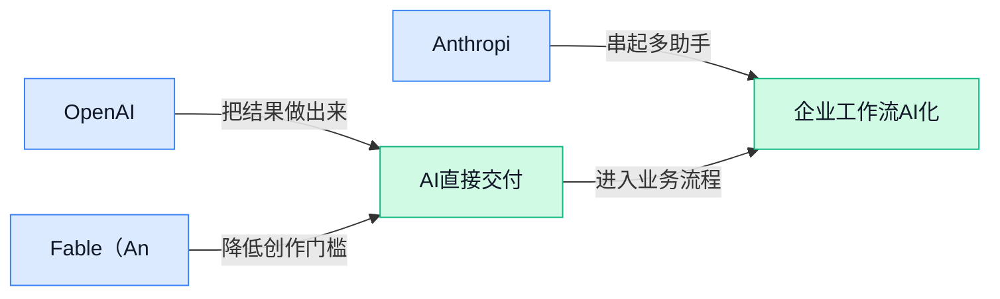
```mermaid
graph LR
A[OpenAI] -->|把结果做出来| D[AI直接交付]
B[Fable（An] -->|降低创作门槛| D
C[Anthropi] -->|串起多助手| E[企业工作流AI化]
 D -->|进入业务流程| E
classDef blue fill:#dbeafe,stroke:#3b82f6,color:#111827
classDef green fill:#d1fae5,stroke:#10b981,color:#111827
class A,B,C blue
class D,E green
```

### 📊 行业洞察（今日 4 条）

1. OpenAI、Meta、SpaceXAI都在卷更便宜模型，Meta还要量产自研芯片扩算力，Oracle却因重押OpenAI被标普全球（国际评级机构）下调评级
  【洞察】AI竞争已从“谁更聪明”转向“谁更便宜且供得起”；但算力越重，越容易把供应商和客户一起绑上高风险财务战车

2. Anthropic一边把Claude Cowork（让Claude像同事一样协作的功能）搬上云端，一边说最先跑通的是报表、清单、幻灯片这类琐事
  【洞察】所谓“AI同事”短期不会整岗替人，先吃掉的是没人爱做但天天都得做的零碎流程，落地比想象中更务实也更有限

3. 布朗大学禁用AI后成绩从96%跌到48%，LinkedIn又被研究指为AI灌水重灾区
  【洞察】AI正在同时放大两件坏事：个人真实能力下滑，平台内容质量通胀；以后“能快速生成”不再等于“真有价值”

4. Meta因未获同意生成他人照片下线Muse Image，Claude code（Claude的编程助手功能）又被通报安全漏洞，外界还在拆Grok build CLI（Grok构建命令行工具）到底上传了什么
  【洞察】行业开始补“信任课”：谁碰用户形象、企业数据和系统权限，谁就不能再只讲效率，透明和边界会直接决定能不能上线

### 💭 对我们的启发（今日 3 条）

1. 便宜模型和本地视频生成研究一起看，我们的视频工具要默认“分层用模”：便宜模型先跑批量初稿，贵模型只处理成片关键环节，不然成本优势会被同行抹平。

2. Claude Cowork先跑通琐碎办公室活，说明我们别急着吹“全自动做爆款视频”，更该先把找素材、写口播、出多个版本、审片回退这些碎活做顺。

3. Meta下线Muse Image、Claude code曝漏洞，提醒我们做人像生成、品牌素材改写、自动发布前，必须加授权确认、修改记录和人工终审，不然出一次事故就伤信任。

