## AI资讯日报 2026/7/14

> AI 早报 · 每日早读 · 全网深度聚合

## **今日摘要**

```
OpenAI 推出 ChatGPT Work 并上新 GPT-5.6，Anthropic 在印度推 Claude 本地定价，企业与订阅双线开打
Apple 起诉 OpenAI 背后暴露自家 AI 困局，SpeechAnalyzer API 对打 Whisper，三星健康删数提示惹争议
Meta AI、ChatGPT、Nano Banana 2（AI 图像生成工具）横评爆出意外赢家，Claude 跑 TypeScript 任务竟比 GPT 更贵
```

### 🔵 产品与功能更新

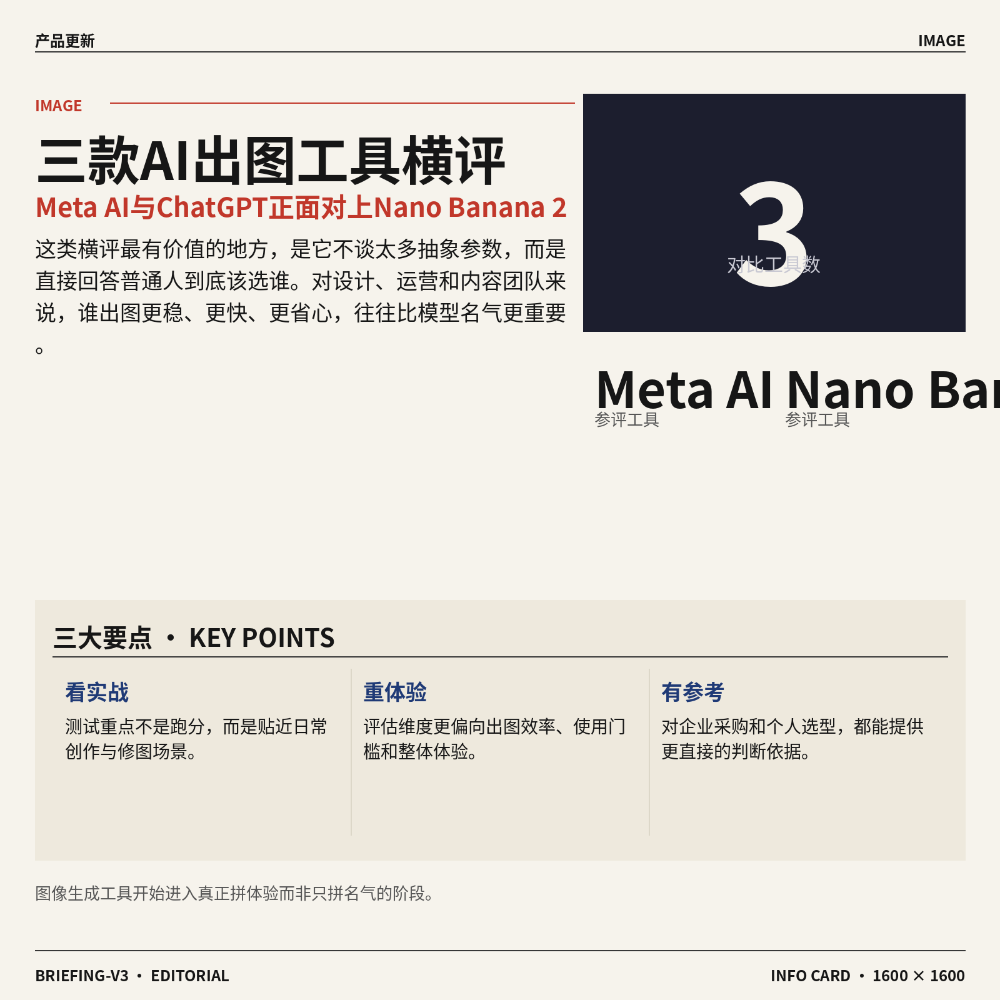

1. **TechRadar 对比 Meta AI、ChatGPT 与 Nano Banana 2（AI 图像生成工具），结果出现意外赢家。**
这篇实测把 **Meta AI**、**ChatGPT** 和 **Nano Banana 2（用于生成或编辑图片的 AI 工具）** 放到同一赛道里正面比拼，核心看的是谁更适合日常创作场景 💡。这类横评的价值在于，它不是讲抽象参数，而是直接回答“普通人现在该用谁”这个更现实的问题。对公司里做 **设计**、**运营**、**内容产出** 的同事来说，这种对比能帮助判断不同 AI 工具在**出图效率**和**使用体验**上的差异。想看具体测试过程和胜负结论，可参考 [TechRadar 对比报道(briefing)](https://news.google.com/rss/articles/CBMihAJBVV95cUxOeUlTWlNkbTd0YkdMWW0tQ1ZJcmxvUlJZc01SdXotMDlwX0tpSFlET3lKMGthek9pems2QUxBU3ZUWmhIVF85bno5WC1TU21KTkhfVFdoZVBCX3l3djBhYmV3aUlxT0Rhekp6dkZCMGdYSVRMQkxwYzJLaldXaTNidkJoYkNlMm1iODUxQ0xMdVZfMDhKb2lEdWRicGRVUFJvU3pFTUZvMDg3X0hxcjFLTWJEc0cxeVZTY0NIWnhJMG9aZUl1UUNIRFEzQ0RPa2tuMFU1OVlwZGRGaU1zQWRhZldWVGhxbHdLVmRjYUZjS0RKT2VzekhBaFU2U3M0MHRtcm5iWA?oc=5)。


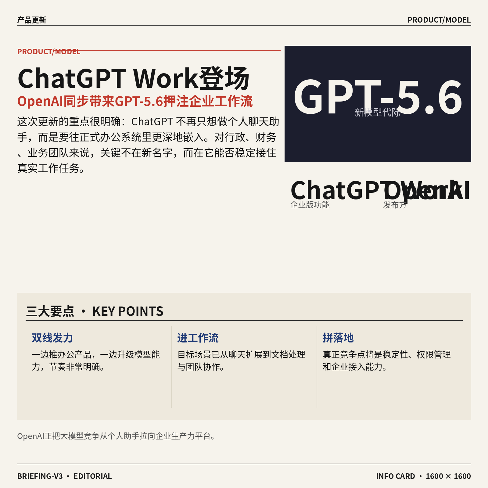

2. **OpenAI 推出 ChatGPT Work（面向工作的企业版功能），并引入 GPT-5.6（新一代模型家族）。**
按报道说法，OpenAI 这次一手发了 **ChatGPT Work（更偏办公与团队使用的版本）**，一手带来了 **GPT-5.6（新发布的一组大模型版本）** 🚀。这类更新通常意味着 ChatGPT 不再只是个人助手，而是在往更正式的**企业工作流**里走，比如文档处理、信息整理和跨团队协作。对业务、行政、财务同事来说，真正值得关注的是：AI 能不能更稳地接入日常工作，而不是只会聊天。更多发布信息可看 [The Hindu 发布消息(briefing)](https://news.google.com/rss/articles/CBMiswFBVV95cUxNUS1xRllCNVhUNXZCM3hPZHExdlRZSHFqUm1JdXhqRmtic1BhV1ZiQ2p0VXNwUTZabjYxY09jWEo5bmV1RWg1ejZDa0pKcU5qZTJRdXc1a2lsblZzcUR0SmkwNXRBNmVWS2hpZGx3M1pjVWFxdTVlclVSRnRhc1p0b0g5NXUtaWNoZ1M0R3JMN3JUbU1vOERsNGU3TzFOWXkwSVByaUpISWpWTlBZUl9yNTN6QdIBugFBVV95cUxOaVgxdTF4d0pRR3l6b1FzcmdoZDFSMGxBRXU0Rzd6M2NUWWVCU3dFd19pMDk3dFk3dGJZSVpvWFZhLXhOSl9QQlRiQVQ3TFg4SmprRldPWHhUOTZPM0lqODNfWU5GS092SmhUazdONkh2MGhUdzYwbzBDSERPamJOZjhlY1h6YURSUGgzUkItc0c0b2pmYXh0NFhmYlpMS0VOTXZfRGZ1VVVMNDltUGxqU0tVcnVBN0VzX1E?oc=5)。


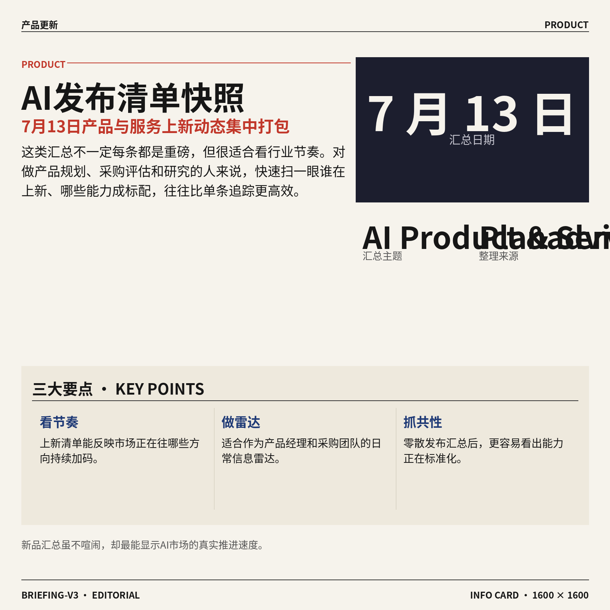

3. **Planadviser 汇总 7 月 13 日 AI Product & Service Launches（AI 产品与服务发布）动态。**
这是一篇**新品快讯汇总**，把当天值得关注的 **AI 产品** 与 **AI 服务** 更新集中打包，适合想快速扫一眼市场动向的人 👀。这类“发布清单”不一定每条都很大，但胜在能看到行业节奏：谁在上新、哪些方向最热、哪些能力正在变成标配。对做 **产品规划**、**采购评估**、**行业研究** 的同事来说，这种汇总很适合作为日常信息雷达。原始汇总可查看 [产品发布汇总页(briefing)](https://news.google.com/rss/articles/CBMiTkFVX3lxTE9GYndlNHkxUW12RFR4VU5PU00zSnZqTlU4VWFudFhCQ0FzYWFRby1rOWRCWEZ6WGpaT0IxWW1WcndqNEUyQzRUbG1TdWRaZw?oc=5)。


### 🟢 前沿研究

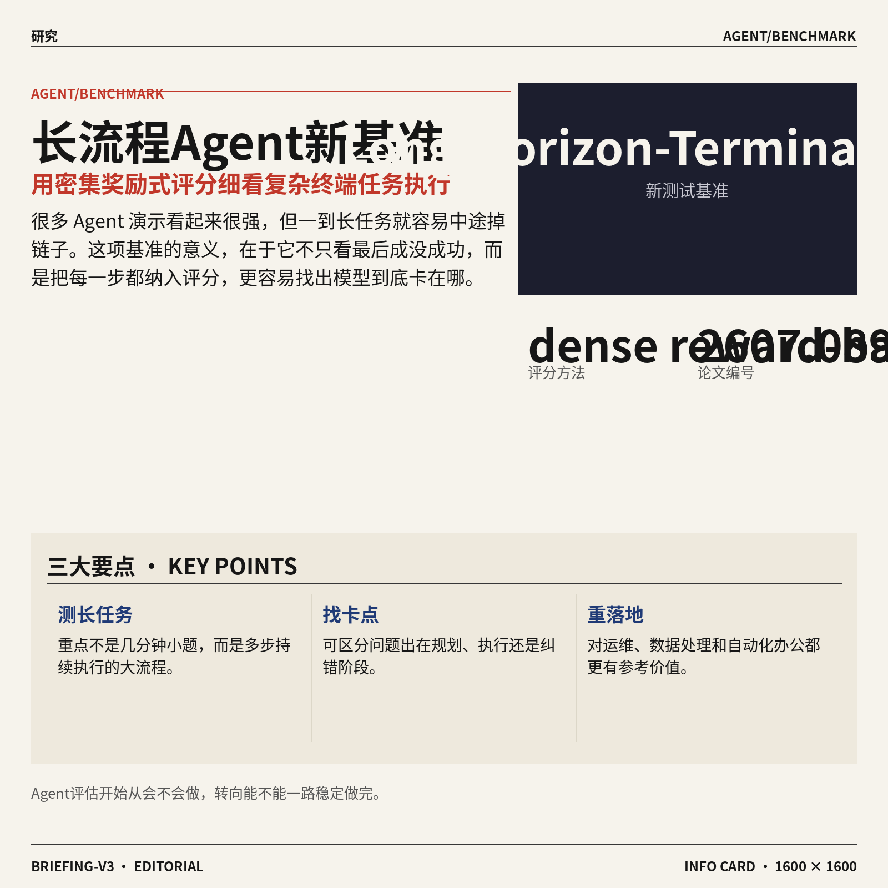

1. **Long-Horizon-Terminal-Bench（面向长流程终端任务的 Agent 测试基准）用更细颗粒度评分，专门考验 AI 能不能把复杂任务一路做到底。**
这项研究盯上的不是几分钟就能完成的小任务，而是**长周期任务**：也就是需要多步操作、持续决策、还可能中途出错返工的终端流程 🧪。论文提出用 **dense reward-based grading（密集奖励式评分，指任务进行中每一步都会给分，不是只看最后成败）** 来评估 Agent，这样更容易看出模型到底卡在规划、执行，还是纠错环节。对企业来说，这类基准的意义很直接：如果以后想让 AI 接手更完整的运维、数据处理或办公自动化流程，就不能只看“会不会做”，还得看“能不能稳定做完”。可先看 [arxiv 论文摘要(briefing)](https://arxiv.org/abs/2607.08964) 或 [HuggingFace 论文页(briefing)](https://huggingface.co/papers/2607.08964) 了解原文 💡

![Long-Horizon-Terminal-Bench（面向长流程终端任务的 Agent 测试基准）用更细颗粒度评分，专门考验 AI 能不能把复杂任务一路做到底](https://image.pollinations.ai/prompt/Long-Horizon-Terminal-Bench%EF%BC%88%E9%9D%A2%E5%90%91%E9%95%BF%E6%B5%81%E7%A8%8B%E7%BB%88%E7%AB%AF%E4%BB%BB%E5%8A%A1%E7%9A%84%20Agent%20%E6%B5%8B%E8%AF%95%E5%9F%BA%E5%87%86%EF%BC%89%E7%94%A8%E6%9B%B4%E7%BB%86%E9%A2%97%E7%B2%92%E5%BA%A6%E8%AF%84%E5%88%86%EF%BC%8C%E4%B8%93%E9%97%A8%E8%80%83%E9%AA%8C%20AI%20%E8%83%BD%E4%B8%8D%E8%83%BD%E6%8A%8A%E5%A4%8D%E6%9D%82%E4%BB%BB%E5%8A%A1%E4%B8%80%E8%B7%AF%E5%81%9A%E5%88%B0%E5%BA%95.%20Long-Horizon-Terminal-Bench%EF%BC%88%E9%9D%A2%E5%90%91%E9%95%BF%E6%B5%81%E7%A8%8B%E7%BB%88%E7%AB%AF%E4%BB%BB%E5%8A%A1%E7%9A%84%20Agent%20%E6%B5%8B%E8%AF%95%E5%9F%BA%E5%87%86%EF%BC%89%E7%94%A8%E6%9B%B4%E7%BB%86%E9%A2%97%E7%B2%92%E5%BA%A6%E8%AF%84%E5%88%86%EF%BC%8C%E4%B8%93%E9%97%A8%E8%80%83%E9%AA%8C%20AI%20%E8%83%BD%E4%B8%8D%E8%83%BD%E6%8A%8A%E5%A4%8D%E6%9D%82%E4%BB%BB%E5%8A%A1%E4%B8%80%E8%B7%AF%E5%81%9A%E5%88%B0%E5%BA%95%2C%20technical%20infographic%20diagram%2C%20architecture%20flowchart%2C%20clean%20vector%20illustration%2C%20educational%20style%2C%20no%20text%20overlay%2C%20modern%20minimal%2C%20wide%20aspect?width=1200&height=675&nologo=true&seed=10807)

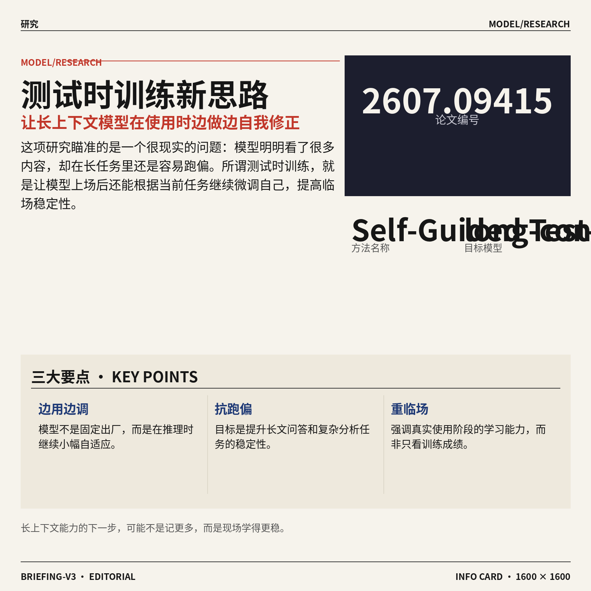

2. **Self-Guided Test-Time Training（自引导测试时训练，让模型在使用时边做边调）瞄准长上下文大模型的“临场学习”能力。**
这篇工作关注 **long-context LLMs（长上下文大语言模型，能一次处理很长文档或大量对话记录的模型）** 在真实使用阶段怎么变得更稳 📚。所谓 **test-time training（测试时训练，指模型不是训练完就完全固定，而是在实际做题或处理任务时继续小幅调整自己）**，核心是让模型在“上场之后”也能针对当前任务自我修正。对于常见的长文档问答、复杂流程分析、跨多页材料总结，这类思路如果有效，意味着 AI 不只是记得更多内容，还可能在长任务里更不容易跑偏。更多可见 [HuggingFace 论文页(briefing)](https://huggingface.co/papers/2607.09415)

![Self-Guided Test-Time Training（自引导测试时训练，让模型在使用时边做边调）瞄准长上下文大模型的“临场学习”能力](https://image.pollinations.ai/prompt/Self-Guided%20Test-Time%20Training%EF%BC%88%E8%87%AA%E5%BC%95%E5%AF%BC%E6%B5%8B%E8%AF%95%E6%97%B6%E8%AE%AD%E7%BB%83%EF%BC%8C%E8%AE%A9%E6%A8%A1%E5%9E%8B%E5%9C%A8%E4%BD%BF%E7%94%A8%E6%97%B6%E8%BE%B9%E5%81%9A%E8%BE%B9%E8%B0%83%EF%BC%89%E7%9E%84%E5%87%86%E9%95%BF%E4%B8%8A%E4%B8%8B%E6%96%87%E5%A4%A7%E6%A8%A1%E5%9E%8B%E7%9A%84%E2%80%9C%E4%B8%B4%E5%9C%BA%E5%AD%A6%E4%B9%A0%E2%80%9D%E8%83%BD%E5%8A%9B.%20Self-Guided%20Test-Time%20Training%EF%BC%88%E8%87%AA%E5%BC%95%E5%AF%BC%E6%B5%8B%E8%AF%95%E6%97%B6%E8%AE%AD%E7%BB%83%EF%BC%8C%E8%AE%A9%E6%A8%A1%E5%9E%8B%E5%9C%A8%E4%BD%BF%E7%94%A8%E6%97%B6%E8%BE%B9%E5%81%9A%E8%BE%B9%E8%B0%83%EF%BC%89%E7%9E%84%E5%87%86%E9%95%BF%E4%B8%8A%E4%B8%8B%E6%96%87%E5%A4%A7%E6%A8%A1%E5%9E%8B%E7%9A%84%E2%80%9C%E4%B8%B4%E5%9C%BA%E5%AD%A6%E4%B9%A0%E2%80%9D%E8%83%BD%E5%8A%9B%E3%80%82%20%E8%BF%99%E7%AF%87%E5%B7%A5%E4%BD%9C%E5%85%B3%E6%B3%A8%20l%2C%20technical%20infographic%20diagram%2C%20architecture%20flowchart%2C%20clean%20vector%20illustration%2C%20educational%20style%2C%20no%20text%20overlay%2C%20modern%20minimal%2C%20wide%20aspect?width=1200&height=675&nologo=true&seed=10838)

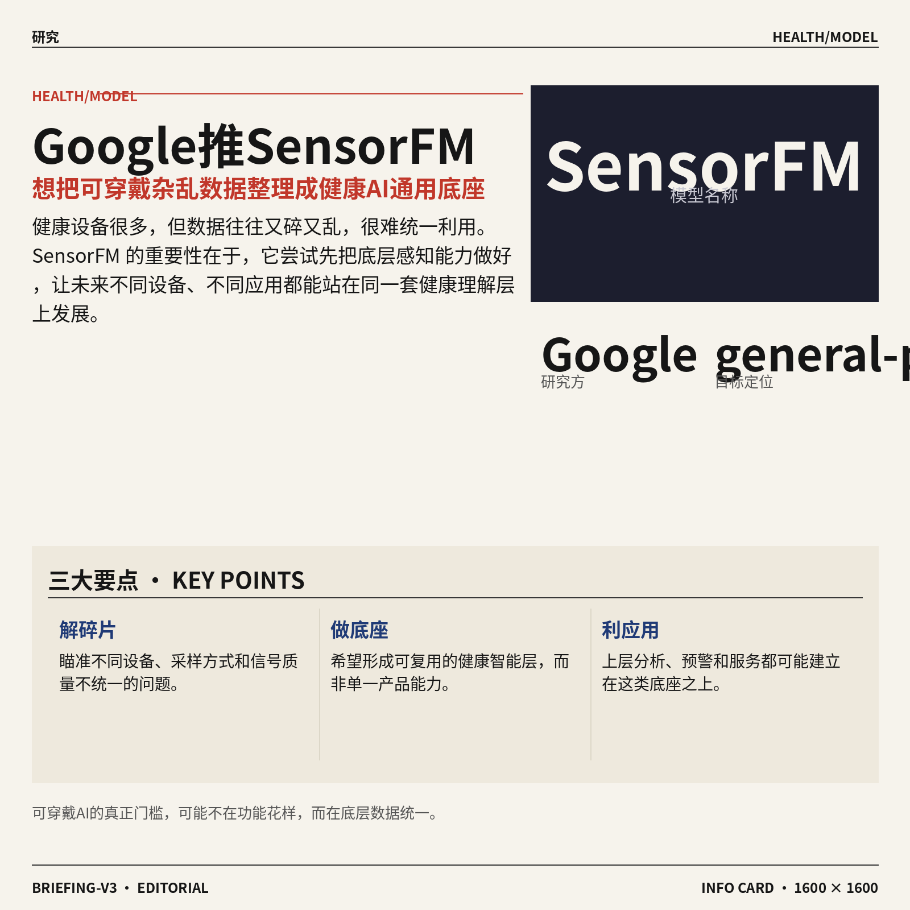

3. **Google 的 SensorFM（把可穿戴设备杂乱传感器数据变成健康理解能力的 AI 模型）想做通用健康智能底座。**
这项研究聚焦可穿戴设备产生的**杂乱传感器数据**，比如不同设备、不同采样方式、不同信号质量带来的碎片化问题 ⌚。报道指出，SensorFM 试图把这些原本难统一利用的数据，整理成一种**general-purpose health intelligence layer（通用健康智能层，也就是可供多种健康任务复用的 AI 理解底座）**。这意味着未来健康类 AI 不一定只服务某一款手环或某一个场景，而可能成为上层健康分析、预警和服务应用的共同基础。原文可看 [完整报道原文(briefing)](https://the-decoder.com/sensorfm/) 👀

![Google 的 SensorFM（把可穿戴设备杂乱传感器数据变成健康理解能力的 AI 模型）想做通用健康智能底座](https://image.pollinations.ai/prompt/Google%20%E7%9A%84%20SensorFM%EF%BC%88%E6%8A%8A%E5%8F%AF%E7%A9%BF%E6%88%B4%E8%AE%BE%E5%A4%87%E6%9D%82%E4%B9%B1%E4%BC%A0%E6%84%9F%E5%99%A8%E6%95%B0%E6%8D%AE%E5%8F%98%E6%88%90%E5%81%A5%E5%BA%B7%E7%90%86%E8%A7%A3%E8%83%BD%E5%8A%9B%E7%9A%84%20AI%20%E6%A8%A1%E5%9E%8B%EF%BC%89%E6%83%B3%E5%81%9A%E9%80%9A%E7%94%A8%E5%81%A5%E5%BA%B7%E6%99%BA%E8%83%BD%E5%BA%95%E5%BA%A7.%20Google%20%E7%9A%84%20SensorFM%EF%BC%88%E6%8A%8A%E5%8F%AF%E7%A9%BF%E6%88%B4%E8%AE%BE%E5%A4%87%E6%9D%82%E4%B9%B1%E4%BC%A0%E6%84%9F%E5%99%A8%E6%95%B0%E6%8D%AE%E5%8F%98%E6%88%90%E5%81%A5%E5%BA%B7%E7%90%86%E8%A7%A3%E8%83%BD%E5%8A%9B%E7%9A%84%20AI%20%E6%A8%A1%E5%9E%8B%EF%BC%89%E6%83%B3%E5%81%9A%E9%80%9A%E7%94%A8%E5%81%A5%E5%BA%B7%E6%99%BA%E8%83%BD%E5%BA%95%E5%BA%A7%E3%80%82%20%E8%BF%99%E9%A1%B9%E7%A0%94%E7%A9%B6%E8%81%9A%E7%84%A6%E5%8F%AF%E7%A9%BF%E6%88%B4%E8%AE%BE%E5%A4%87%E4%BA%A7%E7%94%9F%E7%9A%84%E6%9D%82%E4%B9%B1%E4%BC%A0%E6%84%9F%E5%99%A8%E6%95%B0%E6%8D%AE%2C%20technical%20infographic%20diagram%2C%20architecture%20flowchart%2C%20clean%20vector%20illustration%2C%20educational%20style%2C%20no%20text%20overlay%2C%20modern%20minimal%2C%20wide%20aspect?width=1200&height=675&nologo=true&seed=10869)

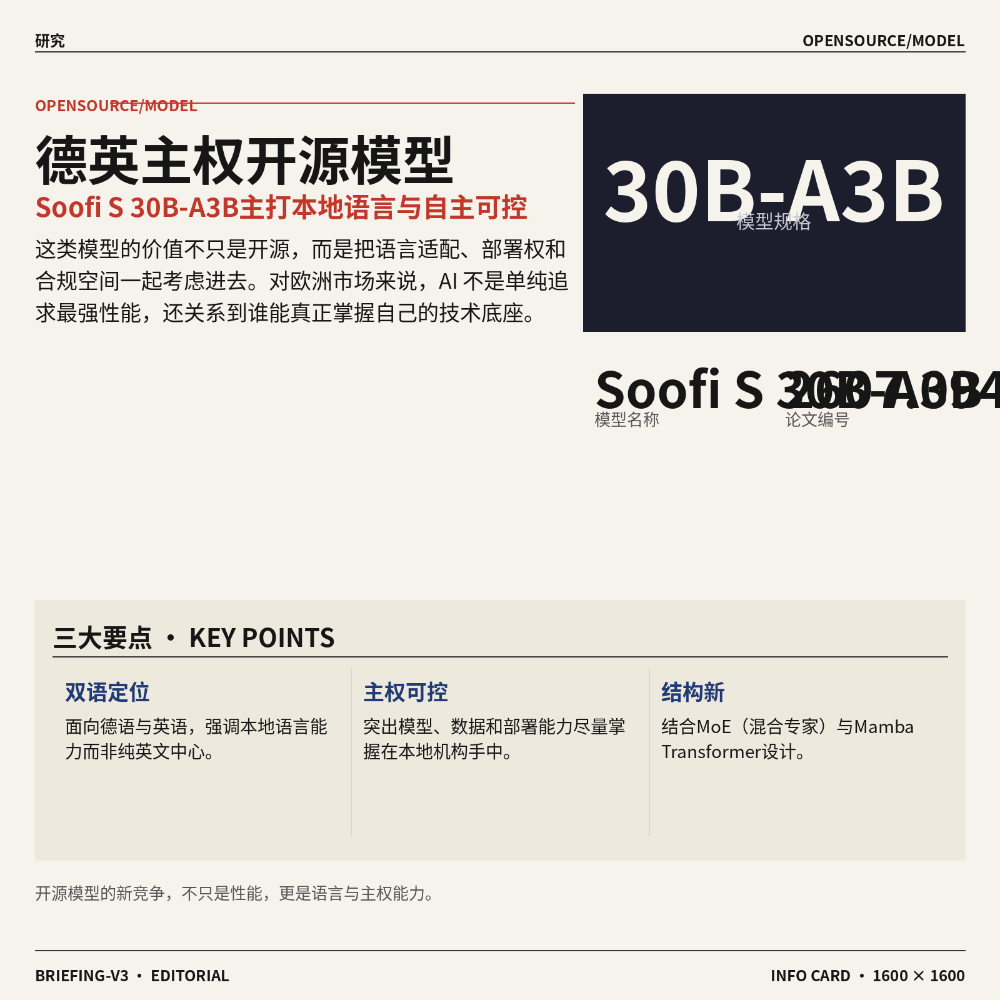

4. **A Sovereign, Open-Source Foundation Model for German and English（面向德语与英语的主权开源基础模型）主打本地语言与自主可控。**
这篇论文介绍了 **Soofi S 30B-A3B（一个德英双语开源基础模型）**，强调 **sovereign（主权可控，指模型、数据和部署能力尽量掌握在本地机构手中）** 的路线，明显对欧洲本地 AI 生态有现实意义 🇪🇺。摘要提到它采用 **MoE（混合专家模型，多个“子模型”分工协作，只按需激活一部分，能兼顾性能与成本）**，以及 **hybrid Mamba Transformer（把两类模型结构结合起来的设计，目标是兼顾长序列处理和通用建模能力）**。对非英语市场来说，这类研究很关键：AI 不只是“能不能用”，还关系到语言适配、部署自主性和合规空间。可参考 [arxiv 论文摘要(briefing)](https://arxiv.org/abs/2607.09424) 或 [HuggingFace 论文页(briefing)](https://huggingface.co/papers/2607.09424)


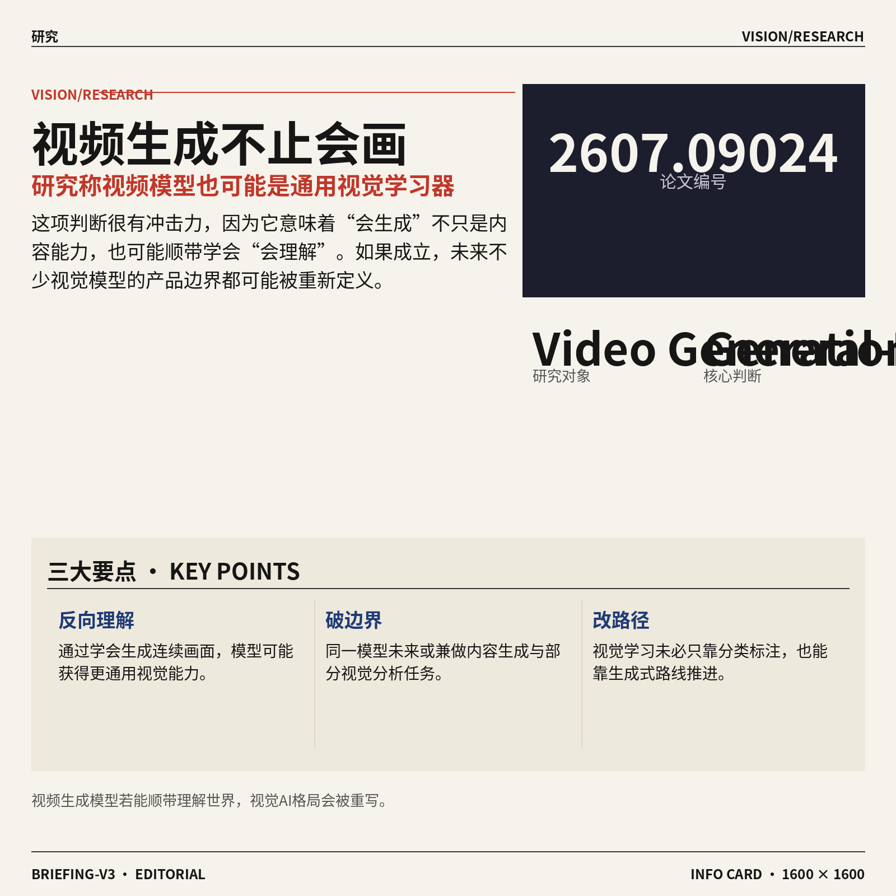

5. **Video Generation Models are General-Purpose Vision Learners（视频生成模型也是通用视觉学习器）提出一个很重要的判断：会“生成视频”的模型，未必只会做视频。**
这篇研究的核心意思是，**video generation models（视频生成模型，能根据文字或条件生成连续画面的模型）** 在学习过程中，可能顺带掌握了更通用的视觉理解能力 🎥。如果这个方向被进一步验证，就说明训练 AI 看懂世界，不一定非得走传统的“分类、识别、标注”老路，也可以通过“学会生成连续画面”来反向提升理解。对行业的启发在于，未来同一个模型也许既能做内容生成，又能承担一部分视觉分析任务，产品边界会越来越模糊。详情可见 [HuggingFace 论文页(briefing)](https://huggingface.co/papers/2607.09024)

![Video Generation Models are General-Purpose Vision Learners（视频生成模型也是通用视觉学习器）提出一个很重要的判断：会“生成视频”的模型，未必只会做视频](https://image.pollinations.ai/prompt/Video%20Generation%20Models%20are%20General-Purpose%20Vision%20Learners%EF%BC%88%E8%A7%86%E9%A2%91%E7%94%9F%E6%88%90%E6%A8%A1%E5%9E%8B%E4%B9%9F%E6%98%AF%E9%80%9A%E7%94%A8%E8%A7%86%E8%A7%89%E5%AD%A6%E4%B9%A0%E5%99%A8%EF%BC%89%E6%8F%90%E5%87%BA%E4%B8%80%E4%B8%AA%E5%BE%88%E9%87%8D%E8%A6%81%E7%9A%84%E5%88%A4%E6%96%AD%EF%BC%9A%E4%BC%9A%E2%80%9C%E7%94%9F%E6%88%90%E8%A7%86%E9%A2%91%E2%80%9D%E7%9A%84%E6%A8%A1%E5%9E%8B%EF%BC%8C%E6%9C%AA%E5%BF%85%E5%8F%AA%E4%BC%9A%E5%81%9A%E8%A7%86%E9%A2%91.%20Video%20Generation%20Models%20are%20General-Purpose%20Vision%20Learners%EF%BC%88%E8%A7%86%E9%A2%91%E7%94%9F%E6%88%90%E6%A8%A1%E5%9E%8B%E4%B9%9F%E6%98%AF%E9%80%9A%E7%94%A8%E8%A7%86%E8%A7%89%E5%AD%A6%E4%B9%A0%E5%99%A8%EF%BC%89%E6%8F%90%E5%87%BA%E4%B8%80%E4%B8%AA%2C%20technical%20infographic%20diagram%2C%20architecture%20flowchart%2C%20clean%20vector%20illustration%2C%20educational%20style%2C%20no%20text%20overlay%2C%20modern%20minimal%2C%20wide%20aspect?width=1200&height=675&nologo=true&seed=10931)

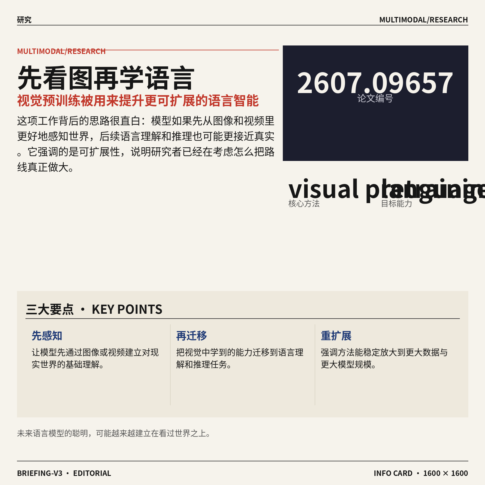

6. **Scalable Visual Pretraining for Language Intelligence（可扩展视觉预训练提升语言智能）探索“先看图，再变聪明”的新路线。**
这篇工作讨论的是 **visual pretraining（视觉预训练，先让模型从大量图片或视频里学会感知世界，再把这种能力迁移到更复杂任务）** 如何服务 **language intelligence（语言智能，也就是理解、推理、表达等语言能力）** 🧠。从标题看，作者强调的是 **scalable（可扩展，指这套训练方式能较稳定地放大到更大数据和更大模型）**，这通常是研究能否真正落地的关键。对普通使用者来说，这类研究的潜台词是：未来 AI 的“会说”可能越来越建立在“看得多、理解更贴近现实”之上，而不只是背了更多文字。可查看 [HuggingFace 论文页(briefing)](https://huggingface.co/papers/2607.09657)


### 🟡 行业展望与社会影响

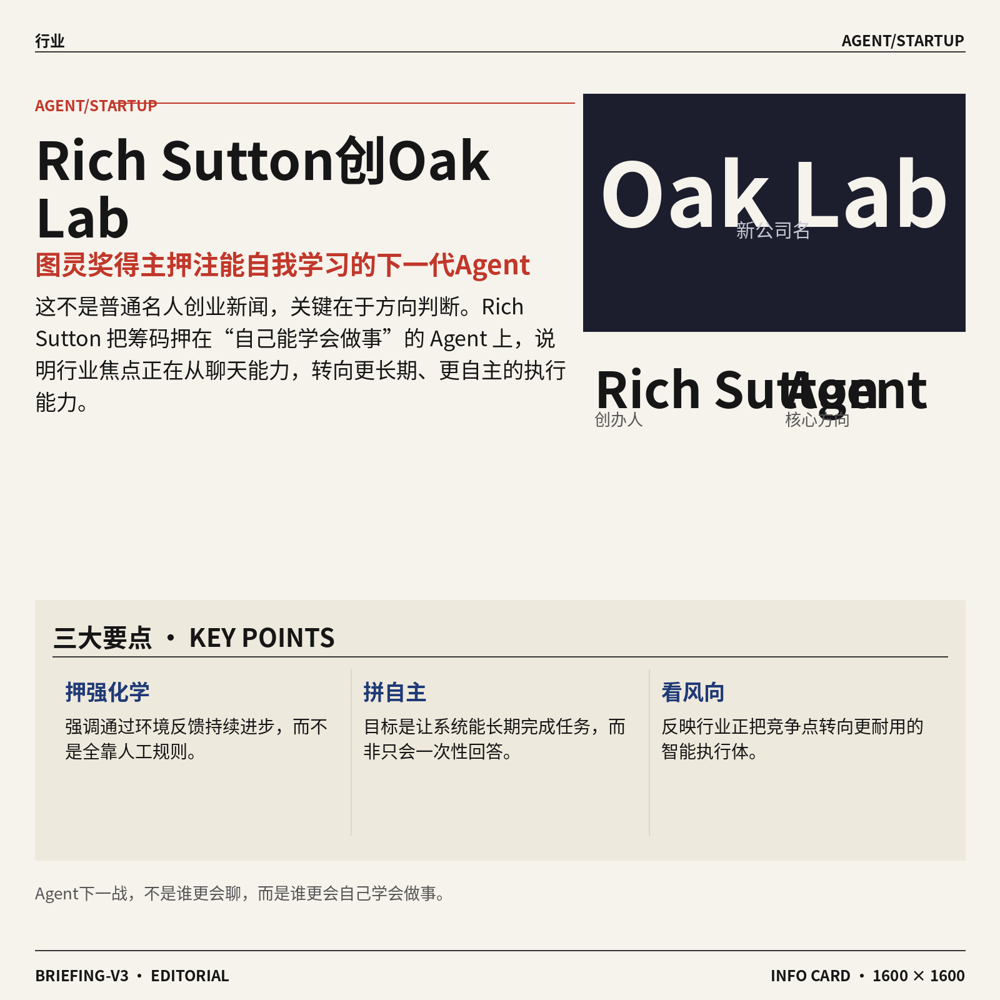

1. **图灵奖得主 Rich Sutton 创办 Oak Lab（聚焦“自我学习”Agent 的新公司）。**
这条消息最值得关注的，不只是名人创业，而是他把方向押在了**能自己学会做事的 Agent** 上 🚀。报道提到，Rich Sutton 新成立的 **Oak Lab（新创 AI 实验室）** 目标是打造不必事事靠人手把手教、而是能通过环境反馈持续进步的系统，这和传统依赖大量人工规则的路线明显不同。这里的关键概念是**强化学习（让 AI 像“试错学走路”一样，通过奖励和惩罚学会决策）**，以及**Agent** 从“会聊天”走向“会长期完成任务”的能力升级。对行业来说，这意味着下一波竞争点可能不只是模型会不会答题，而是谁能先做出**更自主、更耐用**的 AI 助手 💡 [完整报道(briefing)](https://the-decoder.com/turing-award-winner-rich-sutton-founds-oak-lab-to-build-ai-agents-that-learn-on-their-own/)


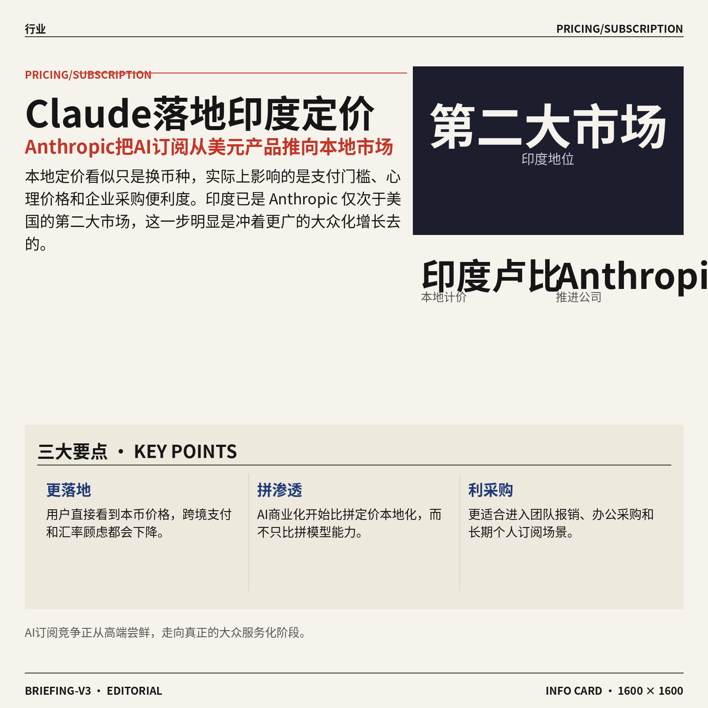

2. **Anthropic 在印度推进 Claude 本地定价，AI 订阅开始更像“大众服务”而不是“美元特供”。**
TechCrunch 报道称，印度用户已经开始看到以**印度卢比**计价的 Claude 订阅方案，这说明 Anthropic 正在把全球扩张做得更“落地” 🌍。原文还点出，印度已是 Anthropic 仅次于美国的**第二大市场**，本地定价的意义不只是换个货币显示，而是降低用户对汇率、跨境支付和心理价格门槛的顾虑。对普通职场人来说，这类动作往往预示着 AI 工具会更快进入日常办公采购、团队报销和个人长期订阅场景。它也提醒大家：**AI 商业化**的下一阶段，拼的不只是模型能力，还包括**定价本地化**与市场渗透能力 📈 [TechCrunch 报道(briefing)](https://techcrunch.com/2026/07/13/anthropic-starts-localizing-claude-pricing-for-india-its-biggest-market-after-the-us/)

![Anthropic 在印度推进 Claude 本地定价，AI 订阅开始更像“大众服务”而不是“美元特供”](https://image.pollinations.ai/prompt/Anthropic%20%E5%9C%A8%E5%8D%B0%E5%BA%A6%E6%8E%A8%E8%BF%9B%20Claude%20%E6%9C%AC%E5%9C%B0%E5%AE%9A%E4%BB%B7%EF%BC%8CAI%20%E8%AE%A2%E9%98%85%E5%BC%80%E5%A7%8B%E6%9B%B4%E5%83%8F%E2%80%9C%E5%A4%A7%E4%BC%97%E6%9C%8D%E5%8A%A1%E2%80%9D%E8%80%8C%E4%B8%8D%E6%98%AF%E2%80%9C%E7%BE%8E%E5%85%83%E7%89%B9%E4%BE%9B%E2%80%9D.%20Anthropic%20%E5%9C%A8%E5%8D%B0%E5%BA%A6%E6%8E%A8%E8%BF%9B%20Claude%20%E6%9C%AC%E5%9C%B0%E5%AE%9A%E4%BB%B7%EF%BC%8CAI%20%E8%AE%A2%E9%98%85%E5%BC%80%E5%A7%8B%E6%9B%B4%E5%83%8F%E2%80%9C%E5%A4%A7%E4%BC%97%E6%9C%8D%E5%8A%A1%E2%80%9D%E8%80%8C%E4%B8%8D%E6%98%AF%E2%80%9C%E7%BE%8E%E5%85%83%E7%89%B9%E4%BE%9B%E2%80%9D%E3%80%82%20TechCrunch%20%E6%8A%A5%E9%81%93%E7%A7%B0%EF%BC%8C%E5%8D%B0%E5%BA%A6%E7%94%A8%E6%88%B7%E5%B7%B2%E7%BB%8F%E5%BC%80%E5%A7%8B%E7%9C%8B%E5%88%B0%E4%BB%A5%2C%20technical%20infographic%20diagram%2C%20architecture%20flowchart%2C%20clean%20vector%20illustration%2C%20educational%20style%2C%20no%20text%20overlay%2C%20modern%20minimal%2C%20wide%20aspect?width=1200&height=675&nologo=true&seed=10838)

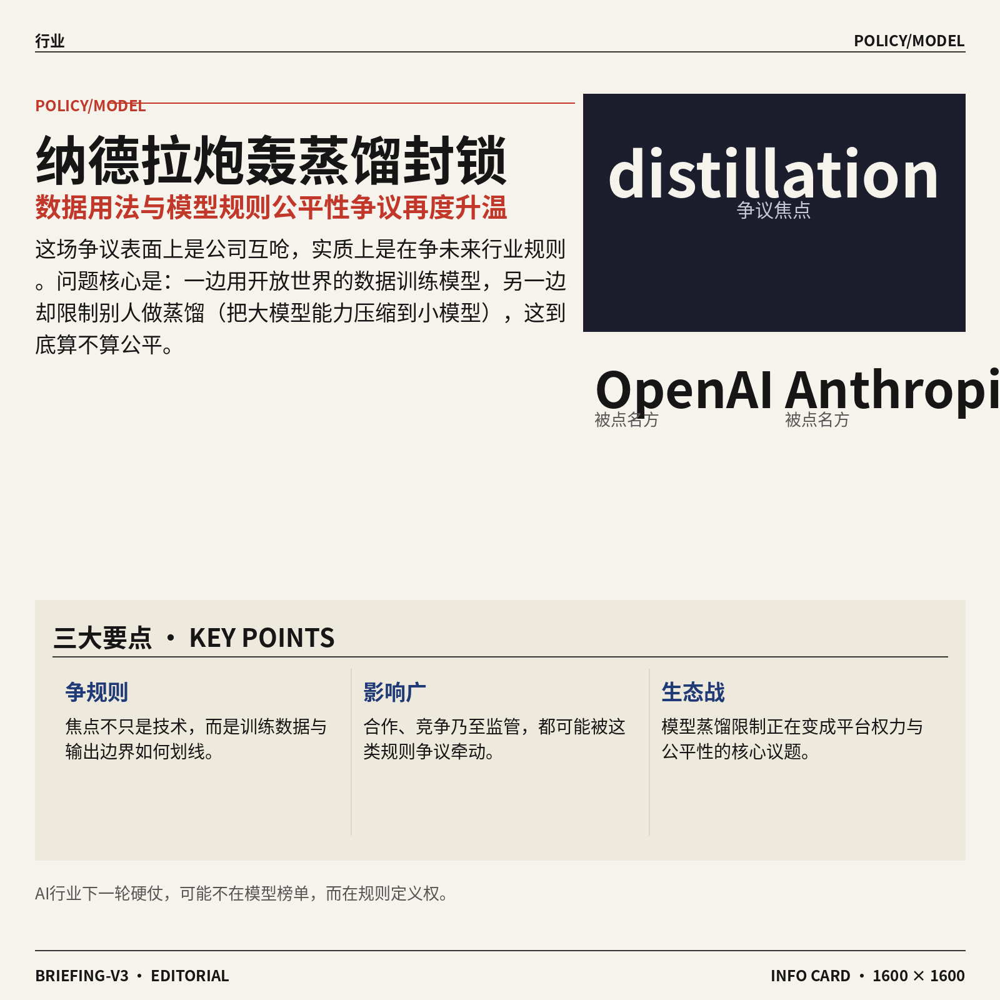

3. **纳德拉点名批评“蒸馏”限制，AI 数据与规则公平性争议再升温。**
微软 CEO 萨提亚·纳德拉在公开表态中，批评 OpenAI 和 Anthropic 等实验室一边使用“大家的数据”训练模型，一边又限制别人做**distillation（模型蒸馏，把大模型能力压缩迁移到更小模型里，像把浓缩知识装进更轻便的工具）** ⚖️。这场争论的核心，不只是公司之间互怼，而是 AI 产业正在重新划分什么算合理使用、什么算不公平设限。对行业生态来说，**训练数据**、**模型输出** 和二次利用边界如果长期说不清，未来合作、竞争甚至监管都可能更复杂。换句话说，这已经不只是技术问题，更是会影响市场秩序的**规则问题** 💡 [完整争议报道(briefing)](https://the-decoder.com/nadella-calls-out-ai-labs-like-openai-and-anthropic-for-banning-distillation-while-training-on-everyone-elses-data/)

![纳德拉点名批评“蒸馏”限制，AI 数据与规则公平性争议再升温](https://image.pollinations.ai/prompt/%E7%BA%B3%E5%BE%B7%E6%8B%89%E7%82%B9%E5%90%8D%E6%89%B9%E8%AF%84%E2%80%9C%E8%92%B8%E9%A6%8F%E2%80%9D%E9%99%90%E5%88%B6%EF%BC%8CAI%20%E6%95%B0%E6%8D%AE%E4%B8%8E%E8%A7%84%E5%88%99%E5%85%AC%E5%B9%B3%E6%80%A7%E4%BA%89%E8%AE%AE%E5%86%8D%E5%8D%87%E6%B8%A9.%20%E7%BA%B3%E5%BE%B7%E6%8B%89%E7%82%B9%E5%90%8D%E6%89%B9%E8%AF%84%E2%80%9C%E8%92%B8%E9%A6%8F%E2%80%9D%E9%99%90%E5%88%B6%EF%BC%8CAI%20%E6%95%B0%E6%8D%AE%E4%B8%8E%E8%A7%84%E5%88%99%E5%85%AC%E5%B9%B3%E6%80%A7%E4%BA%89%E8%AE%AE%E5%86%8D%E5%8D%87%E6%B8%A9%E3%80%82%20%E5%BE%AE%E8%BD%AF%20CEO%20%E8%90%A8%E6%8F%90%E4%BA%9A%C2%B7%E7%BA%B3%E5%BE%B7%E6%8B%89%E5%9C%A8%E5%85%AC%E5%BC%80%E8%A1%A8%E6%80%81%E4%B8%AD%EF%BC%8C%E6%89%B9%E8%AF%84%20OpenAI%20%E5%92%8C%20Anthropic%20%E7%AD%89%E5%AE%9E%E9%AA%8C%E5%AE%A4%E4%B8%80%2C%20technical%20infographic%20diagram%2C%20architecture%20flowchart%2C%20clean%20vector%20illustration%2C%20educational%20style%2C%20no%20text%20overlay%2C%20modern%20minimal%2C%20wide%20aspect?width=1200&height=675&nologo=true&seed=10869)

4. **诺奖经济学家与 AI 领袖警告：留给社会准备 AI 冲击的时间不多了。**
这篇报道把讨论重点放在**就业**和**经济结构**上：多位诺贝尔经济学奖得主与 AI 领域领袖提醒，AI 对工作的影响可能比很多组织准备得更快 ⏳。他们担心的不是某一个岗位立刻消失，而是**知识工作（主要靠写作、分析、沟通、判断完成的办公室工作）** 会被大规模重塑，社会如果没有提前准备培训、转岗和分配机制，冲击会被放大。对企业管理者和职能同事来说，这类信号很现实：未来拼的不只是会不会用 ChatGPT，而是团队能否重新设计岗位分工、考核方式和培训体系。AI 的影响正在从“工具升级”走向“组织改造”，这件事离每个人都越来越近了 📊 [完整报道(briefing)](https://the-decoder.com/nobel-laureates-and-ai-leaders-warn-the-window-to-prepare-for-ais-economic-impact-is-closing-fast/)

![诺奖经济学家与 AI 领袖警告：留给社会准备 AI 冲击的时间不多了](https://image.pollinations.ai/prompt/%E8%AF%BA%E5%A5%96%E7%BB%8F%E6%B5%8E%E5%AD%A6%E5%AE%B6%E4%B8%8E%20AI%20%E9%A2%86%E8%A2%96%E8%AD%A6%E5%91%8A%EF%BC%9A%E7%95%99%E7%BB%99%E7%A4%BE%E4%BC%9A%E5%87%86%E5%A4%87%20AI%20%E5%86%B2%E5%87%BB%E7%9A%84%E6%97%B6%E9%97%B4%E4%B8%8D%E5%A4%9A%E4%BA%86.%20%E8%AF%BA%E5%A5%96%E7%BB%8F%E6%B5%8E%E5%AD%A6%E5%AE%B6%E4%B8%8E%20AI%20%E9%A2%86%E8%A2%96%E8%AD%A6%E5%91%8A%EF%BC%9A%E7%95%99%E7%BB%99%E7%A4%BE%E4%BC%9A%E5%87%86%E5%A4%87%20AI%20%E5%86%B2%E5%87%BB%E7%9A%84%E6%97%B6%E9%97%B4%E4%B8%8D%E5%A4%9A%E4%BA%86%E3%80%82%20%E8%BF%99%E7%AF%87%E6%8A%A5%E9%81%93%E6%8A%8A%E8%AE%A8%E8%AE%BA%E9%87%8D%E7%82%B9%E6%94%BE%E5%9C%A8%E5%B0%B1%E4%B8%9A%E5%92%8C%E7%BB%8F%E6%B5%8E%E7%BB%93%E6%9E%84%E4%B8%8A%EF%BC%9A%E5%A4%9A%E4%BD%8D%E8%AF%BA%E8%B4%9D%E5%B0%94%E7%BB%8F%E6%B5%8E%E5%AD%A6%E5%A5%96%E5%BE%97%E4%B8%BB%E4%B8%8E%20AI%20%E9%A2%86%E5%9F%9F%E9%A2%86%E8%A2%96%E6%8F%90%E9%86%92%EF%BC%8CA%2C%20technical%20infographic%20diagram%2C%20architecture%20flowchart%2C%20clean%20vector%20illustration%2C%20educational%20style%2C%20no%20text%20overlay%2C%20modern%20minimal%2C%20wide%20aspect?width=1200&height=675&nologo=true&seed=10900)

5. **Anthropic 延长 Fable 5（其面向订阅用户开放的模型服务）免费使用，AI 价格战继续加码。**
报道显示，Anthropic 将继续向订阅用户提供 **Fable 5（Anthropic 提供的一项模型服务）** 的免费访问，同时背景是 OpenAI 的 **GPT-5.6 Sol（OpenAI 新一代模型版本）** 正在把竞争推向更激烈的定价战 🔥。这意味着头部公司现在不只是比“谁更聪明”，还在比“谁更舍得让利”、谁更能先占住用户心智。对普通用户和企业采购方来说，短期好处很直接：**试用门槛**更低、可选方案更多，甚至可能出现“高能力模型平价化”的趋势。长期看，价格战会倒逼厂商把模型能力、会员权益和产品捆绑方式做得更清楚，不然光靠品牌已经不够了 💸 [完整报道(briefing)](https://the-decoder.com/anthropic-extends-free-fable-5-access-for-subscribers-as-openais-gpt-5-6-sol-heats-up-the-pricing-war/)

![Anthropic 延长 Fable 5（其面向订阅用户开放的模型服务）免费使用，AI 价格战继续加码](https://image.pollinations.ai/prompt/Anthropic%20%E5%BB%B6%E9%95%BF%20Fable%205%EF%BC%88%E5%85%B6%E9%9D%A2%E5%90%91%E8%AE%A2%E9%98%85%E7%94%A8%E6%88%B7%E5%BC%80%E6%94%BE%E7%9A%84%E6%A8%A1%E5%9E%8B%E6%9C%8D%E5%8A%A1%EF%BC%89%E5%85%8D%E8%B4%B9%E4%BD%BF%E7%94%A8%EF%BC%8CAI%20%E4%BB%B7%E6%A0%BC%E6%88%98%E7%BB%A7%E7%BB%AD%E5%8A%A0%E7%A0%81.%20Anthropic%20%E5%BB%B6%E9%95%BF%20Fable%205%EF%BC%88%E5%85%B6%E9%9D%A2%E5%90%91%E8%AE%A2%E9%98%85%E7%94%A8%E6%88%B7%E5%BC%80%E6%94%BE%E7%9A%84%E6%A8%A1%E5%9E%8B%E6%9C%8D%E5%8A%A1%EF%BC%89%E5%85%8D%E8%B4%B9%E4%BD%BF%E7%94%A8%EF%BC%8CAI%20%E4%BB%B7%E6%A0%BC%E6%88%98%E7%BB%A7%E7%BB%AD%E5%8A%A0%E7%A0%81%E3%80%82%20%E6%8A%A5%E9%81%93%E6%98%BE%E7%A4%BA%EF%BC%8CAnthropic%20%E5%B0%86%E7%BB%A7%E7%BB%AD%E5%90%91%E8%AE%A2%E9%98%85%E7%94%A8%E6%88%B7%E6%8F%90%E4%BE%9B%20F%2C%20technical%20infographic%20diagram%2C%20architecture%20flowchart%2C%20clean%20vector%20illustration%2C%20educational%20style%2C%20no%20text%20overlay%2C%20modern%20minimal%2C%20wide%20aspect?width=1200&height=675&nologo=true&seed=10931)

### 🟣 开源TOP项目

1. **ResearchStudio（微软开源的 AI 科研写作助手）想把研究工作一路带到论文发表。**
这个项目主打 **AI co-author（AI 共同作者，帮助研究者从想题目到写成论文的助手）**，定位非常直接：从**研究问题**整理，一路走到**最终发表** 🚀。对普通团队来说，它传递出的信号是：AI 不只是帮你润色文字，而是开始进入更前面的知识整理、结构搭建和写作协作环节。尤其对经常要写方案、报告、白皮书的同事来说，这类工具的价值在于把“从一堆想法到一份成稿”的过程更流程化、更省脑力。[GitHub 项目页(briefing)](https://github.com/microsoft/ResearchStudio)


2. **Mellea（一个用来编写生成式程序的开发库）瞄准更可控的内容生成。**
Mellea 把自己定义为 **library（开发库，给程序员复用的一套现成能力组件）**，用途是编写 **generative programs（生成式程序，让程序不是死板输出，而是能动态生成内容或结果）** 💡。这类项目的看点不在“直接给普通人一个成品工具”，而在于它给开发者提供了一种更系统地组织生成逻辑的方式。往业务层面看，未来很多企业里的 AI 工作流、自动化内容生成工具，往往就是建立在这种底层库之上。[GitHub 仓库页(briefing)](https://github.com/generative-computing/mellea)


3. **仓颉 Skill（把长内容蒸馏成可执行能力包的 Agent 技能库）主打“内容直接变动作”。**
这个项目想解决的不是“信息看不完”，而是“看完也很难立刻用起来”——它把书、长视频、播客等高价值内容，蒸馏成可执行的 **Agent Skills（Agent 技能包，相当于给 AI 装上一套可重复调用的工作套路）**。你可以把它理解成：不是只给 AI 一份笔记，而是给它一套“遇到这种任务就该怎么做”的操作手册 📚。对运营、培训、知识管理团队尤其有启发，因为企业内部的大量经验内容，未来都可能从“文档资产”变成“可执行资产”。[项目仓库说明(briefing)](https://github.com/kangarooking/cangjie-skill)


4. **agent-scripts（给 Agent 复用的脚本集合）体现出 AI 工作流正在模块化。**
这个项目的描述很朴素：它是一组给 Agent 使用、并在多个仓库之间共享的 **scripts（脚本，一段可自动执行的操作指令）**。别看简介短，这类仓库其实很能说明趋势——开发者不再只做单个 AI 功能，而是在沉淀可复用的任务模块，像搭积木一样拼装工作流 🧩。对于企业来说，这意味着未来很多 AI 自动化流程会从“临时写一次”走向“标准件复用”。[GitHub 仓库页(briefing)](https://github.com/steipete/agent-scripts)


5. **Skills（面向设计师和构建者的 Agent 技能包）把 Codex、Claude、Cursor 的协作经验打包开源。**
这个仓库明确服务于 **designers and builders（设计师和产品构建者）**，提供一套可直接给 Codex、Claude、Cursor 等 AI 编码助手使用的 **Agent skills（Agent 技能模板，帮助 AI 更稳定地完成某类工作）** ✨。它的意义在于，AI 不只是“会回答问题”，而是开始沉淀成一套套面向具体岗位的工作方法。对设计、产品、运营同事来说，这也很值得关注：未来高价值的未必只是会提问的人，更可能是会把自己工作经验封装成“技能包”的人。[GitHub 技能仓库(briefing)](https://github.com/MengTo/Skills)


### 🔴 社媒分享

1. **Apple 起诉 OpenAI 背后，真正暴露的是自家 AI 困局。**
这篇分析认为，Apple 这次把矛头指向“**商业机密泄露**”，表面上是在追责一名涉事员工，但整体观感更像是在 AI 竞争压力下的一次情绪性反击 🤔。文章的核心判断是：Apple 真正的问题，可能不是单一员工，而是自己在 **AI 时代的产品节奏与战略位置**。对普通用户和企业同事来说，这类事件也提醒大家：大厂之间围绕 **人才、技术与数据** 的博弈，已经从发布会延伸到法律战场。[深度评论原文(briefing)](https://stratechery.com/2026/apple-sues-openai-apples-real-problem/)


2. **Apple 的 SpeechAnalyzer（语音分析接口，帮助应用把语音转成文字并做理解）API 跑分，对上 Whisper（OpenAI 的开源语音识别模型）和前代产品。**
这篇测试把 Apple 新推出的 **SpeechAnalyzer API**，拿去和 **Whisper** 以及它自己的旧版方案做了直接对比 📊。这类 benchmark（基准测试，用统一题目比较不同模型或工具表现）最值得关注的，不只是“谁更准”，还包括它在真实场景里能否带来更稳定的语音转写体验。对做产品、运营或客服流程的同事来说，语音识别能力的进步，往往意味着会议纪要、客服录音整理、内容检索这些工作会更省时。[实测对比文章(briefing)](https://get-inscribe.com/blog/apple-speech-api-benchmark.html)


3. **Samsung Health（三星的健康管理应用）被曝：若拒绝 AI 训练，用户可能面临数据删除提示。**
这则消息的争议点很直接：用户如果选择不让自己的数据用于 **AI 训练**，应用却提示可能会发生**数据删除**，难免让人感觉“不同意就别用了” 😶。这里牵涉的不只是功能选择，更是 **用户授权** 与 **数据使用边界** 的老问题。对企业内部做合规、运营或人事的同事来说，这类事件再次说明：AI 功能上线时，**告知方式、退出机制、数据保留规则** 都会直接影响用户信任。[事件报道原文(briefing)](https://neow.in/cWsyMTV3)


4. **同样的 TypeScript（微软推出的编程语言，常用于网页和应用开发）任务，在 Claude 上比在 GPT 上更贵。**
这篇文章讨论的是一个很现实的问题：面对同一份 **TypeScript** 代码任务，不同大模型的实际使用成本可能差不少 💸。这里的“贵”并不只是单次调用价格，还可能涉及 token（模型处理文字时切分的最小单位，通常字越多消耗越高）消耗和整体任务完成效率。对企业采购、管理者和团队负责人来说，这意味着选模型不能只看“聪不聪明”，还得看 **单位任务成本** 是否划算；尤其是代码生成这类高频场景，价格差会被迅速放大。[成本分析原文(briefing)](https://playcode.io/blog/real-price-of-frontier-models)

![同样的 TypeScript（微软推出的编程语言，常用于网页和应用开发）任务，在 Claude 上比在 GPT 上更贵](https://image.pollinations.ai/prompt/%E5%90%8C%E6%A0%B7%E7%9A%84%20TypeScript%EF%BC%88%E5%BE%AE%E8%BD%AF%E6%8E%A8%E5%87%BA%E7%9A%84%E7%BC%96%E7%A8%8B%E8%AF%AD%E8%A8%80%EF%BC%8C%E5%B8%B8%E7%94%A8%E4%BA%8E%E7%BD%91%E9%A1%B5%E5%92%8C%E5%BA%94%E7%94%A8%E5%BC%80%E5%8F%91%EF%BC%89%E4%BB%BB%E5%8A%A1%EF%BC%8C%E5%9C%A8%20Claude%20%E4%B8%8A%E6%AF%94%E5%9C%A8%20GPT%20%E4%B8%8A%E6%9B%B4%E8%B4%B5.%20%E5%90%8C%E6%A0%B7%E7%9A%84%20TypeScript%EF%BC%88%E5%BE%AE%E8%BD%AF%E6%8E%A8%E5%87%BA%E7%9A%84%E7%BC%96%E7%A8%8B%E8%AF%AD%E8%A8%80%EF%BC%8C%E5%B8%B8%E7%94%A8%E4%BA%8E%E7%BD%91%E9%A1%B5%E5%92%8C%E5%BA%94%E7%94%A8%E5%BC%80%E5%8F%91%EF%BC%89%E4%BB%BB%E5%8A%A1%EF%BC%8C%E5%9C%A8%20Claude%20%E4%B8%8A%E6%AF%94%E5%9C%A8%20GPT%20%E4%B8%8A%E6%9B%B4%E8%B4%B5%E3%80%82%20%E8%BF%99%E7%AF%87%E6%96%87%E7%AB%A0%E8%AE%A8%E8%AE%BA%E7%9A%84%E6%98%AF%E4%B8%80%E4%B8%AA%E5%BE%88%E7%8E%B0%E5%AE%9E%E7%9A%84%E9%97%AE%E9%A2%98%EF%BC%9A%E9%9D%A2%E5%AF%B9%2C%20technical%20infographic%20diagram%2C%20architecture%20flowchart%2C%20clean%20vector%20illustration%2C%20educational%20style%2C%20no%20text%20overlay%2C%20modern%20minimal%2C%20wide%20aspect?width=1200&height=675&nologo=true&seed=10706)

---

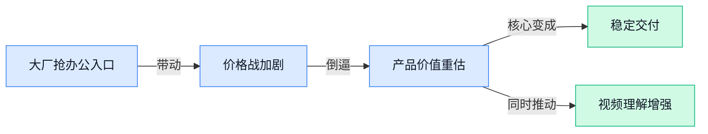
```mermaid
graph LR
A[大厂抢办公入口] -->|带动| B[价格战加剧]
B -->|倒逼| C[产品价值重估]
C -->|核心变成| D[稳定交付]
C -->|同时推动| E[视频理解增强]

classDef blue fill:#dbeafe,stroke:#3b82f6,color:#111827
classDef green fill:#d1fae5,stroke:#10b981,color:#111827

class A,B,C blue
class D,E green
```

### 📊 行业洞察（今日 4 条）

1. OpenAI 推出 ChatGPT Work（面向工作的企业版功能），Anthropic 又在印度做 Claude 本地定价，还延长 Fable 5 免费使用
  【洞察】几件事放一起看，头部公司都在抢“日常工作入口”；AI 竞争重点已从单次炫技，转向谁先成为团队长期采购的默认工具

2. Long-Horizon-Terminal-Bench（专测长流程任务能否做到底的评测）和 Self-Guided Test-Time Training（让模型边用边微调自己）同天出现
  【洞察】行业已默认一个现实：AI 最大短板不是不会开头，而是做不完整件事；下一阶段比的是稳定交付，不是回答惊艳

3. Video Generation Models are General-Purpose Vision Learners（视频生成模型也能顺带学会看懂世界）与 Scalable Visual Pretraining for Language Intelligence（先看图再提升表达和理解）都在押注视觉路线
  【洞察】这说明“会生成”与“会理解”的边界在消失，未来视频模型不只负责出片，还会反过来参与选镜头、找卖点、判质量

4. 纳德拉批评 OpenAI 和 Anthropic 限制 distillation（把大模型能力压缩给小模型），Samsung Health（三星健康应用）又因数据授权惹争议
  【洞察】行业麻烦不只在能力，而在规则；谁能学、拿什么学、用户能否退出，都会直接决定企业敢不敢深度接入 AI

### 💭 对我们的启发（今日 3 条）

1. OpenAI 做 ChatGPT Work、Anthropic 打价格战，说明基础能力会越来越便宜；我们的视频剪辑软件不能只卖“接了 AI”，得把价值放在成片效率、品牌适配和交付稳定性上。

2. 长流程评测和“边做边调”研究都在提醒我们：视频创作工具里，文案、分镜、剪辑、配音最好拆成可检查节点，关键步骤要允许人工接管，别迷信一键出片。

3. 视频模型开始兼顾“生成+理解”，对我们是机会也是风险；机会是可做自动选素材、识别爆点、检查口播与画面是否一致，风险是纯剪辑功能会更快同质化。

