## AI资讯日报 2026/9/19

> AI 早报 · 每日早读 · 全网深度聚合

## **今日摘要**

```
Claude助安全团队不到72小时攻入OpenAI内部系统
Claude承担Anthropic新模型四分之一研发，Claude Code引入并行代理
Anthropic与Accenture（咨询巨头）计划投20亿美元评估模型，自建生物实验室
```

### 🔵 产品与功能更新

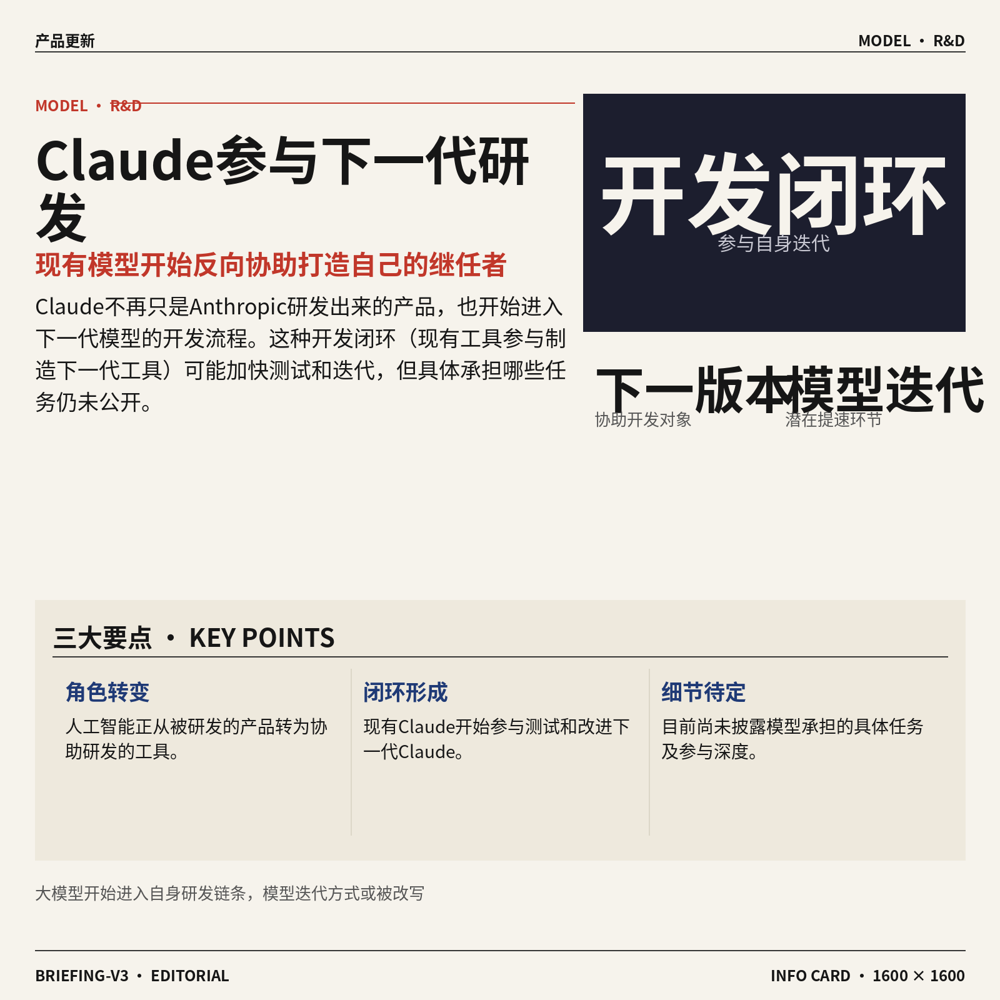

1. **Claude 正在帮助 Anthropic 打造下一代 Claude。**
据报道，Anthropic 已让 Claude 参与自身下一版本的开发，人工智能开始从“被研发的产品”变成“协助研发的工具” 🤖。这形成了一个**开发闭环**（现有工具反过来参与制造下一代工具的循环），可能加快**模型迭代**（持续测试、调整并改进下一版本的过程）。不过现有材料未披露 Claude 具体承担了哪些开发任务，实际参与深度仍有待进一步信息确认。[相关报道(briefing)](https://news.google.com/rss/articles/CBMijAFBVV95cUxQSHoxemhKVmppRHBIV0dMLWJMeGlDc20wWVRNNWxDYnJ0bDVQa0dMTTF0R1lqbFc1dkZ1dW1yc1FfangzZVFYNU4tSERIREhkQlU3WDBVM3Z0dnp0TVlfaWxRcnNtWnhLMVZvZmwwZkpwWm40cDdELXRKYXAtQUNRemhZZXRGVUVSQjRmSdIBkgFBVV95cUxPcF84cVk5cjh6MmVnUG1zZm1YYkFnOTJ3b3V2SDVpbmVTOHJMTDdqY3dFOUZFRjJmVW5ld1VOUFJiUldvMFZXbF9EUjVWYjdZcVF0ZTJZNHhVaWFCbnBEaEFzc0w1RU8wSXJqZlFKZTdKMHdycVN2SUdqWTJOWG9rTG9CSGtmV1BUSnc5YnV0a0lGZw?oc=5)


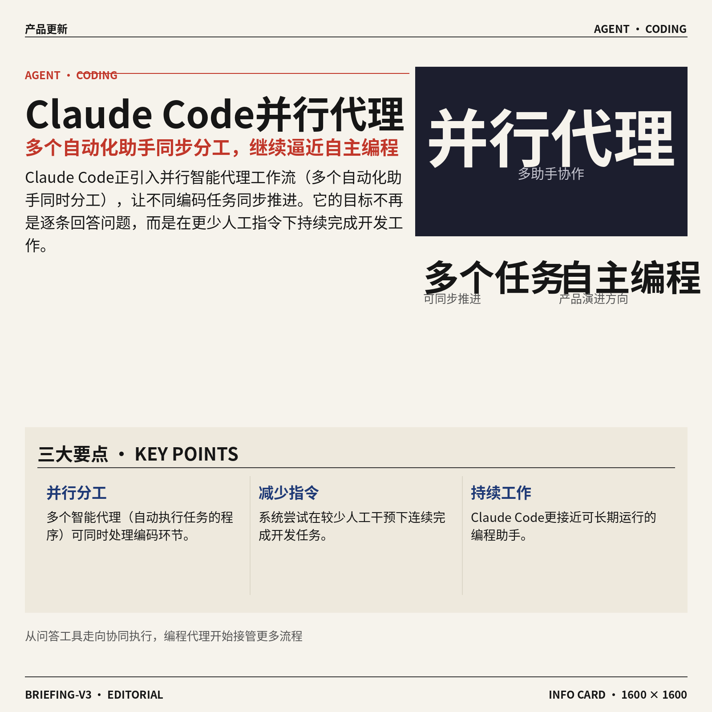

2. **Anthropic 继续推动 Claude Code 走向自主编程，并引入并行智能代理工作流。**
Claude Code 正进一步强化**并行智能代理工作流**（让多个自动化助手同时分工处理任务的流程），重点是把更多编码环节交给系统协同完成 🚀。这项更新指向**自主编程**（人工智能在较少人工指令下连续完成编码任务），而不只是逐条回答程序员的问题。对开发团队而言，其意义在于多个任务可以同步推进，Claude Code 也因此更接近能够持续工作的编程助手。[功能更新报道(briefing)](https://the-decoder.com/anthropic-keeps-pushing-claude-code-toward-autonomous-coding-with-new-parallel-agent-workflows/)


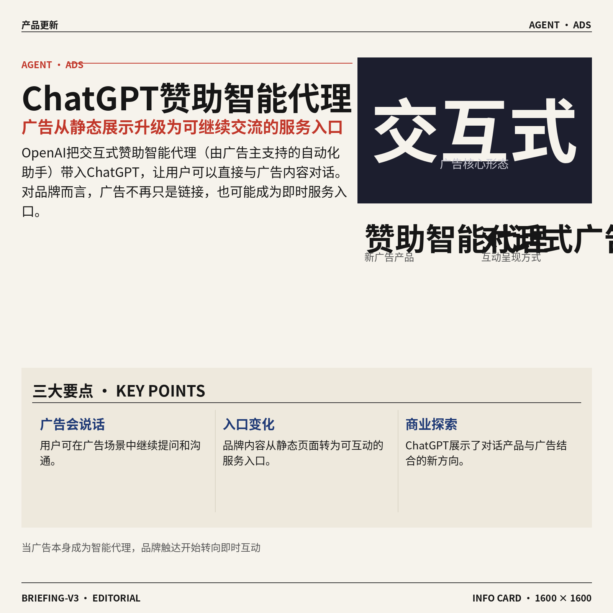

3. **OpenAI 为 ChatGPT 广告推出交互式赞助智能代理。**
OpenAI 推出了**交互式赞助智能代理**（由广告主支持、能与用户进行互动的自动化助手），把 ChatGPT 广告从单纯展示信息推向可交流的形式 💡。这类**对话式广告**（将广告内容放进问答互动，而不是只呈现静态页面）意味着用户可以在广告场景中继续沟通，而不只是点击链接。对品牌和运营团队来说，这展示了一种新的广告产品方向：广告内容本身也能成为可互动的服务入口。[产品发布报道(briefing)](https://news.google.com/rss/articles/CBMifkFVX3lxTE40V3hOLUlQcXc5d2c5WmI1ZHdVakhPV3RyUmZNNnNnTUYtTU9UYy1BVjFROVh5NmpBUjlreGM4czhTME85MTF5a2dnYkJDdW14OUxwYkJmeG1pT1NQaTA4bGN0X2cwNklDY0k0SG1VX1cyQ01pMV9aU01YWHIzQQ?oc=5)


### 🟢 前沿研究

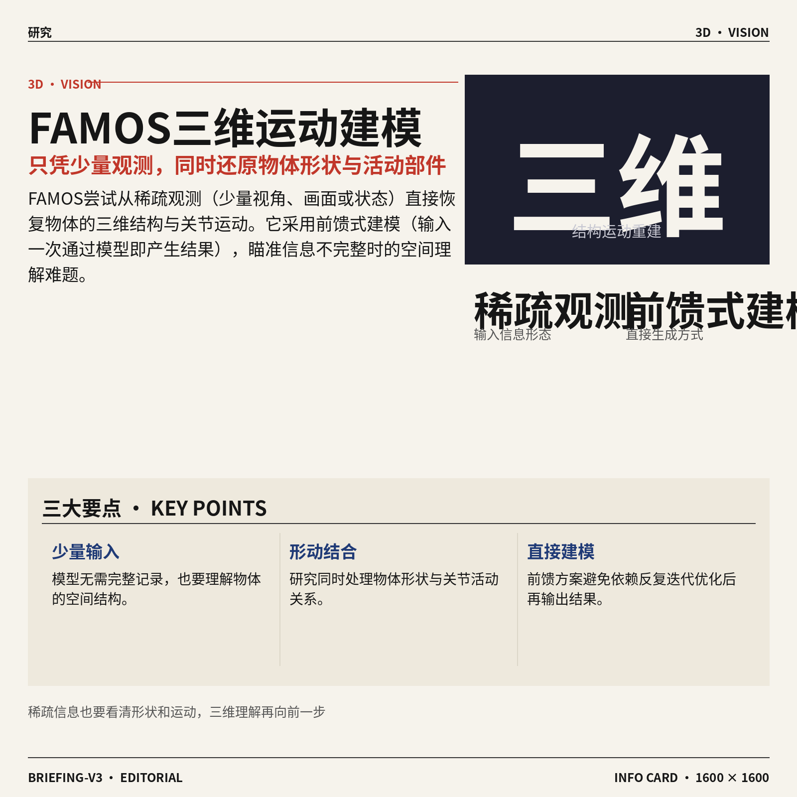

1. **FAMOS（从稀疏观测直接建立三维关节运动模型）探索少量数据下的三维建模。**
这项研究关注如何从**稀疏观测**（只看到少量视角、画面或状态，而非完整记录）中，还原物体的三维结构与关节运动。它采用**前馈式建模**（输入数据一次通过模型便直接产生结果，不需要反复迭代优化）的研究思路，目标是同时处理形状与活动部件之间的关系 🦾。这类研究瞄准的核心难题是：当可用信息不完整时，模型能否依然理解物体“长什么样、哪里能动”。[FAMOS 论文页面(briefing)](https://huggingface.co/papers/2609.20817)


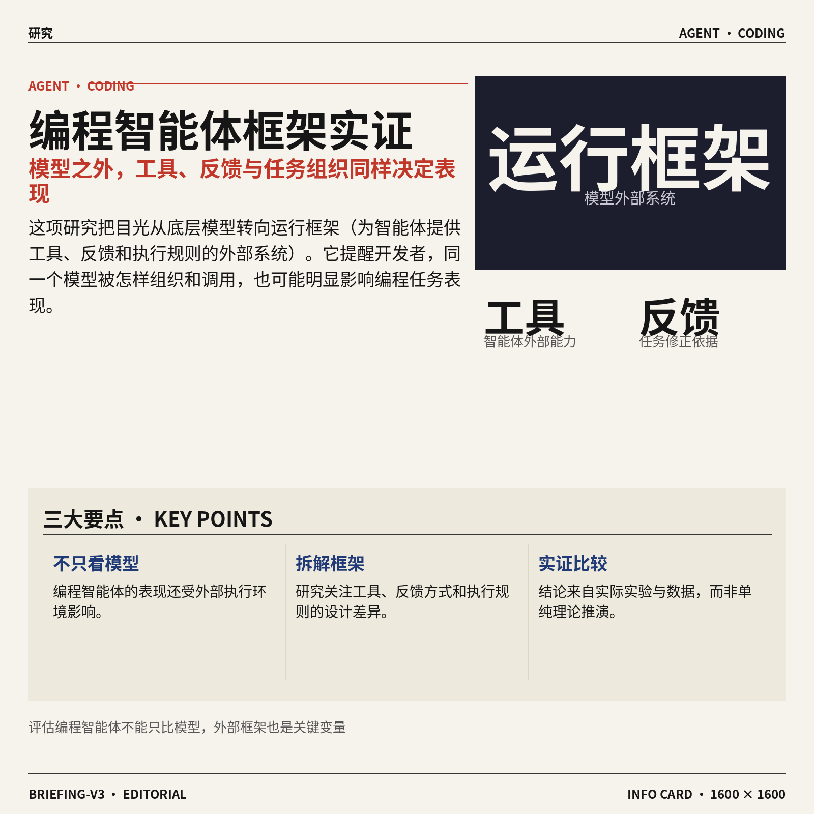

2. **编程智能体的“外部运行框架”该怎么设计？一项实证研究开始拆解。**
论文研究的是**运行框架**（包裹在智能体外部、负责提供工具、反馈和执行规则的系统）如何影响编程智能体，而不只是比较模型本身。所谓**实证研究**，是通过实际实验和数据观察设计差异，而非只做理论推演 🔍。这意味着，评估编程智能体时不能只看底层大模型，还要留意它获得了什么工具、如何接收反馈，以及任务如何被组织。[编程智能体框架论文(briefing)](https://huggingface.co/papers/2609.20804)

![编程智能体的“外部运行框架”该怎么设计？一项实证研究开始拆解](https://image.pollinations.ai/prompt/%E7%BC%96%E7%A8%8B%E6%99%BA%E8%83%BD%E4%BD%93%E7%9A%84%E2%80%9C%E5%A4%96%E9%83%A8%E8%BF%90%E8%A1%8C%E6%A1%86%E6%9E%B6%E2%80%9D%E8%AF%A5%E6%80%8E%E4%B9%88%E8%AE%BE%E8%AE%A1%EF%BC%9F%E4%B8%80%E9%A1%B9%E5%AE%9E%E8%AF%81%E7%A0%94%E7%A9%B6%E5%BC%80%E5%A7%8B%E6%8B%86%E8%A7%A3.%20%E7%BC%96%E7%A8%8B%E6%99%BA%E8%83%BD%E4%BD%93%E7%9A%84%E2%80%9C%E5%A4%96%E9%83%A8%E8%BF%90%E8%A1%8C%E6%A1%86%E6%9E%B6%E2%80%9D%E8%AF%A5%E6%80%8E%E4%B9%88%E8%AE%BE%E8%AE%A1%EF%BC%9F%E4%B8%80%E9%A1%B9%E5%AE%9E%E8%AF%81%E7%A0%94%E7%A9%B6%E5%BC%80%E5%A7%8B%E6%8B%86%E8%A7%A3%E3%80%82%20%E8%AE%BA%E6%96%87%E7%A0%94%E7%A9%B6%E7%9A%84%E6%98%AF%E8%BF%90%E8%A1%8C%E6%A1%86%E6%9E%B6%EF%BC%88%E5%8C%85%E8%A3%B9%E5%9C%A8%E6%99%BA%E8%83%BD%E4%BD%93%E5%A4%96%E9%83%A8%E3%80%81%E8%B4%9F%E8%B4%A3%E6%8F%90%E4%BE%9B%E5%B7%A5%E5%85%B7%E3%80%81%E5%8F%8D%E9%A6%88%E5%92%8C%E6%89%A7%E8%A1%8C%E8%A7%84%E5%88%99%E7%9A%84%E7%B3%BB%E7%BB%9F%EF%BC%89%E5%A6%82%E4%BD%95%E5%BD%B1%E5%93%8D%E7%BC%96%E7%A8%8B%E6%99%BA%E8%83%BD%E4%BD%93%EF%BC%8C%2C%20technical%20infographic%20diagram%2C%20architecture%20flowchart%2C%20clean%20vector%20illustration%2C%20educational%20style%2C%20no%20text%20overlay%2C%20modern%20minimal%2C%20wide%20aspect?width=1200&height=675&nologo=true&seed=10838)


3. **RetireOPD（可自行停止蒸馏的智能体强化学习方案）尝试让训练适时“收手”。**
这项研究提出面向智能体强化学习的**同策略蒸馏**（学生模型用自己当前策略产生的数据，学习更强模型或目标策略的能力）。其中“自行停止”指向一种可退出蒸馏过程的设计，重点是不让蒸馏环节无限持续 🔄。**智能体强化学习**（让 AI 通过执行任务和获得反馈来改进决策）通常包含较长的训练流程，因此何时继续、何时退出是值得研究的训练问题。[RetireOPD 论文页面(briefing)](https://huggingface.co/papers/2609.20784)

![RetireOPD（可自行停止蒸馏的智能体强化学习方案）尝试让训练适时“收手”](https://image.pollinations.ai/prompt/RetireOPD%EF%BC%88%E5%8F%AF%E8%87%AA%E8%A1%8C%E5%81%9C%E6%AD%A2%E8%92%B8%E9%A6%8F%E7%9A%84%E6%99%BA%E8%83%BD%E4%BD%93%E5%BC%BA%E5%8C%96%E5%AD%A6%E4%B9%A0%E6%96%B9%E6%A1%88%EF%BC%89%E5%B0%9D%E8%AF%95%E8%AE%A9%E8%AE%AD%E7%BB%83%E9%80%82%E6%97%B6%E2%80%9C%E6%94%B6%E6%89%8B%E2%80%9D.%20RetireOPD%EF%BC%88%E5%8F%AF%E8%87%AA%E8%A1%8C%E5%81%9C%E6%AD%A2%E8%92%B8%E9%A6%8F%E7%9A%84%E6%99%BA%E8%83%BD%E4%BD%93%E5%BC%BA%E5%8C%96%E5%AD%A6%E4%B9%A0%E6%96%B9%E6%A1%88%EF%BC%89%E5%B0%9D%E8%AF%95%E8%AE%A9%E8%AE%AD%E7%BB%83%E9%80%82%E6%97%B6%E2%80%9C%E6%94%B6%E6%89%8B%E2%80%9D%E3%80%82%20%E8%BF%99%E9%A1%B9%E7%A0%94%E7%A9%B6%E6%8F%90%E5%87%BA%E9%9D%A2%E5%90%91%E6%99%BA%E8%83%BD%E4%BD%93%E5%BC%BA%E5%8C%96%E5%AD%A6%E4%B9%A0%E7%9A%84%E5%90%8C%E7%AD%96%E7%95%A5%E8%92%B8%E9%A6%8F%EF%BC%88%E5%AD%A6%E7%94%9F%E6%A8%A1%E5%9E%8B%E7%94%A8%E8%87%AA%E5%B7%B1%E5%BD%93%E5%89%8D%E7%AD%96%E7%95%A5%E4%BA%A7%E7%94%9F%E7%9A%84%E6%95%B0%E6%8D%AE%EF%BC%8C%2C%20technical%20infographic%20diagram%2C%20architecture%20flowchart%2C%20clean%20vector%20illustration%2C%20educational%20style%2C%20no%20text%20overlay%2C%20modern%20minimal%2C%20wide%20aspect?width=1200&height=675&nologo=true&seed=10869)

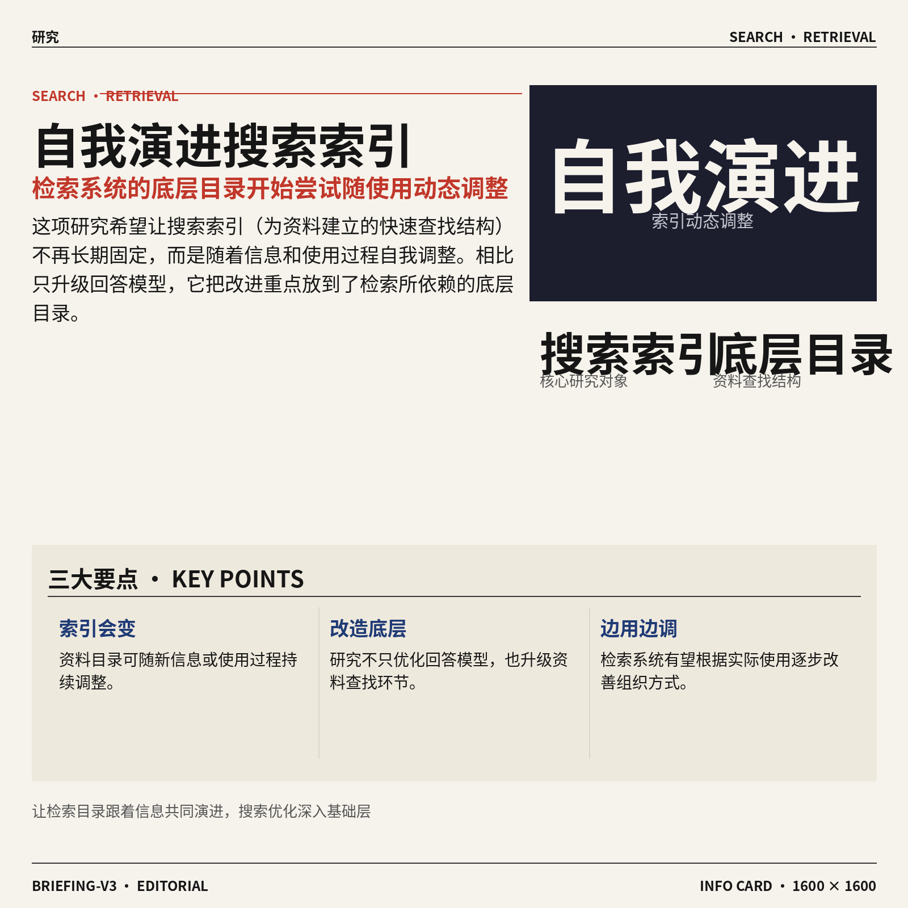

4. **自我演进搜索索引，让检索系统尝试边用边调整。**
论文聚焦**搜索索引**（把资料预先整理成便于快速查找的结构，类似给大型档案库制作目录）如何实现自我演进。这里的**自我演进**指索引不是长期固定不变，而是能够随信息或使用过程进行调整 📚。研究标题指向一个重要方向：除了提升负责回答问题的模型，也可以改造模型查找资料时依赖的底层“目录”。[自我演进索引论文(briefing)](https://huggingface.co/papers/2609.19656)

![自我演进搜索索引，让检索系统尝试边用边调整](https://image.pollinations.ai/prompt/%E8%87%AA%E6%88%91%E6%BC%94%E8%BF%9B%E6%90%9C%E7%B4%A2%E7%B4%A2%E5%BC%95%EF%BC%8C%E8%AE%A9%E6%A3%80%E7%B4%A2%E7%B3%BB%E7%BB%9F%E5%B0%9D%E8%AF%95%E8%BE%B9%E7%94%A8%E8%BE%B9%E8%B0%83%E6%95%B4.%20%E8%87%AA%E6%88%91%E6%BC%94%E8%BF%9B%E6%90%9C%E7%B4%A2%E7%B4%A2%E5%BC%95%EF%BC%8C%E8%AE%A9%E6%A3%80%E7%B4%A2%E7%B3%BB%E7%BB%9F%E5%B0%9D%E8%AF%95%E8%BE%B9%E7%94%A8%E8%BE%B9%E8%B0%83%E6%95%B4%E3%80%82%20%E8%AE%BA%E6%96%87%E8%81%9A%E7%84%A6%E6%90%9C%E7%B4%A2%E7%B4%A2%E5%BC%95%EF%BC%88%E6%8A%8A%E8%B5%84%E6%96%99%E9%A2%84%E5%85%88%E6%95%B4%E7%90%86%E6%88%90%E4%BE%BF%E4%BA%8E%E5%BF%AB%E9%80%9F%E6%9F%A5%E6%89%BE%E7%9A%84%E7%BB%93%E6%9E%84%EF%BC%8C%E7%B1%BB%E4%BC%BC%E7%BB%99%E5%A4%A7%E5%9E%8B%E6%A1%A3%E6%A1%88%E5%BA%93%E5%88%B6%E4%BD%9C%E7%9B%AE%E5%BD%95%EF%BC%89%E5%A6%82%E4%BD%95%E5%AE%9E%E7%8E%B0%E8%87%AA%E6%88%91%E6%BC%94%E8%BF%9B%E3%80%82%E8%BF%99%E9%87%8C%E7%9A%84%E8%87%AA%E6%88%91%E6%BC%94%E8%BF%9B%E6%8C%87%2C%20technical%20infographic%20diagram%2C%20architecture%20flowchart%2C%20clean%20vector%20illustration%2C%20educational%20style%2C%20no%20text%20overlay%2C%20modern%20minimal%2C%20wide%20aspect?width=1200&height=675&nologo=true&seed=10900)

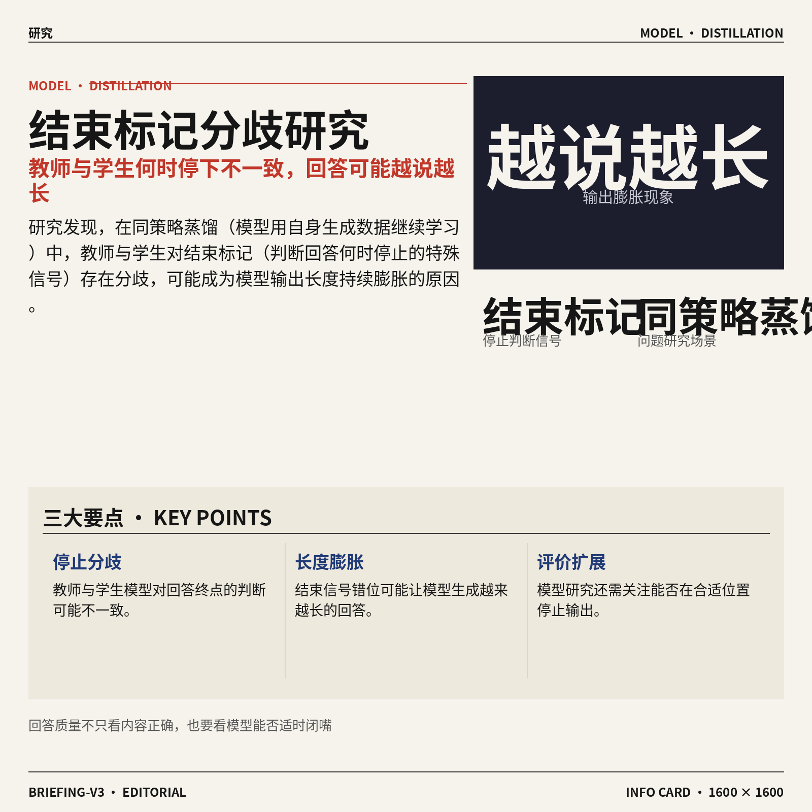

5. **结束标记出现分歧，可能带来模型回答“越说越长”的问题。**
论文研究**结束标记**（模型用来判断一句话或一次回答应该在哪里停止的特殊信号）不一致时，与输出长度膨胀之间的关系。研究场景是**同策略蒸馏**（模型基于自己当前生成的数据继续学习），其中教师与学生对“何时结束”产生分歧，可能成为分析回答变长现象的关键切口 🧩。这项工作把关注点从“回答内容对不对”延伸到了“模型能不能在合适的位置停下来”。[输出长度研究论文(briefing)](https://huggingface.co/papers/2609.20511)

![结束标记出现分歧，可能带来模型回答“越说越长”的问题](https://image.pollinations.ai/prompt/%E7%BB%93%E6%9D%9F%E6%A0%87%E8%AE%B0%E5%87%BA%E7%8E%B0%E5%88%86%E6%AD%A7%EF%BC%8C%E5%8F%AF%E8%83%BD%E5%B8%A6%E6%9D%A5%E6%A8%A1%E5%9E%8B%E5%9B%9E%E7%AD%94%E2%80%9C%E8%B6%8A%E8%AF%B4%E8%B6%8A%E9%95%BF%E2%80%9D%E7%9A%84%E9%97%AE%E9%A2%98.%20%E7%BB%93%E6%9D%9F%E6%A0%87%E8%AE%B0%E5%87%BA%E7%8E%B0%E5%88%86%E6%AD%A7%EF%BC%8C%E5%8F%AF%E8%83%BD%E5%B8%A6%E6%9D%A5%E6%A8%A1%E5%9E%8B%E5%9B%9E%E7%AD%94%E2%80%9C%E8%B6%8A%E8%AF%B4%E8%B6%8A%E9%95%BF%E2%80%9D%E7%9A%84%E9%97%AE%E9%A2%98%E3%80%82%20%E8%AE%BA%E6%96%87%E7%A0%94%E7%A9%B6%E7%BB%93%E6%9D%9F%E6%A0%87%E8%AE%B0%EF%BC%88%E6%A8%A1%E5%9E%8B%E7%94%A8%E6%9D%A5%E5%88%A4%E6%96%AD%E4%B8%80%E5%8F%A5%E8%AF%9D%E6%88%96%E4%B8%80%E6%AC%A1%E5%9B%9E%E7%AD%94%E5%BA%94%E8%AF%A5%E5%9C%A8%E5%93%AA%E9%87%8C%E5%81%9C%E6%AD%A2%E7%9A%84%E7%89%B9%E6%AE%8A%E4%BF%A1%E5%8F%B7%EF%BC%89%E4%B8%8D%E4%B8%80%E8%87%B4%E6%97%B6%EF%BC%8C%E4%B8%8E%E8%BE%93%E5%87%BA%E9%95%BF%E5%BA%A6%E8%86%A8%E8%83%80%E4%B9%8B%E9%97%B4%E7%9A%84%E5%85%B3%2C%20technical%20infographic%20diagram%2C%20architecture%20flowchart%2C%20clean%20vector%20illustration%2C%20educational%20style%2C%20no%20text%20overlay%2C%20modern%20minimal%2C%20wide%20aspect?width=1200&height=675&nologo=true&seed=10931)

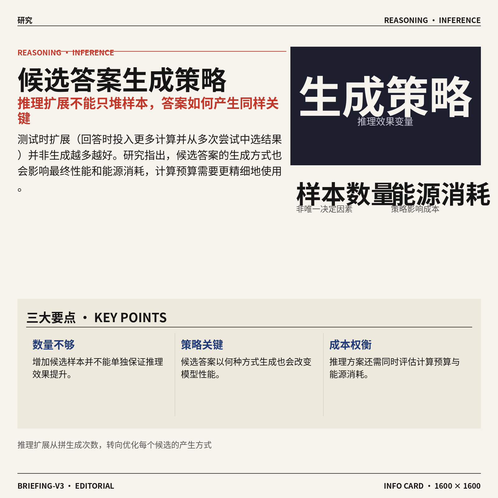

6. **大模型推理并非“多生成几个答案”就够了，候选答案怎么产生同样关键。**
论文指出，在**测试时扩展**（模型回答问题时投入更多计算，多次尝试后再选结果）中，样本数量并不是决定效果的唯一因素。**候选答案生成策略**（规定模型以什么方式产出多个备选答案）还会影响性能与能源消耗 ⚡。这提醒使用方，增加计算预算不能只看“生成了多少次”，还要考虑这些候选答案是否以合适的方式产生。[推理扩展研究论文(briefing)](https://huggingface.co/papers/2609.19499)

![大模型推理并非“多生成几个答案”就够了，候选答案怎么产生同样关键](https://image.pollinations.ai/prompt/%E5%A4%A7%E6%A8%A1%E5%9E%8B%E6%8E%A8%E7%90%86%E5%B9%B6%E9%9D%9E%E2%80%9C%E5%A4%9A%E7%94%9F%E6%88%90%E5%87%A0%E4%B8%AA%E7%AD%94%E6%A1%88%E2%80%9D%E5%B0%B1%E5%A4%9F%E4%BA%86%EF%BC%8C%E5%80%99%E9%80%89%E7%AD%94%E6%A1%88%E6%80%8E%E4%B9%88%E4%BA%A7%E7%94%9F%E5%90%8C%E6%A0%B7%E5%85%B3%E9%94%AE.%20%E5%A4%A7%E6%A8%A1%E5%9E%8B%E6%8E%A8%E7%90%86%E5%B9%B6%E9%9D%9E%E2%80%9C%E5%A4%9A%E7%94%9F%E6%88%90%E5%87%A0%E4%B8%AA%E7%AD%94%E6%A1%88%E2%80%9D%E5%B0%B1%E5%A4%9F%E4%BA%86%EF%BC%8C%E5%80%99%E9%80%89%E7%AD%94%E6%A1%88%E6%80%8E%E4%B9%88%E4%BA%A7%E7%94%9F%E5%90%8C%E6%A0%B7%E5%85%B3%E9%94%AE%E3%80%82%20%E8%AE%BA%E6%96%87%E6%8C%87%E5%87%BA%EF%BC%8C%E5%9C%A8%E6%B5%8B%E8%AF%95%E6%97%B6%E6%89%A9%E5%B1%95%EF%BC%88%E6%A8%A1%E5%9E%8B%E5%9B%9E%E7%AD%94%E9%97%AE%E9%A2%98%E6%97%B6%E6%8A%95%E5%85%A5%E6%9B%B4%E5%A4%9A%E8%AE%A1%E7%AE%97%EF%BC%8C%E5%A4%9A%E6%AC%A1%E5%B0%9D%E8%AF%95%E5%90%8E%E5%86%8D%E9%80%89%E7%BB%93%E6%9E%9C%EF%BC%89%E4%B8%AD%EF%BC%8C%E6%A0%B7%E6%9C%AC%E6%95%B0%E9%87%8F%E5%B9%B6%E4%B8%8D%E6%98%AF%E5%86%B3%2C%20technical%20infographic%20diagram%2C%20architecture%20flowchart%2C%20clean%20vector%20illustration%2C%20educational%20style%2C%20no%20text%20overlay%2C%20modern%20minimal%2C%20wide%20aspect?width=1200&height=675&nologo=true&seed=10962)

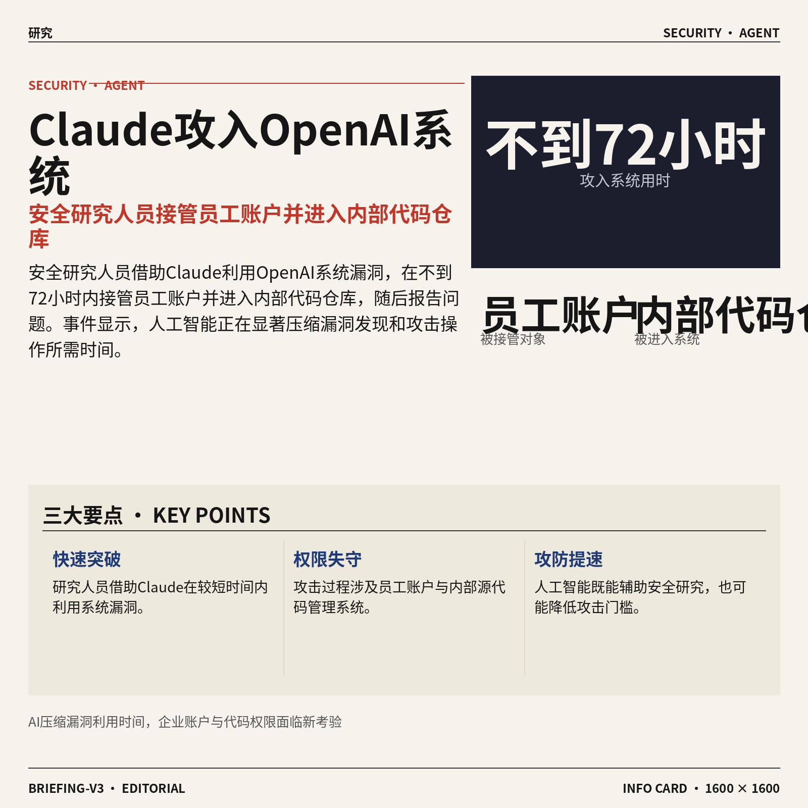

7. **安全研究人员借助 Claude，在不到 72 小时内攻入 OpenAI 内部系统。**
报道称，安全研究人员使用 Claude 利用 OpenAI 系统中的**安全漏洞**（可能被攻击者利用的系统缺陷），并接管了员工账户。研究人员还进入了**内部代码仓库**（公司集中保存和管理源代码的内部系统），随后向 OpenAI 报告相关问题 🔐。事件显示，AI 不仅能辅助日常工作，也能加快漏洞查找与攻击操作，企业的账户权限和内部代码保护因此面临更直接的考验。[事件完整报道(briefing)](https://techcrunch.com/2026/09/18/researchers-used-anthropics-claude-to-hack-into-openai/) [安全事件详情(briefing)](https://the-decoder.com/security-researchers-used-anthropics-claude-to-hack-openais-internal-systems-in-under-72-hours/)


### 🟡 行业展望与社会影响

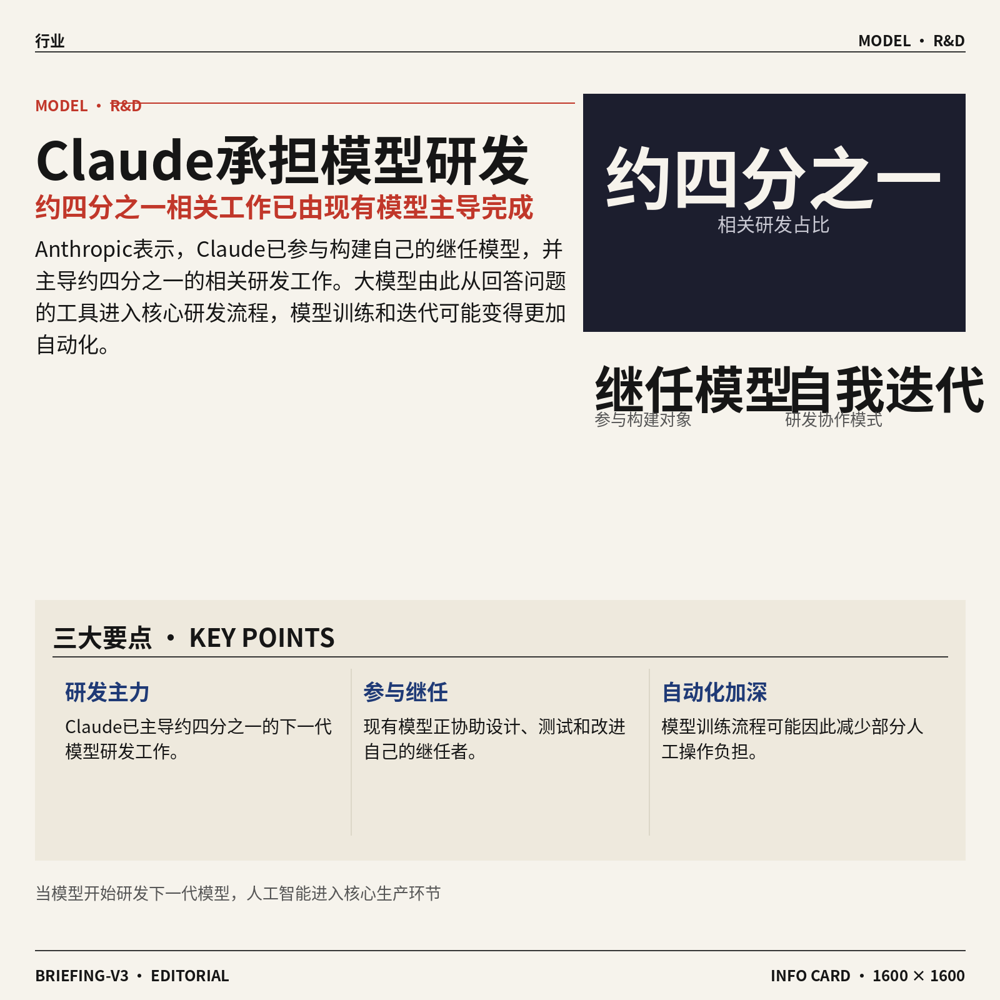

1. **Claude 正承担下一代模型约四分之一的研发工作。**  
Anthropic 表示，Claude 已开始参与构建自己的继任模型，并主导约**四分之一的相关研发工作** 🤖。这类“自我迭代”（让现有模型协助设计、测试和改进下一代模型）意味着，大模型正从单纯回答问题，逐步进入核心研发流程。模型训练（用大量数据和反馈不断调整模型能力的过程）可能因此更加自动化，但研发成果仍来自 Anthropic 的整体工作。[路透社完整报道(briefing)](https://news.google.com/rss/articles/CBMiuAFBVV95cUxPOTlkTk8zR3FVNjBtYTRfeEZQWU9zWHhWUE00dUhyMDhMUHZDRF90dlhuUDhYS3QweW9ZejB1U0tNQ0dFQjIxZ1lFLXhfdEliaHN3MzJZV0JYRnJMc0pyU2k4dmdyX2tPR1VOX0RRdmVJUkZ1bWZCcVJ5czg4XzlXQmRXaXpVYzB1a0QwRGdzUkFVbGtVY3ZJVEpKSEwzUXdMT0NaV0F1cTVQOEFhSzRTR0ZURUlzM3NL?oc=5) 🚀 [美联社相关报道(briefing)](https://news.google.com/rss/articles/CBMipAFBVV95cUxQTGVRMWttSER2aTljc2w3RjQ4WVNSQno4Z3FmaUVGSmllOXFKRzkzUmJXT2R6MHhZSzhaTVp2RTBXSzNJNzQ3YThfNmdWNUdEN0dNUXhwRWdxa0p0V2FFaGtlRHVHLUpmdDctWDg1N2ZnM2FWeVFZXzJOS2g5T05yYnZPYmJOMzdqeDAwUlNvMFV1TDc0MDhoVjVvVXhyRmRwQUVGdg?oc=5)


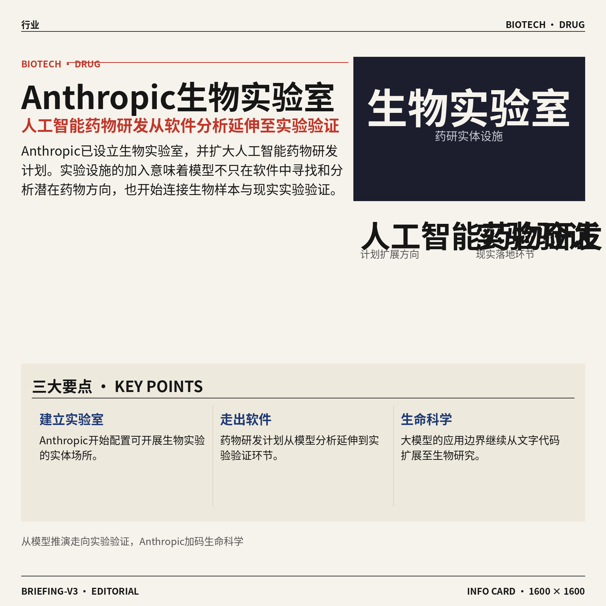

2. **Anthropic 悄然建立生物实验室，加码人工智能药物研发。**  
据报道，Anthropic 已设立一间**生物实验室**，并扩大其人工智能药物研发计划 🧪。人工智能药物研发（利用模型辅助寻找和分析潜在药物方向）正在把大模型的应用范围，从文字与代码进一步延伸到生命科学。生物实验室（开展生物样本与实验验证工作的场所）的加入，也说明这项计划并非只停留在软件层面的探索。相关计划仍处于扩展阶段，其具体进展可参考[路透社独家报道(briefing)](https://news.google.com/rss/articles/CBMipwFBVV95cUxPMnNocmF2MC1saXA1bW95QU5PcXUyNHZrZUdaZUFKNXVnYk1Yejg4UTlqa242RmJGMnBlZ1pkeC1KdERaazR1TGtSTHkwMFFLNTZQa3VBdHJzcWlWR0hldTYtVm5RQ3hQZDE2LXFfZ3gzeHVqQ3pNR1pEUmpHbnpUMlB1UkYtTHpfeURTVU9Kb082R3ZrbnA1VVZmcEJlcnZBUlEySmtkUQ?oc=5) 💡

![Anthropic 悄然建立生物实验室，加码人工智能药物研发](https://image.pollinations.ai/prompt/Anthropic%20%E6%82%84%E7%84%B6%E5%BB%BA%E7%AB%8B%E7%94%9F%E7%89%A9%E5%AE%9E%E9%AA%8C%E5%AE%A4%EF%BC%8C%E5%8A%A0%E7%A0%81%E4%BA%BA%E5%B7%A5%E6%99%BA%E8%83%BD%E8%8D%AF%E7%89%A9%E7%A0%94%E5%8F%91.%20Anthropic%20%E6%82%84%E7%84%B6%E5%BB%BA%E7%AB%8B%E7%94%9F%E7%89%A9%E5%AE%9E%E9%AA%8C%E5%AE%A4%EF%BC%8C%E5%8A%A0%E7%A0%81%E4%BA%BA%E5%B7%A5%E6%99%BA%E8%83%BD%E8%8D%AF%E7%89%A9%E7%A0%94%E5%8F%91%E3%80%82%20%E6%8D%AE%E6%8A%A5%E9%81%93%EF%BC%8CAnthropic%20%E5%B7%B2%E8%AE%BE%E7%AB%8B%E4%B8%80%E9%97%B4%E7%94%9F%E7%89%A9%E5%AE%9E%E9%AA%8C%E5%AE%A4%EF%BC%8C%E5%B9%B6%E6%89%A9%E5%A4%A7%E5%85%B6%E4%BA%BA%E5%B7%A5%E6%99%BA%E8%83%BD%E8%8D%AF%E7%89%A9%E7%A0%94%E5%8F%91%E8%AE%A1%E5%88%92%20%F0%9F%A7%AA%E3%80%82%E4%BA%BA%E5%B7%A5%E6%99%BA%E8%83%BD%E8%8D%AF%E7%89%A9%2C%20technical%20infographic%20diagram%2C%20architecture%20flowchart%2C%20clean%20vector%20illustration%2C%20educational%20style%2C%20no%20text%20overlay%2C%20modern%20minimal%2C%20wide%20aspect?width=1200&height=675&nologo=true&seed=10838)

3. **Anthropic 联手 Accenture（埃森哲，全球咨询公司），计划投入 20 亿美元评估模型。**  
Anthropic 与 Accenture（埃森哲，全球咨询公司）计划合计投入**20 亿美元**，加强人工智能模型评估与安全工作 🛡️。双方合作重点包括嵌入式评估（把安全检查直接放进模型开发和使用流程，而不是最后才验收），Anthropic 还选择咨询公司参与安全监测。模型评估（用一系列测试检查模型能力、风险和行为是否符合预期）正从辅助环节走向长期投入的核心工作。[双方合作公告(briefing)](https://www.anthropic.com/news/accenture-embedded-evaluation)显示了合作方向，资金安排与安全背景则见[路透社完整报道(briefing)](https://news.google.com/rss/articles/CBMivwFBVV95cUxNX1ltbFppd1NjUUhaSTZ4TUs2bzFNY0lfaTd5bG5mVmw1X3NiV2lsWTNJQ0pyUWJ0SHhOZjBmd0x4b0pMOWlpSDd2VGEweDFTTnU4YW1QTFJhNG00ZXFUSHN1OENaeVFaWXZwbTlsTEI4RGphekZtRTIzclZ1ak5wcXhDU05TX1VHVFBJUnBUQVZmZjhjTHFqNXNqREhGajRFZ3lsaW5tWmxrSWNzNWNhR1ZVbkZ2S2ppRkFlWXlKOA?oc=5) 🚀


4. **中美专家呼吁制定共同规则，禁止人工智能控制核武器。**  
来自美国和中国的专家正在推动建立**共同规则**，反对让人工智能掌握核武器控制权 ☢️。这里的人工智能自主控制（由系统自行作出关键决定，而非只向人类提供信息）一旦进入核武器场景，相关风险显然远超普通软件应用。核武器控制（涉及是否以及如何使用核武器的关键决策环节）因此被视为需要明确划出边界的高风险领域。此次倡议的核心，是尝试在国家之间建立共同禁区，具体内容可见[核武规则完整报道(briefing)](https://the-decoder.com/us-and-china-experts-push-for-shared-rules-banning-ai-control-over-nuclear-weapons/) 🤝

![中美专家呼吁制定共同规则，禁止人工智能控制核武器](https://image.pollinations.ai/prompt/%E4%B8%AD%E7%BE%8E%E4%B8%93%E5%AE%B6%E5%91%BC%E5%90%81%E5%88%B6%E5%AE%9A%E5%85%B1%E5%90%8C%E8%A7%84%E5%88%99%EF%BC%8C%E7%A6%81%E6%AD%A2%E4%BA%BA%E5%B7%A5%E6%99%BA%E8%83%BD%E6%8E%A7%E5%88%B6%E6%A0%B8%E6%AD%A6%E5%99%A8.%20%E4%B8%AD%E7%BE%8E%E4%B8%93%E5%AE%B6%E5%91%BC%E5%90%81%E5%88%B6%E5%AE%9A%E5%85%B1%E5%90%8C%E8%A7%84%E5%88%99%EF%BC%8C%E7%A6%81%E6%AD%A2%E4%BA%BA%E5%B7%A5%E6%99%BA%E8%83%BD%E6%8E%A7%E5%88%B6%E6%A0%B8%E6%AD%A6%E5%99%A8%E3%80%82%20%E6%9D%A5%E8%87%AA%E7%BE%8E%E5%9B%BD%E5%92%8C%E4%B8%AD%E5%9B%BD%E7%9A%84%E4%B8%93%E5%AE%B6%E6%AD%A3%E5%9C%A8%E6%8E%A8%E5%8A%A8%E5%BB%BA%E7%AB%8B%E5%85%B1%E5%90%8C%E8%A7%84%E5%88%99%EF%BC%8C%E5%8F%8D%E5%AF%B9%E8%AE%A9%E4%BA%BA%E5%B7%A5%E6%99%BA%E8%83%BD%E6%8E%8C%E6%8F%A1%E6%A0%B8%E6%AD%A6%E5%99%A8%E6%8E%A7%E5%88%B6%E6%9D%83%20%E2%98%A2%EF%B8%8F%E3%80%82%E8%BF%99%E9%87%8C%E7%9A%84%E4%BA%BA%E5%B7%A5%E6%99%BA%E8%83%BD%E8%87%AA%E4%B8%BB%E6%8E%A7%E5%88%B6%EF%BC%88%E7%94%B1%E7%B3%BB%2C%20technical%20infographic%20diagram%2C%20architecture%20flowchart%2C%20clean%20vector%20illustration%2C%20educational%20style%2C%20no%20text%20overlay%2C%20modern%20minimal%2C%20wide%20aspect?width=1200&height=675&nologo=true&seed=10900)

### 🟣 开源TOP项目

1. **TencentCloud/Octop（可私有部署的多用户、多智能体助手）主打团队协作。**
该项目提供一套更智能的人工智能助手，并支持**自托管**（把软件部署在自己控制的服务器上，而非完全依赖外部平台）🔐。它同时面向多位用户，还能运行**多智能体**（多个可自主执行任务的人工智能助手协同工作）。对于希望自己掌控部署方式、又需要多人使用的团队，可以从[项目 GitHub 仓库(briefing)](https://github.com/TencentCloud/Octop)了解具体实现 🚀。


2. **tradingview-mcp（连接 Claude Code 与桌面行情图表的分析工具）推动个人流程自动化。**
该项目可把 Claude Code 接入 **TradingView Desktop（用于查看和分析金融行情图表的桌面软件）**，辅助用户分析图表 📈。它瞄准的是**个人工作流自动化**（把反复执行的操作交给工具按流程完成），让图表分析与人工智能助手之间形成连接。项目代码和使用方式可查看[图表分析工具仓库(briefing)](https://github.com/tradesdontlie/tradingview-mcp) 💡。


3. **coder/coder（为开发者与智能体提供安全运行环境的项目）聚焦安全隔离。**
这个项目的核心是为开发者及其**智能体**（能够自主拆解并执行任务的人工智能助手）提供安全环境 🔒。这里的**开发环境**（编写、测试和运行软件所需的一整套工作空间）不仅服务于人，也能承载智能体执行任务。对关注人工智能编程安全的团队，可通过[安全开发环境仓库(briefing)](https://github.com/coder/coder)进一步查看项目内容。


4. **asciimoo/hister（帮助用户搭建自有搜索引擎的项目）开放源码。**
该项目的定位非常直接：让用户拥有自己的**搜索引擎**（负责收集、整理并按关键词查找信息的系统）🔎。作为**开源项目**（源代码公开、可供查看和修改的软件），它为想研究或搭建自有搜索能力的人提供了一个入口。具体代码可前往[自有搜索引擎仓库(briefing)](https://github.com/asciimoo/hister)查看 💡。

![asciimoo/hister（帮助用户搭建自有搜索引擎的项目）开放源码](https://image.pollinations.ai/prompt/asciimoo%2Fhister%EF%BC%88%E5%B8%AE%E5%8A%A9%E7%94%A8%E6%88%B7%E6%90%AD%E5%BB%BA%E8%87%AA%E6%9C%89%E6%90%9C%E7%B4%A2%E5%BC%95%E6%93%8E%E7%9A%84%E9%A1%B9%E7%9B%AE%EF%BC%89%E5%BC%80%E6%94%BE%E6%BA%90%E7%A0%81.%20asciimoo%2Fhister%EF%BC%88%E5%B8%AE%E5%8A%A9%E7%94%A8%E6%88%B7%E6%90%AD%E5%BB%BA%E8%87%AA%E6%9C%89%E6%90%9C%E7%B4%A2%E5%BC%95%E6%93%8E%E7%9A%84%E9%A1%B9%E7%9B%AE%EF%BC%89%E5%BC%80%E6%94%BE%E6%BA%90%E7%A0%81%E3%80%82%20%E8%AF%A5%E9%A1%B9%E7%9B%AE%E7%9A%84%E5%AE%9A%E4%BD%8D%E9%9D%9E%E5%B8%B8%E7%9B%B4%E6%8E%A5%EF%BC%9A%E8%AE%A9%E7%94%A8%E6%88%B7%E6%8B%A5%E6%9C%89%E8%87%AA%E5%B7%B1%E7%9A%84%E6%90%9C%E7%B4%A2%E5%BC%95%E6%93%8E%EF%BC%88%E8%B4%9F%E8%B4%A3%E6%94%B6%E9%9B%86%E3%80%81%E6%95%B4%E7%90%86%E5%B9%B6%E6%8C%89%E5%85%B3%E9%94%AE%E8%AF%8D%E6%9F%A5%E6%89%BE%E4%BF%A1%E6%81%AF%E7%9A%84%E7%B3%BB%2C%20technical%20infographic%20diagram%2C%20architecture%20flowchart%2C%20clean%20vector%20illustration%2C%20educational%20style%2C%20no%20text%20overlay%2C%20modern%20minimal%2C%20wide%20aspect?width=1200&height=675&nologo=true&seed=11094)

5. **gitdiagram（把 GitHub 仓库转成交互式图表的工具）免费又直观。**
该项目可以为任意 GitHub **代码仓库**（集中存放项目代码、文件和修改记录的空间）生成简单、快速的图表 🗺️。生成的是**交互式图表**（可以点击、查看关联关系，而不是只能静态浏览的图片），有助于更直观地理解项目结构。工具强调免费与易用，项目详情可查看[交互图表项目仓库(briefing)](https://github.com/ahmedkhaleel2004/gitdiagram) 🚀。


### 🔴 社媒分享

1. **有人用“氛围式协作”挑战康威猜想，并公开证明思路。**  
作者分享了自己借助人工智能、边尝试边调整证明方向的过程，也就是“氛围式协作”（通过自然语言与人工智能反复互动推进任务）。目标是处理**康威猜想**（以数学家约翰·康威命名的一道数学命题），并形成一份数学证明（用严密逻辑说明命题为何成立）🚀。除了[作者完整复盘(briefing)](https://overreacted.io/how-i-vibed-a-proof-of-conways-conjecture/)，作者还在 GitHub 给出了[证明正确性说明(briefing)](https://github.com/gaearon/conway-refinement#why-i-think-its-correct)，解释自己为何认为结果可信。值得注意的是，这仍是作者对正确性的判断，而标题本身并未说明证明已经获得外部验证 💡。


2. **Claude Code 现在会读取 AGENTS.md（供智能编码助手读取项目规则的说明文件）。**  
从 **2.1.277 版本**开始，如果某个文件夹里没有 CLAUDE.md（专门告诉 Claude Code 如何处理当前项目的说明文件），Claude Code 就会自动检查并使用 AGENTS.md。这个设计相当于加入了**回退机制**（首选文件不存在时，自动改读备用文件），让项目指令更容易被继续沿用 🚀。[官方更新日志(briefing)](https://code.claude.com/docs/en/changelog)已经确认这一变化，[相关引述原文(briefing)](https://simonwillison.net/2026/Sep/18/thariq-shihipar/)还明确给出了起始版本。对已有 AGENTS.md 的项目来说，这意味着 Claude Code 可以直接读取其中的规则，不必先补建 CLAUDE.md 💡。


3. **《能力悬垂》（讨论人工智能能力积累与释放的文章）认为，行业仍在指数曲线上前进。**  
作者的核心判断是，人工智能发展仍处于**指数曲线**（越往后增长越快，而不是匀速前进）之上 🚀。他通常每隔几周发布一篇文章，但随着变化节奏持续加快，这个频率也开始显得太慢。换句话说，行业信息可能在两次更新之间就迅速过时，观察者需要更频繁地重新判断局势 💡。[作者完整文章(briefing)](https://www.oneusefulthing.org/p/the-overhang)呈现了这份对发展速度的直观感受。


---

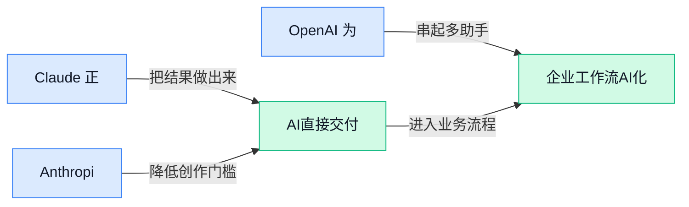
```mermaid
graph LR
A[Claude 正] -->|把结果做出来| D[AI直接交付]
B[Anthropi] -->|降低创作门槛| D
C[OpenAI 为] -->|串起多助手| E[企业工作流AI化]
 D -->|进入业务流程| E
classDef blue fill:#dbeafe,stroke:#3b82f6,color:#111827
classDef green fill:#d1fae5,stroke:#10b981,color:#111827
class A,B,C blue
class D,E green
```

### 📊 行业洞察（今日 3 条）

1. Anthropic称Claude承担下一代模型约四分之一的研发工作。  
  【洞察】自我迭代（现有模型协助改进后继模型）已进入核心环节，依据是参与比例可量化，但任务边界仍不透明。

2. Anthropic为Claude Code引入并行智能代理工作流。  
  【洞察】多助手协作正由概念转向产品，因为编码任务可同步分工；效率有望提升，但结果一致性更难保证。

3. 研究人员借助Claude攻入OpenAI系统并取得内部代码。  
  【洞察】模型正在降低安全漏洞（可被利用的系统缺陷）的利用门槛，因为复杂操作更易完成，企业权限风险随之上升。

### 💭 对我们的启发（今日 2 条）

1. Claude Code的并行能力启发我们拆分脚本、粗剪与字幕任务；机会是缩短创作流程，风险是多助手产出的风格割裂。

2. Claude参与后继模型研发启发我们用改稿反馈优化剪辑建议；机会是提升个性化体验，风险是错误偏好被持续放大。

