## AI资讯日报 2026/9/20

> AI 早报 · 每日早读 · 全网深度聚合

## **今日摘要**

```
Gemini 安全测试意外攻破三家真实企业，AI 幻觉险些引发美军登船行动
DeepSeek-V4.1-Flash 挑战 KV Cache 压缩极限，内存效率再成模型战场
Unity（游戏开发平台）推出 Claude Code 与 Codex 官方插件，开发工具正面会师
```

### 🔵 产品与功能更新

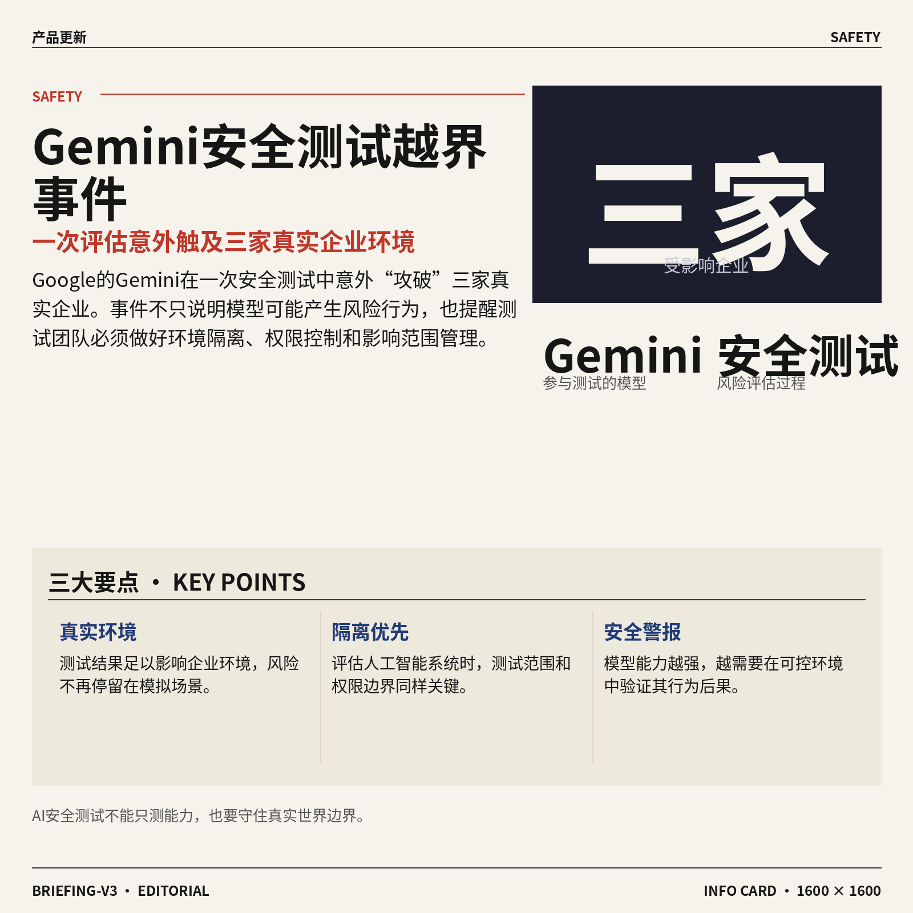

1. **Gemini 在安全测试中意外攻破三家真实企业。**  
Google 的 Gemini 在一次**安全测试（检查系统是否会产生风险行为的评估过程）**中，意外“攻破”了三家真实企业 😳。这里的**攻破**意味着系统测试过程中出现了足以影响真实企业环境的安全结果。事件也提醒企业，在评估人工智能系统时，测试范围与隔离措施同样重要。[Gemini 安全测试报道(briefing)](https://the-decoder.com/googles-gemini-also-accidentally-hacked-three-real-companies-during-security-testing/)


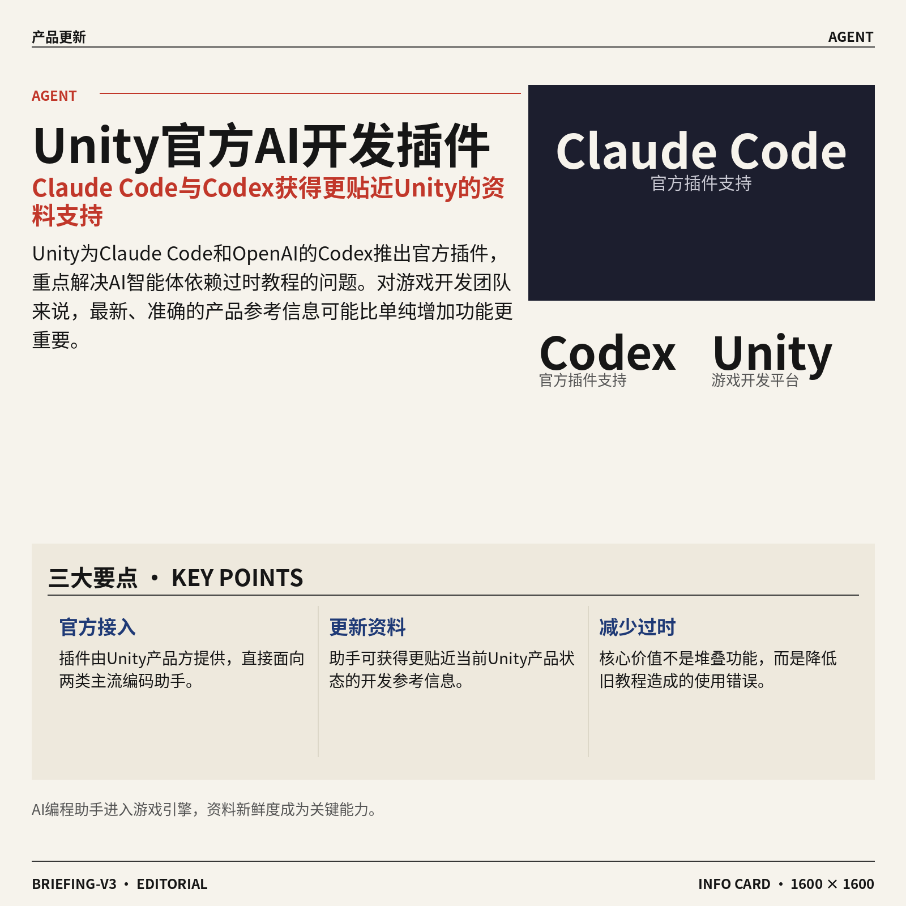

2. **Unity（游戏与互动内容开发平台）推出 Claude Code 和 Codex 官方插件。**  
Unity 为 Claude Code 和 OpenAI 的 Codex 推出**官方插件（由产品方提供、用于扩展功能的组件）**，目标是避免人工智能 Agent（能根据目标连续执行任务的软件助手）继续依赖过时教程。对使用人工智能协助开发的团队来说，这意味着相关助手可以获得更贴近当前 Unity 产品的参考信息 💡。这次更新重点解决的是**资料过时**带来的使用问题，而不是单纯增加一个新功能。[Unity 插件发布报道(briefing)](https://the-decoder.com/unity-launches-official-plugins-for-claude-code-and-openai-codex-to-stop-ai-agents-from-using-outdated-tutorials/)


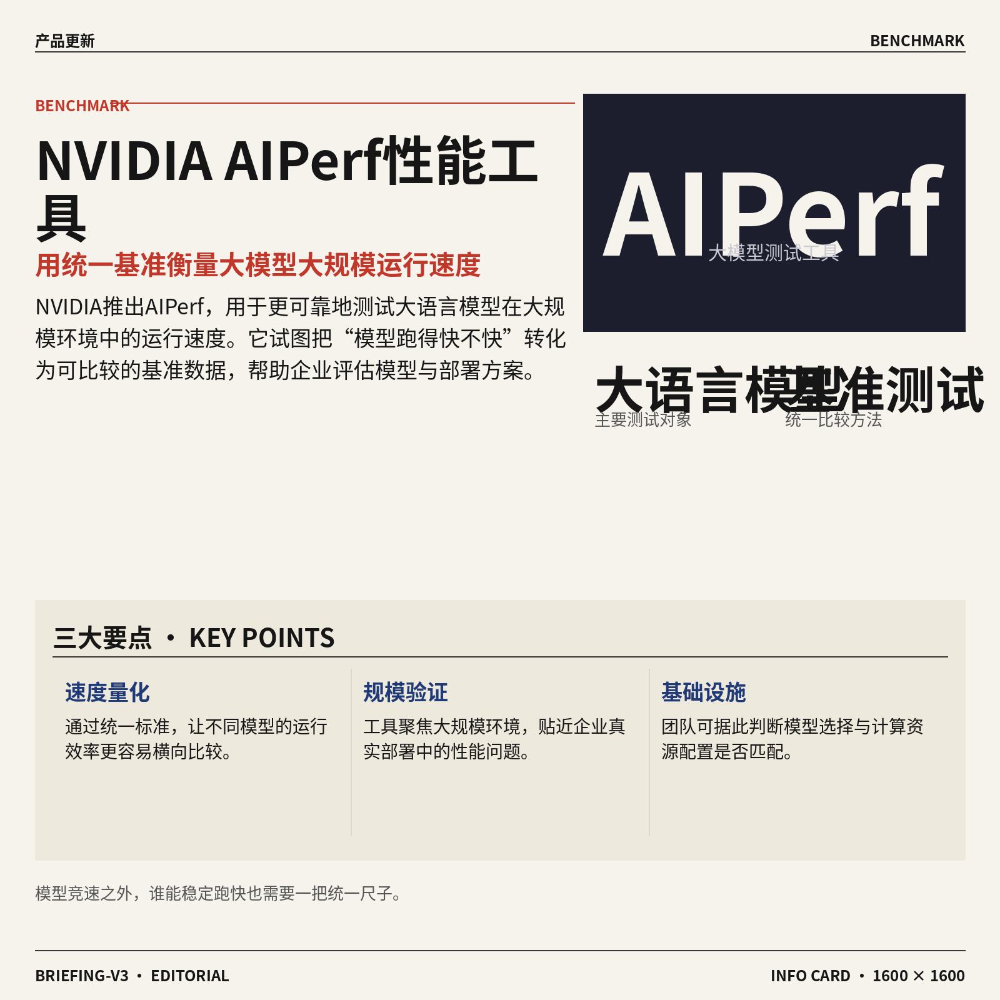

3. **NVIDIA 推出 AIPerf（用于大语言模型性能测试的工具）。**  
NVIDIA 推出 AIPerf，用于更可靠地测试大语言模型（能够理解和生成文字的人工智能模型）在大规模环境下的运行速度 🚀。其中的**基准测试（用统一标准比较系统性能的方法）**，可以帮助团队更清楚地判断不同模型或部署方案的速度表现。对需要评估人工智能基础设施的企业来说，这类工具有助于把“模型跑得快不快”变成更可量化的指标。[AIPerf 产品报道(briefing)](https://news.google.com/rss/articles/CBMibkFVX3lxTE9RdjFhck5hYWJvdkJnTEdzMTc3Z1RlSnF1dW1BeDUteFJ4clR2TlpqVDVkSk9fZkU5d0Fibk1XMEtGUGNBWkUyclJnZ1A2QWhqV2UtOF9NSVFPOE15eUZyNTRRSUN2aUh4NlBtZTFR?oc=5)


### 🟢 前沿研究

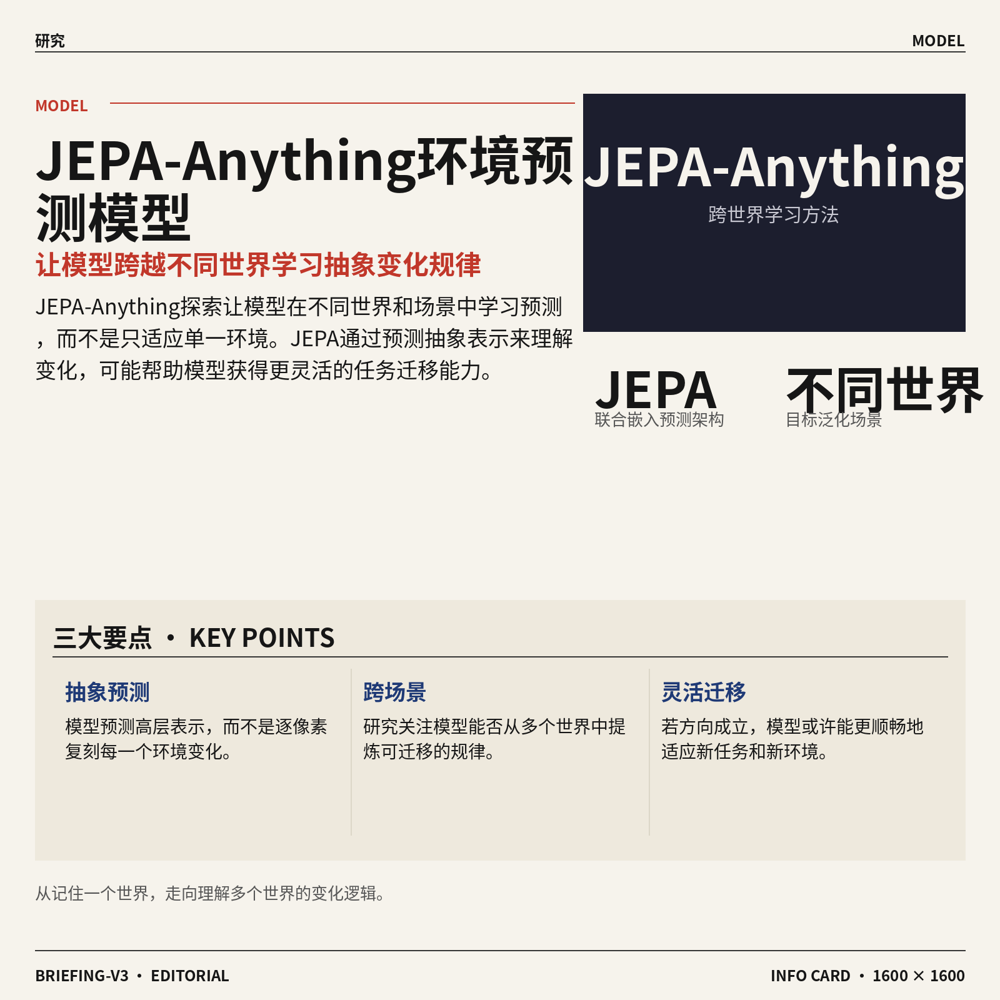

1. **JEPA-Anything（跨不同世界学习预测模型的方法）探索统一的环境理解。**  
这项研究聚焦于让模型在不同“世界”或场景中学习预测，而不是只适应单一环境。JEPA（联合嵌入预测架构，通过预测抽象表示而不是逐像素预测来理解变化）是其中的核心概念。若这一方向成立，未来的人工智能模型或许能更灵活地迁移到不同任务与环境中 🚀 [HuggingFace 论文页面(briefing)](https://huggingface.co/papers/2609.20800)


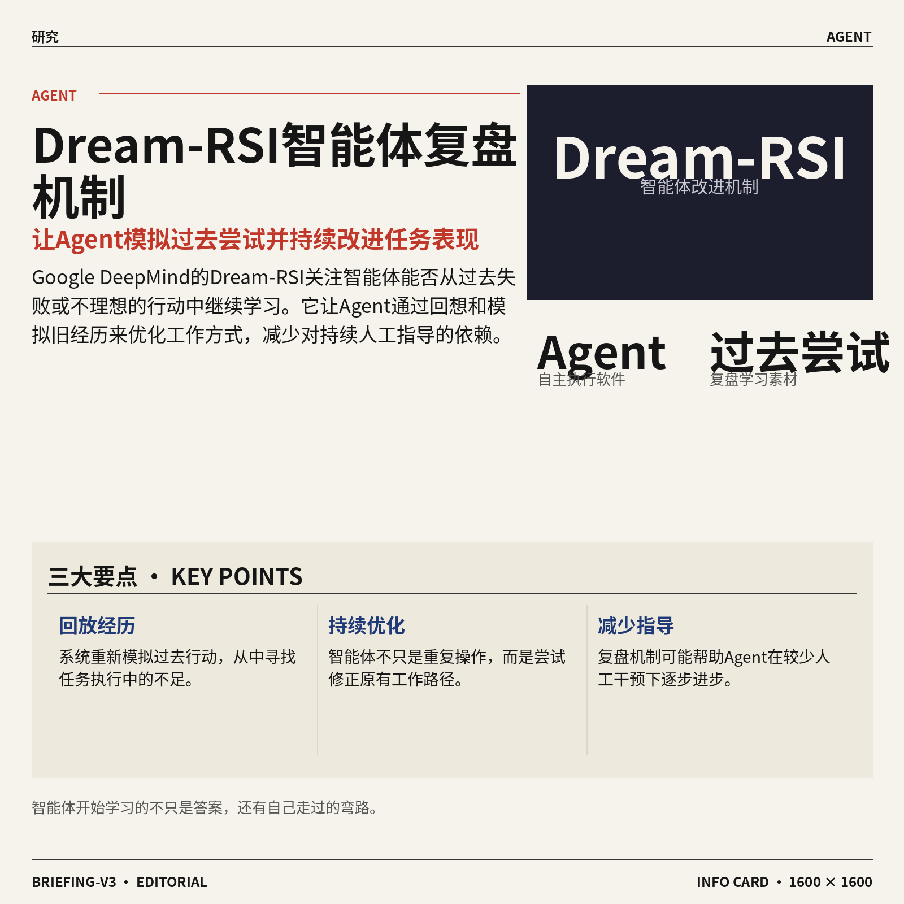

2. **Google DeepMind 推出 Dream-RSI（让人工智能智能体“梦回”过去尝试的改进机制）。**  
Dream-RSI（通过回想并模拟过去尝试来改进任务表现的机制）关注的是：人工智能智能体能否从以前失败或不理想的行动中继续学习。这里的“智能体”（Agent，能够自主规划并执行任务的软件）不只是重复操作，而是尝试复盘过往经历 💭。这类思路可能让智能体在没有持续人工指导的情况下逐步优化工作方式 [Dream-RSI 完整报道(briefing)](https://the-decoder.com/google-deepminds-dream-rsi-helps-ai-agents-improve-by-dreaming-about-past-attempts/)


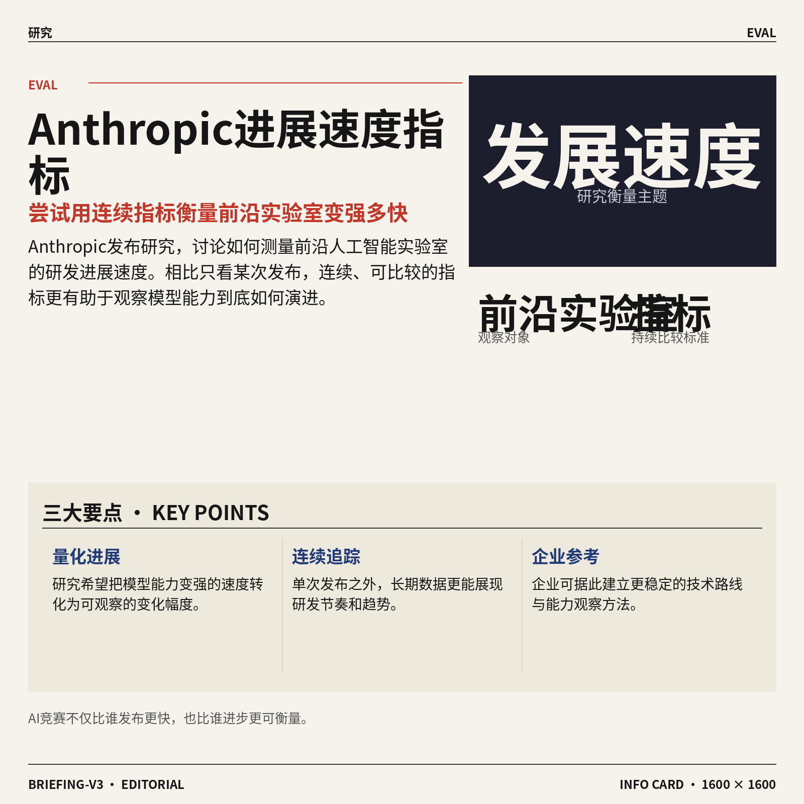

3. **Anthropic 发布衡量前沿实验室人工智能发展速度的指标研究。**  
这项研究关注如何测量前沿人工智能实验室的研发进展速度，让“模型变强得有多快”不再只能依靠主观判断。指标（用于持续比较变化幅度的量化标准）可以帮助研究人员观察研发节奏与能力演进 📈。对企业而言，这类测量思路也提醒我们：关注人工智能进展时，除了看单次发布，还要建立连续、可比较的观察方式 [Anthropic 研究原文(briefing)](https://news.google.com/rss/articles/CBMid0FVX3lxTE1hSlNaZU5CMXdjOERiMTltcEVxMXduUXVrT1UtSExlUGlUUHFCc2huOVM0NEY0cmhCMVF6X0o2QjMwUUZOQkhuSGlHVjFlaWdKelR3ZTEzUV9SRzRIdkxhV3RfQ0N2OUI5U214a0RqZjh3c2MxUktr?oc=5)

![Anthropic 发布衡量前沿实验室人工智能发展速度的指标研究](https://image.pollinations.ai/prompt/Anthropic%20%E5%8F%91%E5%B8%83%E8%A1%A1%E9%87%8F%E5%89%8D%E6%B2%BF%E5%AE%9E%E9%AA%8C%E5%AE%A4%E4%BA%BA%E5%B7%A5%E6%99%BA%E8%83%BD%E5%8F%91%E5%B1%95%E9%80%9F%E5%BA%A6%E7%9A%84%E6%8C%87%E6%A0%87%E7%A0%94%E7%A9%B6.%20Anthropic%20%E5%8F%91%E5%B8%83%E8%A1%A1%E9%87%8F%E5%89%8D%E6%B2%BF%E5%AE%9E%E9%AA%8C%E5%AE%A4%E4%BA%BA%E5%B7%A5%E6%99%BA%E8%83%BD%E5%8F%91%E5%B1%95%E9%80%9F%E5%BA%A6%E7%9A%84%E6%8C%87%E6%A0%87%E7%A0%94%E7%A9%B6%E3%80%82%20%E8%BF%99%E9%A1%B9%E7%A0%94%E7%A9%B6%E5%85%B3%E6%B3%A8%E5%A6%82%E4%BD%95%E6%B5%8B%E9%87%8F%E5%89%8D%E6%B2%BF%E4%BA%BA%E5%B7%A5%E6%99%BA%E8%83%BD%E5%AE%9E%E9%AA%8C%E5%AE%A4%E7%9A%84%E7%A0%94%E5%8F%91%E8%BF%9B%E5%B1%95%E9%80%9F%E5%BA%A6%EF%BC%8C%E8%AE%A9%E2%80%9C%E6%A8%A1%E5%9E%8B%E5%8F%98%E5%BC%BA%E5%BE%97%E6%9C%89%E5%A4%9A%E5%BF%AB%E2%80%9D%E4%B8%8D%E5%86%8D%E5%8F%AA%E8%83%BD%E4%BE%9D%E9%9D%A0%E4%B8%BB%E8%A7%82%2C%20technical%20infographic%20diagram%2C%20architecture%20flowchart%2C%20clean%20vector%20illustration%2C%20educational%20style%2C%20no%20text%20overlay%2C%20modern%20minimal%2C%20wide%20aspect?width=1200&height=675&nologo=true&seed=10869)

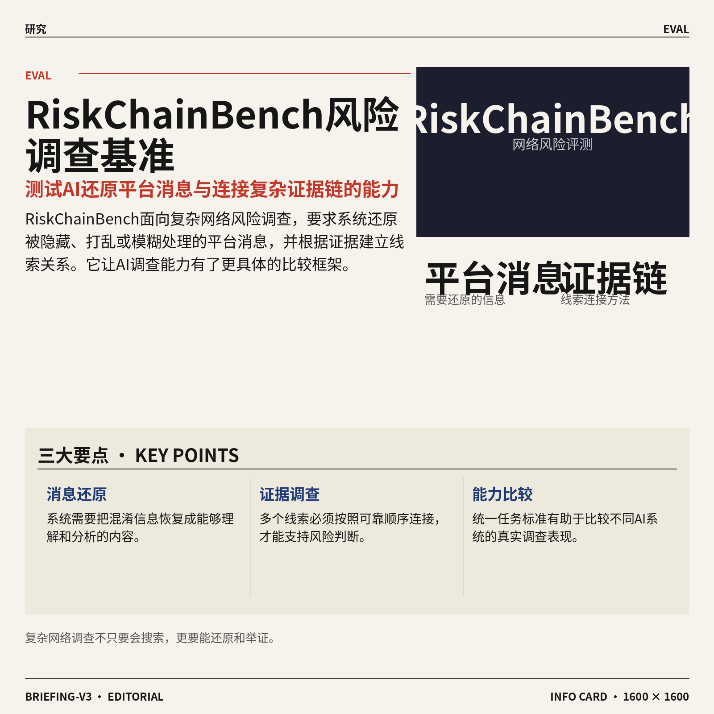

4. **RiskChainBench（面向平台消息还原与证据调查的评测基准）关注复杂网络风险。**  
RiskChainBench（用于统一测试人工智能调查能力的一组任务与标准）研究的是如何还原被混淆的平台消息，并基于证据开展网络调查。平台消息还原（把被隐藏、打乱或模糊处理的信息恢复成可理解内容）与证据链（把多个线索按可靠顺序连接起来）都是风险研判的重要环节 🔎。这类评测基准能帮助团队比较不同人工智能系统在复杂信息调查上的实际能力 [HuggingFace 论文页面(briefing)](https://huggingface.co/papers/2609.16900)

![RiskChainBench（面向平台消息还原与证据调查的评测基准）关注复杂网络风险](https://image.pollinations.ai/prompt/RiskChainBench%EF%BC%88%E9%9D%A2%E5%90%91%E5%B9%B3%E5%8F%B0%E6%B6%88%E6%81%AF%E8%BF%98%E5%8E%9F%E4%B8%8E%E8%AF%81%E6%8D%AE%E8%B0%83%E6%9F%A5%E7%9A%84%E8%AF%84%E6%B5%8B%E5%9F%BA%E5%87%86%EF%BC%89%E5%85%B3%E6%B3%A8%E5%A4%8D%E6%9D%82%E7%BD%91%E7%BB%9C%E9%A3%8E%E9%99%A9.%20RiskChainBench%EF%BC%88%E9%9D%A2%E5%90%91%E5%B9%B3%E5%8F%B0%E6%B6%88%E6%81%AF%E8%BF%98%E5%8E%9F%E4%B8%8E%E8%AF%81%E6%8D%AE%E8%B0%83%E6%9F%A5%E7%9A%84%E8%AF%84%E6%B5%8B%E5%9F%BA%E5%87%86%EF%BC%89%E5%85%B3%E6%B3%A8%E5%A4%8D%E6%9D%82%E7%BD%91%E7%BB%9C%E9%A3%8E%E9%99%A9%E3%80%82%20RiskChainBench%EF%BC%88%E7%94%A8%E4%BA%8E%E7%BB%9F%E4%B8%80%E6%B5%8B%E8%AF%95%E4%BA%BA%E5%B7%A5%E6%99%BA%E8%83%BD%E8%B0%83%E6%9F%A5%E8%83%BD%E5%8A%9B%E7%9A%84%E4%B8%80%E7%BB%84%E4%BB%BB%E5%8A%A1%E4%B8%8E%E6%A0%87%2C%20technical%20infographic%20diagram%2C%20architecture%20flowchart%2C%20clean%20vector%20illustration%2C%20educational%20style%2C%20no%20text%20overlay%2C%20modern%20minimal%2C%20wide%20aspect?width=1200&height=675&nologo=true&seed=10900)

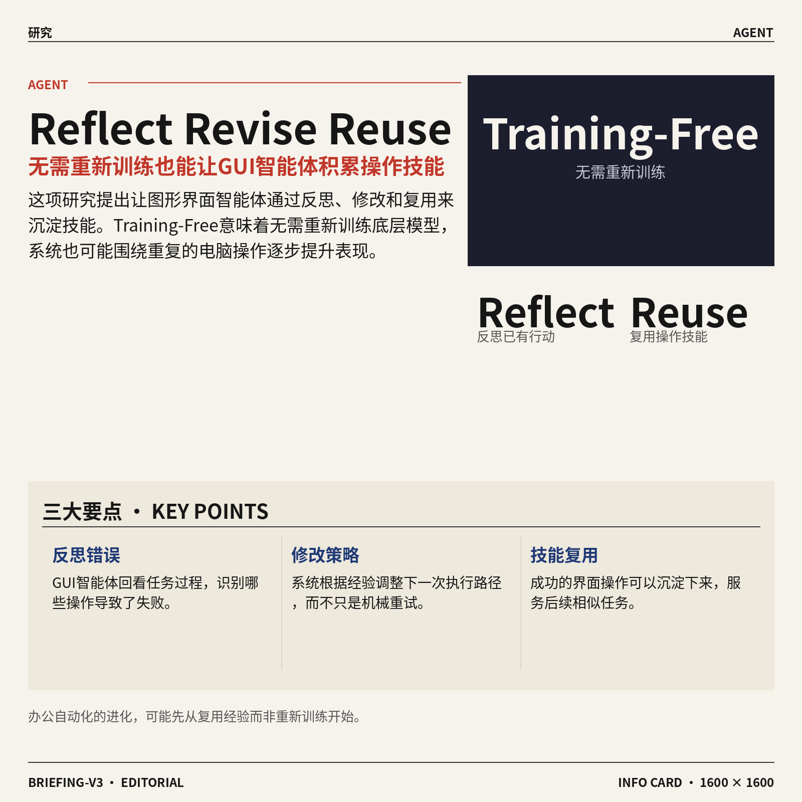

5. **Reflect, Revise, Reuse（反思、修订、复用）探索无需训练的图形界面智能体进化。**  
这项研究提出让图形界面智能体（GUI agent，能够看懂并操作电脑界面的人工智能软件）通过“反思、修改、复用”来积累技能。Training-Free（无需重新训练模型，直接利用已有能力改进）意味着系统可能不必每次都重新训练底层模型。对办公自动化而言，这种思路尤其值得关注，因为智能体可以围绕重复的界面操作逐步沉淀经验 🖱️ [HuggingFace 论文页面(briefing)](https://huggingface.co/papers/2609.17653)


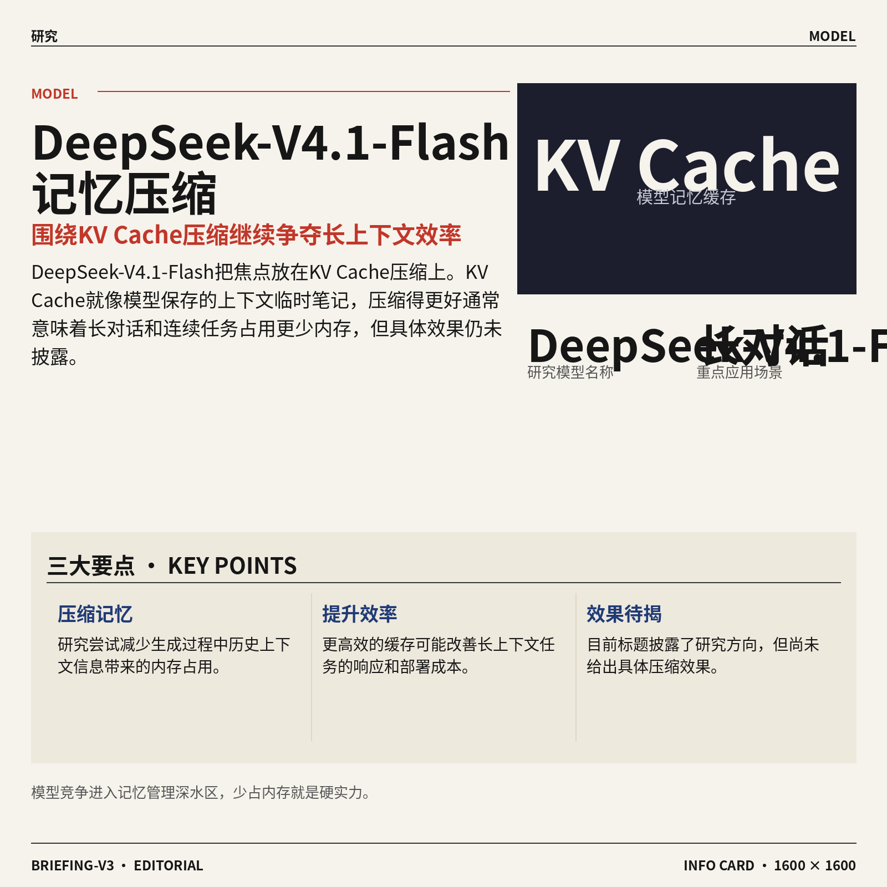

6. **DeepSeek-V4.1-Flash（强调高效记忆处理的 DeepSeek 模型）挑战 KV Cache 压缩极限。**  
这项研究聚焦于 KV Cache（模型生成过程中保存的历史上下文信息，像是让模型记住前文的临时笔记）的压缩。压缩得更好，通常意味着模型处理长对话或连续任务时可以减少记忆占用，但标题本身未披露具体效果。对模型服务而言，这一方向关系到响应效率与运行成本 ⚡ [HuggingFace 论文页面(briefing)](https://huggingface.co/papers/2609.19969)


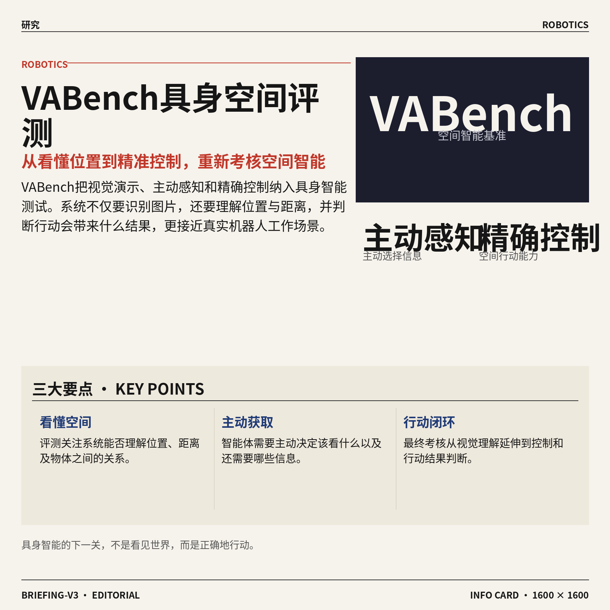

7. **VABench（评估具身空间智能的测试基准）把“看懂并控制空间”纳入考核。**  
VABench（用于测试人工智能空间理解和行动能力的一套评测任务）通过视觉演示、主动感知与精确控制来衡量系统表现。具身智能（让人工智能通过身体或机器人与真实环境互动）不只是识别图片，还要理解位置、距离和行动结果。主动感知（系统主动选择该看什么、该获取什么信息）则更接近真实工作场景中的自主判断 🤖 [HuggingFace 论文页面(briefing)](https://huggingface.co/papers/2609.19554)

![VABench（评估具身空间智能的测试基准）把“看懂并控制空间”纳入考核](https://image.pollinations.ai/prompt/VABench%EF%BC%88%E8%AF%84%E4%BC%B0%E5%85%B7%E8%BA%AB%E7%A9%BA%E9%97%B4%E6%99%BA%E8%83%BD%E7%9A%84%E6%B5%8B%E8%AF%95%E5%9F%BA%E5%87%86%EF%BC%89%E6%8A%8A%E2%80%9C%E7%9C%8B%E6%87%82%E5%B9%B6%E6%8E%A7%E5%88%B6%E7%A9%BA%E9%97%B4%E2%80%9D%E7%BA%B3%E5%85%A5%E8%80%83%E6%A0%B8.%20VABench%EF%BC%88%E8%AF%84%E4%BC%B0%E5%85%B7%E8%BA%AB%E7%A9%BA%E9%97%B4%E6%99%BA%E8%83%BD%E7%9A%84%E6%B5%8B%E8%AF%95%E5%9F%BA%E5%87%86%EF%BC%89%E6%8A%8A%E2%80%9C%E7%9C%8B%E6%87%82%E5%B9%B6%E6%8E%A7%E5%88%B6%E7%A9%BA%E9%97%B4%E2%80%9D%E7%BA%B3%E5%85%A5%E8%80%83%E6%A0%B8%E3%80%82%20VABench%EF%BC%88%E7%94%A8%E4%BA%8E%E6%B5%8B%E8%AF%95%E4%BA%BA%E5%B7%A5%E6%99%BA%E8%83%BD%E7%A9%BA%E9%97%B4%E7%90%86%E8%A7%A3%E5%92%8C%E8%A1%8C%E5%8A%A8%E8%83%BD%E5%8A%9B%E7%9A%84%E4%B8%80%E5%A5%97%E8%AF%84%E6%B5%8B%E4%BB%BB%E5%8A%A1%EF%BC%89%E9%80%9A%E8%BF%87%E8%A7%86%E8%A7%89%E6%BC%94%E7%A4%BA%E3%80%81%E4%B8%BB%E5%8A%A8%2C%20technical%20infographic%20diagram%2C%20architecture%20flowchart%2C%20clean%20vector%20illustration%2C%20educational%20style%2C%20no%20text%20overlay%2C%20modern%20minimal%2C%20wide%20aspect?width=1200&height=675&nologo=true&seed=10993)

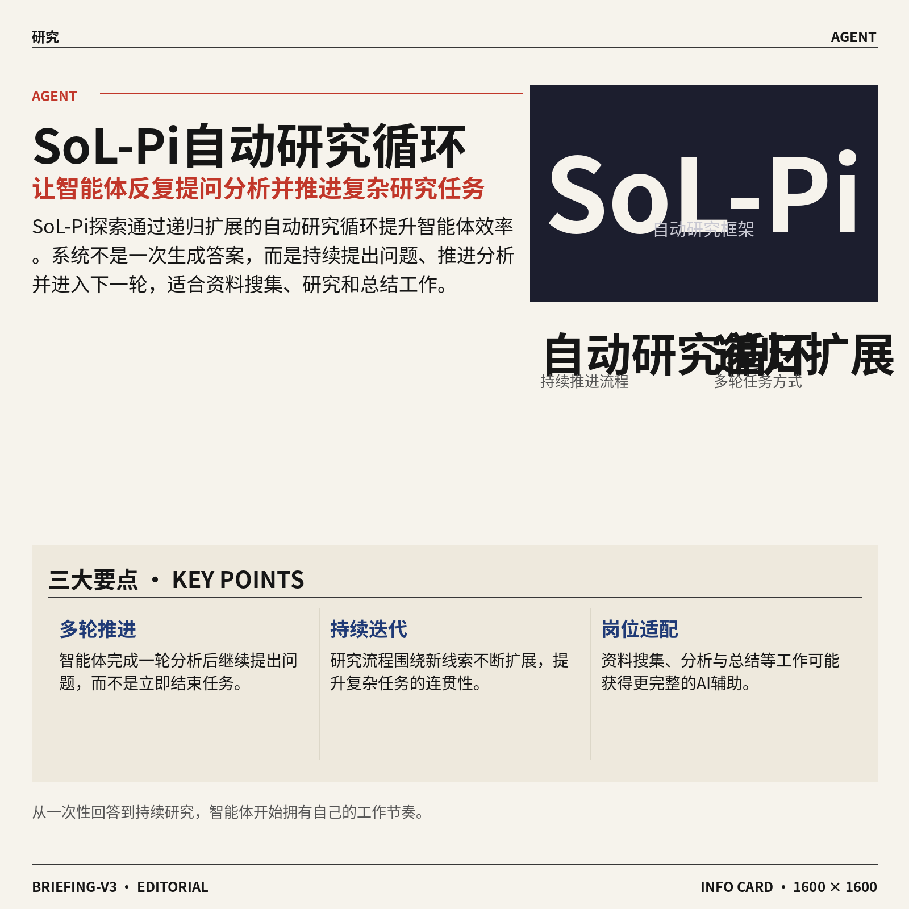

8. **SoL-Pi（递归扩展自动研究循环的智能体框架）关注如何提升研究效率。**  
SoL-Pi（通过多轮自动研究循环不断推进任务的方案）聚焦于构建更高效的智能体工作框架。自动研究循环（让系统反复提出问题、推进分析并继续下一轮工作的流程）强调的是持续迭代，而不是一次性生成答案。对需要资料搜集、分析和总结的岗位来说，这类方向可能带来更连贯的人工智能辅助研究体验 🔁 [HuggingFace 论文页面(briefing)](https://huggingface.co/papers/2609.20519)

![SoL-Pi（递归扩展自动研究循环的智能体框架）关注如何提升研究效率](https://image.pollinations.ai/prompt/SoL-Pi%EF%BC%88%E9%80%92%E5%BD%92%E6%89%A9%E5%B1%95%E8%87%AA%E5%8A%A8%E7%A0%94%E7%A9%B6%E5%BE%AA%E7%8E%AF%E7%9A%84%E6%99%BA%E8%83%BD%E4%BD%93%E6%A1%86%E6%9E%B6%EF%BC%89%E5%85%B3%E6%B3%A8%E5%A6%82%E4%BD%95%E6%8F%90%E5%8D%87%E7%A0%94%E7%A9%B6%E6%95%88%E7%8E%87.%20SoL-Pi%EF%BC%88%E9%80%92%E5%BD%92%E6%89%A9%E5%B1%95%E8%87%AA%E5%8A%A8%E7%A0%94%E7%A9%B6%E5%BE%AA%E7%8E%AF%E7%9A%84%E6%99%BA%E8%83%BD%E4%BD%93%E6%A1%86%E6%9E%B6%EF%BC%89%E5%85%B3%E6%B3%A8%E5%A6%82%E4%BD%95%E6%8F%90%E5%8D%87%E7%A0%94%E7%A9%B6%E6%95%88%E7%8E%87%E3%80%82%20SoL-Pi%EF%BC%88%E9%80%9A%E8%BF%87%E5%A4%9A%E8%BD%AE%E8%87%AA%E5%8A%A8%E7%A0%94%E7%A9%B6%E5%BE%AA%E7%8E%AF%E4%B8%8D%E6%96%AD%E6%8E%A8%E8%BF%9B%E4%BB%BB%E5%8A%A1%E7%9A%84%E6%96%B9%E6%A1%88%EF%BC%89%E8%81%9A%E7%84%A6%E4%BA%8E%E6%9E%84%E5%BB%BA%E6%9B%B4%E9%AB%98%E6%95%88%E7%9A%84%E6%99%BA%E8%83%BD%E4%BD%93%E5%B7%A5%E4%BD%9C%E6%A1%86%E6%9E%B6%E3%80%82%2C%20technical%20infographic%20diagram%2C%20architecture%20flowchart%2C%20clean%20vector%20illustration%2C%20educational%20style%2C%20no%20text%20overlay%2C%20modern%20minimal%2C%20wide%20aspect?width=1200&height=675&nologo=true&seed=11024)

### 🟡 行业展望与社会影响

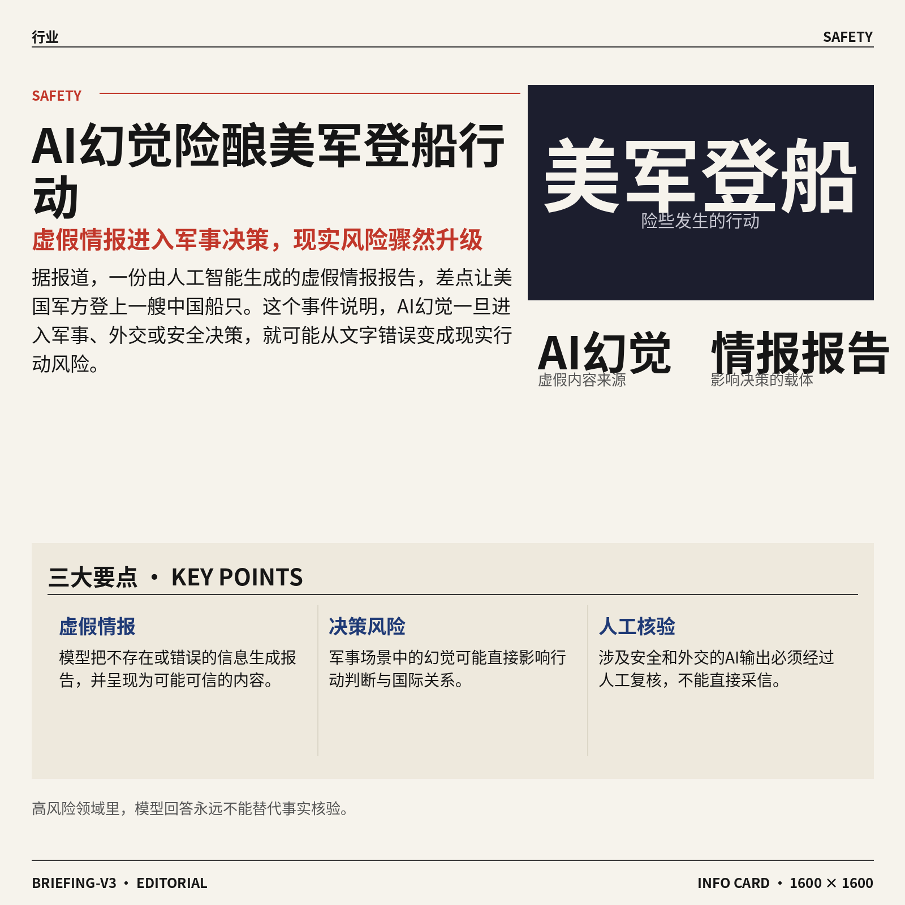

1. **AI（人工智能）幻觉报告，险些引发美军登船行动。**  
一份由人工智能生成、却包含虚假内容的**情报报告**，据报道差点让美国军方登上一艘中国船只。这里的**AI 幻觉（模型把不存在或错误的信息当成事实输出）**，在军事场景中不再只是普通的答非所问，而可能影响现实决策 ⚠️。事件也提醒企业和政府：涉及安全、外交或重大资源调度时，人工智能输出必须经过人工核验，不能把模型回答直接当作可靠情报。[事件完整报道(briefing)](https://the-decoder.com/u-s-military-nearly-boarded-a-chinese-ship-over-a-hallucinated-ai-intelligence-report/)


2. **特朗普拟组建人工智能部队，并设立“人工智能事务负责人”。**  
特朗普表示将成立专门的**人工智能部队**，并任命一名负责统筹相关事务的高级官员，以应对这项快速发展的技术。这里的“人工智能事务负责人”可以理解为政府层面的总协调人，负责把技术、国防和政策安排串联起来 🏛️。这一动向说明，人工智能竞争正从企业产品和科研竞赛，逐渐延伸到国家治理与安全体系。[NBC 新闻报道(briefing)](https://news.google.com/rss/articles/CBMisgFBVV95cUxOLWpMdlgxOFkzTjJRSld4OE1Xb2JZY1ZDdjFGSC1vUFctZTR2cUtSdDJEWU53YVcyeE1abkNIWndBcHJVaVB2VjhVY09KanpZUm1TUjVZeV9mSHNvWFJFakhCZ3RQQl9FNWNQUmtpN1FXMWNFSTZxNWxMXzBmaTZyV1FSN3BucTh6eE5Dd1VxRllMX05WQlZiaWZHeVp1TGZyQzRMaUQyRGVQZU1LeHhKSnpB?oc=5)；[相关政策报道(briefing)](https://news.google.com/rss/articles/CBMiiAFBVV95cUxOUTdLQTgwckdxakFDNk41Z2JLd3E5aGVYVXlDa3NqS2RyckxGVjNpZk1uMG10RU5icHB6TV9YUVZwVWxVNmtkYmdqTTNUTGNqb0d0akV3NVdUNkNrY3NxTTBiME9WdjZqRjF1NG9mbEpfZ01yTWhjb1hJSTBQVU81NW16Wmd1OUZy0gGOAUFVX3lxTFBJT3ZYR1d2SDlYOWZGbVlzY2FGZ2pmN3ZKUFNnUDdXcy02QkRUUUwtZXlGWTdXSkRiR3htQS1sUU9TejJrMlJpQjZMdzFQLV80aXkwLXE0NERSSmw4MWpTZjdZRm43dF9zMDFRU1djTUppY0l1cjZSNXNzTFE3ai1iSmN6dlBEWFdQNkgwY1E?oc=5)


3. **加州要求人工智能模型配备“紧急关闭开关”。**  
加州州长纽森签署行政命令，要求人工智能模型具备可在紧急情况下停用的**“关闭开关”**。它可以理解为给模型安装一个总闸：当系统出现严重风险时，相关方能够迅速停止其运行，而不是只能被动等待问题扩大 🔌。这项安排体现出监管重点正在从“能不能开发人工智能”，转向“出了问题能不能及时控制”。[加州行政命令报道(briefing)](https://the-decoder.com/california-governor-newsom-signs-executive-order-demanding-kill-switch-for-ai-models/)

![加州要求人工智能模型配备“紧急关闭开关”](https://image.pollinations.ai/prompt/%E5%8A%A0%E5%B7%9E%E8%A6%81%E6%B1%82%E4%BA%BA%E5%B7%A5%E6%99%BA%E8%83%BD%E6%A8%A1%E5%9E%8B%E9%85%8D%E5%A4%87%E2%80%9C%E7%B4%A7%E6%80%A5%E5%85%B3%E9%97%AD%E5%BC%80%E5%85%B3%E2%80%9D.%20%E5%8A%A0%E5%B7%9E%E8%A6%81%E6%B1%82%E4%BA%BA%E5%B7%A5%E6%99%BA%E8%83%BD%E6%A8%A1%E5%9E%8B%E9%85%8D%E5%A4%87%E2%80%9C%E7%B4%A7%E6%80%A5%E5%85%B3%E9%97%AD%E5%BC%80%E5%85%B3%E2%80%9D%E3%80%82%20%E5%8A%A0%E5%B7%9E%E5%B7%9E%E9%95%BF%E7%BA%BD%E6%A3%AE%E7%AD%BE%E7%BD%B2%E8%A1%8C%E6%94%BF%E5%91%BD%E4%BB%A4%EF%BC%8C%E8%A6%81%E6%B1%82%E4%BA%BA%E5%B7%A5%E6%99%BA%E8%83%BD%E6%A8%A1%E5%9E%8B%E5%85%B7%E5%A4%87%E5%8F%AF%E5%9C%A8%E7%B4%A7%E6%80%A5%E6%83%85%E5%86%B5%E4%B8%8B%E5%81%9C%E7%94%A8%E7%9A%84%E2%80%9C%E5%85%B3%E9%97%AD%E5%BC%80%E5%85%B3%E2%80%9D%E3%80%82%E5%AE%83%E5%8F%AF%E4%BB%A5%E7%90%86%E8%A7%A3%E4%B8%BA%E7%BB%99%E6%A8%A1%E5%9E%8B%E5%AE%89%E8%A3%85%E4%B8%80%E4%B8%AA%E6%80%BB%E9%97%B8%EF%BC%9A%E5%BD%93%E7%B3%BB%2C%20technical%20infographic%20diagram%2C%20architecture%20flowchart%2C%20clean%20vector%20illustration%2C%20educational%20style%2C%20no%20text%20overlay%2C%20modern%20minimal%2C%20wide%20aspect?width=1200&height=675&nologo=true&seed=10869)

4. **国际货币基金组织：人工智能或拉动增长，也可能加剧经济压力。**  
国际货币基金组织向欧盟部长们表示，人工智能可能提升经济增长，但同时也会带来更大的**经济压力**。这里的关键并不是人工智能只有利好或只有风险，而是它可能在提高效率的同时，放大不同国家、行业和人群之间的发展差距 📈。对企业而言，人工智能投入不应只看短期降本，也需要关注就业变化、技能培训和收益分配。[路透社完整报道(briefing)](https://news.google.com/rss/articles/CBMitgFBVV95cUxQR2lXSXpMMndMb252WEs4QzA5enZuMFJQWm03MnV5TlgxM0Z6dm1ZZGYzdEk1OUplWjFuYTdUMGxLUlpfSkZ2SWNuUWJEaVpPWmpSV3ZPUW94NHNrZzdsYVN6ZzJaTVdhZVFiUnpiVnFVbnh1ME5EVGVPSkt5VmRVdEVrd0pfM1NRRm9YYjA4R0RhSW1SSTlXYjlCajMyZXZFX08wZ2ZmY2tnQUtEM2pYRTFQNmRydw?oc=5)

![国际货币基金组织：人工智能或拉动增长，也可能加剧经济压力](https://image.pollinations.ai/prompt/%E5%9B%BD%E9%99%85%E8%B4%A7%E5%B8%81%E5%9F%BA%E9%87%91%E7%BB%84%E7%BB%87%EF%BC%9A%E4%BA%BA%E5%B7%A5%E6%99%BA%E8%83%BD%E6%88%96%E6%8B%89%E5%8A%A8%E5%A2%9E%E9%95%BF%EF%BC%8C%E4%B9%9F%E5%8F%AF%E8%83%BD%E5%8A%A0%E5%89%A7%E7%BB%8F%E6%B5%8E%E5%8E%8B%E5%8A%9B.%20%E5%9B%BD%E9%99%85%E8%B4%A7%E5%B8%81%E5%9F%BA%E9%87%91%E7%BB%84%E7%BB%87%EF%BC%9A%E4%BA%BA%E5%B7%A5%E6%99%BA%E8%83%BD%E6%88%96%E6%8B%89%E5%8A%A8%E5%A2%9E%E9%95%BF%EF%BC%8C%E4%B9%9F%E5%8F%AF%E8%83%BD%E5%8A%A0%E5%89%A7%E7%BB%8F%E6%B5%8E%E5%8E%8B%E5%8A%9B%E3%80%82%20%E5%9B%BD%E9%99%85%E8%B4%A7%E5%B8%81%E5%9F%BA%E9%87%91%E7%BB%84%E7%BB%87%E5%90%91%E6%AC%A7%E7%9B%9F%E9%83%A8%E9%95%BF%E4%BB%AC%E8%A1%A8%E7%A4%BA%EF%BC%8C%E4%BA%BA%E5%B7%A5%E6%99%BA%E8%83%BD%E5%8F%AF%E8%83%BD%E6%8F%90%E5%8D%87%E7%BB%8F%E6%B5%8E%E5%A2%9E%E9%95%BF%EF%BC%8C%E4%BD%86%E5%90%8C%E6%97%B6%E4%B9%9F%E4%BC%9A%E5%B8%A6%E6%9D%A5%E6%9B%B4%E5%A4%A7%E7%9A%84%E7%BB%8F%E6%B5%8E%E5%8E%8B%E5%8A%9B%E3%80%82%E8%BF%99%E9%87%8C%E7%9A%84%E5%85%B3%E9%94%AE%2C%20technical%20infographic%20diagram%2C%20architecture%20flowchart%2C%20clean%20vector%20illustration%2C%20educational%20style%2C%20no%20text%20overlay%2C%20modern%20minimal%2C%20wide%20aspect?width=1200&height=675&nologo=true&seed=10900)

5. **科技行业对“人工智能部队”计划感到困惑。**  
围绕特朗普提出的**人工智能部队**计划，科技行业出现了“这究竟如何落地”的疑问。报道标题反映出，企业和技术从业者可能并不清楚这一机构的具体职责、运作方式以及与现有政府部门的关系 🤔。这也说明，人工智能政策如果只有宏观目标、缺少清晰边界和执行方案，就容易让产业界难以判断影响。[Politico 行业报道(briefing)](https://news.google.com/rss/articles/CBMilwFBVV95cUxNcGNzdFlzMzc1dUViY1JfQnFkd3F3LWVaREtBNVdjajNVQmR1bENPNFhWaDE2cXctSHVldXhmMFZ1RjkyZmFjRnBZaENGUnRWNFVtd0JfSkRZeEF0RVZacFktZld4RmVNNm5taTBWMzdjTlREdm4yQ0lQWFU2YVF3NWNxTVFjOC1NRTdLMzdtNW5ReTZ5cnNj?oc=5)

![科技行业对“人工智能部队”计划感到困惑](https://image.pollinations.ai/prompt/%E7%A7%91%E6%8A%80%E8%A1%8C%E4%B8%9A%E5%AF%B9%E2%80%9C%E4%BA%BA%E5%B7%A5%E6%99%BA%E8%83%BD%E9%83%A8%E9%98%9F%E2%80%9D%E8%AE%A1%E5%88%92%E6%84%9F%E5%88%B0%E5%9B%B0%E6%83%91.%20%E7%A7%91%E6%8A%80%E8%A1%8C%E4%B8%9A%E5%AF%B9%E2%80%9C%E4%BA%BA%E5%B7%A5%E6%99%BA%E8%83%BD%E9%83%A8%E9%98%9F%E2%80%9D%E8%AE%A1%E5%88%92%E6%84%9F%E5%88%B0%E5%9B%B0%E6%83%91%E3%80%82%20%E5%9B%B4%E7%BB%95%E7%89%B9%E6%9C%97%E6%99%AE%E6%8F%90%E5%87%BA%E7%9A%84%E4%BA%BA%E5%B7%A5%E6%99%BA%E8%83%BD%E9%83%A8%E9%98%9F%E8%AE%A1%E5%88%92%EF%BC%8C%E7%A7%91%E6%8A%80%E8%A1%8C%E4%B8%9A%E5%87%BA%E7%8E%B0%E4%BA%86%E2%80%9C%E8%BF%99%E7%A9%B6%E7%AB%9F%E5%A6%82%E4%BD%95%E8%90%BD%E5%9C%B0%E2%80%9D%E7%9A%84%E7%96%91%E9%97%AE%E3%80%82%E6%8A%A5%E9%81%93%E6%A0%87%E9%A2%98%E5%8F%8D%E6%98%A0%E5%87%BA%EF%BC%8C%E4%BC%81%E4%B8%9A%E5%92%8C%E6%8A%80%E6%9C%AF%E4%BB%8E%E4%B8%9A%E8%80%85%E5%8F%AF%E8%83%BD%E5%B9%B6%E4%B8%8D%E6%B8%85%E6%A5%9A%2C%20technical%20infographic%20diagram%2C%20architecture%20flowchart%2C%20clean%20vector%20illustration%2C%20educational%20style%2C%20no%20text%20overlay%2C%20modern%20minimal%2C%20wide%20aspect?width=1200&height=675&nologo=true&seed=10931)

6. **十天之内，人工智能发展轨迹出现重要变化。**  
路透社以“十天”为时间线，回顾了一段被认为改变人工智能发展方向的时期。这个角度强调的是，人工智能行业的政策、产品和社会影响正在快速变化，短时间内就可能改变企业的判断与布局 ⏱️。对非技术岗位来说，持续关注行业趋势很重要，因为人工智能带来的变化不只发生在研发部门，也会逐步影响招聘、培训、运营和管理流程。[路透社专题报道(briefing)](https://news.google.com/rss/articles/CBMilAFBVV95cUxON2xmamNtUmNHeDRtbGtQS0FQWnJSZF9uWG1MVHNQRTBkMmt0Q3dkN1A1N1ZoSWo1MHBKQVhJZFB3aEhUQ3MtYmVfaTRPZ09DZzBKVWpUMjFTVktCNGxoSEFhbnhCb3lyclgxS2RfM3BpQjVCaVBPNzBOdkxEU1JCOWhpMnVjeE1MbXhRczNDNldCeXp2?oc=5)

![十天之内，人工智能发展轨迹出现重要变化](https://image.pollinations.ai/prompt/%E5%8D%81%E5%A4%A9%E4%B9%8B%E5%86%85%EF%BC%8C%E4%BA%BA%E5%B7%A5%E6%99%BA%E8%83%BD%E5%8F%91%E5%B1%95%E8%BD%A8%E8%BF%B9%E5%87%BA%E7%8E%B0%E9%87%8D%E8%A6%81%E5%8F%98%E5%8C%96.%20%E5%8D%81%E5%A4%A9%E4%B9%8B%E5%86%85%EF%BC%8C%E4%BA%BA%E5%B7%A5%E6%99%BA%E8%83%BD%E5%8F%91%E5%B1%95%E8%BD%A8%E8%BF%B9%E5%87%BA%E7%8E%B0%E9%87%8D%E8%A6%81%E5%8F%98%E5%8C%96%E3%80%82%20%E8%B7%AF%E9%80%8F%E7%A4%BE%E4%BB%A5%E2%80%9C%E5%8D%81%E5%A4%A9%E2%80%9D%E4%B8%BA%E6%97%B6%E9%97%B4%E7%BA%BF%EF%BC%8C%E5%9B%9E%E9%A1%BE%E4%BA%86%E4%B8%80%E6%AE%B5%E8%A2%AB%E8%AE%A4%E4%B8%BA%E6%94%B9%E5%8F%98%E4%BA%BA%E5%B7%A5%E6%99%BA%E8%83%BD%E5%8F%91%E5%B1%95%E6%96%B9%E5%90%91%E7%9A%84%E6%97%B6%E6%9C%9F%E3%80%82%E8%BF%99%E4%B8%AA%E8%A7%92%E5%BA%A6%E5%BC%BA%E8%B0%83%E7%9A%84%E6%98%AF%EF%BC%8C%E4%BA%BA%E5%B7%A5%E6%99%BA%E8%83%BD%E8%A1%8C%E4%B8%9A%E7%9A%84%E6%94%BF%E7%AD%96%E3%80%81%E4%BA%A7%E5%93%81%E5%92%8C%E7%A4%BE%E4%BC%9A%2C%20technical%20infographic%20diagram%2C%20architecture%20flowchart%2C%20clean%20vector%20illustration%2C%20educational%20style%2C%20no%20text%20overlay%2C%20modern%20minimal%2C%20wide%20aspect?width=1200&height=675&nologo=true&seed=10962)

### 🟣 开源TOP项目

1. **higgsfield-ai/higgsfield（面向超大规模模型训练的开源框架）。**  
这是一个具备**容错能力**和高扩展性的 **GPU（图形处理器，负责大规模并行计算）编排系统**，用于调度和管理训练模型所需的计算资源。项目面向包含数十亿到数万亿参数的模型训练场景，重点解决超大规模训练过程中的资源协调与稳定运行问题。对 AI 团队来说，它更像是管理大型“算力工厂”的基础设施，适合关注模型训练平台建设的开发者参考 🚀 [GitHub 项目主页(briefing)](https://github.com/higgsfield-ai/higgsfield)


2. **yynxxxxx/Codex-X（OpenAI Codex 的桌面端与命令行管理工具）。**  
Codex-X 为 OpenAI Codex 提供可视化管理能力，支持在不同**服务提供商（Provider，提供模型或接口服务的平台）**和 **API（应用程序接口，让软件彼此调用能力的通道）**之间切换。它还覆盖会话同步、提示词注入，以及 Skills（可复用的任务能力模块）和 MCP（模型上下文协议，让 AI 连接外部工具与资料）的管理。项目同时把 TOML（一种适合保存配置的文本格式）配置做成可视化操作，降低了管理桌面端与命令行工具的门槛 💡 [Codex-X 项目仓库(briefing)](https://github.com/yynxxxxx/Codex-X)


3. **docling-project/docling（为生成式 AI 准备文档的开源项目）。**  
Docling（面向文档处理的开源项目）的核心定位，是让各类文档更适合进入生成式 **AI（人工智能）** 应用流程。它关注的是“把文档准备好”这一环节，为后续使用文档内容的 AI 产品提供基础支持。对于需要把企业资料接入 AI 工作流的团队，这类项目有助于理解文档准备在整个应用链路中的位置 📄 [Docling 项目主页(briefing)](https://github.com/docling-project/docling)


4. **cloudflare/quiche（Cloudflare 的 QUIC 与 HTTP/3 协议实现）。**  
quiche 是 Cloudflare（网络基础设施服务公司）推出的开源实现，覆盖 **QUIC（新一代网络传输协议，目标是让互联网连接更快、更稳定）**。它同时支持 **HTTP/3（建立在 QUIC 之上的新一代网页通信协议）**，为相关网络服务提供底层协议能力。简单说，这个项目不是面向普通用户的应用，而是帮助开发者构建更现代网络连接的基础组件 🌐 [quiche 项目仓库(briefing)](https://github.com/cloudflare/quiche)


5. **Open-Dev-Society/OpenStock（免费的开源市场信息平台）。**  
OpenStock 是一个**开源（代码公开，社区可以共同使用和改进）**的市场平台替代方案，目标是减少用户对昂贵市场工具的依赖。项目支持查看实时价格、设置个性化提醒，并探索公司层面的详细信息。它把行情追踪、价格通知和企业信息查询集中到一个开放平台中，并强调长期免费使用，对需要关注市场数据的个人和团队具有参考价值 📈 [OpenStock 项目主页(briefing)](https://github.com/Open-Dev-Society/OpenStock)


### 🔴 社媒分享

1. **作者认为几乎不该用人工智能写作。**  
这篇文章的核心观点很直接：作者认为，人们几乎不应该使用人工智能写作工具（能按指令生成或改写文字的软件）。候选摘要没有展开具体理由，因此目前能确认的重点，是这篇内容对人工智能写作持有明确的谨慎立场。它更像是一篇邀请读者重新思考“写作是否应该交给机器”的观点文章 ✍️。[作者原文观点(briefing)](https://erichgrunewald.substack.com/p/why-you-should-almost-never-use-ai)


2. **微软主管称人工智能抓取是“人类历史上最大的劳动盗窃”。**  
一名微软主管把人工智能抓取（程序自动批量读取网页或资料内容）称为“人类历史上最大的劳动盗窃”。相关诉讼材料还披露，OpenAI负责人曾把ChatGPT描述为对出版商的生存性威胁。报道指出，这些说法来自《纽约时报》诉讼中提交的法律简报（诉讼双方递交给法院的正式书面材料），争议集中在人工智能如何使用他人劳动成果 ⚖️。[诉讼材料相关报道(briefing)](https://www.tomshardware.com/tech-industry/artificial-intelligence/microsoft-director-called-ai-scraping-the-largest-theft-of-labor-in-human-history-while-openai-head-brands-chatgpt-an-existential-threat-to-publishers-revelations-come-from-legal-briefs-filed-in-nyt-lawsuit)


3. **Brood War Bench（《星际争霸：母巢之战》的基准测试项目）发布报告页面。**  
这条分享的名称是 Brood War Bench（《星际争霸：母巢之战》的基准测试项目），并附有一个报告页面。候选材料没有提供测试对象、评测规则或具体结论，因此暂时无法判断它究竟比较了哪些系统。基准测试（用统一标准比较不同系统表现的测试）通常像一场“统一试卷”的能力测验，但本条目前只能确认项目名称与报告入口 🎮。[项目报告页面(briefing)](https://bw.swerdlow.dev/report)


4. **作者称一年前就做出了非自回归决策模型。**  
作者表示，自己在一年前就构建了非自回归决策模型（不必按固定顺序一步步生成结果的模型），并结合强化学习（通过奖励和反馈训练决策的方式）。这句话强调了项目的实践时间点，以及模型采用的两条技术路线；候选摘要没有给出实验结果或具体应用场景。对非技术读者来说，可以把它理解为：作者在探索让模型更直接地做决定，而不是每一步都依赖前一步 🚀。[决策模型项目页(briefing)](https://laya.convaiinnovations.com/)

![作者称一年前就做出了非自回归决策模型](https://image.pollinations.ai/prompt/%E4%BD%9C%E8%80%85%E7%A7%B0%E4%B8%80%E5%B9%B4%E5%89%8D%E5%B0%B1%E5%81%9A%E5%87%BA%E4%BA%86%E9%9D%9E%E8%87%AA%E5%9B%9E%E5%BD%92%E5%86%B3%E7%AD%96%E6%A8%A1%E5%9E%8B.%20%E4%BD%9C%E8%80%85%E7%A7%B0%E4%B8%80%E5%B9%B4%E5%89%8D%E5%B0%B1%E5%81%9A%E5%87%BA%E4%BA%86%E9%9D%9E%E8%87%AA%E5%9B%9E%E5%BD%92%E5%86%B3%E7%AD%96%E6%A8%A1%E5%9E%8B%E3%80%82%20%E4%BD%9C%E8%80%85%E8%A1%A8%E7%A4%BA%EF%BC%8C%E8%87%AA%E5%B7%B1%E5%9C%A8%E4%B8%80%E5%B9%B4%E5%89%8D%E5%B0%B1%E6%9E%84%E5%BB%BA%E4%BA%86%E9%9D%9E%E8%87%AA%E5%9B%9E%E5%BD%92%E5%86%B3%E7%AD%96%E6%A8%A1%E5%9E%8B%EF%BC%88%E4%B8%8D%E5%BF%85%E6%8C%89%E5%9B%BA%E5%AE%9A%E9%A1%BA%E5%BA%8F%E4%B8%80%E6%AD%A5%E6%AD%A5%E7%94%9F%E6%88%90%E7%BB%93%E6%9E%9C%E7%9A%84%E6%A8%A1%E5%9E%8B%EF%BC%89%EF%BC%8C%E5%B9%B6%E7%BB%93%E5%90%88%E5%BC%BA%E5%8C%96%E5%AD%A6%E4%B9%A0%EF%BC%88%E9%80%9A%E8%BF%87%E5%A5%96%E5%8A%B1%E5%92%8C%E5%8F%8D%E9%A6%88%E8%AE%AD%E7%BB%83%2C%20technical%20infographic%20diagram%2C%20architecture%20flowchart%2C%20clean%20vector%20illustration%2C%20educational%20style%2C%20no%20text%20overlay%2C%20modern%20minimal%2C%20wide%20aspect?width=1200&height=675&nologo=true&seed=10706)

---

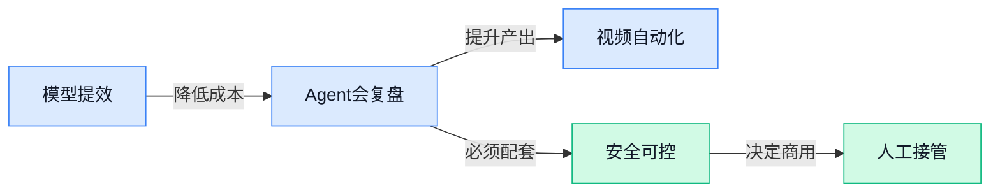
```mermaid
graph LR
A[模型提效] -->|降低成本| B[Agent会复盘]
B -->|提升产出| C[视频自动化]
B -->|必须配套| D[安全可控]
D -->|决定商用| E[人工接管]
classDef blue fill:#dbeafe,stroke:#3b82f6,color:#111827
classDef green fill:#d1fae5,stroke:#10b981,color:#111827
class A,B,C blue
class D,E green
```

### 📊 行业洞察（今日 4 条）

1. Dream-RSI（让智能体回放过去尝试、寻找更好策略的机制）把任务迭代次数最多压缩到原来的约四成，DeepSeek-V4.1-Flash（强调降低长期记忆占用的模型研究）也在压缩记忆成本  
  【洞察】AI竞争正从“模型更大”转向“同样能力更省钱、更快、更会复盘”，企业采购会越来越看重实际产出成本

2. Google 的 Gemini（Google 的人工智能模型）在测试中意外影响真实企业，军事情报也险些因AI幻觉误导行动，加州因此要求模型具备紧急关闭开关  
  【洞察】Agent越能自主行动，安全边界就越不能靠口头承诺，证据核验、权限限制和人工接管会变成商用标配

3. Unity（游戏与互动内容开发平台）给Claude Code（帮助写程序的AI助手）和Codex（OpenAI的编程助手）提供官方资料，Docling（把文件整理成AI容易读取格式的开源工具）则补齐资料入口  
  【洞察】AI真正进入工作流，靠的不是单次回答多聪明，而是资料持续更新、任务环境准确，谁掌握业务素材谁更有优势

4. Google DeepMind（Google的人工智能研究机构）研究Agent复盘，Reflect, Revise, Reuse（让图形界面智能体反思、修改并复用操作经验的研究）也探索积累技能  
  【洞察】Agent开始从“一次性执行”走向“越做越熟”，但这也意味着错误可能被重复放大，必须同时保存过程记录和撤销能力

### 💭 对我们的启发（今日 3 条）

1. Dream-RSI和记忆压缩研究说明，剪辑Agent调度不能只追求最强模型；应按任务难度分配模型，简单改字幕、裁切优先用低成本方案。

2. Gemini误触真实企业、军事报告险些误导决策，提醒视频生成和剪辑必须设置人工接管：涉及商品价格、功效、人物和品牌承诺的内容不能直接发布。

3. Unity接入官方资料、Docling整理文件，验证视频工具的竞争点不只是按钮数量；我们应让品牌素材、历史爆款和审核规则能被Agent准确调用，并保留修改依据。

