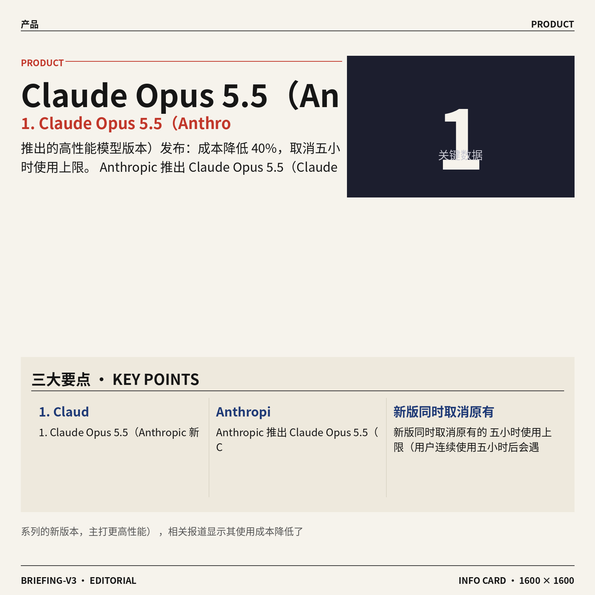
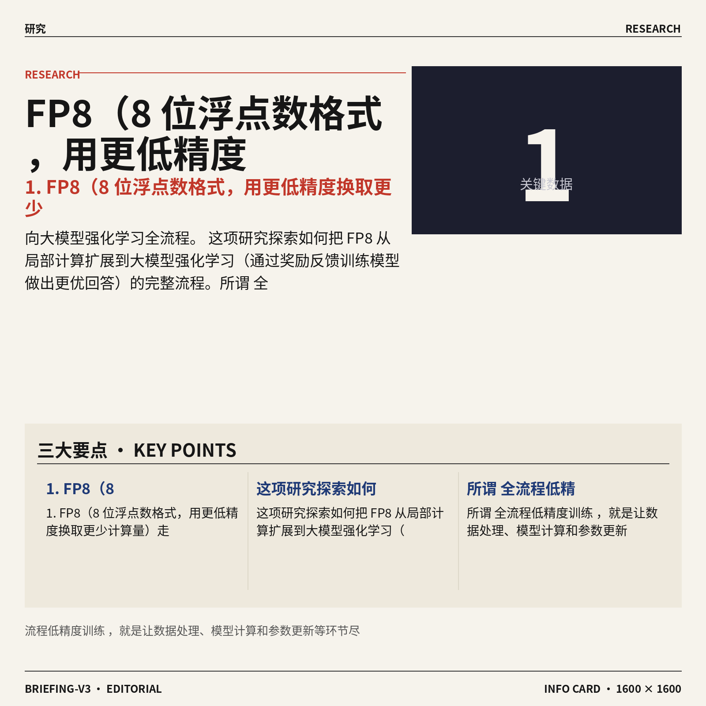
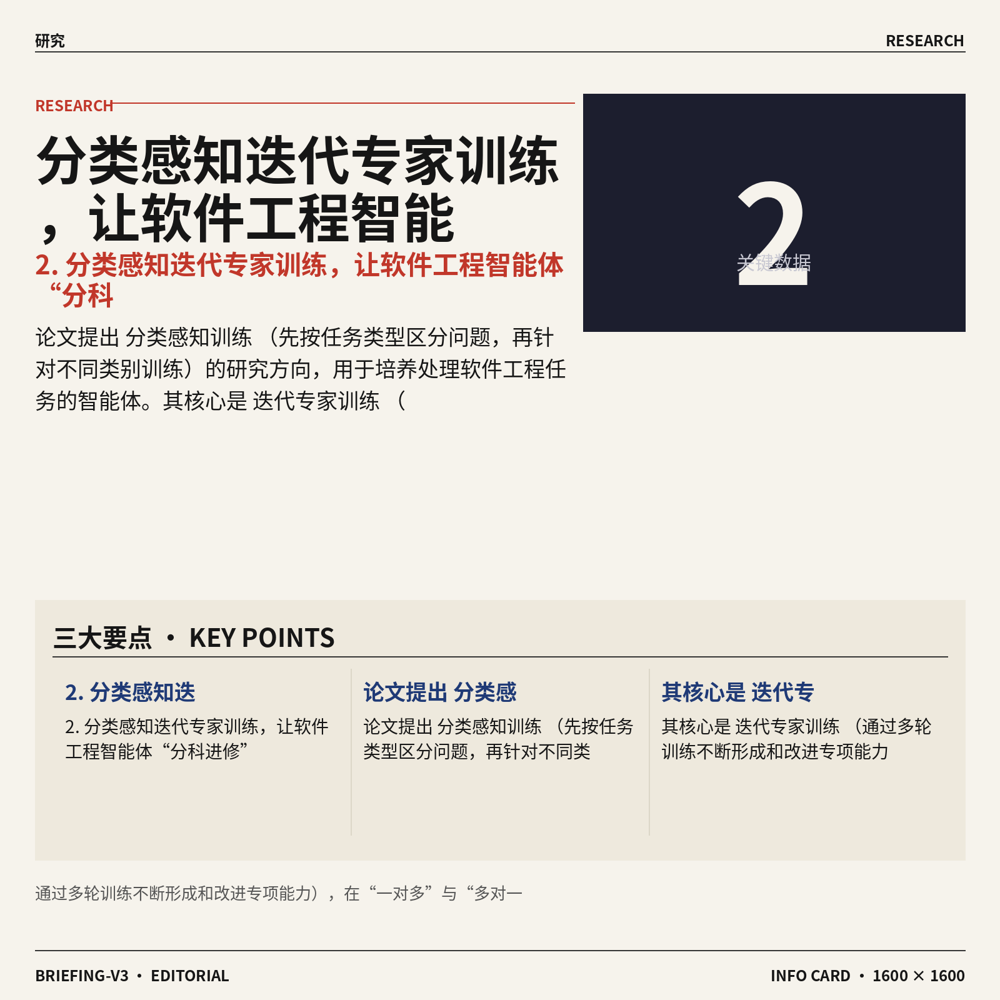
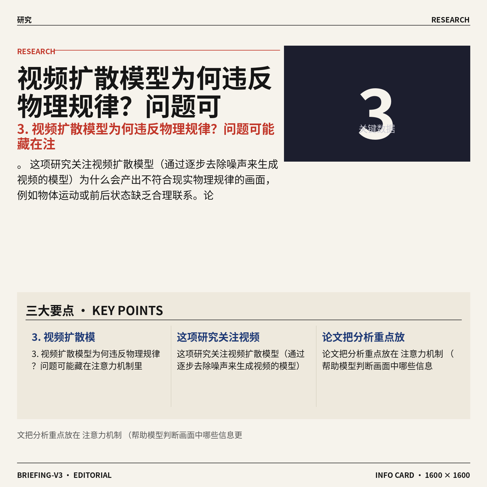
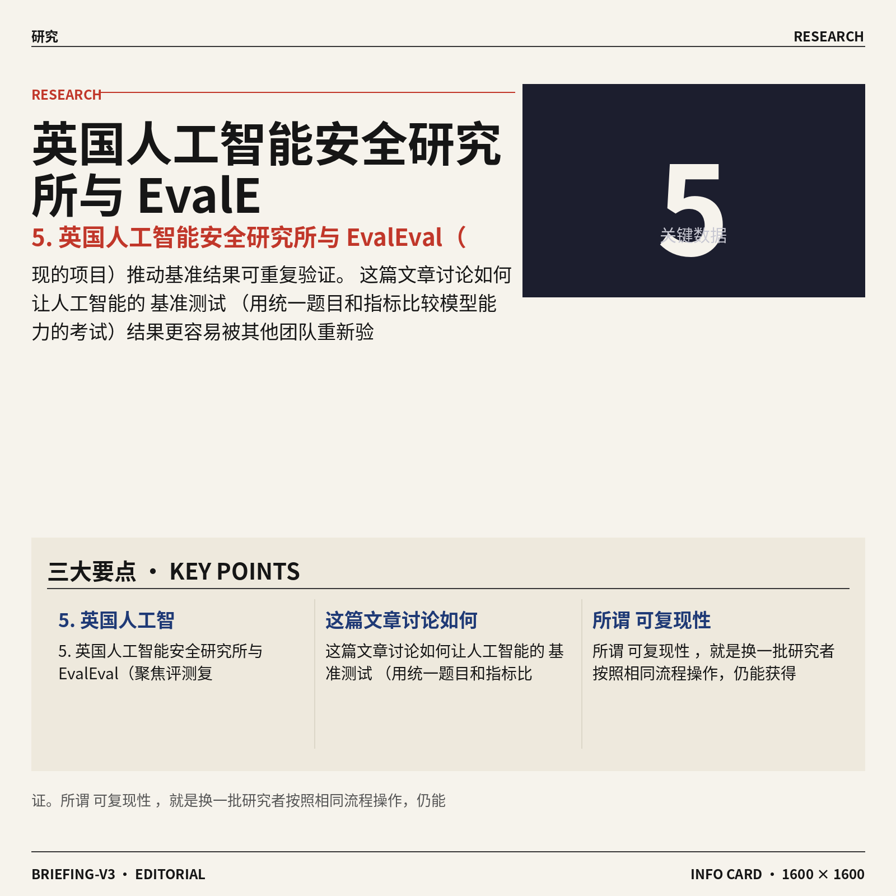
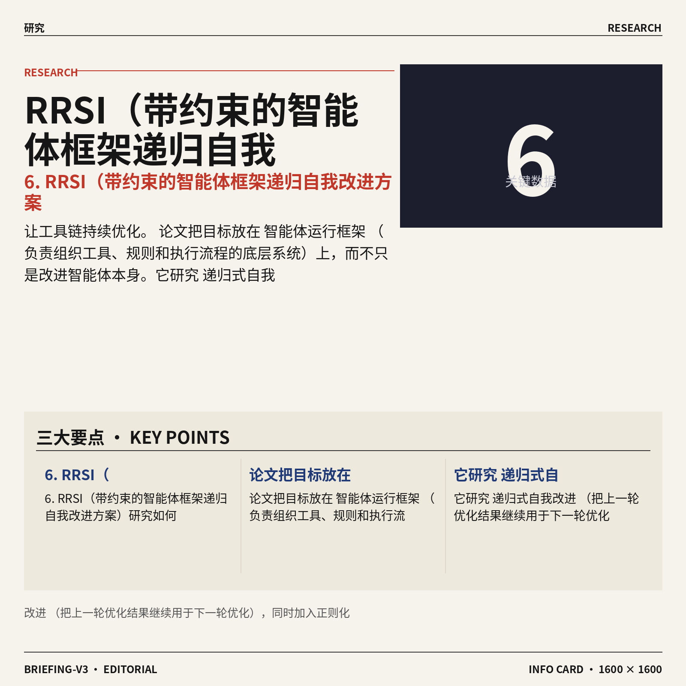
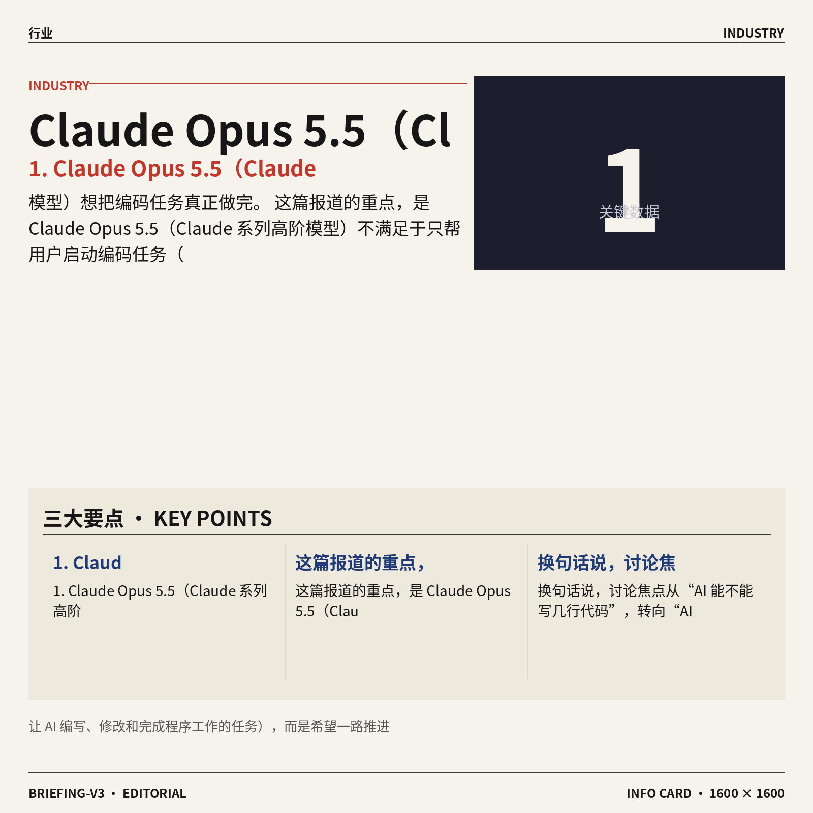
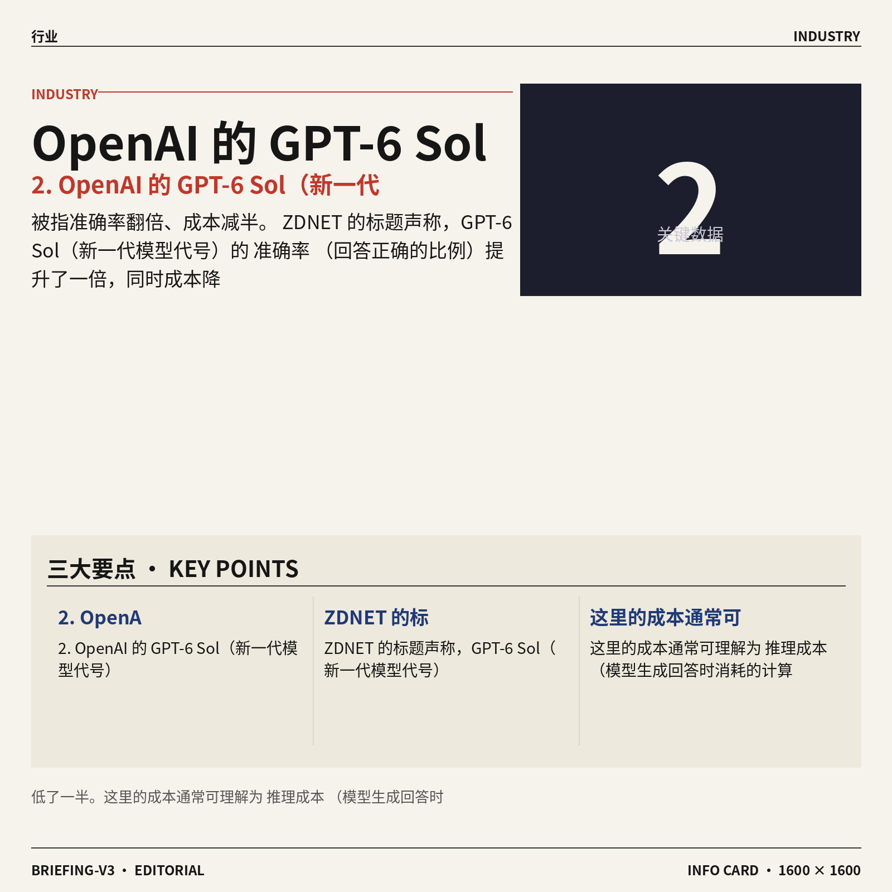
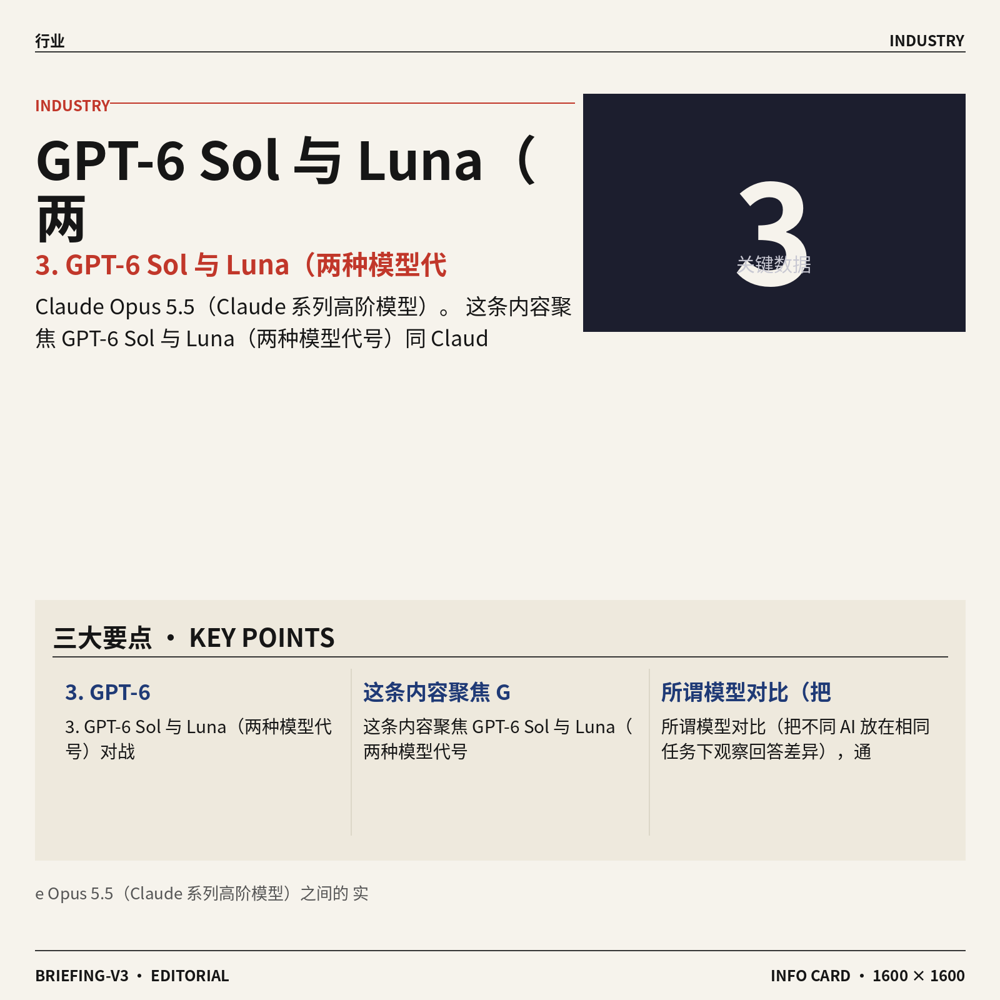

## AI资讯日报 2026/9/23

> AI 早报 · 每日早读 · 全网深度聚合

## **今日摘要**

```
Anthropic 发布 Claude Opus 5.5，成本降低40%并取消五小时上限
OpenAI GPT-6 Sol（模型版本）据称准确率翻倍、成本减半，挑战Claude Opus 5.5
Google 开源 Ax（智能体系统），Univer（办公工具）打通表格、文档与幻灯片
```

### 🔵 产品与功能更新



1. **Claude Opus 5.5（Anthropic 新推出的高性能模型版本）发布：成本降低 40%，取消五小时使用上限。**
Anthropic 推出 **Claude Opus 5.5（Claude 系列的新版本，主打更高性能）**，相关报道显示其使用成本降低了 **40%** 💰。新版同时取消原有的**五小时使用上限（用户连续使用五小时后会遇到的额度限制）**，减少频繁中断带来的不便。[降价与限额报道(briefing)](https://news.google.com/rss/articles/CBMi2AFBVV95cUxOZVUtNzVVY1JCeW8yaFVhWUdGd2JzeHBMUzZQWnFZS29fM1BsaFFvOGs4bktjY3B1ZTFIMlpzaUhoNVpEREhDekVFdnhTdHk3aVdQajc3Z2lwS0RSREkzMk1raENfeVRwQ25PcmVQbmRKbV9QNy1tVTFaNzdVOFptU3dCeEFmZWdTX1pYSHF2ajJKT3FJLTRfX2FCU0h2WmpIUFlGdllfRGM2b2VWU0VjVkxkRTc4dVhVWlRZSlpkV1E5Z1EwaWNfN0RzQktHUV83SFBGd3NRZ1Q?oc=5) 另一则报道还强调，新版在价格下降的同时实现了**性能提升（模型处理任务和生成回答的整体能力增强）** 🚀。[性能更新报道(briefing)](https://news.google.com/rss/articles/CBMicEFVX3lxTE1fWGpaRGdxSm1USkJDTTRWclhqVE1uaG5OQkNCTEY0S2Z3S0hPaWJpWHdib0kxNWVxR1M2VkNWbzZBLVAwMjEwVGpncERndEg5WTR3NGprZE9hTjJEWWhoaHFLTnBJcFBabGlsZl9nb1Y?oc=5) 对普通用户和企业来说，这次更新的看点很直接：**花费更低、限制更少、能力更强**，模型的使用门槛进一步下降 (๑•̀ㅂ•́)و。


### 🟢 前沿研究



1. **FP8（8 位浮点数格式，用更低精度换取更少计算量）走向大模型强化学习全流程。**
这项研究探索如何把 **FP8** 从局部计算扩展到大模型强化学习（通过奖励反馈训练模型做出更优回答）的完整流程。所谓**全流程低精度训练**，就是让数据处理、模型计算和参数更新等环节尽可能采用更节省资源的数值格式 ⚡。论文标题指向一个核心问题：如何在降低计算开销的同时，支撑复杂的强化学习训练。[论文原文页面(briefing)](https://huggingface.co/papers/2609.22870)

![FP8（8 位浮点数格式，用更低精度换取更少计算量）走向大模型强化学习全流程](https://image.pollinations.ai/prompt/FP8%EF%BC%888%20%E4%BD%8D%E6%B5%AE%E7%82%B9%E6%95%B0%E6%A0%BC%E5%BC%8F%EF%BC%8C%E7%94%A8%E6%9B%B4%E4%BD%8E%E7%B2%BE%E5%BA%A6%E6%8D%A2%E5%8F%96%E6%9B%B4%E5%B0%91%E8%AE%A1%E7%AE%97%E9%87%8F%EF%BC%89%E8%B5%B0%E5%90%91%E5%A4%A7%E6%A8%A1%E5%9E%8B%E5%BC%BA%E5%8C%96%E5%AD%A6%E4%B9%A0%E5%85%A8%E6%B5%81%E7%A8%8B.%20FP8%EF%BC%888%20%E4%BD%8D%E6%B5%AE%E7%82%B9%E6%95%B0%E6%A0%BC%E5%BC%8F%EF%BC%8C%E7%94%A8%E6%9B%B4%E4%BD%8E%E7%B2%BE%E5%BA%A6%E6%8D%A2%E5%8F%96%E6%9B%B4%E5%B0%91%E8%AE%A1%E7%AE%97%E9%87%8F%EF%BC%89%E8%B5%B0%E5%90%91%E5%A4%A7%E6%A8%A1%E5%9E%8B%E5%BC%BA%E5%8C%96%E5%AD%A6%E4%B9%A0%E5%85%A8%E6%B5%81%E7%A8%8B%E3%80%82%20%E8%BF%99%E9%A1%B9%E7%A0%94%E7%A9%B6%E6%8E%A2%E7%B4%A2%E5%A6%82%E4%BD%95%E6%8A%8A%20FP8%20%E4%BB%8E%E5%B1%80%E9%83%A8%E8%AE%A1%E7%AE%97%E6%89%A9%E5%B1%95%E5%88%B0%E5%A4%A7%E6%A8%A1%E5%9E%8B%E5%BC%BA%E5%8C%96%E5%AD%A6%E4%B9%A0%EF%BC%88%E9%80%9A%E8%BF%87%E5%A5%96%E5%8A%B1%E5%8F%8D%E9%A6%88%E8%AE%AD%E7%BB%83%E6%A8%A1%E5%9E%8B%2C%20technical%20infographic%20diagram%2C%20architecture%20flowchart%2C%20clean%20vector%20illustration%2C%20educational%20style%2C%20no%20text%20overlay%2C%20modern%20minimal%2C%20wide%20aspect?width=1200&height=675&nologo=true&seed=10807)



2. **分类感知迭代专家训练，让软件工程智能体“分科进修”。**
论文提出**分类感知训练**（先按任务类型区分问题，再针对不同类别训练）的研究方向，用于培养处理软件工程任务的智能体。其核心是**迭代专家训练**（通过多轮训练不断形成和改进专项能力），在“一对多”与“多对一”的训练关系之间反复优化 🔄。这意味着研究者正尝试让智能体不只拥有笼统的编程能力，而是围绕不同任务类别进行更有针对性的学习。[论文原文页面(briefing)](https://huggingface.co/papers/2609.23377)

![分类感知迭代专家训练，让软件工程智能体“分科进修”](https://image.pollinations.ai/prompt/%E5%88%86%E7%B1%BB%E6%84%9F%E7%9F%A5%E8%BF%AD%E4%BB%A3%E4%B8%93%E5%AE%B6%E8%AE%AD%E7%BB%83%EF%BC%8C%E8%AE%A9%E8%BD%AF%E4%BB%B6%E5%B7%A5%E7%A8%8B%E6%99%BA%E8%83%BD%E4%BD%93%E2%80%9C%E5%88%86%E7%A7%91%E8%BF%9B%E4%BF%AE%E2%80%9D.%20%E5%88%86%E7%B1%BB%E6%84%9F%E7%9F%A5%E8%BF%AD%E4%BB%A3%E4%B8%93%E5%AE%B6%E8%AE%AD%E7%BB%83%EF%BC%8C%E8%AE%A9%E8%BD%AF%E4%BB%B6%E5%B7%A5%E7%A8%8B%E6%99%BA%E8%83%BD%E4%BD%93%E2%80%9C%E5%88%86%E7%A7%91%E8%BF%9B%E4%BF%AE%E2%80%9D%E3%80%82%20%E8%AE%BA%E6%96%87%E6%8F%90%E5%87%BA%E5%88%86%E7%B1%BB%E6%84%9F%E7%9F%A5%E8%AE%AD%E7%BB%83%EF%BC%88%E5%85%88%E6%8C%89%E4%BB%BB%E5%8A%A1%E7%B1%BB%E5%9E%8B%E5%8C%BA%E5%88%86%E9%97%AE%E9%A2%98%EF%BC%8C%E5%86%8D%E9%92%88%E5%AF%B9%E4%B8%8D%E5%90%8C%E7%B1%BB%E5%88%AB%E8%AE%AD%E7%BB%83%EF%BC%89%E7%9A%84%E7%A0%94%E7%A9%B6%E6%96%B9%E5%90%91%EF%BC%8C%E7%94%A8%E4%BA%8E%E5%9F%B9%E5%85%BB%E5%A4%84%E7%90%86%E8%BD%AF%E4%BB%B6%E5%B7%A5%E7%A8%8B%E4%BB%BB%E5%8A%A1%E7%9A%84%E6%99%BA%E8%83%BD%2C%20technical%20infographic%20diagram%2C%20architecture%20flowchart%2C%20clean%20vector%20illustration%2C%20educational%20style%2C%20no%20text%20overlay%2C%20modern%20minimal%2C%20wide%20aspect?width=1200&height=675&nologo=true&seed=10838)



3. **视频扩散模型为何违反物理规律？问题可能藏在注意力机制里。**
这项研究关注视频扩散模型（通过逐步去除噪声来生成视频的模型）为什么会产出不符合现实物理规律的画面，例如物体运动或前后状态缺乏合理联系。论文把分析重点放在**注意力机制**（帮助模型判断画面中哪些信息更值得关注的结构）上，试图揭示其内部缺陷 🔍。这一方向有助于理解，视频生成模型“看起来逼真”与“真正理解物理世界”之间为什么仍有距离。[论文原文页面(briefing)](https://huggingface.co/papers/2609.23658)

![视频扩散模型为何违反物理规律？问题可能藏在注意力机制里](https://image.pollinations.ai/prompt/%E8%A7%86%E9%A2%91%E6%89%A9%E6%95%A3%E6%A8%A1%E5%9E%8B%E4%B8%BA%E4%BD%95%E8%BF%9D%E5%8F%8D%E7%89%A9%E7%90%86%E8%A7%84%E5%BE%8B%EF%BC%9F%E9%97%AE%E9%A2%98%E5%8F%AF%E8%83%BD%E8%97%8F%E5%9C%A8%E6%B3%A8%E6%84%8F%E5%8A%9B%E6%9C%BA%E5%88%B6%E9%87%8C.%20%E8%A7%86%E9%A2%91%E6%89%A9%E6%95%A3%E6%A8%A1%E5%9E%8B%E4%B8%BA%E4%BD%95%E8%BF%9D%E5%8F%8D%E7%89%A9%E7%90%86%E8%A7%84%E5%BE%8B%EF%BC%9F%E9%97%AE%E9%A2%98%E5%8F%AF%E8%83%BD%E8%97%8F%E5%9C%A8%E6%B3%A8%E6%84%8F%E5%8A%9B%E6%9C%BA%E5%88%B6%E9%87%8C%E3%80%82%20%E8%BF%99%E9%A1%B9%E7%A0%94%E7%A9%B6%E5%85%B3%E6%B3%A8%E8%A7%86%E9%A2%91%E6%89%A9%E6%95%A3%E6%A8%A1%E5%9E%8B%EF%BC%88%E9%80%9A%E8%BF%87%E9%80%90%E6%AD%A5%E5%8E%BB%E9%99%A4%E5%99%AA%E5%A3%B0%E6%9D%A5%E7%94%9F%E6%88%90%E8%A7%86%E9%A2%91%E7%9A%84%E6%A8%A1%E5%9E%8B%EF%BC%89%E4%B8%BA%E4%BB%80%E4%B9%88%E4%BC%9A%E4%BA%A7%E5%87%BA%E4%B8%8D%E7%AC%A6%E5%90%88%E7%8E%B0%E5%AE%9E%E7%89%A9%E7%90%86%E8%A7%84%E5%BE%8B%E7%9A%84%E7%94%BB%E9%9D%A2%EF%BC%8C%E4%BE%8B%E5%A6%82%2C%20technical%20infographic%20diagram%2C%20architecture%20flowchart%2C%20clean%20vector%20illustration%2C%20educational%20style%2C%20no%20text%20overlay%2C%20modern%20minimal%2C%20wide%20aspect?width=1200&height=675&nologo=true&seed=10869)


4. **onPanda（用逐字修正提升对齐数据标注效率的方案）瞄准大模型与智能体训练。**
该研究探索通过**词元级纠正**（只修改回答中具体的小文本单元，而非整段推倒重写）来高效标注训练数据。它处理的是**同策略对齐数据**（由模型当前版本亲自生成、再用于改进自身行为的数据），目标是服务大模型和智能体的对齐训练（让模型行为更符合人类要求）🧩。研究重点在于减少不必要的整体修改，让反馈更细、更直接。[论文原文页面(briefing)](https://huggingface.co/papers/2609.24983)

![onPanda（用逐字修正提升对齐数据标注效率的方案）瞄准大模型与智能体训练](https://image.pollinations.ai/prompt/onPanda%EF%BC%88%E7%94%A8%E9%80%90%E5%AD%97%E4%BF%AE%E6%AD%A3%E6%8F%90%E5%8D%87%E5%AF%B9%E9%BD%90%E6%95%B0%E6%8D%AE%E6%A0%87%E6%B3%A8%E6%95%88%E7%8E%87%E7%9A%84%E6%96%B9%E6%A1%88%EF%BC%89%E7%9E%84%E5%87%86%E5%A4%A7%E6%A8%A1%E5%9E%8B%E4%B8%8E%E6%99%BA%E8%83%BD%E4%BD%93%E8%AE%AD%E7%BB%83.%20onPanda%EF%BC%88%E7%94%A8%E9%80%90%E5%AD%97%E4%BF%AE%E6%AD%A3%E6%8F%90%E5%8D%87%E5%AF%B9%E9%BD%90%E6%95%B0%E6%8D%AE%E6%A0%87%E6%B3%A8%E6%95%88%E7%8E%87%E7%9A%84%E6%96%B9%E6%A1%88%EF%BC%89%E7%9E%84%E5%87%86%E5%A4%A7%E6%A8%A1%E5%9E%8B%E4%B8%8E%E6%99%BA%E8%83%BD%E4%BD%93%E8%AE%AD%E7%BB%83%E3%80%82%20%E8%AF%A5%E7%A0%94%E7%A9%B6%E6%8E%A2%E7%B4%A2%E9%80%9A%E8%BF%87%E8%AF%8D%E5%85%83%E7%BA%A7%E7%BA%A0%E6%AD%A3%EF%BC%88%E5%8F%AA%E4%BF%AE%E6%94%B9%E5%9B%9E%E7%AD%94%E4%B8%AD%E5%85%B7%E4%BD%93%E7%9A%84%E5%B0%8F%E6%96%87%E6%9C%AC%E5%8D%95%E5%85%83%EF%BC%8C%E8%80%8C%E9%9D%9E%E6%95%B4%E6%AE%B5%E6%8E%A8%E5%80%92%E9%87%8D%E5%86%99%EF%BC%89%E6%9D%A5%E9%AB%98%E6%95%88%2C%20technical%20infographic%20diagram%2C%20architecture%20flowchart%2C%20clean%20vector%20illustration%2C%20educational%20style%2C%20no%20text%20overlay%2C%20modern%20minimal%2C%20wide%20aspect?width=1200&height=675&nologo=true&seed=10900)



5. **英国人工智能安全研究所与 EvalEval（聚焦评测复现的项目）推动基准结果可重复验证。**
这篇文章讨论如何让人工智能的**基准测试**（用统一题目和指标比较模型能力的考试）结果更容易被其他团队重新验证。所谓**可复现性**，就是换一批研究者按照相同流程操作，仍能获得一致或接近的结果 💡。这项工作关注评测结果的可信度，避免模型成绩只能“看结论”，却难以核验过程。[研究解读文章(briefing)](https://huggingface.co/blog/evaleval-aisi)

![英国人工智能安全研究所与 EvalEval（聚焦评测复现的项目）推动基准结果可重复验证](https://image.pollinations.ai/prompt/%E8%8B%B1%E5%9B%BD%E4%BA%BA%E5%B7%A5%E6%99%BA%E8%83%BD%E5%AE%89%E5%85%A8%E7%A0%94%E7%A9%B6%E6%89%80%E4%B8%8E%20EvalEval%EF%BC%88%E8%81%9A%E7%84%A6%E8%AF%84%E6%B5%8B%E5%A4%8D%E7%8E%B0%E7%9A%84%E9%A1%B9%E7%9B%AE%EF%BC%89%E6%8E%A8%E5%8A%A8%E5%9F%BA%E5%87%86%E7%BB%93%E6%9E%9C%E5%8F%AF%E9%87%8D%E5%A4%8D%E9%AA%8C%E8%AF%81.%20%E8%8B%B1%E5%9B%BD%E4%BA%BA%E5%B7%A5%E6%99%BA%E8%83%BD%E5%AE%89%E5%85%A8%E7%A0%94%E7%A9%B6%E6%89%80%E4%B8%8E%20EvalEval%EF%BC%88%E8%81%9A%E7%84%A6%E8%AF%84%E6%B5%8B%E5%A4%8D%E7%8E%B0%E7%9A%84%E9%A1%B9%E7%9B%AE%EF%BC%89%E6%8E%A8%E5%8A%A8%E5%9F%BA%E5%87%86%E7%BB%93%E6%9E%9C%E5%8F%AF%E9%87%8D%E5%A4%8D%E9%AA%8C%E8%AF%81%E3%80%82%20%E8%BF%99%E7%AF%87%E6%96%87%E7%AB%A0%E8%AE%A8%E8%AE%BA%E5%A6%82%E4%BD%95%E8%AE%A9%E4%BA%BA%E5%B7%A5%E6%99%BA%E8%83%BD%E7%9A%84%E5%9F%BA%E5%87%86%E6%B5%8B%E8%AF%95%EF%BC%88%E7%94%A8%E7%BB%9F%E4%B8%80%E9%A2%98%E7%9B%AE%E5%92%8C%E6%8C%87%E6%A0%87%E6%AF%94%E8%BE%83%E6%A8%A1%E5%9E%8B%E8%83%BD%E5%8A%9B%E7%9A%84%E8%80%83%2C%20technical%20infographic%20diagram%2C%20architecture%20flowchart%2C%20clean%20vector%20illustration%2C%20educational%20style%2C%20no%20text%20overlay%2C%20modern%20minimal%2C%20wide%20aspect?width=1200&height=675&nologo=true&seed=10931)



6. **RRSI（带约束的智能体框架递归自我改进方案）研究如何让工具链持续优化。**
论文把目标放在**智能体运行框架**（负责组织工具、规则和执行流程的底层系统）上，而不只是改进智能体本身。它研究**递归式自我改进**（把上一轮优化结果继续用于下一轮优化），同时加入正则化约束（限制改进过程，避免变化过度或失控）🔁。这代表智能体研究开始进一步关注：承载智能体工作的整套流程，能否也学会不断完善自己。[论文原文页面(briefing)](https://huggingface.co/papers/2609.24972)

![RRSI（带约束的智能体框架递归自我改进方案）研究如何让工具链持续优化](https://image.pollinations.ai/prompt/RRSI%EF%BC%88%E5%B8%A6%E7%BA%A6%E6%9D%9F%E7%9A%84%E6%99%BA%E8%83%BD%E4%BD%93%E6%A1%86%E6%9E%B6%E9%80%92%E5%BD%92%E8%87%AA%E6%88%91%E6%94%B9%E8%BF%9B%E6%96%B9%E6%A1%88%EF%BC%89%E7%A0%94%E7%A9%B6%E5%A6%82%E4%BD%95%E8%AE%A9%E5%B7%A5%E5%85%B7%E9%93%BE%E6%8C%81%E7%BB%AD%E4%BC%98%E5%8C%96.%20RRSI%EF%BC%88%E5%B8%A6%E7%BA%A6%E6%9D%9F%E7%9A%84%E6%99%BA%E8%83%BD%E4%BD%93%E6%A1%86%E6%9E%B6%E9%80%92%E5%BD%92%E8%87%AA%E6%88%91%E6%94%B9%E8%BF%9B%E6%96%B9%E6%A1%88%EF%BC%89%E7%A0%94%E7%A9%B6%E5%A6%82%E4%BD%95%E8%AE%A9%E5%B7%A5%E5%85%B7%E9%93%BE%E6%8C%81%E7%BB%AD%E4%BC%98%E5%8C%96%E3%80%82%20%E8%AE%BA%E6%96%87%E6%8A%8A%E7%9B%AE%E6%A0%87%E6%94%BE%E5%9C%A8%E6%99%BA%E8%83%BD%E4%BD%93%E8%BF%90%E8%A1%8C%E6%A1%86%E6%9E%B6%EF%BC%88%E8%B4%9F%E8%B4%A3%E7%BB%84%E7%BB%87%E5%B7%A5%E5%85%B7%E3%80%81%E8%A7%84%E5%88%99%E5%92%8C%E6%89%A7%E8%A1%8C%E6%B5%81%E7%A8%8B%E7%9A%84%E5%BA%95%E5%B1%82%E7%B3%BB%E7%BB%9F%EF%BC%89%E4%B8%8A%EF%BC%8C%E8%80%8C%E4%B8%8D%E5%8F%AA%E6%98%AF%E6%94%B9%E8%BF%9B%2C%20technical%20infographic%20diagram%2C%20architecture%20flowchart%2C%20clean%20vector%20illustration%2C%20educational%20style%2C%20no%20text%20overlay%2C%20modern%20minimal%2C%20wide%20aspect?width=1200&height=675&nologo=true&seed=10962)


7. **仅用 1% 的词元，或许也能完成同策略蒸馏中的梯度估计。**
这项研究讨论**同策略蒸馏**（让学生模型根据自己当前生成的内容，向更强模型学习）是否真的需要处理全部词元（模型读取和生成文字时使用的最小文本单元）。标题提出，仅使用约 **1% 的词元**，也可能足以进行梯度估计（判断模型参数应该朝哪个方向调整）📉。论文由此聚焦一个直接影响训练成本的问题：蒸馏过程中，究竟需要多少文本信号才能支持有效优化。[论文原文页面(briefing)](https://huggingface.co/papers/2609.24432)

![仅用 1% 的词元，或许也能完成同策略蒸馏中的梯度估计](https://image.pollinations.ai/prompt/%E4%BB%85%E7%94%A8%201%25%20%E7%9A%84%E8%AF%8D%E5%85%83%EF%BC%8C%E6%88%96%E8%AE%B8%E4%B9%9F%E8%83%BD%E5%AE%8C%E6%88%90%E5%90%8C%E7%AD%96%E7%95%A5%E8%92%B8%E9%A6%8F%E4%B8%AD%E7%9A%84%E6%A2%AF%E5%BA%A6%E4%BC%B0%E8%AE%A1.%20%E4%BB%85%E7%94%A8%201%25%20%E7%9A%84%E8%AF%8D%E5%85%83%EF%BC%8C%E6%88%96%E8%AE%B8%E4%B9%9F%E8%83%BD%E5%AE%8C%E6%88%90%E5%90%8C%E7%AD%96%E7%95%A5%E8%92%B8%E9%A6%8F%E4%B8%AD%E7%9A%84%E6%A2%AF%E5%BA%A6%E4%BC%B0%E8%AE%A1%E3%80%82%20%E8%BF%99%E9%A1%B9%E7%A0%94%E7%A9%B6%E8%AE%A8%E8%AE%BA%E5%90%8C%E7%AD%96%E7%95%A5%E8%92%B8%E9%A6%8F%EF%BC%88%E8%AE%A9%E5%AD%A6%E7%94%9F%E6%A8%A1%E5%9E%8B%E6%A0%B9%E6%8D%AE%E8%87%AA%E5%B7%B1%E5%BD%93%E5%89%8D%E7%94%9F%E6%88%90%E7%9A%84%E5%86%85%E5%AE%B9%EF%BC%8C%E5%90%91%E6%9B%B4%E5%BC%BA%E6%A8%A1%E5%9E%8B%E5%AD%A6%E4%B9%A0%EF%BC%89%E6%98%AF%E5%90%A6%E7%9C%9F%E7%9A%84%E9%9C%80%E8%A6%81%E5%A4%84%E7%90%86%E5%85%A8%E9%83%A8%E8%AF%8D%E5%85%83%EF%BC%88%E6%A8%A1%2C%20technical%20infographic%20diagram%2C%20architecture%20flowchart%2C%20clean%20vector%20illustration%2C%20educational%20style%2C%20no%20text%20overlay%2C%20modern%20minimal%2C%20wide%20aspect?width=1200&height=675&nologo=true&seed=10993)


8. **HuRo（把人类视频转化为机器人学习素材的方案）扩展视觉—语言—动作模型预训练。**
该研究尝试把人类活动视频“机器人化”，用于视觉—语言—动作模型（让机器人把看到的画面、听懂的指令和要执行的动作联系起来）的预训练。**预训练**是模型正式执行具体任务前的大规模基础学习阶段，决定了它能否形成通用认知和动作能力 🤖。论文关注的核心是如何利用人类视频，为可规模化的机器人学习提供训练素材。[论文原文页面(briefing)](https://huggingface.co/papers/2609.10706)

![HuRo（把人类视频转化为机器人学习素材的方案）扩展视觉—语言—动作模型预训练](https://image.pollinations.ai/prompt/HuRo%EF%BC%88%E6%8A%8A%E4%BA%BA%E7%B1%BB%E8%A7%86%E9%A2%91%E8%BD%AC%E5%8C%96%E4%B8%BA%E6%9C%BA%E5%99%A8%E4%BA%BA%E5%AD%A6%E4%B9%A0%E7%B4%A0%E6%9D%90%E7%9A%84%E6%96%B9%E6%A1%88%EF%BC%89%E6%89%A9%E5%B1%95%E8%A7%86%E8%A7%89%E2%80%94%E8%AF%AD%E8%A8%80%E2%80%94%E5%8A%A8%E4%BD%9C%E6%A8%A1%E5%9E%8B%E9%A2%84%E8%AE%AD%E7%BB%83.%20HuRo%EF%BC%88%E6%8A%8A%E4%BA%BA%E7%B1%BB%E8%A7%86%E9%A2%91%E8%BD%AC%E5%8C%96%E4%B8%BA%E6%9C%BA%E5%99%A8%E4%BA%BA%E5%AD%A6%E4%B9%A0%E7%B4%A0%E6%9D%90%E7%9A%84%E6%96%B9%E6%A1%88%EF%BC%89%E6%89%A9%E5%B1%95%E8%A7%86%E8%A7%89%E2%80%94%E8%AF%AD%E8%A8%80%E2%80%94%E5%8A%A8%E4%BD%9C%E6%A8%A1%E5%9E%8B%E9%A2%84%E8%AE%AD%E7%BB%83%E3%80%82%20%E8%AF%A5%E7%A0%94%E7%A9%B6%E5%B0%9D%E8%AF%95%E6%8A%8A%E4%BA%BA%E7%B1%BB%E6%B4%BB%E5%8A%A8%E8%A7%86%E9%A2%91%E2%80%9C%E6%9C%BA%E5%99%A8%E4%BA%BA%E5%8C%96%E2%80%9D%EF%BC%8C%E7%94%A8%E4%BA%8E%E8%A7%86%E8%A7%89%E2%80%94%E8%AF%AD%E8%A8%80%E2%80%94%E5%8A%A8%E4%BD%9C%E6%A8%A1%E5%9E%8B%EF%BC%88%E8%AE%A9%E6%9C%BA%E5%99%A8%E4%BA%BA%E6%8A%8A%E7%9C%8B%E5%88%B0%2C%20technical%20infographic%20diagram%2C%20architecture%20flowchart%2C%20clean%20vector%20illustration%2C%20educational%20style%2C%20no%20text%20overlay%2C%20modern%20minimal%2C%20wide%20aspect?width=1200&height=675&nologo=true&seed=11024)

### 🟡 行业展望与社会影响



1. **Claude Opus 5.5（Claude 系列高阶模型）想把编码任务真正做完。**  
这篇报道的重点，是 Claude Opus 5.5（Claude 系列高阶模型）不满足于只帮用户启动编码任务（让 AI 编写、修改和完成程序工作的任务），而是希望一路推进到最终交付。换句话说，讨论焦点从“AI 能不能写几行代码”，转向“AI 能不能独立处理完整工作流”。这也反映出 **AI 编程助手**正从单点辅助，走向更完整的任务执行模式 🚀。[原文报道(briefing)](https://news.google.com/rss/articles/CBMiXkFVX3lxTE9feVRob0tZNF9Sb0R3YjVOLU1pTmtBbFI0OFJqRGl5WUxMQ0J6bHJoSEhscU8ydTlqeEg1MXlGS0JVNG5MOFJpZzNOUllWVFhwRW5YQ2pUaXR5OGdvTGc?oc=5)




2. **OpenAI 的 GPT-6 Sol（新一代模型代号）被指准确率翻倍、成本减半。**  
ZDNET 的标题声称，GPT-6 Sol（新一代模型代号）的**准确率**（回答正确的比例）提升了一倍，同时成本降低了一半。这里的成本通常可理解为**推理成本**（模型生成回答时消耗的计算费用），直接关系到企业大规模使用 AI 时的预算压力。候选信息没有提供具体测试题目、对比对象或计算口径，因此目前更适合把它看作一个待进一步核实的性能与价格主张 💡。[ZDNET 报道(briefing)](https://news.google.com/rss/articles/CBMicEFVX3lxTFBfanMweWU2N1p3WTJOcC1WRVhVSG1xdlVXTFJXV3BqYUs1dVBXWnVOVHRENnhQOWFfOUlSRG5aRU9ob1JJcGo3RmtZd3gxZmtSQy1MM3Z1dDdxaWdXWHpXS0JWQmZmWmFmTW1QbVUwMjg?oc=5)




3. **GPT-6 Sol 与 Luna（两种模型代号）对战 Claude Opus 5.5（Claude 系列高阶模型）。**  
这条内容聚焦 GPT-6 Sol 与 Luna（两种模型代号）同 Claude Opus 5.5（Claude 系列高阶模型）之间的**实时模型对比**。所谓模型对比（把不同 AI 放在相同任务下观察回答差异），通常可以帮助读者直观看到不同模型在理解、推理和执行任务上的表现。由于候选摘要没有列出具体测试题目和结果，现阶段只能确认这是一次现场对测，而不能据此判断哪一方最终胜出 😺。[实时对比报道(briefing)](https://news.google.com/rss/articles/CBMie0FVX3lxTE1WNnY4VWwzbGpScW81azdCMzh2dDVFRE1xVGM1Y2NZQ3FqY0ZDM3NRdEU0UGxrUjcyVHltaHhMYTFmUVpsV3pJWkVJN3o2QjV2RWgwY2xNRHRUVHhoNEdKNDZCbFFzQWxyQ25SR25RQTdLRUJxTUgwek1ybw?oc=5)


### 🟣 开源TOP项目

1. **Agent Substrate（为智能体提供基础能力的核心系统）打造智能体底座。**
该项目将自身定位为**智能体核心系统**，这里的智能体指能自主拆解并执行任务的人工智能程序 🤖。所谓**核心系统**（承载基础能力、供上层应用调用的底座），可以理解为整套智能体产品的“地基”。目前项目摘要没有进一步披露具体功能，感兴趣的同事可通过[GitHub 项目仓库(briefing)](https://github.com/agent-substrate/substrate)跟进代码与文档更新 💡。


2. **Univer（一套供智能体操作办公内容的开源工具）打通表格、文档与幻灯片。**
Univer 希望为智能体提供统一的**办公操作环境**，覆盖电子表格、文档、幻灯片、画布、关系型表格和便携式文档格式文件 🚀。其中，**关系型表格**（把不同数据表按关联字段连接起来的结构）适合处理更复杂的业务数据；**统一运行环境**（让多类办公内容在同一套系统中被处理）则能减少工具之间来回切换。对办公自动化场景而言，这意味着智能体有机会在一个环境里接触多种常见文件，项目详情可查看[Univer 开源仓库(briefing)](https://github.com/dream-num/univer) 💡。


3. **Google 开源 Ax（用于协调多个智能体任务的运行系统）。**
Ax 被 Google 定位为一套**智能体编排运行环境**，重点是组织和协调智能体执行任务 🤖。这里的**编排**（按照流程安排不同任务及其先后关系）类似给多个执行者分工排期；**运行环境**（让程序实际启动并持续工作的基础系统）则负责承载这些流程。当前摘要未列出更具体的应用案例和功能边界，可前往[Ax 开源项目仓库(briefing)](https://github.com/google/ax)查看后续说明与代码更新 🔍。


### 🔴 社媒分享

1. **Amazon 封锁外部服务，但实体投入正成为人工智能时代的护城河。**
Amazon 如预期般屏蔽了 Muse（文中提到的外部服务，原摘要未说明其具体形态），但双方仍存在达成合作的空间。分析认为，Amazon 在仓储、物流等**实体世界的长期投入**，已经构成难以复制的人工智能护城河（企业阻挡竞争者的独特优势） 🏰。这也反映出聚合器（汇集大量商品、服务或信息并连接用户的平台）之间并非只有对抗，还可能围绕现实资源重新谈判合作关系。[战略分析全文(briefing)](https://stratechery.com/2026/amazon-blocks-muse-amazons-moat-aggregator-v-aggregator/)


2. **Claude Opus 5.5（Anthropic 的 Claude 新型号）与 GPT-6 Sol、Luna（OpenAI 推出的两款新模型）同场，引发新一轮价格战讨论。**
Anthropic 与 OpenAI 分别推出新模型，行业观察者将 **Claude Opus 5.5、GPT-6 Sol 和 GPT-6 Luna** 放在一起比较，并将焦点指向新一轮价格竞争 💥。模型价格战（厂商通过降低使用费用争夺用户和开发者）会直接影响企业采用人工智能的成本，不过候选材料没有提供具体定价和能力差异。[模型竞争观察(briefing)](https://simonwillison.net/2026/Sep/22/opus-and-sol-and-luna/) OpenAI 与 Anthropic 的官方页面也已分别上线，可查看[GPT-6 官方介绍(briefing)](https://openai.com/index/introducing-gpt-6-sol-and-luna/)和[Claude 新型号页面(briefing)](https://www.anthropic.com/claude-opus-5-5/)。


3. **Transformers（常用的人工智能模型开发工具库）现可直接运行 llama.cpp 量化模型。**
Transformers 现在支持运行 llama.cpp（让大模型在个人电脑等设备上执行推理的开源工具）格式的量化模型 🚀。量化模型（通过降低模型数字精度来减少内存占用和计算成本的版本）通常更容易在资源有限的设备上运行。此次兼容意味着两套常用工具之间的衔接更加顺畅，为模型使用者减少格式转换和重复准备工作 💡。[工具兼容说明(briefing)](https://huggingface.co/blog/transformers-llama-cpp-quants)


4. **llm-anthropic 0.29（让命令行工具调用 Claude 的插件新版）加入 Claude Opus 5.5 支持。**
llm-anthropic 发布 **0.29 版本**，核心更新是支持调用 Claude Opus 5.5。命令行工具（通过输入文字指令操作软件的界面）用户更新插件后，便可在原有工作方式中选择这一新型号 ⚙️。这类插件相当于模型与现有工具之间的“转接头”，能让新模型更快进入开发者的日常流程。[版本更新记录(briefing)](https://simonwillison.net/2026/Sep/22/llm-anthropic/)


---


### 📊 行业洞察（今日 4 条）

1. Anthropic降价四成，OpenAI两款新模型价格减半，但独立分析认为能力提升有限  
  【洞察】价格战已从“更聪明”转向“同等能力卖得更便宜”，企业用模型的成本会继续下降。

2. Claude强调把编码任务完整做完，Google又开源多智能体调度系统  
  【洞察】两件事放一起看，竞争重点正从“回答得好”转向“能否连续执行并交付结果”。

3. 8位低精度训练、仅用1%文字单元学习、个人电脑运行模型同时推进  
  【洞察】行业正在训练、改进、使用三个环节一起省钱，低成本不是短期促销，而是长期趋势。

4. 视频生成仍会违反物理规律，行业同时推动模型成绩可重复验证  
  【洞察】画面逼真已不等于稳定可用，下一阶段比拼的是错误能否发现、效果能否反复验证。

### 💭 对我们的启发（今日 3 条）

1. Anthropic和OpenAI同时降价，验证了多模型选择的必要性：普通剪辑优先低价模型，复杂脚本和成片检查再调用高价模型，控制单条视频成本。

2. 视频生成仍会出现动作和前后画面不合理的问题，我们不能只展示最佳案例，应增加人物、商品和动作连续性检查，并给用户明确的人工接管入口。

3. “按任务分类学习”和“局部修正反馈”说明，脚本、字幕、镜头、配乐应分别记录用户修改；这些真实修改比简单的满意或不满意更能改善模板推荐。

