## AI资讯日报 2026/9/24

> AI 早报 · 每日早读 · 全网深度聚合

## **今日摘要**

```
Anthropic 发布 Claude Opus 5.5，价格直降20%，工程师却承认模型更聪明后写作变差
Meta 的 Muse（消费级智能代理）一周吸引50万用户，却陷入模仿争议
ChatGPT Voice 接入邮件与日历，GPT-6 升级提示词缓存，OpenAI 继续压低成本
```

### 🔵 产品与功能更新

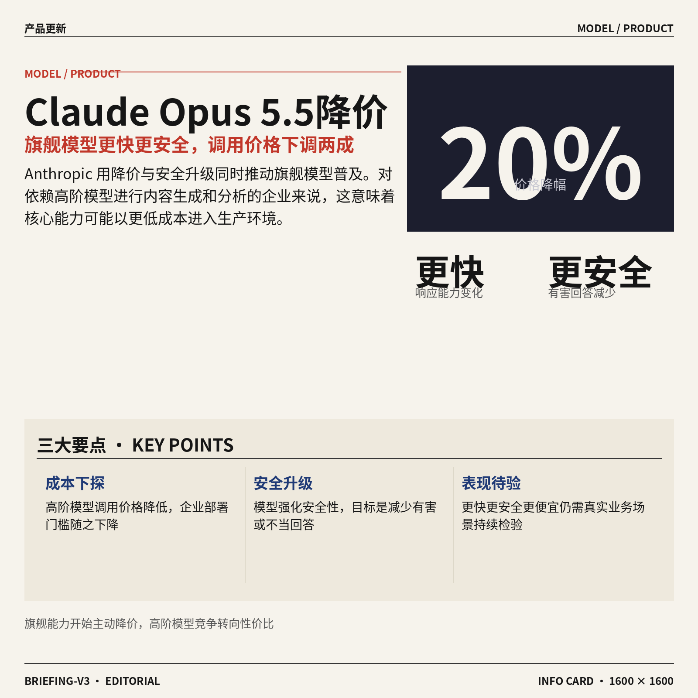

1. **Anthropic 发布 Claude Opus 5.5（Anthropic 的新一代高阶 AI 模型），价格下调 20%。**  
Anthropic 推出 **Claude Opus 5.5**，并将价格降低 **20%**，同时提升**安全性**（让模型更少产生有害或不当回答的能力）🚀。这意味着企业在使用高阶模型完成内容生成、分析等工作时，可能面临更低的调用成本。两家媒体均将重点放在“更快、更安全、更便宜”这三个变化上，值得关注其后续实际表现。[BetaNews 报道(briefing)](https://news.google.com/rss/articles/CBMib0FVX3lxTFB4aS1TNmpMemxLSUxpeGRsaEVwU19tNV9tMlhpUGJZcmxQQThyU3RWdTZmcEdkMFYzYkRQREdMd0wtSzdIVTRZR3JzenV1Q0M2Ylo1WHUxU1Q2NThLbmx1SXB1a1dRcmdaV1VBcF9JQQ?oc=5) [ExtremeTech 评测(briefing)](https://news.google.com/rss/articles/CBMinAFBVV95cUxOY0VqZkk0S0VpZFY4bE1BYXdqd1ltb1h3cmJfRDNQNnpxMTd0WWtSa3NXNkVCb2F6cHBQeE9xeGV3RlFUTjJyeXJDdFVSZmJJbW85S3V1R2x6TnFOT18wQWZnem1tb0ZMbG1iVGJyMlVYVUEwTThUa2Q4QmV2YjlBeEo4ZFQzN0dEV1ZjOVNpVHQzMjdhTTBWdzBFWGI?oc=5)


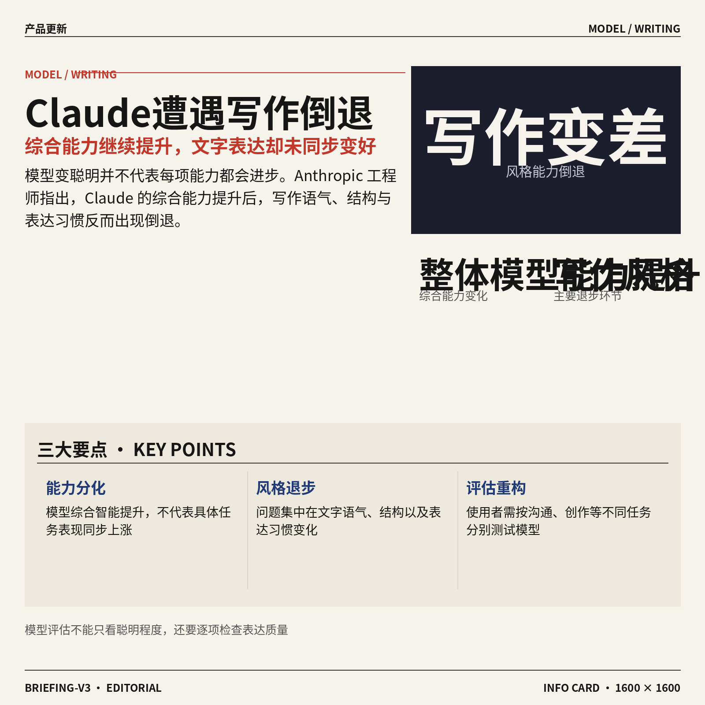

2. **Anthropic 工程师解释：Claude 变得更聪明后，写作反而变差。**  
一篇报道聚焦 Anthropic 工程师对这一现象的解释：**Claude** 的整体模型能力提升后，文字表达效果却出现了倒退。这里的“写作变差”主要指**写作风格**（模型输出文字的语气、结构与表达习惯）发生变化，而不一定代表模型的综合能力下降 💡。这提醒使用者，评估模型不能只看“聪不聪明”，还要单独观察它在沟通、创作等具体任务中的表现。[完整报道(briefing)](https://the-decoder.com/anthropic-engineer-explains-why-claudes-writing-got-worse-although-the-model-got-smarter/)


### 🟢 前沿研究

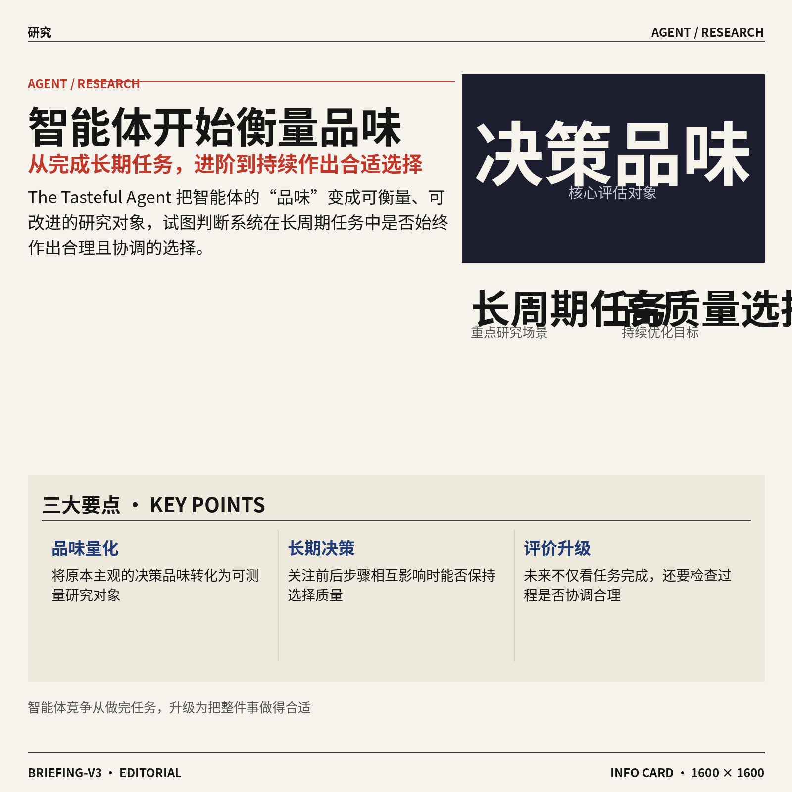

1. **The Tasteful Agent（衡量并提升智能体长期决策“品味”的研究）尝试让人工智能不只会完成任务，还能把事情做得更合适。**
论文把智能体（能够自主规划并执行任务的人工智能系统）的“品味”作为可衡量、可改进的研究对象，而不只是模糊的主观评价 💡。研究重点放在**长周期任务**（需要连续完成多个步骤，后续结果会受到前面选择影响的任务）上，关注系统能否持续作出高质量选择。这个方向意味着，未来评价智能体时可能不仅看“有没有做完”，还会进一步考察整个过程是否合理、协调。[论文原文页面(briefing)](https://huggingface.co/papers/2609.25804)


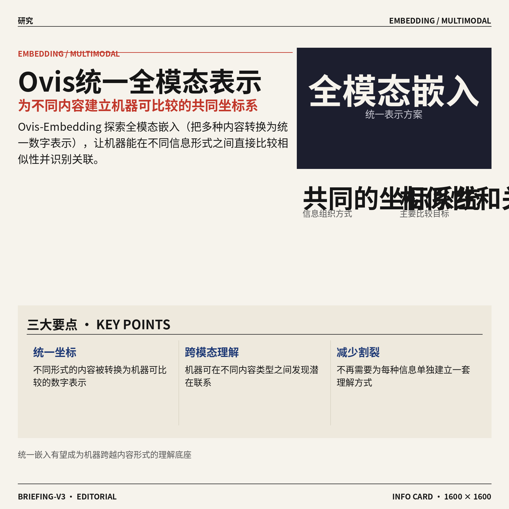

2. **Ovis-Embedding（面向多种信息形式的统一嵌入模型）探索跨模态内容的通用表示。**
这项研究聚焦**全模态嵌入**（把不同形式的内容转换成可供机器统一比较的数字表示），目标是推进更通用的信息理解能力 🚀。嵌入表示（将内容压缩成一组数字，方便机器判断相似性和关联性）相当于给不同内容建立一套共同的“坐标系统”。如果这种统一表示能力得到提升，机器就更容易在不同类型的信息之间发现联系，而不必为每一种内容单独建立理解方式。[论文原文页面(briefing)](https://huggingface.co/papers/2609.25165)

![Ovis-Embedding（面向多种信息形式的统一嵌入模型）探索跨模态内容的通用表示](https://image.pollinations.ai/prompt/Ovis-Embedding%EF%BC%88%E9%9D%A2%E5%90%91%E5%A4%9A%E7%A7%8D%E4%BF%A1%E6%81%AF%E5%BD%A2%E5%BC%8F%E7%9A%84%E7%BB%9F%E4%B8%80%E5%B5%8C%E5%85%A5%E6%A8%A1%E5%9E%8B%EF%BC%89%E6%8E%A2%E7%B4%A2%E8%B7%A8%E6%A8%A1%E6%80%81%E5%86%85%E5%AE%B9%E7%9A%84%E9%80%9A%E7%94%A8%E8%A1%A8%E7%A4%BA.%20Ovis-Embedding%EF%BC%88%E9%9D%A2%E5%90%91%E5%A4%9A%E7%A7%8D%E4%BF%A1%E6%81%AF%E5%BD%A2%E5%BC%8F%E7%9A%84%E7%BB%9F%E4%B8%80%E5%B5%8C%E5%85%A5%E6%A8%A1%E5%9E%8B%EF%BC%89%E6%8E%A2%E7%B4%A2%E8%B7%A8%E6%A8%A1%E6%80%81%E5%86%85%E5%AE%B9%E7%9A%84%E9%80%9A%E7%94%A8%E8%A1%A8%E7%A4%BA%E3%80%82%20%E8%BF%99%E9%A1%B9%E7%A0%94%E7%A9%B6%E8%81%9A%E7%84%A6%E5%85%A8%E6%A8%A1%E6%80%81%E5%B5%8C%E5%85%A5%EF%BC%88%E6%8A%8A%E4%B8%8D%E5%90%8C%E5%BD%A2%E5%BC%8F%E7%9A%84%E5%86%85%E5%AE%B9%E8%BD%AC%E6%8D%A2%E6%88%90%E5%8F%AF%E4%BE%9B%E6%9C%BA%E5%99%A8%E7%BB%9F%E4%B8%80%E6%AF%94%E8%BE%83%E7%9A%84%E6%95%B0%E5%AD%97%E8%A1%A8%2C%20technical%20infographic%20diagram%2C%20architecture%20flowchart%2C%20clean%20vector%20illustration%2C%20educational%20style%2C%20no%20text%20overlay%2C%20modern%20minimal%2C%20wide%20aspect?width=1200&height=675&nologo=true&seed=10838)

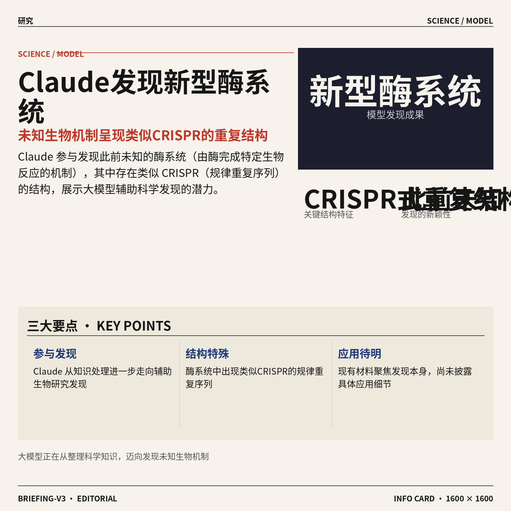

3. **Claude 发现带有 CRISPR（基因研究中常见的规律重复序列）式重复结构的新型酶系统。**
Anthropic 披露，Claude 参与发现了一个此前未知的**酶系统**（由酶参与并完成特定生物反应的一套机制），其中存在类似 CRISPR 的重复序列 🧬。Anthropic 将这项发现与 CRISPR 相提并论，相关媒体也将其视为该公司生物实验室的一项重要进展。它展示了大模型从整理生物知识进一步走向辅助科学发现的可能性，但现有材料主要聚焦“发现”本身，并未提供更多应用细节。[酶系统发现报道(briefing)](https://news.google.com/rss/articles/CBMidkFVX3lxTE9JT0FwTVctZXNkYnJXeW44aHhoZmJfbDYwN3B4a2tMTThJZm9XRklxMkEzdFlxb2Z6VGM2UnpDTGlaQ09PODJUMkJFWWl1UVZOTDJ0WU1UQ1pZMDlrbS0tM3FTS0RGWmNSeGt5QlJjZktQWkl4N0E?oc=5) [相关媒体报道(briefing)](https://news.google.com/rss/articles/CBMikwFBVV95cUxQT2loeHU3b3JGVFhMUEhJb0Qyd2RBaGpmbHFPdW1xVVNfRmF6TWxiNjhkR1NPMGJTT3Z2NW9tblY1YnJrRWtlSFF6c25JMjRQS1RwN1I0QTFKRl9ybDNZaFpZdjlTbTctdkpmVkM4TTRaa2h1OUc1U2NibENyZ2I5MXlEbG15WDdfTDFoUVBwdVhpNXc?oc=5)

![Claude 发现带有 CRISPR（基因研究中常见的规律重复序列）式重复结构的新型酶系统](https://image.pollinations.ai/prompt/Claude%20%E5%8F%91%E7%8E%B0%E5%B8%A6%E6%9C%89%20CRISPR%EF%BC%88%E5%9F%BA%E5%9B%A0%E7%A0%94%E7%A9%B6%E4%B8%AD%E5%B8%B8%E8%A7%81%E7%9A%84%E8%A7%84%E5%BE%8B%E9%87%8D%E5%A4%8D%E5%BA%8F%E5%88%97%EF%BC%89%E5%BC%8F%E9%87%8D%E5%A4%8D%E7%BB%93%E6%9E%84%E7%9A%84%E6%96%B0%E5%9E%8B%E9%85%B6%E7%B3%BB%E7%BB%9F.%20Claude%20%E5%8F%91%E7%8E%B0%E5%B8%A6%E6%9C%89%20CRISPR%EF%BC%88%E5%9F%BA%E5%9B%A0%E7%A0%94%E7%A9%B6%E4%B8%AD%E5%B8%B8%E8%A7%81%E7%9A%84%E8%A7%84%E5%BE%8B%E9%87%8D%E5%A4%8D%E5%BA%8F%E5%88%97%EF%BC%89%E5%BC%8F%E9%87%8D%E5%A4%8D%E7%BB%93%E6%9E%84%E7%9A%84%E6%96%B0%E5%9E%8B%E9%85%B6%E7%B3%BB%E7%BB%9F%E3%80%82%20Anthropic%20%E6%8A%AB%E9%9C%B2%EF%BC%8CClaude%20%E5%8F%82%E4%B8%8E%E5%8F%91%E7%8E%B0%E4%BA%86%E4%B8%80%E4%B8%AA%E6%AD%A4%E5%89%8D%E6%9C%AA%E7%9F%A5%E7%9A%84%E9%85%B6%2C%20technical%20infographic%20diagram%2C%20architecture%20flowchart%2C%20clean%20vector%20illustration%2C%20educational%20style%2C%20no%20text%20overlay%2C%20modern%20minimal%2C%20wide%20aspect?width=1200&height=675&nologo=true&seed=10869)

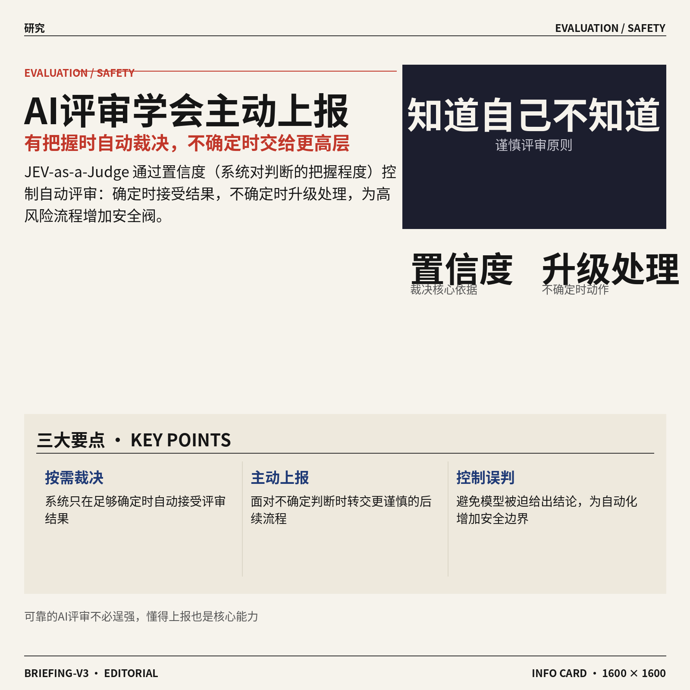

4. **JEV-as-a-Judge（让人工智能有把握时裁决、没把握时上报的评审机制）主打“知道自己不知道”。**
这项研究提出一种更谨慎的自动评审思路：系统在足够确定时接受结果，不确定时则主动**升级处理**（转交给更谨慎或更高层的流程继续判断）🛡️。其核心依据是**置信度**（系统对自身判断有多大把握），而不是要求模型无论如何都给出结论。对需要控制误判风险的工作来说，这种设计的价值在于为自动化判断增加一道“不会就别硬答”的安全阀。[论文原文页面(briefing)](https://huggingface.co/papers/2609.26550)

![JEV-as-a-Judge（让人工智能有把握时裁决、没把握时上报的评审机制）主打“知道自己不知道”](https://image.pollinations.ai/prompt/JEV-as-a-Judge%EF%BC%88%E8%AE%A9%E4%BA%BA%E5%B7%A5%E6%99%BA%E8%83%BD%E6%9C%89%E6%8A%8A%E6%8F%A1%E6%97%B6%E8%A3%81%E5%86%B3%E3%80%81%E6%B2%A1%E6%8A%8A%E6%8F%A1%E6%97%B6%E4%B8%8A%E6%8A%A5%E7%9A%84%E8%AF%84%E5%AE%A1%E6%9C%BA%E5%88%B6%EF%BC%89%E4%B8%BB%E6%89%93%E2%80%9C%E7%9F%A5%E9%81%93%E8%87%AA%E5%B7%B1%E4%B8%8D%E7%9F%A5%E9%81%93%E2%80%9D.%20JEV-as-a-Judge%EF%BC%88%E8%AE%A9%E4%BA%BA%E5%B7%A5%E6%99%BA%E8%83%BD%E6%9C%89%E6%8A%8A%E6%8F%A1%E6%97%B6%E8%A3%81%E5%86%B3%E3%80%81%E6%B2%A1%E6%8A%8A%E6%8F%A1%E6%97%B6%E4%B8%8A%E6%8A%A5%E7%9A%84%E8%AF%84%E5%AE%A1%E6%9C%BA%E5%88%B6%EF%BC%89%E4%B8%BB%E6%89%93%E2%80%9C%E7%9F%A5%E9%81%93%E8%87%AA%E5%B7%B1%E4%B8%8D%E7%9F%A5%E9%81%93%E2%80%9D%E3%80%82%20%E8%BF%99%E9%A1%B9%E7%A0%94%E7%A9%B6%E6%8F%90%E5%87%BA%E4%B8%80%E7%A7%8D%E6%9B%B4%E8%B0%A8%E6%85%8E%E7%9A%84%E8%87%AA%E5%8A%A8%E8%AF%84%E5%AE%A1%E6%80%9D%E8%B7%AF%EF%BC%9A%E7%B3%BB%E7%BB%9F%E5%9C%A8%E8%B6%B3%E5%A4%9F%E7%A1%AE%E5%AE%9A%E6%97%B6%E6%8E%A5%2C%20technical%20infographic%20diagram%2C%20architecture%20flowchart%2C%20clean%20vector%20illustration%2C%20educational%20style%2C%20no%20text%20overlay%2C%20modern%20minimal%2C%20wide%20aspect?width=1200&height=675&nologo=true&seed=10900)

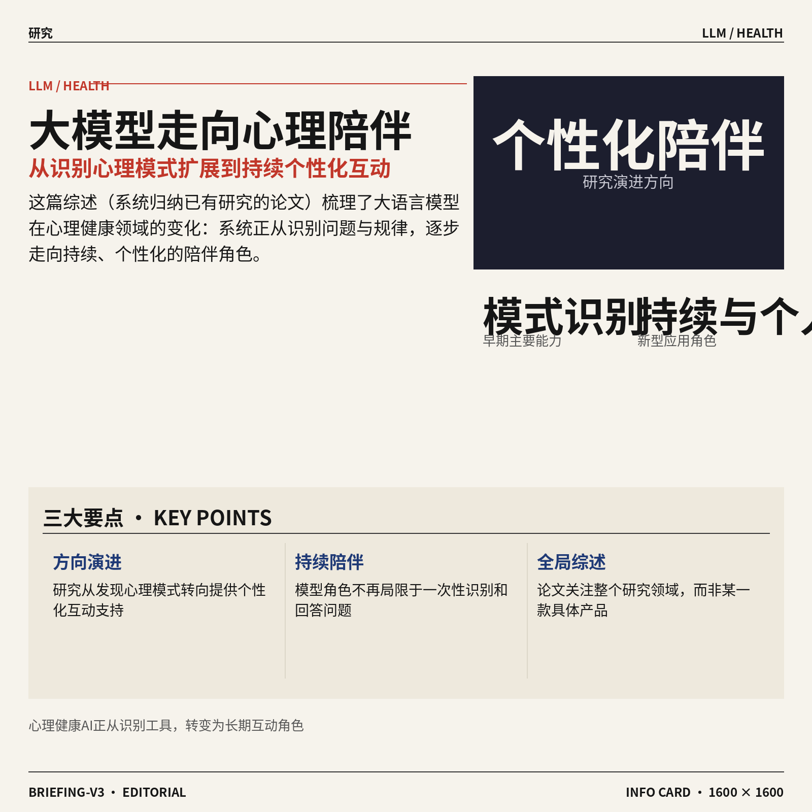

5. **心理健康领域的大语言模型（能够理解并生成文字的通用模型）正从模式识别走向个性化陪伴。**
这是一篇**综述**（系统梳理并归纳已有研究的论文），关注大语言模型在心理健康领域的发展脉络 🧠。论文标题所描述的变化，是模型从**模式识别**（从大量信息中寻找规律和特征）逐渐走向更具个性化的陪伴角色。它关注的并非某一款新产品，而是整个研究方向如何从“识别问题”扩展到“持续与个人互动”。[论文原文页面(briefing)](https://huggingface.co/papers/2609.25186)

![心理健康领域的大语言模型（能够理解并生成文字的通用模型）正从模式识别走向个性化陪伴](https://image.pollinations.ai/prompt/%E5%BF%83%E7%90%86%E5%81%A5%E5%BA%B7%E9%A2%86%E5%9F%9F%E7%9A%84%E5%A4%A7%E8%AF%AD%E8%A8%80%E6%A8%A1%E5%9E%8B%EF%BC%88%E8%83%BD%E5%A4%9F%E7%90%86%E8%A7%A3%E5%B9%B6%E7%94%9F%E6%88%90%E6%96%87%E5%AD%97%E7%9A%84%E9%80%9A%E7%94%A8%E6%A8%A1%E5%9E%8B%EF%BC%89%E6%AD%A3%E4%BB%8E%E6%A8%A1%E5%BC%8F%E8%AF%86%E5%88%AB%E8%B5%B0%E5%90%91%E4%B8%AA%E6%80%A7%E5%8C%96%E9%99%AA%E4%BC%B4.%20%E5%BF%83%E7%90%86%E5%81%A5%E5%BA%B7%E9%A2%86%E5%9F%9F%E7%9A%84%E5%A4%A7%E8%AF%AD%E8%A8%80%E6%A8%A1%E5%9E%8B%EF%BC%88%E8%83%BD%E5%A4%9F%E7%90%86%E8%A7%A3%E5%B9%B6%E7%94%9F%E6%88%90%E6%96%87%E5%AD%97%E7%9A%84%E9%80%9A%E7%94%A8%E6%A8%A1%E5%9E%8B%EF%BC%89%E6%AD%A3%E4%BB%8E%E6%A8%A1%E5%BC%8F%E8%AF%86%E5%88%AB%E8%B5%B0%E5%90%91%E4%B8%AA%E6%80%A7%E5%8C%96%E9%99%AA%E4%BC%B4%E3%80%82%20%E8%BF%99%E6%98%AF%E4%B8%80%E7%AF%87%E7%BB%BC%E8%BF%B0%EF%BC%88%E7%B3%BB%E7%BB%9F%E6%A2%B3%E7%90%86%E5%B9%B6%E5%BD%92%E7%BA%B3%E5%B7%B2%E6%9C%89%E7%A0%94%E7%A9%B6%E7%9A%84%E8%AE%BA%E6%96%87%EF%BC%89%EF%BC%8C%E5%85%B3%E6%B3%A8%E5%A4%A7%E8%AF%AD%E8%A8%80%E6%A8%A1%E5%9E%8B%E5%9C%A8%E5%BF%83%E7%90%86%E5%81%A5%E5%BA%B7%E9%A2%86%E5%9F%9F%2C%20technical%20infographic%20diagram%2C%20architecture%20flowchart%2C%20clean%20vector%20illustration%2C%20educational%20style%2C%20no%20text%20overlay%2C%20modern%20minimal%2C%20wide%20aspect?width=1200&height=675&nologo=true&seed=10931)

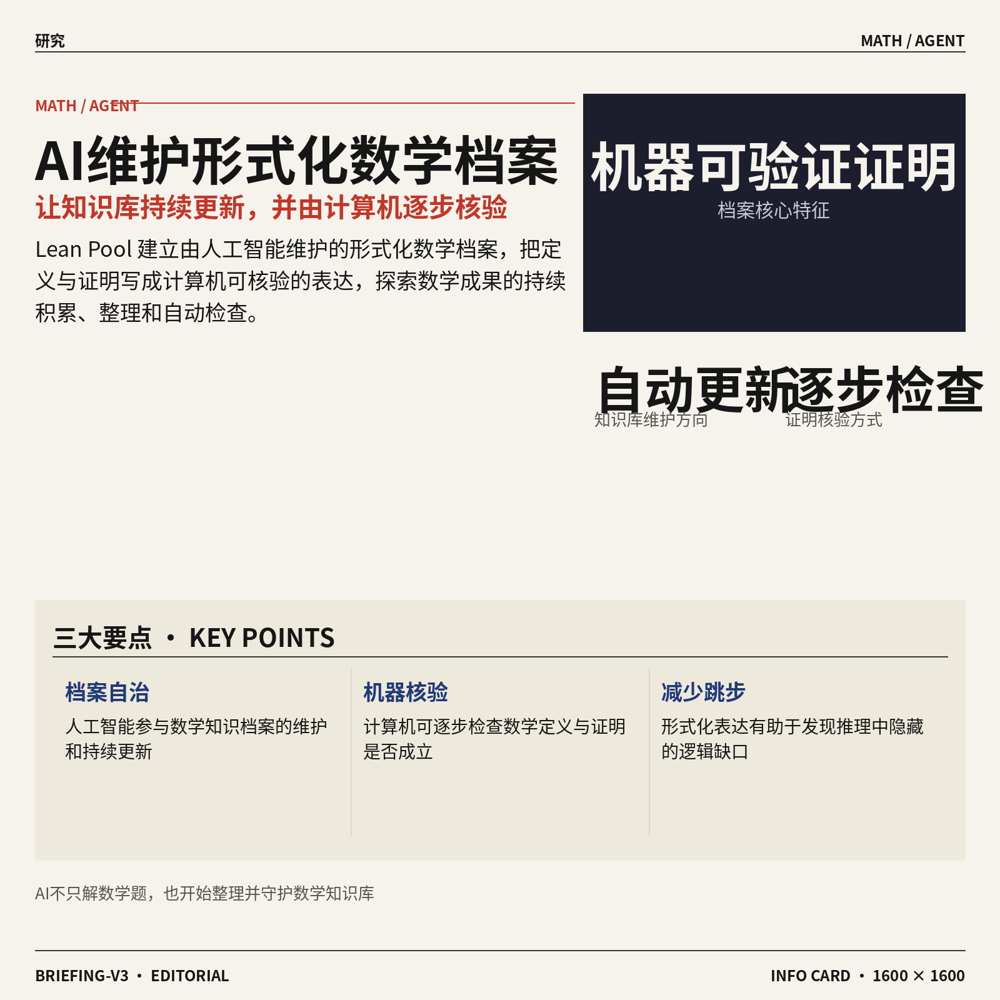

6. **Lean Pool（由人工智能维护的形式化数学档案项目）探索让数学知识库自动更新。**
该项目建立了一个由人工智能维护的**形式化数学**档案（把数学定义和证明写成计算机可以逐步核验的表达）📐。与普通数学文档相比，这类档案强调**机器可验证证明**（计算机能够逐步检查推理是否成立），有助于减少隐藏的逻辑跳步。研究重点在于让人工智能参与档案维护，为持续积累、整理和核验数学成果探索新方式。[论文原文页面(briefing)](https://huggingface.co/papers/2609.25199)

![Lean Pool（由人工智能维护的形式化数学档案项目）探索让数学知识库自动更新](https://image.pollinations.ai/prompt/Lean%20Pool%EF%BC%88%E7%94%B1%E4%BA%BA%E5%B7%A5%E6%99%BA%E8%83%BD%E7%BB%B4%E6%8A%A4%E7%9A%84%E5%BD%A2%E5%BC%8F%E5%8C%96%E6%95%B0%E5%AD%A6%E6%A1%A3%E6%A1%88%E9%A1%B9%E7%9B%AE%EF%BC%89%E6%8E%A2%E7%B4%A2%E8%AE%A9%E6%95%B0%E5%AD%A6%E7%9F%A5%E8%AF%86%E5%BA%93%E8%87%AA%E5%8A%A8%E6%9B%B4%E6%96%B0.%20Lean%20Pool%EF%BC%88%E7%94%B1%E4%BA%BA%E5%B7%A5%E6%99%BA%E8%83%BD%E7%BB%B4%E6%8A%A4%E7%9A%84%E5%BD%A2%E5%BC%8F%E5%8C%96%E6%95%B0%E5%AD%A6%E6%A1%A3%E6%A1%88%E9%A1%B9%E7%9B%AE%EF%BC%89%E6%8E%A2%E7%B4%A2%E8%AE%A9%E6%95%B0%E5%AD%A6%E7%9F%A5%E8%AF%86%E5%BA%93%E8%87%AA%E5%8A%A8%E6%9B%B4%E6%96%B0%E3%80%82%20%E8%AF%A5%E9%A1%B9%E7%9B%AE%E5%BB%BA%E7%AB%8B%E4%BA%86%E4%B8%80%E4%B8%AA%E7%94%B1%E4%BA%BA%E5%B7%A5%E6%99%BA%E8%83%BD%E7%BB%B4%E6%8A%A4%E7%9A%84%E5%BD%A2%E5%BC%8F%E5%8C%96%E6%95%B0%E5%AD%A6%E6%A1%A3%E6%A1%88%EF%BC%88%E6%8A%8A%E6%95%B0%E5%AD%A6%E5%AE%9A%E4%B9%89%E5%92%8C%E8%AF%81%E6%98%8E%E5%86%99%E6%88%90%E8%AE%A1%E7%AE%97%E6%9C%BA%E5%8F%AF%2C%20technical%20infographic%20diagram%2C%20architecture%20flowchart%2C%20clean%20vector%20illustration%2C%20educational%20style%2C%20no%20text%20overlay%2C%20modern%20minimal%2C%20wide%20aspect?width=1200&height=675&nologo=true&seed=10962)

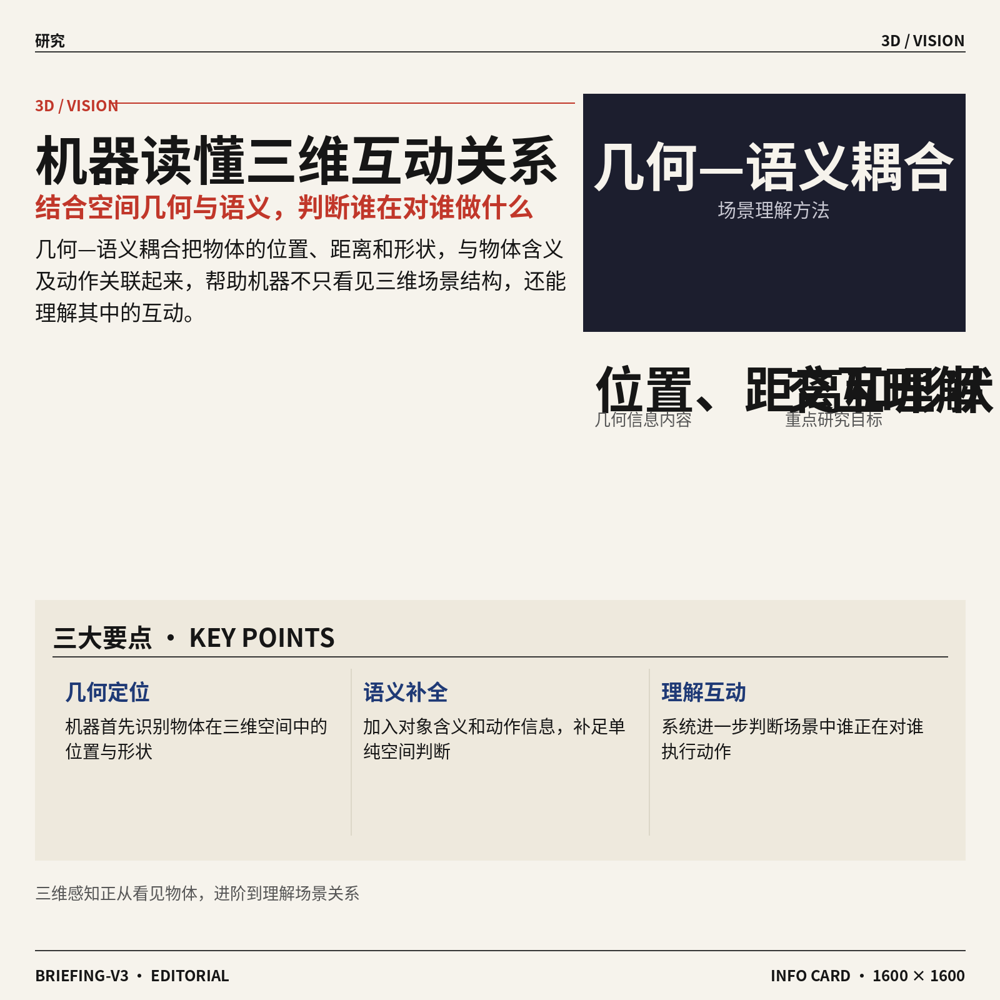

7. **几何—语义耦合（把空间结构与内容含义关联起来）帮助机器理解三维场景中的互动。**
这项研究将**几何信息**（物体的位置、距离和形状）与**语义信息**（物体是什么、相关动作意味着什么）结合，用于理解三维场景中的交互关系 👀。只看几何结构，机器可能知道两个对象离得很近，却不一定明白它们正在发生什么；加入语义后，场景理解会更完整。论文关注的**交互理解**（判断场景中谁在对谁做什么）是机器认识真实空间的重要环节。[论文原文页面(briefing)](https://huggingface.co/papers/2609.25247)

![几何—语义耦合（把空间结构与内容含义关联起来）帮助机器理解三维场景中的互动](https://image.pollinations.ai/prompt/%E5%87%A0%E4%BD%95%E2%80%94%E8%AF%AD%E4%B9%89%E8%80%A6%E5%90%88%EF%BC%88%E6%8A%8A%E7%A9%BA%E9%97%B4%E7%BB%93%E6%9E%84%E4%B8%8E%E5%86%85%E5%AE%B9%E5%90%AB%E4%B9%89%E5%85%B3%E8%81%94%E8%B5%B7%E6%9D%A5%EF%BC%89%E5%B8%AE%E5%8A%A9%E6%9C%BA%E5%99%A8%E7%90%86%E8%A7%A3%E4%B8%89%E7%BB%B4%E5%9C%BA%E6%99%AF%E4%B8%AD%E7%9A%84%E4%BA%92%E5%8A%A8.%20%E5%87%A0%E4%BD%95%E2%80%94%E8%AF%AD%E4%B9%89%E8%80%A6%E5%90%88%EF%BC%88%E6%8A%8A%E7%A9%BA%E9%97%B4%E7%BB%93%E6%9E%84%E4%B8%8E%E5%86%85%E5%AE%B9%E5%90%AB%E4%B9%89%E5%85%B3%E8%81%94%E8%B5%B7%E6%9D%A5%EF%BC%89%E5%B8%AE%E5%8A%A9%E6%9C%BA%E5%99%A8%E7%90%86%E8%A7%A3%E4%B8%89%E7%BB%B4%E5%9C%BA%E6%99%AF%E4%B8%AD%E7%9A%84%E4%BA%92%E5%8A%A8%E3%80%82%20%E8%BF%99%E9%A1%B9%E7%A0%94%E7%A9%B6%E5%B0%86%E5%87%A0%E4%BD%95%E4%BF%A1%E6%81%AF%EF%BC%88%E7%89%A9%E4%BD%93%E7%9A%84%E4%BD%8D%E7%BD%AE%E3%80%81%E8%B7%9D%E7%A6%BB%E5%92%8C%E5%BD%A2%E7%8A%B6%EF%BC%89%E4%B8%8E%E8%AF%AD%E4%B9%89%E4%BF%A1%E6%81%AF%EF%BC%88%E7%89%A9%E4%BD%93%E6%98%AF%E4%BB%80%E4%B9%88%E3%80%81%E7%9B%B8%E5%85%B3%E5%8A%A8%E4%BD%9C%E6%84%8F%E5%91%B3%E7%9D%80%2C%20technical%20infographic%20diagram%2C%20architecture%20flowchart%2C%20clean%20vector%20illustration%2C%20educational%20style%2C%20no%20text%20overlay%2C%20modern%20minimal%2C%20wide%20aspect?width=1200&height=675&nologo=true&seed=10993)

### 🟡 行业展望与社会影响

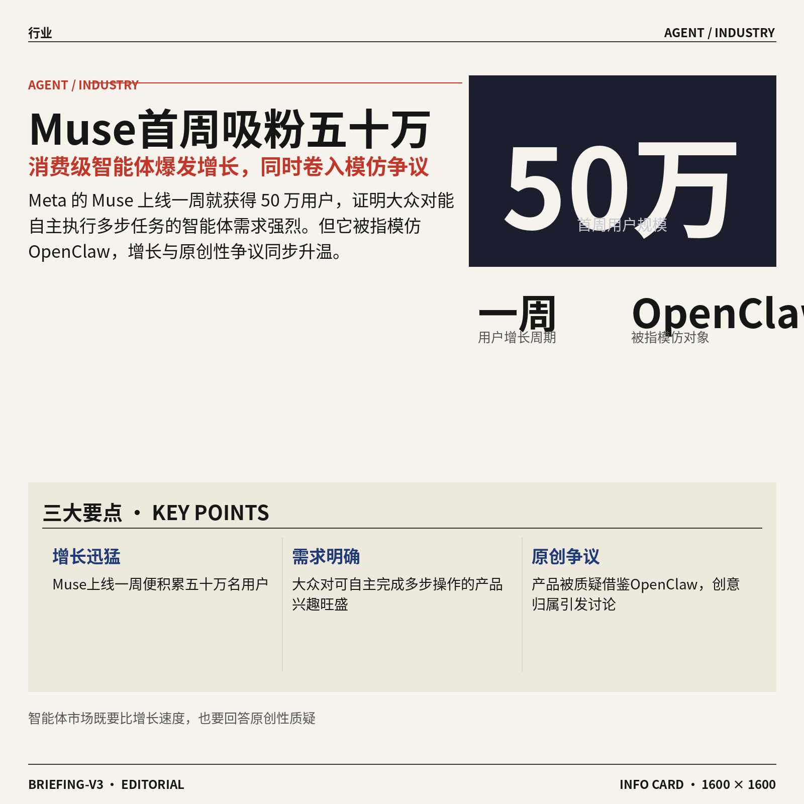

1. **Meta 的 Muse（AI 智能体产品，可代用户执行任务）一周吸引 50 万用户，同时陷入模仿争议。**
Muse 上线一周便获得 **50 万用户**，显示大众对能直接执行任务的 **AI 智能体（能够理解目标并自主完成多步操作的人工智能）**需求相当旺盛 🚀。与此同时，它也被质疑模仿 OpenClaw（被指遭其借鉴的另一款 AI 产品），让**产品原创性**成为讨论焦点。增长速度与争议同步出现，说明智能体市场不仅在比用户规模，也越来越需要正面回应创意归属与行业规则问题。[Muse 用户与争议报道(briefing)](https://the-decoder.com/metas-ai-agent-muse-draws-500000-users-in-a-week-along-with-claims-it-copied-openclaw/)


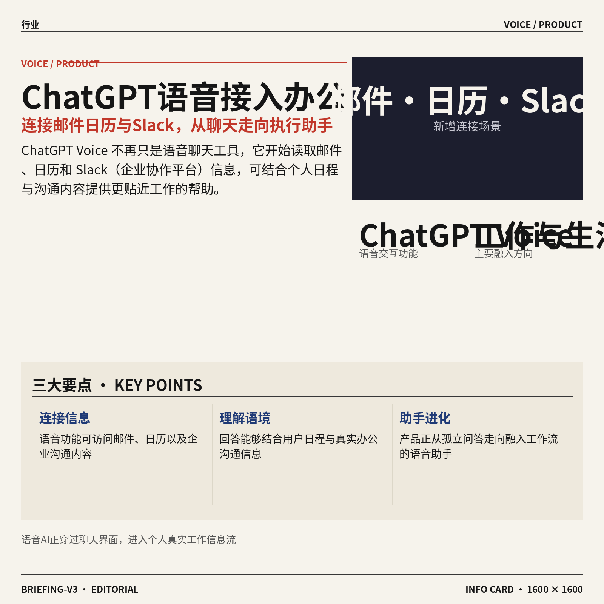

2. **ChatGPT Voice（ChatGPT 的语音交互功能）接入邮件、日历与 Slack（企业沟通协作平台），更接近电影《她》中的助手。**
ChatGPT 的语音功能正在从“陪你聊天”走向“连接工作信息”，可访问**邮件、日历和 Slack** 💬。这类连接能力意味着语音助手能够结合个人日程与办公沟通内容提供帮助，而不只是回答孤立问题。报道将其与《她》（描绘人类与智能语音助手相处的科幻电影）类比，也折射出 **AI（人工智能）语音助手**正逐渐融入真实工作与生活场景。[语音助手能力报道(briefing)](https://the-decoder.com/chatgpt-voice-gets-closer-to-her-with-email-calendar-and-slack-access/)

![ChatGPT Voice（ChatGPT 的语音交互功能）接入邮件、日历与 Slack（企业沟通协作平台），更接近电影《她》中的助手](https://image.pollinations.ai/prompt/ChatGPT%20Voice%EF%BC%88ChatGPT%20%E7%9A%84%E8%AF%AD%E9%9F%B3%E4%BA%A4%E4%BA%92%E5%8A%9F%E8%83%BD%EF%BC%89%E6%8E%A5%E5%85%A5%E9%82%AE%E4%BB%B6%E3%80%81%E6%97%A5%E5%8E%86%E4%B8%8E%20Slack%EF%BC%88%E4%BC%81%E4%B8%9A%E6%B2%9F%E9%80%9A%E5%8D%8F%E4%BD%9C%E5%B9%B3%E5%8F%B0%EF%BC%89%EF%BC%8C%E6%9B%B4%E6%8E%A5%E8%BF%91%E7%94%B5%E5%BD%B1%E3%80%8A%E5%A5%B9%E3%80%8B%E4%B8%AD%E7%9A%84%E5%8A%A9%E6%89%8B.%20ChatGPT%20Voice%EF%BC%88ChatGPT%20%E7%9A%84%E8%AF%AD%E9%9F%B3%E4%BA%A4%E4%BA%92%E5%8A%9F%E8%83%BD%EF%BC%89%E6%8E%A5%E5%85%A5%E9%82%AE%E4%BB%B6%E3%80%81%E6%97%A5%E5%8E%86%E4%B8%8E%20Slack%EF%BC%88%E4%BC%81%E4%B8%9A%E6%B2%9F%E9%80%9A%E5%8D%8F%E4%BD%9C%E5%B9%B3%E5%8F%B0%EF%BC%89%EF%BC%8C%E6%9B%B4%E6%8E%A5%E8%BF%91%E7%94%B5%E5%BD%B1%E3%80%8A%E5%A5%B9%E3%80%8B%E4%B8%AD%E7%9A%84%E5%8A%A9%E6%89%8B%E3%80%82%20ChatGPT%20%E7%9A%84%E8%AF%AD%E9%9F%B3%2C%20technical%20infographic%20diagram%2C%20architecture%20flowchart%2C%20clean%20vector%20illustration%2C%20educational%20style%2C%20no%20text%20overlay%2C%20modern%20minimal%2C%20wide%20aspect?width=1200&height=675&nologo=true&seed=10838)

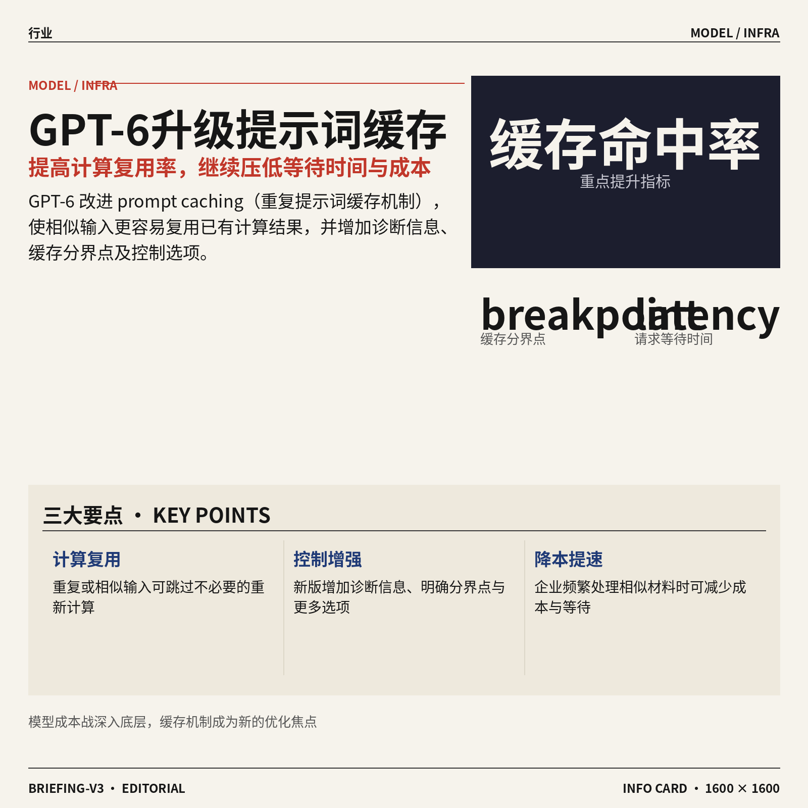

3. **GPT-6（OpenAI 的新一代大模型）改进 prompt caching（重复提示词缓存机制），进一步降低使用成本与等待时间。**
OpenAI 表示，GPT-6 提升了 **缓存命中率（系统成功复用已有计算结果的比例）**，让重复或相似输入更容易跳过不必要的重新计算 ⚡。新版还加入诊断信息、明确的 **breakpoint（缓存分界点，用来指定哪些内容从此处重新处理）**以及更多控制选项。这些改进的直接目标是减少 **latency（从提交请求到收到回答的等待时间）**和调用成本，对需要频繁处理相似材料的企业应用尤其值得关注 💡。[官方缓存机制说明(briefing)](https://openai.com/index/better-prompt-caching-for-gpt-6)

![GPT-6（OpenAI 的新一代大模型）改进 prompt caching（重复提示词缓存机制），进一步降低使用成本与等待时间](https://image.pollinations.ai/prompt/GPT-6%EF%BC%88OpenAI%20%E7%9A%84%E6%96%B0%E4%B8%80%E4%BB%A3%E5%A4%A7%E6%A8%A1%E5%9E%8B%EF%BC%89%E6%94%B9%E8%BF%9B%20prompt%20caching%EF%BC%88%E9%87%8D%E5%A4%8D%E6%8F%90%E7%A4%BA%E8%AF%8D%E7%BC%93%E5%AD%98%E6%9C%BA%E5%88%B6%EF%BC%89%EF%BC%8C%E8%BF%9B%E4%B8%80%E6%AD%A5%E9%99%8D%E4%BD%8E%E4%BD%BF%E7%94%A8%E6%88%90%E6%9C%AC%E4%B8%8E%E7%AD%89%E5%BE%85%E6%97%B6%E9%97%B4.%20GPT-6%EF%BC%88OpenAI%20%E7%9A%84%E6%96%B0%E4%B8%80%E4%BB%A3%E5%A4%A7%E6%A8%A1%E5%9E%8B%EF%BC%89%E6%94%B9%E8%BF%9B%20prompt%20caching%EF%BC%88%E9%87%8D%E5%A4%8D%E6%8F%90%E7%A4%BA%E8%AF%8D%E7%BC%93%E5%AD%98%E6%9C%BA%E5%88%B6%EF%BC%89%EF%BC%8C%E8%BF%9B%E4%B8%80%E6%AD%A5%E9%99%8D%E4%BD%8E%E4%BD%BF%E7%94%A8%E6%88%90%E6%9C%AC%E4%B8%8E%E7%AD%89%E5%BE%85%E6%97%B6%E9%97%B4%E3%80%82%20OpenAI%20%E8%A1%A8%E7%A4%BA%EF%BC%8CGPT-%2C%20technical%20infographic%20diagram%2C%20architecture%20flowchart%2C%20clean%20vector%20illustration%2C%20educational%20style%2C%20no%20text%20overlay%2C%20modern%20minimal%2C%20wide%20aspect?width=1200&height=675&nologo=true&seed=10869)

4. **Gemini 3.8 text-to-speech（把文字自动转换成语音的模型）正式亮相。**
Google 介绍了 Gemini 3.8 的 **text-to-speech（文字转语音，让模型把书面内容朗读出来）**能力 🔊。这意味着 Gemini 的能力继续从文字内容处理延伸至语音输出，让信息不只能够被阅读，也可以直接被听见。对行业而言，**语音生成模型（把文字内容合成为人声的人工智能模型）**是连接数字内容与自然交互的重要环节，也会持续影响语音助手等产品形态。[Google 官方发布文章(briefing)](https://deepmind.google/blog/say-hello-to-gemini-38-text-to-speech/)


### 🟣 开源TOP项目

1. **treg（面向 Agent 工具的统一调用项目）开源，定位类似 OpenRouter。**  
该项目将自己定位为 **OpenRouter（模型与工具调用的路由服务）**，但服务对象从模型扩展到了 **Agent 工具（让 AI 代替人执行具体操作的外部能力）**。简单说，它希望为不同 Agent 统一接入和调用工具，降低工具连接的复杂度。项目同时提供社区交流入口，方便使用者参与讨论 🚀。[项目官方仓库(briefing)](https://github.com/superdesigndev/treg)


2. **PanWatch（自托管 AI 盯盘助手）覆盖 A 股、港股与美股。**  
PanWatch 是一款**自托管（部署在自己的设备或服务器上，不必交给第三方管理）**的 AI 盯盘助手，支持实时监控、持仓管理、智能分析和全渠道推送。它集成 **TradingAgents（让多个 AI 角色分工协作进行投资决策的项目）**，尝试用多 Agent 方式辅助分析市场。对投资者来说，它更像一个可以自己部署的自动化看盘工作台 📈。[项目官方仓库(briefing)](https://github.com/TNT-Likely/PanWatch)


3. **MVT（Mobile Verification Toolkit，移动设备安全取证工具）帮助排查手机是否遭到入侵。**  
MVT 面向移动设备开展**数字取证（从设备中提取并分析痕迹，以判断是否存在安全问题）**，用于寻找潜在的设备遭入侵迹象。它关注的不是日常手机管理，而是通过设备分析辅助发现可疑情况。对于安全团队或需要调查移动设备风险的组织，这是一个开源的排查工具 🔍。[项目官方仓库(briefing)](https://github.com/mvt-project/mvt)


4. **harness-sdk（用于搭建和全程控制 AI Agent 的开发工具包）支持多种模型与云环境。**  
这个开源 **SDK（帮助开发者快速搭建软件能力的工具包）**，用于构建并端到端控制生产环境中的 AI Agent。项目支持 **Python（常见的编程语言）** 和 **TypeScript（带类型检查的编程语言）**，并强调可以适配不同模型和云环境。对开发团队而言，它提供的是一套更完整的 Agent 执行与控制基础设施，而不只是单个功能组件 🛠️。[项目官方仓库(briefing)](https://github.com/strands-agents/harness-sdk)

![harness-sdk（用于搭建和全程控制 AI Agent 的开发工具包）支持多种模型与云环境](https://image.pollinations.ai/prompt/harness-sdk%EF%BC%88%E7%94%A8%E4%BA%8E%E6%90%AD%E5%BB%BA%E5%92%8C%E5%85%A8%E7%A8%8B%E6%8E%A7%E5%88%B6%20AI%20Agent%20%E7%9A%84%E5%BC%80%E5%8F%91%E5%B7%A5%E5%85%B7%E5%8C%85%EF%BC%89%E6%94%AF%E6%8C%81%E5%A4%9A%E7%A7%8D%E6%A8%A1%E5%9E%8B%E4%B8%8E%E4%BA%91%E7%8E%AF%E5%A2%83.%20harness-sdk%EF%BC%88%E7%94%A8%E4%BA%8E%E6%90%AD%E5%BB%BA%E5%92%8C%E5%85%A8%E7%A8%8B%E6%8E%A7%E5%88%B6%20AI%20Agent%20%E7%9A%84%E5%BC%80%E5%8F%91%E5%B7%A5%E5%85%B7%E5%8C%85%EF%BC%89%E6%94%AF%E6%8C%81%E5%A4%9A%E7%A7%8D%E6%A8%A1%E5%9E%8B%E4%B8%8E%E4%BA%91%E7%8E%AF%E5%A2%83%E3%80%82%20%E8%BF%99%E4%B8%AA%E5%BC%80%E6%BA%90%20SDK%EF%BC%88%E5%B8%AE%E5%8A%A9%E5%BC%80%E5%8F%91%E8%80%85%E5%BF%AB%E9%80%9F%E6%90%AD%E5%BB%BA%E8%BD%AF%E4%BB%B6%E8%83%BD%E5%8A%9B%E7%9A%84%E5%B7%A5%E5%85%B7%E5%8C%85%EF%BC%89%EF%BC%8C%E7%94%A8%E4%BA%8E%2C%20technical%20infographic%20diagram%2C%20architecture%20flowchart%2C%20clean%20vector%20illustration%2C%20educational%20style%2C%20no%20text%20overlay%2C%20modern%20minimal%2C%20wide%20aspect?width=1200&height=675&nologo=true&seed=11094)

### 🔴 社媒分享

1. **YouTube（Google 旗下视频平台）CEO 尼尔·莫汉：我们选择押注人工智能，而不是害怕它。**
尼尔·莫汉在访谈中明确表达了平台对**人工智能**的积极态度：与其只关注风险，不如主动探索它能创造什么价值 🚀。这场对话聚焦平台管理者如何看待人工智能带来的机会，以及为什么选择“下注”而非回避。对于内容与运营团队而言，这种高层表态也是观察大型内容平台未来方向的重要信号 💡。[CEO 完整访谈(briefing)](https://www.bigtechnology.com/p/youtube-ceo-neal-mohan-why-were-betting)


2. **Gemini 3.8（Google 的文字转语音模型）发布，并有配套体验场可供试用。**
Google 推出了 Gemini 3.8 的**文本转语音能力**（把输入文字自动合成为语音），重点指向人工智能语音内容生成 🔊。与此同时，第三方还制作了 Playground（用于试用和比较模型输出的交互页面），方便用户更直观地感受模型效果。语音合成正在成为内容制作、人机交互等场景的重要基础能力，值得设计与运营同事持续关注 👀。[Google 官方发布页(briefing)](https://blog.google/innovation-and-ai/models-and-research/gemini-models/gemini-3-8-text-to-speech/) [第三方体验介绍(briefing)](https://simonwillison.net/2026/Sep/23/gemini-tts-playground/)


3. **Claude 发现：只要能准确测量问题，就能进一步提升运行速度。**
Claude 开发团队分享了如何通过**性能测量**（记录系统每个环节耗时，找出真正拖慢速度的位置）推动产品提速 ⚡。其核心思路很直白：先让问题变得可量化，再建立**优化闭环**（测量、改进、重新验证并持续重复的流程）。这也提醒业务团队，提升效率不能只凭感觉，找到可追踪的指标往往才是改进的起点 💡。[Claude 提速实践(briefing)](https://claude.dev/blog/how-we-made-claude-ai-faster/)


4. **Claude 发现带有 CRISPR（细菌识别特定遗传片段、也是基因编辑基础的系统）类重复序列的新型酶系统。**
Anthropic 公布了一项 Claude 参与的生物学发现：一个此前未被认识的**酶系统**（由能推动生化反应的蛋白质组成的工作体系）🧬。该系统包含类似 CRISPR 的**重复序列**（遗传信息中反复出现的片段），因此具有进一步研究价值。它展示了 Claude 不只可以整理已有知识，也能参与科研探索并提出新的发现线索 🔬。[Anthropic 研究公告(briefing)](https://www.anthropic.com/news/claude-discovers-novel-enzyme-system)

![Claude 发现带有 CRISPR（细菌识别特定遗传片段、也是基因编辑基础的系统）类重复序列的新型酶系统](https://image.pollinations.ai/prompt/Claude%20%E5%8F%91%E7%8E%B0%E5%B8%A6%E6%9C%89%20CRISPR%EF%BC%88%E7%BB%86%E8%8F%8C%E8%AF%86%E5%88%AB%E7%89%B9%E5%AE%9A%E9%81%97%E4%BC%A0%E7%89%87%E6%AE%B5%E3%80%81%E4%B9%9F%E6%98%AF%E5%9F%BA%E5%9B%A0%E7%BC%96%E8%BE%91%E5%9F%BA%E7%A1%80%E7%9A%84%E7%B3%BB%E7%BB%9F%EF%BC%89%E7%B1%BB%E9%87%8D%E5%A4%8D%E5%BA%8F%E5%88%97%E7%9A%84%E6%96%B0%E5%9E%8B%E9%85%B6%E7%B3%BB%E7%BB%9F.%20Claude%20%E5%8F%91%E7%8E%B0%E5%B8%A6%E6%9C%89%20CRISPR%EF%BC%88%E7%BB%86%E8%8F%8C%E8%AF%86%E5%88%AB%E7%89%B9%E5%AE%9A%E9%81%97%E4%BC%A0%E7%89%87%E6%AE%B5%E3%80%81%E4%B9%9F%E6%98%AF%E5%9F%BA%E5%9B%A0%E7%BC%96%E8%BE%91%E5%9F%BA%E7%A1%80%E7%9A%84%E7%B3%BB%E7%BB%9F%EF%BC%89%E7%B1%BB%E9%87%8D%E5%A4%8D%E5%BA%8F%E5%88%97%E7%9A%84%E6%96%B0%E5%9E%8B%E9%85%B6%E7%B3%BB%E7%BB%9F%E3%80%82%20Anthropic%20%E5%85%AC%E5%B8%83%E4%BA%86%E4%B8%80%E9%A1%B9%20Claude%20%E5%8F%82%E4%B8%8E%2C%20technical%20infographic%20diagram%2C%20architecture%20flowchart%2C%20clean%20vector%20illustration%2C%20educational%20style%2C%20no%20text%20overlay%2C%20modern%20minimal%2C%20wide%20aspect?width=1200&height=675&nologo=true&seed=10706)

5. **Muse（Meta 被讨论的消费级智能代理项目）引发热议：智能代理是未来，还是泡沫？**
这篇文章围绕 Muse 展开讨论，并把问题指向**消费级智能代理**（面向普通用户、能够自行拆解并执行任务的人工智能助手）🤖。文章关注的核心并不是智能代理能否完成演示，而是它是否真能成为大众长期使用的产品。面对行业对**自主执行任务**（用户给出目标后，由人工智能连续完成多个步骤）的热情，这篇讨论提供了一种更谨慎的观察视角 👀。[消费级代理讨论(briefing)](https://www.platformer.news/meta-muse-consumer-agents/)

![Muse（Meta 被讨论的消费级智能代理项目）引发热议：智能代理是未来，还是泡沫？](https://image.pollinations.ai/prompt/Muse%EF%BC%88Meta%20%E8%A2%AB%E8%AE%A8%E8%AE%BA%E7%9A%84%E6%B6%88%E8%B4%B9%E7%BA%A7%E6%99%BA%E8%83%BD%E4%BB%A3%E7%90%86%E9%A1%B9%E7%9B%AE%EF%BC%89%E5%BC%95%E5%8F%91%E7%83%AD%E8%AE%AE%EF%BC%9A%E6%99%BA%E8%83%BD%E4%BB%A3%E7%90%86%E6%98%AF%E6%9C%AA%E6%9D%A5%EF%BC%8C%E8%BF%98%E6%98%AF%E6%B3%A1%E6%B2%AB%EF%BC%9F.%20Muse%EF%BC%88Meta%20%E8%A2%AB%E8%AE%A8%E8%AE%BA%E7%9A%84%E6%B6%88%E8%B4%B9%E7%BA%A7%E6%99%BA%E8%83%BD%E4%BB%A3%E7%90%86%E9%A1%B9%E7%9B%AE%EF%BC%89%E5%BC%95%E5%8F%91%E7%83%AD%E8%AE%AE%EF%BC%9A%E6%99%BA%E8%83%BD%E4%BB%A3%E7%90%86%E6%98%AF%E6%9C%AA%E6%9D%A5%EF%BC%8C%E8%BF%98%E6%98%AF%E6%B3%A1%E6%B2%AB%EF%BC%9F%20%E8%BF%99%E7%AF%87%E6%96%87%E7%AB%A0%E5%9B%B4%E7%BB%95%20Muse%20%E5%B1%95%E5%BC%80%E8%AE%A8%E8%AE%BA%EF%BC%8C%E5%B9%B6%E6%8A%8A%E9%97%AE%E9%A2%98%E6%8C%87%E5%90%91%E6%B6%88%E8%B4%B9%E7%BA%A7%E6%99%BA%E8%83%BD%E4%BB%A3%E7%90%86%EF%BC%88%E9%9D%A2%E5%90%91%E6%99%AE%E9%80%9A%E7%94%A8%E6%88%B7%2C%20technical%20infographic%20diagram%2C%20architecture%20flowchart%2C%20clean%20vector%20illustration%2C%20educational%20style%2C%20no%20text%20overlay%2C%20modern%20minimal%2C%20wide%20aspect?width=1200&height=675&nologo=true&seed=10737)

---

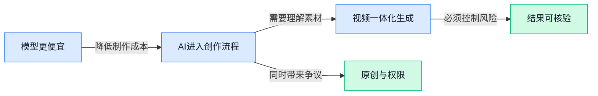
```mermaid
graph LR
A[模型更便宜] -->|降低制作成本| B[AI进入创作流程]
B -->|需要理解素材| C[视频一体化生成]
C -->|必须控制风险| D[结果可核验]
B -->|同时带来争议| E[原创与权限]

classDef blue fill:#dbeafe,stroke:#3b82f6,color:#111827
classDef green fill:#d1fae5,stroke:#10b981,color:#111827

class A,B,C blue
class D,E green
```

### 📊 行业洞察（今日 4 条）

1. Anthropic把Claude Opus 5.5（Anthropic的高阶模型）降价20%，OpenAI又改进新一代模型的重复输入复用机制  
  【洞察】模型调用成本持续下降，但Claude“更聪明却更不会写”说明，行业竞争已从比能力总分转向比具体任务是否稳定好用

2. Meta的Muse（能替用户执行任务的AI产品）一周吸引50万用户，ChatGPT语音功能也接入邮件、日历和Slack（企业沟通平台）  
  【洞察】两件事放一起看，AI正从“回答问题”进入“替人办事”，但用户增长不等于信任建立，权限、误操作和原创争议会成为硬门槛

3. Claude参与发现新型酶系统，Lean Pool（让AI维护、且证明可被计算机核验的数学档案）和主动上报机制也在推进  
  【洞察】AI的价值正在从“给出答案”转向“提出线索、留下证据、不会时停手”，越是高风险场景，越不能只看最终结果

4. Ovis-Embedding（把文字、图像等内容放进同一套比较坐标的模型）、三维场景理解和Gemini语音生成同时出现  
  【洞察】内容工具的竞争边界正在扩大：不只是剪时间线，而是要理解素材、人物关系、表达意图，并直接产出画面和声音

### 💭 对我们的启发（今日 3 条）

1. Claude降价和OpenAI降低重复处理成本，说明我们应按任务难度调度模型：素材整理、字幕初稿用便宜模型，品牌卖点和成片审核才用高阶模型，避免每条视频都高成本处理。

2. Muse和ChatGPT语音都在把AI从聊天推进到执行，我们的视频软件也要从“用户点功能”转向“用户说目标”：输入商品资料后，自动完成脚本、镜头匹配、配音和初剪，但关键卖点必须保留人工确认。

3. Claude写作变差与主动上报机制说明，视频质量不能只用“是否生成成功”判断；产品应让用户分别评价文案、画面、配音和品牌调性，并在识别不准、商品信息存疑时主动交给人工接管。

