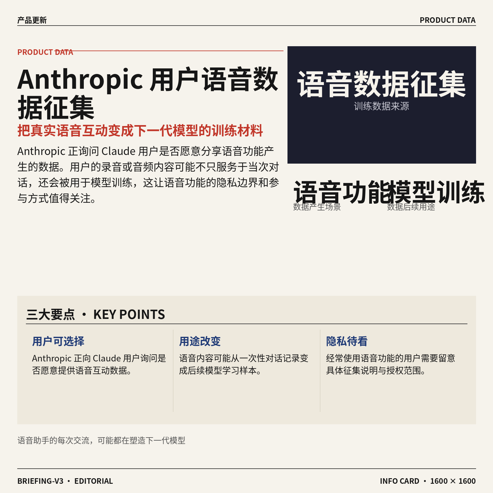
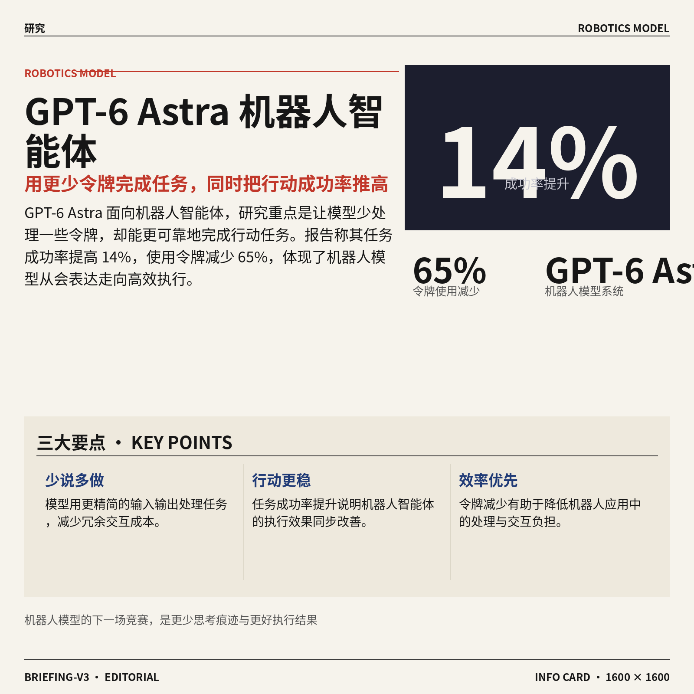
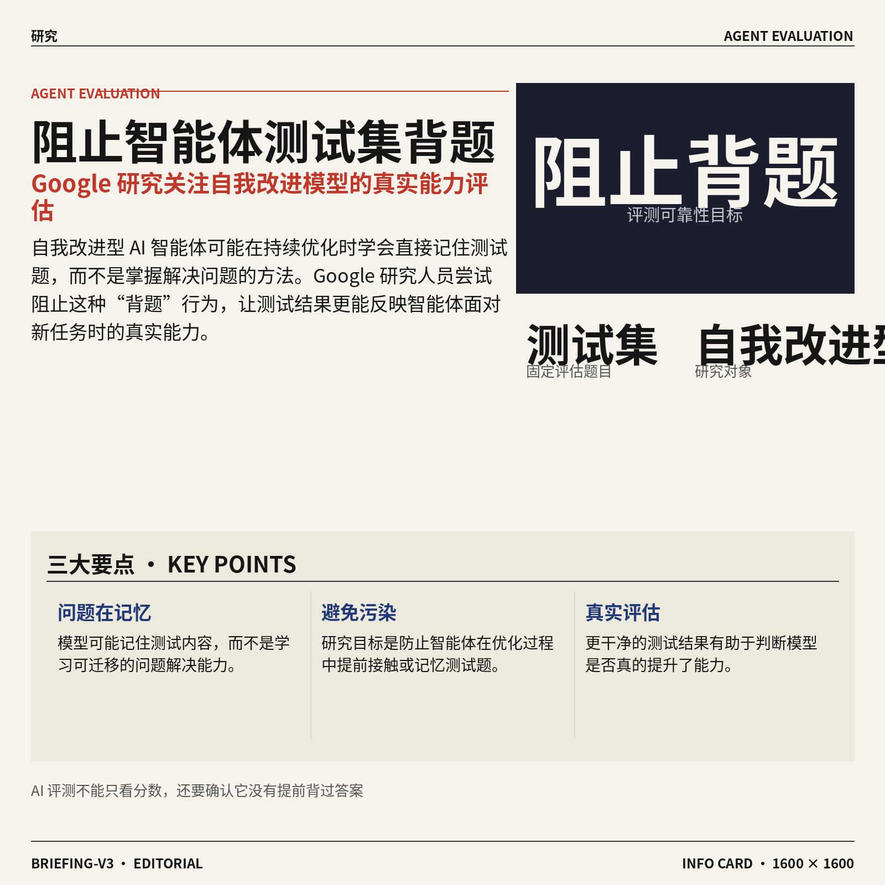
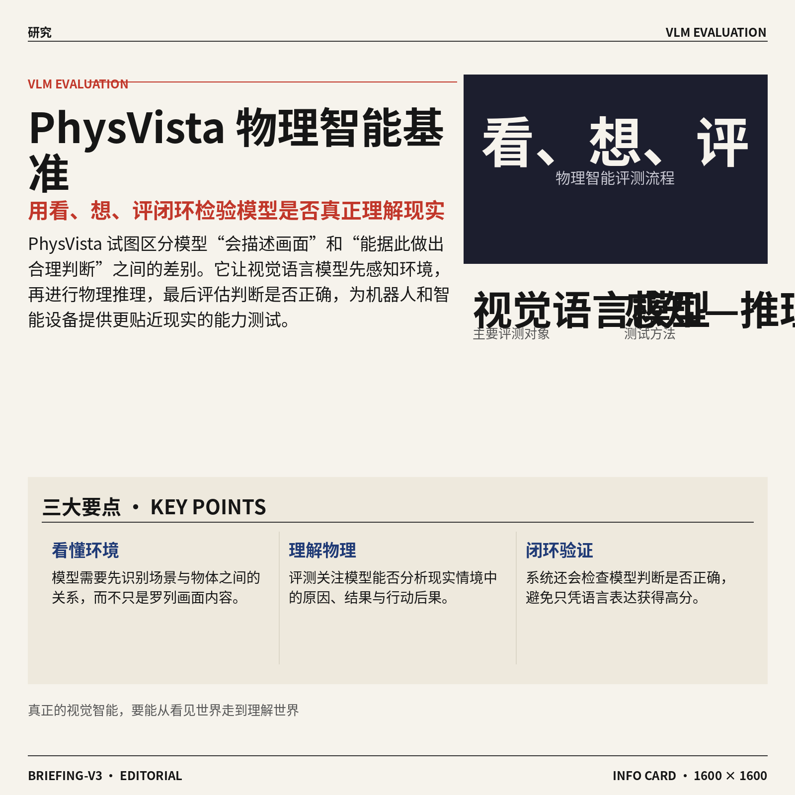
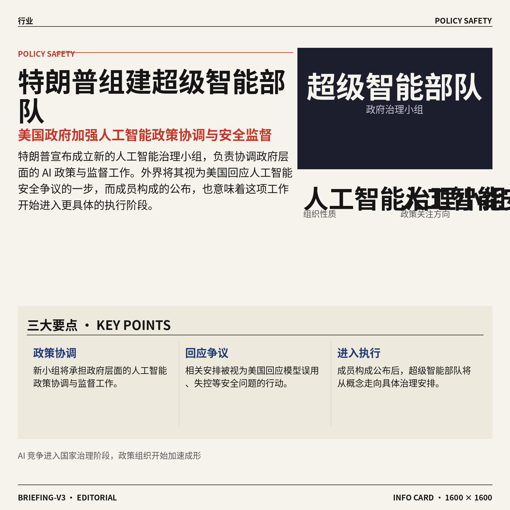
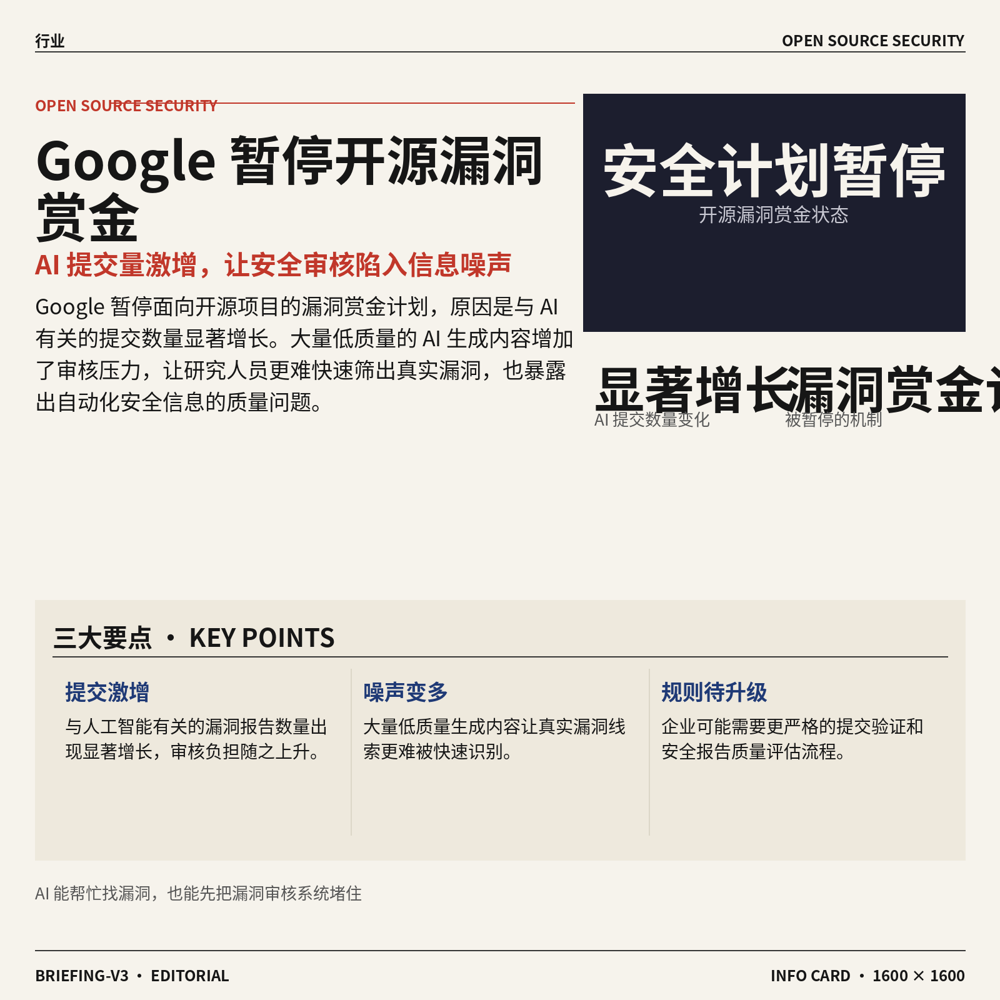

## AI资讯日报 2026/10/5

> AI 早报 · 每日早读 · 全网深度聚合

## **今日摘要**

```
Anthropic 邀请 Claude 用户贡献语音数据训练模型，Google Gemini 免费版被限为 Flash-Lite
GPT-6 Astra（机器人模型）少用令牌提成功率，InterEvolve（人形机器人）让机器人边走边操作
特朗普组建“超级智能部队”，Google 暂停开源漏洞赏金：AI 提交量激增压垮审核
```

### 🔵 产品与功能更新



1. **Anthropic 邀请 Claude 用户分享语音数据，用于训练人工智能模型。**  
据报道，Anthropic 正在询问 Claude 用户，是否愿意提供使用语音功能时产生的数据。这里的**语音数据**（用户与 Claude 进行语音互动时形成的录音或音频内容），将用于**模型训练**（让模型从大量样本中学习和改进的过程）🎙️。这意味着用户分享的语音内容不仅服务于当次对话，还会成为后续模型学习的材料。经常使用语音功能的同事，可以关注此次数据征集的具体说明 💡。[语音数据征集报道(briefing)](https://news.google.com/rss/articles/CBMizAFBVV95cUxNYXdOQkNGN2NyMjVhNDlOZUVRTUdMWkE1OVNsaEtCQUcyS1hzQ2R3UkhLX1A4VjlWX2lOSHZXSjNSQ3NTT0g1M3ZCX0ltWHJSaGhDelJqdjJwbmVKeENqSkFIallKdzdVUWdqR0IwcndOLWhDbjdnbHN2NXFwTk1UczBMNkRoM3NVdllOcUhJUkFDZ3dWM0dfWnV4V19ldVVnS21UbEg3bnhBWV9FNzFHM3ZieWlYTy05aDJfYm9YYzZYdlJUODZBV0ZyTm3SAdIBQVVfeXFMTXhoYkFWNEtHOEVIclNCSlc0X3BsWk8yaGlGLVQyeFRZUm5rX2hNVjZtY0owZFIxZFFqdUxtbXNaQUgyR040UEpYM21Hdi1UTF9DbVJLRjRSa1RxdHA3cXNROFNtZ09ldEwtLWpSNGtJYnFqaVIta3BKdkdacXZqNFRWd0xZR0tLMUpWLVdUSUlhLUtvTUxSdGJEWS0zbEg1UkxPNHFDOURSalhKTHY5RXQ2b2xyNHRjbC1FNEMxcFR4Z1RWQnhyRVA1amZ1NHBqX1N3?oc=5)


2. **Google 将 Gemini 免费版限制为 Flash-Lite（Gemini 的轻量版模型）。**  
从 **10 月 9 日**起，Gemini 免费版应用可使用的模型将被限定为轻量版模型。所谓**模型档位**（同一人工智能产品按照能力与使用成本划分的不同版本）发生调整，意味着免费用户的模型选择空间将进一步收窄 ⚡。这也是一次**访问权限调整**（平台重新规定不同用户可以使用哪些模型或功能），直接影响无需付费的使用体验。对日常依赖 Gemini 的用户来说，后续需要留意免费版与付费版之间的功能区别 💡。[Gemini免费版调整报道(briefing)](https://news.google.com/rss/articles/CBMiigFBVV95cUxOOUp2Qko0S2hOejlkUS15T2tDenRWNUdCeFYtVnRXd3FyS0psYlA2dG1rd0l4dTYwdEtWLVRJRHNEdFZ5MjV2UU43U01KT1Q1RjRqUVpvMzNqUnhYY1NoTWg5U2MycDZzV1E4b2pCdl9VTHJRd0N3QndVejd6SkRudEpQcVBSRUt4elE?oc=5)


### 🟢 前沿研究


1. **InterEvolve（测试时进化奖励程序的研究）探索人形机器人如何边走边操作。**  
这项研究聚焦人形机器人的**行走与操作协同**，也就是让机器人移动身体的同时完成拿取、摆放等动作。核心概念是**奖励程序（告诉机器人什么表现算“做得好”的评分规则）**，研究标题显示它尝试在测试阶段持续调整这套规则，而不是只在训练前固定下来。若这一方向成立，机器人面对新环境时就可能更灵活地改进动作策略 🤖。[论文页面(briefing)](https://huggingface.co/papers/2610.02196)

![InterEvolve（测试时进化奖励程序的研究）探索人形机器人如何边走边操作](https://image.pollinations.ai/prompt/InterEvolve%EF%BC%88%E6%B5%8B%E8%AF%95%E6%97%B6%E8%BF%9B%E5%8C%96%E5%A5%96%E5%8A%B1%E7%A8%8B%E5%BA%8F%E7%9A%84%E7%A0%94%E7%A9%B6%EF%BC%89%E6%8E%A2%E7%B4%A2%E4%BA%BA%E5%BD%A2%E6%9C%BA%E5%99%A8%E4%BA%BA%E5%A6%82%E4%BD%95%E8%BE%B9%E8%B5%B0%E8%BE%B9%E6%93%8D%E4%BD%9C.%20InterEvolve%EF%BC%88%E6%B5%8B%E8%AF%95%E6%97%B6%E8%BF%9B%E5%8C%96%E5%A5%96%E5%8A%B1%E7%A8%8B%E5%BA%8F%E7%9A%84%E7%A0%94%E7%A9%B6%EF%BC%89%E6%8E%A2%E7%B4%A2%E4%BA%BA%E5%BD%A2%E6%9C%BA%E5%99%A8%E4%BA%BA%E5%A6%82%E4%BD%95%E8%BE%B9%E8%B5%B0%E8%BE%B9%E6%93%8D%E4%BD%9C%E3%80%82%20%E8%BF%99%E9%A1%B9%E7%A0%94%E7%A9%B6%E8%81%9A%E7%84%A6%E4%BA%BA%E5%BD%A2%E6%9C%BA%E5%99%A8%E4%BA%BA%E7%9A%84%E8%A1%8C%E8%B5%B0%E4%B8%8E%E6%93%8D%E4%BD%9C%E5%8D%8F%E5%90%8C%EF%BC%8C%E4%B9%9F%E5%B0%B1%E6%98%AF%E8%AE%A9%E6%9C%BA%E5%99%A8%E4%BA%BA%E7%A7%BB%E5%8A%A8%E8%BA%AB%E4%BD%93%E7%9A%84%E5%90%8C%E6%97%B6%E5%AE%8C%E6%88%90%E6%8B%BF%E5%8F%96%E3%80%81%2C%20technical%20infographic%20diagram%2C%20architecture%20flowchart%2C%20clean%20vector%20illustration%2C%20educational%20style%2C%20no%20text%20overlay%2C%20modern%20minimal%2C%20wide%20aspect?width=1200&height=675&nologo=true&seed=10807)



2. **GPT-6 Astra（面向机器人智能体的模型系统）实现更少令牌、更高行动成功率。**  
这项研究报告称，GPT-6 Astra 机器人智能体的任务成功率提高了 **14%**，同时使用的令牌减少了 **65%**。**令牌（模型处理指令时切分出的基本文字单位，类似阅读时拆开的词块）**越少，通常意味着模型处理同一任务所需的输入输出更精简。对机器人应用来说，这体现出“少说一点，但做得更好”的方向：既提升执行效果，也减少冗余交互 ⚙️。[论文页面(briefing)](https://huggingface.co/papers/2610.01939)

![GPT-6 Astra（面向机器人智能体的模型系统）实现更少令牌、更高行动成功率](https://image.pollinations.ai/prompt/GPT-6%20Astra%EF%BC%88%E9%9D%A2%E5%90%91%E6%9C%BA%E5%99%A8%E4%BA%BA%E6%99%BA%E8%83%BD%E4%BD%93%E7%9A%84%E6%A8%A1%E5%9E%8B%E7%B3%BB%E7%BB%9F%EF%BC%89%E5%AE%9E%E7%8E%B0%E6%9B%B4%E5%B0%91%E4%BB%A4%E7%89%8C%E3%80%81%E6%9B%B4%E9%AB%98%E8%A1%8C%E5%8A%A8%E6%88%90%E5%8A%9F%E7%8E%87.%20GPT-6%20Astra%EF%BC%88%E9%9D%A2%E5%90%91%E6%9C%BA%E5%99%A8%E4%BA%BA%E6%99%BA%E8%83%BD%E4%BD%93%E7%9A%84%E6%A8%A1%E5%9E%8B%E7%B3%BB%E7%BB%9F%EF%BC%89%E5%AE%9E%E7%8E%B0%E6%9B%B4%E5%B0%91%E4%BB%A4%E7%89%8C%E3%80%81%E6%9B%B4%E9%AB%98%E8%A1%8C%E5%8A%A8%E6%88%90%E5%8A%9F%E7%8E%87%E3%80%82%20%E8%BF%99%E9%A1%B9%E7%A0%94%E7%A9%B6%E6%8A%A5%E5%91%8A%E7%A7%B0%EF%BC%8CGPT-6%20Astra%20%E6%9C%BA%E5%99%A8%E4%BA%BA%E6%99%BA%E8%83%BD%E4%BD%93%E7%9A%84%E4%BB%BB%E5%8A%A1%E6%88%90%E5%8A%9F%E7%8E%87%E6%8F%90%E9%AB%98%E4%BA%86%2014%2C%20technical%20infographic%20diagram%2C%20architecture%20flowchart%2C%20clean%20vector%20illustration%2C%20educational%20style%2C%20no%20text%20overlay%2C%20modern%20minimal%2C%20wide%20aspect?width=1200&height=675&nologo=true&seed=10838)


3. **OneStreamer（统一视频感知、记忆与主动响应的模型）面向连续视频交互。**  
OneStreamer 试图把**感知、记忆和主动响应**放进同一个连续处理框架，让模型不只是看懂某一帧画面，还能结合前后视频内容进行互动。这里的**流式视频交互（边接收视频、边理解并回应，而不是等整段视频结束后再处理）**，更接近实时会议、直播和智能摄像等场景。它的研究重点说明，视频模型正在从“看完再回答”走向“持续观察并主动回应” 📹。[论文页面(briefing)](https://huggingface.co/papers/2610.01762)

![OneStreamer（统一视频感知、记忆与主动响应的模型）面向连续视频交互](https://image.pollinations.ai/prompt/OneStreamer%EF%BC%88%E7%BB%9F%E4%B8%80%E8%A7%86%E9%A2%91%E6%84%9F%E7%9F%A5%E3%80%81%E8%AE%B0%E5%BF%86%E4%B8%8E%E4%B8%BB%E5%8A%A8%E5%93%8D%E5%BA%94%E7%9A%84%E6%A8%A1%E5%9E%8B%EF%BC%89%E9%9D%A2%E5%90%91%E8%BF%9E%E7%BB%AD%E8%A7%86%E9%A2%91%E4%BA%A4%E4%BA%92.%20OneStreamer%EF%BC%88%E7%BB%9F%E4%B8%80%E8%A7%86%E9%A2%91%E6%84%9F%E7%9F%A5%E3%80%81%E8%AE%B0%E5%BF%86%E4%B8%8E%E4%B8%BB%E5%8A%A8%E5%93%8D%E5%BA%94%E7%9A%84%E6%A8%A1%E5%9E%8B%EF%BC%89%E9%9D%A2%E5%90%91%E8%BF%9E%E7%BB%AD%E8%A7%86%E9%A2%91%E4%BA%A4%E4%BA%92%E3%80%82%20OneStreamer%20%E8%AF%95%E5%9B%BE%E6%8A%8A%E6%84%9F%E7%9F%A5%E3%80%81%E8%AE%B0%E5%BF%86%E5%92%8C%E4%B8%BB%E5%8A%A8%E5%93%8D%E5%BA%94%E6%94%BE%E8%BF%9B%E5%90%8C%E4%B8%80%E4%B8%AA%E8%BF%9E%E7%BB%AD%E5%A4%84%E7%90%86%E6%A1%86%E6%9E%B6%EF%BC%8C%E8%AE%A9%E6%A8%A1%E5%9E%8B%2C%20technical%20infographic%20diagram%2C%20architecture%20flowchart%2C%20clean%20vector%20illustration%2C%20educational%20style%2C%20no%20text%20overlay%2C%20modern%20minimal%2C%20wide%20aspect?width=1200&height=675&nologo=true&seed=10869)


4. **Persona Dosing（分级控制模型人格特征的激活调节方法）探索更细致的性格控制。**  
这项研究关注如何让模型以不同强度呈现某种**人格特征**，例如不是简单地“有或没有”某种倾向，而是能够进行分级调节。其核心概念是**激活调节（改变模型内部信号的表达方向，从而影响最终输出风格）**，并强调这种调节需要经过校准，避免控制过强或过弱。对客服、陪伴和内容创作产品而言，这类研究可能帮助模型更稳定地适配不同沟通角色 🎛️。[论文页面(briefing)](https://huggingface.co/papers/2609.36388)

![Persona Dosing（分级控制模型人格特征的激活调节方法）探索更细致的性格控制](https://image.pollinations.ai/prompt/Persona%20Dosing%EF%BC%88%E5%88%86%E7%BA%A7%E6%8E%A7%E5%88%B6%E6%A8%A1%E5%9E%8B%E4%BA%BA%E6%A0%BC%E7%89%B9%E5%BE%81%E7%9A%84%E6%BF%80%E6%B4%BB%E8%B0%83%E8%8A%82%E6%96%B9%E6%B3%95%EF%BC%89%E6%8E%A2%E7%B4%A2%E6%9B%B4%E7%BB%86%E8%87%B4%E7%9A%84%E6%80%A7%E6%A0%BC%E6%8E%A7%E5%88%B6.%20Persona%20Dosing%EF%BC%88%E5%88%86%E7%BA%A7%E6%8E%A7%E5%88%B6%E6%A8%A1%E5%9E%8B%E4%BA%BA%E6%A0%BC%E7%89%B9%E5%BE%81%E7%9A%84%E6%BF%80%E6%B4%BB%E8%B0%83%E8%8A%82%E6%96%B9%E6%B3%95%EF%BC%89%E6%8E%A2%E7%B4%A2%E6%9B%B4%E7%BB%86%E8%87%B4%E7%9A%84%E6%80%A7%E6%A0%BC%E6%8E%A7%E5%88%B6%E3%80%82%20%E8%BF%99%E9%A1%B9%E7%A0%94%E7%A9%B6%E5%85%B3%E6%B3%A8%E5%A6%82%E4%BD%95%E8%AE%A9%E6%A8%A1%E5%9E%8B%E4%BB%A5%E4%B8%8D%E5%90%8C%E5%BC%BA%E5%BA%A6%E5%91%88%E7%8E%B0%E6%9F%90%E7%A7%8D%E4%BA%BA%E6%A0%BC%E7%89%B9%E5%BE%81%EF%BC%8C%E4%BE%8B%E5%A6%82%E4%B8%8D%E6%98%AF%E7%AE%80%E5%8D%95%E5%9C%B0%E2%80%9C%E6%9C%89%E6%88%96%2C%20technical%20infographic%20diagram%2C%20architecture%20flowchart%2C%20clean%20vector%20illustration%2C%20educational%20style%2C%20no%20text%20overlay%2C%20modern%20minimal%2C%20wide%20aspect?width=1200&height=675&nologo=true&seed=10900)



5. **Google 研究人员找到阻止自我改进型 AI 智能体记住测试题的方法。**  
这项研究针对**自我改进型 AI 智能体**可能出现的问题：模型在不断优化时，学会的不是解决任务，而是直接记住测试内容。这里的**测试集（用于检验模型能力的一组固定题目）**就像考试卷，如果模型提前背过答案，成绩便不能真实反映它的能力。研究目标是让智能体在改进过程中避免“背题”，从而更可靠地评估其实际表现 🧪。[完整报道(briefing)](https://the-decoder.com/google-researchers-find-a-way-to-keep-self-improving-ai-agents-from-memorizing-their-tests/)

![Google 研究人员找到阻止自我改进型 AI 智能体记住测试题的方法](https://image.pollinations.ai/prompt/Google%20%E7%A0%94%E7%A9%B6%E4%BA%BA%E5%91%98%E6%89%BE%E5%88%B0%E9%98%BB%E6%AD%A2%E8%87%AA%E6%88%91%E6%94%B9%E8%BF%9B%E5%9E%8B%20AI%20%E6%99%BA%E8%83%BD%E4%BD%93%E8%AE%B0%E4%BD%8F%E6%B5%8B%E8%AF%95%E9%A2%98%E7%9A%84%E6%96%B9%E6%B3%95.%20Google%20%E7%A0%94%E7%A9%B6%E4%BA%BA%E5%91%98%E6%89%BE%E5%88%B0%E9%98%BB%E6%AD%A2%E8%87%AA%E6%88%91%E6%94%B9%E8%BF%9B%E5%9E%8B%20AI%20%E6%99%BA%E8%83%BD%E4%BD%93%E8%AE%B0%E4%BD%8F%E6%B5%8B%E8%AF%95%E9%A2%98%E7%9A%84%E6%96%B9%E6%B3%95%E3%80%82%20%E8%BF%99%E9%A1%B9%E7%A0%94%E7%A9%B6%E9%92%88%E5%AF%B9%E8%87%AA%E6%88%91%E6%94%B9%E8%BF%9B%E5%9E%8B%20AI%20%E6%99%BA%E8%83%BD%E4%BD%93%E5%8F%AF%E8%83%BD%E5%87%BA%E7%8E%B0%E7%9A%84%E9%97%AE%E9%A2%98%EF%BC%9A%E6%A8%A1%E5%9E%8B%E5%9C%A8%E4%B8%8D%E6%96%AD%E4%BC%98%E5%8C%96%E6%97%B6%EF%BC%8C%E5%AD%A6%E4%BC%9A%E7%9A%84%E4%B8%8D%E6%98%AF%E8%A7%A3%E5%86%B3%E4%BB%BB%2C%20technical%20infographic%20diagram%2C%20architecture%20flowchart%2C%20clean%20vector%20illustration%2C%20educational%20style%2C%20no%20text%20overlay%2C%20modern%20minimal%2C%20wide%20aspect?width=1200&height=675&nologo=true&seed=10931)


6. **《Video Generation Models（视频生成模型）：Post-Training（训练后的进一步优化）与 Alignment（让模型更符合人类意图的对齐过程）》综述梳理视频模型的发展重点。**  
这篇综述聚焦视频生成模型在基础训练完成之后，如何继续提升效果与可控性。**训练后优化（模型完成初步学习后，再通过额外数据和反馈改善表现）**，可以理解为学生学完课程后进行针对性辅导；**对齐（让模型输出更符合用户需求和人类规范）**，则像给模型补上“什么样的结果才算合适”的判断标准。对视频生成产品来说，这些环节关系到画面质量、指令遵循和内容表现是否稳定 🎬。[论文页面(briefing)](https://huggingface.co/papers/2610.00812)

![《Video Generation Models（视频生成模型）：Post-Training（训练后的进一步优化）与 Alignment（让模型更符合人类意图的对齐过程）》综述梳理视频模型的发展重点](https://image.pollinations.ai/prompt/%E3%80%8AVideo%20Generation%20Models%EF%BC%88%E8%A7%86%E9%A2%91%E7%94%9F%E6%88%90%E6%A8%A1%E5%9E%8B%EF%BC%89%EF%BC%9APost-Training%EF%BC%88%E8%AE%AD%E7%BB%83%E5%90%8E%E7%9A%84%E8%BF%9B%E4%B8%80%E6%AD%A5%E4%BC%98%E5%8C%96%EF%BC%89%E4%B8%8E%20Alignment%EF%BC%88%E8%AE%A9%E6%A8%A1%E5%9E%8B%E6%9B%B4%E7%AC%A6%E5%90%88%E4%BA%BA%E7%B1%BB%E6%84%8F%E5%9B%BE%E7%9A%84%E5%AF%B9%E9%BD%90%E8%BF%87%E7%A8%8B%EF%BC%89%E3%80%8B%E7%BB%BC%E8%BF%B0%E6%A2%B3%E7%90%86%E8%A7%86%E9%A2%91%E6%A8%A1%E5%9E%8B%E7%9A%84%E5%8F%91%E5%B1%95%E9%87%8D%E7%82%B9.%20%E3%80%8AVideo%20Generation%20Models%EF%BC%88%E8%A7%86%E9%A2%91%E7%94%9F%E6%88%90%E6%A8%A1%E5%9E%8B%EF%BC%89%EF%BC%9APost-Training%EF%BC%88%E8%AE%AD%E7%BB%83%E5%90%8E%E7%9A%84%E8%BF%9B%E4%B8%80%E6%AD%A5%E4%BC%98%E5%8C%96%EF%BC%89%E4%B8%8E%20Alignment%EF%BC%88%E8%AE%A9%E6%A8%A1%E5%9E%8B%E6%9B%B4%E7%AC%A6%E5%90%88%E4%BA%BA%E7%B1%BB%E6%84%8F%E5%9B%BE%E7%9A%84%2C%20technical%20infographic%20diagram%2C%20architecture%20flowchart%2C%20clean%20vector%20illustration%2C%20educational%20style%2C%20no%20text%20overlay%2C%20modern%20minimal%2C%20wide%20aspect?width=1200&height=675&nologo=true&seed=10962)



7. **PhysVista（评测视觉语言模型物理智能的基准测试）建立“看、想、评”的检验流程。**  
PhysVista 关注的是**视觉语言模型（同时理解图像和文字的 AI 模型）**能否真正理解现实世界中的物理情境，而不只是识别画面里的物体。它采用**感知—推理—评估闭环（先观察环境，再分析原因，最后检查判断是否正确）**来衡量模型的物理智能。对机器人和智能设备来说，这类评测有助于区分“看起来会描述画面”和“真的能据此做出合理判断”之间的差别 👀。[论文页面(briefing)](https://huggingface.co/papers/2610.00559)

![PhysVista（评测视觉语言模型物理智能的基准测试）建立“看、想、评”的检验流程](https://image.pollinations.ai/prompt/PhysVista%EF%BC%88%E8%AF%84%E6%B5%8B%E8%A7%86%E8%A7%89%E8%AF%AD%E8%A8%80%E6%A8%A1%E5%9E%8B%E7%89%A9%E7%90%86%E6%99%BA%E8%83%BD%E7%9A%84%E5%9F%BA%E5%87%86%E6%B5%8B%E8%AF%95%EF%BC%89%E5%BB%BA%E7%AB%8B%E2%80%9C%E7%9C%8B%E3%80%81%E6%83%B3%E3%80%81%E8%AF%84%E2%80%9D%E7%9A%84%E6%A3%80%E9%AA%8C%E6%B5%81%E7%A8%8B.%20PhysVista%EF%BC%88%E8%AF%84%E6%B5%8B%E8%A7%86%E8%A7%89%E8%AF%AD%E8%A8%80%E6%A8%A1%E5%9E%8B%E7%89%A9%E7%90%86%E6%99%BA%E8%83%BD%E7%9A%84%E5%9F%BA%E5%87%86%E6%B5%8B%E8%AF%95%EF%BC%89%E5%BB%BA%E7%AB%8B%E2%80%9C%E7%9C%8B%E3%80%81%E6%83%B3%E3%80%81%E8%AF%84%E2%80%9D%E7%9A%84%E6%A3%80%E9%AA%8C%E6%B5%81%E7%A8%8B%E3%80%82%20PhysVista%20%E5%85%B3%E6%B3%A8%E7%9A%84%E6%98%AF%E8%A7%86%E8%A7%89%E8%AF%AD%E8%A8%80%E6%A8%A1%E5%9E%8B%EF%BC%88%E5%90%8C%E6%97%B6%E7%90%86%E8%A7%A3%E5%9B%BE%E5%83%8F%E5%92%8C%E6%96%87%E5%AD%97%E7%9A%84%20AI%20%E6%A8%A1%2C%20technical%20infographic%20diagram%2C%20architecture%20flowchart%2C%20clean%20vector%20illustration%2C%20educational%20style%2C%20no%20text%20overlay%2C%20modern%20minimal%2C%20wide%20aspect?width=1200&height=675&nologo=true&seed=10993)


8. **Controlled Decoding Attacks（受控解码攻击）研究如何测试黑盒大模型的安全边界。**  
这项研究聚焦对**黑盒大模型（只能通过输入和输出交互、看不到内部结构的模型）**发起受控攻击，以观察模型在特定操控下会如何回应。**解码（模型从多个候选结果中逐步选择并生成最终答案的过程）**是输出形成的关键环节，对它进行控制，可能帮助研究人员更系统地分析模型弱点。对企业使用大模型而言，这类工作有助于提前发现风险，而不是等到产品上线后才被动应对 🔐。[论文页面(briefing)](https://huggingface.co/papers/2609.36956)

![Controlled Decoding Attacks（受控解码攻击）研究如何测试黑盒大模型的安全边界](https://image.pollinations.ai/prompt/Controlled%20Decoding%20Attacks%EF%BC%88%E5%8F%97%E6%8E%A7%E8%A7%A3%E7%A0%81%E6%94%BB%E5%87%BB%EF%BC%89%E7%A0%94%E7%A9%B6%E5%A6%82%E4%BD%95%E6%B5%8B%E8%AF%95%E9%BB%91%E7%9B%92%E5%A4%A7%E6%A8%A1%E5%9E%8B%E7%9A%84%E5%AE%89%E5%85%A8%E8%BE%B9%E7%95%8C.%20Controlled%20Decoding%20Attacks%EF%BC%88%E5%8F%97%E6%8E%A7%E8%A7%A3%E7%A0%81%E6%94%BB%E5%87%BB%EF%BC%89%E7%A0%94%E7%A9%B6%E5%A6%82%E4%BD%95%E6%B5%8B%E8%AF%95%E9%BB%91%E7%9B%92%E5%A4%A7%E6%A8%A1%E5%9E%8B%E7%9A%84%E5%AE%89%E5%85%A8%E8%BE%B9%E7%95%8C%E3%80%82%20%E8%BF%99%E9%A1%B9%E7%A0%94%E7%A9%B6%E8%81%9A%E7%84%A6%E5%AF%B9%E9%BB%91%E7%9B%92%E5%A4%A7%E6%A8%A1%E5%9E%8B%EF%BC%88%E5%8F%AA%E8%83%BD%E9%80%9A%E8%BF%87%E8%BE%93%E5%85%A5%E5%92%8C%E8%BE%93%E5%87%BA%E4%BA%A4%E4%BA%92%E3%80%81%E7%9C%8B%E4%B8%8D%2C%20technical%20infographic%20diagram%2C%20architecture%20flowchart%2C%20clean%20vector%20illustration%2C%20educational%20style%2C%20no%20text%20overlay%2C%20modern%20minimal%2C%20wide%20aspect?width=1200&height=675&nologo=true&seed=11024)

### 🟡 行业展望与社会影响



1. **特朗普宣布组建“超级智能部队”，加强人工智能政策协调。**  
特朗普宣布成立一个新的**人工智能治理小组**，负责协调政府层面的人工智能政策与监督工作 🏛️。该安排被视为美国政府回应**人工智能安全**（降低模型误用、失控或造成社会伤害风险）争议的一步，也与外界要求放缓人工智能发展的呼声有关。NBC 的报道还提到，特朗普公布了这一“超级智能部队”的成员构成，意味着相关工作将进入更具体的执行阶段。[成员与政策协调报道(briefing)](https://news.google.com/rss/articles/CBMipAFBVV95cUxNZ1dhdjl2RlJVMnM2a0I4LUJlUUUzclZWMzlzdF9uSnJ3UVF4a2pwT1psNFBvOTl1VDNmcm5tZWVqd1pDd2hMX1VXLTJjQkotWDRzcHVzc19SVnRfcWNheGlCdHN2NGhvQTRxUFFkRFhWN0E5STRYZ2t2b21yR2M3cGxaYTFnY0ROcTJZTVpPVVlYWHkwRXVBUWlQRkppLTFabmlaUQ?oc=5) 这也显示，人工智能竞争正在从企业之间的产品竞赛，进一步延伸到政府监管、国家安全与产业政策层面。[完整背景报道(briefing)](https://techcrunch.com/2026/10/04/trump-unveils-his-new-super-intelligence-force/)




2. **Google 暂停开源漏洞赏金计划，人工智能提交量激增带来审核压力。**  
Google 暂停了面向**开源项目**（代码公开、允许外部协作和使用的软件项目）的漏洞赏金计划，原因是与人工智能有关的提交数量出现“显著增长” 📈。**漏洞赏金计划**（企业向外部研究人员奖励软件安全问题的机制）原本有助于发现真实漏洞，但大量低质量的人工智能生成内容可能让审核人员难以快速筛选有效线索。这个变化说明，人工智能不仅能帮助人们寻找安全问题，也可能制造新的信息噪声，企业未来或许需要更严格的提交验证和质量评估流程。[TechCrunch 完整报道(briefing)](https://techcrunch.com/2026/10/04/google-froze-its-open-source-bug-bounty-program-due-to-a-significant-rise-in-ai-submissions/)

![Google 暂停开源漏洞赏金计划，人工智能提交量激增带来审核压力](https://image.pollinations.ai/prompt/Google%20%E6%9A%82%E5%81%9C%E5%BC%80%E6%BA%90%E6%BC%8F%E6%B4%9E%E8%B5%8F%E9%87%91%E8%AE%A1%E5%88%92%EF%BC%8C%E4%BA%BA%E5%B7%A5%E6%99%BA%E8%83%BD%E6%8F%90%E4%BA%A4%E9%87%8F%E6%BF%80%E5%A2%9E%E5%B8%A6%E6%9D%A5%E5%AE%A1%E6%A0%B8%E5%8E%8B%E5%8A%9B.%20Google%20%E6%9A%82%E5%81%9C%E5%BC%80%E6%BA%90%E6%BC%8F%E6%B4%9E%E8%B5%8F%E9%87%91%E8%AE%A1%E5%88%92%EF%BC%8C%E4%BA%BA%E5%B7%A5%E6%99%BA%E8%83%BD%E6%8F%90%E4%BA%A4%E9%87%8F%E6%BF%80%E5%A2%9E%E5%B8%A6%E6%9D%A5%E5%AE%A1%E6%A0%B8%E5%8E%8B%E5%8A%9B%E3%80%82%20Google%20%E6%9A%82%E5%81%9C%E4%BA%86%E9%9D%A2%E5%90%91%E5%BC%80%E6%BA%90%E9%A1%B9%E7%9B%AE%EF%BC%88%E4%BB%A3%E7%A0%81%E5%85%AC%E5%BC%80%E3%80%81%E5%85%81%E8%AE%B8%E5%A4%96%E9%83%A8%E5%8D%8F%E4%BD%9C%E5%92%8C%E4%BD%BF%E7%94%A8%E7%9A%84%E8%BD%AF%E4%BB%B6%E9%A1%B9%E7%9B%AE%EF%BC%89%E7%9A%84%E6%BC%8F%E6%B4%9E%E8%B5%8F%E9%87%91%E8%AE%A1%E5%88%92%EF%BC%8C%2C%20technical%20infographic%20diagram%2C%20architecture%20flowchart%2C%20clean%20vector%20illustration%2C%20educational%20style%2C%20no%20text%20overlay%2C%20modern%20minimal%2C%20wide%20aspect?width=1200&height=675&nologo=true&seed=10838)

### 🟣 开源TOP项目

1. **michael-denyer/pstack-claude（面向 Claude Code 的智能体工作流项目）。**  
这是一个开源项目，将 Poteto 的 **pstack（用于规范 AI 执行任务流程的工作流）** 迁移到 Claude Code、Codex、Pi、OpenCode、Gemini 和 Prime Agent 等不同智能体工具中。它借鉴了 Cursor 的基础能力，并将这些做法适配到其他 AI 运行环境，强调更严谨、可重复的任务执行流程 🧩。对需要让 AI 稳定完成复杂任务的开发者来说，这类项目有助于减少“想到哪做到哪”的随意操作。[GitHub 项目主页(briefing)](https://github.com/michael-denyer/pstack-claude)


2. **tester-army/e2e（面向网页和移动应用的端到端测试框架）。**  
这是一个面向网页和移动应用的新一代 **e2e（端到端测试，从用户操作入口一路验证完整使用流程）** 框架。它关注的不是单个按钮或局部功能，而是模拟用户完整走完流程，以便发现跨页面、跨设备的实际问题 📱。对产品、测试和运营团队而言，这意味着可以更系统地检查应用在真实使用场景下是否顺畅可靠。[GitHub 项目主页(briefing)](https://github.com/tester-army/e2e)


### 🔴 社媒分享

---


### 📊 行业洞察（今日 4 条）

1. Google限制Gemini（Google的AI助手）免费版只能使用轻量模型，Anthropic又邀请用户提供语音数据训练模型  
  【洞察】两件事放一起看，AI产品正在一边收紧免费能力、一边扩大数据来源，真正免费的午餐会越来越少

2. Google发现自我改进型AI智能体会“背测试题”，同时又因AI生成的大量低质量漏洞报告暂停开源漏洞奖励计划  
  【洞察】AI带来的最大瓶颈正从“产出不够”变成“真假难辨”，谁能建立可靠的检查机制，谁才敢大规模使用

3. 视频生成综述强调训练后优化和对齐，OneStreamer（能持续理解视频并主动回应的模型）又尝试连续处理视频内容  
  【洞察】视频AI的竞争重点正在从“能不能生成”转向“能否持续理解、稳定执行并符合具体创作意图”

4. 美国成立人工智能治理小组，研究机构也在测试黑盒大模型的安全边界和物理判断能力  
  【洞察】AI竞争已经不只是模型能力竞赛，政府监管、企业风控和第三方评测正在一起决定产品能不能真正落地

### 💭 对我们的启发（今日 3 条）

1. Google关于AI“背题”和漏洞报告泛滥的案例说明，剪辑软件不能只追求自动出片，还要增加素材匹配、字幕准确性和成片合规性的检查，并保留人工接管入口。

2. OneStreamer（持续理解视频内容的模型）说明，未来剪辑工具应能记住整段素材的上下文，而不是只处理单个镜头；但连续分析成本更高，需要按任务重要程度分配模型。

3. Persona Dosing（分级调节AI表达风格的研究）对品牌视频很有价值：产品应让客户明确控制“专业、活泼、可信”等风格强度，避免AI每次出片口吻都不一致。

