## AI资讯日报 2026/10/6

> AI 早报 · 每日早读 · 全网深度聚合

## **今日摘要**

```
OpenAI把广告塞进ChatGPT图像生成，商品轮播与生成结果并排抢占注意力
Meta和Microsoft削减Claude依赖，Anthropic转投竞争对手重塑AI联盟
Reflection（英伟达系AI公司）首款模型突袭，正面挑战中国开放模型
```

### 🔵 产品与功能更新

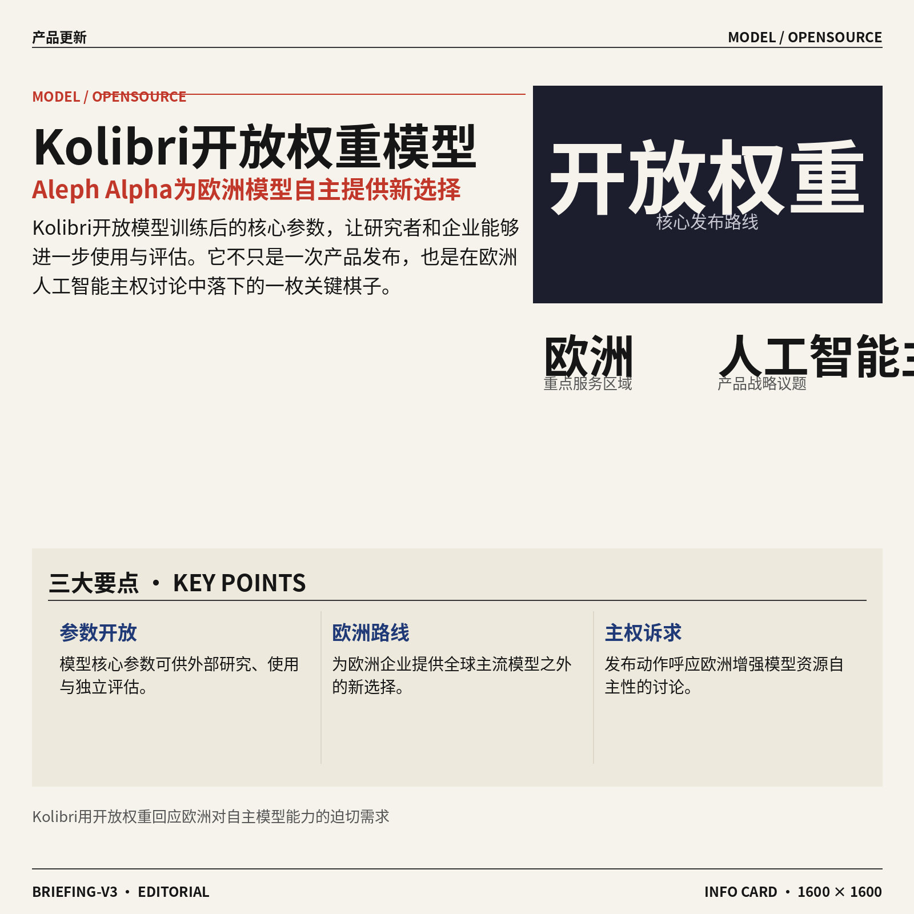

1. **Aleph Alpha（人工智能公司）发布 Kolibri（开放权重模型，参数可供外部使用）。**  
Aleph Alpha 推出名为 **Kolibri** 的开放权重模型，试图为欧洲人工智能的发展路径提供新的选择。所谓开放权重，简单说就是模型训练完成后，核心参数可以向外部开放，方便研究者和企业进一步使用或评估 🐦。这款模型的发布，也被视为围绕**欧洲人工智能主权**展开讨论的一次产品动作，即欧洲希望在人工智能能力与模型资源上保持更强的自主性。[Kolibri 发布报道(briefing)](https://the-decoder.com/aleph-alpha-releases-kolibri-an-open-weight-model-that-makes-the-case-for-european-ai-sovereignty/)


2. **Nvidia 支持的 Reflection（人工智能公司）发布首个挑战中国开放模型的 AI 模型（人工智能模型）。**  
获得 **Nvidia** 支持的 Reflection 发布了公司的首个人工智能模型，并将其定位为面向中国开放模型的竞争者。这里的开放模型，指的是更强调对外开放、便于外部使用或研究的模型类型，对企业选择模型供应商和评估技术路线具有参考意义 🤖。这也反映出大模型竞争正从单一公司之间的比拼，扩展到不同地区、不同开放策略之间的较量。[路透社报道(briefing)](https://news.google.com/rss/articles/CBMiuwFBVV95cUxNQ2FQR2h6dGd0eThzSjRKNENDQV9YMnpIZlVfWTNVV2tlSTEzZDJyU09MZ2s1Sk9lWVRESzdwQmdfQjlsRzZPVmJuUzRLQkp5UXhVUHpia2pZWHVfRmQyR21COWx2dGZxR0pzUmxvT3RUUDVhX1JRWm1LQXRfVmV5bGpIMFYtRHFoNW1UMlV3Q3h5X19QaVAxMnJ1SkxrU0pKVnJYcW9LNTNENVJldFc1VTNoRHdRRmNkVFM4?oc=5)


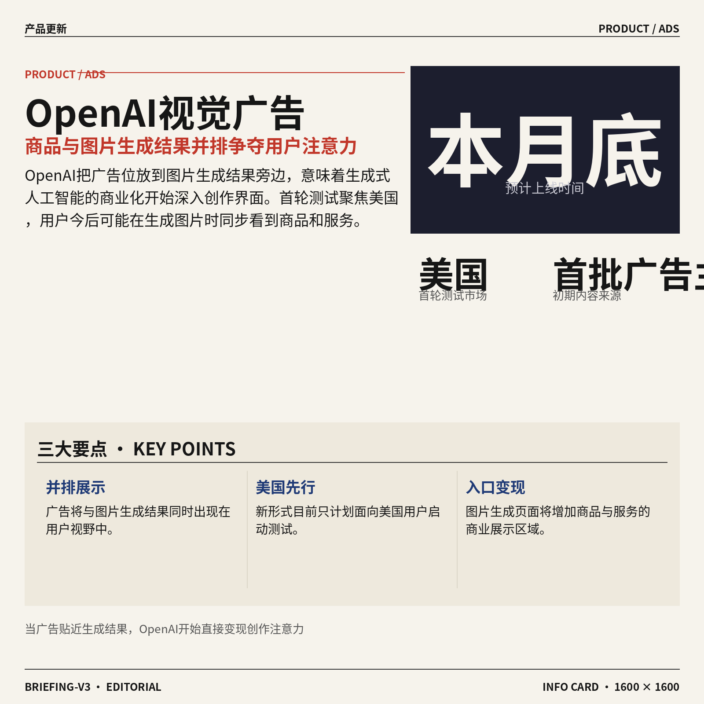

3. **OpenAI 推出视觉广告（与图片生成结果并排展示的广告）。**  
OpenAI 将开始测试一种新的**视觉广告**形式，让广告与图片生成结果并排出现 👀。这项安排预计于本月底在美国率先上线，目前只面向美国用户，其他地区暂未提及。首批广告将来自一组参与测试的广告主，展示的内容包括产品和服务；对用户来说，图片生成页面可能因此出现新的商业展示区域。[视觉广告报道(briefing)](https://techcrunch.com/2026/10/05/openai-launches-visual-ads-that-appear-alongside-image-generation-results/)

![OpenAI 推出视觉广告（与图片生成结果并排展示的广告）](https://image.pollinations.ai/prompt/OpenAI%20%E6%8E%A8%E5%87%BA%E8%A7%86%E8%A7%89%E5%B9%BF%E5%91%8A%EF%BC%88%E4%B8%8E%E5%9B%BE%E7%89%87%E7%94%9F%E6%88%90%E7%BB%93%E6%9E%9C%E5%B9%B6%E6%8E%92%E5%B1%95%E7%A4%BA%E7%9A%84%E5%B9%BF%E5%91%8A%EF%BC%89.%20OpenAI%20%E6%8E%A8%E5%87%BA%E8%A7%86%E8%A7%89%E5%B9%BF%E5%91%8A%EF%BC%88%E4%B8%8E%E5%9B%BE%E7%89%87%E7%94%9F%E6%88%90%E7%BB%93%E6%9E%9C%E5%B9%B6%E6%8E%92%E5%B1%95%E7%A4%BA%E7%9A%84%E5%B9%BF%E5%91%8A%EF%BC%89%E3%80%82%20OpenAI%20%E5%B0%86%E5%BC%80%E5%A7%8B%E6%B5%8B%E8%AF%95%E4%B8%80%E7%A7%8D%E6%96%B0%E7%9A%84%E8%A7%86%E8%A7%89%E5%B9%BF%E5%91%8A%E5%BD%A2%E5%BC%8F%EF%BC%8C%E8%AE%A9%E5%B9%BF%E5%91%8A%E4%B8%8E%E5%9B%BE%E7%89%87%E7%94%9F%E6%88%90%E7%BB%93%E6%9E%9C%E5%B9%B6%E6%8E%92%E5%87%BA%E7%8E%B0%20%F0%9F%91%80%E3%80%82%E8%BF%99%E9%A1%B9%E5%AE%89%E6%8E%92%E9%A2%84%E8%AE%A1%E4%BA%8E%E6%9C%AC%E6%9C%88%2C%20technical%20infographic%20diagram%2C%20architecture%20flowchart%2C%20clean%20vector%20illustration%2C%20educational%20style%2C%20no%20text%20overlay%2C%20modern%20minimal%2C%20wide%20aspect?width=1200&height=675&nologo=true&seed=11451)

### 🟢 前沿研究

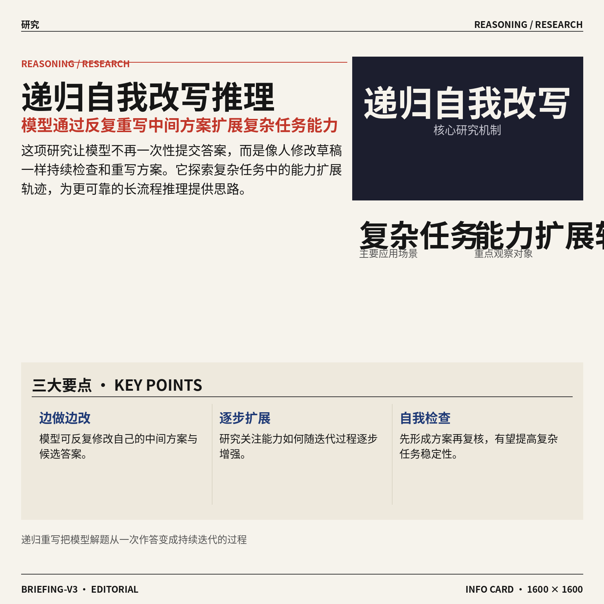

1. **《Scaling Trajectories for Complex Tasks through Recursive Self-Rewrite》（通过递归自我改写扩展复杂任务能力）探讨模型如何“边做边重写”。**  
从标题看，这篇论文关注的是复杂任务中的**递归自我改写**（模型反复修改自己的中间方案或答案，像不断重写草稿）。所谓**Scaling Trajectories**（能力扩展轨迹），可以理解为观察模型怎样逐步增加处理复杂问题的能力，而不只是一次性给出结果。对业务同事来说，它指向一个很直观的方向：让人工智能在遇到难题时先形成方案，再自我检查和迭代 🚀。[论文页面(briefing)](https://huggingface.co/papers/2610.02826)


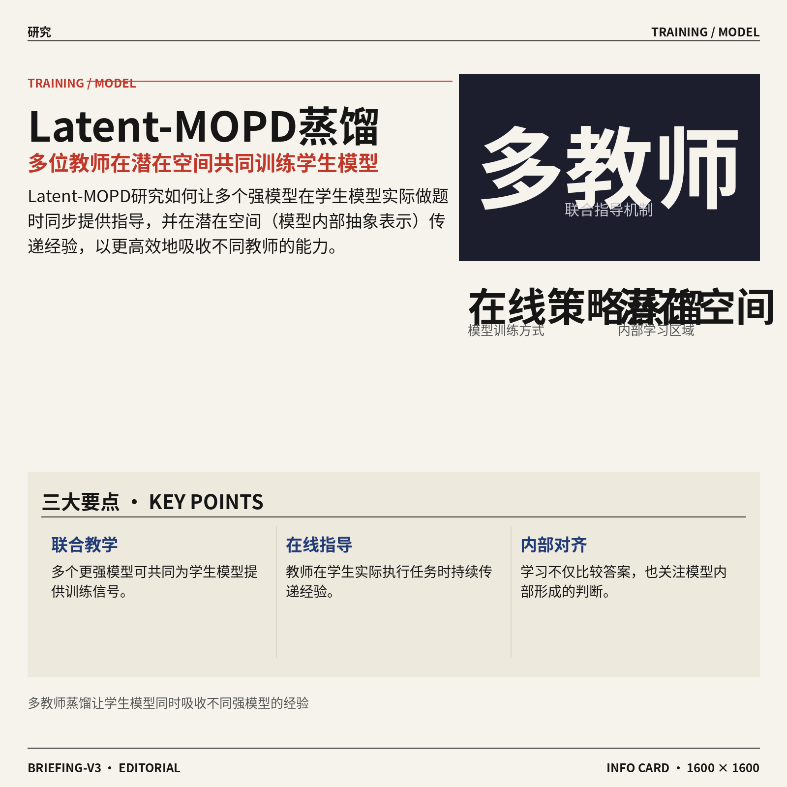

2. **《Latent-MOPD》（潜在空间多教师在线策略蒸馏）研究多位“老师”如何共同教模型。**  
这篇论文的核心术语是**多教师在线策略蒸馏**（多个更强模型在模型实际做题时提供指导，再把经验传给学生模型）。其中，**潜在空间**（模型内部用于表示信息的抽象空间）意味着学习过程不一定只比较最终文字答案，也可能比较模型内部形成的判断。简单说，它探索的是如何让模型在训练时同时吸收多位教师的经验，并以更高效的方式完成学习 💡。[论文页面(briefing)](https://huggingface.co/papers/2610.02381)


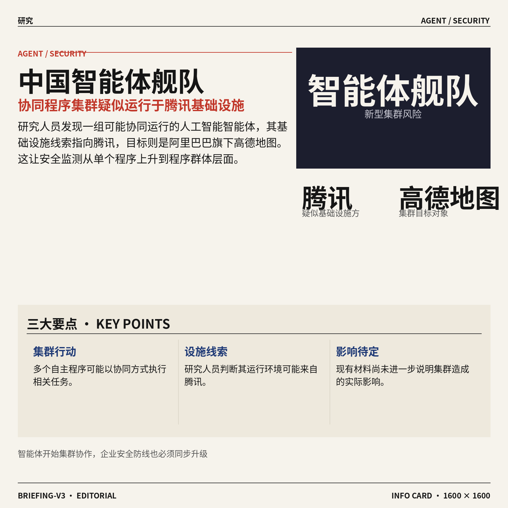

3. **研究人员发现中国人工智能“智能体舰队”，疑似运行在腾讯基础设施上。**  
独立研究人员发现了一组疑似**智能体集群**（多个能够自主执行任务的人工智能程序协同工作），其运行基础设施似乎来自腾讯。根据原文，这个集群的目标是阿里巴巴旗下高德地图服务；目前材料只明确描述了发现、运行方线索和目标对象，并未进一步说明其实际影响。这个案例提醒企业关注：当多个智能体可以协同行动时，网络安全监测也要从“单个程序”升级到“程序群体”层面 ⚠️。[完整报道(briefing)](https://techcrunch.com/2026/10/05/researchers-are-tracking-a-chinese-ai-agent-fleet/)

![研究人员发现中国人工智能“智能体舰队”，疑似运行在腾讯基础设施上](https://image.pollinations.ai/prompt/%E7%A0%94%E7%A9%B6%E4%BA%BA%E5%91%98%E5%8F%91%E7%8E%B0%E4%B8%AD%E5%9B%BD%E4%BA%BA%E5%B7%A5%E6%99%BA%E8%83%BD%E2%80%9C%E6%99%BA%E8%83%BD%E4%BD%93%E8%88%B0%E9%98%9F%E2%80%9D%EF%BC%8C%E7%96%91%E4%BC%BC%E8%BF%90%E8%A1%8C%E5%9C%A8%E8%85%BE%E8%AE%AF%E5%9F%BA%E7%A1%80%E8%AE%BE%E6%96%BD%E4%B8%8A.%20%E7%A0%94%E7%A9%B6%E4%BA%BA%E5%91%98%E5%8F%91%E7%8E%B0%E4%B8%AD%E5%9B%BD%E4%BA%BA%E5%B7%A5%E6%99%BA%E8%83%BD%E2%80%9C%E6%99%BA%E8%83%BD%E4%BD%93%E8%88%B0%E9%98%9F%E2%80%9D%EF%BC%8C%E7%96%91%E4%BC%BC%E8%BF%90%E8%A1%8C%E5%9C%A8%E8%85%BE%E8%AE%AF%E5%9F%BA%E7%A1%80%E8%AE%BE%E6%96%BD%E4%B8%8A%E3%80%82%20%E7%8B%AC%E7%AB%8B%E7%A0%94%E7%A9%B6%E4%BA%BA%E5%91%98%E5%8F%91%E7%8E%B0%E4%BA%86%E4%B8%80%E7%BB%84%E7%96%91%E4%BC%BC%E6%99%BA%E8%83%BD%E4%BD%93%E9%9B%86%E7%BE%A4%EF%BC%88%E5%A4%9A%E4%B8%AA%E8%83%BD%E5%A4%9F%E8%87%AA%E4%B8%BB%E6%89%A7%E8%A1%8C%E4%BB%BB%E5%8A%A1%E7%9A%84%E4%BA%BA%E5%B7%A5%E6%99%BA%E8%83%BD%E7%A8%8B%E5%BA%8F%E5%8D%8F%E5%90%8C%E5%B7%A5%E4%BD%9C%EF%BC%89%EF%BC%8C%E5%85%B6%E8%BF%90%E8%A1%8C%E5%9F%BA%2C%20technical%20infographic%20diagram%2C%20architecture%20flowchart%2C%20clean%20vector%20illustration%2C%20educational%20style%2C%20no%20text%20overlay%2C%20modern%20minimal%2C%20wide%20aspect?width=1200&height=675&nologo=true&seed=10869)


4. **《HyperBrowseComp》（多语言多模态网页浏览智能体压力测试）为网页智能体设置更复杂的考题。**  
这项研究提出了一个**基准测试**（用统一题目衡量不同人工智能系统能力的测试集），专门考察网页浏览智能体。它同时覆盖**多语言**和**多模态**（既理解文字，也处理图片等不同类型信息），因此比只读文字网页更接近真实工作场景。对企业而言，这类测试有助于判断智能体能否在不同语言、不同页面形式下稳定完成信息搜集与操作任务 🧭。[论文页面(briefing)](https://huggingface.co/papers/2610.03574)

![《HyperBrowseComp》（多语言多模态网页浏览智能体压力测试）为网页智能体设置更复杂的考题](https://image.pollinations.ai/prompt/%E3%80%8AHyperBrowseComp%E3%80%8B%EF%BC%88%E5%A4%9A%E8%AF%AD%E8%A8%80%E5%A4%9A%E6%A8%A1%E6%80%81%E7%BD%91%E9%A1%B5%E6%B5%8F%E8%A7%88%E6%99%BA%E8%83%BD%E4%BD%93%E5%8E%8B%E5%8A%9B%E6%B5%8B%E8%AF%95%EF%BC%89%E4%B8%BA%E7%BD%91%E9%A1%B5%E6%99%BA%E8%83%BD%E4%BD%93%E8%AE%BE%E7%BD%AE%E6%9B%B4%E5%A4%8D%E6%9D%82%E7%9A%84%E8%80%83%E9%A2%98.%20%E3%80%8AHyperBrowseComp%E3%80%8B%EF%BC%88%E5%A4%9A%E8%AF%AD%E8%A8%80%E5%A4%9A%E6%A8%A1%E6%80%81%E7%BD%91%E9%A1%B5%E6%B5%8F%E8%A7%88%E6%99%BA%E8%83%BD%E4%BD%93%E5%8E%8B%E5%8A%9B%E6%B5%8B%E8%AF%95%EF%BC%89%E4%B8%BA%E7%BD%91%E9%A1%B5%E6%99%BA%E8%83%BD%E4%BD%93%E8%AE%BE%E7%BD%AE%E6%9B%B4%E5%A4%8D%E6%9D%82%E7%9A%84%E8%80%83%E9%A2%98%E3%80%82%20%E8%BF%99%E9%A1%B9%E7%A0%94%E7%A9%B6%E6%8F%90%E5%87%BA%E4%BA%86%E4%B8%80%E4%B8%AA%E5%9F%BA%E5%87%86%E6%B5%8B%E8%AF%95%EF%BC%88%E7%94%A8%E7%BB%9F%E4%B8%80%E9%A2%98%E7%9B%AE%E8%A1%A1%E9%87%8F%E4%B8%8D%E5%90%8C%E4%BA%BA%E5%B7%A5%E6%99%BA%E8%83%BD%E7%B3%BB%2C%20technical%20infographic%20diagram%2C%20architecture%20flowchart%2C%20clean%20vector%20illustration%2C%20educational%20style%2C%20no%20text%20overlay%2C%20modern%20minimal%2C%20wide%20aspect?width=1200&height=675&nologo=true&seed=10900)

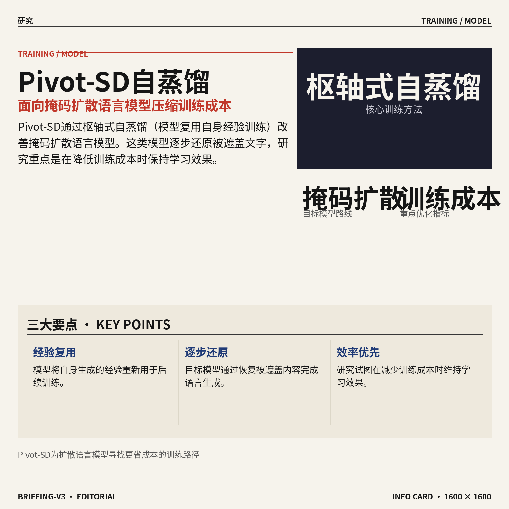

5. **《Pivot-SD》（枢轴式自蒸馏）探索如何更高效地训练掩码扩散语言模型。**  
论文标题中的**自蒸馏**（模型把自己产生的经验重新用于训练，像复盘后继续提升）是核心思路之一。**掩码扩散语言模型**（先遮住部分文字，再逐步还原内容的语言模型）与常见的逐字生成方式不同，训练和生成过程有自己的效率挑战。该研究关注的是如何让这类模型在减少训练成本的同时保持学习效果，可能为新型语言模型的训练提供思路 ⚙️。[论文页面(briefing)](https://huggingface.co/papers/2610.03665)

![《Pivot-SD》（枢轴式自蒸馏）探索如何更高效地训练掩码扩散语言模型](https://image.pollinations.ai/prompt/%E3%80%8APivot-SD%E3%80%8B%EF%BC%88%E6%9E%A2%E8%BD%B4%E5%BC%8F%E8%87%AA%E8%92%B8%E9%A6%8F%EF%BC%89%E6%8E%A2%E7%B4%A2%E5%A6%82%E4%BD%95%E6%9B%B4%E9%AB%98%E6%95%88%E5%9C%B0%E8%AE%AD%E7%BB%83%E6%8E%A9%E7%A0%81%E6%89%A9%E6%95%A3%E8%AF%AD%E8%A8%80%E6%A8%A1%E5%9E%8B.%20%E3%80%8APivot-SD%E3%80%8B%EF%BC%88%E6%9E%A2%E8%BD%B4%E5%BC%8F%E8%87%AA%E8%92%B8%E9%A6%8F%EF%BC%89%E6%8E%A2%E7%B4%A2%E5%A6%82%E4%BD%95%E6%9B%B4%E9%AB%98%E6%95%88%E5%9C%B0%E8%AE%AD%E7%BB%83%E6%8E%A9%E7%A0%81%E6%89%A9%E6%95%A3%E8%AF%AD%E8%A8%80%E6%A8%A1%E5%9E%8B%E3%80%82%20%E8%AE%BA%E6%96%87%E6%A0%87%E9%A2%98%E4%B8%AD%E7%9A%84%E8%87%AA%E8%92%B8%E9%A6%8F%EF%BC%88%E6%A8%A1%E5%9E%8B%E6%8A%8A%E8%87%AA%E5%B7%B1%E4%BA%A7%E7%94%9F%E7%9A%84%E7%BB%8F%E9%AA%8C%E9%87%8D%E6%96%B0%E7%94%A8%E4%BA%8E%E8%AE%AD%E7%BB%83%EF%BC%8C%E5%83%8F%E5%A4%8D%E7%9B%98%E5%90%8E%E7%BB%A7%E7%BB%AD%E6%8F%90%E5%8D%87%EF%BC%89%E6%98%AF%E6%A0%B8%E5%BF%83%E6%80%9D%E8%B7%AF%E4%B9%8B%2C%20technical%20infographic%20diagram%2C%20architecture%20flowchart%2C%20clean%20vector%20illustration%2C%20educational%20style%2C%20no%20text%20overlay%2C%20modern%20minimal%2C%20wide%20aspect?width=1200&height=675&nologo=true&seed=10931)

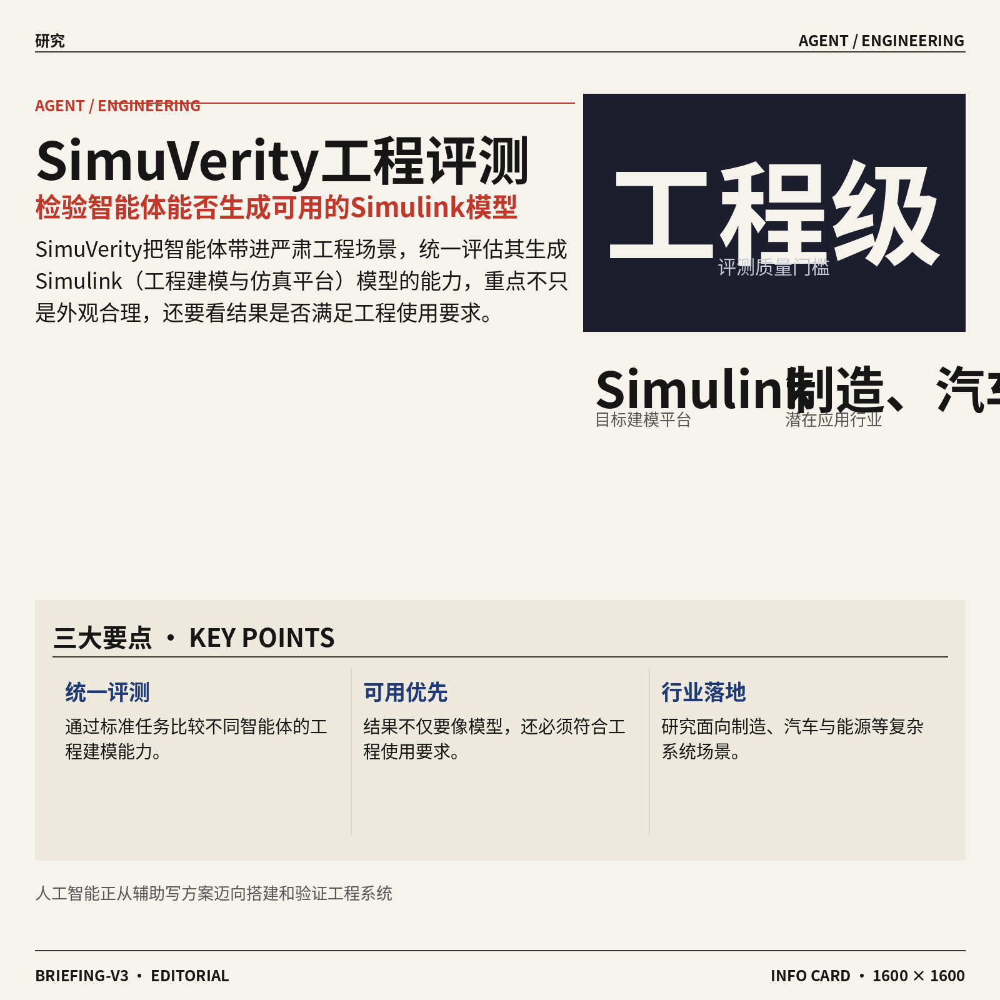

6. **《SimuVerity》（工程级 Simulink 模型生成智能体评测）检验人工智能能否完成严肃工程建模。**  
这项研究建立了一个**基准测试**（统一评估不同系统表现的测试集），用来衡量智能体生成 **Simulink（用于工程系统建模与仿真的软件平台）** 模型的能力。这里的“工程级”意味着，评估重点不只是模型能不能生成一个看起来像样的结果，还要关注其是否符合工程使用要求。对制造、汽车、能源等行业来说，这类研究直接关系到人工智能能否从“辅助写方案”进一步走向“辅助搭建和验证复杂系统” 🚗。[论文页面(briefing)](https://huggingface.co/papers/2610.02304)

![《SimuVerity》（工程级 Simulink 模型生成智能体评测）检验人工智能能否完成严肃工程建模](https://image.pollinations.ai/prompt/%E3%80%8ASimuVerity%E3%80%8B%EF%BC%88%E5%B7%A5%E7%A8%8B%E7%BA%A7%20Simulink%20%E6%A8%A1%E5%9E%8B%E7%94%9F%E6%88%90%E6%99%BA%E8%83%BD%E4%BD%93%E8%AF%84%E6%B5%8B%EF%BC%89%E6%A3%80%E9%AA%8C%E4%BA%BA%E5%B7%A5%E6%99%BA%E8%83%BD%E8%83%BD%E5%90%A6%E5%AE%8C%E6%88%90%E4%B8%A5%E8%82%83%E5%B7%A5%E7%A8%8B%E5%BB%BA%E6%A8%A1.%20%E3%80%8ASimuVerity%E3%80%8B%EF%BC%88%E5%B7%A5%E7%A8%8B%E7%BA%A7%20Simulink%20%E6%A8%A1%E5%9E%8B%E7%94%9F%E6%88%90%E6%99%BA%E8%83%BD%E4%BD%93%E8%AF%84%E6%B5%8B%EF%BC%89%E6%A3%80%E9%AA%8C%E4%BA%BA%E5%B7%A5%E6%99%BA%E8%83%BD%E8%83%BD%E5%90%A6%E5%AE%8C%E6%88%90%E4%B8%A5%E8%82%83%E5%B7%A5%E7%A8%8B%E5%BB%BA%E6%A8%A1%E3%80%82%20%E8%BF%99%E9%A1%B9%E7%A0%94%E7%A9%B6%E5%BB%BA%E7%AB%8B%E4%BA%86%E4%B8%80%E4%B8%AA%E5%9F%BA%E5%87%86%E6%B5%8B%E8%AF%95%EF%BC%88%E7%BB%9F%E4%B8%80%E8%AF%84%E4%BC%B0%E4%B8%8D%E5%90%8C%E7%B3%BB%E7%BB%9F%E8%A1%A8%E7%8E%B0%E7%9A%84%E6%B5%8B%2C%20technical%20infographic%20diagram%2C%20architecture%20flowchart%2C%20clean%20vector%20illustration%2C%20educational%20style%2C%20no%20text%20overlay%2C%20modern%20minimal%2C%20wide%20aspect?width=1200&height=675&nologo=true&seed=10962)

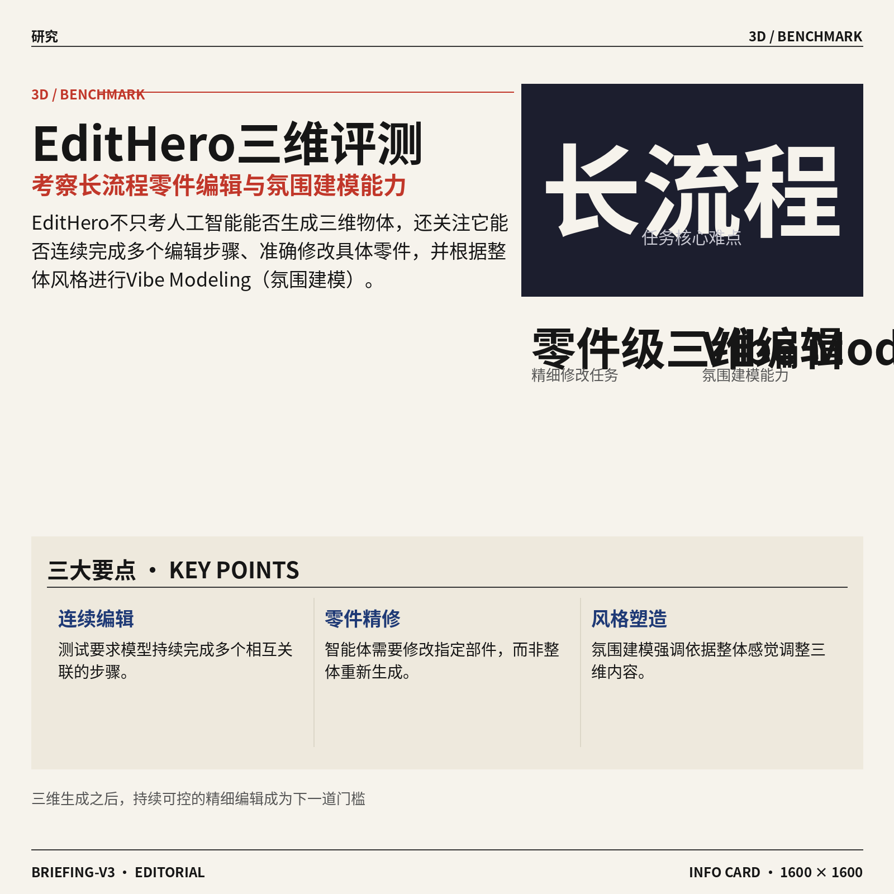

7. **《EditHero》（英雄级编辑基准）聚焦长流程零件级三维编辑与“氛围建模”。**  
这篇论文提出的**基准测试**（用标准化任务比较人工智能编辑能力）面向**长时程任务**，也就是需要连续完成多个步骤、不能只看一次修改结果的任务。它还关注**零件级三维编辑**（只修改三维物体中的具体部件，而不是整体重做）以及 **Vibe Modeling（氛围建模，根据整体风格和感觉塑造三维内容）**。这对设计、工业建模和内容制作团队尤其有参考价值：未来评价人工智能，不仅要看“能不能生成”，还要看“能不能按要求持续修改” 🎨。[论文页面(briefing)](https://huggingface.co/papers/2610.02298)

![《EditHero》（英雄级编辑基准）聚焦长流程零件级三维编辑与“氛围建模”](https://image.pollinations.ai/prompt/%E3%80%8AEditHero%E3%80%8B%EF%BC%88%E8%8B%B1%E9%9B%84%E7%BA%A7%E7%BC%96%E8%BE%91%E5%9F%BA%E5%87%86%EF%BC%89%E8%81%9A%E7%84%A6%E9%95%BF%E6%B5%81%E7%A8%8B%E9%9B%B6%E4%BB%B6%E7%BA%A7%E4%B8%89%E7%BB%B4%E7%BC%96%E8%BE%91%E4%B8%8E%E2%80%9C%E6%B0%9B%E5%9B%B4%E5%BB%BA%E6%A8%A1%E2%80%9D.%20%E3%80%8AEditHero%E3%80%8B%EF%BC%88%E8%8B%B1%E9%9B%84%E7%BA%A7%E7%BC%96%E8%BE%91%E5%9F%BA%E5%87%86%EF%BC%89%E8%81%9A%E7%84%A6%E9%95%BF%E6%B5%81%E7%A8%8B%E9%9B%B6%E4%BB%B6%E7%BA%A7%E4%B8%89%E7%BB%B4%E7%BC%96%E8%BE%91%E4%B8%8E%E2%80%9C%E6%B0%9B%E5%9B%B4%E5%BB%BA%E6%A8%A1%E2%80%9D%E3%80%82%20%E8%BF%99%E7%AF%87%E8%AE%BA%E6%96%87%E6%8F%90%E5%87%BA%E7%9A%84%E5%9F%BA%E5%87%86%E6%B5%8B%E8%AF%95%EF%BC%88%E7%94%A8%E6%A0%87%E5%87%86%E5%8C%96%E4%BB%BB%E5%8A%A1%E6%AF%94%E8%BE%83%E4%BA%BA%E5%B7%A5%E6%99%BA%E8%83%BD%E7%BC%96%E8%BE%91%E8%83%BD%E5%8A%9B%EF%BC%89%E9%9D%A2%E5%90%91%E9%95%BF%E6%97%B6%E7%A8%8B%E4%BB%BB%E5%8A%A1%EF%BC%8C%E4%B9%9F%E5%B0%B1%E6%98%AF%2C%20technical%20infographic%20diagram%2C%20architecture%20flowchart%2C%20clean%20vector%20illustration%2C%20educational%20style%2C%20no%20text%20overlay%2C%20modern%20minimal%2C%20wide%20aspect?width=1200&height=675&nologo=true&seed=10993)

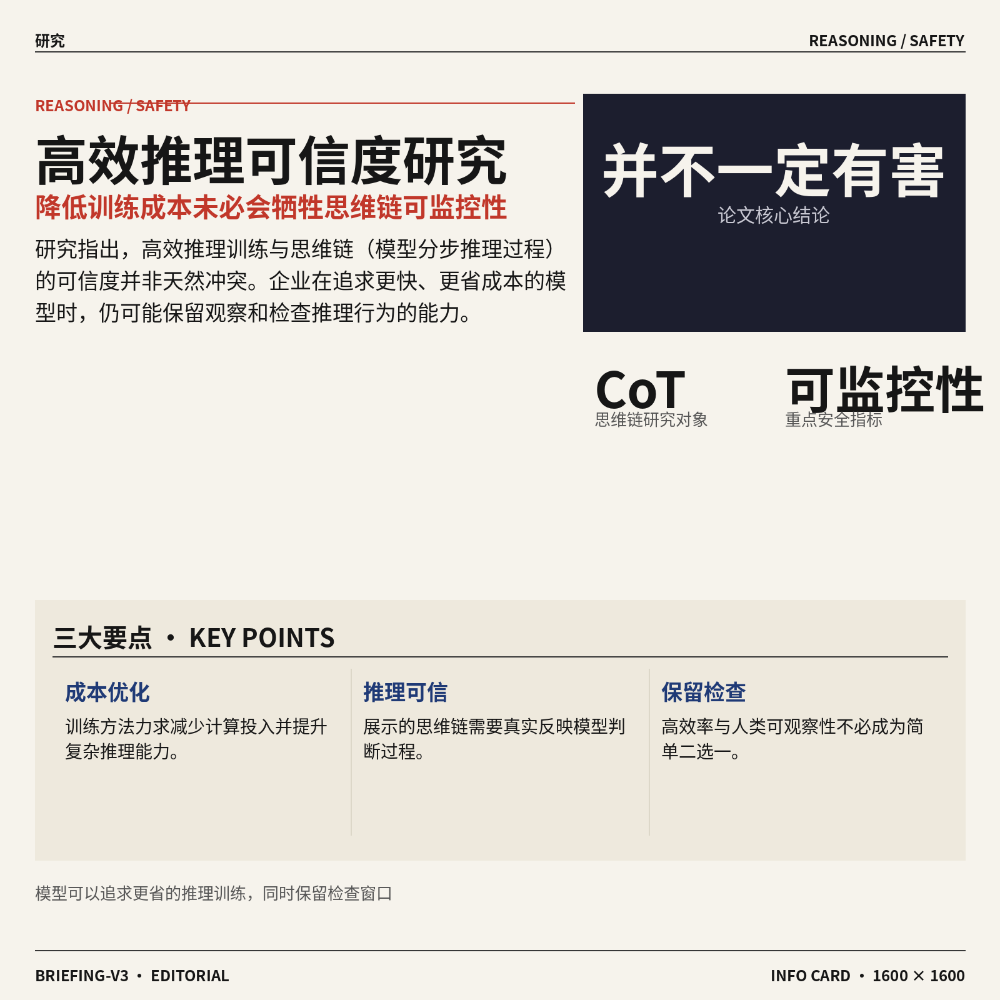

8. **研究显示，高效推理训练并不一定会损害思维链的可信度与可监控性。**  
这里的**高效推理训练**，指的是在尽量减少训练或计算成本的同时，提升模型解决复杂问题的能力。**CoT（思维链，即模型解决问题时展示或保留的分步推理过程）可信度**关注模型说出的推理是否真正反映了它的判断过程；**可监控性**则是指人类能否观察和检查模型的推理行为。论文标题强调“并不总是有害”，说明两者之间并非简单的二选一关系，为企业在追求更快、更省成本的模型时保留检查能力提供了一个值得关注的研究方向 🔍。[论文页面(briefing)](https://huggingface.co/papers/2610.03509)

![研究显示，高效推理训练并不一定会损害思维链的可信度与可监控性](https://image.pollinations.ai/prompt/%E7%A0%94%E7%A9%B6%E6%98%BE%E7%A4%BA%EF%BC%8C%E9%AB%98%E6%95%88%E6%8E%A8%E7%90%86%E8%AE%AD%E7%BB%83%E5%B9%B6%E4%B8%8D%E4%B8%80%E5%AE%9A%E4%BC%9A%E6%8D%9F%E5%AE%B3%E6%80%9D%E7%BB%B4%E9%93%BE%E7%9A%84%E5%8F%AF%E4%BF%A1%E5%BA%A6%E4%B8%8E%E5%8F%AF%E7%9B%91%E6%8E%A7%E6%80%A7.%20%E7%A0%94%E7%A9%B6%E6%98%BE%E7%A4%BA%EF%BC%8C%E9%AB%98%E6%95%88%E6%8E%A8%E7%90%86%E8%AE%AD%E7%BB%83%E5%B9%B6%E4%B8%8D%E4%B8%80%E5%AE%9A%E4%BC%9A%E6%8D%9F%E5%AE%B3%E6%80%9D%E7%BB%B4%E9%93%BE%E7%9A%84%E5%8F%AF%E4%BF%A1%E5%BA%A6%E4%B8%8E%E5%8F%AF%E7%9B%91%E6%8E%A7%E6%80%A7%E3%80%82%20%E8%BF%99%E9%87%8C%E7%9A%84%E9%AB%98%E6%95%88%E6%8E%A8%E7%90%86%E8%AE%AD%E7%BB%83%EF%BC%8C%E6%8C%87%E7%9A%84%E6%98%AF%E5%9C%A8%E5%B0%BD%E9%87%8F%E5%87%8F%E5%B0%91%E8%AE%AD%E7%BB%83%E6%88%96%E8%AE%A1%E7%AE%97%E6%88%90%E6%9C%AC%E7%9A%84%E5%90%8C%E6%97%B6%EF%BC%8C%E6%8F%90%E5%8D%87%E6%A8%A1%E5%9E%8B%E8%A7%A3%E5%86%B3%E5%A4%8D%E6%9D%82%E9%97%AE%E9%A2%98%E7%9A%84%E8%83%BD%E5%8A%9B%E3%80%82CoT%EF%BC%88%E6%80%9D%2C%20technical%20infographic%20diagram%2C%20architecture%20flowchart%2C%20clean%20vector%20illustration%2C%20educational%20style%2C%20no%20text%20overlay%2C%20modern%20minimal%2C%20wide%20aspect?width=1200&height=675&nologo=true&seed=11024)

### 🟡 行业展望与社会影响

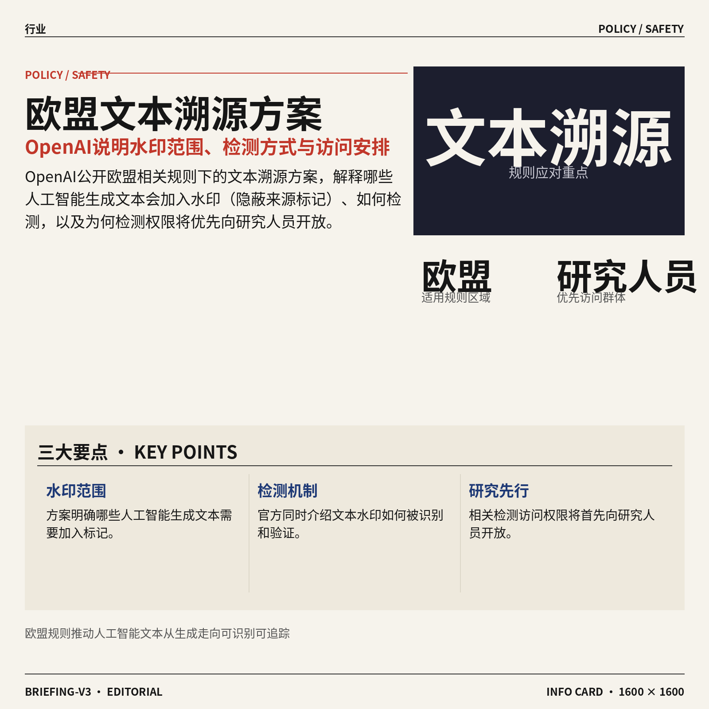

1. **OpenAI 公开欧盟文本溯源规则应对方案。**  
OpenAI 说明了在欧盟相关规则下，哪些文本会加入**水印**（嵌入内容中的隐蔽标记，用来帮助判断文本是否由人工智能生成）。文章还介绍了水印如何被检测，以及为什么相关访问权限会先面向研究人员开放。这个安排意味着，未来人工智能生成内容的来源识别，可能会更多依赖统一的**文本溯源**（追踪内容从哪里生成、经过哪些处理的记录机制）。[OpenAI官方说明(briefing)](https://openai.com/index/eu-text-provenance)


2. **调查显示，多数美国人希望人工智能发展放慢，甚至完全停止。**  
一项新的**民意调查**（通过收集公众意见来了解社会态度的研究）显示，多数美国受访者希望人工智能的发展速度降低，甚至主张暂时停止。这个结果反映出，公众对人工智能带来的就业、隐私和社会变化仍存在明显担忧。对企业来说，技术推广除了看产品能力，也越来越需要回应员工、客户和监管机构的接受程度。🚦 [美国民调报道(briefing)](https://the-decoder.com/most-americans-want-ai-development-to-slow-down-or-stop-entirely-new-poll-finds/)


3. **麻省理工学院报告：人工智能正在削弱师生交流与信任。**  
麻省理工学院的一份报告指出，人工智能正在影响教师答疑时间、学生学习小组以及师生之间的信任关系。这里的**生成式人工智能**（能够根据指令生成文字、答案或其他内容的人工智能）虽然可以帮助学生完成学习任务，但也可能减少面对面的讨论和求助。对教育机构而言，真正的挑战不只是要不要使用人工智能，还包括如何保留老师指导、同伴协作和真实反馈这些学习环节。🎓 [麻省理工报告报道(briefing)](https://the-decoder.com/ai-is-eroding-office-hours-study-groups-and-the-trust-between-faculty-and-students-mit-report-finds/)

![麻省理工学院报告：人工智能正在削弱师生交流与信任](https://image.pollinations.ai/prompt/%E9%BA%BB%E7%9C%81%E7%90%86%E5%B7%A5%E5%AD%A6%E9%99%A2%E6%8A%A5%E5%91%8A%EF%BC%9A%E4%BA%BA%E5%B7%A5%E6%99%BA%E8%83%BD%E6%AD%A3%E5%9C%A8%E5%89%8A%E5%BC%B1%E5%B8%88%E7%94%9F%E4%BA%A4%E6%B5%81%E4%B8%8E%E4%BF%A1%E4%BB%BB.%20%E9%BA%BB%E7%9C%81%E7%90%86%E5%B7%A5%E5%AD%A6%E9%99%A2%E6%8A%A5%E5%91%8A%EF%BC%9A%E4%BA%BA%E5%B7%A5%E6%99%BA%E8%83%BD%E6%AD%A3%E5%9C%A8%E5%89%8A%E5%BC%B1%E5%B8%88%E7%94%9F%E4%BA%A4%E6%B5%81%E4%B8%8E%E4%BF%A1%E4%BB%BB%E3%80%82%20%E9%BA%BB%E7%9C%81%E7%90%86%E5%B7%A5%E5%AD%A6%E9%99%A2%E7%9A%84%E4%B8%80%E4%BB%BD%E6%8A%A5%E5%91%8A%E6%8C%87%E5%87%BA%EF%BC%8C%E4%BA%BA%E5%B7%A5%E6%99%BA%E8%83%BD%E6%AD%A3%E5%9C%A8%E5%BD%B1%E5%93%8D%E6%95%99%E5%B8%88%E7%AD%94%E7%96%91%E6%97%B6%E9%97%B4%E3%80%81%E5%AD%A6%E7%94%9F%E5%AD%A6%E4%B9%A0%E5%B0%8F%E7%BB%84%E4%BB%A5%E5%8F%8A%E5%B8%88%E7%94%9F%E4%B9%8B%E9%97%B4%E7%9A%84%E4%BF%A1%E4%BB%BB%E5%85%B3%E7%B3%BB%E3%80%82%E8%BF%99%E9%87%8C%E7%9A%84%E7%94%9F%E6%88%90%E5%BC%8F%E4%BA%BA%2C%20technical%20infographic%20diagram%2C%20architecture%20flowchart%2C%20clean%20vector%20illustration%2C%20educational%20style%2C%20no%20text%20overlay%2C%20modern%20minimal%2C%20wide%20aspect?width=1200&height=675&nologo=true&seed=10869)

4. **Meta 和 Microsoft 逐渐减少对 Claude 的依赖，Anthropic 转向竞争对手。**  
报道关注 Meta、Microsoft 与 Claude 的合作关系变化，以及 Anthropic 从合作伙伴逐渐转变为竞争者的趋势。Claude 属于**大模型**（通过大量数据训练、能够理解和生成多种内容的人工智能模型），而 Anthropic 则是提供这类模型的**模型供应商**（向企业和开发者提供人工智能能力的公司）。这说明人工智能行业的合作关系并不固定：今天的技术伙伴，也可能因为产品能力和商业边界变化，成为明天的直接竞争者。🔄 [行业关系变化报道(briefing)](https://the-decoder.com/meta-and-microsoft-pull-back-from-claude-as-anthropic-transforms-from-partner-into-competitor/)


5. **Reka AI（一家人工智能公司）推出 Rho-1（统一处理多种输入的模型）。**  
Reka AI 的 Rho-1 被描述为一种**全能模型**（把多种任务集中到同一个模型中处理），能够在同一套模型里处理文字、图片、视频，并控制机器人。过去企业往往需要为不同内容分别配置模型，如今这种方向试图把多种能力整合到一个系统中。对产品团队来说，统一模型可能带来更连贯的使用体验，但它也意味着模型需要同时理解不同类型的信息并执行实际动作。🤖 [Rho-1模型报道(briefing)](https://the-decoder.com/reka-ais-omni-model-rho-1-handles-text-images-video-and-robot-control-in-a-single-model/)

![Reka AI（一家人工智能公司）推出 Rho-1（统一处理多种输入的模型）](https://image.pollinations.ai/prompt/Reka%20AI%EF%BC%88%E4%B8%80%E5%AE%B6%E4%BA%BA%E5%B7%A5%E6%99%BA%E8%83%BD%E5%85%AC%E5%8F%B8%EF%BC%89%E6%8E%A8%E5%87%BA%20Rho-1%EF%BC%88%E7%BB%9F%E4%B8%80%E5%A4%84%E7%90%86%E5%A4%9A%E7%A7%8D%E8%BE%93%E5%85%A5%E7%9A%84%E6%A8%A1%E5%9E%8B%EF%BC%89.%20Reka%20AI%EF%BC%88%E4%B8%80%E5%AE%B6%E4%BA%BA%E5%B7%A5%E6%99%BA%E8%83%BD%E5%85%AC%E5%8F%B8%EF%BC%89%E6%8E%A8%E5%87%BA%20Rho-1%EF%BC%88%E7%BB%9F%E4%B8%80%E5%A4%84%E7%90%86%E5%A4%9A%E7%A7%8D%E8%BE%93%E5%85%A5%E7%9A%84%E6%A8%A1%E5%9E%8B%EF%BC%89%E3%80%82%20Reka%20AI%20%E7%9A%84%20Rho-1%20%E8%A2%AB%E6%8F%8F%E8%BF%B0%E4%B8%BA%E4%B8%80%E7%A7%8D%E5%85%A8%E8%83%BD%E6%A8%A1%E5%9E%8B%EF%BC%88%E6%8A%8A%E5%A4%9A%E7%A7%8D%E4%BB%BB%E5%8A%A1%E9%9B%86%E4%B8%AD%E5%88%B0%E5%90%8C%E4%B8%80%E4%B8%AA%E6%A8%A1%E5%9E%8B%2C%20technical%20infographic%20diagram%2C%20architecture%20flowchart%2C%20clean%20vector%20illustration%2C%20educational%20style%2C%20no%20text%20overlay%2C%20modern%20minimal%2C%20wide%20aspect?width=1200&height=675&nologo=true&seed=10931)

6. **ChatGPT 在图像生成等待界面加入商品轮播广告。**  
ChatGPT 的新广告形式，会在图像生成过程的等待界面展示商品轮播内容。这里的**商品轮播**（在同一位置依次展示多个商品卡片的广告形式）把用户等待结果的时间，转化成了商业展示机会。对人工智能产品来说，这也意味着广告可能不再只出现在传统搜索页或信息流中，而会进入具体的创作流程。🛍️ [ChatGPT广告报道(briefing)](https://the-decoder.com/chatgpts-new-ad-format-fills-the-image-generation-loading-screen-with-product-carousels/)

![ChatGPT 在图像生成等待界面加入商品轮播广告](https://image.pollinations.ai/prompt/ChatGPT%20%E5%9C%A8%E5%9B%BE%E5%83%8F%E7%94%9F%E6%88%90%E7%AD%89%E5%BE%85%E7%95%8C%E9%9D%A2%E5%8A%A0%E5%85%A5%E5%95%86%E5%93%81%E8%BD%AE%E6%92%AD%E5%B9%BF%E5%91%8A.%20ChatGPT%20%E5%9C%A8%E5%9B%BE%E5%83%8F%E7%94%9F%E6%88%90%E7%AD%89%E5%BE%85%E7%95%8C%E9%9D%A2%E5%8A%A0%E5%85%A5%E5%95%86%E5%93%81%E8%BD%AE%E6%92%AD%E5%B9%BF%E5%91%8A%E3%80%82%20ChatGPT%20%E7%9A%84%E6%96%B0%E5%B9%BF%E5%91%8A%E5%BD%A2%E5%BC%8F%EF%BC%8C%E4%BC%9A%E5%9C%A8%E5%9B%BE%E5%83%8F%E7%94%9F%E6%88%90%E8%BF%87%E7%A8%8B%E7%9A%84%E7%AD%89%E5%BE%85%E7%95%8C%E9%9D%A2%E5%B1%95%E7%A4%BA%E5%95%86%E5%93%81%E8%BD%AE%E6%92%AD%E5%86%85%E5%AE%B9%E3%80%82%E8%BF%99%E9%87%8C%E7%9A%84%E5%95%86%E5%93%81%E8%BD%AE%E6%92%AD%EF%BC%88%E5%9C%A8%E5%90%8C%E4%B8%80%E4%BD%8D%E7%BD%AE%E4%BE%9D%E6%AC%A1%E5%B1%95%2C%20technical%20infographic%20diagram%2C%20architecture%20flowchart%2C%20clean%20vector%20illustration%2C%20educational%20style%2C%20no%20text%20overlay%2C%20modern%20minimal%2C%20wide%20aspect?width=1200&height=675&nologo=true&seed=10962)

### 🟣 开源TOP项目

1. **tester-army/e2e（端到端测试框架，模拟用户完整操作流程）面向网页与移动应用测试。**  
这是一个面向 **网页和移动应用** 的新一代 **端到端测试（从用户开始操作到最终结果，完整验证整个流程）框架**。它的目标是帮助团队检查产品在真实使用路径下是否正常，而不只是单独测试某个功能。对于产品、运营和测试同事来说，这类工具更适合验证注册、下单、登录等完整业务流程是否顺畅 🚀。[GitHub 项目仓库(briefing)](https://github.com/tester-army/e2e)


2. **thedotmack/claude-mem（为 AI Agent 保存长期记忆的工具）让跨会话协作更连续。**  
这个开源项目会记录 AI Agent（能够自主执行一系列任务的智能助手）在每次会话中的操作，再用 AI 对信息进行压缩整理。之后，它会把与当前任务相关的内容重新注入新的会话，让助手不必每次都从零开始了解背景。简单说，它像是给 AI 配备了一本持续更新的工作日志，有助于保持长期任务的上下文（当前任务所需的背景信息）🧠。项目支持 Claude Code、Codex、Gemini、Hermes（一个 AI 助手项目）和 Copilot 等工具。[GitHub 项目仓库(briefing)](https://github.com/thedotmack/claude-mem)


### 🔴 社媒分享

1. **Apple 与 Hacker（黑客）未来。**  
这篇文章围绕 **Apple** 与 **Hacker（黑客，擅长发现或利用计算机系统漏洞的人）** 的未来关系展开讨论。标题没有透露具体结论，但显然把苹果生态、技术创新与黑客文化放在了一起观察。对关注科技行业的人来说，这类讨论有助于理解硬件平台、软件安全与个人创造力之间的张力。🔍 [原文文章页面(briefing)](https://stratechery.com/2026/apple-and-a-hackers-future/)


2. **Anthropic 的 IPO（首次公开募股）前瞻：这些关键数字值得关注。**  
Anthropic 在 IPO（首次公开募股，公司首次向公众出售股票）前，已经有一批关于**营收**和**巨额亏损**的数据被泄露。文章进一步整理了投资者在公司上市前需要了解的关键数字，帮助读者判断这家 AI 公司目前的商业规模与经营压力。IPO（首次公开募股）通常意味着企业要接受更严格的信息披露，营收增长与亏损控制也会成为市场重点观察对象。📊 [IPO 关键数据解读(briefing)](https://www.bigtechnology.com/p/the-key-anthropic-numbers-you-need)


3. **Anthropic 报告女性日记内容后，她面临重罪指控。**  
据标题，一名女性在日记中记录的内容被 Anthropic 报告给警方，随后她面临 **重罪指控**。这起事件把 AI 服务中的内容安全、隐私边界与企业是否应主动联系执法机构等问题推到了公众面前。**内容审核**（系统识别可能涉及违法或危险的信息）与**隐私保护**之间如何平衡，也可能成为类似产品必须面对的长期难题。⚖️ [事件完整报道(briefing)](https://www.techspot.com/news/114091-florida-woman-used-claude-diary-anthropic-reported-shoot.html)


4. **ChatGPT 正把真实漫画家的签名加到虚构的《纽约客》漫画上。**  
据报道，ChatGPT 正在生成带有真实漫画家签名的虚构《纽约客》漫画，引发了对**署名真实性**与**创作者权益**的关注。这里的核心问题不只是 AI 能不能模仿画风，还包括作品是否会让读者误以为得到了真人作者授权。**生成式 AI**（根据文字或其他指令自动创作内容）越接近真实创作者的表达方式，平台就越需要清楚标明内容来源与虚构属性。✍️ [漫画署名争议报道(briefing)](https://www.niemanlab.org/2026/10/chatgpt-is-adding-real-cartoonists-signatures-to-fake-new-yorker-cartoons/)

![ChatGPT 正把真实漫画家的签名加到虚构的《纽约客》漫画上](https://image.pollinations.ai/prompt/ChatGPT%20%E6%AD%A3%E6%8A%8A%E7%9C%9F%E5%AE%9E%E6%BC%AB%E7%94%BB%E5%AE%B6%E7%9A%84%E7%AD%BE%E5%90%8D%E5%8A%A0%E5%88%B0%E8%99%9A%E6%9E%84%E7%9A%84%E3%80%8A%E7%BA%BD%E7%BA%A6%E5%AE%A2%E3%80%8B%E6%BC%AB%E7%94%BB%E4%B8%8A.%20ChatGPT%20%E6%AD%A3%E6%8A%8A%E7%9C%9F%E5%AE%9E%E6%BC%AB%E7%94%BB%E5%AE%B6%E7%9A%84%E7%AD%BE%E5%90%8D%E5%8A%A0%E5%88%B0%E8%99%9A%E6%9E%84%E7%9A%84%E3%80%8A%E7%BA%BD%E7%BA%A6%E5%AE%A2%E3%80%8B%E6%BC%AB%E7%94%BB%E4%B8%8A%E3%80%82%20%E6%8D%AE%E6%8A%A5%E9%81%93%EF%BC%8CChatGPT%20%E6%AD%A3%E5%9C%A8%E7%94%9F%E6%88%90%E5%B8%A6%E6%9C%89%E7%9C%9F%E5%AE%9E%E6%BC%AB%E7%94%BB%E5%AE%B6%E7%AD%BE%E5%90%8D%E7%9A%84%E8%99%9A%E6%9E%84%E3%80%8A%E7%BA%BD%E7%BA%A6%E5%AE%A2%E3%80%8B%E6%BC%AB%E7%94%BB%EF%BC%8C%E5%BC%95%E5%8F%91%E4%BA%86%E5%AF%B9%E7%BD%B2%E5%90%8D%E7%9C%9F%E5%AE%9E%E6%80%A7%E4%B8%8E%E5%88%9B%2C%20technical%20infographic%20diagram%2C%20architecture%20flowchart%2C%20clean%20vector%20illustration%2C%20educational%20style%2C%20no%20text%20overlay%2C%20modern%20minimal%2C%20wide%20aspect?width=1200&height=675&nologo=true&seed=10706)

5. **Opus 5.5（执行科研任务的 AI 模型）发现两种室温磁性半导体候选材料。**  
据报道，Opus 5.5 的 **Agent（能够自行拆解任务并连续执行步骤的 AI 助手）** 发现了两种室温磁性半导体候选材料。**磁性半导体**（既能像半导体一样控制电流，又具备磁性，可用于探索新型电子器件的材料）是材料科学中的重要方向。这里的表述是“候选材料”，意味着它们仍属于待进一步验证的研究对象，并不等于已经完成商业化应用。🧪 [科研发现原始报道(briefing)](https://www.vals.ai/blogs/room-temperature-magnetic-semiconductors)


6. **Dust（不依赖反向传播训练模型的研究项目）探索 Transformer（主流大模型架构）的新训练方式。**  
Dust 研究的是如何在不使用 **Backpropagation（反向传播，让模型根据错误结果逐层调整参数的训练机制）** 的情况下，预训练 **Transformer（目前主流大模型采用的神经网络架构）**。传统大模型训练通常依赖反向传播来不断修正模型，因此这项工作关注的是能否换一种思路完成模型预训练。它更偏向底层研究，短期未必直接改变日常办公工具，但可能为未来降低训练限制、拓展模型训练方法提供新的讨论方向。⚙️ [研究项目原文(briefing)](https://qlabs.sh/research/dust)

![Dust（不依赖反向传播训练模型的研究项目）探索 Transformer（主流大模型架构）的新训练方式](https://image.pollinations.ai/prompt/Dust%EF%BC%88%E4%B8%8D%E4%BE%9D%E8%B5%96%E5%8F%8D%E5%90%91%E4%BC%A0%E6%92%AD%E8%AE%AD%E7%BB%83%E6%A8%A1%E5%9E%8B%E7%9A%84%E7%A0%94%E7%A9%B6%E9%A1%B9%E7%9B%AE%EF%BC%89%E6%8E%A2%E7%B4%A2%20Transformer%EF%BC%88%E4%B8%BB%E6%B5%81%E5%A4%A7%E6%A8%A1%E5%9E%8B%E6%9E%B6%E6%9E%84%EF%BC%89%E7%9A%84%E6%96%B0%E8%AE%AD%E7%BB%83%E6%96%B9%E5%BC%8F.%20Dust%EF%BC%88%E4%B8%8D%E4%BE%9D%E8%B5%96%E5%8F%8D%E5%90%91%E4%BC%A0%E6%92%AD%E8%AE%AD%E7%BB%83%E6%A8%A1%E5%9E%8B%E7%9A%84%E7%A0%94%E7%A9%B6%E9%A1%B9%E7%9B%AE%EF%BC%89%E6%8E%A2%E7%B4%A2%20Transformer%EF%BC%88%E4%B8%BB%E6%B5%81%E5%A4%A7%E6%A8%A1%E5%9E%8B%E6%9E%B6%E6%9E%84%EF%BC%89%E7%9A%84%E6%96%B0%E8%AE%AD%E7%BB%83%E6%96%B9%E5%BC%8F%E3%80%82%20Dust%20%E7%A0%94%E7%A9%B6%E7%9A%84%E6%98%AF%E5%A6%82%E4%BD%95%E5%9C%A8%E4%B8%8D%E4%BD%BF%E7%94%A8%20Backpropaga%2C%20technical%20infographic%20diagram%2C%20architecture%20flowchart%2C%20clean%20vector%20illustration%2C%20educational%20style%2C%20no%20text%20overlay%2C%20modern%20minimal%2C%20wide%20aspect?width=1200&height=675&nologo=true&seed=10768)

---

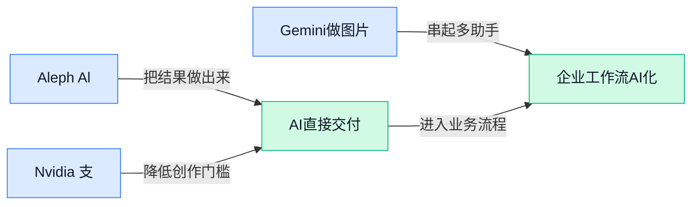

### 📊 行业洞察（今日 3 条）

1. Reflection发布Beam，一款501B开放权重模型（核心参数可供外部使用）。
   【洞察】竞争正转向自主定制，因其支持自有数据，但成本与效果仍待验证。

2. OpenAI测试视觉广告，将其与图片生成结果并排展示。
   【洞察】创作界面正成为商业入口，因为广告更贴近创作意图，但可能干扰体验。

3. OpenAI公开欧盟文本水印方案（水印指嵌入文字中的隐蔽标记）。
   【洞察】来源标记将成基础能力，因规则重视透明度，但误判风险仍然存在。

### 💭 对我们的启发（今日 3 条）

1. 借鉴Rho-1统一处理文字、图片与视频，剪辑软件可衔接脚本理解和素材编辑；机会是减少工具切换，风险是单模型失误影响全片。

2. OpenAI把视觉广告放到图片生成结果旁，内容工具可探索创作内商业展示；机会是增加收入，风险是打断剪辑专注并削弱用户信任。

3. 递归自我改写（反复修订中间方案）可用于粗剪复审；机会是减少人工返工，风险是多次修改后偏离创作者最初意图。

